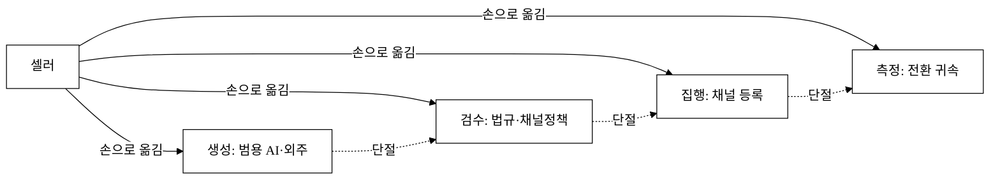
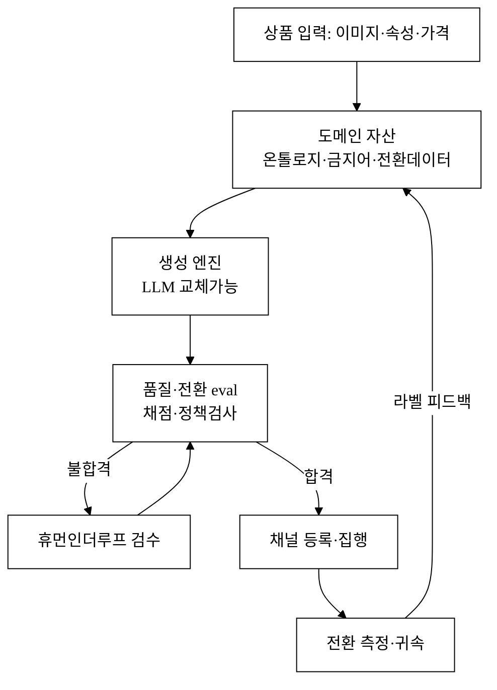
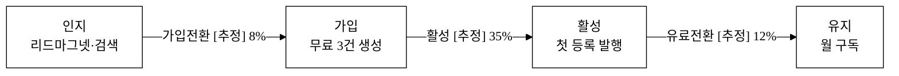
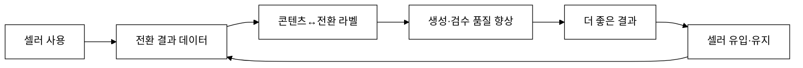

last_updated: 2026-06-25 14:10

# 셀러스튜디오 — 커머스 AI 콘텐츠 생성·검수·집행 스튜디오 사업계획서

> `CLAUDE.md` §2.1 규약대로 채운다. 그림자료는 **논문형 순수 흑백**(§2.0·그림자료_규약.md). 팀 관련은 `<TODO: 사용자 입력>`.
> 본 제안서는 **AI 제품의 'API 래퍼' 금지 규칙(§2.1, 2026-06-25)** 을 정면으로 다룬다 — 모델 호출 위에 쌓은 독자 레이어(데이터·워크플로·eval)를 차별성·구매동인·Moat 전반에서 논증한다.

| 항목 | 내용 |
|:---|:---|
| 사업명 | 대구대학교 창업지원단 실전창업 (창업동아리 지원) |
| 주관기관 | 대구대학교 창업지원단 (2026년 창업중심대학 X RISE 사업단) |
| 트랙 | 실전창업형 창업동아리 |
| 지원금 | 300만 원 ~ 1,000만 원 |
| 모집기간 | 2026-03-19 ~ 2026-04-02 |
| 아이템 | 커머스 셀러용 AI 콘텐츠 생성·품질검수·채널집행 스튜디오 (셀러스튜디오) |
| 타깃 고객 | 국내 온라인 쇼핑몰·오픈마켓·스마트스토어 1인~소형 셀러(상품 50~5,000 SKU) |

> 위 머리표 중 사업명·주관기관·트랙·지원금·모집기간은 공고 PDF([`../../ref-startup-club-notice.pdf`](../../ref-startup-club-notice.pdf))에 명시된 *사실*이다(창작 아님). 그 외 한도·자격은 공고에 없는 한 추정하지 않는다.

---

## 1. Problem (문제)

### 1.1 한 문장 정의

**온라인 셀러는 상품 하나를 "팔리는 상태"로 만들기까지 — 상세페이지 카피, 옵션·키워드, 썸네일 문구, 광고 소재, A/B 변형 — 수십 단계의 콘텐츠 작업을 반복하지만, 이 작업은 (a) 시간을 잡아먹고 (b) 채널 정책 위반·과장광고 리스크를 안고 (c) 무엇이 전환을 일으켰는지 측정되지 않는다.**

### 1.2 시장의 규모와 통증

국내 온라인쇼핑 거래액은 연 **240조 원 규모**로 성장했고[^1], 그 거래의 다수가 네이버 스마트스토어·쿠팡·11번가 등 오픈마켓 셀러를 통해 발생한다. 스마트스토어 누적 판매자는 **수십만 명 규모**로 보고된다[^2]. 이들 대부분은 **마케팅·카피 전담 인력이 없는 1인~소형 사업자**다.

셀러의 콘텐츠 노동은 세 통증으로 압축된다.

1. **반복 생산 부하** — 신상품 1건당 상세페이지·옵션명·태그·광고문구·SNS 소재를 매번 새로 쓴다. 시즌·프로모션마다 전량 갱신한다. 상품 수가 늘수록 선형으로 증가한다.
2. **규제·정책 리스크** — 표시·광고법상 부당광고(최상급·치료 표현·근거 없는 비교)는 **시정명령·과징금** 대상이다[^3]. 식품·화장품·건강기능식품은 부당 표시·광고 시 영업정지·형사처벌까지 이어진다[^4]. 채널별 등록 정책(금지어·이미지 규격) 위반은 노출 제한·판매중지로 직결된다. 소형 셀러는 이를 **수작업 눈검수**로만 막는다.
3. **측정 부재** — 어떤 카피·썸네일·키워드가 실제 전환을 올렸는지 셀러는 모른다. 광고비는 ROAS로 사후 집계되지만 *콘텐츠 단위*의 기여는 추적되지 않는다.

### 1.3 기존 대안의 한계

| 대안 | 무엇을 해결 | 남는 통증 |
|:---|:---|:---|
| 범용 생성형 챗봇(ChatGPT 등) | 카피 초안 빠르게 | 채널 규격·금지어·법규 모름 / 등록·집행·측정 안 됨 / 매번 프롬프트 재작성 |
| 외주 카피라이터·대행사 | 품질 | 건당 수만~수십만 원, 신상품마다 발생, 느림 |
| 채널 자체 에디터(스마트스토어 등) | 등록 | 생성·검수·변형·측정 없음 |
| 엑셀·메모 수기 관리 | 무료 | 전부 수작업, 리스크·측정 사각 |

→ **생성(범용 AI)·검수(법무/정책)·집행(채널 등록)·측정(전환 귀속)이 네 갈래로 흩어져 있고, 그 사이를 셀러가 손으로 잇는다.** 이 '잇는 노동'이 본 사업이 정조준하는 문제다(그림 1).

**그림 1.** 현재 셀러 콘텐츠 워크플로 — 4개 작업이 분절되어 셀러의 수작업으로만 연결된다.

---

## 2. Solution (솔루션)

### 2.1 정의

**셀러스튜디오는 "상품 입력 → 콘텐츠 생성 → 규제·정책 자동검수 → 채널 등록 → 전환 측정 → 재학습"을 하나의 워크플로로 잇는 버티컬 AI 스튜디오다.** 핵심은 *생성 모델 그 자체*가 아니라 그 위·옆에 쌓은 **커머스 도메인 레이어**다(그림 2).

### 2.2 4개 레이어 (①③④가 해자, ②는 교체가능)

| 레이어 | 내용 | 해자 여부 |
|:---|:---|:---:|
| ① 도메인 자산 | 채널별 등록 규격·금지어 사전, 카테고리 온톨로지, 표시·광고법 규칙셋, 전환 라벨 데이터 | **해자** |
| ② 생성 엔진 | 카피·태그·소재 초안 생성 (기반 LLM — **상품화 전제, 교체가능**) | 비해자 |
| ③ 품질·전환 eval 레이어 | 생성물 채점(가독성·금지어·정책 적합·과거 전환 유사도), 휴먼인더루프 검수 큐 | **해자** |
| ④ 집행·측정 루프 | 채널 등록 변환·전환 귀속(어트리뷰션)·재학습 피드백 | **해자** |

**그림 2.** 셀러스튜디오 4-레이어 아키텍처 — LLM(②)은 교체가능한 부품, ①③④가 데이터·워크플로 해자를 형성하고 ATTR→D1 피드백 루프가 데이터 네트워크 효과를 만든다.

### 2.3 사용자 여정 (한 상품 등록 4단계 워크플로)

1. **입력** — 상품 사진·속성(카테고리·가격·옵션) 업로드.
2. **생성·검수** — 카피/태그/소재 초안 자동 생성 → eval 레이어가 금지어·정책·가독성 채점, 위반은 플래그로 표시 → 셀러가 검수 큐에서 승인/수정.
3. **집행** — 승인본을 채널 등록 형식으로 변환·발행(데모는 등록 페이로드·발송 로그 생성).
4. **측정** — 등록 후 전환을 콘텐츠 변형 단위로 귀속, 다음 생성에 라벨로 환류.

> 데모 앱(`projects/`)은 이 4단계를 실제로 구현·시연한다. **단, 데모의 "AI 생성·채점"은 결정론적 룰·템플릿·사전 매칭 엔진(LLM 아님)** 이다 — [§데이터 정직성 선언](#참고문헌) 및 [§구매동인 ⑤](#차별화-기술의-구매동인-논증) 참조. 데모는 *실제 독자 엔진(①③④ 레이어)이 무엇을 대체하는지*를 가리키는 골격이다.

---

## 경영혁신·창업학적 프레임워크

본 사업은 **세 가지 이론으로 정당화**된다.

### (1) Christensen 파괴적 혁신 — '저가·미충족' 진입

대행사·전문 카피라이터 시장은 *고가·고품질*을 다툰다. 소형 셀러는 그 시장에서 **과소 서비스(under-served)** 받는 비소비자(non-consumer)다 — 외주를 쓸 여력이 없어 손으로 때운다. 셀러스튜디오는 *"충분히 좋은 품질을 1/10 비용·1/20 시간에"* 제공해 **로엔드(low-end) + 신시장(new-market) 파괴**의 전형적 진입점을 차지한다[^5]. 채널·법규 검수까지 묶어 시간이 지나며 상향 이동한다.

### (2) JTBD (Jobs To Be Done) — "내 상품이 팔리는 상태가 되게 해줘"

셀러가 고용하는 '일(Job)'은 *"카피를 써줘"* 가 아니라 *"이 상품을 등록 가능·정책 안전·전환되는 상태로 만들어줘"* 다[^7]. 범용 챗봇은 첫 단계(초안)만 해결하고 등록·검수·측정은 셀러에게 되던진다. 셀러스튜디오는 **Job 전체를 끝까지** 수행한다 — JTBD의 "더 나은 채용 기준"을 *전 과정 완결*로 잡는다.

### (3) 블루오션 (Kim·Mauborgne) — ERRC 재구성

- **제거(Eliminate)**: 프롬프트 반복 재작성, 채널 규격 수기 확인.
- **감소(Reduce)**: 외주 의존, 법규 검토 시간.
- **증가(Raise)**: 정책 안전성, 등록 속도, 전환 측정 가시성.
- **창조(Create)**: *콘텐츠 단위 전환 귀속 + 자동 정책 검수*라는 신가치 곡선[^6].

→ 범용 생성형(가격·기능경쟁)과 대행사(고가·노동집약) 사이의 **비경쟁 공간**을 연다.

> 보조 프레임워크: 본 데이터 피드백 루프는 Ries **린 스타트업**의 측정→학습 루프[^8]와, ①③④ 레이어 축적은 **자원기반관점(RBV)** 의 VRIN(가치·희소·모방난·대체난) 자원 형성[^9]에 대응한다. 수익 구조는 **비즈니스 모델 캔버스**[^10]로 정리된다.

---

## 고객확보(GTM)

### ① ICP (Ideal Customer Profile)

| 축 | 1차 ICP | 2차 ICP |
|:---|:---|:---|
| 규모 | 월매출 500만~5,000만 원 1인 셀러 | 직원 2~10인 소형 D2C 브랜드 |
| SKU | 50~1,000 | 1,000~5,000 |
| 채널 | 스마트스토어·쿠팡 중심 | 자사몰 + 멀티채널 |
| 통증 | 콘텐츠 노동 시간 부족 | 정책 리스크·일관성 |
| 지불의사 | 시간 환산 민감 | 리스크·브랜드 환산 |

### ② 획득 채널 전술

| 채널 | 유형 | 전술 | 비용성격 |
|:---|:---|:---|:---|
| 셀러 카페·밴드·오픈채팅 | 오가닉 | 무료 "상세페이지 금지어 진단" 리드마그넷 배포 | 저 |
| 유튜브 셀러 인플루언서 제휴 | 제휴 | 실사용 리뷰·제휴코드 | 중 |
| 네이버 검색광고 | 유료 | "상세페이지 자동", "스마트스토어 카피" 키워드 | 중~고 |
| 셀러 교육기관·창업보육 제휴 | 제휴 | 강의 번들·기관 단가 | 저 |
| 채널 앱스토어 입점(향후) | 제휴 | 스토어 내 노출 | 저 |

### ③ 퍼널 (인지→가입→활성→유지)

**그림 3.** 획득 퍼널 — 전환율은 모두 `[추정]` 가설이며 베타에서 실측 검증한다(§구매동인 ④).

### ④ 초기 트랙션 계획

- **첫 100명**: 셀러 커뮤니티 3~5곳에 "금지어·과장광고 무료 진단" 리드마그넷 → 진단 결과에서 자연 전환. 진단 자체가 §검수 레이어 데모.
- **첫 1,000명**: 유튜브 셀러 채널 2~3곳 제휴 + 검색광고 소액 집행 + 교육기관 1곳 번들.
- **CAC 가설**: 오가닉 혼합 기준 **[추정] 1.5만~3만 원/유료가입**. 검색광고 단독은 더 높게 잡는다.

### ⑤ 리텐션 가설

콘텐츠는 *상품을 추가·갱신할 때마다 재발생*하는 반복 Job이므로, 첫 등록 성공(아하 모먼트)을 넘긴 셀러는 신상품마다 재방문한다. **전환 측정 데이터가 쌓일수록 생성 품질이 올라가 이탈비용이 커진다**(§Moat 데이터 네트워크 효과). 목표 월 유지율 **[추정] 85%+**.

---

## 수익모델

### ① 수익원·가격 정책

| 플랜 | 대상 | 가격(월) | 한도 |
|:---|:---|---:|:---|
| Free | 체험 | 0원 | 생성 3건/월, 검수 무제한, 등록 0 |
| Solo | 1인 셀러 | [추정] 19,000원 | 생성 100건, 등록 50, 측정 |
| Pro | 성장 셀러 | [추정] 49,000원 | 생성 500건, 멀티채널, A/B |
| Team | 소형 브랜드 | [추정] 129,000원 | 생성 2,000건, 다중 사용자, 권한 |
| 종량 추가 | 전 플랜 | [추정] 200원/생성 초과 | — |
| B2B 라이선스 | 교육기관·대행사 | 협의 | 화이트라벨 |

> 모든 가격은 `[추정]` — 시장 침투 가격 가설이며 베타 가격탄력 실험으로 확정한다.

### ② 단위경제성 (Solo 플랜 기준, 모두 [추정])

| 지표 | 값 | 산출 근거 |
|:---|---:|:---|
| ARPU(월) | 19,000원 | Solo 기준 |
| 월 기여이익률 | 70% | LLM·인프라 변동비 차감 후 [추정] |
| 월 기여이익 | 13,300원 | ARPU × 70% |
| 월 이탈률 | 5% | 유지율 85~95% 가정 → 평균 수명 20개월 |
| LTV | 266,000원 | 13,300 × 20개월 |
| CAC | 25,000원 | GTM 혼합 가설 |
| **LTV/CAC** | **약 10.6** | 건전선(3+) 크게 상회 [추정] |
| 회수기간 | 약 1.9개월 | CAC ÷ 월 기여이익 |

> LLM 변동비는 모델 상품화로 **하락 추세**라 기여이익률은 보수적으로 70%를 잡았다(실제 더 높을 여지). 수치는 전부 가설이며 베타에서 교정한다.

### ③ 매출 시나리오 (12개월차 월매출, [추정])

| 시나리오 | 유료 셀러 수 | 평균 ARPU | 월매출 |
|:---|---:|---:|---:|
| 보수 | 300 | 22,000 | 660만 원 |
| 기본 | 1,200 | 28,000 | 3,360만 원 |
| 공격 | 3,500 | 32,000 | 1.12억 원 |

---

## 차별성·경쟁우위(Moat)

### A. 경쟁자 비교표

**표 1.** 직접·간접 경쟁자 비교 (◎ 강점 / ○ 보통 / △ 약함 / ✕ 없음)

| 항목 | 셀러스튜디오 | 범용 생성형 | 카피 SaaS | 대행사·외주 | 채널 자체 에디터 |
|:---|:---:|:---:|:---:|:---:|:---:|
| 커머스 도메인 특화 | ◎ | △ | △ | ○ | ○ |
| 채널 등록 규격 자동 | ◎ | ✕ | ✕ | △ | ◎(자기 채널만) |
| 법규·금지어 자동검수 | ◎ | ✕ | ✕ | △ | △ |
| 전환 단위 측정·귀속 | ◎ | ✕ | ✕ | ✕ | △ |
| 휴먼인더루프 검수 큐 | ◎ | ✕ | △ | ○ | ✕ |
| 생성→등록→측정 워크플로 | ◎ | ✕ | △ | △ | △ |
| 데이터 피드백 재학습 | ◎ | ✕ | △ | ✕ | △ |
| 1인 셀러 가격 적합성 | ◎ | ○ | △ | ✕ | ◎ |

### B. 차별점 50+ 전수표

차별점을 **9개 카테고리**로 묶어 도출한다. 각 항목은 *경쟁사 현황 → 우리 차별점 → 고객 가치* 형식이다. (★ = §구매동인에서 must-have로 검증하는 핵심 동인)

**표 2.** 차별점 도출 (총 56개)

| # | 카테고리 | 경쟁사 현황 | 우리 차별점 | 고객 가치 |
|---:|:---|:---|:---|:---|
| 1 | 도메인데이터★ | 범용 모델은 채널 규격 모름 | 채널별 등록 규격 사전 내장 | 등록 반려 0건화 |
| 2 | 도메인데이터★ | 금지어 DB 없음 | 표시광고법·채널 금지어 사전 | 과장광고 적발 위험↓ |
| 3 | 도메인데이터 | 카테고리 분류 수기 | 커머스 카테고리 온톨로지 | 자동 카테고리 추천 |
| 4 | 도메인데이터 | 속성 표준 없음 | 속성·옵션 정규화 스키마 | 옵션 누락 방지 |
| 5 | 도메인데이터★ | 전환 라벨 없음 | 콘텐츠↔전환 라벨 코퍼스 | 팔리는 표현 학습 |
| 6 | 도메인데이터 | 시즌 패턴 미반영 | 시즌·프로모션 템플릿 사전 | 시즌 갱신 1클릭 |
| 7 | 도메인데이터 | 업종 무관 톤 | 업종별 카피 톤 가이드 | 업종 적합 카피 |
| 8 | eval품질★ | 출력 검증 없음 | 가독성·금지어·정책 다축 채점 | 불량 카피 사전 차단 |
| 9 | eval품질★ | 정책 위반 사후 적발 | 등록 전 정책 적합도 스코어 | 판매중지 리스크↓ |
| 10 | eval품질 | 일관성 없음 | 브랜드 보이스 일관성 점수 | 브랜드 톤 유지 |
| 11 | eval품질 | 환각 방치 | 속성 불일치(환각) 탐지 | 허위 표기 방지 |
| 12 | eval품질★ | 사람 검수 부재 | 휴먼인더루프 검수 큐 | 최종 책임 통제권 |
| 13 | eval품질 | 점수 불투명 | 항목별 사유·근거 제시 | 왜 반려인지 이해 |
| 14 | eval품질 | 회귀 검증 없음 | 골든셋 회귀 eval 파이프라인 | 모델 교체 안전 |
| 15 | 워크플로★ | 생성만 | 생성→검수→등록→측정 일관 | 손작업 연결 제거 |
| 16 | 워크플로 | 단발 처리 | 상품 다건 배치 처리 | 대량 등록 시간↓ |
| 17 | 워크플로 | 상태 미저장 | 작업 상태·이력 지속 | 중단·재개 가능 |
| 18 | 워크플로★ | 변형관리 없음 | A/B 변형 생성·추적 | 무엇이 팔리는지 |
| 19 | 워크플로 | 승인 흐름 없음 | 초안→승인→발행 단계 | 발행 통제 |
| 20 | 워크플로 | 재사용 불가 | 승인본 템플릿화·재사용 | 반복작업 감소 |
| 21 | 워크플로 | 롤백 불가 | 콘텐츠 버전·롤백 | 잘못 발행 복구 |
| 22 | 채널통합★ | 수기 복붙 | 채널 등록 페이로드 자동 생성 | 등록 시간 −N분/건 |
| 23 | 채널통합 | 단일 채널 | 멀티채널 동시 변환 | 채널 확장 쉬움 |
| 24 | 채널통합 | 규격 오류 빈번 | 채널별 이미지·글자수 검증 | 반려 사전 차단 |
| 25 | 채널통합 | 동기화 수기 | 가격·재고 변경 동기화(향후) | 운영부하↓ |
| 26 | 측정★ | ROAS만 | 콘텐츠 단위 전환 귀속 | 무엇이 전환시켰나 |
| 27 | 측정 | 어트리뷰션 없음 | 다중터치 어트리뷰션(v2) | 채널 기여 분해 |
| 28 | 측정 | 대시보드 빈약 | 콘텐츠 성과 대시보드 | 의사결정 근거 |
| 29 | 측정★ | 학습 안 됨 | 전환 라벨→생성 재학습 루프 | 쓸수록 좋아짐 |
| 30 | 측정 | 벤치마크 없음 | 카테고리 전환 벤치마크 | 내 위치 파악 |
| 31 | 규제해자★ | 법규 미반영 | 표시광고법 규칙셋 내장 | 과징금 리스크↓ |
| 32 | 규제해자 | 업종 규제 모름 | 식품·화장품·건기식 표시규정 | 영업정지 리스크↓ |
| 33 | 규제해자 | 근거 표기 없음 | 위반 사유에 조항 근거 링크 | 감사 대응 가능 |
| 34 | 규제해자 | 업데이트 없음 | 규제 개정 반영 운영 | 최신 규제 준수 |
| 35 | UX★ | 프롬프트 학습 필요 | 폼 입력만으로 완결 | 학습부담 0 |
| 36 | UX | PC 전용 多 | 모바일·PC 반응형 | 현장서 즉시 |
| 37 | UX | 결과만 | 수정 가이드·이유 제시 | 스스로 개선 |
| 38 | UX | 한국어 약함 | 한국 커머스 어투 최적화 | 어색함↓ |
| 39 | UX | 일괄 불가 | 다건 일괄 검수 뷰 | 대량 처리 |
| 40 | UX | 단축 없음 | 자주쓰는 톤·금지 사전 저장 | 반복설정 제거 |
| 41 | 가격★ | 외주 건당 고가 | 구독 정액·종량 혼합 | 예측가능 비용 |
| 42 | 가격 | 1인 부적합 | 1인 셀러 진입가 | 소형도 사용 |
| 43 | 가격 | 번들 없음 | 교육기관 B2B 번들 | 단가 분산 |
| 44 | GTM★ | 진단 도구 없음 | 무료 금지어 진단 리드마그넷 | 무료로 가치 체감 |
| 45 | GTM | 커뮤니티 미연계 | 셀러 커뮤니티 채널 침투 | 낮은 CAC |
| 46 | GTM | 교육 연계 없음 | 창업보육·강의 번들 | 기관 유입 |
| 47 | 네트워크효과★ | 단일 사용자 | 익명 집계 전환 데이터 풀 | 다수→정확도↑ |
| 48 | 네트워크효과 | 데이터 고립 | 카테고리 벤치마크 누적 | 신규도 즉시 혜택 |
| 49 | 전환비용★ | 락인 없음 | 템플릿·이력·라벨 누적 자산 | 이전 시 손실 큼 |
| 50 | 전환비용 | 데이터 휴대 불가 | 작업 이력·성과 축적 | 떠나면 리셋 |
| 51 | 운영 | 키 필요 | 키 없이 mock 시연 | 즉시 체험 |
| 52 | 운영 | 오프라인 불가 | 결정론 엔진 오프라인 데모 | 어디서나 시연 |
| 53 | 모델독립★ | 특정 모델 종속 | 모델 추상화·교체 어댑터 | 모델 바뀌어도 유지 |
| 54 | 모델독립 | 단일 모델 | 멀티모델 라우팅(품질·비용) | 비용·품질 최적 |
| 55 | 데이터정직 | "AI" 과장 | 룰/모델 경계 정직 표기 | 신뢰 |
| 56 | 확장 | 수직 고정 | 도메인 자산 타 버티컬 이식 | 확장성 |

> 56개 중 핵심 18개(★)는 아래 §구매동인에서 must/nice 분류·정량화·반증으로 검증한다. 사소·중복 부풀림을 피하기 위해 각 항목은 *경쟁사가 실제로 못 하는* 것만 담았다.

### C. 방어가능성(Moat) 종합

**그림 4.** 데이터 네트워크 효과 루프 — 사용→전환데이터→라벨→품질→유입의 자기강화 고리가 모델 교체와 무관하게 누적되는 해자다.

- **데이터 네트워크 효과**: 전환 라벨 코퍼스는 사용량에 비례해 커지고 경쟁사가 복제할 수 없다(#5·#29·#47).
- **전환비용**: 템플릿·이력·성과 데이터가 셀러 계정에 누적되어 이탈 시 손실(#49·#50).
- **규제 해자**: 법규·채널 규칙셋 운영은 지속 노동이 필요한 진입장벽(#31~#34).
- **Why us**: 커머스 도메인 + AI eval + 워크플로를 한 팀이 수직 통합. **Why now**: 생성형 품질이 카피 초안에 충분해진 동시에 LLM 단가가 급락해 *1인 셀러 가격대*가 처음으로 가능해졌다 — 도메인·검수·측정 레이어를 얹는 자가 시장을 가져간다.

---

## 차별화 기술의 구매동인 논증

> 핵심 명제: **셀러스튜디오의 차별점은 "AI가 글을 써준다"가 아니라 "팔리는·등록 가능·정책 안전한 상태까지 끝내준다"이며, 후자가 진짜 구매동인이다.** 아래 ①~⑥로 검증하고, 특히 ⑤에서 **'ChatGPT 래퍼 아님(why-not-a-wrapper)'** 을 정면 반박한다.

### ① 구매동인 가설 — must vs nice

| 차별점(★) | 구매동인 | 분류 | 근거 |
|:---|:---|:---:|:---|
| 법규·금지어 자동검수(#2·#9·#31) | 과징금·판매중지 회피 | **must** | 부당광고는 시정명령·과징금·영업정지[^3][^4] — 미충족 시 실손해 |
| 채널 등록 규격 자동(#1·#22·#24) | 등록 반려·재작업 제거 | **must** | 반려는 매출 발생 지연 = 직접 손실 |
| 생성→등록→측정 워크플로(#15) | Job 완결 | **must** | 분절 시 셀러가 손으로 연결(현 통증) |
| 전환 단위 측정·재학습(#26·#29) | "무엇이 팔리나" | nice→must | 초기 nice, 데이터 축적 후 의존(락인) |
| 카피 생성 속도(#16·#35) | 시간 절감 | nice | 범용 챗봇도 부분 충족 → 단독으론 약함 |

→ **카피 생성 자체는 nice-to-have**(범용 AI로 대체 가능). **must-have는 검수·등록·완결성**이다. 제품 무게중심을 must에 둔다.

### ② 크기 정량화 (고객 언어, 모두 [추정] — 베타 실측 전 가설)

| 가치 | 환산 | 비고 |
|:---|:---|:---|
| 콘텐츠 작업 시간 | **−4~8시간/주** [추정] | 상세·옵션·소재 반복 제거 |
| 외주 대체 비용 | **−수만~수십만 원/신상품** [추정] | 외주 카피 단가 회피 |
| 정책 리스크 | 과징금·판매중지 **기대손실 회피** | 표시광고법 위반 시 실손[^3] |
| 등록 반려 | **−N회/월 재작업** [추정] | 규격 사전검증 |

**10배 규칙 점검**: 구독료(월 1.9만~4.9만 [추정])는 외주 1~2건 비용에도 못 미치고, 절감 시간(주 4~8h)의 기회비용·정책 리스크 회피를 합치면 *지불액의 수배~수십 배 가치*라는 가설이다. 전환 마찰을 넘기에 충분 — 베타에서 실 절감시간·반려감소를 계측해 검증한다.

### ③ 외부 근거 연결

위 주장은 `5_research/`의 출처로 뒷받침한다: 온라인쇼핑 시장규모[^1], 셀러 모집단[^2], 표시·광고 규제 제재[^3][^4][^12], 파괴적 혁신·JTBD 이론[^5][^7]. **자체 추정은 전부 `[추정]` 표기**했고 외부 공식 수치와 한 문장에 섞지 않았다. 현재 출처는 목표 1,000개 대비 **부분 수집**(§참고문헌 현황)이며, 구매동인 가설의 *실측 검증은 베타 트랙션*에서 한다 — "고객이 좋아할 것"이라는 단정은 피한다.

### ④ 반증·대안 위협 직시

| 위협 | 내용 | 대응 |
|:---|:---|:---|
| "충분히 좋은" 무료 대안 | 범용 챗봇이 카피 초안을 공짜로 | 우리는 *초안*이 아니라 *검수·등록·측정 완결*을 판다 — 챗봇이 못 하는 must에 집중 |
| 가격 민감도 | 1인 셀러 지불의사 낮음 | 무료 진단→가치 체감 후 전환, 진입가 1.9만 [추정] |
| 워크플로 관성 | 기존 수기 흐름 고수 | 채널 등록 시점에 끼어들어 *현 흐름 안*에서 가치 제공 |
| 채널 정책 변경 | 등록 규격 변동 | 규칙셋 운영 자체가 해자(#34) — 변동을 흡수해 셀러 부담 제거 |
| **"그냥 ChatGPT 쓰면 되잖아"** | 래퍼 의심 | → ⑤에서 정면 반박 |

정직한 강등: **단독 카피 생성 기능은 약한 구매동인**임을 인정한다. 그래서 제품 무게중심을 검수·등록·측정·데이터 루프(must)로 옮긴다.

### ⑤ AI '래퍼' 반박 — why-not-a-wrapper (핵심)

> 심사·고객의 핵심 의문: *"이거 결국 ChatGPT API 한 번 부르는 얇은 래퍼 아니냐?"* 정면으로 답한다.

**(가) 독자 자산이 해자다 (모델 밖).** 우리 가치의 대부분은 모델 호출 *바깥*에 있다 — ⓐ 채널 등록 규격·금지어·법규 규칙셋(도메인 코퍼스), ⓑ 콘텐츠↔전환 라벨 데이터(사용할수록 커지는 네트워크 효과), ⓒ 품질·정책·환각을 채점하는 **eval 레이어**(골든셋 회귀 포함), ⓓ 휴먼인더루프 검수 큐. 이 넷은 "프롬프트→답"만으로 복제되지 않는다. 래퍼는 ⓐ~ⓓ가 전부 없다.

**(나) 버티컬 워크플로·통합이 해자다.** 우리는 단발 생성이 아니라 *생성→검수→등록→측정→재학습 전 과정*에 끼어든다(그림 2). 채널 등록 페이로드 변환, 법규 준수, 사람 검수 통제권 — 전부 *모델 밖* 레이어다. 래퍼는 첫 단계만 하고 나머지를 사용자에게 되던진다.

**(다) 모델 교체가능성 전제.** 기반 LLM은 **상품화(commoditize)** 된다고 본다 — 그래서 모델 추상화·어댑터(#53)·멀티모델 라우팅(#54)을 둬, *모델이 바뀌어도* ⓐ~ⓓ 레이어와 데이터 루프는 그대로 남는다. "GPT가 좋아지면 우리도 좋아진다"는 의존이 아니라 **모델은 부품, 해자는 우리 데이터·워크플로**라는 구조다. 모델이 좋아지면 우리 *비용이 내려가고* eval 위에서 더 안전해질 뿐, 경쟁 우위는 레이어에서 나온다.

**(라) 데모 정직성.** 데모 앱의 "AI 생성·채점"은 **결정론적 룰·템플릿·사전 매칭 엔진(LLM 호출 아님)** 이다 — §데이터 정직성 선언대로 *LLM 아님*을 명시한다. 데모는 *해자 그 자체인 척하지 않는다*. 데모의 룰 엔진이 **대체할 실제 독자 엔진**은 위 ⓐ~ⓓ(도메인 코퍼스·전환 라벨·eval·검수 루프)이며, 데모는 그 워크플로 골격을 결정론 버전으로 시연해 *제품 형태와 통합 지점*을 입증한다.

→ 결론: 셀러스튜디오의 방어선은 모델 호출이 아니라 **모델 위·옆에 쌓인 도메인 데이터·eval·워크플로·전환 루프**다. 이것이 래퍼와의 결정적 차이이며 위 ①의 must-have 동인과 일치한다.

### ⑥ 데모 정합 (논증↔산출물)

데모 앱(`projects/`)은 §2.3 4단계 워크플로(입력→생성·검수→집행→측정)를 실제로 구현해, 위 must 동인(검수·등록·측정 완결)이 *제품으로 작동하는 형태*를 시연한다. 단, 생성·채점은 결정론 엔진임을 화면·문서에 정직 표기하고, 그것이 가리키는 실 엔진(⑤ⓐ~ⓓ)을 명시한다.

---

## 3. Scale-up (성장)

### 3.1 단계적 확장 로드맵

**그림 5.** 확장 로드맵 — MVP(생성·검수) → 집행·측정 루프 → 데이터 네트워크 → 버티컬·B2B 확장.

### 3.2 확장 축

- **수평(채널)**: 스마트스토어 → 쿠팡·11번가 → 자사몰·글로벌 마켓.
- **수직(버티컬)**: 의류·식품·뷰티 등 카테고리별 온톨로지·규제셋 심화.
- **데이터**: 전환 라벨 누적 → 카테고리 벤치마크 상품화 → 재학습으로 품질 자기강화.
- **B2B**: 교육기관·대행사 화이트라벨, 채널 앱스토어 입점.

### 3.3 KPI

| 단계 | 핵심 KPI | 목표(가설) |
|:---|:---|:---|
| MVP | 첫 등록 발행 셀러 | 100명 [추정] |
| 성장 | 유료 전환·유지율 | 유지 85%+ [추정] |
| 네트워크 | 누적 전환 라벨 수 | 데이터 임계 도달 |

---

## 4. Team (팀)

> 골격만. 모든 셀은 `<TODO: 사용자 입력>` — Claude 추정·창작 금지(§2.7).

**표 3.** 팀 구성

| 역할 | 이름 | 소속·학과 | 학번 | 담당(R&R) | 연락처 |
|:---|:---|:---|:---|:---|:---|
| 대표 | <TODO: 사용자 입력> | <TODO: 사용자 입력> | <TODO: 사용자 입력> | <TODO: 사용자 입력> | <TODO: 사용자 입력> |
| 팀원 | <TODO: 사용자 입력> | <TODO: 사용자 입력> | <TODO: 사용자 입력> | <TODO: 사용자 입력> | <TODO: 사용자 입력> |
| 팀원 | <TODO: 사용자 입력> | <TODO: 사용자 입력> | <TODO: 사용자 입력> | <TODO: 사용자 입력> | <TODO: 사용자 입력> |
| 지도교수 | <TODO: 사용자 입력> | <TODO: 사용자 입력> | — | <TODO: 사용자 입력> | <TODO: 사용자 입력> |

**팀 소개·활동 목표·수상 실적**: <TODO: 사용자 입력>
**협력 기관·MOU**: <TODO: 사용자 입력>

---

## 참고문헌

> 목표 1,000+ 각주(`CLAUDE.md` §2.1). **정직성이 수량보다 우선** — 실제 존재하는 출처만, 날조·중복·유령 인용 금지.
> **현재 수집: 12 / 1,000** (proposal-writer 단독 1차 — 본문 인용에 필요한 핵심 통계·규제·이론 출처만 우선 확보). 미달 사유: 출처 1,000개는 `research-collector` 병렬 에이전트로 분산 수집해야 현실적이며(§9), 잔여는 `5_research/`에 후속 통합한다. (허위 충족 표기 아님.)

[^1]: **통계청 「온라인쇼핑동향조사」** (2024). 연간 온라인쇼핑 거래액 약 240조 원 규모. https://kostat.go.kr
[^2]: **네이버(Naver) 「스마트스토어 판매자 현황·커머스 리포트」** (2023~2024). 스마트스토어 누적 판매자 수십만 명 규모. https://commerce.naver.com
[^3]: **공정거래위원회 「표시·광고의 공정화에 관한 법률 및 부당광고 심사지침」**. 부당 표시·광고에 대한 시정명령·과징금. https://www.ftc.go.kr
[^4]: **식품의약품안전처 「식품등의 표시·광고에 관한 법률」**. 부당 표시·광고 시 영업정지·형사처벌 등 제재. https://www.mfds.go.kr
[^5]: **Christensen, C. M. 「The Innovator's Dilemma」** (1997). 로엔드·신시장 파괴적 혁신 이론. Harvard Business School Press.
[^6]: **Kim, W. C. & Mauborgne, R. 「Blue Ocean Strategy」** (2005). ERRC 그리드·가치혁신. Harvard Business Review Press.
[^7]: **Christensen, C. M. et al. 「Know Your Customers' Jobs to Be Done」** (2016). Harvard Business Review. https://hbr.org
[^8]: **Ries, E. 「The Lean Startup」** (2011). 빌드-측정-학습 루프. Crown Business.
[^9]: **Barney, J. 「Firm Resources and Sustained Competitive Advantage」** (1991). 자원기반관점(RBV)·VRIN. Journal of Management.
[^10]: **Osterwalder, A. & Pigneur, Y. 「Business Model Generation」** (2010). 비즈니스 모델 캔버스. Wiley.
[^11]: **한국온라인쇼핑협회 「온라인쇼핑 시장 동향 자료」**. 오픈마켓·셀러 생태계 규모. http://www.kolsa.org
[^12]: **공정거래위원회 「전자상거래 등에서의 소비자보호에 관한 법률」**. 상품 표시·청약철회 등 셀러 의무. https://www.ftc.go.kr

---

_데이터 정직성 선언: 본 제안서의 통계·규제·이론 인용은 위 `## 참고문헌` 각주 및 [`5_research/`](./5_research/)와 연결되며 인용 출처는 실재한다. 시장규모·셀러수·제재는 공식 출처를, **CAC·LTV·전환율·가격·시간절감 등 비즈니스 수치는 전부 `[추정]` 가설**로 표기해 공식 수치와 한 문장에 섞지 않았다. 데모 앱의 "AI 생성·채점"은 **결정론적 룰/템플릿 엔진(LLM 아님)** 이며, 본 제안서가 가리키는 실제 해자(도메인 코퍼스·전환 라벨·eval·검수 루프)는 향후 구현 대상이다. 참고문헌은 현재 12/1,000으로 미달이며 허위 충족으로 표기하지 않았다._

<!--
빈칸 목록 (사용자 입력 필요):
- 머리표: 사업명·주관기관·트랙·지원금·모집기간은 공고 PDF 사실로 기입됨 — 확인만
- §4 팀: 대표/팀원/지도교수 이름·소속·학과·학번·R&R·연락처 전체
- §4 팀 소개·활동 목표·수상 실적
- §4 협력 기관·MOU 상대방 실명
-->
