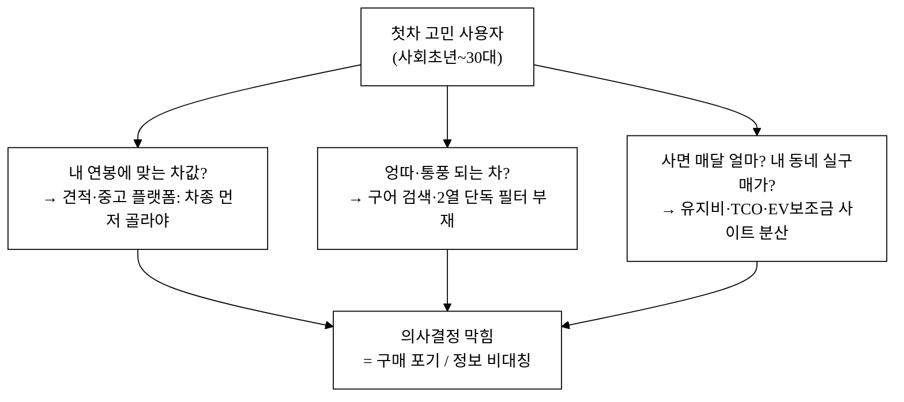
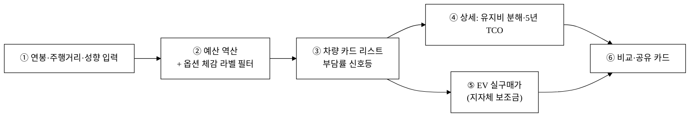

last_updated: 2026-06-11 09:40

# 제안서 — 연봉 기반 차량 옵션 추천 웹앱 「카픽(CarPick)」

> 본 제안서의 시장·통계·보조금 수치는 [`5_research/`](./5_research/) 에 통합된 공공·언론·플랫폼 출처에 연결된다. 검증되지 않은 가설값은 본문에 **`[추정]`** 으로 표기하고, 공식 수치와 한 문장에 섞지 않는다. 경쟁사 "미보유" 판단은 모두 "공개 정보 기준 미확인"으로 한정한다([`5_research/경쟁사분석_차별화기능.md`](./5_research/경쟁사분석_차별화기능.md) §5 정직성 원칙 계승).

## 0. 프로젝트 메타

| 항목 | 값 |
|:---|:---|
| 사업명 | 2026년 창업동아리 지원사업 (창업중심대학 X RISE 사업단) |
| 주관기관 | 대구대학교 창업지원단 |
| 트랙 | 실전창업 (창업동아리 / 기본 300만원·최대 1,000만원) |
| 일정 | 모집공고 '26.3.19~4.2 · 선발평가 4.6~4.8 · 선발안내 4.9 · 협약·설명회 4.10 · 지원·관리 '26.4.13~'27.1.31 |
| 아이템 | 연봉 기반 차량 옵션 추천 웹앱 「카픽(CarPick)」 |
| 한 줄 정의 | **내 연봉을 넣으면** 감당 가능한 차들 중에서 **원하는 옵션(2열 엉따·통풍 등)으로 거르고** 예상 유지비(TCO)와 EV 실구매가까지 한 흐름으로 보여주는 추천 웹앱 |
| 타깃 사용자 | **첫차를 고민하는 사회초년~30대** (차에 대한 정보 비대칭이 큰 구매자) |
| 팀 | <TODO: 사용자 입력> |

---

## 1. 문제 인식 (Problem)

### 1.1 거시 배경 — 젊은 층이 차 사기를 포기하고 있다

국내 신차 시장에서 **젊은 층의 구매 비중이 10년 내 최저치로 떨어졌다.** 2025년 20대의 승용 신차 등록은 약 6만 대로 전체의 5%대에 그쳤고, 2016년 두 자릿수에 가깝던 비중이 지속 하락했으며, 30대의 등록 비중도 20% 아래로 내려갔다.[^1] 같은 보도가 꼽는 1차 원인이 **급등한 차량 가격과 유지비 부담**이다.[^1] 즉 "사고 싶지 않은 것"이 아니라 **"얼마짜리 차가 내 형편에 맞는지, 사고 나서 매달 얼마가 드는지 가늠이 안 되는 것"** 이 진입을 막는다.

수요 자체가 사라진 것은 아니다. 생애 첫차 구매는 경제활동에 막 진입하는 **30대에서 가장 많이 발생**하며, 첫차를 **신차로 사는 비율이 중고차의 약 3.4배**로 더 높다.[^2] 다시 말해 "처음으로 신차를 사는 30대 전후"라는 두꺼운 모수가 존재하는데, 이들이 의사결정 단계에서 막혀 있다.

### 1.2 모수 — 누가 막혀 있는가

본 사업의 ICP는 **첫차를 고민하는 사회초년~30대 구매자**다. 이들의 공통점은 (a) 자동차 도메인 지식이 얕고(트림·옵션·세금 체계에 낯섦), (b) **연봉은 아는데 그 연봉으로 감당 가능한 차값·유지비를 환산하지 못하며**, (c) 옵션을 "엉따·통풍·360뷰" 같은 구어로만 알고 정식 명칭을 모른다는 것이다. 신차 시장 규모 자체는 견조해, 2025년 11월 한 달 신차 등록만 **14만4,173대**(승용 13만26대)에 달한다.[^3]

### 1.3 세 가지 구조적 장벽 — 정보가 파편화되어 있다

**장벽 ① "내 연봉 → 감당 가능한 차"를 역산해주는 출발점이 없다.**
견적·중고차 플랫폼은 모두 **"차종을 먼저 고른 뒤 가격을 본다."** 사용자가 자기 형편을 먼저 입력해 후보를 좁히는 흐름은 공개 정보 기준 부재하다(KB차차차의 마이데이터 "차테크"가 예산 분석에 가장 근접하나 금융·매물 중심).[^4] 차알못은 "그래서 내가 무슨 차부터 봐야 하나"라는 첫 질문에서 막힌다.

**장벽 ② 옵션을 구어로 검색할 수 없다.**
사용자는 "2열 엉따 되는 차", "통풍 시트 있는 차"를 원하는데, 견적 포털은 정식 옵션명·트림 패키지 단위로만 탐색된다(구어 칩·동의어 검색은 경쟁사 공개 정보 기준 미확인).[^5] 특히 **앞좌석과 2열을 분리한 옵션 필터**(아이 태우는 가족의 결정적 조건)는 트림 단위 견적에서 단독으로 거르기 어렵다.

**장벽 ③ "사고 나서 매달 얼마"와 "내 동네 실구매가"가 추천과 단절돼 있다.**
유지비(연료·세금·보험·정비)와 5년 TCO, EV 보조금은 각각 다른 사이트에 흩어져 있다. 다나와가 2025년 6월 유지비 비교를 출시했으나 추천의 축이 아닌 부가 기능이고,[^6] EV 보조금은 무공해차 통합누리집(ev.or.kr)에서 **국비 최대 686만원 + 지방비 최대 700만원**이 지역별로 크게 갈리지만[^7] 행정 포털 UX로 차량 추천과 단절돼 있다. 사용자는 다섯 개 사이트를 오가며 머릿속으로 합산해야 한다.

---

## 2. 해결 (Solution)

### 2.1 한 줄 해법

**연봉 → 예산 → 옵션(체감 라벨) → 유지비/5년 TCO → EV 실구매가** 를 하나의 흐름에 꿰는 추천 웹앱. 사용자는 자기 연봉만 출발점으로 던지고, 나머지를 앱이 역산·합산해 보여준다.

### 2.2 핵심 기능과 데모 구현 현황

본 데모는 [`projects/car-advisor/`](../projects/car-advisor/) 에 단일 HTML(키 없이 오프라인 구동)로 **이미 v1·v2·v3 3개 사이클이 구현·캡처 검수 완료**돼 있다(차량 31대·옵션 33종).[^8]

| 기능 | 설명 | 데모 위치 |
|:---|:---|:---|
| 연봉 기반 예산 역산 | 세전 연봉 입력 → 보수(×0.4)/표준(×0.5)/공격(×0.7) 예산구간 산정 후 후보 정렬 | v1 [`index.html`](../projects/car-advisor/index.html) |
| 옵션 체감 라벨 필터 | "엉따·통풍·360뷰"를 정식 키에 매핑한 2계층 칩 필터, **앞/2열 분리** AND 필터 | v1 |
| 예상 유지비 분해 + 주행거리 | 연료·세금·보험·정비를 막대로 분해, 연간 주행거리 슬라이더로 즉시 재계산 | v1 |
| 연봉 대비 부담률 신호등 | (할부 가정+유지비)이 월 실수령의 몇 %인지 초록/노랑/빨강 | v1·v3 |
| EV 실구매가 = 차량가 − 보조금(지역) | 거주 지자체 선택 시 국고+지방비 차감한 실구매가, 5년 TCO | v2 [`v2.html`](../projects/car-advisor/v2.html) |
| 차별화 기능 17종 | 라이프스타일 역산 마법사·지자체 보조금 비교·EV vs 가솔린 연료비·구매방식 비교·실연비·페르소나 인기·공유 카드 등 | v3 [`v3.html`](../projects/car-advisor/v3.html) |

### 2.3 작동 흐름

---

## 3. 성장 (Scale-up)

### 3.1 단계 로드맵

| 단계 | 시점 | 핵심 | 데이터 |
|:---|:---|:---|:---|
| Phase 0 (현재) | '26 상반기 | 데모 v1~v3 완성(31대·옵션 33종) — 추천·필터·TCO·EV보조금 PoC | mock + `[추정]` |
| Phase 1 | '26 하반기 | 실데이터화: 제조사 가격표·에너지공단 연비·오피넷 유가·지방세법·ev.or.kr 보조금 연동, 차종 100+ 확장 | 공식 출처 교체 |
| Phase 2 | '27 | 리드 제휴(딜러·금융·보험) 연결, 공유 카드 기반 바이럴·SEO 유입 | 제휴 API |
| Phase 3 | '27+ | 페르소나/실연비 사용자 데이터 축적 → 추천 정확도·소셜 신호 강화 | 자체 축적 |

### 3.2 확장성의 근거

- **데이터 해자 형성**: 사용자의 연봉·라이프스타일·선택 옵션은 추천 정확도를 높이는 자산이 된다(Phase 3). 더 많이 쓸수록 "같은 처지 사용자 인기 차" 같은 소셜 신호가 강해진다.
- **인접 확장**: 첫차 추천 → 보험·금융·정비·중고 시세(제휴) → 차량 생애주기 전반으로 도메인 확장 여지. 중고 시세·실매물은 자체 구축 대신 **제휴/링크아웃**으로 둔다(엔카·KB·카이즈유 강세 영역, 의도적 비범위).[^5]

---

## 4. 팀 (Team)

> 본 섹션은 골격만 두고 내용은 사용자가 직접 채운다(CLAUDE.md §2.7).

| 역할 | 성명 | 소속/학과 | 담당 |
|:---|:---|:---|:---|
| 대표 | <TODO: 사용자 입력> | <TODO: 사용자 입력> | <TODO: 사용자 입력> |
| 팀원 | <TODO: 사용자 입력> | <TODO: 사용자 입력> | <TODO: 사용자 입력> |
| 팀원 | <TODO: 사용자 입력> | <TODO: 사용자 입력> | <TODO: 사용자 입력> |
| 지도교수 | <TODO: 사용자 입력> | <TODO: 사용자 입력> | <TODO: 사용자 입력> |

---

## 경영혁신·창업학적 프레임워크

본 사업은 **JTBD(Jobs To Be Done)**·**블루오션 전략**·**린 스타트업** 세 프레임워크로 정당화된다.

**① JTBD — Christensen.** 첫차 구매자가 고용하는 "직무(Job)"는 *차를 검색하는 것*이 아니라 **"내 형편에 맞으면서 후회 안 할 첫차를 골라내는 것"** 이다. 기존 견적·중고 플랫폼은 "차종을 검색하는 직무"만 수행하고, 진짜 직무(예산 역산 + 후회 비용 최소화)는 사용자에게 떠넘긴다. 카픽은 연봉을 출발점으로 둠으로써 이 미충족 직무를 정조준한다.

**② 블루오션 — Kim·Mauborgne.** 국내 자동차 디지털 서비스는 신차 견적·중고 거래·EV 보조금·유지비 데이터가 각자 레드오션에서 경쟁한다. [`5_research/경쟁사분석_차별화기능.md`](./5_research/경쟁사분석_차별화기능.md) §2 매트릭스가 보여주듯, **"연봉→예산→옵션→유지비/TCO→실구매가(보조금)"를 한 흐름으로 꿴 통합 추천은 공백**이다. 카픽은 *제거(견적 복잡도)·감소(옵션 용어 장벽)·증가(투명한 TCO)·창조(연봉 역산)* 의 ERRC로 빈 시장을 연다.

**③ 린 스타트업 — Ries.** 본 사업은 이미 3사이클(v1→v2→v3)의 **Build-Measure-Learn 루프**를 돌렸다. v1(추천·필터·유지비) → v2(EV 보조금·TCO) → v3(경쟁사 분석 기반 차별화 17종)으로, 각 사이클이 가설을 코드로 검증한 MVP다. 데이터는 아직 mock(`[추정]`)이나, 흐름·UX 가설은 실 구동 캡처로 입증됐다.

> **본 사업의 위치**: 블루오션의 *시장 경계 재설정* 단계 + 린 스타트업의 *MVP 검증 완료 → 실데이터 PMF 탐색* 진입 단계.

---

## 고객확보(GTM)

### 4-1. ICP 세분화

| 세그먼트 | 특징 | 핵심 직무(JTBD) | 우선순위 |
|:---|:---|:---|:---:|
| S1. 첫 신차 사회초년생(25~32세) | 연봉 3~5천, 차 지식 얕음, 구어로만 옵션 인지 | "내 연봉에 맞는 차 + 매달 부담 가늠" | **1순위** |
| S2. 첫 패밀리카 30대 | 결혼·출산기, 2열 옵션 결정적 | "아이 태울 2열 통풍/안전 되는 차" | 1순위 |
| S3. EV 전환 고려자 | 충전환경 보유, 보조금 민감 | "보조금 빼면 EV가 이득인가" | 2순위 |

### 4-2. 채널별 전술

| 유형 | 채널 | 전술 |
|:---|:---|:---|
| 오가닉/바이럴 | 공유 카드·영구 링크(v3 구현) | "내 연봉 OK 차 리스트"를 이미지 카드로 공유 → 커뮤니티·SNS 유입, SEO 랜딩 |
| 오가닉 | 자동차 커뮤니티(보배드림·클리앙·디시 차갤)·유튜브 | "연봉 3천 첫차" 류 콘텐츠에 도구 노출, 옵션 위키 콘텐츠 SEO |
| 제휴 | 딜러·금융·보험 리드 | 추천 결과 하단 "견적 받기" 링크아웃(Phase 2) |
| 유료 | 검색 키워드 | "첫차 추천", "연봉별 차" 등 롱테일 키워드 소액 집행 |

### 4-3. 퍼널 가설

- **마찰 제거**: 로그인 없이 입력→추천(v1 구현, CLAUDE.md §3.4). 연봉 등 민감정보는 localStorage에만 저장(서버 미전송)해 입력 거부감을 낮춘다.
- **첫 100명**: 팀·지인 + 자동차 커뮤니티 2~3곳에 "연봉별 첫차 추천 도구" 직접 게시 → 공유 카드 회수.
- **첫 1,000명**: 유튜브 첫차 콘텐츠 크리에이터 1~2명 협업 + 롱테일 SEO 랜딩(옵션 위키·"연봉 N천 차" 페이지)으로 검색 유입.
- **예상 CAC**: 오가닉/바이럴 중심 **2,000~8,000원/획득 `[추정]`**(유료 비중 낮춤 전제). 공유 카드 바이럴 계수에 민감.
- **리텐션 가설**: 첫차 구매는 일회성 의사결정이라 *세션 내 완결*이 핵심. 리텐션은 "구매 검토 기간(수주~수개월)" 내 재방문·비교에 한정. 따라서 KPI는 D30 리텐션보다 **세션당 추천 완료율·공유 전환율**을 1차로 본다. `[추정]`

---

## 수익모델

### 5-1. 수익원과 가격

| 수익원 | 방식 | 가격/단가 `[추정]` |
|:---|:---|:---|
| ① 리드 제휴수수료 | 딜러·견적사에 구매 의향 리드 전달(CPL) | 건당 **1~5만원** `[추정]` |
| ② 금융·보험 제휴 | 할부·리스·자동차보험 제휴 성사 수수료(CPA) | 성사당 **3~15만원** `[추정]` |
| ③ 프리미엄(B2C) | 심화 TCO 리포트·실연비 상세·알림(보조금 소진) | 월 **2,900~4,900원** `[추정]` |

> 무료 추천으로 트래픽을 모으고 **①·② 제휴 리드가 주 수익**, ③ 프리미엄은 보조. 광고는 초기 보조 수단으로만.

### 5-2. 단위경제성 (모두 `[추정]`)

> 아래 값은 **모두 자체 가설 `[추정]`** 이며, 실데이터·실제휴 계약 전 검증값이 아니다. 공식 수치와 섞지 않는다.

| 지표 | 값 | 산출 근거(가설) |
|:---|---:|:---|
| 활성 사용자당 평균 매출(연) | 8,000원 | 리드 전환율 ×수수료 + 프리미엄 혼합 `[추정]` |
| LTV | 12,000원 | 구매 검토 1주기 + 잔여 트래픽 가치 `[추정]` |
| CAC | 4,000원 | GTM 오가닉/바이럴 중심 `[추정]` |
| LTV/CAC | **3.0** | 12,000 ÷ 4,000 `[추정]` |
| 회수기간 | **약 6개월** | CAC ÷ (월 기여이익) `[추정]` |

### 5-3. 매출 시나리오 3안 (절댓값, 모두 `[추정]`)

> 가정: 리드 단가·전환율은 §5-1·5-2의 `[추정]` 값. 아래 절댓값은 **검증 전 시뮬레이션**이다.

| 시나리오 | 연간 활성 사용자 | 리드 전환율 | 평균 리드 수수료 | **연 매출 `[추정]`** |
|:---|---:|---:|---:|---:|
| 보수 | 30,000명 | 3% | 20,000원 | **약 1,800만원** |
| 기본 | 120,000명 | 5% | 25,000원 | **약 1억5,000만원** |
| 공격 | 400,000명 | 7% | 30,000원 | **약 8억4,000만원** |

> 산식(기본): 120,000 × 5% × 25,000원 = 1억5,000만원(리드 수수료 단일 가정, 프리미엄·금융 제휴 제외). 모두 `[추정]`.

---

## 차별성·경쟁우위

### 6-1. 경쟁자 비교표

> 셀: ● 보유 / ◐ 부분·간접 / ○ 공개정보 기준 미확인. 상세 매트릭스는 [`5_research/경쟁사분석_차별화기능.md`](./5_research/경쟁사분석_차별화기능.md) §2.

| 핵심 축 | 엔카 | KB차차차 | 겟차/다나와 | ev.or.kr | **카픽** |
|:---|:--:|:--:|:--:|:--:|:--:|
| 연봉 기반 예산 역산 추천 | ○ | ◐[^4] | ○ | ○ | **●** |
| 옵션 체감 라벨 필터(엉따·통풍·2열 분리) | ◐ | ○ | ◐ | ○ | **●** |
| 5년 TCO 시뮬(주행거리·잔가 반영) | ○ | ◐ | ◐[^6] | ○ | **●** |
| EV 실구매가=차량가−보조금(지역) | ○ | ○ | ◐ | ●[^7] | **●** |
| 위 전부를 **한 흐름**으로 통합 | ○ | ○ | ○ | ○ | **●** |
| 중고 실거래 시세·실매물 | ● | ● | ◐ | ○ | **○**(비범위) |

### 6-2. 방어가능성(Moat)

- **통합 흐름 자체가 전환비용**: 사용자가 다섯 사이트를 오가던 작업을 한 흐름으로 끝내면, 다시 분산 도구로 돌아갈 이유가 약하다.
- **데이터 네트워크 효과**: 페르소나·실연비·선택 옵션 데이터가 쌓일수록 추천·소셜 신호가 정확해진다(Phase 3).
- **옵션 2계층 사전·동의어 자산**: 구어→정식 키 매핑 사전은 단기 모방이 쉽지 않은 도메인 자산.

### 6-3. Why us / Why now

- **Why now**: 젊은 층 신차 구매가 가격·유지비 부담으로 10년 내 최저[^1]인 *지금*, "감당 가능성"을 정면으로 푸는 도구의 필요가 가장 크다. 다나와 유지비 비교(2025.6)[^6]·KB 차테크[^4]가 **예산·유지비 수요를 시장이 검증**해줬다.
- **Why us**: 경쟁사 공백(통합 흐름)을 정조준한 **PoC가 이미 3사이클 완성**(v1~v3, 캡처 검수)돼 있어, 실데이터화만으로 PMF 탐색에 진입할 수 있다.

---

## 차별화 기술의 구매동인 논증

차별점을 나열하는 데서 그치지 않고, 그것이 *실제로 고객의 구매·사용 결정을 얼마나 움직이는지* 를 논증한다.

### 7-1. 구매동인 가설과 must/nice 분류

| 차별점 | 건드리는 핵심 직무 | 분류 | 근거 |
|:---|:---|:--:|:---|
| 연봉→예산 역산 | "내 형편에 맞는 차부터 좁히기" | **must-have** | 차알못은 이 첫 질문이 안 풀리면 탐색을 시작조차 못 함. 젊은층 구매 포기 1원인이 가격·유지비 가늠 불가[^1] |
| 옵션 체감 라벨·2열 분리 필터 | "엉따·통풍 되는 차 찾기" | **must-have**(S2 패밀리카) | 아이 태우는 가족에게 2열 옵션은 타협 불가 조건. 정식명 모르면 검색 자체 불가[^5] |
| EV 실구매가(지자체 보조금) | "내 동네 기준 진짜 가격" | **must-have**(S3 EV 고려자) | 국비·지방비 합산 차이가 큼[^7]. 모르면 수백만원 손해 |
| 5년 TCO·부담률 신호등 | "사고 나서 매달 얼마" | nice-to-have→must 경계 | 있으면 결정적이나, 없어도 구매 자체는 함. 후회 방지용 |
| 공유 카드·페르소나 인기 | "남들은 뭘 샀나" | nice-to-have | 의사결정 보조·바이럴 동인, 단독 구매동인은 약함 |

### 7-2. 가치 정량화 (고객 언어)

- **탐색 시간**: 견적·중고·보조금·유지비 사이트를 각각 오가던 비교를 한 흐름으로 → **수 시간 → 수 분 `[추정]`**.
- **EV 후회비용**: 지자체별 보조금 차이가 국비 최대 686만원 + 지방비 최대 700만원 범위에서 갈리므로[^7], 모르고 사면 **수십~수백만원 `[추정]`** 손해. 이 한 건만으로도 도구 사용 동기가 전환 마찰을 크게 상회.
- **부담률 경고**: 권장선 30~40%[^9] 초과를 신호등으로 즉시 경고 → 과소비 의사결정 1건 방지의 가치는 차값 수백만원대.

> 위 정량값은 차이의 *범위*는 공식 출처[^7][^9]에 근거하나, 개별 사용자 절감액 환산은 `[추정]`이다.

### 7-3. 외부 근거 연결

- 통합 흐름 공백·경쟁 매트릭스: [`5_research/경쟁사분석_차별화기능.md`](./5_research/경쟁사분석_차별화기능.md) §1·§2(차별화 기능 32개 분석).
- 유지비/TCO 수요 검증: 다나와 2025.6 유지비 비교 출시[^6].
- 예산 기반 추천 수요 검증: KB차차차 차테크[^4].
- 젊은층 구매 포기 원인(가격·유지비): 서울경제 보도[^1].
- EV 보조금 지역 차: ev.or.kr·관련 정리[^7].

### 7-4. 반증·대안 위협 직시

| 위협 | 내용 | 대응 |
|:---|:---|:---|
| "충분히 좋은" 무료 대안 | 견적 포털 + 보조금 사이트를 직접 오가면 0원 | 분산 도구의 **합산 마찰**이 우리의 진짜 경쟁 상대. 통합으로 시간·후회비용을 줄이는 게 핵심 가치 제안 |
| 일회성 사용 → 낮은 리텐션 | 첫차는 평생 몇 번 안 사므로 재방문 적음 | 리텐션 대신 **공유 바이럴·SEO 신규 유입**과 *세션 완결률*을 KPI로(§4-3). 인접 도메인(보험·정비)으로 생애주기 확장 |
| 데이터 신선도 의심 | 가격·보조금이 자주 바뀜 | source·effectiveDate 라벨로 신선도 표기(v3 설계), Phase 1 공식 출처 연동 |
| 중고/실매물 부재 | 엔카·KB 강세 영역 미보유 | 자체 구축 대신 제휴/링크아웃(의도적 비범위) |

### 7-5. 데모 시연 지점 (논증↔산출물 정합)

- **연봉 역산 must-have**: [`v1 index.html`](../projects/car-advisor/index.html) 연봉 입력→예산 신호등→차량 리스트.
- **옵션 체감 필터·2열 분리**: v1 칩 필터(엉따·통풍, 앞/2열 분리).
- **EV 실구매가 must-have**: [`v2.html`](../projects/car-advisor/v2.html) 지자체 선택→보조금 차감 실구매가·5년 TCO.
- **부담률·라이프스타일 역산·구매방식 비교·공유 카드**: [`v3.html`](../projects/car-advisor/v3.html) 차별화 17종(라이프스타일 마법사·월 부담률·실연비·페르소나 인기·공유 카드 — 본문 검증 완료).[^8]

---

## 참고문헌

[^1]: **서울경제 「'쥐꼬리 월급으로 차를…' 20대 신차 구매비중 10년래 최저」** (2025). 20대 승용 신차 약 6만대·전체 5%대, 30대 비중 20% 이하, 원인=차량가·유지비 부담. https://www.sedaily.com/article/20013798
[^2]: **한국교통연구원(KTDB) 「재미있는 교통통계」** (접속 2026). 생애 첫차 구매 30대 최다, 첫차 신차:중고 약 3.4:1. https://www.ktdb.go.kr/www/selectBbsNttView.do?key=42&bbsNo=7&nttNo=2688
[^3]: **KAIDA(한국자동차모빌리티산업협회) 신규등록 통계 / 2025.11 신차 등록 분석** (2025.11). 월 신차 14만4,173대(승용 13만26대), 연료별·유형별 구성. https://www.kaida.co.kr/ko/statistics/NewRegistList.do
[^4]: **KB차차차 「차테크」 마이데이터 기반 예산·차량 추천** (접속 2026). 자산 분석 후 예산·매물 추천(금융·매물 중심). https://m.kbchachacha.com/
[^5]: **경쟁사 분석(다나와·겟차·엔카·KB차차차·ev.or.kr 등)** — [`5_research/경쟁사분석_차별화기능.md`](./5_research/경쟁사분석_차별화기능.md) §1·§2. 통합 추천 흐름·구어 칩·2열 단독 필터는 공개 정보 기준 미확인.
[^6]: **아시아경제 「다나와자동차, '구매 비용 비교' 서비스 오픈(신차 유지비용 비교)」** (2025.06). 견적 포털의 유지비 비교 기능 출시. https://www.asiae.co.kr/article/2025061210313513263
[^7]: **환경부 무공해차 통합누리집(ev.or.kr) 구매보조금** (2025~2026). 국비 최대 686만원 + 지방비 최대 700만원, 지역별 차이. https://www.ev.or.kr/nportal/buySupprt/initBuySubsidySupprtAction.do
[^8]: **카픽 데모 v1~v3 개발결과보고서** — [`3_개발결과보고서_v1.md`](./3_개발결과보고서_v1.md)·[`4_개발결과보고서_v2.md`](./4_개발결과보고서_v2.md)·[`5_개발결과보고서_v3.md`](./5_개발결과보고서_v3.md). 차량 31대·옵션 33종·캡처 검수 완료.
[^9]: **겟차 블로그 「연봉별 차 유지비·월급 대비 유지비 비율」** (2026). 연봉의 30~40% 권장선. https://web.getcha.kr/blog/monthly-salary-vs-car-maintenance-cost-2026

> 추가 출처(차량 제원·유가·세금·보조금 실값)는 Phase 1 실데이터화 시 [`5_research/`](./5_research/) 에 통합·각주한다.

---

## 데이터 정직성 선언

본 제안서의 시장·통계·보조금 *범위* 수치는 위 §참고문헌의 공공·언론·플랫폼 출처([^1]~[^9])에 연결된다. **수익모델 단위경제성·매출 3안의 절댓값, CAC·LTV·개인별 절감액 환산은 모두 자체 가설 `[추정]`** 이며, 실데이터·실제휴 계약 전의 검증값이 아니다 — 본문에서 공식 수치와 한 문장에 섞지 않았다. 경쟁사 "미보유"는 모두 "공개 정보 기준 미확인"으로 한정 표기했고, 차량 제원·유지비 단가는 데모의 `[추정]`/mock을 따르며 Phase 1에서 출처와 함께 확정한다. 팀·서명 정보는 사용자 입력 영역으로 공란 처리했다.

<!-- 빈칸 목록 (사용자 입력 필요)
- §0 메타: 사업명·주관기관·트랙·일정 — 동일 공고 메타 사용. 실 공고와 상이 시 사용자 수정.
- §4 팀: 대표/팀원/지도교수 성명·소속/학과·담당 (전 셀 <TODO: 사용자 입력>)
-->
