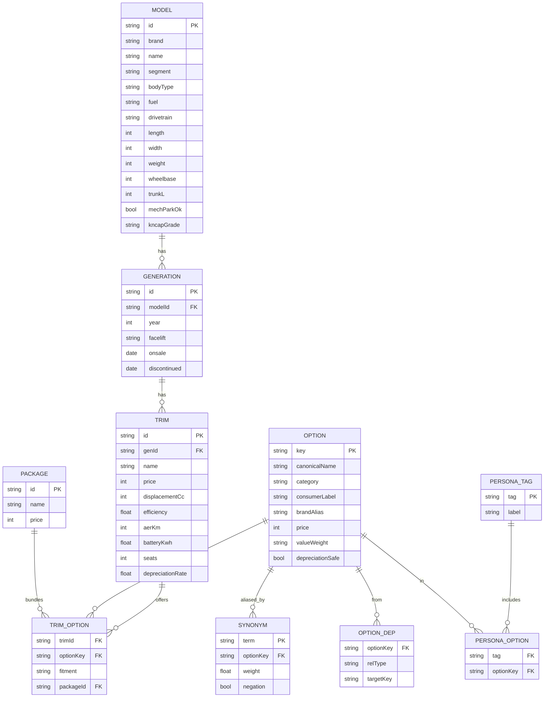

last_updated: 2026-06-10 12:20

# 옵션·필터 도메인 설계 — 차량 정보 사이트

> [`2_개발계획서.md`](./2_개발계획서.md)의 **상세 설계 부속서**. 필터 기능 구현을 위한
> **데이터 도메인 정규화 + 콘텐츠 분류 + 검색어 매핑**을 정의한다. (설계 단계 · 마크다운만)
>
> **설계 핵심 원칙 — 2계층 분리**
> - **(A) 엔지니어링 정식 분류** → DB에 canonical 키로 **정규화 저장** (FCA, SVM, SCC …)
> - **(B) 소비자 체감 라벨** → UI에 구어로 **노출·검색** (엉따, 통풍, 360뷰, 손따 …)
> - 그 사이를 **동의어 매핑(synonym)** 으로 라우팅. → 저장은 표준화, 검색·필터는 직관적.

---

## 1. 구매 핵심 고려요소 (필터 파라미터)

차량 비교·필터의 축이 되는 핵심 파라미터.

### 1.1 경제성 · 비용 (TCO: 총소유비용)

| 구분 | 항목 | 데이터화 |
|---|---|---|
| 초기 비용 | 차량가 · 취등록세(차량가 약 7% `[확인필요]`) · 공채 매입 · 탁송료 | `price`, 파생 계산 |
| 유지 비용 | 유류비/충전비(복합연비·전비) · 자동차세(배기량/EV 정액) · 보험료(가액·등급·연령·ADAS 할인) | §유지비 식([2_개발계획서.md](./2_개발계획서.md) §5) |
| 잔존 가치 | 감가상각률(브랜드 선호·유종에 따라 상이) | `depreciationRate` `[추정]` |

### 1.2 파워트레인 · 구동 방식

| 축 | 값 | 체감 특성 |
|---|---|---|
| 동력원 | 가솔린 | 정숙·고속 연비 |
| | 디젤 | 높은 토크·환경 규제 리스크 |
| | LPG | 낮은 연료비 |
| | HEV/PHEV | 도심 연비 극대화·회생제동 |
| | BEV(전기) | 즉각 토크·충전 인프라 의존·배터리 열관리 |
| 구동 | FF(전륜) | 공간 효율 |
| | FR(후륜) | 하중 분배·주행 질감 |
| | AWD/4WD | 접지력·험로 |

### 1.3 세그먼트 · 공간 활용성

- **차급**: 경형 / 소형 / 준중형 / 중형 / 준대형 / 대형
- **보디 타입**: 세단 / SUV / MPV·미니밴 / 해치백·왜건 / 픽업
- **공간 지표**: 휠베이스(`wheelbase`) · 트렁크 용량(`trunkL`, VDA) · 2열 레그룸/헤드룸

### 1.4 확장 고려요소 (리뷰 보강 — 실제 구매에서 큰 변수)

> 초기 설계에서 빠졌던, 한국 소비자가 실제로 따지는 요소. 필터·콘텐츠 양쪽에 쓰인다.

| 영역 | 항목 | 데이터화 |
|---|---|---|
| 전기차(EV) | 1회 충전 주행거리(AER) · 배터리 용량(kWh) · 급속/완속 지원 · **자택/직장 충전 가능 여부**(사용자 입력) | `aerKm`,`batteryKwh`,`fastCharge`,(입력)`homeCharge` |
| 세제·보조금 | 개소세 · 취득세 감면(친환경) · **EV/수소 보조금(지역별)** · 하이브리드 혜택 | `taxBenefit[]` `[확인필요]` |
| 안전도 | **KNCAP 등급** · 에어백 수 · ADAS 기본 탑재 수준 | `kncapGrade` `[추정]` |
| 물리 제약 | 전장·전폭·전고·공차중량 → **기계식 주차장 수용 여부**(길이 5.0m/폭 1.85m/무게 제한) | `length`,`width`,`height`,`weight` + 파생 `mechParkOk` |
| 신뢰성·정비 | 차종 고장률·리콜 이력 · **부품가/공임(정비비 지수)** · 보증(년/km) | `reliability` `[추정]`,`warranty` |
| 실사용 | 실연비(후기 기반) vs 공인연비 · 사용자 평점 · 견인력(캠핑) | `realEfficiency`,`rating`,`towingKg` |

---

## 2. 옵션 도메인 — 2계층 모델

### 2.1 (A) 엔지니어링 정식 분류 — 정규화 저장 키

| 그룹 | canonical 키 | 정식 명칭 |
|---|---|---|
| ADAS·안전 | `fca` | 전방 충돌방지 보조 (FCA) |
| | `bca` | 후측방 충돌 경고/보조 (BCW/BCA) |
| | `scc` | 스마트 크루즈 컨트롤 (Stop&Go 포함) |
| | `lfa` | 차로 유지/이탈방지 보조 (LFA/LKA) |
| | `hda` | 고속도로 주행보조 (HDA) |
| | `rcca` | 후방 교차충돌 방지 (RCCA) |
| | `svm` | 서라운드뷰 모니터 (SVM, 360°) |
| | `parkingSensor` | 전/후방 주차센서 |
| | `rearCam` | 후방 모니터 |
| | `rspa` | 원격 스마트 주차 보조 (RSPA) |
| | `bvm` | 후측방 모니터(방향지시등 연동 영상) |
| 편의·시트 | `frontHeatedSeat` | 앞좌석 열선 |
| | `frontVentSeat` | 앞좌석 통풍 |
| | `rearHeatedSeat` | 2열 열선 |
| | `rearVentSeat` | 2열 통풍 |
| | `heatedWheel` | 스티어링 휠 열선 |
| | `multiZoneHvac` | 멀티존 독립 공조 |
| | `memorySeat` | 메모리 시트 (IMS) |
| | `powerTailgate` | 스마트 전동 트렁크 |
| | `autoHold` | 오토 홀드 |
| | `remoteClimate` | 원격 공조/시동 |
| | `rearSunshade` | 2열 커튼/햇빛가리개(수동/전동) |
| | `flatFold` | 2열 풀플랫 폴딩(평탄화) |
| | `outlet220v` | 실내 220V 콘센트 |
| 인포테인먼트 | `oemNavi` | 순정 내비게이션 |
| | `hud` | 헤드업 디스플레이 |
| | `phoneProjection` | 카플레이/안드로이드오토 (유/무선) |
| | `wirelessCharger` | 스마트폰 무선 충전 |
| | `ota` | OTA 무선 업데이트 |
| 익스테리어·퍼포먼스 | `ledHeadlamp` | LED/매트릭스 헤드램프 (IFS) |
| | `ecs` | 전자제어 서스펜션 (ECS) |
| | `sunroof` | 선루프 (일반/파노라마 — `sunroofType`) |

> 각 옵션은 차량×트림 단위로 **적용 상태(`fitment`)** 를 가진다: `기본` / `선택(옵션)` / `미지원`.

### 2.2 (B) 소비자 체감 필터 — UI 노출 카테고리

> 필터 UI는 이 5개 체감 카테고리로 묶어 노출한다. 라벨은 **구어 우선**, canonical 키로 매핑.

| 체감 카테고리 | 소비자 라벨(구어) | → canonical 키 |
|---|---|---|
| ☀️ 계절·기후 | **엉따**(앞/2열 열선) | `frontHeatedSeat` · `rearHeatedSeat` |
| | **통풍**(앞/2열, '등땀' 방지) | `frontVentSeat` · `rearVentSeat` |
| | **손따**(핸들 열선) | `heatedWheel` |
| | 원격 시동/공조 | `remoteClimate` |
| 🅿️ 주차·좁은 길 | **360도 뷰**(어라운드뷰) | `svm` |
| | 후방 카메라·주차센서 | `rearCam` · `parkingSensor` |
| | 원격 스마트 주차('주차 대행') | `rspa` |
| | 후측방 모니터 | `bvm` |
| 📱 디지털·커넥티비티 | 순정 내비 | `oemNavi` |
| | **카플레이/안드로이드오토**(무선) | `phoneProjection` |
| | 무선 충전 | `wirelessCharger` |
| | HUD | `hud` |
| 🛣️ 장거리 피로 감소 | **스마트 크루즈**(Stop&Go) | `scc` |
| | 차로 유지(핸들 자동 조향) | `lfa` |
| | 고속도로 주행보조 | `hda` |
| 🏕️ 적재·거주(라이프스타일) | 전동 트렁크 | `powerTailgate` |
| | 2열 평탄화(차박) | `flatFold` |
| | 2열 커튼(육아) | `rearSunshade` |
| | 실내 220V 콘센트 | `outlet220v` |

### 2.3 옵션 패키지·의존성·브랜드 명칭 (리뷰 보강)

> 국산차는 옵션을 **개별이 아니라 패키지로 묶어** 판매하고, 옵션 간 **선행/배타 관계**가 있다.
> 또 같은 기능을 **브랜드마다 다른 이름**으로 부른다 → 검색·필터 정확도의 핵심.

- **패키지(`OPTION_PACKAGE`)**: 예) "컨비니언스 II" = `frontVentSeat`+`memorySeat`+`powerTailgate`. 필터 결과에 "이 옵션은 ○○ 패키지로만 선택" 표시.
- **의존성**: `requires`(예: `svm`는 `rearCam` 전제) · `conflicts`(예: 일부 `sunroof`는 `roofRack` 배타) · `trimLock`(상위 트림에서만).
- **브랜드 명칭 별칭(`OPTION.brandAlias`)**: 같은 `hda`라도 현대="HDA", 기아="드라이브 와이즈", 제네시스="고속도로 주행 보조", 수입="Highway Assist". → 동의어 사전(§4)과 연결.
- **파워트레인별 추가 속성**: EV는 `aerKm`/`batteryKwh`/충전방식, LPG는 도넛탱크 여부(트렁크 영향), 디젤은 요소수(AdBlue) — 옵션이 아닌 **제원 속성**으로 분리 저장.

---

## 3. 페르소나 태그 (묶음 필터)

> 옵션을 하나씩 고르기 번거로운 사용자를 위한 **원클릭 조합 필터**. 태그 = 옵션 키들의 AND.

| 태그 | 포함 옵션(AND) |
|---|---|
| `#초보운전` | `svm`(360) + `bvm`(후측방) + `parkingSensor` |
| `#장거리출퇴근` | `scc` + `lfa` + `frontVentSeat`(통풍) |
| `#캠핑차박` | `flatFold` + `powerTailgate` + `outlet220v` |
| `#수족냉증` | `frontHeatedSeat`(엉따) + `heatedWheel`(손따) + `remoteClimate`(원격시동) |
| `#패밀리카` | `rearVentSeat`(2열 통풍) + `rearSunshade`(2열 커튼) + `rcca` |

> 태그는 데이터로 정의(태그→옵션키 배열)해 **추가·수정이 코드 변경 없이** 가능하게 설계.

---

## 4. 검색어 동의어 매핑 (Synonym Dictionary)

> 사용자가 검색창에 친 구어를 canonical 키로 라우팅. 필터·검색 모두 이 사전을 경유.

| 사용자 입력어(예) | → canonical 키 |
|---|---|
| 엉따 · 엉덩이따뜻 · 열선시트 | `frontHeatedSeat` (+ `rearHeatedSeat`) |
| 통풍 · 통풍시트 · 등땀 | `frontVentSeat` (+ `rearVentSeat`) |
| 손따 · 핸들열선 · 열선핸들 | `heatedWheel` |
| 360 · 360도 · 어라운드뷰 · 탑뷰 · 서라운드뷰 | `svm` |
| 카플레이 · 안드로이드오토 · 폰미러링 · 미러링 | `phoneProjection` |
| 크루즈 · 어크 · 오토크루즈 · 스마트크루즈 | `scc` |
| 차박 · 풀플랫 · 평탄화 · 풀폴딩 | `flatFold` |
| 전동트렁크 · 스마트테일게이트 · 발차기트렁크 | `powerTailgate` |
| 무선충전 | `wirelessCharger` |
| 깡통 · 기본트림 | (옵션 거의 없음 필터) |

> 매핑은 다대일(여러 입력어 → 한 키) 및 일대다(엉따 → 앞+2열) 모두 허용.

**보강 — 검색 견고성**
- **표기 정규화**: 띄어쓰기 제거·영한 혼용·이형 통일("썬루프=선루프", "어라운드뷰=360", "카플레이=carplay"). 입력 → 소문자·공백 제거 후 사전 조회.
- **부정 검색**: "선루프 없는", "통풍 빼고" → `NOT optionKey` 로 라우팅(필터에 제외 조건).
- **브랜드 별칭 흡수**: "드라이브와이즈/스마트센스" 같은 마케팅 패키지명도 §2.3 `brandAlias` 로 canonical 키에 연결.
- **가중치·우선순위**: 한 입력어가 여러 키에 약하게 걸릴 때 `synonym.weight` 로 정렬(예: "크루즈" → `scc` 0.9 > 일반 크루즈 0.4).
- **오타 허용(선택)**: 편집거리 1~2 내 근접 매칭(데모 v1은 사전 매칭만, v2에서 fuzzy).

---

## 5. 옵션 가치 점수 (가성비 · 잔존가치)

> 중고 매각 시 **시세 방어에 기여하는 옵션**과 **취향 옵션**을 구분해 가성비 지수에 반영.

| 구분 | 옵션 예 | 가치 가중치 |
|---|---|---|
| 가치 보존(시세 방어 ↑) | 통풍시트 · 스마트크루즈 · 순정내비 · HUD · 4WD | **높음** |
| 취향(잔존가치 기여 ↓) | 빌트인캠 · 선루프 · 앰비언트 라이트 | 낮음 |

- `option.valueWeight`(高/중/低) · `option.depreciationSafe`(bool) 컬럼으로 보관.
- 수치(가중치 실값)는 데이터 수집·시세 분석 단계에서 보정, 현재는 `[추정]`.

**보강 — 점수 정규화 (가격 스케일 지배 방지)**

> 단순 `Σ가중치/가격`은 가격(만원, 수천 단위)이 분모를 지배해 저가차만 상위로 쏠린다. **정규화**가 필요.

- **세그먼트 내 정규화**: 같은 차급(경형/준중형/SUV…) 안에서 `value = Σ(옵션 valueWeight) / 트림가`를 min-max 스케일링(0~1).
- **사용자 가중 합산 점수**(추천 정렬 기본):
  `score = w₁·옵션충족도 + w₂·가성비(정규화) + w₃·유지비역수(정규화) + w₄·연봉부담률역수`
  (`w`는 입력 화면에서 "옵션 중시 / 유지비 중시 / 가격 중시" 프리셋으로 제공)
- **필수 옵션 미충족**은 점수 이전에 **하드 필터로 제외**(가중 합산에 섞지 않음).

---

## 6. 데이터 구조 (정규화 스키마)

> **보강 — 모델/트림/세대 계층 분리.** 초안은 `CAR`에 모델+트림을 평면화했으나, 정보 사이트는
> 같은 모델의 여러 트림·연식을 비교하므로 **MODEL ─ GENERATION ─ TRIM** 으로 정규화한다.
> 옵션엔 **가격·패키지·의존성**을, 페르소나는 **조인 테이블**로 정규화한다.

- **fitment**: `TRIM_OPTION.fitment`(`기본`/`선택`/`미지원`) → "기본 포함만" vs "옵션 추가 가능" 필터 모두 지원. `packageId`로 "○○ 패키지로만 선택" 표시.
- **OPTION_DEP.relType**: `requires`/`conflicts`/`trimLock` → 필터 시 불가능 조합을 비활성·경고.
- 데모(앱 v1) 단계에선 이 관계형 구조를 **단일 `CARS` 배열(대표 트림) + 옵션 boolean·가격 맵 + synonym/persona/package 상수**로 평면화해 구현(백엔드 없음). 실 사이트는 위 정규화 테이블로 확장.

---

## 7. 필터링 파이프라인 (역산 추천)

예) `출퇴근 60km/일 + 예산 4천 + 4인 가족` → 역산: `하이브리드/준중형~중형 SUV + scc·lfa 필수` → 후보 → `#패밀리카` 태그 + 2열통풍 AND → 가성비 정렬.

### 7.1 필터 의미론 — 패싯 검색 (리뷰 보강)

> 초안의 "선택=AND"는 옵션 칩엔 맞지만 유종·세그먼트 같은 **속성 패싯**엔 틀리다. 표준 패싯 규칙을 정의한다.

- **패싯 내부 = OR**, **패싯 간 = AND**. 예) `(가솔린 OR 하이브리드) AND (준중형 OR 중형) AND 통풍 AND 360뷰`.
- **범위 필터**: 가격·연비·트렁크·1회주행거리는 슬라이더(min~max).
- **fitment 인지 필터**: 옵션 선택 시 `기본만` / `선택 포함` 토글.
- **결과 카운트 & 0건 방지**: 각 패싯 값 옆에 매칭 대수 표시, 0이 되는 조합은 비활성. 0건이면 "옵션을 줄여보세요" + 근접 N대.

### 7.2 역산 규칙 테이블 (입력 → 권장)

| 입력 | 조건 | 권장 |
|---|---|---|
| 출퇴근 거리 | ≥ 50km/일 | 하이브리드·디젤·EV(장거리), `scc`+`lfa` 가점 |
| | < 15km/일 | 가솔린·EV(도심), 잦은 단거리 시 디젤 비권장 |
| 가족 수 | ≥ 4인 | 중형↑ 세그먼트, `seats≥5`, 2열 통풍·커튼 가점 |
| | 1~2인 | 경형·소형·준중형 허용 |
| 예산(연봉) | 차량가 ≤ 연봉×성향계수 | §[2_개발계획서.md](./2_개발계획서.md) §4 |
| 충전 가능 | 자택/직장 충전 가능 | EV 가점 / 불가하면 EV 감점 |
| 주차 환경 | 기계식 주차장 | `mechParkOk=true` 차량만(전장·전폭·무게 제약) |

> 역산은 **하드 제외(필수)** 와 **가점(선호)** 을 구분한다. 가점은 §5 가중 합산 점수에 반영.

---

## 8. 필터 UI/UX 설계 팁

- **그룹 칩 토글** — §2.2 체감 카테고리(계절/주차/디지털/장거리/적재)별 칩. 선택 = AND.
- **페르소나 태그 바** — §3 원클릭 묶음 필터를 상단에 노출.
- **검색창 + 동의어** — §4 사전 경유. "엉따" 입력 → 열선 옵션 자동 선택.
- **아이콘 뱃지** — 리스트 카드 상단에 직관 아이콘(의자+바람=통풍, 핸들+선=차로유지, 눈송이=열선, 카메라+사각=360뷰). 텍스트 대신 가독성↑.
- **빈 결과 안내** — 조건 과다로 0건이면 "옵션을 줄여보세요" + 가장 근접한 N대 제안.

---

## 9. 본 설계가 필터 개발에 주는 것 (요약)

1. **저장은 정식 키, 노출은 구어** — 정규화와 직관 검색을 동시에.
2. **체감 카테고리 5종 + 페르소나 태그 5종** — 필터 UI 골격 그대로.
3. **동의어 사전** — 검색창·음성 등 어떤 입력도 옵션으로 라우팅.
4. **가치 점수** — 단순 옵션 수가 아닌 "가성비/잔존가치" 차별 추천.
5. **정규화 스키마(ERD)** — DB 테이블 설계 착수 가능.

> 수치(취등록세율·감가율·가치 가중치 등)는 전부 `[추정]/[확인필요]` — 데이터 수집 단계에서 출처와 함께 확정.

---

## 10. 콘텐츠 기획 — "정보 사이트" 관점 (리뷰 보강)

> 필터는 진입점일 뿐. 정보 사이트로서 **머무를 이유(콘텐츠)** 를 함께 설계한다.

| 콘텐츠 | 설명 | 데이터 출처 |
|---|---|---|
| 트림 비교표 | 같은 모델 트림별 가격·기본/선택 옵션 차이 한눈에 | `TRIM`·`TRIM_OPTION` |
| 차량 비교(2~3대) | 스펙·옵션·유지비·부담률 나란히 | 필터 결과에서 담기 |
| 옵션 위키 | 옵션별 "이게 뭔가요"(엉따/SVM 등) 설명·체감 후기·필요한 사람 | `OPTION` + 에디토리얼 |
| 유지비/TCO 리포트 | 차량별 5년 총소유비용 시뮬 | §유지비 식 + 시세 |
| 시세·잔존가치 | 연식별 중고 시세, 가치 보존 옵션 안내 | 중고 시세 `[수집]` |
| 구매 가이드 | 페르소나별("초보·패밀리·차박") 추천 큐레이션 | `PERSONA_TAG` |
| 리뷰·평점 | 실연비·만족도·고장 후기 | 사용자/외부 `[수집]` |

- SEO·검색 유입을 위해 **동의어 사전(§4)을 콘텐츠 키워드**로도 활용("엉따 있는 차" 랜딩).

---

## 11. 데이터 거버넌스 & 면책

- **출처·신선도**: 가격·옵션·보조금은 자주 바뀜 → 레코드에 `source`·`effectiveDate` 보관, 갱신 주기 명시.
- **정직성**: 추정/확인필요 수치는 `[추정]`·`[확인필요]` 표기 유지(워크스페이스 데이터 정직성 규칙 준수).
- **면책**: "정보는 참고용, 실제 가격·옵션·보조금은 제조사/딜러/지자체 확인 필요" 고지.
- **개인정보**: 연봉·주행거리 등 사용자 입력은 **로컬(localStorage)에만** 저장, 서버 미전송(데모 기준).

---

## 12. 리뷰 체크리스트 (이번 보강 반영 여부)

- [x] 모델/트림/세대 계층 분리, 옵션 가격·패키지·의존성 모델링
- [x] 페르소나 M:N 조인 정규화, 동의어 가중치·부정·브랜드 별칭
- [x] 패싯 검색 의미론(패싯 내 OR / 패싯 간 AND) + 범위 필터 + 0건 방지
- [x] 빠진 소비자 요소 보강(EV 충전·세제혜택·KNCAP·기계식 주차·신뢰성·실연비)
- [x] 가성비 점수 정규화(세그먼트 내 min-max + 가중 합산)
- [x] 역산 규칙 테이블(하드 제외 vs 가점)
- [x] 정보 사이트 콘텐츠 기획 + 데이터 거버넌스·면책
- [ ] (다음) 실데이터 수집으로 `[추정]/[확인필요]` 수치 확정
