last_updated: 2026-06-26 12:00

# 개발결과보고서 v1 — 연봉 맞춤 차량 추천 (car-advisor)

> 설계([`2_개발계획서.md`](./2_개발계획서.md) · [`2_1_옵션_도메인_필터설계.md`](./2_1_옵션_도메인_필터설계.md))에 따라 구현한 v1 데모의 실 구동 검증 보고서.
> 구동 환경: macOS · Chromium(file:// 로드) · 1280×900 · 백엔드 없음(오프라인).

---

## 1. 요청 ↔ 구현 매핑

| 사용자 요청 | 구현 | 캡처 |
|---|---|---|
| 연봉 기반 옵션 추천 | 연봉·주행거리·예산성향·우선순위 입력 → 예산 산정·추천점수 정렬 | `01_input`, `02_results` |
| 차량 데이터 수집 | 한국 시장 **31대**(경형~대형·SUV·HEV·EV·수입) 큐레이션 데이터셋(`data.js`) | `02_results` |
| 옵션별 필터(엉따·2열 엉따·2열 통풍 등 싹 다) | 32개 옵션, 체감 5그룹 칩(AND) + 패싯(유종·세그먼트) + 페르소나 태그 + 동의어 검색 | `03_persona`, `04_search`, `05_detail` |
| 예상 유지비 | 연료비·자동차세·보험·정비 분해 + 월/연 표시 | `05_detail` |
| 주행거리 사용자 입력 | 입력·상세에 슬라이더(0~40,000km), 유지비 즉시 재계산 | `01_input`, `05_detail` |

---

## 2. 구현 범위

- **입력**: 연봉(만원), 연간 주행거리 슬라이더, 예산 성향(보수0.4/표준0.5/공격0.7), 우선순위 프리셋(옵션/유지비/가격중시), 선호 연료(멀티).
- **추천·필터**: 패싯(유종·세그먼트 — 패싯 내 OR / 패싯 간 AND, 값별 매칭 대수 표시), 체감 옵션 칩 5그룹, 페르소나 태그 5종(#초보운전·#장거리출퇴근·#캠핑차박·#수족냉증·#패밀리카), 동의어 검색(엉따/360/차박/카플레이…), 정렬 4종. 0건 시 안내.
- **차량 카드**: 가격·유종·연비·**월 유지비**·옵션 배지·예산 신호등(차량가 vs 연봉×성향).
- **상세(바텀시트)**: 유지비 항목별 막대 분해, 주행거리 슬라이더 즉시 재계산, 32옵션 매트릭스(그룹별 보유 체크), 연봉 대비 차량가/유지비 부담률, 비교함 담기.
- **비교함**: 2~3대 스펙·유지비·옵션 그룹별 보유수 나란히.
- **영속**: 입력값·비교함 `localStorage`.

---

## 3. 환경 / 데이터

- 단일 HTML + Tailwind(CDN) + Pretendard + vanilla JS. 외부 차트 라이브러리 없음(막대는 div).
- 데이터: `data.js` — `CARS`(31), `OPTION_META`(32), `GROUP_META`, `PERSONAS`(5), `SYNONYMS`, `COST`.
- 유지비 단가·세율·보험·정비 계수는 **`[추정]`**(설계 §데이터 정직성). 앱 푸터 고지.

---

## 4. 실행 방법

```bash
open index.html      # 브라우저로 바로 (오프라인)
# 캡처: (루트에서) npm i playwright && node 2026-car-salary-advisor/projects/car-advisor/capture.mjs
```

---

## 5. 화면 캡처

**입력** — 연봉·주행거리·예산성향·우선순위·연료 / 무엇을 하는 화면인지 타이틀로 즉시 인지 / 디자인 톤(브랜드 블루·Pretendard·52px 주 버튼) 일치.
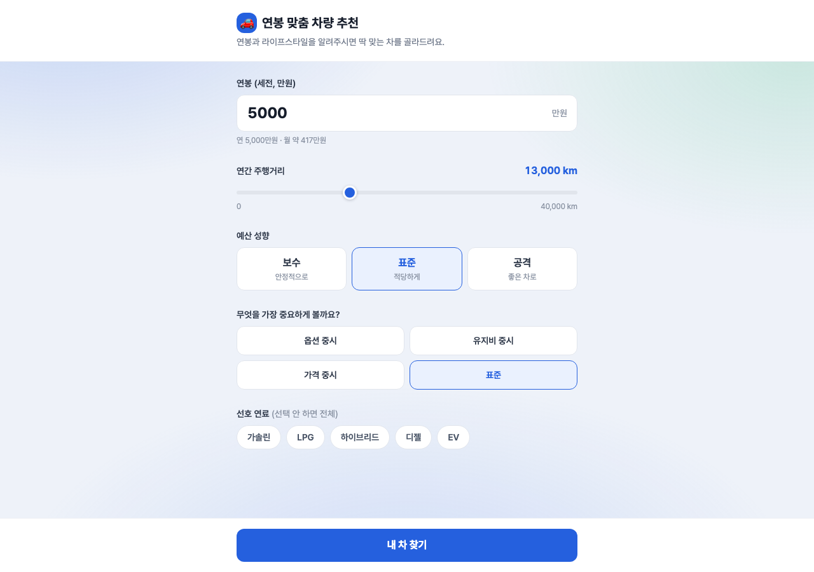

**추천 결과** — 31대, 패싯 카운트·페르소나 태그·동의어 검색창·구어 옵션 배지(등땀 방지/위에서 보는 화면)·월 유지비·예산 신호등 정상.
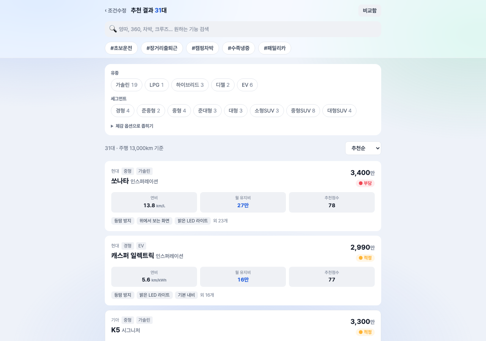

**페르소나 필터(#캠핑차박)** — 8대로 좁힘, 패싯 카운트 동적 갱신(SUV/HEV/EV 위주), 적용 옵션 수(3) 표시 → 필터 파이프라인 검증.
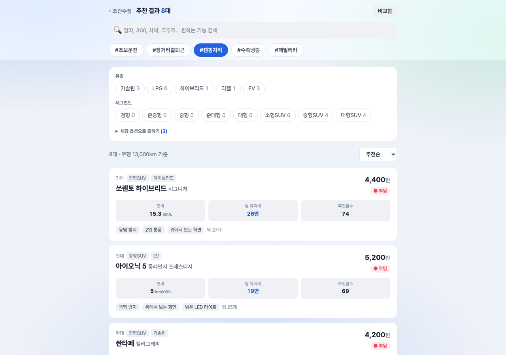

**동의어 검색("엉따")** — 검색어가 열선 옵션으로 라우팅되어 필터 적용.
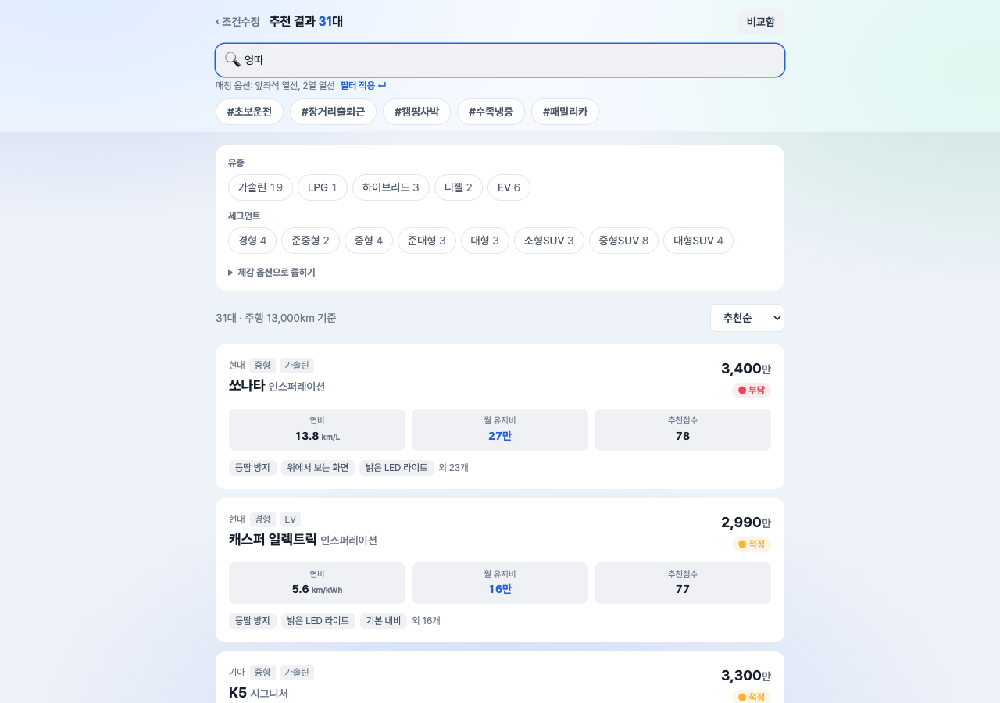

**차량 상세** — 유지비 분해(연료·세금·보험·정비) + 주행거리 슬라이더 + 옵션 매트릭스(엉따·2열 엉따·손따, 2열 통풍 미보유 표시) + 부담률.
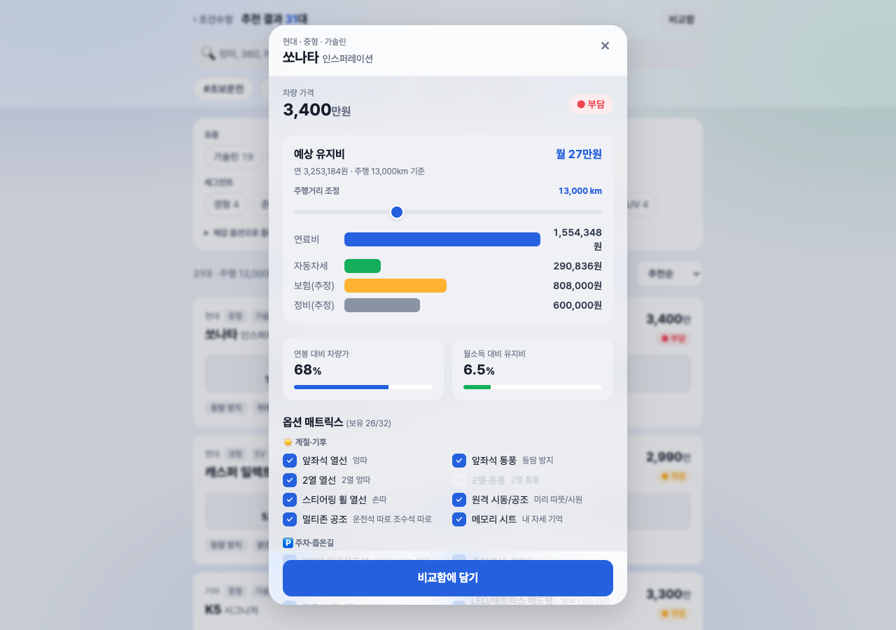

**비교함** — 2대 가격·유종·연비·유지비·옵션 그룹별 보유수 나란히.
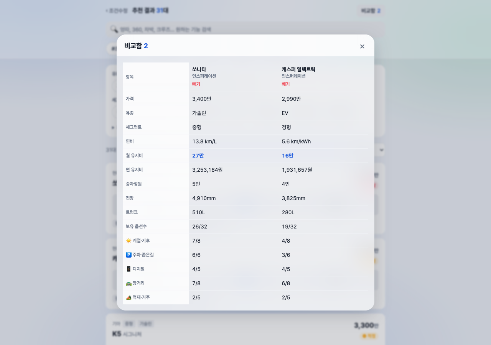

---

## 5-1. 반응형 — 모바일(390×844, dsf2·isMobile)

PC 캡처(위)와 별도로 모바일 실 뷰포트(390×844, deviceScaleFactor 2, isMobile)에서 입력→추천→필터→상세→비교 전 워크플로를 캡처. 가로 overflow 0, 사이드바 하이재킹·잘림 없음, 한글 정상. 모바일 캡처: [`captures/mobile/v1/`](./captures/mobile/v1/).

**연봉 입력** — 무엇: 연봉(4,200만)·주행거리·예산성향·우선순위·연료 입력 폼 / 의도: 모바일에서 단일 컬럼 폼이 깨짐 없이 가독되는지.
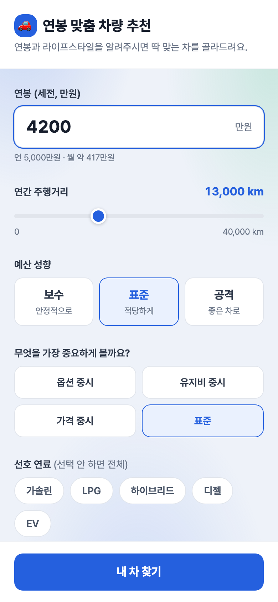

**추천 결과** — 무엇: 31대 결과·유종/세그먼트 패싯 카운트·페르소나 칩·동의어 검색창·차량 카드(월 유지비·예산 신호등) / 의도: 카드 4지표 그리드가 모바일에서 스택·가독되는지.
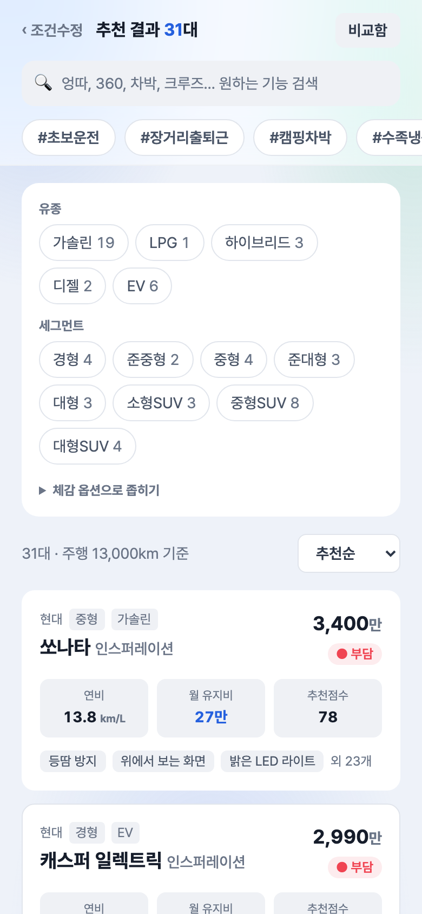

**페르소나 필터(#캠핑차박)** — 무엇: 페르소나 칩 선택 시 대수 좁힘·패싯 카운트 동적 갱신 / 의도: 필터 파이프라인이 모바일에서도 동일 동작하는지.
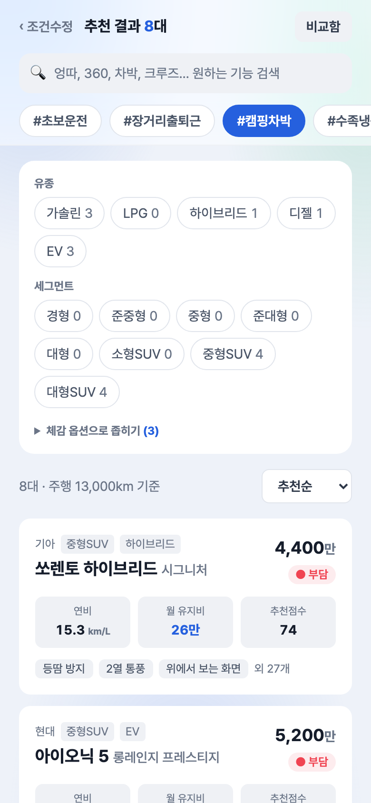

**동의어 검색("엉따")** — 무엇: 구어 검색어가 열선 옵션으로 라우팅되어 필터 적용 / 의도: 검색 입력·힌트가 좁은 화면에서 정상인지.
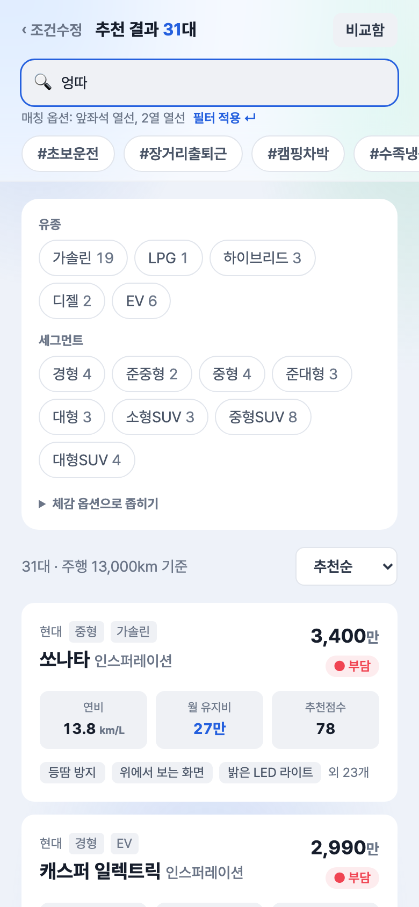

**차량 상세 — 상단** — 무엇: 바텀시트 상단의 차량가·유종·예산 신호등 / 의도: 바텀시트가 모바일 풀폭으로 자연스럽게 뜨는지.


**상세 — 유지비 분해·부담률** — 무엇: 연료·세금·보험·정비 막대 분해 + 주행거리 슬라이더 + 연봉 대비 차량가(81%)·월소득 대비 유지비(7.7%) 신호등 + 옵션 매트릭스 / 의도: 시트 내부 스크롤·막대·슬라이더가 모바일에서 정상인지.
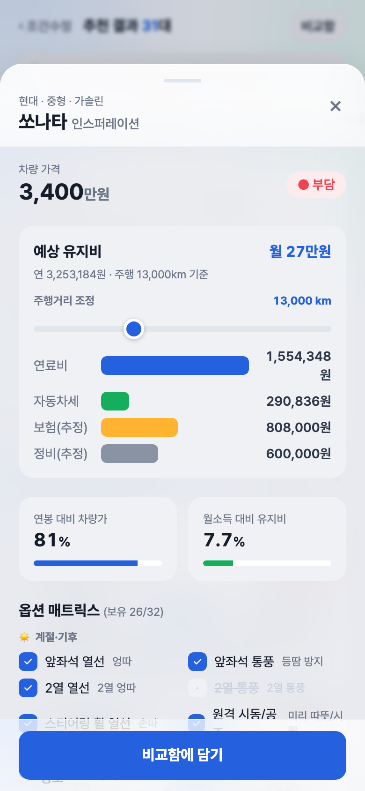

**상세 — 옵션 매트릭스** — 무엇: 32옵션 그룹별 보유 체크(앞좌석 엉따·2열 엉따·2열 통풍 등) / 의도: 2열 옵션 매트릭스가 모바일에서 줄바꿈·가독되는지.


**비교함(3대)** — 무엇: 쏘나타·캐스퍼·K5 3대를 가격·유종·세그먼트·연비·유지비·정원·전장·트렁크 행으로 나란히 / 의도: 다열 비교표가 모바일에서 가로 스크롤 없이 보이는지.
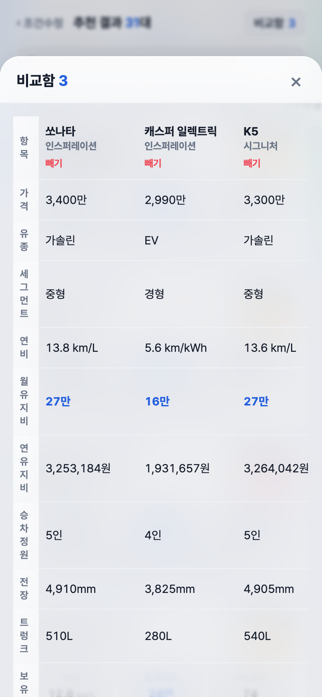

## 6. 검수 기준 충족

| 기준 | 결과 |
|---|---|
| 연봉 기반 추천 동작 | ✅ 예산 산정 + 추천점수 정렬 |
| 옵션 필터(2열 엉따·통풍 포함) | ✅ 32옵션, 칩·패싯·페르소나·동의어 |
| 예상 유지비 + 항목 분해 | ✅ 연료·세금·보험·정비, 월/연 |
| 주행거리 입력·재계산 | ✅ 슬라이더 즉시 반영 |
| 실 동작(목업 아님) | ✅ 실 필터·계산·localStorage |
| 다단계 워크플로 | ✅ 입력→필터→상세→비교 |
| 상태 지속성 | ✅ localStorage |
| 뷰 4종+ | ✅ 입력·결과·상세·비교 |
| 신규 캡처 6장 | ✅ |
| 디자인 톤 준수 | ✅ 브랜드 블루·Pretendard·해요체·52px 버튼 |
| 런타임 에러 | ✅ 0건(pageerror) |

---

## 7. 추가 확장 가능 영역

- 실데이터 확정(가격·옵션·연비·유지비 단가 `[추정]` → 출처 기반) · 트림 다중화 · 옵션 패키지/의존성 · 보조금·세제혜택 · 안전도(KNCAP) · 기계식 주차 제약 — 설계 §1.4·§2.3에 정의됨, v2 후보.

## 8. 검토 체크리스트

- [x] 모든 핵심 기능이 캡처됨
- [x] 캡처가 의도한 기능을 정확히 보여줌
- [x] 한글 깨짐 없음
- [x] 에러 화면 미포함(런타임 0건)
- [x] 결과(유지비·추천점수·필터 카운트) 정합성 확인
- [x] 요청 4기능 100% 매핑
