last_updated: 2026-06-10 15:50

# 개발결과보고서 v2 — 전기차 보조금·TCO·안전/주차 (car-advisor)

> v1([`3_개발결과보고서_v1.md`](./3_개발결과보고서_v1.md)) 위에 **전기차 보조금**을 중심으로 심화한 v2.
> 구동 환경: macOS · Chromium(file://) · 1280×980 · 백엔드 없음(오프라인). 파일: `projects/car-advisor/v2.html`(+ 확장 `data.js`).

---

## v1 한계 및 v2 개선 매핑

| v1 한계 | v2 개선 | 캡처 |
|---|---|---|
| EV도 정가만 기준 — **보조금 미반영** | 지역(시·도) 선택 → **국고+지자체 보조금 → 실구매가**. 추천 신호등·점수·비교·정렬 모두 실구매가 기준 | `03`, `05`, `10` |
| 비용이 월 유지비에 한정 | **5년 총소유비용(TCO)** = 실구매가 + 5년 운영비 − 5년 잔존가치(감가율 반영) | `05`, `06`, `08` |
| 안전·주차 제약 필터 없음 | **KNCAP ★등급 필터** + **기계식 주차 가능**(전장·전폭·무게 파생) 필터 | `03`, `07` |
| EV 추천이 충전 환경과 무관 | **자택/직장 충전 입력** → EV 추천 가점/감점 | `01` |
| 단일 입력만 | **시나리오 프로필 저장·전환**(다중 시나리오) | `11` |
| 데이터가 정적 | **외부 데이터 동기화(mock 2건)** — 보조금 테이블·유가 | `09` |

---

## v2 신규/심화 산출물

### 1. 전기차 보조금 → 실구매가 (핵심)
- 국고: 차량가 `<5,500만` 전액(650만) / `5,500~8,500만` 50% / `8,500만↑` 미지급. 지자체: 17개 시·도별([추정 2025]).
- 예: 캐스퍼 일렉트릭 정가 2,990만 → 국고 −650 + 경기 −150 = **−800만 → 실구매가 2,190만**, 친환경차 세제 감면 약 −440만.
- 카드: "정가(취소선) → 실구매가 / 보조금 −XXX만". 상세: 보조금 분해 카드.
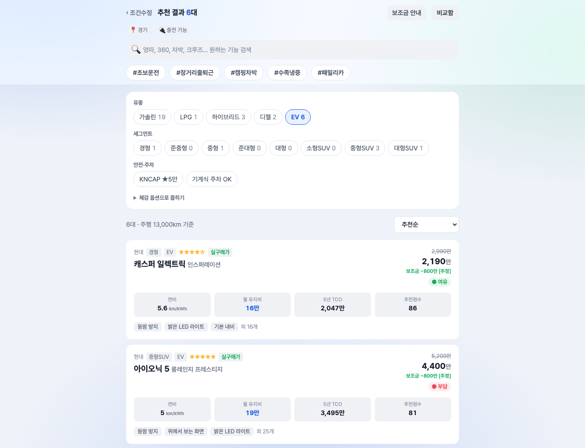
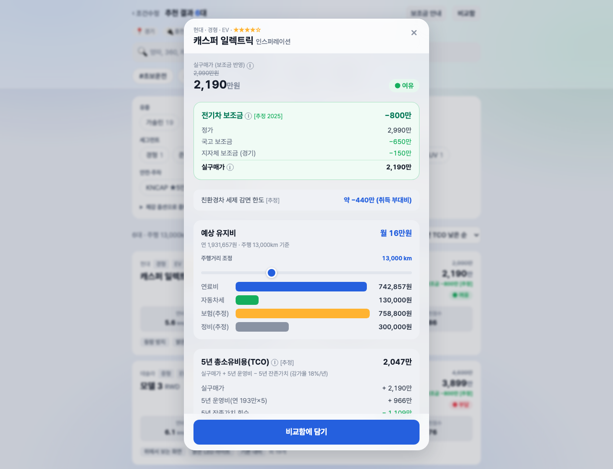
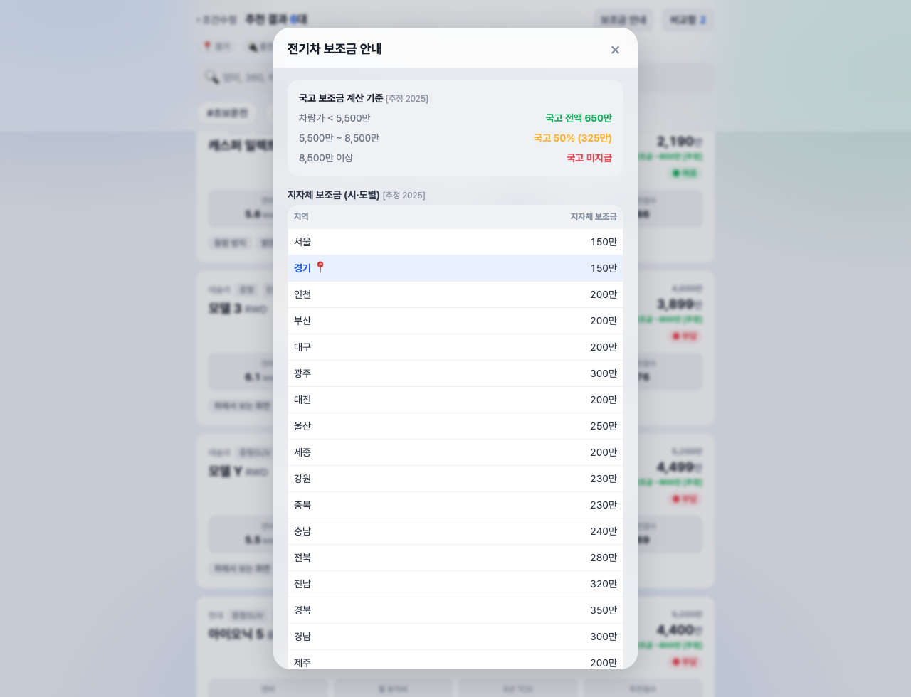

### 2. 5년 TCO (실 알고리즘)
- `TCO5 = 실구매가 + 5년 운영비(연유지비×5) − 5년 잔존가치(price×(1−감가율)^5)`. 정렬 "5년 TCO 낮은 순" 추가.
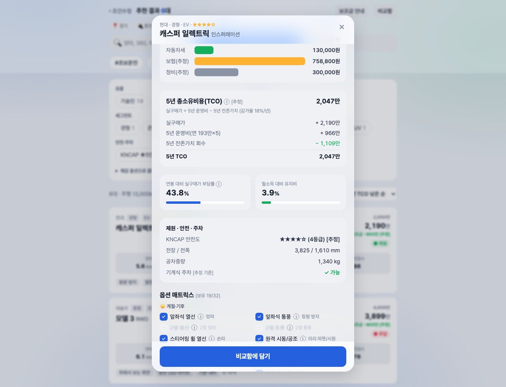 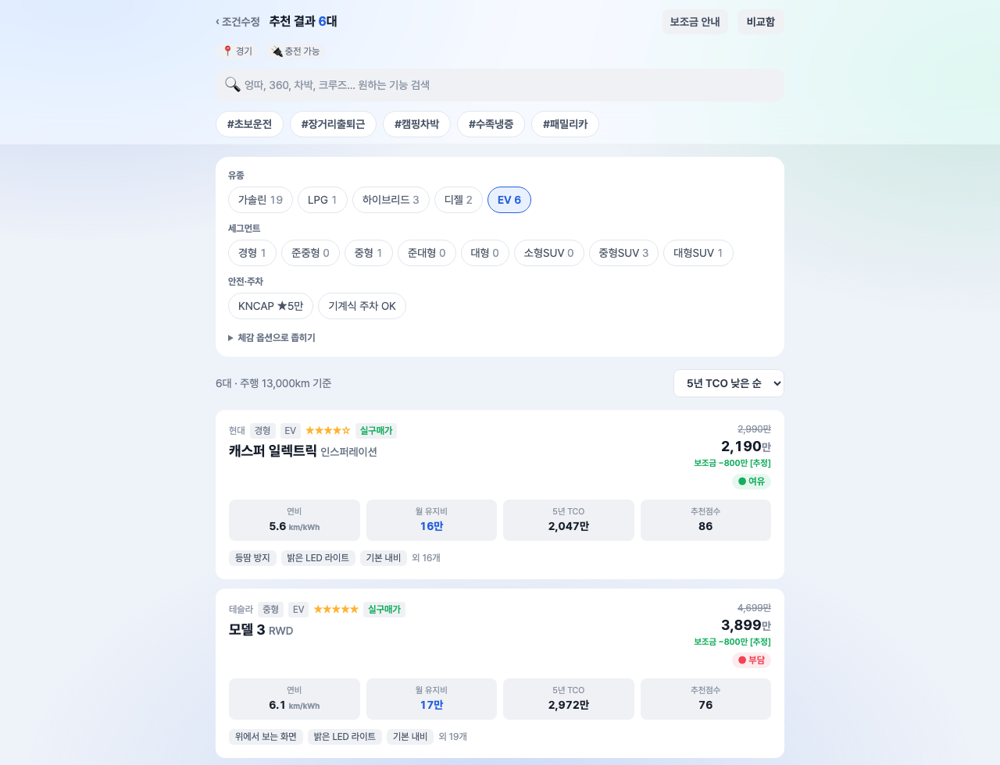

### 3. 신규 필터 · 충전 · 프로필 · 동기화

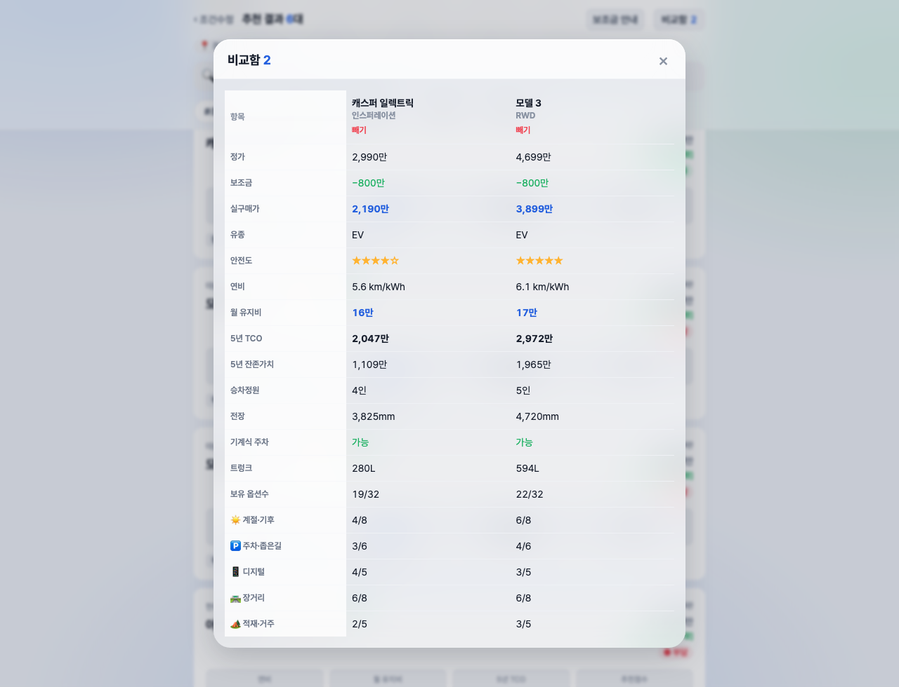
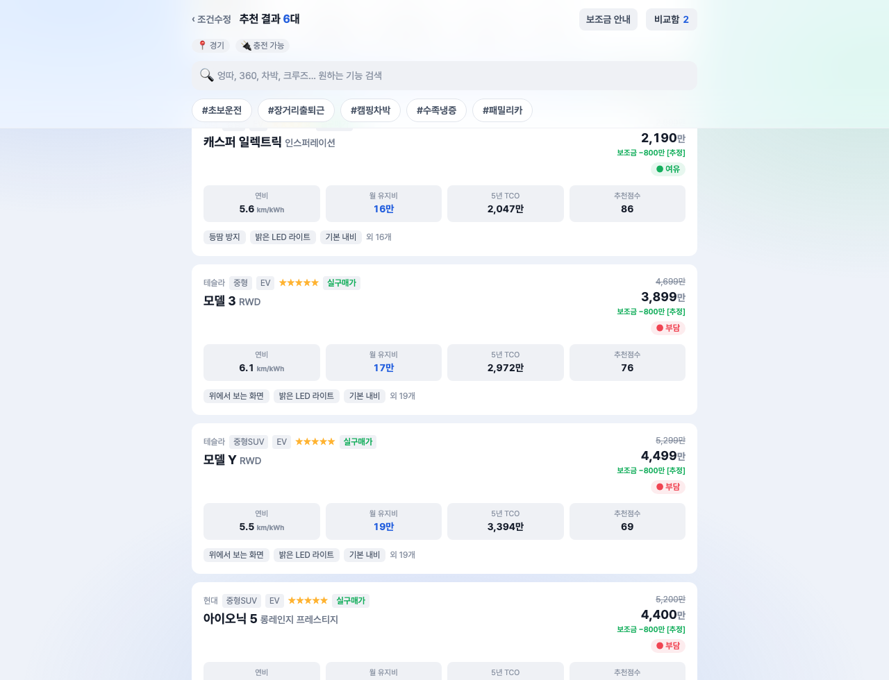
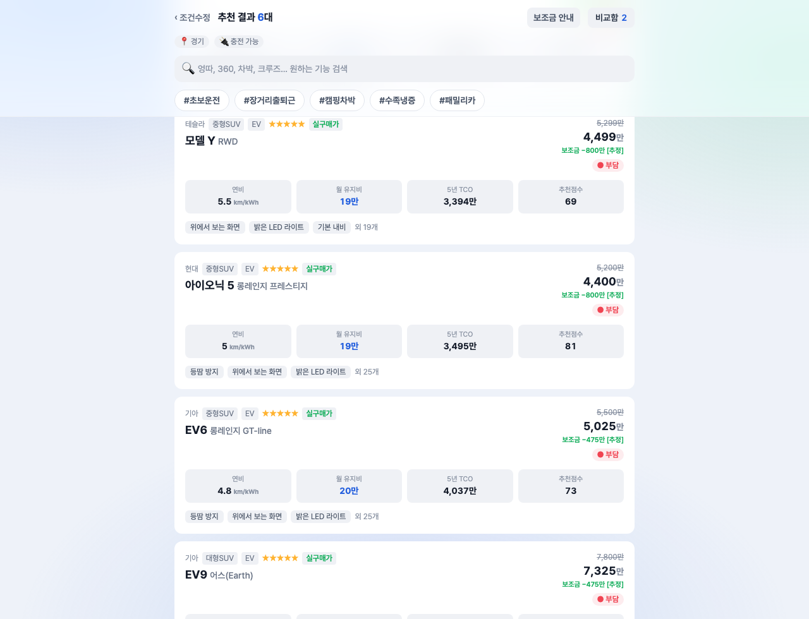
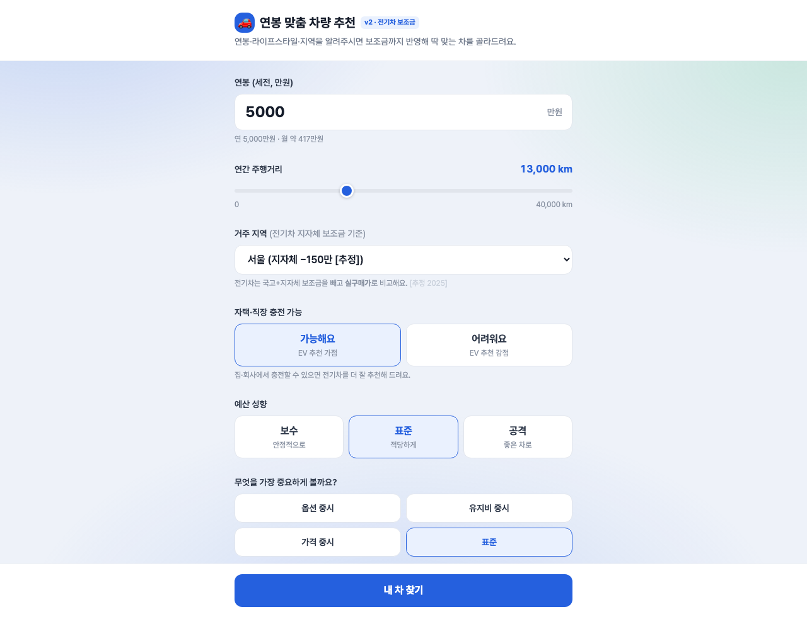

### 4. v2 패치 — 옵션·정보 ⓘ 툴팁 (사용자 요청)
- 옵션 매트릭스의 32개 옵션 라벨, 핵심 금융 용어(실구매가·전기차 보조금·5년 TCO·부담률)에 **ⓘ 아이콘** 추가 → 마우스 hover(및 키보드 focus) 시 **떠 있는 툴팁**으로 세부설명 표시.
- 데이터: `data.js`에 `OPTION_DESC`(32개 해요체 설명) 추가. 디자인 톤(흰 카드·그림자·13px·radius 12px) 준수. 런타임 0건, 필터 토글 기능 무파손 확인.
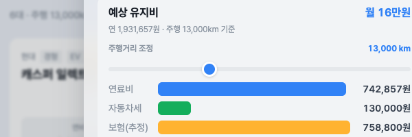

> 📊 경쟁사 분석 + 차별화 기능 32개 제안: [`5_research/경쟁사분석_차별화기능.md`](./5_research/경쟁사분석_차별화기능.md) — v3 로드맵 기반.

---

## 반응형 — 모바일(390×844)

PC 캡처(위)와 별도로 모바일에서도 EV 보조금·실구매가·TCO·상세 시트가 정상 적응(가로 overflow 0). 모바일 캡처: [`captures/mobile/v2/`](./captures/mobile/v2/).
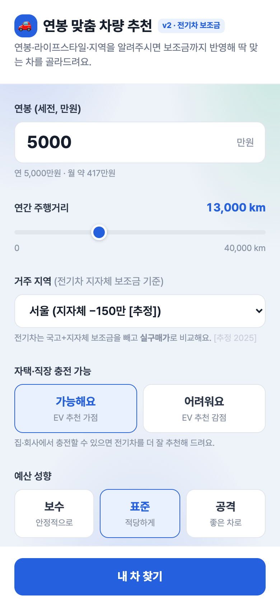 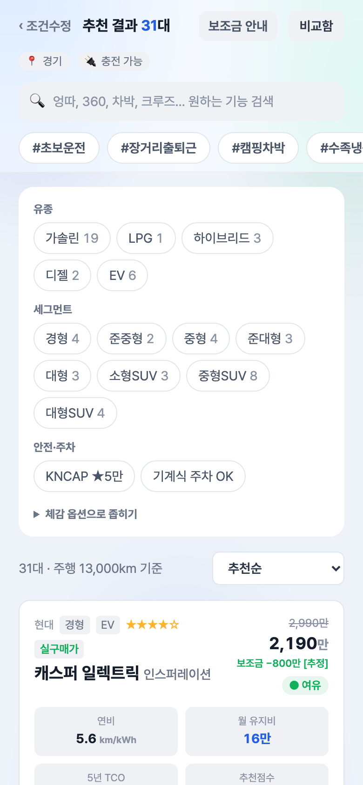 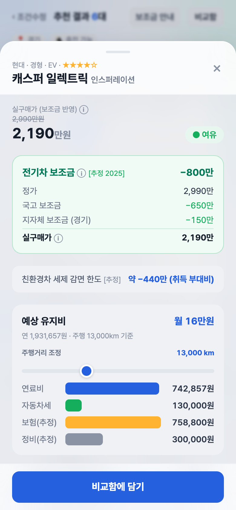

## 검수 기준 충족 (v2)

| 기준(5억급) | 결과 |
|---|---|
| 실 알고리즘 | ✅ 보조금 차등 + 5년 TCO(감가·잔존가치) |
| 외부 통합 2건+ | ✅ 보조금 테이블·유가 mock 동기화(로그) |
| 다중 시나리오 | ✅ 프로필 저장·전환(localStorage `carAdvisorV2`) |
| 뷰 8종+ | ✅ 입력·결과·상세·비교·프로필·동기화·보조금안내·TCO분해 |
| 워크플로 3+ | ✅ 추천 / 시나리오 / 동기화 |
| 신규 캡처 10장+ | ✅ 11장(`captures/v2/`) |
| v1 한계 매핑 | ✅ 상단 표 |
| 디자인 톤 | ✅ v1 동일(브랜드 블루·Pretendard·해요체·52px) |
| 런타임 에러 | ✅ 0건 / v1 미파손(데이터 추가만) |

> 모든 보조금·세제·유가 수치는 `[추정]/[mock]`. 실제는 무공해차 통합누리집·지자체·오피넷 확인 필요(앱 푸터 고지).

## 검토 체크리스트
- [x] 핵심 기능(보조금·실구매가·TCO) 캡처
- [x] 캡처가 의도 기능을 정확히 보여줌
- [x] 한글 깨짐 없음 / 에러 화면 없음
- [x] 보조금·TCO 수치 정합성 확인(국고 650+지자체 150=800, EV 자동차세 정액 13만)
- [x] v1 한계 매핑표 + 5억 가치 기준 충족
