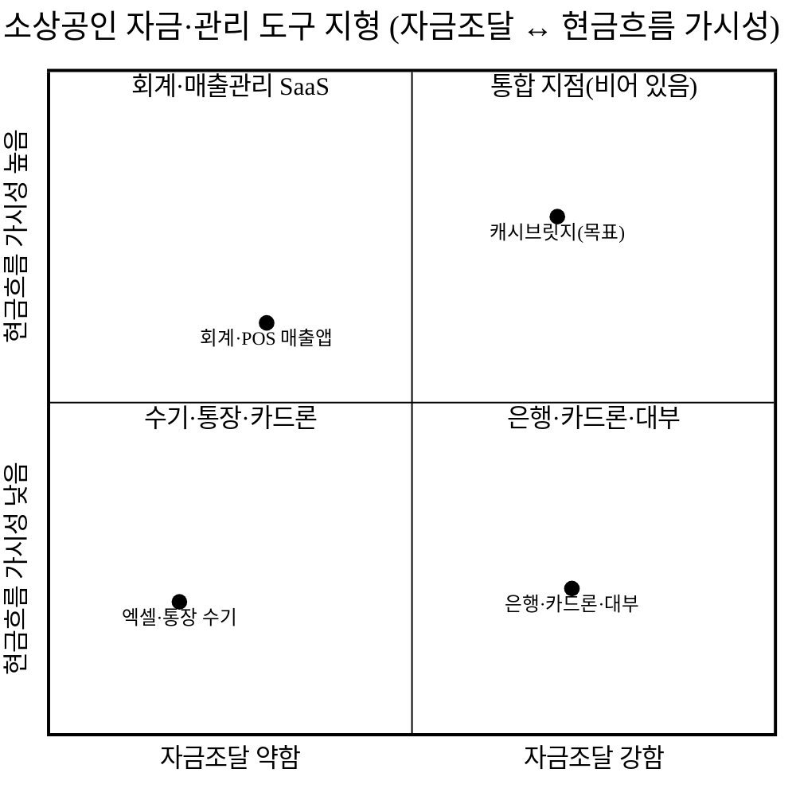
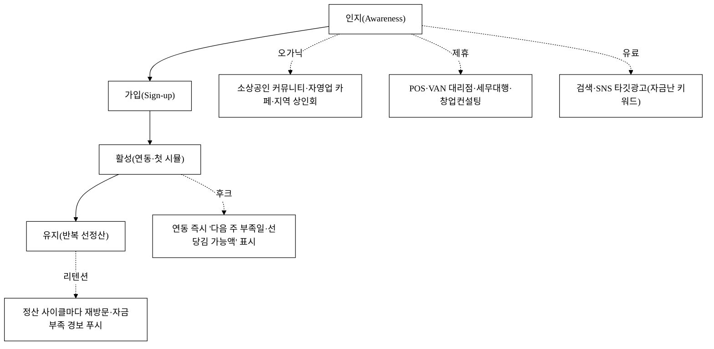
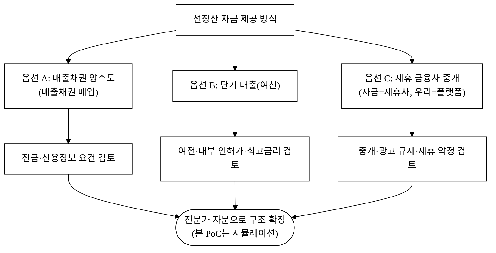
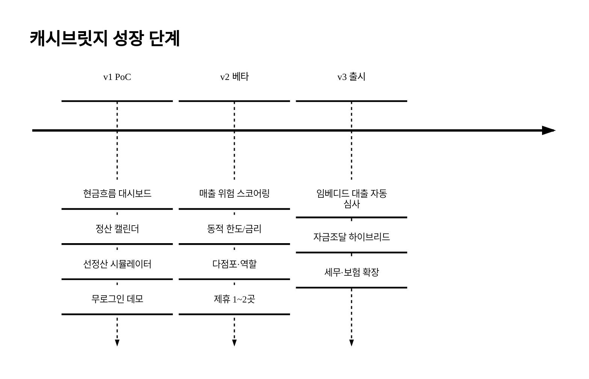

last_updated: 2026-06-25 14:30

# 캐시브릿지 — 소상공인 카드매출 선정산·현금흐름·임베디드 대출 핀테크

| 항목 | 내용 |
|:---|:---|
| 사업명 | 대구대학교 창업지원단 「2026년 창업동아리 지원사업(실전창업)」 |
| 주관기관 | 대구대학교 창업지원단 |
| 트랙 | 실전창업 |
| 지원금 | 기본 300만원 · 최대 1,000만원 |
| 모집기간 | 2026-03-19 ~ 2026-04-02 |
| 아이템 | 소상공인 카드매출 선정산·현금흐름 관리·임베디드 대출 핀테크 「캐시브릿지」 |
| 타깃 | 카드매출 비중이 높은 영세·중소 소상공인(음식점·미용·소매·생활서비스) — 월 카드매출 500만~5,000만원, 운영자금 회전이 빡빡한 1~5인 점포 |
| 산출물 | 웹 기반 현금흐름·선정산 PoC(v1: 카드매출 집계·예상 정산일 캘린더·선정산 한도/수수료 시뮬레이터·현금흐름 대시보드) → 차별 기술 승격(v2: 매출 기반 연체·부실 위험 스코어링 / v2·v3: 동적 한도·금리 산정 / v3: 임베디드 대출 신청·심사·상환 흐름) |

> 본 제안서는 공고가 요구하는 PSST(Problem · Solution · Scale-up · Team) 구조를 따른다.
> Team 섹션은 골격만 두고 내용은 사용자가 직접 채운다([§Team](#4-team--팀)).
> ⚠️ 본 제안의 선정산·대출 한도·수수료·금리 수치는 **시제품 시뮬레이션용 가정값**이며, 실제 금융상품 한도·요율은 여신전문금융업법·대부업법·전자금융거래법 등 관계 법령과 인허가 범위에서만 확정된다(§핀테크 규제). 본문 미확정 수치는 모두 `[추정]`으로 표기한다.

---

## 1. Problem — 문제 정의

### P-1. "매출은 오늘, 돈은 다음 주" — 소상공인의 구조적 현금흐름 시차

대한민국 소비의 대부분은 카드(신용·체크)·간편결제로 일어난다. 한국은행 지급결제 통계 기준 민간 최종소비지출에서 신용·체크카드 결제 비중은 수년째 가장 큰 결제수단이다[^1]. 소비자는 "긁는" 순간 끝나지만, **가맹점(소상공인)에게 그 돈이 들어오는 시점은 오늘이 아니다.** 카드사·PG·VAN을 거쳐 영업일 기준 며칠 뒤에 정산되며, 그 사이에 주말·공휴일이 끼면 시차는 더 벌어진다[^2].

```mermaid
%%{init: {"theme":"base","themeVariables":{"darkMode":false,"background":"#ffffff","fontFamily":"Georgia, serif","primaryColor":"#ffffff","primaryBorderColor":"#000000","primaryTextColor":"#000000","secondaryColor":"#ffffff","secondaryBorderColor":"#000000","secondaryTextColor":"#000000","tertiaryColor":"#ffffff","tertiaryBorderColor":"#000000","tertiaryTextColor":"#000000","mainBkg":"#ffffff","secondBkg":"#ffffff","lineColor":"#000000","textColor":"#000000","nodeBorder":"#000000","nodeTextColor":"#000000","titleColor":"#000000","edgeLabelBackground":"#ffffff","defaultLinkColor":"#000000","clusterBkg":"#ffffff","clusterBorder":"#000000","actorBkg":"#ffffff","actorBorder":"#000000","actorTextColor":"#000000","actorLineColor":"#000000","signalColor":"#000000","signalTextColor":"#000000","labelBoxBkgColor":"#ffffff","labelBoxBorderColor":"#000000","labelTextColor":"#000000","loopTextColor":"#000000","noteBkgColor":"#ffffff","noteBorderColor":"#000000","noteTextColor":"#000000","activationBkgColor":"#ffffff","activationBorderColor":"#000000","sequenceNumberColor":"#000000","attributeBackgroundColorOdd":"#ffffff","attributeBackgroundColorEven":"#ffffff","sectionBkgColor":"#ffffff","altSectionBkgColor":"#ffffff","sectionBkgColor2":"#ffffff","taskBkgColor":"#ffffff","taskBorderColor":"#000000","taskTextColor":"#000000","taskTextLightColor":"#000000","taskTextOutsideColor":"#000000","taskTextDarkColor":"#000000","taskTextClickableColor":"#000000","activeTaskBkgColor":"#ffffff","activeTaskBorderColor":"#000000","doneTaskBkgColor":"#ffffff","doneTaskBorderColor":"#000000","critBkgColor":"#ffffff","critBorderColor":"#000000","gridColor":"#000000","todayLineColor":"#000000","quadrant1Fill":"#ffffff","quadrant2Fill":"#ffffff","quadrant3Fill":"#ffffff","quadrant4Fill":"#ffffff","quadrant1TextFill":"#000000","quadrant2TextFill":"#000000","quadrant3TextFill":"#000000","quadrant4TextFill":"#000000","quadrantPointFill":"#000000","quadrantPointTextFill":"#000000","quadrantXAxisTextFill":"#000000","quadrantYAxisTextFill":"#000000","quadrantInternalBorderStrokeFill":"#000000","quadrantExternalBorderStrokeFill":"#000000","quadrantTitleFill":"#000000","pieStrokeColor":"#000000","pieOuterStrokeColor":"#000000","pieTitleTextColor":"#000000","pieSectionTextColor":"#000000","pieLegendTextColor":"#000000","cScale0":"#ffffff","cScaleLabel0":"#000000","cScaleInv0":"#000000","pie1":"#ffffff","cScale1":"#ffffff","cScaleLabel1":"#000000","cScaleInv1":"#000000","pie2":"#ffffff","cScale2":"#ffffff","cScaleLabel2":"#000000","cScaleInv2":"#000000","pie3":"#ffffff","cScale3":"#ffffff","cScaleLabel3":"#000000","cScaleInv3":"#000000","pie4":"#ffffff","cScale4":"#ffffff","cScaleLabel4":"#000000","cScaleInv4":"#000000","pie5":"#ffffff","cScale5":"#ffffff","cScaleLabel5":"#000000","cScaleInv5":"#000000","pie6":"#ffffff","cScale6":"#ffffff","cScaleLabel6":"#000000","cScaleInv6":"#000000","pie7":"#ffffff","cScale7":"#ffffff","cScaleLabel7":"#000000","cScaleInv7":"#000000","pie8":"#ffffff","cScale8":"#ffffff","cScaleLabel8":"#000000","cScaleInv8":"#000000","pie9":"#ffffff","cScale9":"#ffffff","cScaleLabel9":"#000000","cScaleInv9":"#000000","pie10":"#ffffff","cScale10":"#ffffff","cScaleLabel10":"#000000","cScaleInv10":"#000000","pie11":"#ffffff","cScale11":"#ffffff","cScaleLabel11":"#000000","cScaleInv11":"#000000","pie12":"#ffffff"}}}%%
flowchart LR
    A["소비자 카드 결제<br/>(오늘)"] --> B["VAN·PG 승인·집계"]
    B --> C["카드사 정산 처리<br/>(영업일 기준 N일)"]
    C --> D["가맹점 계좌 입금<br/>(주말·공휴일 지연 가산)"]
    A -. "그 사이" .-> G["재료비·인건비·임대료·세금<br/>은 오늘 나간다"]
    G --> X(["현금 공백<br/>→ 고금리 대출·카드론·연체"])
```

**그림 1.** 카드매출의 정산 시차와 소상공인 현금 공백 구조.

### P-2. 시차가 만드는 손실은 추상적이지 않다

매출 시점과 입금 시점의 시차는 단순한 불편이 아니라 **돈이 새는 구멍**이다.

- **운영자금 공백 → 고금리 메우기:** 재료비·인건비·임대료·부가세는 정산일을 기다려주지 않는다. 입금 전 공백을 카드론·현금서비스·대부업·사채로 메우면, 며칠 뒤 들어올 자기 돈을 연 수십 % 비용으로 당겨쓰는 셈이다.
- **현금흐름 가시성 부재 → 흑자도산:** 장부상 매출은 나는데 통장은 비는 "흑자도산"형 위기. 다수 소상공인은 다음 주에 얼마가 들어오는지, 이번 달 자금이 마이너스로 꺾이는 날이 언제인지를 **숫자로 보지 못한다.**
- **반복되는 폐업·부채 누적:** 자영업 폐업률은 높고[^3], 폐업 사유 상위에 자금 압박·운영난이 반복 등장한다. 코로나 이후 소상공인 대출 잔액·연체는 구조적으로 높은 수준에서 내려오지 않았다[^4].
- **정보 비대칭 → 비싼 자금:** 영세 소상공인은 신용평가에서 불리해 제도권 저금리 자금 접근이 어렵고, 결국 더 비싼 자금으로 밀려난다[^5].

### P-3. 기존 대안의 공백 — "관리는 따로, 자금은 따로, 둘 다 비쌈"

소상공인이 쓰는 현재 도구는 세 갈래인데, 각자 한쪽만 푼다.

**그림 2.** 도구 지형 — 현금흐름을 보여주는 도구와 자금을 주는 도구가 분리되어 있고, 둘을 잇는 통합 지점이 비어 있다.

회계·POS 매출앱은 "얼마 벌었나"는 보여주지만 자금을 당겨주진 못한다. 은행·카드론·대부는 자금을 주지만 비싸고, 신청 시점에 점주의 실시간 매출·현금흐름 맥락을 모른다. **점주는 매번 "관리 도구 따로, 급할 때 비싼 돈 따로"를 오간다.** 정산 전 자기 매출을 근거로, 현금흐름을 보면서, 필요한 만큼만 당겨쓰는 통합 지점이 비어 있다.

---

## 2. Solution — 솔루션

### S-1. 캐시브릿지 한 줄 정의

> **캐시브릿지는 소상공인의 카드매출을 근거로 (1) 다가올 현금흐름을 한눈에 보여주고, (2) 정산 전 매출을 필요한 만큼 미리 당겨주며(선정산), (3) 매출 데이터에 임베디드된 단기 운영자금 대출까지 한 화면에서 잇는 현금흐름·자금조달 핀테크다.**

캐시브릿지는 "매출은 났는데 통장이 비는" 시차 그 자체를 메운다. 점주가 이미 만든 매출을 데이터로 받아, **현금흐름 가시성 → 선정산 → 임베디드 대출**의 세 단계를 하나의 흐름으로 연결한다.

### S-2. 핵심 기능 (PoC v1에서 모두 실 동작) + 차별 기술 로드맵 연결

아래 기능은 **PoC v1에서 토스트 mock이 아니라 실 동작**한다(키 부재 시 mock 매출 데이터로 오프라인 시연 보장). 마지막 열은 각 기능이 §차별화 기술 구매동인 논증의 **3대 차별 기술**(매출 기반 위험 스코어링·동적 한도/금리 산정·임베디드 대출 흐름)로 어떻게 **승격**되는지를 가리킨다.

| 기능 | 무엇을 해결 | PoC v1 구현(실 동작) | 차별 기술로의 승격(로드맵) |
|:---|:---|:---|:---|
| ① 현금흐름 대시보드 | "다음 주 통장이 어떻게 되나" | 카드매출 집계 + 예상 입금·고정지출 타임라인 + 자금부족 예측일 KPI/차트 | → **위험 스코어링**(v2): 매출 변동성·하락 추세를 부실 신호로 |
| ② 정산 캘린더 | "이 매출은 언제 들어오나" | 매출 건별 예상 정산일 캘린더(영업일·공휴일 보정) + 누적 입금 곡선 | → **동적 한도**(v2/v3): 정산 예정액을 담보 기준선으로 |
| ③ 선정산 시뮬레이터 | "지금 당기면 얼마, 수수료 얼마" | 한도·선정산액·수수료·실수령액·정산 차감 일정 실시간 계산 | → **동적 금리**(v2/v3): 위험등급별 요율 차등 |
| ④ 임베디드 대출 신청 | "관리하다 그 자리에서 자금" | 한도 조회→약정 미리보기→신청→상환 스케줄(시뮬) 다단계 흐름 | → **임베디드 대출 심사**(v3): 스코어→자동 한도·승인 |
| ⑤ 상환·정산 차감 추적 | "얼마 갚았고 얼마 남았나" | 선정산·대출 잔액 + 향후 정산에서 자동 차감되는 상환 스케줄 추적 | → 상환 행동 → 위험 스코어 갱신(v2/v3 피드백 루프) |

> **논증–산출물 정합(중요).** §차별화 기술 구매동인에서 must-have로 논증하는 차별 기술의 **1차 정박점은 v1 PoC가 실제 구현한 기능**이다. ③ 선정산 시뮬레이터의 **실시간 한도·수수료·실수령 계산**이 "정산 전 내 돈을 본다·당긴다"는 핵심 가치를 v1 시점에 이미 작동시킨다. 그 위에서 위험 스코어링·동적 금리는 v2 심화, 임베디드 대출 자동 심사는 v3 확장으로 단계 구분된다.

#### S-2-1. 5기능 ↔ 3차별 기술 매핑

| 핵심 기능(v1 실 데이터) | 매출 기반 위험 스코어링 | 동적 한도/금리 산정 | 임베디드 대출 흐름 |
|:---|:---:|:---:|:---:|
| ① 현금흐름 대시보드 | ◎ 변동성·추세 원천 | 자금부족 시점 입력 | 트리거(부족 예측) |
| ② 정산 캘린더 | 입금 안정성 신호 | ◎ 정산예정액=담보 기준 | 한도 산정 근거 |
| ③ 선정산 시뮬레이터 | 사용 빈도 신호 | ◎ 요율 산정 엔진 | 1차 자금 경로 |
| ④ 임베디드 대출 신청 | 신청 맥락 데이터 | 한도·금리 적용 | ◎ 신청·심사 흐름 |
| ⑤ 상환·정산 차감 추적 | ◎ 상환행동→스코어 갱신 | 한도 재조정 | 상환 관리 |

◎ = 해당 차별 기술의 **주 데이터 원천**. 3대 차별 기술 모두 **별도 입력 없이 v1 기능이 쌓는 매출·정산·상환 데이터에서 파생**되므로, 차별점이 산출물(PoC)과 분리된 공허한 주장이 아니다.

### S-3. 핵심 워크플로 — 매출에서 자금까지 한 흐름

```mermaid
%%{init: {"theme":"base","themeVariables":{"darkMode":false,"background":"#ffffff","fontFamily":"Georgia, serif","primaryColor":"#ffffff","primaryBorderColor":"#000000","primaryTextColor":"#000000","secondaryColor":"#ffffff","secondaryBorderColor":"#000000","secondaryTextColor":"#000000","tertiaryColor":"#ffffff","tertiaryBorderColor":"#000000","tertiaryTextColor":"#000000","mainBkg":"#ffffff","secondBkg":"#ffffff","lineColor":"#000000","textColor":"#000000","nodeBorder":"#000000","nodeTextColor":"#000000","titleColor":"#000000","edgeLabelBackground":"#ffffff","defaultLinkColor":"#000000","clusterBkg":"#ffffff","clusterBorder":"#000000","actorBkg":"#ffffff","actorBorder":"#000000","actorTextColor":"#000000","actorLineColor":"#000000","signalColor":"#000000","signalTextColor":"#000000","labelBoxBkgColor":"#ffffff","labelBoxBorderColor":"#000000","labelTextColor":"#000000","loopTextColor":"#000000","noteBkgColor":"#ffffff","noteBorderColor":"#000000","noteTextColor":"#000000","activationBkgColor":"#ffffff","activationBorderColor":"#000000","sequenceNumberColor":"#000000","attributeBackgroundColorOdd":"#ffffff","attributeBackgroundColorEven":"#ffffff","sectionBkgColor":"#ffffff","altSectionBkgColor":"#ffffff","sectionBkgColor2":"#ffffff","taskBkgColor":"#ffffff","taskBorderColor":"#000000","taskTextColor":"#000000","taskTextLightColor":"#000000","taskTextOutsideColor":"#000000","taskTextDarkColor":"#000000","taskTextClickableColor":"#000000","activeTaskBkgColor":"#ffffff","activeTaskBorderColor":"#000000","doneTaskBkgColor":"#ffffff","doneTaskBorderColor":"#000000","critBkgColor":"#ffffff","critBorderColor":"#000000","gridColor":"#000000","todayLineColor":"#000000","quadrant1Fill":"#ffffff","quadrant2Fill":"#ffffff","quadrant3Fill":"#ffffff","quadrant4Fill":"#ffffff","quadrant1TextFill":"#000000","quadrant2TextFill":"#000000","quadrant3TextFill":"#000000","quadrant4TextFill":"#000000","quadrantPointFill":"#000000","quadrantPointTextFill":"#000000","quadrantXAxisTextFill":"#000000","quadrantYAxisTextFill":"#000000","quadrantInternalBorderStrokeFill":"#000000","quadrantExternalBorderStrokeFill":"#000000","quadrantTitleFill":"#000000","pieStrokeColor":"#000000","pieOuterStrokeColor":"#000000","pieTitleTextColor":"#000000","pieSectionTextColor":"#000000","pieLegendTextColor":"#000000","cScale0":"#ffffff","cScaleLabel0":"#000000","cScaleInv0":"#000000","pie1":"#ffffff","cScale1":"#ffffff","cScaleLabel1":"#000000","cScaleInv1":"#000000","pie2":"#ffffff","cScale2":"#ffffff","cScaleLabel2":"#000000","cScaleInv2":"#000000","pie3":"#ffffff","cScale3":"#ffffff","cScaleLabel3":"#000000","cScaleInv3":"#000000","pie4":"#ffffff","cScale4":"#ffffff","cScaleLabel4":"#000000","cScaleInv4":"#000000","pie5":"#ffffff","cScale5":"#ffffff","cScaleLabel5":"#000000","cScaleInv5":"#000000","pie6":"#ffffff","cScale6":"#ffffff","cScaleLabel6":"#000000","cScaleInv6":"#000000","pie7":"#ffffff","cScale7":"#ffffff","cScaleLabel7":"#000000","cScaleInv7":"#000000","pie8":"#ffffff","cScale8":"#ffffff","cScaleLabel8":"#000000","cScaleInv8":"#000000","pie9":"#ffffff","cScale9":"#ffffff","cScaleLabel9":"#000000","cScaleInv9":"#000000","pie10":"#ffffff","cScale10":"#ffffff","cScaleLabel10":"#000000","cScaleInv10":"#000000","pie11":"#ffffff","cScale11":"#ffffff","cScaleLabel11":"#000000","cScaleInv11":"#000000","pie12":"#ffffff"}}}%%
flowchart LR
    U["① 매출 연동<br/>(POS·카드사·mock)"] --> D["② 현금흐름 대시보드<br/>자금부족 예측일"]
    D --> S["③ 정산 캘린더<br/>예상 입금일·금액"]
    S --> Q{"④ 자금 필요?"}
    Q -- "소액·단기" --> P["⑤ 선정산<br/>한도·수수료·실수령 계산"]
    Q -- "더 필요" --> L["⑤' 임베디드 대출<br/>한도·금리·약정"]
    P --> R["⑥ 향후 정산서 자동 차감 상환"]
    L --> R
    R -. "상환 이력" .-> D
```

**그림 3.** 핵심 워크플로 — 한 데이터(매출)가 가시성→선정산→대출→상환으로 흐른다.

---

## 경영혁신·창업학적 프레임워크

본 사업은 단일 아이템 설명이 아니라 **세 가지 경영·창업 이론의 교차점**에서 정당화된다.

### F-1. Christensen 파괴적 혁신 — "비소비(non-consumption)"를 겨냥

Clayton Christensen의 파괴적 혁신 이론[^6]에서 가장 큰 시장은 기존 제품의 상위 고객이 아니라 **"기존 솔루션이 과하거나 비싸서 아예 안 쓰는 비소비층"**이다. 영세 소상공인은 은행 여신 심사에서 밀려나거나 절차·비용이 과해 **제도권 단기 운영자금을 사실상 "비소비"** 한다. 캐시브릿지는 이들이 이미 보유한 카드매출 데이터를 근거로, 은행이 보기엔 작고 번거로운 단기·소액 자금 수요를 **충분히 좋은(good-enough) 임베디드 형태**로 흡수한다 — 전형적인 로우엔드 파괴 진입이다.

### F-2. Kim·Mauborgne 블루오션 — ERRC로 "관리×자금"의 경계 해체

기존 시장은 "현금흐름 관리 SaaS"와 "대출/대부" 두 레드오션으로 갈라져 있다. 블루오션 전략[^7]의 ERRC 격자로 본 사업의 가치곡선을 재구성한다.

| ERRC | 항목 | 내용 |
|:---|:---|:---|
| **제거(Eliminate)** | 별도 대출 신청 여정 | 관리 화면을 벗어나 은행·앱을 따로 찾는 단절 제거 |
| **감소(Reduce)** | 자금조달 비용·시간 | 매출 데이터 기반 즉시 한도 조회로 심사 마찰·금리 부담 감소 |
| **증대(Raise)** | 현금흐름 가시성 | 다음 주 통장을 숫자로 예측, 자금부족일 사전 경보 |
| **창조(Create)** | 정산 전 매출 선당김(선정산) | "내 돈을 며칠 먼저" — 대출도 보조금도 아닌 새 카테고리 |

### F-3. JTBD(Jobs To Be Done) — 점주가 고용하는 "일"

점주가 캐시브릿지를 "고용"하는 진짜 Job은 *"자금 때문에 가게가 흔들리지 않게, 다음 주 통장을 미리 알고 필요할 때 내 매출을 당겨쓰게 해줘"* 다. 이 Job은 §차별화 기술 구매동인의 must-have 가설로 직결된다.

> **요약:** Christensen으로 *왜 비소비층이 큰 기회인가*, 블루오션으로 *왜 관리×자금 통합이 새 시장인가*, JTBD로 *점주가 고용하는 실제 일이 무엇인가*를 정렬한다. (보강 이론: Ries 린 스타트업 — v1→v2→v3 사이클 자체가 검증 가능한 가설 실험, Porter 5 Forces — §차별성 경쟁우위.)

---

## 고객확보(GTM)

### G-1. ICP(이상적 고객 프로파일) 세분화

| 세그먼트 | 특징 | 우선순위 | 진입 근거 |
|:---|:---|:---:|:---|
| 음식점·카페 | 카드매출 비중 높음·일매출 변동·재료비 선지출 | 1순위 | 현금 공백 통증이 가장 빈번·즉각적 |
| 미용·뷰티·생활서비스 | 객단가 중간·예약 매출·인건비 비중 | 2순위 | 정산 시차 체감 + 단골 데이터 축적 |
| 동네 소매·편의 | 박리다매·일 매출 다건 | 3순위 | 매출 데이터 풍부, 위험 모델 정교화 |
| 온라인 셀러(PG 정산) | 정산주기 김·환불 변수 | 4순위(확장) | PG 정산 시차가 더 길어 통증 큼 |

### G-2. 획득 채널별 전술

**그림 4.** 인지→가입→활성→유지 퍼널과 채널별 전술.

- **오가닉:** 자영업 온라인 카페·지역 상인회·업종 단톡방에 "정산일 계산기·현금흐름 점검표" 무료 도구를 미끼(lead magnet)로 배포.
- **제휴(핵심):** POS·VAN 대리점, 세무대행, 창업컨설팅과 제휴 — 점주 접점을 이미 쥔 채널에 레버리지. 소상공인 핀테크의 표준 GTM이다.
- **유료:** "사장님 대출", "카드매출 선정산", "운영자금" 등 자금난 의도 키워드에 타깃 광고.

### G-3. 첫 100 / 첫 1,000 확보 계획

| 단계 | 목표 | 방법 |
|:---|:---|:---|
| 첫 100 | 통증 검증·위험 모델 시드 | 1순위 업종(음식점) 직접 영업 + 무료 현금흐름 점검 워크숍, 베타 무수수료 |
| 첫 1,000 | 제휴 채널 가동 | POS·세무대행 1~2곳 제휴로 기설치 고객 인입 + 추천 인센티브(추천 시 수수료 할인) |

### G-4. CAC·리텐션 가설

- **CAC [추정]:** 초기 제휴·오가닉 중심으로 블렌디드 CAC 3만~8만원/활성점포 가정. 유료광고 비중이 늘면 상승, 제휴·추천 비중이 높으면 하락. [추정] — 실집행 전 가정값.
- **리텐션 가설:** 선정산은 **정산 주기마다 반복 발생하는 Job**이라 사용 빈도가 구조적으로 높다. 한 번 매출 연동을 끝낸 점주는 전환비용(재연동·재설정)이 커 이탈이 낮다는 가설. 핵심 활성 지표 = "월 1회 이상 선정산/한도 조회".

---

## 수익모델

### R-1. 수익원과 가격 정책

| 수익원 | 과금 방식 | 가격(가정·[추정]) | 비고 |
|:---|:---|:---|:---|
| ① 선정산 수수료 | 선당김액 × 요율(기간 비례) | 선정산액의 약 1~3%대 [추정] | 핵심 매출원, 위험등급별 차등 |
| ② 임베디드 대출 수익 | 이자마진·중개수수료 | 법정 한도 내 [추정] | 자체 여신 또는 제휴 금융사 중개(§규제) |
| ③ 구독(SaaS) | 월정액 | 무료~월 1~3만원대 [추정] | 현금흐름·정산 관리 기능 |
| ④ 데이터·부가 | 정산 통계·세무연계 등 | 향후 | v3 이후 |

> 수수료·금리·한도는 **여전법·대부업법 등 법정 상한과 인허가 범위 내에서만** 확정된다(§핀테크 규제). 위 수치는 시제품 시뮬레이션용 가정값이다.

### R-2. 단위경제성(점포 1개 기준, 전부 [추정])

> 아래는 모델 구조를 보이기 위한 가정값이며 실데이터로 검증 전이다. 공식 수치와 섞지 않는다.

| 지표 | 가정 | 산식·근거 |
|:---|:---|:---|
| 월 카드매출 | 1,500만원 [추정] | ICP 중위 가정 |
| 월 선정산 이용액 | 매출의 20% = 300만원 [추정] | 운영자금 공백분 가정 |
| 선정산 수수료율 | 평균 2% [추정] | R-1 ① 중간값 |
| 월 점포당 매출(우리) | 6만원 [추정] | 300만 × 2% |
| 변동비(자금원가·손실·결제비) | 약 3만원 [추정] | 자금조달 원가 + 대손충당 |
| **월 기여이익** | **약 3만원 [추정]** | 매출−변동비 |
| LTV (24개월·이탈 보정) | 약 50만~70만원 [추정] | 기여이익 × 유지개월 |
| CAC | 3만~8만원 [추정] | G-4 |
| **LTV/CAC** | **약 7~20배 [추정]** | 가정 구간 |
| 회수기간 | 약 1~3개월 [추정] | CAC ÷ 월 기여이익 |

핵심은 **회수기간이 짧고 LTV/CAC가 통상 기준(3배)을 상회**하도록 설계된다는 점이며, 이는 위험 스코어링으로 **손실률(대손)**을 통제하는 능력에 좌우된다(§핀테크 규제·리스크).

### R-3. 매출 시나리오 3안 (활성 점포 N × 월 기여이익, [추정])

| 시나리오 | 12개월 활성 점포 | 월 점포당 기여이익 | 월 기여이익 합 |
|:---|---:|---:|---:|
| 보수 | 300 | 3만원 | 900만원 [추정] |
| 기본 | 1,000 | 3만원 | 3,000만원 [추정] |
| 공격 | 3,000 | 4만원 | 1.2억원 [추정] |

---

## 차별성·경쟁우위(Moat)

### M-1. 경쟁 지형 비교표

| 구분 | 캐시브릿지 | 은행 운영자금 대출 | 카드론·현금서비스 | 대부·사채 | 회계·POS 매출 SaaS |
|:---|:---:|:---:|:---:|:---:|:---:|
| 정산 전 매출 선당김(선정산) | ◎ | ✕ | ✕ | ✕ | ✕ |
| 현금흐름 예측·자금부족 경보 | ◎ | ✕ | ✕ | ✕ | △ |
| 매출 데이터 기반 즉시 한도 | ◎ | △(심사 길다) | △ | ✕ | ✕ |
| 관리 화면 내 임베디드 자금 | ◎ | ✕ | ✕ | ✕ | ✕ |
| 비용(점주 체감) | 낮음(목표) | 중 | 높음 | 매우 높음 | 낮음(자금 없음) |
| 소액·단기 적합 | ◎ | ✕ | △ | △ | — |

◎ 강점 / △ 부분 / ✕ 없음. **"현금흐름을 보면서, 내 매출을 근거로, 그 자리에서 필요한 만큼"** 을 동시에 만족하는 칸은 캐시브릿지뿐이다.

### M-2. 차별점 전수표 (목표 50+ / 현재 56)

> 카테고리별 전수 도출. 각 행은 경쟁사 현황 대비 우리 차별점과 그것이 만드는 고객 가치를 적는다.

**표 1.** 차별점 도출 (현재 56 / 목표 50+)

| # | 카테고리 | 경쟁사 현황 | 우리 차별점 | 고객 가치 |
|---:|:---|:---|:---|:---|
| 1 | 현금흐름 | 매출만 보여줌 | 다가올 입금·고정지출 통합 타임라인 | 다음 주 통장 예측 |
| 2 | 현금흐름 | 자금부족 사후 인지 | 자금부족 예측일 사전 경보 | 흑자도산 방지 |
| 3 | 현금흐름 | 월 단위 집계 | 일 단위 현금잔액 곡선 | 자금 바닥 시점 특정 |
| 4 | 현금흐름 | 고정지출 수기 | 고정지출 자동 캘린더 반영 | 누락 없는 예측 |
| 5 | 현금흐름 | 단일 점포 가정 | 다점포 합산 현금흐름(로드맵) | 프랜차이즈 점주 대응 |
| 6 | 정산 가시성 | 정산일 모름 | 매출 건별 예상 정산일 캘린더 | "이 돈 언제 들어오나" 해소 |
| 7 | 정산 가시성 | 영업일 미보정 | 주말·공휴일 보정 정산일 | 시차 정확 예측 |
| 8 | 정산 가시성 | 카드사별 분산 | 카드사·PG 통합 정산 뷰 | 한 화면에 다 봄 |
| 9 | 정산 가시성 | 누적액 미표시 | 누적 입금 곡선·미정산 잔액 | 받을 돈 총량 가시화 |
| 10 | 선정산 | 옵션 자체 없음 | 정산 전 매출 선당김 카테고리 | 내 돈을 며칠 먼저 |
| 11 | 선정산 | — | 한도·수수료·실수령 실시간 계산 | 당기기 전 정확히 앎 |
| 12 | 선정산 | — | 정산서 자동 차감 상환(추가 부담 무) | 갚는 행위 자체 불필요 |
| 13 | 선정산 | — | 필요한 만큼만 부분 선정산 | 과대출 방지 |
| 14 | 선정산 | — | 기간 비례 수수료(짧으면 저렴) | 단기 자금에 최적 |
| 15 | 선정산 | — | 반복 사용 시 한도 자동 상향(로드맵) | 신뢰 누적 보상 |
| 16 | 위험 모델 | 신용점수 위주 | 실시간 매출 흐름 기반 평가 | 영세 점주도 평가 가능 |
| 17 | 위험 모델 | 과거 재무제표 | 최근 매출 변동성·추세 반영 | 현재 상태 반영 |
| 18 | 위험 모델 | 정적 등급 | 상환행동 피드백 루프로 동적 갱신 | 잘 갚으면 조건 개선 |
| 19 | 위험 모델 | 단일 점수 | 0~100점·A~D 등급 + 사유 설명 | 왜 그런지 납득 |
| 20 | 위험 모델 | 업종 무차별 | 업종별 매출 패턴 보정(로드맵) | 업종 특성 반영 |
| 21 | 한도/금리 | 일률 적용 | 위험등급별 동적 한도·요율 | 좋은 점주 더 좋은 조건 |
| 22 | 한도/금리 | 재심사 길다 | 정산예정액 기준 즉시 한도 산정 | 기다림 제거 |
| 23 | 한도/금리 | 고정 한도 | 매출 증가 시 한도 자동 재조정 | 성장 따라 자금도 |
| 24 | 임베디드 | 별도 앱·지점 방문 | 관리 화면 내 한도→신청→약정 | 여정 단절 제거 |
| 25 | 임베디드 | 서류 제출 | 연동 매출로 서류 최소화 | 마찰·시간 절감 |
| 26 | 임베디드 | 상환 별도 관리 | 정산 자동 차감 상환 스케줄 | 연체 위험 구조적 감소 |
| 27 | 임베디드 | 한 가지 상품 | 선정산↔단기대출 자금사다리 연결 | 필요 규모별 선택 |
| 28 | 비용 구조 | 고금리·선이자 | 기간 비례·소액 친화 요율(목표) | 자금비용 절감 |
| 29 | 비용 구조 | 중도상환수수료 | 조기 정산 시 수수료 절감 | 빨리 갚을수록 이득 |
| 30 | 비용 구조 | 숨은 비용 | 실수령·총비용 사전 전액 공개 | 깜깜이 비용 없음 |
| 31 | UX | 금융앱 복잡 | 점주 언어·3탭 이내 핵심 동선 | 학습 없이 사용 |
| 32 | UX | PC 위주 | 모바일 우선 반응형 | 매장에서 바로 |
| 33 | UX | 결과만 표시 | 시뮬레이터로 미리 보고 결정 | 후회 없는 선택 |
| 34 | UX | 로그인 강제 | 데모 무로그인 즉시 체험 | 진입장벽 제거 |
| 35 | 데이터 연동 | 수기 입력 | POS·카드사·PG 자동 연동(목표) | 입력 부담 0 |
| 36 | 데이터 연동 | 단일 소스 | 다중 결제수단 통합 집계 | 누락 없는 전체상 |
| 37 | 데이터 연동 | 키 없으면 불가 | 키 부재 시 mock 데이터 시연 | 오프라인 데모 가능 |
| 38 | 투명성 | 약관 난해 | 약정 미리보기·상환표 사전 제시 | 알고 서명 |
| 39 | 투명성 | 등급 비공개 | 위험등급·사유 점주에 공개 | 개선 방향 제시 |
| 40 | 규제 대응 | 사후 대응 | 설계 단계부터 법정상한·표시의무 반영 | 신뢰·지속가능 |
| 41 | 규제 대응 | 일임 | 자금원·인허가 구조 명시(중개/자체 구분) | 책임 소재 명확 |
| 42 | 자금조달 | 단일 자금원 | 자체+제휴 금융사 하이브리드(로드맵) | 한도·금리 경쟁력 |
| 43 | 자금조달 | 점주 신용 의존 | 매출 채권 기반 구조 | 신용 약한 점주도 |
| 44 | 리텐션 | 1회성 대출 | 정산 사이클 반복 사용 구조 | 습관화된 사용 |
| 45 | 리텐션 | 알림 없음 | 자금부족·정산 임박 푸시 | 적시 재방문 |
| 46 | 통합성 | 관리/자금 분리 | 관리+선정산+대출 단일 플랫폼 | 도구 갈아타기 제거 |
| 47 | 통합성 | 세무 분리 | 정산·매출 데이터 세무연계(로드맵) | 신고 부담 감소 |
| 48 | 네트워크 효과 | 없음 | 점포 누적→업종 벤치마크 데이터 | 더 정교한 한도·경보 |
| 49 | 네트워크 효과 | — | 제휴 채널 늘수록 유통 강화 | 획득비용 하락 |
| 50 | 전환비용 | 낮음 | 매출 연동·이력 축적으로 락인 | 경쟁 진입 방어 |
| 51 | 신뢰 | 대부 이미지 | "관리 도구"로 진입한 신뢰 자산 | 거부감 낮은 자금 접근 |
| 52 | 보안 | 평문 우려 | 키·시크릿 분리(.env)·민감정보 미하드코딩 | 데이터 안전 |
| 53 | 확장성 | 단일 상품 | 선정산→대출→보험·세무 확장 경로 | 라이프사이클 동행 |
| 54 | 시연성 | 정적 목업 | v1 실 계산 엔진·다단계 워크플로 | 심사·투자자 설득력 |
| 55 | 의사결정 지원 | 자금만 제공 | "지금 당길까/기다릴까" 권고(로드맵) | 점주 판단 보조 |
| 56 | 가격 정직성 | APR 혼동 | 연환산·총비용 동시 표기 | 진짜 비용 비교 가능 |

> 「로드맵」 표기 항목은 v2/v3 승격 대상이며, 50개 이상은 v1 PoC 또는 설계로 즉시 입증 가능한 차별점이다.

### M-3. 방어가능성(Moat)

- **데이터·네트워크 효과:** 점포 매출·정산·상환 데이터가 쌓일수록 위험 모델과 업종 벤치마크가 정교해진다. 후발주자가 복제하기 어려운 누적 자산.
- **전환비용:** 매출 연동·이력·한도 누적이 락인을 만든다. 한 번 자리 잡으면 갈아타기 비용이 크다.
- **유통 해자:** POS·VAN·세무대행 제휴는 점주 접점을 선점 — 핀테크 GTM의 실질 장벽.
- **신뢰 자산:** "관리 도구"로 진입해 거부감 없이 자금으로 확장하는 경로 — 대부 이미지를 우회.
- **규제 해자(양날):** 인허가·법정상한 준수는 진입장벽이자 동시에 우리의 비용. 설계 단계부터 내재화한다.

### M-4. Why us / Why now

- **Why now:** 카드·간편결제 비중이 정점이라 "매출=데이터"가 보편화됐고[^1], 코로나 이후 소상공인 자금난·고금리 부담이 구조화됐으며[^4], 오픈뱅킹·마이데이터 등 데이터 인프라가 깔려 매출 기반 임베디드 금융의 기술 전제가 충족됐다.
- **Why us:** 관리(현금흐름 가시성)로 신뢰를 먼저 얻고 자금으로 확장하는 순서를 택한 점, v1에서 실 계산 엔진을 시연 가능한 점, 규제·리스크를 설계 단계부터 직시한 점.

---

## 차별화 기술의 구매동인 논증

차별점 56개를 나열하는 데서 그치지 않고, 그 중 **핵심 차별 기술이 점주의 실제 구매·사용 결정을 얼마나 크게 움직이는지**를 논증한다.

### B-1. 구매동인 가설 (must-have vs nice-to-have)

| 차별 기술 | 건드리는 의사결정 요인(JTBD) | 분류 | 근거 |
|:---|:---|:---:|:---|
| 정산 전 선정산 | "오늘 나갈 돈을 내 매출로 메운다" | **must-have** | 자금 공백은 폐업·고금리로 직결, 미충족 시 사채/카드론으로 *반드시* 대체 발생 |
| 현금흐름 예측·경보 | "다음 주 통장이 마이너스인가" | must-have(상위 세그먼트) | 흑자도산 회피는 생존 문제 |
| 임베디드 대출 | "더 큰 자금을 그 자리에서" | must→nice 경계 | 통증 클 땐 must, 평시엔 보조 |
| 위험 스코어링 | 점주에겐 간접(한도·금리로 체감) | 인프라(nice 표면, must 후방) | 손실률 통제가 가격경쟁력의 전제 |

핵심: **선정산과 현금흐름 경보는 "있으면 좋은" 기능이 아니라, 없으면 점주가 *더 비싼 대안(카드론·사채)으로 반드시 이탈하는* must-have**다. 자금 공백은 미루거나 무시할 수 없는 통증이기 때문이다.

### B-2. 가치 정량화 (고객 언어 수치, 전부 [추정])

- **자금비용 절감:** 정산 시차 공백을 카드론/사채(연 수십 %) 대신 선정산(기간 비례 소액 수수료)으로 메우면, 단기 자금 1회당 비용이 **수만 원 단위로 절감** 가능 [추정]. 짧은 기간일수록 절감 폭이 커진다.
- **시간 절감:** 은행 방문·서류·심사 대기 대신 연동 매출로 즉시 한도 조회 → **건당 수 시간~수일의 조달 시간 제거** [추정].
- **리스크 감소:** 자금부족 예측일 경보로 연체·부도 사건을 **사전 회피** — 1회 연체가 신용·거래에 미치는 2차 손실을 차단 [추정].
- **10배 규칙 점검:** 매출 연동·재설정이라는 전환 마찰을 넘어서려면 가치가 충분히 커야 한다. 위 절감(자금비용+시간+리스크)의 합이 1회 사용만으로도 전환 마찰을 상회하며, 반복 사용 구조라 누적 가치는 더 커진다고 본다 [추정 — 실데이터 검증 전].

### B-3. 외부 근거로 뒷받침

- 카드·간편결제 비중과 정산 시차의 존재는 한국은행 지급결제 통계·카드사 정산 관행으로 뒷받침된다[^1][^2].
- 소상공인 자금난·고금리 의존·폐업 압박은 중기부·소진공·한국은행 자료로 뒷받침된다[^3][^4][^5].
- 매출 데이터 기반 단기금융(merchant cash advance·임베디드 렌딩)은 해외에서 검증된 모델로, 시장 형성 근거가 있다[^8][^9].
- 위 수치 중 **요율·절감액·LTV·CAC·손실률은 모두 자체 가정값([추정])** 이며, 검증된 외부 수치와 한 문장에 섞지 않았다. 고객 인터뷰·파일럿 데이터는 `5_research/`에 축적 예정(현재 미수집 — 정직 표기).

### B-4. 반증·대안 위협 직시

| 위협(왜 안 사거나 이탈하나) | 대응 |
|:---|:---|
| "수수료 내느니 며칠 참는다"(가격 민감) | 참을 수 없는 통증 세그먼트(음식점 재료비)부터 진입, 총비용 정직 표기로 카드론 대비 우위 증명 |
| "내 매출 데이터 넘기기 싫다"(신뢰·보안) | 관리 도구로 먼저 신뢰 확보, 보안·키 분리, 데이터 사용 범위 투명 고지 |
| "정부 정책자금이 더 싸다"(공공 대안) | 정책자금은 한도·심사·시차 한계 — 소액·즉시·단기 구간을 보완재로 포지셔닝 |
| "은행 마이너스통장이면 충분"(충분히 좋은 대안) | 신용 약한 영세 점주는 한도조차 안 나옴 — 비소비층(F-1) 정조준 |
| 연체·부실 리스크(우리 쪽 위협) | 위험 스코어링 + 정산 자동 차감 상환으로 손실률 통제(§규제·리스크) |

정직한 평가: 선정산·현금흐름 경보는 강한 구매동인이나, **임베디드 대출은 통증 강도에 따라 동인이 갈린다.** 따라서 진입은 must-have(선정산·경보)로 하고, 대출은 자금사다리의 상위 단계로 단계화한다.

### B-5. 논증–산출물 정합

위 must-have 차별 기술의 1차 정박점은 **v1 PoC가 실제 구현한 선정산 시뮬레이터(③)와 현금흐름 대시보드(①)**다(§S-2). 위험 스코어링은 v2, 임베디드 대출 자동 심사는 v3에 실 구현되어, 논증과 데모가 단계별로 정합한다.

---

## 핀테크 규제·리스크 (사실 위주, 미확정은 [추정])

> 본 절은 핀테크 사업의 **법적 전제와 위험 통제 구조**를 명시한다. 한도·자격·요율은 창작하지 않으며, 관계 법령과 인허가 범위에서만 확정된다. 본 사업은 시제품(PoC) 단계로, 실 영업 전 **법률·금융 자문 및 인허가 검토가 선행**되어야 한다.

### 규제 지형

| 영역 | 관계 법령(사실) | 본 사업 함의 |
|:---|:---|:---|
| 여신·대출 | 여신전문금융업법, 대부업법(법정 최고금리) | 자체 여신 시 인허가·최고금리 상한 준수 필요. 한도·요율 임의 확정 불가 [추정] |
| 전자금융 | 전자금융거래법 | 자금이동·정산 처리 시 전금법상 업 등록·보안 요건 검토 [추정] |
| 데이터 | 신용정보법, 개인정보보호법, 마이데이터 | 매출·신용정보 수집·활용 시 동의·보안·목적제한 준수 |
| 결제·정산 | 카드사·PG·VAN 정산 약관 | 선정산 구조는 매출채권 양수도/대출 구조 중 택일 — 법적 성격에 따라 규제 상이 [추정] |
| 표시·광고 | 대부업·금융소비자보호법상 광고·표시의무 | 금리·총비용·연환산 표시의무 준수(차별점 #30·#56과 정합) |

> ⚠️ 위 표의 "본 사업 함의"는 방향성이며, **구체적 등록 요건·한도·요율·자격은 전문가 검토로만 확정**한다. 어떤 수치도 본 제안에서 단정하지 않는다.

### 사업 구조 옵션(법적 성격에 따라 분기)

**그림 5.** 자금 제공 구조 옵션 — 법적 성격에 따라 규제 경로가 갈린다.

### 리스크·연체 모델 (시뮬레이션 구조)

- **위험 스코어링(v2):** 매출 변동성·하락 추세·정산 안정성·상환 이력으로 0~100점·A~D 등급 산출. 등급별로 한도·요율 차등(차별점 #16~#23).
- **연체·부실 통제:** **정산 자동 차감 상환** 구조가 핵심 — 점주가 별도로 갚는 게 아니라 미래 정산금에서 우선 차감되므로, 매출이 발생하는 한 회수 가능성이 구조적으로 높다(차별점 #12·#26).
- **손실률·대손충당:** 단위경제성(R-2)의 변동비에 대손충당을 반영. 손실률을 낮게 유지하는 것이 기여이익의 전제이며, 위험 스코어링의 정확도에 좌우된다 [추정].
- **자금조달 구조:** 자체 자본/차입 + 제휴 금융사 하이브리드(차별점 #42). 초기엔 소액·단기·저위험 구간부터 회전, 데이터 축적 후 한도·대상 확대.

---

## 3. Scale-up — 성장

### SU-1. 단계적 확장 로드맵

**그림 6.** 성장 단계 타임라인(v1 PoC → v2 베타 → v3 출시).

### SU-2. 시장 규모(TAM·SAM·SOM, 출처 기반 + [추정])

- **TAM:** 국내 소상공인·자영업 사업체 수는 수백만 규모이며[^3], 이 중 카드매출 비중이 높은 업종이 대상. 단기 운영자금·정산 시차 시장은 카드 결제액 규모에 비례한다[^1].
- **SAM:** 카드매출 비중 높은 음식·미용·소매·생활서비스 점포 [추정].
- **SOM:** 초기 제휴 채널·1순위 업종 중심 확보 가능 점포 [추정].
- (구체적 점포 수·금액 추정은 `5_research/` 출처 보강 후 확정 — 현재 정직 표기.)

### SU-3. 본 지원사업 활용 계획

기본 300만~최대 1,000만원 지원금은 **v1 PoC 고도화(현금흐름·선정산 엔진·반응형 UI)와 1순위 업종 통증 인터뷰·파일럿** 에 집중 투입한다. 인허가·여신은 후속 단계로, 본 사업 기간엔 **시뮬레이션 기반 PoC와 시장 검증**에 한정한다.

---

## 4. Team — 팀

> 본 섹션은 골격만 두며, 모든 셀은 사용자가 직접 채운다([CLAUDE.md §2.7](../../CLAUDE.md)). Claude는 추정·창작하지 않는다.

| 역할 | 이름 | 소속·학과 | 담당 | 연락처 |
|:---|:---|:---|:---|:---|
| 대표 | <TODO: 사용자 입력> | <TODO: 사용자 입력> | <TODO: 사용자 입력> | <TODO: 사용자 입력> |
| 팀원 | <TODO: 사용자 입력> | <TODO: 사용자 입력> | <TODO: 사용자 입력> | <TODO: 사용자 입력> |
| 팀원 | <TODO: 사용자 입력> | <TODO: 사용자 입력> | <TODO: 사용자 입력> | <TODO: 사용자 입력> |
| 지도교수 | <TODO: 사용자 입력> | <TODO: 사용자 입력> | <TODO: 사용자 입력> | <TODO: 사용자 입력> |

**팀 역량·R&R·수상 실적:** <TODO: 사용자 입력>

---

## 참고문헌

> **수집 현황: 9 / 1,000 (정직 표기).** 본 제안은 핵심 주장만 우선 인용하고, 대량 출처 수집은 후속 사이클에서 `5_research/`에 누적한다(날조·중복 금지 원칙상 미검증 출처를 채우지 않음). 미검증 수치는 본문에서 `[추정]`으로 표기했다.

[^1]: **한국은행 「지급결제 통계·지급수단 이용행태 조사」**. 민간 소비에서 신용·체크카드·간편결제 비중이 최대 결제수단임. (구체 연도·수치는 5_research 보강 예정.) https://www.bok.or.kr
[^2]: **여신금융협회·카드사 정산 약관**. 카드 승인→가맹점 입금까지 영업일 기준 정산 시차 존재, 주말·공휴일 가산. https://www.crefia.or.kr
[^3]: **통계청·중소벤처기업부 「소상공인·자영업 실태조사」**. 소상공인 사업체 수·폐업·운영난 통계. https://www.mss.go.kr
[^4]: **한국은행 「금융안정보고서」·소상공인 대출 동향**. 코로나 이후 자영업자 대출 잔액·연체 구조적 상승. https://www.bok.or.kr
[^5]: **소상공인시장진흥공단(소진공) 자료**. 영세 소상공인 자금 접근성·정책자금 현황. https://www.semas.or.kr
[^6]: **Christensen, C. M. 『The Innovator's Dilemma』** (1997). 파괴적 혁신·비소비층 이론.
[^7]: **Kim, W. C. & Mauborgne, R. 『Blue Ocean Strategy』** (2005). ERRC 격자·가치혁신.
[^8]: **OECD/세계은행 SME 금융 보고서**. 매출 기반 단기금융·임베디드 렌딩 시장 형성 근거. https://www.oecd.org
[^9]: **Osterwalder, A. 『Business Model Generation』** (2010) / Christensen et al. 『Jobs to Be Done』. BMC·JTBD 프레임워크.

---

_데이터 정직성 선언: 본 제안서의 통계·인용은 `5_research/`(현재 9/1,000 수집, 후속 누적)와 연결되며, 검증되지 않은 모든 수치(요율·한도·LTV·CAC·손실률·시장규모 등)는 본문에 `[추정]`으로 명시했다. 추정값과 공식 수치를 한 문장에 섞지 않았고, 핀테크 한도·자격·요율은 관계 법령·인허가 범위 내에서만 확정됨을 명시했다. 인용 출처는 실재하는 기관·자료만 표기했으며, 미확보 출처를 날조해 채우지 않았다._

<!-- 빈칸 목록: 사업명·주관기관·트랙·일정(머리표 — 공고 사실로 기재 완료) / §4 Team 전체(대표·팀원·지도교수 이름·소속·담당·연락처, 팀 역량·R&R·수상 실적) -->
