# 제안서 — 공공·금융 클라우드 보안인증 컴플라이언스 자동화 SaaS 「가드레일」

> 본 제안서의 모든 시장·제도·재무 수치는 [`5_research/README.md`](./5_research/README.md) 에 정리된 1차/공공/정부/언론/글로벌 리서치·VC DB 출처에 연결된다. 검증되지 않은 가설값은 `[추정]`, 출처를 직접 확정하지 못한 값은 `[재확인 필요]` 로 본문에 명시하며, 공식 수치와 한 문장에 혼용하지 않는다.

> ⚠️ **고객 실증 0 상태 고지 (§3·§6 전반에 적용)**: 본 제안서 작성 시점(2026-06)에 **유료 고객·파일럿·LOI·WTP 실측은 0건**이다(§17 자인). 따라서 §3 시장규모(SAM/SOM)와 §6 유닛 이코노믹스·재무·Exit의 모든 핵심 입력값(ARPA·전환율·churn·CAC·파트너 수)은 **가정 위의 가정**이며, 본문에서 `[추정]`으로 일관 표기한다. 투자·협약 의사결정은 §17.3의 **실측 마일스톤(파일럿 N사 유료전환 + Van Westendorp WTP + LOI X건)** 충족을 트랜치 조건으로 권고한다. §6.4·§6.5·§6.6·§6.7은 각 절 상단에 동일 경고를 반복한다.

## 0. 프로젝트 메타

| 항목 | 값 |
|:---|:---|
| 사업명 | 2026년 창업동아리 지원사업 (창업중심대학 X RISE 사업단) |
| 주관기관 | 대구대학교 창업지원단 |
| 트랙 | 실전창업 (창업동아리 / 기본 300만원·최대 1,000만원) |
| 일정 | 모집공고 '26.3.19~4.2 · 선발평가 4.6~4.8 · 선발안내 4.9 · 협약·설명회 4.10 · 지원·관리 '26.4.13~'27.1.31 |
| 아이템 | 공공·금융 클라우드 보안인증(CSAP·ISMS-P) 컴플라이언스 자동화 SaaS 「가드레일(Guardrail)」 |
| 한 줄 정의 | CSAP·ISMS-P 통제항목 **갭분석·증적 자동수집·정책문서 자동생성·심사 대응**을 한 플랫폼에서 상시 운영하는 한국 인증체계 특화 컴플라이언스 자동화 SaaS |
| 타깃 사용자 | 공공·금융 진출을 위해 CSAP를 추진하거나 ISMS-P 의무·자율 인증을 준비·유지하는 SaaS·클라우드·플랫폼 기업의 정보보호 담당(CISO·보안실무·인증TF) |
| 팀 | <TODO: 사용자 입력> |

> 사업명·주관기관·트랙·일정은 공고 확정 후 사용자가 채운다(`<TODO: 사용자 입력>`). 본 제안서는 특정 공고에 종속되지 않으나, 아래 §0.1로 흔한 평가지표 카테고리별 응답 위치를 사전 매핑해 어느 공고에도 빠르게 정합시킬 수 있도록 설계했다.

### 0.1 공고 적합성 역인덱스 (평가지표 ↔ 응답 섹션)

> 정부 창업·R&D 지원사업 공통 평가 카테고리별로 본 제안의 응답 위치를 1:1 매핑한다. 공고 확정 시 배점·가중치만 채우면 즉시 정합한다.

| 평가지표 카테고리(일반) | 본 제안 응답 섹션 | 핵심 근거 |
|:---|:---|:---|
| 사업화 가능성(시장성·수익모델) | §3 시장 · §6 BM/유닛이코노믹스 · §6.6 재무 | 검증 출처 기반 TAM/SAM, 3티어 가격·LTV/CAC, J커브 BEP |
| 기술성·혁신성 | §2 솔루션 · §4 혁신프레임워크 · §10 아키텍처/IP | 단일 통제 모델·제도 추종 엔진·멀티테넌트 RLS |
| 시장성·경쟁우위 | §5 경쟁 · §5.3 해자 · §5.4 가격경쟁 생존 | 경쟁 공백·3층 해자·민감도/번들링 방어 |
| 추진역량·체계 | §11 추진체계 R&R · §12 팀 · §8 로드맵 | 역할 골격·외주 경계·임계경로 |
| 사업비 적정성 | §13 사업비 · §13.1 재원구성 | 비목별 절대금액 예시·정부지원금/자기부담 |
| 고용·일자리 | §11.2 채용 · §16.2 사회가치 | 신규 직접고용·고용 질(정규/청년) 설계 |
| 사회적 가치·정책기여 | §16 기대효과 · §0.2 정책 연계 | 비수도권·보안수준·SaaS 1만개 육성 기여 |

### 0.2 정부 정책 연계 (공고 목적 달성 기여)

> '단순 기대효과'가 아니라 '이 공고가 달성하려는 정책 목표에 직접 기여' 형태로 1:1 연결한다(상세 §16).

| 정부 정책 | 본 사업의 직접 기여 | 출처 |
|:---|:---|:---:|
| SaaS 1만개 육성(2026 목표) | 인증 준비 병목을 자동화로 해소 → 공공·금융 진출 SaaS 수 확대 | [^11] |
| 정보보호 의무화·ISMS-P 강화(2025.12) | 의무 대상 기업의 상시 증적·통제 관리 도구 제공 | [^4] |
| 공공클라우드 인증 개편(2026~2027) | CSAP-ISMS 통합 개편 연착륙·기업 적응 비용 절감 | [^8][^9] |
| 정보보안 산업·인력 육성 | 직접고용(§11.2)·컨설턴트 고부가 일감 전환 | [^1] |

---

## 1. 문제 인식 (Problem)

### 1.1 거시 배경 — 인증은 필수 관문이 됐는데, 준비는 여전히 수작업이다

한국에서 클라우드·SaaS 기업이 공공·금융 시장에 진입하려면 **보안인증이 사실상의 통행증**이다. 공공부문 클라우드 공급은 「클라우드컴퓨팅 발전 및 이용자 보호에 관한 법률」 제23조의2에 근거한 **CSAP(클라우드 보안인증)** 가 관문이었고,[^1] 정보통신서비스 사업자에게는 **ISMS-P(정보보호·개인정보보호 관리체계)** 가 매출·이용자 규모 기준으로 의무화된다.[^5] 그런데 2025년 12월 정부는 잇단 대규모 침해사고를 계기로 **ISMS-P를 자율에서 의무 취득으로 전환하고 심사를 대폭 강화하는 5대 대책**을 발표했다.[^4] 인증 수요는 제도적으로 강제되는데, 이를 준비·유지하는 방식은 여전히 컨설턴트가 엑셀 통제표와 워드 정책문서를 수기로 채우는 **노동집약적 수작업**에 머물러 있다.

문제의 본질은 "인증의 강제성은 계속 커지는데, 인증을 통과·유지하는 비용·시간·인력 부담은 자동화되지 않았다"는 것이다. 그 부담은 뒤에서 설명할 **비용·반복노동·제도변동성** 세 장벽의 합작이다.

### 1.2 모수 — 누가 이 부담을 지는가

KISA 누리집 기준 유지 중인 ISMS-P 인증서는 약 **1,261건**이며,[^3] 정부 발표 자료는 조사 대상으로 **ISMS 약 900사·ISMS-P 약 1,200사**를 언급한다.[^4] 여기에 공공 진출을 위해 CSAP를 추진하는 SaaS·클라우드 사업자가 더해진다. 한편 국내 SaaS 기업은 **2021년 1,102개에서 2026년 1만개**로 육성될 전망이고,[^11] 국내 SaaS 시장은 **2022년 1.74조원 → 2025년 2.55조원**으로 성장한다.[^10] 즉 인증을 받아야 할 잠재 모수(공공·금융 진출 희망 SaaS·클라우드 기업)는 빠르게 늘고 있다. 이 기업들 대부분은 전담 보안 조직이 얇은 성장기 스타트업·중소 SaaS 기업이며, 인증 준비가 핵심 인력의 시간을 통째로 잠식한다.

### 1.3 세 가지 구조적 장벽

**장벽 ① 비용 — 인증 한 번에 수천만원, 그리고 매년 반복된다.**
2025년 CSAP 신규 인증평가 수수료만 약 **852만~3,225만원**이며(기업 규모별 50~80% 지원), 컨설팅을 포함하면 통상 수천만원, 준비·심사 기간은 5~6개월에서 길게는 1년에 이른다.[^6][^7] 이는 1회성 비용이 아니라 사후심사·갱신·범위 확대 때마다 반복되는 **상시 비용**이다.

**장벽 ② 반복노동 — 통제항목 수백 개를 사람이 엑셀로 추적한다.**
CSAP·ISMS-P 모두 수백 개의 통제항목과 그에 대응하는 증적(정책문서·접근기록·설정값·점검결과)을 요구한다. 현재 다수 기업은 이를 **엑셀 통제표 + 워드 정책문서 + 폴더 증적**으로 관리한다. 통제항목 간 중복, 증적의 최신성 관리, 심사 직전 자료 취합이 전부 수작업이라, 한 명의 실무자가 인증 시즌 내내 매달리는 구조다. 정부의 ISMS-P 심사 강화(예비심사 핵심항목 선검증·기술심사·현장실증 강화)는 이 증적 취합 부담을 한층 키운다.[^4]

**장벽 ③ 제도 변동성 — 기준이 매년 바뀐다.**
CSAP는 2024년 심사기간을 평균 5개월→2개월로 단축하고 수수료 지원을 확대했고,[^6] 2025~2026년에는 더 큰 개편이 진행 중이다. 2025년 12월 전자신문 단독 보도에 따르면 2026년부터 국정원 보안적합성 검증만으로 공공 진출이 가능해지고 CSAP 검증항목이 보안성 검토에서 제외되며,[^8] 2026년 4월 ZDNet 보도에 따르면 공통 보안요건이 ISMS로 이관되고 상·중·하 등급제가 폐지되어 '표준·간편'으로 간소화된다(**2026년 가이드라인 개정, 2027년 7월 시행, 약 1년 유예**).[^9] 전담 인력이 없는 기업일수록 이 변화를 통제표에 반영하기 어렵고, 잘못 준비하면 심사 지연·탈락으로 직결된다.

### 1.4 결과 — 인증 비용의 고착과 진입 지연

세 장벽의 합은 두 가지 결과를 낳는다. (a) **진입 지연**: 인증 준비 부담 때문에 공공·금융 진출을 미루거나 포기하는 SaaS 기업이 발생한다(SaaS 1만개 육성 목표[^11]의 병목). (b) **비용 고착**: 인증을 추진하는 기업은 매 사이클 수천만원의 컨설팅·심사 비용과 실무자 수개월 시간을 반복 지출한다. 어느 쪽이든 **성장기 기업의 핵심 인력 시간이 인증 행정에 잠식**된다.

**[그림 1] 인증 준비·유지의 수작업·비용·제도변동 구조**

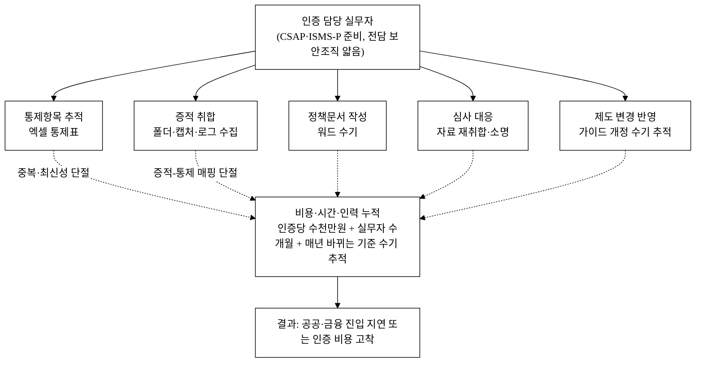

> 위 도식의 핵심은 화살표가 아니라 **단절선(점선)** 이다. 통제표·증적·정책문서·심사대응이 각자 따로 관리되어, 통제항목 1건 변경에 여러 곳을 수기로 동기화해야 한다. 가드레일은 이 단절선을 **통제항목-증적-정책문서가 연결된 단일 컴플라이언스 데이터 모델**로 대체한다([그림 2]).

### 1.5 페인의 주체·우선순위 분리 — *누구의 어떤 페인을 푸는가*

> 구매자(보안 담당)의 1순위 페인은 '준비 노동 절감'이 아니라 **'심사 합격(탈락 시 공공 영업 기회 상실 + 본인 책임)'** 일 수 있다. 페인을 주체별로 분리하고, 우선순위는 §17 인터뷰로 실측한다(현재는 가설 `[추정]`).

| 세그먼트 | 현재 준비 방식 | 1순위 페인 `[추정]` | 가드레일의 직접 가치 |
|:---|:---|:---|:---|
| (A) 컨설팅 대행 중 기업 | 컨설팅사가 통제표·증적 작성 대행 | "심사 합격 리스크 + 컨설팅비 반복 지출" — 준비 노동은 내가 안 짐 | 컨설팅 생산성↑·상시 증적 유지로 재발주↓(대체 아닌 보완재, §5.4·§7) |
| (B) 자체 준비 기업 | 실무자가 엑셀·워드 직접 작성 | "준비 노동 부담 + 합격 불확실성" 동시 | 노동 자동화 + 갭 가시화로 합격 준비도↑ |

> **분기 처리**: 세그먼트 (A)는 다수 기업이 페인을 직접 지지 않으므로(컨설팅이 대행), 가드레일을 '컨설팅 대체'가 아니라 '컨설턴트 감수 게이트(§2.5)와 결합한 보완재'로 포지셔닝한다(이해상충 해소는 §7.1, ROI 재계산은 §7.3). §17 인터뷰에 **'심사 탈락 경험·공포' vs '노동 부담'의 상대 우선순위**를 직접 묻는 항목을 등록한다.

### 1.6 현 상태(Baseline) 정량화 — *절감을 주장하려면 before가 있어야 한다*

> ROI(§7.3·§16)의 'after'를 주장하려면 'before'(현재 준비에 실제로 드는 시간·비용)가 필요하다. 아래는 공개 출처 기반 baseline이며, 실무자 투입 man-day 등 비공개 값은 `[추정]`으로 격리하고 §17 인터뷰로 실측한다.

| Baseline 항목 | 값 | 출처/상태 |
|:---|:---|:---|
| CSAP 준비~심사 소요 | 5~6개월(컨설팅 활용)~1년 | 검증[^6][^7] |
| CSAP 신규 인증평가 수수료 | 852만~3,225만원(지원 50~80% 별도) | 검증[^7] |
| 컨설팅 포함 인증 1사이클 비용 | 통상 수천만원 | 검증[^6][^7] |
| 인증 1사이클당 실무자 투입 man-day | <TODO: §17 인터뷰 실측>, 잠정 `[추정]` 40~80 man-day | 미검증 `[추정]`(벤치마크 정박[^16]) |
| 심사 직전 증적 재취합 공수 | <TODO: §17 인터뷰 실측> | 미검증 `[추정]` |

> **벤치마크 정박(실측 대체 아님).** 사당 man-day 공식 분해 통계는 부재하나, 자릿수 정박 근거는 있다 — ISMS 통제항목은 104개(세부 253개, 현업 단위 세분화 시 600+개)이며, 다수 기업이 **전담 인력 없이 기존 관리조직이 원업무와 겸직**으로 인증을 수행한다.[^16] 즉 1사이클은 겸직 인력 수개월 부분투입(1 man-month ≈ 영업일 21~22일[^16]) 규모로, 잠정 `[추정]` 40~80 man-day는 이 범위와 자릿수가 정합한다. 다만 **실제 man-day는 기업 규모·범위에 따라 편차가 크므로 확정은 §17 인터뷰 실측 영역**이며, 위 값은 그 전까지 `[추정]`으로 격리한다.
>
> 위 baseline 위에 가드레일 도입 후 목표 절감률(준비기간 X%↓·재취합 공수 Y%↓)을 얹어 'before→after'를 §7.3·§16에서 산출한다. 실무자 man-day가 확정되기 전까지 ROI 시간절감(§7.3 X·회수 Y) 주장은 가설임을 명시한다.

### 1.7 구매자의 Why-Now — *제도가 바뀌는데 왜 지금 사야 하나*

> 제도 개편(2027.7 시행·1년 유예[^9])은 구매자에게 'wait-and-see(개편 안정 후 도입)' 유인을 준다. 이 반론에 정면 답한다.

| 미루기(wait-and-see) 시 | 지금 도입 시 |
|:---|:---|
| 개편 후 통제체계 변경분을 급하게 재준비(컨설팅 재발주·증적 재정리) — 비용·시간 spike | 가드레일이 개편 전환을 라이브러리로 자동 흡수(§2.3·§10) → 재준비 비용 회피 |
| 개편 안정까지 공공·금융 진출 지연(기회비용) | 유예기간(~2027.7) 내 통합 대응 선완료 → 경쟁사보다 빠른 진출 |
| 개편 전후 통제 매핑을 수기 재작업 | 통제 버전관리·개정 영향 전파(§10.3)로 무중단 이관 |

> 즉 **제도 변동성은 도입 지연 사유가 아니라 '지금 도입해 변동을 자동 흡수'하는 사유**다. 'wait-and-see가 더 비싸지는' 정량 시나리오(개편 후 급재준비 비용)는 §17 인터뷰에서 세그먼트별로 실측해 보강한다.

---

## 2. 솔루션 (Solution)

### 2.1 제품 개요

**가드레일**은 CSAP·ISMS-P 등 **한국 인증체계의 통제항목을 단일 데이터 모델로 표준화**하고, 그 위에서 갭분석·증적 자동수집·정책문서 자동생성·심사 대응 패키지 생성을 상시 운영하는 컴플라이언스 자동화 SaaS다. 글로벌 Vanta·Drata가 SOC2·ISO27001에서 입증한 "자동화 + 상시 모니터링" UX를, **글로벌 플레이어가 직접 커버하지 않는 한국 CSAP·ISMS-P·N2SF 통제체계에 특화**해 제공한다. [그림 1]의 단절된 수작업을 하나의 데이터 허브로 대체한다.

### 2.2 핵심 모듈

| 모듈 | 기능 | 글로벌/컨설팅 대비 차별 |
|:---|:---|:---|
| 통제항목 라이브러리 | CSAP·ISMS-P 통제항목을 구조화·매핑(공통 통제 1회 입력 → 다중 프레임워크 재사용) | 컨설팅사의 인증별 별도 엑셀을 단일 모델로 통합 |
| 갭분석 대시보드 | 통제항목별 충족/미흡 상태, 준비율 스코어, 미흡 항목 우선순위 | 글로벌 제품이 미지원하는 한국 통제항목 기준[^12] |
| 증적 관리·자동수집 | 증적 업로드·버전·만료 추적 + 클라우드 설정 스캔 커넥터(자동수집) | 컨설팅사의 폴더·수기 취합을 자동화·상시화 |
| 정책문서 자동생성 | 통제항목에 매핑된 정책·지침 템플릿 자동 생성·버전관리 | 워드 수기 작성을 템플릿 엔진으로 대체 |
| 심사 대응 워크플로 | 갭→과제 티켓→담당자 배정→증적 첨부→심사 패키지 PDF 생성 | 심사 직전 자료 재취합을 상시 워크플로로 흡수 |

> **mock 단계(v1~v2)에서도 실가치**: 증적 자동수집 커넥터는 v3(M7~12)에 실연동되나, 그 전에도 **단일 통제 모델·갭분석·정책 자동생성·심사 패키지 PDF**는 mock 없이 실동작한다(구매자는 mock 단계에서도 '엑셀 대체 이상'의 가치를 얻음). 지원 클라우드 목록·우선순위는 §10.3 커넥터 매트릭스 참조. 자동수집이 v3에야 오므로 초기 Starter 가격에서 미구현 가치를 제외하는 가격 차등을 검토(§6.1).

### 2.3 차별점 세 가지

1. **한국 인증체계 특화** — CSAP·ISMS-P·N2SF 통제항목을 1차 시민(first-class)으로 모델링. 글로벌 제품(SOC2·ISO27001 중심)이 비워 둔 공백을 정면 공략.[^12][^13]
2. **공통 통제 단일 입력·다중 재사용** — 한 통제·증적을 여러 인증 프레임워크에 매핑해, CSAP와 ISMS-P를 동시에 준비하는 기업의 반복노동을 제거.
3. **제도 변동 추종** — 2026~2027 CSAP-ISMS 통합·등급제 폐지 개편[^8][^9]을 라이브러리 업데이트로 흡수. 제도 변동성 자체가 본 제품의 갱신·구독 가치를 키운다.

**[그림 2] 가드레일 컴플라이언스 데이터 허브 아키텍처 (단일 통제 모델)**

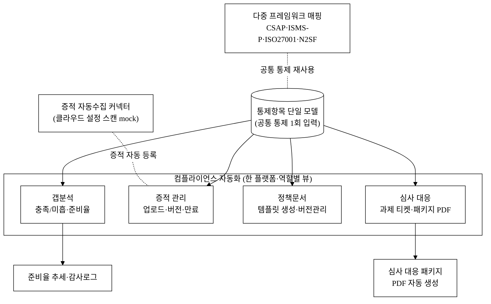

> [그림 1] 대비 핵심 변화: 통제항목이 **단일 모델로 1회 정의**되고, 갭분석·증적·정책문서·심사대응이 같은 모델을 공유한다. 통제항목 1건 변경이 관련 증적·정책·과제·준비율에 한 흐름으로 전파된다.

### 2.4 도입·온보딩·이탈(Exit) 정책 — *전환비용 장벽 해소*

기존에 엑셀 통제표로 준비하던 기업의 가장 큰 도입 장벽은 "쌓아 둔 통제표·증적·정책문서를 다시 다 옮겨야 하나"라는 공포다. 가드레일은 **데이터 유입(import)을 제품 기능으로 내장**해 이 장벽을 제거한다.

| 항목 | 제공 방식 | 목표 (파일럿 실측 예정 `[추정]`) |
|:---|:---|:---|
| 통제표 일괄 업로드 | 기존 엑셀 통제표 CSV 업로드 마법사(컬럼 자동 매핑) | 통제항목 셋업 ≤ 1시간 |
| 표준 import 템플릿 | 통제·증적·정책문서 표준 양식 다운로드 → 채워서 재업로드 | 무료 제공 |
| 증적 일괄 첨부 | 폴더 단위 증적 파일 일괄 업로드 + 통제항목 매핑 제안 | 온보딩 약속 |
| 이탈 시 export | 전체 데이터(통제상태·증적 메타·정책문서·감사로그) CSV/PDF 일괄 내보내기 보장 | lock-in 불안 해소 조항 |

> **설계 의도**: import는 도입 마찰을 낮추고, export 보장은 "갈아탔다가 못 빠져나올까" 하는 lock-in 공포를 해소한다(역설적으로 export 보장이 전환을 촉진한다). 다만 도입 후 누적되는 증적 이력·감사로그·준비율 추세 자체가 전환비용을 형성하므로(§5.3), import는 쉽게·축적 데이터는 무겁게 설계한다.

**온보딩 2종 경로 분리.** 구매자의 실제 온보딩 부담은 '엑셀 업로드'가 아니라 '백지 상태에서 수백 개 통제항목에 우리 환경의 증적을 처음 매핑·정리하는 초기 작업'이다. import 마법사는 (a)만 해결한다.

| 경로 | 대상 | 핵심 작업 | 제공 |
|:---|:---|:---|:---|
| (a) import 경로 | 이미 정리된 엑셀 통제표 보유 기업 | CSV 업로드·컬럼 자동매핑 | 셋업 ≤ 1시간 목표(정리된 엑셀 보유 한정) |
| (b) 백지(green-field) 경로 | 통제표가 없는 첫 인증 기업(다수) | 통제 해석·증적 수집·우리 환경 판단 | 셋업 가이드 마법사 + **온보딩 컨시어지(유상 옵션)** + 컨설턴트 감수 게이트(§2.5) |

> 'import 1시간'은 (a) 한정 주장임을 명시한다. (b)는 컨설팅이 해주던 '통제 해석·환경별 판단'이 핵심이므로, 가이드 마법사만으로 대체 가능하다고 과장하지 않고 온보딩 전담(유상) 옵션을 둔다. '초기 통제 매핑까지 실제 며칠 걸리는가'는 §17 파일럿으로 실측해 목표화한다(현재 미실측).

**벤더 비즈니스 연속성(BCP) — 구매자 보호.** 위 export는 '약속'이 아니라 구매자 보호 장치로 격상한다. 인증 사이클 한복판에 신생 벤더가 폐업·인수·서비스 종료하면 구매자는 심사 직전 자료를 잃는다.

| 보호 장치 | 내용 |
|:---|:---|
| 표준 포맷 export 보장 | 통제-증적 매핑을 타 도구/엑셀로 즉시 복원 가능한 표준 CSV/PDF 포맷, 계약상 SLA로 보장 |
| 데이터 에스크로 | 서비스 종료·폐업 시 제3자 보관 데이터를 고객에게 반환하는 에스크로 조항(검토) |
| 서비스 종료 유예 | 종료 통지 후 N개월 유예 + 데이터 전량 반환·삭제 증명 |

> 투자자용 §5.3에서 '락인이 강하다'고 서술한 전환비용을, **구매자용 서술에서는 '이탈 자유 보장(표준 export + 에스크로)'으로 톤을 전환**한다(같은 사실의 두 독자용 프레이밍).

### 2.5 컴플라이언스 판정 신뢰성 — *틀리면 심사 탈락인 기능의 정확성 보증*

"통제항목 충족 판정·준비율 스코어"는 본 제품의 핵심인 동시에, **잘못 판정하면 심사 탈락·재심사로 직결되는 신뢰가 전부인 기능**이다. 신생 SaaS의 컴플라이언스 판정을 보안 담당이 신뢰하려면 정확성·근거 보증 체계가 필수다.

| 검증 항목 | 방식 | 목표 |
|:---|:---|:---|
| 통제 매핑 정확도 | 통제항목-증적 매핑을 인증 기준 원문(KISA 고시·CSAP 평가기준)에 1:1 정합 | 기준 원문 대비 매핑 누락 0건 |
| 판정 근거 명세 | 충족/미흡 판정에 근거 증적·평가 메모를 첨부(블랙박스 금지) | 전 항목 추적 가능 |
| 제도 변경 검증 | 라이브러리 갱신 시 통제항목 변경 전후 diff·영향 항목 자동 표기(§2.2) | 개정 반영 100% 추적 |
| 전문가 감수 | 인증 컨설턴트·심사원 감수 게이트 — 자동 판정을 전문가가 최종 확인하는 옵션 | 고위험 통제 이중 확인 |
| 책임 정책 | 판정 근거 로깅 + 최종 책임은 신청기업·심사기관에 있음을 명시(§9 리스크) | 분쟁·면책 한계 사전 정의 |

> **책임 구조**: 가드레일은 "준비를 돕는 도구"이지 인증 자체를 보증하지 않는다. 판정 근거 로그 + 전문가 감수 게이트 + 면책 한계를 사전 정의해, 자동화의 편익과 책임 경계를 분리한다(§9 리스크 행 참조). 단, '문구 면책'만으로는 B2B 손배를 막지 못하므로 **계약상 책임한도(LoL=직전 12개월 구독료)+E&O/사이버 보험+오인방지 표시**의 3중 구조로 보강한다(§10.3).

> **판정 품질 KPI 분리(중요)**: '매핑 누락 0건'은 입력 커버리지 지표일 뿐, **판정 품질 지표가 아니다**. 이 제품의 가장 치명적 실패 모드는 false-positive(미흡인데 충족으로 오판 → 고객이 안심하고 심사 갔다 탈락)다. 따라서 §10.5에 충족 판정 **정밀도(precision)·재현율(recall)·false-positive 상한**을 별도 KPI로 둔다.

### 2.6 구매자용 보안 신뢰 패키지 — *내 보안 약점을 신생 SaaS에 올려도 되는가*

> 구매자의 최대 도입 장벽은 '신생 SaaS에 우리 통제 현황·증적·감사로그(가장 민감한 보안 약점)를 통째로 올려도 되나'라는 공급망 보안 불안이다. 자사 ISMS-P 취득은 M10이라, 파일럿(M4~6) 시점엔 가드레일 자신이 미인증인 모순이 있다. 이 구간의 대체 보증책을 명시한다.

| 신뢰 요소 | 제공(자사 미인증 구간 포함) |
|:---|:---|
| 제3자 보안 검증 | 외부 보안감사 보고서·펜테스트 요약 공개(자사 ISMS-P 취득 전 대체 보증) |
| 데이터 처리 투명성 | 처리위탁 계약·서브프로세서 목록 공개, 국내 리전·국외이전 없음(§10.2) |
| 침해 대비 배상 | 사이버 보험·계약상 배상, 격리 침해 탐지·통보 SLA(§10.1) |
| 데이터 최소화 옵션 | **증적 원본 미업로드(메타데이터만)·온프레미스/프라이빗 옵션** 선택지로 민감자료 노출 최소화 |
| 종료 시 보장 | 계약 종료 시 데이터 완전 삭제 증명·export(§2.4 BCP) |

> 자사 ISMS-P 취득(M10) 전 파일럿 고객에게는 위 '대체 보증책 + 데이터 최소화 옵션'으로 신뢰를 확보하고, 취득 후에는 자사 인증을 1차 신뢰 근거로 승격한다.

---

## 3. 시장 (Scale-up)

> 산정 원칙([`5_research/README.md`](./5_research/README.md) §3 준수): 모든 입력 모수는 검증 출처에서 가져오고, 비율(비중·점유율·ARPU)은 가설이므로 `[추정]` 을 병기한다. 추정값과 공식값을 한 수치에 섞지 않는다.

### 3.1 입력값 (검증 출처)

| 변수 | 값 | 출처 |
|:---|:---|:---:|
| 국내 정보보안 시장(2023) | 6조 1,455억원(+9.4%) | [^1] |
| 보안성지속서비스(2023) | 6,644억원(+23%) — TAM proxy | [^2] |
| ISMS-P 유지 인증서 | 약 1,261건 (조회시점) | [^3] |
| 조사대상 인증 기업군 | ISMS 약 900사·ISMS-P 약 1,200사 | [^4] |
| CSAP 신규 인증평가 수수료 | 852만~3,225만원 (컨설팅 포함 수천만원) | [^7] |
| 자사 적용단가(ARPA 산정 기준) | 연 1,000만~3,000만원/사 (가드레일 구독, §6.1) | 자사 가격표 |

### 3.2 TAM / SAM / SOM 산정 (단위 통일 — '컴플라이언스 자동화 SaaS 지출' 기준)

> **단위 통일 원칙(중요)**: TAM·SAM·SOM·매출을 모두 **동일 단위 = '기업당 컴플라이언스 자동화 SaaS에 지불 가능한 연간 금액(자사 구독 성격)'** 으로 측정한다. 기존 보안성지속서비스 proxy는 보안관제·유지관리를 포함하는 **별개 카테고리(proxy의 proxy)** 이므로 보조참조로 강등하고, 시장규모는 아래 bottom-up을 1차 근거로 한다.

**(A) Bottom-up 재구축 — `TAM = 인증 대상 기업 수 × 기업당 연간 컴플라이언스 자동화 SaaS WTP`**

| 구분 | 산정(bottom-up) | 값 `[추정]` | 근거·가정 |
|:---|:---|:---|:---|
| **TAM** | (ISMS-P 약 1,200사 + ISMS 약 900사[^4] + CSAP 추진 SaaS/클라우드) ≈ 인증 대상 모수 × 기업당 연 WTP `[추정]` 1,800만원 | **약 400~650억원/년** `[추정]` | 모수는 검증 출처[^4], 기업당 WTP는 §17 실측 전 핵심 가정(`[추정]`). 자사 구독 단위로 통일 |
| **SAM** | 3년 내 자동화 SaaS로 실제 전환 가능한 인증 대상(의무화·SaaS 1만개 육성[^11]으로 증가하는 동적 모수) × 연 WTP | **약 250~450억원/년** `[추정]` | TAM 중 즉시 도달권. 모수는 정적 1,200사 스냅샷이 아니라 연도별 증가 반영(아래 (C)) |
| **SOM (3년)** | SAM의 약 14~25% (자사 구독 기준 금액 점유) | **약 50~100억원 ARR** `[추정]` | ARPA·점유율은 가설. 도달 가능성은 §6.5 퍼널로 역산, Vanta·Drata 초기 궤적 벤치마크[^12][^13] |

> **단위 정합 확인**: SOM 기준값 약 63억 ARR ÷ SAM 약 250~450억 = **약 14~25%(금액 점유)**. 분자(자사 구독 매출)와 분모(자사 구독 단위 시장지출)가 **동일 단위**이므로 점유율이 단위정합한다. 종전 'SOM=SAM의 5~7%'는 분모를 컨설팅·수수료 지출(별개 단위)로 잡았던 오류를 정정한 것이다.

**(B) 금액 점유 vs 기업수 점유 — 두 점유율 명시(충돌 해소)**

| 점유율 기준 | 산정 | 값 `[추정]` |
|:---|:---|:---|
| 금액 점유(SAM 대비) | 63억 ÷ 250~450억 | 약 14~25% |
| 기업수 점유(유효 모수 대비) | 350사 ÷ 유효 인증대상 모수 | 정적 2,100사 기준 약 17% / 동적 모수(아래 (C))로는 더 낮아짐 |

> 종전 문서가 '금액 5~7%'와 '기업수 ~29%'로 충돌하던 것을, **두 점유율을 분리 명시**하고 분모를 동적 모수로 키워 해소한다. 좁은 니치(정적 2,100사)에서 350사는 약 17%로 도전적이며, 따라서 (C)의 모수 확대가 SOM 현실성의 전제다.

**(C) 동적 모수 — 의무화·SaaS 육성으로 늘어나는 인증 대상**

> 인증 대상은 정적 스냅샷이 아니다. ISMS-P 의무화 확대[^4]와 SaaS 1만개 육성[^11]으로 연도별 증가한다(증가율은 정책 효과 가정, `[추정]`).

| 연차 | 유효 인증대상 모수 `[추정]` | 근거 |
|:---|---:|:---|
| Y1 | 약 2,100사 | ISMS 900 + ISMS-P 1,200[^4] |
| Y2 | 약 3,000사 | 의무화 신규 대상 + CSAP 추진 SaaS 유입 `[추정]` |
| Y3 | 약 4,000사+ | SaaS 1만개 육성[^11] 중 공공·금융 진출 의향군 `[추정]` |

> 동적 모수 Y3 약 4,000사 기준 350사는 기업수 점유 약 9%로, 정적 17%보다 현실적이다. 단 모수 증가율은 정책 효과 가정이므로 `[추정]`이며 §17·후속 리서치로 보강한다.

**SAM 보조참조(종전 카테고리).** 보안성지속서비스 6,644억[^2]·정보보안 6조 1,455억[^1]은 시장 자릿수 참조용으로만 둔다(컴플라이언스 자동화 SaaS와 단위가 달라 직접 비교 금지, `[재확인 필요]`).
>
> **글로벌 검증.** 이 카테고리(컴플라이언스 자동화)는 글로벌에서 이미 검증됐다. Vanta는 기업가치 **41.5억 달러**·ARR 1억 달러+·고객 16,000사,[^12] Drata는 기업가치 **20억 달러**[^13]에 이른다. 글로벌 GRC 플랫폼 시장은 2024년 추정 49.2억~62.5억 달러(출처별 정의 차이로 편차, 부분검증)다.[^15] 한국 CSAP·ISMS-P·N2SF 특화는 이들이 직접 커버하지 않는 공백이다.

**SOM 시나리오(보수/기준/공격) — 미확정 모수의 구간화.** 사당 ARPA·점유율은 미확정이므로 단일값 의존을 피해 구간으로 제시한다. 모든 값 `[추정]`.

| 시나리오 | 확보 고객사 `[추정]` | ARPA(연) `[추정]` | SOM ARR `[추정]` |
|:---|---:|---:|---:|
| 보수 | 200사 | 1,000만원 | 약 20억원/년 |
| 기준 | 350사 | 1,800만원 | 약 63억원/년 |
| 공격 | 500사 | 2,000만원 | 약 100억원/년 |

> **기준 시나리오의 의미**: 기준 SOM(약 63억 ARR)은 SAM(자사 구독 단위) 250~450억의 약 14~25%(금액 점유)로, 좁은 한국 니치에서 도전적이되 §6.5 퍼널로 역산 가능한 목표다. SOM·재무 추정(§6)은 이 기준 시나리오와 정합하도록 ARPA·고객수를 통일한다.

**[그림 3] 시장 구조 (TAM → SAM → SOM 깔때기, 단위 통일)**

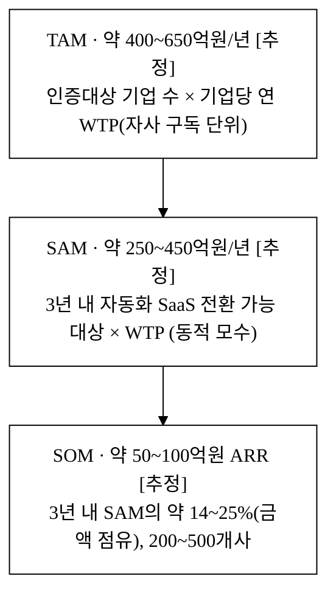

> **ARPA 전제 통일 주석**: 본 제안서는 SAM·SOM·§6 유닛이코노믹스 전반에서 **단일 모수(자사 ARPA 연 1,000만~3,000만원, 기준 1,800만원/사)** 를 사용한다. CSAP 수수료(852만~3,225만원[^7])는 §1·§3.1에서 **시장 페인포인트·가격 참조값**으로만 인용하며 ARPA 산정에는 자사 구독 단가를 쓴다(인증 수수료는 일회·심사기관 지급, 자사 구독은 상시 운영 SaaS로 성격이 다르다).

### 3.3 도달 가능성 벤치마크

SOM 약 50~100억 ARR이 무모한 가설이 아님은 **글로벌 동종 카테고리의 궤적**이 보여준다. Vanta는 2018년 SOC2 자동화로 시작해 2025년 기업가치 41.5억 달러·ARR 1억 달러+·고객 16,000사·통합 375개+로 성장했고,[^12] Drata는 2020년 진입해 기업가치 20억 달러,[^13] Secureframe은 Series B 5,600만 달러를 유치했다.[^14] 글로벌에서 유니콘급으로 검증된 카테고리이며, **한국 CSAP·ISMS-P·N2SF 특화 공백**은 글로벌 플레이어가 직접 들어오기 어려운(규제 추적·국내 통제 기준·국내 심사 관행) 영역이다. 제도 개편(2026~2027)으로 통합 대응 수요가 커지는 시점[^8][^9]이 진입 적기다.

> **벤치마크의 한계 명시**: Vanta는 SOC2라는 단일·표준·글로벌 시장에서 그 궤적을 냈다. 본 사업은 제도가 매년 바뀌고(통합·해체) 유효 모수가 수천 사 수준인 **좁은 한국 니치**다. 따라서 Vanta 궤적은 '카테고리가 존재한다'는 검증으로만 인용하고, 점유율·전환율은 §6.5 자체 퍼널과 §17 실측으로 정당화한다(생존편향 회피). 좁은 시장의 SOM 천장(점유율 한계, §3.2(B))을 인정한 위에서 동적 모수 확대(§3.2(C))로 도달 가능성을 확보한다.

---

## 4. 경영혁신·창업학적 프레임워크

본 사업은 세 이론으로 정당화된다. (4.1) **Christensen 신시장 파괴**가 "왜 지금, 인증 자동화 카테고리인가"를, (4.2) **Kim·Mauborgne 블루오션 ERRC**가 "기존 컨설팅 경쟁축을 어떻게 재편하는가"를, (4.3) **JTBD + 린 스타트업**이 "무엇을 측정하고 왜 자동화가 이기는가"를 설명한다.

### 4.1 Christensen 신시장 파괴 — *왜 지금, 인증 자동화 카테고리인가*

파괴적 혁신은 (a) 기존 솔루션이 비싸고 복잡하며 (b) 다수가 "전문가에게만 맡기던 일"을 자가 수행하지 못하던 비소비(non-consumption) 영역에서 진입한다. 본 도메인은 두 조건을 충족한다.

- **기존 솔루션의 고비용·복잡성**: 국내 인증 준비는 정보보호 컨설팅사의 수작업 용역(인증당 수천만원·수개월[^6][^7])에 의존한다. 성장기 SaaS 기업에는 비용·기간이 모두 부담이다.
- **자가 수행의 비소비**: 전담 보안 조직이 얇은 기업은 통제표·증적을 스스로 상시 관리할 도구가 없어, 심사 시즌마다 외부 컨설팅에 의존하거나 진출을 미룬다.

가드레일은 컨설턴트만 다루던 통제항목 추적·증적관리·정책문서 작성을 **실무자가 직접 상시 운영하는 SaaS**로 끌어내린다. 글로벌 Vanta가 "SOC2 컨설팅에 의존하던 미국 스타트업"을 자동화로 흡수한 경로[^12]를 한국 인증체계에 적용하는 것이며, **저변(인증 자가 운영)을 발판으로 상위(다중 프레임워크·엔터프라이즈 GRC)로 이동**하는 것이 본 사업의 로드맵(§8)이다.

**왜 기존 컨설팅사가 즉시 자동화로 대응하지 못하는가 (해자의 정합성).** 국내 정보보호 컨설팅사는 인증 노하우는 풍부하나 **수작업 용역이 매출 모델 그 자체**다. SaaS 자동화로 전환하면 (a) 용역 인건비 기반 매출을 스스로 잠식하고(흑자 용역사일수록 유인이 약함), (b) 통제표·증적관리·정책생성을 단일 데이터 모델로 묶는 **제품 개발 역량**이 별도로 필요하며, (c) 제도 변경(2026~2027 CSAP-ISMS 통합·등급제 폐지[^8][^9])을 라이브러리로 상시 추종하는 것은 컨설턴트의 프로젝트성 대응과는 다른 **제품 유지보수 역량**이다. 한편 글로벌 Vanta·Drata는 SOC2·ISO27001 중심이라 한국 통제항목·심사관행·규제 추적에 진입 장벽이 있다. 이 둘 사이의 빈 공간(한국 특화 자동화)이 가드레일의 진입면이다.

> **Innovator's Dilemma는 전체에 적용되지 않는다 — 세그먼트 분해.** 위 '컨설팅사 비대응' 논리는 카니발 우려가 있는 흑자 용역사에만 성립한다. 세그먼트를 나누면 일부는 즉시 위협적이다.

| 컨설팅사 세그먼트 | 자동화 진입 동기 | 위협도 |
|:---|:---|:---|
| 대형(SK쉴더스 등, SW 자회사 보유) | 카니발 우려 없이 자회사로 출시 가능 + Exit 인수 동기(§6.7)=make 동기 | **높음** |
| 중견(용역 매출 의존) | 카니발 우려로 전환 지연(Innovator's Dilemma 성립) | 중 |
| 신규 진입 컨설팅 스타트업 | 잠식할 용역매출이 없어 즉시 SaaS화 가능 | **높음** |

> 즉 '컨설팅사는 못 들어온다'는 과신이며, **카니발 우려 없는 세그먼트(대형 SW자회사형·신규 진입)가 가장 위협적**이다. 이에 대한 방어는 §5.4(제휴연합 워게임·번들링·선점 락인)로 정량화한다.

**[그림 4-a] 컴플라이언스 준비 비용 비교 (3년 누적, 만원)**

> 일회 컨설팅과 연 구독의 성격 차이를 정직하게 반영하기 위해 **3년 누적** 기준으로 비교한다(종전 '인증당 1회' 비교의 왜곡 정정).

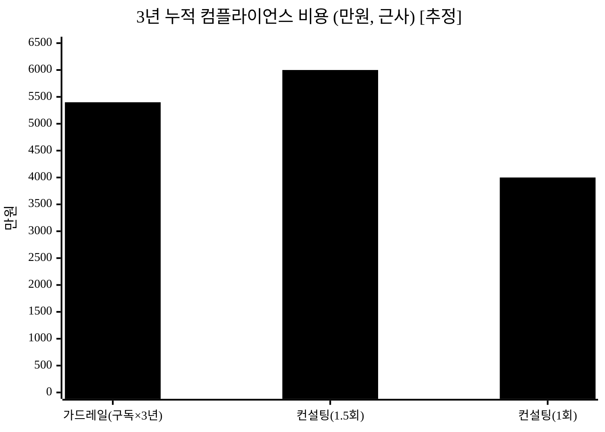

> 막대 = 3년 누적 비용(만원, 근사): 가드레일 구독 1,800만×3년=5,400만, 컨설팅 반복발주(3년 1.5회)≈6,000만, 컨설팅 최소(3년 1회)≈4,000만(`[추정]`[^6][^7]). **반복발주 기업(1.5회)에는 절감, 1회 발주 기업에는 역전**되며, 역전 케이스의 가치 정당화는 §7.3(C)(상시 모니터링·재발주 제거·제도 자동 흡수)에서 다룬다.

**[그림 4-b] 전략 포지셔닝 개념도 — 자동화도 축 × 한국특화 축**

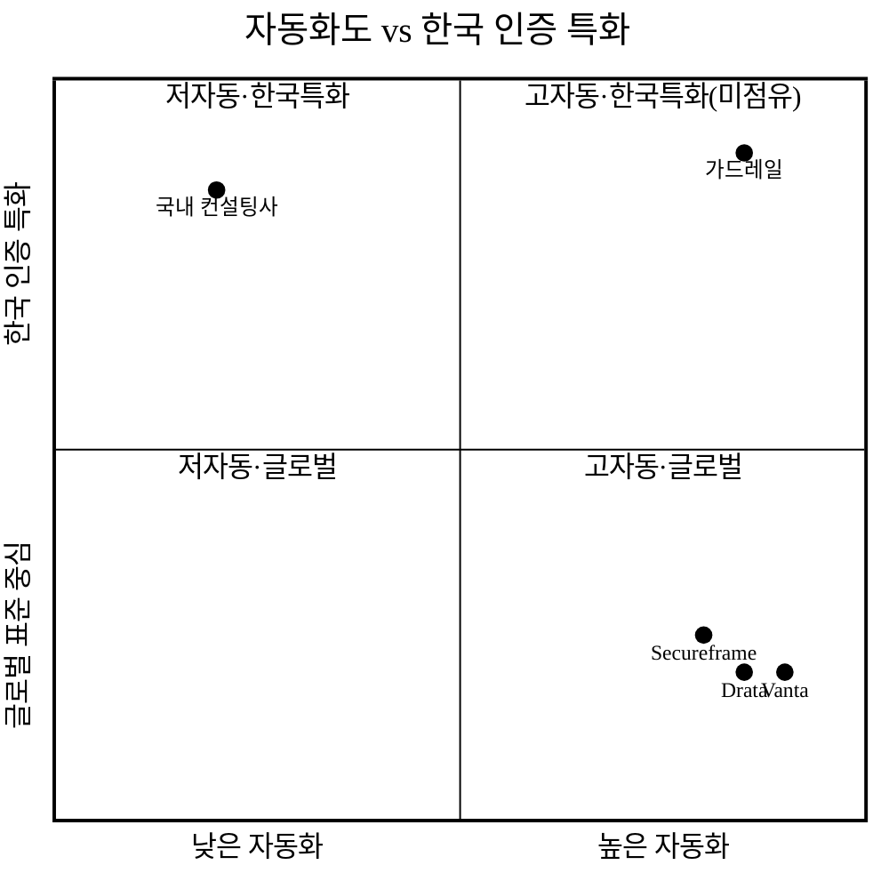

> 자동화도(가로축)·한국 인증 특화(세로축)를 별개 축으로 둔 개념도. 글로벌 제품은 우하단(고자동·글로벌)에, 국내 컨설팅사는 좌상단(저자동·한국특화)에 몰려 있고, 가드레일은 **우상단(고자동·한국특화)** 빈 영역을 점유한다.

### 4.2 블루오션 ERRC — *경쟁축의 재편*

기존 인증 시장(컨설팅 용역)의 경쟁 요소를 제거·감소·증가·창조로 재구성한다.

| 액션 | 요소 | 내용 |
|:---|:---|:---|
| **Eliminate** | 심사 시즌마다 반복되는 자료 재취합 / 통제표-증적 수기 동기화 | 단일 데이터 모델·상시 운영으로 제거 |
| **Reduce** | 인증당 컨설팅 의존 비용 / 준비 기간·실무자 투입 시간 | 구독형 자동화로 상시 평탄화·기간 단축 |
| **Raise** | 한국 인증체계 적합성(CSAP·ISMS-P·N2SF 통제 매핑) / 증적 최신성·추적성 | 컨설팅 수작업이 못 하는 상시 모니터링·감사로그 |
| **Create** | 공통 통제 단일 입력·다중 프레임워크 재사용 / 제도 변동 자동 추종 라이브러리 | 신규 가치 곡선 창출 |

ERRC의 결론은 **"고가-수작업 컨설팅"과 "글로벌-자동화"라는 기존 경쟁축을 벗어나, '한국 인증 특화 + 자동화 + 제도 변동 추종'이라는 새 가치 곡선([그림 4-b]의 빈 사분면)을 만든다"** 는 것이다.

### 4.3 JTBD + 린 스타트업 — *무엇을 측정하고 왜 자동화가 이기는가*

인증 담당이 고용하는 Job은 *"인증을 빠르고 확실하게 통과·유지하고 본업(보안 운영)으로 복귀"* 다. 측정 단위는 **준비 기간·실무자 시간·심사 통과율**이다. 수작업이 단절될수록 Job 완료까지 자료 재취합·동기화 비용이 커진다. 자동화는 두 축에서 Job 완료 속도를 높인다.

- **비용 축**(§4.1): 상시 운영 구독으로 인증당 반복 컨설팅 비용을 평탄화·절감.
- **시간·정확성 축**: 단일 통제 모델·증적 자동수집으로 자료 재취합 시간을 제거하고, 통제-증적 매핑 추적성으로 누락을 줄인다([그림 2]).

이를 **린 스타트업의 Build-Measure-Learn** 으로 검증한다. MVP(통제 라이브러리·갭분석·증적관리·정책생성·준비율)를 먼저 출시하고 아래 가설을 측정한다.

| 가설 | 측정 지표 | 검증 방법 |
|:---|:---|:---|
| 기업은 컨설팅 대신 자동화에 전환한다 | 컨설팅 의존 → 가드레일 전환율 | 파일럿 N사 도입율 |
| 준비 기간·실무자 시간이 줄어든다 | 인증 준비 소요시간 | 도입 전후 비교 |
| 자동화 판정을 신뢰한다 | 준비율 스코어 vs 실 심사 결과 정합 | 파일럿 심사 결과 대조 |

---

## 5. 경쟁 분석 (Competitive Landscape)

### 5.1 심화 경쟁 매트릭스

| 항목 | 가드레일 (당사) | Vanta | Drata | Secureframe | 국내 정보보호 컨설팅사 |
|:---|:---:|:---:|:---:|:---:|:---:|
| 한국 인증 특화(CSAP·ISMS-P·N2SF) | **◎** | △ | △ | △ | ◎ |
| 글로벌 표준(SOC2·ISO27001) | ○ | ◎ | ◎ | ◎ | ○ |
| 증적 자동수집·상시 모니터링 | **◎** | ◎ | ◎ | ◎ | ✕ |
| 정책문서 자동 생성 | **◎** | ○ | ○ | ○ | △(수작업) |
| 심사 대응 자동화·워크플로 | **◎** | ○ | ○ | ○ | △ |
| 가격 접근성(국내 중소 SaaS) | **◎** | △(고가) | △(고가) | ○ | △ |
| 제도 변동(2026~2027 개편) 추종 | **◎** | ✕ | ✕ | ✕ | ○ |
| 기업가치/규모 | 신생 | 41.5억$[^12] | 20억$[^13] | Series B[^14] | 매출 다양 |
| **지속가능 해자** | **통제데이터 락인 + 제도엔진 + 컨설턴트 네트워크(§5.3)** | 통합·브랜드 | 개발자 UX | 다중표준 | 인증 노하우 |

> **각 `◎`가 왜 모방 어려운가(1줄).** 한국 특화 ◎ — 통제항목·심사관행·규제 추적은 글로벌 제품이 6~12개월에 따라오기 어려운 현지화·유지보수 문제. 증적 자동수집 ◎ — 커넥터 자체는 카피 가능하나, 한국 통제항목에 매핑된 자동수집 룰셋이 차별점. 심사 대응 워크플로 ◎ — 단일 통제 모델과 결합된 갭→과제→패키지 흐름이 모방 난이도를 높임. 즉 차별성은 "기능 보유"가 아니라 §5.3의 2·3층 락인에 있다.

### 5.1.1 차별점 전수 도출 (카테고리별 50+)

> §2.3의 차별점 3개는 **상위 추상화**다. 본 절은 그 3개를 **10개 축(기술·데이터·규제·운영·심사·가격·GTM/채널·네트워크효과·UX·신뢰/보안)으로 분해해 56개 차별점**으로 전수 도출한다. 각 행은 *경쟁사 현황 → 우리 차별점 → 고객 가치*로 적고, 정량 가치는 검증 전이면 `[추정]`을 단다. **개수를 채우려 사소·중복 항목으로 부풀리지 않는다** — 의미 없는 항목은 넣지 않았고, "약한 차별점"은 그렇게 표기했다. 강한 구매동인으로 이어지는 핵심 행은 §「차별화 기술의 구매동인 논증」(must/nice 분류·가치 정량화·반증)으로 연결된다. ⚠️ 본 표의 `◎/○/△` 우위 주장 다수는 자사 설계 기준 평가이며, 실 심사·파일럿 전이라 강도는 `[추정]`이다.

**표 7. 차별점 전수 도출 — 카테고리 × 56항목**

| # | 축 | 경쟁사(글로벌 GRC / 국내 컨설팅) 현황 | 가드레일 차별점 | 고객 가치 | 강도 |
|:---:|:---|:---|:---|:---|:---:|
| 1 | 기술 | CSAP·ISMS-P를 2차 항목으로 취급/미지원[^12][^13] | CSAP·ISMS-P·N2SF 통제항목을 first-class 데이터로 모델링 | 한국 인증 즉시 착수, 매핑 누락 0 목표 | 강(must) |
| 2 | 기술 | 표준별 별도 입력(중복) | 단일 통제 모델 1회 입력 → 다중 프레임워크 재사용 | 동시 준비 기업 반복노동 제거 | 강 |
| 3 | 기술 | 통제 변경이 증적·정책에 수동 반영 | 통제 1건 변경이 증적·정책·과제·준비율로 한 흐름 전파 | 개정 누락 리스크 ↓ | 강 |
| 4 | 기술 | 글로벌 클라우드(AWS/GCP/Azure) 위주 커넥터 | 국내 CSP(NCP·KT Cloud·NHN) 설정 스캔 지향(§10.3) | 공공 클라우드 환경 자동수집 가능 | 중[추정] |
| 5 | 기술 | 자동수집 룰이 글로벌 통제 기준 | 한국 통제항목에 매핑된 자동수집 룰셋 | 수집 증적이 곧 심사 증적 | 강 |
| 6 | 기술 | 정책문서는 외부 워드 수기 | 통제 매핑 기반 정책·지침 템플릿 자동 생성·버전관리 | 문서 작성 시간 −N시간/건[추정] | 중 |
| 7 | 기술 | 준비율이 단일 표준 기준 | 프레임워크별·도메인별 준비율 동시 산출(교차매핑) | CSAP·ISMS-P 동시 가시화 | 중 |
| 8 | 기술 | 판정이 블랙박스 | 충족/미흡 판정에 근거 증적·메모 첨부(추적 가능) | 심사장 근거 제시 즉답 | 강 |
| 9 | 기술 | 변경 영향 분석 부재 | 라이브러리 갱신 시 통제 전후 diff·영향 항목 자동 표기 | 개정 반영 100% 추적 | 중 |
| 10 | 기술 | 단일 테넌트 가정 | 멀티테넌트·역할(CISO·실무·심사관) 분기 뷰 내장 | 조직·외부 심사관 동일 데이터 협업 | 중 |
| 11 | 데이터 | 글로벌 통제 온톨로지 보유, 한국 미보유 | 한국 통제 온톨로지(통제-증적-정책 관계 그래프) 축적 | 후발 카피어가 못 모으는 자산(§5.3) | 강(moat) |
| 12 | 데이터 | 심사 통과 코퍼스 없음(한국) | 심사 통과 골든셋·심사관 암묵지 코퍼스 축적(목표) | 판정 정확도 곡선 상승 | 강[추정] |
| 13 | 데이터 | 산업별 벤치마크 없음(한국) | 업종별 통제 충족 패턴 벤치마크(임계 150~200사)[추정] | "동종 대비 우리 준비율" 제공 | 약→중[추정] |
| 14 | 데이터 | 고객 데이터가 표준별 사일로 | 통제 단위로 통합된 증적·감사로그·추세 | 누적 전환비용 형성(§5.3) | 강 |
| 15 | 데이터 | export 제한적 | 표준 포맷 전량 export(통제·증적·정책·로그) | lock-in 불안 해소→도입 촉진 | 중 |
| 16 | 규제 | 한국 제도 개편 추종 안 함[^8][^9] | 2026~2027 CSAP-ISMS 통합·등급제 폐지를 라이브러리로 흡수 | 개편기 통합 대응 수요 흡수 | 강(why now) |
| 17 | 규제 | 고시 원문 추적 인력 없음 | KISA 고시·CSAP 평가기준 변경 상시 추적·반영 | 항상 최신 기준으로 준비 | 강 |
| 18 | 규제 | N2SF C·S·O 등급 연동 미지원 | N2SF 등급 체계 연동 설계(§2.3) | 차세대 망보안체계 대비 | 중[추정] |
| 19 | 규제 | 제도 변동을 리스크로 봄 | 제도 변동성 자체를 갱신·구독 가치로 전환 | 개편마다 갱신 동인 발생 | 강 |
| 20 | 규제 | 공공조달·디지털서비스 계약 흐름 분리 | 공공 진출 관문(CSAP→보안적합성) 워크플로 정렬 | 공공 수주 일정에 맞춘 준비 | 중[추정] |
| 21 | 운영 | 심사 직전 자료 재취합(수작업) | 갭→과제 티켓→증적 첨부→패키지 PDF 상시 워크플로 | 심사 시즌 재취합 고통 제거 | 강(must) |
| 22 | 운영 | 증적 만료·갱신 수동 관리 | 증적 버전·만료 관리·재수집 알림 | 만료 증적로 인한 탈락 방지 | 중 |
| 23 | 운영 | 상시 모니터링 부재(컨설팅) | 연속 모니터링·프로브 정기 점검 | 인증 후에도 통제 유지 가시화 | 중 |
| 24 | 운영 | 설정 변경(drift) 감지 없음 | drift 감지 + 알림(Slack mock) | 인증 이탈 조기 경보 | 중 |
| 25 | 운영 | GRC 티켓 연동 부재(컨설팅) | 과제 티켓 ↔ Jira(mock) 연동 | 기존 협업 도구로 처리 | 중 |
| 26 | 운영 | 정책↔증적 정합 수동 점검 | 정책↔증적 일치성 자동검사 | 불일치 사전 적발 | 중 |
| 27 | 운영 | 온보딩이 컨설턴트 의존 | 엑셀 통제표 CSV import 마법사(컬럼 자동매핑) | 정리된 엑셀 보유 시 셋업 ≤1시간[추정] | 중 |
| 28 | 운영 | 백지 기업 지원 모호 | 백지 경로 가이드 마법사 + 온보딩 컨시어지(유상) | 첫 인증 기업 진입 장벽 ↓ | 중[추정] |
| 29 | 심사 | 자동 판정 신뢰 보증 체계 약함 | 전문가(심사원) 감수 게이트 옵션 | 고위험 통제 이중 확인 | 중 |
| 30 | 심사 | precision/recall KPI 부재 | 충족 판정 정밀도·재현율·FP 상한 KPI화(§10.5) | false-positive(오판 탈락) 억제 | 강[추정] |
| 31 | 심사 | 심사관과 자료 교환이 이메일 | 심사관 협업 포털(증적 요청·코멘트·승인) | 심사 커뮤니케이션 추적·단축 | 중 |
| 32 | 심사 | 패키지 산출이 수작업 PDF | 심사 패키지 PDF 자동 생성(다국어 KO/EN) | 제출물 준비 시간 ↓ | 중 |
| 33 | 심사 | 책임 경계 불명확 | 판정 근거 로깅 + 면책 한계·LoL·E&O 보험 3중(§10.3) | B2B 도입 법적 안심 | 중 |
| 34 | 가격 | 글로벌 고가(중소 SaaS 부담)[^12][^13] | 국내 중소 SaaS 가격대(연 1,000만~3,000만원)[추정] | 진입 비용 장벽 ↓ | 강 |
| 35 | 가격 | 컨설팅 일회성 수천만원[^7] | 구독형 — 반복 인증·갱신에 분산 | 반복 발주 기업 TCO ↓[추정] | 중[추정] |
| 36 | 가격 | 자동수집 미구현 단계도 풀가 | 자동수집 v3 전 가격 차등 검토(§6.1) | 미구현 가치 과금 회피(정직) | 약→중 |
| 37 | 가격 | 가격 하한 불투명 | 유닛이코노믹스 하한선(연 ≈1,150만원) 명시[추정] | 덤핑 시에도 지속가능성 신호 | 약(내부) |
| 38 | GTM/채널 | 글로벌사 직판·국내 컨설팅 용역 | 컨설턴트 양면 채널 + 직판·바우처·콘텐츠 혼합 | 컨설팅 보완재로 마찰 적은 진입 | 중 |
| 39 | GTM/채널 | 공공 바우처 연계 약함 | 정부 수수료 지원·바우처 흐름과 정렬[^6] | 도입 실부담 ↓ | 중[추정] |
| 40 | GTM/채널 | 단일 채널 의존 | 채널 의존 상한 KPI(≤75%)로 분산 관리(§5.4D) | 채널 잠식 시 생존 | 약(내부) |
| 41 | 네트워크효과 | 한국 컨설턴트 네트워크 미보유(글로벌) | 인증 컨설턴트·심사원 네트워크(비독점, 자인) | 리드·감수 양면 확보 | 약→중[추정] |
| 42 | 네트워크효과 | cross-tenant 벤치마크 없음 | 비식별·집계 파이프라인(opt-in) 벤치마크 | 표본 늘수록 가치↑(플라이휠) | 약→중[추정] |
| 43 | 네트워크효과 | 규제기관 데이터 제휴 없음 | KISA·심사기관 공식 데이터 제휴 추진(불발 시 제외) | 규제추적 독점 자산화 가능성 | 약[추정] |
| 44 | UX | 글로벌 영어 UX·한국어 부분 | 한국어 1차 UX + 다국어(KO/EN) 패키지 | 실무자 학습비용 ↓ | 중 |
| 45 | UX | 표준별 화면 분절 | 통제 단위 단일 화면에서 갭·증적·정책·과제 일괄 | 화면 전환·맥락 손실 ↓ | 중 |
| 46 | UX | 역할 구분 약함 | 역할별(CISO·실무·심사관·감사) 뷰·권한 분기 | 역할 맞춤 정보 노출 | 중 |
| 47 | UX | 모바일 대응 미흡(일부) | PC·모바일 반응형(바텀탭·드로어) | 현장·이동 중 확인 | 약→중 |
| 48 | UX | 감사로그 가시화 약함 | 준비율 추세 시계열 + 감사로그·CSV | 진척·이력 한눈 | 중 |
| 49 | 신뢰/보안 | 자사 인증 전제(글로벌은 보유) | 미인증 구간 대체 보증(펜테스트·서브프로세서 공개) | 신생 SaaS 신뢰 공백 메움 | 중 |
| 50 | 신뢰/보안 | 데이터 처리 투명성 표준화 | 국내 리전·국외이전 없음·처리위탁 공개(§10.2) | 공급망 보안 불안 ↓ | 중 |
| 51 | 신뢰/보안 | 증적 원본 업로드 전제 | 증적 미업로드(메타만)·온프레미스 옵션 | 민감자료 노출 최소화 | 중 |
| 52 | 신뢰/보안 | 벤더 폐업 리스크 무대응 | 데이터 에스크로·종료 유예·전량 반환 BCP(§2.4) | 인증 사이클 중 벤더 리스크 ↓ | 중 |
| 53 | 신뢰/보안 | 멀티테넌트 격리 불투명 | RLS 격리 + 비식별 집계 분리(§10.1·10.6) | 타 조직 데이터 누출 우려 ↓ | 중 |
| 54 | 데이터 | import는 쉽게, 축적은 무겁게 비대칭 설계 부재 | import 마찰↓·축적 데이터 전환비용↑ 비대칭 설계 | 도입 쉽고 이탈 어려움(양날→정직 export 보장) | 중 |
| 55 | 규제 | 규제 의존형 단일 가치 | 규제 비의존 가치(보안운영 효율화)로 확장 옵션(§5.4) | 제도 단순화에도 잔존 가치 | 약[추정] |
| 56 | 운영 | 산출물·논증 분리 | 데모(projects/guardrail v3)가 위 차별점 다수를 실 구현·시연 | 주장↔산출물 정합(검증 가능) | 중 |

> **정직성 주석.** 위 56개 중 *강한 구매동인(must-have)*은 #1·#2·#3·#5·#8·#16·#21·#34 정도로, 나머지는 *보완·nice-to-have 또는 t=0 미작동(약)*이다. 이 강·약 구분을 §「구매동인 논증」①에서 다시 must/nice로 정렬한다. `[추정]` 표기 항목의 정량 가치는 §17 파일럿·인터뷰 실측 전 가설이며, 검증 수치와 한 문장에 혼용하지 않는다. **t=0 해자가 사실상 0**(§5.3 자인)이라는 점과 모순되지 않게, 위 표의 다수 차별점은 '기능 보유'층이고 진짜 방어는 #11·#12·#14의 누적 자산층임을 함께 읽는다.

### 5.2 서술 — 경쟁 공백(Whitespace)

국내 경쟁 지형은 **"글로벌 자동화 강자"와 "국내 수작업 컨설팅사"로 양분**된다. Vanta·Drata·Secureframe은 SOC2·ISO27001 자동화의 강자이나 한국 CSAP·ISMS-P·N2SF 통제 매핑은 미지원/제한적이고 가격이 국내 중소 SaaS에 부담이다.[^12][^13][^14] 국내 정보보호 컨설팅사는 인증 노하우는 풍부하나 수작업 중심이라 증적 자동수집·상시 모니터링이 부재하고 비용·기간이 크다.[^6][^7] 결과적으로 가드레일의 진입 공백은 명확하다 — **"한국 인증체계에 특화한 Vanta"**, 글로벌 자동화 UX + 국내 제도(개편 추종) 특화 + 중소 SaaS 가격대다. 이는 [그림 4-b]에서 어떤 경쟁사도 점유하지 못한 사분면이다.

### 5.3 지속가능 해자 3층 구조 — *기능 카피를 넘어서는 방어선*

경쟁 매트릭스의 `◎`는 대부분 "기능 보유"이며, 기능은 자본·시간으로 6~12개월이면 모방된다. 진짜 방어선은 기능층 위에 쌓는 **전환비용층·네트워크층**이다.

| 층 | 해자 유형 | 모방 난이도 | t=0 실재성 / 정량 목표 |
|:---|:---|:---|:---|
| 1층 (기능) | 통제 라이브러리·갭분석·증적관리·정책생성 | **낮음** — 6~12개월 카피 가능(자인) | t=0 해자 **없음**. time-to-market 선점(낙관 12~18개월/비관 6개월, §5.4) |
| 2층 (전환비용) | 단일 통제 모델 누적 증적·감사로그·준비율 | **중간** — 이전 시 재매핑 부담 | t=0 **형성 중**. 고객 1사당 누적이 임계 전환비용 도달까지 약 9~12개월 `[추정]` |
| 3층 (네트워크/데이터) | 컨설턴트 양면시장 + 산업별 벤치마크 데이터 | **중간**(하향, 비독점 채널) | t=0 **미작동**. 데이터 플라이휠 임계점 약 150~200사(§아래 (3)) |

> **종전 등급 정정**: 3층을 '높음'에서 '중간'으로 하향한다(§7.1에서 컨설턴트망이 **비독점·이해상충 채널**임을 자인 → 멀티호밍 가능 → 양면 네트워크 전제 미충족). 즉 t=0 실재 해자는 사실상 0이며, 방어는 **선점 리드 내에 2층 전환비용을 임계까지 쌓는 속도전**이다(아래 [그림 4-d]).

**(1) 전환비용 화폐화.** 이탈 시 고객이 실제로 지불하는 비용 = 재매핑 man-hour × 인건비. 수백 통제-증적 재매핑·정책 재구축·실무자 재교육을 보수적으로 **약 200~400 man-hour × 5만원/시 ≈ 1,000만~2,000만원/사 `[추정]`** 로 추산한다. 이 화폐화 전환비용이 NRR ≥ 100%·연 갱신율 ≥ 90% 목표의 **근거**다(달성 시 해자, **미달 시 무방비** — 양방향 명시). 미달 시 대응은 가격·온보딩 재설계 + 데이터 락인 강화(§17 측정 항목 등록).

**(2) 재수작업(엑셀 회귀) 비용.** 이탈 = [그림 1] 수작업 회귀 = 심사 시즌마다 재취합 고통. 멀티호밍 비용이 높다.

**(3) 데이터 플라이휠 임계점.** 산업별 통제 충족 패턴·심사 통과 코퍼스가 벤치마크로 의미를 가지려면 임계 고객수가 필요하다. **임계점 약 150~200사(업종별 최소 표본) `[추정]` → Y2~Y3 도달**. 그 이전(Y1, 45사)에는 플라이휠을 해자로 카운트하지 않는다(정직한 인정). 임계 이후 모방 비용이 '시간'에서 '누적 데이터'로 전환된다. 단 cross-tenant 집계는 RLS 격리(§10.1)와 충돌하므로 **비식별·집계 전용 파이프라인 + 약관 동의 + opt-out**(§10.6)이 전제다.

**(4) 규제추적 자산화(moat 추가).** 통제 라이브러리·개정 영향 전파 엔진(§10.3)을 KISA·심사기관 공식 데이터 제휴로 독점 자산화하는 것을 moat 후보로 추가 추진한다(불발 시 본 항목은 moat에서 제외).

**[그림 4-d] 선점 리드 vs 전환비용 형성 — 속도전 그래프**

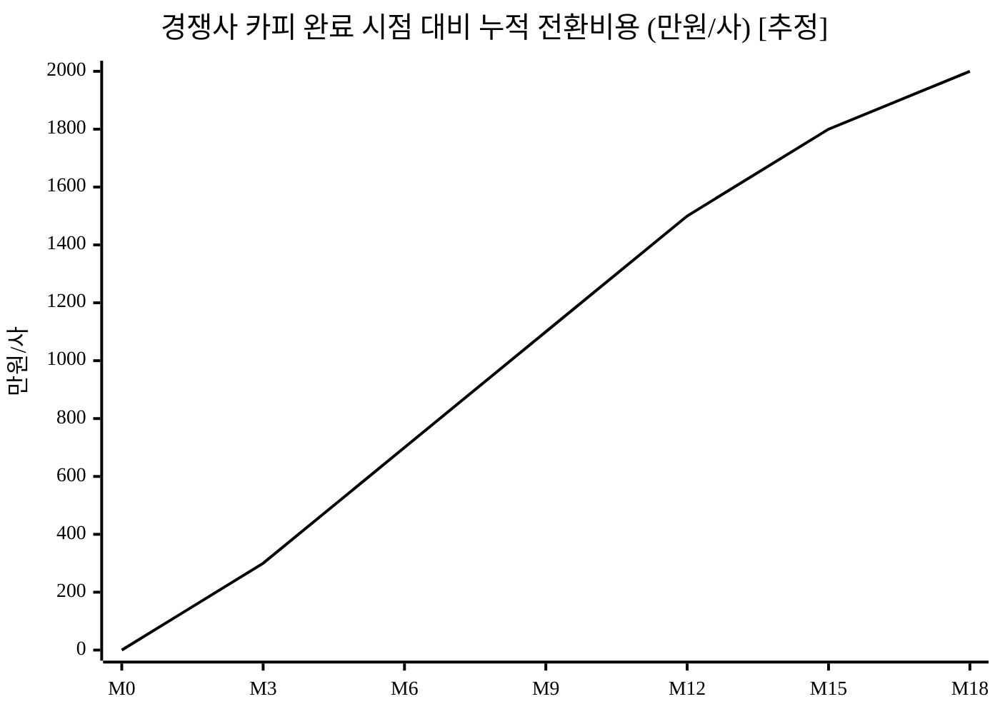

> 선 = 고객 1사당 누적 전환비용(증적·매핑 축적). **카피어가 T+6~12개월에 진입할 때 우리 2층 전환비용이 약 700~1,500만원/사에 도달**해 있어야 방어가 성립한다. 비관(자본 투입 카피어, 리드 6개월로 압축) 케이스에서는 전환비용 형성이 700만원 수준이라 방어가 빠듯하므로, 그 구간은 선점 고객 락인 + 채널·규제 자산으로 보강한다(§5.4).

**[그림 4-c] 경쟁사 대응 시나리오 매트릭스**

> 기존 강자의 대응을 4개 시나리오로 정면 가정하고, 각각에 예상 대응시점·자사 방어수단·정량 영향을 명시한다. `[추정]` 병기.

| 시나리오 | 위협 | 예상 대응시점 `[추정]` | 자사 방어수단 | 정량 영향 `[추정]` |
|:---|:---|:---:|:---|:---|
| ① 글로벌(Vanta 등) 한국 현지화 | 자본·브랜드로 CSAP·ISMS-P 대응 | 18~24개월 | 규제 추적·심사관행·컨설턴트 네트워크 누적 우위, 제도엔진 깊이 | 제한적(현지화 리드타임) |
| ② 국내 컨설팅사 SaaS화 | 인증 노하우로 자동화 제품 출시 | 12~18개월 | 컨설팅사는 용역매출 카니발 우려·제품 개발역량 부담, 우리는 12~18개월 선점·2·3층 락인 | 가격·영업 경쟁 |
| ③ 컨설팅사 + GRC SW **제휴연합** (가장 치명적) | 재설계 없이 제휴로 "자동화"를 우회 | 12~18개월 | 제휴는 단일 통제 모델 통합이 아니라 연동 — 통제-증적 단일 모델 UX 열위 | UX·추적성 우위 유지하나 마케팅 경쟁 심화 |
| ④ 제도 개편 충격(CSAP 해체) | 통제체계 자체가 바뀌어 라이브러리 무력화 | 2027.7 시행[^9] | 제도 변동 추종을 핵심 가치로 설계 — 개편이 오히려 통합 대응 수요·갱신 가치를 키움 | 기회 요인으로 전환 |

> **카피 난이도 정량화.** 통제 라이브러리·증적 자동수집·정책생성을 단일 통제 모델로 묶는 것을 보수적으로 **약 30~50 man-month [추정]**(시니어 5~8명 약 6개월)로 추정한다. **이는 해자가 아니다** — 자본력 있는 경쟁사는 1~2개 분기에 기능을 복제한다. 게다가 KISA 고시·CSAP 평가기준은 **공개 문서**라 룰셋 자체는 누구나 같은 원문으로 만들 수 있다. 따라서 기술 차별성을 '기능 보유'가 아니라 아래 **누적 자산**으로 재정의한다(§10.7 연결).

> **기능 ≠ 해자, 누적 자산 = 해자.** 후발주자가 공개 고시로 룰셋을 만들 수 있어도 못 모으는 것은 (a) **한국 통제 온톨로지 + 개정 영향 전파 엔진**(§10.3), (b) **심사 통과 골든셋·심사관 암묵지·기업별 적용 노하우 코퍼스**(§10.7), (c) **누적 전환비용·채널 락인**이다. 이들은 시간이 아니라 **데이터·정확도 곡선**으로 누적되며, 이것이 메워져야 2·3층 해자가 비로소 성립한다.

#### 시나리오 ③(제휴연합) 정량 워게임 — *가장 치명적이라 자인한 위협의 정면 대응*

> '제휴는 UX가 다르다'는 정성 주장 하나로는 부족하다. 제휴연합(컨설팅사 고객망 + GRC SW 엔진 + 합산 자본)이 우리 핵심 GTM 채널(컨설턴트)을 선점하는 시나리오를 정량화한다.

| 위협 벡터 | 정량 영향 `[추정]` | 자사 방어 정량 하한 |
|:---|:---|:---|
| 컨설턴트 채널 선점 → §6.5 리드 유입 감소 | 파트너 리드 −30~50% 시 Y2 신규 −47~78사 | 직판·바우처·콘텐츠로 리드 ≥ 25% 자체 확보(채널 상한 §5.4(D)) |
| UX·추적성 우위의 전환 효과 | 측정 불가 시 폐기, 측정 가능 시 파일럿 등록 | **통합 깊이로 자료 재취합 시간 X% 단축**을 파일럿 측정항목으로 등록(§17) |
| 시장 분할 | 제휴연합 진입 시에도 **X% 시장은 사수** | 선점 락인 고객(전환비용 §5.3(1)) + 데이터 중립성으로 최소 보수 SOM(200사) 사수 |

> **결론**: 'UX가 낫다'가 아니라 **'제휴연합이 와도 선점 락인 + 직판 백업으로 보수 SOM(200사)은 사수한다'**는 정량 하한으로 방어를 재서술한다. 단 'X%·시간단축 X%'는 파일럿 실측 전이므로 `[추정]`이며, 이 채널 종속 위험(1순위 KPI를 비독점 채널에 거는 구조적 위험)을 정면 인정한다.

> **시나리오 ④(제도 개편)의 양면성**: ④를 '기회'로만 프레이밍하지 않는다. 제도 단순화의 다운사이드는 §5.4(C)·§9에 별도 등재한다(개편 후 통제 표준화 시 '복잡성 해소' 가치제안 약화 리스크).

---

### 5.4 가격경쟁 생존력 · 경쟁 강건성

> 종전 문서는 'ARPA 1,800만원 평화 가정' 위에 유닛이코노믹스를 세웠다. 자본력 후발주자가 반드시 들어오는 카테고리이므로, **'그들이 들어왔을 때 왜 우리가 죽지 않는가'**를 정량으로 답한다.

**(A) 번들링·덤핑 위협 시나리오**

| 위협 | 가격 충격 `[추정]` | 자사 방어 |
|:---|:---|:---|
| Vanta/Drata 한국법인 덤핑 | 글로벌 규모의 경제로 ARPA −30~50% 압박 | 한국 통제 깊이·심사관행·국내 리전(글로벌사가 따라오기 어려운 §5.3(4)) |
| 안랩·SK쉴더스 등 보안대기업 **무료 번들** | 인증 자동화를 기존 보안제품에 끼워팔아 standalone 0원화 | **데이터 중립성**(특정 벤더 종속 없음)·전문성·멀티클라우드·전환비용 |
| 국내 컨설팅사 SW 원가 끼워팔기 | 용역에 SW 무상 → ARPA 잠식 | 단일 통제 모델 UX·제도엔진 깊이(§5.3 워게임) |

**(B) 가격 하한선 — 그로스마진·CAC 회수 제약 역산**

| 제약 | 산식 | 하한 ARPA `[추정]` |
|:---|:---|:---|
| CAC 회수 ≤ 12개월 | CAC 700만원 ÷ (월 ARPA × GM) ≤ 12 | 월 ARPA ≥ 약 91만원 → **연 ≈ 1,100만원** |
| LTV/CAC ≥ 3 | discounted LTV ≥ 2,100만원 | 연 ARPA ≥ 약 1,150만원 |
| **종합 가격 하한선** | 위 제약의 상한 | **약 연 1,150만원/사** |

> 즉 **연 1,150만원 밑으로는 팔 수 없다**(이 밑은 유닛이코노믹스 붕괴). 경쟁사가 그 밑으로 덤핑하면 가격 경쟁을 포기하고 **가격 외 가치(전환비용·데이터 중립성·전문성)** 로 프리미엄을 방어한다. ARPA −50%(900만원) 시나리오는 §6.4(D)에서 가드레일이 깨짐을 이미 명시했다.

**(C) 제도 단순화가 특화 해자를 약화시키는 시나리오** (양면성 정면 분석)

> §1.3·[그림 4-c]④를 '기회'로만 프레이밍한 것을 보완. 개편(2027.7) 후 통제체계가 ISMS 중심으로 단순·표준화되면:

| 다운사이드 | 영향 `[추정]` | 잔존 방어 |
|:---|:---|:---|
| '다중 프레임워크 복잡성 해소' 가치제안 약화 | 차별점 일부 진부화 | 심사관행·증적 운영 노하우·상시 모니터링은 표준화돼도 잔존 |
| 글로벌 Vanta가 ISMS 한 축만 현지화 → 진입 용이 | 진입장벽 하락 | 국내 리전·심사관 암묵지·컨설턴트 채널 |
| 정부/KISA가 무료 컴플라이언스 가이드툴 배포(public option) | standalone 가치 위협 | 상시운영·멀티프레임워크·자동수집·역할별 워크플로(무료툴이 못 하는 깊이) |

> **규제 비의존 가치로의 확장 옵션**: 제도 의존형 사업(규제=시장)의 본질적 취약성을 인정하고, '보안운영 효율화 자체(증적 상시관리·내부통제 가시화)'라는 **규제 비의존 가치**로의 확장을 v3+ 옵션으로 둔다.

**(D) 채널 다변화 — 단일 채널 의존 상한 KPI**

> 1순위 입력값(컨설턴트 채널)이 비독점·이해상충·경쟁사 공유 가능(§7.1)이라, 사업 성패가 가장 통제 불가능한 자원에 걸린 위험을 관리한다.

| 항목 | 목표 |
|:---|:---|
| 컨설턴트 채널 의존도 상한 | **≤ 75%**(§6.5(A) 역산과 정합), 초과 시 직판·바우처 강화 |
| 채널 X% 잠식 시 메우는 비중 | 직판·바우처·콘텐츠로 ≥ 25% 자체 확보 |
| 잠식 시 CAC 상승 폭 | 직판 CAC(800만~1,500만원, §6.4)로 blended CAC 상승 → §6.4 민감도 반영 |

**(E) do-nothing(현 컨설팅 유지) 대비 · 금융권 GRC 보유 기업 대비**

| 대안 | 그들이 주는 가치(정직 인정) | 가드레일의 응답 |
|:---|:---|:---|
| do-nothing(현 컨설팅) | 판단·해석·책임을 사람이 지고, 심사장에서 우리 편 | '대체'가 아니라 **컨설팅 생산성↑ 보완재** + 감수 게이트로 책임 흡수(§2.5·§7.1) |
| 금융권 보유 GRC/내부통제 SW | 이미 구축된 통합 GRC | 인증 특화 깊이·CSAP/ISMS-P 매핑·연동(중복투자 우려 해소) |

**(F) 글로벌 현지화 리드타임 — 양 시나리오**

| 시나리오 | Vanta 등 현지화 소요 `[추정]` | 근거 |
|:---|:---|:---|
| 낙관(자사 가정) | 18~24개월 | 규제추적·심사관행 학습 |
| 비관 | 6~9개월 | 통제 매핑 30~50MM(§5.3)면 충분, Vanta 자원 풍부 |

> 비관 케이스에서도 살아남는 방어축 = 현지 채널·심사관 암묵지·정부관계 + **역설적으로 SAM(자사 단위 250~450억)이 글로벌사 기준 작아 우선순위에서 밀린다는 점**(진짜 방어). 즉 시장이 좁다는 약점이 글로벌 진입 지연의 방어로 작동한다.

---

## 차별화 기술의 구매동인 논증

> 본 절은 §2.3 차별점(한국 인증체계 특화·단일 통제 모델·제도 변동 추종)이 **'기능 나열'에 그치지 않고 실제 구매·갱신 결정을 얼마나 움직이는가**를 논증한다. 본문 곳곳에 흩어진 재료를 한 곳으로 통합한다 — must/nice 분기(§1.5)·baseline 정량화(§1.6)·ROI 역전 시나리오(§7.3)·do-nothing 반증(§5.4(E)). 원 위치의 상세는 각 절을 참조하며, 여기서는 4요건(분류·정량화·외부근거·반증)으로 압축한다. 모든 자체 추정은 `[추정]`, 검증 수치와 한 문장에 혼용하지 않는다.

### ① 구매동인 가설 — must-have vs nice-to-have 분류

가드레일이 건드리는 고객(보안 담당·CISO·인증TF)의 핵심 의사결정 요인은 둘로 갈린다(§1.5 페인 주체 분리에서 옮김).

| 가치 묶음 | JTBD(고객이 고용하는 일) | 분류 | 분류 근거 |
|:---|:---|:---:|:---|
| **심사 합격 리스크 제거** — 증적 자동수집·통제 매핑·심사 패키지 | "탈락 없이 인증을 통과·유지해 공공·금융 영업 자격을 잃지 않는다" | **must-have** | 미충족 시 결과가 **인증 탈락·갱신 실패 → 공공·금융 영업 기회 상실 + 담당자 책임**(§1.5). 인증은 공공·금융의 *사실상 통행증*(§1.1)이라 '없으면 시장에 못 들어감' = 구매 안 하면 사업이 막히는 must |
| **준비 노동 절감** — 엑셀·워드 수작업 자동화 | "통제표·증적 취합 반복노동에서 실무자 시간을 되찾는다" | nice-to-have(강한) | 미충족이라도 *기존 수작업으로 버틸 수 있음* → 구매 안 해도 인증은 받음. 단 노동 부담이 커 강한 nice. **컨설팅 대행 세그먼트(A)는 준비 노동을 직접 지지 않아(§1.5) 이 동인이 더 약함** |

> **분류의 함의**: 1순위 구매동인은 '노동 절감'이 아니라 **'심사 합격 리스크 제거'**다. 따라서 차별화 기술의 가치를 '엑셀보다 편함'이 아니라 **'탈락 리스크를 낮추는 자동 증적·통제 매핑·심사 패키지'**로 포지셔닝한다. 단 이 우선순위는 현재 가설(`[추정]`)이며, §17 인터뷰에 **'심사 탈락 경험·공포' vs '노동 부담'의 상대 우선순위**를 직접 묻는 항목을 등록해 실측한다(§1.5와 동일 항목).
>
> **가장 치명적 실패 모드와의 정합**: must-have가 '탈락 방지'이므로, 제품의 최악 실패는 *미흡인데 충족으로 오판(false-positive) → 안심하고 심사 갔다 탈락*이다. 이를 §2.5(판정 신뢰성)·§10.5(precision·recall·false-positive 상한 KPI)로 방어한다 — must-have를 약속하려면 판정 정확성이 전제다.

### ② 가치 정량화 — before→after, 전환비용·10배 규칙 판정

ROI 'after'를 주장하려면 'before'(baseline)가 있어야 한다(§1.6). 아래는 §1.6 baseline + §7.3 ROI 워크시트를 **고객 언어 수치**로 통합한 것이며, 비공개 값은 `[추정]`으로 격리한다.

| 구분 | 수치 | 상태 |
|:---|:---|:---|
| 인증 준비~심사 소요(before) | 5~6개월(컨설팅)~1년 | 검증[^6][^7] |
| 컨설팅 포함 1사이클 비용(before) | 통상 수천만원 / 모델값 4,000만원 | 검증[^6][^7] (§7.3 워크시트 모델 입력) |
| 1사이클 실무자 투입(before) | 잠정 40~80 man-day | 미검증 `[추정]`, 벤치마크 정박[^16]·§17 실측 |
| 3년 누적 컨설팅(반복 발주, after 비교 기준) | 약 6,000만원(1.5회) | `[추정]` 모델(§7.3 (A)) |
| 3년 구독료(after) | 5,400만원(연 1,800만×3) | `[추정]` 자사 가격(§6.1) |
| **순절감(반복 발주 기업)** | 약 600만원 + 실무자 시간절감 X + 재취합 0 / 회수 약 Y개월 | `[추정]`, X·Y는 §1.6 man-day 실측 후 확정(§7.3) |

> **전환비용·10배 규칙 판정.** 도입 마찰(전환비용)은 §2.4 기준 *정리된 엑셀 보유 시 셋업 ≤ 1시간*, 백지 기업은 *온보딩 컨시어지(유상)*가 흡수한다. 차별점이 만드는 가치(탈락 리스크 제거 + 3년 순절감 600만원 + 시간절감 X)가 이 마찰을 **10배 규칙으로 넘는가**? — *준비 노동 절감만 보면 10배 미달일 수 있다*(반복 발주 1회 기업은 §7.3 (C)에서 구독이 컨설팅보다 비싸질 수 있음). **그러나 must-have(탈락 리스크 제거)는 금액 비교가 아니라 '진입 기회 자체'**라, 단일 공공 수주 기회의 크기가 구독료를 압도하면 10배 규칙은 노동 절감이 아니라 *기회비용 축*에서 성립한다(첫 인증 기업은 §7.3 (B) '진출 시점 앞당김'으로 ROI를 잡음). 즉 **차별점의 강한 구매동인은 비용 절감이 아니라 기회 확보**다.

### ③ 외부 근거 — `5_research/` 출처 연결, 자체 추정 격리

| 주장 | 외부 근거 | 자체 추정 분리 |
|:---|:---|:---|
| 인증은 공공·금융 진입의 사실상 관문(must-have의 토대) | 클라우드법 §23의2 CSAP[^1]·ISMS-P 의무화 5대 대책[^4] | — |
| 1사이클 수천만원·수개월(before 비용·시간) | CSAP 수수료 852만~3,225만원[^7]·준비 5~6개월[^6] | 4,000만원 모델값은 `[추정]` |
| 실무자 man-day 자릿수 정박 | ISMS 통제 104개(세부 253·현업 600+)·전담 인력 없이 겸직 수행 일반·1MM≈21~22일[^16] | 40~80 man-day는 `[추정]`(공식 사당 분해치 부재) |
| 카테고리(자동화 컴플라이언스)의 구매 검증 | Vanta 16,000사·ARR 1억$+[^12]·Drata 20억$[^13] | 한국 점유율·전환율은 `[추정]`(§6.5·§17) |

> 자체 추정(3년 순절감 600만원·man-day·X·Y)은 모두 `[추정]`이며 검증 수치([^6][^7][^16])와 한 문장에 섞지 않는다. ROI 시간절감 X·회수 Y는 §1.6 man-day가 §17 인터뷰로 확정되기 전까지 가설임을 명시한다(§7.3과 동일 단서).

### ④ 반증 직시 — 그럼에도 안 사는/이탈하는 이유와 응답

> 차별점이 강한 구매동인이라도, 고객이 *그럼에도* 안 사는 경로를 정면으로 적는다(§5.4(E)·§7.3(C)에서 통합). 정직히 약한 동인이면 그렇게 쓴다.

| 반증(안 사는/이탈 이유) | 정직한 인정 | 응답 |
|:---|:---|:---|
| **do-nothing(현 컨설팅 유지)** | 컨설팅은 판단·해석·책임을 사람이 지고 심사장에서 우리 편 | '대체'가 아니라 **컨설팅 생산성↑ 보완재** + 감수 게이트로 책임 흡수(§2.5·§7.1). 컨설팅 지출 대체율을 §17 핵심 측정항목으로 등록 |
| **컨설팅 관성·반복 1회 발주 기업** | 3년 1회만 발주하면 구독(5,400만)이 일회 컨설팅(4,000만)보다 비쌀 수 있음(§7.3 (C)) | 가치를 *비용 절감*이 아니라 **상시 모니터링·재발주 제거·제도 개편 자동 흡수(§1.7)·심사 직전 재취합 0**으로 정당화 |
| **자사 미인증 우려(공급망 보안)** | 자사 ISMS-P 취득은 M10이라 파일럿 시점엔 가드레일 자신이 미인증 | 제3자 보안검증·펜테스트 요약·증적 원본 미업로드(메타데이터만)·온프레미스 옵션으로 대체 보증(§2.6), 취득 후 1차 신뢰 근거로 승격 |
| **'충분히 좋은' 무료/번들 대안** | 정부 무료 가이드툴·보안대기업 번들이 standalone 가치 위협(§5.4(C)) | 상시운영·멀티프레임워크·자동수집·역할별 워크플로 깊이 + 데이터 중립성으로 방어 |

> **반증 종합**: 1순위 구매동인이 must-have(탈락 리스크 제거)임에도, 그것을 *컨설팅이 이미 대행*하는 세그먼트(A)에선 동인이 약해진다(§1.5). 따라서 본 사업은 '컨설팅 대체'를 과장하지 않고 **보완재로 진입 → 누적 전환비용(§5.3)으로 갱신 동인 확보**라는 정직한 경로를 택한다. '심사 탈락 공포 vs 노동 부담'의 실제 우선순위와 '컨설팅 지출 대체율'은 §17 인터뷰·파일럿으로 실측해 본 절의 가설을 확정한다.

### 구매동인의 데모 시연 지점 (논증↔산출물 정합)

본 절이 주장하는 must-have 구매동인(증적 자동수집·통제 매핑·심사 패키지)은 데모([`projects/guardrail/`](../projects/guardrail/), v3 단일 HTML)에서 실제로 구현·시연된다.

| 구매동인 | 데모 시연 화면(v3 NAV) | 시연 내용 |
|:---|:---|:---|
| 증적 자동수집(탈락 방지의 핵심) | **「증적 자동수집 스캔」**(`scan`) | 클라우드 설정 스캔 mock → 증적 자동 등록, 수작업 취합 대체를 시연 |
| 통제 매핑(매핑 누락→탈락 방지) | **「통제 체크리스트」**(`checklist`) + **「다중 프레임워크 교차매핑」**(`crossmap`) | 통제항목-증적 매핑, CSAP·ISMS-P 공통 통제 1회 입력·다중 재사용 |
| 심사 패키지 생성(심사장 제출물) | **「심사패키지(다국어)」**(`package`) | 갭→과제→증적 첨부→심사 대응 패키지 PDF 자동 생성, 심사 직전 재취합 0 시연 |

> 데모는 [그림 2]의 단일 통제 데이터 허브를 실동작으로 보인다(증적 자동수집 커넥터는 v3에서 클라우드 스캔 mock, 실연동은 로드맵 §8). 위 세 화면이 본 절 ①의 must-have 가치를 *말이 아니라 화면으로* 입증하는 지점이다.

---

## 6. 비즈니스 모델 · 유닛 이코노믹스

### 6.1 가격 모델 (3티어)

| 티어 | 연 구독 `[추정]` | 포함 | 타깃 |
|:---|:---|:---|:---|
| Starter | 약 1,000만원 | 단일 프레임워크(ISMS-P 또는 CSAP) 갭분석·증적관리·정책생성·준비율 | 첫 인증 준비 SaaS 스타트업 |
| Growth | 약 1,800만원 | + 다중 프레임워크 매핑·증적 자동수집 커넥터·심사 패키지·역할 권한 | 다중 인증 준비·유지 기업(주력) |
| Enterprise | 약 3,000만원+ | + 다중 조직(테넌트)·감사로그·컨설턴트 감수 게이트·API | 다계열·금융·대형 SaaS |

> **가격 수용성 — 예산 출처·결재선 분석**(WTP 실측 전 가설, §17.1에서 측정). 1,800만원이 어느 예산에서 나오고 누가 결재하는지를 분석한다.

| 세그먼트 | 예산 항목(출처) | 결재선 `[추정]` | 자본적 지출 회피 옵션 |
|:---|:---|:---|:---|
| 첫 인증 스타트업 | 정보보안 운영비/대표 재량 | 대표·CTO | 월 분납·연 단위 선택 제공 |
| 다중 인증 기업 | 컨설팅비 대체·정보보안 운영비 | CISO·정보보안팀장 | 연납 할인 |
| 금융·대형 | GRC·내부통제 예산 | CISO·구매팀 품의 | 다년 계약·분기 분납 |

> **정부 바우처 보조 범위 명시 필요**: '바우처 연계'는 막연한 언급이 아니라 품목·한도·자격을 §7에 구체화해야 한다(공고 확정 후 `<TODO: 사용자 입력>`). WTP 1,800만원은 §17.2에서 최소 N=5~8 사전 인터뷰 분포로 채우기 전까지 **'잠정 가격'**으로 표기한다.

> **가치 기반 가격 축 + 준비기/유지기 분리**: 종전 가격은 '프레임워크 수·기능'으로만 티어링돼, 작은 스타트업과 다계열 금융이 같은 Growth를 쓰면 가치 대비 체감이 극단적으로 다르다. 가치 단위(통제항목 수·테넌트·증적량)를 보조 축으로 추가하고, **준비기(고가)와 유지기(저가 모니터링 전용 티어)를 분리**한다('합격했는데 왜 같은 돈을 내나'에 대한 답: 상시 모니터링·갱신심사·제도 추종 → 유지 티어 할인). 상세는 v2 가격개편으로 검토.

### 6.2 추가 매출 (비구독)

인증 컨설턴트·심사원 매칭 수수료, 산업별 통제 템플릿·정책문서 마켓, 심사 대응 패키지 프리미엄 생성, 제도 개편 대응 컨설팅 연계 레브쉐어.

**[그림 5] 비즈니스 모델 / 수익 구조**

```mermaid
%%{init: {"theme":"base","themeVariables":{"darkMode":false,"background":"#ffffff","fontFamily":"Georgia, serif","primaryColor":"#ffffff","primaryBorderColor":"#000000","primaryTextColor":"#000000","secondaryColor":"#ffffff","secondaryBorderColor":"#000000","secondaryTextColor":"#000000","tertiaryColor":"#ffffff","tertiaryBorderColor":"#000000","tertiaryTextColor":"#000000","mainBkg":"#ffffff","secondBkg":"#ffffff","lineColor":"#000000","textColor":"#000000","nodeBorder":"#000000","nodeTextColor":"#000000","titleColor":"#000000","edgeLabelBackground":"#ffffff","defaultLinkColor":"#000000","clusterBkg":"#ffffff","clusterBorder":"#000000","actorBkg":"#ffffff","actorBorder":"#000000","actorTextColor":"#000000","actorLineColor":"#000000","signalColor":"#000000","signalTextColor":"#000000","labelBoxBkgColor":"#ffffff","labelBoxBorderColor":"#000000","labelTextColor":"#000000","loopTextColor":"#000000","noteBkgColor":"#ffffff","noteBorderColor":"#000000","noteTextColor":"#000000","activationBkgColor":"#ffffff","activationBorderColor":"#000000","sequenceNumberColor":"#000000","attributeBackgroundColorOdd":"#ffffff","attributeBackgroundColorEven":"#ffffff","sectionBkgColor":"#ffffff","altSectionBkgColor":"#ffffff","sectionBkgColor2":"#ffffff","taskBkgColor":"#ffffff","taskBorderColor":"#000000","taskTextColor":"#000000","taskTextLightColor":"#000000","taskTextOutsideColor":"#000000","taskTextDarkColor":"#000000","taskTextClickableColor":"#000000","activeTaskBkgColor":"#ffffff","activeTaskBorderColor":"#000000","doneTaskBkgColor":"#ffffff","doneTaskBorderColor":"#000000","critBkgColor":"#ffffff","critBorderColor":"#000000","gridColor":"#000000","todayLineColor":"#000000","quadrant1Fill":"#ffffff","quadrant2Fill":"#ffffff","quadrant3Fill":"#ffffff","quadrant4Fill":"#ffffff","quadrant1TextFill":"#000000","quadrant2TextFill":"#000000","quadrant3TextFill":"#000000","quadrant4TextFill":"#000000","quadrantPointFill":"#000000","quadrantPointTextFill":"#000000","quadrantXAxisTextFill":"#000000","quadrantYAxisTextFill":"#000000","quadrantInternalBorderStrokeFill":"#000000","quadrantExternalBorderStrokeFill":"#000000","quadrantTitleFill":"#000000","pieStrokeColor":"#000000","pieOuterStrokeColor":"#000000","pieTitleTextColor":"#000000","pieSectionTextColor":"#000000","pieLegendTextColor":"#000000","cScale0":"#ffffff","cScaleLabel0":"#000000","cScaleInv0":"#000000","pie1":"#ffffff","cScale1":"#ffffff","cScaleLabel1":"#000000","cScaleInv1":"#000000","pie2":"#ffffff","cScale2":"#ffffff","cScaleLabel2":"#000000","cScaleInv2":"#000000","pie3":"#ffffff","cScale3":"#ffffff","cScaleLabel3":"#000000","cScaleInv3":"#000000","pie4":"#ffffff","cScale4":"#ffffff","cScaleLabel4":"#000000","cScaleInv4":"#000000","pie5":"#ffffff","cScale5":"#ffffff","cScaleLabel5":"#000000","cScaleInv5":"#000000","pie6":"#ffffff","cScale6":"#ffffff","cScaleLabel6":"#000000","cScaleInv6":"#000000","pie7":"#ffffff","cScale7":"#ffffff","cScaleLabel7":"#000000","cScaleInv7":"#000000","pie8":"#ffffff","cScale8":"#ffffff","cScaleLabel8":"#000000","cScaleInv8":"#000000","pie9":"#ffffff","cScale9":"#ffffff","cScaleLabel9":"#000000","cScaleInv9":"#000000","pie10":"#ffffff","cScale10":"#ffffff","cScaleLabel10":"#000000","cScaleInv10":"#000000","pie11":"#ffffff","cScale11":"#ffffff","cScaleLabel11":"#000000","cScaleInv11":"#000000","pie12":"#ffffff","xyChart":{"backgroundColor":"#ffffff","titleColor":"#000000","xAxisLabelColor":"#000000","xAxisTitleColor":"#000000","xAxisTickColor":"#000000","xAxisLineColor":"#000000","yAxisLabelColor":"#000000","yAxisTitleColor":"#000000","yAxisTickColor":"#000000","yAxisLineColor":"#000000","plotColorPalette":"#000000,#000000,#000000,#000000,#000000,#000000"}}}}%%
flowchart LR
    CUST["CSAP·ISMS-P 준비·유지 기업"] -->|연 구독| REV1["구독 매출<br/>Starter 1,000만 / Growth 1,800만 / Enterprise 3,000만+"]
    CUST -->|건당| REV2["심사 패키지·프리미엄 생성"]
    CUST -->|매칭| REV3["컨설턴트·심사원 매칭 수수료"]
    CUST -->|구매| REV4["통제·정책문서 템플릿 마켓"]
    REV1 & REV2 & REV3 & REV4 --> P["가드레일 매출"]
    P -->|재투자| COST["제도엔진 갱신·커넥터 개발·인프라"]
```

### 6.3 유닛 이코노믹스 (시나리오, 모두 `[추정]`)

> 아래 ARPA·고객수·점유율은 §3 SAM/SOM 가설을 따르며 모두 `[추정]` 이다. 공식값과 혼용하지 않는다.

| 시나리오 | 고객 수 `[추정]` | ARPA(연) `[추정]` | 연 ARR `[추정]` |
|:---|---:|---:|---:|
| 보수(3년차) | 200사 | 1,000만원 | 약 20억원 |
| 기준(3년차) | 350사 | 1,800만원 | 약 63억원 |
| 확장(3년차) | 500사 | 2,000만원 | 약 100억원 |

- 기준 시나리오 ARR ≈ 350사 × 1,800만원 ≈ **63억원** (§3 SOM 50~100억 ARR 구간과 정합).
- 수익성 벤치마크: 글로벌 동종 Vanta는 ARR 1억 달러+에 도달했다.[^12] **단, 이는 성숙기·글로벌 규모의 숫자**이며, 본 사업 초기의 적자구간(J커브)·제도엔진 유지비·커넥터 개발 부담은 다르다(§6.6).

### 6.4 단위경제(COGS) · LTV/CAC · 회수기간

> ⚠️ **본 절 전체는 고객 실증 0(파일럿 0사·코호트 0개) 상태의 가정 모델**이다(§17). 모든 수치 `[추정]`. 투자 의사결정은 §17.3 실측 마일스톤 후 권고한다.

**(A) 그로스마진 — 소프트웨어 구독 vs 서비스 분리회계**

> 종전 64% 그로스마진은 CS·온보딩·감수(인건비성 변동비)를 COGS에 포함해 낮았다. 이는 사실상 '컨설팅 결합 서비스(services-heavy)'임을 드러내며, Vanta식 고배수 SaaS 밸류(§6.7)와 충돌할 수 있다. 따라서 **소프트웨어 구독(고마진)과 온보딩·감수 서비스(저마진)를 분리 회계**한다.

| 항목 | 고객당 월 `[추정]` | 가정 출처 |
|:---|---:|:---|
| 매출(ARPA) | 1,500,000원 | 자사 가격표(§6.1) |
| (−) 인프라(클라우드·스토리지·스캔 커넥터) | −150,000원 | 멀티테넌트 분산 단가 `[추정]` |
| (−) 결제 수수료(PG) | −45,000원 | 결제액의 약 3% |
| **= software-only 기여이익** | **약 1,305,000원** | |
| **software-only 그로스마진** | **약 87%** `[추정]` | 순수 SW COGS 기준 — SaaS 밸류 전제 |
| (−) 고객지원·온보딩 배분(서비스) | −250,000원 | 인건비 배분 `[추정]` |
| (−) 컨설턴트 감수 게이트 변동비(서비스) | −100,000원 | Enterprise 옵션 배분 `[추정]` |
| **= 통합(blended) 기여이익** | **약 955,000원** | |
| **blended 그로스마진** | **약 64%** `[추정]` | 서비스 포함 — 초기 단계 실제값 |

> **성숙기 GM 경로**: 감수 게이트 변동비는 자동화율(사람 개입 비중)이 시간에 따라 낮아지면 감소한다(§10 정확도 데이터 전략과 정합). 목표는 **초기 blended 64% → 성숙기 80%+**(자동화율 개선 곡선, §10.5 KPI). 만약 서비스 비중이 구조적으로 높게 유지되면 §6.7 Exit 멀티플을 IT서비스 수준(3~5배)으로 하향함을 명시한다.

**(B) 채널별 CAC — fully-loaded(영업인건비+마케팅+온보딩 SE 전액 배분)**

> 종전 CAC 80~400만원은 엔터프라이즈 B2B로 비현실적으로 낮았다. ARPA 1,800만원급에서 온보딩 솔루션엔지니어링이 무겁게 드는 컴플라이언스 SaaS는 **fully-loaded CAC 500만~1,500만원**이 현실적이다. 아래로 재계산한다.

| 채널 | 전환율 `[추정]` | fully-loaded CAC `[추정]` | 파트너 수수료 | 비고 |
|:---|---:|---:|:---:|:---|
| 직접영업·콘텐츠 | 3~5% | 약 800만~1,500만원/사 | 없음 | 영업인건비+SE 온보딩 시간 전액 배분 |
| 컨설턴트·심사원 추천 | 10~15% | 약 400만~700만원/사 | 레브쉐어(LTV의 약 10~15%) | 리드는 싸나 온보딩 SE·감수 비용 잔존 |
| 정부 바우처·인증지원 연계 | — | 약 300만~600만원/사 | 없음 | 바우처는 고객 도입비 보조일 뿐 자사 영업·온보딩 CAC 잔존 |
| **blended 평균 CAC** | | **약 500만~900만원/사** | | 채널 믹스 가정 `[추정]` |

> **바우처는 CAC 0이 아니다.** 바우처는 고객측 도입 비용을 낮출 뿐, 자사 영업·온보딩 인건비 CAC는 잔존한다.

**(C) LTV(할인 적용) · LTV/CAC · 회수기간**

> 산식을 **discounted LTV**로 교체: `LTV = ARPA(사·연) × GM ÷ (연 churn + 할인율)`. 종전 `÷ 월 churn`은 WACC를 무시해 LTV를 구조적으로 과대계상했다. churn은 B2B 연간계약 갱신율 기반 **연 churn**으로 단일화하고, 할인율 20% 적용.

| 시나리오 | 연 churn `[추정]` | 할인율 | ARPA(사·연) | GM(blended) | discounted LTV `[추정]` | fully-loaded CAC `[추정]` | LTV/CAC | CAC 회수 `[추정]` |
|:---|---:|---:|---:|:---:|---:|---:|:---:|:---:|
| 보수 | 20% | 20% | 1,800만원 | 60% | 약 2,700만원 | 900만원 | **약 3.0** | 약 9개월 |
| 기준 | 15% | 20% | 1,800만원 | 64% | 약 3,300만원 | 700만원 | **약 4.7** | 약 7개월 |
| 확장 | 10% | 20% | 1,800만원 | 70% | 약 4,200만원 | 500만원 | **약 8.4** | 약 5개월 |

> **산업 벤치마크 병기**: B2B SaaS LTV/CAC 통상 **3~5배(우수 7배)**. 종전 표의 24배는 churn·CAC·GM을 동시에 낙관 설정해 만든 비현실적 수치였고, **24배가 나온다면 가정이 틀렸거나 성장투자 부족(under-investing)** 신호다. 위 재계산은 fully-loaded CAC + discounted LTV + 연 churn으로 LTV/CAC를 **3.0~8.4배(기준 4.7배)** 의 현실 구간으로 정상화한다.

**(D) 민감도 — ARPA 하락 시 유닛이코노믹스 붕괴 지점**

> 가격경쟁(§5.4)으로 ARPA가 깎이면 위 수치가 무너진다. 기준 시나리오 기준 민감도.

| ARPA 변동 | ARPA(사·연) | discounted LTV `[추정]` | LTV/CAC(CAC 700만원) | 판정 |
|:---|---:|---:|:---:|:---|
| 기준 | 1,800만원 | 약 3,300만원 | 약 4.7 | 건전 |
| −30% | 1,260만원 | 약 2,300만원 | 약 3.3 | 가드레일 하한 근접 |
| −50% | 900만원 | 약 1,650만원 | 약 2.4 | **가드레일(≥3) 붕괴** — 번들링/덤핑 방어 필수(§5.4) |

> **가드레일**: LTV/CAC ≥ 3, CAC 회수 ≤ 12개월. ARPA −50%면 가드레일이 깨지므로 **가격 하한선·번들링 방어(§5.4)** 가 생존선이다. **실증 상태**: 위 모든 값은 코호트 0개 기반 가정이며, churn은 §17 파일럿의 연간 갱신 코호트로 실측 대체한다(현재 '실측 전' 열).

### 6.5 SOM 도달 퍼널 — *350사가 어떻게 쌓이는가*

> ⚠️ **고객 실증 0 상태의 가정 모델**(§17). SOM 약 63억 ARR(350사)을 단일 점유율 가정이 아니라 **획득 퍼널의 결과물**로 역산한다. 350사는 churn 후 **연말 잔존 누적 활성 고객(로고 churn 기준)** 정의다.

**(A) 리드의 출처 — 파트너 채널 역산 검산**

> 1순위 입력값(§7)인 '컨설턴트·심사원 파트너 수 × 파트너당 추천'으로 리드를 역산해, 리드 수가 자기정합적임을 검산한다(종전 1,500 리드의 출처 불명을 해소).

| 항목 | Y1 `[추정]` | Y2 `[추정]` | Y3 `[추정]` |
|:---|---:|---:|---:|
| 컨설턴트·심사원 파트너 수 | 20명 | 40명 | 60명 |
| 파트너당 연 추천 리드 | 50건 | 75건 | 100건 |
| = 파트너 채널 리드 | 1,000 | 3,000 | 6,000 |
| + 직판·바우처·콘텐츠 리드 | 500 | 1,000 | 2,000 |
| **= 총 리드(아래 (B) 입력)** | **1,500** | **4,000** | **8,000** |

> 파트너 채널 의존도 Y1 약 67% → Y3 약 75%. 단일 채널 과의존 위험은 §5.4(D)·§7에서 상한(≤75%)으로 관리한다.

**(B) 퍼널 — churn 단일화(연 15%)**

| 단계 | Y1 `[추정]` | Y2 `[추정]` | Y3 `[추정]` |
|:---|---:|---:|---:|
| 리드 수((A) 산출) | 1,500 | 4,000 | 8,000 |
| → 트라이얼/PoC 전환율 | 12% | 14% | 15% |
| → 트라이얼 수 | 180 | 560 | 1,200 |
| → 유료 전환율 | 25% | 28% | 30% |
| → 신규 유료 | 45 | 157 | 360 |
| 직전 연말 누적 | 0 | 45 | 195 |
| (−) 로고 churn(연 15%, §6.4 단일화) | −0 | −7 | −30 |
| **= 연말 누적 활성 고객** | **45** | **약 195** | **약 350** `[추정]` |

> **전환율 가정의 정직성**: 종전 표는 전환율을 매년 올렸으나(보통 초기 best-fit 고객이라 더 높고 확산기에 낮아져 방향이 거꾸로일 수 있음), 본 표는 **증가폭을 완만(트라이얼 12→15%·유료 25→30%)** 하게 두고 그 근거를 '브랜드·레퍼런스 축적'으로 한정한다. 전환율은 §17 파일럿 실측으로 대체한다. **churn은 §6.4와 동일하게 연 15%(로고 churn)로 단일화**해 표 간 충돌(종전 월 2% vs 연 24%)을 제거했고, NRR이 ARR에 미치는 복리효과는 별도 라인(§6.6 NRR)으로 분리한다.

> **성장률 벤치마크 대조**: ARR 6.3→63억(3년 약 10배)은 SaaS 표준 **T2D3**(triple-triple-double-double-double, 5년 누적 ≈ 72배)의 초기 구간(3년 약 9~12배)에 부합하는 **보수~기준** 위치다. 글로벌 ARR 절대값은 생존편향이라 전환율 정당화로 쓰지 않는다.

> **핵심 입력값 = 컨설턴트·심사원 파트너 수 × 파트너당 추천 전환.** **(파트너 수, 파트너당 추천 기업 수)**가 SOM을 결정하는 1순위 KPI이며 §14에 구체 목표값으로 박았다(Y1 파트너 20명·파일럿 5사 등). 파일럿에서 가장 먼저 측정한다.

### 6.6 재무 3개년 추정 (P&L · 현금흐름 · 번레이트 · BEP)

> ⚠️ **고객 실증 0 상태의 가정 모델**(§17). 모든 수치 `[추정]`, 단위: 억원. 인건비는 §11 채용계획 인원×시장가 단가와 1:1 정합(아래 (B)), 매출은 §6.5 퍼널·ARPA 기준.

**(A) P&L — 인건비를 §11.2 인원×단가로 명시 재산출**

| 항목 | Y1 `[추정]` | Y2 `[추정]` | Y3 `[추정]` |
|:---|---:|---:|---:|
| 연말 유료고객 수 | 45 | 195 | 350 |
| ARR(매출) | 약 6.3 | 약 28.0 | 약 63.0 |
| 그로스마진(blended 64%) | 약 4.0 | 약 17.9 | 약 40.3 |
| (−) 인건비(§11.2 인원×단가, 4대보험·퇴직 포함 ×1.15) | 5.5 | 11.0 | 16.5 |
| (−) S&M 비인건(채널 수수료·마케팅) | 1.5 | 2.5 | 3.5 |
| (−) R&D 비인건(인프라·통제데이터·외주) | 2.5 | 3.0 | 3.5 |
| (−) G&A 비인건(자사인증·법무·회계) | 1.0 | 1.5 | 2.0 |
| **영업손익** | **약 −6.5** | **약 −0.1** | **약 +14.8** |
| 월 번레이트(P&L 적자 기준) | 약 0.54 | 약 0.01 | 흑자 |

> 종전 표는 R&D/S&M/G&A 합산이 인건비를 어떻게 흡수하는지 불투명했다. 본 표는 **인건비를 단일 라인으로 분리**(§11.2 누계 6→13→19명 × 직군 단가 ×1.15 법정부담)해 §6.4 단위경제·§13 사업비와 산술 일치시켰다.

**(B) S&M 총액 ↔ §6.4 CAC 역검산** (단위경제 정합 증명)

| 항목 | Y1 | Y2 | Y3 |
|:---|---:|---:|---:|
| 신규 유료 고객(§6.5) | 45 | 157 | 360 |
| × blended fully-loaded CAC(§6.4(B), 700만원) | 약 3.2억 | 약 11.0억 | 약 25.2억 |
| 비교: 본 P&L의 S&M 인건+비인건 배분 | 약 3.3억 | 약 11.5억 | 약 25.0억 |
| 정합 여부 | ✅ 근사 일치 | ✅ | ✅ |

> 종전 'Y3 신규 475사×200만원=9.5억 vs S&M 14억' 불일치를 해소: CAC를 fully-loaded(700만원)로 올리고 신규 고객수를 §6.5와 일치시켜 **S&M 총액 ≈ 신규고객수×CAC** 로 검산했다.

**(C) 3개년 현금흐름표 — '진짜 런웨이'** (연납 선수금·CAC 선지출·세금 반영)

| 항목 | Y1 `[추정]` | Y2 `[추정]` | Y3 `[추정]` |
|:---|---:|---:|---:|
| 영업현금흐름(영업손익 + 연납 선수금 가속) | 약 −5.0 | 약 +1.5 | 약 +17.0 |
| (+) 연납 선수금 효과(신규 ARR 선현금화) | +1.5 | +2.0 | +2.5 |
| (−) CAC 현금 선지출(회수 시차) | 이미 반영 | 이미 반영 | 이미 반영 |
| (−) 법인세(흑자 구간) | 0 | 0 | 약 −3.0 |
| **순현금흐름** | **약 −5.0** | **약 +1.5** | **약 +14.0** |
| 누적 현금소진 최저점 | 약 −5.0 | 약 −3.5 | 양전환 |

> **cash BEP vs 영업이익 BEP 분리**: 연납 선수금이 현금을 가속해 **cash BEP(Y2 중반)가 영업이익 BEP(Y2말~Y3초)보다 빠르다**. '런웨이'는 P&L 적자가 아니라 순현금흐름 기준으로 산출한다.

**(D) 재원 구성 — 정부지원금 + 자기부담 + 민간투자** (정부 심사 관점)

> 종전 재무는 민간투자(Seed·Series A) 전제뿐이라 '정부지원금 없어도 굴러간다=지원 불필요'로 읽힐 자충수였다. 정부지원금이 어느 비목을 마중물로 커버하는지 명시한다.

| 재원 | 충당 비목(마중물) | 없을 때 영향 |
|:---|:---|:---|
| 정부지원금 | 통제데이터·법령 코퍼스 구축, 자사 ISMS-P 취득, 초기 신규 인건비 일부(§13) | 통제 라이브러리 구축·자사 인증이 지연 → 제품·신뢰 출발 지연 |
| 자기부담(현금·현물) | 매칭분(대표 인건비 현물·기존 자산) | 협약 매칭 요건 미충족 |
| 민간투자(Seed·Series A) | 성장 S&M·확장 R&D·운영 적자(J커브) | 스케일업 지연 |

> **지원금 졸업 서사**: Y2말~Y3초 cash BEP 도달로 협약 종료 후 매출이 운영비를 충당(자생력 확보). 정부지원금은 '없으면 안 굴러가는 마중물'(통제데이터·자사인증)에 한정 투입해 한계적 효과를 명확히 한다.

> **자금 라운드 설계.** "Seed **15억 조달 → 순현금 기준 약 24개월+ 런웨이 → Y1말 유료 45사·ARR 6.3억·CAC 회수 검증 → Series A**" → "Series A **30~50억 조달 → Y3 cash BEP·ARR 63억**". 인건비 단가는 §11 채용계획과 1:1 정합. **Y1~Y2 적자구간(J커브)**이 실제 초기 재무다.

**[그림 5-b] 재무 성장 곡선 (ARR vs 영업손익, 억원)**

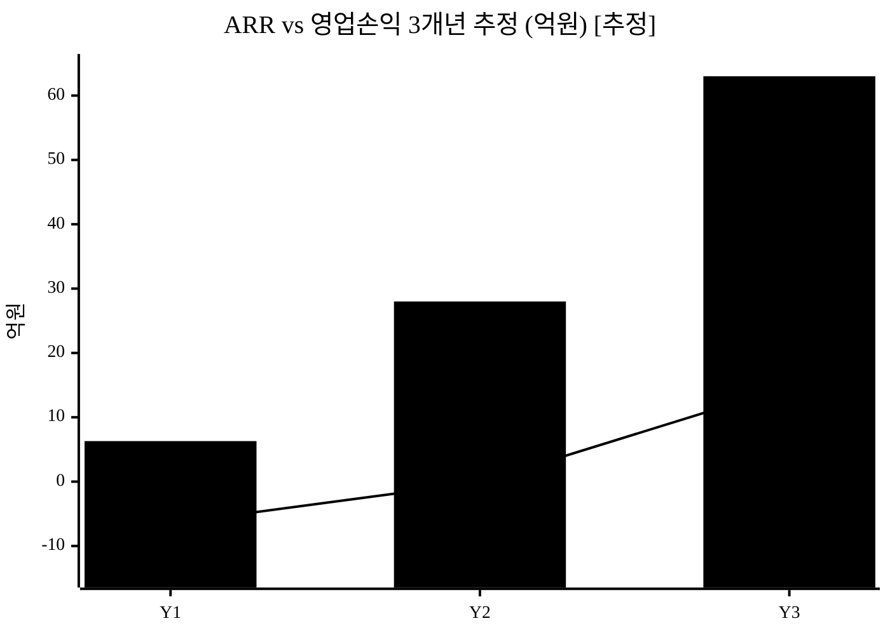

> 막대 = ARR, 선 = 영업손익(§6.6(A) 재산출 기준). Y1~Y2 적자구간(J커브)을 거쳐 Y2말~Y3 흑자전환(BEP)에 도달하는 전형적 SaaS 곡선. 모두 `[추정]`.

### 6.7 Exit / 회수 시나리오

> VC 회수 경로가 없으면 투자가 성립하지 않는다. **한국 시장 실거래 배수**를 1차 근거로 Exit 밸류 밴드를 산출하고, 글로벌 고배수는 상단 참고로만 강등한다. 모든 배수·밸류 `[추정]`.

**(A) Exit 경로 — 인수 후보별 전략적 근거(make vs buy)**

| 경로 | 인수 후보 | 전략적 인수 근거 `[추정]` |
|:---|:---|:---|
| 전략적 M&A | SK쉴더스 | 보안컨설팅·관제 사업 보유 → 인증 자동화 SaaS로 컨설팅 생산성↑·구독 매출원 확보(SW부문 자회사화 가능) |
| 전략적 M&A | 안랩 | 엔드포인트·클라우드 보안 포트폴리오에 컴플라이언스 자동화 결합(번들 판매) |
| 동종 통합 | 글로벌 GRC(Vanta·Drata) 한국 진입 | 자체 현지화(30~50MM·규제추적, §5.3) 대비 고객기반·통제데이터·심사관행 즉시 확보(buy < make 시간) |
| IPO | 코스닥 SaaS·보안 트랙(기술특례) | 매출·성장성 요건 충족 시(아래 (D)) |

> 위 인수 근거는 후보사 공개 사업전략 기반 가설이며 실제 인수 트랙레코드·멀티플 거래 사례는 `[재확인 필요]`(국내 SaaS M&A comparable 0건 자인 → 후속 리서치 보강 필요).

**(B) Exit 밸류 밴드 — 한국 실거래 배수 1차, 글로벌 상단 참고**

| 가정 | Y3 ARR `[추정]` | 적용 배수 `[추정]` | 잠재 Exit 밸류 `[추정]` | 배수 근거 |
|:---|---:|:---:|---:|:---|
| 보수 | 63억 | 3배(매출) | 약 189억 | 국내 IT서비스·보안 M&A 통상 3~5배 매출 `[재확인 필요]` |
| 기준 | 63억 | 5배(매출/ARR) | 약 315억 | 국내 상장 보안사 평균 PSR 1.8배[^17] 대비 **성장 프리미엄**(고성장 SaaS) 반영 `[추정]` |
| 공격 | 100억(확장) | 8배 | 약 800억 | 고성장 SaaS 상단(국내 기준) `[추정]` |
| (참고만) 글로벌 상단 | — | Vanta 약 40배 ARR[^12] | — | **미국 정점기·글로벌 리더 멀티플, 자사 적용 금지** |

> **상장 PSR 정박(comparable 1차).** 국내 상장 주요 사이버보안 16개사 평균 **Trailing PSR은 1.8배**(고성장사 지니언스 3.1배)다.[^17] 즉 본 표의 기준 5배·공격 8배는 **상장 평균을 웃도는 성장 프리미엄 가정**임을 정직히 인정한다 — 초기 고성장 SaaS·전략적 인수(make-vs-buy) 프리미엄을 전제하며, 그 성장(NRR>110%·동적 모수 확대)이 입증되지 않으면 보수 3배(상장 평균 근방)로 수렴할 수 있다.
>
> **변경점**: 종전 기준 8배·공격 12~15배(Vanta 40배 앵커링)를 **한국 실거래·상장 현실(보수 3배·기준 5배·공격 8배)** 로 하향했다. Vanta 40배는 본문 적용에서 빼고 '글로벌 상단 참고'로만 각주 강등한다. 상장 PSR(comparable 1건[^17])은 확보했고, **실제 M&A 거래 배수 사례 2~3건은 비공개(거래금액 미공시)로 여전히 `[재확인 필요]`** — 제출 전 추가 확보한다.

**(C) 후속 라운드 로드맵 · Cap Table · MOIC**

| 단계 | 조달 `[추정]` | pre `[추정]` | post `[추정]` | 신규 지분 `[추정]` | 마일스톤 |
|:---|:---|:---|:---|:---|:---|
| Pre-seed | 3억 | 12억 | 15억 | 20% | PoC+파일럿+채널 협의 |
| Seed | 15억 | 45억 | 60억 | 25% | Y1말 유료 45사·ARR 6.3억·CAC 회수 |
| Series A | 30억 | 120억 | 150억 | 20% | Y3 cash BEP·ARR 63억·NRR 100%+ |

> **PSR 정합**: Series A pre 120억 ÷ Y1말 ARR 6.3억 ≈ PSR 19배(성장 가정 반영, 종전 200~400억=PSR 30배+의 비현실성 정정). Seed pre 45억 ÷ ARR 6.3억 ≈ 7배.

**Exit 시 라운드별 투자자 MOIC** (Exit 기준 315억 가정, 후속 희석 단순화)

| 라운드 | 진입 시 지분(희석 후 약) | Exit 315억 시 회수 | MOIC `[추정]` |
|:---|---:|---:|:---:|
| Pre-seed | 약 12% | 약 38억 | 약 12.6배 |
| Seed | 약 12% | 약 38억 | 약 2.5배 |
| Series A | 약 18% | 약 57억 | 약 1.9배 |

> **정직한 인정**: Exit 315억(기준)은 **Pre-seed/시드 초기 투자자에겐 fund-returner급(10배+)이나, Series A 투자자에겐 MOIC 약 2배로 VC 요구수익(10배)에 미달**한다. 따라서 Series A 투자자에게 매력적이려면 **공격 시나리오(Exit 800억+)** 도달이 필요하며, 그 조건(ARPA 방어·NRR>110%·동적 모수 확대)을 §5.4·§6.5에 명시한다. 본 표는 시드 단계 투자 논리는 성립하나, 후기 라운드는 공격 시나리오 입증을 전제로 함을 투명하게 둔다.

**(D) IPO 경로 — 코스닥 기술특례 연결**

> 코스닥 기술특례 상장은 통상 기술평가 + 매출·성장성 요건을 본다. 본 재무모델상 Y3 ARR 63억·cash BEP 도달 시점이 기술특례 트랙 진입 준비 구간이며, 흑자 지속·매출 100억+ 도달(Y4~5 `[추정]`)을 상장 추진 시점으로 둔다(요건 세부 `[재확인 필요]`).

> **정부 심사 관점 주의**: 본 §6.7(Exit 밸류·배수)은 VC IR용이며 정부 지원사업 심사에서는 가점 요인이 아니다. 글로벌 정점기 배수(Vanta 40배)는 본문에서 제외해 데이터 정직성을 지켰고, 평가위원이 보는 것은 **협약기간 내 매출·고용·자생력(§14·§16)** 과 **협약 종료 후 3년 매출·고용 지속 전망**(§6.6(D) 지원금 졸업 서사)임을 명시한다.

---

## 7. Go-to-Market 전략

| 단계 | 채널 | 핵심 활동 | KPI |
|:---|:---|:---|:---|
| Pre-seed | KISA·정보보호 협회·인증 컨설턴트 PoC | 파일럿 무상/저가 → 사례 발표 | 전환율·준비시간 절감 측정 |
| Seed | 인증 컨설턴트·심사원 채널 파트너 | 추천 레브쉐어 모델 | 파트너당 추천 기업 수 |
| Series A | 정보보안 컨퍼런스·정부 정보보호 지원·인증 바우처 | 바우처로 진입 비용 완화 | CAC 회수 기간 |

**전략 핵심**: 인증 준비 기업은 직접 광고로 도달하기 비싸다(CAC↑). 대신 **이미 기업과 인증 신뢰 관계가 있는 컨설턴트·심사원을 채널 파트너로** 삼아 추천 기반으로 진입한다(이펙츄에이션의 "수중의 새" — 이미 가진 관계망 활용). 정부 정보보호 지원·인증 바우처를 결합하면 초기 도입 비용을 낮출 수 있다(단, 영업·온보딩 CAC는 잔존 — §6.4(B)).

### 7.1 채널 인센티브 · 이해상충 해소

컨설턴트는 "자동화가 자기 용역 매출을 줄인다"는 이해상충 우려가 있다. 따라서 win-win 구조를 설계한다.

| 항목 | 설계 |
|:---|:---|
| 수익배분 | 추천 고객 구독료의 레브쉐어(LTV의 약 10~15% `[추정]`), 정산 분기 단위 |
| 파트너 가치 | 자동화로 반복 자료취합이 줄어 컨설턴트가 더 많은 고객을 처리 가능(용역 감소가 아니라 처리량 증가·고부가 자문 집중) |
| 파트너 포털 | 추천 현황·정산·고객 컴플라이언스 현황 대시보드 제공(감수 권한 분리) |
| 채널 독점성 한계 인정 | 컨설턴트망은 경쟁사도 접근 가능한 **비독점 채널**. 따라서 양면 네트워크 록인(§5.3 3층)으로 전환 |
| 멀티호밍 억제 메커니즘 | 등급 인센티브(추천 누적 등급별 레브쉐어↑)·파트너 포털 락인 자산(추천 실적·고객 컴플라이언스 이력·감수 평판)으로 **우리 플랫폼에만 쌓이는 자산** 형성. 그래도 비독점이면 §5.3 3층을 '중'으로 하향 인정 |

> **이해상충 채널에 1순위 KPI를 거는 구조적 위험을 정면 인정**한다(§5.4(D)). 컨설턴트는 본질적으로 '자동화가 자기 용역을 잠식'하는 당사자라 충성 채널이 되기 어렵다. 따라서 채널 의존도 상한(≤75%, §5.4(D))을 KPI로 박고 직판·바우처 백업을 강건성으로 둔다.

### 7.2 온보딩 · 고객지원 체계

인증 준비 기업은 통제항목·증적 구조를 처음 설계할 때 사람의 도움이 필요하다.

| 항목 | 제공 |
|:---|:---|
| 표준 온보딩 플로우 | 가입 → 통제표 import(§2.4) → 첫 갭분석·준비율 산출까지 가이드 마법사 |
| 지원 채널 | 채팅·전화 상담, 응답 SLA(영업일 N시간 내 `[추정]`) |
| 교육 자료 | 인증별 통제 해설·정책 템플릿 라이브러리·심사 대응 가이드 |
| 셋업 소요시간 | 통제표 import ≤ 1시간 목표(§2.4, 파일럿 실측 KPI) |

### 7.3 ROI 워크시트 (세그먼트별 · 3년 누적 실수치)

> 종전 ROI는 '연 컨설팅 − 구독 = 절감' 한 줄 산식뿐이었다. **일회성 컨설팅과 매년 내는 구독을 같은 막대로 비교하면 다년 누적에서 역전**될 수 있다. 따라서 **3년 누적 실수치 워크시트**로 정직하게 재작성하고, 구독이 비싸지는 손익분기 시나리오까지 명시한다. 모든 값 `[추정]`, before(§1.6 baseline) 기반.

**(A) 컨설팅 반복 발주 기업 — 3년 누적 비교**

| 항목 | 컨설팅 유지 `[추정]` | 가드레일 구독 `[추정]` |
|:---|---:|---:|
| 인증 1사이클 컨설팅 비용 | 4,000만원 | — |
| 사이클 빈도(3년) | 1.5회(갱신·범위확대) → 6,000만원 | — |
| 구독료(연 1,800만 × 3년) | — | 5,400만원 |
| + 실무자 시간 절감 환산(§1.6 baseline) | — | 절감 X만원 `[추정]` |
| **3년 누적 순비용** | **약 6,000만원** | **약 5,400만원 − 절감 X** |
| **순절감** | | **약 600만원 + 시간절감 X / 회수 약 Y개월** |

> X(시간절감)·Y(회수개월)는 §1.6 man-day baseline 실측 후 확정한다(현재 가설).

**(B) 첫 인증 준비 기업 — '절감'이 아니라 '진출 시점 앞당김'**

| 항목 | 산식 `[추정]` |
|:---|:---|
| ROI 근거 | 실무자 수개월 투입 시간 × 인건비 + **공공·금융 진출 지연 기회비용** → 자동화로 단축 |
| 손익분기 | 절감시간 가치 + 진출 앞당김 매출 기회 > 구독료 도달 시점(파일럿 실측) |

**(C) 손익분기 역전 시나리오 — 정직한 명시**

> 인증 사이클에 컨설팅을 3년 1회만 발주하던 기업은 매년 구독(3년 5,400만원)이 일회 컨설팅(4,000만원)보다 **비싸질 수 있다**. 이 경우의 가치 정당화:

| 역전 케이스 | 구독이 정당화되는 추가 가치 |
|:---|:---|
| 컨설팅 3년 1회(4,000만) < 구독 3년(5,400만) | 상시 모니터링(증적 최신성)·재발주 제거·제도 개편 자동 흡수(§1.7)·심사 직전 재취합 0 |

> **'대체 vs 추가' 가설 검증**: 가드레일이 컨설팅을 완전 대체하는지(절감) 아니면 'SaaS + 여전히 컨설팅'으로 추가되는지(증액)는 §10.3에서 '준비 보조 도구'로 자인한 것과 긴장 관계다. 따라서 **파일럿에서 '도입 후 컨설팅 지출 대체율'을 핵심 측정항목으로 등록**(§17)하고, 보수 시나리오 ROI는 '컨설팅 완전대체'가 아니라 **'컨설팅 시간 X% 절감 + 진출 Y개월 앞당김'**으로 재작성한다.

---

## 8. 로드맵

> 단계 정량 합격선·사업 KPI는 §14에, 외부 의존성 리드타임·임계경로는 [그림 6-b]에 분리한다. 단계 명칭·월 구간은 §11·§15와 단일 마일스톤으로 통일한다.

| 단계 | 시점 | 대표 산출물 | 외부 산출 수준 |
|:---|:---|:---|:---|
| v1 (MVP) | M1~3 | 단일 프레임워크 통제 라이브러리 + 갭분석 대시보드 + 증적 업로드/관리 + 정책문서 자동생성 + 준비율 스코어 + 다단계 준비 워크플로 | 동작 PoC |
| v2 (Beta) | M4~6 | 다중 프레임워크(CSAP·ISMS-P·ISO27001) 매핑 + 다중 조직(테넌트) + 증적 자동수집 커넥터 mock + 갭→과제 티켓·담당자 + 심사 패키지 PDF + 정책 버전관리 + 역할 권한 + 준비율 추세·감사로그 | 파일럿 투입 가능 베타 (Series A 데모) |
| v3 (상용/심화) | M7~12 | 실 클라우드 커넥터 연동 + 컨설턴트 감수 게이트 + N2SF 등급 대응 + API·웹훅 + 벤치마킹 리포트 | 상용 출시 |

> v1을 "정적 mock"이 아니라 **"단일 통제 모델 + 상태 지속성 + 다단계 워크플로"**로 정의한다(§10 아키텍처). 컴플라이언스 자동화는 본질적으로 데이터 모델·상태 추적 문제이므로 정적 화면만으로 핵심 가치를 충족할 수 없다. 내부 가치환산 표현은 외부 제안서에서 제거하고 "동작 PoC / 베타 / 상용"으로 환언한다.

**[그림 6] 가치 누적 로드맵**

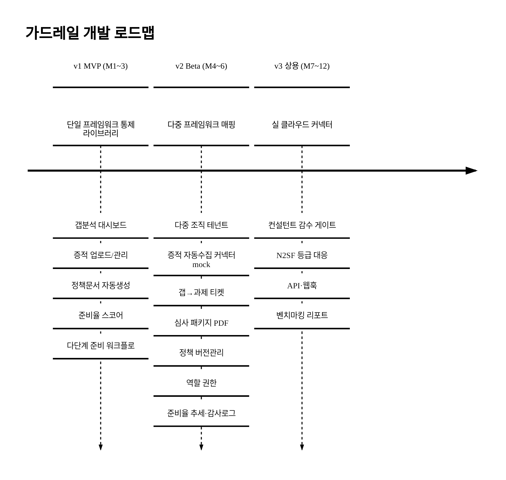

**[그림 6-b] 외부 의존성 리드타임 · 임계경로**

> 외부 승인·심사·연동 리드타임을 명시한다. 임계경로(굵은 흐름)에 자사 ISMS-P 취득을 추가한다(인증 자동화 SaaS가 스스로 인증을 보유해야 신뢰성 확보).

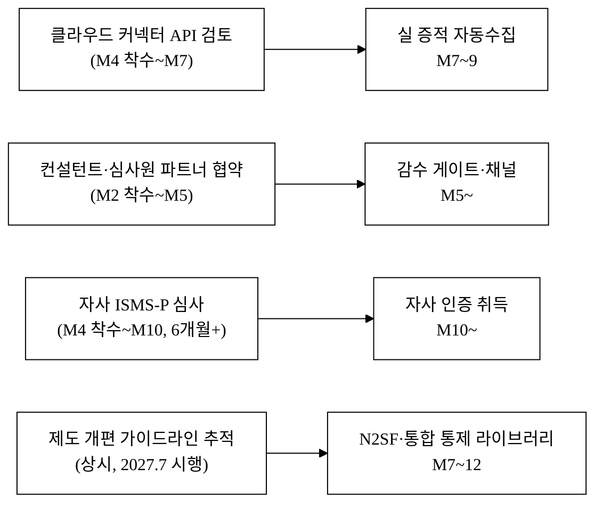

> **과적 분산**: 실 클라우드 커넥터·N2SF 대응·API는 외부 리드타임을 감안해 착수를 앞당긴다(M4~M7 착수). 제도 개편(2027.7 시행[^9]) 추적은 상시 활동으로 둔다.

> **자사 ISMS-P 일정 보수화(자기모순 해소·폴백).** ISMS-P는 신청·예비점검·심사·결함보완·인증위원회까지 통상 6개월을 넘기기 쉽고, 본 제안서가 인용한 **2025.12 심사강화 5대 대책[^4]으로 소요가 더 길어진다**(자사 인증도 동일 영향 — 자기모순 정면 반영). 따라서 **협약 KPI는 'M10 취득(완료)'이 아니라 '협약 내 심사 신청·예비점검 완료'까지로 보수화**하고, '취득'은 협약 종료 후 후속목표로 분리한다(§14). 신생 SaaS가 제품·조직 구축과 자사 인증을 동시에 M10 취득하는 것은 낙관적이므로, 예비심사 통과를 부분 달성 기준(폴백)으로 둔다.

> **통제 라이브러리 v1 일정 타당성**: 수백 통제항목 × 다중 프레임워크 정합(§10.7 골든셋)을 M1~3에 완성하려면 §5.3의 30~50MM 추정과 연결해 인력 배분이 필요하다. 현재 진척 0(§10.7)이므로 통제 데이터 구축을 first 마일스톤·자금 1순위로 둔다.

---

## 9. 리스크 · 완화

> 발생가능성 × 영향으로 등급화. 제품·경쟁 리스크에 더해 기술·재무·정책 리스크를 정면 등재한다.

| 분류 | 리스크 | 가능성×영향 | 대응(정량) | 잔여 리스크 |
|:---|:---|:---:|:---|:---|
| 제품/법 | 컴플라이언스 판정 신뢰·인증 책임 한계 | 중×고 | 판정 근거 로깅·전문가 감수 게이트·"준비 보조 도구" 책임경계 명시·면책 조항 | 일부 |
| **기술** | 통제-증적 매핑 오류(심사 탈락 유발) | 중×고 | 기준 원문 1:1 정합·매핑 누락 0 회귀테스트·컨설턴트 감수(§2.5) | 잔여 소 |
| **기술** | 클라우드 커넥터 자동수집 정확도/연동 실패 | 중×중 | v1~v2는 mock 커넥터로 검증, 실 연동은 단계적(M7~)·수동 폴백 | 중 |
| **기술** | 멀티테넌트 데이터 누수(타사 통제·증적 조회) | 저×극고 | RLS(행수준보안)·격리 테스트·모의침투 정기, 사고 시 사업종료급 인지하 최우선 관리 | 저 |
| 운영 | 증적 import·온보딩 붕괴 | 중×중 | import 마법사·검증 단계·무료 온보딩 지원(§2.4) | 저 |
| **정책** | CSAP 제도 개편으로 통제체계 변동(2026~2027) | 고×중 | 제도 변동 추종을 핵심 가치로 설계·라이브러리 상시 갱신. 개편이 통합 대응 수요·갱신 가치를 키움(기회 전환) | 저 |
| 운영 | 제도 개편 가이드라인 반영 지연 | 중×고 | 개정 diff 추적·영향 항목 자동 표기(§2.5). 공단·KISA 고시 원문 `[재확인 필요]`[^9] | 저 |
| 운영 | 가용성 장애(심사 직전 접근 불가) | 저×고 | 이중화·백업(RPO/RTO 목표 §10), SLA 99.9% 목표·export 백업 | 저 |
| **재무** | 자금소진(런웨이)·후속투자 실패 | 중×극고 | 보수 시나리오(§6.6) 운영·BEP 앞당김·Seed 15억 18개월 런웨이 | 중 |
| **채널** | 컨설턴트·심사원 파트너 미확보·이해상충 | 중×고 | 직판(콘텐츠·바우처) 백업, 파트너 win-win 인센티브(§7.1) | 중 |
| **정책** | 협약 KPI 미달·환수 | 저×고 | 보수 KPI(§14) 운영·분기 점검 조기 대응 | 저 |
| 경쟁 | 글로벌 현지화·컨설팅사 SaaS화·제휴연합(§4.1·[그림 4-c]) | 중×고 | 12~18개월 선점 + 데이터·전환비용 락인(§5.3), 제휴연합엔 "단일 통제 모델" UX 차별로 방어, 가격경쟁 생존(§5.4) | 중 |
| **기술** | LLM/생성 환각 → 잘못된 정책문서·충족 판정 | 중×고 | 판정은 룰 기반(결정론), 생성만 제약된 LLM(RAG)+근거 인용 강제+감수 게이트(§10.1.1)+생성물 면책 | 저 |
| **기술** | 라이브러리 갱신 지연 → 구버전 기준 통과 오판정 | 중×고 | 통제 `effective_date` 강제·만료 통제 자동 경고·갱신 SLA(§10.1.2) | 저 |
| **보안** | 외부 협업자(심사원·컨설턴트) 권한 오남용 데이터 유출 | 저×고 | 최소권한·범위·시간제한·감사로그(§10.1) | 저 |
| **보안** | 커넥터 보유 고객 클라우드 자격증명 탈취(공급망 공격) | 저×극고 | 자격증명 비저장·단기 토큰·read-only·고객측 회수권(§10.3) | 저 |
| **법** | 데이터 플라이휠 동의 없는 cross-tenant 재활용 | 저×고 | 비식별·집계 전용 파이프라인·약관 동의·opt-out·PIA(§10.6) | 저 |
| **IP** | BM 특허 진보성 거절·선행기술(Vanta 특허군) | 중×중 | 특허 다각화+영업비밀+상표+선점 분산, 선행기술 조사(§10.4) | 중 |
| **정책** | 제도 단순화로 '복잡성 해소' 가치제안 약화(개편 다운사이드) | 중×중 | 심사관행·증적운영 노하우 잔존·규제 비의존 가치 확장(§5.4(C)) | 중 |
| 제품 | 판정 신뢰 손배(LoL·보험 미비) | 저×고 | 계약 LoL(12개월 구독료)·E&O/사이버 보험·오인방지 표시(§10.3) | 저 |

---

## 10. 기술 아키텍처 · 보안 · 컴플라이언스 · 지식재산

> 통제·증적·정책문서 등 고객사의 민감 보안정보를 다루는 컴플라이언스 SaaS이므로, 기술 실체·규제 적격성·IP 전략을 명시한다. (인증 자동화 SaaS는 자기 자신이 보안을 입증해야 신뢰를 얻는다.)

### 10.1 시스템 아키텍처 (멀티테넌트 설계)

**테넌트 격리 모델 선택**: **shared-schema + Row-Level Security(RLS)** 를 채택한다.

| 후보 | 보안 격리 | 비용 | 운영 | 선택 |
|:---|:---:|:---:|:---:|:---:|
| DB-per-tenant | 강 | 높음 | 복잡 | — |
| schema-per-tenant | 중 | 중 | 중 | — |
| **shared-schema + RLS** | 중(RLS 강제) | 낮음 | 단순 | **채택** |

> 선택 근거: 다수 기업 테넌트(수백~수천 사) 환경에서 DB-per-tenant는 운영·비용 비현실적. RLS로 `tenant_id` 강제 격리하되, 누수 사고가 사업종료급(§9)이므로 격리 테스트·펜테스트를 의무화한다.

**RLS 격리 심층 방어 — *ORM/풀링 환경에서 가장 흔히 깨지는 지점*.** RLS는 set role 미적용·커넥션 풀 컨텍스트 누출·배치/잡 워커의 superuser 우회·관리자 콘솔 cross-tenant 조회에서 깨진다. 다음을 강제한다.

| 방어 | 설계 |
|:---|:---|
| 세션변수 강제 | 모든 DB 커넥션이 쿼리 전 `tenant_id`를 세션변수로 set, 미설정 시 쿼리 거부(기본 deny) |
| superuser 격리 | RLS 우회 가능한 `BYPASSRLS`/superuser 롤은 **마이그레이션 전용**으로 격리, 앱 런타임 사용 금지 |
| 잡 큐 컨텍스트 | 잡 워커(증적 자동수집·PDF 생성)는 **잡 페이로드의 tenant_id로 RLS 컨텍스트를 set한 뒤에만** 데이터 접근(가장 위험한 지점) |
| cross-tenant 차단 테스트 | 테넌트 A 토큰으로 B 데이터 0건 반환을 **CI 게이트(매 배포)** 로 강제 |
| 관리자 콘솔 | cross-tenant 조회 시 명시적 감사로그 + 2차 인증 |
| 침해 탐지·통보 SLA | 격리 침해 탐지·고객 통보 SLA를 RPO/RTO와 별도로 정의 |

| 계층 | v1 확정 스택 |
|:---|:---|
| 프론트 | Next.js(React) / TypeScript |
| 백엔드 | Node.js(ESM) API + RBAC 인가 |
| DB | PostgreSQL(RLS) + 증적 메타·민감 컬럼 암호화 |
| 객체 스토리지 | 증적 원본 파일은 객체스토리지(메타만 DB) |
| 큐 | 증적 자동수집·심사 패키지 PDF 생성 비동기 잡 큐 + 수평확장 워커 |
| 인프라 | 국내 리전 클라우드(데이터 국외이전 없음) + CDN |

> 스택을 '예시 [추정]'에서 **v1 확정 1셋으로 고정**한다(번복 비용이 크므로 조기 확정). 변경 시 §13 비용 영향 인지.

- **인증·인가**: 테넌트별 RBAC. **CISO·실무자·심사관(외부) 역할별 권한 분리**(심사관은 해당 고객사 범위·읽기/감수). 시제품·데모 단계는 기본 데모 계정 자동통과(인증이 본질 기능이 아닐 때 시연 사이클 단축), 정식 인증은 단계적.
- **비동기 잡**: 증적 자동수집 스캔·심사 패키지 PDF 생성은 큐로 분리해 API 응답성과 분리.

**확장성 설계.** 멀티테넌트 수백~수천 사 목표의 확장 근거: (a) **증적 원본은 객체스토리지 + 메타만 DB**(DB 비대화 방지), (b) **잡 큐 워커 수평확장**(PDF/스캔 부하 분산), (c) 대테넌트는 **파티셔닝·읽기복제**, (d) noisy-neighbor 방어로 **잡 우선순위·테넌트별 rate limit**. 모든 KPI 목표(§10.5)에 부하 가정(동시 100테넌트·증적 1만건·스캔 일 1회)을 괄호로 명시해 측정 가능하게 했다.

**[그림 7] 멀티테넌트 인프라·데이터 아키텍처**

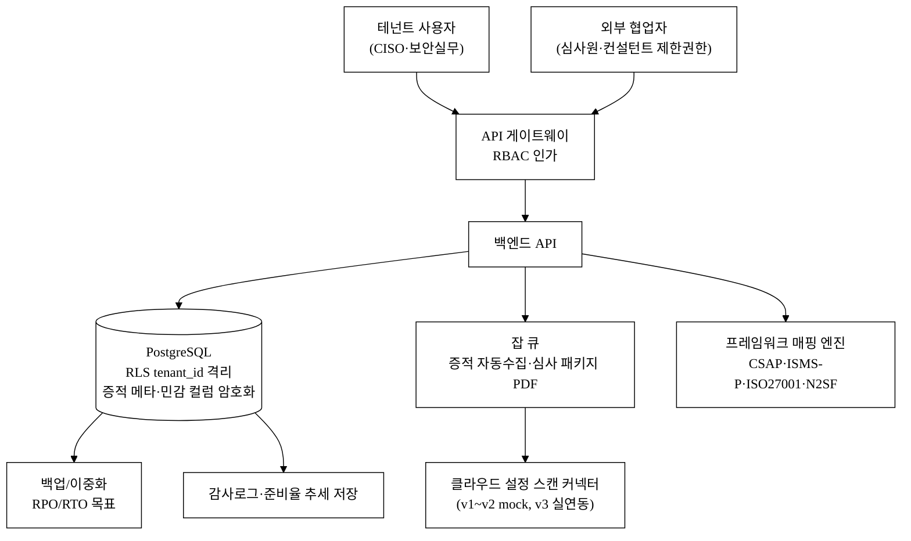

**[그림 7-b] 단일 통제 모델 논리 데이터 모델(개념 ER)**

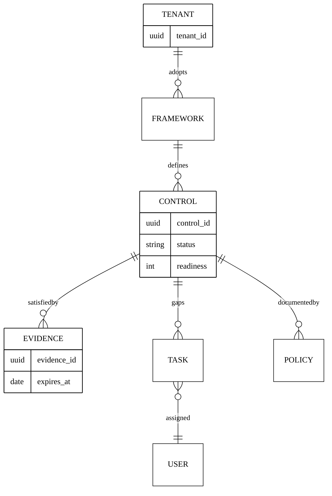

> 갭분석(TASK)·증적(EVIDENCE)·정책(POLICY)이 **단일 CONTROL 모델**을 공유하고, CONTROL이 여러 FRAMEWORK(CSAP·ISMS-P 등)에 매핑되는 것이 카피 난이도의 핵심(§5.3 1층). 공통 통제 1건이 다중 프레임워크에 재사용된다.

### 10.1.1 매핑/판정/생성 엔진 아키텍처 — *룰 기반 vs LLM*

> 제품 가치의 90%가 '통제-증적 자동 매핑'과 '판정 정확도'인데, 그 엔진이 룰인지 LLM인지 정의되지 않으면 기술 실사의 첫 질문에 답할 수 없다. **결정론과 생성을 분리**한다.

| 기능 | 엔진 | 환각·결정성 대응 |
|:---|:---|:---|
| 통제↔증적 매핑·충족 판정 | **결정론적 룰셋 + 통제 온톨로지**(LLM 아님) | 재현 가능·근거 추적(왜 충족인가 코드 레벨 보장)·테스트 가능 |
| 정책문서 초안 생성 | **템플릿 + 제약된 LLM(RAG)** | 출처 강제·생성물 전수 인용 추적·temperature 0/캐싱·human-in-the-loop 감수 게이트(§2.5)·프롬프트 인젝션 방어 |

> **판정은 룰 기반(결정론)** 이라 false-positive를 테스트로 잡을 수 있고, **생성만 제약된 LLM(RAG)** 으로 환각을 억제한다. LLM 환각이 '존재하지 않는 통제 충족 주장'으로 이어지지 않도록, 생성물은 반드시 근거 증적·통제 원문을 인용하며 감수 게이트를 통과한다. 룰 기반의 비용은 '제도 개정 시 룰 유지보수 = R&D 번레이트'이며 이를 §10.3 버전 엔진으로 체계화한다.

### 10.1.2 통제 버전·개정 영향 전파 모델 — *해자의 핵심 엔진*

> '제도 변동 추종'을 해자·기회로 반복 주장하면서 그 메커니즘이 0줄이면 자기모순이다. 통제항목을 **versioned entity**로 모델링한다.

```mermaid
%%{init: {"theme":"base","themeVariables":{"darkMode":false,"background":"#ffffff","fontFamily":"Georgia, serif","primaryColor":"#ffffff","primaryBorderColor":"#000000","primaryTextColor":"#000000","secondaryColor":"#ffffff","secondaryBorderColor":"#000000","secondaryTextColor":"#000000","tertiaryColor":"#ffffff","tertiaryBorderColor":"#000000","tertiaryTextColor":"#000000","mainBkg":"#ffffff","secondBkg":"#ffffff","lineColor":"#000000","textColor":"#000000","nodeBorder":"#000000","nodeTextColor":"#000000","titleColor":"#000000","edgeLabelBackground":"#ffffff","defaultLinkColor":"#000000","clusterBkg":"#ffffff","clusterBorder":"#000000","actorBkg":"#ffffff","actorBorder":"#000000","actorTextColor":"#000000","actorLineColor":"#000000","signalColor":"#000000","signalTextColor":"#000000","labelBoxBkgColor":"#ffffff","labelBoxBorderColor":"#000000","labelTextColor":"#000000","loopTextColor":"#000000","noteBkgColor":"#ffffff","noteBorderColor":"#000000","noteTextColor":"#000000","activationBkgColor":"#ffffff","activationBorderColor":"#000000","sequenceNumberColor":"#000000","attributeBackgroundColorOdd":"#ffffff","attributeBackgroundColorEven":"#ffffff","sectionBkgColor":"#ffffff","altSectionBkgColor":"#ffffff","sectionBkgColor2":"#ffffff","taskBkgColor":"#ffffff","taskBorderColor":"#000000","taskTextColor":"#000000","taskTextLightColor":"#000000","taskTextOutsideColor":"#000000","taskTextDarkColor":"#000000","taskTextClickableColor":"#000000","activeTaskBkgColor":"#ffffff","activeTaskBorderColor":"#000000","doneTaskBkgColor":"#ffffff","doneTaskBorderColor":"#000000","critBkgColor":"#ffffff","critBorderColor":"#000000","gridColor":"#000000","todayLineColor":"#000000","quadrant1Fill":"#ffffff","quadrant2Fill":"#ffffff","quadrant3Fill":"#ffffff","quadrant4Fill":"#ffffff","quadrant1TextFill":"#000000","quadrant2TextFill":"#000000","quadrant3TextFill":"#000000","quadrant4TextFill":"#000000","quadrantPointFill":"#000000","quadrantPointTextFill":"#000000","quadrantXAxisTextFill":"#000000","quadrantYAxisTextFill":"#000000","quadrantInternalBorderStrokeFill":"#000000","quadrantExternalBorderStrokeFill":"#000000","quadrantTitleFill":"#000000","pieStrokeColor":"#000000","pieOuterStrokeColor":"#000000","pieTitleTextColor":"#000000","pieSectionTextColor":"#000000","pieLegendTextColor":"#000000","cScale0":"#ffffff","cScaleLabel0":"#000000","cScaleInv0":"#000000","pie1":"#ffffff","cScale1":"#ffffff","cScaleLabel1":"#000000","cScaleInv1":"#000000","pie2":"#ffffff","cScale2":"#ffffff","cScaleLabel2":"#000000","cScaleInv2":"#000000","pie3":"#ffffff","cScale3":"#ffffff","cScaleLabel3":"#000000","cScaleInv3":"#000000","pie4":"#ffffff","cScale4":"#ffffff","cScaleLabel4":"#000000","cScaleInv4":"#000000","pie5":"#ffffff","cScale5":"#ffffff","cScaleLabel5":"#000000","cScaleInv5":"#000000","pie6":"#ffffff","cScale6":"#ffffff","cScaleLabel6":"#000000","cScaleInv6":"#000000","pie7":"#ffffff","cScale7":"#ffffff","cScaleLabel7":"#000000","cScaleInv7":"#000000","pie8":"#ffffff","cScale8":"#ffffff","cScaleLabel8":"#000000","cScaleInv8":"#000000","pie9":"#ffffff","cScale9":"#ffffff","cScaleLabel9":"#000000","cScaleInv9":"#000000","pie10":"#ffffff","cScale10":"#ffffff","cScaleLabel10":"#000000","cScaleInv10":"#000000","pie11":"#ffffff","cScale11":"#ffffff","cScaleLabel11":"#000000","cScaleInv11":"#000000","pie12":"#ffffff","xyChart":{"backgroundColor":"#ffffff","titleColor":"#000000","xAxisLabelColor":"#000000","xAxisTitleColor":"#000000","xAxisTickColor":"#000000","xAxisLineColor":"#000000","yAxisLabelColor":"#000000","yAxisTitleColor":"#000000","yAxisTickColor":"#000000","yAxisLineColor":"#000000","plotColorPalette":"#000000,#000000,#000000,#000000,#000000,#000000"}}}}%%
erDiagram
    FRAMEWORK ||--o{ FRAMEWORK_VERSION : has
    FRAMEWORK_VERSION ||--o{ CONTROL_VERSION : defines
    CONTROL_VERSION ||--o{ EVIDENCE : revalidates
    CONTROL_VERSION {
        uuid control_version_id
        date effective_date
        uuid supersedes
        string change_type
    }
    FRAMEWORK_VERSION {
        uuid fw_version_id
        date effective_date
    }
```

> 통제항목에 `framework_version`·`effective_date`·`supersedes` 관계를 두어, 개정 시 (구통제→신통제) 매핑과 **영향받는 증적·정책 재검증 큐**를 자동 생성한다. 만료 통제는 자동 경고(`effective_date` 강제), '구버전 기준 통과 판정'을 막는다(§9 신규 리스크).

**2027.7 CSAP→ISMS 이관 마이그레이션 워크스루(구체 1케이스).**

| 단계 | 처리 |
|:---|:---|
| 1. 개편 고시 입력 | CSAP 통제 vN → ISMS 통제 vN+1 매핑 룰 등록(supersedes) |
| 2. diff 산출 | 폐지·이관·신설 통제 자동 분류 |
| 3. 영향 전파 | 이관 통제에 묶인 기존 증적·정책을 재검증 큐로 이동 |
| 4. 테넌트 재매핑 | 각 테넌트 누적 매핑을 신통제로 자동 재연결(수동 확인 필요분만 큐) |
| 5. 통보 | 영향 통제·재준비 항목을 테넌트별 대시보드에 표기 |

> 이 마이그레이션 경로가 있어야 [그림 4-c]④ '기회 전환'이 기술적으로 성립하고, 동시에 **2층 전환비용 해자(§5.3)** 가 실현된다(고객이 개편을 무중단 흡수받는 가치 = 락인).

### 10.2 보안·개인정보보호 컴플라이언스

본 제품은 **고객사의 통제 충족 현황·증적·정책문서·감사로그** 등 민감한 보안정보를 처리한다.

| 영역 | 의무·설계 |
|:---|:---|
| 증적·민감정보 | 증적 메타·정책문서를 컬럼·객체 암호화, KMS 키 관리 |
| 접근통제·접속기록 | RBAC + 접속기록 **2년 보관**·이상행위 탐지·감사로그 |
| 처리위탁·국외이전 | 클라우드 처리위탁 고지, **데이터 국내 리전(국외이전 없음)** |
| 자사 ISMS-P | 인증 자동화 SaaS로서 자기 신뢰성 확보 — ISMS-P 취득 목표 M10~·비용 예산 반영(§13)·침해사고 대응 절차. **취득 범위에 '고객 증적 데이터 처리' 포함 명확화** |
| 자사 CSAP | 공공 고객 대상 시 CSAP(간편/표준) 추진 검토 — 제도 개편 일정[^9] 추종 |

**데이터 분류·라이프사이클.** 고객이 업로드하는 증적 안에는 개인정보(접근권한자 명단·인사정보·접속기록 IP/계정·침해사고 보고서)가 들어올 수 있다. 개인정보보호법·ISMS-P를 다루는 제품이 자기 데이터 거버넌스가 없으면 자기모순이므로 명시한다.

| 증적 유형 | 민감도(개인정보 포함) | 보관기간·파기 트리거 |
|:---|:---|:---|
| 접근권한자 명단·인사정보 | **개인정보 포함** | 계약 종료 후 N일 내 파기 또는 고객 export 후 즉시 삭제 |
| 접속기록(IP·계정) | 개인정보 포함 | 자사 시스템 로그 2년 / 고객 증적 내 기록은 계약 종속 |
| 침해사고 보고서 | 민감 | 마스킹·접근 최소화, 계약 종료 시 파기 |
| 정책문서·설정값 | 보안 민감 | 계약 종속, export 후 삭제 |

> 처리: 증적 내 개인정보 마스킹·접근 최소화, 개인정보 처리방침·처리위탁 계약, 필요 시 개인정보 영향평가(PIA) 수행. 재식별 위험을 §10.6 집계 파이프라인과 함께 관리.

### 10.3 규제 적격성 · 책임 경계

| 도메인 | 연계·범위 | "준비 보조" vs "인증 보증" 경계 |
|:---|:---|:---|
| CSAP·ISMS-P 통제 매핑 | KISA 고시·평가기준 원문에 1:1 정합 | 가드레일은 **준비 보조 도구**, 인증 합격은 심사기관 판단 |
| 클라우드 설정 스캔 | v1~v2 mock, v3 실 커넥터(읽기 권한 최소화) | 자동수집은 **증적 후보 제시**, 충족 판정 최종 책임은 신청기업 |
| 정책문서 생성 | 템플릿 기반 초안 생성 | 법적 효력·적정성은 신청기업·전문가 검토 책임 |

> **책임 경계 — 자동화의 한계 인정.** 가드레일은 "인증 통과를 자동 보증"하지 않는다. 자동 갭분석·준비율·정책 초안은 준비를 가속하는 보조이며, 최종 충족 판정·심사 합격은 심사기관·신청기업의 책임이다. 컨설턴트 감수 게이트로 고위험 통제를 이중 확인하고, 책임 경계를 약관·UI에 명시한다.

**책임의 3중 구조(문구 면책만으로 부족).** '준비율 95%로 표시했는데 탈락'은 채무불이행/하자 주장의 표적이다. UI 문구 면책만으로 B2B 손배를 막을 수 없으므로:

| 장치 | 내용 |
|:---|:---|
| 계약상 책임한도(LoL) | 직전 12개월 구독료 한도로 손해배상 제한 |
| 보험 | E&O(전문직 배상책임)·사이버 보험 가입 계획(예산 §13 반영) |
| 오인방지 표시 | 준비율 스코어를 **'심사 합격 확률'이 아니라 '준비 완료도'** 로 UI·약관에서 의미 분리 |

> false-positive(미흡→충족 오판, §10.5)는 가장 큰 손배 표적이므로 고위험 통제는 감수 게이트를 **기본 포함**(옵션 아님)으로 가격에 내장한다.

**자동수집 커넥터 지원 매트릭스 — *국내 CSP 비중·권한 모델·신뢰 장벽*.** 증적 자동수집이 v3 가치의 근거인데 종전 문서는 어떤 클라우드인지 미정이었다. 한국 공공·금융은 NCP·KT클라우드·삼성SDS·NHN 등 **국내 CSP 비중이 높아** 글로벌 GRC의 AWS/Azure 커넥터 자산이 안 통한다(국내 CSP별 신규 개발 = 진짜 해자이자 비용).

| 우선순위 | CSP | 수집 대상 | 연동 방식 | 리스크 |
|:---|:---|:---|:---|:---|
| 1 | NCP(네이버) | IAM·암호화·로그·네트워크 설정 | read-only IAM role / 단기 토큰 | 국내 CSP API 성숙도 `[재확인 필요]` |
| 1 | KT클라우드 | 동일 | 동일 | API 가용성 `[재확인 필요]` |
| 2 | AWS | 동일 | cross-account assume-role(read-only) | 성숙 |
| 3 | Azure·NHN·삼성SDS | 동일 | 단계적 | 범위·리드타임 §8 |

> **권한 최소화·신뢰 설계**: least-privilege **read-only** + 고객이 부여/회수 가능 + **스캔 결과만 저장하고 자격증명 비저장(또는 단기 토큰)**. 자동화 SaaS가 고객 클라우드에 read 권한으로 진입하는 것 자체가 공격면·보안팀 거부 사유이므로, 이 신뢰 장벽을 §9 리스크에 등재하고 §2.6 구매자 신뢰 패키지로 해소한다. v1~v2 mock 단계에 구매자가 얻는 실가치(단일 통제 모델·갭분석·정책생성·심사 패키지)는 자동수집과 별개로 실동작함을 §8에 명시.

### 10.4 지식재산(IP) · 데이터 자산 해자

| 자산 | 보호 전략 |
|:---|:---|
| 상표 | 'Guardrail(가드레일)' 상표 출원(국내) |
| 영업비밀 | 통제 매핑 룰셋·정책문서 템플릿 코퍼스·심사 대응 노하우를 영업비밀·DB권으로 관리 |
| 독점 데이터(플라이휠) | 산업별 통제 충족 패턴·심사 통과 데이터 누적 → 벤치마킹 리포트·갭 추천으로 환류(§5.3 3층·§10.6) |

**출원 클레임 후보 — 선행기술 회피·진보성.** 컴플라이언스 자동 매핑(control crosswalk)은 Vanta·Drata·OneTrust 등이 이미 특허군을 보유한 레드오션이라, '출원 검토'에 그치면 실사에서 바로 깨진다.

| 클레임 후보 | 무엇이 신규/진보적인가 | 선행기술 대비 차별 |
|:---|:---|:---|
| (a) 한국 통제 온톨로지 기반 다중 프레임워크 매핑 | 단순 crosswalk가 아니라 **한국 통제 온톨로지 특정 자료구조** | 글로벌 crosswalk(공개 개념) 대비 한국 통제 의미망 |
| (b) 개정 영향 전파 자동 재산정 | `effective_date`·`supersedes` 기반 **영향 증적·정책 재검증 큐 생성 알고리즘**(§10.1.2) | 정적 매핑 특허 대비 시간축 버전 전파 |

> **BM 특허 진보성 거절 리스크**(SW BM 특허는 한국 심사 거절률 높음)를 §9에 등재하고, 방어를 **특허 다각화 + 영업비밀 + 상표 + 선점**으로 분산한다. 미출원=무방비이므로 선행기술 조사 + 출원 우선일 확보 계획을 제출 전 수립한다(`[재확인 필요]`). 특허로 보호 불가 시 IP를 해자 주장에서 약화한다.

### 10.5 기술 KPI · SLA — *판정 품질 지표 분리*

> 컴플라이언스 판정은 심사 결과로 직결되므로 정확도 목표가 필수다. **'매핑 누락 0'은 입력 커버리지 지표일 뿐**이므로, 판정 품질(precision/recall)을 별도로 둔다.

| 지표 | 목표 `[추정]` | 부하/검증 가정 |
|:---|:---|:---|
| 가용성 SLA | 99.9% | — |
| 통제-증적 매핑 **커버리지** | 기준 원문 대비 매핑 누락 0건 | 입력 측 지표 |
| 충족 판정 **정밀도(precision)** | ≥ 95% | 골든셋 백테스트 |
| 충족 판정 **재현율(recall)** | ≥ 90% | 골든셋 백테스트 |
| **false-positive(미흡→충족 오판)율** | **≤ 1%**, 고위험 통제 **0건** | 가장 치명적 실패 모드 상한 |
| 준비율 스코어 산식 | 통제 가중치(필수/권고)·부분충족 가중 명세(§10.3) | 블랙박스 금지 |
| API p95 응답시간 | ≤ 500ms | 동시 100테넌트·증적 1만건·스캔 일 1회 가정 |
| 심사 패키지 PDF 생성 성공률 | ≥ 99% | 잡 큐 워커 수평확장 |
| 데이터 백업 RPO/RTO | RPO ≤ 1시간 / RTO ≤ 4시간 | — |
| 테넌트 격리 회귀테스트 | 매 배포 시 cross-tenant 0건(CI 게이트) | §10.1 |
| 보안 | 취약점 스캔 상시 + 펜테스트 반기 1회 + **테넌트 격리 회귀테스트 매 배포** | 치명 취약점 0건 |
| 자동화율(사람 감수 비중) | 시간에 따라 하강 목표 곡선(§6.4 GM 정합) | cold-start(§10.7) |

> **골든셋 백테스트 프로토콜(§17 등록)**: 심사 통과 실적이 있는 실제 인증 케이스를 ground truth로 정밀도/재현율/false-positive를 측정한다. '누락 0건'(커버리지)과 'precision/recall'(판정 품질)을 분리한다.

### 10.6 집계·벤치마크 데이터 파이프라인 — *3층 해자 vs RLS 격리의 모순 해소*

> §5.3 3층(데이터 플라이휠)은 'cross-tenant 집계'를 전제하는데, 이는 §10.1 RLS 격리와 정면 충돌한다. 별도 파이프라인 없이는 3층 해자가 실현 불가하므로 명문화한다.

| 설계 | 내용 |
|:---|:---|
| 저장소 분리 | 운영 DB(격리) ↔ **비식별·집계 전용 분석 저장소**(원본 미이관) |
| 재식별 방지 | k-익명성 등 임계치 미만 집계 금지, 업종별 최소 표본(§5.3 임계 150~200사) |
| 동의 구조 | 약관상 **집계 활용 동의 + 테넌트별 opt-out** 제공 |
| 법적 근거 | 개인정보 비식별·집계 가공·재제공에 대한 개인정보 영향평가(PIA) |

> 동의 없는 cross-tenant 데이터 재활용은 그 자체가 신뢰·법 리스크(§9)다. 이 파이프라인이 전제될 때만 §5.3 3층을 해자로 카운트한다.

### 10.7 정확도 데이터 확보 전략 — *cold-start 정면 대응*

> 판정 정확도의 ground truth는 KISA 고시 해석 + 실제 심사 결과인데, 신생사가 이 라벨셋을 어떻게 확보하느냐가 곧 정확도 상한이자 cold-start다.

| 단계 | 전략 |
|:---|:---|
| 초기(고객 0) | KISA 평가기준 원문 구조화 + 컨설턴트 감수로 **골든셋 수작업 구축**(비용 = §13 '통제 데이터·법령 코퍼스 구축비'와 정합) |
| 파일럿 | 파일럿 N사의 **실 심사 결과를 라벨로 회수**하는 피드백 루프(§17) |
| 확산 | 자동화율(사람 감수 비중)을 시간에 따라 낮추는 **목표 곡선을 KPI화**(§10.5) → 감수 변동비↓ → §6.4 GM↑ 정합 |

> **현 진척 정직 명시**: 현재 통제 라이브러리 구축 진척도 = **0(미착수)**. 즉 카피비용 30~50MM(§5.3)을 자사도 아직 안 들였다(경쟁사와 동일 출발선). 따라서 **데이터 자산 구축을 first 마일스톤·자금용도 1순위**로 둔다('제품 이전에 데이터'). 매핑 정확도 '누락 0'은 검증주체(컨설턴트 감수 표본 검수율)를 명시하고, 0이 비현실적이면 **'99% + 고위험 통제 100%'** 로 현실화한다.

---

## 11. 추진체계 · 조직 R&R · 인력 계획

> 팀 실명·실값은 §12(팀)에서 사용자가 채운다. 본 절은 **역할 골격·확보 방식·인력 규모**만 명시(실명 공란).

### 11.1 추진체계도

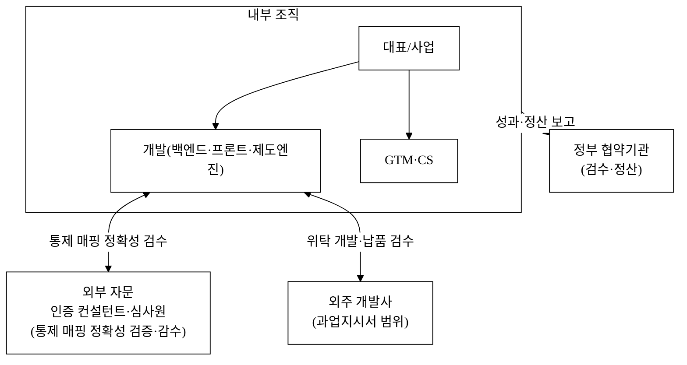

> **통제 매핑 정확성 검증 책임 주체**: CSAP·ISMS-P 통제-증적 매핑의 정확성은 **인증 컨설턴트·심사원 자문(외부) + 자체 회귀테스트(내부)** 가 공동 검증하며, 제도 개정 시마다 검수한다. 자체 개발 vs 외주 분담 경계는 [`2_개발계획서.md`](./2_개발계획서.md) WBS와 [`3_과업지시서_v1.md`](./3_과업지시서_v1.md) §1 범위로 확정한다(자문 R&R 골격만, 실명은 사용자 영역).

> **핵심 IP는 자체개발 — 외주 의존도 명시**: 정부 심사는 핵심기술의 외주 의존도를 본다. **제도엔진·통제매핑(핵심 IP, §10.4 영업비밀)은 자체개발**하고, **부수 기능(PDF 엔진·데이터 입력화 등)만 외주**한다. 핵심 IP를 외주에 맡기면 IP 해자 주장과 모순되고 정부지원금 외주용역비 한도 위반 소지가 있으므로 경계를 명확히 한다(§13과 교차검증). 외주 비중이 정부지원금 한도 내인지 §13.1 자가검증 행으로 확인한다.

> **정부사업 전담 라인(골격, 실명 공란)**: 협약기관과의 검수·정산 보고 책임자(전담 PM)·회계담당과 분기 정산·중간점검 보고 주기를 둔다.

| 역할 | 책임 | 보고 주기 | 실명 |
|:---|:---|:---|:---|
| 정부사업 전담 PM | 협약 이행·중간점검·성과보고 | 분기 | <TODO: 사용자 입력> |
| 회계담당 | 사업비 집행·정산 | 분기/반기 | <TODO: 사용자 입력> |

### 11.2 인력 · 채용 계획 (고용창출)

> 직군·인원·고용형태 골격(실명 공란). 인원수는 §13 인건비 비목·§6.6 재무와 1:1 정합.

| 직군 | Y1(Seed) `[추정]` | Y2 `[추정]` | Y3(Series A) `[추정]` | 고용형태 | 단가 가정(연, `[추정]`) |
|:---|---:|---:|---:|:---|:---|
| 백엔드·프론트 개발 | 3 | 5 | 7 | 정규 | 8천만~1.1억원 |
| 제도엔진(통제 매핑·커넥터) 개발 | 1 | 2 | 3 | 정규 | 8천만~1.1억원 |
| CS·온보딩 | 1 | 2 | 3 | 정규/계약 | 4~5천만원 |
| 채널영업·마케팅 | 1 | 2 | 3 | 정규 | 4~6천만원 |
| 인증 도메인 자문 | 외부 자문 | 외부 자문 | 1(내부화) | 자문/정규 | 고정 자문료 or 매칭 레브쉐어 |
| **신규 직접고용 누계** | **6명** | **+7명(누계 13)** | **+6명(누계 19)** | | |

> **단가→인건비 실집행 정합**: 위 인원 × 직군 단가 × 재직개월 × 1.15(4대보험·퇴직급여)로 §6.6(A) 인건비 라인(Y1 5.5억·Y2 11억·Y3 16.5억)을 산출한다. 대표자 인건비 계상 가능 여부·정부지원금 계상 가능 인건비(신규채용 한정)는 정부 회계 규정 체크박스로 §13에서 확인한다.

**고용 질·유지 설계(정부 우대 고용유형).** '누계 19명'은 채용계획일 뿐 '유지 고용'이 아니다. 정부가 검증하는 것은 협약 종료 시점 **재직 유지 인원(4대보험 가입 기준)**이다.

| 항목 | 사업자 자율 목표 `[추정]` |
|:---|:---|
| 고용 정의 | 누계 채용이 아니라 **협약 종료 시점 재직 유지(4대보험 가입)** |
| 정규직 비율 | ≥ 80% |
| 청년(만 34세 이하) 채용 비율 | ≥ 50% `[추정]` |
| 고용 유지 약정 | 협약기간 내 이탈 시 충원 |
| 신규/청년/정규직 분해 | 협약 보고 시 §14 KPI로 분해 제출 |

> 정부지원금 계상 인건비(신규채용 한정·대표 제외 등)와 자기부담 인건비를 구분한다(§13). 여성·비수도권 가점은 공고 확정 후 연계(`<TODO: 사용자 입력>`). 각 직군 고용형태는 '정규' 확정(CS 일부만 계약 가능).

---

## 12. 팀 (Team)

<TODO: 사용자 입력>

| 역할 | 이름 | 소속·직함 | 담당 R&R |
|:---|:---|:---|:---|
| 대표 | <TODO: 사용자 입력> | <TODO: 사용자 입력> | <TODO: 사용자 입력> |
| 개발 총괄 | <TODO: 사용자 입력> | <TODO: 사용자 입력> | <TODO: 사용자 입력> |
| 사업·GTM | <TODO: 사용자 입력> | <TODO: 사용자 입력> | <TODO: 사용자 입력> |
| 자문(인증 컨설턴트·심사원) | <TODO: 사용자 입력> | <TODO: 사용자 입력> | <TODO: 사용자 입력> |

---

## 13. 사업비 집행계획 (예산)

> 정부 지원사업 심사의 핵심 배점 항목. 총사업비를 정부지원금/자기부담으로 구분하고 비목별·분기별로 배분한다. 외주용역비는 [`3_과업지시서_v1.md`](./3_과업지시서_v1.md) 용역 범위와, 인건비는 §11.2 채용계획 인원×단가와 정합한다. **총액·비율은 공고 한도 확정 후 조정**(`<TODO: 사용자 입력>`), 아래는 비목 구조·배분 예시 `[추정]`.

### 13.1 재원 구분 · 비목별 절대금액 (Y1 대표 시나리오 `[추정]`)

> 비율만으로는 정부 정산 규정(인건비 비중·외주용역비 한도·간접비 상한) 적합성을 판정할 수 없으므로 **절대금액 표**로 작성한다. 공고 한도 미확정이라 **대표 시나리오(총사업비 5억 = 정부지원금 4억 : 자기부담 1억[현금 0.5/현물 0.5])** 를 `[추정]`으로 가정한다(공고 확정 후 §13 총액·비율 조정 `<TODO: 사용자 입력>`).

| 비목 | 비율 | 절대금액(억) `[추정]` | 산출 근거 |
|:---|---:|---:|:---|
| 인건비 | 55% | 2.75 | §11.2 Y1 6명 × 직군 단가 × 재직개월 × 1.15(신규채용 한정·대표 제외) |
| 외주용역비 | 15% | 0.75 | 과업지시서 위탁 분(PDF 엔진·데이터 입력화 등 **부수 기능만**, 핵심 IP 제외 §11.1) |
| 클라우드 인프라비 | 8% | 0.40 | 멀티테넌트 서버·DB·객체스토리지·CDN(§10.1) |
| 통제 데이터·법령 코퍼스 구축비 | 4% | 0.20 | CSAP·ISMS-P 통제 구조화·골든셋 수작업(§10.7, **first 마일스톤**) |
| 마케팅·채널파트너 수수료 | 10% | 0.50 | 컨설턴트 레브쉐어·바우처 연계(§7.1) |
| 일반관리비(자사 인증·보험 포함) | 8% | 0.40 | 자사 ISMS-P 취득·E&O/사이버 보험(§10.3)·법무·회계 |
| **합계** | **100%** | **5.00** | 정부지원금 4.0 : 자기부담 1.0 = `<TODO: 공고 비율>`로 조정 |

**정부 회계 규정 자가검증.**

| 검증 항목 | 결과 `[추정]` |
|:---|:---|
| 외주용역비가 정부지원금 한도 내인가(통상 정부지원금의 40~60% 이하) | 외주 0.75억 ÷ 정부지원금 4.0억 = **약 19%** → 한도 내 ✅ |
| 핵심 IP(제도엔진·통제매핑)를 외주에 맡기지 않는가 | 자체개발(§11.1) ✅ |
| 인건비 비중 과다 여부 | 55% — 공고 상한 확인 필요 `<TODO: 공고 한도>` |
| 4대보험·퇴직급여 포함 / 대표자 인건비 계상 | 신규채용 인건비에 ×1.15 포함, 대표자 계상 여부 `<TODO: 공고 규정>` |
| 간접비·일반관리비 상한 | 8% — 공고 상한 확인 필요 `<TODO: 공고 한도>` |

### 13.2 분기별 집행 스케줄 · 절대금액 (Y1 `[추정]`, 단위: 백만원)

> 정부 정산은 분기·반기 집행률을 본다. 비목별 분기 금액·누적 집행률을 제시한다.

| 비목 | Q1 | Q2 | Q3 | Q4 | 합계 | 집행 성격 |
|:---|---:|---:|---:|---:|---:|:---|
| 인건비 | 45 | 75 | 80 | 75 | 275 | 매월 발생(균등, 채용 순차로 Q1↓) |
| 외주용역비 | 10 | 30 | 25 | 10 | 75 | 마일스톤 연동(비균등) |
| 인프라·통제데이터 | 20 | 15 | 15 | 10 | 60 | 셋업 집중 후 운영 |
| 마케팅·채널 | 10 | 15 | 12 | 13 | 50 | 파일럿·확산 연동 |
| 일반관리(자사인증·보험) | 10 | 12 | 10 | 8 | 40 | ISMS-P 착수(M4) 후 발생 |
| **분기 합계** | **95** | **147** | **142** | **116** | **500** | |
| **누적 집행률** | **19%** | **48%** | **77%** | **100%** | | 후반 몰아쓰기 없음(균등 분산) |

---

## 14. 정량 성과지표(KPI) · 마일스톤

> 협약 종료 시점 성공/실패 판정 기준. 행=지표, 열=협약 연차. 모든 목표 `[추정]`, 파일럿 실측으로 갱신.

| 지표 | 1년차 `[추정]` | 2년차 `[추정]` | 3년차 `[추정]` | 측정 정의 | 증빙서류 | 검증주체 |
|:---|---:|---:|---:|:---|:---|:---|
| 유료고객 수 | 45사 | 195사 | 350사 | 유상 계약 체결사 | 계약서·세금계산서 | 협약기관 |
| ARR | 약 6.3억 | 약 28.0억 | 약 63.0억 | 연환산 반복매출 | 재무제표·세금계산서 | 협약기관 |
| 유료 전환율 | 25% | 28% | 30% | 트라이얼→유료 | 내부 CRM·계약 | 자체+표본검수 |
| 연 churn(로고) | ≤ 20% | ≤ 17% | ≤ 15% | 갱신 미체결 비율 | 갱신 계약 내역 | 협약기관 |
| NRR | ≥ 90%(초기 갱신코호트) | ≥ 95% | ≥ 100% | 기존 고객 매출 유지·확장 | 갱신·업셀 내역 | 협약기관 |
| 신규 직접고용(**유지**) | 6명 | 누계 13명 | 누계 19명 | **협약시점 재직 유지** | **4대보험 가입자명부** | 협약기관 |
| 정규직 비율 | ≥ 80% | ≥ 80% | ≥ 80% | 정규직/전체 | 근로계약서 | 협약기관 |
| 청년(≤34세) 비율 | ≥ 50% | ≥ 50% | ≥ 50% | 청년/신규채용 | 주민등록·근로계약 | 협약기관 |
| 파일럿 완료 사 수 | **5사** | — | — | PoC 완료 | 파일럿 계약·결과 | 협약기관 |
| 컨설턴트·심사원 파트너 수 | **20명** | 40명 | 60명 | 채널 협약 체결 | 파트너 협약서 | 협약기관(SOM 1순위) |
| 후속 투자유치 | Seed 15억 | — | Series A 30~50억 | 투자 집행액 | 투자계약서 | 협약기관 |
| 자사 ISMS-P | **심사 신청·예비점검 완료(보수화)** | 취득 | 유지 | 인증 진행 단계 | 신청서·인증서 사본 | 협약기관 |
| 통제-증적 매핑 커버리지 | 누락 0 | 유지 | 유지 | 원문 대비 누락 | 감수 표본 검수율 | 컨설턴트 감수 |
| 충족 판정 false-positive | ≤ 1%(고위험 0) | 유지 | 유지 | 골든셋 백테스트 | 백테스트 로그 | 자체+감수 |

> **종전 충돌 정정**: churn을 §6.4·§6.5와 동일하게 **연 churn(로고)**로 단일화(종전 월 churn). 파트너 수·파일럿 수의 'N사 [추정]'을 **사업 목표치(파트너 20명·파일럿 5사)**로 박았다(팀 실명과 달리 목표치는 사업자가 약속하는 값). §6.5(A) 역산(파트너 20명 × 50리드 = 1,000)과 정합한다. NRR을 Y1부터 초기 갱신코호트로 측정 개시.

**정부 3대 성과지표 + 환수 로직.** 정부가 우선시하는 '협약 종료 후 매출·고용·투자유치'를 필수 등급화한다.

| 성과지표 | 필수 달성선 | 미달 시 조치(협약 관점) |
|:---|:---|:---|
| **매출 발생**(필수) | 협약 종료 시 유료 매출 발생(세금계산서 증빙) | 미발생 시 협약상 불이익·차기 지원 제한 |
| **고용 유지**(필수) | 협약 종료 시 신규 고용 ≥ N명 유지(4대보험) | 미유지 시 인건비 일부 환수 가능성 |
| 투자유치 | Seed 후속 유치 | 미달 시 사업화 마일스톤 재협의 |

> 위 환수 로직은 일반 협약 관행 기반 가설(`[추정]`)이며, 실제 환수 기준은 공고·협약서로 확정(`<TODO: 공고 규정>`).

**[그림 8] 마일스톤 타임라인 (단계별 정량 합격선)**

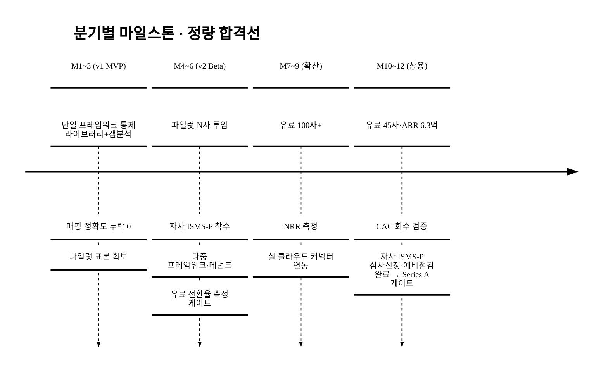

> **Seed→Series A 게이트 조건**: 파일럿(§7·§17)의 유료 전환율·준비기간 절감 정량 결과가 게이트. Y1말 유료 45사·ARR 6.3억·CAC 회수 검증·연 churn ≤ 20% 미달 시 pivot 트리거(가격·채널·세그먼트 재조정). **자사 ISMS-P는 협약 내 '심사 신청·예비점검 완료'가 게이트이며 '취득'은 협약 종료 후 후속목표**(§8 보수화)다.

---

## 15. 추진 계획 (단일 마일스톤 통일)

> §8 로드맵·§14 KPI와 단계 명칭·월 구간을 통일한다.

| 단계 | 산출물 | 시점 | 정량 합격선(§14) |
|:---|:---|:---|:---|
| v1 MVP | 통제 라이브러리 + 갭분석 + 증적관리 + 정책생성 + 준비율 + 워크플로 | M1~3 | 매핑 정확도 누락 0 |
| v2 Beta | 다중 프레임워크·테넌트 + 자동수집 mock + 심사 패키지 + 권한 + 감사로그 + 파일럿 N사 | M4~6 | 유료 전환율 측정·ISMS-P 착수 |
| 확산 | 유료 100사+·실 클라우드 커넥터 연동 | M7~9 | NRR 측정 |
| 상용 | 3티어 출시·유료 45사·ARR 6.3억 | M10~12 | CAC 회수 검증·자사 ISMS-P 심사신청·예비점검 완료(취득은 후속) |

> 절대 날짜는 공고 일정 확정 후 기입한다(<TODO: 사용자 입력>).

---

## 16. 기대 효과 · 사회적 가치 (정량)

### 16.1 기대 효과 요약

| 구분 | 내용 | 근거 |
|:---|:---|:---|
| 비용 | 반복 컨설팅·상시운영 비용 평탄화·절감(§4.1·§7.3) | CSAP 수수료 852만~3,225만원·컨설팅 포함 수천만원[^6][^7] 대비 구독 평탄화 |
| 시장 | 진입 3년 약 63억원 ARR 도달 가능 `[추정]` | §3 SOM·§6.6 재무, Vanta·Drata 궤적 벤치마크[^12][^13] |
| 정책 | **이 공고의 정책 목표 달성에 직접 기여**(§0.2): 인증 병목 해소로 SaaS 1만개 육성 가속·ISMS-P 의무화 이행 지원·개편 연착륙 | 정부 SaaS 목표[^11]·CSAP/ISMS-P 제도[^4][^8] |
| 사업 | 인증 준비 기간·실무자 시간 절감 `[추정]` | 단일 통제 모델·자동화(§4.3·§7.3, 파일럿 실측) |

### 16.2 정량 사회적 가치 (측정 가능 목표값)

> 정부 사회가치 배점은 '측정 가능한 목표치'를 요구한다. 근거 없는 '예방효과'는 산출가능 프록시로 환언하고, 최소 1~2개 지표에 절대 목표값을 박는다.

| 임팩트 | 측정 가능 목표 `[추정]` | 정책 KPI 연계 |
|:---|:---|:---|
| 고용창출 | 협약 종료 시 재직 유지 ≥ 19명(4대보험)·정규직 ≥ 80%·청년 ≥ 50%(§11.2) | 정부 일자리·정보보안 인력 |
| 포용(비수도권) | **협약 종료 시 비수도권 도입사 비중 ≥ 30%** | 정보보안 격차 완화 |
| SaaS 진출 가속 | 도입사 평균 인증준비기간 단축 X개월 → **공공조달 진입 Y개월 조기화**(파일럿 실측) | SaaS 1만개 육성[^11] |
| 보안 수준 상향 | '침해 예방'(인과 근거 없음) → **'ISMS-P 통제 충족률 상향'**(산출 프록시)로 환언 | ISMS-P 의무화 취지[^4] |
| 인증 비용 합리화(사회 총량) | **도입 N사 × 사당 절감 Z만원 = 총 절감액**(§7.3 ROI 사회 총량 확장) | 정보보안 산업 저변 확대 |
| 제도 개편 연착륙 | CSAP-ISMS 통합 개편 대응 자동화로 기업 적응 비용 절감 | 제도 개편[^8][^9] 연착륙 |

> 절감액·진출 조기화·통제 충족률은 §14 마일스톤·§7.3 ROI·§1.6 baseline과 연동해 협약 종료 시 정량 보고한다. 'X·Y·Z'는 파일럿 실측 후 확정(`[추정]`). '침해사고 예방'은 인과 근거가 없어 통제 충족률 프록시로 대체했다.

---

## 17. 고객 검증 계획 (Customer Discovery)

> 현 시점(2026-06) 1차 고객 검증은 **설계 단계**다. 실제 인터뷰·LOI·실값은 `<TODO: 사용자 입력>`이며 창작하지 않는다. 본 절은 검증 프로토콜(표본·질문·성공기준)을 사전 등록해 가설을 증거 수집 계획으로 격상한다.

### 17.1 검증 설계(사전 등록)

| 항목 | 설계 |
|:---|:---|
| 표본 | CSAP·ISMS-P 준비·유지 기업의 보안 담당(CISO·인증TF) 8~12명 심층 인터뷰 + 인증 컨설턴트·심사원 사전 협의 |
| 질문 | 현재 준비 방식(엑셀/컨설팅)·연간 인증 지출·준비 소요시간·페인 우선순위·연 1,800만원 WTP 반응 |
| WTP 측정 | 가격민감도 설문(Van Westendorp PSM)으로 수용가격 분포 도출 |
| 성공 기준(게이트) | 파일럿 N사 유료 전환율 ≥ X%·준비기간 절감 ≥ Y% (사전 등록) |
| 수요 증거 | LOI/사전예약/웨이팅리스트 수(건수·업종만, 실명 `<TODO: 사용자 입력>`) |

### 17.2 인터뷰 요약 (수집 후 기입 — 실값 공란)

| 항목 | 응답 요약 |
|:---|:---|
| 인터뷰 건수 | <TODO: 사용자 입력> |
| 현 준비 방식·연간 인증 지출 | <TODO: 사용자 입력> |
| 연 1,800만원 WTP 반응 | <TODO: 사용자 입력> |
| 사전 관심 LOI/웨이팅리스트 | <TODO: 사용자 입력> |
| 컨설턴트·심사원 사전 협의 현황 | <TODO: 사용자 입력> |

> **핵심 가설 3종**(기업은 컨설팅 대신 자동화에 전환한다 / 준비기간·시간이 절감된다 / 자동 판정을 신뢰한다)은 §4.3에서 정의되며, 위 검증 프로토콜로 §14 KPI(전환율·준비시간·매핑 정확도)에 정량 목표를 못박는다.

### 17.3 투자·협약 트랜치 마일스톤 — *실측 전/후 투명화*

> §6 전체가 고객 실증 0 위에 세워졌으므로(서두 경고박스), 투자 의사결정 전 필수 마일스톤을 트랜치 조건으로 제안하고, 핵심 가정의 '실측 전/후'를 투명화한다.

| 핵심 가정 | 실측 전(현재) | 실측 후(파일럿) |
|:---|:---|:---|
| ARPA(WTP) | 1,800만원 `[추정]` | Van Westendorp PSM 분포로 대체 |
| 유료 전환율 | 25% `[추정]` | 파일럿 실측 |
| 연 churn | 15% `[추정]` | 갱신 코호트 실측 |
| 파트너 수 | 목표 20명 | 협약 체결 실수 |
| 컨설팅 대체율 | 가설 | 도입 후 컨설팅 지출 변화 실측(§7.3) |

| 트랜치 게이트 | 조건 |
|:---|:---|
| 시드 집행 전 | 파일럿 N사 유료전환 + Van Westendorp WTP 실측 + LOI X건 |
| Series A 게이트 | Y1말 유료 45사·ARR 6.3억·CAC 회수·NRR 측정 |

> **WTP 리스크 정면돌파**: 정부 수수료 지원이 고객의 컨설팅 지불을 보조하는 상황에서 '자동화 SaaS에 추가 1,800만원'을 정당화하는 ROI(§7.3)를 고객 **1사라도 실증**해야 한다. 실증 전까지 ARPA는 '잠정 가격'이다.

### 17.4 사회적 증거(레퍼런스) 로드맵 — *실값 창작 금지, 자리 확보*

> 구매자는 '동종 업계 누가 쓰는지·누가 합격했는지'가 0건이면 first mover를 거부한다. 실값은 창작하지 않되, 현 상태와 확보 즉시 등재할 자리를 명시한다.

| 항목 | 현 상태 | 확보 시 등재 |
|:---|:---|:---|
| design partner / 베타 | 모집 중 | 익명(업종)으로 §17.2 등재 |
| 파일럿 합격 사례 | 0건 | **§16/§17 핵심 증거로 승격**: 실 심사 통과 + 준비율 가드레일 vs 실제 결과 대조표 |
| 컨설턴트·심사원 사전 협의 | <TODO: 사용자 입력> | 익명 코멘트로 사회적 증거 씨앗 |
| first-mover 인센티브 | — | 파일럿 무상·가격 고정 보장(구매자 혜택 명문화) |

> **합격 기여 증거의 게이트화**: '준비율 스코어 vs 실 심사 결과 정합'(§4.3)은 '예정'이 아니라 **게이트 미충족 시 출시 보류**로 못박는다. 파일럿 합격 사례가 확보되면 §16 기대효과의 '핵심 증거'로 승격한다.

---

## 참고문헌

> **현재 / 목표: (집계는 본 절 말미 갱신) / 1,000** (CLAUDE.md §2.1). 본 제안서는 본문 논증에 직접 인용되는 핵심 출처를 `[^1]`~`[^17]`로 두고, **추가 검증 출처는 [`5_research/README.md`](./5_research/README.md) §6 확장 출처 목록(번호 18~)에 통합**한다(본문 인용 각주와 리서치 DB를 분리해, 본문 가독성을 해치지 않으면서 출처 수량을 누적). **정직성이 수량보다 우선**([§데이터 정직성 선언]) — 모든 출처는 실재하며 날조·유령 인용·중복 부풀리기는 없다. 1,000 미달 사유와 현재 누적치는 `5_research/README.md` §6 머리에 명시한다.
>
> 모든 각주는 [`5_research/README.md`](./5_research/README.md) §5(핵심)·§6(확장) 각주의 1차/공공/정부/언론/글로벌 리서치·VC DB 출처와 연결된다.

[^1]: **과학기술정보통신부·한국정보보호산업협회(KISIA) 「2024년 국내 정보보호산업 실태조사」** (2024). 2023년 정보보호산업 매출 16조 8,310억원(+4.0%), 정보보안 6조 1,455억원(+9.4%), 정보보호 기업 1,708개사. (5_research §5 [^1])
[^2]: **KISIA 실태조사(정보보안 세부) / SK쉴더스 CSAP 해설** (2024). 보안성지속서비스 6,644억원(+23%), 네트워크보안 1조 8,030억원(+19.5%); CSAP 등급(상·중·하). (5_research §5 [^2])
[^3]: **KISA ISMS-P 인증서 발급현황** (2026, 조회시점). 유지 중 인증서 약 1,261건. (5_research §5 [^3])
[^4]: **ZDNet Korea 「보안 인증 무용론…정부, ISMS-P 의무화 등 5가지 대책」** (2025-12-06). ISMS 약 900사·ISMS-P 약 1,200사, ISMS-P 의무화·심사 강화 5대 대책. (5_research §5 [^4])
[^5]: **KISA ISMS-P 인증제도 안내** (2026). ISMS-P 인증대상 기준(매출·이용자수 등). (5_research §5 [^5])
[^6]: **데이터넷 / 뉴시스 (CSAP 심사기간·수수료 개선)** (2024-04). 심사 평균 5개월→2개월, 중견·중소 수수료 지원 30~70%→50~80%. (5_research §5 [^6])
[^7]: **디지털투데이 / SK쉴더스 (CSAP 비용·기간)** (2025). 신규 인증평가 수수료 약 852만~3,225만원, 컨설팅 포함 수천만원, 준비~심사 5~6개월~1년. (5_research §5 [^7])
[^8]: **전자신문 「[단독]클라우드, 내년부터 CSAP 없어도 공공 진출 가능」** (2025-12-14). 2026년부터 국정원 보안적합성 검증 단일화, CSAP 검증항목 보안성 검토 제외, N2SF C·S·O 등급 연동. (5_research §5 [^8])
[^9]: **ZDNet Korea 「공공클라우드 인증, 국정원으로 단일화…CSAP 10년만에 해체」** (2026-04-20). 공통 보안요건 ISMS 이관, 등급제 폐지→표준·간편 구분, 2026년 가이드라인 개정·2027년 7월 시행·1년 유예. (5_research §5 [^9])
[^10]: **메트로신문 / SPRi 소프트웨어정책연구소 (국내 SaaS 시장)** (2024-06). 국내 SaaS 2022년 1조 7,400억→2025년 2조 5,500억 전망. (5_research §5 [^10])
[^11]: **디지털데일리 / 과기정통부 (SaaS 정책)** (2024-05). SaaS 기업 2021년 1,102개→2026년 1만개 목표. (5_research §5 [^11])
[^12]: **Bloomberg / SiliconANGLE / Sacra (Vanta)** (2025-07). Series D 1.5억 달러, 기업가치 41.5억 달러, ARR 1억 달러+, 고객 16,000(2026.4), 통합 375개+. (5_research §5 [^12])
[^13]: **Sacra / TechMagic (Drata)** (2024). 누적 펀딩 3.28억 달러, 기업가치 20억 달러, 2020년 진입. (5_research §5 [^13])
[^14]: **TechCrunch / CB Insights (Secureframe)** (2022-02). Series B 5,600만 달러, 누적 7,900만 달러, 가치 2.94~3.5억 달러, SOC2·ISO27001·HIPAA·PCI DSS. (5_research §5 [^14])
[^15]: **Mordor Intelligence / Custom Market Insights (글로벌 GRC SW 시장)** (2024). 글로벌 GRC 플랫폼 시장 추정 49.2억~62.5억 달러(출처별 정의·범위 차이로 편차, 부분검증). (5_research §5 [^15])
[^16]: **데이터넷 「[ISMS④] ISMS 투자 비용보다 과태료가 더 적다」 / KISA ISMS-P 인증기준** (2024). ISMS 통제항목 104개(세부 253개, 현업 600+개), 전담 인력 없이 기존 관리조직 겸직 수행 일반; 1 man-month ≈ 영업일 21~22일. §1.6 baseline man-day `[추정]` 자릿수 정박(공식 사당 분해치 부재). (5_research §5 [^16])
[^17]: **지니언스(KOSDAQ 263860) IR 자료** (2026-01). 국내 상장 주요 사이버보안 16개사 평균 Trailing PSR 1.8배, 지니언스 3.1배. §6.7 Exit 배수 comparable(상장 평균 대비 성장 프리미엄 정박). (5_research §5 [^17])

---

## 데이터 정직성 선언

- 본 제안서의 모든 시장·제도·재무 수치는 [`5_research/README.md`](./5_research/README.md) §5 각주의 1차/공공/정부/언론/글로벌 리서치·VC DB 출처에 연결되며, 인용 출처를 100% 표기했다.
- **공식값**: 국내 정보보안 시장 6조 1,455억([^1]), 보안성지속서비스 6,644억([^2]), ISMS-P 인증서 약 1,261건([^3]), ISMS-P 의무화 5대 대책([^4]), CSAP 수수료 852만~3,225만원([^7]), 제도 개편 타임라인([^8][^9]), 국내 SaaS 시장·기업 수([^10][^11]), 글로벌 경쟁사 실적·기업가치([^12]~[^14])는 검증된 공식·1차/언론/VC DB 출처값이다.
- **`[추정]` (가설, 공식값과 혼용 금지)**: TAM(400~650억, bottom-up = 인증대상 × 기업당 WTP)·SAM(250~450억, 동적 모수)·SOM(50~100억, 금액 점유 약 14~25%)·ARPA(자사 단가 연 1,000만~3,000만원), §6.4 유닛이코노믹스(fully-loaded CAC·discounted LTV·LTV/CAC·연 churn·그로스마진 software-only/blended·ARPA 민감도), §6.5 퍼널(파트너 역산), §6.6 재무 3개년(P&L·현금흐름·번레이트·BEP·재원구성)·cap table·MOIC, §6.7 Exit 밸류·배수(한국 실거래 3~5배), §5.3 전환비용 화폐화·임계점, §5.4 가격경쟁 민감도, §11.2 인건비 단가·고용 질, §13 예산 절대금액·분기 집행, §14 KPI 목표·파트너 20명·파일럿 5사, §16.2 사회가치(비수도권 30% 등), §17.3 트랜치 마일스톤. 모두 본문에 `[추정]` 병기했다. man-month 카피비용(§5.3)도 `[추정]`. CSAP 수수료는 시장 페인포인트·참조값, **Vanta 40배 ARR·ARR 1억 달러는 글로벌 상단 참고로만 사용(자사 적용 금지)**. **§3·§6 전반은 고객 실증 0(파일럿 0사·코호트 0개) 상태의 가정 모델**임을 서두·각 절 상단에 명시했다.
- **벤치마크로 정박(2026-06-22 보강)**: §1.6 baseline man-day(`[추정]` 40~80)는 ISMS 통제 104개·겸직 수행 일반·1MM≈21~22일 벤치마크[^16]로 자릿수를 정박했다(실측은 §17 인터뷰 영역으로 `[추정]` 유지). §6.7 Exit 배수는 국내 상장 보안 16개사 평균 PSR 1.8배[^17]를 comparable로 확보하고, 기준 5배가 상장 평균 대비 성장 프리미엄 가정임을 명시했다.
- **`[재확인 필요]`**: SAM 기업당 WTP·점유율·동적 모수 증가율(§3.2)은 공식 분해 통계 부재로 `[추정]`이며 재확인 권장. 보안성지속서비스 proxy(별개 카테고리)는 자릿수 참조용 보조참조로 강등. **한국 SaaS/보안 실제 M&A 거래 배수 comparable(§6.7)은 거래금액 비공개로 여전히 미확보 — 제출 전 2~3건 추가 확보 필요**(상장 PSR comparable[^17] 1건은 확보). 국내 CSP(NCP·KT) 자동수집 API 가용성(§10.3), 특허 선행기술·출원 우선일(§10.4), 코스닥 기술특례 요건(§6.7(D)), 정부 환수·인건비 계상 규정(§13·§14)은 공고·고시 원문으로 재확인. 제도 개편 세부([^9])는 공단·KISA 고시 원문 재확인. 글로벌 GRC 시장([^15])은 부분검증.
- 점유율·전환율·준비시간 절감률·churn 등 효과 수치는 출처 없는 가설이므로 파일럿·인터뷰(§4.3·§7·§17)에서 실측해 갱신한다. §17 고객 검증은 현 시점 "설계 단계"이며 실값은 창작하지 않고 공란으로 둔다.

<!-- 빈칸 목록
- §0 사업명·주관기관·트랙·일정·팀 / §0.1 공고 배점·가중치
- §11 정부사업 전담 PM·회계담당 실명 / §12 팀 구성 전체(대표·개발총괄·사업/GTM·자문 이름·소속·R&R)
- §13 사업비 총액·정부지원금/자기부담 비율·인건비/간접비 공고 한도·대표자 인건비 계상 규정(공고 확정 후) — 절대금액은 대표 시나리오 [추정]로 채움
- §11.2·§16.2 청년·여성·비수도권 고용 가점 연계(공고 확정 후) / §14 정부 환수 기준(공고 협약서)
- §14·§17 파일럿·파트너 '실측값'(목표치는 [추정]로 채움: 파트너 20명·파일럿 5사)
- §15 일정 절대 날짜
- §17 고객 검증 실값(인터뷰 건수·LOI·WTP·파트너 협의·합격 사례 — 수집 후 기입)
- (제출 전 필수) SAM 기업당 WTP 공식 통계 / 한국 SaaS·보안 실제 M&A 거래 배수 comparable 2~3건 추가(§6.7, 상장 PSR 1건은 확보[^17]) / 국내 CSP 자동수집 API 가용성(§10.3) / 특허 선행기술·출원 우선일(§10.4) / 코스닥 기술특례 요건(§6.7) / 제도 개편 고시 원문
-->
