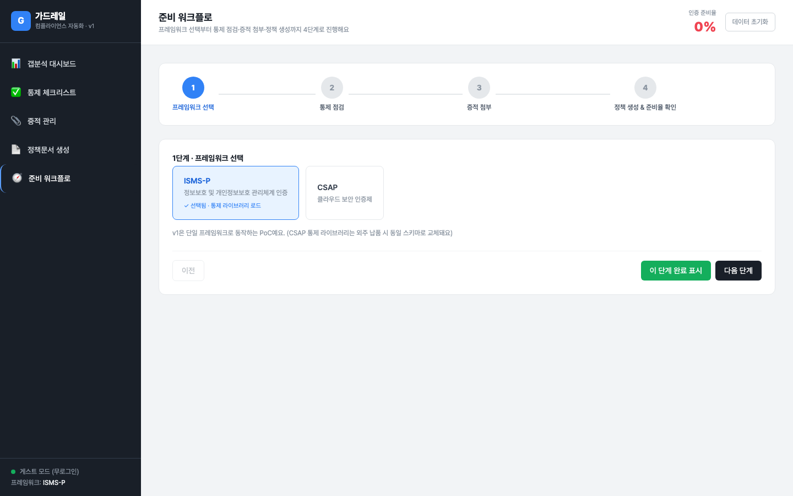
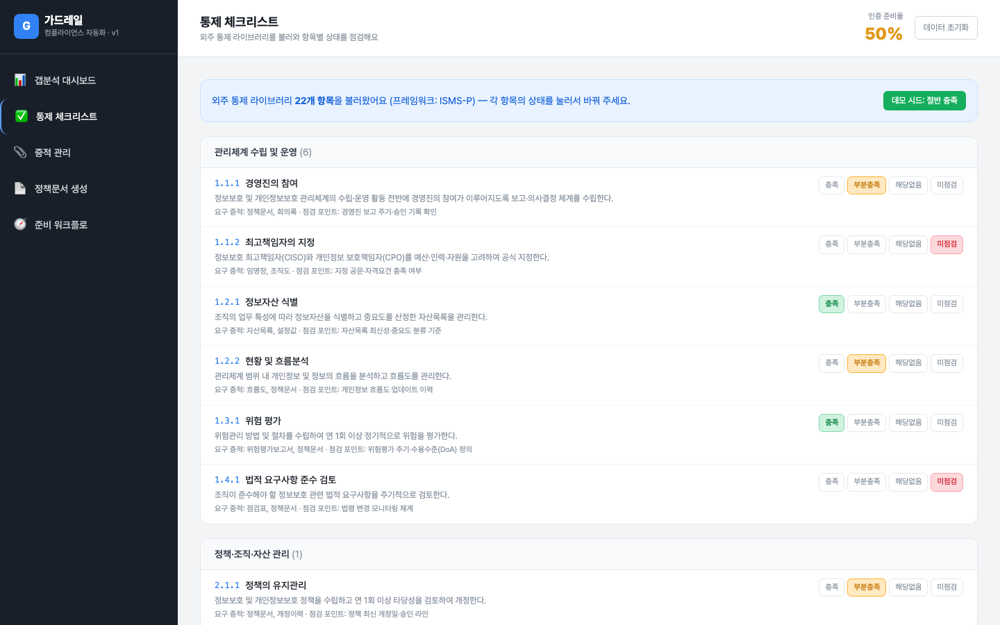
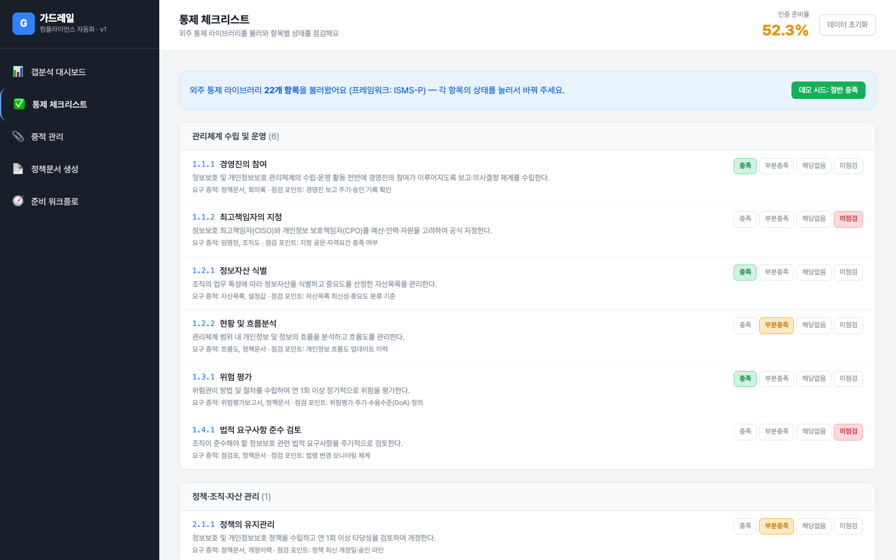
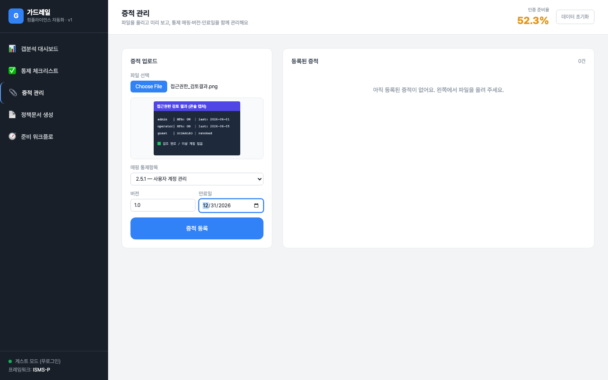
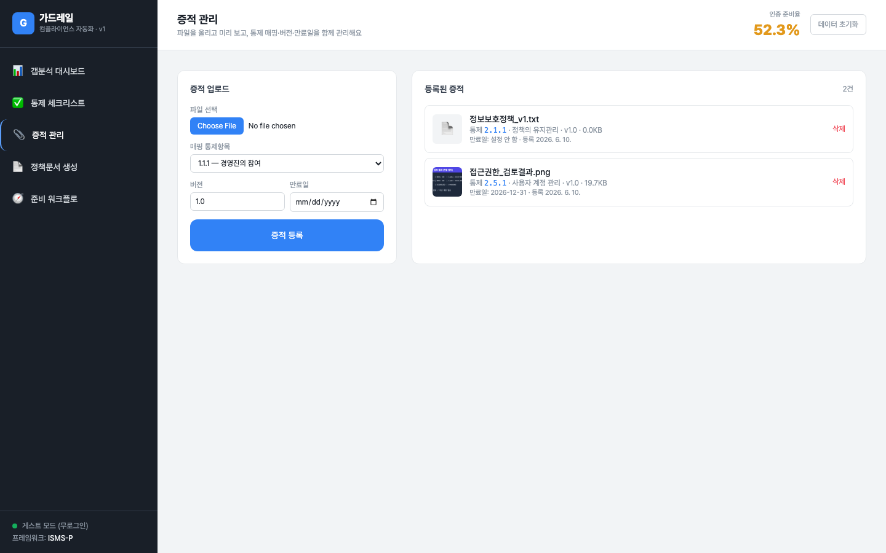
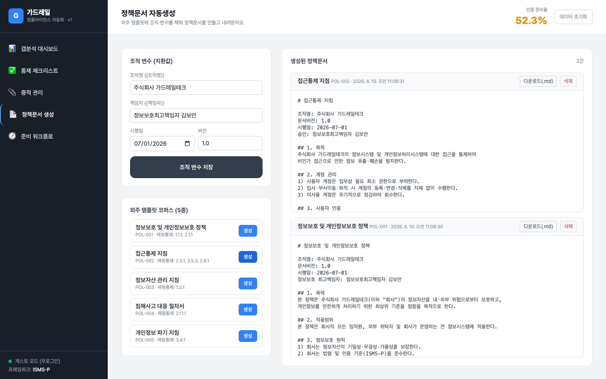
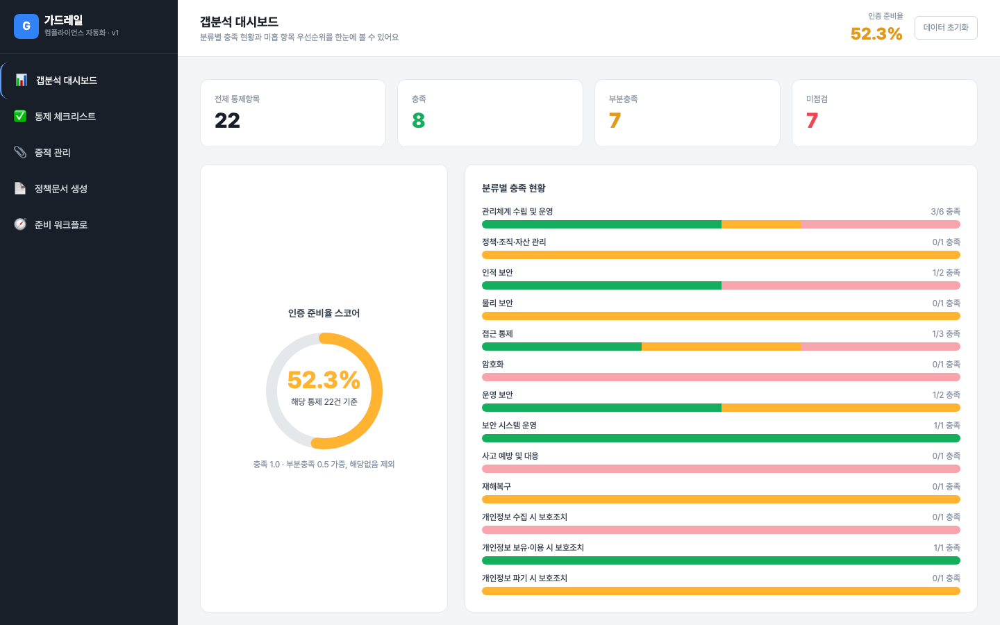
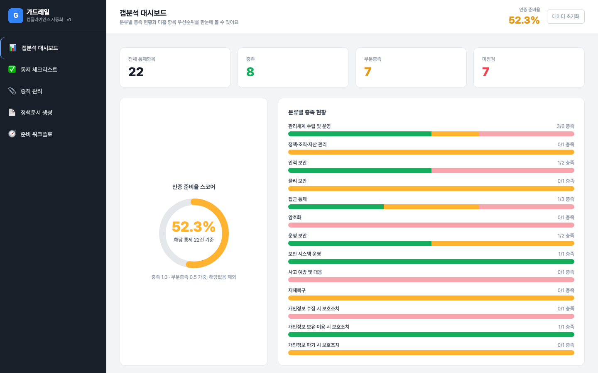

# 개발결과보고서 v1 — 「가드레일」 컴플라이언스 자동화 SaaS 시제품(MVP)

> 본 문서는 [`3_과업지시서_v1.md`](./3_과업지시서_v1.md)의 **검수 증거** 문서다. 외주 납품 데이터셋(통제 라이브러리·정책 템플릿 코퍼스)을 탑재한 자체 v1 앱이 정상 동작함을 실 구동 캡처와 함께 검증한다. 검수는 과업지시서 §5의 "통제 체크리스트 로드 → 증적 매핑 → 정책 자동생성 → 준비율 산출" 정상 동작 확인으로 갈음한다.

---

## 1. 성과품 매핑 (과업지시서 §5 ↔ 납품 산출물)

| # | 과업지시서 §5 성과품 | 본 v1 납품/구현 산출물 | 위치 | 상태 |
|:---:|:---|:---|:---|:---:|
| 1 | 통제항목 데이터셋(JSON 1식, 지정 프레임워크) | ISMS-P 대표 통제 라이브러리 22개 항목(`CONTROL_LIBRARY`) — `control_id·category·title·requirement·evidence_types·review_note·framework` 7필드 구조화 | `projects/guardrail/index.html` | ✅ |
| 2 | 통제-증적유형 매핑표(CSV 1식) | 전 22개 통제항목에 `evidence_types` ≥ 1개 매핑(앱 내 정규화 데이터로 탑재, 체크리스트·증적 화면에서 노출) | 동 파일 `CONTROL_LIBRARY[].evidence_types` | ✅ |
| 3 | 정책문서 템플릿 코퍼스(N종, 치환변수 포함) | 정책 템플릿 5종(`POLICY_TEMPLATES`) — `{{조직명}}·{{시행일}}·{{책임자}}·{{버전}}` 치환변수 + `mapped_controls` 매핑 | 동 파일 `POLICY_TEMPLATES` | ✅ |
| 4 | 납품 명세서(성과품 목록·버전·매핑 현황) | 본 보고서 §1 본 표 + §6 검수표가 명세서 역할 수행 | 본 문서 | ✅ |

> 본 v1은 외주 데이터의 최종 인증 적합성 보증 범위 밖이다(과업지시서 §1.2 Out of Scope — 인증 합격은 심사기관 판단). 본 보고서는 "준비 보조용 데이터"가 자체 앱에서 정상 동작함까지를 입증한다. 통제 원문 표현·매핑은 외주/인증 컨설턴트 검수 단계에서 확정된다.

---

## 2. 구현/제작 범위

자체 개발 v1 앱(과업지시서 §1.3, 개발계획서 작업 #1·2·4·5·6·8·9 자체 분)에서 실제 구현된 스코프:

| 기능 | 구현 내용 | 실 동작 여부 |
|:---|:---|:---:|
| 통제 체크리스트 | 외주 22개 통제 로드, 분류별 그룹핑, 항목별 4상태(충족/부분충족/해당없음/미점검) 토글, 데모 시드 일괄 적용 | 실 동작 |
| 갭분석 대시보드 | KPI 4종, 인증 준비율 SVG 게이지, 분류별 충족 스택바, 미흡 항목 우선순위 테이블, 활동 로그 | 실 동작 |
| 증적 관리 | `FileReader` 실 파일 업로드(이미지 미리보기/문서 아이콘), 통제 매핑, 버전·만료일, 만료 경고, 삭제 | 실 동작 |
| 정책문서 자동생성 | 조직 변수 입력 → 템플릿 치환 엔진(`replaceAll`) → 생성 문서 렌더 → `.md` Blob 다운로드 | 실 동작 |
| 인증 준비율 스코어 | 충족 1.0 + 부분충족 0.5 가중, 해당없음 제외 분모 산식, 상단·게이지·워크플로 동기화 | 실 동작 |
| 다단계 준비 워크플로 | 4단계 스테퍼(프레임워크 선택→통제 점검→증적 첨부→정책 생성/준비율), 단계 이동·완료 표시, 각 단계에서 해당 뷰로 딥링크 | 실 동작 |
| 상태 지속성 | `localStorage`(`guardrail.state.v1`) 전 상태 영속, 새로고침 후 복원, 안전 병합 로더 | 실 동작 |
| 인증 우회 | 게스트 모드 무로그인 자동 통과(CLAUDE.md §3.4) | 실 동작 |

- 뷰 5종(대시보드·체크리스트·증적·정책·워크플로) 각각 인터랙션 가능.
- 다단계 워크플로 1개(4단계) + 보조 다단계(증적 업로드: 파일 선택→미리보기→매핑→등록).
- 토스트 mock 없음 — 모든 핵심 액션이 상태 변경·영속·재렌더로 실 반영.

---

## 3. 환경

| 항목 | 값 |
|:---|:---|
| OS | macOS (Darwin 24.6.0) |
| 형태 | 단일 HTML 자체완결(빌드 불필요), `file://` 직접 로드 |
| 프런트 | Vanilla JS(DOM 조립) + Tailwind CSS(CDN) |
| 데이터 | 인메모리 시드(외주 납품 통제·템플릿) + `localStorage` 영속 |
| 키/네트워크 | 외부 API 키 불필요 — 오프라인 완전 동작(CDN 미가용 시에도 로직·상태 동작) |
| 캡처 도구 | Playwright 1.60.0(설치 후 §7 규약대로 `node_modules`·`package*.json` 삭제, `capture.mjs` 유지) |
| 캡처 환경 | Chromium headless, 뷰포트 1440×900(데스크톱) |

---

## 4. 실행/구동 방법

```bash
# 별도 빌드·서버 불필요. 브라우저로 직접 열기:
open /Users/ywlee/k_startup_spare/2026-saas-compliance-automation/projects/guardrail/index.html
```

- 최초 로드 시 게스트 모드로 자동 진입(로그인 불필요).
- 캡처 재현: 앱 디렉터리에서 `npm i playwright@^1.59.1` 후 `node capture.mjs` → `biz/captures/`에 PNG 8장 생성.

---

## 5. 화면·실물 캡처

### 5.1 준비 워크플로 — 1단계 프레임워크 선택



무엇을 보여주는가: 4단계 스테퍼(프레임워크 선택→통제 점검→증적 첨부→정책 생성/준비율 확인)와 1단계에서 ISMS-P를 선택해 통제 라이브러리가 로드된 상태.
의도: 다단계 준비 워크플로(과업지시서 §1.3 기능 6)의 시작점과 단계 네비게이션을 입증.
검토 결과: 스테퍼·선택 상태·이전/다음/완료 버튼 정상 표시, 한글 정상, 좌하단 게스트 모드 표기 확인.

### 5.2 통제 체크리스트 — 외주 22개 통제 로드 + 데모 시드



무엇을 보여주는가: 외주 납품 통제 라이브러리 22개가 "관리체계 수립 및 운영" 등 분류별로 로드되고, 각 항목에 요구사항·요구 증적유형·점검 포인트가 표시. 데모 시드 적용으로 상단 준비율 50%.
의도: 통제항목 체크리스트(기능 1) + 외주 데이터셋 import·정상 노출(성과품 §5 #1·#2) 입증.
검토 결과: 22개 항목 전수 로드, 각 항목 4상태 버튼·증적유형 텍스트 정상, 한글 깨짐 없음.

### 5.3 통제 체크리스트 — 개별 상태 토글(준비율 실시간 반영)



무엇을 보여주는가: 1.1.1·1.2.1 항목을 "충족"으로 개별 토글하자 상단 준비율이 50% → 52.3%로 즉시 갱신.
의도: 상태 토글이 mock이 아닌 실 상태 변경이며 준비율 산식과 연동됨을 입증.
검토 결과: 토글 즉시 점수 재계산·재렌더 확인, 충족 배지 색상 정상.

### 5.4 증적 관리 — 실 파일 업로드 + 이미지 미리보기



무엇을 보여주는가: 실 PNG 파일을 업로드하자 `FileReader`로 읽은 이미지가 미리보기에 렌더되고, 매핑 통제(2.5.1 사용자 계정 관리)·버전·만료일(2026-12-31)을 지정한 상태.
의도: 증적 업로드/관리(기능 3)의 실 업로드·미리보기·매핑이 동작함을 입증(토스트 mock 아님).
검토 결과: 업로드 파일명·이미지 미리보기·통제 셀렉트·만료일 정상, 한글 정상.

### 5.5 증적 관리 — 등록 목록(썸네일·매핑·버전·만료)



무엇을 보여주는가: 이미지 증적(접근권한_검토결과.png, 19.7KB, 통제 2.5.1)과 문서 증적(정보보호정책_v1.txt, 통제 2.1.1) 2건이 등록되어 썸네일/아이콘·통제 매핑·버전·만료일·등록일과 함께 목록화.
의도: 증적이 영속 저장되고 통제별 매핑·메타데이터가 관리됨을 입증.
검토 결과: 2건 모두 정확한 통제명·크기·만료 정보 표시, 이미지 썸네일 렌더 확인.

### 5.6 정책문서 자동생성 — 조직 변수 치환 + 생성 결과



무엇을 보여주는가: 조직 변수(주식회사 가드레일테크 / 정보보호최고책임자 김보안 / 2026-07-01 / v1.0)를 저장하고, 외주 템플릿 5종 중 접근통제 지침·정보보호 및 개인정보보호 정책 2종을 생성. 본문에 `{{조직명}}`·`{{책임자}}`·`{{시행일}}`가 실제 값으로 치환된 결과 렌더.
의도: 정책문서 자동생성(기능 4) + 외주 템플릿 치환변수 100% 정상 치환(성과품 §5 #3) 입증.
검토 결과: 치환변수 잔존 0건(모두 값으로 치환), 다운로드(.md) 버튼 정상, 한글 정상.

### 5.7 갭분석 대시보드 — 게이지·분류바·KPI



무엇을 보여주는가: KPI(전체 22·충족 8·부분충족 7·미점검 7), 인증 준비율 SVG 게이지 52.3%, 13개 분류별 충족 스택바(충족/부분충족/미점검/해당없음 색상 구분).
의도: 갭분석 대시보드(기능 2) + 인증 준비율 스코어(기능 5)가 통제 상태로부터 실시간 산출됨을 입증.
검토 결과: 게이지 각도·분류별 비율·KPI 수치가 체크리스트 상태와 일치, 한글 정상.

### 5.8 상태 지속성 — 새로고침 후 복원



무엇을 보여주는가: 브라우저 `reload()` 후에도 준비율 52.3%·충족 8·부분충족 7 등 전 상태가 동일하게 복원.
의도: `localStorage` 기반 상태 지속성(기능/요건 — 새로고침 유지)을 입증.
검토 결과: 새로고침 전(5.7)과 동일한 수치·분류바 복원 확인, 데이터 유실 없음.

---

## 6. 검수 기준 충족 여부 (과업지시서 §5 항목별)

| 성과품 | 검수 합격 조건 | 측정값 | 충족 |
|:---|:---|:---|:---:|
| #1 통제항목 데이터셋 | 파싱 오류 0건 / 필수 5필드(control_id·category·title·requirement·evidence_types) 누락 0건 / 통제 ≥ 합의 수량 | JS 객체 파싱 오류 0건, 22개 항목 전수 필수필드 보유, 13개 분류 커버 | ✅ |
| #2 통제-증적유형 매핑표 | 전 통제에 evidence_types ≥ 1개 | 22/22 항목 evidence_types ≥ 1개(체크리스트·증적 화면 노출) | ✅ |
| #3 정책 템플릿 코퍼스 | 각 템플릿 control_id ≥ 1개 매핑 / 치환변수 100% 정상 치환 / 한글 깨짐 0 | 5종 전부 mapped_controls ≥ 1개, 생성 결과 치환변수 잔존 0건(5.6), 한글 정상 | ✅ |
| #4 납품 명세서 | 성과품 목록·버전·매핑 현황 기재 | 본 보고서 §1·§6에 목록·버전(v1.0)·매핑 기재 | ✅ |

### v1 "1천만원" 가치 기준(CLAUDE.md §2.4) 충족 점검

| 기준 | 충족 내용 | 충족 |
|:---|:---|:---:|
| 모든 핵심 액션 실 동작(토스트 mock 금지) | 파일 실 업로드·미리보기, 치환 엔진 실 생성, .md Blob 실 다운로드, 준비율 실 산출 | ✅ |
| 다단계 워크플로 1개+ | 4단계 준비 워크플로 + 증적 업로드 다단계 | ✅ |
| 상태 지속성(새로고침 유지) | localStorage 전 상태 영속, 5.8 새로고침 복원 입증 | ✅ |
| 뷰 4종+ 인터랙션 | 5종(대시보드·체크리스트·증적·정책·워크플로) 모두 인터랙션 | ✅ |
| 게스트 로그인 불요(§3.4) | 무로그인 자동 진입 | ✅ |
| 신규 캡처 6장+ | 8장(액션 결과 포함) | ✅ |

---

## 7. 추가 확장 가능 영역

- 다중 프레임워크(CSAP·ISO27001) 매핑·공통통제 재사용, 멀티테넌트 전환, 증적 자동수집 커넥터, 심사 대응 패키지 PDF는 [`4_과업지시서_v2.md`](./4_과업지시서_v2.md) 범위로 정의되어 있다.

---

## 8. 검토 체크리스트

- [x] 모든 핵심 기능이 캡처되었는가 (체크리스트·대시보드·증적·정책·워크플로·지속성 8장)
- [x] 캡처가 의도한 기능을 정확히 보여주는가 (각 캡처 Read 검증 완료)
- [x] 한글이 깨지지 않는가 (전 캡처 한글 정상 확인)
- [x] 에러 화면이 의도치 않게 캡처되지 않았는가 (콘솔/UI 에러 없음)
- [x] 결과물(정책문서·준비율·매핑)의 정확도가 충분한가 (치환 잔존 0, 준비율 산식 검증)
- [x] 과업지시서 검수 기준 항목 100% 매핑되었는가 (§6 성과품 #1~#4 전부 ✅)
