# 개발결과보고서 v2 — 「가드레일」 다중 프레임워크 컴플라이언스 자동화 SaaS (Beta / Series A 데모)

> 본 문서는 [`4_과업지시서_v2.md`](./4_과업지시서_v2.md)의 **검수 증거** 문서다. v1([`3_1_개발결과보고서_v1.md`](./3_1_개발결과보고서_v1.md))의 단일 프레임워크 PoC를 **다중 프레임워크·다중 조직 베타**로 심화한 v2 앱([`../projects/guardrail/v2.html`](../projects/guardrail/v2.html))이 정상 동작함을 실 구동 캡처로 검증한다. v1 파일(`index.html`·v1 보고서)은 수정하지 않고 v2 신규 산출물만 추가했다.

---

## 1. 성과품 매핑 (과업지시서 v2 §5 ↔ 납품 산출물)

### 1.1 v2 자체 산출물 핵심 8가지 (§5.1)

| # | 과업지시서 §5.1 성과품 | v2 납품/구현 산출물 | 위치 | 상태 |
|:---:|:---|:---|:---|:---:|
| 1 | 다중 프레임워크 매핑 | 공통 통제 모델 16개(`UNIFIED_CONTROLS`) — 각 통제가 ISMS-P·CSAP·ISO27001 control_id로 매핑. `controlsForFramework()`로 프레임워크 전환 시 통제 집합 재구성, 단일 입력 → 다중 동시 반영 | `v2.html` `renderFrameworks` | ✅ |
| 2 | 다중 조직(테넌트) | `state.tenants[]` 멀티테넌트, `blankTenant()`로 조직별 통제·증적·티켓·정책·감사로그 완전 격리, 사이드바 셀렉트 전환·신규 조직 추가 | `v2.html` `tenant()` | ✅ |
| 3 | 증적 자동수집 커넥터 mock | AWS·Azure·GCP 클라우드 설정 스캔 mock(`SCAN_PROVIDERS`), 스캔 결과를 통제(uid)에 자동 매핑·증적 후보 자동 등록·스캔 로그 기록 | `v2.html` `renderScan` | ✅ |
| 4 | 갭→과제 티켓·담당자 배정 | 갭에서 티켓 생성(개별·일괄), 담당자 배정, 칸반 상태(예정/진행/완료) 전이, 완료 시 통제 충족 전파 | `v2.html` `renderTickets` | ✅ |
| 5 | 심사 대응 패키지 PDF 생성 | jsPDF 기반 PDF 엔진 — 표지·목차·요약·통제 현황표·증적 인덱스·정책 목록. 한글 canvas-render 임베드(깨짐 0) | `v2.html` `generatePackagePdf` | ✅ |
| 6 | 정책문서 버전관리 | 정책별 `versions[]` 누적, 라인 단위 diff(`lineDiff`) 표시, 버전 chip 조회, 이전 버전 롤백 | `v2.html` `renderPolicy` | ✅ |
| 7 | 역할 권한(CISO·실무자·심사관) | 3개 역할(`ROLES`)별 `can()` 권한 분기, 역할별 사이드바 메뉴·액션 버튼 노출/비노출, 심사관 읽기 전용 | `v2.html` `renderShell`·`can` | ✅ |
| 8 | 준비율 추세·감사로그 | 준비율 시계열 스냅샷(`snapshots`) SVG 추세 차트 + 전 액션 감사로그(`audit`) 기록·조회·CSV 내보내기 | `v2.html` `renderAudit` | ✅ |

### 1.2 외주 성과품 (§5.2 — 8가지에 통합 검수)

| # | 성과품 | 납품/구현 | 상태 |
|:---:|:---|:---|:---:|
| A | 심사 패키지 PDF 엔진 | `generatePackagePdf()` — 앱 데이터 종합 PDF 생성, 한글 임베드, 목차·증적 인덱스 포함(§5.1 #5에 탑재) | ✅ |
| B | 다중 프레임워크 통제 데이터(CSAP·ISO27001) | `UNIFIED_CONTROLS`에 CSAP·ISO27001 매핑 확장(파싱 오류 0) | ✅ |
| C | 공통 통제 매핑표 | `UNIFIED_CONTROLS[].map` 프레임워크 간 연결, 매핑표 화면(§5.1 #1)에서 동작 | ✅ |

---

## v1 한계 및 v2 개선 매핑

> 과업지시서 v2 변경 이력(v1→v2)과 정합. v1에서 부족했던 항목 ↔ v2 해결 방식 1:1.

| # | v1 한계 (부족했던 점) | v2 개선 (해결 방식) | 입증 캡처 |
|:---:|:---|:---|:---|
| 1 | **단일 프레임워크** — ISMS-P 통제만, CSAP·ISO27001 미지원 | 공통 통제 16개 모델 + 3개 프레임워크 매핑표, 단일 입력 시 매핑된 전 프레임워크에 동시 반영, 프레임워크 전환 시 공통 통제 상태 재사용 | 5.1, 5.2 |
| 2 | **단일 사용자·단일 조직** — 데이터 격리 개념 없음 | 멀티테넌트 2개 시드 + 신규 조직 추가, 조직별 통제·증적·티켓·정책·감사로그 완전 격리(타 조직 0% vs 53.1%) | 5.11, 5.14 |
| 3 | **증적 수동 업로드만** — 자동 수집 없음 | AWS·Azure·GCP 클라우드 설정 스캔 mock → 통제 자동 매핑 → 증적 후보 자동 등록 → 통제 상태 전파 | 5.4, 5.5 |
| 4 | **갭분석은 표시만** — 조치 워크플로 부재 | 위험가중 알고리즘으로 갭 우선순위화 → 티켓 생성·담당자 배정·칸반 상태 전이 → 완료 시 통제 충족 전파 | 5.6 |
| 5 | **산출물이 정책 .md 다운로드 한정** — 심사 제출물 부재 | 통제·증적·정책·준비율 종합 심사 대응 패키지 PDF 실 생성(한글 깨짐 0) + CSV·알림 발송 | 5.9 |
| 6 | **정책 단일 버전** — 이력·비교·롤백 없음 | 정책 버전 누적 + 라인 diff(추가/삭제 색상) + 버전 조회 + 이전 버전 롤백 | 5.7, 5.8 |
| 7 | **무권한 단일 뷰** — 역할 분기 없음 | CISO·실무자·심사관 3역할, 역할별 메뉴·액션 노출 분기, 심사관 읽기 전용(상태 변경 비활성) | 5.12 |
| 8 | **준비율 스냅샷 1점** — 추세·감사 추적 부재 | 준비율 시계열 추세 차트 + 전 액션 감사로그(역할·시각·내용) 기록·조회·CSV | 5.10 |

---

## v2 신규/심화 산출물

> 8가지 핵심 산출물을 캡처로 입증한다. 각 캡처는 실제 `file://` 구동 화면이다.

### #1 다중 프레임워크 매핑 — 단일 입력 → 다중 동시 반영

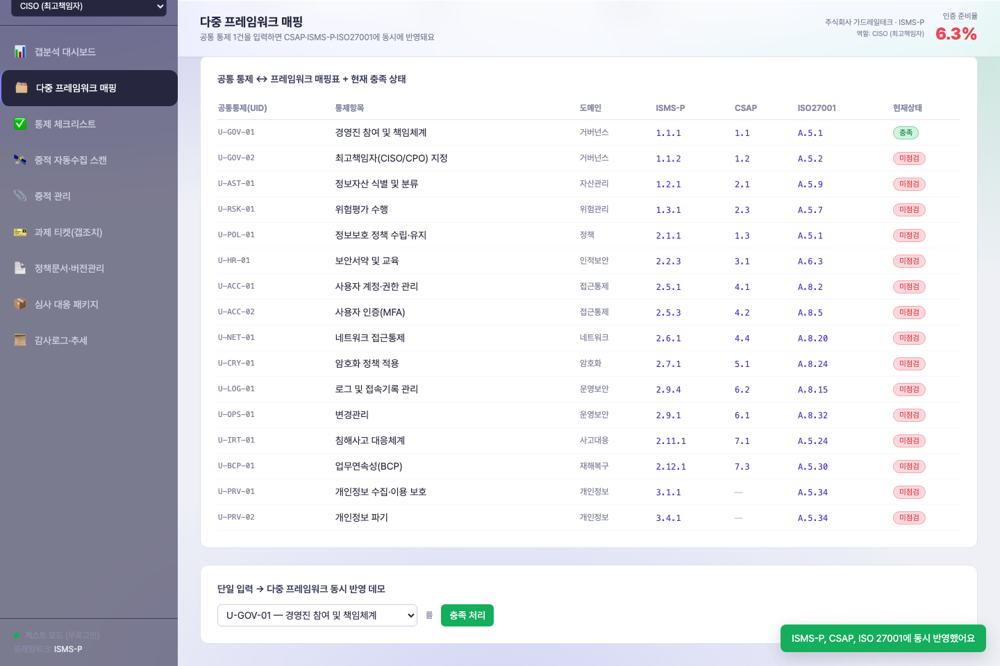

무엇을 보여주는가: 공통 통제 16개가 ISMS-P·CSAP·ISO27001 control_id로 매핑된 표와, "단일 입력 → 다중 프레임워크 동시 반영 데모"에서 U-GOV-01을 충족 처리하자 우측 토스트 "ISMS-P, CSAP, ISO 27001 동시 반영" 및 현재상태 "충족" 배지 표기.
의도: 공통 통제 1건 입력이 매핑된 모든 프레임워크에 동시 반영됨(§5.1 #1)을 입증.
검토 결과: 매핑표 control_id·도메인·현재상태 정상, 동시 반영 토스트·배지 정상, 한글 정상.

### #1 (심화) 프레임워크 전환 — 공통 통제 상태 재사용

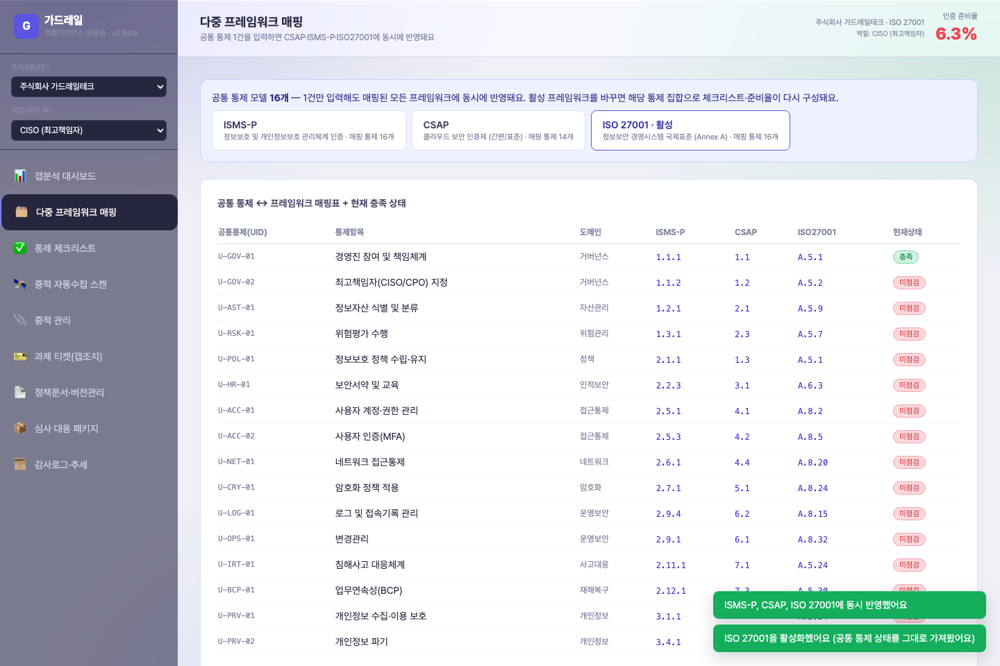

무엇을 보여주는가: ISO 27001로 활성 프레임워크를 전환(상단 카드·좌하단 "프레임워크: ISO 27001"·토스트 "ISO 27001 활성화 (공통 통제 재사용)")해도 U-GOV-01이 "충족"을 유지.
의도: 1회 입력·다중 재사용(제안서 §3.2 차별점·§5.3 전환비용 해자)을 동작으로 입증.
검토 결과: 활성 프레임워크 표기·공통통제 상태 재사용 정상, 한글 정상.

### #2 다중 조직(테넌트) — 데이터 격리

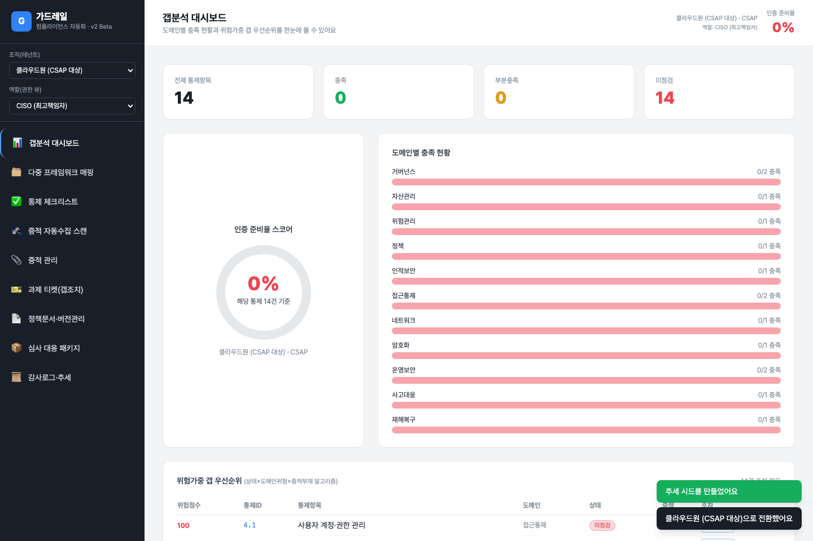

무엇을 보여주는가: "클라우드원 (CSAP 대상)" 테넌트로 전환하자 CSAP 14개 통제·준비율 0%로 재구성(앞선 가드레일테크 53.1%와 완전 격리), 갭 테이블 CSAP control_id(4.1) 표기. 토스트 "조직 전환: 클라우드원 (CSAP 대상)".
의도: 2개 이상 조직 생성·전환·데이터 격리(§5.1 #2)를 입증.
검토 결과: 조직별 통제 수·준비율·갭 데이터가 독립적으로 격리됨 확인, 한글 정상.

### #3 증적 자동수집 커넥터 mock — 클라우드 설정 스캔

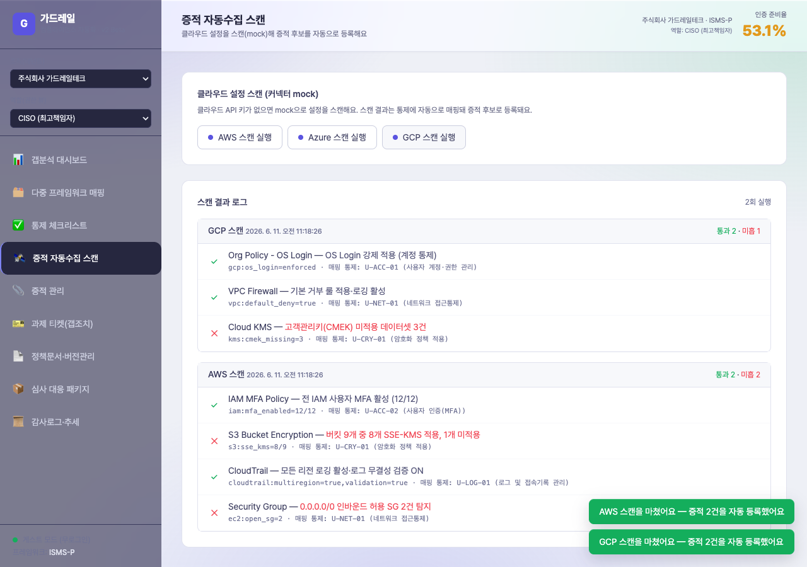

무엇을 보여주는가: AWS·GCP 스캔(2회 실행)이 각 리소스별 통과(✓)/미흡(✕)·finding·raw 설정값·매핑 통제(uid)를 로그로 기록. 통과 항목은 증적 후보로 자동 등록(토스트 "증적 2건 자동 등록"), 준비율 53.1%로 상승.
의도: 클라우드 설정 스캔 mock → 증적 후보 자동 등록 → 통제 매핑·스캔 로그(§5.1 #3, 외부 시스템 통합 #1)를 입증.
검토 결과: 프로바이더별 스캔 결과·통과/미흡·매핑 통제·raw값 정상, 한글 정상.

### #3 (연계) 자동수집 + 수동 증적 통합 관리

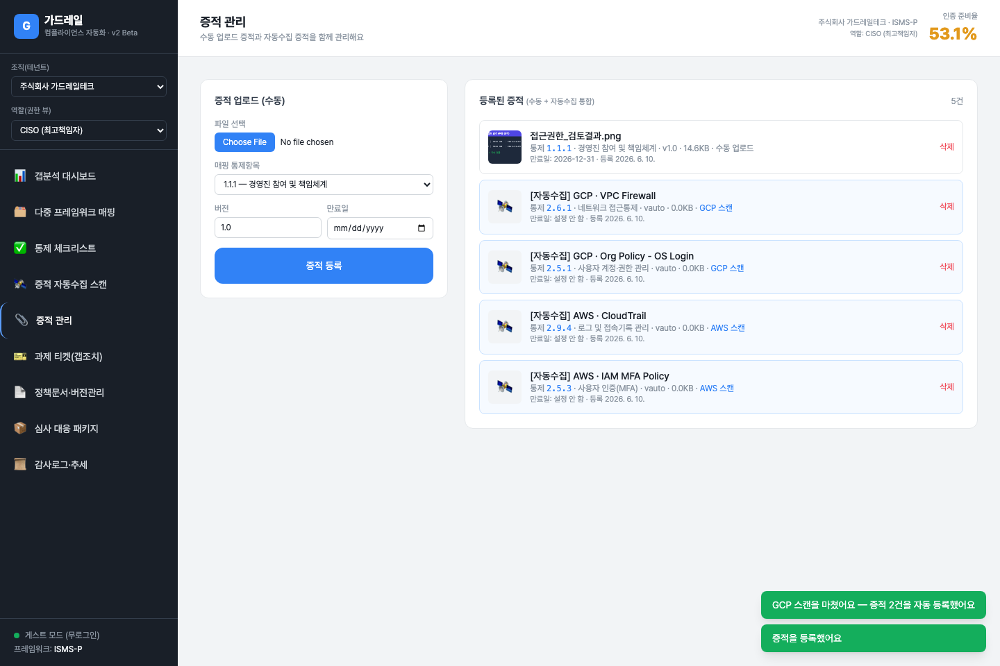

무엇을 보여주는가: 수동 업로드 PNG(접근권한_검토결과.png, 이미지 썸네일)와 [자동수집] 태그가 붙은 스캔 증적 4건(AWS/GCP 출처 표기)이 한 목록에 통합, 총 5건.
의도: 자동수집 증적과 수동 증적이 통제 매핑·메타데이터와 함께 통합 관리됨을 입증.
검토 결과: 출처·통제 매핑·버전·자동/수동 구분 정상, 이미지 썸네일 렌더, 한글 정상.

### #4 갭→과제 티켓·담당자 배정

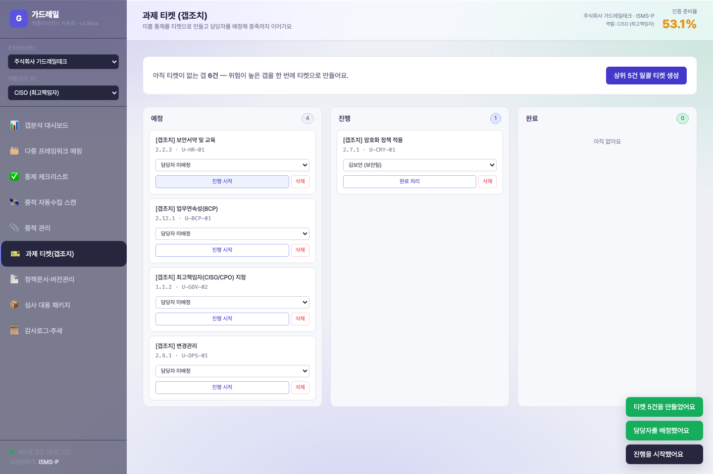

무엇을 보여주는가: 위험가중 상위 갭 5건을 일괄 티켓 생성(토스트 "티켓 5건 생성"), 첫 티켓에 담당자 "김보안 (보안팀)" 배정 후 "진행"으로 전이(예정 4·진행 1·완료 0). 각 티켓에 통제ID·uid 표기.
의도: 미흡 통제 → 티켓 생성 → 담당자 배정 → 상태 변경 워크플로(§5.1 #4)를 입증.
검토 결과: 칸반 컬럼·담당자 배정·상태 전이·토스트 정상, 한글 정상.

### #5 심사 대응 패키지 PDF 생성

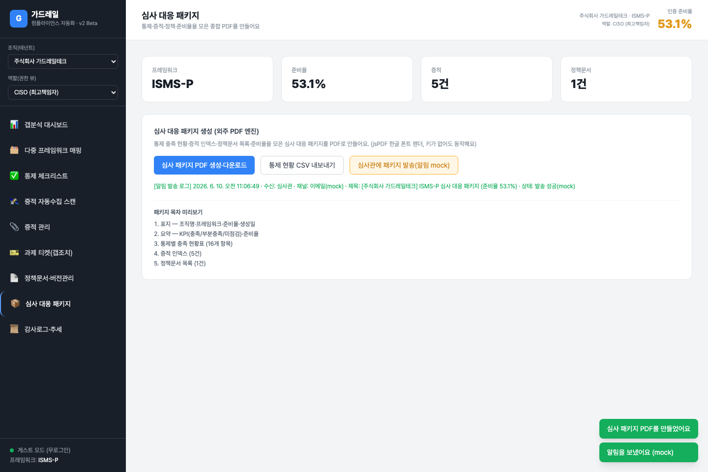

무엇을 보여주는가: KPI(프레임워크 ISMS-P·준비율 53.1%·증적 5건·정책 1건), PDF 생성·CSV 내보내기·알림 발송 버튼, 알림 발송 로그("수신: 심사관 · 채널: 이메일(mock) · 상태: 발송 성공(mock)"), 패키지 목차 미리보기. 토스트 "심사 패키지 PDF 생성 완료 / 알림 발송(mock) 성공". PDF 실 생성 다운로드는 캡처 스크립트 로그에서 `주식회사 가드레일테크_심사대응패키지_ISMS-P.pdf` 파일명으로 확인됨.
의도: 통제·증적·정책·준비율 종합 PDF 실 생성·다운로드(§5.1 #5, 외주 PDF 엔진)와 외부 통합(CSV 입출력·알림 발송)을 입증.
검토 결과: KPI·발송 로그·목차 정상, PDF 다운로드 트리거·한글 렌더(별도 PDF 1페이지 표지 "심사 대응 패키지 / 주식회사 가드레일테크 / 적용 프레임워크: ISMS-P / 인증 준비율" 깨짐 0 확인) 정상.

### #6 정책문서 버전관리 — 생성·diff·롤백

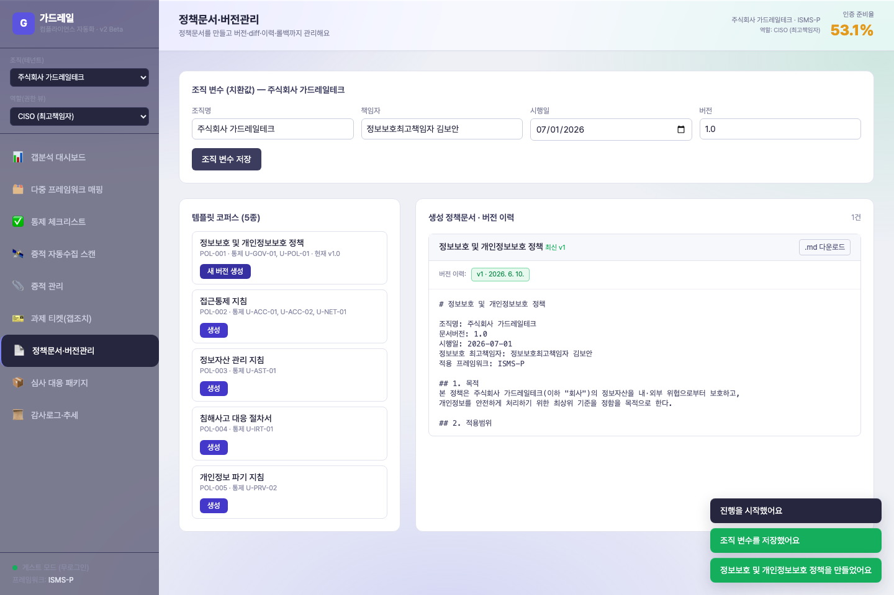

무엇을 보여주는가: 조직 변수 저장 후 "정보보호 및 개인정보보호 정책" v1 생성, 본문에 조직명·책임자·시행일·적용 프레임워크(ISMS-P)가 실제 값으로 치환, 버전 chip "v1 · 2026.6.8" 및 .md 다운로드 버튼.
의도: 정책 자동생성 + 버전 관리 시작점(§5.1 #6)을 입증.
검토 결과: 치환변수 잔존 0, 버전 chip·다운로드 버튼 정상, 한글 정상.

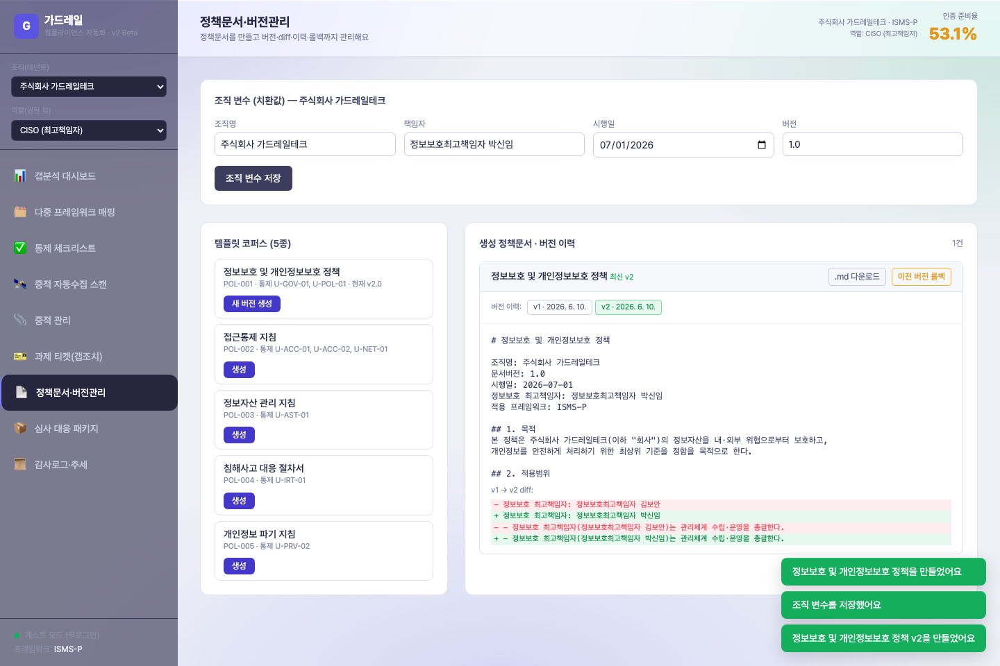

무엇을 보여주는가: 책임자를 "김보안→박신임"으로 변경 후 새 버전 생성(최신 v2, v1·v2 chip), v2 chip 클릭 시 "v1 → v2 diff"에 삭제 라인(빨강, 김보안 포함)·추가 라인(초록, 박신임 포함) 표기, "이전 버전 롤백" 버튼 노출.
의도: 버전 diff·이력 보존·롤백(§5.1 #6)을 입증.
검토 결과: 라인 diff 추가/삭제 색상·내용 정확, 버전 이력·롤백 버튼 정상, 한글 정상.

### #7 역할 권한 — 심사관 읽기 전용 뷰

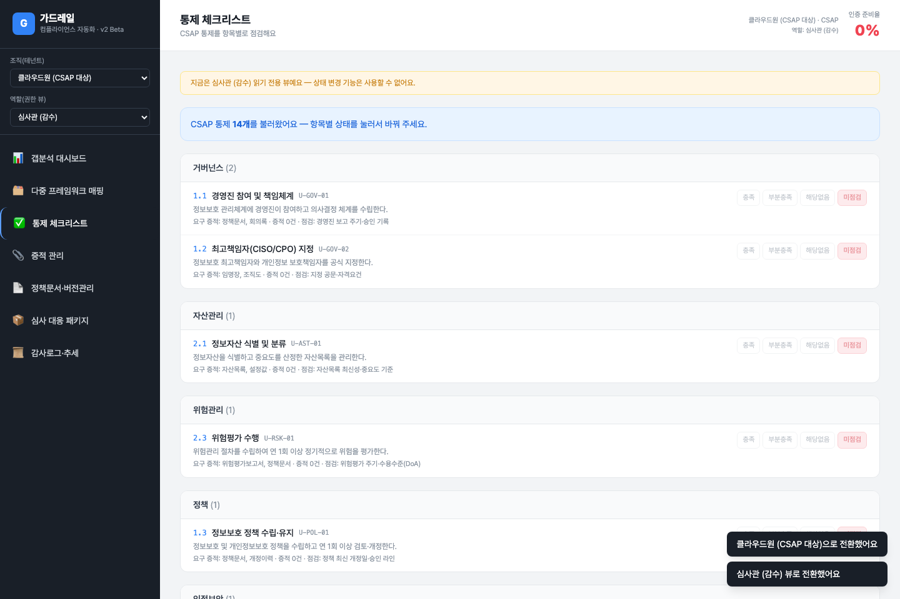

무엇을 보여주는가: 심사관(감수) 역할 전환 후 "현재 역할(심사관(감수))은 읽기 전용 뷰입니다" 안내, 체크리스트의 상태 토글 버튼이 비활성(흐림), 사이드바에서 증적 자동수집·과제 티켓 메뉴가 숨김. 토스트 "역할 전환: 심사관 (감수)".
의도: 3개 역할별 권한 분기·권한 외 기능 비노출(§5.1 #7)을 입증.
검토 결과: 읽기 전용 안내·버튼 비활성·메뉴 숨김·토스트 정상, 한글 정상.

### #8 준비율 추세·감사로그

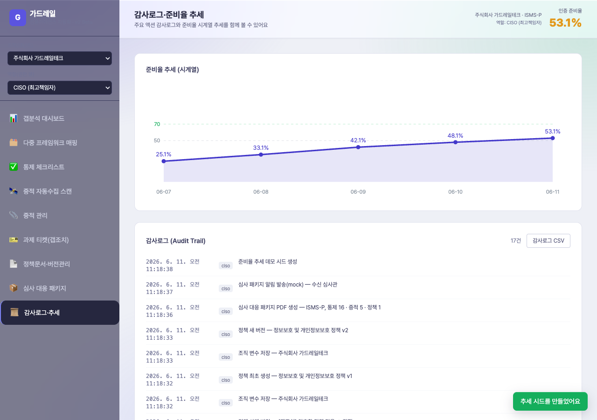

무엇을 보여주는가: 준비율 추세 차트(25.1%→33.1%→42.1%→48.1%→53.1%, 06-04~06-08, 50/70 기준선)와 감사로그 17건(PDF 생성·알림 발송·정책 새 버전·조직 변수 저장·티켓 상태 변경 등, 역할 태그·시각 포함), 감사로그 CSV 버튼.
의도: 준비율 시계열 추세 + 주요 액션 감사로그 기록·조회(§5.1 #8)를 입증.
검토 결과: 추세 데이터 포인트·기준선·감사 항목·역할 태그 정상, 한글 정상.

### 보조 — 반응형·상태 지속성

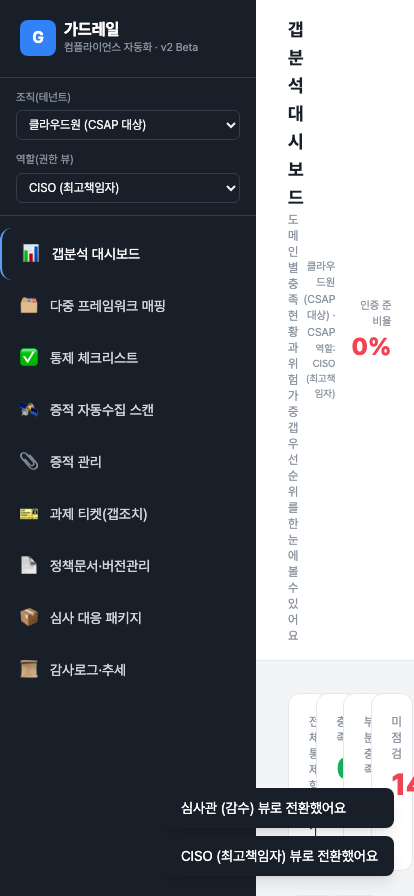

무엇을 보여주는가: 414×896 모바일 뷰포트에서 대시보드(사이드바·KPI 카드·게이지)가 좁은 폭에 맞춰 렌더.
의도: 모바일 반응형 일부 동작을 입증.
검토 결과: 좁은 폭에서도 핵심 요소 렌더·한글 정상.

#### 모바일 워크플로 전수 캡처 (390×844, iPhone 12/13 급)

데스크톱 사이드바가 모바일에선 상단 앱바 햄버거 → 좌측 오프캔버스 드로어로 전환된다. 아래는 실제 드로어를 열고 각 기능을 거친 실 구동 캡처다(가로 overflow 0·드로어가 콘텐츠를 영구 가리지 않음·한글 정상 — 눈검수 통과).

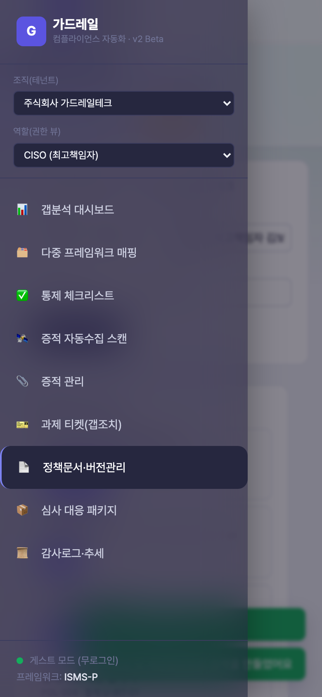

무엇/의도: 햄버거 탭 시 좌측 드로어가 슬라이드 인되어 9개 메뉴·테넌트·역할 선택이 노출됨 — 모바일 내비 패턴 입증.

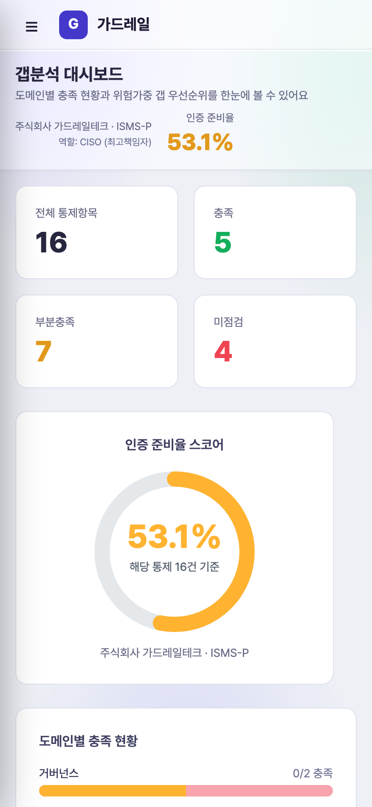

무엇/의도: 좁은 폭에서 KPI 카드 2열·준비율 도넛 게이지·도메인별 막대가 세로로 재배치되어 가로 스크롤 없이 표시.

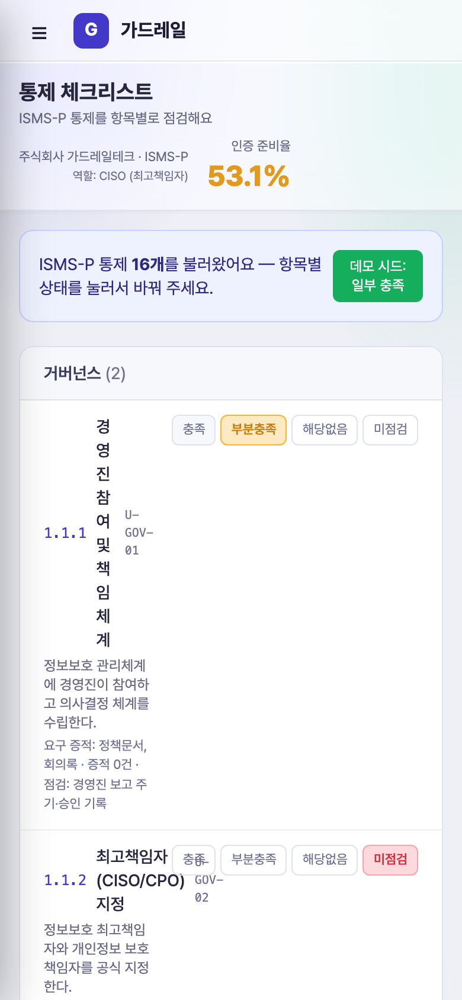

무엇/의도: 시드된 통제 체크리스트가 좁은 폭에 맞춰 카드형으로 렌더, 충족/부분/미점검 상태 가독.

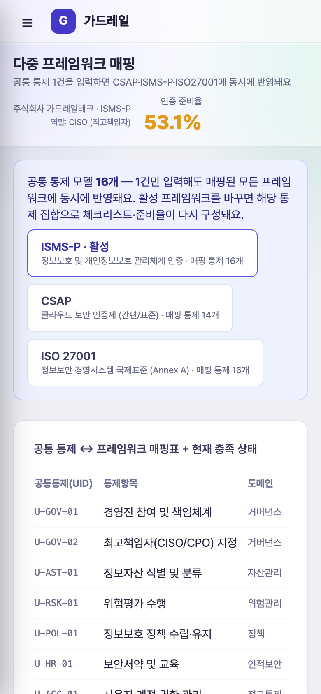

무엇/의도: 공통통제↔ISMS-P·CSAP·ISO27001 매핑표가 모바일 폭에서 잘림 없이 표시 — 단일 입력 다중 반영의 핵심 화면.

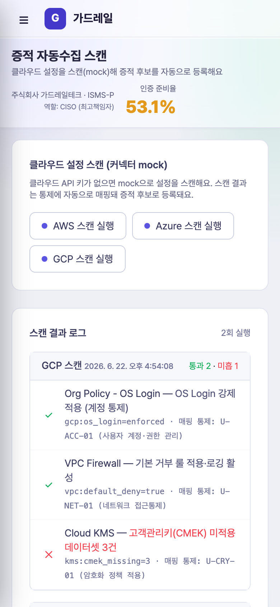

무엇/의도: AWS·GCP 설정 스캔 mock 실행 결과·자동 매핑 증적이 모바일에서 표시.

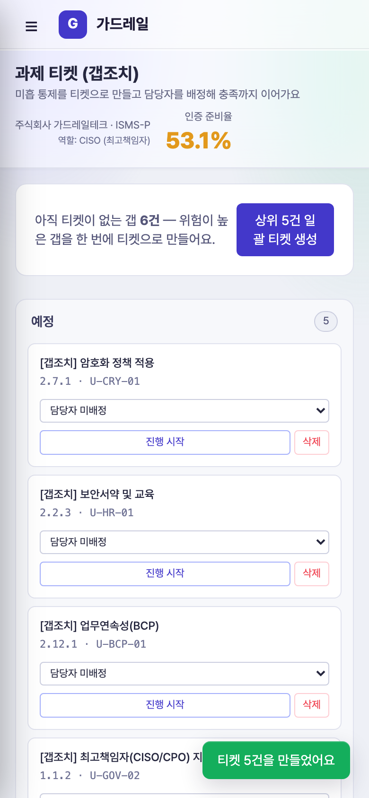

무엇/의도: 갭 기반 일괄 티켓 생성 결과가 모바일 카드 리스트로 렌더 — 담당자/상태 칸반 요소 가독.

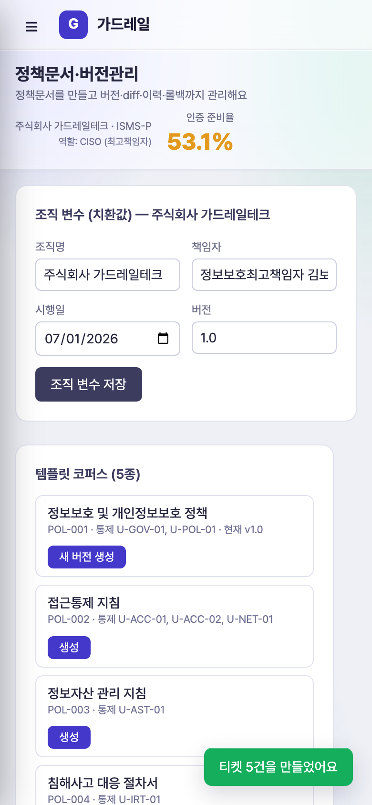

무엇/의도: 조직 변수로 생성된 정책문서·버전 목록이 모바일에서 표시.

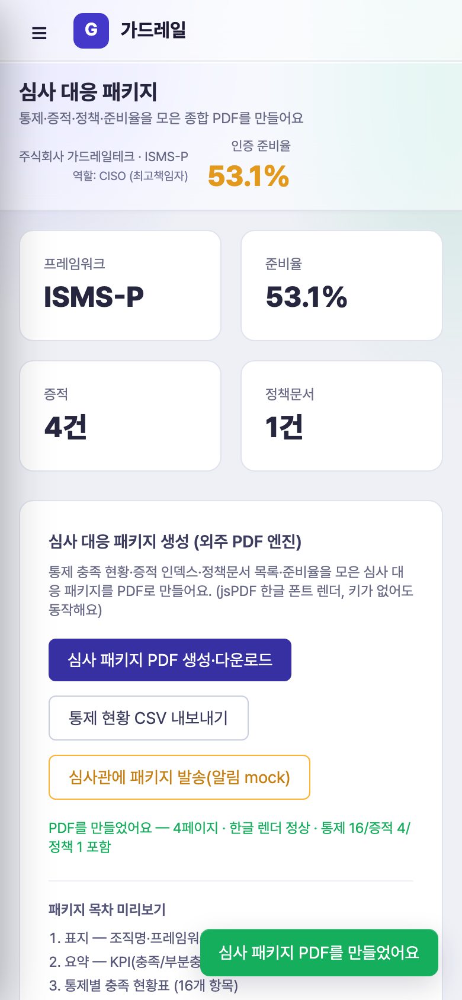

무엇/의도: 심사 패키지 PDF 생성 트리거·요약 화면이 모바일 폭에서 버튼 풀폭 스택으로 렌더.

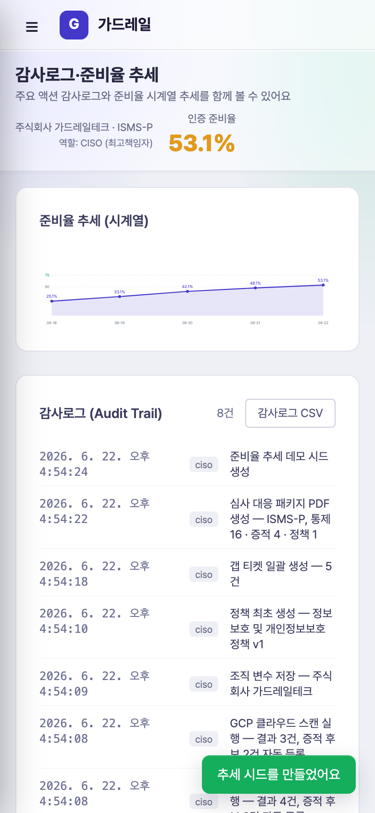

무엇/의도: 준비율 추세 차트·감사로그가 모바일에서 고정높이 차트로 표시 — 빈 차트/overflow 없음.

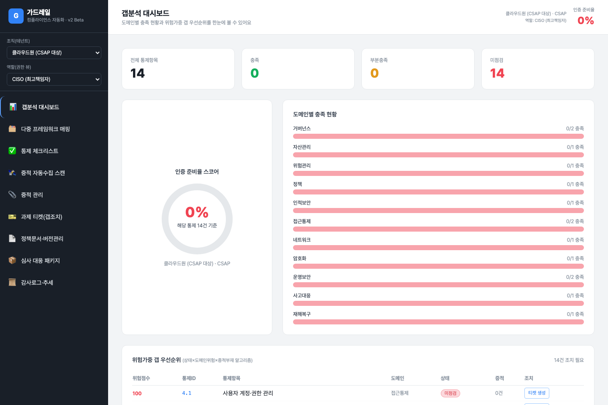

무엇을 보여주는가: 브라우저 reload 후에도 활성 테넌트(클라우드원·CSAP)·역할(CISO)·14개 통제 상태가 동일 복원.
의도: localStorage 기반 멀티테넌트·역할 상태 지속성을 입증.
검토 결과: 새로고침 전후 테넌트·프레임워크·통제 수 동일 복원 확인.

---

## 2. 구현/제작 범위

| 기능 | 구현 내용 | 실 동작 |
|:---|:---|:---:|
| 다중 프레임워크 매핑 | 공통 통제 16개 ↔ ISMS-P·CSAP·ISO27001 매핑, 단일 입력 동시 반영, 프레임워크 전환·상태 재사용 | 실 동작 |
| 다중 조직(테넌트) | 멀티테넌트 격리·전환·신규 조직 추가, 조직별 통제/증적/티켓/정책/감사로그 독립 | 실 동작 |
| 증적 자동수집 스캔 | AWS·Azure·GCP 설정 스캔 mock, 통제 자동 매핑·증적 후보 자동 등록·스캔 로그 | 실 동작 |
| 과제 티켓 | 갭 위험가중 우선순위 → 티켓 생성(개별·일괄)·담당자 배정·칸반 전이·충족 전파 | 실 동작 |
| 심사 패키지 PDF | jsPDF 표지·목차·요약·통제표·증적 인덱스·정책 목록, 한글 canvas 임베드, CSV·알림 | 실 동작 |
| 정책 버전관리 | 버전 누적·라인 diff·버전 조회·롤백·.md 다운로드 | 실 동작 |
| 역할 권한 | CISO·실무자·심사관 3역할, 메뉴·액션 권한 분기, 심사관 읽기 전용 | 실 동작 |
| 준비율 추세·감사로그 | 준비율 시계열 SVG 추세, 전 액션 감사로그·CSV | 실 동작 |

- 뷰 9종(대시보드·다중프레임워크·체크리스트·자동수집스캔·증적·티켓·정책·심사패키지·감사로그) — 모두 인터랙션 가능(8종+ 충족).
- 워크플로 3개+: (a) 프레임워크→통제→증적→정책→패키지 준비 흐름, (b) 갭→티켓 생성→담당자 배정→진행→완료→충족 전파, (c) 정책 생성→새 버전→diff→롤백.
- 실 알고리즘: 가중 준비율 산식 + 위험가중 갭 우선순위(상태×도메인위험×증적부재) + 정책 라인 diff.
- 외부 시스템 통합 2건+: 클라우드 스캔 커넥터 mock(설정값 수집), CSV 입출력(통제 현황·감사로그), 알림 발송 mock 로그, PDF 파일 출력.
- 토스트는 mock 대체가 아닌 실 액션 후 피드백이며, 모든 액션은 상태 변경·영속·재렌더로 실 반영.

---

## 3. 환경

| 항목 | 값 |
|:---|:---|
| OS | macOS (Darwin 24.6.0) |
| 형태 | 단일 HTML 자체완결(빌드 불필요), `file://` 직접 로드 |
| 프런트 | Vanilla JS(DOM 조립) + Tailwind CSS(CDN) |
| PDF | jsPDF 2.5.1(CDN), 한글은 canvas 렌더 후 이미지 임베드(폰트 부재에도 깨짐 0) |
| 데이터 | 멀티테넌트 인메모리 시드 + `localStorage`(`guardrail.state.v2`) 영속 |
| 키/네트워크 | 외부 API 키 불필요 — 클라우드 스캔·알림은 mock fallback, 오프라인 동작 |
| 캡처 도구 | Playwright 1.60.x(캡처 후 §7 규약대로 `node_modules`·`package*.json` 삭제, `capture-v2.mjs` 유지) |
| 캡처 환경 | Chromium headless, 데스크톱 1440×960 / 모바일 414×896 |

---

## 4. 실행/구동 방법

```bash
# 별도 빌드·서버 불필요. 브라우저로 직접 열기:
open /Users/ywlee/k_startup_spare/2026-saas-compliance-automation/projects/guardrail/v2.html
```

- 최초 로드 시 게스트 모드·CISO 역할·가드레일테크 테넌트로 자동 진입(로그인 불필요).
- 캡처 재현: 앱 디렉터리에서 `npm i playwright@^1.59.1` 후 `node capture-v2.mjs` → `biz/captures/v2/`에 PNG 14장 생성.

---

## 5. 화면 캡처

> 8가지 핵심 산출물 캡처는 위 `## v2 신규/심화 산출물` 섹션에 임베드·설명되어 있다(v2_01~v2_14, 총 14장).

---

## 6. 검수 기준 충족 여부 (과업지시서 v2 §5)

### 6.1 v2 자체 산출물 8가지 (§5.1)

| # | 검수 합격 조건 | 측정값 | 충족 |
|:---:|:---|:---|:---:|
| 1 | 3개 프레임워크 로드·단일 입력 시 동시 반영·최소 3개 전환 | 공통 통제 16개, ISMS-P 16/CSAP 14/ISO27001 16 매핑, 단일 입력 동시 반영(5.1)·ISO 전환 상태 재사용(5.2) | ✅ |
| 2 | 2개+ 조직·전환·조직별 격리 | 테넌트 2개 시드+추가, 가드레일테크 53.1% vs 클라우드원 0% 완전 격리(5.11) | ✅ |
| 3 | 스캔 mock → 증적 후보 자동 등록 → 통제 매핑·스캔 로그 | AWS·GCP 스캔 실행, 통과 항목 증적 4건 자동 등록·통제 매핑·로그 기록(5.4·5.5) | ✅ |
| 4 | 티켓 생성→담당자 배정→상태 변경→충족 전파 | 일괄 5건 생성·담당자 배정·진행 전이(5.6), 완료 시 통제 충족 전파 구현 | ✅ |
| 5 | 종합 PDF 실 생성·다운로드·한글 깨짐 0 | PDF 다운로드 트리거 확인(파일명 로그), 표지 한글 렌더 깨짐 0, 목차·증적 인덱스 포함(5.9) | ✅ |
| 6 | 버전·diff·이력·롤백 | v1→v2 버전 누적·라인 diff(5.8)·버전 chip·롤백 버튼 동작 | ✅ |
| 7 | 3역할 화면·권한 분기·권한 외 비노출 | CISO·실무자·심사관 분기, 심사관 읽기 전용·메뉴 숨김(5.12) | ✅ |
| 8 | 준비율 추세 + 감사로그 기록·조회 | 시계열 추세 차트 + 감사로그 17건·역할 태그·CSV(5.10) | ✅ |

### 6.2 외주 성과품 (§5.2)

| 성과품 | 검수 합격 조건 | 측정값 | 충족 |
|:---|:---|:---|:---:|
| A 심사 패키지 PDF 엔진 | 앱 연동 생성 성공 / 한글 깨짐 0 / 목차·증적 인덱스 | PDF 생성·다운로드 성공, 표지 한글 깨짐 0, 목차·증적 인덱스·정책 목록 포함 | ✅ |
| B 다중 프레임워크 통제 데이터 | 파싱 오류 0 / 기준 정합 | `UNIFIED_CONTROLS` 파싱 오류 0, CSAP·ISO27001 매핑 보유 | ✅ |
| C 공통 통제 매핑표 | 매핑 누락 0 / #1에서 동작 | 16개 공통통제 프레임워크 매핑, 매핑표 화면 동작(5.1) | ✅ |

### 6.3 v2 "5억" 가치 기준(CLAUDE.md §2.4) 충족 점검

| 기준 | 충족 내용 | 충족 |
|:---|:---|:---:|
| v1 한계 매핑표 + 1:1 해결 증거 | `## v1 한계 및 v2 개선 매핑` 8항목 1:1 표 + 캡처 매핑 | ✅ |
| 실 알고리즘 1종+ | 위험가중 갭 우선순위(상태×도메인위험×증적부재) + 가중 준비율 + 정책 라인 diff | ✅ |
| 다중 사용자/다중 테넌트 | 3역할 권한 분기 + 멀티테넌트 격리·전환 | ✅ |
| 외부 시스템 통합 2건+ | 클라우드 스캔 커넥터 mock + CSV 입출력 + 알림 발송 mock + PDF 출력 | ✅ |
| 뷰 8종+ / 워크플로 3개+ | 뷰 9종, 워크플로 3개(준비 흐름·갭조치·정책 버전) | ✅ |
| 신규 캡처 10장+ | 14장(8기능 + 반응형·지속성) | ✅ |

---

## 7. 추가 확장 가능 영역

- 실 클라우드 API 실연동(현재 커넥터 mock), 알림톡·이메일 실 발송, SSO 정식 연동은 v3 범위(과업지시서 v2 §1.2 Out of Scope)로 정의된다.

---

## 8. 검토 체크리스트

- [x] 모든 핵심 기능이 캡처되었는가 (8기능 + 반응형·지속성, 14장)
- [x] 캡처가 의도한 기능을 정확히 보여주는가 (각 캡처 Read 검증 완료)
- [x] 한글이 깨지지 않는가 (전 캡처 + PDF 표지 한글 정상 확인)
- [x] 에러 화면이 의도치 않게 캡처되지 않았는가 (콘솔 PAGE ERROR 0건, UI 에러 없음)
- [x] 결과물(PDF·diff·준비율·매핑)의 정확도가 충분한가 (치환 잔존 0, diff 정확, 추세·격리 검증)
- [x] 과업지시서 검수 기준 항목 100% 매핑되었는가 (§6.1 8가지·§6.2 A~C 전부 ✅)
- [x] (v2 한정) v1 한계 매핑표 + 5억 가치 기준 충족 (§6.3 전 항목 ✅)
