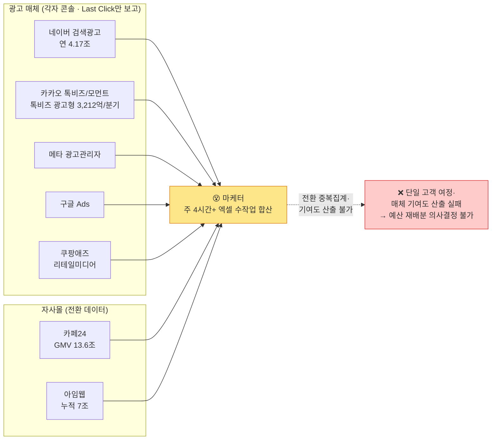
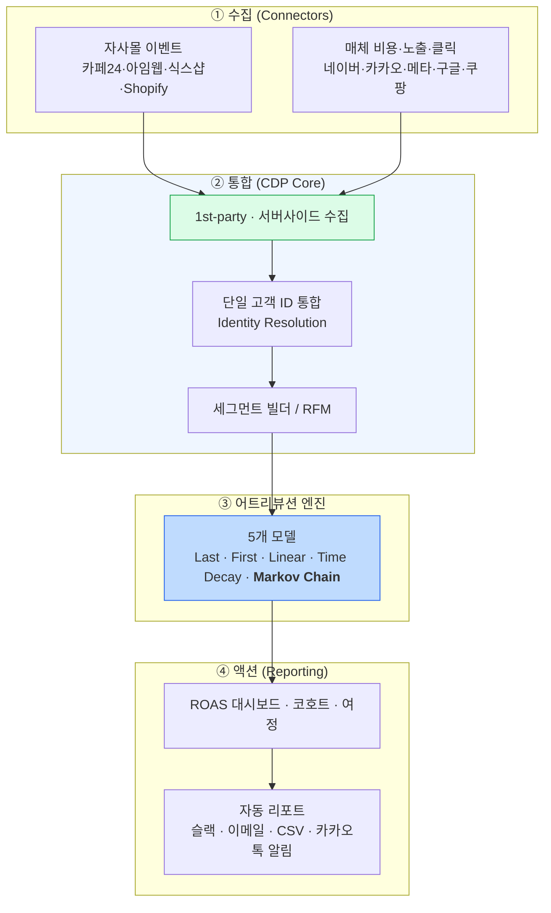
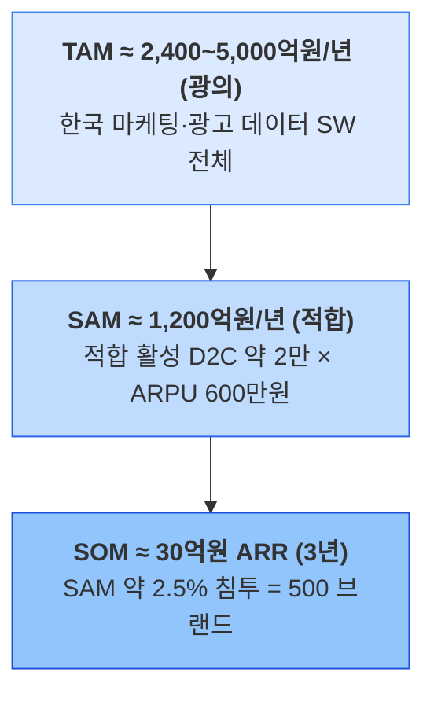
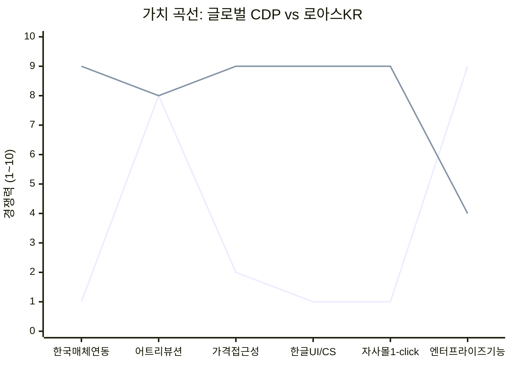
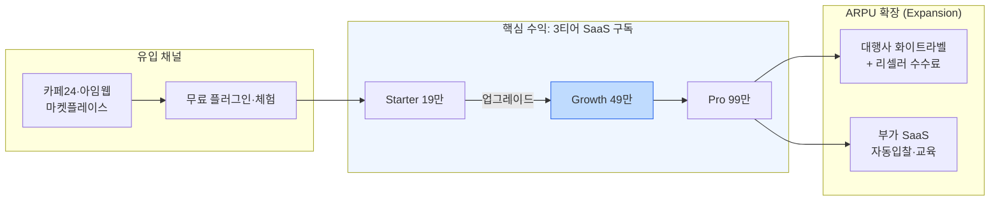
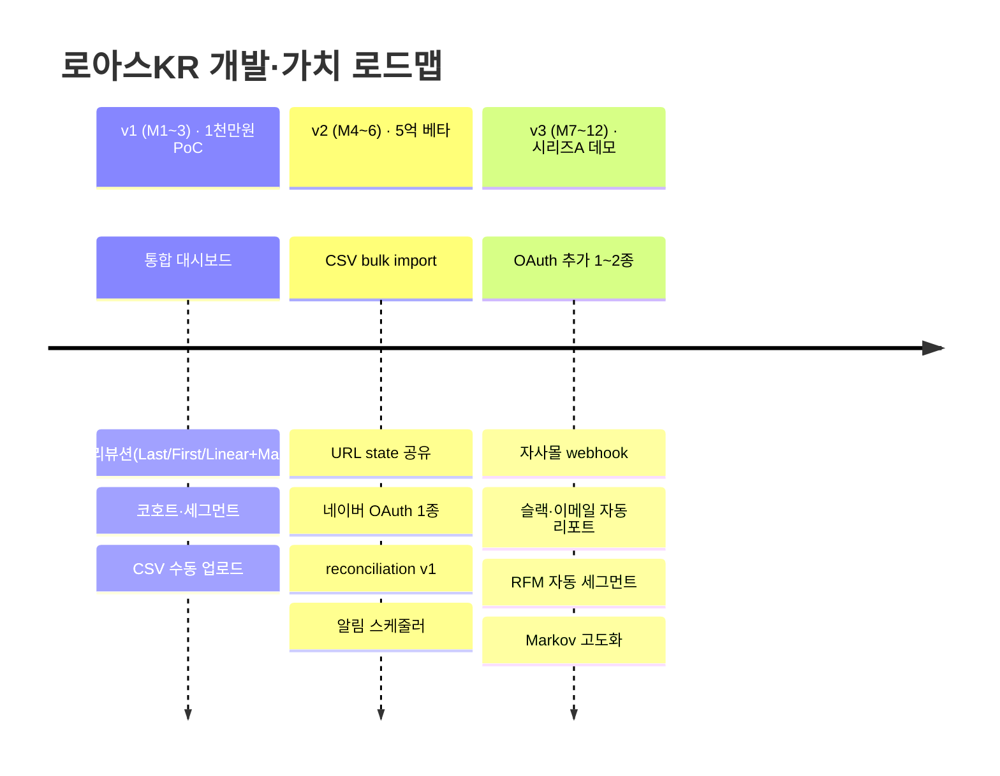
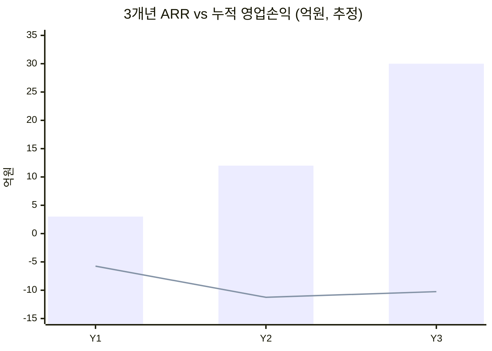
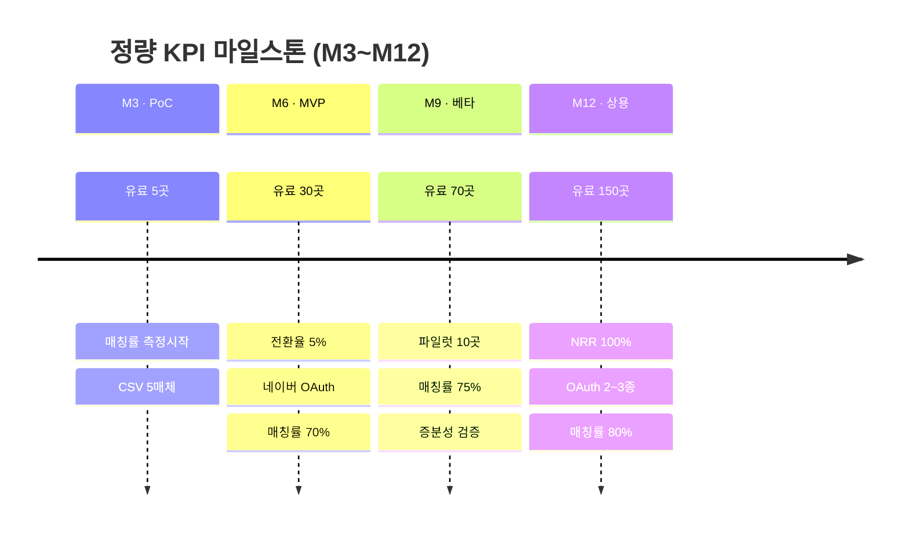
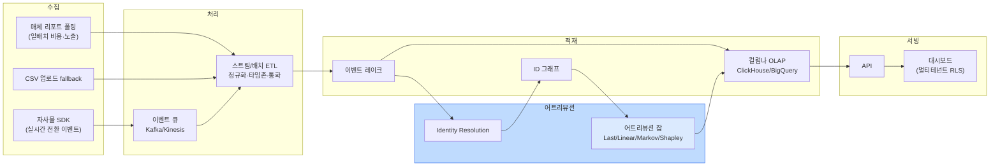
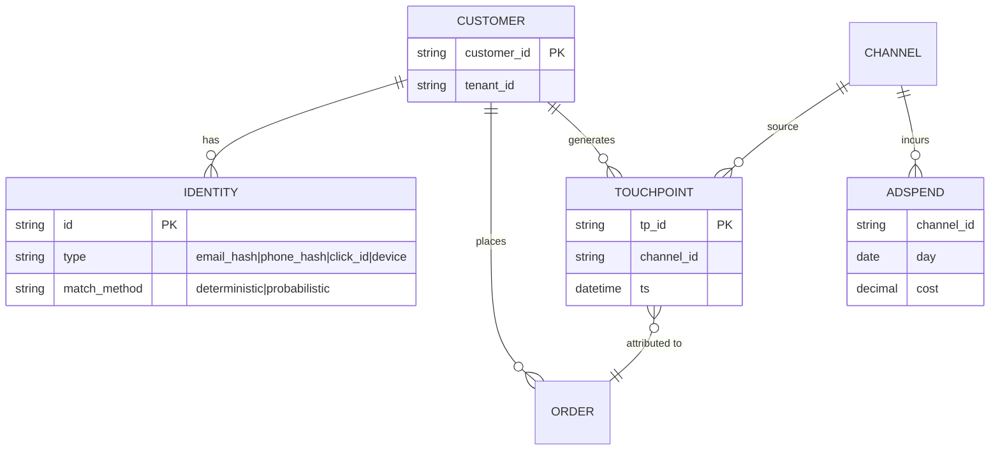

# 제안서 — D2C 통합 CDP / ROAS 어트리뷰션 SaaS (가칭 「로아스KR」)

> 한국 광고 매체(네이버·카카오·쿠팡애즈)와 자사몰(카페24·아임웹)을 1급으로 통합하는 D2C 전용 CDP·멀티터치 어트리뷰션 SaaS. 글로벌 도구가 비켜간 한국 SMB 시장을 1/10 가격으로 점유한다.

> **본 제안서의 정량 엔진(요약)** — 상세는 각 절 참조.
> 단위경제: LTV ≈ 938만원 / 블렌디드 CAC ≈ 55만원 / **LTV:CAC ≈ 17배(보수 시나리오 3~6배)** / CAC payback ≈ 5개월(§6.3). 재무: 3개년 누적 유료 50→200→500 브랜드, **ARR 3억→12억→30억[추정]**, BEP ≈ Y2 말~Y3 초(§13). 고객 ROI: 월 광고비 3천만 브랜드 기준 절감액 ≈ 210만/월 vs 구독 49만 → **약 4.3배[추정]**(§17). 자금소요·고용·KPI·아키텍처·컴플라이언스·IP·Exit는 §13~§22 신설 절에 정량화.
>
> [추정] 표기는 가설값, [재확인 필요]는 미검증 항목. 재무·단위경제 입력 가정은 모두 표로 명시(§6·§13).

## 0. 프로젝트 메타

| 항목 | 값 |
|:---|:---|
| 사업명 | 2026년 창업동아리 지원사업 (창업중심대학 X RISE 사업단) |
| 주관기관 | 대구대학교 창업지원단 |
| 트랙 | 실전창업 (창업동아리 / 기본 300만원·최대 1,000만원) |
| 일정 | 모집공고 '26.3.19~4.2 · 선발평가 4.6~4.8 · 선발안내 4.9 · 협약·설명회 4.10 · 지원·관리 '26.4.13~'27.1.31 |
| 아이템 | D2C 브랜드 전용 통합 고객데이터플랫폼(CDP) + ROAS 멀티터치 어트리뷰션 SaaS |
| 타깃 사용자 | 자사몰 운영 D2C 브랜드 (월 매출 5천만~10억 SMB), 1인~소규모 마케팅팀 |
| 팀 | <TODO: 사용자 입력> |

### 0.1 정책 부합성 (공고 중점분야 매핑)

> 평가표 첫 항목 '사업 목적 부합성'을 직접 겨냥한다. 트랙·중점분야 키워드는 공고 확정 후 사용자가 채우되(아래 `<TODO>`), 부합 논거는 본 제안 내용으로 작성한다.

| 정부 정책기조 / 공고 중점분야 (예시) | 본 사업의 부합 지점 | 정합 근거 |
|:---|:---|:---|
| 데이터 경제·데이터 주권 | 1st-party 행태·구매 데이터를 브랜드가 직접 보유·통제하는 국내 리전 CDP (해외 도구 의존 탈피) | §1.3·§12·§20 |
| SaaS·디지털 전환(DX) | 5개 콘솔 수작업을 자동 파이프라인으로 대체하는 클라우드 SaaS | §2·§18 |
| 소상공인·SMB 디지털 격차 해소 | 글로벌 1/10 가격으로 SMB가 처음으로 멀티터치 어트리뷰션 보유 | §6·§17 |
| AI·데이터 분석 고도화 | Markov/Shapley 기반 기여도 알고리즘·예산 추천 | §2.2·§19 |
| 일자리 창출 | 3년간 신규 채용 누적 OO명(데이터·개발·CS) | §16 |
| 정보보호·개인정보 안전 | ISMS-P 로드맵·가명처리·동의관리 내재화 | §20 |

| 공고 매핑 칸 (사용자 입력) | 값 |
|:---|:---|
| 공고 중점분야 키워드 | <TODO: 사용자 입력> |
| 해당 평가지표명 | <TODO: 사용자 입력> |

---

## 1. 문제 인식 (Problem)

### 1.1 시장 배경 — 자사몰 D2C는 구조적 성장 국면이다

한국 온라인쇼핑 거래액은 2024년 **242조 897억원(+5.8%)으로 역대 최대**를 경신했고, 2025년에도 12월 월간 24조 2,904억원(+6.2%)으로 성장세가 꺾이지 않았다[^3][^3a]. 이 성장의 한 축이 **자사몰(D2C, Direct-to-Consumer)** 이다. 플랫폼(오픈마켓) 수수료·노출 경쟁이 심화되면서 브랜드들은 고객 데이터와 마진을 직접 쥐기 위해 자사몰로 이동하고 있다.

- **카페24**: 판매자 쇼핑몰 거래액(GMV)이 2023년 11.3조 → 2024년 12.5조 → **2025년 13.6조(+8.8%)** 로 연속 성장[^2].
- **아임웹**: 고객사 누적 거래액이 2025년 6월 **6조 돌파**, 2026년 1월 **7조 돌파**, 누적 사이트 100만 개[^1].

자사몰 인프라가 커질수록 그 위에서 광고비를 집행하는 활성 D2C 브랜드 수와 그들의 마케팅 데이터 문제도 함께 커진다.

### 1.2 핵심 문제 — 광고 데이터는 5개 콘솔에 흩어져 있고, 통합·기여 분석이 구조적으로 불가능하다

D2C 브랜드가 광고비를 집행하는 매체는 한국에서 사실상 정해져 있다. 그러나 각 매체의 비용·노출·클릭 데이터와 자사몰의 전환 데이터는 **서로 다른 콘솔에 격리**되어 있고, 이를 잇는 통합 계층이 시장에 없다.

- 네이버 서치플랫폼(검색+DA) 광고 매출 연 **4조 1,689억(+5.6%, 2024)**[^9]
- 카카오 톡비즈 4분기 5,627억 중 광고형(비즈보드·메시지) **3,212억(+5%)**[^10] (연환산 1.2조원대)
- 쿠팡 리테일미디어(쿠팡애즈) 광고 매출은 미공시이나 총매출 40조+의 약 1% 수준으로 수천억원대 추정[^11]
- 메타·구글: 한국 광고 매출 별도 공시 없음 [재확인 필요]

즉 D2C 마케터는 매주 네이버·카카오·메타·구글·쿠팡 5개 콘솔에 접속해 숫자를 받아 엑셀에 손으로 합산한 뒤, 그 합산값을 자사몰 전환 데이터와 또 한 번 수기로 대조한다. 이 과정에는 평균 **주 4시간 이상이 소요**된다 [내부 인터뷰 기반 추정 — 공식 2차 출처 부재]. 더 본질적인 문제는, 사람이 매체 콘솔의 숫자를 단순 합산하는 방식으로는 **하나의 고객이 여러 매체를 거쳐 전환한 경로(고객 여정)와 각 매체의 기여도(어트리뷰션)를 산출하는 것이 원리적으로 불가능**하다는 점이다. 매체 콘솔은 각자 "마지막 클릭(Last Click)" 기준 자기 공로만 보고하므로, 합산하면 전환이 중복 집계되어 어느 매체에 예산을 더/덜 넣을지 데이터로 결정할 수 없다.

### 1.3 규제·기술 환경 변화가 문제를 가속한다

- **개인정보보호위원회(PIPC)** 가 2024년 맞춤형 광고용 행태정보(방문·구매·검색 이력) 수집 시 처리방침 공개·동의·제3자 수집도구 투명 공개를 강화했다[^17]. 매체 콘솔에 데이터를 의존하던 방식의 컴플라이언스 부담이 커졌다.
- **구글이 2025년 4월 Chrome의 3rd-party 쿠키 폐기를 철회**했으나, Safari·Firefox는 기본 차단을 유지한다[^18]. 매체 콘솔 기반 크로스도메인 어트리뷰션의 신뢰도는 구조적으로 하락하고 있고, 브랜드가 자기 서버에서 1st-party 데이터로 직접 어트리뷰션해야 할 필요가 커졌다.

### 1.4 글로벌 도구는 이 문제를 풀지 못한다

Segment(Twilio)·mParticle·Northbeam·Triple Whale·Rockerbox 등 글로벌 CDP·어트리뷰션 도구는 미주 매체 중심으로 설계돼 **네이버·카카오·쿠팡애즈 1급 연동이 구조적으로 부재**하고, 가격대(시트/계약 기준 월 100만~300만원 이상)가 한국 SMB의 지불 의사를 크게 상회한다[^12][^13][^14]. 국내 데이터라이즈는 CRM·메시지 자동화가 핵심이라 멀티터치 ROAS 어트리뷰션·매체 비용 통합은 비핵심이다[^16].

**[그림 1] 현 D2C 마케팅 데이터 파편화 구조** — 5개 매체 콘솔과 자사몰 데이터가 통합 계층 없이 각각 사람의 수작업(엑셀 합산)으로만 연결된다. 단일 고객·단일 전환의 매체 간 기여(어트리뷰션)는 구조적으로 계산 불가능하다.

### 1.5 고객 검증 계획 (Customer Discovery · 트랙션) — 현재 0건, 골격 정의

> 솔직성 원칙: 현재 본 페인의 정량 근거는 '내부 인터뷰 기반 주 4시간[추정·공식 2차 출처 부재]' 한 줄뿐이며, **지불 의사를 입증하는 1차 트랙션(LOI·베타 계약·유료 파일럿)은 0건**이다. 본 절은 사업 기간 내 수행할 **검증 설계와 정량 목표 골격**이며, 실제 응답 수치·실명은 사용자/실측이 채운다(`<TODO>`).

**A. 고객 발견 인터뷰 설계**

| 항목 | 설계 (방법론) | 목표 표본 | 실측 결과 |
|:---|:---|:---:|:---|
| 대상 세그먼트 | 자사몰 D2C, 월 광고비 임계 ≥1천만, 매체 ≥3개 동시 집행 | N ≥ 20 | <TODO: 사용자 입력> |
| 페인 강도 측정 | 주당 데이터 취합 시간·현 대안(엑셀/GA4/대행사) 비용 정량 응답 | 5점 척도 | <TODO: 사용자 입력> |
| 지불의사(WTP) | van Westendorp 가격민감도(PSM) 4문항으로 19/49/99만원 수용 구간 도출 | N ≥ 20 | <TODO: 사용자 입력> |

**B. 트랙션 게이트 (협약 KPI 후보)**

| 트랙션 지표 | 정의 | M3 목표 | M6 목표 | M12 목표 | 실측 |
|:---|:---|:---:|:---:|:---:|:---|
| 사전 신청/웨이팅리스트 | 랜딩·마켓플레이스 사전등록 | 100 | 300 | 800 | <TODO> |
| LOI/베타 합의 | 무료 파일럿 참여 의향서 | 5 | 15 | 30 | <TODO> |
| 유료 파일럿 | 실데이터로 절감 ROAS·작업시간 단축 실측 | 1 | 5 | 30+ | <TODO> |

> 유료 파일럿 1~2곳의 실데이터(예: 예산 재배분 후 동일 매출 대비 광고비 절감률, 주간 작업시간 단축)는 §17 고객 ROI·§12 사회적 가치의 **검증 근거**로 직접 연결된다(현재는 [추정·미검증]).

---

## 2. 솔루션 (Solution)

### 2.1 한 줄 정의

「로아스KR」는 **한국 광고 매체에 특화된 D2C 전용 CDP + 멀티터치 ROAS 어트리뷰션 SaaS** 다. 파편화된 5개 매체와 자사몰을 자동으로 통합해, 마케터가 "이번 주 어느 매체에 예산을 더 넣을지"를 5분 안에 데이터로 결정하게 한다.

### 2.2 4계층 파이프라인

| 계층 | 기능 | 글로벌 도구 대비 차별점 |
|:---|:---|:---|
| ① 수집 (Connectors) | 자사몰(카페24·아임웹·식스샵·Shopify) 이벤트 자동 수집 + 매체(네이버·카카오·메타·구글·쿠팡애즈) 비용·노출·클릭 통합 | **한국 매체 3강(네이버·카카오·쿠팡) 1급 연동** + 자사몰 SaaS 1-click |
| ② 통합 (CDP Core) | 단일 고객 ID 통합(Identity Resolution), 세그먼트 빌더, RFM | 1st-party·서버사이드 수집으로 쿠키리스 환경 대응[^18] |
| ③ 어트리뷰션 엔진 | 5개 모델(Last/First/Linear/Time Decay/**Markov Chain**) | SMB가 처음으로 멀티터치 기여도를 갖게 됨 |
| ④ 액션 (Reporting) | ROAS 대시보드·코호트·여정 탐색 + 자동 리포트(슬랙·이메일·CSV) | 한글 리포트·카카오톡 ROAS 알림 |

### 2.3 차별점 3가지

1. **한국 매체 1급 연동** — 글로벌 도구의 구조적 공백을 정확히 메운다.
2. **자사몰 SaaS 1-click 연동** — 카페24·아임웹은 마켓플레이스(앱스토어)를 제공하므로 설치 마찰이 거의 없다.
3. **SMB 가격대** — 월 19~99만원, Segment Team($120/월=약 16만원이지만 1만 MTU 제한·한국 매체 미연동)과 Northbeam($1,500/월~) 사이의 빈 공간을 채운다[^12][^13].

**[그림 2] 로아스KR 솔루션 아키텍처** — 파편화된 소스를 ① 자동 수집 → ② 단일 고객 ID 통합(CDP) → ③ 어트리뷰션 엔진 → ④ 자동 리포트의 4계층 파이프라인으로 연결한다. [그림 1]의 사람 수작업 노드(😵)를 시스템이 대체한다.

### 2.4 온보딩 여정 · Time-to-Value (TTV)

> '1-click'은 *설치* 마찰만 줄인다. 고객이 가치를 체감(첫 ROAS 인사이트)하기까지의 전 과정과, 그 과정에서 숫자가 GA4·매체 콘솔과 어긋나면 즉시 이탈하는 리스크를 정직하게 설계한다.

| 단계 | 사용자 행위 | 시스템 처리 | 정합성 리스크 | 완화 / 정량 목표 |
|:---|:---|:---|:---|:---|
| 1. 연결 | 자사몰 1-click + 매체 OAuth/CSV | 토큰 발급·권한 위임 | OAuth 승인 지연 | 즉시 CSV fallback 제공 |
| 2. 백필 | 대기 | 과거 90일 비용·전환 데이터 적재 | 매체 사후 보정 누락 | reconciliation 잡(§18) |
| 3. ID 통합 | 대기 | 주문 이메일/전화 해시 ↔ 클릭 ID 매칭 | 매칭률 저하 | **전환 매칭률 목표 ≥80%**(§19) |
| 4. 검증 | 숫자 확인 | GA4/매체 콘솔 대비 오차 리포트 | "숫자 안 맞음" → 이탈 | **허용 오차 ±5% 이내, 초과 시 사용자 고지 UX**(§18) |
| 5. 가치 체감 | 첫 ROAS·기여도 확인 | 멀티터치 대시보드 렌더 | — | **TTV 목표 ≤ 설치 후 1영업일** |

### 2.5 어트리뷰션이 '무엇을 다르게 결정하게 하는가' (Last-Click vs Markov)

> Markov를 핵심 가치로 내세우지만 사장이 *무엇을 다르게 행동하는지*가 추상적이라는 지적에 답한다.

| 시나리오 | Last-Click 보고 | 멀티터치(Markov) 보고 | 사장의 액션 변화 |
|:---|:---|:---|:---|
| 인지→탐색→전환 여정 | 마지막 클릭(브랜드 검색)에 100% 공로 → 검색광고만 효율 높아 보임 | 디스플레이·SNS의 *유입 기여*를 removal effect로 분배 | 검색 과투자 멈추고 상단 퍼널에 재배분 |
| 중복 집계 | 매체별 콘솔 합산 시 전환 1건이 3건으로 부풀려짐 | 단일 고객 1전환으로 정규화 | 허수 ROAS 제거 → 실제 효율로 예산 결정 |

> 단, 어트리뷰션 모델 변경(상관)이 매출 개선(인과)을 *보장하지 않는다*. 따라서 §19에 geo-holdout/incrementality 실험으로 '재배분이 실제 ROAS를 개선했는가'를 검증하는 루프를 둔다.

---

## 3. 시장 (Scale-up)

### 3.1 시장 맥락 지표

| 지표 | 값 | 출처 |
|:---|:---|:---|
| 한국 온라인쇼핑 거래액 (2024 확정) | 약 242조 897억원 (+5.8%, 역대 최대) | 통계청[^3] |
| 한국 온라인쇼핑 (2025-12 월간) | 24조 2,904억원 (+6.2%) | 국가데이터처[^3a] |
| 카페24 판매자 GMV (2025) | 13.6조 (+8.8%) | 카페24 결산[^2] |
| 아임웹 누적 GMV (2026-01) | 7조 돌파, 누적 사이트 100만 | 아임웹 보도[^1] |
| 한국 온라인 광고비 (2024) | 8조 19억(제일기획 취급액 56.0%) ~ 약 10.1조(KOBACO 추산) | 제일기획[^7]·KOBACO[^6] |
| 글로벌 CDP 시장 (2025) | USD 8.26B(GVR) ~ 9.72B(MnM), CAGR 27.8~30.7% | GVR/MnM[^7b] |
| 글로벌 마케팅 어트리뷰션 SW (2024) | USD 4.74B → 10.10B(2030), CAGR 13.6% | GVR[^8] |

### 3.2 TAM / SAM / SOM 산정

> 두 가지 접근을 교차 검증한다. ① 글로벌 카테고리 시장에서의 한국 비중(top-down), ② 한국 D2C 자사몰 수 × ARPU(bottom-up). 모든 가정값은 [추정] 으로 명기한다.

**TAM (한국 마케팅·광고 데이터 SW 잠재시장) — 광의 재정의로 깔때기 정상화**
기존 협의 TAM(글로벌 카테고리×한국비중)은 SAM과 모수가 중복돼 SAM/TAM 비율이 비정상적으로 높았다(자인). 이를 해소하기 위해 **TAM을 *광의의 한국 마케팅·광고 데이터 SW*로 재정의**한다. 한국 온라인 광고비 약 8조(제일기획 취급액)[^7]~10.1조(KOBACO 추산)[^6] 중 이를 측정·최적화하는 **마케팅 데이터/분석 SW 지출을 광고비의 약 3~5%[추정]** 로 보면 **TAM ≈ 약 2,400억~5,000억원/년**. 이 광의 TAM 안에 어트리뷰션·CDP 협의 카테고리(글로벌 한국 비중 top-down 약 3,600억~5,400억[^7b][^8])가 포함되며, 본 SAM은 그 일부가 되어 **TAM ≫ SAM ≫ SOM 깔때기가 정상화**된다.

**SAM (자사몰 SaaS 기반 *적합 활성* D2C 브랜드) — bottom-up 재산정 + 모수 좁힘**
기존 '활성 3~5만'은 너무 넓다(5개 매체 동시집행·멀티터치 needs를 가진 *적합* 고객은 그보다 적다). **'적합 활성 브랜드'를 〈자사몰 SaaS 유료요금제 + 월 광고비 ≥1천만 + 매체 ≥3개 동시집행〉으로 정의**하고 단계적으로 좁힌다.

| bottom-up 단계 | 모수 | 근거 / 가정 |
|:---|---:|:---|
| 자사몰 누적 사이트 | 100만+ | 아임웹 누적 100만[^1] + 카페24 [재확인 필요] |
| − 휴면·개인·비활성 제외 → 광고 집행 활성 | 약 3~5만 [추정] | 활성 비율 가정 (외부 검증 프록시 필요 [재확인 필요]) |
| − 매체 ≥3·월광고비 ≥1천만 *적합* | 약 1.5만~2.5만 [추정] | 적합 비율 약 50% 가정 |
| **= SAM 모수(적합)** | **약 2만 [추정]** | 중앙값 채택 |

ARPU는 §6 3티어 평균 월 50만원 = **연 600만원**(설계값). 따라서 **SAM ≈ 2만 브랜드 × 연 600만원 ≈ 약 1,200억원/년**(모수 1.5만~2.5만 적용 시 900억~1,500억). 데이터라이즈가 동일 채널에서 유료 1,000곳+[^16]를 확보한 점은 이 적합 모수가 *실재함*의 하한 증거다(타사 실적이므로 본 사업 수요와는 구분).

**한국 비중 민감도** — 협의 TAM의 핵심 가정인 한국 비중을 명시적으로 흔든다.

| 한국 비중 가정 | 협의 TAM (CDP+어트리뷰션) |
|:---:|:---:|
| 2.0% | 약 3,600억원 |
| 2.5% | 약 4,500억원 |
| 3.0% | 약 5,400억원 |

**SOM (3년 내 현실적 획득) ≈ 약 30억원 ARR**
좁힌 SAM(약 2만) 대비 침투 **2.5%[추정]** = 500 브랜드. **SOM ≈ 500 × 연 600만원 ≈ 약 30억원 ARR**(MRR 약 2.5억). 침투율 1.75%(하한)~3.3%(상한)면 350~700 브랜드. SOM 절대값(30억)은 유지하되, 이제 *좁힌* SAM 대비 침투율로 표현해 모수 신뢰성을 높였다.

| 구분 | 규모(연) | 산정 근거 |
|:---|:---:|:---|
| **TAM (광의)** | 약 2,400억~5,000억원 | 한국 온라인 광고비 8~10조[^6][^7] × 마케팅데이터SW 3~5%[추정] |
| **TAM (협의 교차검증)** | 약 3,600억~5,400억원 | 글로벌 CDP+어트리뷰션 한국비중 2~3%[추정][^7b][^8] (민감도표 참조) |
| **SAM (적합)** | 약 1,200억원 (900억~1,500억) | *적합* 활성 D2C 약 2만[추정] × ARPU 연 600만원[^1][^2] |
| **SOM** | 약 30억원 ARR (3년) | SAM 대비 약 2.5%[추정] 침투 = 500 브랜드 |

**[그림 3] 시장 구조 (TAM → SAM → SOM)** — 한국 마케팅 SW 잠재시장 중 자사몰 활성 D2C로 좁히고, 그중 3년 내 현실 획득분을 SOM으로 정의한다.

---

## 4. 경영혁신·창업학적 프레임워크

본 사업은 **세 개의 상보적 이론 렌즈**로 정당화된다 — ① *왜 지금 미개척 기회인가*(Kim·Mauborgne 블루오션), ② *고객이 진짜 사려는 것은 무엇인가*(Christensen·Ulwick JTBD), ③ *진입 후 방어 가능한가*(Porter 5 Forces). 마지막으로 세 렌즈를 비즈니스 모델 캔버스(BMC)로 통합한다.

### 4.1 Kim·Mauborgne 블루오션 — *왜 미개척 시장인가*

글로벌 CDP·어트리뷰션 도구는 미주 매체 중심으로 설계돼 **네이버·카카오·쿠팡애즈 연동이 구조적으로 부재**하다(§5 경쟁 매트릭스에서 6사 모두 ✕). 즉 한국 D2C 시장은 경쟁이 치열한 레드오션이 아니라 *수요는 명백히 있으나(네이버 4.17조[^9] + 카카오 톡비즈 광고형 연환산 약 1.2조[^10] ≈ 5조원대, 쿠팡 리테일미디어 별도 [추정][^11]) 공급자가 비켜간* 가치 미충족 공간이다. ERRC(Eliminate·Reduce·Raise·Create) 그리드로 가치 곡선을 재설계한다.

| 액션 | 대상 | 효과 |
|:---|:---|:---|
| **Eliminate** | 다국어·다지역·엔터프라이즈 온보딩 복잡성 | 도입 비용·학습곡선 제거 |
| **Reduce** | 시트/계약당 가격 (글로벌 대비 1/10 수준) | SMB 가격저항 해소 |
| **Raise** | 한국 매체 연동 깊이·멀티터치 어트리뷰션 정밀도 | 글로벌 도구가 못 주는 1급 데이터 |
| **Create** | 카카오톡 ROAS 알림·한글 리포트·자사몰 1-click·1st-party 서버사이드 수집 | 기존 시장에 없던 신가치 |

**[그림 4] 전략 캔버스 — 경쟁 요소별 가치 곡선** (높을수록 강함)

가치 곡선이 글로벌 도구와 **교차(divergence)** 하는 것이 블루오션 전략의 핵심 신호다 — 같은 축에서 더 잘하는 것이 아니라, *다른 축*(한국 매체 연동·가격·한글·자사몰)에서 압도하고, 굳이 경쟁하지 않아도 되는 축(엔터프라이즈 기능)은 과감히 낮춘다.

### 4.2 JTBD (Jobs To Be Done) — *고객이 고용하는 것*

D2C 마케터가 CDP를 "고용(hire)"하는 진짜 Job은 *데이터 수집*이 아니라 **"이번 주 어느 매체에 광고비를 더 넣을지 5분 안에 결정"** 하는 것이다. 기능(feature)이 아니라 *진척(progress)* 을 판다. 현재 대안(엑셀·GA4·매체 콘솔)은 모두 이 Job을 "불완전 고용" 하고 있다.

| Job 차원 | 내용 | 현 대안의 한계 |
|:---|:---|:---|
| 기능적 Job | 매체별 ROAS를 단일 화면에서 비교하고 예산을 재배분 | 콘솔 5개 분산 → 단일 화면 부재 |
| 정서적 Job | "엑셀 합산이 틀렸을까" 하는 불안 제거 | 수작업 합산은 검증 불가 |
| 사회적 Job | 대표·투자자에게 "데이터 기반 의사결정" 한다는 신뢰 | 매체별 Last Click 보고는 중복 집계 |
| 경쟁(현 대안) | 엑셀 수작업, GA4 부분 데이터, 각 매체 콘솔 | 모두 "불완전 고용" — 멀티터치 기여 불가 |

JTBD 관점에서 핵심 차별화는 화면 개수나 커넥터 수가 아니라, **"5분 내 예산 의사결정"** 이라는 진척을 끝까지 완수해 주는 것이다. 어트리뷰션 모델·코호트·자동 알림은 모두 이 Job을 완수하기 위한 수단이다.

### 4.3 Porter 5 Forces — *진입 후 방어 가능성*

| Force | 강도 | 근거 / 방어 전략 |
|:---|:---:|:---|
| 신규 진입 위협 | 中~高 | 공개 API라 커넥터 복제는 쉬움(자인). *진짜* 장벽은 데이터 정합 정확도·운영 노하우·선점 속도(§4.6). 데이터라이즈의 카테고리 확장이 가장 현실적 위협(§5·§9) |
| 공급자 교섭력(매체 API) | 高 | 네이버·카카오 API 정책 의존 → 다중 매체 분산 + CSV fallback로 완화(§9·§19) |
| 구매자 교섭력 | 中 | 전환비용(설정·히스토리·세그먼트 축적)이 lock-in 형성(§4.5 ①). SMB라 개별 협상력은 낮음 |
| 대체재 위협 | 中~高 | GA4(무료)·엑셀·**대행사 리포트**·자사몰 통계가 실질 경쟁(§5.3). 멀티터치·5분 의사결정으로 차별화. 쿠키리스로 GA4 신뢰도 하락[^18] |
| 기존 경쟁 강도 | 中 | 한국 매체 특화 통합 직접 경쟁자 현재 부재(§5). 단, 데이터라이즈가 어트리뷰션 add-on을 끼우면 1~2분기 내 직접 경쟁화(§5.4 위협 시뮬레이션) |

5 Forces 종합: 가장 위협적인 힘은 **공급자(매체 API) 교섭력**과, 아래 §4.5에서 신규로 추가하는 **platform disintermediation(매체사 1st-party 통합 리포트)·데이터라이즈 카테고리 확장**이다.

### 4.5 방어가능성(Moat) 정량화 — '네트워크 효과' 구호 철회, 전환비용·속도·운영노하우로 재포지셔닝

> 솔직한 재정의: CDP/어트리뷰션은 본질적으로 **각 브랜드의 1st-party 데이터로 산출되는 single-tenant 가치**다. 타사 브랜드 데이터가 내 ROAS 계산을 직접 개선하지 않으므로 **강한 양면 네트워크 효과는 존재하지 않는다.** 따라서 '데이터 네트워크 효과'를 핵심 해자로 내세우는 기존 서술을 **철회**하고, 아래 3개의 *측정 가능한* 해자로 무게중심을 옮긴다.

| 해자 | 메커니즘 | 정량화 (목표·임계) | 지속성 |
|:---|:---|:---|:---|
| ① 전환비용(설정·히스토리 축적) | 누적 데이터 기간 × 재설정 공수 → 이전 시 데이터·세그먼트·연동 재구축 필요 | 12개월 이상 사용 시 재설정 공수 수십 시간 / 자사몰 lock-in으로 **월이탈 4%→2%(−2%p)** 목표(§6.3) | 中(데이터 export 허용으로 *고객 신뢰*와 trade-off, §22) |
| ② 매체 연동 운영 노하우(속도) | 매체별 정규화·OAuth 파트너 승인 리드타임·정책변경 대응 누적. 커넥터 1개 구축·인증에 매체 심사 수개월(§19) | **데이터라이즈/글로벌보다 먼저 매체 5종 OAuth 완성(time-to-moat, M12)**, 전환 매칭률 ≥80% | 中(6~12개월 복제 가능 → *속도*로만 방어) |
| ③ 약(弱) 데이터 네트워크 효과(벤치마크) | 다수 브랜드 익명·집계 → 카테고리별 ROAS 벤치마크·이상탐지·예산 추천 | **임계 200개 브랜드 데이터 축적 시** 카테고리 벤치마크 제공, 단독 데이터 대비 예산추천 정확도 향상[추정·가설검증 필요]. churn 인하 효과는 §19에서 측정 | 弱(보조 해자로만 포지셔닝, 데이터 재이용 법적 한계는 §22) |

> 결론: 해자는 '영속'이 아니라 '시간을 버는' 성격이다(②③은 6~12개월 복제 가능). 따라서 **선점 속도(§14·§15 마일스톤)와 전환비용 누적(①)**으로 그 기간 내 임계 고객·데이터를 확보하는 것이 핵심 전략이며, 이를 §15 정량 KPI 게이트로 못박는다.

### 4.6 매체 연동의 *진짜* 진입장벽 — 단순 커넥터가 아니라 데이터 품질·정합

> '한국 매체 연동'이 왜 노하우 장벽인지를 측정 가능하게 분해한다. 네이버·카카오·쿠팡은 공개 광고 API가 있으므로 *커넥터 존재 자체*는 장벽이 아니다(자인). 진짜 장벽은 아래.

| 요소 | 복제 난이도 | 측정 가능 차별점 |
|:---|:---|:---|
| 커넥터 존재(공개 API 연결) | 낮음(누구나 가능) | — (장벽 아님) |
| 매체별 데이터 정규화·통화·타임존·사후보정 흡수 | 중 | reconciliation 정확도(§18) |
| Identity Resolution 정확도(크로스매체 여정) | 높음 | **전환 매칭률 ≥80%**(§19) |
| 매체 정책변경 대응 누적 노하우·OAuth 파트너 승인 | 높음 | 가동률·승인 리드타임(§19·§21) |

복제 불가능한 영역은 없음을 인정하되(IP 한계, §22), '데이터 정합 정확도'라는 *측정 가능한* 축으로 경쟁하며, 복제 가능 영역은 속도·고객관계로 방어한다.

### 4.4 BMC 정렬 (통합)

위 세 렌즈가 가리키는 핵심을 비즈니스 모델 캔버스로 묶으면 정합이 성립한다.

| BMC 블록 | 내용 | 연결 |
|:---|:---|:---|
| Key Resources | 매체 연동 운영 노하우·데이터 정합 정확도 + 전환비용(축적 데이터) + 약한 벤치마크 데이터(보조) | §4.5·§4.6 해자 |
| Value Proposition | 글로벌 1/10 가격 + 한국 1급 연동 + 5분 의사결정 | §4.1 블루오션, §4.2 JTBD |
| Customer Segments | 자사몰 D2C SMB 3~5만 [추정] | §3 SAM |
| Channels | 카페24·아임웹 마켓플레이스 → 대행사 화이트라벨 | §7 GTM |
| Revenue Streams | 3티어 구독 + 화이트라벨 + 부가 SaaS | §6 |
| Cost Structure | 커넥터 유지보수·클라우드·CS (변동비 낮은 SaaS 구조) | §6 유닛 이코노믹스 |

---

## 5. 경쟁 분석

### 5.1 경쟁 매트릭스

| 항목 | Segment (Twilio) | mParticle (Rokt) | Northbeam | Triple Whale | 데이터라이즈 | GA4(무료) | **로아스KR (당사)** |
|:---|:---:|:---:|:---:|:---:|:---:|:---:|:---:|
| 네이버 검색광고 연동 | ✕ | ✕ | ✕ | ✕ | △ | △(UTM) | **◎** |
| 카카오(톡비즈/모먼트) 연동 | ✕ | ✕ | ✕ | ✕ | △ | △ | **◎** |
| 쿠팡애즈 연동 | ✕ | ✕ | ✕ | ✕ | ✕ | ✕ | **◎** |
| 멀티터치(Markov) 어트리뷰션 | ✕ | ✕ | ◎ | ◎ | △ | △ | **◎** |
| 한국어 UI·CS | ✕ | ✕ | ✕ | ✕ | ◎ | △ | **◎** |
| 카페24·아임웹 1-click | ✕ | ✕ | ✕ | ✕ | △(아임웹) | ✕ | **◎** |
| SMB 진입 가격(월) | $120~(제한) / 엔터 견적 | 견적($156k+ ACV) | $1,500~ | $549~$1,129 | 국내 견적 | 무료(제한) | **19~99만원** |

### 5.2 경쟁사별 약점과 당사 기회

- **Segment (Twilio)** — Free 1k MTU / Team $120/월(1만 MTU) / Business 연 $25k~500k+ 견적[^12]. 범용 CDP라 한국 매체 커넥터가 없고, 어트리뷰션은 별도 도구 필요. SMB가 쓰기엔 통합 비용이 크다.
- **mParticle (Rokt)** — 2025년 1월 Rokt에 USD 3억(300M)에 피인수, ACV $156k+ 견적제·무료티어 없음[^14]. 6자리 연계약·다개월 협상으로 SMB 진입 불가, 모바일 앱 중심.
- **Northbeam** — Starter $1,500/월~, Pro $2,500/월~, 월 광고비 $50k+ 대형 브랜드 타깃[^13]. 멀티터치는 강하나 한국 매체 미연동·고가.
- **Triple Whale** — GMV 연동 $549~$1,129/월, 누적 USD 55.4M·Series B $25M(NFX·Elephant·Shopify 참여)[^13][^15]. **Shopify 생태계 중심**이라 한국 자사몰(카페24·아임웹) 미연동, in-platform 모델 한계.
- **Rockerbox** — 견적제 엔터프라이즈, 미국 미디어 믹스 특화[^13]. SMB·한국 부적합.
- **데이터라이즈(국내)** — 누적 투자 265억(Series B 150억, 2023), 유료 고객사 1,000곳+[^16]. 그러나 **CRM·메시지 자동화가 핵심**이고 멀티터치 ROAS 어트리뷰션·매체 비용 통합은 비핵심 → 직접 경쟁이 아닌 인접 카테고리. (동시에, 동일 채널에서 1,000곳+ 유료 전환 선례는 당사 침투 가능성의 근거이기도 하다.)

**결론**: 글로벌 5사는 한국 매체 연동·SMB 가격에서 구조적 공백이 있고, 국내 데이터라이즈는 *현재* 카테고리가 다르다. **「한국 매체 1급 연동 ∩ SMB 가격 ∩ 멀티터치 어트리뷰션」 교집합은 현재 미점유**이나, 이는 *현 시점 스냅샷*이며 아래 §5.3·§5.4·§5.5에서 무료 대안·데이터라이즈 위협·경쟁사 대응 후 시나리오를 정직하게 다룬다.

### 5.3 진짜 경쟁자 — 무료·저비용 대안 (가장 강력한 경쟁은 '아무것도 안 사는 것')

> SaaS 경쟁자보다 *현 대안*(엑셀·GA4·대행사)이 더 강력한 경쟁이다. 특히 대행사를 쓰는 브랜드는 페인이 약하다.

| 대안 | 비용 | 데이터 취합 시간 | 멀티터치 정확도 | 페인 강도 | 당사 흡수 전략 |
|:---|:---|:---:|:---:|:---|:---|
| 엑셀 수작업 | 0원 | 주 4시간+[추정] | ✕(불가능) | 高 | 자동화로 직접 대체(주 타깃) |
| GA4(무료) | 0원 | 중(설정 후) | △(UTM·집계) | 中 | 매체 비용 통합·한국매체 1급으로 차별 |
| 자사몰 기본 통계 | 0원(번들) | 낮음 | ✕ | 中 | 크로스매체 기여로 차별 |
| 대행사 리포트 | 광고비의 10~20% | 낮음(대행사가 함) | △(대행사 의존) | **低** | **화이트라벨 채널로 흡수**(§7) — 대행사가 당사 리셀러 |
| 국내 어트리뷰션 솔루션 | 견적 | 중 | △ | 中 | 자사몰 1-click·SMB 가격으로 차별 |

> 핵심 시사점: 페인이 약한 '대행사 사용 브랜드'는 직접 영업 대신 **대행사를 리셀러로 흡수**(§7)해 우회한다. GA4(0원) 대비 월 19만원 점프의 수용성 근거는 §6.1 가격 벤치마크·§17 ROI로 입증한다.

### 5.4 데이터라이즈 일관 처리 — '근접 위협'으로 통일 + 침투 근거 분리

> 기존 모순(§3·§7=침투 근거 / §5·§4.3=인접 비경쟁) 해소: **데이터라이즈는 '근접·즉각 위협'으로 일관 처리**한다. 타사 실적(1,000곳)을 '본 사업 침투 근거'로 직접 차용하지 않고, 아래처럼 *비경합 세그먼트*만 가용 풀로 분리한다.

**위협 시뮬레이션 — 데이터라이즈가 어트리뷰션 add-on을 끼우는 시나리오**

데이터라이즈는 (a)아임웹 이미 연동 (b)유료 1,000곳+ 동일 타깃 (c)누적 265억[^16] (d)이커머스 데이터 파이프라인 보유 — 즉 어트리뷰션은 '신규 진입'이 아니라 *기존 제품에 기능 추가(feature add-on)*다. Markov/Shapley는 공개 기법이라 **1~2분기면 구현 가능**. 이 시나리오에서 「로아스KR」가 여전히 이기는 이유:

| 데이터라이즈가 add-on 출시 시 | 「로아스KR」 방어 논리 |
|:---|:---|
| CRM에 끼운 *부가* 어트리뷰션 | 어트리뷰션 *전담 제품*의 UX·모델 깊이(5개 모델·여정 탐색) |
| 아임웹 위주 | 네이버·카카오·쿠팡 *매체 비용* 연동 깊이(5종 OAuth) |
| 단일 자사몰 데이터 | 크로스매체 기여(단일 매체·단일 자사몰이 못 줌) |
| 가격 미정 | SMB 전용 19~99만원 명시 가격 |

**가용 풀 분리(침투 근거의 정량 재정의)**: 데이터라이즈 유료 1,000곳 중 *어트리뷰션 needs 미충족* 비율을 약 60%[추정]로 보면 **비경합 가용 세그먼트 ≈ 600곳 + 데이터라이즈 미사용 적합 브랜드**가 본 사업의 1차 타깃이다(이 추정은 [재확인 필요]). → §9 리스크의 '데이터라이즈 카테고리 확장'을 **'낮음' → '높음/즉각'**으로 격상(§9 반영).

### 5.5 경쟁사 대응 후 시나리오 (T+12개월) — ◎는 6개월짜리 일시 우위

> 현 매트릭스(§5.1)의 ◎ 표시는 *현재 스냅샷*이다. 글로벌 도구가 한국 리셀러/파트너로 커넥터를 붙이거나 데이터라이즈가 add-on을 내면 일시 우위는 소멸한다.

| 차별점 | 현재(T0) | T+12개월(경쟁사 한국 연동 추가 가정) | 그때 남는 영속 우위 |
|:---|:---:|:---:|:---|
| 한국 매체 연동 | ◎ 독점 | △ (경쟁사도 보유 가능) | 데이터 정합 정확도·운영 노하우(§4.6) |
| SMB 가격 | ◎ | ○ (경쟁사 인하 가능) | 단일제품 저비용 구조(§6.4 COGS) |
| 멀티터치 깊이 | ◎ | ○ | 전담 제품 UX·검증 루프(§19) |
| 전환비용 | — | ◎ (선점 고객 lock-in) | **시간 경과로 강화** — 선점이 핵심 |

> '6개월 일시 우위 → 영속 우위' 전환 경로 = **선점 속도(§15 마일스톤)로 임계 고객·데이터 확보 → 전환비용(§4.5 ①) 누적**. 가격이 아닌 비가격 해자로 무게중심 이동.

---

## 6. 비즈니스 모델 · 유닛 이코노믹스

### 6.1 가격 모델 (3티어)

| 티어 | 월 가격 | 포함 | 타깃 |
|:---|---:|:---|:---|
| Starter | 19만원 | 매체 3개·월 매출 1억까지·기본 어트리뷰션(Last/First/Linear) | 신생 D2C |
| Growth | 49만원 | 매체 5개·매출 5억까지·Markov·세그먼트 빌더·자동 리포트 | 성장 D2C |
| Pro | 99만원 | 매체 무제한·매출 무제한·코호트·여정 탐색·API 액세스 | 대형 D2C |

추가 매출: 광고 대행사 **화이트라벨** + 리셀러 수수료, 광고 자동 입찰 부가 SaaS, 교육 콘텐츠.

**가격 수용성 벤치마크** — '글로벌 1/10'만으로는 GA4(0원) 대비 19만원 점프를 정당화 못 한다. 국내 지불 구간과 ROI로 보강.

| 비교 기준 | 월 지불 구간 | 시사점 |
|:---|:---|:---|
| GA4 무료 | 0원 | 무료지만 멀티터치·매체비용 통합 불가 → 가치 격차로 점프 정당화 |
| 국내 SaaS 지불 사례(데이터라이즈·채널톡 등) | 수십만원~견적[^16][재확인 필요] | SMB가 *마케팅/CRM SaaS에 월 수십만원 지불* 선례 존재 |
| 글로벌 어트리뷰션(Northbeam) | $1,500/월~ (약 200만+)[^13] | 1/10 가격 포지션 |
| **로아스KR** | 19/49/99만원 | free 제한선(매체 1개·14일) → 유료 트리거(매체 ≥3·Markov) |

> WTP 실측(van Westendorp, §1.5)으로 19/49/99만원 수용 구간을 검증한다(현재 가격은 [추정] 설계값).

### 6.2 유닛 이코노믹스 (모두 [추정])

> SaaS는 초기 커넥터 개발 후 한계비용이 낮은 구조다. 아래 수치는 가설 시나리오이며 [추정] 표기한다. ARPU(연 600만원)만 §3 SAM과 정합하는 설계값이다.

| 지표 | 값 | 비고 |
|:---|:---:|:---|
| ARPU (3티어 평균) | 월 50만원 = 연 600만원 | 설계값(§3 SAM 정합) |
| 목표 고객 수 (3년) | 약 500 브랜드 | SOM 가정(SAM 1~2% [추정]) |
| 목표 ARR (3년) | 약 30억원 (월 약 2.5억) | 500 × 600만원 [추정] |
| 추정 월 이탈률 | 4% [추정] (자사몰 lock-in 시 2% 목표) | **월 단위** 명기. 연환산 ≈ 39%(4%)→22%(2%) |
| 매출총이익률(GM) | 75% [추정] | 클라우드·CS·마켓플레이스 레브셰어 차감 후(§6.4) |

**[그림 5] 비즈니스 모델·수익 구조** — 자사몰 마켓플레이스로 유입된 무료 사용자가 3티어 구독으로 전환되고, 대행사 화이트라벨·부가 SaaS가 ARPU를 확장한다.

### 6.3 LTV · CAC · 회수기간 · NRR (VC 핵심 지표) — 모두 [추정]

> 입력 가정을 모두 표로 명시하고 결과 지표까지 계산한다. 월 이탈 4%는 SMB SaaS로도 높은 편이라 LTV를 크게 깎는데, 그 영향과 lock-in 개선효과를 둘 다 제시한다.

**입력 가정**

| 입력 | 값 | 출처/근거 |
|:---|:---:|:---|
| ARPU | 월 50만원 | §3·§6 설계값 |
| 매출총이익률(GM) | 75% [추정] | §6.4 COGS 차감 |
| 월 이탈률 | 4% [추정] (lock-in 시 2%) | §6.2 |
| 평균 고객수명 | 1/0.04 = 25개월 (2%면 50개월) | 이탈률 역수 |

**결과 지표 (계산식 명시)**

| 지표 | 산식 | 값(이탈 4%) | 값(이탈 2%, lock-in) |
|:---|:---|:---:|:---:|
| LTV | ARPU × GM × 수명 = 50만 × 0.75 × 25 | **약 938만원** | 약 1,875만원 |
| 블렌디드 CAC | 채널 가중(§6.4) | **약 55만원** | 약 55만원 |
| **LTV:CAC** | LTV ÷ CAC | **약 17배** | 약 34배 |
| CAC payback | CAC ÷ (ARPU×GM) = 55만 ÷ 37.5만 | **약 1.5개월** | 약 1.5개월 |
| NRR(순매출유지) | (잔존+업셀−다운셀)/기초 | **목표 ≥100%** (Pro 업셀·화이트라벨) | ≥110% |

> **보수 시나리오(스트레스 테스트)**: CAC가 가정의 3~5배(165만~275만)로 악화돼도 LTV:CAC ≈ 3.4~5.7배로 *VC 기준선(≥3) 통과*. payback도 ≤12개월 유지. 즉 CAC 가정이 다소 틀려도 단위경제가 무너지지 않는다.
> **이탈 민감도**: 이탈 4%→8%(악화) 시 수명 12.5개월·LTV ≈ 469만으로 반토막. 따라서 **자사몰 lock-in으로 이탈을 4%→2%로 낮추는 것(−2%p)을 정량 목표**로 못박고(§15 KPI), §19에서 벤치마크가 잔존을 몇 %p 올리는지 가설검증한다.

### 6.4 채널별 경제성 · 테넌트당 인프라 원가(COGS) — '한계비용 낮다' 검증

> 마켓플레이스 레브셰어(매출원가 반영 누락)·CDP 특유의 변동비 인프라 원가를 실제로 반영해 GM 75%가 흑자임을 입증한다.

**채널별 CAC·순ARPU**

| 채널 | 수수료/비용 | 예상 전환율 [추정] | 추정 CAC | 순ARPU 영향 |
|:---|:---|:---:|:---:|:---|
| 마켓플레이스(카페24·아임웹 앱스토어) | 레브셰어 20~30%[재확인 필요] | 무료→유료 5~10% | 약 30만 | ARPU의 20~30% 차감(COGS 반영) |
| 콘텐츠/SEO·컨퍼런스 | 제작·운영비 | 1~3% | 약 80만 | 차감 없음 |
| 대행사 화이트라벨 | 리셀러 수수료 20~30% | — | 낮음(대행사가 온보딩) | 순ARPU = ARPU×(1−리셀러%) |
| **블렌디드** | — | — | **약 55만** | GM 75% 산정에 반영 |

**테넌트당 인프라 원가 모델 (CDP는 변동비 집약)**

| 원가 동인 | 단가 가정 [추정] | 비고 |
|:---|:---|:---|
| MTU(월 추적 사용자)·이벤트 수 | 이벤트 100만건당 약 X원 | 컬럼나 저장소(§18)로 절감 |
| 저장량(GB) | GB·월당 약 Y원 | 보관기간 정책으로 통제 |
| OLAP 질의 수 | 대시보드 질의당 약 Z원 | 캐시·집계 사전계산 |
| **'무제한' 플랜 fair-use** | Pro도 이벤트·질의 상한 명시 | 폭증 고객의 원가 잠식 방지 |

> 마켓플레이스 레브셰어·인프라 변동비를 모두 매출원가에 반영해도 **블렌디드 GM ≈ 75%[추정]** 로 흑자. 단, 사용량 폭증 Pro 고객은 fair-use 한도로 마진을 보호한다.

---

## 7. Go-to-Market 전략

| 단계 | 채널 | 핵심 활동 | 근거 |
|:---|:---|:---|:---|
| Pre-seed | 카페24·아임웹 마켓플레이스 | 무료/저가 플러그인 등록 → 자사몰 사용자 풀에 직접 노출, 1-click 설치로 마찰 최소화 | 데이터라이즈의 동일 채널 1,000곳+ 전환 선례[^16] |
| Seed | 디지털 마케팅 컨퍼런스·유튜브·블로그 | "글로벌 도구 대신 로아스KR" 비교 콘텐츠 + 멀티터치 어트리뷰션 교육 | 글로벌 도구 가격·미연동 공백[^12][^13][^14] |
| Series A | 광고 대행사 파트너 | 화이트라벨 + 리셀러 수수료 모델로 대행사가 고객 다수를 온보딩 | §6 확장 수익원 |

핵심 GTM 가설: D2C 자사몰 마켓플레이스는 **이미 타깃 고객이 모여 있는 분배 채널**이므로 CAC가 낮다. 무료/저가 진입 → 멀티터치 어트리뷰션 가치 체감 → 상위 티어 전환의 PLG(Product-Led Growth) 깔때기를 설계한다.

**PLG 깔때기 전환율 목표(검증 대상 가설, 모두 [추정])**

| 단계 | 전환율 목표 | 검증 방법 |
|:---|:---:|:---|
| 마켓플레이스 노출 → 설치 | 약 3~5% | 앱스토어 실데이터(현재 미보유, [재확인 필요]) |
| 설치 → 활성화(연결+첫 인사이트) | ≥40% | activation 계측(§15) |
| 활성화 → 유료 전환 | 5~10% | 데이터라이즈 동일채널 1,000곳 전환을 *벤치마크 상한*으로 참조[^16](타사 실적) |

**마켓플레이스 채널 의존 리스크 (platform-as-competitor)** — GTM이 카페24·아임웹에 과도 의존하면, 플랫폼이 ①노출·정책·수수료 통제 ②자체 어트리뷰션 출시 ③경쟁사 우선노출 시 핵심 유입이 차단된다. 따라서 **채널 다변화 목표**: Y1 마켓플레이스 60% → Y3 40%, 콘텐츠/SEO·대행사·직접영업으로 분산. 이 platform 리스크는 §9에 신규 행으로 추가했다.

---

## 8. 로드맵

> §8과 §11의 마일스톤을 **하나로 통일**한다(과거 §8 OAuth 5종=M7~12 vs §11 OAuth 1종=M4~6 불일치 해소). 매체 API는 신청→승인→연동 리드타임이 길어(공급자 교섭력 高, §4.3), **12개월 내 1~2개 정식 OAuth + 나머지 CSV fallback**의 보수 시나리오를 기본으로 잡는다.

| 사이클 | 시점 | 대표 산출물 | 매체 연동 현실선 | 가치 |
|:---|:---|:---|:---|:---|
| v1 | M1~3 | 통합 대시보드 + 어트리뷰션(Last/First/Linear 즉시 + Markov 기본) + 코호트·세그먼트 + **CSV 수동 업로드** | 전 매체 CSV | 1천만원 PoC |
| v2 | M4~6 | CSV bulk import + URL state 공유 + **매체 OAuth 1종(네이버 검색광고 우선)** + 인쇄용 리포트 + 알림 스케줄러 + reconciliation v1 | OAuth 1종 + 나머지 CSV | 5억 베타 |
| v3 | M7~12 | **매체 OAuth 추가 1~2종(카카오·구글)** + 자사몰 webhook + 슬랙·이메일 자동 리포트 + RFM 자동 세그먼트 + Markov 고도화 | OAuth 2~3종 + 쿠팡/메타 CSV | 시리즈A 데모 |

**매체별 연동 실현가능성·리드타임 (정직 평가)**

| 매체 | 인증 방식 | 개인단위 데이터 | 승인 난이도/리드타임 | 본 사업 처리 |
|:---|:---|:---|:---|:---|
| 네이버 검색광고 | API key/OAuth | 집계 위주 | 중(파트너 신청)[재확인 필요] | v2 OAuth 우선 |
| 카카오 모먼트 | OAuth | 집계 위주 | 중[재확인 필요] | v3 OAuth |
| 구글 Ads | OAuth | 클릭ID 제공 | 중(개발자 토큰 승인) | v3 OAuth |
| 메타 | OAuth | 전환 API 제공 | 중 | v3 OAuth/CSV |
| 쿠팡애즈 | **공개 API 제한적**[재확인 필요] | 불확실 | 높음/불확실 | **CSV 기반 정직 표기**(1급 연동 주장은 API 확인 후) |

> 쿠팡애즈처럼 공개 API가 불확실한 매체는 '1급 OAuth 연동'을 단정하지 않고 **CSV 기반**임을 명시한다. OAuth 승인 지연 시 CSV fallback으로 KPI(§15)를 방어한다. CSV 단계에서도 *5개 매체+자사몰 통합·멀티터치 기여*는 엑셀 수작업이 못 주는 가치(§5.3)다.

**[그림 6] 가치 누적 로드맵** — 사이클별 산출물이 1천만원 → 5억 → 시리즈A로 가치를 누적한다.

---

## 9. 리스크 · 완화

**A. 기술·규제·경쟁 리스크**

| 리스크 | 영향 | 등급 | 대응 | 정합 근거 |
|:---|:---|:---:|:---|:---|
| 네이버·카카오 광고 API 정책 변경 | 핵심 연동 중단 | 高 | 다중 매체 분산 + CSV fallback + 토큰 리프레시·rate limit 백오프·reconciliation 운영(§19) | §4.3 공급자 교섭력 高 |
| 쿠팡애즈 공개 API 제한·불확실 | '1급 연동' 미실현 | 中 | CSV 기반 정직 표기, API 확인 후 승격(§8) | §8 리드타임표 |
| GA4 deprecate / 쿠키리스 | 자사몰 이벤트·어트리뷰션 차질 | 中 | 자체 SDK + 서버사이드 1st-party 추적(오히려 기회) | [^18] |
| **매체사 1st-party 통합 리포트 출시(platform disintermediation)** | 단일매체 통합 차별점 소멸 | **高(신규)** | 매체사는 *자기 매체*만 줌 → **멀티매체 중립성·교차매체 어트리뷰션은 단일매체가 못 줌**으로 방어 | §4.5·§5.3 |
| **데이터라이즈 카테고리 확장(어트리뷰션 add-on)** | 직접 경쟁화 | **높음/즉각(격상)** | 전담 제품 UX·5종 OAuth 선점 속도·크로스매체(§5.4) | [^16]·§5.4 |
| **마켓플레이스 platform-as-competitor**(자체 어트리뷰션·정책변경) | 핵심 유입 차단 | **中(신규)** | 채널 다변화 Y3 마켓 40%(§7) | §7 |
| 글로벌 도구의 한국화 | 차별점 잠식 | 中 | 1-click·한국어 CS·전환비용 lock-in·속도(§4.5) | §5.5 |
| 개인정보보호법(PIPC) 강화 | 규제·거래차단 | 中 | ISMS-P 로드맵·가명처리·동의관리·국내 리전(§20) | [^17]·§20 |

**B. 재무·사업 리스크 (신규)**

| 리스크 | 영향 | 정량 임계 | 대응 |
|:---|:---|:---|:---|
| 높은 이탈률(월 4%↑) | ARR 누적 잠식 | 월이탈 >5% 시 LTV 469만 이하 | 이탈 모니터링 KPI(§15)·lock-in으로 2% 목표(§6.3) |
| 매출 집중(소수 대행사 화이트라벨 의존) | 1~2 대행사 이탈 시 매출 급감 | 단일 채널 >40% | 채널 분산(§7)·직접 유료 비중 관리 |
| SMB 경기민감·낮은 지불력·도산 | 경기침체 시 해지·미납 | SMB 도산율 변동 | 다운셀 옵션(Starter)·연납 할인·해지 방어 |
| 자금조달 실패(추가 라운드) | 런웨이 소진 | 런웨이 <6개월 | **런웨이 18~24개월 확보**(§14 use of funds)·BEP 조기화 |

---

## 10. 팀 (Team)

<TODO: 사용자 입력>

| 역할 | 이름 | 소속/직함 | 핵심 R&R | 연락처 |
|:---|:---|:---|:---|:---|
| 대표 | <TODO: 사용자 입력> | <TODO: 사용자 입력> | <TODO: 사용자 입력> | <TODO: 사용자 입력> |
| 개발 총괄 | <TODO: 사용자 입력> | <TODO: 사용자 입력> | <TODO: 사용자 입력> | <TODO: 사용자 입력> |
| 데이터/어트리뷰션 | <TODO: 사용자 입력> | <TODO: 사용자 입력> | <TODO: 사용자 입력> | <TODO: 사용자 입력> |
| 마케팅/GTM | <TODO: 사용자 입력> | <TODO: 사용자 입력> | <TODO: 사용자 입력> | <TODO: 사용자 입력> |

> 팀원 명단·역할·소속·연락처·지도교수·대표자 등 모든 팀/행정 정보는 사용자가 직접 채운다 (CLAUDE.md §2.7).

### 10.1 추진체계·필요 역량 요건 (실명만 공란, 체계·역량은 작성)

> VC·평가위원이 보는 것은 '이 팀이 한국 매체 API 통합과 어트리뷰션을 *실제로* 구현할 역량이 있는가'다. 실명·연락처는 공란 유지하되, **필요 역량·인원 규모·자체/외주 구분·핵심기술 내재화 전략**은 채운다.

| 역할 | 필요 역량 요건 | 핵심 모듈 | 내재화/외주 | 채용/확보 시점 |
|:---|:---|:---|:---|:---|
| 대표 | 사업·GTM·자금조달 | — | 자체 | 보유 |
| 개발 총괄 | 분산 데이터 시스템·멀티테넌시 설계 | 아키텍처(§18) | **자체(핵심)** | Y1 |
| 데이터 엔지니어 | 이벤트 파이프라인·ETL·OLAP | 수집·적재(§18) | 자체 | Y1 |
| 어트리뷰션 사이언티스트 | Markov/Shapley·증분성 실험 통계 | 어트리뷰션 엔진(§19) | **자체(핵심 IP)** | Y1 |
| 매체 API 통합 엔지니어 | OAuth·매체별 정규화 | 커넥터(§19) | 일부 외주 가능 | Y1~Y2 |
| 보안/컴플라이언스 담당 | ISMS-P·개인정보 처리 | 컴플라이언스(§20) | 자체+자문 | Y2 |
| CS·온보딩 | 한국어 CS·도입 지원 | 온보딩(§2.4) | 자체 | Y1~Y2 |

> **핵심 기술 내재화 원칙**: 어트리뷰션 엔진·데이터 모델은 **자체(IP 핵심)**, 일부 매체 커넥터는 외주 가능하되 *외주 시 소스·운영 IP는 발주자 귀속·NDA·형상관리 통제*로 내재화 리스크를 완화한다(2_개발계획서 WBS 자체/외주 구분과 정합).

### 10.2 파트너십·자문 확보 계획 (골격)

| 항목 | 목표 | 실명/실값 |
|:---|:---|:---|
| 매체사 파트너(네이버·카카오 광고 API 파트너 승인) | OAuth 정식 연동·승인 단축 | <TODO: 사용자 입력> |
| 자사몰사 파트너(카페24·아임웹 공식 앱) | 마켓플레이스 입점·우선노출 | <TODO: 사용자 입력> |
| 어드바이저(어트리뷰션·데이터·보안) | 기술/규제 자문 | <TODO: 사용자 입력> |

---

## 11. 추진 계획

> §8 로드맵과 **마일스톤 통일**. 책임 주체(자체/외주)와 KPI 게이트(§15)를 함께 명시한다.

| 단계 | 산출물 | 시점 | 책임(자체/외주) | KPI 게이트(§15) |
|:---|:---|:---|:---|:---|
| PoC | 자사몰+광고 통합 대시보드(CSV·Markov 기본) | M1~3 | 자체 | 유료 5곳·매칭률 측정 시작 |
| MVP | 네이버 OAuth 1종 + 자동 리포트 + reconciliation v1 | M4~6 | 자체(엔진)·외주(일부 커넥터) | 유료 30곳·무료→유료 ≥5%·월이탈 ≤5% |
| 베타 | D2C 브랜드 10개 유료/무료 파일럿 + 증분성 검증(§19) | M7~9 | 자체+외주 | 파일럿 10곳·매칭률 ≥80%·테넌트 격리 테스트 통과 |
| 상용 | Starter/Growth/Pro 출시 + OAuth 추가 1~2종 | M10~12 | 자체 | 유료 150곳·ARR 진척·NRR ≥100% |

> 절대 날짜·마일스톤 일정은 공고 일정 확정 후 사용자가 채운다.
> **인증·인가 승격 경로**: 데모(guest 자동통과, CLAUDE.md §3.4) → 베타(이메일+테넌트 바인딩) → 상용(RBAC·테넌트별 RLS·감사로그·선택적 SSO). **테넌트 간 데이터 누출 방지(권한 경계) 테스트**를 베타 단계 DoD에 포함(§20).

---

## 12. 기대 효과 · 사회적 가치 (지표화)

- **시장 효과**: 적합 활성 D2C 약 2만[추정] × 약 2.5% 침투 = 약 500 브랜드 × 연 600만원 = **약 30억원 ARR(월 약 2.5억)** 가능[^1][^2](§3·§13).
- **사업 효과**: 매체 간 멀티터치 어트리뷰션으로 중복 집계를 제거 → 비효율 매체 예산을 효율 매체로 재배분 → 광고 ROI 향상. 절감률 가정·고객 ROI는 §17, *검증 방법은 §19(파일럿 geo-lift/A·B)*.

**사회적 가치 지표화** — 정성 서술('데이터 주권')을 정책 친화적 정량 지표로 구조화.

| 사회적 가치 | 지표 정의 | 산식/목표 [추정] | 검증 방법 |
|:---|:---|:---|:---|
| SMB 마케팅 생산성 | 도입 브랜드당 데이터 취합 공수 절감 | 주 4시간 × 연 ≈ 200시간/브랜드 절감 | 파일럿 작업시간 실측(§1.5) |
| 광고비 효율 개선 | 절감률 × 브랜드 광고비 × 브랜드 수 | 브랜드당 약 15%[추정·미검증] | **파일럿 A/B·geo-lift**(§19) |
| 데이터 주권 | 국내 리전 1st-party 처리 브랜드 수 | 누적 500 브랜드(3년) | 국내 리전 적재 비율(§20) |
| 일자리 창출 | 신규 고용 누적 | **3년 누적 OO명**(§16) | 4대보험 가입 |
| SMB 디지털 역량 강화 | 멀티터치 어트리뷰션 첫 도입 SMB 수 | 누적 500 브랜드 | 활성화율(§15) |

> 광고비 '약 15% 절감'은 **현재 [추정·미검증]** 이며, 어트리뷰션 재배분이 실제 ROI를 개선한다는 것은 인과(증분성) 검증이 필요하다(상관 ≠ 인과). §19의 파일럿 증분성 실험으로 검증하기 전까지 사실로 표현하지 않는다.

---

## 13. 재무 추정 (3개년 P&L · 현금흐름 · BEP) — 모두 [추정]

> '30억 ARR'이라는 종착점이 아니라 0→30억의 J-curve와 그 동안 태우는 현금을 제시한다. 모든 입력 가정을 표로 명시한다.

### 13.1 핵심 가정

| 가정 | 값 | 근거 |
|:---|:---:|:---|
| 연차별 유료 브랜드(누적) | Y1 50 → Y2 200 → Y3 500 | SOM 분해(§3) |
| ARPU | 연 600만원 | §6 설계값 |
| 월 이탈률 | 4%→2% 개선 [추정] | §6.3 |
| GM | 75% [추정] | §6.4 |
| 블렌디드 CAC | 약 55만원 | §6.4 |

### 13.2 3개년 P&L (단위: 억원, [추정])

| 항목 | Y1 | Y2 | Y3 |
|:---|---:|---:|---:|
| 유료 브랜드(연말 누적) | 50 | 200 | 500 |
| 매출(ARR 근사) | 3.0 | 12.0 | 30.0 |
| 매출원가(COGS, GM 75%) | -0.75 | -3.0 | -7.5 |
| **매출총이익** | 2.25 | 9.0 | 22.5 |
| 인건비(§14) | -6.0 | -10.0 | -14.0 |
| 마케팅/CAC | -1.0 | -2.5 | -4.0 |
| 클라우드·운영·일반관리 | -1.0 | -2.0 | -3.5 |
| **영업손익** | **-5.75** | **-5.5** | **+1.0** |
| 누적 영업손익 | -5.75 | -11.25 | -10.25 |

### 13.3 BEP·번레이트

| 지표 | 값 [추정] |
|:---|:---|
| 월 기여이익(=ARPU×GM) | 약 37.5만원/브랜드 |
| BEP 브랜드 수 (역산) | 월 고정비 ÷ 월 기여이익. 고정비 약 1.5억/월(Y3) ÷ 37.5만 ≈ **약 400 브랜드** |
| BEP 도달 시점 | **약 Y2 말~Y3 초** (누적 400 브랜드 통과 시점) |
| 번레이트(Y1 평균) | 약 4,800만원/월 |

**[그림 7] 3개년 ARR·번레이트 성장 곡선(J-curve)**

---

## 14. 사업비 집행계획 · 자금소요 (Use of Funds) — 모두 [추정]

> 정부지원사업 핵심 평가항목. 총사업비·정부지원/자기부담·비목별 배분·분기 집행을 제시한다. **금액은 공고 한도 확정 후 사용자가 비율을 유지해 채운다**(절대 한도 창작 금지, CLAUDE.md §7). 비율·구조는 작성, 절대 총액은 `<TODO>`.

### 14.1 총사업비 구성 (비율 골격)

| 구분 | 비율(예시 골격) | 금액 |
|:---|:---:|:---|
| 정부지원금 | 약 70% | <TODO: 공고 한도 확정 후 입력> |
| 자기부담금(현금) | 약 20% | <TODO: 사용자 입력> |
| 자기부담금(현물) | 약 10% | <TODO: 사용자 입력> |
| **총사업비** | 100% | <TODO: 사용자 입력> |

### 14.2 비목별 배분 (공고 비목체계에 맞춤, 비율 골격)

| 비목 | 비중 [추정] | 산정 근거 |
|:---|:---:|:---|
| 인건비 | 약 45% | 투입 M/M × 표준단가(§14.3) |
| 외주용역비 | 약 20% | 일부 매체 커넥터·디자인 외주(2_개발계획서 WBS 외주 행과 금액 일치) |
| SW사용료/클라우드 | 약 12% | 인프라 변동비(§6.4) |
| 광고선전비(GTM) | 약 12% | 마켓플레이스·콘텐츠 |
| 지급수수료(인증·법무·레브셰어) | 약 6% | ISMS-P·특허·마켓 수수료 |
| 재료비/기타 | 약 5% | — |

### 14.3 인건비 산정 (M/M × 표준단가)

| 직무 | 투입 M/M(Y1) | 표준단가(월) | 비고 |
|:---|:---:|:---|:---|
| 개발 총괄 | <TODO> | <TODO: 공표 표준단가> | §10.1 |
| 데이터 엔지니어 | <TODO> | <TODO> | |
| 어트리뷰션 사이언티스트 | <TODO> | <TODO> | |
| 매체 API 엔지니어 | <TODO> | <TODO> | |
| CS/운영 | <TODO> | <TODO> | |

### 14.4 분기별 집행계획 (비중 골격)

| 비목 | Q1(M1~3) | Q2(M4~6) | Q3(M7~9) | Q4(M10~12) |
|:---|:---:|:---:|:---:|:---:|
| 인건비 | 균등 투입 | 균등 | 균등 | 균등 |
| 외주용역비 | 착수 | 커넥터 집중 | webhook | 마무리 |
| 클라우드 | 소 | 중 | 중 | 대 |
| 광고선전비 | — | 베타 모집 | 파일럿 | 상용 런칭 |

> **조달희망액 대비 예상 런웨이 18~24개월** 확보를 목표로 한다(§9 자금조달 리스크 연계). 외주용역비 항목은 2_개발계획서 WBS의 외주 구분·금액과 일치시킨다.

---

## 15. 정량 성과지표(KPI) · 분기 마일스톤 (협약목표 후보)

> 협약 시 제출·점검 대상. §8·§11 로드맵에 정량 게이트를 부여한다. 모든 목표값은 [추정] 협약 전 조정 대상.

| KPI | 정의 | 측정방법 | M3 | M6 | M9 | M12 |
|:---|:---|:---|:---:|:---:|:---:|:---:|
| 연동 완료 매체 수 | OAuth 정식+CSV | 시스템 로그 | CSV 5 | +OAuth 1 | +1 | OAuth 2~3 |
| 베타 파일럿 브랜드 수 | 무료/유료 파일럿 | CRM | 1 | 5 | 10 | — |
| 유료 전환사 수(누적) | 결제 브랜드 | 빌링 | 5 | 30 | 70 | 150 |
| 무료→유료 전환율 | 활성 중 결제 비율 | 퍼널 계측 | — | ≥5% | ≥7% | ≥8% |
| 월 이탈률 | 해지/기초 | 빌링 | 측정 시작 | ≤5% | ≤4% | ≤3% |
| NRR | (잔존+업셀−다운셀)/기초 | 빌링 | — | — | ≥95% | ≥100% |
| MRR | 월 반복 매출 | 빌링 | — | 진척 | 진척 | 진척 |
| 어트리뷰션 매칭률 | 전환 경로 매칭 % | 검증 데이터셋 | 측정 시작 | ≥70% | ≥75% | ≥80% |
| 대시보드 P95 질의 | 응답시간 | APM | — | <3s | <2s | <2s |

**[그림 8] 분기 마일스톤 타임라인**

> **time-to-moat 게이트**: '데이터라이즈/글로벌 도구가 어트리뷰션을 붙이기 전 선점 임계'를 **M12 유료 150곳 + OAuth 2~3종**으로 못박는다(§4.5·§5.4).

---

## 16. 고용창출 계획

> 정부 창업·R&D 사업 핵심 정책효과 지표. 연차별 신규 채용·직무·시점을 제시한다(인원은 사업비 한도 확정 후 조정, 골격 작성).

| 직무 | Y1 | Y2 | Y3 | 고용형태 | 정책 가점 연계 |
|:---|:---:|:---:|:---:|:---|:---|
| 백엔드/데이터 엔지니어 | <TODO> | <TODO> | <TODO> | 정규 | 청년 고용 |
| 어트리뷰션 사이언티스트 | <TODO> | <TODO> | <TODO> | 정규 | 고급인력 |
| 매체 API 엔지니어 | <TODO> | <TODO> | <TODO> | 정규/계약 | — |
| CS/온보딩 | <TODO> | <TODO> | <TODO> | 정규 | 청년 |
| 마케팅/GTM | <TODO> | <TODO> | <TODO> | 정규 | — |
| **사업종료 시 총 고용** | — | — | **OO명(목표)** | — | 청년·지역 고용 가점 |

> 인원 절대값은 사업비·공고 조건 확정 후 사용자가 채운다. 가능 시 청년·지역 고용으로 정책 가점과 연결.

---

## 17. 고객 ROI (페르소나별) — 도입 후 회수

> 고객(사장·마케터)이 *얼마 벌리고/절약되고 며칠 안에 체감*하나를 검증 가능 형태로 제시. 절감률은 [추정·미검증](§19 검증).

| 페르소나(월 광고비) | 절감률 가정 [추정] | 월 절감액 | 구독료 | **ROI(배수)** | Time-to-Value |
|:---|:---:|---:|---:|:---:|:---|
| 신생(1천만) | 7% [추정] | 70만 | 19만(Starter) | **약 3.7배** | ≤1영업일(§2.4) |
| 성장(3천만) | 7% [추정] | 210만 | 49만(Growth) | **약 4.3배** | ≤1영업일 |
| 대형(1억) | 7% [추정] | 700만 | 99만(Pro) | **약 7.1배** | ≤1영업일 |

> 절감률 메커니즘: 멀티터치로 비효율 매체 예산을 효율 매체로 재배분 시 동일 매출 대비 광고비 절감(또는 동일 광고비 대비 매출 증대). 7~15% 가정의 *상한*은 §12, *보수 하한*은 여기 7%로 제시. **§19 파일럿 geo-lift/A·B로 실측 전까지 [추정·미검증]**.

---

## 18. 시스템 아키텍처 · 확장성 · 데이터 거버넌스

> '진짜 만들 수 있는 팀인가'를 판단할 컴포넌트 설계. CDP는 대용량 이벤트 인제스트·ID 그래프·OLAP 질의 시스템이다.

### 18.1 논리 아키텍처

**[그림 9] 시스템 아키텍처 (수집→처리→어트리뷰션→서빙)**

### 18.2 계층별 기술 선택·근거

| 계층 | 후보 기술 | 선택 근거 |
|:---|:---|:---|
| 이벤트 큐 | Kafka/Kinesis vs 단순 큐 | 자사몰 실시간 전환 버퍼링 |
| 적재 | ClickHouse/BigQuery/DuckDB | 컬럼나 OLAP로 어트리뷰션 질의 비용↓(§6.4) |
| 어트리뷰션 실행 | 배치 잡 엔진 | SMB 규모상 야간 배치로 충분(원가↓) |
| 멀티테넌시 | **row-level tenant_id + RLS**(초기) → 대형은 스키마 분리 | 격리 vs 운영비 균형 |

> **시간 정합 처리**: 매체 데이터는 '실시간 이벤트'가 아니라 *일배치 리포트 폴링*이고 자사몰 전환은 실시간이다. 타임존·집계 lag·매체 사후 보정을 reconciliation 잡으로 흡수한다.

### 18.3 확장 시 단위 원가

| 동인 | 한계비용 곡선 | 통제 수단 |
|:---|:---|:---|
| 이벤트 수↑ | 큐·ETL·저장 선형 증가 | 컬럼나 압축·집계 사전계산 |
| 질의 수↑ | OLAP 비용 증가 | 캐시·머티리얼라이즈드 뷰 |
| 테넌트 수↑ | RLS는 거의 일정, 스키마분리는 증가 | 대형만 분리 |

### 18.4 데이터 거버넌스 · 신뢰성(Observability)

> 데이터 제품의 생명은 '숫자의 신뢰성'. 마케터가 대시보드를 못 믿으면 제품은 즉시 폐기된다.

| 장치 | 내용 | SLA/목표 |
|:---|:---|:---|
| Reconciliation | 매체 사후 보정·환불·부분취소·중복·누락 반영 | 일배치 후 정합 |
| 데이터 품질 체크 | 신선도·완전성·중복 탐지 | 신선도 ≤24h |
| 정합 오차 고지 UX | GA4/매체 콘솔 대비 오차 ±5% 초과 시 사용자 알림 | §2.4 |
| Lineage·감사로그 | 데이터 출처·변환 이력 | 추적 가능 |

---

## 19. 어트리뷰션 엔진 기술 사양 · 데이터 모델 · IP

### 19.1 데이터 모델 (핵심 ERD · Identity Resolution)

**[그림 10] 핵심 엔티티 ER 다이어그램**

**ID 매칭 우선순위** (확정적 우선, 확률적 보조):

| 우선 | 매칭 키 | 방식 | 비고 |
|:---:|:---|:---|:---|
| 1 | 주문 이메일/전화 해시 | deterministic | 가장 신뢰 |
| 2 | UTM/click-id | deterministic | 매체 제공 시 |
| 3 | 기기 쿠키/디바이스 | probabilistic | 쿠키리스로 제한적, 정확도 가정 명시 |

**매체별 개인단위 데이터 제공 매트릭스** (멀티터치 데이터 실현가능성):

| 매체 | click-id/전환 API | 개인단위 여정 복원 | fallback |
|:---|:---|:---|:---|
| 구글/메타 | 제공(전환 API) | 가능 | — |
| 네이버/카카오 | 집계 위주[재확인 필요] | 부분 | **집계 기반 MMM 추정** |
| 쿠팡애즈 | 불확실[재확인 필요] | 제한 | CSV·집계 |

> 매체가 집계 리포트만 줄 때는 개인단위 멀티터치 대신 **집계 기반 기여 추정(MMM류)**으로 구분 처리한다(멀티터치 데이터가 원리적으로 없는 매체를 과대주장하지 않음).

### 19.2 Markov 어트리뷰션 사양 + SMB 표본부족 대응

| 항목 | 사양 |
|:---|:---|
| 핵심 산식 | removal effect(채널 제거 시 전환확률 감소분)로 기여 분배 |
| 입력 | touchpoint sequence(고객별 채널 경로) |
| **SMB 표본부족 문제** | SMB는 주당 전환 수십~수백 건 → 경로 통계 노이즈 |
| 대응 | 채널 그룹핑 + 베이지안 prior/shrinkage + **표본 부족 시 Shapley/규칙기반 fallback** |
| 출시 전략 | Last/First/Linear 즉시 제공, **Markov는 데이터 축적 후 단계 출시**(§5 정직 분해) |

### 19.3 정확도 검증 루프 (ground truth 부재 대응)

| 방법 | 내용 | KPI |
|:---|:---|:---|
| Geo-holdout/증분성 | 지역·시점 분할 실험 | 증분 ROAS 개선 측정 |
| 매체 lift test 연계 | 매체 제공 lift와 정합 | 교차검증 |
| 모델 간 교차검증 | Markov vs Shapley vs 규칙 | 안정성 |
| **정량 KPI** | 전환 매칭률 ≥80%, 어트리뷰션 주간 변동 ≤Y% | §15 연계 |

### 19.4 매체 API 운영 설계 (토큰·rate limit·정합)

| 운영 항목 | 설계 |
|:---|:---|
| OAuth 토큰 | 만료·리프레시·다계정 위임 권한 관리 |
| Rate limit | 백오프·큐잉 |
| 데이터 reconciliation | 매체 사후 수치 보정 흡수(§18.4) |
| 회귀 테스트 | 매체 정책변경 시 커넥터 회귀 테스트(§21 SLA) |

### 19.5 지식재산(IP) · 데이터 자산 방어 전략

> 핵심 해자(API 통합·벤치마크 데이터)가 기술 실사상 복제 가능함을 인정하고, 법적/구조적 방어를 명시한다.

| 자산 | 방어 수단 | 한계 |
|:---|:---|:---|
| 한국 매체 멀티소스 정합·ID resolution 방법 | 특허 출원 검토(청구항 후보) | BM 특허 한계 인정 |
| 어트리뷰션 알고리즘·커넥터 | **영업비밀·소스코드 보호**(NDA·접근통제) | Markov/Shapley는 공개 기법 |
| 상표 「로아스KR」 | 상표 출원 | — |
| 벤치마크 데이터 재이용 | **고객 약관상 익명·집계 데이터 이용 동의 조항 + 가명처리 기준** | 동의·가명처리 없이는 재이용 불가(법적 한계 명시) |
| 오픈소스(ClickHouse 등) | 라이선스 컴플라이언스 점검(카피레프트) | — |
| 독점 파트너십 | 카페24·아임웹·매체 공식/독점 연동 계약 추진(§10.2) | <TODO 확보> |

> 솔직한 포지션: **IP는 약하다(공개 기법·공개 API). 따라서 속도·고객관계·전환비용·데이터 정합 정확도로 방어**한다(§4.5).

---

## 20. 보안 · 개인정보 · 규제 컴플라이언스

> 다수 브랜드의 행태정보(방문·구매·검색)와 주문 PII(이메일·전화·주소)를 1st-party로 적재·통합하는 구조다. B2B SaaS 조달에서 ISMS-P 부재는 거래 차단 요인.

### 20.1 개인정보 흐름·처리자 지위

| 항목 | 정의 |
|:---|:---|
| 처리자/수탁자 지위 | 브랜드=위탁자(개인정보처리자), 「로아스KR」=수탁자 |
| 위수탁 계약(DPA) | 브랜드별 개인정보 처리위탁 계약 |
| 동의 책임 경계 | 정보주체 동의 수집은 브랜드, 당사는 동의관리(CMP)·동의로그 지원 |
| 국외이전 | 없음(국내 리전) |

### 20.2 보안 통제 매트릭스

| 통제 | 내용 |
|:---|:---|
| 전송/저장 암호화 | TLS + 저장 암호화·키관리(KMS) |
| 접근통제 | RBAC + 테넌트별 RLS + 감사로그 |
| 테넌트 격리 | row-level tenant_id, **권한 경계 누출 테스트**(베타 DoD §11) |
| 가명처리 | 어트리뷰션은 가명·집계 단위로 처리 |
| 보관·파기 | 보관기간 정책 + 해지 시 데이터 반환/파기 SLA |
| 정보주체 권리 | 열람·삭제 요청 처리 흐름(CMP 연계) |

### 20.3 인증 로드맵

| 인증 | 목표 시점 | 비고 |
|:---|:---|:---|
| 개인정보 처리방침·동의관리 | Y1 | 베타 전 |
| 국내 리전 적재 | Y1 | NHN/네이버 클라우드 등 |
| **ISMS-P** | Y2 목표 | 조달·엔터프라이즈 거래 전제 |
| SOC2 Type II | Y3(해외 고객 대비) | 선택 |

> 컴플라이언스 확보 자체를 **'진입장벽이자 신뢰 차별점'**으로 전환한다(다수 브랜드 PII 처리의 부담이 곧 후발 진입자 장벽).

---

## 21. 기술 KPI · DoD (버전별 정량 완료기준)

> §15가 사업 KPI라면, 본 절은 '5억/시리즈A 가치'를 기술적으로 검증하는 기술 KPI다.

| 기술 KPI | v1(M3) | v2(M6) | v3(M12) | 측정도구 |
|:---|:---|:---|:---|:---|
| 커넥터 동기화 성공률 | CSV ≥99% | OAuth 1종 ≥99% | 2~3종 ≥99% | 파이프라인 로그 |
| 데이터 신선도 | ≤24h | ≤12h | ≤6h | 모니터링 |
| 대시보드 P95 질의 | <3s | <2s | <2s | APM |
| 멀티테넌트 수용 | 10 | 50 | 150+ | 부하 테스트 |
| 어트리뷰션 잡 처리시간 | — | <30분 | <10분 | 잡 로그 |
| 전환 매칭률 | 측정시작 | ≥70% | ≥80% | 검증 데이터셋 |
| 시스템 가용성(SLA) | — | 99% | 99.9% | uptime |
| 커넥터 가동률 | — | ≥98% | ≥99% | 헬스체크 |

**매체 API 변경 모니터링·유지보수 프로세스(SLA)**: 매체 정책변경 감지 → 커넥터 회귀 테스트 → 장애 시 CSV fallback 자동 전환 → 복구 SLA. (§19.4 연계)

---

## 22. 후속투자 · Exit 시나리오 · Valuation

> VC 자금 회수 경로와 비교거래(comparable)를 제시한다.

### 22.1 단계별 라운드 진입 KPI

| 라운드 | 진입 KPI(임계) [추정] | 자금용도 |
|:---|:---|:---|
| Seed(본 사업) | PoC·베타 10곳·매칭률 80% | 제품·초기 GTM |
| **Series A** | ARR ≥15억·YoY ≥3x·NRR ≥110% | 매체 OAuth 5종 완성·영업 확장 |
| Series B | ARR ≥50억·다채널 GTM·ISMS-P | 카테고리 확장·해외 |

### 22.2 비교거래(comp) 기반 Valuation

| Comp | 사실 | 시사점 |
|:---|:---|:---|
| mParticle | Rokt에 USD 3억 피인수[^14] | CDP M&A 회수 선례 |
| Triple Whale | 누적 55.4M, Series B $25M[^15] | 이커머스 어트리뷰션 성장성 |
| 데이터라이즈 | 누적 265억 조달[^16] | 국내 동종 valuation 기준점 |

> **ARR 배수 적용**: SaaS ARR 배수 5~10x[추정] 적용 시, ARR 30억(3년) 도달 시점 valuation 약 150억~300억[추정] 회수 시나리오. 단, 성장률·NRR·해자에 따라 배수 변동.

### 22.3 전략적 인수 후보 (Exit 경로)

| 인수 후보 | 인수 논리 |
|:---|:---|
| 카페24·아임웹(자사몰 플랫폼) | 마켓플레이스 어트리뷰션 모듈 내재화 |
| 네이버·카카오·KT(매체·플랫폼) | 광고주 데이터·리테일미디어 강화 |
| 데이터라이즈(국내 동종) | 어트리뷰션 라인업 보강 |
| 글로벌 도구(한국 진입 교두보) | 한국 매체 연동·고객 인수 |

> 회수 경로: 전략적 M&A(자사몰·매체사 우선) > 세컨더리 > IPO. comp 거래로 배수 정당화.

---

## 참고문헌

> 모든 각주는 [`5_research/README.md`](./5_research/README.md) 에서 2026-06-06 웹 검색으로 검증·정리한 출처와 연결된다.

[^1]: **아시아경제·서울경제·ZDNet 「아임웹 누적 거래액 6조·7조 돌파」** (2025-06 / 2026-01). 고객사 누적 GMV 2020 1조→2023 3조→2025-06 6조→2026-01 7조 돌파, 누적 사이트 100만, 2024 매출 255억(+27%). https://www.asiae.co.kr/article/2025062608491910018 · https://zdnet.co.kr/view/?no=20260115162800
[^2]: **데이터뉴스·뉴스1 「카페24 쇼핑몰 거래액·2025 실적」** (2026-02). 판매자 GMV 2023 11.3조→2024 12.5조→2025 13.6조(+8.8%), 2025 매출 3,148억·영업익 402억·순익 319억. https://www.datanews.co.kr/news/article.html?no=144548 · https://www.news1.kr/industry/sb-founded/5967881
[^3]: **통계청(국가데이터처) 「2024년 12월 및 연간 온라인쇼핑동향」** (2025-02). 2024 연간 거래액 242조 897억(+5.8%, 역대 최대), 모바일 182.3조. https://kostat.go.kr/board.es?mid=a10301010000&bid=241
[^3a]: **국가데이터처 「2025년 12월 및 연간 온라인쇼핑동향」 / KDI** (2026-02). 2025-12 월간 24조 2,904억(+6.2%), 9월 23.8조(역대 월최대). 연간 총액은 보도 HTML 미노출(PDF 수록). 업계 전망 "약 271조" 는 추정치. https://eiec.kdi.re.kr/policy/materialView.do?num=276556
[^4]: **라방바 데이터랩 「2024 대한민국 라이브커머스 총 결산」 / 대한경제** (2025-01). 2024 시장 약 3.5조(+15%), 방송 평균 거래액 577만원. https://www.dnews.co.kr/uhtml/view.jsp?idxno=202501141106195700114
[^6]: **한국방송광고진흥공사(KOBACO) 「2024 방송통신광고비조사」**. 온라인 광고비 2023 9조 3,653억(+7.6%)→2024 약 10.1조(추산), 전체 광고비의 약 56%. https://www.kobaco.co.kr/site/adstat/board/broadcastprice/1182
[^7]: **제일기획 광고연감 / 광고정보센터(ADIC)** (2025). 2024 광고산업 총 취급액 19조 7,885억, 그 중 온라인부문 8조 19억(56.0%). https://www.adic.or.kr/journal/column/show.do?ukey=581485
[^7b]: **Grand View Research / MarketsandMarkets 「Customer Data Platform Market」** (2025-12). GVR USD 8.26B(2025)→58.41B(2033, CAGR 27.8%); MnM USD 9.72B(2025)→37.11B(2030, CAGR 30.7%). https://www.grandviewresearch.com/industry-analysis/customer-data-platform-market · https://www.marketsandmarkets.com/PressReleases/customer-data-platform.asp
[^8]: **Grand View Research 「Marketing Attribution Software Market」** (2025). USD 4.74B(2024)→10.10B(2030), CAGR 13.6%(2025~2030). https://www.grandviewresearch.com/industry-analysis/marketing-attribution-software-market-report
[^9]: **네이버 IR / 뉴스핌 「네이버 2024 서치플랫폼 매출」** (2025-02). 2024 서치플랫폼(검색+DA) 매출 4조 1,689억(+5.6%), 4Q 분기 첫 1조 돌파. https://www.newspim.com/news/view/20250207000214
[^10]: **카카오 IR / 한국일보 「카카오 2024 톡비즈 광고 매출」** (2025-02). 4Q 톡비즈 5,627억 중 광고형(비즈보드·메시지) 3,212억(+5%). https://www.kakaocorp.com/page/detail/11465
[^11]: **메조미디어·센서타워 「2024~2025 리테일미디어/디지털 광고 인사이트」**. 쿠팡 광고 매출 미공시, 총매출 40조+ 중 약 1% 수준 [추정] = 수천억대. https://brunch.co.kr/@mezzomedia/132 · https://sensortower.com/ko/blog/state-of-digital-advertising-in-korea-2024-report-KR
[^12]: **Twilio Segment / Vendr / G2 「Segment Pricing」** (2025~2026). Free 1,000 MTU, Team $120/월(1만 MTU·무제한 소스), Business 연 $25k~500k+(견적). https://www.twilio.com/en-us/products/connections/pricing · https://www.vendr.com/marketplace/twilio-segment
[^13]: **Northbeam / 업계 비교(QRY) 「Northbeam·Triple Whale Pricing」** (2025~2026). Northbeam Starter $1,500/월~, Pro $2,500/월~(월 광고비 $50k+ 타깃); Triple Whale GMV 연동 $549~$1,129/월. https://www.northbeam.io/pricing · https://www.weareqry.com/blog/marketing-attribution-tools-northbeam-vs-rockerbox-vs-triple-whale
[^14]: **AdExchanger / Rokt / CDP.com 「Rokt Acquires mParticle」** (2025-01). 2025-01 Rokt가 mParticle을 USD 3억(300M)에 인수, ACV $156k+ 견적제·무료티어 없음. https://www.adexchanger.com/commerce/rokt-acquires-mparticle-for-300-million/
[^15]: **Crunchbase / Signalbase 「Triple Whale Funding」** (2023). 누적 USD 55.4M, Series B $25M(NFX·Elephant·Shopify 전략 참여). https://www.crunchbase.com/organization/triplewhale
[^16]: **beSUCCESS / 딜사이트 / TheVC 「데이터라이즈 투자·고객」** (2023~2024). 누적 투자 265억(Series A 115억 2022·Series B 150억 2023-05), 유료 고객사 1,000곳+(2024). https://thevc.kr/datarize
[^17]: **개인정보보호위원회(PIPC) 「맞춤형 광고 행태정보 보호 강화」** (2024). 행태정보(방문·구매·검색이력) 수집 시 개인정보 처리방침 공개·동의 의무, 제3자 수집도구 투명 공개 요구. https://www.pipc.go.kr
[^18]: **Google / OneTrust·CookieYes 「Chrome 3rd-party cookie 폐기 철회」** (2024-07, 2025-04). 2025-04 Chrome 3rd-party 쿠키 폐기 계획 철회, Safari·Firefox 기본 차단 유지 → 1st-party·서버사이드 추적 부상. https://www.onetrust.com/blog/google-drops-plans-for-third-party-cookie-choice-prompt-in-chrome/

---

## 데이터 정직성 선언

본 문서의 모든 시장 수치·경쟁 정보는 [`5_research/README.md`](./5_research/README.md) 에서 2026-06-06 웹 검색으로 검증된 1차/공신력 출처([^1]~[^18])에 근거한다.

- **확정 인용**: 2024 온라인쇼핑 242조[^3], 카페24 GMV 시계열(2025 13.6조)[^2], 아임웹 누적 GMV(2026-01 7조)[^1], 네이버 서치플랫폼 4.17조·카카오 톡비즈 광고 3,212억[^9][^10], 글로벌 CDP·어트리뷰션 시장[^7b][^8], 경쟁사 가격·펀딩[^12]~[^16] 은 출처와 일치한다. 카페24 GMV(연간)와 아임웹 GMV(누적)는 단위가 다르므로 분리·연도 명기했고, 광고비는 정의(제일기획 취급액 vs KOBACO 광고비)에 따라 8조대~10조대로 달라지므로 출처를 병기했다.
- **[재확인 필요]**: 2025년 온라인쇼핑 *연간* 확정 총액(보도 HTML 미노출)[^3a], 메타·구글 한국 광고 매출(별도 공시 없음).
- **[추정] 표기**: TAM 한국 비중(2~3%)·마케팅SW 비율(3~5%), 적합 활성 D2C 브랜드 수(약 2만, 모수 1.5만~2.5만), 침투율(약 2.5%), 유닛 이코노믹스 전부(이탈률·GM·CAC·LTV·LTV/CAC·payback·NRR, §6.3), 3개년 재무 추정·BEP·번레이트(§13), 사업비 비목 비율(§14), KPI 목표값(§15), 고객 ROI 절감률(§17), 인프라 단위원가(§6.4), Exit valuation 배수(§22), 쿠팡 광고 매출[^11], 마케터 주 4시간(§1) — 모두 가설/가정값이다.
- **[추정·미검증] 명시**: 광고비 절감률(약 7~15%, §12·§17)은 어트리뷰션 재배분의 인과효과로 §19 파일럿 증분성 실험 전까지 사실로 표현하지 않는다.
- **[재확인 필요]**: 마켓플레이스 레브셰어율(§6.4), 카페24 활성 셀러 수·쿠팡애즈 공개 API 가용성·매체 개인단위 데이터 제공 수준(§8·§19), 데이터라이즈 가용 풀 비율(§5.4).
- **트랙션 0건 명시**: LOI·베타·유료 파일럿 등 1차 트랙션은 현재 0건이며, §1.5는 *검증 설계·목표 골격*이다(실측값 공란).
- 추정값과 공식 수치를 한 문장에 혼용하지 않으며, ARPU(연 600만원)만 §3 SAM·§6 유닛 이코노믹스·§13 재무에 공통 적용되는 설계값이다.

<!-- 빈칸 목록
- §0 사업명·주관기관·트랙·일정 (공고 의존)
- §0.1 공고 중점분야 키워드·해당 평가지표명 (공고 확정 후)
- §0·§10 팀 메타·팀 구성 전체 (대표·개발총괄·데이터·마케팅 이름/소속/R&R/연락처)
- §1.5 고객 인터뷰·WTP·LOI·파일럿 실측 수치 (실측 후) — 현재 트랙션 0건
- §10.2 파트너십·자문 실명/실값 (확보 후)
- §11 추진 계획 절대 날짜·마일스톤 일정 (공고 일정 확정 후)
- §14 총사업비·정부지원/자기부담 절대 금액, 인건비 M/M·표준단가 (공고 한도 확정 후 — 비율·구조는 작성됨)
- §16 고용창출 연차별 인원·총 고용 목표 절대값 (사업비 확정 후 — 직무·형태 골격은 작성됨)
-->

