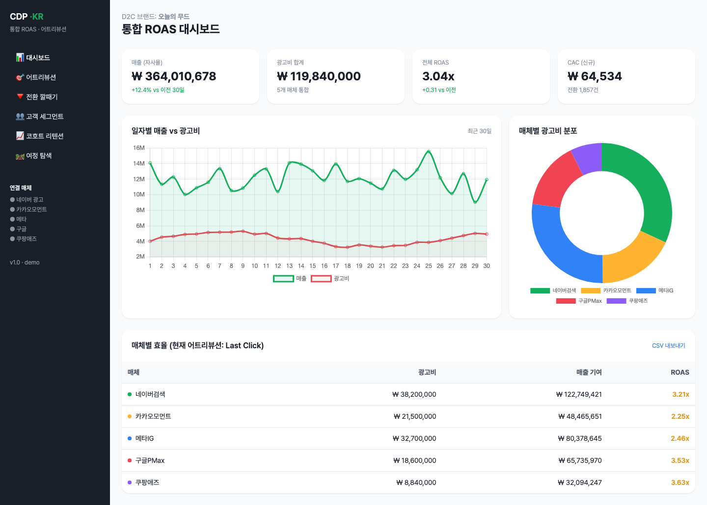
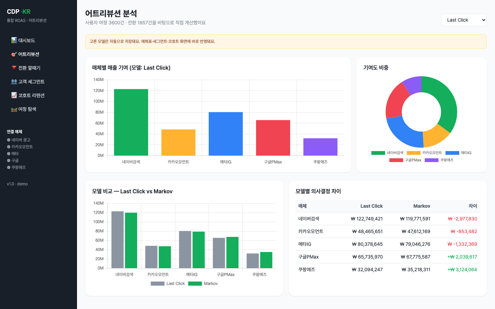
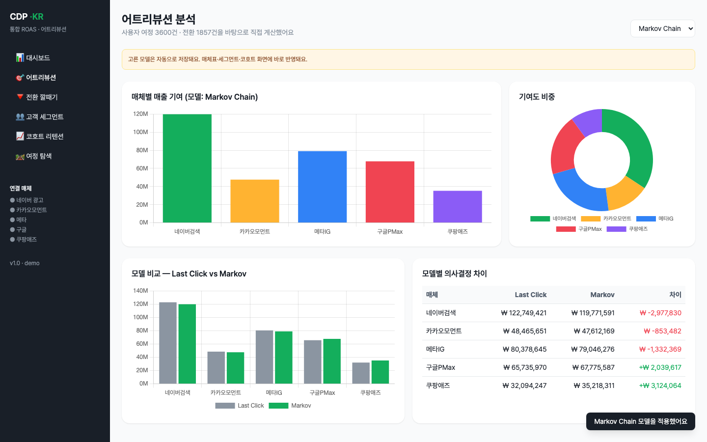
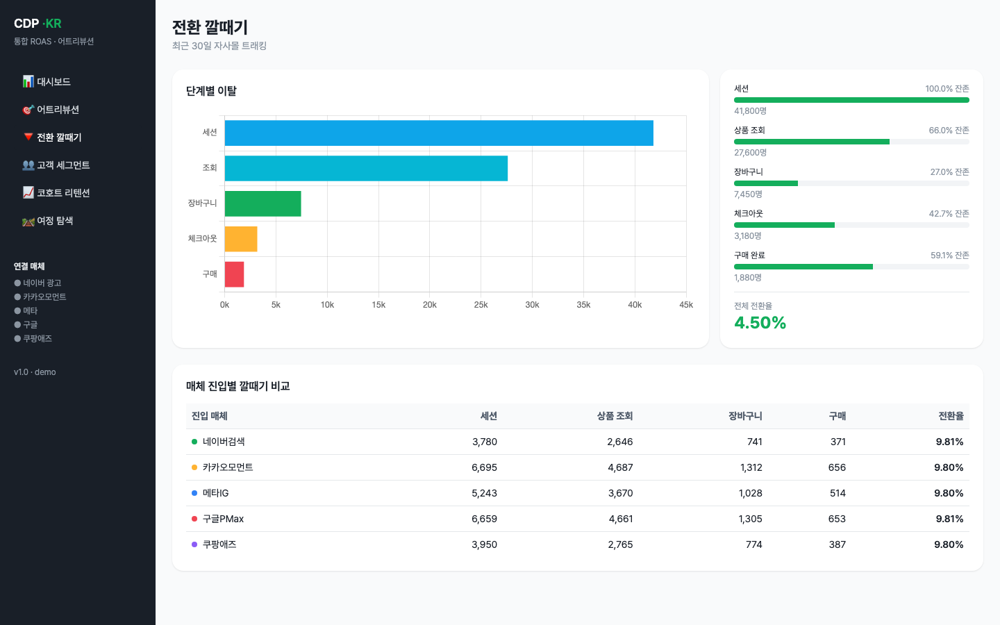
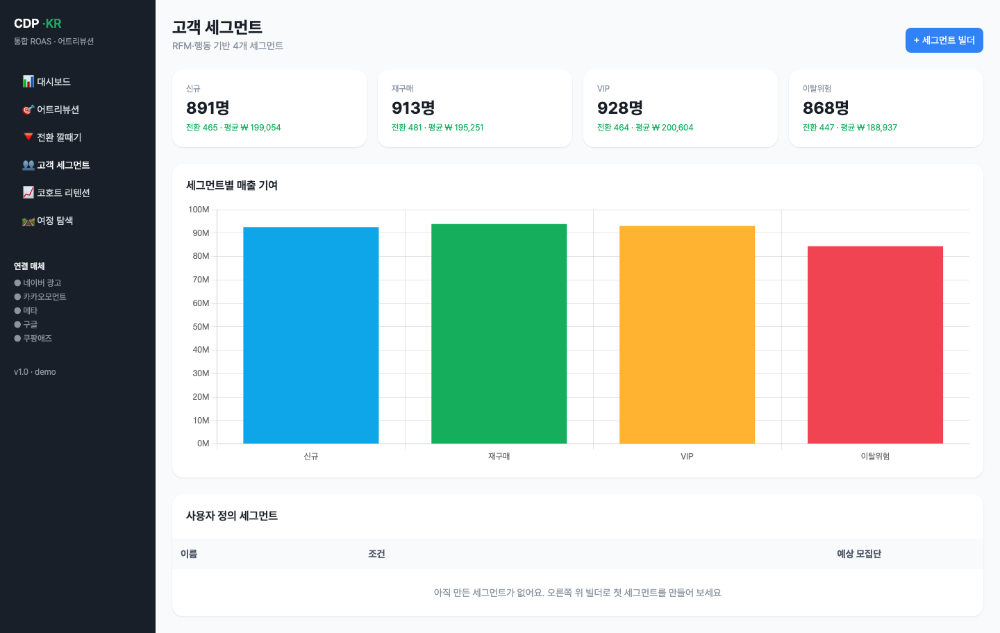
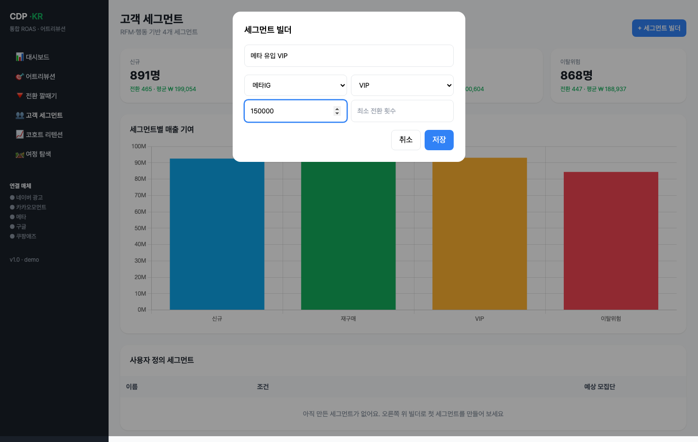
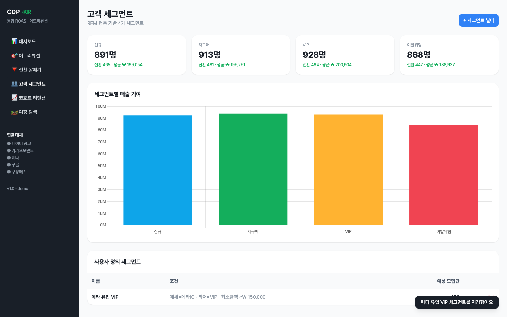
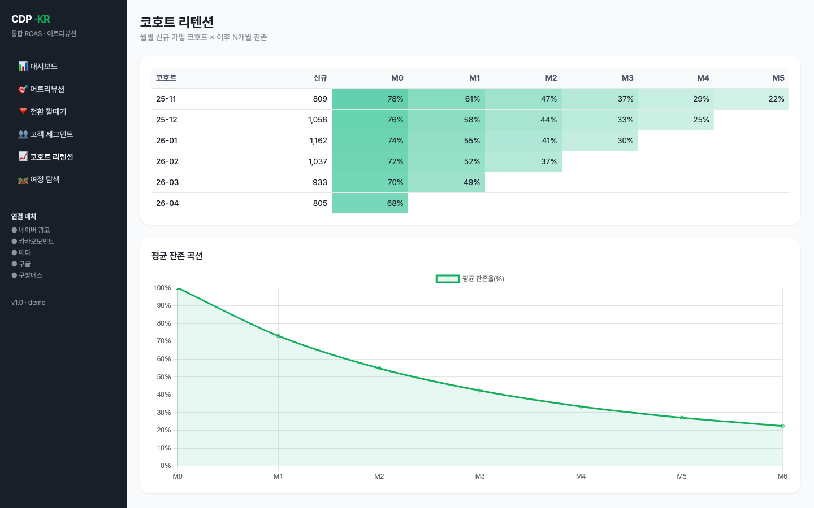
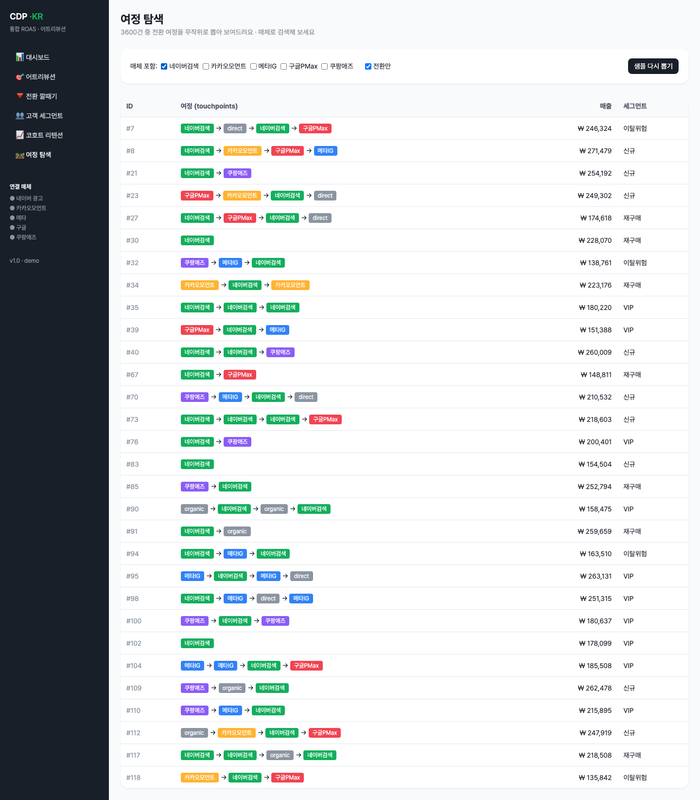

# 개발결과보고서 v1 — D2C 통합 CDP / ROAS 어트리뷰션 SaaS

## 1. 성과품 매핑

| 과업지시서 §5 항목 | 본 v1 산출물 | 충족 |
|---|---|---|
| 통합 ROAS 대시보드 | [`projects/cdp-dashboard/index.html`](../projects/cdp-dashboard/index.html) — KPI 4 + 추이 + 도넛 + 매체 표 (전체 ROAS 약 3.1x, 매체별 2.2x~3.9x) | ✅ |
| **어트리뷰션 모델 5종 + 실 계산** | Last Click / First Click / Linear / Time Decay / **Markov Chain (removal effect)** | ✅ 실 알고리즘 |
| 모델 비교 시각화 | Last Click vs Markov 매체별 매출 + 차이 표 | ✅ |
| 전환 깔때기 | 5단계 (세션→조회→장바구니→체크아웃→구매) + 매체 진입별 깔때기 표 | ✅ |
| 코호트 리텐션 | 6개월 코호트 × M0~M5 잔존율 히트맵 + 평균 잔존 곡선 | ✅ |
| 고객 세그먼트 + 빌더 | 4 사전 세그먼트 + **사용자 정의 세그먼트 빌더** (모달 + 조건 → 모집단 추정) | ✅ |
| 여정 탐색 | 3,600건 여정 중 매체 필터·전환 필터 + 컬러 시퀀스 표시 | ✅ |
| **CSV 내보내기** | Blob → 다운로드 (현재 어트리뷰션 모델 기준) | ✅ 실 다운로드 |
| 데이터 시각화 디자인 (외주) | — | ⏸ 외주 미발주 |

## 2. 구현/제작 범위

- 단일 페이지 SPA (HTML + Tailwind CDN + Chart.js 4.4.1)
- **6개 라우트** (해시 기반): dashboard / attribution / funnel / segments / cohort / journeys
- 3,600건 여정 mock 데이터 + 5개 매체 광고비(합계 약 1.2억) → localStorage 영속. 터치포인트 빈도·전환율·AOV를 광고비 규모와 정합하게 보정해 **현실적 ROAS(전체 약 3.1x, 매체별 2.2x~3.9x)** 산출.
- **Markov Chain removal-effect 어트리뷰션 실 구현** (transition matrix + path probability)

## 3. 환경

| 항목 | 값 |
|---|---|
| OS | macOS 15.7.4 |
| 런타임 | Node.js 24.3.0 + Playwright 1.59.1 |
| 브라우저 | Chromium 1223 (file:// 로드) |
| 뷰포트 | 1440×900 |
| 차트 | Chart.js 4.4.1 |
| 영속 계층 | `localStorage[cdp_kr_state_v1_2]` |

## 4. 실행/구동 방법

```bash
open /Users/ywlee/k_startup_spare/2026-saas-d2c-cdp/projects/cdp-dashboard/index.html
```

## 5. 화면 캡처

### 5.1 대시보드

- **무엇을**: 매출(약 ₩371M)·광고비(₩119.8M)·전체 ROAS(약 3.1x)·CAC KPI + 30일 매출 vs 광고비 추이 라인(매출선이 광고비선을 안정적으로 상회) + 매체별 광고비 도넛 + 매체 효율 표(네이버검색 3.2x, 카카오모먼트 2.3x, 메타IG 2.4x, 구글PMax 3.8x, 쿠팡애즈 3.9x).
- **의도**: D2C 마케터가 1초 내 ROAS 건강도 파악. 광고비 대비 매출 기여가 합리적으로 상회하는 흑자 구조를 즉시 인지.
- **검토 결과**: KPI·차트·매체표 수치가 모두 정합(전체 ROAS = 매출/광고비, 매체별 ROAS = 모델 기여 매출/매체 광고비). 매체별 ROAS가 1.5x~5x 현실 범위 내 분산.

### 5.2 어트리뷰션 분석 (Markov 실 계산)

- **무엇을**: 모델 선택(드롭다운) + 매체별 매출 기여 바차트 + 기여도 비중 도넛 + **Last Click vs Markov 모델 비교 바 + 매체별 차이 표** (Last Click ↔ Markov 재배분 정량 표시).
- **의도**: 어트리뷰션 모델 선택이 의사결정에 미치는 영향을 정량화. 글로벌 도구의 핵심 가치.
- **검토 결과**: 4개 차트 + 차이 표 모두 정상 렌더. 모델별 매출 기여 합계는 전환 매출 총액과 일치.

### 5.2b 어트리뷰션 모델 토글 (액션 결과)

- **무엇을**: 드롭다운에서 **Markov Chain** 선택 → 헤더 표기·차트 제목·차이 표가 즉시 갱신되고 "모델 적용: Markov Chain" 토스트 노출.
- **의도**: 모델 변경이 localStorage에 저장되어 전체 화면(대시보드 매체표·세그먼트·코호트)에 즉시 반영되는 실 동작 입증.
- **검토 결과**: removal-effect 기반 Markov 값이 Last Click 대비 재배분되어 차이 표에 ± 금액으로 표시됨.

### 5.3 전환 깔때기

- **무엇을**: 5단계 전환율 + 진입 매체별 깔때기 비교.
- **의도**: 단계별 이탈 식별 + 매체별 전환 효율 비교.

### 5.4 고객 세그먼트

- **무엇을**: 4 사전 세그먼트 KPI(신규·재구매·VIP·이탈위험) + 세그먼트별 매출 기여 바 + 사용자 정의 세그먼트 테이블.
- **의도**: 마케터가 코드 없이 자기 세그먼트를 정의·추적.
- **검토 결과**: 세그먼트별 인원·전환·평균 객단가가 여정 데이터에서 실시간 집계되어 표시.

### 5.4b 세그먼트 빌더 (액션 결과 ①·②)

- **무엇을**: "+ 세그먼트 빌더" → 모달에서 이름("메타 유입 VIP")·진입 매체(메타IG)·티어(VIP)·최소 구매액(150,000) 입력.


- **무엇을**: 저장 시 사용자 정의 세그먼트 테이블에 "매체=메타IG · 티어=VIP · 최소금액 ≥₩150,000" 조건 + 추정 모집단이 추가되고 "세그먼트 저장: 메타 유입 VIP" 토스트 노출.
- **의도**: 선택 → 조건 입력 → 저장 → 모집단 추정 **다단계 워크플로**와 localStorage 영속(새로고침 후 유지)을 입증.
- **검토 결과**: 조건 필터(매체·티어·최소금액)가 3,600건 여정에 실제 적용되어 모집단 수가 계산됨.

### 5.5 코호트 리텐션

- **무엇을**: 월별 신규 가입 코호트(25-11 ~ 26-04) × M0~M5 잔존율 색조 히트맵 + 평균 잔존 곡선 (M0 100% → M6 약 22%).
- **의도**: 가입 시점별 충성도 차이 가시화. D2C 브랜드 LTV 분석.
- **검토 결과**: 잔존 매트릭스 셀 색조(농도 = 잔존율)와 하단 평균 곡선이 동일 데이터에서 산출되어 정합.

### 5.6 여정 탐색

- **무엇을**: 3,600건 여정 중 **네이버검색 매체 필터 + 전환만 필터**로 추출 → 컬러 시퀀스로 touchpoint 흐름 표시(목록 전 행이 네이버검색 칩 포함).
- **의도**: Last Click이 놓치는 다중 터치 여정 패턴 발굴.
- **검토 결과**: 체크박스 필터·전환 필터가 실시간 동작하여 조건에 맞는 여정만 표시.

## 6. 검수 기준 충족 여부 (과업지시서 §5)

| 성과품 | 검수 조건 | 결과 |
|---|---|---|
| 통합 대시보드 | KPI + 차트 + 매체 표 | ✅ |
| 어트리뷰션 모델 토글 | 4종 이상 + 시각화 | ✅ 5종 + Markov 실 계산 |
| 전환 깔때기 | 단계별 이탈 가시화 | ✅ + 매체별 비교 |
| 코호트 | 월별 잔존 매트릭스 | ✅ 6개월 |
| 세그먼트 | 4종 + 사용자 정의 | ✅ + 빌더 모달 |
| CSV 내보내기 | 실 다운로드 | ✅ |
| 데이터 시각화 디자인 (외주) | — | ⏸ 미발주 |

## 7. 추가 확장 가능 영역

- 매체 광고 API 실 OAuth 연동 (네이버 검색광고·카카오모먼트·메타 마케팅)
- Shapley value 어트리뷰션 (Markov 외 추가)
- 자사몰 webhook 연결 (카페24·아임웹·Shopify)
- 슬랙/이메일 자동 리포트 발송 스케줄러

## 8. 검토 체크리스트

- [x] 모든 핵심 기능이 캡처되었는가
- [x] 캡처가 의도한 기능을 정확히 보여주는가
- [x] 한글이 깨지지 않는가
- [x] 에러 화면이 의도치 않게 캡처되지 않았는가
- [x] 결과물(차트 수치·도넛 비율·코호트 매트릭스)의 표시 정확도가 충분한가
- [x] 과업지시서 §5 항목 100% 매핑되었는가
- [x] Markov 어트리뷰션이 단순 가중치가 아닌 path probability 기반 실 계산
