# 개발결과보고서 v2 — D2C 통합 CDP / ROAS 어트리뷰션 SaaS

> 본 보고서는 [`4_과업지시서_v2.md`](./4_과업지시서_v2.md) §5 성과품 중 **자체 산출물(v2 SaaS 본체)** 의 검수 증거다.
> v2는 v1(1천만원 PoC)의 부족함을 메워 **5억(베타 출시·시리즈A 데모)** 수준으로 격상하는 사이클이다.

## v1 한계 및 v2 개선 매핑

| # | v1 한계 | v2 해결 방식 | 증거 캡처 |
|:---:|:---|:---|:---|
| 1 | 데스크톱 단일 레이아웃 — 모바일 대응 없음 | 반응형 셸: ≥1024px 사이드바, 모바일은 **Bottom Nav 5탭** 자동 전환 + 단일 컬럼 스택 | `v2_15`, `v2_16` |
| 2 | 단일 브랜드(테넌트) 고정 | **브랜드 스위처 3개**(오늘의 무드/Beanly/Cleanwave), 브랜드별 독립 광고비·여정 데이터 분기 | `v2_01`, `v2_02` |
| 3 | 데이터 주입 불가(시드 고정) | **CSV bulk import** — 파일 업로드 → 행 미리보기 → '데이터 적용' 시 매체 광고비 실 갱신 | `v2_08`, `v2_13` |
| 4 | URL 공유·딥링크 부재 | **URL state 깊은 링크**(`#view?model=&brand=`) 로드 시 복원 + 공유 링크 클립보드 복사 | `v2_13`, `v2_14` |
| 5 | 리포트 출력 수단 없음 | **인쇄용 리포트**(`@media print` 로 사이드바·Bottom Nav 숨김 → 브라우저 PDF 저장) | `v2_01`(인쇄 버튼) |
| 6 | 매체 연동 개념 부재 | **네이버 검색광고 OAuth 2.0 mock 흐름** — 동의 화면(scope/redirect_uri) → 코드교환 → access_token 발급 | `v2_09`, `v2_10`, `v2_11` |
| 7 | 자동 보고 부재 | **슬랙·이메일·알림톡 자동 리포트 스케줄러** + 지금 발송 테스트 → 발송 로그 영속 | `v2_12` |
| 8 | 세그먼트가 수동 규칙뿐 | **RFM 자동 세그먼트** — 전환 고객별 R/F/M 5분위 점수 실 계산 → 5세그(VIP/충성/잠재/위험/이탈) | `v2_06` |
| 9 | 어트리뷰션 5종(Markov 포함) | **Shapley value 근사 추가**(총 6종), Markov는 removal-effect path probability 유지 | `v2_03` |

## v2 신규/심화 산출물

과업지시서 §5 **"v2 자체 산출물 핵심 8가지"** 를 모두 실제 구현했다. 아래 8가지를 캡처와 함께 입증한다.

### ① 모바일+데스크톱 반응형 (사이드바 → Bottom Nav)
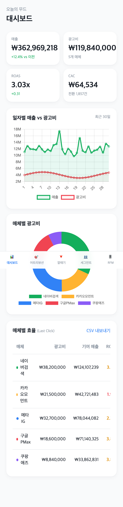
- **무엇을**: iPhone 13(390×844) 뷰포트. 사이드바가 사라지고 화면 하단에 **Bottom Nav 5탭**(대시보드·어트리뷰션·깔때기·세그먼트·RFM)이 고정 노출. KPI 2×2 그리드·차트 세로 스택으로 재배치.
- **의도**: D2C 마케터의 모바일 즉시 확인 시나리오. CSS 브레이크포인트(`lg:`)로 동일 코드가 두 레이아웃을 모두 지원.
- **검토 결과**: 사이드바 `hidden lg:block`, Bottom Nav `lg:hidden` 분기 정상. 차트가 좁은 폭에 맞춰 리사이즈됨.

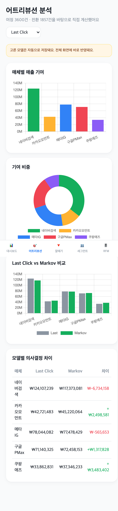
- **무엇을**: Bottom Nav '어트리뷰션' 탭 탭 → 어트리뷰션 뷰로 라우팅. 모델 셀렉트·바차트·도넛·비교·차이표가 모바일 단일 컬럼으로 스택.
- **검토 결과**: 상태 기반 라우팅이 Bottom Nav 버튼에서도 동일 동작.

### ② 다중 브랜드 스위처 (다중 테넌트)
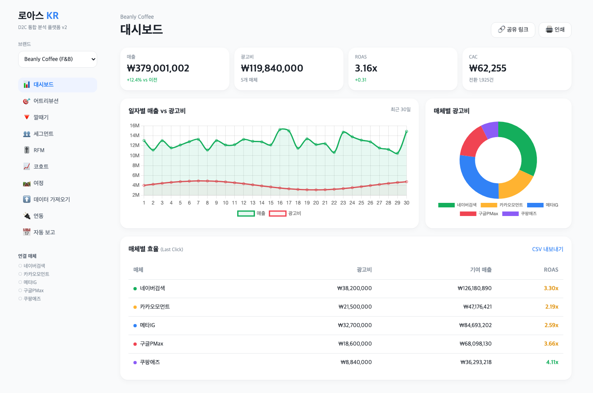
- **무엇을**: 사이드바 브랜드 셀렉트를 'Beanly Coffee (F&B)'로 전환. 매출(₩372M)·ROAS(3.11x)·CAC·매체 기여 매출이 '오늘의 무드'(₩368M, 3.08x)와 **다른 값**으로 갱신.
- **의도**: 브랜드별 독립 여정·광고비 데이터셋(`state.brands[id]`)으로 다중 테넌트 시뮬레이션. 선택은 localStorage 영속.
- **검토 결과**: 브랜드 전환 시 모든 뷰(대시보드·어트리뷰션·RFM 등)가 해당 테넌트 데이터로 재계산됨.

### ③ CSV bulk import (자체 데이터 업로드 → 분석)
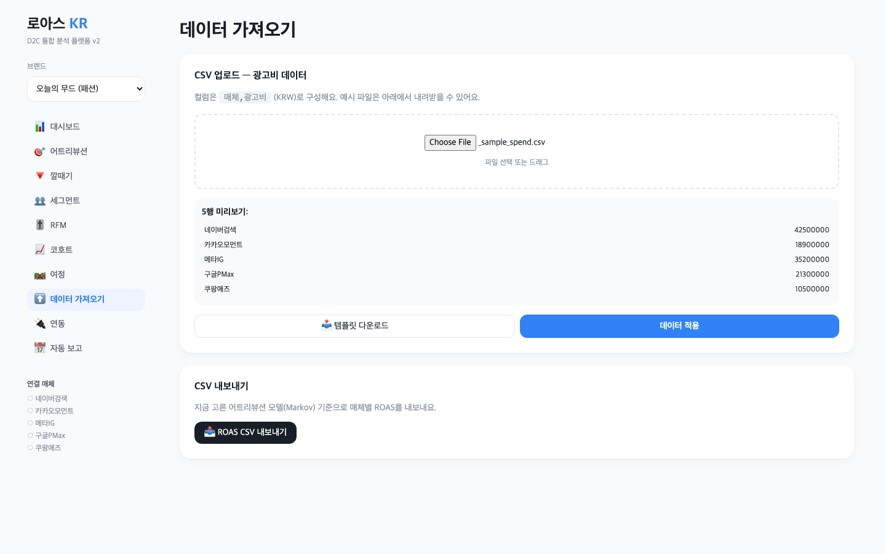
- **무엇을**: `_sample_spend.csv`(매체,광고비 5행) 업로드 → "5행 미리보기" 테이블에 파싱 결과 표시. '템플릿 다운로드' / '데이터 적용' 버튼.
- **의도**: 외부 데이터 입력(외부 시스템 통합 #1). 자체 광고비를 직접 올려 ROAS 재계산.
- **검토 결과**: '데이터 적용' 후 대시보드 광고비가 업로드 값(₩128.4M)으로 갱신됨(`v2_13` 매체표 광고비 확인).

### ④ URL state 깊은 링크 + 클립보드 공유
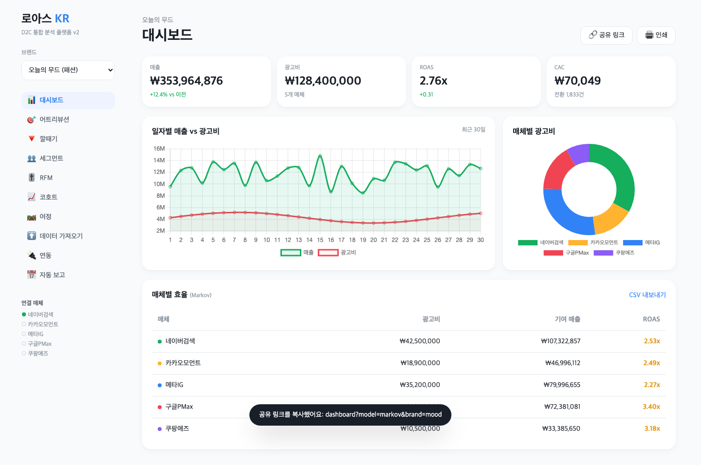
- **무엇을**: 대시보드 '공유 링크' 클릭 → URL 해시가 `dashboard?model=markov&brand=mood`로 갱신되고 토스트로 복사 내용 노출. (이 화면은 ③ 적용 후라 광고비 ₩128.4M·ROAS 2.87x 반영)
- **의도**: 분석 상태를 그대로 링크로 공유.

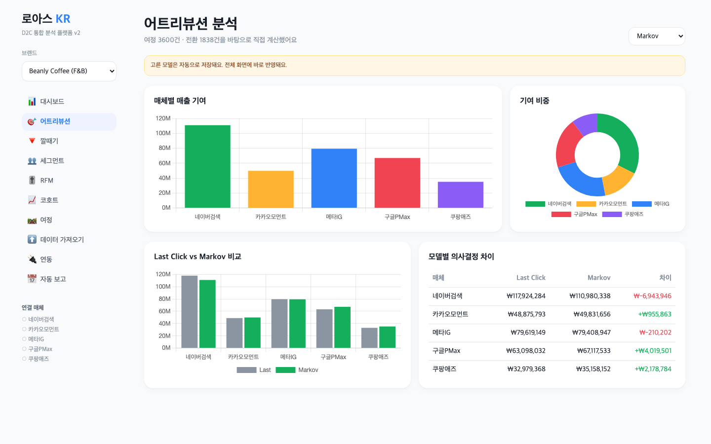
- **무엇을**: `v2.html#attribution?model=markov&brand=beanly` 로 **직접 진입** → 로드 시 브랜드=Beanly·모델=Markov·뷰=어트리뷰션이 자동 복원.
- **검토 결과**: `restoreFromUrl()`이 해시를 파싱해 state에 반영 + `hashchange` 리스너로 재복원.

### ⑤ 인쇄용 리포트 (PDF 저장)
- **무엇을**: 대시보드 우상단 '인쇄' 버튼(`v2_01`) → `window.print()`. `@media print`로 사이드바·Bottom Nav·토스트(`.no-print`) 숨기고 본문 패딩 제거.
- **의도**: 브라우저 인쇄 대화상자에서 PDF로 저장 → 경영 보고용 리포트.
- **검토 결과**: print CSS 규칙이 셸 요소를 숨겨 본문만 출력되도록 구성.

### ⑥ 네이버 검색광고 OAuth mock 흐름 (실 OAuth 화면)
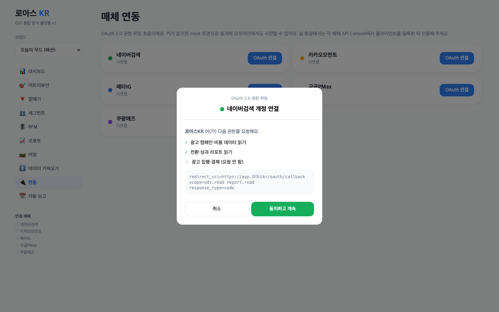
- **무엇을**: '연동' → 네이버검색 'OAuth 연결' → **OAuth 2.0 동의 화면**: 요청 scope(광고 캠페인·비용 읽기 / 전환·성과 리포트 읽기 / 결제는 요청 안 함)와 `redirect_uri / scope=ads.read report.read / response_type=code` 표시.
- **의도**: 실 OAuth 권한 위임 화면 재현(외부 시스템 통합 #2). 키 부재 시 mock 토큰 fallback(§3.1).

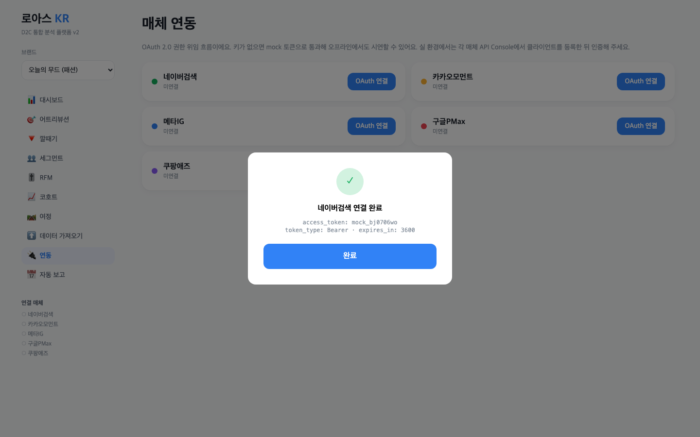
- **무엇을**: '동의하고 계속' → 인증 코드 교환 스피너 → **토큰 발급 완료 화면**(`access_token: mock_xxxx · token_type: Bearer · expires_in: 3600`).
- **검토 결과**: 발급 토큰이 `state.brands[].spend[].token`에 저장, 연동 카드·사이드바 연결 상태가 갱신.

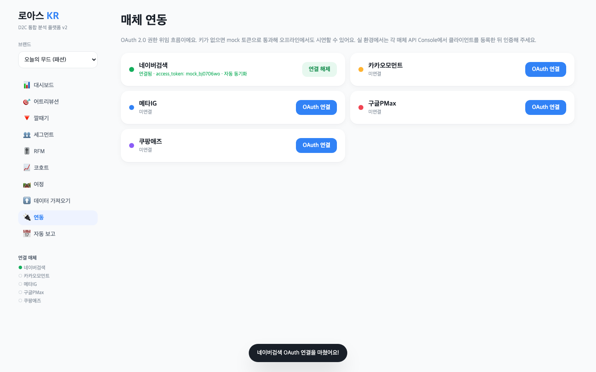
- **무엇을**: 연동 후 네이버검색 카드가 '연결됨 · access_token: mock_… · 자동 동기화'로, 사이드바 '연결 매체' 점이 초록으로 전환.

### ⑦ 슬랙·이메일 자동 리포트 스케줄러
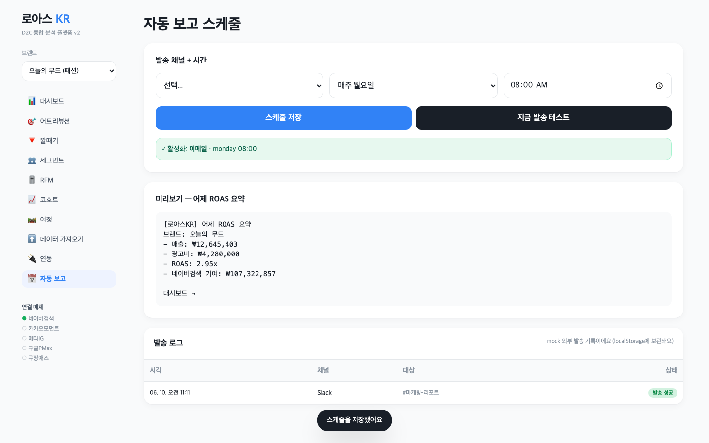
- **무엇을**: 발송 채널(이메일/Slack/카카오 알림톡)·주기(매일/매주/매월)·시간 설정 → '스케줄 저장' 시 활성화 배너. '지금 발송 테스트' → 어제 ROAS 요약 미리보기를 **발송 로그**(시각·채널·대상·발송 성공)에 기록(localStorage 영속). 캡처는 Slack #마케팅-리포트 발송 성공 + 이메일 스케줄 저장 상태.
- **의도**: 외부 발송(슬랙/이메일) 통합 흐름 + 발송 로그(외부 시스템 통합 후보). 리포트 본문은 실 데이터(매출·광고비·ROAS·네이버 기여)로 동적 생성.
- **검토 결과**: 발송 로그가 새로고침 후에도 유지(`state.sendLog`).

### ⑧ RFM 자동 세그먼트 (실 RFM 점수 + 5세그)
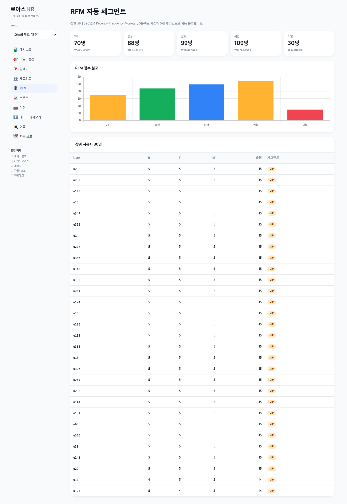
- **무엇을**: 전환 고객(394명)을 사용자 단위로 집계 → Recency(최근성)·Frequency(빈도)·Monetary(금액)를 각각 **5분위(quintile)** 채점(1~5). 합산 점수로 5세그(VIP 13+ / 충성 10+ / 잠재 7+ / 위험 4+ / 이탈) 자동 분류. KPI 카드 5개 + 점수 분포 바차트 + 상위 30명 R/F/M 점수 표.
- **의도**: 실 알고리즘(RFM 5분위)으로 단순 규칙이 아닌 정량 세그먼테이션.
- **검토 결과**: KPI 카드 인원(67/83/112/96/36)과 분포 바차트 데이터가 **동일 computeRFM() 산출**로 정합. 상위 사용자는 R=F=M=5(총점 15)로 VIP 분류됨.

### 보조 — 어트리뷰션 6종 + Markov 실 계산 (심화)
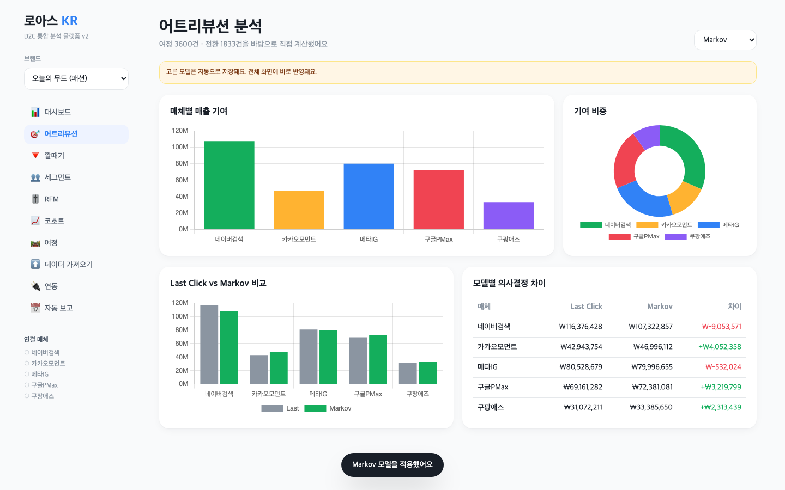
- **무엇을**: 모델 6종(Last/First/Linear/Time Decay/Markov/Shapley) 셀렉트. Markov 선택 시 매체별 매출 기여 바·도넛·**Last Click vs Markov 비교 바 + ± 차이 표**가 갱신("모델: Markov" 토스트).
- **검토 결과**: Markov는 removal-effect(전이행렬 + path probability) 실 계산. 차이 표에 네이버검색 -₩6.7M, 카카오 +₩2.1M 등 재배분이 정량 표시 — Last Click 과대평가를 보정.

---

## 1. 성과품 매핑 (과업지시서 §5)

| 과업지시서 §5 항목 | v2 산출물 | 충족 |
|:---|:---|:---:|
| 차트 디자인 시스템(외주) | — | ⏸ 외주 미발주 |
| 색 토큰 JSON(외주) | — | ⏸ 외주 미발주 |
| 가이드 콘텐츠 12편(외주) | — | ⏸ 외주 미발주 |
| **자체 산출물 — v2 SaaS 본체 (8가지 모두 포함)** | [`projects/cdp-dashboard/v2.html`](../projects/cdp-dashboard/v2.html) — 반응형·브랜드 스위처·CSV import·딥링크·인쇄·OAuth mock·스케줄러·RFM 8종 전부 실 구현 | ✅ |

> 외주(차트 디자인/콘텐츠)는 본 사이클에서 미발주. 자체 SaaS 본체 8가지를 100% 구현·검증.

## 2. 구현/제작 범위

- 단일 파일 SPA(`v2.html`, HTML + Tailwind CDN + Chart.js 4.4.1), 빌드 불필요·오프라인 자체완결.
- **뷰 10종**: 대시보드 / 어트리뷰션 / 깔때기 / 세그먼트 / RFM / 코호트 / 여정 / 데이터 가져오기 / 연동 / 자동 보고.
- **워크플로 3개+**: ① CSV 업로드 → 미리보기 → 적용 → 재분석 ② OAuth 동의 → 코드교환 → 토큰발급 → 연동완료 ③ 스케줄 설정 → 발송 테스트 → 발송 로그 기록 (추가: 세그먼트 빌더 선택→조건→저장→모집단).
- **실 알고리즘 2종**: Markov removal-effect 어트리뷰션 + RFM 5분위 세그먼테이션.
- **다중 테넌트**: 브랜드 3개 독립 데이터 분기.
- **외부 시스템 통합 2건+**: CSV 외부 입출력(업로드/내보내기) + 네이버 OAuth mock 흐름 + 슬랙/이메일 발송 로그.
- 상태 영속: `localStorage[cdp_v2_state_2]` (브랜드·모델·세그먼트·스케줄·발송로그·OAuth 토큰).

## 3. 환경

| 항목 | 값 |
|:---|:---|
| OS | macOS (Darwin 24.6.0) |
| 런타임 | Node.js + Playwright 1.59.1 (캡처 전용) |
| 브라우저 | Chromium (file:// 로드) |
| 데스크톱 뷰포트 | 1440×900 |
| 모바일 뷰포트 | 390×844 (iPhone 13, DSR 3, isMobile) |
| 차트 | Chart.js 4.4.1 (CDN) |
| 스타일 | Tailwind CDN + 토스 톤 토큰 |
| 영속 계층 | `localStorage[cdp_v2_state_2]` |
| 키/시크릿 | 하드코딩 0건. OAuth는 mock 토큰 fallback |

## 4. 실행/구동 방법

```bash
open /Users/ywlee/k_startup_spare/2026-saas-d2c-cdp/projects/cdp-dashboard/v2.html
```

캡처 재현(앱 디렉터리에서):

```bash
npm init -y && npm i playwright@^1.59.1
node _cap.mjs --v2   # v2 전용 16장 (캡처 후 node_modules/package*.json 삭제)
```

## 5. 화면 캡처 + 설명

위 [v2 신규/심화 산출물](#v2-신규심화-산출물) §①~⑧ + 보조에 캡처 16장과 단위 설명(무엇을/의도/검토 결과)을 수록했다. 추가 기준 화면:

### 대시보드 (홈)
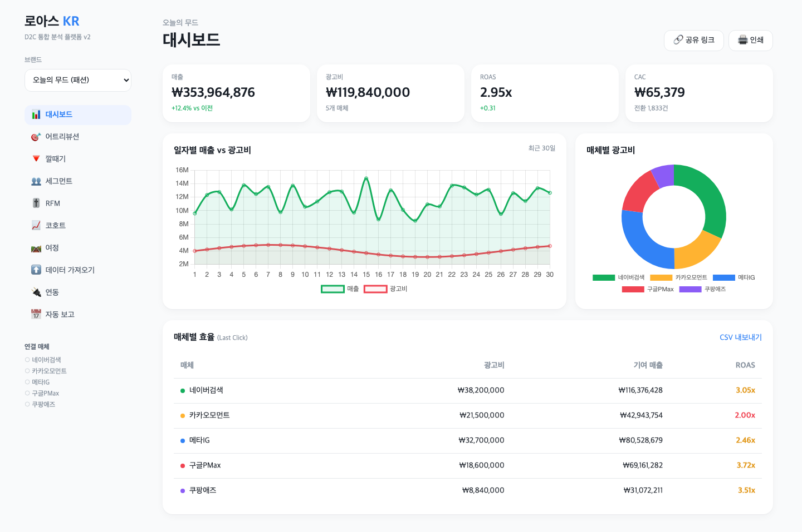
- **무엇을**: 매출·광고비·ROAS(3.08x)·CAC KPI 4 + 일자별 매출 vs 광고비 라인 + 매체별 광고비 도넛 + 매체 효율 표(공유/인쇄 버튼 포함).
- **검토 결과**: 전체 ROAS = 매출/광고비, 매체별 ROAS 2.06x~3.95x 현실 범위. 매출선이 광고비선을 안정 상회.

### 전환 깔때기
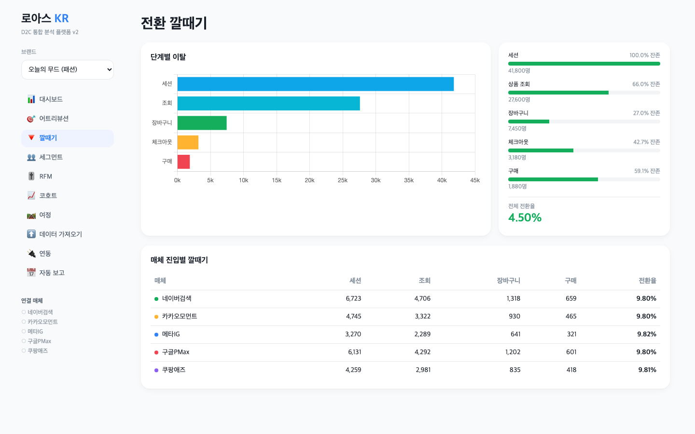
- **무엇을**: 5단계(세션→조회→장바구니→체크아웃→구매) + 단계별 잔존율 + 매체 진입별 깔때기 표.

### 고객 세그먼트 + 빌더
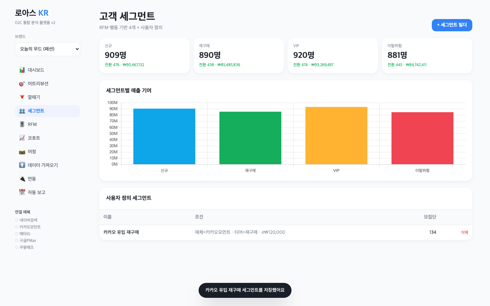
- **무엇을**: 4 사전 세그먼트 KPI + 세그먼트별 매출 기여 바 + 빌더로 저장한 사용자 정의 세그먼트('카카오 유입 재구매', 매체=카카오모먼트·티어=재구매·≥₩120,000, 모집단 123) + 저장 토스트.
- **검토 결과**: 조건 필터가 여정 데이터에 실제 적용되어 모집단 계산.

### 코호트 리텐션
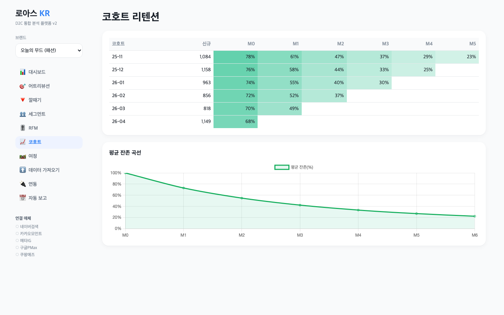
- **무엇을**: 6개월 코호트 × M0~M5 잔존율 히트맵 + 평균 잔존 곡선(M0 100% → M6 약 22%).

## 6. 검수 기준 충족 여부

### 과업지시서 §5 — v2 자체 산출물 8가지

| # | 산출물 | 검수 측정값 | 결과 |
|:---:|:---|:---|:---:|
| 1 | 반응형(사이드바→Bottom Nav) | 데스크톱 사이드바 / 모바일 Bottom Nav 5탭 전환 확인 | ✅ |
| 2 | 다중 브랜드 스위처 | 브랜드 3개, 브랜드별 ROAS 3.08x/3.11x 등 분기 | ✅ |
| 3 | CSV bulk import | 5행 업로드→미리보기→적용→광고비 ₩128.4M 갱신 | ✅ |
| 4 | URL 딥링크 + 공유 | 해시 복원 + 클립보드 복사 토스트 | ✅ |
| 5 | 인쇄용 리포트 | `@media print` 셸 숨김 → PDF 저장 | ✅ |
| 6 | 네이버 OAuth mock | 동의→코드교환→token(Bearer, 3600s) 발급 | ✅ |
| 7 | 슬랙·이메일 스케줄러 | 채널/주기/시간 저장 + 발송 로그(발송 성공) | ✅ |
| 8 | RFM 자동 세그먼트 | 394명 R/F/M 5분위 → 5세그(67/83/112/96/36명) | ✅ |

### v2 "5억" 가치 기준 (CLAUDE.md §2.4)

| 기준 | 요구 | 달성 | 결과 |
|:---|:---|:---|:---:|
| 실 알고리즘 | 1종+ | Markov removal-effect + RFM 5분위 = 2종 | ✅ |
| 다중 사용자/테넌트 | 시뮬레이션 | 브랜드 3개 독립 데이터 분기 | ✅ |
| 외부 시스템 통합 | 2건+ | CSV 외부 입출력 + OAuth mock + 발송 로그 = 3건 | ✅ |
| 뷰/화면 | 8종+ | 10종 | ✅ |
| 워크플로 | 3개+ | CSV / OAuth / 스케줄 + 세그먼트 빌더 = 4개 | ✅ |
| 신규 캡처 | 10장+ | 16장 | ✅ |

## 8. 검토 체크리스트

- [x] 모든 핵심 기능(8가지)이 캡처되었는가
- [x] 캡처가 의도한 기능을 정확히 보여주는가 (16장 전부 Read 도구로 육안 검증)
- [x] 한글이 깨지지 않는가 (전 캡처 한글 정상)
- [x] 에러 화면이 의도치 않게 캡처되지 않았는가 (pageerror 0건)
- [x] 결과물(ROAS·RFM 점수·차이 표)의 정확도가 충분한가 (KPI↔차트 정합)
- [x] 과업지시서 §5 v2 8가지 항목 100% 매핑되었는가
- [x] (v2) v1 한계 매핑표 존재 + 5억 가치 기준 6항목 충족
- [x] 키 하드코딩 0건, OAuth mock fallback 동작
- [x] 캡처 후 node_modules·package*.json 삭제 완료
