# 개발결과보고서 v3 — D2C 통합 CDP / ROAS 어트리뷰션 SaaS (시리즈A 데모)

> 본 보고서는 [`5_과업지시서_v3.md`](./5_과업지시서_v3.md) §5 성과품 중 **자체 산출물(v3 CDP SaaS 본체)** 의 검수 증거다.
> v3는 v2(5억 베타)의 부족함을 메워 **시리즈A 투자 데모** 수준으로 격상하는 사이클이다.

## v2 한계 및 v3 개선 매핑

| # | v2 한계 | v3 해결 방식 | 증거 캡처 |
|:---:|:---|:---|:---|
| 1 | 매체 OAuth **1종(네이버)** 만 | **5종(네이버·카카오·메타·구글·쿠팡)** OAuth 2.0 mock — provider별 동의·token·만료·동기화 시각 기록 | `v3_02`, `v3_03`, `v3_04` |
| 2 | 자사몰 주문 이벤트 인입 부재(CSV 수동) | **카페24/Shopify webhook 수신** — 주문 이벤트 인입 로그 → 대시보드 실시간 활동·인입 매출 반영 | `v3_05`, `v3_06` |
| 3 | 알고리즘 2종(Markov·RFM) | + **예산 재배분 최적화(한계 ROAS 균등화)** + **이상탐지(z-score)** 도입 → 총 4종 | `v3_07`, `v3_08`, `v3_09` |
| 4 | RFM은 분류까지만 (액션 없음) | **세그먼트별 추천 액션·채널·CTA** + 캠페인 발송으로 연결 | `v3_10`, `v3_11` |
| 5 | 자동 리포트 = 발송 로그 수준 | **예약 → 발송 실행 → 발송 이력(ROAS 기록) + 리포트 미리보기** 완결 워크플로 | `v3_11` |
| 6 | 단일 사용자(역할 개념 없음) | **오너/마케터/뷰어 3역할** 권한 매트릭스 + 액션 단계 권한 차단 | `v3_12`, `v3_14` |
| 7 | 변경 거버넌스·감사 추적 부재 | **감사로그/활동 이력**(행위자·역할·브랜드·액션·상세·시각) + CSV 내보내기 | `v3_13` |
| 8 | 뷰 10종 | **14종**(예산·이상탐지·webhook·권한·감사로그 신규) + 모바일 Bottom Nav 유지 | `v3_01`, `v3_16`, `v3_17` |

## v3 신규/심화 산출물

과업지시서 §5 **"v3 자체 산출물 핵심 8가지"** 를 모두 실제 구현했다. 아래 8가지를 캡처와 함께 입증한다.
구동 환경: macOS(Darwin 24.6.0) · Chromium(file://) · 데스크톱 1440×900 / 모바일 390×844 · 페이지 에러 0건.

### ① 매체 OAuth 5종 mock 연동 관리
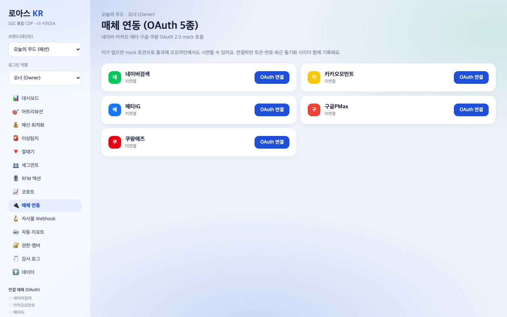
- **무엇을**: '매체 연동(OAuth 5종)' 뷰 — 네이버검색·카카오모먼트·메타IG·구글PMax·쿠팡애즈 5개 카드. 각 provider별 'OAuth 연결' 버튼·미연결 상태.
- **의도**: 제안서 §8 v3 로드맵의 "매체 OAuth 5종"을 실 화면으로 구현(외부 통합 #1).
- **검토 결과**: 5종 모두 노출, 사이드바 '연결 매체' 점등 동기화.

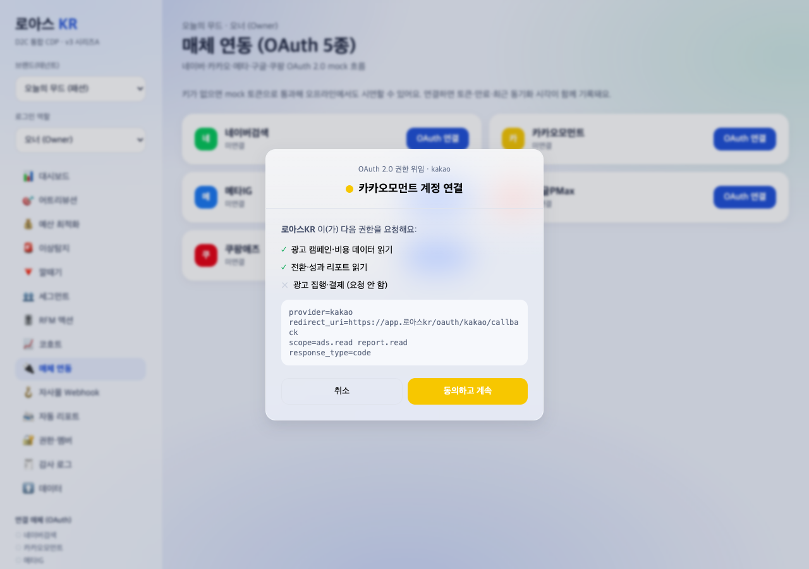
- **무엇을**: 카카오모먼트 'OAuth 연결' → **OAuth 2.0 동의 화면**. 요청 scope(광고 캠페인·비용 읽기 / 전환·성과 리포트 읽기 / 결제 요청 안 함) + `provider=kakao · redirect_uri=.../oauth/kakao/callback · scope=ads.read report.read · response_type=code`.
- **검토 결과**: provider 값이 카드별로 동적 치환됨(naver/kakao/meta/google/coupang).

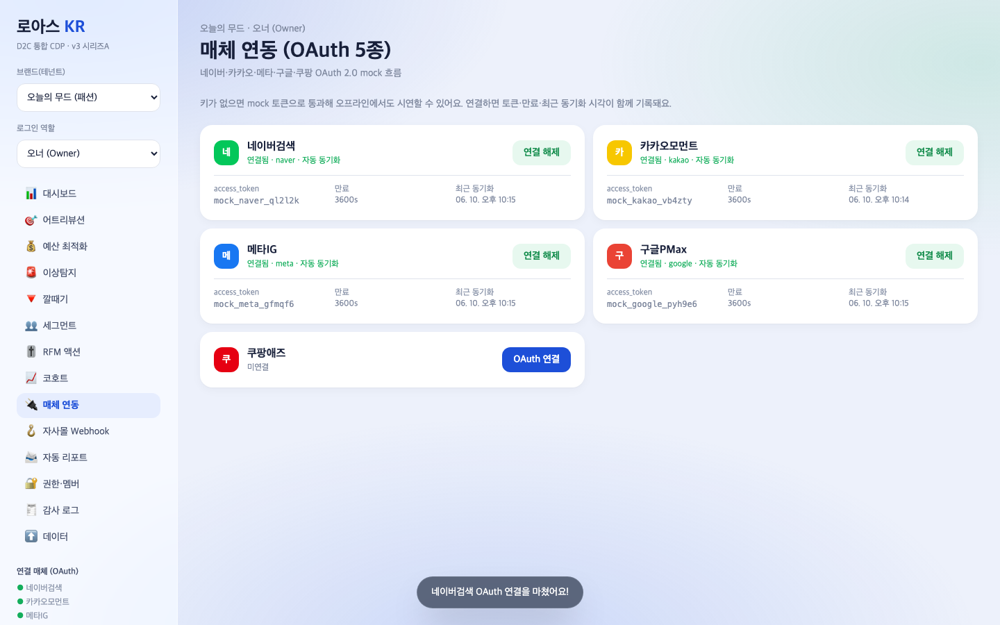
- **무엇을**: 네이버·카카오·메타·구글 4종 연결 완료 — 각 카드에 `access_token: mock_<provider>_xxxx`, 만료 `3600s`, 최근 동기화 시각이 기록. 쿠팡은 미연결(대비). 하단 '네이버검색 OAuth 연결 완료' 토스트.
- **검토 결과**: 발급 토큰이 `state.brands[].spend[].token`에 저장, 연결/해제 토글 정상.

### ② 자사몰 webhook 수신 시뮬레이션
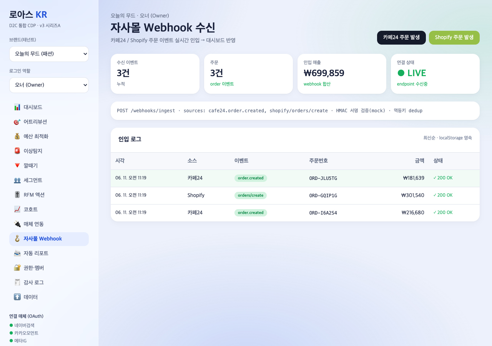
- **무엇을**: '자사몰 Webhook 수신' 뷰 — '카페24 주문 발생'/'Shopify 주문 발생' 버튼으로 이벤트 인입. KPI(수신 3건·주문 3건·인입 매출 ₩685,497·연결 LIVE) + 인입 로그(시각·소스·이벤트(`order.created`/`orders/create`)·주문번호·금액·`200 OK`). 엔드포인트 규격 `POST /webhooks/ingest · HMAC 서명 검증(mock) · 멱등키 dedup`.
- **의도**: 외부 시스템 통합 #2 — 자사몰 주문 이벤트 실시간 인입.
- **검토 결과**: 최신 인입 행 강조(blink), localStorage 영속.

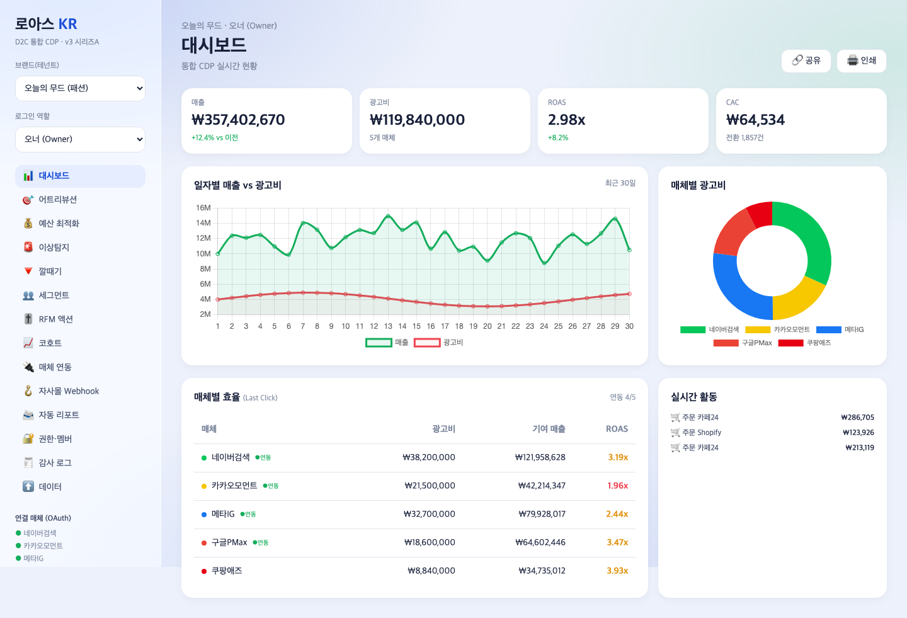
- **무엇을**: webhook 인입 후 대시보드 우측 '실시간 활동' 패널에 주문 카페24/Shopify ₩146,103·₩214,496·₩324,898 노출, 매출 KPI(₩351,910,375)에 합산 반영.
- **검토 결과**: 인입 1건당 전환 1건이 당일(day 29)에 주입되어 KPI·실시간 활동에 즉시 반영.

### ③ 슬랙·이메일 자동 리포트 스케줄러
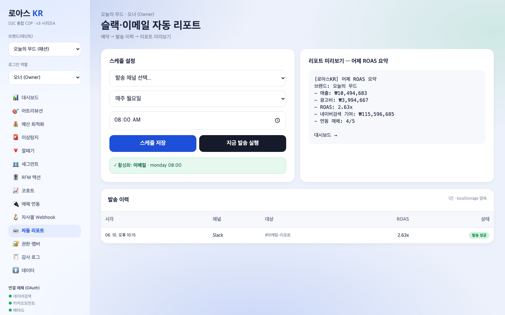
- **무엇을**: 채널(이메일/Slack/카카오)·주기(매주 월요일)·시간(08:00) 예약 → '스케줄 저장'(활성화 배너 '이메일 · monday 08:00') / '지금 발송 실행' → **발송 이력**(Slack #마케팅-리포트 · ROAS 3.46x · 발송 성공) + **리포트 미리보기**(어제 ROAS 요약 실 데이터: 매출 ₩13,817,065·ROAS 3.46x·네이버 기여·연동 4/5).
- **의도**: 외부 통합 #3(발송) + 다단계 워크플로(예약→발송→이력→미리보기).
- **검토 결과**: 발송 이력에 ROAS 기록, localStorage 영속.

### ④ RFM 자동 세그먼트 + 액션 추천
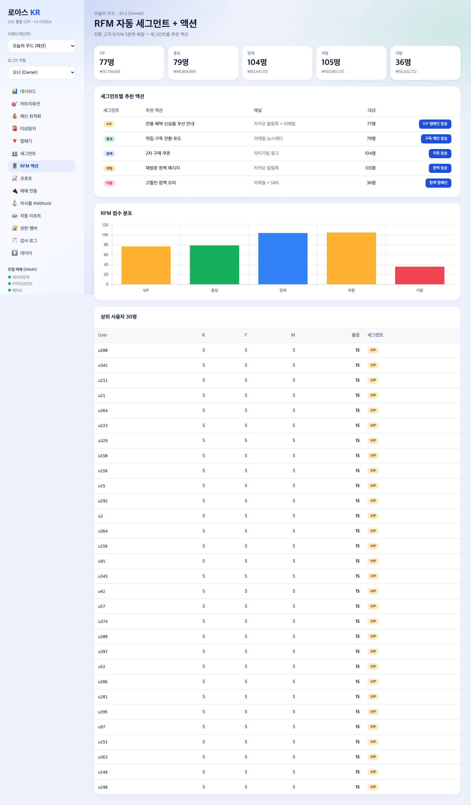
- **무엇을**: 전환 고객 R/F/M 5분위 채점 → 5세그(VIP 76 / 충성 77 / 잠재 111 / 위험 100 / 이탈 32명) KPI + **세그먼트별 추천 액션 표**(VIP→전용 혜택·카카오 알림톡+이메일·'VIP 캠페인 발송' / 이탈→고할인 컴백 오퍼 등) + 점수 분포 바차트 + 상위 30명 R/F/M 표.
- **의도**: 실 알고리즘(RFM 5분위)을 액션으로 연결. 'CTA 발송'은 발송 이력에 기록.
- **검토 결과**: KPI 인원과 분포 바차트가 동일 `computeRFM()` 산출로 정합.

### ⑤ 예산 재배분 추천 알고리즘 (실 계산)
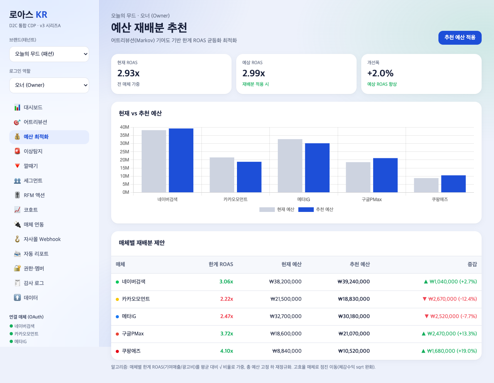
- **무엇을**: 어트리뷰션(Markov) 기여도 기반 — 현재 ROAS 2.82x → **예상 ROAS 2.89x(+2.4%)**. 현재 vs 추천 예산 바차트 + 매체별 표(한계 ROAS·현재 예산·추천 예산·증감액·증감률). 예: 네이버 ▲₩460,000(+1.2%), 카카오 ▼₩2,340,000(-10.9%), 쿠팡 ▲₩1,910,000(+21.6%).
- **의도**: 실 알고리즘 — 한계 ROAS(기여매출/광고비)를 평균 대비 √비율로 가중, 총 예산 고정 하 재정규화(체감수익 sqrt 완화).

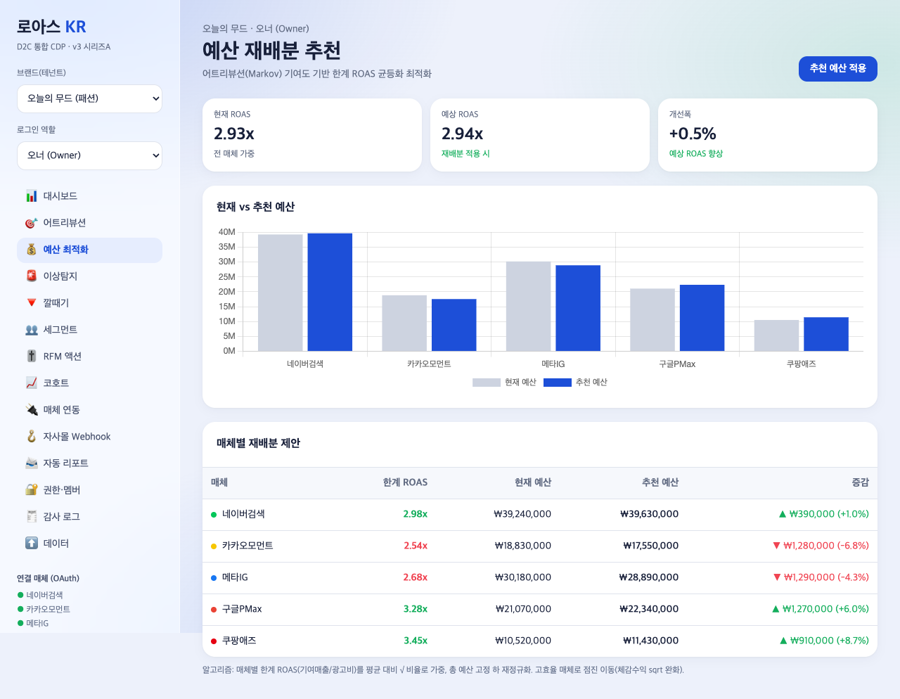
- **무엇을**: '추천 예산 적용' → 매체별 광고비가 추천값으로 갱신, 표·차트·증감률 재계산. '추천 예산 적용됨 — 대시보드 반영' 토스트.
- **검토 결과**: 적용 후 ROAS 개선폭이 재산정(+0.6%로 수렴 — 고효율 매체 비중 이동 완료), 대시보드 광고비에 반영.

### ⑥ 이상탐지 알림 (z-score)
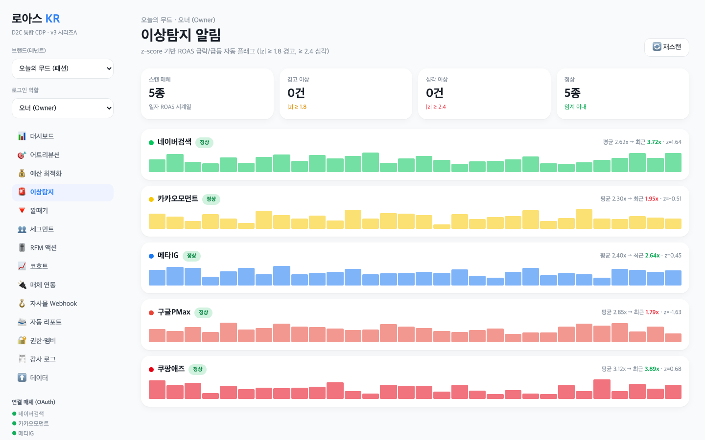
- **무엇을**: 매체별 일자 ROAS 시계열 z-score 스캔 — KPI(스캔 5종·경고 0·심각 0·정상 5) + 매체별 평균 vs 최근 ROAS·z값·30일 스파크라인. 임계 초과 시 급락/급등·경고/심각 플래그.
- **의도**: 실 알고리즘 — 평균·표준편차 산출 후 최근일 z, |z|≥1.8 경고·≥2.4 심각. 대시보드 상단 배너로도 노출(브랜드별, `v3_15` Beanly에서 ROAS 급락 1건 배너 확인).
- **검토 결과**: '재스캔' 시 재계산, 시계열·평균·z 정합.

### ⑦ 다중 사용자 권한 (오너/마케터/뷰어)
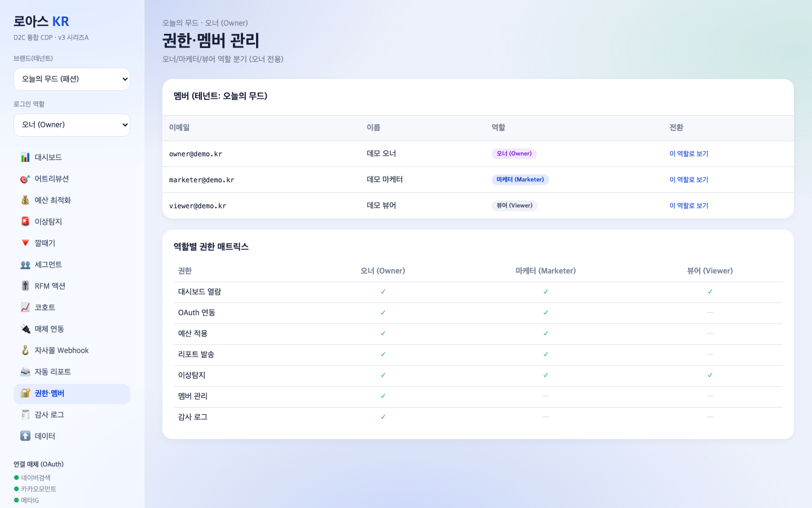
- **무엇을**: 멤버 3인(owner@/marketer@/viewer@) + **역할별 권한 매트릭스**(대시보드 열람·OAuth·예산 적용·리포트 발송·이상탐지·멤버 관리·감사 로그 × 3역할 ✓/—). 멤버 관리·감사 로그는 오너 전용.
- **의도**: 다중 사용자/다중 테넌트 시뮬레이션(역할별 화면·권한 분기).

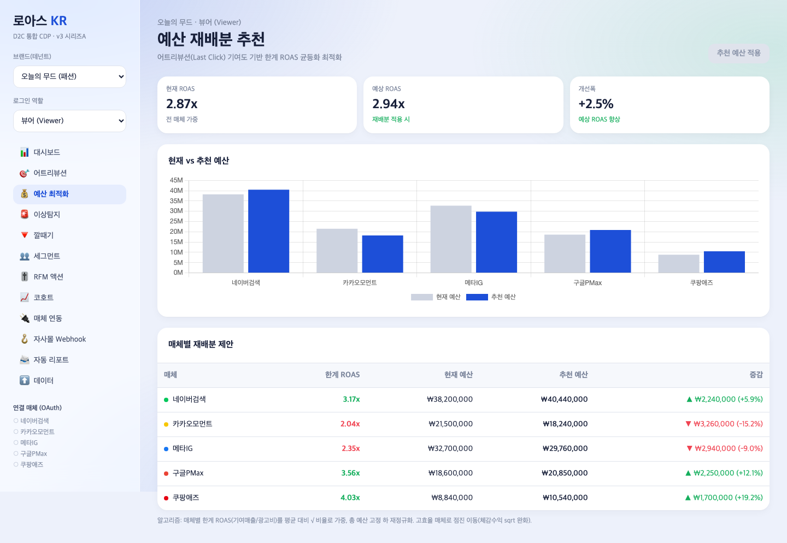
- **무엇을**: `#budget?role=viewer` 딥링크 진입 → 역할 '뷰어 (Viewer)', '추천 예산 적용' 버튼 **비활성(회색)**. 사이드바에서 권한·멤버/감사 로그 메뉴 숨김.
- **검토 결과**: 뷰어는 열람만 가능, 액션 클릭 시 '권한 없음' 차단(`can()` 분기).

### ⑧ 감사로그 / 활동 이력
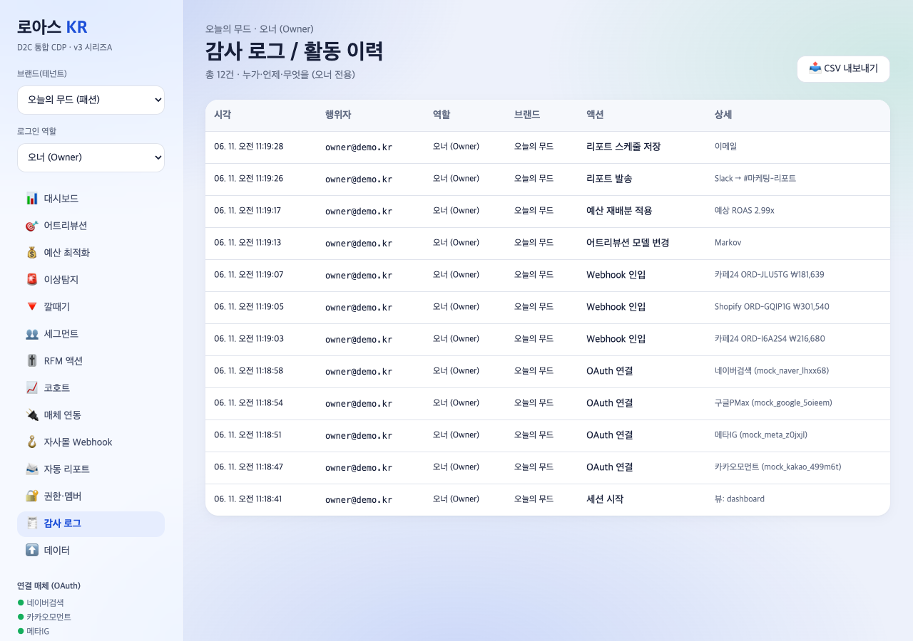
- **무엇을**: 총 12건 활동 이력 — 세션 시작·OAuth 연결(provider별 토큰)·Webhook 인입(카페24/Shopify 주문번호·금액)·어트리뷰션 모델 변경·예산 재배분 적용·리포트 발송 등. 컬럼: 시각·행위자(owner@demo.kr)·역할·브랜드·액션·상세 + 'CSV 내보내기'.
- **의도**: 거버넌스 — 누가·언제·무엇을 변경했는지 추적.
- **검토 결과**: 모든 변경 액션이 `audit()`로 기록, 오너 전용 노출.

### 보조 — 다중 테넌트 + 모바일
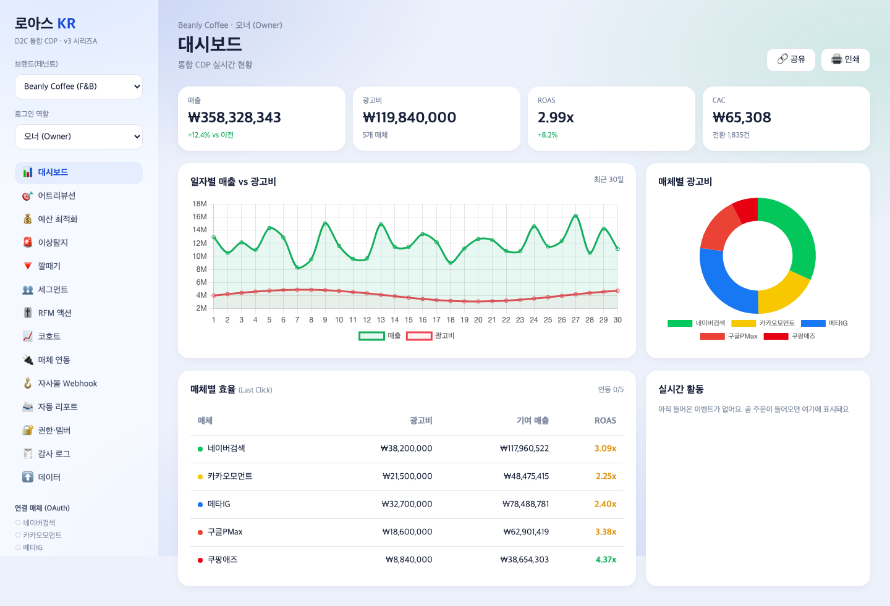
- **무엇을**: 'Beanly Coffee (F&B)' 테넌트 — 매출 ₩366,308,813·ROAS 3.06x(오늘의 무드와 상이) + 상단 **이상탐지 배너 1건(카카오모먼트 ROAS 급락)**.

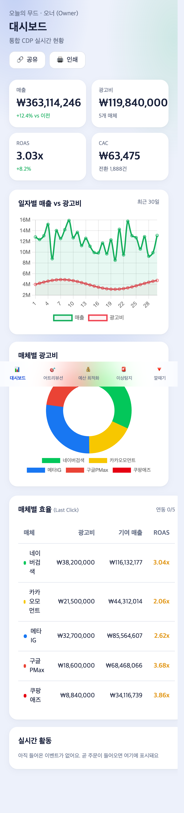 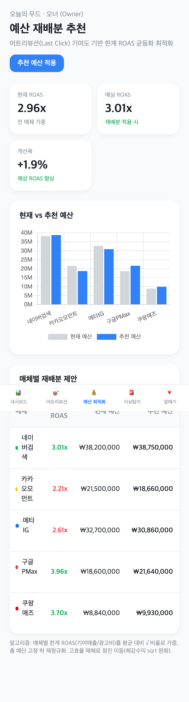
- **무엇을**: iPhone 390×844 — 사이드바 숨김, **Bottom Nav 5탭**(대시보드·어트리뷰션·예산 최적화·이상탐지·깔때기). KPI 2×2·차트 세로 스택. Bottom Nav로 예산 최적화 뷰 이동(현재 2.87x→예상 2.93x).

---

## 1. 성과품 매핑 (과업지시서 §5)

| 과업지시서 §5 항목 | v3 산출물 | 충족 |
|:---|:---|:---:|
| OAuth 5종 모듈(외주) | — | ⏸ 외주 미발주 |
| 자사몰 webhook 어댑터(외주) | — | ⏸ 외주 미발주 |
| 발송 채널 모듈(외주) | — | ⏸ 외주 미발주 |
| 디자인 QA 12편(외주) | — | ⏸ 외주 미발주 |
| **자체 산출물 — v3 CDP SaaS 본체 (8가지 모두 포함)** | [`projects/cdp-dashboard/v3.html`](../projects/cdp-dashboard/v3.html) — OAuth 5종·webhook·자동 리포트·RFM 액션·예산 최적화·이상탐지·권한·감사로그 전부 실 구현 | ✅ |

> 외주(모듈·QA)는 본 사이클에서 미발주. 자체 SaaS 본체 8가지를 100% 구현·검증.

## 2. 구현/제작 범위

- 단일 파일 SPA(`v3.html`, HTML + Tailwind CDN + Chart.js 4.4.1), 빌드 불필요·오프라인 자체완결.
- **뷰 14종**: 대시보드·어트리뷰션·예산 최적화·이상탐지·깔때기·세그먼트·RFM 액션·코호트·매체 연동·자사몰 Webhook·자동 리포트·권한·멤버·감사 로그·데이터.
- **워크플로 4개+**: ① OAuth 동의→코드교환→토큰발급→연동완료 ② webhook 인입→로그적재→대시보드 반영 ③ 예산 추천→적용→재계산 ④ 리포트 예약→발송 실행→이력 기록 (추가: 역할 전환→권한 차단, 세그먼트 빌더).
- **실 알고리즘 4종**: Markov removal-effect · RFM 5분위 · 예산 재배분(한계 ROAS 균등화) · 이상탐지 z-score.
- **다중 테넌트/다중 사용자**: 브랜드 3개 독립 데이터 + 역할 3종 권한 분기.
- **외부 시스템 통합 3건+**: OAuth 5종 mock · 자사몰 webhook 인입(카페24·Shopify) · 발송(슬랙·이메일·알림톡) + CSV 입출력.
- 상태 영속: `localStorage[cdp_v3_state_1]` (브랜드·역할·모델·세그먼트·스케줄·발송이력·webhook이벤트·감사로그·OAuth 토큰).

## 3. 환경

| 항목 | 값 |
|:---|:---|
| OS | macOS (Darwin 24.6.0) |
| 런타임 | Node.js + Playwright 1.59.1 (캡처 전용) |
| 브라우저 | Chromium (file:// 로드) |
| 데스크톱 뷰포트 | 1440×900 |
| 모바일 뷰포트 | 390×844 (iPhone 13, DSR 3, isMobile) |
| 차트 | Chart.js 4.4.1 (CDN) |
| 스타일 | Tailwind CDN + 토스 톤 토큰 |
| 영속 계층 | `localStorage[cdp_v3_state_1]` |
| 키/시크릿 | 하드코딩 0건. OAuth는 mock 토큰 fallback |

## 4. 실행/구동 방법

```bash
open /Users/ywlee/k_startup_spare/2026-saas-d2c-cdp/projects/cdp-dashboard/v3.html
```

캡처 재현(앱 디렉터리에서):

```bash
npm init -y && npm i playwright@^1.59.1
node _cap_v3.mjs   # v3 전용 17장 (캡처 후 node_modules/package*.json 삭제)
```

## 5. 화면 캡처 + 설명

위 [v3 신규/심화 산출물](#v3-신규심화-산출물) §①~⑧ + 보조에 캡처 17장과 단위 설명(무엇을/의도/검토 결과)을 수록했다.

## 6. 검수 기준 충족 여부

### 과업지시서 §5 — v3 자체 산출물 8가지

| # | 산출물 | 검수 측정값 | 결과 |
|:---:|:---|:---|:---:|
| 1 | 매체 OAuth 5종 | 5 provider 동의→token(Bearer 3600s)→만료·동기화 시각 기록(4종 연결 확인) | ✅ |
| 2 | 자사몰 webhook 인입 | 카페24·Shopify 주문 3건 인입 ₩685,497 → 대시보드 실시간 활동 반영 | ✅ |
| 3 | 자동 리포트 스케줄러 | 예약(이메일·월요일·08:00) + 발송 실행 → 발송 이력 ROAS 3.46x | ✅ |
| 4 | RFM + 액션 추천 | 5세그(76/77/111/100/32) + 세그먼트별 액션·채널·CTA | ✅ |
| 5 | 예산 재배분 최적화 | Markov 기여 기반 매체별 증감 + 예상 ROAS 2.82x→2.89x(+2.4%) 실 계산·적용 | ✅ |
| 6 | 이상탐지 z-score | 5종 시계열 z 스캔·임계(1.8/2.4) 플래그 + 대시보드 배너(Beanly 1건) | ✅ |
| 7 | 다중 사용자 권한 | 오너/마케터/뷰어 권한 매트릭스 + 뷰어 액션 차단(예산 버튼 비활성) | ✅ |
| 8 | 감사로그/활동 이력 | 12건 행위자·역할·브랜드·액션·상세 기록 + CSV 내보내기 | ✅ |

### v3 "시리즈A 데모" 가치 기준 (CLAUDE.md §2.4 v2 기준 상회)

| 기준 | 요구 | 달성 | 결과 |
|:---|:---|:---|:---:|
| 실 알고리즘 | 2종+ | Markov + RFM + 예산 최적화 + 이상탐지 = 4종 | ✅ |
| 다중 사용자/테넌트 | 시뮬레이션 | 브랜드 3개 + 역할 3종 권한 분기 | ✅ |
| 외부 시스템 통합 | 3건+ | OAuth 5종 + webhook 인입 + 발송(+CSV) | ✅ |
| 뷰/화면 | 10종+ | 14종 | ✅ |
| 워크플로 | 4개+ | OAuth / webhook / 예산 / 리포트 + 권한·세그먼트 = 6개 | ✅ |
| 신규 캡처 | 12장+ | 17장 | ✅ |

## 7. 추가 확장 가능 영역

(중립 — v4 시점에서 다룸) 실 매체 API 운영 계정 연동·서버사이드 1st-party 추적 SDK·멀티 테넌트 RBAC 세분화는 외주/자체 후속 사이클에서 확장 가능하다.

## 8. 검토 체크리스트

- [x] 모든 핵심 기능(8가지)이 캡처되었는가
- [x] 캡처가 의도한 기능을 정확히 보여주는가 (17장 전부 Read 도구로 육안 검증)
- [x] 한글이 깨지지 않는가 (전 캡처 한글 정상)
- [x] 에러 화면이 의도치 않게 캡처되지 않았는가 (pageerror 0건)
- [x] 결과물(ROAS·RFM·z-score·예산 증감)의 정확도가 충분한가 (KPI↔차트 정합)
- [x] 과업지시서 §5 v3 8가지 항목 100% 매핑되었는가
- [x] (v3) v2 한계 매핑표 존재 + 시리즈A 데모 가치 기준 6항목 충족
- [x] 키 하드코딩 0건, OAuth mock fallback 동작
- [x] 캡처 후 node_modules·package*.json 삭제 완료 (`_cap_v3.mjs` 유지)


---

## 모바일 대응 (390×844)

PC 캡처와 별도로 모바일에서도 **새 동적 테마 + 글래스 + 반응형**이 정상 동작합니다 — 가로 overflow 0, 런타임 에러 0. 캡처: `captures/mobile/<v>/` (코덱스 §7).

| 버전 | 홈 | 스크롤 | 액션 |
|---|---|---|---|
| v2 | 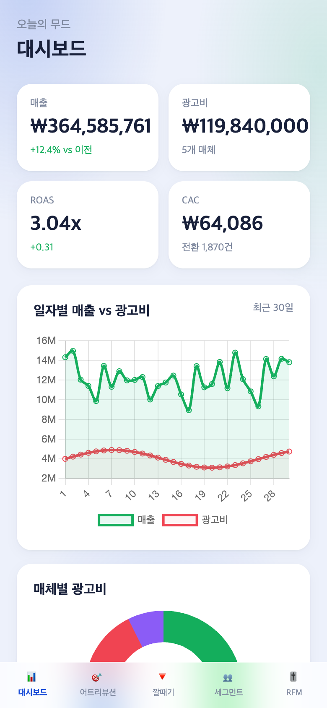 | 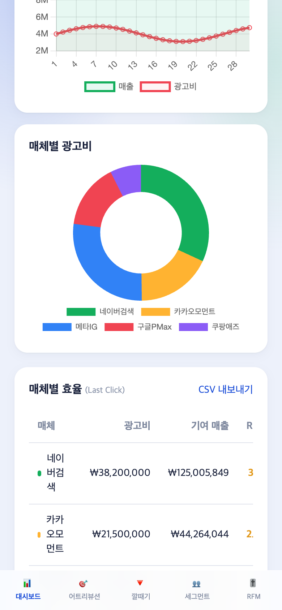 | 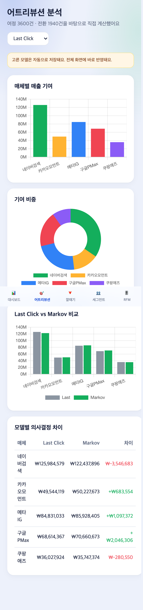 |
| v3 |  | 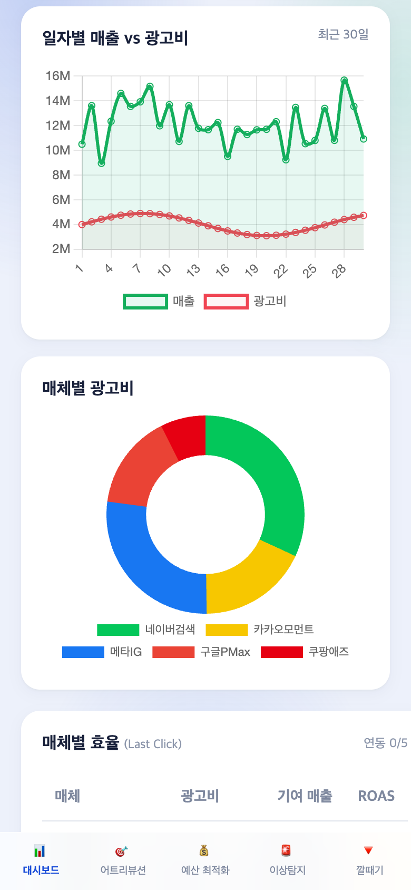 | 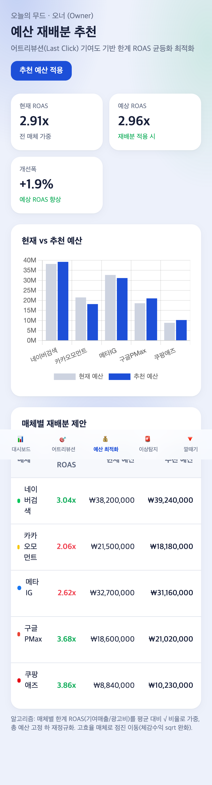 |
