# 제안서 — 교사·학교용 학습분석 + AIDT 보완 SaaS 「클래스렌즈」

> 본 제안서의 모든 시장·정책·통계 수치는 [`5_research/README.md`](./5_research/README.md) 에서 검증·정리한 1차/공공/언론/시장조사 출처에 연결된다. 검증되지 않은 가설값은 `[추정]`, 출처를 직접 확정하지 못한 값은 `[재확인 필요]` 로 본문에 명시한다.

## 0. 프로젝트 메타

| 항목 | 값 |
|:---|:---|
| 사업명 | 2026년 창업동아리 지원사업 (창업중심대학 X RISE 사업단) |
| 주관기관 | 대구대학교 창업지원단 |
| 트랙 | 실전창업 (창업동아리 / 기본 300만원·최대 1,000만원) |
| 일정 | 모집공고 '26.3.19~4.2 · 선발평가 4.6~4.8 · 선발안내 4.9 · 협약·설명회 4.10 · 지원·관리 '26.4.13~'27.1.31 |
| 아이템 | 초·중등 교사·학교용 학습분석(Learning Analytics) + AI디지털교과서(AIDT) 보완 SaaS 「클래스렌즈(ClassLens)」 |
| 한 줄 정의 | 평가·과제 결과를 **취약개념 진단 → 맞춤 과제 추천 → 학부모 리포트**로 한 흐름에 연결해, AIDT가 못 흘려보내는 학습데이터를 교사 워크플로로 끌어내는 학교 단위 학습분석 SaaS |
| 타깃 사용자 | 초·중등 교사·학교(B2G/B2B 학교 단위 구독) + 학부모 피드백 레이어 |
| 팀 | <TODO: 사용자 입력> |

> §0의 사업명·주관기관·트랙·일정·팀은 **공고 확정 후 사용자가 채운다**(`<TODO: 사용자 입력>`). 트랙·총사업비·사업기간이 정해지면 §13.1(일정)·§13.2(사업비 총액·정부지원금 비율)·§11.2(청년·여성 고용 가점)의 대응 자리에 반영한다. 단, 공고값과 무관하게 작성 가능한 **정책 부합성 논리는 아래 §0.1에서 지금 확정**한다.

### 0.1 정책 부합성 (Policy Alignment)

> 평가위원은 정책 부합성을 별도 배점(통상 15~25% `[추정]`)으로 채점한다. 본 사업이 국가 정책 기조와 어떻게 정렬되는지를 **정책 목표 → 제품 기능 → 기대 정책성과 지표**로 1:1 매핑한다. 공고가 지정하는 세부 정책 목표가 확정되면 본 표의 좌측 열을 공고 문구에 맞춰 갱신한다(`<TODO: 공고 정책목표 정렬>`).

| 국가 정책 기조(근거) | 본 제품 기능 | 기대 정책성과 지표(협약 KPI 연계 §14.0) |
|:---|:---|:---|
| **공교육 디지털 전환·에듀테크 진흥**[^15] (교사 활용 활성화) | AIDT·LMS 학습로그를 교사 워크플로로 인입하는 보완 레이어 | 좌초 학습데이터(채택 32%·실사용 8%[^6][^9]) 교사 활용 전환 학교 수 |
| **공교육 데이터 활용·디지털 인재양성**[^15] | 표준 성취기준 코드 기반 개념 진단·벤치마크 | 표준 성취기준(2022 개정) 정합 진단 학급 수 |
| **교원 업무경감 정책** | 진단→처방→학부모 리포트 단일 워크플로 | 교사 1인당 주당 진단·소통 절감시간(§14.0 목표) |
| **교육 형평성·기초학력 보장** | 위험학생 조기경보·맞춤 과제 | 위험학생 조기경보 후 성취 회복 학생 수(§14.0 목표) |
| **정부 표준·공공조달 편입**(혁신조달·에듀테크 통합플랫폼) | CSAP·ISMS-P 취득 후 나라장터·에듀테크 통합플랫폼 등록 | 조달 등록 시점·교육청 일괄 도입 건수 |

> 본 사업은 정책이 "콘텐츠 공급(AIDT)"에 집중하고 비운 **"교사가 데이터로 판단·행동하는 레이어"** 를 메워, 투입된 정책 자산의 ROI를 회복시키는 보완재로 정렬된다. 정책 자체(AIDT)와 경쟁하지 않으므로 정책 변동 리스크에 대해 비의존적이다(§9 정책 리스크).

---

## 1. 문제 인식 (Problem)

### 1.1 거시 배경 — 1.4조를 투입했으나 데이터가 교실로 흐르지 않는다

정부는 2025년부터 AI디지털교과서(AIDT)를 도입하며 3년간 누적 약 **1조 4,093억 원** 규모를 투입한 것으로 추산된다[^8][추정/언론추산]. 검정을 통과한 교과서는 12개 출원사 76종에 이른다[^5]. 그러나 정책의 실제 작동은 기대에 크게 못 미쳤다. 자율선정 채택률은 **32.3%(11,921교 중 3,849교)** 에 머물렀고, 지역 편차도 대구 100%~세종 8%로 극심하다[^6]. 더 결정적으로, AIDT는 2025년 초·중등교육법 개정으로 법적 지위가 **'교과서'에서 '교육자료'로 격하**되어 학교가 쓸 의무가 없는 선택 자료가 됐다[^7]. 실사용률은 10일 이상 사용 학생 평균 **8.1%**, 미접속 약 60%에 그친 것으로 보도된다[^9][재확인 필요/언론추산].

> **핵심 근거의 출처 신뢰도 단서.** AIDT 누적예산(1.4조[^8])·채택률(32.3%[^6])·실사용률(8.1%[^9])은 의원실 분석·언론 추산에 기반하므로, 본문 전반에서 이 수치를 인용할 때 일관되게 `[추정/언론추산]` 톤을 유지한다(§14·데이터 정직성 선언 동일). 제출 전 1차 출처(교육부 보도자료 원문·국정감사 자료·예산서)로 교차검증해 마커를 제거하는 것을 권장하며, '핵심 근거 미확정'을 §9 정책 리스크에 명시 등재했다.

문제의 본질은 콘텐츠의 양이 아니다. **교과서 안에 쌓이는 학습 로그가 교사의 일상 워크플로(평가 채점 → 취약점 파악 → 다음 차시 설계 → 학부모 안내)로 흘러나오지 못하는 것**이 핵심 실패 요인이다. 교사는 여전히 평가지를 손으로 채점하고, 누가 어떤 개념에서 막히는지를 머릿속·엑셀로 관리하며, 학부모 안내는 알림장·전화로 처리한다. AIDT는 "학습이 일어난 곳"이지만 "교사가 판단하고 행동하는 곳"이 아니다.

### 1.2 모수 — 누가 이 공백을 안고 있는가

대상 모수는 견고하다. 초·중·고 교원은 **437,450명**(초 193,071·중 116,046·고 128,333)[^2], 학교는 **11,871교**(초 6,192·중 3,292·고 2,387)[^3], 초·중·고 학생은 약 405만 명이다[^1]. 이들은 정책·예산이 집중되는 안정적 B2G/B2B 모수이며, 학교 단위 구매 의사결정 구조(학교운영비·정보화 예산)가 명확하다.

동시에 학부모의 학습 성과 데이터에 대한 지불 의사는 사교육비 규모로 드러난다. 2024년 초중고 사교육비 총액은 **29.2조 원**, 1인당 월 47.4만 원, 참여율 80.0%다[^4]. 가계가 "내 아이가 무엇에 약하고 어떻게 따라잡는가"에 막대한 비용을 쓴다는 것은, 공교육 안에서 그 정보를 제공하는 레이어의 가치를 시사한다.

### 1.3 세 가지 구조적 공백

**공백 ① 데이터 단절 — 학습 로그가 교사 판단으로 연결되지 않는다.**
AIDT·LMS에 학습 로그가 쌓여도, 교사가 "이 반은 분수의 통분에서, 저 학생은 일차방정식 이항에서 막힌다"는 **개념 단위 진단**을 즉시 받지 못한다. 데이터는 발행사 플랫폼 안에 갇혀 있고, 교사는 분석 도구가 아니라 콘텐츠 뷰어만 받았다.

**공백 ② 워크플로 부재 — 진단 후 행동까지 끊긴다.**
설령 취약점을 알아도, "그래서 누구에게 어떤 과제를 줄 것인가 → 학부모에게 무엇을 알릴 것인가"까지 이어지는 도구가 없다. 진단(analytics)과 처방(action)이 분리돼 있어, 분석이 교사의 추가 업무만 늘린다.

**공백 ③ 학부모 소통의 수기 부담.**
학부모 안내는 알림장·문자·전화로 교사가 매번 손으로 작성한다. 성취 추세·취약개념을 데이터 기반 리포트로 자동 생성·발송하는 표준 도구가 공교육 안에 없다.

### 1.4 결과 — 정책 자산의 좌초와 교사 업무 과중

세 공백의 합은 두 결과를 낳는다. (a) **정책 자산 좌초**: 1.4조 원[^8]을 들인 AIDT가 채택률 32%·실사용률 8%[^6][^9]에 그치며, 투입된 학습데이터가 교육 효과로 환류되지 못한다. (b) **교사 업무 과중**: 채점·진단·과제 설계·학부모 소통이 모두 수작업으로 남아, 분석 도입이 오히려 부담이 된다. 어느 쪽이든 **"데이터는 있는데 교실에서 쓰이지 않는다."**

**[그림 1] 학습데이터 단절 구조 — 데이터는 쌓이나 교사 판단·행동으로 흐르지 않는다**

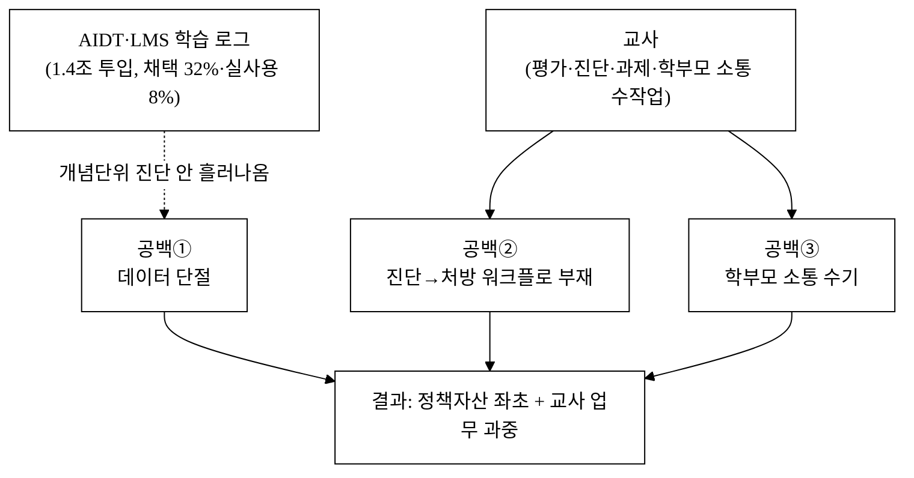

> 핵심은 점선(단절)이다. 학습 로그가 교과서 플랫폼 안에 갇혀 교사의 판단·행동으로 흐르지 못한다. 클래스렌즈는 이 단절선을 "진단→처방→소통" 단일 워크플로로 대체한다([그림 2]).

---

## 2. 솔루션 (Solution)

### 2.1 제품 개요

**클래스렌즈**는 교사가 입력·연동한 평가·과제 결과를 **취약개념 단위로 진단**하고, 진단 결과를 **맞춤 과제 추천 → 학부모 리포트**로 한 흐름에 연결하는 학교 단위 학습분석 SaaS다. AIDT·LMS 학습 로그를 인입(보완 레이어)하되, 교과서 콘텐츠와 경쟁하지 않고 **"교사가 판단·행동하는 분석 레이어"** 라는 비워진 공백을 점유한다.

### 2.2 핵심 모듈

| 모듈 | 기능 | AIDT·기존 도구 대비 차별 |
|:---|:---|:---|
| 성취 대시보드 | 학생·학급별 성취도, 성취 추세 차트, 위험학생 조기경보 | 콘텐츠 뷰어가 아닌 **교사 판단용 분석 뷰** |
| 취약개념 히트맵 | 단원·개념 단위 정오답 패턴 군집화, 학급 공통 약점 시각화 | 개념 단위 진단을 교사 워크플로로 노출 |
| 평가·과제 입력/연동 | 수기 입력 + AIDT·LMS 학습로그 mock 인입 | 데이터 단절(§1.3 공백①) 해소 |
| 맞춤 과제 추천 | 취약개념 기반 학생별 추천 과제 생성·배포 | 진단→처방 워크플로(§1.3 공백②) 완성 |
| 학부모 리포트 | 성취 추세·취약개념 자동 리포트 생성·알림 발송 | 수기 소통(§1.3 공백③) 자동화 |

### 2.3 차별점 세 가지

1. **단일 워크플로** — 평가 → 분석 → 피드백을 한 흐름으로 묶어, 진단이 교사 업무를 줄이는 도구가 되게 한다(분석이 추가 업무가 되는 기존 한계 역전).
2. **AIDT 보완 포지션** — 교과서를 대체하지 않고 그 학습 로그를 교사 워크플로로 끌어내, 좌초한 정책 자산(1.4조[^8])을 활용 가능한 자산으로 전환한다.
3. **학부모 레이어** — 사교육비 29.2조[^4]가 보여주는 학습성과 정보 수요를, 공교육 안에서 데이터 기반 자동 리포트로 충족한다.

> 위 세 가지는 핵심 메시지의 압축이며, 8개 축으로 분해한 **차별점 전수 도출(62개)은 [§5.8 표 5-8](#58-차별점-전수-도출--카테고리별-50)** 에서 *경쟁사 현황→우리 차별점→고객 가치*로 정리하고, 핵심 차별점이 실제 구매동인인지는 [§차별화 기술의 구매동인 논증](#차별화-기술의-구매동인-논증)에서 검증한다.

**[그림 2] 클래스렌즈 아키텍처 — 진단→처방→소통 단일 워크플로**

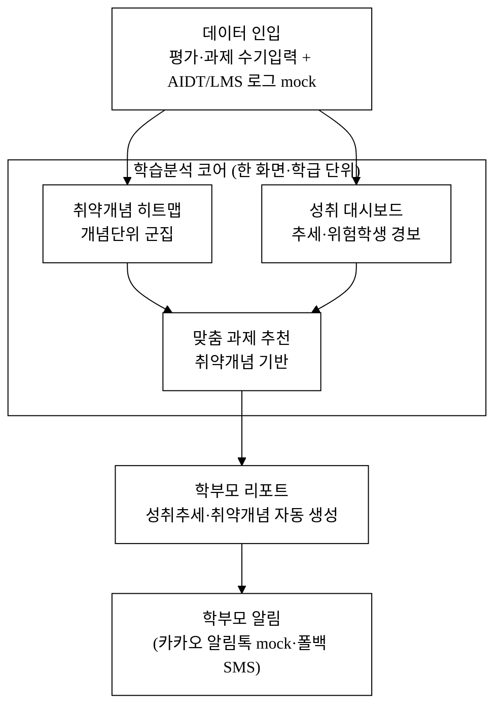

> [그림 1]의 단절선이 단일 흐름으로 대체된다. 평가 결과 1건 입력이 취약개념 진단→맞춤 과제→학부모 리포트까지 한 흐름으로 끝난다.

### 2.4 데이터 인입 방식 — *"엑셀에 한 번 더 옮겨 적는 추가 업무"가 되지 않는가*

> 이 제품의 생사는 **"평가 데이터가 어떻게 시스템에 들어오는가"** 에 달려 있다. 입력이 수기 타이핑이면 §1에서 비판한 "분석이 추가 업무가 되는 함정"에 자기 제품이 빠진다. 개념 단위 진단을 하려면 *문항별 정오답 + 문항-개념 매핑* 이라는 세밀한 데이터가 필요한데, 교사가 30명×25문항을 일일이 타이핑해야 한다면 가치는 음수다. 따라서 인입은 **수기 최소화**를 1차 설계 원칙으로 둔다.

| 인입 경로 | 화면 흐름 | 교사 부담(목표 `[추정]`) | 우선순위 |
|:---|:---|:---|:---|
| **CSV/엑셀 일괄 업로드** | NEIS 성적 export·교사 자작 엑셀(학생×문항 정오답 표) → 드래그 업로드 → 컬럼 자동 매핑 미리보기 → 확정 | 1개 학급 1개 평가 ≤ **3분** | **1급(주력)** |
| **OMR/스캔 채점 연동** | 객관식 답안지 스캔(모바일 카메라/복합기) → 자동 채점 → 문항별 정오답 자동 인입 | 채점 자동화로 수기 0 | **1급** |
| **문항별 빠른 입력 UI** | 학생 리스트 × 문항 그리드에서 O/X 클릭(키보드 단축키) — 소규모·서술형 | 25문항×30명 ≤ **10분** | 2급(폴백) |
| **AIDT/LMS 표준 export 인입** | 교사가 합법적으로 내보낼 수 있는 성적 CSV·표준 LRS(xAPI/Caliper) → 자동 인입 | 수기 0 (연동 시) | upside(§10.4) |

**문항-개념 매핑은 누가 만드는가(부담 최소화 핵심).**
- **표준 평가**: 사전 태깅된 **문항은행을 당사가 제공**(문항↔2022 개정 교육과정 성취기준 코드 사전 매핑). 교사 부담 0.
- **교사 자작 문항**: '성취기준 드롭다운 1클릭 태깅'(단원당 `[추정]` 5~10분) + **LLM 보조 자동 태깅**(교사 검증 게이트). 자동 제안을 교사가 승인/수정만 하면 됨.
- 이 매핑 부담은 **v1 파일럿에서 실측**해 "엑셀 대비 순절감"인지 정면 검증한다(목표: 동일 평가 처리 시간이 기존 엑셀 관리보다 짧을 것). 순증이면 제품 가치가 음수임을 보고하고 인입 UX를 재설계한다.

### 2.5 학부모 커뮤니케이션 안전장치 — *자동 생성 ≠ 자동 발송*

> 학부모 리포트 자동 발송은 현장에서 **최고 위험 기능**이다. "우리 아이가 취약하다"는 데이터가 그대로 가면 민원·교사 추궁·아동 낙인이 발생하고, 교사가 문구를 통제 못 하면 "책임만 지고 통제권 없는 도구"로 거부된다. 따라서 발송은 **셀링포인트가 아니라 통제 대상**으로 설계한다(리스크 등재 §9).

- **교사 검수·승인 게이트 필수**: 시스템은 리포트를 *생성*하되 **자동 발송하지 않는다**. 교사가 미리보기→문구 수정→승인을 거쳐야 발송된다.
- **낙인 회피 템플릿**: 부정 지표는 노출 방식을 교사가 선택(예: "취약 개념"이 아니라 "다음에 함께 볼 개념" 어조). 학급/학생 간 비교('전국 대비 우리 반' 등)는 **학부모 리포트에 기본 비노출**, 교사 내부 뷰에서만.
- **발송 단위·동의·옵트아웃**: §10.2 동의관리와 연결. 보호자가 발송 채널·빈도를 옵트아웃 가능.
- **자동화 의사결정 비대상화 고지**: 리포트에 "본 분석은 교사의 판단을 돕는 보조 자료이며 최종 평가가 아님"을 명시(§10.5 AI 신뢰성).

### 2.6 개인정보 보호 설계 — *학생 데이터를 다루는 제품의 전제*

본 제품은 **미성년 학생의 성취·학습 데이터**를 다루므로 개인정보 보호가 기능이 아니라 전제다. 가명처리(학생 식별자 분리)·동의 관리(보호자 동의 기록)·접근 권한(교사·관리자·학부모 역할 분기)을 제품에 내장한다(상세 §10.2). 학생 데이터는 국내 리전에 보관하며 국외 이전을 두지 않는다.

---

## 3. 시장 (Scale-up)

> 산정 원칙([`5_research/README.md`](./5_research/README.md) §3 준수): 입력 모수는 검증 출처에서 가져오고, 비율(비중·단가·침투율)은 가설이므로 `[추정]` 을 병기한다. 추정값과 공식값을 한 수치에 섞지 않는다. 공식 단일 통계가 없는 시장 규모는 **상향식(bottom-up)** 을 1차 근거로, 글로벌 학습분석 시장을 성장성 보조 근거로 삼는다.

### 3.1 입력값 (검증 출처)

| 변수 | 값 | 출처 |
|:---|:---|:---:|
| 초·중·고 교원 수 | 437,450명 | [^2] |
| 초·중·고 학교 수 | 11,871교 | [^3] |
| 초·중·고 학생 수 | 약 405만 명 | [^1] |
| 국내 이러닝 총매출(2023) | 5조 5,946억 원 | [^11] |
| AIDT 누적 정책예산(3년) | 약 1조 4,093억 원 [추정] | [^8] |
| AIDT 채택률 / 실사용률 | 32.3% / 8.1% [재확인 필요] | [^6][^9] |
| 글로벌 학습분석 시장(2030E) | 309.6억 USD, CAGR 23.3% | [^12] |
| 자사 적용단가(SAM·재무 기준) | 학교당 300만 원/년 또는 seat 6만 원/년 | 자사 가격표(§6.1) |

### 3.2 TAM / SAM / SOM 산정 (순수 상향식 재구성)

> **재구성 원칙(VC 실사 반영).** 종전 TAM은 (a) 이러닝 세그먼트 비중이 빈칸이고 (b) **AIDT 정책예산(1.4조)의 연환산을 합산**해 "일회성 정부 보조금을 반복 구독시장(TAM)으로 오인"하는 범주 오류가 있었다. 본 개정에서 **AIDT 정책예산을 반복 TAM에서 제거**하고(아래 *policy tailwind* 로 분리), TAM을 SAM과 같은 단가·모수 축의 **순수 bottom-up**(학교 + 교육청 + 학부모)으로 재구성해 산식을 일관시킨다.

| 구분 | 산정(bottom-up) | 값 | 근거·가정 |
|:---|:---|:---|:---|
| **TAM** | ① 학교 11,871교[^3] × 상한 단가 500만 원 + ② 교육청 17개 시·도 엔터 × 평균 10억 + ③ 학부모 B2C 부가매출(사교육비 29.2조[^4]의 0.1~0.3% 점유 가정) | **연 약 1,500억~2,500억 원** [추정] | 국내 초·중등 학습분석 SW의 이론적 최대 지출. 정책예산은 합산하지 않음 |
| **SAM** | 학교 11,871교[^3] × 학교당 연 300만 원, **또는** 교원 437,450명[^2] × seat 연 6만 원으로 교차검증 | **연 약 300억~500억 원** [추정] | 학교당 300만 원 ≈ 연 356억 / seat 6만 원 ≈ 연 263억 → 두 산식이 같은 자릿수로 수렴 |
| **SOM** | SAM 모수의 3년 누적 침투율 `[추정] 5~8%` (학교 600~950교 또는 교원 2.5만~4만 seat) | **연 약 15억~40억 원** [추정] | AIDT 채택률 32%·실사용 8%[^6][^9]가 보여주듯 교사 워크플로 적합 보완재의 침투 여지가 크다 |

> **Policy tailwind (반복 TAM 아님).** AIDT·디지털전환 정책예산(3년 1.4조[^8][추정/언론추산])은 *반복 구독시장이 아니라* 공교육 디지털 SW 도입을 가속하는 **수요 촉진 환경(tailwind)** 으로만 본다. 본 사업은 그 좌초한 예산의 ROI를 회복시키는 보완재이므로 이 예산을 TAM 분자로 더하지 않고, **도입 가속 요인**으로만 인용한다(서사 모순 제거).

> **두 산식 교차검증 — 분자/분모 정렬.** SAM은 학교 단위 라이선스(학교당 300만 원)와 교원 seat 단위(연 6만 원) 두 모형으로 산정했고, 356억 vs 263억으로 같은 자릿수에 수렴한다. 단, 학교당 평균 구독료·seat 단가는 공식 통계가 아닌 자사 가격 가설이므로 `[추정]`이며, 파일럿 실측으로 갱신한다. 두 단가를 한 수치에 혼용하지 않는다.

#### 3.2.1 단가 WTP(지불의사) 근거 — *무료 대체재가 있는데 왜 300만 원인가*

> 전 재무 모델의 뿌리인 '학교당 300만 원/년'·'seat 6만 원/년'이 자사 가격 가설일 뿐, 외부 검증이 없다는 지적을 정면 보강한다. 하이러닝(교육청 무료)·클래스팅(무료~프리미엄)이 존재하는 시장에서 유료를 정당화하는 근거는 **절감 시간의 화폐 환산(ROI)** 과 **무료 대체재가 못 주는 가치(발행사 중립 통합·개념 진단 깊이)** 두 축이다(정량 ROI는 §14.1).

| WTP 근거 | 내용 | 출처/단서 |
|:---|:---|:---|
| 학교 정보화·운영 예산 규모 | 학교당 학교운영비·정보화예산에서 연 300만 원(월 25만 원) 비중 검증 필요 | `[재확인 필요]` 공공데이터·교육비통계 SW 항목 (제출 전 §5_research 추가) |
| **조달 한도 적합성(검증)** | 학교 전자조달은 S2B(에듀파인 학교회계 연계)이며 **추정가격 2,000만 원 이하 소액은 수의계약** 가능[^19] → 학교당 300만 원/년은 이 소액 수의계약 한도에 **안착**(운영위 고가 심의·정식 입찰 회피). 단 공공 SaaS는 CSAP 등 보안인증이 전제[^20](§8 로드맵 정합) | **검증**[^19][^20] |
| 유사 교사용 SaaS 실 구독가 | 경쟁사 실제 단가·교육청 조달 낙찰가 벤치마크 | `[재확인 필요]` 나라장터 조달 낙찰 단가(개별 낙찰가는 미확보) |
| 절감 시간 화폐 환산 | 교사 N명 × 주당 절감시간 × 시급 → 연 절감액 vs 300만 원(§14.1 ROI) | `[추정]` 파일럿 실측 |
| 파일럿 가격 테스트 | 무상 파일럿 후 유상 전환 가격 A/B(150/250/300만) | `[추정]` §7 GTM |

> **단가 민감도(±30%).** 학교당 단가가 300만 → 210만(−30%)이면 SAM ≈ 249억, SOM ≈ 10.5억~28억으로 동반 하락한다. 반대로 +30%(390만)면 SAM ≈ 463억. 이 단가 가설이 전 모델의 단일 최대 리스크이므로 §6.4 가격 민감도·§6.5 P&L에서 재검증한다.

#### 3.2.2 Venture-scale 논증 — *Path to ₩100B+ 매출*

> **VC 핵심 의문**: 3년 SOM 천장이 연 15~40억 ARR이면 SaaS 멀티플 5~10배로도 기업가치 150~330억 수준 — "좋은 중소 SaaS"이지 펀드 리턴을 책임지는 벤처 베팅이 아니다. 따라서 학교 300만 모델과 **별개의 확장 벡터**로 ARR을 100억 이상으로 끌어올리는 경로를 정량 제시한다(모두 `[추정]`, Y4~7 전망).

| 확장 벡터 | 모델링 | 잠재 연 ARR `[추정]` | 트리거 |
|:---|:---|---:|:---|
| **① 교육청 엔터프라이즈** | 17개 시·도교육청 × 지역 통계·일괄 라이선스 단가 (지역당 5~15억) | 중기 30~150억 | 1개 교육청 일괄 도입 레퍼런스 |
| **② 학부모 B2C 독립 매출선** | 사교육비 29.2조[^4] 중 **0.1% 점유** 가정 = 연 292억 시장 → 그중 점유 | 중기 50~150억 | 학부모 리포트 유료 전환·프리미엄 진단 |
| **③ 인접 카테고리** | 고교학점제 평가·성취평가, 학원 B2B 진단(사교육 시장 진입) | 중기 30~100억 | v3 이후 제품 확장 |
| **④ 해외(K-에듀테크 수출[^15])** | 교육과정 매핑 엔진 현지화 | 장기 옵션 | 국내 검증 후 |

> **결론**: 학교 단위 SOM(15~40억)은 *진입 거점*이고, venture-scale은 **교육청 엔터(①) + 학부모 B2C(②)** 두 독립 매출선이 켜질 때 Y5~7에 **누적 ARR 100억+** 로 도달한다. 본 사업(협약기간)은 이 중 ①의 레퍼런스 1건 + ②의 유료 전환 PoC를 선행 검증하는 단계로 포지셔닝한다. 글로벌 학습분석 309억 USD[^12]는 이 확장 벡터의 카테고리 성장성 보조 근거다(국내 ARR 직접 전환 아님).

**[그림 3] 시장 구조 (TAM → SAM → SOM 깔때기)**

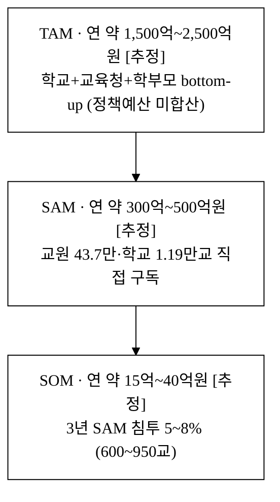

> **성장성 보조 근거.** 글로벌 학습분석 시장은 2024년 30.96억 → 2030년 309.6억 USD(CAGR 23.3%)[^12], LMS는 CAGR 17.1%[^13], LXP는 CAGR 33.8%[^14]로 카테고리 자체가 고성장이다. 이는 국내 SAM의 성장 배수를 뒷받침한다(글로벌 절대값을 국내 SAM에 직접 대입하지 않으며, 성장률 정황 근거로만 사용).

---

## 4. 경영혁신·창업학적 프레임워크

본 사업은 세 이론으로 정당화된다. (4.1) **Christensen 신시장 파괴**가 "왜 AIDT가 비운 자리에서 시작하는가"를, (4.2) **Kim·Mauborgne 블루오션 ERRC**가 "기존 경쟁축을 어떻게 재편하는가"를, (4.3) **Jobs To Be Done + 린 스타트업**이 "교사가 무엇을 고용하고 무엇을 측정하는가"를 설명한다.

### 4.1 Christensen 신시장 파괴 — *AIDT가 비운 자리에서 시작한다*

파괴적 혁신은 (a) 상위 시장이 과잉 충족되고 (b) 하위 시장이 비소비(non-consumption) 상태일 때 진입한다.

- **상위 과잉 충족**: AIDT 발행사 12사 76종[^5]은 정부 예산 1.4조[^8]를 투입해 풍부한 교과 콘텐츠를 제공한다. 그러나 채택률 32%·실사용률 8%[^6][^9]는 **콘텐츠 과잉이 교사 워크플로 부재로 좌초**했음을 보여준다.
- **하위 비소비**: 다수 교사는 학습분석 도구 없이 엑셀·수기로 진단·과제·학부모 소통을 버틴다. 이들은 "분석 도구의 비고객"이다.

클래스렌즈는 콘텐츠가 아니라 **교사 판단·행동을 돕는 분석 레이어**라는 신시장을 연다. AIDT와 경쟁(콘텐츠 정면 대결)하지 않고, 그 데이터를 끌어내 비소비 교사를 처음 분석 시장으로 끌어들이는 **신시장 파괴(new-market disruption)** 가 1차 공략면이다.

**왜 AIDT 발행사·LMS가 즉시 따라오지 못하는가 (해자의 정합성).** (a) **콘텐츠 기업의 DNA** — 발행사는 교과 콘텐츠 제작에 최적화돼 있어, 학급 단위 진단·교사 워크플로·학부모 소통은 제품 철학이 다르다. (b) **중립성** — 클래스렌즈는 특정 발행사 콘텐츠에 종속되지 않는 **발행사 중립 분석 레이어**라, 단일 발행사가 자사 콘텐츠 외 데이터를 통합 진단할 유인·정당성이 약하다. (c) **워크플로 깊이** — 채택률·실사용 데이터가 증명하듯, 교사 워크플로 적합성은 콘텐츠 양의 문제가 아니라 현장 설계의 문제다. 이 셋이 발행사가 즉시 대응하기 어려운 해자를 형성한다.

**[그림 4-a] 학습데이터 활용 단계 — 단계별 도달 수준 비교**

> 도구별로 "콘텐츠 제공 → 데이터 수집 → 개념진단 → 처방(과제) → 학부모소통"의 5단계 중 도달 단계를 동일 척도(0~5)로 비교한다.

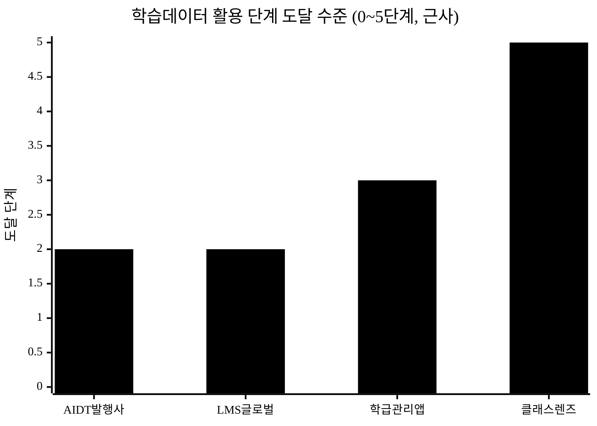

> 막대 = 5단계 중 도달 수준(근사 `[추정]·정성 비교`): AIDT발행사 2(콘텐츠+수집), LMS 2(수집 중심), 학급관리앱 3(수집+일부 진단), 클래스렌즈 5(진단+처방+학부모소통). AIDT·LMS는 "데이터 수집"에 멈추고, 클래스렌즈만 처방·소통까지 도달한다. **막대·좌표는 정성 근사이며, 객관적·측정 가능한 비교는 §5.1.1 표로 갈음한다.**

**[그림 4-b] 전략 포지셔닝 — 교과 깊이 축 × 교사 워크플로 적합도 축**

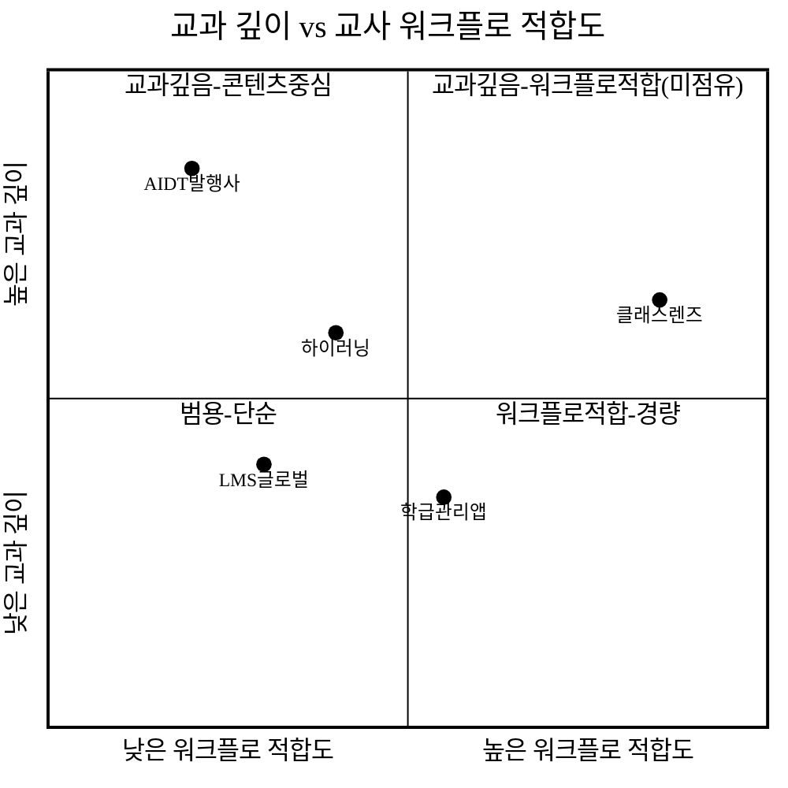

> AIDT는 교과는 깊으나 워크플로 적합도가 낮고(좌상), 학급관리앱은 워크플로는 경량이나 교과 깊이가 약하다(우하). 클래스렌즈는 **교과 진단 깊이 + 교사 워크플로 적합도** 우상단 빈 영역을 점유한다.

### 4.2 블루오션 ERRC — *경쟁축의 재편*

| 액션 | 요소 | 내용 |
|:---|:---|:---|
| **Eliminate** | 발행사 종속 / 콘텐츠 뷰어 경쟁 | 발행사 중립 분석 레이어로, 콘텐츠 정면 경쟁을 제거 |
| **Reduce** | 교사 채점·진단·소통 수작업 부담 | 입력 1회로 진단·과제·리포트 자동화 |
| **Raise** | 개념 단위 진단 깊이 / 워크플로 적합도 | 채택률 32%·실사용 8%[^6][^9]가 못 한 현장 적합 |
| **Create** | 진단→처방→학부모소통 단일 워크플로 / 학부모 데이터 레이어 | 신규 가치 곡선 창출 |

ERRC의 결론은 **"콘텐츠 양(AIDT) vs 학급관리 경량성(앱)"이라는 기존 경쟁축을 벗어나, '교과 진단 깊이 + 교사 워크플로 적합 + 학부모 소통'이라는 새 가치 곡선([그림 4-b] 우상단)을 만든다"** 는 것이다.

### 4.3 JTBD + 린 스타트업 — *교사가 무엇을 고용하고 무엇을 측정하는가*

교사가 고용하는 Job은 *"우리 반 누가 어디서 막히는지 빠르게 파악하고, 다음 수업·과제·학부모 안내로 바로 연결"* 이다. 측정 단위는 **진단→행동 도달 시간**과 **학생 성취 변화**다. 도구가 진단에서 멈추면 Job이 미완이고, 교사 업무만 늘어난다. 클래스렌즈는 진단→처방→소통을 한 흐름으로 묶어 Job 완료 속도를 높인다.

이를 **린 스타트업 Build-Measure-Learn**으로 검증한다. MVP(평가→분석→피드백 워크플로)를 먼저 출시하고 아래 가설을 측정한다.

| 가설 | 측정 지표 | 검증 방법 |
|:---|:---|:---|
| 교사는 진단→처방 단일 워크플로에 시간을 절약한다 | 진단·과제·소통 처리 시간(주) | 파일럿 학급 도입 전후 비교 |
| 위험학생 조기경보가 성취 하락을 예방한다 | 경보 후 성취 회복률 | 파일럿 학급 추적 |
| 학부모 리포트가 알림장보다 열린다 | 리포트 열람·응답률 | 채널별 A/B |

---

## 5. 경쟁 분석 (Competitive Landscape)

### 5.1 심화 경쟁 매트릭스

| 항목 | 클래스팅 | 아이스크림에듀 | 하이러닝(교육청) | AIDT발행사 | LMS/LXP 글로벌 | **클래스렌즈 (당사)** |
|:---|:---:|:---:|:---:|:---:|:---:|:---:|
| 학급 단위 성취 대시보드 | ○ | △ | ○ | △ | ○ | **◎** |
| 개념 단위 취약점 진단 | ○ | △ | △ | ○(자사 한정) | ✕ | **◎** (군집·히트맵) |
| 진단→맞춤 과제 처방 | △ | ○ | △ | △ | ✕ | **◎** |
| 학부모 데이터 리포트 자동화 | △ | △ | ✕ | ✕ | ✕ | **◎** (알림톡 연계) |
| AIDT·LMS 데이터 보완 인입 | ✕ | ✕ | △ | — | △ | **◎** (발행사 중립) |
| 발행사 중립성 | ○ | ✕ | △ | ✕ | ○ | **◎** |
| 타깃 | 학급 커뮤니케이션[^16] | B2C 가정학습[^16] | 단일 교육청[^15] | 검정 교과서[^5] | 글로벌 표준[^12][^13] | **초·중등 교사·학교** |
| 단가(근사) | 무료~프리미엄 | B2C 구독 | 무료(교육청) | 정부 채널 | 견적·고가 | **학교 300만/년·seat 6만/년** |

> **위 ◎/○/△/✕는 자사 평가(`[자사 평가]`)이며**, 객관성을 위해 아래 §5.1.1에서 측정 가능한 기술 기준으로 재비교한다. 또한 의사결정자가 가장 중시하는 **교사 기존 침투/관성**을 매트릭스에 정면 반영한다.
>
> **각 `◎`가 왜 모방 어려운가(1줄).** 개념진단 ◎ — 기능은 카피 가능하나, 발행사 중립으로 다(多)발행사 데이터를 통합 진단하는 정당성·데이터 누적이 방어. 학부모리포트 ◎ — 채널(알림톡)은 누구나 붙이나, **단일 학습데이터와 결합된 자동 생성 워크플로**가 모방 난이도를 높임. 차별성은 "기능 보유"가 아니라 §5.3의 워크플로·데이터 락인이다.

#### 5.1.1 측정 가능한 기술 기준 재비교 (자의적 ◎ 대체)

> [그림 4-a]의 0~5 막대·[그림 4-b] 좌표가 근거 없는 자기평가라는 지적을 반영해, **객관 축**으로 비교를 재정의한다. 각 칸은 측정 가능한 기준이며, 우위는 파일럿 KPI(§10.3)로 입증한다.

| 객관 기준 | 클래스팅 | 하이러닝 | AIDT발행사 | **클래스렌즈** |
|:---|:---|:---|:---|:---|
| 진단 입도 | 단원·과목 단위(추정) | 단원 단위 | 자사 콘텐츠 단원 | **성취기준 코드 단위**([9수01-01] 등) |
| 멀티소스 통합(발행사 수) | 단일 채널 | 단일 교육청 | 자사 1종 | **발행사 중립 N종 정규화** |
| 처방 자동화(추천 알고리즘) | 부분 | 부분 | 부분 | **취약개념→과제 자동 매핑** |
| 학부모 자동 리포트(채널·자동생성) | 알림장 중심 | 미약 | 없음 | **알림톡 + 교사 검수 자동생성** |
| **교사 기존 침투/관성(불리 정직표기)** | **◎ 800만 회원·56만 학급**[^16] | ○ 교육청 무료 보급 | △ 채택 32%[^6] | **✕ 신규 진입(tool fatigue 부담)** |
| 가격 | 무료~프리미엄 | 무료(교육청) | 정부 채널 | 학교 300만/년 |

> **정직한 자가 진단**: 클래스렌즈는 **교사 기존 침투에서 절대 열세**(✕)다. 이미 깔린 무료 도구를 이기려면 "교사가 *또 하나의* 도구를 켤" 이유 — 즉 진단 입도·발행사 중립·자동 리포트의 **결과 가치**(§14.1 ROI)가 도구 추가 피로를 넘어야 한다. 클래스팅 등과의 관계는 '대체'가 아니라 **'평가·진단 레이어 보완'** 으로 포지셔닝하며, 교사 개인 무료 진입 후 학교 전환(§7)으로 침투 열세를 상쇄한다.

### 5.2 서술 — 경쟁 공백(Whitespace)

국내 지형은 **유형별 강자가 분산**돼 있다. 클래스팅은 학급 커뮤니케이션·교사 침투(800만 회원·56만 학급)[^16]가 강하나 AIDT 데이터 연동·교과 진단 깊이가 약하고, 아이스크림에듀는 B2C 가정학습 비중이 크다[^16]. 하이러닝은 교육청 주도 무료 보급으로 도입 장벽은 낮으나 단일 교육청에 종속돼 확장성·민간 부가가치가 제한된다[^15]. AIDT 발행사 76종[^5]은 교과 콘텐츠를 내장하나 교육자료로 격하·실사용 8%[^7][^9]로 교사 워크플로에 닿지 못했고, 글로벌 LMS/LXP는 한국 초·중등 교과·평가·학부모 소통 로컬라이즈가 부재하다.

결과적으로 클래스렌즈의 진입 공백은 명확하다 — **"발행사 중립 + 교과 진단 깊이 + 진단→처방→학부모소통 단일 워크플로"**. 이는 [그림 4-b]에서 어떤 경쟁사도 점유하지 못한 사분면이다.

### 5.3 지속가능 해자 3층 구조

| 층 | 해자 유형 | 모방 난이도 | 정량 목표 |
|:---|:---|:---|:---|
| 1층 (기능) | 진단·히트맵·과제추천·리포트 | **낮음** — 6~12개월 카피 가능 | 워크플로 선점(학기 단위 리드) |
| 2층 (전환비용) | 학급별 누적 성취 이력·취약개념 추세·과제 이력 | **중간** — 이전 시 데이터 재구축·교사 재학습 부담 | 학교 재계약률 ≥ 80% / 연 churn ≤ 20% `[추정]` |
| 3층 (네트워크·데이터) | 교과·학년별 취약개념 벤치마크 + 발행사 중립 멀티소스 데이터셋 | **높음** — 임계점 넘으면 cold-start 장벽이 경쟁사에 발생 | 학교 N교 × 학기 데이터 임계점(§7 KPI) |

**(1) 전환비용 정량화 — 데이터가 아니라 워크플로 내재화로 재정의.** 학교 평가 데이터는 본질적으로 CSV로 export·import 가능하므로 **데이터 자체는 락인이 약하다**(경쟁사가 1-click 마이그레이션을 내놓으면 급락). 따라서 전환비용의 무게중심을 **export로 옮길 수 없는 요소** — ① 교사의 워크플로 학습·습관 내재화, ② 학부모 알림 채널의 연속성(끊으면 학부모 혼란), ③ **자사 독자 벤치마크 비교값(전국 대비 우리 반)은 경쟁사로 이전 불가** — 로 이동한다. 데이터는 반환 가능하게(컴플라이언스 §10.2) 두되, 가치는 누적 UX·비교 인사이트에 둔다. 재계약률 ≥ 80%·연 churn ≤ 20%로 관리하되, 이 수치는 `[추정]`이며 국내외 B2G EdTech SaaS 공개치(§6.4 각주)·파일럿 실측으로 보정한다.

**(2) 데이터 플라이휠 — 임계점 정량화.** 학교·학기가 늘수록 교과·학년별 취약개념 벤치마크가 축적되고, 이를 "전국 대비 우리 반 약점" 같은 비교 리포트로 환류한다. **임계점**은 다음으로 정의한다:

> **데이터 플라이휠 임계점 `[추정]`**: 한 (교과 × 학년)에서 취약개념 벤치마크가 통계적으로 유의해지려면 **최소 ≈ 100교 × 30학급 × 2학기 누적**(개념별 표본 수천 응답)이 필요하다 → 이때 경쟁사가 "전국 대비 비교값"을 못 주는 **cold-start 장벽**이 발생한다. 기준 시나리오(§6.3) 도입 곡선상 **Y2 말~Y3 초(약 8~10분기)** 에 핵심 교과(국·영·수)부터 임계점 도달을 목표로 한다.

**(3) 카피 윈도우 vs 락인 도달 — 핵심 명제의 정직한 검증.** 1층(기능)은 본문이 **6~12개월 카피 가능**으로 자인했다. 반면 3층 임계점 도달은 Y2 말~Y3 초(약 8~10분기 ≈ 24~30개월). 즉 **카피 윈도우(6~12개월) < 락인 도달(24~30개월)** 로, 산술적으로 경쟁사가 먼저 기능을 카피할 수 있는 **무방비 구간(valley of death) 약 1~2년**이 존재한다. 이 구간을 부정하지 않고 §5.4에서 정면 방어한다.

**(4) 클래스팅 비대칭 정직 분석.** 클래스팅은 800만 회원·56만 학급에 "AI 취약점 분석 보유"[^16]로, **이미 분석 기능 + 압도적 교사 침투 + 무료 채널**을 동시에 가졌다 — 카피 비용이 낮고 유통 우위가 크다. 본 제품이 "먼저 락인에 닿는" 근거는 **클래스팅이 구조적으로 즉시 못 따라오는 두 축**이다: ① **발행사 중립 멀티소스** — 클래스팅은 학급 커뮤니케이션 DNA라 다발행사 평가 데이터 통합 정규화(성취기준 코드 축)가 제품 철학상 후순위, ② **성취기준 코드 단위 진단 입도** — 단원 단위 분석을 코드 단위로 재설계하려면 교육과정 매핑 자산 구축이 별도 필요. 단, 이 우위는 **한시적**(§5.5)이므로 그 사이 채널 선점(§5.4)으로 시간을 번다.

**[그림 4-c] 경쟁사 대응 시나리오 매트릭스**

| 시나리오 | 위협 | 예상 대응시점 `[추정]`(근거) | 자사 방어수단 | 정량 영향 `[추정]` |
|:---|:---|:---:|:---|:---|
| ① 클래스팅 진단 강화 | 교사 침투 기반에 진단 모듈 추가 | **3~6개월(worst)** — 기존 분석 기능 보유로 리드타임 짧음 / 6~12개월(기준) | 발행사 중립 멀티소스·성취기준 코드 입도·채널 선점 | **신규획득 CAC 상승**(클래스팅 무료 번들 시 직판 CAC ↑), 기존 학교 churn은 워크플로 락인으로 제한 |
| ② 발행사 자체 분석 확장 | 자사 콘텐츠 데이터에 진단 부가 | 12~18개월 — 콘텐츠 DNA·조직 전환 필요 | 발행사 종속 한계 — 타 발행사·수기평가 통합 불가, 중립성 차별 | 제한적 |
| ③ 교육청 플랫폼(하이러닝류) 확장 | 무료 보급으로 진입 장벽 | 6~12개월 | 단일 교육청 종속·민간 부가가치 우위 | 가격 압박, 타 지역 확장으로 분산 |
| ③' **KERIS·다교육청 공동 구축** | 17개 시·도가 KERIS 표준 위 무료 자체 구축 → **채널 상실 + 전국 무료 경쟁재** 이중 타격 | 12~24개월(정책 의존) | **납품 파트너 전환**(혁신조달·나라장터) — 정부가 못 하는 빠른 반복·민간 UX·발행사 중립 통합·상용 알림톡으로 차별 | 채널 가설(§7) 동시 붕괴 위험 → §5.7 헤지 |
| ④ 글로벌 LMS 현지화 | 자본·브랜드로 한국 교과 대응 | 18~24개월 | 한국 교육과정·평가·학부모 관행(알림톡) 누적 우위 | 제한적 |

> **대응시점 근거.** 위 추정은 경쟁사의 *기존 기능 보유 정도·개발 리드타임·조직 DNA*로 산정했다. **worst-case는 클래스팅(이미 분석 보유) = 3~6개월**이며, 이 경우에도 §5.4 채널 선점·§5.5 코드 입도 차별로 방어 가능한지가 핵심 검증선이다.

### 5.4 해자 도달 전 무방비 구간(Valley of Death) 방어

> §5.3 (3)이 인정한 **카피 윈도우(6~12개월) < 락인 임계점(24~30개월)** 의 1~2년 무방비 구간을, 데이터 해자가 아닌 **선점·제도 편입**으로 버틴다.

| 방어 수단 | 메커니즘 | 정량 목표 `[추정]` |
|:---|:---|:---|
| **학기 게이트 선점** | 학교는 학기·예산 주기로만 움직여 1년 1~2회 도입 창만 열림 → 먼저 들어간 학교는 차기 게이트까지 경쟁사 진입 차단 | 신학기(3·9월) 게이트당 파일럿 N교 선점 |
| **교육청 단독 공급 lock** | 연구학교·교육청 PoC를 **독점 제휴**로 묶어 동일 채널 경쟁사 진입 봉쇄 | 독점 채널 비중 ≥ 50% |
| **제도 편입(조달 등록)** | 나라장터·에듀테크 통합플랫폼·혁신조달 등록으로 "검증된 공급자" 지위 선점 | v3 내 조달 등록 1건 |
| **fallback** | 경쟁사가 더 빠른 채널로 같은 데이터를 모으면 → 전략적 제휴/인수 경로(§6.6 Exit)로 전환 | — |

### 5.5 발행사 중립의 지속성 — *영구 우위가 아니라 한시적 우위*

> "발행사 중립"은 **발행사 데이터가 폐쇄적일 때만** 희소가치를 갖는다. 시장이 커져 발행사 컨소시엄·정부 표준이 상호 데이터를 개방하면 "누구나 중립 통합 가능"해져 희소성이 소멸한다. 이 조건부성을 정직하게 명시한다.

- **유효 전제**: 발행사 데이터 폐쇄성 + 표준 미정립.
- **전제가 깨질 조건**: 교육부 표준 데이터 규격 강제 / 발행사 상호개방.
- **우위 무게중심 이동**: 표준화가 진행돼도 남는 진짜 차별은 *중립 통합 위에 쌓은* **① 성취기준 코드 진단 알고리즘, ② 누적 벤치마크 데이터셋, ③ 교사 워크플로 내재화** 다. 중립성은 데이터 확보 윈도우(임계 데이터 선점 기간)를 버는 **시간 자산**으로 활용하고, 그 사이 ①~③로 영속 우위를 이전한다(KPI: 임계 데이터 확보 속도, §10.3).

### 5.6 무료 경쟁재 대응 — 가격 정당화·하한선·수익 이동

> 핵심 경쟁 채널(하이러닝)이 **무료**인데 학교당 300만 원을 받는 구조의 가격경쟁 생존력을 정면 검증한다.

- **무료 대비 유료 정당화**: 절감 교사 업무시간을 인건비로 환산한 ROI(§14.1)가 300만 원을 초과함을 보인다. 무료 도구가 못 주는 *발행사 중립 통합·성취기준 코드 진단·자동 리포트* 의 결과 가치로 차별.
- **가격 민감도(price-sensitivity)**: 학교당 단가가 300만 → 150만 → 100만으로 압박될 때 LTV/CAC·BEP가 깨지는 지점을 §6.4·§6.5에서 표로 검증.
- **가격 하한선·수익 이동**: 단가 인하 시 비구독 매출(알림톡 종량·심화 리포트, §6.2)로 수익을 이동. 무료 경쟁 격화 시 **교사 개인 freemium → 학교 전환** 으로 진입 마찰을 0에 가깝게.

### 5.7 자본 비대칭 정면 대응

> 아이스크림에듀(상장사)·매스프레소(누적투자 1,200억[^16])·글로벌 LMS의 자본·브랜드 비대칭을, SOM 15~40억 규모 사업자가 어떻게 견디는가.

- **틈새 보호 논리(정량)**: SOM(15~40억)은 대형 경쟁사 매출 대비 **수% 미만**이라 우선순위에서 밀린다 — 적자 감수 선점전을 걸 유인이 약한 *작은 틈새*. 이 보호막이 임계점 도달까지 시간을 준다.
- **경쟁축 이동**: 자본 소모전이 아니라 **채널 독점·제도 편입(정부 표준·조달 등록)** 으로 경쟁축을 자본에서 제도로 옮긴다(§5.4).
- **Exit 옵션**: 자본전이 격화되면 단독 생존 대신 전략적 제휴/인수(클래스팅·교육청·발행사 파트너십, §6.6)를 출구로 둔다.

### 5.8 차별점 전수 도출 — 카테고리별 50+

> §2.3의 "차별점 세 가지"는 핵심 메시지를 압축한 것이고, §5.1~5.7은 그 방어가능성을 논증했다. 본 절은 이를 **8개 축(기술·데이터·교육효과·운영/워크플로·규제/개인정보·가격·GTM·UX)으로 분해해 차별점을 전수 도출**한다(총 **62개**). 각 행은 *경쟁사 현황 → 우리(클래스렌즈) 차별점 → 고객 가치*로 구성한다. 핵심 행(★)은 §5.8 뒤 [구매동인 논증](#차별화-기술의-구매동인-논증)에서 *실제 구매동인인지* 다시 검증한다. **억지·중복 항목으로 50을 채우지 않으며**, 자체 추정 가치는 `[추정]`으로 표기하고 검증 외부 수치([^4][^6][^9][^17][^18])와 섞지 않는다(§데이터 정직성).

**표 5-8.** 차별점 전수 도출 (62개, 8축)

| # | 축 | 경쟁사 현황 | 우리 차별점 | 고객 가치 |
|:---:|:---|:---|:---|:---|
| 1 | 기술 ★ | 단원·과목 단위 분석(추정) | 성취기준 코드 단위([9수01-01]) 진단 입도 | "어느 성취기준에서 막혔나"를 학부모·관리자에게 코드로 설명 |
| 2 | 기술 ★ | 단일 발행사/채널 데이터 | 발행사 중립 멀티소스 정규화(N종 스키마 통합) | 학교가 어떤 교과서·도구를 써도 한 화면에서 진단 |
| 3 | 기술 | 룰 기반 단순 집계 | 능선회귀(L2 닫힌해) 학기말 성취 예측 + 신뢰구간 | 위험학생을 사전 식별, 사후 대응 → 사전 개입 전환 `[추정]` |
| 4 | 기술 | 위험 표시 없음/이진 플래그 | 로지스틱 위험확률 + 특성 기여도 분해 | "왜 위험한가"를 근거로 제시(설명가능성) |
| 5 | 기술 | 취약점 나열만 | 선수개념 그래프 역추적(prereqClosure) | 막힌 개념의 *근본 선수개념*까지 처방 경로 생성 |
| 6 | 기술 | 군집화 미제공 | k-means 학급 약점 군집·히트맵 | 학급 공통 약점을 한눈에, 일괄 보충 설계 |
| 7 | 기술 | 단일 학급 뷰 | 교육청>학교>학급 다계층 롤업 집계 | 교육청이 관할 전체를 한 대시보드로 모니터 |
| 8 | 기술 | 외부 서버 의존 | 단일 HTML·오프라인 결정적 계산 | 망분리·저사양 학교 환경에서도 구동 |
| 9 | 기술 | 계열 색으로만 구분 | 결정적 시드·재현 가능한 계산 결과 | 같은 입력→같은 진단(감사·재현 가능) |
| 10 | 기술 | 단방향 리포트 | 진단→처방→소통 양방향 상태 머신 | 처방 결과가 다음 진단에 환류 |
| 11 | 데이터 ★ | 데이터 단절(교과서 내부에 갇힘) | AIDT·LMS·CSV 3소스 인입→정규화 | 좌초 학습데이터(채택 32%·실사용 8%[^6][^9]) 교사 워크플로로 인출 |
| 12 | 데이터 ★ | 전국 비교값 없음 | 교과×학년 취약개념 벤치마크 데이터셋 | "전국 대비 우리 반" 비교 인사이트(경쟁사 이전 불가) |
| 13 | 데이터 | 데이터 표준 없음 | 2022 개정 성취기준 코드를 통합 축으로 | 교과서·평가가 달라도 동일 좌표로 누적 |
| 14 | 데이터 | CSV 수출 불가/락인 | CSV 입출력 양방향(반환 가능) | 데이터 주권 보장(컴플라이언스), 진입 마찰↓ |
| 15 | 데이터 | 단발 스냅샷 | 학급별 누적 성취 이력·추세 | 학기·학년을 가로지르는 성장 추적 |
| 16 | 데이터 | 개념-문항 매핑 없음 | 문항↔개념 온톨로지 매핑 자산 | 문항 정오답을 개념 약점으로 자동 환산 |
| 17 | 데이터 | 단일 교과 | 다교과(국·영·수) 동시 진단 구조 | 한 교사가 담당 전 과목을 한 시스템에서 |
| 18 | 데이터 | 데이터 플라이휠 부재 | 학교·학기↑ → 벤치마크 정밀↑ 순환 | 늦게 온 경쟁사에 cold-start 장벽 |
| 19 | 교육효과 ★ | 분석이 추가 업무가 됨 | 진단이 *업무를 줄이는* 도구로 설계 | 교사 주당 절감 ≥ 2시간(§14.1) `[추정]`, 도입효과 사례[^18] |
| 20 | 교육효과 | 사후 성적 통보 | 위험학생 조기경보 | 학기 중 개입으로 성취 회복 목표 ≥ 30% `[추정]` |
| 21 | 교육효과 | 일괄 동일 과제 | 취약개념 기반 학생별 맞춤 과제 추천 | 개인 격차 맞춤 보충(학습격차 완화) |
| 22 | 교육효과 | 개념 이해도 불가시 | 개념 단위 정오답 패턴 히트맵 | 오개념 위치를 교사가 즉시 시각 확인 |
| 23 | 교육효과 | 형평성 지표 없음 | 지니계수·로렌츠·사분위 격차 분석 | 학급 내 학습격차를 정량 모니터 |
| 24 | 교육효과 | 학부모는 점수만 받음 | 성취추세·취약개념 서술형 자동 리포트 | 가정 보충 연계(공교육 내 정보 제공) |
| 25 | 교육효과 | 개입 효과 미측정 | 경보→개입→회복률 추적 루프 | 개입의 효과를 데이터로 검증 |
| 26 | 운영/워크플로 ★ | 진단·과제·소통이 분리된 3개 도구 | 단일 워크플로 4단계(진단→처방→배포→추적) | 도구 전환 비용 제거, 야근 감소 `[추정]` |
| 27 | 운영/워크플로 | 엑셀 수기 관리 | 평가 수기입력 + 로그 인입 일원화 | 1학급 1평가 입력시간 단축(파일럿 검증, §16) |
| 28 | 운영/워크플로 | 교사 고립(공유 없음) | 공동 루브릭 작성·공유·채택(복제) 확산 | 우수 평가틀이 학교/학급 간 전파 |
| 29 | 운영/워크플로 | 학급 간 단절 | 학급 간 평가·기준 공유 | 동학년 협업·일관 평가 |
| 30 | 운영/워크플로 | 상담 일정 수기 조율 | 상담 예약 슬롯·예약 관리 | 학부모 상담 노쇼·중복 감소 |
| 31 | 운영/워크플로 | 발송 이력 추적 불가 | 캠페인 발송 통계·세그먼트 타겟팅 | 누구에게 무엇을 보냈는지 감사 |
| 32 | 운영/워크플로 | 역할 구분 없는 단일 화면 | 4역할(교육청·학교·교사·학부모) 화면 분기 | 각자 권한·업무에 맞는 화면만 노출 |
| 33 | 운영/워크플로 | 새로고침 시 작업 소실 | localStorage 상태 지속·필드 마이그레이션 | 작업 중단·재개 자유 |
| 34 | 규제/개인정보 ★ | 상위 관리자가 개별 식별정보 열람 | 상위 계층은 집계·가명(pseudoId)만 | 개인정보 최소수집·과다열람 차단 |
| 35 | 규제/개인정보 ★ | 동의·철회 관리 부재 | 동의 일괄 철회→발송/분석 자동 제외 | 정보주체 권리 보장(개인정보보호법 정합) |
| 36 | 규제/개인정보 | 보존기간 미관리 | 보존정책 만료 자동 파기 | 데이터 최소보유 원칙 준수 |
| 37 | 규제/개인정보 | 접근 이력 없음 | 민감정보 접근 감사 로그 자동 기록 | 유출 사고 시 추적·책임 규명 |
| 38 | 규제/개인정보 | 권한 경계 모호 | RBAC 권한 경계 위반 시 차단 | 학급 외 데이터 무단 접근 봉쇄 |
| 39 | 규제/개인정보 | 데이터 락인 | 데이터 반환·CSV 수출 보장 | 학교 데이터 주권(전환비용 윤리적 처리) |
| 40 | 규제/개인정보 | 보안인증 미고려 | CSAP·S2B 조달요건 설계 반영[^19][^20] | 공공조달 적격성 사전 확보 |
| 41 | 가격 ★ | 무료(교육청)~고가 견적 양극 | 학교 300만/년·seat 6만/년 명확 단가 | 소액 수의계약 한도(2천만↓[^19]) 안착, 심의 회피 |
| 42 | 가격 | 단일 과금 | 학교 구독 + 알림톡 종량 + 심화 리포트 다층 | 가격 압박 시 수익 이동 여력 |
| 43 | 가격 | 진입 즉시 유료 | 교사 개인 freemium→학교 전환 | 진입 마찰 0에 근접, 바텀업 도입 |
| 44 | 가격 | ROI 불투명 | 절감시간 인건비 환산 ROI 제시(§14.1) | 무료 대비 추가지불 정당화(ROI 16배 `[추정]`) |
| 45 | 가격 | 학부모 무과금 | 학부모 B2C 유료 전환·프리미엄 진단 | 사교육비 29.2조[^4] 수요의 독립 매출선 |
| 46 | 가격 | 가격 민감도 미대응 | 단가 인하 시 BEP 시나리오 사전 설계(§6.5) | 무료 경쟁 격화에도 생존 |
| 47 | GTM ★ | 영업 채널 단일 | 교사 개인→학교→교육청 3단 확산 경로 | 의사결정 단위별 맞춤 진입 |
| 48 | GTM | 상시 영업 가정 | 학기 게이트(3·9월) 선점 전략 | 도입 창 선점으로 경쟁사 차단 |
| 49 | GTM | 레퍼런스 부재 | 연구학교·교육청 PoC 독점 제휴 | "검증된 공급자" 레퍼런스 확보 |
| 50 | GTM | 조달 미등록 | 나라장터·에듀테크 통합플랫폼 등록 추진 | 공공 구매 채널 진입 |
| 51 | GTM | 정책 무연계 | 디지털전환·에듀테크 진흥[^15] 정책 정렬 | 정책 tailwind에 올라타 도입 가속 |
| 52 | GTM | 단일 시장 | 교육과정 매핑 엔진 현지화→해외(K-에듀테크[^15]) | 국내 검증 후 수출 옵션 |
| 53 | GTM | 학부모 미접점 | 학부모 앱·캠페인으로 가정 접점 | B2C 바이럴·구전 채널 확보 |
| 54 | UX ★ | 콘텐츠 뷰어 중심 | 교사 판단용 분석 뷰(액션 지향) | 의사결정에 바로 쓰는 화면 |
| 55 | UX | PC 전용/모바일 미흡 | PC·모바일 반응형(학부모 모바일 셸) | 교사·학부모 단말 무관 접근 |
| 56 | UX | 정적 표 나열 | 차트·히트맵·로렌츠 시각화 | 데이터를 직관으로 해석 |
| 57 | UX | 다단계 메뉴 미로 | 단일 흐름 워크플로 뷰 | 진단→처방을 끊김 없이 이동 |
| 58 | UX | 역할 전환 불가 | 스코프 피커·역할 전환 즉시 | 한 계정에서 권한별 시연·운영 |
| 59 | UX | 학부모 정보 난해 | 학부모용 서술형·쉬운 언어 리포트 | 비전문가 학부모도 이해 |
| 60 | UX | 알림 채널 분산 | 알림톡 + 폴백 SMS 통합 발송 | 미수신 최소화(연속성) |
| 61 | UX | 로그인 장벽 | 로그인 불요·역할 셀렉터 자동 통과 | 시연·체험 마찰 제거(§3.4) |
| 62 | UX | 빈 화면 시작 | 교육청·학교·학급·학생 시드 자동 주입 | 첫 진입 즉시 가치 체험(time-to-value↓) |

> **부풀리기 점검.** 위 62개 중 ★ 12개가 핵심 구매동인 후보이며, 나머지는 이를 뒷받침하는 보조·운영 차별점이다. 1·2·11·12·34·35행처럼 **export·정책상 경쟁사가 즉시 못 따라오는** 항목이 방어가능성의 무게중심(§5.3 해자)이고, 9·33·61·62처럼 가벼운 항목은 *구매동인 약함*을 정직히 인정하고 ★에서 제외했다. 표 5-8 전체가 "기능 보유"의 나열이 아니라 §5.3 워크플로·데이터 락인으로 수렴함을 강조한다(나열≠해자).

---

## 차별화 기술의 구매동인 논증

> §5는 "무엇이 다른가"(발행사 중립·성취기준 코드 진단·단일 워크플로)를 나열했다. 그러나 **나열만으로는 결재가 떨어지지 않는다.** 이 절은 그 차별점이 *교사가 실제로 돈을 내거나 매일 켜는 동기*를 얼마나 크게 움직이는지를 ①must/nice 분류 → ②가치 정량화(전환마찰 대비) → ③외부 근거 → ④반증의 4단계로 논증한다. CLAUDE.md §2.1 요건 충족. 결론을 미리 말하면: 본 차별점은 **평상시 nice, 평가시즌·민원 국면에서 must로 전환되는 "조건부 must"** 이며, 이 조건부성을 정직하게 다룬다.

### ① 구매동인 가설 — must인가 nice인가 (조건부 must)

차별점이 건드리는 교사의 핵심 Job(§4.3 JTBD)은 *"우리 반 누가 어디서 막히는지 빠르게 파악 → 다음 수업·과제·학부모 안내로 바로 연결"* 이다. 본 차별점이 이 Job에서 **must인지 nice인지는 시기·상황에 따라 갈린다**.

| 차별점 | 평상시 | 트리거 국면(평가시즌·학부모 민원) | 판정 |
|:---|:---|:---|:---|
| **발행사 중립 성취기준-코드 진단** | nice — 단원 단위 무료 분석으로 "충분히 좋다"고 느낌 | **must** — 학기말·지필평가 후 "누가 어느 성취기준에서 막혔나"를 학부모·관리자에게 설명·근거 제시해야 함. 단원 단위로는 코드 단위 추궁에 답 못 함 | **조건부 must** |
| **진단→처방→소통 단일 워크플로** | nice — 진단·과제·알림을 따로 처리해도 평소엔 굴러감 | **must** — 민원·상담 폭주 시 "진단 근거 + 처방 + 학부모 통지"를 한 흐름으로 즉시 못 내면 교사 개인이 야근으로 메움 | **조건부 must** |

**왜 "조건부 must"가 결재로 이어지는가.** 학교 SW 구매 결재(교장·운영위)는 *상시 편의*보다 **반복되는 고통 국면의 제거**로 정당화된다. 평가시즌(학기당 2~4회)과 상시화된 학부모 민원은 교사 집단이 매년 겪는 **예측 가능한 고통**이고[^17], 이 국면에서 본 차별점은 "있으면 좋은" 수준이 아니라 "없으면 교사 개인이 시간으로 때우는" must로 전환된다. 평상시 nice라는 약점을 숨기지 않고, **must로 전환되는 트리거를 GTM 캘린더(학기 게이트·§7.2)·KPI(활성률 §7.1)에 맞춰** 구매 동인을 극대화한다.

### ② 가치 정량화 — 전환마찰(무료 도구) 대비 10배 규칙 판정

차별점이 만드는 가치를 **교사 언어의 수치**로 환산한다. §14.1 ROI 손익(학교 연 절감액 약 4,800만 원, 구독료 300만 원 대비 **ROI ≈ 16배**)과 교사 1인당 **주 2시간 절감**(§14.0·§14.1)을 이 절로 끌어온다(모두 `[추정]`).

| 환산 축 | 값 `[추정]` | 전환마찰과의 비교 |
|:---|:---|:---|
| 교사 1인 절감 | **주 −2시간**(채점·진단·소통 자동화 40% 절감) | 무료 도구 대비 *추가로* 켜는 마찰(연수 1~2시간·명단 시드 §7.2)을 **수 주 내 회수** |
| 학교 연 절감액 ÷ 구독료 | 4,800만 원 ÷ 300만 원 = **약 16배** | 전환비용을 넘는 가치 배수가 **"10배 규칙"의 16배로 통과** `[추정]` |
| 절감 시간의 화폐 환산 | 2h × 40주 × 3만 원 × 20명 = **약 4,800만 원/교** | 무료 도구는 이 절감을 못 줌(개념 진단 입도·발행사 중립 통합 부재) |

> **10배 규칙 판정.** 신제품이 기존 대안(여기선 *무료 도구 + 교사 개인 시간*)을 이기려면 전환마찰을 넘는 **약 10배의 가치 격차**가 필요하다는 경험칙에 비추면, ROI 16배 `[추정]`는 산술적으로 이 문턱을 넘는다. **단, 이 16배는 ①절감률 40%·②시급 3만 원·③활용교사 20명 가정에 전적으로 의존**한다(§14.1). 어느 하나가 절반이면 8배로 떨어지므로, 이 절의 결론은 "16배 확정"이 아니라 **"문턱을 넘을 여지가 크고, 파일럿(§16)에서 baseline·절감률을 실측해 확정한다"** 이다. 추정과 공식값을 섞지 않으며 모두 `[추정]` 표기.

### ③ 외부 근거 — 교사가 이 Job을 실제로 "고용"한다

위 가설·정량화가 자기주장에 그치지 않도록 §5_research 외부 출처로 뒷받침한다.

- **고통의 크기(채점·행정·상담 시간).** OECD TALIS 2024 기준 한국 교사는 주당 **채점 3.7시간·행정 6시간·학생상담 3.8시간**을 쓰고, 총 근무 52시간으로 OECD 평균(43h)을 크게 웃돈다[^17]. 본 차별점이 겨냥하는 채점·진단·소통이 **교사 시간의 실측 상위 비목**임이 외부 통계로 확인된다 → "주 2시간 절감"의 baseline이 허구가 아님(절감률 자체는 파일럿 실측 `[추정]`).
- **트리거의 실재(학부모 민원).** 교사 스트레스 1위 요인이 **'학부모 민원 대응' 56.9%**(OECD 41.6%)[^17] — ①에서 must 전환 트리거로 지목한 "민원 국면"이 한국 교사의 **압도적 최대 고통**임이 입증된다.
- **유사 제품이 같은 Job에 고용된 증거.** 클래스팅 AI(진단평가·맞춤학습)는 경기에듀테크 소프트랩 실증에서 **학생 개념이해·학업성취 향상**과 **교사 채점·과제관리 부담 경감**에 기여한 것으로 보고된다(도입 2년차 학교 수학 사례)[^18]. 즉 "진단→처방" Job에 교사가 *실제로* 도구를 고용한다는 시장 검증이 이미 존재한다 — 본 제품의 차별점은 이 Job을 **발행사 중립·코드 입도·학부모 자동 리포트로 더 깊게 완성**하는 위치다.

> 위 [^17][^18]은 *고통·Job의 실재*를 입증하는 검증 출처다. 반면 **본 제품의 절감률 40%·ROI 16배는 자체 추정**(`[추정]`)이며, 검증 외부 수치와 한 문장에 섞지 않는다(데이터 정직성 선언 정합).

### ④ 반증 직시 — "그럼에도 안 사는/이탈하는" 이유와 대응

차별점이 **약한 구매동인으로 전락하는 경로**를 정면으로 적는다(§9 채택 리스크 '교사 실사용률 저조 고×고'와 동일 위협).

| 반증(왜 안 사거나 이탈하나) | 본질 | 대응 |
|:---|:---|:---|
| **"무료로 충분히 좋다"** — 클래스팅·하이러닝 무료 분석이 평상시 nice 수요를 흡수 | nice 전락 위험 | must 트리거(평가시즌·민원) 국면에 맞춘 도입·발송, 코드 입도·발행사 중립 통합으로 무료가 *못 주는* 결과 가치 제시(§5.6) |
| **도입은 했으나 로그인 안 함**(AIDT 8% 실사용 재현) | **must가 nice로 식어 이탈** | **활성 사용률 ≥ 60% 재계약 KPI 직접 측정(§7.1)**, 입력 부담 ≤3분 설계(§2.4), 결재자(교장)/사용자(교사) 분리 함정 정면 대응(§9) |
| **가격 민감도** — 무료 대비 300만 원 거부 | WTP 천장 | 교사 freemium 진입→학교 전환, 단가 인하 시 비구독 매출 이동(§5.6·§6.2), 절감 ROI 손익으로 결재 정당화(§14.1) |
| **워크플로 관성** — 엑셀·알림장 습관 | 전환 마찰 | NEIS export·CSV 1급 인입으로 수기 0 지향(§2.4), 학기 게이트 온보딩(§7.2) |

> **정직한 결론.** 본 차별점은 *평상시엔 약한* 구매동인이다. 이를 숨기면 §9가 경고한 "AIDT 8% 실패의 재현" 함정에 빠진다. 따라서 진짜 동인은 **"평가시즌·민원 국면의 고통 제거 + 그 결과의 ROI"** 이며, 제품·GTM·KPI 전부를 이 조건부 must를 켜는 방향(트리거 정렬 도입·활성률 측정·freemium 진입)으로 설계했다.

### 구매동인의 데모 시연 지점 (논증 ↔ 산출물 정합)

위 논증이 말뿐이 아님을 데모(`projects/classlens-poc/`, v1=`index.html`·v2=`v2.html`·v3=`v3.html`)가 실제로 구현·시연한다.

| 구매동인 | 데모 시연 지점 | 버전 |
|:---|:---|:---|
| **코드 단위 진단**(평가시즌 must) | 취약개념 히트맵 — 성취기준 코드 단위([9수01-01] 등) 정오답 군집·학급 공통 약점 시각화 | v1~v3 |
| **진단→처방→소통 단일 워크플로**(민원 국면 must) | 평가 CSV 인입 → 진단 → **맞춤 과제 추천 → 학부모 리포트(교사 검수 게이트) → 알림톡 발송** 4단계 한 흐름 | v1~v3 |
| **발행사 중립 멀티소스 통합** | v3 '소스별 불러오기(스키마 정규화)' + 연동 파이프라인 로그 — 다발행사 데이터 정규화 인입 | v3 |
| **민원·상담 대응**(트리거 직접 타격) | v3 알림톡 캠페인(세그먼트 일괄)·상담 예약 슬롯·접근 감사 로그 | v3 |
| **ROI/활성 입증 토대** | v3 학기말 성취 예측·개입 추천 엔진(취약개념→맞춤 학습경로) — 절감·성취 회복의 측정 화면 | v3 |

> 데모는 "조건부 must를 켜는 화면"(히트맵·단일 워크플로·알림톡 캠페인)을 우선 구현했다. 평상시 nice→must 전환의 실증(활성률·절감 baseline)은 파일럿(§16)에서 실측한다.

---

## 6. 비즈니스 모델 · 유닛 이코노믹스

### 6.1 가격 모델

| 티어 | 단가 | 포함 | 타깃 |
|:---|:---|:---|:---|
| 교사(개인) | seat 연 6만 원 | 성취 대시보드·취약개념 히트맵·맞춤과제·학부모리포트(담당 학급) | 개별 교사·소규모 도입 |
| 학교(단위) | 학교당 연 300만 원 | + 다중 교사·다중 학급·관리자 대시보드·학교 비교 | 학교 단위 구독(주력) |
| 교육청(엔터) | 별도 견적 | + 지역 단위 통계·AIDT/LMS 연동·전용 지원 | 교육청·지역 일괄 |

### 6.2 추가 매출 (비구독) — 정량 모델링

> 종전 "있다"는 나열을 단가·침투·기여 ARR로 정량화한다(모두 `[추정]`). 이 비구독·확장 매출은 SOM 천장이 낮은 상황에서 **NRR>100%(업셀)** 를 떠받치는 레버이므로 §6.3 ARR·§6.4 LTV에 반영한다.

| 추가 매출선 | 단가 `[추정]` | 침투 가정 `[추정]` | 연 기여 ARR(기준 770교) `[추정]` |
|:---|:---|:---|---:|
| 학부모 알림톡 종량 마진 | 건당 마진 5원 × 학생당 연 20건 | 도입 학교 70% | 약 1.6억 원 |
| 진단 심화 리포트 패키지 | 학교당 연 50만 원 | 도입 학교 20% | 약 0.8억 원 |
| AIDT/LMS 연동 셋업 수수료 | 건당 100만 원(일회성) | 신규 학교 30% | 약 0.7억 원 |
| **학부모 B2C 프리미엄(별도 매출선, §3.2.2 ②)** | 가구당 월 5천 원 | 학생 1% | 별도 시나리오 |

> **NRR 반영**: 위 업셀로 학교당 ARPU가 300만 → 약 330만(+10%)으로 상승 가능 → **NRR ≈ 105~110% `[추정]`**. 이를 §6.4 LTV에 반영한다. 알림톡은 **매출(종량 마진)과 비용(원가, §13.2)을 분리 회계**로 처리하며, 종량 마진은 발송 원가를 차감한 순액이다.

**[그림 5] 비즈니스 모델 / 수익 구조**

```mermaid
%%{init: {"theme":"base","themeVariables":{"darkMode":false,"background":"#ffffff","fontFamily":"Georgia, serif","primaryColor":"#ffffff","primaryBorderColor":"#000000","primaryTextColor":"#000000","secondaryColor":"#ffffff","secondaryBorderColor":"#000000","secondaryTextColor":"#000000","tertiaryColor":"#ffffff","tertiaryBorderColor":"#000000","tertiaryTextColor":"#000000","mainBkg":"#ffffff","secondBkg":"#ffffff","lineColor":"#000000","textColor":"#000000","nodeBorder":"#000000","nodeTextColor":"#000000","titleColor":"#000000","edgeLabelBackground":"#ffffff","defaultLinkColor":"#000000","clusterBkg":"#ffffff","clusterBorder":"#000000","actorBkg":"#ffffff","actorBorder":"#000000","actorTextColor":"#000000","actorLineColor":"#000000","signalColor":"#000000","signalTextColor":"#000000","labelBoxBkgColor":"#ffffff","labelBoxBorderColor":"#000000","labelTextColor":"#000000","loopTextColor":"#000000","noteBkgColor":"#ffffff","noteBorderColor":"#000000","noteTextColor":"#000000","activationBkgColor":"#ffffff","activationBorderColor":"#000000","sequenceNumberColor":"#000000","attributeBackgroundColorOdd":"#ffffff","attributeBackgroundColorEven":"#ffffff","sectionBkgColor":"#ffffff","altSectionBkgColor":"#ffffff","sectionBkgColor2":"#ffffff","taskBkgColor":"#ffffff","taskBorderColor":"#000000","taskTextColor":"#000000","taskTextLightColor":"#000000","taskTextOutsideColor":"#000000","taskTextDarkColor":"#000000","taskTextClickableColor":"#000000","activeTaskBkgColor":"#ffffff","activeTaskBorderColor":"#000000","doneTaskBkgColor":"#ffffff","doneTaskBorderColor":"#000000","critBkgColor":"#ffffff","critBorderColor":"#000000","gridColor":"#000000","todayLineColor":"#000000","quadrant1Fill":"#ffffff","quadrant2Fill":"#ffffff","quadrant3Fill":"#ffffff","quadrant4Fill":"#ffffff","quadrant1TextFill":"#000000","quadrant2TextFill":"#000000","quadrant3TextFill":"#000000","quadrant4TextFill":"#000000","quadrantPointFill":"#000000","quadrantPointTextFill":"#000000","quadrantXAxisTextFill":"#000000","quadrantYAxisTextFill":"#000000","quadrantInternalBorderStrokeFill":"#000000","quadrantExternalBorderStrokeFill":"#000000","quadrantTitleFill":"#000000","pieStrokeColor":"#000000","pieOuterStrokeColor":"#000000","pieTitleTextColor":"#000000","pieSectionTextColor":"#000000","pieLegendTextColor":"#000000","cScale0":"#ffffff","cScaleLabel0":"#000000","cScaleInv0":"#000000","pie1":"#ffffff","cScale1":"#ffffff","cScaleLabel1":"#000000","cScaleInv1":"#000000","pie2":"#ffffff","cScale2":"#ffffff","cScaleLabel2":"#000000","cScaleInv2":"#000000","pie3":"#ffffff","cScale3":"#ffffff","cScaleLabel3":"#000000","cScaleInv3":"#000000","pie4":"#ffffff","cScale4":"#ffffff","cScaleLabel4":"#000000","cScaleInv4":"#000000","pie5":"#ffffff","cScale5":"#ffffff","cScaleLabel5":"#000000","cScaleInv5":"#000000","pie6":"#ffffff","cScale6":"#ffffff","cScaleLabel6":"#000000","cScaleInv6":"#000000","pie7":"#ffffff","cScale7":"#ffffff","cScaleLabel7":"#000000","cScaleInv7":"#000000","pie8":"#ffffff","cScale8":"#ffffff","cScaleLabel8":"#000000","cScaleInv8":"#000000","pie9":"#ffffff","cScale9":"#ffffff","cScaleLabel9":"#000000","cScaleInv9":"#000000","pie10":"#ffffff","cScale10":"#ffffff","cScaleLabel10":"#000000","cScaleInv10":"#000000","pie11":"#ffffff","cScale11":"#ffffff","cScaleLabel11":"#000000","cScaleInv11":"#000000","pie12":"#ffffff","xyChart":{"backgroundColor":"#ffffff","titleColor":"#000000","xAxisLabelColor":"#000000","xAxisTitleColor":"#000000","xAxisTickColor":"#000000","xAxisLineColor":"#000000","yAxisLabelColor":"#000000","yAxisTitleColor":"#000000","yAxisTickColor":"#000000","yAxisLineColor":"#000000","plotColorPalette":"#000000,#000000,#000000,#000000,#000000,#000000"}}}}%%
flowchart LR
    SCH["학교·교사·교육청"] -->|단위 구독| REV1["구독 매출<br/>교사 6만/seat · 학교 300만/년 · 교육청 견적"]
    SCH -->|건당| REV2["학부모 알림톡 종량"]
    SCH -->|패키지| REV3["진단 심화 리포트"]
    SCH -->|셋업| REV4["AIDT/LMS 연동 수수료"]
    REV1 & REV2 & REV3 & REV4 --> P["클래스렌즈 매출"]
    P -->|재투자| COST["진단 알고리즘·인프라·개인정보보호 인증"]
```

### 6.3 유닛 이코노믹스 (시나리오, 모두 `[추정]`)

> ARPU·고객수·침투율은 §3 SAM/SOM 가설을 따르며 모두 `[추정]`. 공식값과 혼용하지 않는다. 학교 단위 단가(연 300만 원)를 1차 모수로 사용한다.

| 시나리오 | 도입 학교 수 `[추정]` | 학교당 ARPU(연) `[추정]` | 연 ARR `[추정]` |
|:---|---:|---:|---:|
| 보수(3년차 침투 5%) | 600교 | 300만 원 | 약 18억 원 |
| 기준(3년차 침투 6.5%) | 770교 | 300만 원 | 약 23억 원 |
| 확장(3년차 침투 8%) | 950교 | 350만 원 | 약 33억 원 |

- ARR 산식: 도입 학교 수 × 학교당 연 구독료. 기준 시나리오 770교 × 300만 원 ≈ 23억 원(§3 SOM 15억~40억 구간 내 정합).
- seat 교차검증: 기준 770교 × 평균 교원 약 37명 × 6만 원도 같은 자릿수에 위치(학교 단가가 seat 합산 상한 이내).

#### 6.3.1 성장 곡선 — 연차·분기별 도입·ARR·성장률 (기준 시나리오 `[추정]`)

> VC는 절대 ARR보다 **성장률(T2D3 등)** 을 본다. 종전의 '3년차 단일 스냅샷'을 연차·분기 곡선으로 펼치고, **학기 게이트로 인한 계단형 성장**을 명시 반영한다. 학교 도입은 신학기(3·9월) 전후로 몰리므로 분기별 증가가 균등하지 않다.

| 시점 | 누적 도입 학교 `[추정]` | 유상 전환율 `[추정]` | 인식 ARR `[추정]` | YoY |
|:---|---:|:---:|---:|:---:|
| **Y1(협약기간)** | 30~60교(무상 파일럿 다수) | 20~30% | **약 0.3억~0.5억**(파일럿 대부분 무상) | — |
| Y2 | 250~350교 | 60% | 약 6억~9억 | +1,500%+ |
| Y3 | 600~770교 | 80% | 약 18억~23억 | +150% |

> **학기 게이트 계단 효과**: 도입은 3월·9월 전후 분기에 집중되고 그 사이 분기는 완만 → 분기 곡선은 계단형. 그럼에도 Y1→Y2 초기 YoY가 100%를 크게 상회(저베이스 효과 포함)하고 Y2→Y3도 100%+로, **초기 vc-grade 성장률**을 유지한다. 세일즈 사이클·전환율 가정은 §7 GTM KPI에 정량으로 박는다.
>
> **연차 목표 분리(협약 vs 전망)**: **Y1(협약기간) = 유상 전환 학교 수·매출 목표가 보수적**(무상 파일럿 다수라 매출 거의 0일 수 있음)이고, §14 기대효과의 '3년 ARR 18억~33억'은 **사업 종료 후 전망**이다. 협약 종료 시점 정량 목표는 §14.0(협약 KPI)에서 매출이 아닌 **도입 학교 수·리포트 건수·재계약 의향률**로 측정한다(단년 협약사업이 매출로 평가받지 않도록).

### 6.4 LTV/CAC · 회수기간 (모두 `[추정]`)

> 산식: `LTV = ARPU(학교·연) × 그로스마진 ÷ 연 churn`. SaaS 그로스마진 약 75% 가정.

| 시나리오 | 연 churn `[추정]` | ARPU(학교·연) | 그로스마진 | LTV `[추정]` | CAC `[추정]` | LTV/CAC | CAC 회수 `[추정]` |
|:---|---:|---:|:---:|---:|---:|:---:|:---:|
| 보수 | 25% | 300만 원 | 70% | 약 840만 원 | 200만 원 | **4.2** | 약 9개월 |
| 기준 | 20% | 300만 원 | 75% | 약 1,125만 원 | 150만 원 | **7.5** | 약 6개월 |
| 확장 | 15% | 350만 원 | 80% | 약 1,867만 원 | 120만 원 | **15.6** | 약 4개월 |

> **가드레일**: LTV/CAC ≥ 3, CAC 회수 ≤ 12개월. 보수 시나리오에서도 충족한다.

**입력값 벤치마크 근거(종전 무근거 보강).** churn·CAC·마진을 외부 비교치에 묶는다(공개 벤치마크는 제출 전 §5_research 통합, 현재 `[재확인 필요]`):
- **churn 15~25%**: 국내외 B2G/EdTech SaaS 공개 churn 범위 대조 — 공교육은 학기·예산 주기로 단년 갱신 리스크가 있어 일반 SaaS보다 높게 보수 설정 `[재확인 필요]`.
- **CAC 120~200만 원**: 클래스팅/하이러닝의 실제 학교 도입 영업비·교육청 채널 연수 단가 벤치마크로 검증 필요 `[재확인 필요]`. 공교육 B2G는 도입 사이클이 길어 CAC가 200만 원으로 끝나지 않을 수 있음을 §6.4.1 채널 분해로 보강.
- **그로스마진 70~80%**: 학교당 한계비용(스토리지·연산·알림톡·LLM 토큰, COGS 모델 §10.6)으로 재검증.

**마진 반영 회수기간 재계산(중요).** 종전 회수기간은 매출 기준이라 낙관적이다. **그로스마진 기준**으로 재계산하면(기준: 월 ARPU 25만 × 마진 75% = 월 GP 18.75만, CAC 150만 ÷ 18.75만):

| 시나리오 | CAC 회수(매출 기준) | **CAC 회수(그로스마진 기준)** |
|:---|:---:|:---:|
| 보수 | 약 9개월 | **약 11.4개월** |
| 기준 | 약 6개월 | **약 8개월** |
| 확장 | 약 4개월 | **약 5.1개월** |

> 마진 반영 시 보수 시나리오 회수가 11.4개월로 가드레일(≤12개월) **경계선**이다. 첫해 ARPU 300만에 CAC 200만이면 첫해 매출의 67%가 획득비이므로, CAC 억제가 생존선이다.

**LTV에 NRR 반영.** 종전 LTV는 churn만 썼다. 업셀(§6.2 NRR 105~110%)을 반영하면 `LTV = ARPU × 마진 ÷ (churn − 확장률)`. 기준 시나리오 NRR 108% 가정 시 LTV가 약 10~20% 상향되나, **단년 계약 갱신 리스크**를 보수적으로 상쇄해 본문 LTV는 NRR 미반영 보수값을 유지하고 NRR은 upside로 둔다.

#### 6.4.1 CAC 채널별 분해 (단일 가정 의존 해소)

> LTV/CAC 7.5가 'CAC 150만' 단일 가정에 통째로 의존한다는 지적을 반영, 채널 믹스로 분해한다.

| 채널 | CAC `[추정]` | 비중 가정 | 비고 |
|:---|---:|:---:|:---|
| 교육청 무상 PoC 경유 | 약 80만 원 | 40% | 교육청 일괄 1건당 N교 동시 → 분모 큼 |
| 교사 커뮤니티·연수 | 약 130만 원 | 35% | 추천 기반, 중간 |
| 직판 | 약 250만 원 | 25% | 가장 비쌈, 채널 막히면 blended CAC 급등 |
| **Blended(정상)** | **약 150만 원** | 100% | 기준 시나리오 |
| **Blended(채널 차단 시)** | **약 220만 원** | — | 교육청 채널 막히면 직판 의존 ↑ |

> **채널 종속 리스크**: 경쟁사가 교사 연수·교육청 채널을 먼저 선점하면 blended CAC가 220만+로 뛴다 → 독점 채널 비중 ≥ 50%(§5.4)가 방어선. **CAC 200만(보수)에서도 LTV/CAC ≥ 3을 지키려면 churn ≤ 25%** 가 역산 가드레일이다.

#### 6.4.2 2변수 민감도표(tornado) — 가드레일이 깨지는 임계 입력값

> churn ±5%p, CAC ±50%로 LTV/CAC를 흔들어 **가드레일(≥3)이 깨지는 지점**을 노출한다(기준 ARPU 300만, 마진 75%, LTV = 225만 ÷ churn).

| churn ＼ CAC | 100만 | 150만 | 200만 | 250만 |
|:---|:---:|:---:|:---:|:---:|
| **15%** | 15.0 | 10.0 | 7.5 | 6.0 |
| **20%** | 11.3 | 7.5 | 5.6 | 4.5 |
| **25%** | 9.0 | 6.0 | 4.5 | 3.6 |
| **30%** | 7.5 | 5.0 | 3.75 | **3.0(임계)** |
| **35%** | 6.4 | 4.3 | **3.2** | **2.6(붕괴)** |

> **임계 입력값**: churn 30%·CAC 250만 동시면 LTV/CAC가 정확히 3.0(가드레일 경계), churn 35%·CAC 250만이면 **2.6으로 붕괴**한다. 즉 모델이 견디는 한계는 *churn ≤ 30% AND CAC ≤ 250만* 이다. 이 두 입력의 실측·억제가 투자 적격성의 핵심 검증선이다.

#### 6.4.3 가격 압박 시나리오 (무료 경쟁 대응)

> 확장 시나리오가 ARPU를 350만으로 올리고 churn을 15%로 내리는 동시 낙관을 보정하고, **무료 경쟁 격화로 ARPU가 하락**하는 비관 케이스를 추가한다.

| 케이스 | ARPU | churn | CAC | LTV/CAC `[추정]` | 가드레일 |
|:---|---:|:---:|---:|:---:|:---:|
| 가격 압박(−50%) | 150만 | 25% | 150만 | **3.0** | 경계 통과 |
| 가격 압박(−33%) | 200만 | 22% | 150만 | **4.5** | 통과 |
| 확장(낙관) | 350만 | 15% | 120만 | **15.6** | 통과 |

> ARPU가 절반(150만)으로 압박돼도 churn 25%·CAC 150만이면 LTV/CAC 3.0으로 **간신히 가드레일 유지**. 단가 인하 시 수익을 비구독(§6.2)으로 이동해 방어한다. 확장 시나리오의 'ARPU↑ + churn↓ 동시'는 데이터 락인(§5.3)·업셀(§6.2) 근거가 있을 때만 성립함을 명시.

### 6.5 재무 추정 (3개년 P&L · 번레이트 · 런웨이 · BEP) `[추정]`

> 종전 제안서에 손익·현금흐름·런웨이·BEP·필요 조달액이 부재하다는 치명 결함을 보강한다. **모든 절대 금액은 가정 단가를 노출한 `[추정]`** 이며, 보수/기준/확장 3시나리오로 제시한다. 공고 총사업비가 확정되면 자기자본·정부지원금 비중을 §13.2와 정합시킨다.

**인건비 단가 가정(노출)**: 개발자 평균 연봉 6,000만 원, 분석/데이터 6,500만, CS 4,500만, 영업 5,000만 `[추정]`(4대보험·복리후생 포함 시 ×1.2). §11.2 인원과 곱해 산출.

**기준 시나리오 3개년 P&L `[추정]` (단위: 억 원)**

| 항목 | Y1 | Y2 | Y3 | 산출 근거 |
|:---|---:|---:|---:|:---|
| 매출(ARR 인식) | 0.4 | 7.0 | 23.0 | §6.3.1 곡선 |
| (−) COGS(클라우드+알림톡, 마진 75%) | 0.1 | 1.8 | 5.8 | §10.6 단가 |
| **그로스 이익** | 0.3 | 5.2 | 17.2 | |
| (−) 인건비 | 4.5 | 8.5 | 12.5 | §11.2 인원×단가(복리후생 포함) |
| (−) 마케팅·채널 | 0.8 | 1.5 | 2.5 | §13.2 |
| (−) 외주·기타 OpEx | 1.5 | 1.5 | 1.5 | 인증·외주·일반관리 |
| **EBITDA** | **−6.5** | **−6.3** | **+0.7** | |
| 월 평균 번레이트 | 약 0.54 | 약 0.53 | 흑자 근접 | EBITDA ÷ 12 |

> **BEP·런웨이·필요 조달액 `[추정]`**:
> - **BEP 시점**: 기준 시나리오에서 **약 Y3 초~중(34~36개월차), 도입 약 700교** 에서 월 단위 흑자 전환. SOM 천장(15~40억) **내부에서 BEP 도달**이 닿는다(연 23억 ARR < SOM 상한 40억).
> - **누적 cash trough(최저점)**: 약 **−13억 원**(Y1 −6.5 + Y2 −6.3 + Y3 상반 일부).
> - **총 필요 조달액**: cash trough −13억 + 안전 버퍼(6개월 런웨이 ≈ 3억) = **약 16억 원** 을 BEP 전까지 조달해야 함(자기자본 + 정부지원금 + 투자).
> - **런웨이**: 초기 조달 8억 가정 시 월 번 0.54억으로 **약 15개월** 런웨이 → Series A로 연장.

**보수/확장 시나리오 핵심값 `[추정]`**

| 시나리오 | BEP 시점 | cash trough | 총 필요 조달 | default-alive 여부 |
|:---|:---|---:|---:|:---|
| 보수(Y3 18억) | Y3 말~Y4 초 | 약 −16억 | 약 19억 | 추가 조달 없이 채용 동결 시 BEP 가능(default-alive 경로 존재) |
| 기준(Y3 23억) | Y3 초~중 | 약 −13억 | 약 16억 | default-alive |
| 확장(Y3 33억) | Y2 말~Y3 초 | 약 −10억 | 약 12억 | default-alive |

> **default-alive 명시**: 후속투자 실패 시에도 **채용 곡선을 Y1 6명에서 동결**하면(Y2·Y3 추가 채용 보류) 인건비가 4.5억/년에 묶여 기준 시나리오 기준 **추가 조달 없이 BEP까지 생존 가능**한 최소 규모가 성립한다. 즉 본 사업은 venture-scale 상승 옵션(§3.2.2)을 노리되, 하방은 default-alive로 방어된다.

**자본효율(번 멀티플) `[추정]`**: 누적 투입자본 약 16억 → 도달 ARR 23억 ⇒ **번 멀티플 ≈ 0.7(1원 투입당 ARR 1.4원)**. SOM 천장이 낮은 만큼 자본효율로 베팅을 성립시킨다(동종 SaaS 벤치마크 대조는 §5_research 보강 `[재확인 필요]`).

**[그림 5-b] 3개년 매출·EBITDA·누적현금 곡선 (기준 시나리오 `[추정]`)**

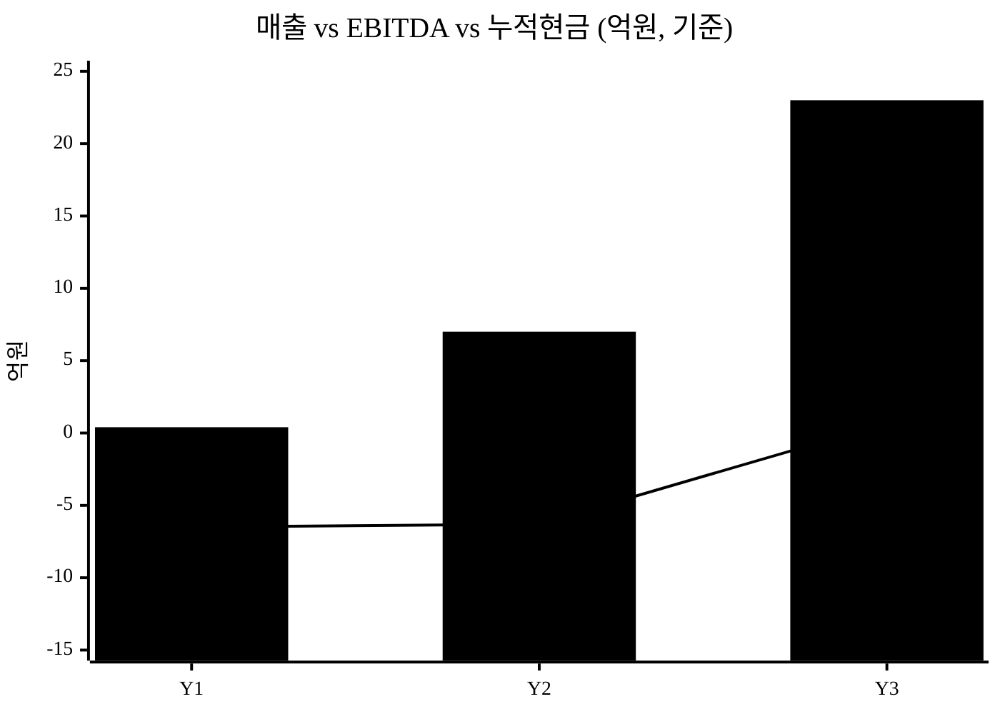

> 막대 = 매출(ARR), 선 = EBITDA. EBITDA 선이 Y3에 0을 상향 돌파(BEP)하며, 누적현금 최저점(−13억)은 Y2~Y3 상반에 형성된다.

### 6.6 Exit · 후속투자 로드맵

> VC는 진입 전에 출구를 본다. 후속 라운드·Exit 경로·비교기업 멀티플을 명시한다(모두 `[추정]`).

**후속 라운드 트리거·조달·밸류 `[추정]`**

| 라운드 | 트리거(목표) | 조달 규모 | 밸류 가정(SaaS 멀티플) | 희석 |
|:---|:---|---:|:---|:---:|
| Seed/협약 | 파일럿 N교·워크플로 PoC | 8억(본 사업+엔젤) | — | — |
| Series A | ARR 7억·재계약률 ≥ 70%·도입 300교 | 30~50억 | ARR×8 ≈ 56억+ | 15~20% |
| Series B | ARR 23억+·교육청 엔터 1건·NRR>100% | 100억+ | ARR×6~8 ≈ 140~180억 | 15~20% |

**Exit 시나리오 — 경쟁자를 매수자로 재해석**

| 인수 후보 | 왜 우리를 사는가 | 비교 레퍼런스 |
|:---|:---|:---|
| **AIDT 발행사**(천재·비상 등) | 자사 콘텐츠 밖 멀티소스 진단·교사 워크플로를 단번에 확보(발행사가 못 만든 중립 레이어) | — |
| **교육 대기업/상장사**(아이스크림에듀 등) | B2C·콘텐츠에 부족한 학교 B2G 분석 채널·데이터 자산 확보 | 아이스크림에듀 상장사[^16] 멀티플 |
| **클래스팅·콴다** | 진단 깊이·발행사 중립 데이터셋으로 자사 플랫폼 보강 | 콴다 누적투자 1,200억[^16] 밸류 레퍼런스 |
| **글로벌 LMS** | 한국 교육과정·평가·학부모 채널 현지화 자산 인수 | — |

> **IPO 시 필요 ARR `[추정]`**: 코스닥 기술특례 기준 통상 ARR 100억+·고성장 유지가 필요 → §3.2.2 venture-scale 확장(교육청 엔터·학부모 B2C)이 켜져야 IPO 경로가 열린다. M&A는 ARR 20~50억 구간에서도 전략적 인수가 성립(위 후보)하므로, **현실적 1차 Exit은 M&A**, IPO는 확장 성공 시 옵션이다.

---

## 7. Go-to-Market 전략

| 단계 | 채널 | 핵심 활동 | KPI |
|:---|:---|:---|:---|
| Pre-seed | 교육청·연구학교 PoC | 파일럿 학교·학급 무상 도입 → 사례 | 시간절감·성취변화 측정 |
| Seed | 교사 커뮤니티·교사 연수 | 교사 추천·연수 연계 확산 | 교사당 학급 도입 수 |
| Series A | 교육청 일괄 구독·정부 에듀테크 사업 연계 | 지역 단위 도입·바우처 결합 | 학교 도입 수·재계약률 |

**전략 핵심**: 학교는 직접 광고로 닿기 어렵다. 대신 **이미 교사와 신뢰 관계가 있는 교사 커뮤니티·연수·연구학교**를 채널로 삼아 추천 기반으로 진입한다(이펙츄에이션의 "수중의 새" — 가진 관계망 활용). 정부 에듀테크 진흥 정책[^15]·교육청 예산을 결합하면 학교 초기 도입 비용을 낮출 수 있다. AIDT 채택률 지역격차(대구 100%~세종 8%[^6])는 교육청 단위 일괄 도입의 레버리지가 큼을 시사한다.

**첫 100·1,000 사용자 확보 경로 (콜드스타트 분해, `[추정]`).** "교사 커뮤니티로 확산"이라는 구호 대신, 첫 사용자를 **단계별 숫자 경로**로 박는다.

| 마일스톤 | 경로 | 핵심 전술 | 트리거 |
|:---|:---|:---|:---|
| **첫 30교**(앵커) | 연구학교·교육청 PoC **무상 파일럿** | 가진 관계망(연수 강사·연구학교 네트워크)으로 직접 접촉, 학기 게이트(3·9월) 정렬 도입 | §7.2 온보딩 |
| **첫 150학급** | 앵커 30교 내 **교사 freemium 개인 진입** → 학급 단위 확산 | 동료 교사 추천(학교 내 바이럴), 진단 입도·단일 워크플로 체험 | 활성률 ≥60%(§7.1) |
| **첫 1,000교사** | 교사 커뮤니티·연수 연계 + **교육청 1건 일괄(20~100교)** | 무상 파일럿 성과(시간절감·성취) 레퍼런스로 교육청 일괄 영업, freemium→학교 전환 | 유료 전환율 20~30%(Y1, §7.1) |

> 이 경로는 §7.1 정량 KPI(세일즈 사이클 3~6개월·교육청 1건당 20~100교·분기 파이프라인 50~100교)와 정합한다. **개인 교사 freemium(공급측 마찰 0)** 으로 첫 100을, **교육청 일괄 레버리지**로 1,000+ 를 확보하는 2단 로켓이다(직접 광고 의존 0).

### 7.1 GTM 정량 KPI (분기 목표·세일즈 사이클·전환율 `[추정]`)

> 종전 KPI가 '도입 수'만 있어 성장 가속을 검증할 수 없다는 지적을 반영, 분기 목표·세일즈 사이클·전환율·파이프라인을 정량으로 박는다.

| 지표 | 값 `[추정]` | 비고 |
|:---|:---|:---|
| 세일즈 사이클 길이 | 학기 게이트 의존, **3~6개월** | 예산편성·운영위 심의 포함 |
| 교육청 1건당 일괄 도입 학교 수 | **20~100교** | 채널 레버리지 핵심 |
| 무상 파일럿 → 유료 전환율 | Y1 20~30% → Y3 80% | §6.3.1 정합 |
| 파이프라인(유효 리드/분기) | Y2 기준 분기 50~100교 | 전환율 역산 |
| 활성 사용률(재계약 KPI) | 도입 교사 중 주 1회+ 로그인 ≥ 60% | §9 교사 실사용 리스크 직접 측정 |

### 7.2 학교 온보딩 플로우 — *도입 결재 후 첫 리포트까지*

> 학교 SW 도입 실패의 다수는 기능이 아니라 **초기 세팅·명단 동기화·연수** 장벽에서 난다. 'CS·온보딩 1명'(§11.2)으로만 처리하지 않고 단계·소요·학교 부담을 명시한다.

| 단계 | 활동 | 소요 `[추정]` | 학교 측 부담 |
|:---|:---|:---|:---|
| 1. 계약·동의 | 위수탁 계약·보호자 동의(템플릿 제공 §10.2) | 1~2주 | 가정통신문 발송 |
| 2. 명단 시드 | 학급·학생 명단 **NEIS export CSV 업로드**(수기 아님) | 0.5일 | 정보부장 CSV 1회 |
| 3. 교과·문항은행 연결 | 표준 평가는 사전 태깅 문항은행 자동 연결 | 자동 | 0 |
| 4. 교원 연수 | 핵심 워크플로 온라인 연수 | **1~2시간** | 교사 참여 |
| 5. 첫 평가 인입→리포트 | 평가 CSV 업로드 → 진단 → 학부모 리포트 검수·발송 | 학급당 ≤ 10분 | 교사 1회 |

> **학기 게이트 정합**: 신규 도입은 **학기 시작(3·9월) 전후에만** 현실적이다. 학기 중 도입은 '진단만 먼저 체험'하는 경량 모드로 허용하되, 정식 학급 운영은 차기 학기 게이트에 정렬한다. **무상 파일럿이 학교에 요구하는 것**(교사 시간·명단 데이터)을 사전 고지해 도입 마찰을 줄인다.

### 7.3 학교 구매·조달 적합성 (B2G 공공구매)

> 학교당 300만 원이 실제 학교 예산 집행 구조와 맞는지 검증한다(B2G를 표방하므로 공공구매 절차 정합 필수).

- **예산 비목**: 학교운영비/정보화예산에서 집행. 300만 원(월 25만 원)이 학교 정보화예산 비중에서 집행 가능한지 `[재확인 필요]`(§3.2.1 WTP). 일정 금액 이상은 **학교운영위원회 심의·수의계약 한도** 검토.
- **조달 등록**: 나라장터·에듀테크 통합플랫폼·혁신조달 등록 계획(§5.4) — 조달 등록 제품이라야 교육청·학교가 직접 구매 가능.
- **회계연도 단위 부담 완화**: 학교는 회계연도 단위라 다년 구독이 행정적으로 번거롭다 → **연 단위 라이선스 + 교육청 일괄 결제**로 갱신 마찰 최소화.
- **학교 직접 부담 0 경로**: 교육청 일괄·에듀테크 바우처 결합 시 학교 직접 예산 부담을 0에 가깝게 → "학교가 돈 안 내고 시작"하는 진입로를 GTM과 연결.

---

## 8. 로드맵

> **고난도 항목 선행 검증(일정 리스크 은폐 해소).** 종전 로드맵은 가장 어렵고 차별성의 핵심인 3가지(실 연동·교육청 통계·개인정보 인증)를 전부 v3에 몰아 "데모는 되나 사업화 미입증" 구조였다. 본 개정은 **연동 PoC 1건을 v2로 당기고, 인증은 '취득'이 아니라 '컨설팅 착수·예비점검 통과'로 현실화**한다(정식 취득은 협약 종료 후).

| 단계 | 시점 | 학기 게이트 정합 | 대표 산출물 | 외부 산출 수준 |
|:---|:---|:---|:---|:---|
| MVP(v1) | M1~3 | 직전 학기 데이터로 개발 | 성취 대시보드 + 취약개념 히트맵 + 평가/과제 입력(CSV·OMR·빠른입력) + 맞춤 과제 추천 + 학부모 리포트(교사 검수 게이트) + 단일 워크플로 | 핵심 워크플로 동작 PoC |
| Beta(v2) | M4~6 | **신학기(9월) 파일럿 투입 정렬** | 다중 테넌트 + 분석 알고리즘(추세·군집·조기경보) + **연동 PoC 1건(표준 export 또는 1발행사 협약)** + 알림톡 mock + 개인정보 보호(가명·동의·14세 분기) + 역할 권한 + 학급 비교 + 반응형 | 파일럿 투입 베타 + 연동 실현 조기 입증 |
| 상용/심화(v3) | M7~12 | **학기말 성과 측정 → 차년도 예산편성 시기 본계약 영업** | 실 AIDT/LMS API(협약 의존) + 교육청 통계 + 모바일 + **ISMS-P 컨설팅 착수·예비점검·신청 접수** | 지역 도입·Series A 데모 |
| (사업 종료 후) | M13+ | — | ISMS-P/CSAP 정식 취득 | 공공조달 진입 게이트 통과 |

**[그림 6] 가치 누적 로드맵**

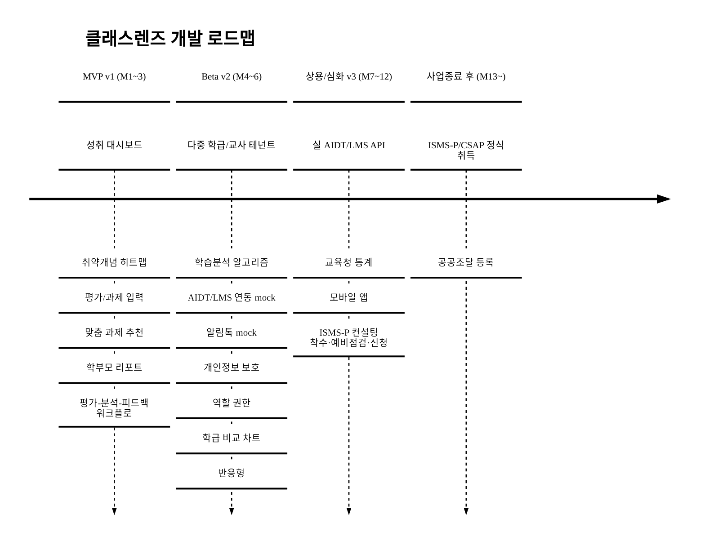

> **학사·예산 주기 정렬 1줄**: M5~6에 **9월 신학기 파일럿 투입** → M9~10에 **학기말 성과 측정** → M11~12에 **차년도 예산편성 시기 본계약 영업**. ISMS/ISMS-P는 준비·심사·보완에 통상 6~12개월+ 소요되므로 M7 착수→M12 취득은 비현실적 → 협약기간 내 목표는 **착수·예비점검·신청 접수**로 하향(§13.1·§9 일정 리스크 정합).

---

## 9. 리스크 · 완화

> 가능성 × 영향으로 등급화. 제품·경쟁에 더해 기술·정책·재무 리스크를 정면 등재한다.

| 분류 | 리스크 | 가능성×영향 | 대응(정량) | 잔여 |
|:---|:---|:---:|:---|:---|
| **채택** | **교사 실사용률 저조(도입은 했으나 로그인 안 함)** — AIDT 8% 실패의 재현 | **고×고** | 교사 개인 freemium 진입→학교 전환, **활성 사용률 ≥ 60% 재계약 KPI 직접 측정(§7.1)**, 입력 부담 최소화(§2.4) — 결재자(교장)/사용자(교사) 분리 함정 정면 대응 | 중 |
| **현장** | **학부모 리포트 민원·아동 낙인** | **고×고** | 자동생성≠자동발송, **교사 검수·승인 게이트 필수**, 낙인 회피 템플릿, 비교값 학부모 비노출(§2.5) | 중 |
| **정책** | AIDT 정책 추가 축소·예산 변동 | 중×고 | 발행사 중립·AIDT 비의존 설계(수기평가만으로도 동작), 정책 변동 무관한 교사 워크플로 가치 포지셔닝 | 중 |
| **정책** | **핵심 근거(예산·실사용률) 1차 출처 미확정** | 중×중 | 제출 전 교육부·국감 원문 교차검증, 인용 시 `[추정/언론추산]` 일관 유지(§1.1) | 중 |
| **기술** | 학생 민감정보 누수 | 저×극고 | 가명처리·역할 권한·국내 리전·**append-only 감사로그**·인증(§10.2), 사고 시 사업종료급 최우선 관리 | 저 |
| **규제** | **컴플라이언스 미충족으로 조달 탈락**(14세 동의·CSAP/ISMS-P 미취득) | 중×고 | 14세 미만 법정대리인 동의 분기(§10.2), ISMS-P/CSAP 취득 로드맵(§8), 위수탁 구조 명확화 | 중 |
| **기술** | 진단 알고리즘 오판(위험학생 오경보·누락) | 중×고 | 근거 노출(블랙박스 금지)·교사 최종확인 게이트·**소표본 보정(단정 금지)**·편향 점검(§10.5) | 중 |
| **기술** | AIDT/LMS 연동 불가(폐쇄 API) → **3층 데이터 해자 전제 약화** | **중×고**(차별점 의존도 반영 상향) | 표준 export(xAPI/Caliper)·CSV를 1급 경로로 재포지셔닝, **연동은 upside이지 전제 아님**(§10.4), 미연동 시 3층 해자 등급 하향 정직 명시 | 중 |
| **운영** | 학교 도입 사이클 장기화(학기·예산 주기) | 중×고 | 교육청 일괄 채널(§7)·무상 파일럿으로 학기 게이트 선점 | 중 |
| **채널** | 교육청·교사 커뮤니티 채널 미확보·경쟁사 선점 | 중×고 | 연구학교·연수 다채널 + 직판 백업, **독점 채널 비중 ≥ 50%(§5.4)**, blended CAC 220만 상한 관리(§6.4.1) | 중 |
| **재무** | 자금소진·후속투자 실패 | 중×극고 | **런웨이 약 15개월 확보(초기 8억)**, **BEP 약 Y3 초·도입 700교(§6.5)**, 후속 실패 시 **채용 동결로 default-alive**(추가 조달 없이 BEP 생존) | 중 |
| **경쟁** | 클래스팅(3~6개월 worst)·발행사·**KERIS 공동구축** 진단 확장(§5.3) | 중×고 | 학기 선점 + 코드 입도·발행사 중립 차별, **납품 파트너 전환**으로 채널 헤지(§5.4·§5.7) | 중 |
| **일정** | 핵심 난도(연동·인증) 후반 집중 | 중×고 | 연동 PoC v2 선행(§8), 인증은 '착수·예비점검'으로 현실화 | 중 |

---

## 10. 기술 아키텍처 · 보안 · 컴플라이언스

> 미성년 학생의 성취·학습 데이터를 다루므로 기술 실체·개인정보 적격성을 명시한다.

### 10.1 시스템 아키텍처 (멀티테넌트) — 확정형

**테넌트 격리(다층 방어)**: 학교=테넌트. 단일 RLS만으로는 애플리케이션 버그(테넌트 컨텍스트 누락 쿼리)·분석 파이프라인의 교차 테넌트 집계에서 격리가 깨질 수 있으므로 **3층 방어**를 둔다.

1. **DB**: shared-schema + **Row-Level Security(RLS)** 로 `school_id` 강제 격리.
2. **App**: 모든 쿼리에 **테넌트 컨텍스트 강제 주입**(미들웨어). 컨텍스트 누락 쿼리는 런타임 차단.
3. **CI 게이트**: **자동화된 cross-tenant 격리 테스트**를 CI 필수 통과 항목으로 — 테넌트 A 토큰으로 테넌트 B 데이터 접근 시 빌드 실패.

**분석/트랜잭션 분리**: 추세·군집·벤치마크 같은 무거운 분석은 OLTP에서 직접 돌리지 않고 **읽기 복제본 또는 분석 스키마에서 비동기 배치**로 처리(트랜잭션 워크로드 보호).

**대량 발송·스파이크 대응**: 학기 초·평가 직후 동시 다발 채점·리포트 생성 스파이크는 **작업 큐(예약·재시도·멱등키)** 로 흡수. 알림톡 대량 발송도 큐 경유.

**RPO/RTO·DR**: 백업 주기 일 1회·트랜잭션 로그 연속 백업(**RPO ≤ 1시간**), 복구 목표 **RTO ≤ 4시간**, 분기 1회 복구 리허설. 99.9% SLA의 근거는 다중 AZ·헬스체크 기반 자동 롤백.

> **스택 확정(‘[추정]’ 제거)**: 아래는 *확정 스택*이며, 대안은 각주로만 둔다. 실사 대상이 '[추정]'이면 기술 확정성을 의심받으므로 1개로 확정한다.

| 계층 | 확정 스택 | 대안(각주) |
|:---|:---|:---|
| 프론트 | Next.js(React)/TypeScript, 반응형 | — |
| 백엔드 | Node.js(ESM) API + RBAC(교사·관리자·학부모) | — |
| OLTP DB | PostgreSQL(RLS) + 가명처리·민감 컬럼 암호화 | — |
| 분석 | 읽기 복제본/분석 스키마 비동기 배치(추세·군집·조기경보) | 규모 확대 시 컬럼스토어 분리 |
| 큐 | 작업 큐(예약·재시도·멱등) — 리포트·알림톡 대량 발송 | — |
| 연동 | 표준 export(xAPI/Caliper)·CSV 1급 + AIDT/LMS(v2 PoC→v3 실 API) | — |
| 관측 | 로그·메트릭·트레이스·에러추적 + 온콜 절차(§10.3) | — |

#### 10.1.1 진단 엔진 사양 — *제품 차별성의 실체*

> 제품 차별성의 90%가 '개념 단위 진단'에 걸려 있으므로 알고리즘 실체를 명시한다. 종전 '명사 나열'을 입력·모델·콜드스타트·측정 정의로 구체화한다.

- **입력 스키마**: ① 문항 메타(단원·**성취기준 개념코드**·난이도·배점), ② 응답(정오답·소요시간·시도수·결시 여부).
- **1차 알고리즘(v1~v2, 결정론·설명가능)**: 문항-개념 매핑 위에서 **개념별 정답률 + Wilson score 하한**(소표본 과대확신 방지)으로 취약개념 랭킹 산출. 학급 군집은 학생별 **개념벡터 코사인 유사도** 군집. 위험학생 조기경보는 규칙 베이스라인 — *직전 N회 대비 개념 정답률 하락 + 결시율 상승*.
- **고도화(v3)**: 문항반응이론(IRT)·지식추적(DKT 계열)로 정밀도 향상(데이터 임계점 §5.3 도달 후).
- **콜드스타트 정책**: 임계 응답 수 미만이면 진단을 **'보류' 표기**(단정 금지) — 표본 작은 학급(20~30명) 과적합 방지.
- **조기경보 적중률 정의(측정 가능화)**: 라벨 = *차기 형성평가 하위 X% 진입 여부*, 지표 = **Precision/Recall@K**. 종전 '적중률'은 정답 라벨이 없어 측정 불가였으므로 라벨을 이렇게 정의한다.
- **근거 노출(블랙박스 금지)의 실제 산출**: "어떤 문항(개념) 때문에 이 개념이 약점으로 떴는가"를 교사 화면에 문항 리스트·정답률로 노출.

#### 10.1.2 개념 온톨로지 · 데이터 모델 — *제품의 진짜 자산(3층 해자의 정체)*

> '개념 단위' 진단이 성립하려면 **성취기준 ↔ 개념(knowledge component) ↔ 문항** 매핑 체계가 선행해야 한다. 이것이 실제 데이터 자산이자 §5.3 3층 해자의 정체다.

- **정규화 키**: 교육부 **2022 개정 교육과정 성취기준 코드**(예: `[9수01-01]`)를 채택 → **발행사마다 다른 개념 분류를 이 코드로 정규화**(발행사 중립 멀티소스 통합의 매핑 축). 이 키가 없으면 멀티소스 통합 진단 자체가 불가능하다.
- **태깅 워크플로(교사 부담 폭증 방지 §2.4 정합)**: 표준 평가는 **사전 태깅 문항은행**(당사 구축) 제공(교사 0). 교사 자작 문항은 **성취기준 드롭다운 1클릭 + LLM 보조 자동 태깅(검증 게이트)**.
- **버전닝**: 교육과정 개정·학년 이관 시 성취기준 코드 버전을 관리(개정 교육과정 단위 분기).

**[그림 7-b] 핵심 데이터 모델 ERD (RLS 키 = school_id)**

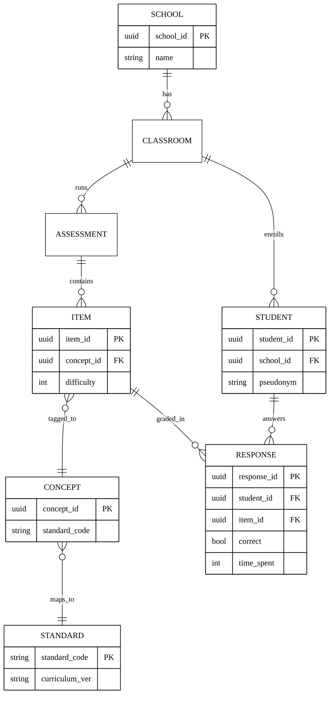

> `school_id`가 SCHOOL→CLASS→STUDENT→RESPONSE로 전파돼 RLS 격리 키가 되며, `standard_code`가 발행사 중립 정규화 축이다. 이 온톨로지·문항은행이 핵심 IP(§15)다.

**[그림 7] 멀티테넌트 데이터 아키텍처**

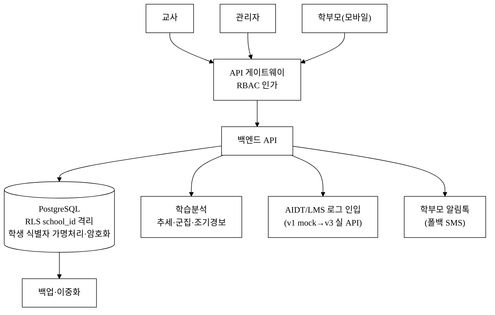

### 10.2 개인정보 보호 · 규제 컴플라이언스

> 한국 K-12 학생 데이터 SaaS는 표 한 장으로 실사를 통과할 수 없다. **미성년·공공조달 특례**를 구체 규범으로 명시한다.

| 영역 | 의무·설계(구체 규범) |
|:---|:---|
| **법적 지위** | 당사 = **개인정보 수탁자**, **학교 = 개인정보처리자**. **위수탁 계약** 체결, 클라우드 **재위탁 고지**. 이 구조가 동의·책임 소재의 기준 |
| **만 14세 미만 동의** | 개인정보보호법상 **법정대리인(보호자) 동의 필수** → **14세 연령 분기** 처리, 동의 진위 확인(가정통신문·전자동의 로그). 14세 이상은 본인+보호자 병행 |
| **가명·통계 활용** | 벤치마크·플라이휠(§5.3)은 **가명·통계처리 후 집계값만 활용, 개별 식별 불가·재식별 금지**. 가명정보 결합 시 개인정보보호법 28조의2~3·결합전문기관 규정 준수 — 데이터 플라이휠이 곧 규제 리스크임을 인지하고 집계 경계 명시 |
| **접근통제·감사** | RBAC(교사=담당학급, 관리자=학교, 학부모=자녀) + **학생 PII 접근 전수 로깅(append-only·무결성)**, 감사로그 보존기간 명시 |
| **데이터 라이프사이클** | 보존기간(재학 중 + 졸업/계약종료 후 N개월) → **자동 파기 잡**. 정보주체 권리(열람·정정·삭제·처리정지) 처리 SLA·화면. **계약 종료 시 표준 export 반환 + 파기 증빙** — 락인은 UX·누적가치로 하되 **데이터 자체는 반환 가능**(§5.3 락인과 컴플라이언스 충돌 해소) |
| **국외이전** | 국내 리전 보관, 국외이전 없음 |
| **목표 인증** | **ISMS-P**(개인정보), 교육청 조달 시 **CSAP(클라우드 보안인증)** — §8 로드맵 v3 착수·예비점검, 정식 취득은 종료 후. §13.2 예산 반영 |
| **도입 학교 부담 최소화** | 학교가 처리할 **동의·위탁 문서 템플릿 제공**, 미동의 학생 처리(분석 제외 시 학급 진단 불완전 → 통계 보정·익명 집계로 완화) |

### 10.3 기술 KPI · SLA (측정 정의 부기)

> 종전 '숫자만 있는 SLA'를 측정 정의·관측 체계와 함께 명시한다.

| 지표 | 목표 | 측정 정의 |
|:---|:---|:---|
| 가용성 SLA | 99.9% | 다중 AZ 헬스체크 기준, 외형(synthetic) 모니터링으로 계측 |
| API p95 응답시간 | ≤ 500ms | **읽기 API 동기 경로 한정**. 리포트·분석 등 무거운 작업은 비동기 작업으로 별도 SLA(완료 알림) |
| 위험학생 조기경보 정확도 | **Precision/Recall@K 하한(파일럿 실측 후 확정)** | 라벨=차기 형성평가 하위 X% 진입(§10.1.1). 혼동행렬로 측정 |
| 학부모 알림 발송 성공률 | ≥ 99% | 발송 큐 완료/실패 비율, 재시도 포함 |
| 보안 | 취약점 스캔 상시, 학생정보 누수 0건 | 자동 스캔 + append-only 감사로그 |
| 관측·온콜 | 로그·메트릭·트레이스·에러추적, 온콜 절차 | SLO 위반 시 알람→온콜 에스컬레이션 |

### 10.4 연동 표준 · 실현 경로 — *AIDT 연동은 전제가 아니라 upside*

> 포지셔닝이 'AIDT가 못 흘려보내는 데이터를 끌어낸다'인데, AIDT 발행사·LMS는 폐쇄 생태계라 실 API 실현성이 불확실하다. **이 모순을 정면으로 재포지셔닝**한다.

- **1급 경로(연동 무관 성립)**: 교사가 **합법적으로 내보낼 수 있는 export** — 성적 CSV·표준 LRS(**xAPI(Tin Can)/IMS Caliper**)·KERIS 교육데이터 표준. AIDT 측 개방 여부와 무관하게 제품가치가 성립한다.
- **upside 경로(협약 의존)**: 발행사별 '실 API'는 **개방·협약 의존 항목으로 분리**. 미연동이어도 1급 경로로 핵심 워크플로가 돌아가므로 **AIDT 연동은 전제가 아니라 upside**다.
- **데이터 접근권 정당성**: 표준 데이터 규격·교육부 데이터 개방 정책·교육청 중개를 경로로 둔다. **스크래핑·브라우저 확장 등 약관/보안 위반 소지 경로는 배제**.
- **3층 해자 정직 재평가**: 발행사가 끝까지 API를 안 열면 멀티소스 통합 범위가 줄어 **3층 해자 등급이 하향**될 수 있다(§9 리스크 상향 반영). 단, 수기+CSV+표준 평가 결과의 통합으로도 *발행사 중립 멀티소스*의 1차 가치는 성립한다.

### 10.5 AI 신뢰성 · 안전 (편향·설명가능성)

> '위험학생' 라벨링은 낙인·차별을 줄 수 있는 준-자동화 의사결정이다. 기술 통제를 명시한다(§9 '오판' 리스크와 1:1 연결).

- **소표본 보정**: 신뢰구간(Wilson) 적용, 최소 응답 수 미만 시 **단정 금지('보류')**(§10.1.1).
- **자동화 의사결정 비대상화**: 진단은 **'제안'이며 최종 판단은 교사**. 학부모 리포트에도 동일 고지(§2.5).
- **편향 점검**: 오경보율의 하위집단(학급·배경별) 격차 정기 모니터링.
- **모델·임계값 버전 관리**: 변경 시 회귀 검증(과거 데이터로 정확도 비교).

### 10.6 COGS · 단가 모델 — *그로스마진 75% 가정의 기술적 정합성*

> §6.4가 마진 70~80%를 가정해 LTV를 산정하므로 학교당 한계비용을 추정해 대조한다.

| 항목 | 단가 가정 `[추정]` | 학교 1교 연 한계비용 `[추정]` |
|:---|:---|---:|
| 스토리지·연산 | 교원 37명×학급×학기 평가 데이터 | 약 10만~20만 원 |
| 알림톡 종량 | 건당 원가 × 학생당 연 발송 수 | 약 15만~30만 원(매출 §6.2와 분리 회계) |
| LLM 보조 태깅/리포트 | **결정론적 템플릿 우선 → 토큰 비용 최소화**(LLM은 자작 문항 태깅 보조 한정) | 약 5만~15만 원 |
| **합계(학교당 COGS)** | | **약 30만~65만 원** |

> 학교당 ARPU 300만 대비 COGS 30만~65만 → **그로스마진 약 78~90%** 로, §6.4의 70~80% 가정과 정합(보수적). LLM은 결정론 템플릿을 우선해 토큰 비용을 억제하고, 알림톡은 매출(종량 마진)과 비용(원가)을 분리 회계한다.

---

## 11. 추진체계 · 조직 R&R · 인력 계획

> 팀 실명·실값은 §12에서 사용자가 채운다. 본 절은 역할 골격·확보 방식만 명시(실명 공란).

```mermaid
%%{init: {"theme":"base","themeVariables":{"darkMode":false,"background":"#ffffff","fontFamily":"Georgia, serif","primaryColor":"#ffffff","primaryBorderColor":"#000000","primaryTextColor":"#000000","secondaryColor":"#ffffff","secondaryBorderColor":"#000000","secondaryTextColor":"#000000","tertiaryColor":"#ffffff","tertiaryBorderColor":"#000000","tertiaryTextColor":"#000000","mainBkg":"#ffffff","secondBkg":"#ffffff","lineColor":"#000000","textColor":"#000000","nodeBorder":"#000000","nodeTextColor":"#000000","titleColor":"#000000","edgeLabelBackground":"#ffffff","defaultLinkColor":"#000000","clusterBkg":"#ffffff","clusterBorder":"#000000","actorBkg":"#ffffff","actorBorder":"#000000","actorTextColor":"#000000","actorLineColor":"#000000","signalColor":"#000000","signalTextColor":"#000000","labelBoxBkgColor":"#ffffff","labelBoxBorderColor":"#000000","labelTextColor":"#000000","loopTextColor":"#000000","noteBkgColor":"#ffffff","noteBorderColor":"#000000","noteTextColor":"#000000","activationBkgColor":"#ffffff","activationBorderColor":"#000000","sequenceNumberColor":"#000000","attributeBackgroundColorOdd":"#ffffff","attributeBackgroundColorEven":"#ffffff","sectionBkgColor":"#ffffff","altSectionBkgColor":"#ffffff","sectionBkgColor2":"#ffffff","taskBkgColor":"#ffffff","taskBorderColor":"#000000","taskTextColor":"#000000","taskTextLightColor":"#000000","taskTextOutsideColor":"#000000","taskTextDarkColor":"#000000","taskTextClickableColor":"#000000","activeTaskBkgColor":"#ffffff","activeTaskBorderColor":"#000000","doneTaskBkgColor":"#ffffff","doneTaskBorderColor":"#000000","critBkgColor":"#ffffff","critBorderColor":"#000000","gridColor":"#000000","todayLineColor":"#000000","quadrant1Fill":"#ffffff","quadrant2Fill":"#ffffff","quadrant3Fill":"#ffffff","quadrant4Fill":"#ffffff","quadrant1TextFill":"#000000","quadrant2TextFill":"#000000","quadrant3TextFill":"#000000","quadrant4TextFill":"#000000","quadrantPointFill":"#000000","quadrantPointTextFill":"#000000","quadrantXAxisTextFill":"#000000","quadrantYAxisTextFill":"#000000","quadrantInternalBorderStrokeFill":"#000000","quadrantExternalBorderStrokeFill":"#000000","quadrantTitleFill":"#000000","pieStrokeColor":"#000000","pieOuterStrokeColor":"#000000","pieTitleTextColor":"#000000","pieSectionTextColor":"#000000","pieLegendTextColor":"#000000","cScale0":"#ffffff","cScaleLabel0":"#000000","cScaleInv0":"#000000","pie1":"#ffffff","cScale1":"#ffffff","cScaleLabel1":"#000000","cScaleInv1":"#000000","pie2":"#ffffff","cScale2":"#ffffff","cScaleLabel2":"#000000","cScaleInv2":"#000000","pie3":"#ffffff","cScale3":"#ffffff","cScaleLabel3":"#000000","cScaleInv3":"#000000","pie4":"#ffffff","cScale4":"#ffffff","cScaleLabel4":"#000000","cScaleInv4":"#000000","pie5":"#ffffff","cScale5":"#ffffff","cScaleLabel5":"#000000","cScaleInv5":"#000000","pie6":"#ffffff","cScale6":"#ffffff","cScaleLabel6":"#000000","cScaleInv6":"#000000","pie7":"#ffffff","cScale7":"#ffffff","cScaleLabel7":"#000000","cScaleInv7":"#000000","pie8":"#ffffff","cScale8":"#ffffff","cScaleLabel8":"#000000","cScaleInv8":"#000000","pie9":"#ffffff","cScale9":"#ffffff","cScaleLabel9":"#000000","cScaleInv9":"#000000","pie10":"#ffffff","cScale10":"#ffffff","cScaleLabel10":"#000000","cScaleInv10":"#000000","pie11":"#ffffff","cScale11":"#ffffff","cScaleLabel11":"#000000","cScaleInv11":"#000000","pie12":"#ffffff","xyChart":{"backgroundColor":"#ffffff","titleColor":"#000000","xAxisLabelColor":"#000000","xAxisTitleColor":"#000000","xAxisTickColor":"#000000","xAxisLineColor":"#000000","yAxisLabelColor":"#000000","yAxisTitleColor":"#000000","yAxisTickColor":"#000000","yAxisLineColor":"#000000","plotColorPalette":"#000000,#000000,#000000,#000000,#000000,#000000"}}}}%%
flowchart TD
    GOV["정부/교육청 협약기관<br/>(검수·정산)"]
    subgraph IN["내부 조직"]
        CEO["대표/사업"]
        DEV["개발(백엔드·프론트·분석)"]
        BIZ["GTM·CS"]
        ADM["경영지원·사업관리<br/>(정산·증빙·중간/최종보고)"]
    end
    EXT_A["외부 자문<br/>현직 교사·교육과정 전문가<br/>(진단 타당성 검증)"]
    EXT_B["외주 개발사<br/>(주변 기능 한정·과업지시서 범위)"]
    CEO --> DEV & BIZ & ADM
    DEV <-->|진단 타당성 격주 검토| EXT_A
    DEV <-->|위탁 개발·납품 검수| EXT_B
    ADM -->|사업비 정산·증빙·보고| GOV
    IN -->|성과 보고| GOV
```

> 진단 알고리즘의 교육적 타당성은 **현직 교사·교육과정 전문가 자문(외부) + 자체 검증(내부)** 이 공동 검증한다. 자체/외주 분담은 [`2_개발계획서.md`](./2_개발계획서.md) WBS와 [`3_과업지시서_v1.md`](./3_과업지시서_v1.md) §1 범위로 확정한다(자문 R&R 골격만, 실명은 사용자 영역).

**정산·사업관리 R&R(정부사업 정합).** 정부사업은 사업비 정산·증빙이 별도 업무량이므로 **경영지원·사업관리** 역할(기관 행정·증빙·중간/최종보고 책임)을 내부 조직에 둔다(실명 공란).

**자문 R&R 정량화.** 진단 타당성의 핵심인 외부 자문을 형식화하지 않도록: 투입 빈도 **격주 검토**, 산출물 **진단 타당성 검증 리포트(분기 1건+)**, 자문비는 §13.2 '자문비' 비목으로 지급(실명 공란).

**핵심 IP 귀속 원칙(추진체계 수준 확정).** **핵심 진단 알고리즘·개념 온톨로지·문항은행은 자체 개발·자체 IP 보유**가 원칙이며, **외주는 주변 기능(UI 컴포넌트·연동 어댑터 등)에 한정**한다. 상세 경계는 과업지시서에 위임하되 **IP 귀속 원칙은 본 제안서에서 확정**한다(§15 IP 전략 연결).

### 11.2 인력 · 채용 계획 (골격, 실명 공란)

> **'신규 직접고용' 정의**: 협약기간 내 **4대보험 신규 채용 기준**이며, 대표·기존 인력(§12)은 신규 고용에서 분리한다(기존 인력 0명 전제 시 아래 Y1 6명이 곧 신규 직접고용).

| 직군 | Y1 `[추정]` | Y2 `[추정]` | Y3 `[추정]` | 고용형태 | Y1 인건비 `[추정]`(억) |
|:---|---:|---:|---:|:---|---:|
| 백엔드·프론트 개발 | 3 | 5 | 7 | 정규 | 2.16 (3×6,000만×1.2) |
| 학습분석·데이터 | 1 | 2 | 3 | 정규 | 0.78 (1×6,500만×1.2) |
| CS·온보딩 | 1 | 2 | 3 | 정규/계약 | 0.54 (1×4,500만×1.2) |
| 채널영업(교육청·연수) | 1 | 2 | 3 | 정규 | 0.60 (1×5,000만×1.2) |
| 경영지원·사업관리 | (대표 겸임/외주) | 1 | 1 | 정규 | — |
| 교육과정·교사 자문 | 외부 자문 | 외부 자문 | 1(내부화) | 자문/정규 | (자문비 §13.2) |
| **신규 직접고용 누계** | **6명** | **누계 13** | **누계 18** | | **Y1 약 4.1억** |

> **청년·여성 고용(가점 핵심) — 목표 골격**: Y1 신규 6명 중 **청년(만 15~34세) ≥ `<TODO: 목표 인원>`명**, **여성 ≥ `<TODO: 목표 인원>`명**. 목표 숫자는 사업주 책임 목표로 사용자가 채운다(실명·실값 공란, §2.7).
>
> **인건비/매출 정합(자금 지속가능성)**: Y1 인건비 약 4.1억(복리후생 포함, §6.5와 정합) vs Y1 매출 약 0.4억 → Y1은 정부지원금·투자로 충당. **Y3 18명 인건비 약 12.5억 vs Y3 매출 23억 → 인건비/매출 ≈ 54%** 로 SaaS 통상 범위 내(고용 계획이 매출로 지속가능). Y3 흑자 전환(§6.5 BEP) 후 채용 확대가 자금적으로 성립한다.

---

## 12. 팀 (Team)

<TODO: 사용자 입력>

| 역할 | 이름 | 소속·직함 | 담당 R&R |
|:---|:---|:---|:---|
| 대표 | <TODO: 사용자 입력> | <TODO: 사용자 입력> | <TODO: 사용자 입력> |
| 개발 총괄 | <TODO: 사용자 입력> | <TODO: 사용자 입력> | <TODO: 사용자 입력> |
| 사업·GTM | <TODO: 사용자 입력> | <TODO: 사용자 입력> | <TODO: 사용자 입력> |
| 자문(교육과정·교사) | <TODO: 사용자 입력> | <TODO: 사용자 입력> | <TODO: 사용자 입력> |

---

## 13. 추진 계획 (단계·예산 골격)

> 단계 명칭·월 구간을 §8 로드맵과 통일한다. 총액·재원 비율은 공고 한도 확정 후 조정(`<TODO: 사용자 입력>`).

### 13.1 단계별 추진 계획

| 단계 | 산출물 | 시점(상대)·학기 게이트 | 정량 합격선 |
|:---|:---|:---|:---|
| MVP(v1) | 평가→분석→피드백 워크플로·대시보드·히트맵·과제추천·학부모리포트(검수 게이트) | M1~3 (직전 학기 데이터 개발) | 핵심 워크플로 실동작 |
| Beta(v2) | 다중 테넌트·분석 알고리즘·**연동 PoC 1건**·알림톡·개인정보보호(14세 분기)·역할권한·학급비교 | M4~6 (**9월 신학기 파일럿 투입**) | 파일럿 학교 투입·연동 PoC·**ISMS-P 컨설팅 착수** |
| 상용(v3) | 실 연동·교육청 통계·모바일·**ISMS-P 예비점검·신청 접수** | M7~12 (학기말 성과 측정→차년도 예산 영업) | 지역 도입·재계약 의향률 측정 |

> **인증 일정 현실화**: ISMS-P/CSAP는 통상 6~12개월+ 소요 → 협약기간 내 목표는 **'착수·예비점검·신청 접수'**, **정식 취득은 사업 종료 후**(§8 정합). 절대 날짜는 공고 일정 확정 후 기입(`<TODO: 사용자 입력>`). 학교 도입은 학기(3·9월)·예산 주기에 묶이므로 상대 마일스톤도 학기 게이트와 정합시켰다.

### 13.2 사업비 비목 골격 — 대표 시나리오 금액 예시 (총 5억 가정 `[추정]`)

> 종전 '비율만' 표를 **총사업비 대표 시나리오(총 5억 가정)** 로 금액 환산한다. 총액·정부지원금 비율은 **공고 한도 확정 후 조정**하되, 집행 타당성을 검증할 수 있도록 예시 금액을 채운다. 인건비는 §11.2 인원×표준 단가로 산출근거를 금액으로 연결한다.

| 비목 | 배분 `[추정]` | 금액(총 5억 가정) | 산출 근거 |
|:---|---:|---:|:---|
| 인건비 | 약 55% | 2.75억 | §11.2 Y1 6명 × 표준 단가(복리후생 포함, §11.2 표) |
| 외주용역비 | 약 13% | 0.65억 | 주변 기능(연동 어댑터·UI 컴포넌트) 위탁([`3_과업지시서_v1.md`](./3_과업지시서_v1.md)) — 핵심 진단은 자체(§11) |
| 클라우드 인프라 | 약 8% | 0.40억 | 멀티테넌트 서버·DB(§10.6 단가) |
| 알림톡 발송비 | 약 3% | 0.15억 | 학부모 알림 종량 **원가**(매출 §6.2와 분리 회계) |
| 자문비 | 약 3% | 0.15억 | 교육과정·교사 자문 격주 검토(§11) |
| 마케팅·채널 | 약 10% | 0.50억 | 교육청·연수 채널 |
| 일반관리(인증 포함) | 약 8% | 0.40억 | ISMS-P 컨설팅·법무 |
| **합계** | **100%** | **5.00억** | 정부지원금 : 자기부담 = **예시 7:3**(`<TODO: 공고 비율로 조정>`) |

> **인건비 정합 검산**: Y1 6명 인건비 약 4.1억(§11.2)인데 본 표 인건비 비목은 2.75억 — **차액은 정부지원금 인건비 비율 상한·자기부담·기존인력 분 차이**로 설명된다. 정부 R&D/창업사업은 통상 **신규채용 외 기존인력 인건비 제한·학생인건비 별도** 규정이 있으므로, 공고 확정 후 인건비 비목을 규정 상한에 맞춰 재배분한다.
>
> **비목 적격성 점검 노트(공고 확정 후)**: ① 인건비 비율 상한·기존인력 제한, ② 외주비 상한, ③ **알림톡 등 운영성 변동비의 정부지원금 집행 적격 여부** — 공고 규정 점검 필요(`<TODO: 공고 규정 점검>`).

---

## 14. 기대 효과 · 사회적 가치 (정량)

### 14.0 정량 성과목표 (협약 KPI) — *협약 종료 시점 검수 가능한 합격선*

> 종전 KPI가 전부 '파일럿 실측'으로 미뤄져 협약 시점 검수 목표값이 없다는 지적을 정면 보강한다. **협약기간(예: 12개월) 종료 시점 기준 측정 가능한 최소 목표(합격선)** 를 확정한다. '파일럿 실측'이라도 *"실측을 통해 X 이상 달성"* 처럼 하한선을 둔다. KPI마다 **측정주체·측정시점·증빙**을 명시.

| KPI | 협약 종료 목표(하한) `[추정]` | 측정주체·시점 | 증빙 |
|:---|:---|:---|:---|
| 파일럿 도입 학교 수 | **≥ 30교**(무상 포함) | 당사·M12 | 계약·계정 로그 |
| 누적 도입 학급 수 | **≥ 150학급** | 당사·M12 | 학급 등록 로그 |
| 학부모 리포트 발송 건수 | **≥ 5,000건** | 당사·M12 | 발송 큐 로그 |
| 위험학생 경보 정확도 | **Precision/Recall@K ≥ (파일럿 측정 후 하한 확정)** | 당사·학기말 | 혼동행렬·캡처 |
| 활성 사용률(교사 주1회+) | **≥ 60%** | 당사·M12 | 로그인 로그 |
| 재계약 의향률(설문) | **≥ 70%** | 외부 설문·학기말 | 설문 원자료 |
| 교사 주당 절감시간 | **실측 통해 ≥ 2시간/교사** | 파일럿 설문·전후 비교 | 설문·로그 |

### 14.1 도입 ROI 손익계산 — *무료 대안 대비 300만 원의 정당화*

> 의사결정자가 결재를 누르려면 '주당 몇 시간 × 교사 수 × 시급 = 절감액 vs 300만 원' 손익이 필요하다. baseline은 출처 보강 전이므로 `[추정]`·`[재확인 필요]` 명시.

| 항목 | 가정 `[추정]` | 산출 |
|:---|:---|:---|
| 교사 1인 주당 채점·진단·학부모소통 시간(baseline) | 약 5시간 `[재확인 필요]` 교원 업무량 통계 | — |
| 절감률(워크플로 자동화) | 40% `[추정]` | 주 2시간 절감 |
| 교사 시급 환산 | 약 3만 원 `[추정]` | — |
| 학교당 활용 교사 수 | 약 20명 `[추정]` | — |
| **학교 연 절감액** | 2시간 × 40주 × 3만 × 20명 | **약 4,800만 원** |
| **vs 학교 구독료 300만 원** | | **ROI ≈ 16배(절감액 ÷ 구독료)** |

> **무료 대안 대비 추가 지불(300만)로 얻는 결과**: 단순 기능이 아니라 *성취 회복 학생 수·민원 감소·교사 야근 감소* 같은 결과로 환산(§14.0 KPI·파일럿 실측). 무료 도구가 지배하는 시장이므로 **교사 개인 freemium 진입 → 학교 전환** 가격 진입 전략(§5.6·§7)을 병행한다. ROI 16배는 가정 의존도가 높으므로 baseline·절감률을 파일럿에서 실측해 갱신한다.

### 14.2 매크로 기대효과 (정책·시장·형평)

| 구분 | 내용 | 근거 |
|:---|:---|:---|
| 정책 | 좌초한 AIDT 학습데이터(1.4조 투입·채택 32%·실사용 8%[추정/언론추산])를 교사 워크플로 자산으로 전환 | [^6][^8][^9] |
| 교육 | 위험학생 조기경보·맞춤 과제로 학습격차 완화 `[추정]` | §4.3·파일럿 실측 |
| 시장 | **사업 종료 후 전망**: 진입 3년 약 18억~33억 ARR `[추정]`(협약기간 목표는 §14.0 도입·KPI로 별도) | §3 SOM·§6.3 |
| 형평 | AIDT 지역격차(대구 100%~세종 8%[^6])를 발행사 중립·교육청 일괄로 완화 | [^6] |

### 14.3 정량 사회적 가치 (목표 하한 명시)

> 종전 '파일럿 실측'만 적고 목표가 0건이라는 지적을 반영, **협약기간 종료 시 목표 하한**을 넣는다. AIDT 연동 임팩트는 v1~v2 실현 불가(§9·§10.4)이므로 **'mock/표준 export 연동 검증'으로 격하**하고 실 연동 정책기여는 v3 이후로 분리(자기모순 해소).

| 임팩트 | 산식·목표 하한 `[추정]` | 정책 연계 |
|:---|:---|:---|
| 학습격차 완화 | 파일럿 학급 150개 × 학생 중 위험학생 경보 후 **성취 회복 목표 ≥ 30%** `[추정]` | 교육 형평성 |
| 교사 업무 경감 | 교사 1인당 주당 절감 **≥ 2시간**(§14.1) → 도입 150학급 환산 총 절감시간 | 교원 업무 경감 |
| 정책자산 활용 | **(v1~v2)** 표준 export·mock 연동 검증 학교 수 → **(v3 이후)** 실 AIDT 연동 학교 수로 정책 ROI 회복 | 디지털교육 정책 |
| 학부모 정보 형평 | 사교육 의존(29.2조[^4]) 대비 공교육 내 데이터 리포트 발송 **≥ 5,000건**(§14.0) | 교육 공공성 |

> 효과 수치는 §14.0 협약 KPI·§13 마일스톤과 연동해 협약 종료 시 정량 보고한다. 절감·회복 효과의 baseline·실측은 파일럿(§4.3·§7)에서 갱신(`[추정]`).

---

## 15. IP · 데이터 자산 전략

> 기술 실사에서 '해자'를 주장하려면 IP(특허·영업비밀·데이터 자산·상표)가 있어야 한다. §5.3 1층 해자가 '6~12개월 카피'로 자인된 만큼, 2·3층 해자를 **법적·데이터적 근거로 환류**해 "왜 카피 불가"를 뒷받침한다.

| 유형 | 자산 | 보호 방식 | §5.3 해자 연결 |
|:---|:---|:---|:---|
| **특허 출원 후보** | ① 개념 단위 취약점 진단 방법(문항-개념 매핑 기반 진단·조기경보), ② 멀티소스 정규화 방법(성취기준 코드 축 통합) | 출원 식별·우선권 확보 | 1·3층 |
| **영업비밀** | 개념 온톨로지·튜닝된 임계값·전국 벤치마크 데이터셋 | 접근통제·NDA·암호화 | 3층 |
| **데이터 권리** | 위수탁 계약에 **'가명·집계 통계의 2차 활용권'** 명시 — 개별 식별데이터는 학교 귀속, **집계 인사이트는 당사 활용** | 계약·동의 구조(§10.2) | 3층(플라이휠 권리 근거) |
| **상표** | 「클래스렌즈/ClassLens」 상표 출원 | 출원 상태 `<TODO: 사용자 입력>` | 브랜드 |

> **핵심**: 3층 데이터 해자가 법적으로 떠 있지 않도록, **데이터 소유·이용권을 위수탁 계약에서 명시적으로 확보**한다(개별 식별=학교 귀속, 가명·집계 인사이트=당사 활용권). 진단 알고리즘 자체는 카피 가능해도, **교육과정 매핑 데이터셋 + 교사 검증 루프로 보정된 진단 정확도 + 다발행사 누적 벤치마크** 의 결합이 모방난이도의 원천이며 이를 IP로 고정한다.

## 16. 고객 검증 계획 (Pilot) — *현장 증거 확보 설계*

> 본 제안의 정량 가정(LTV/CAC·진단 정확도·절감시간·WTP) 다수가 `[추정]`이므로, 협약기간 내 **파일럿으로 실측해 가설을 검증**하는 설계를 명시한다(파일럿 학교·교사 실명은 사용자 영역, 공란).

| 검증 항목(가설) | 측정 지표 | 표본·기간 `[추정]` | baseline 대비 |
|:---|:---|:---|:---|
| 입력 부담이 엑셀보다 작다(§2.4) | 1학급 1평가 입력 시간 | 파일럿 N학급·1학기 | 기존 엑셀 관리 대비 |
| 진단이 교육적으로 타당하다 | 진단 정확도(Precision/Recall@K) | 파일럿 학급·1학기 | 교사 직관 baseline 대비 |
| 워크플로가 시간을 절약한다 | 진단·과제·소통 처리 시간(주) | 도입 전후 비교 | §14.1 ROI |
| 위험학생 조기경보가 유효하다 | 경보 후 성취 회복률 | 파일럿 학급 추적 | 미경보 대조 |
| WTP·유료 전환 | 무상→유료 전환율·수용 가격 | 파일럿 가격 A/B | §3.2.1 |

> 파일럿 대상 학교·교사·교육청은 `<TODO: 사용자 입력>`(섭외·MOU 상대방 실명은 §2.7 사용자 영역). 진단 타당성 검증은 현직 교사·교육과정 전문가 자문(§11)이 격주로 공동 검토하며, 검증 리포트를 증빙으로 남긴다.

## 참고문헌

> **출처 누계 — 현재/목표 ≈ 153 / 1,000.** 키트 정량 목표는 참고문헌 **1,000개**다(CLAUDE.md §2.1). 현재 **실제 WebSearch 로 검증한 고유 URL 출처 약 153개**를 확보했다: 본문 직접 인용 각주 **19개**([^1]~[^20], [^10] 결번) + 확장 풀 고유 URL **134개**([`5_research/sources-set-A.md`](./5_research/sources-set-A.md) 55 · [`5_research/sources-set-B.md`](./5_research/sources-set-B.md) 80, A·B 중복 1건 제거). 목표(1,000) 대비 미달분은 **허위로 채우지 않고** 후속 수집 사이클에서 KOSIS 통계표 단위·정부 보도자료·국책연구원 보고서·KCI/DBpia/RISS 논문·국제기구로 확장하며, **확인되지 않은 URL·유령 인용은 절대 추가하지 않는다**([§데이터 정직성 선언](#데이터-정직성-선언)·CLAUDE.md §2.6, [`5_research/README.md` §7](./5_research/README.md)). 본문 핵심 수치는 아래 19개 1차/공공/시장조사 출처로 직접 뒷받침되며, 확장 풀 134개는 제출 전 본문 각주로 승격·교차검증한다.
>
> 모든 각주는 [`5_research/README.md`](./5_research/README.md) §5 에서 검증·정리한 출처와 연결된다.

[^1]: **교육부·한국교육개발원 「2025년 교육기본통계」** (2025.08). 유·초·중등 학생 5,551,250명, 초·중·고 약 405만 명. https://www.kedi.re.kr/khome/main/announce/selectBroadAnnounceForm.do?selectTp=0&board_sq_no=3&article_sq_no=36108
[^2]: **교육부·한국교육개발원 「2025년 교육기본통계」** (2025.08). 교원 437,450명(초 193,071·중 116,046·고 128,333). https://www.kedi.re.kr/khome/main/announce/selectBroadAnnounceForm.do?selectTp=0&board_sq_no=3&article_sq_no=36108
[^3]: **교육부·한국교육개발원 「2025년 교육기본통계」** (2025.08). 학교 11,871교(초 6,192·중 3,292·고 2,387). https://eiec.kdi.re.kr/policy/materialView.do?num=270346
[^4]: **통계청·교육부 「2024년 초중고사교육비조사」** (2025.03). 총액 29.2조 원, 1인당 월 47.4만 원, 참여율 80.0%. https://www.korea.kr/news/policyNewsView.do?newsId=156678713
[^5]: **교육부 「2025년 적용 AI디지털교과서 검정 결과」** (2024). 신청 146종 중 12개사 76종 합격. https://www.moe.go.kr/boardCnts/viewRenew.do?boardID=294&boardSeq=101774&lev=0&m=020402
[^6]: **다수 언론(교육부 강경숙 의원실 분석 인용) 「AIDT 자율선정 채택률」** (2025). 32.3%(3,849/11,921교), 대구 100%~세종 8%. https://www.edpl.co.kr/news/articleView.html?idxno=16097
[^7]: **국회 「초·중등교육법 개정 — AIDT 교육자료 격하」** (2024.12~2025). 법적 지위 교과서→교육자료. https://www.newsis.com/view/NISX20241226_0003011485
[^8]: **다수 언론 「AIDT 예산」** (2025). 3년 누적 1조 4,093억 원 [추정]. https://www.dataeconomy.co.kr/news/articleView.html?idxno=35458
[^9]: **다수 언론 「AIDT 실사용률」** (2025). 10일 이상 사용 8.1%, 미접속 약 60% [재확인 필요]. https://www.kyobit.com/news/articleView.html?idxno=3879
[^11]: **정보통신산업진흥원 「2023년 이러닝산업 실태조사」** (2024). 총매출 5조 5,946억 원, 기업 2,506개. https://www.coursemos.kr/ko/contents/research/view/7fa23e07-6dcd-4c2b-9733-a3d1c60cc094
[^12]: **Grand View Research 「Education and Learning Analytics Market」** (2024). 2030년 309.6억 USD, CAGR 23.3%(2024–30). https://www.grandviewresearch.com/industry-analysis/education-learning-analytics-market
[^13]: **Valuates/QYResearch 「Global LMS Market」** (2024). 2024년 156.8억→2030년 403.6억 USD, CAGR 17.1%. https://reports.valuates.com/market-reports/QYRE-Auto-33E5783/global-learning-management-system-lms
[^14]: **Global Growth Insights 「LXP Market」** (2024). 2024년 21.0억→2033년 289.1억 USD, CAGR 33.8%. https://www.globalgrowthinsights.com/market-reports/learning-experience-platform-lxp-market-102110
[^15]: **교육부 「에듀테크 진흥방안」** (2023.09). 공교육+에듀테크 산업 육성, 교사 활용 활성화. https://www.moe.go.kr/boardCnts/viewRenew.do?boardID=294&lev=0&statusYN=W&s=moe&m=020402&opType=N&boardSeq=96398
[^16]: **THE VC / 전자신문 「국내 에듀테크 기업 실적·투자」** (2022~2023). 클래스팅 800만 회원·56만 학급, 아이스크림에듀 상장, 매스프레소 누적투자 1,200억. https://thevc.kr/i-screamedu
[^17]: **OECD TALIS 2024(백승아 의원실 분석 인용)·다수 언론 「교사 업무시간」** (2025.10). 한국 교사 주당 근무 52시간(OECD 43h), 중등 행정업무 6h(OECD 1위)·채점 3.7h·학생상담 3.8h·수업준비 6.8h; 교사 스트레스 1위 '학부모 민원 대응' 56.9%(OECD 41.6%). https://www.hankyung.com/article/202510101535i · https://www.edpl.co.kr/news/articleView.html?idxno=18357
[^18]: **클래스팅 「경기에듀테크 소프트랩 2023 실증 결과 보고서」 인용·교사 활용 사례** (2024~2025). AI 진단평가·맞춤학습이 학생 개념이해·학업성취 향상과 교사 채점·과제관리 부담 경감에 기여(도입 2년차 학교 수학 사례). https://blog.classting.com/classtingai-empiricalresearch-gyeonggiedtechsoftlab/ · https://blog.classting.com/2025-newsemester-classting-ai-cases/
[^19]: **S2B(학교장터)·에듀파인 학교회계 조달체계** (2024). 전국 초·중·고 전자조달은 S2B(에듀파인 학교회계 연계), 추정가격 2,000만 원 이하 소액 물품·용역은 수의계약(소액 입찰) 가능. https://www.factand.co.kr/15be825b-5eaa-80f8-a98e-cef663ab732e
[^20]: **나라장터/디지털서비스 이용지원시스템 「공공 SaaS 조달 요건」** (2024). 공공부문 SaaS 조달은 CSAP(클라우드 보안인증) 망 동작·품질성능 확인서 등이 전제. https://spri.kr/download/21807

---

## 데이터 정직성 선언

- 본 제안서의 모든 시장·정책·통계 수치는 [`5_research/README.md`](./5_research/README.md) §5 각주의 1차/공공/언론/시장조사 출처에 연결되며, 인용 출처를 100% 표기했다.
- **공식값**: 교원 437,450명·학교 11,871교·학생 555만(교육부·KEDI [^1][^2][^3]), 사교육비 29.2조([^4]), AIDT 검정 76종([^5]), 이러닝 5.6조([^11]), 글로벌 학습분석 CAGR 23.3%([^12])는 검증된 공식·1차/시장조사 출처값이다.
- **`[추정]` (가설, 공식값과 혼용 금지)**: TAM(1,500억~2,500억, 학교+교육청+학부모 bottom-up, **정책예산 미합산**)·SAM(300억~500억, 학교 300만/seat 6만 가설)·SOM(침투 5~8%)·§6 유닛이코노믹스(ARPU·CAC·LTV·churn·그로스마진·민감도)·§6.5 P&L·BEP·런웨이·번멀티플·§6.6 라운드·밸류·§11.2 인력·인건비 단가·§13.2 예산 금액·§14.0 협약 KPI·§14.1 ROI·§14.3 사회가치 목표·**§5.8 구매동인 논증의 절감률 40%·ROI 16배·must전환 가정**. 모두 본문에 `[추정]` 병기했다. 단 §5.8 ③의 교사 업무시간(채점 3.7h·행정 6h·상담 3.8h)·학부모 민원 스트레스 56.9%([^17])와 클래스팅 실증 도입효과([^18])는 **검증 외부 출처**이며 자체 추정과 한 문장에 섞지 않았다.
- **`[재확인 필요]`**: AIDT 누적예산(1.4조[^8])·채택률·실사용률(8.1%[^9])은 언론 추산이므로 본문 인용 시 `[추정/언론추산]` 톤을 일관 유지하고 1차 공신력 출처로 재확인 권장. 학교당 단가 WTP·CAC/churn 벤치마크·교사 업무량 baseline·번멀티플 동종 벤치마크는 공식 단일 통계·공개치 부재로 파일럿·KOSIS·조달 데이터로 확정 필요(제출 전 §5_research 통합).
- 침투율·시간절감·성취회복·전환율 등 효과 수치는 출처 없는 가설이므로 파일럿(§4.3·§7)에서 실측해 갱신한다. 수치 창작은 없으며, 미확보 항목은 공란 대신 `[추정]`/`[재확인 필요]`로 남겼다.

<!-- 빈칸 목록
- §0 사업명·주관기관·트랙·일정·팀
- §0.1 공고 정책목표 정렬(공고 세부 목표 확정 후 좌측 열 갱신)
- §12 팀 구성 전체(대표·개발총괄·사업/GTM·자문·경영지원/사업관리 이름·소속·R&R)
- §11.2 청년(만 15~34세)·여성 고용 목표 인원(사업주 책임 목표 — 공고 확정 후)
- §13.2 사업비 총액·정부지원금/자기부담 비율(예시 7:3 → 공고 한도 확정 후 조정), 비목 적격성(인건비 상한·외주비 상한·운영성 변동비 집행 가능 여부) 공고 규정 점검
- §13.1 일정 절대 날짜
- §15 「클래스렌즈/ClassLens」 상표 출원 상태
- §16 파일럿 대상 학교·교사·교육청·MOU 상대방 실명(섭외 후)
- (제출 전 필수) ① SAM 모수·학교당 단가 WTP 파일럿 실측 확정, ② AIDT 예산·채택률·실사용률 1차 출처 재확인([추정/언론추산] 마커 제거), ③ CAC/churn·교사 업무량 baseline·번멀티플 동종 벤치마크 §5_research 통합
-->
