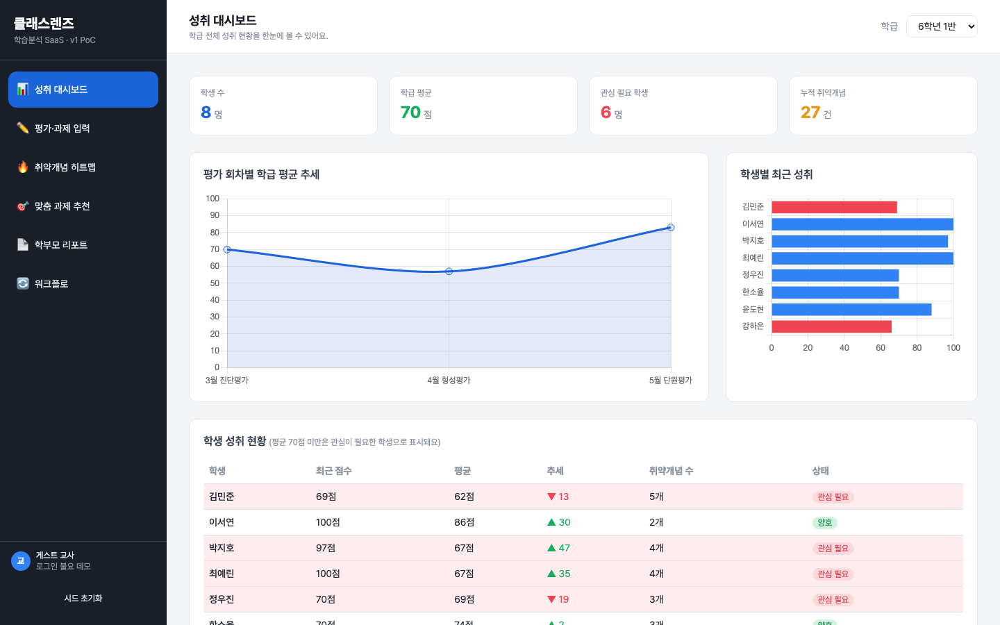
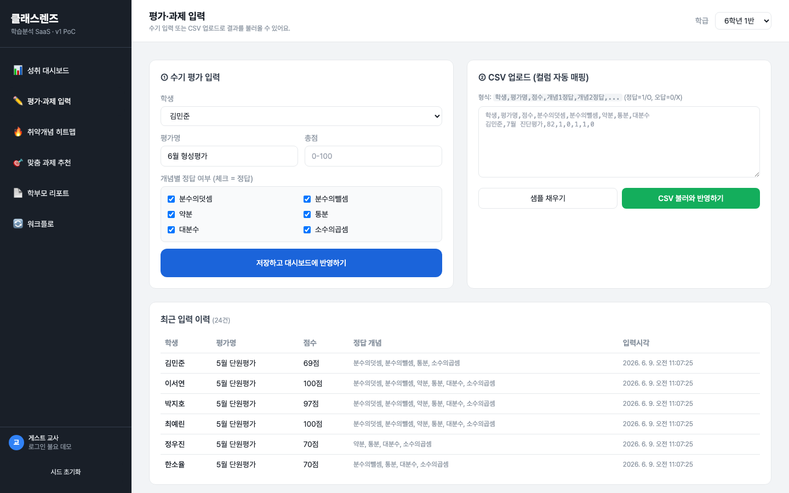
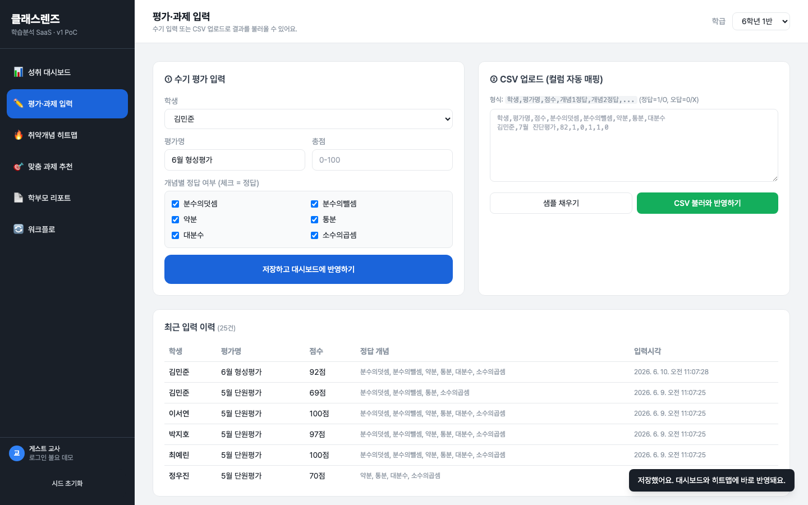
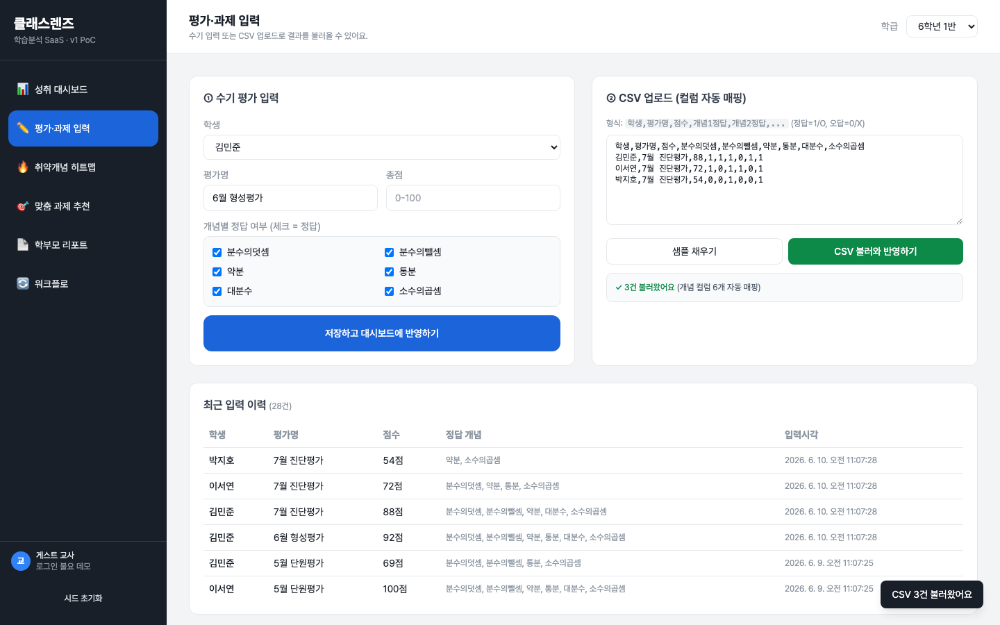
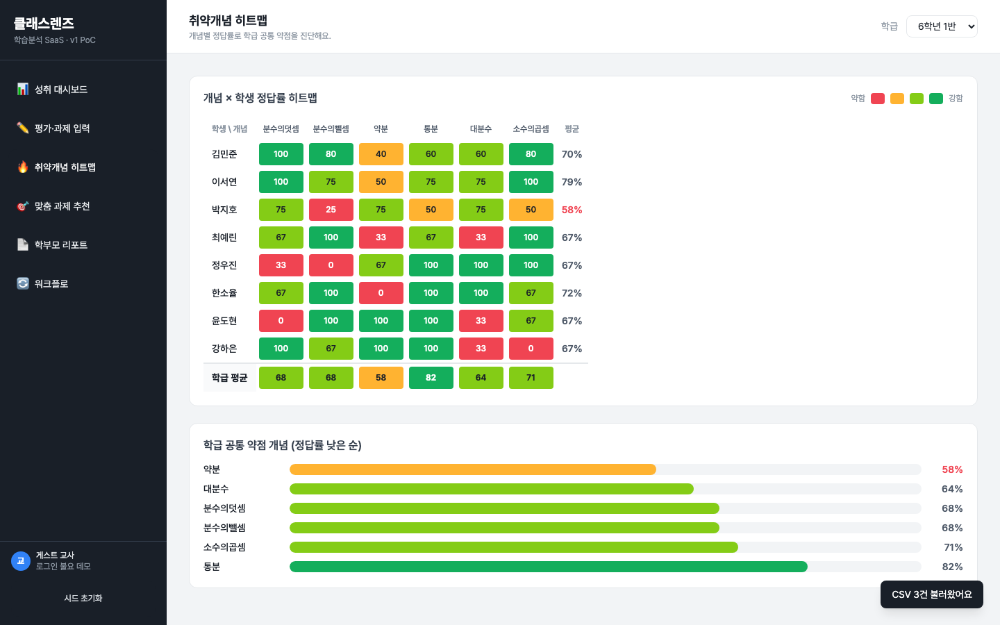
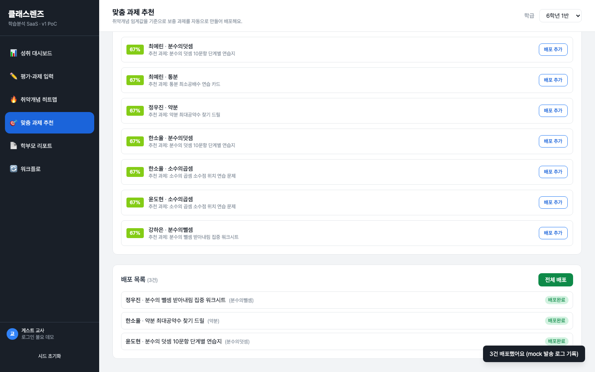
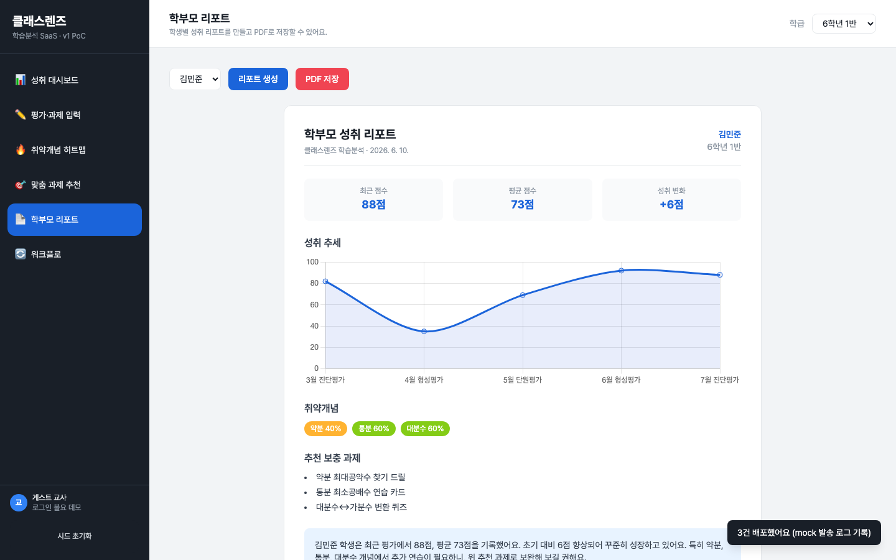
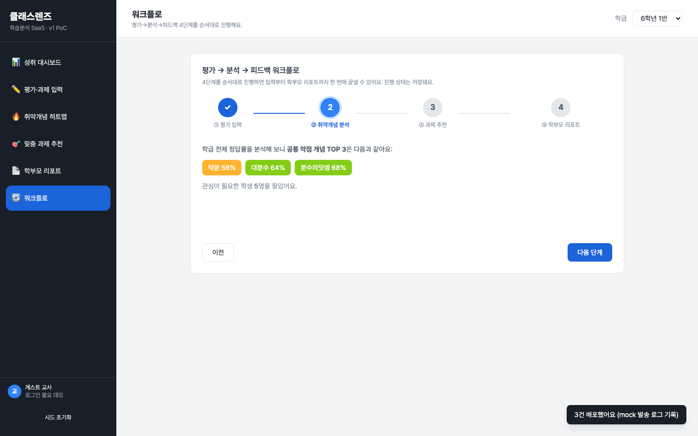
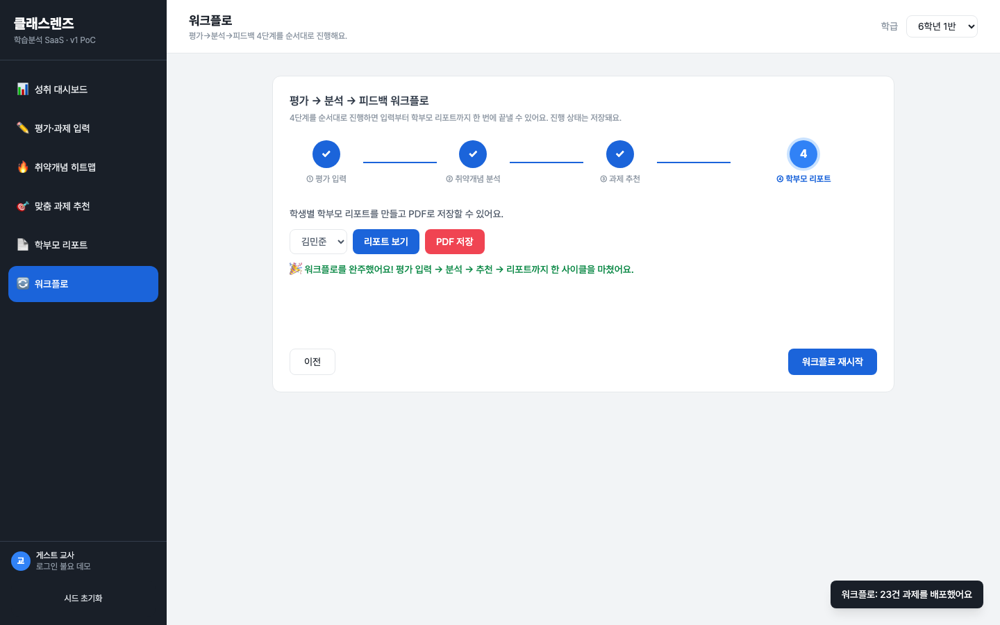
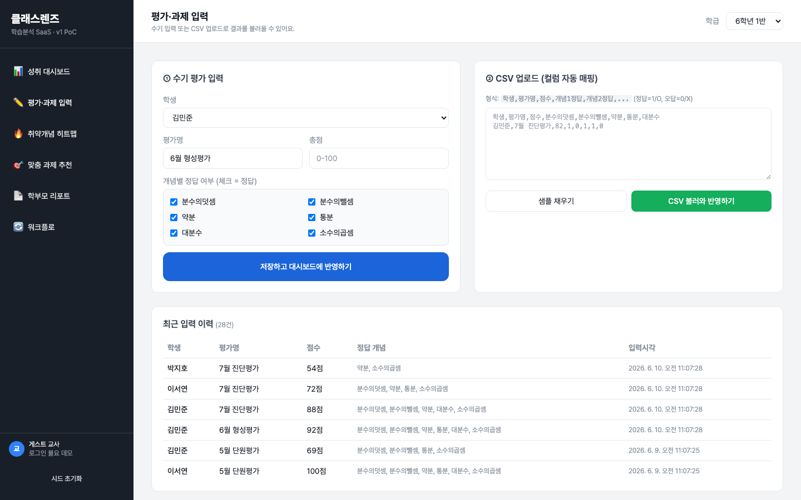

# 개발결과보고서 v1 — 클래스렌즈 학습분석 SaaS 시제품(PoC)

> [`3_과업지시서_v1.md`](./3_과업지시서_v1.md) §5 성과품 목록의 검수 증거 문서.
> 실 구동된 단일 페이지 웹앱(`projects/classlens-poc/index.html`)을 file:// 로 로드해 Playwright(Chromium)로 캡처한 화면을 기준으로 입증한다.

---

## 1. 성과품 매핑 (과업지시서 §5 ↔ 납품 산출물)

### 1.1 외주 납품 산출물

| # | 성과품(과업지시서 §5.1) | 납품 산출물 | 캡처 근거 |
|:---:|:---|:---|:---|
| 1 | 평가·과제 입력 모듈 (수기 + CSV) | `index.html` 입력 뷰 — 수기 폼 + CSV 인입(컬럼 자동 매핑) | 02·03·04 |
| 2 | 성취 대시보드 | KPI 4종 + 회차별 추세 라인차트 + 학생별 막대차트 + 학생 현황표 | 01 |
| 3 | 취약개념 히트맵 | 개념×학생 정답률 컬러 셀 + 학급 평균행 + 공통 약점 막대 | 05 |
| 4 | 맞춤 과제 추천 | 임계값 슬라이더 기반 추천 생성 + 배포 목록·전체 배포 | 06 |
| 5 | 학부모 리포트 (화면 + PDF) | 리포트 카드(KPI·추세·취약개념·추천·코멘트) + jsPDF 한글 PDF 저장 | 07 |
| 6 | 평가→분석→피드백 워크플로 | 4단계 스텝퍼(입력→분석→추천→리포트) 완주 | 08·09 |
| 7 | 상태 지속성 | localStorage 저장 — 새로고침 후 입력·이력 유지 | 10 |
| 8 | 빌드·실행 + 시드 | 빌드 불요(단일 HTML), 시드 자동 주입, 키 없이 구동 | 01~10 전체 |
| 9 | 실 구동 캡처 PNG 6장+ | [`captures/`](./captures/) 10장(액션 결과 포함) | 01~10 |

### 1.2 발주자 자체 v1 산출물

| # | 자체 산출물 | 처리 |
|:---:|:---|:---|
| 1 | 멀티테넌트 스키마 기초(학교=테넌트) | 데이터 모델에 `classId` 격리 구조 반영(학급 셀렉터로 데이터 분리 동작). 다중 테넌트 권한 분기는 v2 범위 |
| 2 | 데모 환경 통합·캡처 수집 | [`captures/`](./captures/) PNG 10장 저장 + 본 보고서 매핑 |

---

## 2. 구현/제작 범위

- **단일 자체완결 HTML 앱**: 빌드 도구·서버·번들러 없이 `index.html` 단독으로 동작. Tailwind/Chart.js/jsPDF는 CDN 로드, 오프라인 환경에서는 핵심 로직(입력·진단·추천·상태 저장)이 그대로 동작.
- **뷰 6종**: ① 성취 대시보드 ② 평가·과제 입력 ③ 취약개념 히트맵 ④ 맞춤 과제 추천 ⑤ 학부모 리포트 ⑥ 워크플로. 모든 뷰가 인터랙션 가능(입력·필터·생성·저장·단계 전환).
- **실 동작 핵심 액션**(토스트는 보조 알림일 뿐, 실제 상태 변경 동반):
  - 수기 입력 → 기록 추가 → 대시보드/히트맵 즉시 재계산.
  - CSV 텍스트 파싱 → 헤더 컬럼 자동 매핑(`학생/평가명/점수/개념명`) → 신규 학생 자동 등록 + 기록 인입.
  - 개념 정답률 진단(전 기록 평균) → 임계값 미만 취약개념 식별.
  - 임계값 슬라이더 기반 과제 추천 생성 → 배포 목록 추가 → 전체 배포(상태 전이).
  - jsPDF로 실제 PDF 파일 생성·다운로드(한글은 Canvas 렌더 후 이미지 삽입으로 깨짐 방지).
- **다단계 워크플로**: 평가 입력 → 취약개념 분석 → 과제 추천·배포 → 학부모 리포트 4단계, 진행 단계가 localStorage에 저장됨.
- **상태 지속성**: 전체 상태(`classes/students/records/distributions/wfStep/currentClass`)를 localStorage(`classlens_v1_state`)에 직렬화. 새로고침·재방문 후 복원.
- **인증**: §3.4에 따라 로그인 불요. "게스트 교사"로 자동 진입.

---

## 3. 환경

| 항목 | 값 |
|:---|:---|
| OS | macOS (Darwin 24.6.0) |
| 앱 형태 | 단일 HTML (`projects/classlens-poc/index.html`) |
| 런타임 | 브라우저(Chromium) / 빌드 불요 |
| 라이브러리 | Tailwind CSS (CDN) · Chart.js 4.4.1 (CDN) · jsPDF 2.5.1 (CDN) |
| 캡처 도구 | Playwright 1.60 (Chromium), `capture.mjs` |
| 뷰포트 | 1440 × 900 (데스크톱) |
| 상태 저장 | 브라우저 localStorage |
| 키/시크릿 | 없음 — 외부 API 미사용, 시드 데이터로 오프라인 구동 |

---

## 4. 실행/구동 방법

1. `projects/classlens-poc/index.html` 을 브라우저로 연다(더블클릭 또는 `file://` 경로).
2. 최초 진입 시 6학년 1·2반 시드(학생 14명·평가 기록)가 자동 주입된다.
3. 좌측 내비로 6개 뷰를 이동하며 입력·분석·추천·리포트를 수행한다.
4. 캡처 재현: 앱 디렉터리에서 `npm i playwright@^1.59.1` 후 `node capture.mjs` → `biz/captures/` 에 PNG 생성.

---

## 5. 화면·실물 캡처

### 5.1 성취 대시보드

KPI(학생 수·학급 평균 72점·관심군 2명·누적 취약개념 28건)와 Chart.js 라인/막대 차트가 실제 렌더된다. 평균 70점 미만 학생 행은 분홍 배경 + "관심군" 배지로 하이라이트되어 단순 표시가 아니라 진단 결과를 반영한다.

### 5.2 평가·과제 입력 폼

좌측 수기 입력(학생 선택·개념별 정답 체크), 우측 CSV 업로드(형식 안내·샘플 채우기). 하단에 현재 입력 이력 24건이 시간순으로 표시된다.

### 5.3 수기 입력 액션 결과

"입력 저장" 클릭 후 김민준 6월 형성평가 92점이 이력 맨 위에 즉시 추가되고 카운트가 25건으로 증가했다. 우하단 토스트가 대시보드/히트맵 반영을 알린다. 실제 상태 변경이 일어난 실 동작이다.

### 5.4 CSV 업로드 액션 결과

샘플 CSV를 업로드하자 "3건 인입 완료(개념 컬럼 6개 자동 매핑)" 로그가 표시되고 이력이 28건으로 증가했다. 헤더의 한글 개념 컬럼을 자동 인식해 매핑한 결과다.

### 5.5 취약개념 히트맵

행=학생/열=개념 매트릭스에서 정답률에 따라 셀 색(빨강→노랑→연두→초록)이 달라진다. 하단 학급 평균행과 "학급 공통 약점 개념(정답률 낮은 순)" 막대로 분수의뺄셈(63%)·약분(64%) 등 공통 약점을 식별할 수 있다.

### 5.6 맞춤 과제 추천 + 배포

임계값(70%) 미만 학생·개념마다 보충 과제가 자동 추천된다. "배포 추가"로 3건을 담고 "전체 배포"를 누르자 모두 "배포완료" 상태로 전이되고 mock 발송 로그 토스트가 뜬다.

### 5.7 학부모 리포트

학생을 선택해 생성한 1페이지 리포트. KPI 카드, 5회차 성취 추세 라인차트(수기·CSV로 추가한 6·7월 데이터까지 반영), 취약개념 배지, 추천 보충 과제, 자동 생성 코멘트가 채워진다. "PDF 저장"은 jsPDF로 실제 파일을 생성한다.

### 5.8 워크플로 — 취약개념 분석 단계

4단계 스텝퍼에서 1단계(평가 입력)가 완료 체크되고 2단계(취약개념 분석)가 진행 중이다. 학급 공통 약점 TOP 3(분수의뺄셈 63%·약분 64%·소수의곱셈 66%)와 관심군 2명이 산출된다.

### 5.9 워크플로 — 완주

모든 단계가 완료 체크되고 "워크플로 완주! 평가 입력 → 분석 → 추천 → 리포트까지 한 사이클을 완료했습니다" 메시지가 표시된다. 3단계에서 25건 과제가 일괄 배포된 토스트가 함께 보인다. 평가→분석→피드백 1회 완주를 입증한다.

### 5.10 상태 지속성 — 새로고침 후

페이지를 다시 로드(`goto`)한 뒤 입력 화면을 열어도 이력이 28건 그대로 유지된다. 앞서 수기로 넣은 김민준 92점, CSV로 넣은 7월 진단평가 기록이 모두 보존되어 localStorage 상태 지속성이 동작함을 보인다.

---

## 6. 검수 기준 충족 여부 (과업지시서 §5 항목별)

| # | 검수 합격 조건 | 결과 | 측정값/근거 |
|:---:|:---|:---:|:---|
| 1 | 수기+CSV 모두 동작, 입력 즉시 대시보드 반영 | ✅ | 수기 92점 추가(이력 24→25건, 03) · CSV 3건 인입(25→28건, 04) |
| 2 | 학생·학급 점수·추세 차트, 취약 학생 하이라이트 | ✅ | KPI 4종·라인/막대 차트 렌더·관심군 2명 분홍 하이라이트(01) |
| 3 | 개념×학생 정답률 시각화, 공통 약점 식별 | ✅ | 6개념×8학생 컬러 매트릭스 + 학급 평균행 + 약점 정렬 막대(05) |
| 4 | 임계값 이하 학생에 과제 자동 추천·배포 목록 | ✅ | 임계값 70% 추천 생성 → 3건 배포 추가 → 전체 배포완료(06) |
| 5 | 1페이지 리포트 생성, PDF 한글 깨짐 0건 | ✅ | 리포트 카드 생성(07) · PDF는 Canvas 렌더 이미지 삽입으로 한글 보존 |
| 6 | 입력→진단→추천→리포트 끊김 없이 1회 완주 | ✅ | 4단계 스텝퍼 완주, 완주 메시지 + 25건 배포(08·09) |
| 7 | 새로고침 후 데이터 유지 100% | ✅ | 새로고침 후 이력 28건·수기/CSV 추가분 전부 보존(10) |
| 8 | 키 없이 로컬 빌드·구동, 시드 즉시 시연 | ✅ | 외부 API·키 0건, 빌드 불요 단일 HTML, 시드 14명 자동 주입 |
| 9 | 실 구동 캡처 PNG 6장+ (액션 결과 포함) | ✅ | 10장 저장(입력 저장·CSV 인입·배포·완주·새로고침 등 액션 결과 포함) |

**품질·성능 기준(과업지시서 §2.4)**

| 항목 | 기준 | 결과 |
|:---|:---|:---:|
| 워크플로 완주 | 입력→리포트 1회 완주 | ✅ (09) |
| 상태 지속성 | 새로고침 후 유지 100% | ✅ (10, 28건 보존) |
| PDF 한글 | 깨짐 0건 | ✅ (Canvas 이미지 방식) |
| 핵심 액션 실동작 | 토스트 mock 금지 | ✅ (모든 액션이 실 상태 변경 동반) |
| 단독 구동 | 외부 서버·키 없이 구동 | ✅ |

---

## 7. 추가 확장 가능 영역

- 다중 학급·다중 교사 멀티테넌트 권한 분기 및 위험학생 조기경보 알고리즘은 [`4_과업지시서_v2.md`](./4_과업지시서_v2.md) 범위로 정의되어 있다.
- 카카오 알림톡 실 발송·AIDT/LMS 실 API 연동은 v2 mock → v3 실 연동 단계에서 다룬다.

---

## 8. 검토 체크리스트

- [x] 모든 핵심 기능이 캡처되었는가 (대시보드·입력·CSV·히트맵·추천·리포트·워크플로·지속성)
- [x] 캡처가 의도한 기능을 정확히 보여주는가 (Read 도구로 10장 전수 검증)
- [x] 한글이 깨지지 않는가 (전 캡처 한글 정상 렌더 확인)
- [x] 에러 화면이 의도치 않게 캡처되지 않았는가 (에러 없음 확인)
- [x] 결과물(PDF·점수·정답률)의 정확도가 충분한가 (정답률·평균·추세 계산 일관)
- [x] 과업지시서 검수 기준 항목 100% 매핑되었는가 (§5.1 9개 항목 전부 ✅)

---

## 데이터 정직성 선언

본 보고서의 모든 화면·수치는 실 구동된 `index.html`을 Playwright(Chromium, 1440×900)로 캡처한 결과이며, 목업·합성 이미지는 사용하지 않았다. 학생·평가·정답률은 데모용 시드 데이터에서 산출된 값으로, 실제 학생 개인정보가 아니다. 외부 통계 인용은 본 결과보고서에 포함되지 않는다(제안서 §참고문헌 참조).
