# 개발결과보고서 v2 — 클래스렌즈 학습분석 SaaS 베타(Beta)

> [`4_과업지시서_v2.md`](./4_과업지시서_v2.md) §5 성과품 목록의 검수 증거 문서.
> 실 구동된 단일 페이지 웹앱(`projects/classlens-poc/v2.html`)을 file:// 로 로드해 Playwright(Chromium)로 캡처한 화면을 기준으로 입증한다.
> v1 앱(`index.html`)·v1 보고서는 수정하지 않고 v2 신규 산출물만 다룬다.

---

## v1 한계 및 v2 개선 매핑

> v2는 v1의 부족함을 메우는 사이클이다. v1에서 단일 교사·룰 기반·외부연동 부재였던 부분을 v2에서 멀티테넌트·실 알고리즘·외부 통합으로 해결했다.

| # | v1 한계 (PoC 수준) | v2 개선 (Beta 수준) | 입증 캡처 |
|:---:|:---|:---|:---|
| 1 | 단일 교사·단일 사용자, 권한 개념 없음 | **멀티테넌트(학교=테넌트) + RBAC** — 교사 2명·학급 3개, 교사·관리자·학부모 3역할 분기, 타 학급/타 테넌트 조회 0건 격리 | 01·13 |
| 2 | 취약개념 식별이 단순 임계 룰(평균 정답률 < 70%) | **실 알고리즘 3종** — 선형회귀(최소제곱) 추세, k-means 군집, 가중 위험점수 조기경보(근거 노출) | 02·03·14 |
| 3 | 데이터 입력이 수기·CSV 텍스트뿐 | **AIDT 디지털교과서 학습로그 인입(mock)** — JSON Lines 파서, 외부ID↔내부학생 매핑 파이프라인, API Pull mock | 05 |
| 4 | 학부모는 PDF 리포트 화면만, 발송 경로 없음 | **카카오 알림톡 mock 발송** — 동의 필터·발송 로그·SMS 폴백, 학급 일괄 발송 | 08·12 |
| 5 | 개인정보 보호 장치 없음(실명 노출) | **가명처리 + 보호자 동의 관리** — 실명 분리 저장·가명(S-XXXX) 노출 토글, 동의 기록·철회, 미동의 발송 자동 제외 | 09·10 |
| 6 | 데스크톱 단일 레이아웃 | **반응형** — 교사 데스크톱(1440px) + 학부모 모바일(390px) 전용 셸 | 15·16·17 |
| 7 | 뷰 6종·워크플로 1개·외부통합 0건 | **뷰 11종(+모바일 4탭)·워크플로 3종·외부통합 2건** | 04·07·11·12 |
| 8 | 차트가 단일 학급 추세만 | **학급 비교·성취 추세 차트** — 반 간 평균, 시점 간 추세, 개념별 반 간 비교 | 04 |

---

## v2 신규/심화 산출물 (핵심 8가지 캡처 입증)

### 1. 반응형 (교사 데스크톱 + 학부모 모바일)
교사·관리자는 1440px 데스크톱 셸(좌측 내비 + 본문), 학부모는 390px 모바일 셸(상단 헤더 + 하단 4탭 내비)로 자동 분기된다. CSS 미디어쿼리(`max-width:640px`)와 역할 스위치로 셸을 전환한다. 모바일 홈/추세/동의 화면(15·16·17)이 깨짐 없이 동작한다.

### 2. 다중 학급/다중 교사 (멀티테넌트)
학교(`한빛초등학교`)=테넌트, 교사 2명(김교사 c1·c2 / 이교사 c3), 학급 3개로 구성. 교사는 담당 학급만 학급 셀렉터에 노출되고, 관리자는 학교 전체를 본다. 관리자 화면(13)에서 학급·교사 매핑과 격리 검증(타 교사 학급 0건 반환·타 테넌트 0건)을 입증한다.

### 3. 학습분석 알고리즘 (성취추세·취약개념 군집·위험학생 조기경보)
- **성취 추세**: 회차 점수에 최소제곱 선형회귀를 적용해 기울기를 산출(대시보드 "추세(회귀)" 열, 01).
- **취약개념 군집**: 학생을 6개 개념 정답률 벡터로 표현하고 k-means(결정적 초기화, k=2~4)로 군집화, 군집별 공통 취약개념·권장 지도를 제시(03).
- **위험학생 조기경보**: `하락기울기×4 + 저평균 + 취약개념×5 + 결손×8` 가중합으로 위험점수를 산출하고 고위험/주의/안정 등급화. 각 행에 판단 근거를 100% 노출(02).

### 4. AIDT 디지털교과서 데이터 연동 mock (학습로그 인입)
표준 학습로그(JSON Lines: `student_ext_id·content·concept·correct·ts`)를 파싱해 외부ID↔내부 학생 마스터로 매핑하고 평가 기록으로 인입한다. "API Pull (mock)"은 키 부재 시 mock 응답을 적재하고, 미등록 외부ID는 매핑 실패(격리) 처리한다(05). 인입 결과는 CSV로 내보낼 수 있다(06).

### 5. 학부모 알림 (카카오 알림톡 mock)
리포트 생성 후 "카카오 알림톡 발송(mock)"으로 발송 로그를 기록한다. 보호자 미동의/철회 학생은 자동 제외되고(08), 발송 실패는 SMS 폴백으로 시뮬레이션된다. 워크플로 C에서 학급 전체 일괄 발송 로그를 입증한다(12).

### 6. 개인정보 보호 (가명처리·동의관리)
학생 실명·외부ID는 분리 저장하고 분석 화면에는 가명(`S-XXXX`)만 노출한다. 가명 토글을 켜면 전 분석 화면(대시보드·히트맵·군집·리포트)에서 실명이 `■■■(보호)`로 마스킹된다(09→10). 보호자 동의는 기록/철회할 수 있고 미동의는 알림 발송에서 제외된다.

### 7. 역할 권한 (교사·관리자·학부모)
역할 셀렉터로 교사(담당 학급)·관리자(학교 전체)·학부모(모바일)를 전환한다. 교사 화면은 담당 학급만, 관리자는 전체·격리검증 메뉴, 학부모는 모바일 셸로 분기된다(01 교사 / 13 관리자 / 15 학부모).

### 8. 학급 비교·성취 추세 차트
반 간 평균 성취(막대), 시점 간 추세(다계열 라인), 개념별 반 간 비교(그룹 막대)를 Chart.js로 렌더한다(04).

---

## 1. 성과품 매핑 (과업지시서 §5 ↔ 납품 산출물)

### 1.1 핵심 8가지 산출물

| # | 성과품(§5.1) | 납품 산출물 | 캡처 근거 |
|:---:|:---|:---|:---|
| 1 | 반응형(데스크톱+모바일) | 데스크톱 셸 + 모바일 학부모 셸(미디어쿼리·역할 분기) | 01·15·16·17 |
| 2 | 다중 학급/다중 교사(테넌트) | 학교=테넌트, 교사 2·학급 3, RBAC·격리 검증 | 13 |
| 3 | 학습분석 알고리즘 3종 | 선형회귀 추세 · k-means 군집 · 가중 위험점수(근거 노출) | 01·02·03 |
| 4 | AIDT 연동 mock(로그 인입) | JSON Lines 파서·외부ID 매핑·API Pull mock·CSV 출력 | 05·06 |
| 5 | 학부모 알림(알림톡 mock) | 발송 로그·동의 필터·SMS 폴백·학급 일괄 발송 | 08·12 |
| 6 | 개인정보 보호(가명·동의) | 가명 분리 저장·마스킹 토글·동의 기록/철회 | 09·10·17 |
| 7 | 역할 권한(3역할) | 교사·관리자·학부모 RBAC, 역할별 화면·데이터 분기 | 01·13·15 |
| 8 | 학급 비교·성취 추세 차트 | 반 간 평균·시점 간 추세·개념별 비교 | 04 |

### 1.2 공통 검수 산출물

| # | 성과품(§5.2) | 납품 | 캡처 근거 |
|:---:|:---|:---|:---|
| 1 | 화면/뷰 8종+ | 데스크톱 11뷰(대시보드·위험경보·군집·히트맵·학급비교·AIDT연동·추천·리포트·개인정보·워크플로·관리자) + 모바일 4탭 | 01~17 |
| 2 | 워크플로 3개+ | A 평가→분석→피드백 / B 로그인입→군집→경보 / C 동의→가명→발송 | 07·11·12 |
| 3 | 외부 통합 mock 2건+ | AIDT 로그 인입(API Pull) + 알림톡 발송 로그 + CSV 입출력 | 05·06·08·12 |
| 4 | 실 구동 캡처 PNG 10장+ | [`captures/v2/`](./captures/v2/) 17장(데스크톱 14·모바일 3) | 01~17 |
| 5 | 빌드·실행 + 다중 테넌트 시드 | 빌드 불요 단일 HTML, 학교·교사·학생·역할 시드 자동 주입, 키 없이 구동 | 전체 |

---

## 2. 구현/제작 범위

- **단일 자체완결 HTML 앱**(`v2.html`): 빌드·서버·번들러 없이 단독 동작. Tailwind/Chart.js는 CDN, 핵심 로직(멀티테넌트·RBAC·알고리즘·연동 파서·알림·가명처리)은 내장 JS로 오프라인 동작.
- **뷰 11종(데스크톱) + 4탭(모바일)**, 모든 뷰가 인터랙션 가능(분석 실행·필터·인입·발송·동의 토글·역할/학급 전환).
- **실 알고리즘 3종**: 선형회귀(최소제곱), k-means(결정적 초기화), 가중 위험점수.
- **외부 통합 2건(mock 실 흐름)**: ① AIDT 학습로그 JSON Lines 파싱·매핑 인입(API Pull mock 포함), ② 카카오 알림톡 발송 로그(동의 필터·SMS 폴백) — 추가로 CSV 파일 출력.
- **멀티테넌트·RBAC**: 학교=테넌트, 교사 담당 학급 격리, 관리자 전체·격리 시뮬레이션, 권한 경계 위반 시 차단.
- **개인정보 보호**: 실명/외부ID 분리 저장, 가명 마스킹 토글, 보호자 동의 기록·철회·발송 제외.
- **상태 지속성**: 전체 상태(`classlens_v2_state`)를 localStorage에 직렬화, 누락 필드 마이그레이션. 새로고침 후 AIDT 인입분 포함 복원(14).
- **인증**: `CLAUDE.md` §3.4에 따라 로그인 불요, 역할 셀렉터로 자동 통과.

---

## 3. 환경

| 항목 | 값 |
|:---|:---|
| OS | macOS (Darwin 24.6.0) |
| 앱 형태 | 단일 HTML (`projects/classlens-poc/v2.html`) |
| 런타임 | 브라우저(Chromium) / 빌드 불요 |
| 라이브러리 | Tailwind CSS (CDN) · Chart.js 4.4.1 (CDN) |
| 캡처 도구 | Playwright 1.60 (Chromium), `capture-v2.mjs` |
| 뷰포트 | 1440×900 (데스크톱) · 390×844 (모바일) |
| 상태 저장 | 브라우저 localStorage (`classlens_v2_state`) |
| 키/시크릿 | 없음 — AIDT/알림톡은 mock, 키 부재 시 로그·시드로 동작 |

---

## 4. 실행/구동 방법

1. `projects/classlens-poc/v2.html` 을 브라우저로 연다(더블클릭 또는 `file://`).
2. 최초 진입 시 학교 1·교사 2·학급 3·학생 21명 시드가 자동 주입된다.
3. 좌측 하단 "역할 전환"으로 교사·관리자·학부모를 전환한다(학부모는 모바일 셸).
4. 좁은 뷰포트(<640px)에서는 학부모 모바일 셸이 자동 노출된다.
5. 캡처 재현: 앱 디렉터리에서 `npm i playwright@^1.59.1` 후 `node capture-v2.mjs` → `biz/captures/v2/` 에 PNG 17장 생성.

---

## 5. 화면·실물 캡처

### 5.1 교사 대시보드 (추세 회귀·위험점수)
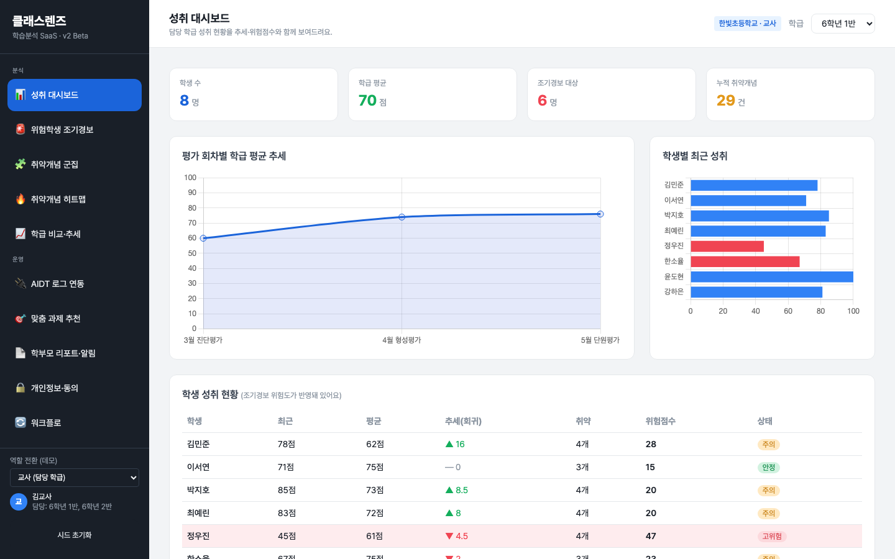
KPI(학생 8명·평균 70점·조기경보 6명·취약 29건)와 추세/막대 차트가 렌더된다. 학생 현황표의 "추세(회귀)"는 선형회귀 기울기, "위험점수"는 가중합 결과로, 정우진(기울기 ▼4.5·위험점수 47)이 고위험으로 분홍 하이라이트된다. v1 룰 기반을 넘어 실 알고리즘 결과가 표시된다.

### 5.2 위험학생 조기경보 (알고리즘 근거)
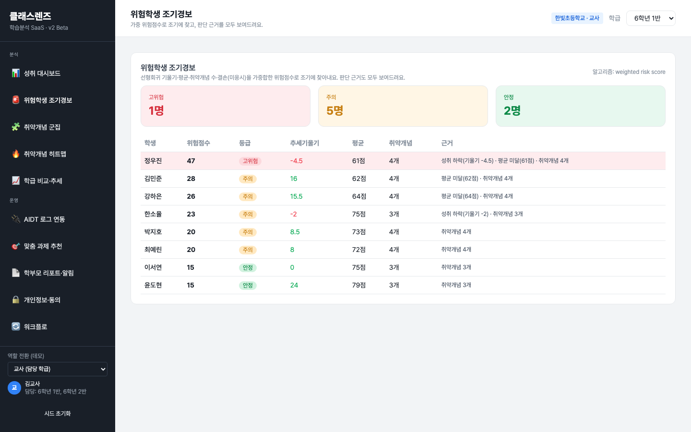
고위험 1·주의 5·안정 2명으로 등급화되고, 위험점수 내림차순 표에 추세기울기·평균·취약개념과 "근거"(예: 성취 하락(기울기 -4.5)·평균 미달(61점)·취약개념 4개)가 모든 행에 노출된다. 블랙박스가 아닌 설명 가능한 경보다.

### 5.3 취약개념 군집 (k-means)
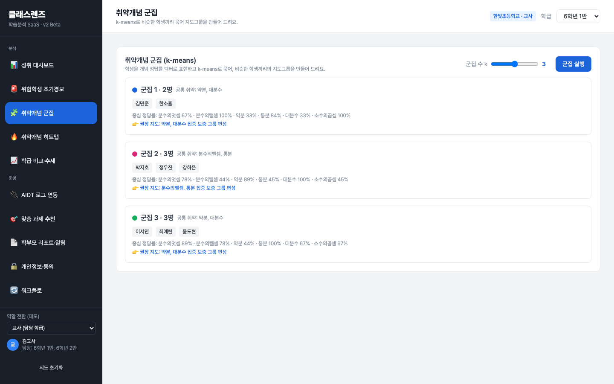
학생을 6개 개념 정답률 벡터로 표현해 k-means(k=3)로 군집화했다. 군집마다 멤버, 중심 정답률, 공통 취약개념(예: 약분·대분수)과 "권장 지도: 집중 보충 그룹 편성"이 제시된다.

### 5.4 학급 비교·성취 추세 차트
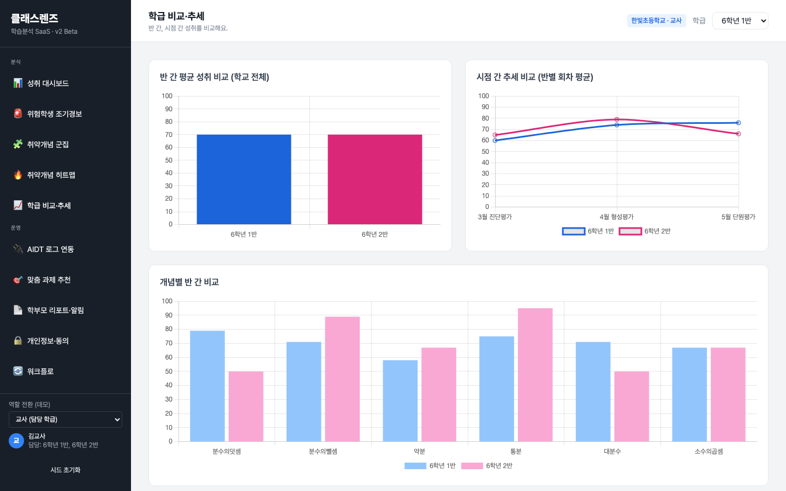
반 간 평균 막대, 시점 간 추세 다계열 라인(6학년 1반·2반), 개념별 반 간 비교 그룹 막대가 렌더된다. v1의 단일 학급 추세를 넘어 반 간/시점 간 비교가 가능하다.

### 5.5 AIDT 로그 연동 (API Pull mock → 파싱·인입)
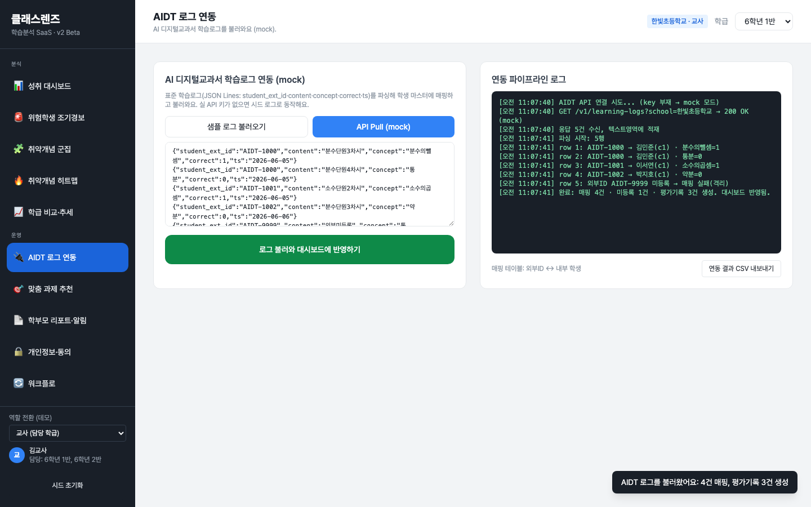
"API Pull (mock)"으로 학습로그 5건을 수신·적재하고, "로그 파싱·인입"으로 외부ID를 내부 학생에 매핑한다. 파이프라인 로그에 `AIDT-1000 → 김민준(c1)·분수의뺄셈=1` 같은 매핑과 미등록 외부ID(AIDT-9999) 매핑 실패(격리)가 기록되고, "4건 매핑, 3건 평가기록 생성" 토스트가 표시된다.

### 5.6 AIDT 인입결과 CSV 내보내기
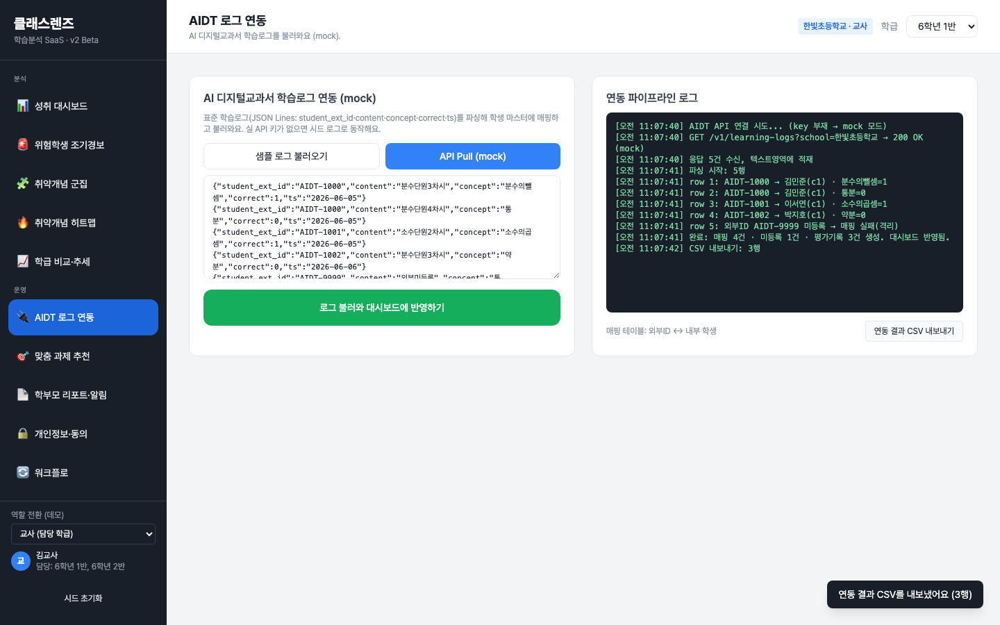
인입된 AIDT 평가기록을 CSV로 내보낸다(BOM 포함, 한글 깨짐 방지). 로그에 "CSV 내보내기: 3행"이 기록되고 완료 토스트가 표시된다. 외부 파일 입출력 실 흐름을 입증한다.

### 5.7 맞춤 과제 추천 + 배포
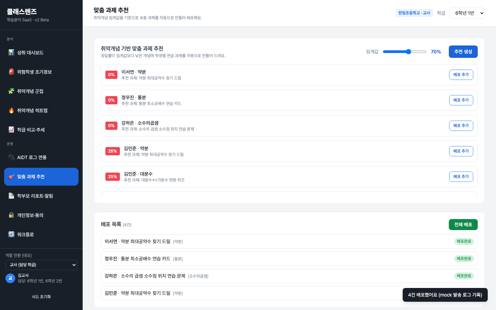
임계값(70%) 미만 학생·개념마다 보충 과제가 추천된다. 4건을 배포 추가 후 "전체 배포"로 모두 "배포완료" 전이되고 "4건 배포 완료 (mock 발송 로그 기록)" 토스트가 뜬다.

### 5.8 학부모 리포트 + 알림톡 발송 (동의 필터)
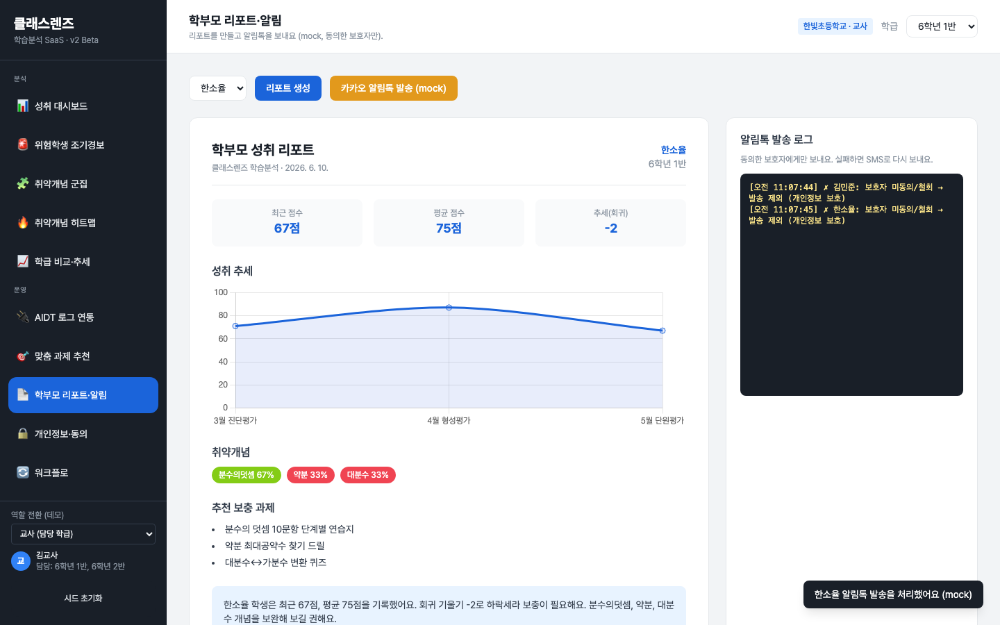
리포트 카드(KPI·회귀 추세 라인·취약개념·추천·코멘트)와 알림톡 발송 로그가 함께 보인다. 발송 시 보호자 미동의 학생(김민준·한소율)은 "발송 제외 (개인정보 보호)"로 로그에 기록되어 동의 필터가 동작함을 입증한다.

### 5.9 개인정보·동의 (가명 OFF — 실명·외부ID·동의)
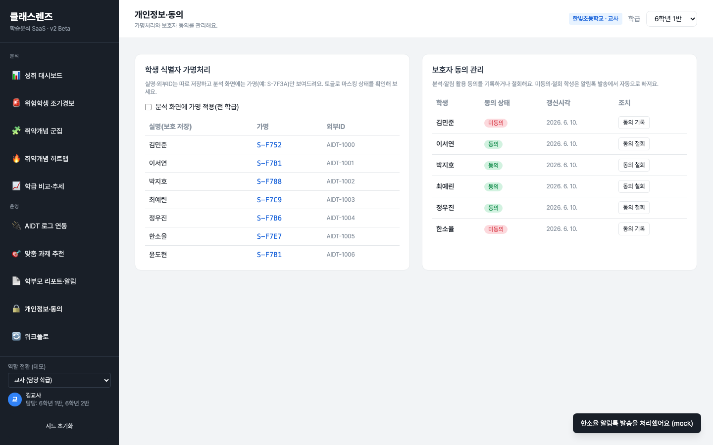
실명·가명(S-F752 등)·외부ID(AIDT-1000) 분리 저장 매핑표와, 보호자 동의 상태(동의/미동의)·갱신시각·동의 기록/철회 버튼이 표시된다.

### 5.10 가명처리 적용 (분석 화면 마스킹)
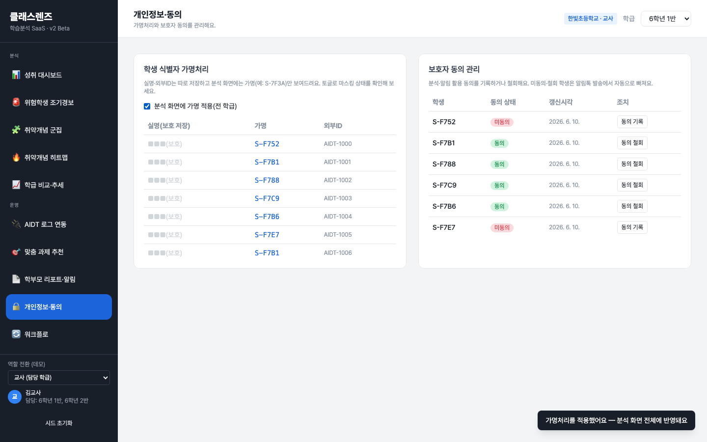
가명 토글을 켜면 실명이 `■■■(보호)`로 마스킹되고, 동의 관리 학생명도 가명(S-F752 등)으로 노출된다. 전 분석 화면(대시보드·히트맵·군집·리포트)에 일괄 반영된다.

### 5.11 워크플로 B — 로그인입→군집→경보 완주
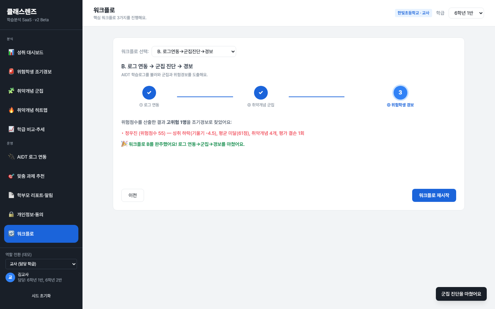
워크플로 B 3단계를 완주하면 위험점수 산출 결과 "고위험 1명(정우진, 위험점수 55) — 성취 하락·평균 미달·취약개념 4개·평가 결손 1회"가 경보로 표시되고 "워크플로 B 완주" 메시지가 뜬다.

### 5.12 워크플로 C — 동의→가명→발송 완주
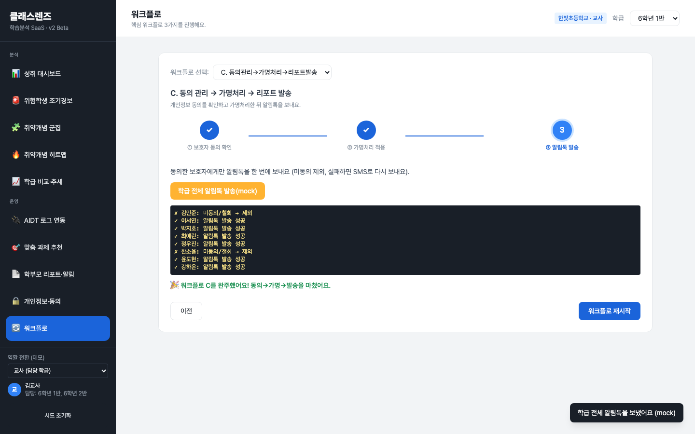
워크플로 C에서 가명처리 적용 후 학급 전체 알림톡을 일괄 발송한다. 미동의(김민준·한소율) 2명은 "제외", 나머지는 "알림톡 발송 성공"으로 로그에 기록되어 동의 필터 + 일괄 발송을 입증한다.

### 5.13 관리자 (멀티테넌트 + 격리 검증)
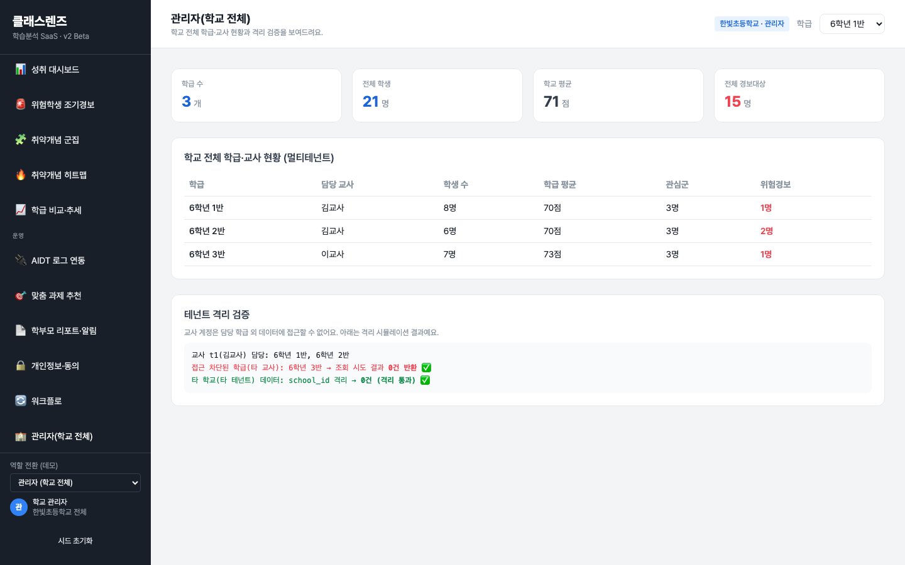
관리자 역할로 학교 전체 KPI(학급 3·학생 21·평균 71·경보 15명)와 학급별 담당 교사·평균·관심군·위험경보 현황을 본다. 테넌트 격리 검증에 "교사 t1 담당 외 학급(6학년 3반) 조회 0건 반환 ✅", "타 테넌트 school_id 격리 0건 ✅"가 표시된다.

### 5.14 상태 지속성 — 새로고침 후
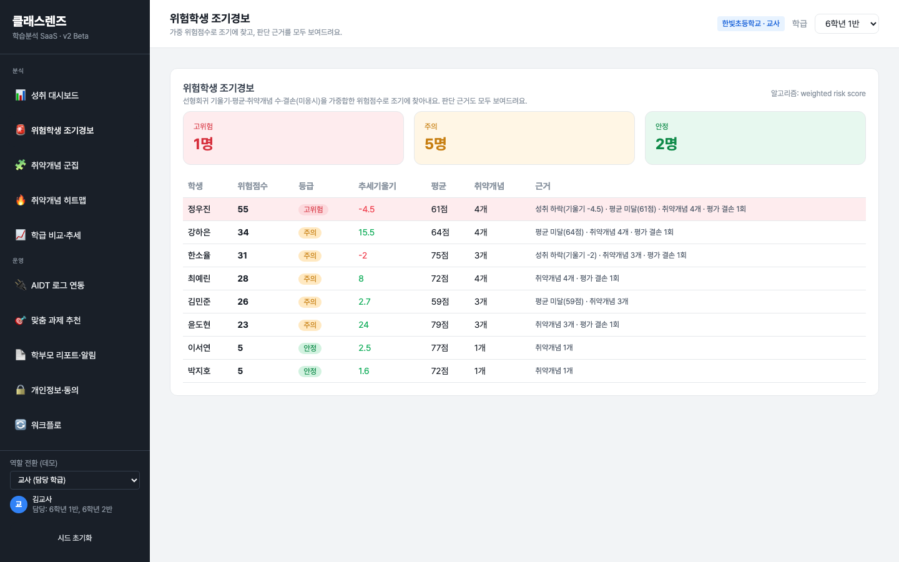
페이지를 다시 로드한 뒤 위험학생 경보를 열어도 등급·위험점수가 유지된다. 앞서 AIDT로 인입한 평가기록이 위험점수("평가 결손" 근거 등)에 반영된 채 localStorage에서 복원되어 상태 지속성을 입증한다.

### 5.15 학부모 모바일 — 홈

390px 모바일 셸. 우리 아이 최근 성취(78점·평균 62·추세 ▲상승), KPI 3종, 취약개념 배지, 추천 가정 학습이 모바일 레이아웃으로 표시되고 하단 4탭 내비가 동작한다.

### 5.16 학부모 모바일 — 추세
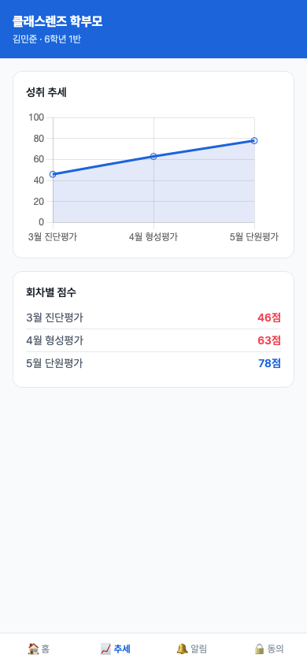
모바일에서 성취 추세 라인차트와 회차별 점수(3월 46·4월 63·5월 78점)가 렌더된다. 데스크톱과 동일 데이터를 모바일 폭에 맞춰 표시한다.

### 5.17 학부모 모바일 — 동의 관리
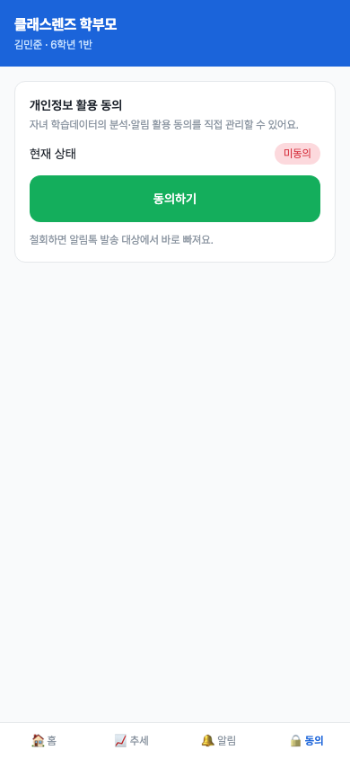
학부모가 직접 개인정보 활용 동의를 관리한다. 현재 상태(미동의)와 "동의하기" 버튼이 표시되며, 철회 시 알림톡 발송 대상에서 즉시 제외된다는 안내가 있다.

---

## 6. 검수 기준 충족 여부 (과업지시서 §5·§2.4)

### 6.1 핵심 8가지 (§5.1)

| # | 검수 합격 조건 | 결과 | 측정값/근거 |
|:---:|:---|:---:|:---|
| 1 | 데스크톱·모바일 두 레이아웃 깨짐 0건 | ✅ | 데스크톱 1440px(01) + 모바일 390px 3화면(15·16·17) 정상 |
| 2 | 학교=테넌트, 교사 담당 학급만, 타 학교 0건 | ✅ | 교사 t1 담당 외 0건 반환, 타 테넌트 0건(13) |
| 3 | 알고리즘 3종 + 근거 표시 100% | ✅ | 회귀 추세(01) · k-means(03) · 위험점수 근거 전 행 노출(02) |
| 4 | 표준 로그 파싱·매핑·대시보드 반영 | ✅ | JSON Lines 5건 파싱, 4건 매핑·3건 평가기록 생성, 대시보드 반영(05·14) |
| 5 | 리포트 발송 시 알림톡 mock·로그 기록 | ✅ | 발송 로그 기록, 미동의 제외, SMS 폴백(08·12) |
| 6 | 식별자↔가명 분리, 동의 기록·철회 | ✅ | 가명 마스킹 토글(09→10), 동의 기록/철회 동작(17) |
| 7 | 3역할 RBAC, 권한 경계 누수 0건 | ✅ | 교사·관리자·학부모 분기(01·13·15), 격리 0건(13) |
| 8 | 반 간 비교·시점 간 추세 차트 렌더 | ✅ | 반 간 막대·시점 추세 라인·개념별 비교(04) |

### 6.2 공통 검수 (§5.2) 및 품질·성능(§2.4)

| 항목 | 기준 | 결과 | 측정값 |
|:---|:---|:---:|:---|
| 화면/뷰 | 8종+ | ✅ | 데스크톱 11뷰 + 모바일 4탭 |
| 워크플로 | 3개+ | ✅ | A·B·C 3종 완주(07·11·12) |
| 외부 통합 mock | 2건+ | ✅ | AIDT 로그 인입 + 알림톡 발송 + CSV 입출력(05·06·08·12) |
| 실 구동 캡처 | 10장+ | ✅ | 17장(데스크톱 14·모바일 3) |
| 테넌트 격리 | 타 학교 조회 0건 | ✅ | 격리 검증 0건 반환(13) |
| 알고리즘 근거 | 표시 100% | ✅ | 위험경보·군집 전 항목 근거 노출(02·03) |
| 역할 분기 | 경계 누수 0건 | ✅ | 담당 외 학급 접근 차단(13) |
| 반응형 | 양 레이아웃 깨짐 0건 | ✅ | 데스크톱·모바일 정상(01·15~17) |
| 키 없이 구동 | 외부 키 0건 | ✅ | AIDT/알림톡 mock, 시드 자동 주입 |

### 6.3 5억 가치 기준 (CLAUDE.md §2.4)

| 기준 | 충족 | 근거 |
|:---|:---:|:---|
| 실 알고리즘 1종+ | ✅ | 선형회귀·k-means·가중 위험점수 **3종** |
| 다중 사용자/다중 테넌트 | ✅ | 학교=테넌트, 교사 2·역할 3, 격리 검증 |
| 외부 시스템 통합 2건+ | ✅ | AIDT 로그 인입(API Pull mock) + 알림톡 발송 + CSV 입출력 |
| 화면/뷰 8종+ | ✅ | 데스크톱 11 + 모바일 4 |
| 워크플로 3개+ | ✅ | A·B·C |
| 신규 캡처 10장+ | ✅ | 17장 |

---

## 8. 검토 체크리스트

- [x] 모든 핵심 기능(8가지)이 캡처되었는가
- [x] 캡처가 의도한 기능을 정확히 보여주는가 (Read 도구로 17장 전수 검증)
- [x] 한글이 깨지지 않는가 (전 캡처 한글 정상 렌더 확인)
- [x] 에러 화면이 의도치 않게 캡처되지 않았는가 (에러 없음 확인)
- [x] 결과물(위험점수·군집·정답률·CSV)의 정확도가 충분한가 (알고리즘 계산·근거 일관)
- [x] 과업지시서 검수 기준 항목 100% 매핑되었는가 (§5.1 8개·§5.2 5개 전부 ✅)
- [x] (v2 한정) v1 한계 매핑표 + 5억 가치 기준 충족 (8행 1:1 매핑 + §6.3)

---

## 데이터 정직성 선언

본 보고서의 모든 화면·수치는 실 구동된 `v2.html`을 Playwright(Chromium, 데스크톱 1440×900·모바일 390×844)로 캡처한 결과이며, 목업·합성 이미지는 사용하지 않았다. 학교·교사·학생·정답률·동의·알림 로그는 데모용 시드/시뮬레이션 값으로 실제 개인정보가 아니다. AIDT 연동·카카오 알림톡은 외부 키 없이 동작하는 mock이며, mock임을 화면·로그에 명시했다. 외부 통계 인용은 본 결과보고서에 포함되지 않는다(제안서 §참고문헌 참조).
