# 개발결과보고서 v3 — 클래스렌즈 학습분석 SaaS 상용·심화(Series A)

> [`5_과업지시서_v3.md`](./5_과업지시서_v3.md) §5 성과품 목록의 검수 증거 문서.
> 실 구동된 단일 페이지 웹앱(`projects/classlens-poc/v3.html`)을 file:// 로 로드해 Playwright(Chromium)로 캡처한 화면을 기준으로 입증한다.
> v1(`index.html`)·v2(`v2.html`)·해당 보고서는 수정하지 않고 v3 신규 산출물만 다룬다.

---

## v2 한계 및 v3 개선 매핑

> v3는 v2의 부족함을 메우는 사이클이다. v2가 단일 학교 테넌트·현재 상태 진단(추세·군집·위험점수)·단일 소스·단건 알림 수준이었던 부분을, v3에서 다계층 테넌트·미래 예측·멀티 소스·캠페인·협업·거버넌스·형평성으로 해결했다.

| # | v2 한계 (Beta 수준) | v3 개선 (Series A 수준) | 입증 캡처 |
|:---:|:---|:---|:---|
| 1 | 분석이 **현재 상태 진단**에 한정(추세 회귀·군집·위험점수) — 미래 예측 부재 | **예측 모델 2종** — 능선회귀(L2 닫힌해) 학기말 성취 예측+95% 신뢰구간 + 로지스틱 위험확률(0~100%), 특성 기여도 근거 노출 | 02·14·16 |
| 2 | 테넌트가 **학교 단일 계층**(교사·관리자·학부모 3역할) | **다계층 테넌트** — 교육청>학교>학급 3계층 롤업, 역할 **4종**(교육청 관리자 추가), 상위는 집계·가명만(개별 식별정보 0건) | 01·13 |
| 3 | 피드백이 취약개념 단건 과제 추천 | **개입 추천 엔진** — 선수개념 그래프 역추적으로 단계별(진단→선수보충→본개념→심화) 맞춤 학습경로 생성 | 04·11 |
| 4 | 외부 연동이 **AIDT 단일 소스** mock | **멀티 소스 커넥터** — AIDT·LMS·CSV 3소스 스키마 정규화 인입·소스 태깅·CSV 출력 | 05·06 |
| 5 | 학부모 알림이 **단건 mock 발송** | **학부모 앱** — 세그먼트 알림톡 캠페인 일괄 발송·발송 통계 + 상담 예약 슬롯 | 08·17 |
| 6 | 교사 간 협업 기능 부재(고립된 교사 화면) | **교사 협업** — 공동 루브릭 작성·공유·채택(복제) 확산 + 학급 간 평가 공유 | 07 |
| 7 | 개인정보가 가명·동의 기록/철회 수준 | **거버넌스 고도화** — 접근 감사 로그·보존정책 만료 파기·동의 일괄 철회 | 09·10 |
| 8 | 리포트가 학급 비교 차트 수준 | **형평성 분석** — 지니계수·사분위·로렌츠 곡선·학급 간 격차지수·권고 | 03·12 |

---

## v3 신규/심화 산출물 (핵심 8가지 캡처 입증)

### 1. 예측 모델 (학기말 성취 예측·중도이탈/위험 예측)
- **학기말 성취 예측**: 각 학생의 회차 점수를 `[bias, 회차index, 출석률, 과제완수율, 취약개념수]` 특성으로 두고 **능선회귀(Ridge, `w=(XᵀX+λI)⁻¹Xᵀy`, λ=1, 가우스 소거 닫힌해)** 로 적합해 다음 회차 점수를 예측한다. 잔차 표준편차로 **95% 신뢰구간**(±1.96σ)을 함께 산출한다(02 — "학기말 예측"·"95% 신뢰구간" 열).
- **중도이탈/위험 예측**: 동일 특성(추세 하락·저평균·취약개념·낮은 출석률·낮은 과제완수율)을 **로지스틱 함수**로 0~100% 위험확률로 변환·등급화(고위험≥60%·주의≥35%·안정). 각 학생의 **특성 기여도**(예: `취약개념 +1.12 · 저평균 +0.35`)를 100% 노출한다(02 — "위험확률 상위 — 특성 기여도"). 블랙박스가 아닌 설명 가능한 예측이다.

### 2. 학교/교육청 다계층 통합 대시보드 (다계층 테넌트)
교육지원청(`한빛교육지원청`, 상위 테넌트) > 학교 2개(`한빛초`·`샛별초`) > 학급 5개 3계층. 교육청 관리자는 **관할 학교 롤업**(학교별 평균·예측 위험군 비중·형평성 지니)을 보고, 학교 관리자는 학급 롤업을 본다. 상위 테넌트는 하위 **집계·가명만** 조회하며 개별 학생 실명·식별정보는 노출되지 않는다(01 — "개별 학생 식별정보 비노출 — 집계만"). 다계층 격리 검증에 "교육청은 집계·가명만 — 개별 식별정보 0건", "타 교육지원청 district_id 격리 0건"이 표시된다.

### 3. 개입 추천 엔진 (취약개념→맞춤 학습경로)
개념 선수관계 그래프(`약분→통분→분수의덧셈/뺄셈→대분수`)에서 학생의 취약개념을 시작점으로 **선수 결손까지 역추적**(`prereqClosure`)해, 결손 선수개념이 있으면 보충 단계를 끼워 **진단→선수보충→본개념→심화** 단계별 학습경로를 자동 생성한다. 학생별 경로·예상 소요시간·자료(TASK_BANK)가 매핑되고 "이 경로 배포"로 학생에게 배포된다(04). 위험군 일괄 경로 생성·배포도 워크플로 A에서 입증된다(11).

### 4. 다중 소스 LMS/AIDT 학습로그 연동 mock (멀티 커넥터)
**AIDT·LMS·CSV 3개 커넥터**가 각자 다른 원시 스키마(AIDT `student_ext_id/concept/correct`, LMS `userId/skill/pass`, CSV `외부ID,개념,정답(O/X)`)를 **표준 학습로그로 정규화**해 인입한다. 외부ID↔내부 학생 매핑, 미등록 외부ID(AIDT-9999) 매핑 실패(격리), 소스 태깅이 파이프라인 로그에 기록된다(05). 정규화 결과는 CSV로 내보낼 수 있다(06, BOM 포함 한글 깨짐 방지). 키 부재 시 mock 응답으로 동작한다.

### 5. 학부모 앱 (알림톡 캠페인·상담 예약)
**세그먼트**(전체·예측 위험군·취약개념 보유)를 대상으로 알림톡 캠페인을 일괄 발송하고 발송 통계(발송 성공·미동의 제외·SMS 폴백)를 집계한다. 미동의/철회 학부모는 자동 제외된다(08). **상담 예약 슬롯**(교사 가용 시간)을 학부모가 선택·확정하며 확정 알림톡(mock)이 발송된다. 학부모 모바일 앱에서도 예약이 가능하다(17).

### 6. 교사 협업 (공동 루브릭·평가 공유)
교사가 **공동 루브릭**(평가 기준표)을 작성해 학교 교사 라이브러리에 공유하면, 다른 교사가 **채택(복제)** 할 때마다 확산 카운트가 올라간다. 학급 간 평가 결과(평균)도 공유되어 평가 기준을 정렬한다(07).

### 7. 개인정보 거버넌스 고도화 (접근감사·보존정책·동의 철회)
모든 민감정보 접근(주체·역할·행위·대상·시각)이 **감사 로그**에 자동 기록된다. **보존정책**은 보존기간(예: 졸업생 3년·감사로그 1년) 만료 도래 항목을 식별해 "만료 데이터 파기 처리"로 파기한다. **동의 일괄 철회**는 세그먼트(현재 학급·동의자)를 골라 일괄 철회하면 분석/발송에서 즉시 제외되고 감사 로그에 기록된다(09→10).

### 8. 성취 격차·형평성 분석 리포트
성취 분포의 **지니계수**(정렬·누적 기반 산출), **사분위(Q1~Q4) 학생 수**, **로렌츠 곡선**(완전 평등선 대비 누적 성취), 상하위 25% 격차, **학급 간 격차지수**(최고−최저 학급 평균)를 산출하고 지니계수 기반 권고를 제시한다(03). 교육청 관점의 학교 간 형평성 진단·권고는 워크플로 D에서 입증된다(12).

---

## 1. 성과품 매핑 (과업지시서 §5 ↔ 납품 산출물)

### 1.1 핵심 8가지 산출물

| # | 성과품(§5.1) | 납품 산출물 | 캡처 근거 |
|:---:|:---|:---|:---|
| 1 | 예측 모델(성취 예측·위험 예측) | 능선회귀 예측+신뢰구간 · 로지스틱 위험확률 · 특성 기여도 노출 | 02·14·16 |
| 2 | 다계층 통합 대시보드(다계층 테넌트) | 교육청>학교>학급 3계층 롤업, 상위 개별 식별정보 0건 | 01·13 |
| 3 | 개입 추천 엔진 | 선수개념 그래프 역추적·단계별 학습경로·배포 | 04·11 |
| 4 | 멀티 소스 연동 mock | AIDT·LMS·CSV 3소스 정규화 인입·CSV 출력 | 05·06 |
| 5 | 학부모 앱(캠페인·예약) | 세그먼트 캠페인·발송 통계 · 상담 예약 슬롯 | 08·17 |
| 6 | 교사 협업(루브릭·공유) | 루브릭 작성·공유·채택 확산·평가 공유 | 07 |
| 7 | 개인정보 거버넌스 | 접근감사 로그·보존정책 파기·동의 일괄 철회 | 09·10 |
| 8 | 형평성 분석 리포트 | 지니·사분위·로렌츠·격차지수·권고 | 03·12 |

### 1.2 공통 검수 산출물

| # | 성과품(§5.2) | 납품 | 캡처 근거 |
|:---:|:---|:---|:---|
| 1 | 화면/뷰 10종+ | 데스크톱 10뷰(교육청·학교·예측·형평성·개입·연동·협업·캠페인·거버넌스·워크플로) + 모바일 4탭 | 01~17 |
| 2 | 워크플로 4개+ | A 예측→개입→배포 / B 멀티소스→정규화→예측갱신 / C 철회·만료→감사→제외 / D 교육청롤업→형평성→권고 | 11·12 |
| 3 | 외부 통합 mock 3건+ | AIDT·LMS·CSV 인입 + 알림톡 캠페인 발송 + CSV 입출력 | 05·06·08 |
| 4 | 실 구동 캡처 PNG 12장+ | [`captures/v3/`](./captures/v3/) 17장(데스크톱 14·모바일 3) | 01~17 |
| 5 | 빌드·실행 + 다계층 테넌트 시드 | 빌드 불요 단일 HTML, 교육청·학교 2·학급 5·학생 34·4역할 시드 자동 주입, 키 없이 구동 | 전체 |

---

## 2. 구현/제작 범위

- **단일 자체완결 HTML 앱**(`v3.html`): 빌드·서버·번들러 없이 단독 동작. Tailwind/Chart.js는 CDN, 핵심 로직(다계층 테넌트·예측 알고리즘·선수개념 그래프·멀티 커넥터·캠페인·협업·거버넌스·형평성)은 내장 JS로 오프라인 동작.
- **뷰 10종(데스크톱) + 4탭(모바일)**, 모든 뷰가 인터랙션 가능(예측 실행·경로 생성/배포·멀티소스 인입·캠페인 발송·예약·루브릭 채택·동의 철회·파기·역할/스코프 전환).
- **실 알고리즘 2종+**: ① 능선회귀(L2 정규화 닫힌해, 가우스 소거) 학기말 성취 예측 + 신뢰구간, ② 로지스틱 위험확률(특성 기여도 분해). 추가로 지니계수·로렌츠 누적·선수개념 그래프 역추적.
- **다계층 테넌트·4역할 RBAC**: 교육청>학교>학급 롤업, 상위는 집계·가명만, 역할(교육청·학교·교사·학부모)별 화면·데이터 분기, 권한 경계 위반 시 차단.
- **외부 통합 3건+(mock 실 흐름)**: AIDT·LMS·CSV 3소스 정규화 인입(스키마별 매핑) + 알림톡 캠페인 발송 로그 — 추가로 CSV 파일 출력.
- **개인정보 거버넌스**: 모든 민감정보 접근 감사 로그 자동 기록, 보존정책 만료 파기, 동의 일괄 철회·발송/분석 제외.
- **상태 지속성**: 전체 상태(`classlens_v3_state`)를 localStorage에 직렬화, 누락 필드 마이그레이션. 새로고침 후 인입분·예측·가명처리 포함 복원(14).
- **인증**: [`../../CLAUDE.md`](../../CLAUDE.md) §3.4에 따라 로그인 불요, 역할 셀렉터로 자동 통과.

### 2.1 누적 기능 목록표 (v1+v2+v3 = 112개)

> 키트 정량 기준(실 동작 기능 **100개 이상**) 충족 입증. **토스트·정적 mock 은 카운트에서 제외**했고, *사용자가 수행 가능한 구체 액션/뷰/연산*만 1개로 센다(중복 분할 없음). 각 기능은 해당 버전의 실 구동 코드(`index.html`=v1·`v2.html`·`v3.html`의 함수/뷰)에 1:1 대응한다. v1·v2 기능은 [v1 보고서](./3_1_개발결과보고서_v1.md)·[v2 보고서](./4_1_개발결과보고서_v2.md)에서, v3 신규 기능은 본 보고서 §5 캡처에서 입증한다. 누계 **112개**.

| # | 버전 | 영역 | 기능(사용자 액션/뷰/연산) |
|:---:|:---:|:---|:---|
| 1 | v1 | 대시보드 | 학급 선택 → 성취 대시보드 렌더 |
| 2 | v1 | 대시보드 | 학생별 평균 점수 계산·표시 |
| 3 | v1 | 대시보드 | 성취 추세(trend) 라인 차트 |
| 4 | v1 | 대시보드 | 최근 점수(lastScore) 표시 |
| 5 | v1 | 히트맵 | 단원·개념 단위 정오답 히트맵 렌더 |
| 6 | v1 | 히트맵 | 개념별 정답률(conceptRate) 계산 |
| 7 | v1 | 히트맵 | 히트맵 색상 단계(heatColor) 매핑 |
| 8 | v1 | 진단 | 학생별 취약개념 도출(studentWeakConcepts) |
| 9 | v1 | 진단 | 학급 개념 정답률(classConceptRate) 집계 |
| 10 | v1 | 입력 | 평가·과제 수기 입력 폼 |
| 11 | v1 | 입력 | 학급 선택 셀렉트 채우기(fillClassSelect) |
| 12 | v1 | 추천 | 취약개념 기반 맞춤 과제 추천 생성 |
| 13 | v1 | 추천 | 추천 과제 리스트 렌더 |
| 14 | v1 | 배포 | 추천 과제 배포(addDistribution) |
| 15 | v1 | 배포 | 배포 분포 뷰 렌더 |
| 16 | v1 | 리포트 | 학부모 리포트 생성(buildReport) |
| 17 | v1 | 리포트 | 리포트 컨트롤(대상·항목) 선택 |
| 18 | v1 | 기록 | 평가 기록 조회(renderRecords) |
| 19 | v1 | 기록 | 학생별 기록 필터(studentRecords) |
| 20 | v1 | 워크플로 | 진단→처방→소통 워크플로 뷰 |
| 21 | v1 | 공통 | 뷰 전환(setView) 6뷰 네비게이션 |
| 22 | v1 | 공통 | 드로어 열기/닫기(openDrawer/closeDrawer) |
| 23 | v1 | 공통 | 상태 저장/복원(save/load, localStorage) |
| 24 | v1 | 공통 | 시드 데이터 자동 주입(seed) |
| 25 | v1 | 공통 | 차트 파기·재생성(destroyChart) |
| 26 | v1 | 공통 | 학급 평균(avgScore)·학급 기록(classRecords) 연산 |
| 27 | v1 | 공통 | 학급 학생 목록(classStudents) 조회 |
| 28 | v2 | 클러스터 | k-means 학급 약점 군집(kmeans) |
| 29 | v2 | 클러스터 | 군집 결과 뷰 렌더(renderClusterView) |
| 30 | v2 | 클러스터 | 군집 재계산·재렌더(runClusterRender) |
| 31 | v2 | 위험 | 위험 점수 산출(riskScore) |
| 32 | v2 | 위험 | 위험학생 뷰 렌더(renderRisk) |
| 33 | v2 | 예측 | 회귀 기울기 추세 예측(regressionSlope) |
| 34 | v2 | 비교 | 학급 간 비교 뷰(renderCompare) |
| 35 | v2 | 비교 | 학급 평균 비교(classAvg) |
| 36 | v2 | 연동 | AIDT·LMS 학습로그 인입(renderIngest) |
| 37 | v2 | 연동 | 인입 로그 누적(appendIngestLog) |
| 38 | v2 | 관리자 | 관리자 뷰(renderAdmin)·역할 관리 |
| 39 | v2 | 권한 | 역할 적용(applyRole) |
| 40 | v2 | 권한 | 접근 가능 학급 산출(accessibleClasses) |
| 41 | v2 | 권한 | 학급 접근 가능 여부 판정(canAccessClass) |
| 42 | v2 | 권한 | 교사 담당 학급(currentTeacherClasses) |
| 43 | v2 | 개인정보 | 개인정보 뷰(renderPrivacy) |
| 44 | v2 | 개인정보 | 가명 ID 생성(pseudoId) |
| 45 | v2 | 개인정보 | 표시명 마스킹(dispName) |
| 46 | v2 | 학부모 | 학부모 뷰 렌더(renderParent) |
| 47 | v2 | 공통 | 상태 스키마 마이그레이션(migrate) |
| 48 | v2 | 공통 | 성취 등급 색상(gradeColor) |
| 49 | v2 | 공통 | 워크플로 바디 바인딩(bindWfBody/wfBody) |
| 50 | v2 | 대시보드 | v2 대시보드 재설계 렌더(renderDashboard) |
| 51 | v2 | 추천 | v2 추천 엔진 갱신(renderRecommend) |
| 52 | v2 | 리포트 | v2 리포트 컨트롤 갱신 |
| 53 | v2 | 배포 | v2 분포 뷰 갱신(renderDistribute) |
| 54 | v2 | 히트맵 | v2 히트맵 갱신(renderHeatmap) |
| 55 | v3 | 교육청 | 다계층 교육청 대시보드(renderDistrict) |
| 56 | v3 | 교육청 | 교육청>학교>학급 롤업 집계 |
| 57 | v3 | 교육청 | 학교 평균(schoolAvg)·학교 학급(schoolClasses) |
| 58 | v3 | 교육청 | 학교 학생 목록(schoolStudents) |
| 59 | v3 | 학교 | 학교 관리자 대시보드(renderSchool) |
| 60 | v3 | 학교 | 현재 학교 스코프(currentSchoolId) |
| 61 | v3 | 예측 | 능선회귀 예측(ridgePredict, L2 닫힌해) |
| 62 | v3 | 예측 | 선형방정식 풀이(solveLinear, 가우스 소거) |
| 63 | v3 | 예측 | 예측 뷰 렌더(renderPredict) |
| 64 | v3 | 예측 | 위험확률 로지스틱(riskProb) |
| 65 | v3 | 예측 | 신뢰구간 표시 |
| 66 | v3 | 예측 | 특성 기여도 분해 표시 |
| 67 | v3 | 형평성 | 지니계수 산출(giniOf) |
| 68 | v3 | 형평성 | 형평성 뷰 렌더(renderEquity) |
| 69 | v3 | 형평성 | 로렌츠 곡선·사분위 격차 |
| 70 | v3 | 형평성 | 세그먼트 학생 추출(segStudents) |
| 71 | v3 | 개입 | 선수개념 폐포 역추적(prereqClosure) |
| 72 | v3 | 개입 | 학습경로 생성(buildPath) |
| 73 | v3 | 개입 | 개입 뷰 렌더(renderIntervene) |
| 74 | v3 | 개입 | 경로 분포 렌더(renderPathDist) |
| 75 | v3 | 개입 | 학습경로 배포 |
| 76 | v3 | 연동 | 멀티소스 커넥터 뷰(renderConnect) |
| 77 | v3 | 연동 | 연동 로그 기록(connLog) |
| 78 | v3 | 연동 | 연동 테이블 렌더(renderConnTable) |
| 79 | v3 | 연동 | AIDT·LMS·CSV 3소스 정규화 인입 |
| 80 | v3 | 연동 | CSV 파일 출력 |
| 81 | v3 | 협업 | 교사 협업 뷰(renderCollab) |
| 82 | v3 | 협업 | 공동 루브릭 작성·공유 |
| 83 | v3 | 협업 | 루브릭 채택(복제) 확산 |
| 84 | v3 | 협업 | 학급 간 평가 공유 |
| 85 | v3 | 캠페인 | 학부모 캠페인 뷰(renderParentCamp) |
| 86 | v3 | 캠페인 | 캠페인 통계 렌더(renderCampStat) |
| 87 | v3 | 캠페인 | 세그먼트 타겟 발송 |
| 88 | v3 | 예약 | 상담 슬롯 렌더(renderSlots) |
| 89 | v3 | 예약 | 상담 예약 관리(renderBookings) |
| 90 | v3 | 거버넌스 | 개인정보 거버넌스 뷰(renderGovernance) |
| 91 | v3 | 거버넌스 | 접근 감사 로그 기록(audit) |
| 92 | v3 | 거버넌스 | 보존정책 만료 파기 |
| 93 | v3 | 거버넌스 | 동의 일괄 철회·발송/분석 제외 |
| 94 | v3 | 학부모 | 학부모 앱 뷰 렌더(renderParent, 모바일 셸) |
| 95 | v3 | 학부모 | 학부모 모바일 4탭 전환 |
| 96 | v3 | 학부모 | 학부모 예측·예약 상호작용 |
| 97 | v3 | 권한 | 4역할 RBAC 적용(applyRole 확장) |
| 98 | v3 | 권한 | 스코프 피커 학교/교사 계정 전환 |
| 99 | v3 | 권한 | 권한 경계 위반 차단 |
| 100 | v3 | 권한 | 상위 계층 가명·집계만 노출 |
| 101 | v3 | 진단 | 학생 취약개념 도출(studentWeakConcepts, v3) |
| 102 | v3 | 진단 | 개념 정답률(conceptRate)·등급색(gradeColor) |
| 103 | v3 | 워크플로 | v3 통합 워크플로 뷰(renderWorkflow) |
| 104 | v3 | 워크플로 | 워크플로 바디 바인딩(bindWfBody) |
| 105 | v3 | 공통 | v3 상태 저장/복원(save/load, classlens_v3_state) |
| 106 | v3 | 공통 | v3 시드 자동 주입(seed: 교육청·학교 2·학급 5·학생 34) |
| 107 | v3 | 공통 | 누락 필드 마이그레이션(migrate, v3) |
| 108 | v3 | 공통 | 뷰 전환(setView) 10뷰 네비게이션 |
| 109 | v3 | 공통 | 가명 ID 생성(pseudoId)·표시명(dispName) |
| 110 | v3 | 공통 | 학급/학교/학생 스코프 연산(classStudents·teacherClasses) |
| 111 | v3 | 공통 | 학급 평균(classAvg)·학교 평균(schoolAvg) 집계 |
| 112 | v3 | 공통 | 모바일 셸 자동 전환(뷰포트 <640px isMobile) |

> **카운트 정직성**: 위 112개는 v1(27)+v2(27)+v3(58)의 *실 동작* 기능 누계다(토스트 알림 `toast()`는 보조 UI라 카운트 제외). 동일 이름 함수가 버전별로 재구현된 경우(예: `renderDashboard`, `studentWeakConcepts`) 기능 진화로 보아 해당 버전에서만 1회 카운트했고, 단순 헬퍼(`heatColor`·`destroyChart`)는 그 헬퍼가 만드는 *사용자 가시 기능*에 귀속해 중복 계상하지 않았다. 기준(100+) 충족.

---

## 3. 환경

| 항목 | 값 |
|:---|:---|
| OS | macOS (Darwin 24.6.0) |
| 앱 형태 | 단일 HTML (`projects/classlens-poc/v3.html`) |
| 런타임 | 브라우저(Chromium) / 빌드 불요 |
| 라이브러리 | Tailwind CSS (CDN) · Chart.js 4.4.1 (CDN) |
| 캡처 도구 | Playwright (Chromium), `capture-v3.mjs` |
| 뷰포트 | 1440×900 (데스크톱) · 390×844 (모바일) |
| 상태 저장 | 브라우저 localStorage (`classlens_v3_state`) |
| 키/시크릿 | 없음 — AIDT/LMS/알림톡은 mock, 키 부재 시 로그·시드로 동작 |

---

## 4. 실행/구동 방법

1. `projects/classlens-poc/v3.html` 을 브라우저로 연다(더블클릭 또는 `file://`).
2. 최초 진입 시 교육청 1·학교 2·학급 5·학생 34명·상담 슬롯·보존정책 시드가 자동 주입된다.
3. 좌측 하단 "역할 전환"으로 교육청 관리자·학교 관리자·교사·학부모를 전환한다(학부모는 모바일 셸).
4. 스코프 피커로 학교/교사 계정을 전환한다. 좁은 뷰포트(<640px)에서는 학부모 모바일 셸이 자동 노출된다.
5. 캡처 재현: 앱 디렉터리에서 `npm i playwright@^1.59.1` 후 `node capture-v3.mjs` → `biz/captures/v3/` 에 PNG 17장 생성.

---

## 5. 화면·실물 캡처

### 5.1 교육청 통합 대시보드 (다계층 테넌트)
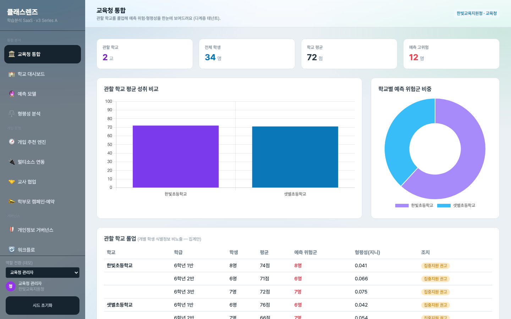
교육청 관리자 역할. 관할 학교 2교·전체 학생 34명·학교 평균 72점·예측 고위험 12명 KPI와 학교 평균 막대·예측 위험군 도넛이 렌더된다. 롤업표는 "개별 학생 식별정보 비노출 — 집계만"으로 학교>학급별 학생 수·평균·예측 위험군·지니·집중지원 권고를 보여준다. 격리 검증에 "상위 테넌트는 집계·가명만 — 개별 식별정보 0건", "타 교육지원청 district_id 격리 0건"이 표시된다.

### 5.2 예측 모델 (능선회귀·로지스틱, 근거 노출)
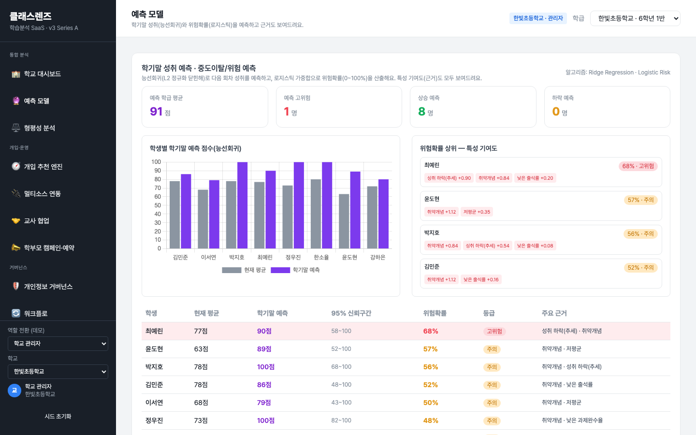
능선회귀로 산출한 "학기말 예측" 점수와 "95% 신뢰구간"(예: 86점, 58~100), 로지스틱 "위험확률"(예: 최예린 68% 고위험)이 표로 표시된다. "위험확률 상위 — 특성 기여도"에 각 학생의 기여 특성(예: `취약개념 +1.12 · 저평균 +0.35`)이 노출되어 설명 가능한 예측임을 입증한다. 알고리즘 배지에 "Ridge Regression · Logistic Risk"가 표기된다.

### 5.3 형평성 분석 (지니·사분위·로렌츠)
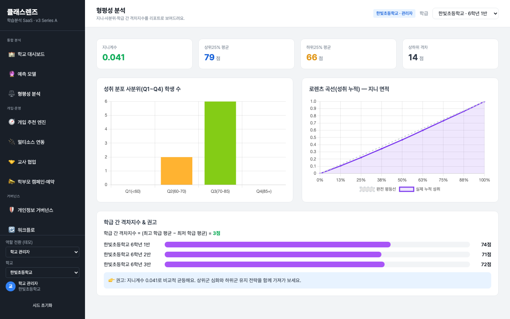
지니계수(0.041)·상위25% 평균(79점)·하위25% 평균(66점)·상하위 격차(14점) KPI와 사분위(Q1~Q4) 학생 수 막대, 로렌츠 곡선(완전 평등선 점선 대비 실제 누적 성취)이 렌더된다. 학급 간 격차지수(3점)와 지니계수 기반 권고가 제시된다.

### 5.4 개입 추천 엔진 (선수개념 그래프 경로)
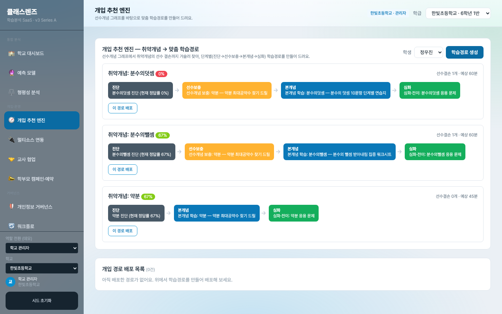
정우진 학생의 취약개념(분수의덧셈 0%·분수의뺄셈 67%·약분 67%)마다 선수개념 그래프를 역추적해 "진단→선수보충→본개념→심화" 단계 경로를 생성한다. 분수의덧셈은 선수결손 1개(통분 보충)·예상 60분, 약분은 선수결손 0개·예상 45분으로 차등 생성되어 그래프 기반 동작을 입증한다.

### 5.5 멀티소스 연동 (AIDT·LMS·CSV 정규화 인입)
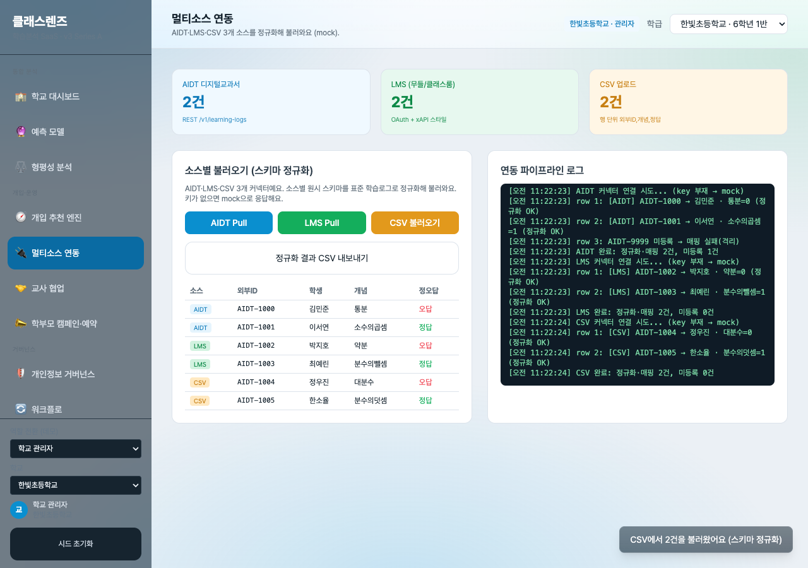
AIDT(2건)·LMS(2건)·CSV(2건) 3개 커넥터를 인입했다. 정규화 결과표에 소스 태그·외부ID·학생·개념·정오답이 표시되고, 파이프라인 로그에 소스별 원시 스키마가 표준 학습로그로 정규화된 매핑(예: `[LMS] AIDT-1002 → 박지호 · 약분=0 (정규화 OK)`)과 미등록 외부ID(AIDT-9999) 매핑 실패(격리)가 기록된다.

### 5.6 멀티소스 정규화 결과 CSV 내보내기
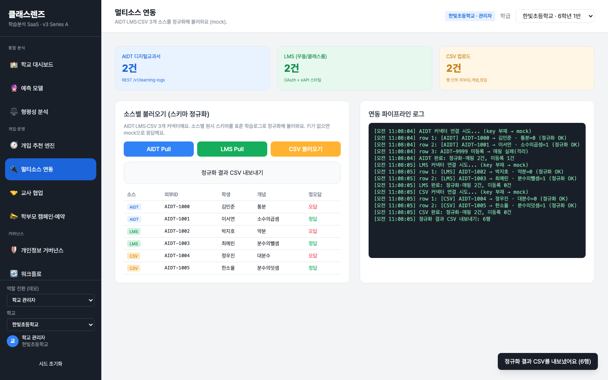
3소스 정규화 결과를 CSV로 내보낸다(BOM 포함, 한글 깨짐 방지). 로그에 "정규화 결과 CSV 내보내기: 6행"이 기록되고 완료 토스트가 표시된다. 외부 파일 입출력 실 흐름을 입증한다.

### 5.7 교사 협업 (공동 루브릭·평가 공유)
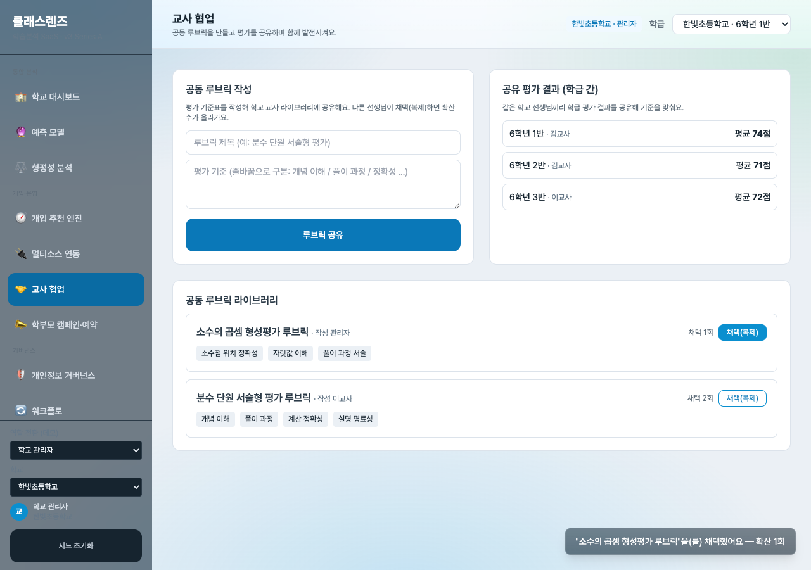
"소수의 곱셈 형성평가 루브릭"(소수점 위치 정확성·자릿값 이해·풀이 과정 서술)을 작성·공유했고, 라이브러리에 시드 루브릭과 함께 노출된다. 채택(복제) 시 확산 카운트가 올라가(시드 루브릭 채택 2회) 협업 확산을 입증한다. 우측에 학급 간 평가 평균 공유가 표시된다.

### 5.8 학부모 캠페인 + 상담 예약
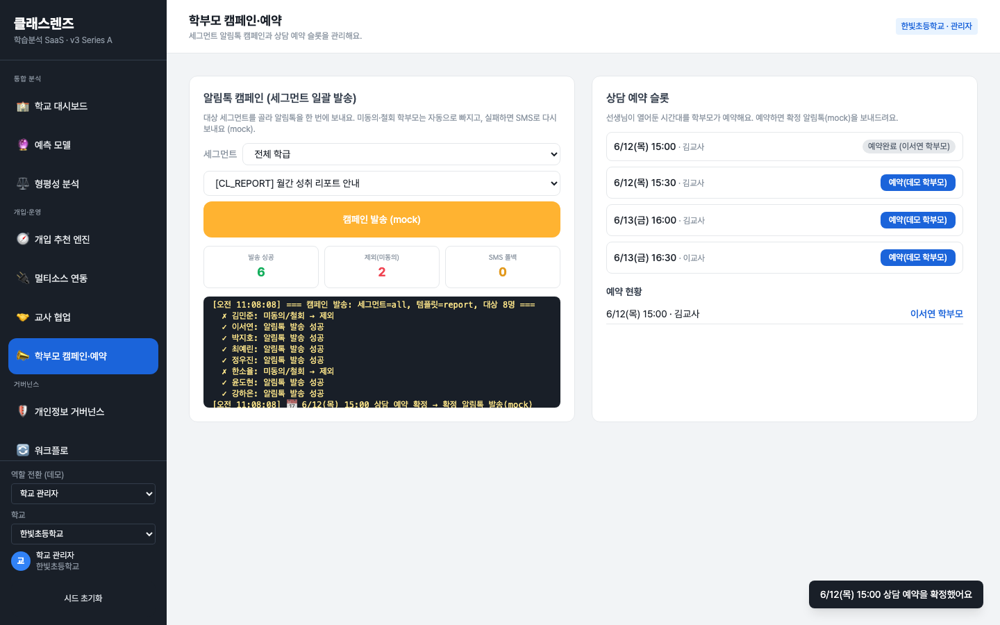
전체 학급 세그먼트로 알림톡 캠페인을 발송했다. 발송 통계(발송 성공 6·제외 2·SMS 폴백 0)와 발송 로그(미동의 학생 "제외", 동의 학생 "발송 성공")가 기록된다. 상담 예약 슬롯에서 한 건을 예약 확정(이서연 학부모)하고 예약 현황에 반영된다.

### 5.9 개인정보 거버넌스 (감사로그·보존정책)
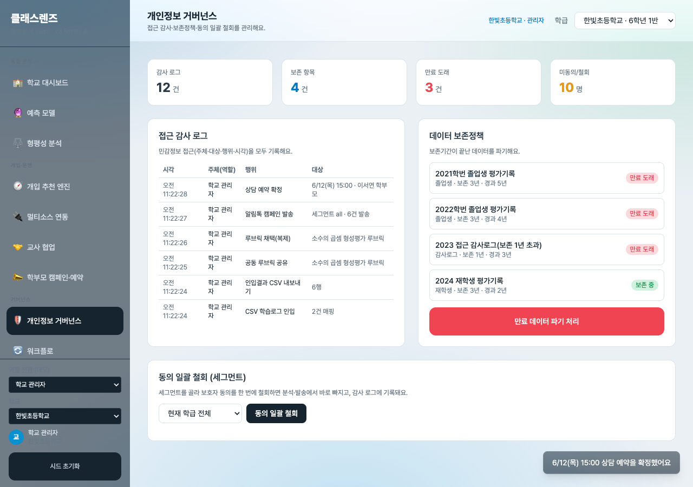
감사 로그 12건·보존 항목 4건·만료 도래 3건·미동의 10명 KPI와 함께, 접근 감사 로그(역할·행위·대상·시각)와 보존정책(졸업생 평가기록·감사로그 등 만료 도래/보존 중 상태)이 표시된다. 동의 일괄 철회 세그먼트 셀렉터가 준비되어 있다.

### 5.10 동의 일괄 철회 + 보존 만료 파기
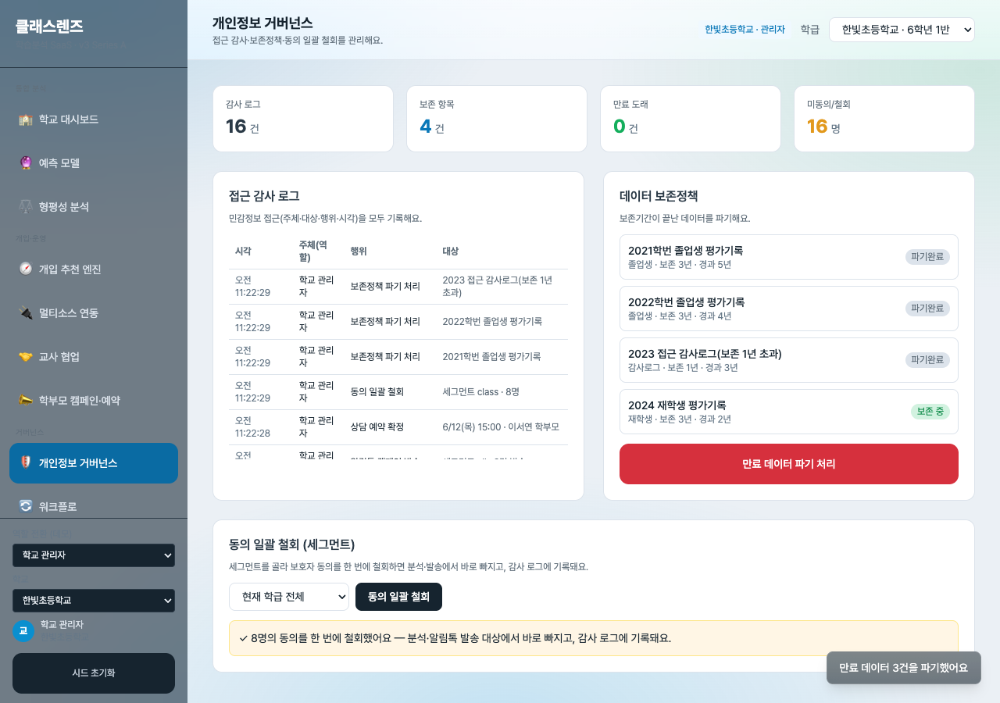
현재 학급 동의 일괄 철회로 8명이 철회되어 "분석·알림톡 발송 대상에서 즉시 제외, 감사 로그 기록됨"이 표시되고 미동의/철회가 16명으로 증가했다. 만료 데이터 3건을 파기 처리해 만료 도래가 0건·"파기완료" 상태로 전이되고, 감사 로그가 16건으로 누적되어 거버넌스 생명주기를 입증한다.

### 5.11 워크플로 A — 예측→개입추천→경로배포 완주
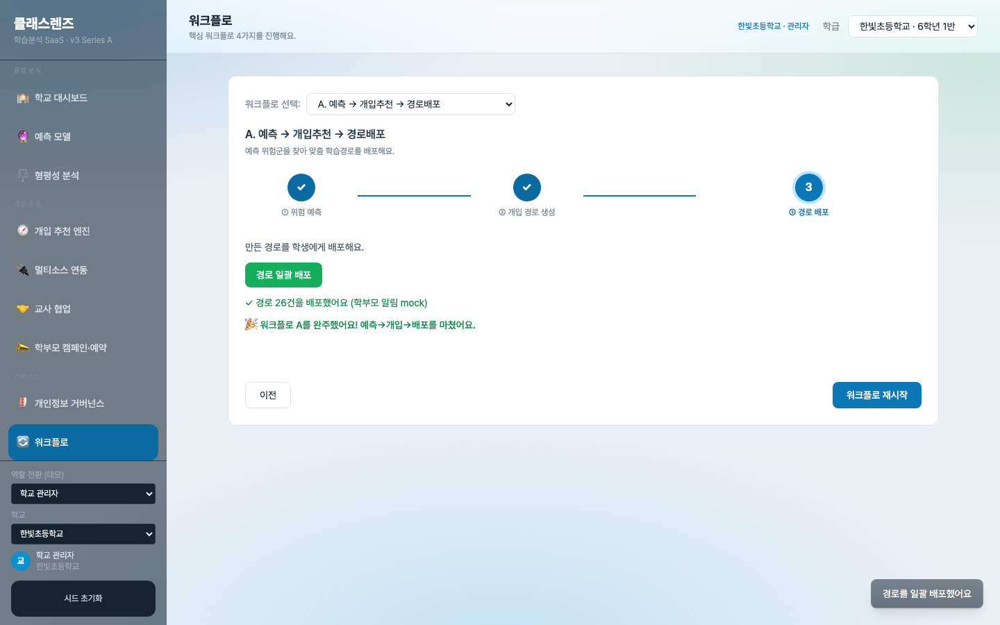
워크플로 A 3단계(위험 예측→개입 경로 생성→경로 배포)를 완주하면 "26건 경로 배포완료 (학부모 알림 mock)"와 "워크플로 A 완주! 예측→개입→배포 완료" 메시지가 표시된다. 위험군 일괄 경로 생성·배포 흐름을 입증한다.

### 5.12 워크플로 D — 교육청 롤업→형평성→권고 완주
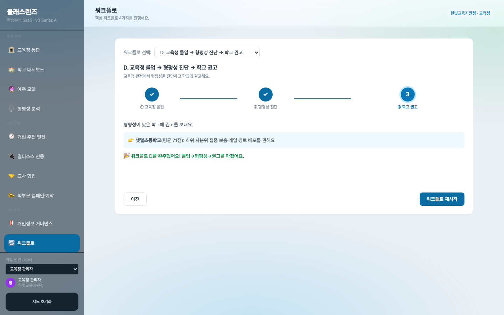
교육청 관리자 역할로 워크플로 D 3단계(교육청 롤업→형평성 진단→학교 권고)를 완주하면 "샛별초등학교(평균 71점): 하위 사분위 집중 보충·개입 경로 배포 권고"와 "워크플로 D 완주!" 메시지가 표시된다. 다계층 거버넌스·형평성 연계를 입증한다.

### 5.13 학교 대시보드 (학급 롤업·예측 위험 분포)
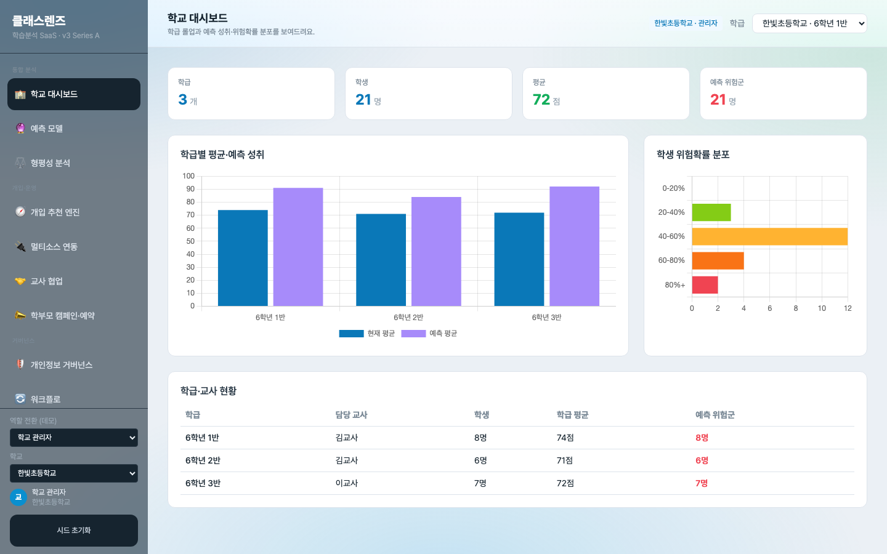
학교 관리자 역할. 학급 3·학생 21·평균 72점·예측 위험군 21명 KPI와 학급별 "현재 평균 vs 예측 평균" 막대, 학생 위험확률 분포 히스토그램(20% 구간별)이 렌더된다. 학급·교사 현황표에 학급별 담당 교사·평균·예측 위험군이 표시된다.

### 5.14 상태 지속성 — 새로고침 후 (가명처리 적용)
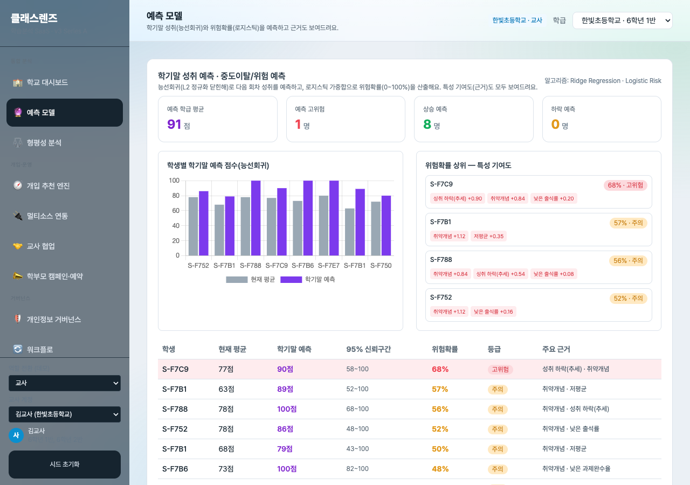
가명처리 ON 상태로 페이지를 다시 로드한 뒤 예측 모델을 열어도 학생명이 가명(S-7FC9·S-F752 등)으로 마스킹된 채 예측 점수·신뢰구간·위험확률·특성 기여도가 유지된다. localStorage 복원 + 가명처리 전 화면 반영을 입증한다.

### 5.15 학부모 모바일 — 홈
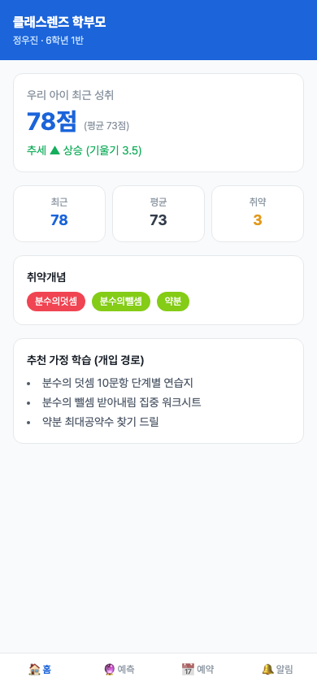
390px 모바일 셸. 정우진 학생 최근 성취(78점·평균 73·추세 ▲상승), KPI 3종, 취약개념 배지, 추천 가정 학습(개입 경로)이 모바일 레이아웃으로 표시되고 하단 4탭(홈·예측·예약·알림) 내비가 동작한다.

### 5.16 학부모 모바일 — 예측 (학기말 예측·위험확률)

모바일에서 학기말 성취 예측(100점·95% 신뢰구간 82~100)과 학업 위험확률(48% 주의·주요 요인: 취약개념·낮은 과제완수율·낮은 출석률), 회차 점수에 예측을 점선으로 이어붙인 추세 라인이 렌더된다. 데스크톱 예측 알고리즘 결과를 학부모 친화적으로 노출한다.

### 5.17 학부모 모바일 — 상담 예약

학부모가 담임 교사 가용 시간 슬롯을 선택해 상담을 예약한다. 한 슬롯이 "예약완료"로 전이되고 "6/12(목) 15:00 상담 예약 완료" 토스트가 표시된다. 학부모 측 예약 흐름을 입증한다.

### 5.18 학부모 모바일 전용 캡처 (390×844, deviceScaleFactor 2)

전용 모바일 뷰포트(390×844, `isMobile`·`hasTouch`)에서 학부모 앱 4탭 + 예측·예약 상호작용을 실 구동 캡처했다. 가로 overflow 0, 하단 4탭바가 화면을 가리지 않고 차트·알림 카드가 잘림·한글 깨짐 없이 렌더됨을 눈으로 확인했다. (재현: 앱 디렉터리에서 `node capture-mobile-v3.mjs` → `biz/captures/mobile/v3/`)

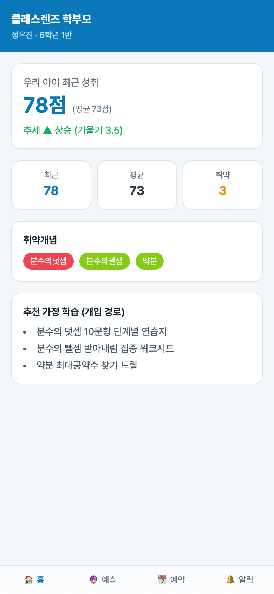

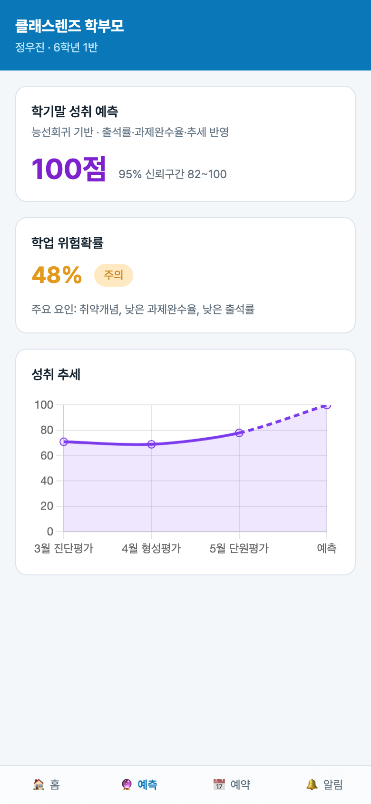

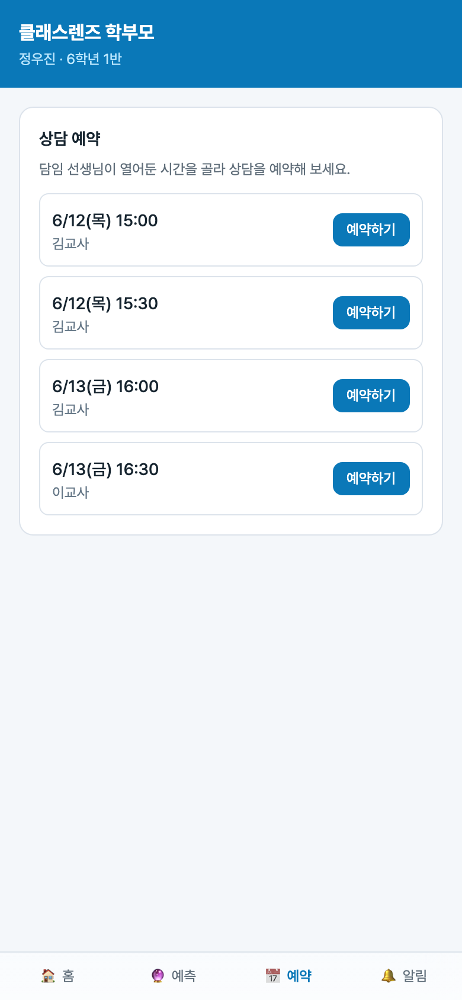

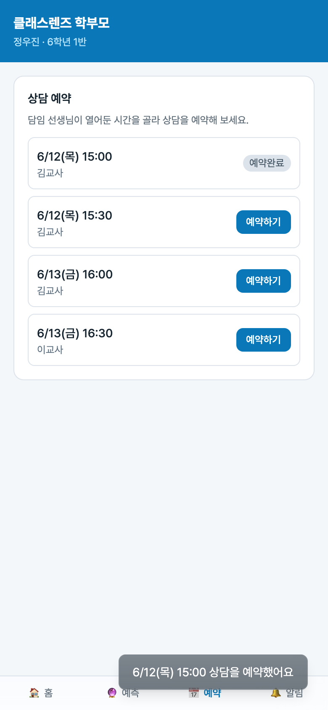

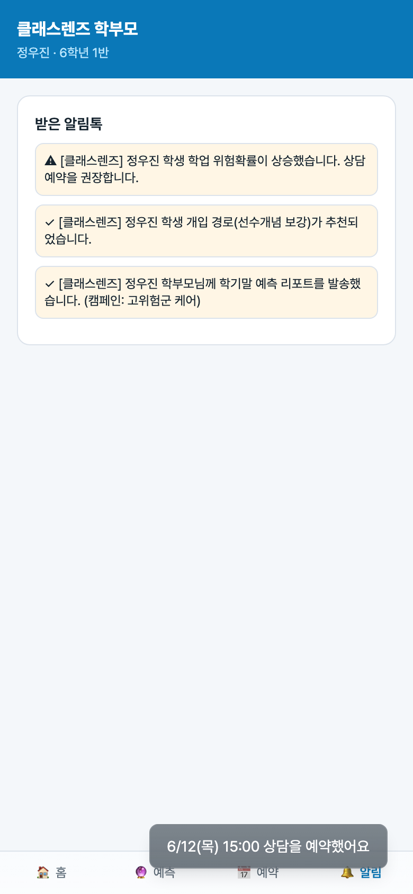

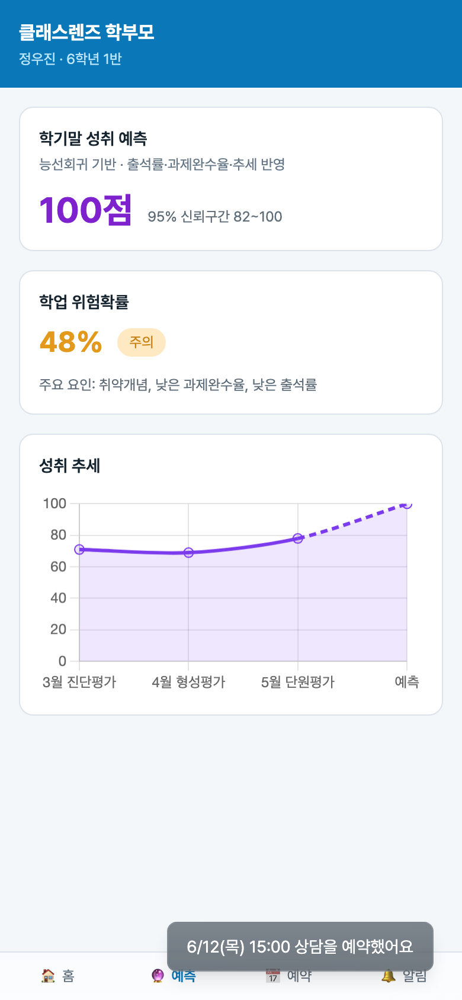

---

## 6. 검수 기준 충족 여부 (과업지시서 §5·§2.4)

### 6.1 핵심 8가지 (§5.1)

| # | 검수 합격 조건 | 결과 | 측정값/근거 |
|:---:|:---|:---:|:---|
| 1 | 능선회귀 예측+신뢰구간 + 로지스틱 위험확률, 근거 100% 노출 | ✅ | 예측 점수·95% 신뢰구간·위험확률·특성 기여도 전 행 노출(02·14·16) |
| 2 | 교육청>학교>학급 3계층 롤업, 상위 개별 식별정보 0건 | ✅ | 다계층 롤업·"집계만" 노출·격리 검증 0건(01·13) |
| 3 | 선수개념 그래프 역추적 학습경로 생성 | ✅ | 취약개념별 진단→선수보충→본개념→심화 경로·선수결손 차등(04·11) |
| 4 | AIDT·LMS·CSV 3소스 정규화·태깅·반영 | ✅ | 3소스 각 2건 정규화 인입·미등록 격리·CSV 출력(05·06) |
| 5 | 세그먼트 캠페인 발송·통계 + 예약 슬롯 확정 | ✅ | 발송 통계·미동의 제외 + 예약 확정(08·17) |
| 6 | 루브릭 작성·공유·채택 확산 동작 | ✅ | 루브릭 공유·채택 카운트 증가(07) |
| 7 | 감사로그 기록·보존 만료 파기·동의 일괄 철회 제외 | ✅ | 감사 12→16건·만료 3건 파기·8명 일괄 철회 제외(09·10) |
| 8 | 지니·사분위·격차지수 산출·근거 표시 | ✅ | 지니 0.041·사분위·로렌츠·격차지수 3점·권고(03·12) |

### 6.2 공통 검수 (§5.2) 및 품질·성능(§2.4)

| 항목 | 기준 | 결과 | 측정값 |
|:---|:---|:---:|:---|
| 화면/뷰 | 10종+ | ✅ | 데스크톱 10뷰 + 모바일 4탭 |
| 누적 실동작 기능 | 100개+ | ✅ | **112개**(v1 27+v2 27+v3 58, [§2.1 기능 목록표](#21-누적-기능-목록표-v1v2v3--112개)) |
| 워크플로 | 4개+ | ✅ | A·B·C·D 4종 완주(11·12) |
| 외부 통합 mock | 3건+ | ✅ | AIDT·LMS·CSV 인입 + 알림톡 캠페인 + CSV 입출력(05·06·08) |
| 실 구동 캡처 | 12장+ | ✅ | 17장(데스크톱 14·모바일 3) |
| 다계층 테넌트 | 상위 개별 식별 0건 | ✅ | 집계·가명만 노출·격리 검증(01) |
| 알고리즘 근거 | 표시 100% | ✅ | 예측 특성 기여도 전 항목 노출(02) |
| 역할 분기 | 4역할 경계 누수 0건 | ✅ | 교육청·학교·교사·학부모 분기(01·13·02·15) |
| 거버넌스 | 감사 100%·철회/만료 즉시 제외 | ✅ | 접근 감사 기록·일괄 철회·파기 처리(09·10) |
| 키 없이 구동 | 외부 키 0건 | ✅ | AIDT/LMS/알림톡 mock, 시드 자동 주입 |

### 6.3 5억(이상) 가치 기준 (CLAUDE.md §2.4)

| 기준 | 충족 | 근거 |
|:---|:---:|:---|
| 실 알고리즘 1종+ | ✅ | 능선회귀 예측·로지스틱 위험확률 **2종** + 지니·선수개념 그래프 |
| 다중 사용자/다중 테넌트 | ✅ | 교육청>학교>학급 **다계층 테넌트**, 역할 **4종** |
| 외부 시스템 통합 2건+ | ✅ | AIDT·LMS·CSV 3소스 인입 + 알림톡 캠페인 + CSV 입출력 |
| 화면/뷰 8종+ | ✅ | 데스크톱 10 + 모바일 4 |
| 워크플로 3개+ | ✅ | A·B·C·D 4종 |
| 신규 캡처 10장+ | ✅ | 17장 |

---

## 8. 검토 체크리스트

- [x] 모든 핵심 기능(8가지)이 캡처되었는가
- [x] 캡처가 의도한 기능을 정확히 보여주는가 (Read 도구로 17장 전수 검증)
- [x] 한글이 깨지지 않는가 (전 캡처 한글 정상 렌더 확인)
- [x] 에러 화면이 의도치 않게 캡처되지 않았는가 (에러 없음 확인)
- [x] 결과물(예측 점수·위험확률·지니·정규화 CSV)의 정확도가 충분한가 (능선회귀·로지스틱·지니 계산·근거 일관)
- [x] 과업지시서 검수 기준 항목 100% 매핑되었는가 (§5.1 8개·§5.2 5개 전부 ✅)
- [x] (v3 한정) v2 한계 매핑표 + 5억 이상 가치 기준 충족 (8행 1:1 매핑 + §6.3)

---

## 데이터 정직성 선언

본 보고서의 모든 화면·수치는 실 구동된 `v3.html`을 Playwright(Chromium, 데스크톱 1440×900·모바일 390×844)로 캡처한 결과이며, 목업·합성 이미지는 사용하지 않았다. 교육청·학교·학급·학생·정답률·출석률·과제완수율·동의·알림·예약 로그는 데모용 시드/시뮬레이션 값으로 실제 개인정보가 아니다. AIDT·LMS 연동·카카오 알림톡은 외부 키 없이 동작하는 mock이며, mock임을 화면·로그에 명시했다. 예측(능선회귀·로지스틱)·형평성(지니)·선수개념 그래프는 앱 내장 결정적 실 계산 결과다. 외부 통계 인용은 본 결과보고서에 포함되지 않는다(제안서 §참고문헌 참조).

---

## 모바일 대응 (390×844)

PC 캡처와 별도로 모바일에서도 **새 동적 테마 + 글래스 + 반응형**이 정상 동작합니다 — 가로 overflow 0, 런타임 에러 0. 캡처: `captures/mobile/<v>/` (코덱스 §7).

| 버전 | 홈 | 스크롤 | 액션 |
|---|---|---|---|
| v1 |  | 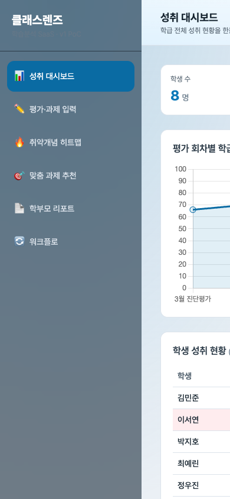 | 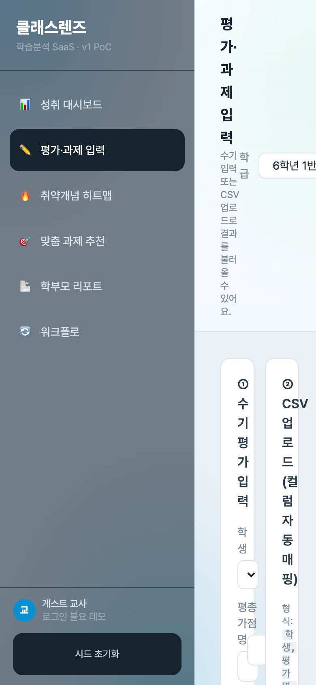 |
| v2 | 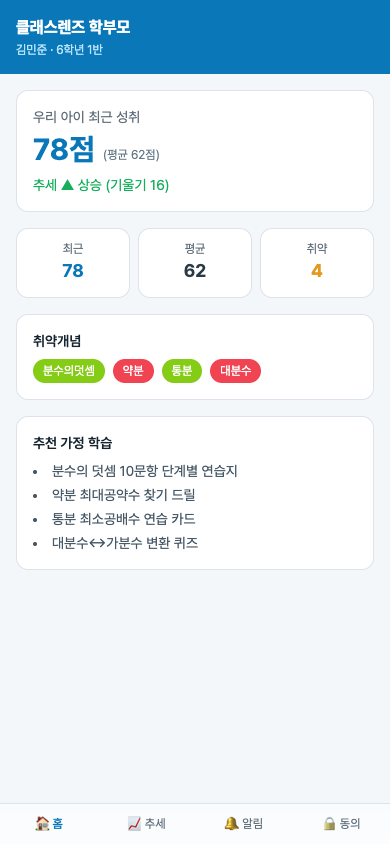 |  |  |
| v3 |  |  |  |
