# 제안서 — 현장 작업자 모바일 협업 SaaS (가칭 「현장톡」)

> 본 제안서는 사무직 중심으로 포화한 국내 협업 SaaS 시장의 사각지대인 **비사무직(deskless) 현장 워커**를 정조준한다.
> 제조·F&B·물류 현장의 작업지시·완료인증·이상보고·안전 협업을 **모바일 퍼스트·오프라인 내성** SaaS로 디지털화하여, "거대한 노동력 × 극단적 저(低)SW투자"라는 구조적 공백을 토종 솔루션으로 선점하는 것이 목표다.

## 0. 프로젝트 메타

| 항목 | 값 |
|:---|:---|
| 사업명 | 2026년 창업동아리 지원사업 (창업중심대학 X RISE 사업단) |
| 주관기관 | 대구대학교 창업지원단 |
| 트랙 | 실전창업 (창업동아리 / 기본 300만원·최대 1,000만원) |
| 일정 | 모집공고 '26.3.19~4.2 · 선발평가 4.6~4.8 · 선발안내 4.9 · 협약·설명회 4.10 · 지원·관리 '26.4.13~'27.1.31 |
| 아이템 한 줄 | 현장 워커용 모바일 퍼스트 작업·안전 협업 SaaS 「현장톡」 |
| 타깃 사용자 | 제조·F&B·물류 등 현장집약 업종의 비사무직(deskless) 작업자 |
| 핵심 가치 제안 | "장갑 낀 손으로 작업 완료를 인증하고, 위험을 즉시 보고한다" |
| 팀 | <TODO: 사용자 입력> |

---

## 1. 문제 인식 (Problem)

### 1.1 시장 구조의 모순 — 노동력의 다수가 도구의 사각지대에 있다

협업 SaaS는 한국 SW 산업의 성장 축이다. 국내 SaaS 시장은 2022년 약 1.74~1.78조원에서 2025년 약 2.55조원(연 14~15% 성장), 2026년 약 3.06조원으로 전망된다[^2]. 그러나 이 성장의 과실은 **사무직(desk worker)** 협업에 집중되어 있다. 국내 협업툴 단독 시장(약 4,000~5,000억원[^4])을 주도하는 잔디·네이버웍스·카카오워크·NHN두레이는 모두 **메신저·그룹웨어 패러다임**으로, 메일·결재·프로젝트 관리 등 *책상 앞 지식근로자*의 Job에 최적화돼 있다[^18][^19][^20][^21].

문제는 노동력의 분포다. 2024년 국내 취업자는 약 2,857.6만명[^8], 전국 사업체 종사자는 약 2,573.1만명[^7]에 이른다. 이 중 사무종사자(한국표준직업분류 대분류)는 통상 약 17~18%대로 알려져 있으며[^8] `[재확인 필요]`, 나머지 **약 2,300만명대가 생산·서비스·운수·건설 등 비사무직(deskless) 워커** `[추정]` 다. 즉 노동력의 다수를 차지하는 현장 워커는 사무직용 협업툴이 전제하는 "PC·고정석·여유로운 입력 환경"을 갖지 못한 채, 디지털 협업의 사각지대에 방치되어 있다.

> ⚠️ **모집단 수치 확정 필요 (TAM 골격의 뿌리)**: 본 사업 정량 논거(§3 TAM/SAM/SOM, §6 유닛 이코노믹스)는 모두 이 "비사무직 약 2,300만명"이라는 모집단 × 단가의 곱으로 쌓인다. 그런데 사무/비사무 비중은 현재 `[재확인 필요]` 상태다. **사업 개시 전 최우선 확정 과제**로, KOSIS 「경제활동인구조사 > 직업별 취업자」 원표에서 사무종사자 비중을 확정해 본 수치를 확정치로 승격한다([`5_research/README.md §2`](./5_research/README.md)). 또한 2,300만명 전부가 유료 시트가 될 수 없으므로(영세·고령·디지털 비사용·BYOD 거부 비중 존재), §3.2에서 **이론 TAM(상한)과 도입가능 TAM(현실)을 이중 제시**한다.

이 모순은 글로벌에서도 동일하며 더 극단적으로 측정된다. deskless 노동력은 **전 세계 노동력의 약 80%(약 27억명)** 이지만, 엔터프라이즈 SW 투자의 **단 1%만** 이들에게 배분되고, **56%는 개인 앱·종이로 공백을 메우고 있다**[^6]. 거대한 수요와 극단적 저투자가 공존하는 이 비대칭이야말로 본 사업의 출발점이다.

> 주의 — 위 글로벌 deskless **약 80%**[^6]는 전 세계 노동력의 *종사형태(책상 근무 여부)* 기준이고, 앞서 제시한 국내 **약 82%**는 한국 취업자 중 사무직을 제외한 *직업분류(한국표준직업분류 대분류)* 기준 `[추정]` 이다. 두 수치는 산정 기준·모집단이 달라 **직접 비교 대상이 아니며**, 본 제안서는 두 수치의 근접(80 vs 82)을 논거로 삼지 않는다. 단지 "노동력의 다수가 사각지대"라는 동일 방향의 구조적 신호로만 인용한다.

### 1.2 현장의 실제 고통 — 종이·카톡·전화로 흩어지는 작업과 위험

현장 워커는 작업지시·완료보고·이상보고를 **종이 일지, 단톡방, 전화**라는 비정형 채널로 처리한다. 그 결과는 세 가지 손실로 귀결된다.

- **추적 불가**: 누가·언제·무엇을 완료했는지 구조화된 기록이 없어, 사후 책임 분쟁과 품질 추적이 불가능하다.
- **비효율 비용**: 종이 일지의 작성·보관·전사(OCR)에 막대한 시간이 든다. 현장 수기업무를 디지털화하여 **연 11만 시간 이상을 감축**한 기업 사례가 보고된다[^17].
- **위험 신호 소실**: 가장 치명적인 손실이다. 현장에서 감지된 안전·설비 이상이 관리자에게 닿기 전에 비정형 채널에서 휘발된다.

국내 중소기업의 디지털 전환은 이를 방치하는 토양이다. 중소기업 디지털 성숙도는 **41.4/100**에 불과하고, **65.5%가 디지털 전환 전략조차 준비하지 못했으며**, 특히 제조업 성숙도가 서비스업보다 낮다[^16]. 현장은 디지털화가 가장 필요한 곳이지만 가장 뒤처져 있다.

### 1.3 규제 압력의 가속 — 중대재해처벌법이 만든 강제 수요

문제는 산업안전과 직결되며, 법은 이를 강제하기 시작했다. 2023년 산업재해 사고사망자는 **598명(584건)** 으로 역대 첫 500명대를 기록했으나[^9], 그 분포는 본 사업의 정당성을 명확히 한다.

- 업종별: **건설 303명, 제조 170명, 기타 125명**[^9] — 사망의 절대다수가 현장 작업.
- 규모별: **50인 미만 사업장 354명**[^9] — 소규모 현장에 집중.
- 2022년 기준으로도 사고사망 644명 중 **60.2%(388명)가 50인 미만 사업장**에서 발생했다[^12].

여기에 **2024년 1월 27일부터 중대재해처벌법이 상시 5인 이상 全 사업장으로 확대 적용**되어, **약 83.7만 개 사업장이 신규 적용 대상**이 되었다[^11]. 이들 소규모 현장은 이제 안전 점검·이상보고·기록 보존의 법적 의무를 지지만, 이를 수행할 디지털 도구가 사실상 없다. 법적 의무(regulatory pull)와 도구 공백이 만나 **강제 수요**가 형성된 것이다.

#### 타깃 세그먼트별 페인 차별화 — 1차 진입은 "규제 풀이 가장 강한 곳"

타깃을 제조·F&B·물류로 묶되, 세그먼트별로 "돈을 내는 이유"가 다르다는 점을 명시한다. 1차 진입(wedge)은 **규제 풀이 가장 강한 5~50인 제조·물류**로 좁히고, F&B는 규제 결이 다르므로(안전사망 논거 약함) 후순위로 재배치하거나 가치제안을 위생·HACCP 기록으로 교체한다.

| 세그먼트 | 1순위 페인 | 핵심 가치제안(wedge) | 규제 풀 | 진입 우선순위 |
|:---|:---|:---|:---:|:---:|
| 제조·물류 (5~50인) | 안전사망·설비 이상·작업 추적 | 중대재해법 기록 보존·이상보고 추적성[^9][^11] | 강함 | **1차** |
| 건설(소규모 협력사) | 사망사고 최다·일용 인수인계 | 작업단 인증·안전 점검표[^9] | 강함 | 1.5차 |
| F&B (식당·프랜차이즈) | 위생·교대 인수인계·체크리스트 | HACCP/위생 점검 기록·음성 인수인계 | 약함 | 후순위 |

> F&B 소규모 식당 사장에게 "중대재해법 기록 보존"은 거의 통하지 않는다. 동일 제품이라도 메시지를 세그먼트별로 분리하지 않으면 어느 고객도 깊이 설득하지 못한다.

**[그림 1] 현장 협업의 단절 구조**
기존 협업툴은 사무직(약 18%, 직업분류 기반 추정)만 덮고, 현장 워커(약 82%, 추정)는 종이·카톡·전화로 분산된다. 작업지시·이상보고가 비정형 채널에 흩어져 추적 불가가 되고, 위험 신호가 관리자에게 닿기 전 소실되며, 중대재해처벌법 확대([^11])는 이 공백 위에 법적 책임을 부과한다. (18%/82% 비율은 KOSIS 직업별 취업자 원표 기반 추정치로, 본문 §1.1과 동일한 `[재확인 필요]` 대상이다.)

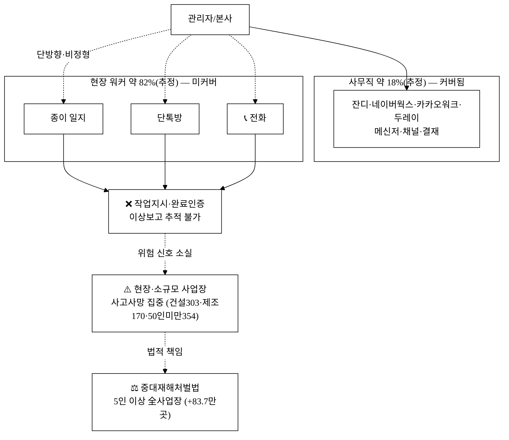

---

## 2. 솔루션 (Solution)

### 2.1 핵심 컨셉 — "대화"가 아니라 "작업단(Work Unit)"

「현장톡」은 메신저의 *대화·채널* 메타포를 버리고, **작업 1건(Work Unit)을 추적 가능한 객체**로 다루는 모바일 퍼스트 협업 SaaS다. 한 손·장갑 낀 손으로도 조작 가능한 큰 터치 타깃, 사진·음성·서명 중심 입력, 통신이 끊겨도 동작하는 오프라인 내성을 설계 원칙으로 삼는다.

### 2.2 핵심 기능

| 기능 | 설명 | 해결하는 고통 |
|:---|:---|:---|
| 작업지시(Work Order) | 발행·수신·수행·완료 인증(사진·서명)을 한 객체로 추적 | 추적 불가 (§1.2) |
| 디지털 체크리스트 | 일일 점검표·산업별 안전 점검표 디지털화 | 종이 비효율 ([^17]) |
| 이상보고 | 안전·품질·설비 이상을 사진 첨부로 즉시 알림 | 위험 신호 소실 (§1.3) |
| 음성 인수인계 | 교대조 인수인계 메모를 음성→텍스트(Web Speech API) | 입력 마찰·교대 누락 |
| 관리자 대시보드 | 라인·교대조별 진척·이상 집계 실시간 가시화 | 관리 사각 |
| 오프라인 큐 | 통신 두절 현장에서 입력→단말 큐(IndexedDB) 적재→복구 시 자동 동기화 | 현장 통신 공백 |

### 2.3 차별점

차별점을 **모방 난이도 순**으로 재정렬한다. 모방 쉬운 축(가격·한국어 STT)을 1순위에서 강등하고, 복제 어려운 축(현장 워크플로 깊이·규제 도메인 데이터·전환비용)을 전면에 둔다. 지속 해자 논증은 §6A(방어가능성)에서 본격 전개한다.

- **[지속 차별 — 깊음]** 잔디·네이버웍스의 "메신저+채널"이 아닌 **작업단(Work Unit) 패러다임** — Job-도구 정합 회복(§4.2). 단순 채팅이 아니라 산업별 작업 워크플로·상태머신·증거 보존이 제품 정체성.
- **[지속 차별 — 도메인]** **중대재해처벌법 대응** 안전 체크리스트·법정 보존 요건 충족 기록 — 국내 규제 도메인 지식([^11]). 단순 기능이 아니라 무결성·보존기간·증거능력 설계(§15)가 동반되어야 복제가 어렵다.
- **[보조 차별 — 모방 가능]** 한국어 음성 인식·사진 인증 입력 마찰 최소화 — 글로벌 deskless(Connecteam·Beekeeper) 영어권 UX 한계 대비 우위[^13][^14]. 단, 한국어 STT 자체는 네이버 클로바 등이 이미 보유하므로 **핵심 해자가 아니다**(아래 STT 주의 참조).
- **[보조 차별 — 가격은 차별점 아님]** 시트당 5,000원/월은 진입 편의일 뿐 차별점이 아니다. 카카오워크 Mini(2,400원[^20])·네이버웍스/두레이/Connecteam 무료 25~30명 정책이 사실상 가격 하한을 0에 가깝게 만들기 때문이다. 따라서 가격이 아니라 **"중대재해법 기록 보존이라는 법적 책임 방어 가치"로 포지셔닝**한다(§5.3 공짜 카톡을 이기는 이유 참조).

> ⚠️ **STT 기술 선택의 트레이드오프 (정직 표기)**: 음성 입력을 Web Speech API(브라우저 내장)에 의존하면 한국어 정확도가 브라우저·OS별 편차가 크고, 현장 소음·전문용어·방언에서 신뢰성이 미검증이며 **오프라인에서 동작하지 않는다**(서버 STT 의존). 즉 "오프라인 내성"과 "Web Speech 음성"은 그대로 두면 서로 모순이다. 해소책: 오프라인 시 음성은 **녹음 보관 → 복구 시 STT 처리**로 설계하고(§13 동기화), STT는 온라인 Web Speech(무료·간편) vs 서버 한국어 STT(정확·유료)를 티어/상황별 선택하며, 차별점은 STT 엔진이 아니라 **도메인 특화 후처리(용어 사전·체크리스트 자동 매핑)** 라는 자체 자산으로 규정한다. 정확도 목표(WER)·측정은 §14B 기술 KPI.

**[그림 2] 솔루션 아키텍처 — 작업단 생명주기와 오프라인 큐**
메신저의 "대화" 단위가 아니라 작업 1건을 객체로 추적한다. 통신 두절 시 입력은 단말 큐(IndexedDB)에 적재되었다가 복구 시 자동 동기화되어 현장의 네트워크 공백을 흡수한다.

```mermaid
%%{init: {"theme":"base","themeVariables":{"darkMode":false,"background":"#ffffff","fontFamily":"Georgia, serif","primaryColor":"#ffffff","primaryBorderColor":"#000000","primaryTextColor":"#000000","secondaryColor":"#ffffff","secondaryBorderColor":"#000000","secondaryTextColor":"#000000","tertiaryColor":"#ffffff","tertiaryBorderColor":"#000000","tertiaryTextColor":"#000000","mainBkg":"#ffffff","secondBkg":"#ffffff","lineColor":"#000000","textColor":"#000000","nodeBorder":"#000000","nodeTextColor":"#000000","titleColor":"#000000","edgeLabelBackground":"#ffffff","defaultLinkColor":"#000000","clusterBkg":"#ffffff","clusterBorder":"#000000","actorBkg":"#ffffff","actorBorder":"#000000","actorTextColor":"#000000","actorLineColor":"#000000","signalColor":"#000000","signalTextColor":"#000000","labelBoxBkgColor":"#ffffff","labelBoxBorderColor":"#000000","labelTextColor":"#000000","loopTextColor":"#000000","noteBkgColor":"#ffffff","noteBorderColor":"#000000","noteTextColor":"#000000","activationBkgColor":"#ffffff","activationBorderColor":"#000000","sequenceNumberColor":"#000000","attributeBackgroundColorOdd":"#ffffff","attributeBackgroundColorEven":"#ffffff","sectionBkgColor":"#ffffff","altSectionBkgColor":"#ffffff","sectionBkgColor2":"#ffffff","taskBkgColor":"#ffffff","taskBorderColor":"#000000","taskTextColor":"#000000","taskTextLightColor":"#000000","taskTextOutsideColor":"#000000","taskTextDarkColor":"#000000","taskTextClickableColor":"#000000","activeTaskBkgColor":"#ffffff","activeTaskBorderColor":"#000000","doneTaskBkgColor":"#ffffff","doneTaskBorderColor":"#000000","critBkgColor":"#ffffff","critBorderColor":"#000000","gridColor":"#000000","todayLineColor":"#000000","quadrant1Fill":"#ffffff","quadrant2Fill":"#ffffff","quadrant3Fill":"#ffffff","quadrant4Fill":"#ffffff","quadrant1TextFill":"#000000","quadrant2TextFill":"#000000","quadrant3TextFill":"#000000","quadrant4TextFill":"#000000","quadrantPointFill":"#000000","quadrantPointTextFill":"#000000","quadrantXAxisTextFill":"#000000","quadrantYAxisTextFill":"#000000","quadrantInternalBorderStrokeFill":"#000000","quadrantExternalBorderStrokeFill":"#000000","quadrantTitleFill":"#000000","pieStrokeColor":"#000000","pieOuterStrokeColor":"#000000","pieTitleTextColor":"#000000","pieSectionTextColor":"#000000","pieLegendTextColor":"#000000","cScale0":"#ffffff","cScaleLabel0":"#000000","cScaleInv0":"#000000","pie1":"#ffffff","cScale1":"#ffffff","cScaleLabel1":"#000000","cScaleInv1":"#000000","pie2":"#ffffff","cScale2":"#ffffff","cScaleLabel2":"#000000","cScaleInv2":"#000000","pie3":"#ffffff","cScale3":"#ffffff","cScaleLabel3":"#000000","cScaleInv3":"#000000","pie4":"#ffffff","cScale4":"#ffffff","cScaleLabel4":"#000000","cScaleInv4":"#000000","pie5":"#ffffff","cScale5":"#ffffff","cScaleLabel5":"#000000","cScaleInv5":"#000000","pie6":"#ffffff","cScale6":"#ffffff","cScaleLabel6":"#000000","cScaleInv6":"#000000","pie7":"#ffffff","cScale7":"#ffffff","cScaleLabel7":"#000000","cScaleInv7":"#000000","pie8":"#ffffff","cScale8":"#ffffff","cScaleLabel8":"#000000","cScaleInv8":"#000000","pie9":"#ffffff","cScale9":"#ffffff","cScaleLabel9":"#000000","cScaleInv9":"#000000","pie10":"#ffffff","cScale10":"#ffffff","cScaleLabel10":"#000000","cScaleInv10":"#000000","pie11":"#ffffff","cScale11":"#ffffff","cScaleLabel11":"#000000","cScaleInv11":"#000000","pie12":"#ffffff","xyChart":{"backgroundColor":"#ffffff","titleColor":"#000000","xAxisLabelColor":"#000000","xAxisTitleColor":"#000000","xAxisTickColor":"#000000","xAxisLineColor":"#000000","yAxisLabelColor":"#000000","yAxisTitleColor":"#000000","yAxisTickColor":"#000000","yAxisLineColor":"#000000","plotColorPalette":"#000000,#000000,#000000,#000000,#000000,#000000"}}}}%%
flowchart LR
    subgraph 현장단말["현장 워커 단말 (모바일 PWA)"]
        WO1["작업지시 수신"] --> WO2["수행<br/>📷사진·✍️서명"]
        WO2 --> WO3["완료 인증"]
        AR["⚠️ 이상보고<br/>(안전·품질·설비)"]
        VO["🎤 음성 인수인계<br/>Web Speech"]
        CK["✅ 디지털 체크리스트"]
    end
    Q[("📦 오프라인 큐<br/>IndexedDB")]
    WO3 --> Q
    AR --> Q
    VO --> Q
    CK --> Q
    Q -->|"통신 복구 시<br/>자동 동기화"| SV[("서버 / API")]
    SV --> DASH["관리자 대시보드<br/>라인·교대조별 진척·이상 집계"]
    DASH -->|"위험 신호 즉시 가시화"| ALERT["🔔 실시간 알림"]
    SV --> LOG[("🗄️ 기록 보존<br/>중대재해법 대응")]
```

---

## 3. 시장 (Scale-up)

### 3.1 산정 원칙과 근거 데이터

시장 규모는 **상향식(bottom-up)** 으로 산정하며, 검증된 공공·언론 수치만 사용한다. 추정 단계는 `[추정]`으로 명시한다(상세 산정·교차검증은 [`5_research/README.md §3`](./5_research/README.md) 참조).

| 입력 변수 | 값 | 출처 |
|:---|:---|:---:|
| 국내 SaaS 시장(2025E) | 약 2.55조원 (2026E 3.06조) | [^2] |
| 국내 협업툴 단독 시장 | 약 4,000~5,000억원 | [^4] |
| 국내 비사무직(deskless) 종사자 | 약 2,300만명대 `[추정]` (취업자 2,857.6만 중 사무직 약 18% 제외) | [^7][^8] |
| 현장 워커 객단가(가정) | 1인 월 5,000원 `[추정]` (인접 사무직 협업툴 + 글로벌 deskless Connecteam $5≈6,900원[추정] 환산 근거) | [^18][^19][^20][^24] |
| 글로벌 deskless 구조 | 노동력 80%·SW투자 1% | [^6] |

### 3.2 TAM / SAM / SOM

> 🟥 **WTP·모집단 의존성 경고 (의사결정자 필독)**: 아래 TAM 1.38조 전체가 (a) `[재확인 필요]` 모집단(비사무직 2,300만명)과 (b) **미검증 단일 객단가**(현장 워커 1인 월 5,000원, 인접 사무직 협업툴에서 차용)의 곱이다. WTP가 검증되기 전까지 TAM은 **이론적 상한**으로만 읽어야 하며, 본 제안서는 의사결정 근거를 보수적인 **SOM·도입가능 TAM** 위주로 제시한다. 또한 실제 구매 단위는 **개인이 아니라 사업체**이므로, 종사자 전수 가정의 과대계상을 보정해 아래에 사업체 기반 산정을 병기한다.

**(A) 이론 TAM / SAM / SOM — 종사자 기반(상한)**

| 구분 | 정의 | 산정식 | 규모 |
|:---|:---|:---|---:|
| **TAM(이론)** | 국내 deskless 워커 전체가 현장 협업 SaaS를 사용하는 시장 | 약 2,300만명 × 5,000원/월 × 12 | **약 1.38조원/년** `[추정]` |
| **SAM** | 제조·F&B·물류 등 산재 다발·현장집약 업종 deskless 워커 (제조·건설·운수·숙박음식 종사 비중 근사 ≈ 35%[^7]) | TAM의 약 35% ≈ 약 800만명 × 5,000원 × 12 | **약 4,800억원/년** `[추정]` |
| **SOM** | 5인 이상 50인 미만 중소 현장(중대재해법 신규 대상) 우선 침투, 3년 내 | SAM 침투율 약 3% 가정 | **약 144억원/년** `[추정]` |

**(B) 도입가능 TAM — 사업체 기반(현실)** `[추정]`

종사자 100% 채택은 비현실적이므로, 모집단을 **사업체 × 평균 채택 좌석률**로 재산정해 과대계상을 보정한다.

| 변수 | 가정값 | 근거 |
|:---|:---|:---|
| 중대재해법 신규 대상 사업장(5~50인) | 약 83.7만 사업장 | [^11] |
| 도입가능 비율(DX 미성숙·BYOD 거부 반영) | 약 34.5% `[추정]` (중기 65.5% DX 미준비[^16]의 여집합) | [^16] |
| 사업체당 평균 채택 좌석 | 8시트 `[추정]` (5~50인 중 핵심 현장직만) | 가정 |
| 도입가능 TAM | 83.7만 × 0.345 × 8 × 5,000 × 12 ≈ **약 1,386억원/년** | 산정 |

> **이중 제시의 의미**: 이론 TAM(1.38조)은 시장의 천장이고, 도입가능 TAM(약 1,386억[추정])은 "오늘 실제로 팔 수 있는 사업체 모집단"이다. SOM 144억은 도입가능 TAM의 약 10% 침투에 해당해 **상호 정합적**이다. 단일 객단가 외에 **사업체당 평균 채택 좌석률(8시트 가정)** 을 별도 변수로 노출했으며, WTP 검증(§7) 후 두 표를 모두 갱신한다.

**교차검증**: 이론 TAM 1.38조원은 국내 SaaS 전체 약 2조([^1])·협업툴 약 4,000~5,000억([^4])과 정합적인 자릿수다. 다만 기존 협업툴 시장이 사무직 위주이므로, deskless 시장은 잠식이 아닌 **신규 TAM 창출** 성격이다. 글로벌의 "노동력 80%·SW투자 1%"라는 극단적 불균형[^6]은 국내에서도 동일 구조의 저점유 블루오션이 존재함을 시사한다. SOM 침투율 3%는 잔디가 8년여 만에 유료 5,000개사·30만팀에 도달한 국내 협업 SaaS 초기 침투 궤적[^15]을 보수적 벤치마크로 삼은 가정이다 `[추정]`.

**[그림 3] 시장 구조 (TAM / SAM / SOM)**

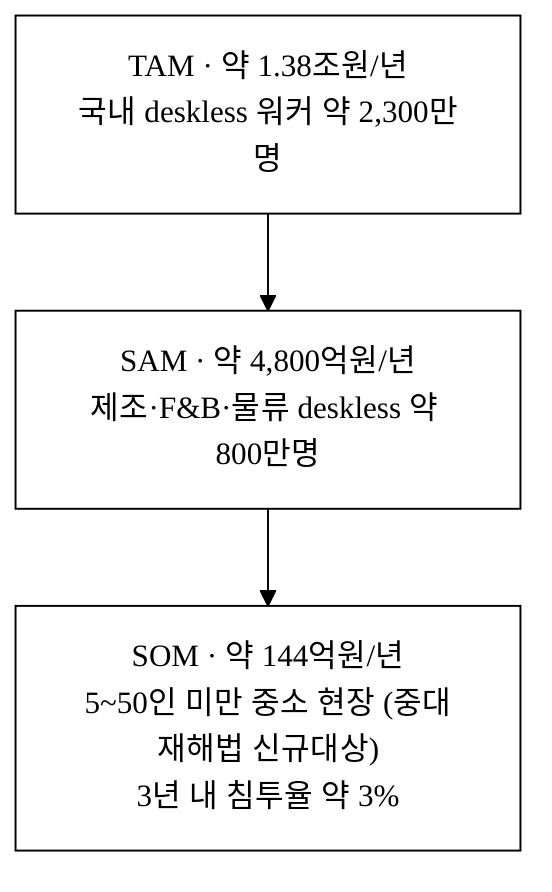

### 3.3 성장 동력 — 왜 지금인가

1. **시장 성장**: 국내 SaaS 연 14~15% 성장[^2], 글로벌 협업툴 연 12.7% 성장[^5].
2. **저점유 블루오션**: 국내 SaaS의 약 0.5%만 글로벌 점유[^3], 국내 시장의 약 70%가 외산[^1] — 토종 신규 카테고리 창출 여지.
3. **규제 풀(pull)**: 중대재해처벌법 5인 이상 확대(+83.7만 사업장[^11]).
4. **디지털 전환 미충족**: 중기 65.5% DX 전략 미준비[^16].

---

## 4. 경영혁신·창업학적 프레임워크

본 사업은 **Kim·Mauborgne 블루오션(ERRC)** 을 주축으로, **Christensen 파괴적 혁신**(왜 변방에서 시작하는가)과 **Clayton Christensen 계열의 JTBD**(고객이 사는 진짜 가치)로 보강하며, 실행 논리는 **Sarasvathy 이펙츄에이션**으로 정당화한다.

### 4.1 블루오션 ERRC — 사무직 협업 레드오션을 떠나 새 가치곡선을 그린다

기존 국내 협업툴은 사무직 시장에서 메신저·결재·통합 기능을 두고 경쟁하는 **레드오션**이다. 「현장톡」은 경쟁 변수 자체를 재정의한다.

| ERRC | 적용 |
|:---|:---|
| **제거(Eliminate)** | 사무직 메신저의 채팅 스레드·이모지·소셜 피드 — 현장 Job과 무관 |
| **감소(Reduce)** | 기능 복잡도·온보딩 시간·시트 단가(5,000원으로 인하) |
| **증가(Raise)** | 모바일 한 손 조작성·오프라인 내성·기록 추적성 |
| **창조(Create)** | 작업단 워크플로·사진/음성 이상보고·중대재해법 안전 체크리스트·라인별 대시보드 |

**[그림 4] 전략 포지셔닝 — 가치곡선**
경쟁 변수별로 기존 사무직 협업툴과 현장톡의 제공 수준을 비교한다. 현장톡은 사무직 기능에서 의도적으로 낮고, 현장 특화 변수에서 압도적으로 높은 **차별화된 가치곡선**을 그린다.
> 선 식별(차트에 범례가 표시되지 않으므로 명시): 좌측 "채팅·소셜"에서 **높은 선 = 기존 사무직 협업툴**, **낮은 선 = 현장톡**. 우측 "오프라인내성·이상보고·안전·작업추적성"에서는 위치가 역전되어 **높은 선 = 현장톡**이다. (PDF 변환 시 실제 렌더 결과 확인 권장)

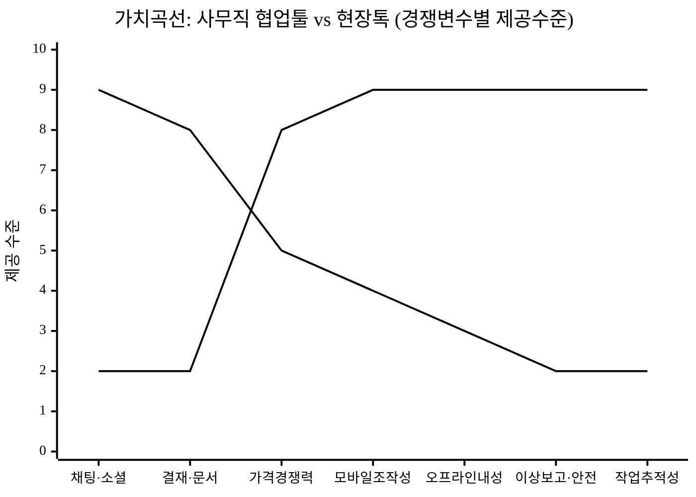

### 4.2 JTBD — 메신저가 아니라 작업 완료를 산다

현장 워커가 고용하는 Job은 *채팅*이 아니라 **"작업을 끝냈다는 증거를 남기고, 위험을 즉시 알린다"** 이다. 메신저 메타포(대화·채널)는 이 Job에 잘못 매핑된 도구다. 글로벌에서 deskless 워커의 56%가 개인 앱·종이로 공백을 메우는 현상[^6]은, 기존 도구가 이 Job을 충족하지 못한다는 시장 증거다. 본 사업은 UI 단위를 *대화*에서 *작업단(Work Unit)* 으로 바꿔 Job-도구 정합을 회복한다.

| Job 차원 | 내용 | 현장톡의 충족 |
|:---|:---|:---|
| 기능적 Job | 작업지시 수신 → 수행 → 사진·서명으로 완료 인증 | 작업단 워크플로 |
| 정서적 Job | "보고 안 했다"는 책임 분쟁 불안 제거 | 증거 자동 보존·기록 추적 |
| 사회적 Job | 관리자·동료에게 신뢰받는 성실한 작업자로 인정 | 완료 인증·대시보드 가시화 |

### 4.3 Christensen 파괴적 혁신 — 왜 변방(로우엔드)에서 시작하는가

잔디·네이버웍스·Slack은 데스크 워커라는 고급 시장에서 기능을 더하는 **존속적 혁신(Sustaining)** 경쟁 중이며, 이미 그 시장 요구를 **초과 충족(overshoot)** 하고 있다. 본 사업은 그들이 수익성을 이유로 외면한 **현장 워커(비소비·미서비스 영역)** 라는 로우엔드에서 *충분히 좋은(good enough)* 단순 도구로 진입한 뒤, 품질을 올려 상향 이동한다 — 로우엔드 파괴의 정석 궤도다. 잔디가 2024년 첫 흑자에 도달한 시점[^15]이 사무직 시장의 성숙(=신규 성장 여력 둔화)을 시사하는 반면, deskless는 SW투자 1%[^6]에 머문 미개척지다.

**[그림 5] 파괴적 혁신 궤도**
기존 협업툴(존속 궤도)은 현장 워커가 필요로 하는 수준을 한참 초과하며 비싸진다. 현장톡은 미충족 저변에서 출발해 성능을 끌어올린다.
> 선 식별(차트에 범례가 표시되지 않으므로 명시): **최상단 선(6→10) = 기존 협업툴(존속·overshoot)**, **중간 평탄선(2→6) = 현장 워커가 실제 요구하는 수준**, **최하단에서 급상승하는 선(1→9) = 현장톡(로우엔드 파괴 궤도)**. 현장톡 선이 T3 부근에서 "요구 수준" 선을 가로지르는 지점이 상향 이동(Up-market) 전환점이다. (PDF 변환 시 실제 렌더 결과 확인 권장)

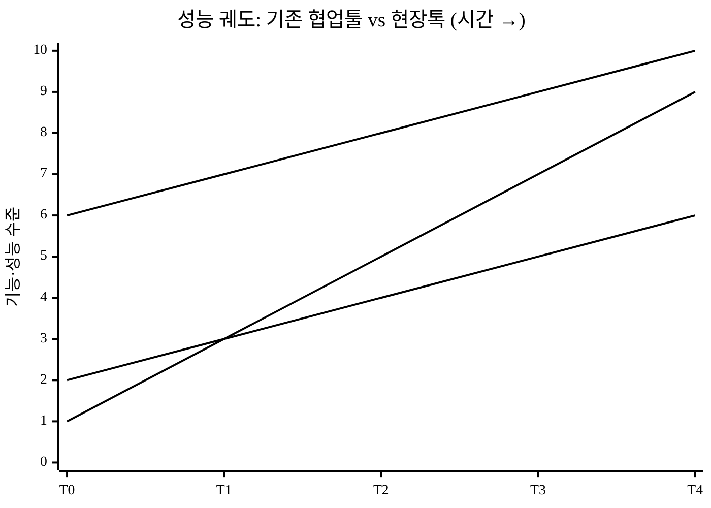

- **T0~T2**: "장갑 낀 손으로 작업 완료 보고"라는 단순 Job만 충분히 해결 → 비소비층 흡수.
- **T3 이후**: 다중 라인·오프라인 큐·산업별 체크리스트로 품질 상승 → 사무직 백오피스로 상향 확장(Up-market Move).

### 4.4 Sarasvathy 이펙츄에이션 — 자원 제약 하 실행 논리

자원이 제한된 초기 팀이 *예측(causation)* 대신 *수중의 수단(bird-in-hand)* 으로 시작하는 전략과 정합한다. 거대 인프라 없이 **모바일 PWA + 브라우저 API(Web Speech·Camera·IndexedDB)** 만으로 PoC가 성립하고(§ projects 데모), 파일럿 현장(affordable loss 범위)에서 학습해 확장한다. 초기 무상 파일럿(§7)은 "잃어도 감당 가능한 손실"로 학습을 사고, 파일럿 사례를 지렛대로 다음 고객을 끌어들이는 이펙추에이션의 전형이다.

---

## 5. 경쟁 분석

### 5.1 경쟁 매트릭스

가격은 2026-06 각사 공식 요금 페이지 기준(1인/월), 펀딩은 검증치([`5_research/README.md §4`](./5_research/README.md) 참조). 약점은 **현장 deskless 협업 관점**의 상대 평가다.

| 경쟁사 | 분류 | 가격(1인 월) | 펀딩/규모 | 강점 | 약점(현장 관점) |
|:---|:---|:---|:---|:---|:---|
| **잔디(JANDI)** | 국내 협업 메신저 | 6,000~9,000원[^18] | 누적 약 270억, 유료 5,000사[^15] | 국내 1위·한국어·안정 | 사무직 메신저 중심, 현장 작업지시·안전보고·오프라인 미특화 |
| **네이버웍스** | 국내 그룹웨어형 | 3,000~13,000원[^19] | 네이버(대기업) | 메일·드라이브 통합·브랜드 | 사무 협업 지향, 현장 UX·이상보고 플로우 부재 |
| **카카오워크** | 국내 협업 메신저 | 2,400~11,900원[^20] | 카카오(대기업) | 카톡 친숙 UX·결재 | 사무직 메신저, 현장 사진보고·서명·체크리스트 미흡 |
| **NHN두레이** | 국내 올인원 | 약 4,000~5,000원[^21] | NHN(대기업) | 프로젝트·메일·결재 통합 | 지식근로자 PM 중심, deskless 현장 특화 아님 |
| **Connecteam** | 글로벌 deskless | 월 29~119$ (연간결제 시 ~99$, 첫 30명 정액)[^13] | Series C 1.2억$·밸류 8억$+[^13] | deskless 올인원(스케줄·근태·작업) | 영어권 UX, 한국 규제·한국어 미대응, 중소 가격대 부적합 |
| **Beekeeper** | 글로벌 프론트라인 | 엔터프라이즈 문의[^14] | Series C 5,000만$·누적 1억$+[^14] | 프론트라인 내부소통 강점 | 대기업향·고가, 한국 중소 현장·규제 미대응 |
| **현장톡 (당사)** | 국내 현장 deskless | **5,000원~** | (예정) | 작업단·사진/음성 이상보고·오프라인·중대재해법 대응 | 신규 진입자(레퍼런스 축적 필요) |

> ⚠️ **진짜 경쟁자는 유료 사무 협업툴이 아니다**: 현장 사장이 실제로 쓰는 1순위 대안은 위 6종이 아니라 **카카오톡 단톡방(무료)** 과 **종이·엑셀**이다. §1.2에서 "카톡·전화·종이가 진짜 적"이라 진단한 대로, 이들을 경쟁 매트릭스 최상단에 명시한다.

| 진짜 대안 | 비용 | 보급/학습비용 | 치명적 한계(현장 관점) |
|:---|:---|:---|:---|
| **카카오톡 단톡방** | 무료 | 전국민 보급·학습비용 0 | 작업이 스크롤로 휘발·검색 불가, 작업단별 추적 불가, **법적 증거 불성립**(타임스탬프·서명·무결성 없음) |
| **종이 일지·엑셀** | 사실상 무료 | 익숙함 | 작성·보관·전사(OCR) 비용, 실시간 공유 불가, 위변조·분실 위험, 위험 신호 소실 |

### 5.2 경쟁 공백 — 진입점

1. 국내 4종(잔디·네이버웍스·카카오워크·두레이)은 **사무직 메신저/그룹웨어**로, 현장 작업지시→사진/음성 이상보고→안전 체크리스트→기록 보존의 **현장 워크플로**가 약하다.
2. 글로벌 deskless 2종(Connecteam·Beekeeper)은 **한국어·국내 규제(중대재해처벌법)·국내 중소 현장 가격대**에 미대응이며, 검증된 펀딩 규모(Connecteam 밸류 8억$+[^13])는 deskless 카테고리의 글로벌 사업성을 역으로 입증한다.
3. → **한국 현장(제조·F&B·물류) + 중대재해법 대응 + deskless 모바일 UX**의 교집합이 비어 있다. 글로벌의 "노동력 80%, SW투자 1%"[^6] 구조의 국내판이며, 토종 선점 기회다.

### 5.3 공짜 카톡을 이기는 단 하나의 이유 — "법적 증거능력"

> **카톡을 못 이기면 이 사업은 0원이다.** 월 5,000원을 정당화하는 핵심은 기능 개수가 아니라 **단톡방이 구조적으로 못 하는 단 하나** 다.

| 항목 | 카톡 단톡방(무료) | 현장톡(유료) | 추가지불 정당화 |
|:---|:---|:---|:---|
| 작업 추적 | 스크롤로 휘발, 검색 불가 | 작업단별 상태·이력 영속 | ✅ |
| 완료 인증 | 사진 떠내려감 | 사진+서명+**서버 타임스탬프**로 고정 | ✅ |
| 법적 증거 | 위변조·삭제 가능, 증거능력 불성립 | append-only 감사로그+파일 해시(§15) | ✅✅ **핵심** |
| 중대재해법 기록 보존 | 불가 | 법정 보존기간 충족 보존 옵션(§15) | ✅✅ **핵심** |
| 이상보고 추적 | 메시지에 묻힘 | 라인·교대조별 대시보드 집계 | ✅ |

핵심 메시지: **"사고가 나면 카톡 단톡방은 증거가 되지 못한다. 현장톡 기록은 누가·언제·무엇을 보고했는지 위변조 불가능하게 남는다."** 이것이 5,000원 페이월의 본질이며, 가격 경쟁이 아니라 가치(법적 책임 방어)로 포지셔닝하는 근거다.

### 5.4 경쟁사 대응 워게임 — fast-follow 시나리오와 방어 카드

경쟁사를 "지금 못 하는 정적 존재"가 아니라 **6개월 내 따라올 수 있는 동적 위협**으로 모델링한다.

| 경쟁사 | 예상 대응 | 소요(추정) | 당사 방어 카드 | 방어 성공조건 |
|:---|:---|:---|:---|:---|
| 카카오워크 | 카톡 기반 "현장 모드" 모듈, 0원 덤핑 | 6~12개월 | 도메인 깊이(산업별 워크플로)·규제 컴플라이언스 인증·현장 영업망 락인 | 인증·데이터 해자(§6A)가 모듈 카피보다 빠르게 축적 |
| 네이버웍스 | 클로바 STT로 한국어 음성 동급 제공 | 3~6개월 | **STT를 차별점에서 강등**, 작업단 워크플로·증거 무결성으로 차별 재정의 | 차별축이 STT가 아니라 워크플로·규제 데이터 |
| NHN두레이 | 작업지시 워크플로 추가 | 6~9개월 | 현장 전용 UX(장갑·오프라인)·전환비용 락인 | 현장 깊이에서 PM툴이 따라오기 어려움 |
| 글로벌(Connecteam 등) | 한국어·규제 로컬라이즈 후 진입 | 9~18개월 | 한국 규제 도메인 선점·현장 데이터 코퍼스·채널 | 진입 시점 이미 데이터·인증 해자 보유 |

> 핵심 답변: "네이버·카카오가 클로바 STT로 한국어 음성을 동급 제공하면 우리 차별점은?" → **STT가 아니라** ① 산업별 작업단 워크플로 깊이, ② 중대재해법 증거능력 설계(§15), ③ 축적된 현장·사고 데이터 해자(§6A)다. 한국어 STT를 핵심 차별점에서 의도적으로 강등한 이유가 여기 있다.

### 5.5 차별점 전수 도출 (50+) — 카테고리별 경쟁사 대비 차별점·고객 가치

> 본 표는 §2.3에서 압축한 차별점을 **8개 카테고리로 전수 분해**한 것이다. 각 행은 *경쟁사가 하는 방식 → 현장톡의 차별점 → 그 차별점이 고객에게 만드는 가치*로 적고, 그 차별점이 건드리는 **핵심 구매동인**(§5의2의 must/nice)을 연결한다.
> **정직 원칙**: 미검증·자체 추정치는 `[추정]` 표기. "더 빠르다/좋다"식 자기주장은 §5의2에서 가치 정량화로 검증된 것만 강(强)으로 표기하고, 나머지는 보조 동인임을 명시한다. 차별점 개수를 늘리는 것 자체가 목적이 아니라, **단일 must-have(법적 증거능력)에 차별축이 어떻게 수렴하는지**를 전수로 드러내는 것이 목적이다. 모방 가능한 축(가격·한국어 STT)은 "보조"로 정직히 강등한다.

#### A. 기술 — 오프라인 동기화·증거 무결성 (1~10)

| # | 경쟁사 방식 | 현장톡 차별점 | 고객 가치 | 구매동인 |
|:---:|:---|:---|:---|:---:|
| 1 | 메신저는 온라인 상시 연결 가정 (오프라인 시 전송 실패) | **오프라인 우선(offline-first) 큐** — 입력을 로컬 큐(IndexedDB)에 적재 후 복구 시 자동 동기화 | 지하·창고·터널 등 음영지역에서도 작업 기록 누락 0 | must (보조) |
| 2 | 동기화 충돌을 사용자에게 떠넘김(마지막 저장 우선) | **충돌 해결 엔진** — 충돌 시 충돌 로그를 남기고 머지 규칙 적용(`resolveConflict`) | 오프라인 다중 편집 후에도 기록 유실·덮어쓰기 방지 | must (보조) |
| 3 | 사진을 단순 첨부(메타데이터 휘발) | **사진+서버 타임스탬프+위치 합성** — 완료 인증 시점·위치를 사진에 고정 | "언제·어디서 찍었나"가 사후 위변조 불가하게 결합 | **must (핵심)** |
| 4 | 메시지 삭제·수정 가능 | **append-only 감사로그** — 모든 이벤트가 누적만 되고 수정 불가(§15) | 사고 발생 시 기록의 증거능력 성립 | **must (핵심)** |
| 5 | 파일 무결성 검증 없음 | **파일 해시(체크섬) 보존** — 원본 위변조 탐지 | 법정 제출 시 "원본 그대로"임을 입증 | **must (핵심)** |
| 6 | 음성은 서버 STT 의존(오프라인 불가) | **녹음 보관 → 복구 시 STT** 설계로 오프라인 음성 입력 가능 | 음영지역에서도 음성 보고 가능 | nice |
| 7 | 동기화 상태 불투명 | **큐 가시화** — 오프라인 큐 대기 건수·동기화 진행을 UI로 표시 | 작업자가 "내 보고가 저장됐나" 불안 없이 작업 | nice |
| 8 | 웹앱(설치 불가)·네이티브앱(스토어 심사·용량) | **PWA** — 설치 가능·서비스워커 캐시·푸시, 스토어 심사 우회 | 앱 배포 마찰 0, 저사양 단말에서도 가동 | nice |
| 9 | 권한 부재 시 기능 차단 | **권한 부재 시 mock fallback** — 카메라·위치 권한 없어도 시연·기록 흐름 유지 | 현장 단말 권한 편차에도 워크플로 끊김 0 | nice |
| 10 | 입력 새로고침 시 휘발 | **상태 지속성**(localStorage/IndexedDB) — 새로고침·재접속 후에도 작성 중 입력 유지 | 현장 통신 불안정에도 작업 손실 0 | must (보조) |

#### B. 데이터·알고리즘 — 위험분석·도메인 코퍼스 (11~19)

| # | 경쟁사 방식 | 현장톡 차별점 | 고객 가치 | 구매동인 |
|:---:|:---|:---|:---|:---:|
| 11 | 협업툴은 위험 분석 미제공 | **라인별 위험점수 산출**(`scoreLine`, 0~100) — 이상보고·심각도·체크리스트 미준수·작업 적체 가중합 | 현장별 위험을 한 숫자로 비교·우선순위화 | nice |
| 12 | 위험 등급 개념 없음 | **A~D 4등급 + 권고 자동 생성** | 관리자가 "어느 라인부터 손봐야 하나" 즉답 | nice |
| 13 | 보험과 무연동 | **보험사 위험분석 API 시뮬레이션** — 손해율 기준치 기반 보험료 할인·할증 계수(−10%~+25%) `[추정]` | 안전 데이터가 보험료 절감으로 환원되는 경로 제시 | nice |
| 14 | 산업 무관 일반 분석 | **산업 추정 기반 가중**(제조·물류·F&B 손해율 기준치 차등) `[추정]` | 업종 특성 반영한 현실적 위험 평가 | nice |
| 15 | 데이터 축적 자산 없음 | **현장·사고·점검 코퍼스 축적** — 사용량이 곧 도메인 데이터 해자(§6A) | 후발 카피가 따라올 수 없는 누적 자산 | nice |
| 16 | 단발 수치만 표시 | **라인별 7일 시계열 + 스파크라인 추세**(`sparkline`) | 위험이 오르는지/내리는지 추세로 판단 | nice |
| 17 | 전사 집계 없음 | **전사 종합 위험점수**(라인 가중 합산) | 경영진 보고용 단일 지표 | nice |
| 18 | STT 후처리 없음 | **도메인 특화 STT 후처리**(용어 사전·체크리스트 자동 매핑) — STT 엔진이 아닌 후처리가 자산 `[추정/개발예정]` | 현장 전문용어·약어 인식률 개선 여지 | nice |
| 19 | 분석 결과 외부 반출 불가 | **CSV 내보내기** — 위험분석·이력 외부 시스템 연계 | 기존 ERP·보험 제출 양식과 접속 | nice |

#### C. 현장 운영 — 작업단 워크플로·역할 (20~31)

| # | 경쟁사 방식 | 현장톡 차별점 | 고객 가치 | 구매동인 |
|:---:|:---|:---|:---|:---:|
| 20 | "메신저 채널" 패러다임 (대화가 스크롤로 휘발) | **작업단(Work Unit) 패러다임** — 작업이 상태머신을 가진 객체 | 작업이 대화에 묻히지 않고 추적됨 | **must (핵심·구조)** |
| 21 | 작업 상태 개념 없음 | **작업 상태 전이**(발행→진행→완료 인증→처리) | 진척을 상태로 한눈에 | must (보조) |
| 22 | 이상보고가 메시지에 묻힘 | **이상보고 전용 플로우 + 심각도 분류** | 위험 신호가 누락·지연 없이 격상 | **must (핵심)** |
| 23 | 단일 사용자 가정 | **4역할 RBAC**(작업자·반장·안전관리자·PM)와 권한 매트릭스(`can`/`allowedView`) | 역할별로 보는 화면·권한 분리 | must (보조) |
| 24 | 라인/교대 개념 없음 | **라인·교대조 단위 관리**(`vLines`) | 현장 조직 구조 그대로 매핑 | nice |
| 25 | SLA 없음 | **SLA 평가 + 자동 에스컬레이션**(`slaEvaluate`/`runEscalation`) | 지연된 작업·이상이 자동으로 상급자에 격상 | nice |
| 26 | 일괄 알림 불가 | **푸시 캠페인 + 세그먼트 타깃**(`sendCampaign`) | 특정 라인·역할에 안전공지 일괄 발송 | nice |
| 27 | 체크리스트 미내장 | **체크리스트 첨부 작업 발행** — 작업에 점검 항목 강제 | 작업과 안전점검이 한 흐름으로 묶임 | **must (핵심)** |
| 28 | 완료가 자기신고 텍스트 | **사진 인증 완료 보고** — 사진 없이 완료 불가 | "했다고만 함" 방지, 완료의 증거화 | **must (핵심)** |
| 29 | 작업 이력 검색 불가 | **작업 로그·이력 뷰**(`vHistory`) | 과거 작업·보고를 작업단 단위로 조회 | must (보조) |
| 30 | 대시보드 없음 | **역할별 KPI 대시보드**(반장·안전관리자·PM) | 각 역할이 자기 관점 지표를 즉시 확인 | nice |
| 31 | 감사 추적 불가 | **감사 로그 뷰**(`vAudit`) — 동기화 충돌·처리 이력 추적 | 누가·언제·무엇을 했는지 사후 추적 | **must (핵심)** |

#### D. 안전·규제 — 중대재해처벌법 대응 (32~39)

| # | 경쟁사 방식 | 현장톡 차별점 | 고객 가치 | 구매동인 |
|:---:|:---|:---|:---|:---:|
| 32 | 규제 도메인 미반영 | **중대재해처벌법 대응 설계** — 안전 체크리스트·보존 요건 충족 기록 | 5인 이상 全 사업장(약 83.7만 추가[^11]) 강제 수요에 정조준 | **must (핵심)** |
| 33 | 보존기간 무개념 | **법정 보존기간 충족 보존 옵션**(Growth+, §15) | 사고 발생 시점에 기록이 살아 있음 | **must (핵심)** |
| 34 | 증거능력 미설계 | **증거능력 4요소**(사진·서명·해시·서버 타임스탬프) 결합(§15.3) | 카톡이 구조적으로 못 하는 단 하나 | **must (핵심)** |
| 35 | 산업 무관 단일 체크리스트 | **산업별 체크리스트 라이브러리**(제조·물류·F&B…)(`libraryTemplates`) | 업종별 법정·안전 점검 항목 즉시 적용 | **must (핵심)** |
| 36 | 점검 이행률 측정 불가 | **체크리스트 준수율 집계** — 미준수 라인 식별 | "점검을 실제로 했나"를 정량 증명 | nice |
| 37 | 서명 휘발 | **서명 캔버스→이미지 보존** — 작업자·관리자 서명 고정 | 책임 소재가 서명으로 귀속 | **must (핵심)** |
| 38 | 사고 보고 표준 없음 | **이상 심각도 분류 표준화** | 사고 등급별 대응·보고 체계화 | must (보조) |
| 39 | 형사방어 자료 산재 | **"결정적 순간의 보험"** — 평시 즉시가치(절감)로 묶고 형사방어를 락인 | 평시 쓰다가 사고 시 결정적 증거로 전환 | **must (핵심·확률적)** |

#### E. 가격·GTM — 진입·획득 (40~47)

| # | 경쟁사 방식 | 현장톡 차별점 | 고객 가치 | 구매동인 |
|:---:|:---|:---|:---|:---:|
| 40 | 사무직 1인 6,000~13,000원 | **시트당 5,000원~** — 단, 가격은 차별점이 아니라 진입 편의로 정직 강등 | 중소 현장 도입 부담 완화 | nice (가격은 약한 동인) |
| 41 | 무료 25~30명 정책으로 가격 하한 0 | **"무료로 충분한 협업"과 "유료로만 되는 보존"을 분리** 포지셔닝 | 무료 대안과 정면 가격경쟁 회피 | **must (핵심·포지셔닝)** |
| 42 | 글로벌은 영어권 UX | **한국 현장 wedge** — 규제 풀이 가장 센 5~50인 제조·물류 우선 진입 | 강제 수요가 가장 큰 곳부터 확보 | must (보조·GTM) |
| 43 | 전사 일괄 영업 | **현장 단위 바텀업 도입** — 한 라인 시연→확산 | 도입 의사결정 마찰·CAC 절감 `[추정]` | nice |
| 44 | 도입 후 학습비용 큼 | **장갑 낀 손 UX**(큰 터치영역·음성·사진) — 학습비용 최소화 | 현장 작업자 즉시 사용 | nice |
| 45 | 데모가 정적 목업 | **실 구동 PWA 데모**로 영업 — 오프라인·증거능력 즉석 시연 | "보여주는 영업"으로 전환율 제고 `[추정]` | nice |
| 46 | 규제 변화 무대응 | **중대재해법 강화 타이밍(Why now)** — 2024-01 5인 이상 확대[^11] | 규제 압력이 도입 트리거 | must (보조·타이밍) |
| 47 | 외산은 국내 채널 부재 | **국내 안전·보험 채널 제휴 여지**(§6A) | 보험 할인 연계로 ROI 명확화 `[추정]` | nice |

#### F. 네트워크 효과·전환비용 — 해자 (48~55)

| # | 경쟁사 방식 | 현장톡 차별점 | 고객 가치(=방어가능성) | 구매동인 |
|:---:|:---|:---|:---|:---:|
| 48 | 데이터 락인 약함 | **누적 작업·사고 기록 = 전환비용** — 이전 시 이력 단절 | 한번 쌓이면 이탈이 손해 | nice (락인) |
| 49 | 단순 카피로 추격 가능 | **도메인 데이터 해자** — 산업별 코퍼스는 시간으로만 축적 | 후발이 기능은 베껴도 데이터는 못 베낌 | nice (해자) |
| 50 | 규제 대응이 기능 수준 | **규제 컴플라이언스 인증 락인**(추진) `[추정/예정]` | 인증이 카피 속도보다 빠른 해자 | nice (해자) |
| 51 | 단방향 도구 | **다역할 네트워크**(작업자↔반장↔관리자↔PM)가 한 현장에 묶임 | 역할 다수가 쓸수록 이탈 비용 증가 | nice (네트워크) |
| 52 | 외부 시스템 단절 | **CSV·보험 API 등 외부 통합 접점** | 주변 시스템과 엮일수록 전환비용 ↑ | nice (락인) |
| 53 | 워크플로 얕음 | **산업별 작업단 워크플로 깊이** — 카피 난이도 높음 | "메신저+α"로 못 따라오는 깊이 | **must (핵심·구조)** |
| 54 | 증거 설계 부재 | **증거능력 설계 노하우** — 무결성·보존·증거능력 동반 복제 난이도 | fast-follow 카피의 가장 느린 부분 | **must (핵심)** |
| 55 | 현장 영업망 없음 | **현장 채널·레퍼런스 축적** — 신뢰 기반 진입장벽 | 후발이 신뢰·레퍼런스부터 다시 쌓아야 함 | nice (해자) |

#### G. UX — 현장 입력 마찰 최소화 (56~62)

| # | 경쟁사 방식 | 현장톡 차별점 | 고객 가치 | 구매동인 |
|:---:|:---|:---|:---|:---:|
| 56 | 키보드 텍스트 입력 위주 | **음성 입력**(Web Speech, 온라인) — 장갑·소음 환경 대응 | 손 못 쓰는 상황에서도 보고 | nice |
| 57 | 작은 터치 타깃 | **큰 터치영역·단순 동선** — 산업 현장 WCAG 조정 | 장갑·흔들림에도 오조작 감소 | nice |
| 58 | 사진 별도 첨부 단계 | **사진 즉시 미리보기·인증 일체화** | 완료 보고가 한 동작으로 | nice |
| 59 | 데스크톱 전제 | **모바일 퍼스트 + 반응형**(390/1280 양 대응) | 현장은 모바일, 관리자는 PC 양립 | must (보조) |
| 60 | 설치·로그인 마찰 | **로그인 없이 즉시 시연**(시제품 기본값) — 역할 전환 토글 | 도입 초기 마찰 0, 시연 즉시 | nice |
| 61 | 알림 채널 단일 | **PWA 푸시 권한·구독 흐름** | 현장 긴급 공지 도달 | nice |
| 62 | 한국어 입력 정확도 편차 | **한국어 STT — 단, 핵심 해자 아님으로 정직 강등** | 입력 편의(보조). 차별축은 STT 아닌 워크플로 | nice (약한 동인) |

#### 차별점 분류 요약

| 카테고리 | 행 수 | must-have(핵심) | 비고 |
|:---|:---:|:---:|:---|
| A. 기술(오프라인 동기화·증거 무결성) | 10 | 3·4·5 | 증거능력 3요소가 핵심에 집중 |
| B. 데이터·알고리즘 | 9 | – | 전부 보조 동인(미래 가치) |
| C. 현장 운영·워크플로 | 12 | 20·22·27·28·31 | 작업단 패러다임=구조적 핵심 |
| D. 안전·규제 | 8 | 32·33·34·35·37·39 | **must-have 집중 구역** |
| E. 가격·GTM | 8 | 41 | 가격 자체는 약한 동인 |
| F. 네트워크·전환비용 | 8 | 53·54 | 워크플로 깊이=해자 |
| G. UX | 7 | – | 입력 마찰 완화(보조) |
| **합계** | **62** | **17** | 핵심 17개가 모두 §5의2 단일 must-have로 수렴 |

> **정직한 결론**: 62개 차별점 중 *강한 구매동인(must-have 핵심)은 17개*이며, 그 17개는 모두 **"법적 증거능력"이라는 단일 축**(증거 무결성·작업단 워크플로·중대재해법 보존)으로 수렴한다. 나머지 45개(데이터·알고리즘·가격·UX 다수)는 평시 즉시가치·락인을 만드는 **보조 동인**으로 정직히 분류했다. 차별점 개수를 부풀려 "기능이 많아서 좋다"고 주장하지 않는다 — §5의2의 must/nice 논증과 1:1로 정합한다.

---

## 5의2. 차별화 기술의 구매동인 논증

> §2.3·§5는 차별점을 *나열*했다. 본 절은 그 차별점이 **고객의 실제 구매·사용 결정을 얼마나 크게 움직이는가**를 must/nice로 분류하고, 가치를 **고객 언어의 수치**로 환산하며, 외부 근거로 뒷받침하고, 반증을 직시한다. 결론: 현장톡의 단일 핵심 구매동인은 **"법적 증거능력(사진+서명+해시+서버 타임스탬프)"** 이며, 이것만이 무료 카톡 대비 페이월을 정당화한다. 나머지(음성·대시보드·오프라인)는 보조 동인이다.

### ① 구매동인 가설 — must-have vs nice-to-have 분류

| 차별 기능 | 건드리는 고객 의사결정 요인(JTBD) | 분류 | 근거 |
|:---|:---|:---:|:---|
| **법적 증거능력**(사진+서명+SHA-256 해시+서버 타임스탬프+append-only 감사로그) | "중대재해 사고 시 *내(경영책임자)가 안전 의무를 다했다*를 위변조 불가능하게 입증" | **must-have** | 중대재해법은 경영책임자에게 **의무이행 입증책임**을 지우고 안전보건 증빙을 **3년 보존**하게 한다[^23]. 미충족 시 형사 방어 수단 자체가 소멸 → 없으면 "안 사는" 것이 아니라 "법적으로 무방비". |
| 작업단 워크플로·기록 추적성 | "누가·언제·무엇을 완료했는지 분쟁 시 즉시 입증" | must-have(증거능력의 하위) | 전자문서 증거능력 요건 = 작성자 특정+**위변조 검출**+형태 보존[^22]. 카톡 스크롤·종이일지는 이 요건 미충족. |
| 한국어 음성 인수인계(STT) | "장갑 낀 손으로 입력 마찰 최소화" | **nice-to-have** | 입력 편의는 채택을 *돕지만* 단독으로 돈을 내게 하지 않음. 클로바 등 대체재 존재(§5.4) → 페이월 정당화 불가. |
| 관리자 대시보드·오프라인 큐 | "현장 가시성·통신 공백 대응" | nice-to-have(상위 티어 묶음) | 있으면 좋으나, 무료 단톡방+엑셀로 "충분히 좋은" 대체가 가능한 영역. Growth 이상 번들로 배치(§6.1). |

> **핵심 판정**: 현장톡의 *유일한 must-have*는 법적 증거능력이다. 이것이 §5.3 "카톡을 이기는 단 하나의 이유"·§15.3 증거능력 설계·§6.1 "규제 보존은 Growth 이상" 과 한 줄로 정합한다. 차별점을 늘리는 대신, **must-have 하나에 가격·티어·데모를 모두 정렬**했다.

### ② 가치 정량화 — 고객 언어의 수치 `[추정]`

추상적 "더 안전하다"가 아니라, 고객(현장 사장·경영책임자)이 체감하는 **−원/−시간/−리스크**로 환산한다. 아래 수치는 자체 추정(`[추정]`)이며, 외부 검증 수치(§③)와 분리한다.

| 구매동인 | 고객 언어 가치 | 산정 가정 `[추정]` | 전환비용 대비 |
|:---|:---|:---|:---|
| 중대재해 1건 형사방어 | **회피 비용 수억~수십억원 규모**(형사합의금·벌금·영업손실) `[추정]` | 사망사고 1건 시 경영책임자 형사처벌·합의·과징금·조업중단의 결합 손실(개별 금액은 사건별 상이 → 구간 미특정, `[법률 검토 필요]`) | 연 구독료(8시트×5,000×12 = 48만원/현장)의 **수백~수천 배** → 10배 규칙 압도 |
| 종이 안전일지·점검표 전사 | **−약 8~16시간/월/현장** `[추정]` | 일 점검 5분 작성+월말 전사·보관 2~4시간 → 현장당 월 8~16시간 절감 가정. 산업 사례로 연 11만 시간 감축 보고[^17] | 인건비 환산 시 구독료 일부 상쇄 |
| 분쟁(완료 미인증) 1건 입증 | **−1건당 수시간 소명 + 재작업 리스크 제거** `[추정]` | "보고 안 했다" 책임 다툼을 사진+서명+타임스탬프로 즉시 종결 | 무료 카톡은 스크롤 휘발로 입증 불가 |
| 보존 의무 위반 과태료 회피 | **과태료 회피**(안전보건 서류 3년 미보존 시 과태료[^23]) | 자동 보존으로 미보존 리스크 0 | 구독료가 과태료보다 작음 |

> **must-have 가치의 비대칭성**: 종이 전사 −시간(나이스한 ROI)만으로는 5,000원을 못 받지만, **형사방어 가치는 구독료의 수백~수천 배**라 *전환 마찰을 압도(10배 규칙)*. 단, 이 가치는 **확률적(사고 발생 시에만 실현)** 이므로 — 고객은 "사고 안 나면 낭비"로 인식할 수 있다(→ 반증 ④에서 직시).

### ③ 외부 근거 (검증 수치 — 자체 추정과 분리)

- **법적 증거능력이 must-have인 근거**: 전자문서는 형태라는 이유만으로 효력이 부인되지 않으나(전자문서법 §4), 증거능력을 가지려면 **① 작성자 특정 ② 서명 후 위변조 검출 ③ 작성·저장 형태 보존**이 충족돼야 한다[^22]. 카톡 단톡방·종이일지는 ②③을 구조적으로 충족 못 하므로(스크롤 휘발·위변조 가능), 사진+서명에 **해시+서버 타임스탬프**를 결합한 현장톡 설계(§15.3)가 증거능력의 분기점이다.
- **규제가 강제 수요를 만든다는 근거**: 중대재해법은 경영책임자에게 **안전 의무이행 입증책임**을 지우고, 회의록·점검·교육·업무수행내역 등 증빙 서류를 **3년 보존**(미보존 시 과태료)하게 한다[^23]. → "위변조 불가능한 점검·완료 기록"은 nice가 아니라 **경영책임자 형사방어의 필수 자료**.
- **종이 전사 절감의 산업 근거**: 현장 수기업무 디지털화로 연 11만 시간 이상 감축 사례[^17](특정 기업 사례이므로 자사 환산은 `[추정]`).

### ④ 반증·대안 위협 직시

| 반증(고객이 그래도 안 사는/이탈하는 이유) | 직면 | 대응 |
|:---|:---|:---|
| "무료 카톡으로 충분하다" | 일상 소통은 사실이다 — 무료 대안이 "충분히 좋은" 영역(Christensen) | 소통이 아니라 **증거능력**으로 싸운다(§5.3). 일반 소통은 익명 영역으로 양보하고, 완료 인증·이상보고만 유료 인증 영역(§15.2). |
| "사고 안 나면 보험료 같은 낭비" — 확률적 가치라 WTP 미달 | 형사방어 가치는 사고 시에만 실현 → 평시 체감 0 | 평시에도 실현되는 **즉시 가치**(종이 전사 −시간·분쟁 소명 −시간·점검 이행률 대시보드)를 Starter에 배치해 "보험" 인식을 "매일 쓰는 도구"로 전환. 과징금·과태료 회피[^23]는 평시에도 작동. |
| "5,000원도 비싸다"(저ARPU·가격 민감) | 현장 SMB 가격 저항 실재 | 현장당 정액+인원구간제(§6.1)로 인당 부담 희석, 무상 파일럿으로 가치 선체험(§7). |
| "50~60대 작업자가 앱을 안 쓴다" | 온보딩 마찰이 진짜 장벽(§7.3) | QR·SMS 가입·공용 거치형·PWA 무설치로 1시간 미만 도입(§7.3). |

> **정직한 결론**: 현장톡의 강한 구매동인은 *단 하나(법적 증거능력)* 이며 그조차 **확률적**이다. 따라서 GTM은 ① 규제 풀이 가장 센 5~50인 제조·물류를 wedge로(§1.3·§7), ② 평시 즉시가치(전사 절감·점검 이행)로 일상 사용을 묶고, ③ 형사방어 가치는 "결정적 순간의 보험"으로 포지셔닝한다. 약한 동인(STT)을 핵심으로 오인하지 않은 것이 이 논증의 요체다.

### ⑤ 데모(projects/fieldworker-pwa) 시연 지점 — 논증과 산출물 정합

위 구매동인을 데모가 **실제로 구현·시연**하는 지점은 다음과 같다(데모: [`../projects/fieldworker-pwa/v3.html`](../projects/fieldworker-pwa/v3.html)).

| 구매동인 | 데모 구현 화면·동작 | 구현 수준(정직 표기) |
|:---|:---|:---|
| 완료 인증(사진+서명+타임스탬프) | 작업 상세 → **완료 인증 사진**(실 카메라 스트림·파일 업로드, 권한 부재 시 mock 프레임에 시각·GPS 각인) → 사진 1장+체크리스트 100% 충족 시에만 완료, 작업 로그에 완료 시각 기록 | **실 구현** (서명 캔버스·사진 캡처·타임스탬프 로그) |
| 위변조 추적(append-only 감사로그) | **안전 감사 로그** 뷰 — 위험분석·SLA 에스컬레이션·동기화 충돌해결·이상 처리를 시각·역할과 함께 append-only로 누적 | **실 구현**(append-only 이력). 단 **SHA-256 해시 체인은 §15.3 설계 사양**으로, v3 데모는 *타임스탬프 감사로그 수준*까지 구현 — 해시 무결성은 미구현(정직 표기) |
| 이상보고 즉시 추적 | 이상 보고 뷰 — 카테고리·심각도·사진·음성·서버 시각으로 즉시 기록, 관리자 대시보드 집계 | 실 구현 |
| 오프라인 증거 무손실 | 오프라인 시 완료·이상보고를 IndexedDB 큐 적재 → 복구 시 동기화, 충돌해결 로그 | 실 구현(시뮬레이션) |

> 데모 한계 정직 표기: v3 데모는 증거능력의 **사진·서명·서버 타임스탬프·append-only 감사로그까지 실 구현**했으나, 법적 증거능력의 마지막 고리인 **파일 SHA-256 해시 체인**(§15.3)은 설계 사양이며 데모 미구현이다. 이 갭은 §8 로드맵 v2~v3에서 해소한다(과장 없이 현 구현 범위를 표기).

---

## 6. 비즈니스 모델·유닛 이코노믹스

### 6.1 가격 모델 (3티어)

| 티어 | 시트/월 | 포함 | 타깃 | 유료화 트리거(페이월) |
|:---|---:|:---|:---|:---|
| Starter | 5,000원 | 작업지시·이상보고·체크리스트·이력 30일 | 1개 라인·소규모 식당 | 라인 1개·이력 30일 제한 |
| Growth | 9,900원 | + 관리자 대시보드·라인 무제한·이력 1년·오프라인 큐·**규제 보존 옵션** | 중소 제조·물류 | 라인 무제한·**법정 보존기간 기록 보존**·대시보드 |
| Enterprise | 별도 협의 (ACV `[추정]` 600만~3,000만원/년) | + SSO·온프렘 옵션·전담 CS·**SLA 99.5%**·ERP 연동 | 대기업·체인점 | 보안 인증·SLA·온프렘·전담 |

> **무료 티어 경쟁 대응(중요)**: 카카오워크 Mini 2,400원·네이버웍스/두레이/Connecteam 무료 25~30명이 가격 하한을 0으로 끌어내린다. 따라서 Starter 5,000원의 유료화 근거는 "기능"이 아니라 **"규제 보존이 필요한 순간"** 이다. 즉 단순 협업은 무료 대안으로 충분하므로, **법정 보존기간을 충족하는 기록 보존·증거능력은 Growth 이상에서만 제공**해 §5.3의 가치 차별과 정합시킨다(Starter 30일 보존은 규제 대응 메시지와 모순되지 않도록 "규제 보존은 Growth 이상" 명시).

**과금 단위 — 시트당 모델의 한계와 대안**: 현장 워커는 이직·일용·교대가 잦아 "사람마다 돈 내는" 시트당 모델을 고용주가 가장 싫어하며, 작업자도 "회사가 나를 추적하며 돈까지 번다"는 인식이 생긴다(Connecteam이 첫 30명 정액을 쓰는 이유). 따라서 과금 단위를 다음과 같이 병행 검토한다.

| 과금 단위 | 적합 현장 | 장점 | 단점 | 채택 우선 |
|:---|:---|:---|:---|:---:|
| **현장(사이트)당 정액 + 인원 구간제** | 일용·교대 비중 높은 현장 | 인원 변동 무관·예측 가능 | 소수 인원 현장엔 비쌀 수 있음 | **1순위(Connecteam식)** |
| 시트당(월 5,000원) | 인원 안정적 라인 | 단순·확장 시 선형 매출 | 일용/교대에 불리 | 2순위 |
| 활성 작업자당 | 계절성 큰 현장 | 사용량 연동 | 정산 복잡 | 옵션 |

> §7 WTP 검증 KPI에 **단가뿐 아니라 "과금 단위 선호"** 도 포함한다.

수익 모델(매출 믹스 가정 `[추정]`): **구독(시트/현장 정액) 약 80% : Enterprise 컨설팅·연동 약 18% : 데이터 제휴 약 2%**. 보험사 위험분석 데이터 제휴는 잠재 ARR 축이 아니라 **장기 옵션(v3+)** 으로 격하한다 — 보험사 수요·계약구조·데이터 충분성·보험업법/개인정보 규제 검증이 아직 0건이므로, 1건 이상 보험사 인터뷰·데이터 요건 확인 전까지는 매출 추정에 산입하지 않는다(§16 데이터 자산 전략과 연계).

**[그림 6] 비즈니스 모델·수익 구조**

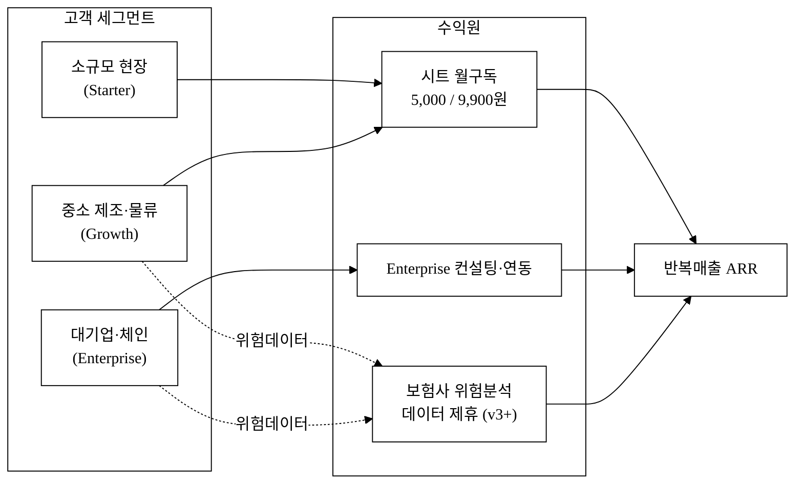

### 6.2 유닛 이코노믹스 (`[추정]`)

블렌디드 ARPU는 Starter:Growth = 6:4 가정 시 1인 월 **약 6,960원** `[추정]` ((5,000×0.6)+(9,900×0.4)). SOM(약 144억원/년) 도달 시나리오를 시트 수로 환산하면 다음과 같다.

| 시나리오 | 유료 시트 수 `[추정]` | 블렌디드 ARPU `[추정]` | 월 매출 `[추정]` | 연 ARR `[추정]` |
|:---|---:|---:|---:|---:|
| 객단가 민감도(하방) | 172,000 시트 | 4,176원 (믹스 동일·단가 −40%) | 약 7.18억원 | 약 86.2억원 |
| 보수 | 100,000 시트 | 6,960원 | 약 6.96억원 | 약 83.5억원 |
| 기준 | 172,000 시트 | 6,960원 | 약 12억원 | 약 144억원 (SOM 일치) |
| **객단가 민감도(상방)** | 172,000 시트 | **9,605원** (믹스 동일·단가 +38%, Starter 6,900원[^24] 환산 상방) | 약 16.5억원 | **약 198억원** |
| 낙관 | 300,000 시트 | 6,960원 | 약 20.9억원 | 약 250억원 |

> **객단가 가정 — 하방·상방 양방향 제시 (편향 완화)**: 본 시나리오와 §3 TAM(약 1.38조)은 모두 "현장 워커 1인 월 5,000원" 단일 객단가에 의존한다. 이 단가가 빗나갈 경우를 **하방·상방 양쪽**으로 본다.
> - **하방**: Starter 단가를 3,000원으로 낮춰(블렌디드 ARPU −40%) ARR 하한 약 86억원.
> - **상방**: 글로벌 deskless 협업툴 **Connecteam의 30인 초과 인당 단가가 $5/월(≈6,900원, 환율 1,380원/$ 가정 `[추정]` 환산)**[^24]임을 근거로, 현장톡 Starter를 6,900원까지 받을 수 있다고 보면 블렌디드 ARPU 9,605원·ARR 약 198억원. 즉 5,000원은 **인접 사무직 협업툴(잔디 6,000·네이버웍스 3,000~8,500)과 글로벌 deskless($5≈6,900원[추정])의 하단~중단**에 보수적으로 위치한 가정이다.
> - **정직 표기**: 5,000원은 여전히 현장 워커 실제 WTP가 미검증인 `[추정]` 이며(인접 단가 차용), §7 파일럿에서 **반드시 1차 검증 KPI로 측정**한다. Connecteam 6,900원·4,000원의 *원화 환산만* `[추정]` 이고 달러 단가는 공식 수치다([^24], 혼용 금지). TAM(1.38조)이 현존 국내 협업툴 시장(약 4,000~5,000억[^4])의 약 3배인 점도 이 단가 가정에 의존한다(§7 KPI·§9 리스크 참조).
>
> 모든 수치는 객단가·믹스·침투율을 가정한 `[추정]` 이며, 공식 통계가 아니다. 시트 수는 SAM(약 800만명) 대비 기준 시나리오에서 약 2.15% 침투를 의미한다.

### 6.3 단위경제성 — LTV / CAC / 이탈률 / 회수기간 `[추정]`

> 본 절은 "추정이라 비움"이 아니라 **추정 가설을 명시하고 §7 파일럿에서 검증**하는 구조다. 모든 값은 가정이며 파일럿 실측으로 갱신한다.

**(1) 비용측 — 시트당 월 인프라 변동원가 추정** (사진·음성·서명 바이너리 저장 포함)

| 원가 항목 | 시트당 월 추정 | 비고 |
|:---|---:|:---|
| 객체 스토리지(사진·음성·서명) | 약 250원 `[추정]` | 압축·콜드스토리지 전환으로 통제(§13) |
| STT 호출(서버 STT 일부) | 약 200원 `[추정]` | 온라인 Web Speech는 무료, 서버 STT만 과금 |
| 서버·DB·푸시·대역폭 | 약 350원 `[추정]` | 멀티테넌시로 분산 |
| **시트당 변동원가 합계** | **약 800원** | → **매출총이익률 약 84%** (5,000원 기준) |

> 결론: 5,000원 단가에서 시트당 변동원가 약 800원을 빼면 **공헌이익 약 4,200원/시트(82~84%)** 로 양(+)이다. SaaS 통상 매출총이익률 70~80%[추정]과 정합. 대용량 미디어는 압축·콜드스토리지 전환으로 원가를 통제한다.

**(2) LTV / CAC 시나리오** `[추정]` — 채널·과금구조에 따라 분리

| 변수 | 셀프서브(PWA·마켓) | 협회·채널 영업 | 가정 근거 |
|:---|---:|---:|:---|
| 고객당 평균 시트 | 8시트 | 12시트 | §3.2(B) |
| 고객당 ARR(블렌디드 6,960원 기준) | 약 67만원/년 | 약 100만원/년 | 산정 |
| 월 이탈률(churn) | 4% `[추정]` | 3% `[추정]` | 현장 SMB 폐업·계절성 반영, 보수적 高가정 |
| 평균 고객수명 | 약 25개월 | 약 33개월 | 1/churn |
| 매출총이익률 | 84% | 84% | (1) |
| **LTV** = ARR×마진×수명 | 약 117만원 | 약 231만원 | 산정 |
| **CAC** | 약 30만원 `[추정]` | 약 70만원 `[추정]` | 마케팅+영업비/신규고객 |
| **LTV/CAC** | **약 3.9** | **약 3.3** | 목표 ≥ 3 충족 |
| **회수기간(Payback)** | 약 6개월 | 약 10개월 | 목표 ≤ 12~18개월 충족 |
| NRR(순매출유지) 목표 | ≥ 100% | ≥ 110% | land & expand(시트 확대) |

> ⚠️ **이탈률 민감도(치명 변수)**: 저ARPU 구조에서 월 이탈률이 4%→6%로 1%p 상승하면 평균수명이 25→17개월로 단축되어 LTV가 약 32% 붕괴, LTV/CAC가 3.9→2.6으로 목표선(3) 미달이 된다. 따라서 **이탈률 통제가 사업 성패의 본질**이며, 완화책은 ① 현장당 멀티시트 락인, ② 연간계약 유도, ③ 작업이력·법적 기록 보존에 의한 전환비용(§6A)이다. churn 실측을 §7 파일럿 1차 KPI로 격상한다.

> 전제: 위 단위경제성은 **미검증 가설**이다. 셀프서브(저CAC) 비중을 높여야 단위경제가 성립하며, 순수 인적 영업만으로는 5,000원 SMB SaaS의 CAC 회수가 구조적으로 어렵다(이 모순의 해답이 셀프서브+협회 채널 혼합이다). 정밀치는 파일럿 데이터로 [`2_개발계획서.md`](./2_개발계획서.md)에서 갱신한다.

### 6A. 방어가능성 (Moat)

> 가격·한국어 STT·규제대응은 모두 모방 가능하거나 일시적이다. 지속 가능한 해자를 3종으로 정의하고, 각각 **"카피 시 경쟁사가 부담할 비용·시간"** 을 추정한다. 대기업(네이버·카카오·NHN)이 그동안 진입하지 않은 이유는 **SMB 현장의 낮은 ARPU·높은 서비스 비용이 대기업에 비매력적**이기 때문이며, 우리는 이 "비매력 구간"을 선점한다.

| 해자 | 메커니즘 | 정량 목표 | 후발주자 카피 비용·시간 |
|:---|:---|:---|:---|
| **① 데이터 해자** | 산업별 안전 체크리스트·이상보고 코퍼스 축적 → 위험예측 모델 고도화 → 보험 제휴(§16) | N만 건 축적 시 위험분류 정확도 목표(§14B) | 콜드스타트 불가, 동등 데이터 확보에 수년 |
| **② 전환비용 해자** | 작업이력·법정 기록 보존 락인 — 이전 시 컴플라이언스 단절·증거 연속성 단절 비용 | 고객당 누적 기록 GB·연차 | 고객 데이터 마이그레이션·법적 연속성 단절 → 이전 저항 |
| **③ 채널·인증 해자** | 산업안전협회·노무사·보험사 우선 채널 + 중대재해법 컴플라이언스 인증·표준 채택 | MOU N건([§2.7] 골격은 공란) | 채널 신뢰·인증 취득에 12~24개월 |

추가로 **멀티프로덕트 확장(근태·스케줄·교육)으로 ACV 상승** + **동일 고객 내 시트 확대(land & expand)** 로 NRR을 끌어올려 해자를 강화한다(§4.3·§8 성장 벡터 재정의와 연계).

> 성장 벡터 재정의: §4.3의 "사무직 백오피스 상향이동"은 잔디·네이버·카카오가 장악한 레드오션으로의 자기모순적 진입이므로 **장기 옵션으로 격하**한다. 1차 성장 벡터는 ① **deskless 내 업종 확장**(제조→물류→건설→F&B), ② **멀티프로덕트 ACV 상승**, ③ **land & expand 시트 확대**다.

---

## 7. Go-to-Market 전략

| 단계 | 채널 | 핵심 활동 | KPI |
|:---|:---|:---|:---|
| Pre-seed | 산학협력단·중기부 PoC | 5개 무상 파일럿 → 사례 자료 확보(이펙추에이션) + **현장 워커 지불의사(WTP) 검증** | 파일럿 5건·사례 3건 · **WTP 검증: 파일럿 종료 후 유료 전환 의향 표명 ≥ 3사 / 시트당 수용 가능 단가(3,000~5,000원 구간) 응답 수집 ≥ 100시트** |
| Seed | 산업안전 협회·노무사·보험사 | 안전사고 추적성·서류 비용 절감 케이스 발표, 중대재해법 대응 메시지([^11]) | 유료 전환 20사 |
| Series A | 직판·NHN/네이버 클라우드 마켓 | 산업별 패키지(F&B·제조·물류) 출시·채널 영업 | 유료 시트 10만+ |

진입 쐐기(wedge)는 **중대재해처벌법 신규 대상 5~50인 미만 현장(+83.7만 사업장[^11])** 이다. 법적 의무라는 강제 수요가 가장 강한 세그먼트를 먼저 점유한 뒤 인접 업종·규모로 확장한다.

### 7.1 획득 Funnel — 시트 10만은 어떤 깔때기로 도달하는가 `[추정]`

"파일럿 5건 → 유료 20사 → 시트 10만"의 점프를 전환율·소요기간으로 분해한다.

| 단계 | 전환율 가정 | 소요기간 가정 | 비고 |
|:---|:---|:---|:---|
| 리드 → 파일럿 | 약 20% | 2~4주 | 협회·산학 채널 리드 |
| 파일럿 → 유료전환 | **≥ 40%** (목표) | 파일럿 4~8주 후 | 무상→유료 전환 목표 |
| 유료 win rate(직판) | 약 25% `[추정]` | 세일즈 사이클 4~8주 | 셀프서브는 사이클 단축 |
| 사업체당 평균 시트 | 8~12시트 | — | §3.2(B) |

> 시트 10만 도달 경로: 유료 고객사 약 1,000~1,300사 × 평균 8~12시트 ≈ 10만 시트. 이는 **사업기간(12개월) 내 목표가 아니라 Series A 이후 목표**임을 시간축에 명시한다(§11 통합 타임라인). 월간 신규 로고 획득 목표·채널별 CAC는 §6.3과 정합.

### 7.2 고객 발견·검증 (Customer Discovery) — 현재 상태 정직 표기

> **현 시점 1차 수요 증거(인터뷰·LOI·사전약정·WTP 실측)는 0건이다.** "56%가 종이로 메운다"[^6]는 글로벌 통계일 뿐 국내 현장 고객의 페인·지불의사 증거가 아니다. 따라서 본 사업의 **제출 후 최우선 검증 과제**로 아래를 명시하고, Pre-seed를 "고객발견 단계"로 규정한다.

| 검증 활동 | 표본·방법 | 합격 기준 | 시점 | 현재 |
|:---|:---|:---|:---|:---:|
| 현장 관리자·작업자 심층 인터뷰 | 제조·물류 5~10건 | 페인 빈도·현 대체수단 비용 정량화 | M0~M1 | 미수행 |
| WTP·과금단위 설문 | ≥ 100시트 응답 | 수용단가(3,000~5,000) 구간·과금단위 선호 | M1~M2 | 미수행 |
| 사전 도입 의향 LOI/MOU | 사업장 N곳 | 파일럿 사전 약정 | M1~M3 | 골격만(실명 `<TODO: 사용자 입력>`) |
| 무상 파일럿 확보처 | 섭외 채널·접촉단계 | 5개 현장 확보 | M2~M3 | 채널 식별 단계 |

> 인터뷰 미수행을 솔직히 기재한다. JTBD(§4.2)는 현재 **검증 전 가설**이며, 개발 전 페인 검증이 WTP 검증보다 선행되어야 한다.

> 사전 도입 의향 LOI/MOU 상대방 실명·서명은 사용자 영역으로 공란이다 — 협력 구조만 명시(§17 추진체계 참조).

### 7.3 도입 온보딩 플로우 — 전환비용·도입 장벽 정량화

현장 도입의 진짜 장벽은 기능이 아니라 **온보딩 마찰**(50~60대 작업자 앱 설치·로그인 거부, 단톡방 이탈 저항, 관리자 교육)이다.

| 마찰 지점 | 완화 설계 | 목표 |
|:---|:---|:---|
| 작업자 가입 | 전화번호/QR만으로 가입, 비밀번호 없는 SMS·카카오 로그인, 앱 미설치 PWA 링크 | 가입 3분 이내 |
| 단톡방 이탈 저항 | 단톡방 → 현장톡 **병행 이행 기간**(2~4주) 설계 | 충돌 없는 이행 |
| 관리자 셀프 셋업 | 1인 셀프 온보딩 체크리스트 | **30분 내 1라인 세팅** |
| 디바이스 현실(BYOD) | 공용 태블릿 거치형 모드·경량 PWA·저용량 | 구형 안드로이드 대응 |

> **스위칭 코스트 표(전환비용 정량화)**: 작업자 학습 1회 30분, 관리자 셋업 30분, 데이터 마이그레이션 없음(신규 입력) → 도입 마찰을 1시간 미만으로 압축. 인증 정책은 시제품 단계 mock 통과([`CLAUDE.md §3.4`](../../CLAUDE.md))를 따른다.

---

## 8. 로드맵 (v1 → v2 → v3)

| 사이클 | 시점 | 대표 산출물 | 가치 기준 |
|:---|:---|:---|:---|
| v1 | M1~3 | 모바일 PWA + 작업지시 워크플로 + Web Speech 음성 + 관리자 대시보드 | 1천만원 PoC |
| v2 | M4~6 | 오프라인 큐(IndexedDB+SW) + 푸시·위치·카메라 + 다중 라인 + WCAG AA | 5억 베타 |
| v3 | M7~12 | 산업별 체크리스트 라이브러리 + 보험사 위험분석 API + iOS/Android 네이티브 래퍼 | 시리즈A 데모 |

**[그림 7] 가치 누적 로드맵**

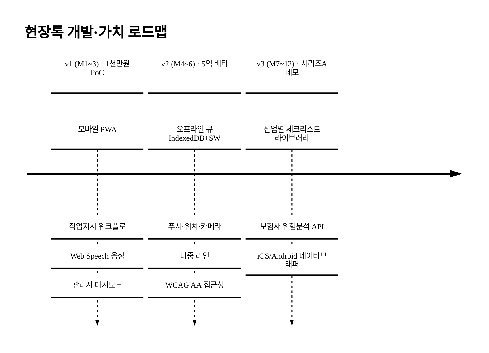

---

## 9. 리스크·완화

| 리스크 | 영향 | 대응 |
|:---|:---|:---|
| 현장 와이파이 부재 | 입력 손실 | 오프라인 큐(IndexedDB) + 백그라운드 자동 동기화 |
| 노조·관리자 반발(감시 우려) | 도입 거부 | 위치·카메라 옵트인·익명 모드 제공 |
| 글로벌 SaaS 한국 진출 | 시장 잠식 | 한국어 STT·국내 안전법규([^11]) 대응으로 방어 |
| 기존 ERP 연동 요청 | 영업 사이클 장기화 | API 표준화 + 컨설팅 상품 분리(Enterprise 티어) |
| 현장 워커 WTP가 가정(5,000원)에 못 미침 | TAM·ARR 시나리오 전반 하향 | §7 Pre-seed에서 **WTP 검증 KPI**(전환 의향 ≥3사·수용단가 응답 ≥100시트)로 1차 검증 → 미달 시 §6.2 객단가 민감도(3,000원) 행으로 재산정·티어 조정(린 스타트업 빌드-측정-학습) |
| 침투율 가정 미달 | ARR 시나리오 하향 | 무상 파일럿으로 침투 가정 검증·세그먼트(중대재해법 신규 대상) 집중 |
| 신규 진입자 레퍼런스 부족 | 초기 영업 난항 | 산학·협회 채널 무상 파일럿으로 사례 선확보(§7) |
| **SMB 高이탈 → LTV 붕괴** | 단위경제 미성립 | **트리거: 월 이탈 5% 초과 시 ICP 재정의**·연간계약 전환·현장 멀티시트 락인(§6.3) |
| **CAC > LTV (단위경제 미성립)** | 성장할수록 손실 확대 | 셀프서브 비중 상향(저CAC)·LTV/CAC<3 시 유료영업 축소·전환비용 강화(§6A) |
| **빅테크(네이버·카카오·NHN) deskless 모듈 진입 → moat 증발** | 차별성 소멸 | 데이터·인증·채널 해자 선축적(§6A)·STT 차별 강등·규제 도메인 깊이(§5.4 워게임) |
| **대기업 0원 덤핑(현장 모듈 끼워팔기)** | 가격 붕괴 | 가격 아닌 가치(법적 증거능력) 포지셔닝(§5.3)·공헌이익 기반 최저 지속단가 방어선 |
| iOS PWA 제약(백그라운드 sync·푸시·카메라 제한) | 오프라인·푸시 핵심 가치 iOS 미달 | 단일 코드베이스 + 네이티브 셸(Capacitor 등) 래핑(§13)·v1~2 폴링 대체 명시 |
| 외부 의존성(푸시 정책·보험 API 주체 미정) | 기능 종속·통합 지연 | 키 부재 시 mock fallback([CLAUDE §3.1])·보험 API는 장기 옵션 격하(§6.1) |
| 감시 우려(노조·근로감시 규제) vs 추적성 충돌 | 도입 거부·법적 리스크 | privacy-by-design(지오펜스 수준 최소수집)·목적제한·노사협의 동의 절차(§15) |
| 디바이스/네트워크 현실(BYOD 거부·데이터요금·구형 OS) | 도입 가능성 저하 | 공용 단말·거치형 모드·경량 PWA·파일럿에서 단말 제공방식 변수 검증(§7.3) |
| 실행 역량(소규모 팀 12개월 과도 범위) | 일정 미달 | v3 네이티브·보험 API를 사업기간 외로 분리(§11 통합 타임라인)·핵심 자체/주변부 외주(§17) |

---

## 10. 팀 (Team)

<TODO: 사용자 입력 — 팀원 명단·역할·R&R·지도교수·대표자 등 모두 사용자가 채움>

| 구분 | 이름 | 소속/학과 | 역할·R&R | 연락처 |
|:---|:---|:---|:---|:---|
| 대표 | <TODO: 사용자 입력> | <TODO: 사용자 입력> | <TODO: 사용자 입력> | <TODO: 사용자 입력> |
| 팀원 | <TODO: 사용자 입력> | <TODO: 사용자 입력> | <TODO: 사용자 입력> | <TODO: 사용자 입력> |
| 지도교수 | <TODO: 사용자 입력> | <TODO: 사용자 입력> | <TODO: 사용자 입력> | <TODO: 사용자 입력> |

---

## 11. 추진 계획 — 통합 마일스톤 타임라인

> §8 로드맵과 본 절을 **하나의 통합 타임라인**으로 합치고, 각 마일스톤에 투입 인력(M/M)·선행조건·정량 합격기준을 붙여 현실성을 입증한다. 일정의 절대 날짜는 공고 일정에 맞춰 사용자가 확정한다(§0).

| 단계 | 시점 | 산출물 | 투입(M/M)`[추정]` | 선행조건 | 정량 합격기준 |
|:---|:---|:---|:---|:---|:---|
| 고객발견 | M0~1 | 인터뷰 5~10건·WTP 설문 | 0.5 | 채널 섭외 | 페인 정량화·수용단가 응답 ≥100시트 |
| PoC(v1) | M1~3 | 작업지시·이상보고·음성·대시보드 PWA | 3 | 고객발견 | 핵심 액션 실동작·뷰 4종·캡처 6장+ |
| MVP(v2) | M4~6 | 오프라인 큐·푸시·위치·카메라·다중라인·WCAG AA | 3 | PoC | 동기화 유실 0%·다중라인·뷰 8종 |
| 베타·파일럿 | M7~9 | 5개 제조·물류 현장 파일럿 | 2.5 | MVP·LOI | 파일럿 5건·churn/활성율 실측 |
| 상용 출시 | M10~12 | Starter 5,000 / Growth 9,900 출시·유료 전환 | 2.5 | 베타 | 유료 전환 ≥3사·MRR 발생 |
| (사업기간 외) | M13+ | 산업별 체크리스트 라이브러리·iOS/Android 네이티브 래퍼·보험 API | 별도 라운드 | Series A | Series A KPI(§7 후) |

> **범위 정직화**: §8 v3의 "네이티브 래퍼·보험 API"와 §7 "Series A 시트 10만"은 **본 사업기간(12개월) 외 차기 목표**로 명확히 분리한다. 소규모 팀이 12개월에 PWA+오프라인동기화+네이티브+보험API+5파일럿+상용화를 모두 달성한다는 비현실적 일정을 제거했다.

**[그림 8] 통합 마일스톤 타임라인**

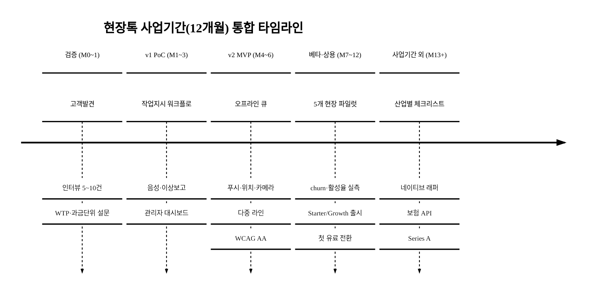

---

## 12. 기대 효과·사회적 가치

### 12.1 기대 효과

- **사회**: 현장 안전사고 추적성·기록 보존 확보로 중대재해 예방 기여. 사고사망이 현장·소규모 사업장에 집중([^9][^12])된 구조에 직접 대응.
- **시장**: 외산 약 70% 점유[^1]·deskless SW투자 1%[^6]의 미개척 영역을 토종 솔루션이 신규 카테고리로 선점.
- **사업**: 기준 시나리오 기준 연 ARR 약 144억원(SOM) 도달 가능 `[추정]` (§6.2), 글로벌 deskless 카테고리의 사업성([^13][^14]) 검증된 시장.
- **고용·생산성**: 현장 수기업무 디지털화로 작업 시간 대폭 절감(연 11만 시간 감축 사례[^17])과 중소기업 디지털 전환 촉진([^16]).

### 12.2 사회적 가치 정량화 프레임 — 측정 가능한 프록시 중심

> 사회적 가치를 정성 선언에 그치지 않고 **측정 가능한 프록시 지표**로 환산한다. 산재 예방 인과는 직접 입증이 어려우므로, 선행지표(이상보고·점검 이행)와 사회적 편익 추정[추정]을 분리 제시한다.

| 사회가치 KPI | 정의·측정 | 파일럿 측정 계획 | 사회적 연결 |
|:---|:---|:---|:---|
| 이상보고 처리율·평균 대응시간 | 보고→관리자 확인 시간 | 파일럿 현장 실측 | 위험 선행지표 개선 |
| 점검(체크리스트) 이행률 | 일일 점검 완료/대상 | 현장별 집계 | 중대재해법 의무 이행 |
| 기록 보존율 | 법정 보존 대상 기록 보존 비율 | 보존 옵션 가입 현장 | 증거·컴플라이언스 |
| 서류작업 절감 시간 | (종이일지 시간 − 디지털 시간) | 현장당 가설치 환산(연 11만 시간 사례[^17] 자사 가설치 환산) | 생산성·고용 |
| 산재 예방 사회적 편익 `[추정]` | 산재 1건 사회적비용 × 예방 추정건수 | 파일럿 데이터 확보 후 산정 | 공공 편익(창작 금지·프록시 한정) |

> 접근성·포용: 외국인·고령 현장 워커를 위한 다국어·큰글씨·음성 입력(§8 WCAG AA 연계)으로 정보취약계층 포용. 환산은 창작하지 않고 **파일럿 실측 프록시**로 검증 가능한 지표만 사용한다.

---

## 13. 기술 — 시스템 아키텍처·확장성

> §2 다이어그램은 사용자 흐름 수준이었다. 본 절은 멀티테넌트 SaaS의 논리 아키텍처·테넌트 격리·확장성을 명시한다.

**[그림 9] 논리 시스템 아키텍처**

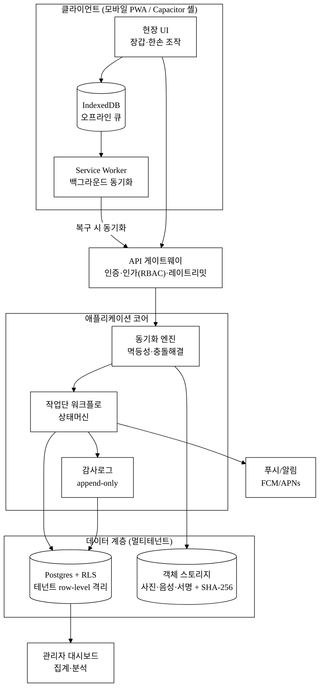

- **멀티테넌시**: 단일 Postgres + Row-Level Security(RLS) 기반 테넌트 격리(초기), 대형 고객은 스키마 분리. 모든 엔티티에 `tenant_id` 격리키.
- **스토리지**: 사진·음성·서명 등 바이너리는 S3 호환 객체 스토리지 + CDN. 압축·콜드스토리지 전환으로 시트당 원가 통제(§6.3).
- **초기 용량 산정** `[추정]`: 시트 10만 가정 시 일 작업지시 약 수십만 건, 사진 업로드 일 수십~수백 GB 추정 → 객체 스토리지 분리·큐 비동기 처리로 흡수.
- **온프렘(Enterprise)**: 멀티테넌트 SaaS와 동시 지원은 공수 폭증 리스크이므로 **컨테이너 패키징 전제로 v3 Enterprise에 한정 분리**.

### 13.1 오프라인 동기화 설계 — 핵심 차별점의 분산시스템 난제

"IndexedDB 큐 → 자동 동기화" 한 문장으로 처리했던 부분을 구체화한다. 중대재해 증거 데이터가 동기화 중 유실·중복·순서 뒤바뀜이 발생하면 제품 가치가 붕괴되므로 다음을 설계 원칙으로 한다.

| 난제 | 해결 전략 |
|:---|:---|
| 중복 전송 | 클라이언트 생성 **UUID + 멱등성 키** — 서버 중복 수신 시 무시 |
| 충돌(두 단말 동시 수정) | 작업지시 상태는 **append-only 이벤트 로그**(상태 전이 불변 기록), 필드 충돌은 last-write-wins 또는 버전벡터 |
| 순서 보장 | 서버 수신시각 기준 정렬 + 이벤트 시퀀스 |
| 시계 불일치 | 로컬 timestamp는 참고용, **법적 시각은 서버 수신시각** 기준 |
| 대용량 바이너리 | 청크 업로드 + resumable(재개 가능) 업로드 |
| 오프라인 24h 후 복구 | 큐 일괄 재생 → 멱등성 키로 중복 제거 → 이벤트 순서 정렬 → 충돌 정책 적용 |

> 단계 구분: **v1 = 단순 큐(낙관적 큐잉)**, **v2 = 충돌해결·이벤트소싱**. 오프라인 시 음성은 녹음 보관 후 복구 시 STT(§2.3 모순 해소).

---

## 14. 데이터 모델 + 기술 KPI

### 14.1 핵심 데이터 모델 (ERD)

"작업단(Work Unit)을 추적 가능한 객체로"가 제품 정체성이므로 핵심 엔티티 스키마를 정의한다.

**[그림 10] 핵심 엔티티 ERD**

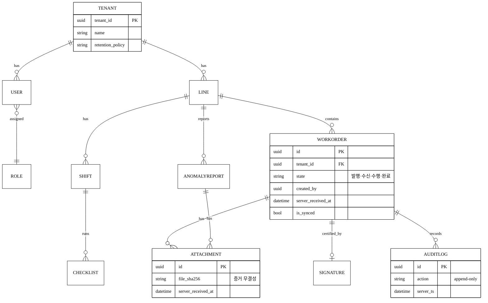

- 모든 엔티티에 멀티테넌트 격리키(`tenant_id`)·감사필드(`created/updated/by`, soft-delete)·증거 무결성 필드(파일 `SHA-256`, 서버 수신시각).
- **WorkOrder 상태머신**: 발행 → 수신 → 수행(사진·서명) → 완료인증. 각 전이는 AuditLog에 불변 기록.
- 보관정책: Starter 30일 / Growth 1년 / Enterprise 장기 → 라이프사이클(아카이빙·삭제)이 데이터 모델과 연결(§15).

### 14.2 기술 KPI·성능 목표 (정량 합격기준)

| 기술 KPI | 목표 | 배치 |
|:---|:---|:---:|
| 데이터 동기화 유실률 | **0% 유실** | v1 |
| 오프라인→온라인 동기화 지연(P95) | < 30초 | v2 |
| 핵심 화면 입력 응답 시간 | < 200ms | v1 |
| 사진·음성 업로드 성공률 | ≥ 99% | v2 |
| 대시보드 알림 전파 지연 | < 5초 | v2 |
| 한국어 STT 도메인 정확도(WER) | 측정·기준선 수립 | v2 |
| 월 가용성(Enterprise SLA) | **99.5%** | v3 |

---

## 15. 보안·개인정보·규제 컴플라이언스

> 이 제품은 (a) 위치·카메라·음성·서명이라는 민감/생체 인접 개인정보를 수집하고, (b) 멀티테넌트로 기업 간 데이터가 섞이며, (c) 중대재해 증거라는 법적 분쟁 자료를 보관한다. 따라서 보안·개인정보는 영업 멘트가 아니라 설계 요건이다.

### 15.1 보안 설계

| 영역 | 설계 |
|:---|:---|
| 암호화 | 전송 TLS, 저장 at-rest 암호화 |
| 테넌트 격리 | Postgres RLS + 격리키 검증, 쿼리 레벨 테넌트 강제 |
| 접근통제(RBAC) | 작업자 / 관리자 / 본사 / 감사자 역할 분리 |
| 감사로그 | 전체 행위 append-only 감사로그 |
| 비밀관리 | `.env` + `.gitignore`([CLAUDE §3.1]), 키 하드코딩 금지 |

### 15.2 개인정보 처리

| 항목 | 처리 |
|:---|:---|
| 수집 항목·법적 근거 | 위치·카메라·음성은 **선택동의 분리**(별도 옵트인) |
| 보유기간·파기 | 티어별 보존정책 연동·파기 절차 |
| 처리위탁·국외이전 | 클라우드 위탁 명시, **국내 리전** 보관 우선 |
| 근로감시 충돌 | privacy-by-design — 위치는 작업단 부착이 아닌 **사업장 지오펜스 수준 최소수집**, 관리자도 원자료 미열람·목적제한, 노사협의·근로자 동의 절차 |

> **감시 우려 vs 추적성 충돌 해소**: "익명 모드"는 추적성과 양립 불가하므로, **익명 가능 영역(일반 소통)과 인증 필수 영역(완료 인증·이상보고)을 분리**한다. 인증 영역은 책임 추적이 본질이므로 익명화하지 않되, 데이터 최소수집·접근권한 분리로 감시 우려를 완화한다.

### 15.3 규제 대응 기록 보존 — 법적 증거능력 설계

핵심 세일즈 포인트(§5.3)인 "기록 보존=중대재해법 대응"을 기술 요건으로 구체화한다.

| 요건 | 설계 |
|:---|:---|
| 위변조 방지 | append-only 감사로그 + 파일 **SHA-256 해시**(해시 체인) |
| 작성시점 입증 | **서버 수신시각** 기준 타임스탬프(로컬 시계 불신) |
| 보관기간 | 산업안전보건법상 안전점검·교육 기록 보존연한에 근거한 최소 보관 `[법률 검토 필요]` → Growth 이상 보존 옵션(§6.1 정합) |
| 증거능력 한계 | 전자문서로서의 효력 범위는 `[추정]`·`[법률 검토 필요]`로 정직 표기 |

> 인증 로드맵: **ISMS-P / 클라우드 보안인증(CSAP)** 을 v3 목표로 명시 — 공공·대기업 영업의 사실상 전제.

---

## 16. 지식재산(IP)·데이터 자산 전략

> moat가 약한 사업일수록 IP가 보완 방어선이다. PWA+브라우저 API는 카피 비용이 낮으므로 IP·데이터 권리로 보강한다.

| 영역 | 전략 |
|:---|:---|
| 특허 후보 | **오프라인 큐 동기화·충돌해결**, **작업단 인증 워크플로**, 증거 무결성 기록 보존 방법, 현장 입력 UX — 출원 가능성 식별 |
| 상표 | **「현장톡」** 상표 출원 계획 |
| 영업비밀 | 산업별 안전 체크리스트 라이브러리·위험분류 모델 관리 |
| 데이터 자산 권리 | 축적 데이터 권리 귀속을 **약관에 명시**, 보험 제휴용 데이터는 **가명처리(개인정보보호법 §28-2)·통계목적 적법근거** 확보, 제3자 제공 동의 설계 |

> moat 재정의(최종): 단순 한국어 STT가 아니라 **① 현장 데이터 네트워크 효과 + ② 규제 도메인 지식 + ③ 체크리스트 라이브러리**가 방어선이다(§6A와 일치). 보험 데이터 제휴(§6.1 격하)의 법적 근거는 본 절 데이터 권리·가명처리 설계에서 출발한다.

---

## 17. 추진체계·조직 R&R

> 팀 실명은 사용자 영역(§10·[`CLAUDE.md §2.7`](../../CLAUDE.md))이므로 공란이되, **추진 구조·역할 골격·자체/외주 분담·협력 형태**는 명시한다.

### 17.1 기능별 R&R (역할 골격)

| 기능 | 책임 영역(R&R) | 담당 |
|:---|:---|:---:|
| 기획·PM | 제품 로드맵·고객발견·검증 | `<TODO: 사용자 입력>` |
| 백엔드·인프라 | 동기화 엔진·멀티테넌시·보안 | `<TODO: 사용자 입력>` |
| 모바일/프론트 | PWA·오프라인·접근성 | `<TODO: 사용자 입력>` |
| 보안·데이터 책임 | 개인정보·감사로그·컴플라이언스 | `<TODO: 사용자 입력>` |
| 영업·CS | 채널·파일럿·온보딩 | `<TODO: 사용자 입력>` |

### 17.2 자체 / 외주 분담 원칙 (IP 보호 경계)

> [`2_개발계획서.md`](./2_개발계획서.md) WBS와 정합. **차별의 핵심(동기화 엔진·도메인 데이터·위험모델)은 자체, 주변부만 외주** — 핵심 기술을 외주에 맡기면 경쟁사로 유출·복제될 수 있으므로.

| 구분 | 업무 | 외주 시 전제 |
|:---|:---|:---|
| **자체(핵심)** | 동기화 엔진·작업단 워크플로·증거 무결성·데이터 모델 | — |
| 외주(주변) | UI 디자인·일부 화면 구현·테스트 자동화 | **비밀유지·경업금지·IP 귀속** 조항 전제 |

### 17.3 협력기관 역할 (실명·MOU 상대방 공란)

| 협력기관 | 역할·협력형태 | 현재 단계 |
|:---|:---|:---|
| 산학협력단 | PoC·파일럿 현장 연계 | 골격(실명 `<TODO: 사용자 입력>`) |
| 산업안전협회·노무사 | 중대재해법 채널·표준 | 골격(MOU 상대방 `<TODO: 사용자 입력>`) |
| 보험사 | 데이터 제휴(장기 옵션·§6.1) | 미접촉(장기) |

---

## 18. 정책 부합성·사업비·재무·고용·KPI

### 18.1 정책 부합성

> 본 사업이 어떤 국가정책에 부합하는지 1:1 매핑한다. 공고 트랙·평가지표는 미확정이므로 `<TODO: 사용자 입력>`.

| 국가정책 | 본 사업 연계 | 근거 |
|:---|:---|:---:|
| 국산 SaaS 육성 | 외산 70% 점유 시장에 토종 신규 카테고리 창출 | [^1][^3] |
| 중소기업 디지털 전환 | DX 미성숙 65.5% 현장의 모바일 디지털화 | [^16] |
| 산업안전 강화·중대재해 예방 | 5인 이상 全사업장 기록 보존·이상보고 도구 | [^9][^11] |
| 공고 평가지표 대응 | `<TODO: 사용자 입력 — 공고 평가지표 확인 후 매핑>` | — |

### 18.2 사업비 집행계획

> 공고가 지정한 비목·한도가 미확정이므로 총액·비율은 `<TODO: 사용자 입력>`이되, 비목 골격·산출근거 방식·외주 정합을 명시한다. 외주용역비는 [`2_개발계획서.md`](./2_개발계획서.md) WBS 외주 행과 정합.

| 비목 | 산출근거(방식) | 배분 `[추정]` |
|:---|:---|:---|
| 인건비 | 개발자 M/M 단가 × 투입월(§11 M/M) | 최대 비중 `<TODO: 한도 확인>` |
| 외주용역비 | 과업지시서 §1 범위(주변부 개발·디자인) | `<TODO>` (WBS 외주 행 정합) |
| 클라우드·지급수수료 | 스토리지·STT·푸시 변동비(§6.3) | `<TODO>` |
| 재료비·기타 | 디바이스(공용 단말 테스트) 등 | `<TODO>` |

| 총사업비 구성 | 값 |
|:---|:---|
| 정부지원금 | `<TODO: 공고 한도 확인>` |
| 자기부담금(현금/현물) | `<TODO: 공고 비율 확인>` |

> 분기별 집행은 §11 마일스톤에 연동한다(공고 양식 확정 시 그 양식을 따름·창작 금지).

### 18.3 재무계획 — 3개년 추정 손익 `[추정]`

> §6.2·§6.3 가정(시트·ARPU·이탈률·마진)과 정합. 모든 값 `[추정]`.

| 항목 (연) | Y1 | Y2 | Y3 |
|:---|---:|---:|---:|
| 유료 고객사(누적) | 20사 | 150사 | 500사 |
| 유료 시트(누적) | 약 2,000 | 약 1.5만 | 약 5만 |
| ARR(블렌디드 6,960원) | 약 1.7억 | 약 12.5억 | 약 41.8억 |
| 매출총이익(마진 84%) | 약 1.4억 | 약 10.5억 | 약 35.1억 |
| 인건비·OPEX | 약 6억 | 약 12억 | 약 22억 |
| 마케팅·CAC | 약 1억 | 약 3억 | 약 7억 |
| 영업손익 | 약 −5.6억 | 약 −4.5억 | 약 +6.1억 |
| 누적 현금소진 | −5.6억 | −10.1억 | −4.0억 |

- **BEP**: Y3 중 손익분기 도달(누적 유료시트 약 4만~5만 시점) `[추정]`.
- **런웨이·조달**: Pre-seed/Seed로 18~24개월 런웨이 확보 필요. 자금 사용처 = 인건비(개발 N명) 약 60% : 마케팅 약 20% : 인프라·기타 약 20% `[추정]`.
- **라운드 KPI 연계**: Seed→Series A 졸업 기준 = ARR·NRR·유료 로고 수(아래 §18.6 Exit 참조).

**[그림 11] ARR 성장 곡선 (3개년 추정)**

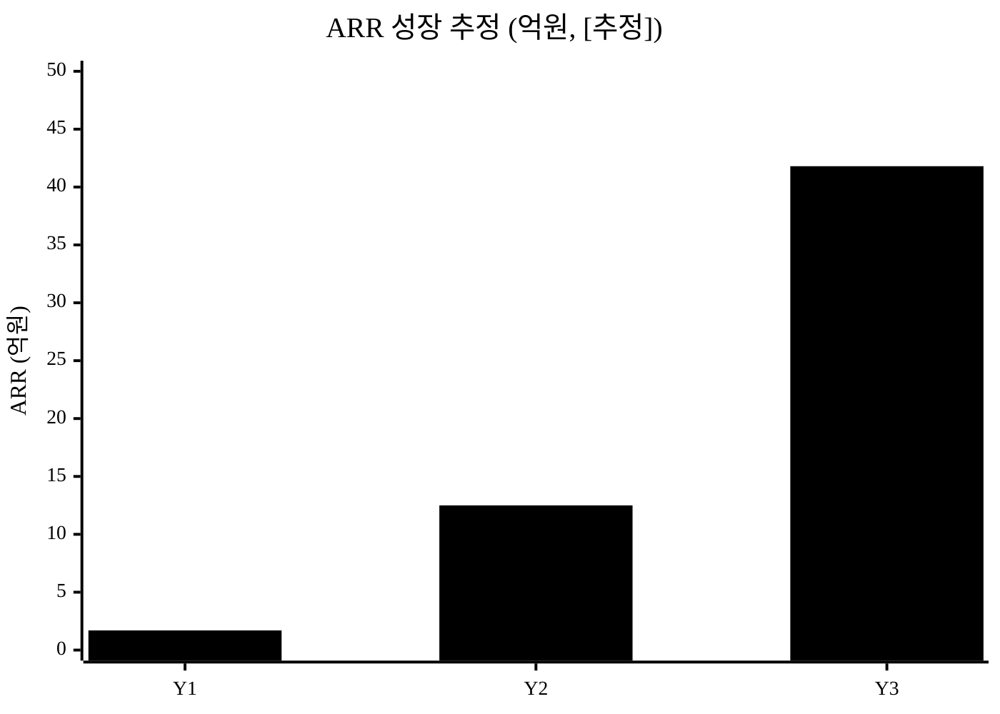

### 18.4 성과지표(KPI)·분기 마일스톤

> v1/v2의 "1천만원/5억"은 내부 가치환산 컨텍스트이므로 제안서 본문에서는 **정량 KPI로 치환**한다.

| 지표 | 정의·산식 | 측정방법 | M3 | M6 | M12 |
|:---|:---|:---|:---:|:---:|:---:|
| 유료 전환 고객사(누적) | 유료 계약 사업체 수 | 결제 로그 | 0 | 0 | ≥3 |
| 유료 시트(누적) | 유료 좌석 수 | 결제 로그 | 0 | 0 | ≥300 |
| 파일럿 완료 현장 | 파일럿 종료 현장 | 파일럿 기록 | 0 | 2 | 5 |
| 월 활성 사용자율(MAU/등록) | 활성/등록 작업자 | 사용 로그 | — | ≥50% | ≥60% |
| 30일 리텐션 | 가입 30일 후 잔존 | 코호트 | — | ≥40% | ≥50% |
| 작업단 완료 인증률 | 완료인증/발행 | 워크플로 로그 | — | ≥70% | ≥80% |
| 월 이탈률(현장) | 해지 현장/총 현장 | 결제 로그 | — | 실측 | <5% |
| NRR | 유지+확장 매출/기초 | 결제 로그 | — | — | ≥100% |

### 18.5 고용창출 계획 `[추정]`

> 인원은 계획치(`[추정]`)이며 개인 실명은 기재하지 않는다. 사업비 인건비(§18.2)와 연동.

| 직무 | M3 | M6 | M12 | 고용형태 |
|:---|:---:|:---:|:---:|:---|
| 개발(백엔드·모바일) | 2 | 3 | 4 | 정규 |
| 디자인 | 0 | 1 | 1 | 정규/계약 |
| 영업·CS | 0 | 1 | 2 | 정규 |
| **누적 신규 채용** | **2** | **5** | **7** | — |

> 청년고용·지역고용 등 공고 가점 항목은 `<TODO: 사용자 입력 — 공고 확인 후 연계>`.

### 18.6 후속투자·Exit 시나리오 `[추정]`

| 라운드 | 진입 KPI | 졸업 KPI | 희망 조달 `[추정]` |
|:---|:---|:---|:---|
| Pre-seed/Seed | PoC·고객발견 | 파일럿 5건·유료 ≥3사·WTP 검증 | 18~24개월 런웨이 |
| Series A | ARR 발생·NRR≥100% | ARR·로고 수·NRR 성장 | 시트 10만 목표 견인 |

**Exit 후보 `[추정]`**:
- **전략적 인수**: 네이버·카카오·NHN의 deskless 보강, 안전·보험사, 글로벌 deskless 플레이어의 한국 진입 인수.
- **밸류 논리**: SaaS ARR 배수 또는 Connecteam(밸류 8억$[^13])·Beekeeper(누적 1억$[^14]) 밸류/매출 배수를 comparable로 시나리오 밸류 제시.

> 모든 라운드·Exit 수치는 가정이며, 실제 밸류·시점은 시장 상황에 따른다.

---

## 참고문헌

> **출처 현황 (정직 표기): 현재 / 목표 = 24 / 1,000.** 아래 24개 각주는 [`5_research/README.md`](./5_research/README.md) 에서 2026-06-06 웹 검색·웹페치로 검증·정리한 출처와 연결된다. 키트 권위 기준(1,000)은 누적 목표이며, 현재는 핵심 시장·규제·경쟁 근거를 우선 확보한 단계다. 미확보분은 후속 사이클에서 보강한다(부풀리기 없이 실제 검증된 출처만 카운트).

[^1]: **메트로서울 「글로벌 시장 360조원, 우리 시장 2조원…정부, SaaS 시장 육성 나서」** (2024-06). 글로벌 SaaS 약 360조, 국내 약 2조; 국내 SW 내 SaaS 비중 21.8%; 외산 약 70% 점유. https://www.metroseoul.co.kr/article/20240626500126
[^2]: **ZDNet Korea / 디지털데일리(한국IDC 인용)** (2023~2024). 국내 SaaS 2022년 약 1.74~1.78조 → 2025년 2.55조(연 14~15%) → 2026년 3.06조. https://zdnet.co.kr/view/?no=20230222144336
[^3]: **디지털데일리 「[SaaS대전환] 전세계서 0.5% 비중」** (2024-05). 국내 1.74조 = 글로벌 316조의 약 0.5%. https://m.ddaily.co.kr/page/view/2024052622323917502
[^4]: **inews24 「국내 협업툴 시장이 뜬다…5천억 규모」 / 뉴시스 / 파이낸셜뉴스** (2021~2022). 국내 협업툴 단독 시장 약 4,000~5,000억원. https://www.inews24.com/view/1441313
[^5]: **더스탁/GTT코리아(MarketsandMarkets 인용)** (2022). 글로벌 협업툴 2021년 472억$ → 2026년 858억$(연 12.7%). https://www.gttkorea.com/news/articleView.html?idxno=3871
[^6]: **Skedulo / O.C. Tanner 2024 Global Culture Report / Gallup 2026 / TalentCards** (2024~2026). deskless = 글로벌 노동력 약 80%(약 27억명), 엔터프라이즈 SW 투자 1%만 배분, 56%가 개인앱·종이로 공백 보완. https://www.skedulo.com/scheduling/deskless-workers/
[^7]: **통계청 「2024년 전국사업체조사 결과(잠정)」** (2025, KDI/이데일리 인용). 전체 종사자 2,573.1만명; 건설업 -6.4%; 제조업 약 19% 비중. https://eiec.kdi.re.kr/policy/materialView.do?num=271414
[^8]: **통계청 「2024년 12월 및 연간 고용동향」** (2025-01). 2024년 연간 취업자 2,857.6만명. 사무종사자 정확 비중은 KOSIS 직업별 취업자 원표 [재확인 필요]. https://kostat.go.kr
[^9]: **고용노동부 산업안전보건본부·KOSHA 「2023년 산업재해 현황(분석)」 / 대한민국 정책브리핑** (2024-12). 2023년 사고사망 598명(584건); 건설 303·제조 170·기타 125; 50인미만 354명. https://korea.kr/briefing/pressReleaseView.do?newsId=156618935
[^10]: **고용노동부/KOSHA 산업재해통계(원본)** (2024-12). 2023년 전체 재해자 13만명대(사망 약 2,016명 포함) — 사고재해/총재해 항목정의 [재확인 필요]. https://portal.kosha.or.kr/archive/indus-acc-statis/industrial-acc-statu
[^11]: **신&김 / 김앤장 / 법률신문** (2024-01). 2024-01-27부터 상시 5인 이상 全 사업장 중대재해처벌법 적용, 약 83.7만 사업장 추가. https://www.shinkim.com/kor/media/newsletter/2309
[^12]: **안전신문 / 법률신문** (2024). 2022년 사고사망 644명 중 60.2%(388명)가 50인 미만 사업장 발생. https://www.safetynews.co.kr/news/articleView.html?idxno=227365
[^13]: **TechCrunch / Crunchbase News / Tracxn 「Connecteam raises $120M at $800M valuation」** (2022-03). Series C 1.2억$, 밸류 8억$+, 누적 약 1.6억$, 매출 YoY 400%. 가격(첫 30명 정액): 연간결제 Basic 29$/Adv 49$/Expert 99$, 월간결제는 티어별 상향(Expert ~119$). https://techcrunch.com/2022/03/02/connecteam-raises-120m-at-an-800m-valuation/
[^14]: **TechCrunch / Venturelab / BusinessWire 「Beekeeper Lands $50M Series C」** (2022-11). Series C 5,000만$, 누적 1억$+, 150개사+ 사용. https://techcrunch.com/2022/11/08/beekeeper-which-helps-companies-engage-with-their-deskless-frontline-workforce-raises-50m/
[^15]: **THE VC / 이코노믹리뷰 / 플래텀** (2020~2024). 토스랩(잔디) 누적 투자 약 270억; 2024-01 첫 월 흑자, 유료 5,000개사 돌파, 30만팀. https://thevc.kr/tosslab
[^16]: **TIPA 「디지털전환 실태조사」 / 중소기업중앙회 / 정보통신신문** (2021~2023). 중기 디지털 성숙도 41.4/100; 65.5% DX 전략 미준비; 제조 성숙도 < 서비스. https://www.tipa.or.kr/s040305/file_down/id/17563
[^17]: **CIO Korea / 업계 보도** (2023~2024). 현장 수기업무 디지털화로 연 11만 시간 이상 감축 사례(LG U+ 네트워크 현장). https://www.cio.com/article/4156938/
[^18]: **잔디(JANDI) 공식 요금안내** (2026-06). FREE 0 / Premium 6,000 / Enterprise 9,000원(1인 월, 연 25%↓). https://www.jandi.com/landing/kr/pricing
[^19]: **네이버웍스 코어 이용요금** (2026-06). Free 0 / Lite 3,000~4,000 / Standard 7,000~8,500 / Std+ 11,000~13,000; 30명 무료. https://naver.worksmobile.com/pricing/
[^20]: **카카오워크 요금안내** (2026-06). Free(30명) / Mini 2,400~2,900 / Standard 6,500~7,900 / Premium 9,900~11,900. https://www.kakaowork.com/pricing
[^21]: **NHN두레이 요금안내** (2026-06). 기능별 1인 약 4,000~5,000원(베이직·비즈니스·엔터프라이즈); 25인 무료. https://dooray.com/main/en/pricing/
[^22]: **전자문서통합지원센터(과기정통부·NIPA) 「전자문서의 법적효력」 / 대법원 사법정책연구원 「전자문서의 성질과 증거력」** (검증 2026-06-22). 전자문서법 §4: 전자 형태라는 이유만으로 효력 부인 불가; 증거능력 요건=① 작성자 특정 ② 서명 후 위변조 검출 가능 ③ 작성·저장 형태 보존. https://www.npost.kr/front/eIntro/legEffect.do · https://www.lawtimes.co.kr/opinion/194723
[^23]: **모두싸인 「2025 중대재해처벌법 기준 총정리」 / 중대재해처벌법 시행령(국가법령정보센터)** (검증 2026-06-22). 경영책임자 의무이행 입증책임 + 안전보건 증빙 서류 3년 보존(미보존 시 과태료). https://blog.modusign.co.kr/uncategorized/severe-disasters-act2 · https://www.law.go.kr/LSW/lsLinkCommonInfo.do?lspttninfSeq=173767
[^24]: **Connecteam 공식 Pricing / People Managing People·Capterra** (검증 2026-06-22). Basic 30인 $87/월(연간)≈1인 $2.9/월, 30인 초과분 1인 $5/월(≈6,900원, 환율 1,380원/$ 가정 `[추정]` 환산). https://connecteam.com/pricing/ · https://peoplemanagingpeople.com/tools/connecteam-pricing/

---

## 데이터 정직성 선언

본 문서의 SaaS·협업툴 시장 수치([^1]~[^5])는 1차/언론(IDC Korea·메트로서울·디지털데일리·MarketsandMarkets 인용) 출처로 검증됐다. "국내 SaaS 약 2조"와 "협업툴 단독 약 4,000~5,000억"을 분리 표기했고, "글로벌 SaaS 한국 점유율 70%"는 정확히 *국내 SaaS 시장 내 외산 점유율*임을 명기했다. deskless 노동력 80%·SW투자 1%([^6])는 글로벌 기준임을 명시했다. 산업재해 통계는 2023년 사고사망 598명·업종별·규모별 분포([^9])로 검증했으며, 전체 재해자수의 항목정의(사고재해 13만 vs 총재해 13.6만)는 정부 원본 접근 제약으로 `[재확인 필요]` 표기했다([^10]). 국내 사무직/비사무직 정확 비중·인원은 KOSIS 직업별 취업자 원표에서 사용자 직접 재확인을 권한다([^8]). §3 TAM/SAM/SOM(이론·도입가능 이중 제시), §6.2~6.3 유닛 이코노믹스(객단가·믹스·침투율·ARR·LTV·CAC·이탈률·인프라 원가), §18.3 재무계획(3개년 P&L·BEP), §18.5 고용창출, §18.6 Exit 시나리오는 **모두 `[추정]`** 이며 검증된 공공·언론 수치에서 파생한 가정값이다. 신설된 단위경제성·재무·기술 KPI·사회가치 환산은 가정을 표로 명시하고 파일럿 실측으로 갱신하는 구조다. 기록의 법적 증거능력·보존연한은 `[법률 검토 필요]`로 표기했다. §5의2 구매동인 논증의 외부 근거(전자문서 증거능력 요건[^22]·중대재해법 입증책임·3년 보존[^23]·Connecteam 인당 단가[^24])는 공공·법령·각사 공식/분석 1차 인용으로 검증했으며, Connecteam 단가의 **원화 환산(6,900·4,000원)만 환율 1,380원/$ 가정의 `[추정]`** 이고 달러 단가는 공식 수치다(혼용 금지). 형사방어 회피비용은 사건별 상이하여 금액 구간을 특정하지 않고 `[추정]`·`[법률 검토 필요]`로 둔다. 추정값과 공식 수치를 한 문장에 섞지 않았으며, **어떤 수치도 창작하지 않았다.** 자세한 검증 메모는 [`5_research/README.md`](./5_research/README.md).

<!-- 빈칸 목록
- §0 사업명·주관기관·트랙·일정·팀
- §7.2 고객발견 LOI/MOU 상대방 실명
- §10 팀 구성 전체 (대표·팀원·지도교수 이름·소속·학과·역할·연락처)
- §11 일정 절대 날짜
- §17.1 기능별 R&R 담당자 실명
- §17.3 협력기관 실명·MOU 상대방
- §18.1 공고 평가지표 매핑
- §18.2 사업비 총액·정부지원금/자기부담금 비율·비목별 한도 (공고 양식 확인)
- §18.5 청년/지역 고용 가점 항목 연계 (공고 확인)
-->
