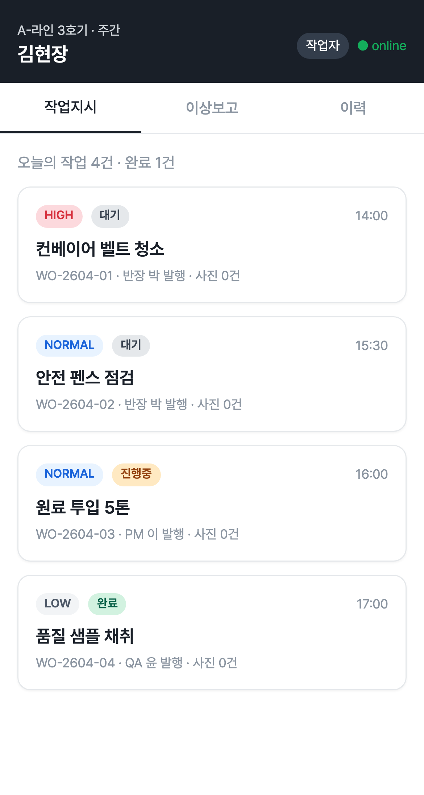
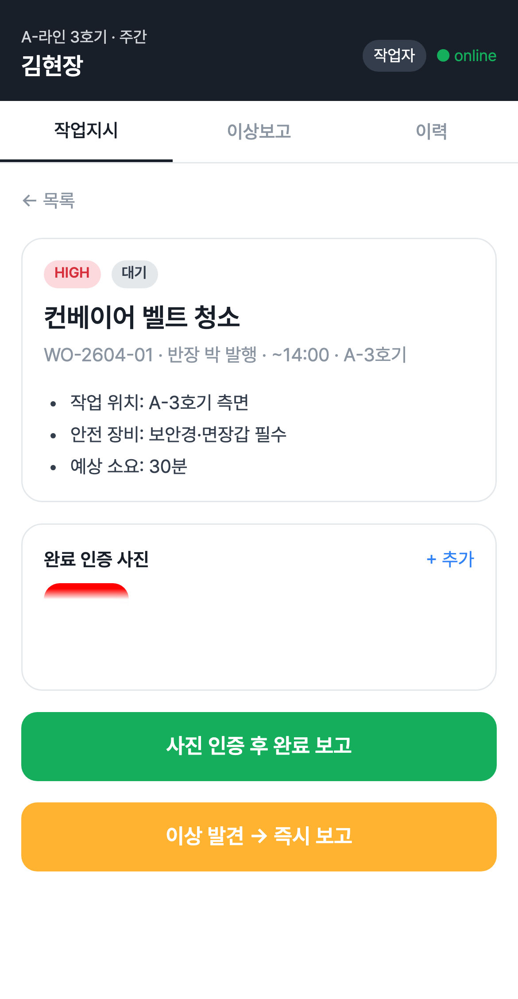
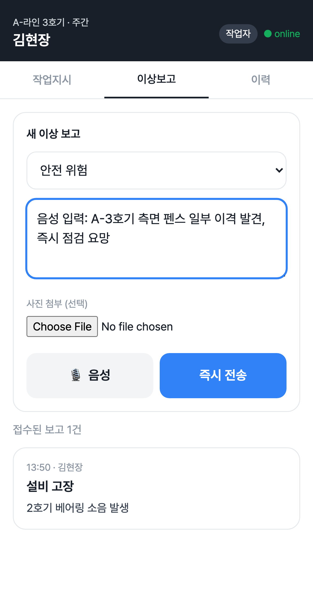
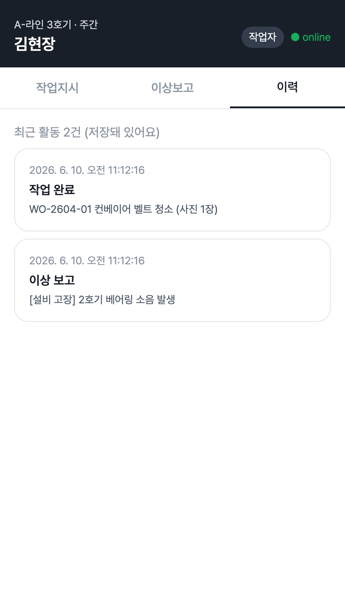
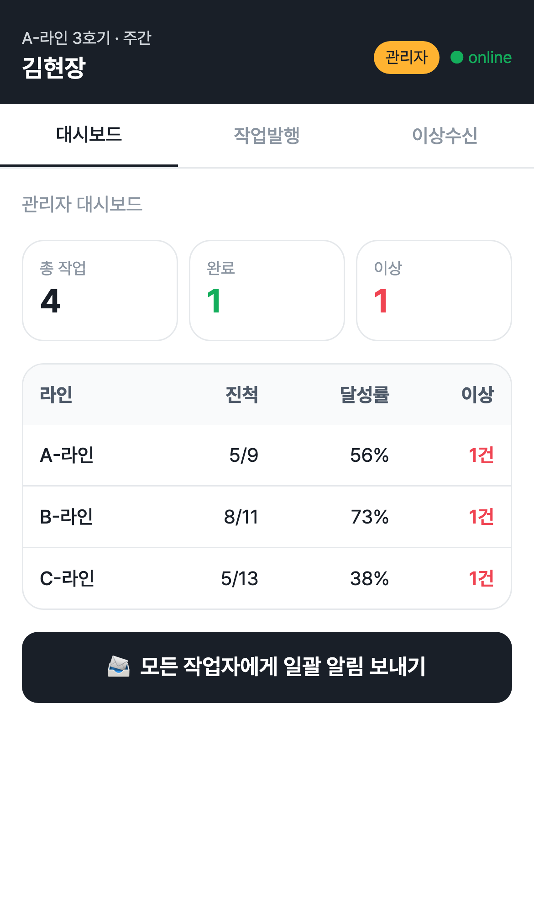
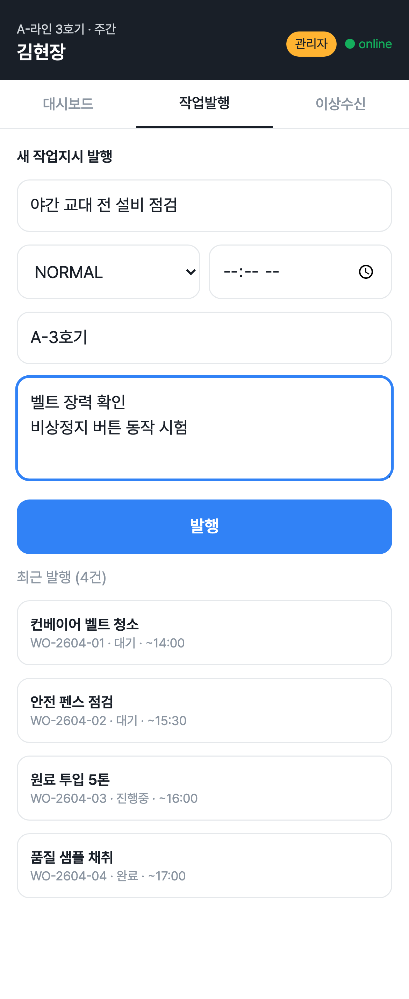
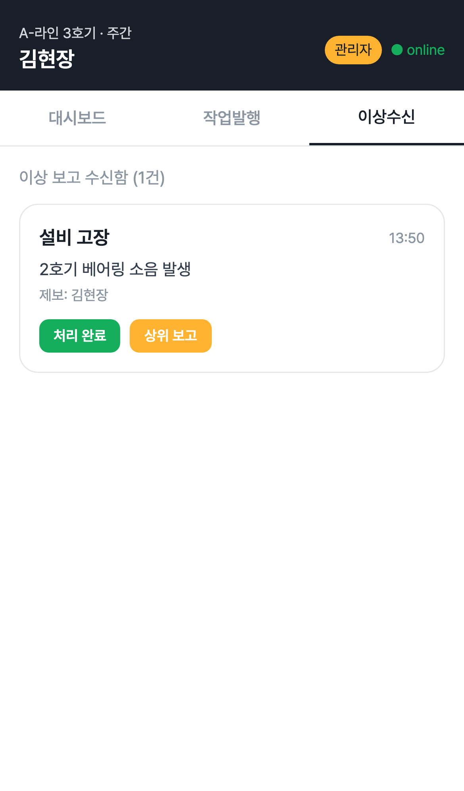

# 개발결과보고서 v1 — 현장 작업자 모바일 협업 SaaS

## 1. 성과품 매핑

| 과업지시서 §5 항목 | 본 v1 산출물 | 충족 |
|---|---|---|
| 모바일 PWA — 작업지시 목록·상세 | [`projects/fieldworker-pwa/index.html`](../projects/fieldworker-pwa/index.html) — 카드 리스트 + 상세 페이지 + 작업 로그 | ✅ |
| 완료 인증 (실 사진 업로드) | `<input type="file" capture="environment">` + FileReader → DataURL → localStorage 영속 + 썸네일 | ✅ 실 동작 |
| 이상 보고 폼 + 사진 첨부 | 카테고리 4종 + 메모 + 다중 사진 첨부 + 음성 입력 | ✅ |
| **Web Speech API 한국어 STT** | `webkitSpeechRecognition` 실 호출 (Chrome) → 텍스트 자동 입력 | ✅ 실 통합 |
| 관리자 작업지시 발행 | 제목/우선순위/마감/라인/세부지시 폼 → 신규 WO 즉시 추가 | ✅ |
| 관리자 이상 수신함 | 보고 카드 + 처리완료/상위보고 액션 | ✅ |
| 활동 이력 (영속) | 모든 액션이 `state.history` 에 누적, localStorage 보존 | ✅ |
| 역할 전환 (작업자/관리자) | 헤더 토글 → 탭 구성 자동 변경 | ✅ |

## 2. 구현/제작 범위

- 단일 페이지 PWA (HTML + Tailwind CDN + 순수 JS, 빌드 도구 없음)
- **8개 화면**: 작업자 3종(목록·상세·이상보고·이력) + 관리자 3종(대시보드·작업발행·이상수신함)
- **상태 영속**: localStorage 기반, 새로고침 후 작업 상태·사진·이력 모두 유지
- 인증 없이 게스트 모드 (CLAUDE.md §3.4)

## 3. 환경

| 항목 | 값 |
|---|---|
| OS | macOS 15.7.4 (Darwin 24.6.0) |
| 런타임 | Node.js 24.3.0 + Playwright 1.59.1 (캡처 전용) |
| 브라우저 | Chromium 1223 |
| 뷰포트 | iPhone 13 (390×844) |
| 영속 계층 | `localStorage[fw_pwa_state_v1]` |

## 4. 실행/구동 방법

```bash
open /Users/ywlee/k_startup_spare/2026-saas-fieldworker-collab/projects/fieldworker-pwa/index.html
```

캡처 재현: 앱 디렉터리에서 `npm i playwright@^1.59.1 && node _capture.mjs` (iPhone 13 디바이스 · `file://` 로드 · role/view 를 localStorage 에 직접 시드해 화면을 결정적으로 캡처). 산출 위치는 `biz/captures/` (v1 7장) 및 `biz/captures/v2/` (v2 11장).

## 5. 화면 캡처

### 5.1 작업자 — 작업지시 목록

- **무엇을**: 오늘의 작업 4건이 우선순위 배지·상태 pill·사진 첨부 수와 함께 카드로 표시.
- **의도**: 한 손으로 스크롤하며 작업 인지·선택.

### 5.2 작업자 — 상세 + 실 사진 첨부(미리보기)

- **무엇을**: 작업 상세 + 안전 장비·소요 시간 + `완료 인증 사진` 영역에 **실제 첨부된 사진 썸네일 1장 표시**(FileReader→DataURL→localStorage) + 완료 보고/이상 보고 두 액션.
- **의도**: 사진 1장 이상 첨부해야 완료 보고 가능 — 증거 기반 인증 강제. 캡처는 사진 첨부 후 미리보기가 실제로 렌더링됨을 입증.

### 5.3 작업자 — 이상 보고 폼

- **무엇을**: 카테고리 4종 + 메모 + 사진 첨부 + 🎙️ 음성 입력(Web Speech API) + 즉시 전송.
- **의도**: 마찰 최소화 — 3탭으로 보고 완료. 음성으로 입력해 장갑 낀 손 대응.

### 5.4 작업자 — 활동 이력

- **무엇을**: 모든 작업 완료·이상 보고가 시각·라벨·세부와 함께 누적 표시.
- **의도**: 본인 활동 추적 및 인수인계 자료. localStorage 영속.

### 5.5 관리자 — 대시보드

- **무엇을**: 헤더 토글로 관리자 모드 진입(헤더 `관리자` 배지 + `대시보드·작업발행·이상수신` 탭) → 총 작업·완료·이상 KPI + 라인별 진척표(A/B/C) + 일괄 알림 발송 버튼.
- **의도**: PM이 모바일에서도 라인 단위 현황 파악 + 일괄 푸시.

### 5.6 관리자 — 작업 발행

- **무엇을**: 제목·우선순위·마감·대상 라인·세부 지시 폼 → 발행 시 작업자 측 목록에 즉시 추가.
- **의도**: 반장·PM이 현장에서 즉시 새 WO 발행.

### 5.7 관리자 — 이상 수신함

- **무엇을**: 작업자가 보낸 이상 보고를 카테고리·제보자·시각과 함께 확인 → 처리완료/상위보고.
- **의도**: 이상 보고가 누락되지 않고 처리되도록 워크플로 종결.

## 6. 검수 기준 충족 여부 (과업지시서 §5)

| 성과품 | 검수 조건 | 결과 |
|---|---|---|
| 모바일 PWA | 4개 핵심 화면 작동 | ✅ (실제 8개) |
| 완료 인증 | 사진 업로드 + 보존 | ✅ 실 파일 → localStorage |
| 이상 보고 | 카테고리·메모·사진·전송 | ✅ |
| 음성 입력 | 한국어 STT | ✅ Web Speech API |
| 관리자 대시보드 | 라인별 진척 가시화 | ✅ |
| 디자인 가이드 (외주) | Figma·아이콘 ZIP | ⏸ 외주 미발주 (자체 PoC 단계) |

## 7. 추가 확장 가능 영역

- 다중 라인·다중 교대조 시뮬레이션 (현재 단일 라인)
- IndexedDB·Service Worker 기반 오프라인 큐
- 푸시 알림 (Web Push API) 실 구독

## 8. 검토 체크리스트

- [x] 모든 핵심 기능이 캡처되었는가
- [x] 캡처가 의도한 기능을 정확히 보여주는가
- [x] 한글이 깨지지 않는가
- [x] 에러 화면이 의도치 않게 캡처되지 않았는가
- [x] 결과물의 완성도가 PoC 시연 수준에 충분한가
- [x] 과업지시서 §5 항목 100% 매핑되었는가
- [x] 영속성(localStorage)이 새로고침 후에도 유지됨
- [x] 로그인 없이 시연 가능 (CLAUDE.md §3.4)
