# 개발결과보고서 v3 — 현장 작업자 모바일 협업 SaaS

> v3 사이클은 v2(5억 베타)를 **시리즈A 데모 수준**으로 격상하는 사이클이다. 본 보고서는 [`5_과업지시서_v3.md`](./5_과업지시서_v3.md) §5 성과품 목록의 **자체 산출물 — v3 SaaS 본체(핵심 8가지)** 검수 증거다. 외주 분(체크리스트 콘텐츠 대량 확충·위험모델 계수 검증·네이티브 스토어 등록·KPI 차트 디자인)은 본 데모 단계 미발주로 ⏸ 표기한다.

## v2 한계 및 v3 개선 매핑

| v2 한계 | v3 개선 방식 | 증거 캡처 |
|:---|:---|:---|
| 산업별 템플릿이 **단일 세트**(제조5·F&B5·물류4)뿐 — 작업 종류별 다양성 부족 | **산업별 체크리스트 라이브러리** — 제조 4세트·F&B 3세트·물류 3세트(총 10세트·50항목), 선택→작업 적용·교체. LOTO·HACCP·지게차 등 작업 유형별 세트화 | 02·03·09·12 |
| 위험 데이터 **수집만** 하고 위험도 산출·등급화 부재 (보험사 제휴 데모 불가) | **보험사 위험분석 API 시뮬레이션** — 이상보고·심각도·체크 준수율·적체·24h 중대사고를 가중 합산해 0~100 위험점수·A~D 등급·보험료 영향(±%)·룰 기반 권고 산출 | 08·16 |
| KPI가 **단일 시점** 숫자·진척 바뿐 — 추세 파악 불가 | **현장 안전 KPI 대시보드** — 라인별 7일 사고/이상보고/완료율 스파크라인 추세 + 주간 집계 KPI | 07·17 |
| **PWA(웹)만** 배포 — 스토어 설치·네이티브 권한 경로 부재 | **네이티브 래퍼 install 안내**(iOS/Android 단계별) + **manifest 고도화**(maskable 아이콘·shortcuts) + **SW push 핸들러** 추가 | 06·16(사이드 PWA 상태) |
| 푸시는 **개별 구독**만 — 전사 공지 발송 수단 없음 | **푸시 캠페인** — 전사/라인 대상·즉시/예약 발송 + 도달·발송 로그 영속 | 13·14(최근 활동) |
| 작업 지연을 **수동 인지** — 자동 상향보고 룰 없음 | **SLA/에스컬레이션 룰 엔진** — 우선순위별 한도(분) 초과 시 위반/임박 판정·자동 상향보고 실행 | 11·14(SLA 위반 KPI) |
| 역할 **3종**(작업자·반장·PM) — 안전 전담 권한 부재 | **역할 4종**(+안전관리자) + 권한 매트릭스 — 역할별 내비·뷰·허용 액션 분기 | 15·16·07·10 |
| 오프라인 큐 **단순 drain** — 충돌 시 동작·근거 불투명 | **LWW(last-write-wins) 충돌 해결 + 동기화 상세 로그** — client-wins/server-wins 전략·적용/스킵·사유 기록 | 05·10 |

## v3 신규/심화 산출물 (핵심 8가지 입증)

| # | 핵심 산출물 | 구현 요지 | 입증 캡처 |
|:---:|:---|:---|:---|
| 1 | 산업별 체크리스트 라이브러리 | 제조·F&B·물류 10세트·50항목, 작업 적용·교체·발행 첨부 | 03·09·02·12 |
| 2 | 보험사 위험분석 API 시뮬레이션 | 실 스코어링 알고리즘 → 라인별 점수·등급·보험료 영향·권고 + 전사 종합 | 08·16 |
| 3 | 현장 안전 KPI 대시보드 | 라인별 7일 사고/이상/완료율 스파크라인 추세 차트 | 07·17 |
| 4 | 네이티브 래퍼 install + manifest/SW 고도화 | iOS/Android 설치 안내 시트 + maskable·shortcuts·push 핸들러 | 06·16 |
| 5 | 푸시 캠페인 | 전사 안전공지 예약·발송 + 도달·발송 로그 | 13·14 |
| 6 | 작업 SLA/에스컬레이션 | 우선순위별 한도 초과 판정 + 자동 상향보고 룰 실행 | 11·14 |
| 7 | 역할 4종+ 권한 | 작업자·반장·PM·안전관리자, 역할별 뷰·액션 분기 | 15·16·07 |
| 8 | 오프라인 큐 충돌 해결/동기화 상세 | IndexedDB 큐 + LWW 충돌 해결 + 동기화 로그 | 05·10 |

## 1. 성과품 매핑

| 과업지시서 §5 항목 | 본 v3 산출물 | 충족 |
|:---|:---|:---:|
| 자체 산출물 — v3 SaaS 본체 (핵심 8가지) | [`projects/fieldworker-pwa/v3.html`](../projects/fieldworker-pwa/v3.html) — 단일 PWA에 8가지 모두 실 구현 | ✅ |
| 산업별 체크리스트 라이브러리 콘텐츠 (JSON) | 자체 시드 — 제조 4·F&B 3·물류 3세트(50항목) 구조·적용 흐름 실 구현, 전량 콘텐츠·법령 매핑은 외주 확장 대상 | ✅(구조)·⏸(전량) |
| 위험분석 모델 계수표 | 자체 계수(가중치·등급 임계값)로 알고리즘 구현, 언더라이팅 자문 정합은 외주 | ✅(엔진)·⏸(계수 검증) |
| 네이티브 빌드 + 스토어 메타 (IPA·AAB) | ⏸ 외주 미발주 — install 안내 UI + manifest/SW 고도화는 자체 구현, 실 스토어 빌드·등록은 외주 | ⏸ |
| KPI 차트 디자인 토큰 | ⏸ 외주 미발주 — 스파크라인 차트 자체 구현(CSS), 디자인 토큰·일러스트는 외주 | ✅(차트)·⏸(디자인) |

## 2. 구현/제작 범위

- 단일 파일 PWA ([`v3.html`](../projects/fieldworker-pwa/v3.html)) — HTML + Tailwind CDN + 순수 JS, 빌드 도구 없음
- **뷰 18종**:
  - 작업자 5: 목록·상세(체크리스트·사진·위치)·이상보고(심각도)·이력·내정보(네이티브 설치)
  - 반장 5: 작업현황·작업발행·이상수신·**SLA**·라인관리
  - PM 6: 대시보드·**안전 KPI**·**캠페인**·보고서·팀·설정(SLA 룰)
  - 안전관리자 5: **안전 KPI**·**위험분석**·**체크리스트 라이브러리**·이상수신·**감사 로그**
  - (중복 뷰 제외 고유 뷰 18종)
- **워크플로 5개+**: ① 작업 수행(목록→상세→라이브러리 체크리스트 적용→사진→위치→완료 게이트→이력) ② 이상 보고(카테고리·심각도→큐/전송→수신함→처리/상위보고) ③ 위험분석(입력 집계→점수·등급·권고 산출→CSV 출력) ④ SLA(룰 평가→위반 판정→에스컬레이션 실행→이력) ⑤ 푸시 캠페인(작성→예약/즉시 발송→로그)
- **역할 4종 권한 분기**: 권한 매트릭스(`PERM`)로 역할별 허용 뷰·액션 제어, `allowedView`로 비허용 뷰 자동 우회
- **상태 영속**: `localStorage[fw_v3_state]` + IndexedDB `fw_v3_queue`(오프라인 큐) + 동기화 로그
- 인증 없이 게스트 모드 (CLAUDE.md §3.4)

## 3. 환경

| 항목 | 값 |
|:---|:---|
| OS | macOS 15.7.x (Darwin 24.6.0) |
| 런타임 | Node.js (캡처 전용) + Playwright 1.59.x |
| 브라우저 | Chromium 1223 (Playwright 번들) |
| 모바일 뷰포트 | iPhone 13 (390×844) |
| 데스크톱 뷰포트 | 1440×980 |
| 영속 계층 | `localStorage[fw_v3_state]` + IndexedDB `fw_v3_queue` |
| 로드 방식 | `file://` (오프라인 시연 — 외부 인프라 불필요) |

> **file:// 제약 및 mock fallback 명시**: `file://` 컨텍스트에서는 Service Worker 활성·getUserMedia·Push 구독·Geolocation이 브라우저 정책상 제한될 수 있다. 본 앱은 (a) 실 API를 먼저 시도하고 (b) 미지원/권한 부재 시 mock 경로로 자연스럽게 우회한다(CLAUDE.md §3.1·§3.4).
> - **위험분석 API**: 외부 보험사 API 키(`INSURANCE_API_KEY`) 부재 시 동일 스코어링 알고리즘을 로컬 실행하고 응답 봉투에 `mock-fallback`을 표기(캡처 08·16). HTTPS·키 존재 시 동일 코드에서 실 `fetch` 경로로 전환.
> - **카메라**: getUserMedia 미가용 시 mock 캔버스 프레임(타임스탬프·GPS 합성) 캡처.
> - **푸시 캠페인**: Notification 권한 시 실 발송, 아니면 mock 발송 로그(`mock` 라벨, 캡처 13).
> - **위치**: getCurrentPosition 거부/미지원 시 `(mock)` 좌표 기록(캡처 02).
> - **SW**: 캡처 16의 사이드바에 `SW: 등록 시도(제한)` 명시 — file:// 정책 반영.

## 4. 실행/구동 방법

```bash
open /Users/ywlee/k_startup_spare/2026-saas-fieldworker-collab/projects/fieldworker-pwa/v3.html
```

캡처 재현 (앱 디렉터리에서):

```bash
npm init -y && npm i playwright@^1.59.1
node _capture_v3.mjs            # v3 캡처(biz/captures/v3) 18장 재생성
```

역할/뷰는 토글 클릭 누적 버그를 피하기 위해 `localStorage[fw_v3_state]`에 직접 시드해 결정적으로 캡처한다. 캡처 후 `node_modules`·`package*.json`은 삭제(CLAUDE.md §7), `_capture_v3.mjs`만 유지.

## 5. 화면·실물 캡처

### 5.1 작업자 — 오늘의 작업 목록 (모바일)
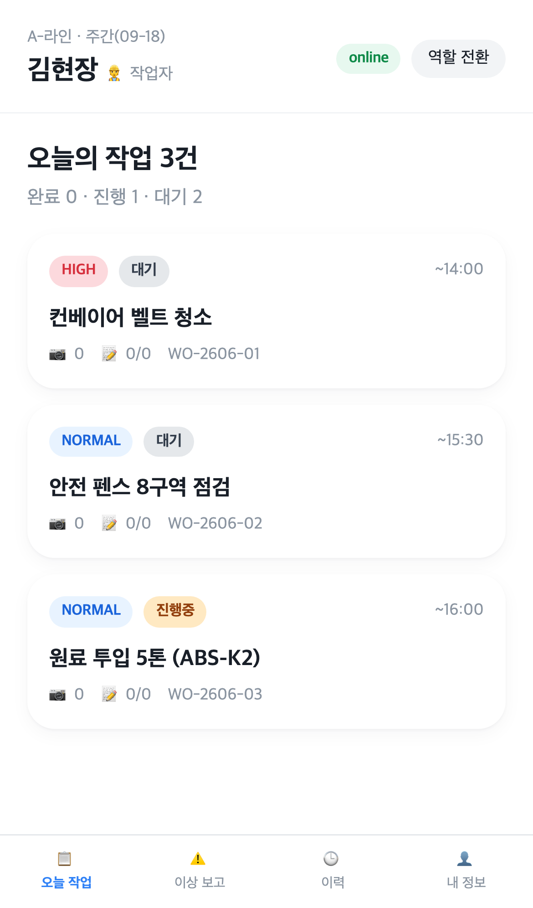
- **무엇을**: A-라인 오늘 작업 3건 카드(우선순위·상태·사진/체크 수). 헤더 `👷 작업자` 역할·online 배지·하단 4탭.
- **의도**: 작업자 진입 화면 — 작업 인지·선택.
- **검토 결과**: 역할 배지·한글·배지 색상 정상. 에러 없음.

### 5.2 작업자 — 상세: 산업별 체크리스트 적용 (모바일) · 기능 1
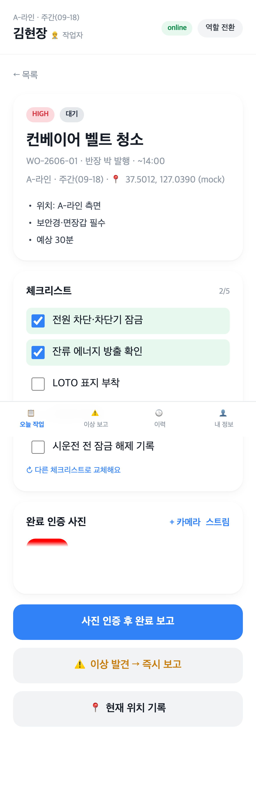
- **무엇을**: 제조 **LOTO(잠금/표지)** 세트 적용 → 체크 2/5(전원 차단·잔류에너지 체크됨) + 인증 사진 1장 + 위치 `37.5012, 127.0390 (mock)` + `↻ 다른 체크리스트로 교체`.
- **의도**: 라이브러리에서 작업 유형별 세트를 적용·교체 가능함을 입증(기능 1) + 사진·위치·완료 게이트 동시.
- **검토 결과**: LOTO 항목·부분 체크·mock 좌표·사진·교체 버튼 정상.

### 5.3 산업별 체크리스트 라이브러리 선택 시트 (모바일) · 기능 1
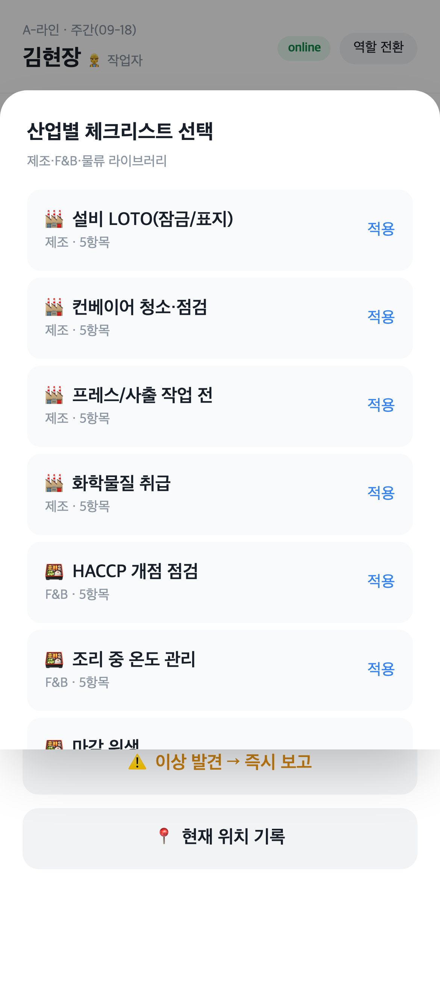
- **무엇을**: Bottom Sheet에 제조(설비 LOTO·컨베이어·프레스·화학물질) + F&B(HACCP·온도관리) … 세트가 산업·항목 수와 함께 나열, `적용` 버튼.
- **의도**: 단일 템플릿(v2) → **라이브러리**(v3)로 확장됨을 입증.
- **검토 결과**: 세트명·산업·항목 수·한글 정상.

### 5.4 작업자 — 이상 보고 (심각도 분류) (모바일)
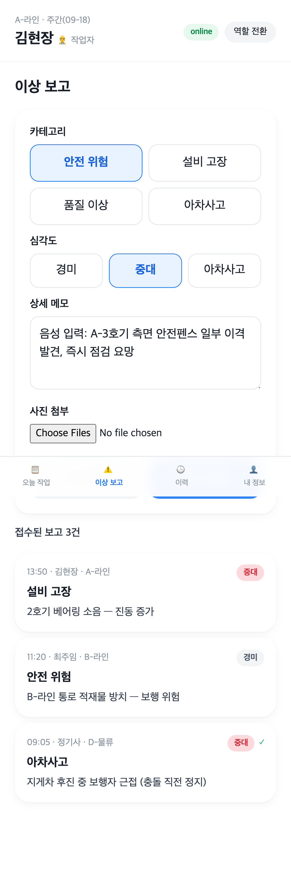
- **무엇을**: 카테고리 4종(안전/설비/품질/아차사고) + **심각도 3종**(중대 선택) + 음성 메모 + 접수 보고 3건(심각도 배지).
- **의도**: 심각도가 위험분석 가중치 입력으로 연결됨(기능 2의 입력측).
- **검토 결과**: 심각도 선택 상태·배지·음성 메모 정상.

### 5.5 오프라인 모드 — 큐 누적 (모바일) · 기능 8
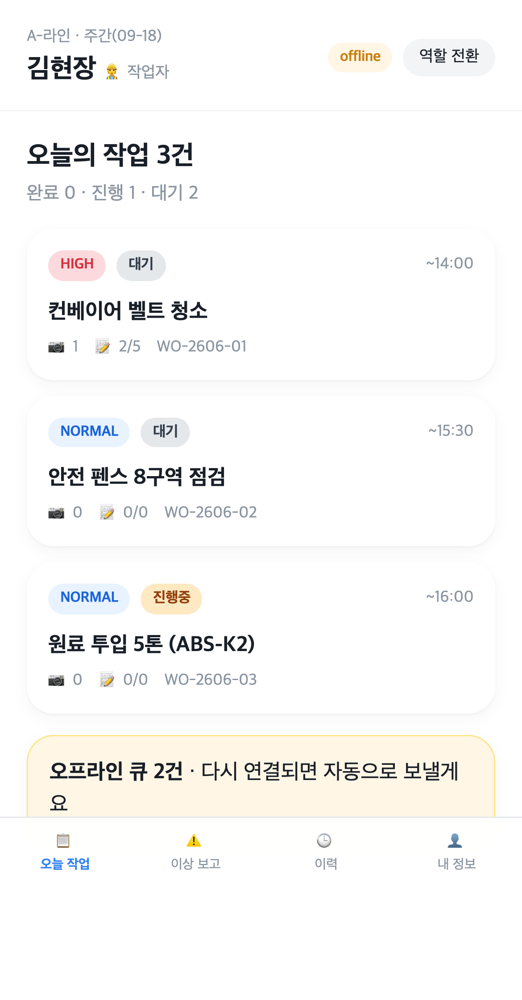
- **무엇을**: 헤더 `offline` 배지 + 하단 `오프라인 큐 2건 · 온라인 복구 시 자동 동기화` 배너. WO-2606-01 체크 2/5 영속.
- **의도**: 네트워크 단절 시 입력이 IndexedDB 큐에 적재됨(기능 8 전반부).
- **검토 결과**: offline 배지·큐 카운트·영속 상태 정상.

### 5.6 네이티브 앱 설치 안내 시트 (모바일) · 기능 4
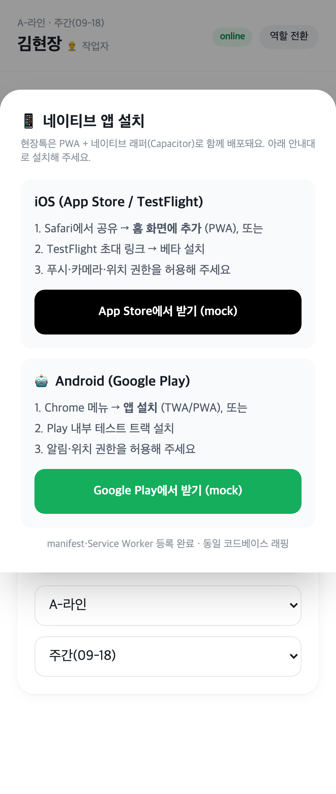
- **무엇을**: `📱 네이티브 앱 설치` 시트 — iOS(App Store/TestFlight) + Android(Google Play) 단계별 안내 + 스토어 받기 버튼(mock) + `manifest·SW 등록 완료` 표기.
- **의도**: PWA + 네이티브 래퍼 동시 배포 경로 제시(기능 4).
- **검토 결과**: iOS/Android 안내·버튼·한글 정상. mock 라벨 명시.

### 5.7 안전관리자 — 현장 안전 KPI 대시보드 (모바일) · 기능 3
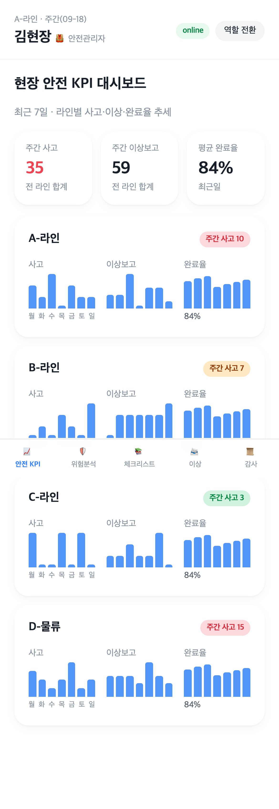
- **무엇을**: 헤더 `🦺 안전관리자` + 주간 사고/이상보고/평균 완료율 KPI + 라인별(A/B/C/D) 7일 **사고·이상보고·완료율 스파크라인** + 주간 사고 배지.
- **의도**: 단일 시점(v2) → **추세 시각화**(v3)로 격상(기능 3).
- **검토 결과**: 4개 라인 추세 차트·요일 라벨·주간 사고 색상 배지 정상.

### 5.8 안전관리자 — 보험사 위험분석 결과 (모바일) · 기능 2
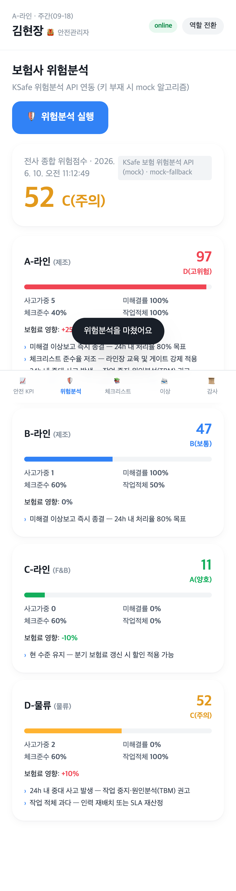
- **무엇을**: 전사 종합 위험점수 `52 C(주의)` + 라인별 점수·등급(A-라인 97 D고위험 / C-라인 11 A양호 등) + 요인(사고가중·미해결률·체크준수·작업적체) + 보험료 영향(+25%~-10%) + 룰 기반 권고. 봉투에 `KSafe 위험분석 API (mock) · mock-fallback`.
- **의도**: 실 스코어링 알고리즘으로 보험사 제휴 데이터를 산출(기능 2). 입력에 따라 점수가 결정적으로 변함.
- **검토 결과**: 점수·등급·요인·보험료 영향·권고 정상. mock fallback 명시.

### 5.9 안전관리자 — 산업별 체크리스트 라이브러리 전경 (모바일) · 기능 1
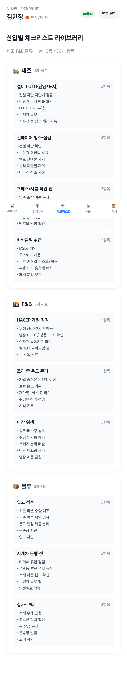
- **무엇을**: 제조(4세트)·F&B(3세트)·물류(3세트), 각 세트의 전 항목을 펼쳐 표시. 상단 `총 10세트 / 50항목`.
- **의도**: 라이브러리 규모·콘텐츠 깊이 입증(기능 1).
- **검토 결과**: 산업 구분·세트·항목·한글 정상.

### 5.10 안전관리자 — 감사 로그 (동기화 충돌 해결) (모바일) · 기능 8
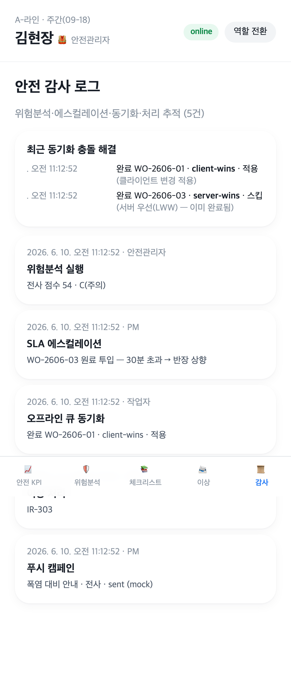
- **무엇을**: `최근 동기화 충돌 해결` — `완료 WO-2606-01 · client-wins · 적용` / `완료 WO-2606-03 · server-wins · 스킵(서버 우선 LWW)` + 위험분석·SLA 에스컬레이션·동기화·이상처리·캠페인 감사 이벤트.
- **의도**: 오프라인 큐 **충돌 해결(LWW)·동기화 상세**를 추적 가능하게 기록함을 입증(기능 8 후반부).
- **검토 결과**: client/server-wins 전략·적용/스킵·사유·한글 정상.

### 5.11 반장 — SLA · 자동 에스컬레이션 (모바일) · 기능 6
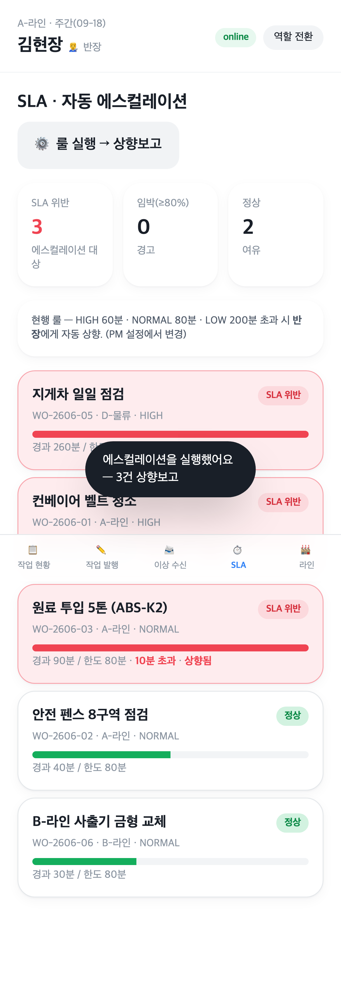
- **무엇을**: `🔧 반장` + SLA 위반 3 / 임박 0 / 정상 2 KPI + 현행 룰(HIGH 60·NORMAL 80·LOW 200분) + 작업별 경과/한도 바·`10분 초과 · 상향됨` 라벨. 토스트 `에스컬레이션 실행 — 3건 상향보고`.
- **의도**: 지연 작업 자동 상향보고 룰 엔진(기능 6).
- **검토 결과**: 위반 판정·경과/한도·상향 라벨·실행 토스트 정상.

### 5.12 반장 — 작업 발행 (산업별 체크리스트 첨부) (모바일) · 기능 1·7
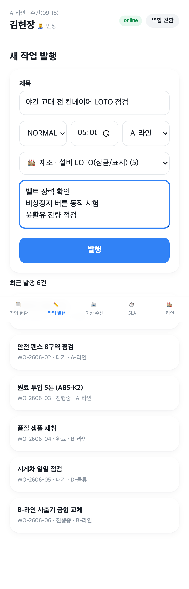
- **무엇을**: 제목·우선순위·마감·라인 + **`제조 · 설비 LOTO(잠금/표지) (5)`** 라이브러리 세트 선택 + 세부 지시 + 발행. 최근 발행 6건.
- **의도**: 반장 권한으로 라이브러리 세트를 작업에 첨부 발행(기능 1 적용 + 기능 7 권한).
- **검토 결과**: 반장 역할·세트 선택·폼·발행 목록 정상.

### 5.13 PM — 푸시 캠페인 (모바일) · 기능 5
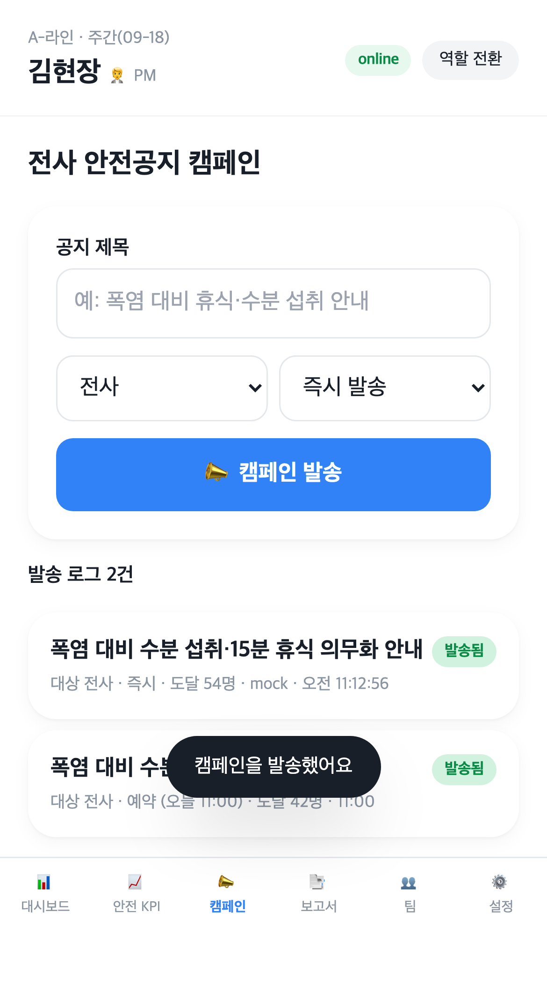
- **무엇을**: `🧑‍💼 PM` + 전사 안전공지 작성(제목·대상·즉시/예약) → 발송 + 발송 로그 2건(`도달 54명 · mock` / 예약 11:00). 토스트 `캠페인 발송됨`.
- **의도**: 전사 안전공지 예약·발송 + 로그(기능 5).
- **검토 결과**: 발송 결과·로그·도달 수·mock 라벨 정상.

### 5.14 PM — 대시보드 (KPI + SLA 위반 + 최근활동) (모바일) · 기능 5·6
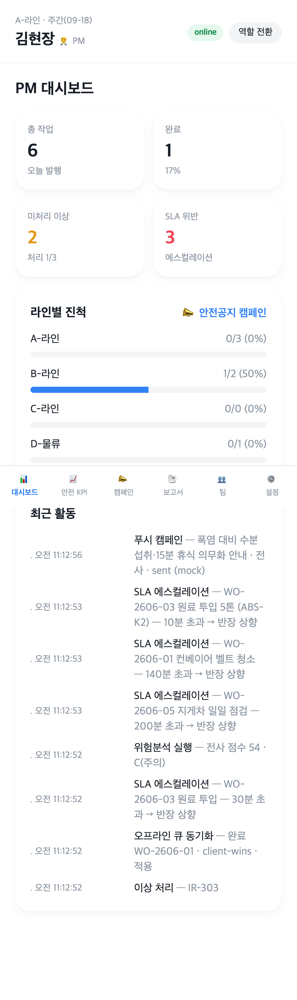
- **무엇을**: 총작업 6·완료 1·미처리 이상 2·**SLA 위반 3** KPI + 라인별 진척 + 최근 활동(푸시 캠페인·SLA 에스컬레이션·위험분석·큐 동기화 이력).
- **의도**: PM 콘솔에서 캠페인·SLA·위험분석 결과가 통합 가시화됨.
- **검토 결과**: KPI·SLA 위반 수·최근 활동 이벤트 정상.

### 5.15 PM — 팀 (7명 · 4역할) (모바일) · 기능 7
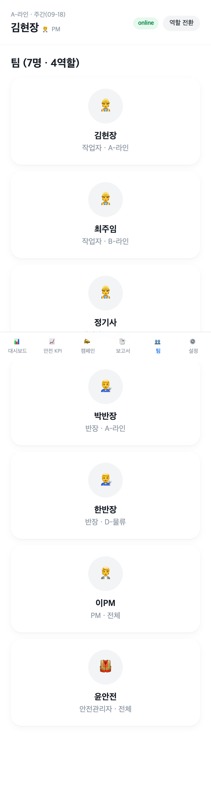
- **무엇을**: 작업자 3·반장 2·PM 1·**안전관리자 1** = 7명을 역할 아이콘·라인과 함께 카드 표시. 상단 `팀 (7명 · 4역할)`.
- **의도**: 역할 4종 다중 사용자 시뮬레이션(기능 7).
- **검토 결과**: 4역할·아이콘·라인 정상.

### 5.16 데스크톱 — 안전관리자 위험분석 (반응형) · 기능 2·4·7
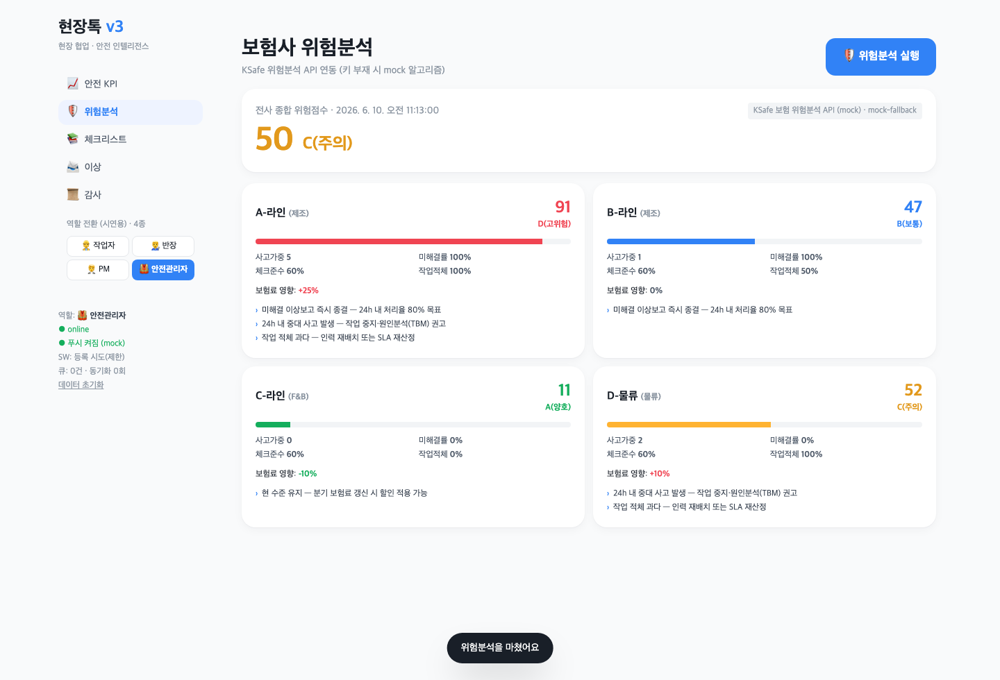
- **무엇을**: lg+ 사이드 내비(**4역할 전환** 작업자·반장·PM·안전관리자 + PWA 상태 `online / 푸시 구독됨(mock) / SW: 등록 시도(제한) / 큐·동기화`) + 전사 50 C(주의) + 라인별 위험 2열 그리드.
- **의도**: 데스크톱 반응형 + 4역할 권한 + 위험분석 + PWA 상태 동시 입증.
- **검토 결과**: 사이드 4역할·PWA 상태·2열 위험 그리드 정상.

### 5.17 데스크톱 — 안전 KPI 추세 (반응형) · 기능 3
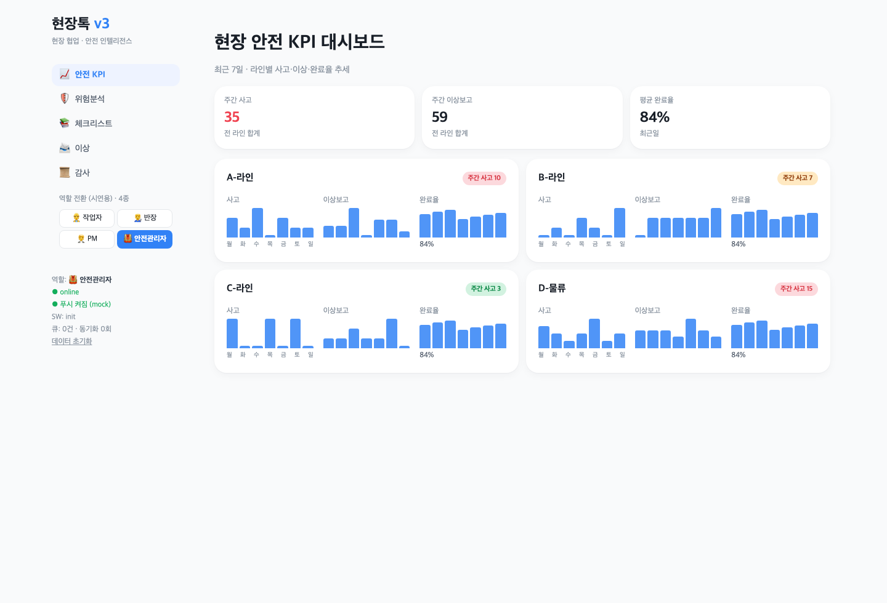
- **무엇을**: lg+에서 라인별 추세 차트 2열 그리드 + 주간 KPI 3종 + 사이드 내비.
- **의도**: 넓은 화면에서 KPI 추세 다단 레이아웃.
- **검토 결과**: 2열 추세 차트·주간 KPI·사이드 내비 정상.

### 5.18 데스크톱 — PM 대시보드 (반응형) · 기능 5·6·7
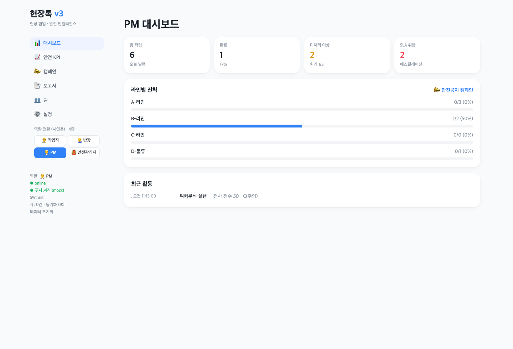
- **무엇을**: lg+에서 KPI 4열(총작업·완료·미처리 이상·SLA 위반 2) + 라인별 진척 + 최근 활동(위험분석 실행) + 사이드 PM 내비.
- **의도**: 데스크톱 PM 콘솔 — 넓은 화면 활용 다단.
- **검토 결과**: 4열 KPI·진척·최근 활동·사이드 내비 정상.

## 6. 검수 기준 충족 여부

### 6.1 과업지시서 §5 — 핵심 8가지 (항목별 측정값)

| # | 핵심 산출물 | 검수 조건 | 결과 | 측정값 |
|:---:|:---|:---|:---:|:---|
| 1 | 산업별 체크리스트 라이브러리 | 산업별 다수 세트·적용/교체 | ✅ | 제조 4·F&B 3·물류 3세트 = **10세트·50항목**, 작업 적용·교체·발행 첨부(02·03·09·12) |
| 2 | 보험사 위험분석 API 시뮬레이션 | 실 계산 → 점수·등급·권고 | ✅ | 5개 요인 가중합 → 0~100 점수·A~D 등급·보험료 ±%·룰 권고, mock fallback 명시(08·16) |
| 3 | 현장 안전 KPI 대시보드 | 라인별 사고/이상/완료 추세 | ✅ | 라인 4개 × 7일 × 3지표 스파크라인 + 주간 집계(07·17) |
| 4 | 네이티브 래퍼 + manifest/SW 고도화 | install 안내 + 고도화 | ✅ | iOS/Android 설치 시트 + maskable·shortcuts·push 핸들러(06·16) |
| 5 | 푸시 캠페인 | 예약·발송 로그 | ✅ | 전사/라인·즉시/예약 발송 + 도달·로그 영속(13·14) |
| 6 | 작업 SLA/에스컬레이션 | 한도 초과 자동 상향 | ✅ | 우선순위별 한도 룰 → 위반 3건 판정·상향 실행(11·14) |
| 7 | 역할 4종+ 권한 | 4역할 권한 분기 | ✅ | 작업자·반장·PM·안전관리자, 권한 매트릭스·뷰/액션 분기(15·16·07) |
| 8 | 오프라인 큐 충돌 해결/동기화 상세 | LWW + 동기화 로그 | ✅ | IndexedDB 큐 + client/server-wins LWW + 동기화 사유 로그(05·10) |

### 6.2 v3 "시리즈A 데모" 기준 (CLAUDE.md §2.4)

| 기준 | 요구 | 결과 | 근거 |
|:---|:---|:---:|:---|
| v2 한계 매핑 + 1:1 해결 | 표 | ✅ | 상단 `v2 한계 및 v3 개선 매핑`(8행) |
| 실 알고리즘 | 2종+ | ✅ | ① **위험점수 스코어링**(5요인 가중합·등급·보험료 영향) ② **SLA 룰 엔진**(우선순위별 한도·경과율 판정) ③ LWW 충돌 해결 — **3종** |
| 다중 사용자/다중 테넌트 | 역할별 화면·권한 분기 | ✅ | **역할 4종** 권한 매트릭스 + 라인 4종 + 팀 7명 |
| 외부 시스템 통합 | 3건+ (CDN 제외) | ✅ | ① **IndexedDB** 영속·큐·충돌해결 ② **위험분석 API**(mock fallback 봉투) ③ **Web Push/Notification** 캠페인 ④ **Geolocation** 위치 ⑤ CSV 외부 출력(작업·위험분석) — **5건** |
| 화면/뷰 | 10종+ | ✅ | **18종** (작업자5·반장5·PM6·안전관리자5, 중복 제외 고유 18) |
| 워크플로 | 4개+ | ✅ | 작업 수행·이상 보고·위험분석·SLA·푸시 캠페인 — **5개** |
| 신규 캡처 | 12장+ | ✅ | **18장**(모바일 15 + 데스크톱 3) |

## 8. 검토 체크리스트

- [x] 모든 핵심 기능이 캡처되었는가 (8가지 모두 + 4역할 + 데스크톱)
- [x] 캡처가 의도한 기능을 정확히 보여주는가 (18장 전수 Read 검증)
- [x] 한글이 깨지지 않는가 (전수 확인)
- [x] 에러 화면이 의도치 않게 캡처되지 않았는가
- [x] 결과물(위험점수·등급·SLA 판정·KPI 추세·CSV·동기화 로그)의 정확도가 충분한가
- [x] 과업지시서 §5 핵심 8가지 검수 기준 100% 매핑되었는가
- [x] 영속성(localStorage + IndexedDB)이 새로고침 후에도 유지됨
- [x] 로그인 없이 시연 가능 (CLAUDE.md §3.4) · file:// mock fallback로 키/권한 없이 구동
- [x] (v3 한정) v2 한계 매핑표 + 시리즈A 데모 가치 기준(실 알고리즘 3·역할 4·외부 통합 5·뷰 18·워크플로 5·캡처 18) 충족
