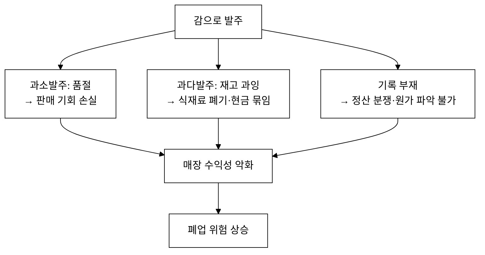
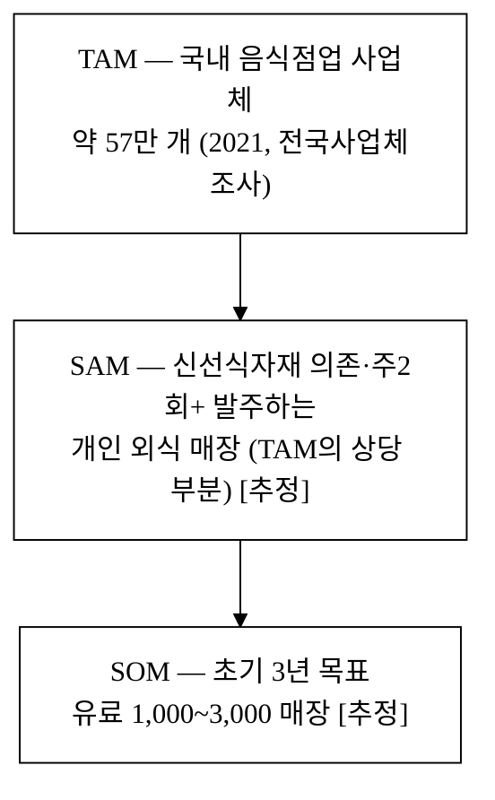
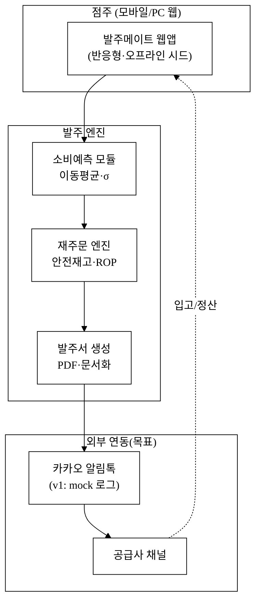
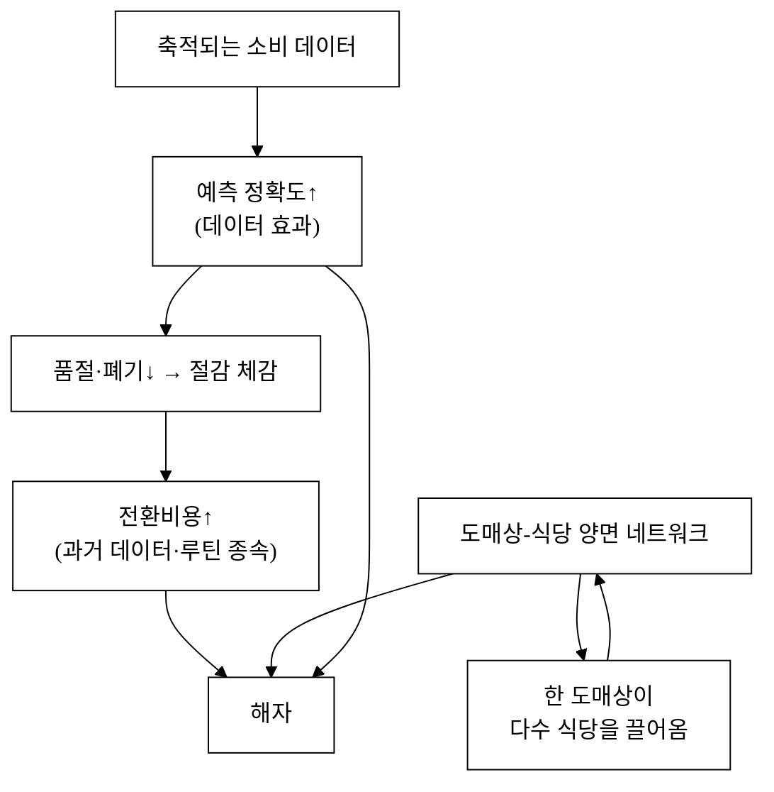

last_updated: 2026-06-22 14:30

# 발주메이트 — 소상공인 식당 ↔ 식자재 공급사 B2B 자동발주·재고관리 SaaS

> 재고를 추적하고, 소비를 예측하고, 발주서를 자동으로 제안·생성해 공급사에 보내고, 입고와 정산까지 한 흐름으로 잇는다. "감(感)으로 발주하던" 동네 식당의 식자재 운영을 데이터로 바꾸는 가장 가벼운 도구.

## 사업 개요 (머리표)

| 항목 | 내용 |
|:---|:---|
| 사업명 | 2026년 창업동아리 지원사업(실전창업) |
| 주관기관 | 대구대학교 창업지원단 |
| 트랙 | 실전창업 |
| 지원 규모 | 기본 300만 원 · 최대 1,000만 원 |
| 모집 기간 | 2026-03-19 ~ 2026-04-02 |
| 아이템명 | 발주메이트 (BaljuMate) — 식자재 자동발주·재고관리 SaaS |
| 한 줄 정의 | 소상공인 식당의 재고→소비예측→자동발주→발송→정산을 잇는 B2B 운영 SaaS |
| 타깃 고객 | 단일·소규모 매장 외식 자영업자(개인 식당·카페·분식·고깃집 등) |
| 산출물(v1) | 단일 HTML 자체완결 데모(오프라인 동작, 반응형, 실 알고리즘 탑재) |

> 본 제안서의 PSST 섹션 순서는 고정한다(Problem · Solution · Scale-up · Team). Team 섹션은 골격만 두고 내용은 `<TODO: 사용자 입력>`으로 비워 둔다(행정 양식은 사용자 책임 영역).

---

## 1. Problem — 문제 정의

### 1.1 "감(感)으로 발주하는" 동네 식당

국내 음식점업 사업체는 약 57만 개(2021년)에 이른다.[^food-count] 이 중 절대다수는 **점주 1인 또는 가족이 운영하는 영세 매장**이다. 이들의 식자재 발주는 대부분 다음과 같이 이루어진다.

- 냉장고를 열어보고 "양파가 떨어졌네" 하고 **눈대중으로** 주문한다.
- 단골 도매상에게 **전화·카카오톡으로** 품목과 수량을 불러준다.
- 얼마를 주문했고 얼마가 들어왔는지는 **영수증과 기억**에 의존한다.
- 정산은 월말에 거래처별로 **금액을 맞춰보며** 처리한다.

이 방식은 세 가지 비용을 발생시킨다.

### 1.2 문제의 크기 — 식재료비는 외식 원가의 최대 비용

외식업 원가 구조에서 **식재료비(원재료비)는 영업비용의 40.7%**(2024년 기준)를 차지하는 단일 최대 비용 항목이며, 2020년 36.3%에서 4.4%p 상승했다.[^cost-food] 인건비·임대료가 상대적으로 고정비라면, 식재료비는 **운영의 질로 줄일 수 있는 변동비**다. 그런데 정작 이 비용을 데이터로 관리하는 영세 매장은 드물다.

- **과소발주(품절)**: 주력 메뉴 재료가 떨어지면 그 시간대 매출이 0이 된다.
- **과다발주(폐기)**: 신선식자재는 유통기한이 짧아 며칠만 남아도 폐기된다. 폐기는 곧 마진의 직접 손실이다.
- **현금 묶임**: 필요 이상으로 쌓인 재고는 영세 매장의 가장 부족한 자원인 **현금 흐름**을 묶는다.

음식점업은 진입·퇴출이 빈번한 업종으로, **외식 관련 업종의 5년 생존율은 39.6% 이하**(국세청, 2023년 기준)에 머문다 — 개업 5곳 중 3곳이 5년을 못 버틴다.[^food-close] 그 배후에는 "팔리는데도 남는 게 없는" 원가 관리 실패가 있고, 식자재 운영은 그 중심이다.

#### 손실의 구조 — 왜 "조금씩" 새는 돈이 치명적인가

외식업 평균 영업이익률은 **8.7%**(2024년 기준, 2020년 12.1%에서 4년 연속 하락)에 불과하다.[^margin] 즉 **매출 100만 원을 팔아 손에 쥐는 순이익은 약 8.7만 원**이다. 이 구조에서 식재료 손실은 다음과 같이 증폭된다.

- 폐기로 매일 식재료의 **3~5%**[^waste] `[추정]`만 버려도, 식재료비가 영업비용의 40.7%[^cost-food]라면 이는 **매출의 약 1%대가 그냥 사라지는** 것이다. 영업이익률이 8.7%[^margin]라면 **이익의 두 자릿수 %가 폐기로 증발**한다.
- 반대로 품절은 "팔 수 있었는데 못 판" 기회손실이라 회계장부에 잡히지도 않는다. **보이지 않는 손실**이라 점주는 문제의 크기를 과소평가한다.

즉 식자재 운영 개선은 "있으면 좋은(nice-to-have)" 기능이 아니라 **생존이 걸린 이익 레버**다. 작은 개선(폐기 1%p 감소)이 곧 이익의 두 자릿수 % 개선으로 직결되기 때문이다.

#### 시장 규모 (TAM·SAM·SOM)

- **TAM**: 국내 음식점업 사업체 약 57만 개(2021년)[^food-count]. 외식 식자재 유통 시장은 조 단위 규모로 추정된다.[^food-distribution]
- **SAM**: 그중 신선식자재 비중이 높고 주 2회 이상 도매 발주하는 개인 매장 — 본 솔루션의 가치가 가장 큰 세그먼트. `[추정]`
- **SOM**: 지역(대구·경북) 거점 + 도매상 제휴 레버리지로 초기 3년 내 도달 가능한 유료 매장 수. `[추정]`

> 절대값은 모두 `[추정]`이며, 공식 통계로 골격(TAM)만 고정하고 SAM·SOM은 가정임을 명시한다.

### 1.3 기존 대안의 공백

| 대안 | 한계 |
|:---|:---|
| 엑셀 수기 관리 | 점주가 직접 매일 입력해야 함 → 지속 불가능. 예측·자동화 없음 |
| 대형 프랜차이즈 ERP/SCM | 본사 단위 시스템. 개인 매장이 도입할 가격·복잡도 아님 |
| 식자재 마켓 앱(B2B 커머스) | "사는 채널"은 늘었지만 **얼마나 사야 하는지(예측)** 는 여전히 점주 몫 |
| 도매상 단골 거래 | 관계 기반. 데이터·기록·정산 투명성 부재 |

→ **"영세 매장이 부담 없이 쓸 수 있는, 예측 기반 자동발주 + 재고·정산 도구"** 라는 공백이 존재한다.

### 1.4 JTBD (Jobs To Be Done)

점주가 "고용"하고 싶은 일(job)은 *"발주 앱을 쓰는 것"* 이 아니다. 진짜 job은:

> **"품절도 폐기도 없이, 적정량을 제때 자동으로 채워 넣고, 거래처 정산까지 깔끔하게 끝내고 싶다."**

발주메이트는 바로 이 job을 대신 수행한다.

### 1.5 페르소나 — "고깃집 사장 김씨의 하루"

> 김씨(48)는 직원 1명과 함께 8테이블 규모 고깃집을 운영한다. 삼겹살·등심·양파·대파가 주력 식자재다.

- **오전**: 냉장고를 열어 "삼겹살이 좀 부족한가?" 가늠한다. 어제 장사가 잘됐는지 기억에 의존해 도매상에 전화로 주문한다. 가끔 너무 적게 주문해 저녁에 "삼겹살 품절" 안내를 한다.
- **주말**: 손님이 몰릴 것 같아 넉넉히 주문했는데 비가 와서 매출이 빠졌다. 남은 고기는 등급이 떨어지고 채소는 무른다. 월요일에 일부를 버린다.
- **월말**: 도매상 3곳 거래내역을 영수증 뭉치로 맞춘다. 한 곳과는 "지난주 그거 들어왔냐"로 실랑이한다.

김씨에게 필요한 것은 새 ERP를 배우는 게 아니다. **"어제까지 얼마나 팔렸으니 오늘은 이만큼 시키세요"** 라고 알려주고, 발주서를 대신 만들어 보내주고, 정산을 자동으로 정리해 주는 도구다. 발주메이트는 정확히 이 페르소나를 1차 타깃으로 설계됐다.

---

## 2. Solution — 해결책

### 2.1 핵심: "예측 기반 자동발주" 파이프라인

발주메이트는 점주의 머릿속 계산을 **5단계 워크플로**로 외부화한다.

```mermaid
%%{init: {"theme":"base","themeVariables":{"darkMode":false,"background":"#ffffff","fontFamily":"Georgia, serif","primaryColor":"#ffffff","primaryBorderColor":"#000000","primaryTextColor":"#000000","secondaryColor":"#ffffff","secondaryBorderColor":"#000000","secondaryTextColor":"#000000","tertiaryColor":"#ffffff","tertiaryBorderColor":"#000000","tertiaryTextColor":"#000000","mainBkg":"#ffffff","secondBkg":"#ffffff","lineColor":"#000000","textColor":"#000000","nodeBorder":"#000000","nodeTextColor":"#000000","titleColor":"#000000","edgeLabelBackground":"#ffffff","defaultLinkColor":"#000000","clusterBkg":"#ffffff","clusterBorder":"#000000","actorBkg":"#ffffff","actorBorder":"#000000","actorTextColor":"#000000","actorLineColor":"#000000","signalColor":"#000000","signalTextColor":"#000000","labelBoxBkgColor":"#ffffff","labelBoxBorderColor":"#000000","labelTextColor":"#000000","loopTextColor":"#000000","noteBkgColor":"#ffffff","noteBorderColor":"#000000","noteTextColor":"#000000","activationBkgColor":"#ffffff","activationBorderColor":"#000000","sequenceNumberColor":"#000000","attributeBackgroundColorOdd":"#ffffff","attributeBackgroundColorEven":"#ffffff","sectionBkgColor":"#ffffff","altSectionBkgColor":"#ffffff","sectionBkgColor2":"#ffffff","taskBkgColor":"#ffffff","taskBorderColor":"#000000","taskTextColor":"#000000","taskTextLightColor":"#000000","taskTextOutsideColor":"#000000","taskTextDarkColor":"#000000","taskTextClickableColor":"#000000","activeTaskBkgColor":"#ffffff","activeTaskBorderColor":"#000000","doneTaskBkgColor":"#ffffff","doneTaskBorderColor":"#000000","critBkgColor":"#ffffff","critBorderColor":"#000000","gridColor":"#000000","todayLineColor":"#000000","quadrant1Fill":"#ffffff","quadrant2Fill":"#ffffff","quadrant3Fill":"#ffffff","quadrant4Fill":"#ffffff","quadrant1TextFill":"#000000","quadrant2TextFill":"#000000","quadrant3TextFill":"#000000","quadrant4TextFill":"#000000","quadrantPointFill":"#000000","quadrantPointTextFill":"#000000","quadrantXAxisTextFill":"#000000","quadrantYAxisTextFill":"#000000","quadrantInternalBorderStrokeFill":"#000000","quadrantExternalBorderStrokeFill":"#000000","quadrantTitleFill":"#000000","pieStrokeColor":"#000000","pieOuterStrokeColor":"#000000","pieTitleTextColor":"#000000","pieSectionTextColor":"#000000","pieLegendTextColor":"#000000","cScale0":"#ffffff","cScaleLabel0":"#000000","cScaleInv0":"#000000","pie1":"#ffffff","cScale1":"#ffffff","cScaleLabel1":"#000000","cScaleInv1":"#000000","pie2":"#ffffff","cScale2":"#ffffff","cScaleLabel2":"#000000","cScaleInv2":"#000000","pie3":"#ffffff","cScale3":"#ffffff","cScaleLabel3":"#000000","cScaleInv3":"#000000","pie4":"#ffffff","cScale4":"#ffffff","cScaleLabel4":"#000000","cScaleInv4":"#000000","pie5":"#ffffff","cScale5":"#ffffff","cScaleLabel5":"#000000","cScaleInv5":"#000000","pie6":"#ffffff","cScale6":"#ffffff","cScaleLabel6":"#000000","cScaleInv6":"#000000","pie7":"#ffffff","cScale7":"#ffffff","cScaleLabel7":"#000000","cScaleInv7":"#000000","pie8":"#ffffff","cScale8":"#ffffff","cScaleLabel8":"#000000","cScaleInv8":"#000000","pie9":"#ffffff","cScale9":"#ffffff","cScaleLabel9":"#000000","cScaleInv9":"#000000","pie10":"#ffffff","cScale10":"#ffffff","cScaleLabel10":"#000000","cScaleInv10":"#000000","pie11":"#ffffff","cScale11":"#ffffff","cScaleLabel11":"#000000","cScaleInv11":"#000000","pie12":"#ffffff"}}}%%
flowchart LR
  S1["① 재고 입력/추적<br/>현재고·소비 기록"] --> S2["② 소비예측<br/>이동평균·표준편차"]
  S2 --> S3["③ 재주문 제안<br/>안전재고·ROP·부족분"]
  S3 --> S4["④ 발주서 생성·발송<br/>PDF·mock 알림톡"]
  S4 --> S5["⑤ 입고·정산<br/>재고 반영·정산내역"]
  S5 -.소비 데이터 누적.-> S2
```

이 파이프라인의 핵심은 ③ **재주문 제안이 "감"이 아니라 검증된 재고이론**으로 산출된다는 점이다.

### 2.2 알고리즘 — 안전재고·재주문점(ROP)

발주메이트는 표준 재고관리 이론[^rop]을 그대로 구현한다.

| 지표 | 공식 | 의미 |
|:---|:---|:---|
| 일평균 소비 μ | 최근 N일 이동평균 | 평상시 하루에 얼마나 쓰는가 |
| 변동성 σ | 표본표준편차 | 수요가 얼마나 들쭉날쭉한가 |
| 안전재고 | Z × σ × √(리드타임) | 변동·배송 지연에 대비한 완충 |
| 재주문점 ROP | μ × 리드타임 + 안전재고 | 이 수량 이하로 떨어지면 발주해야 한다 |
| 목표재고 | μ × 목표커버일수 + 안전재고 | 발주 후 도달할 적정 재고 |
| 제안수량 | (목표재고 − 현재고) → MOQ 올림 | 실제로 주문할 양 |

여기서 **Z(서비스수준)** 는 점주가 선택한다. Z=1.65면 "95% 확률로 품절을 막는" 보수적 운영, Z=1.28이면 폐기를 줄이는 공격적 운영이다. 즉 **점주의 경영 판단(품절 회피 vs 폐기 회피)을 숫자로 받아 반영**한다.

> v1 데모는 이 공식을 실제로 계산한다. 시드 데이터의 7일치 소비 이력에서 μ·σ를 구하고, 품목별 리드타임·Z·MOQ를 반영해 ROP와 제안수량을 산출한다(개발결과보고서 §5 캡처로 입증).

#### 계산 예시 — "양파 15kg망"

| 입력 | 값 |
|:---|:---|
| 최근 7일 소비 | 14, 12, 18, 15, 16, 13, 17 (망/일) |
| 리드타임 L | 2일 |
| 서비스수준 Z | 1.65 (95%) |
| MOQ | 5망 |
| 목표 커버일수 | 7일 |
| 현재고 | 29망(소비 기록 후) |

| 계산 | 결과 |
|:---|:---|
| 일평균 μ | ≈ 15.0 망/일 |
| 표준편차 σ | ≈ 2.1 망 |
| 안전재고 = 1.65 × σ × √2 | ≈ 4.9 망 |
| ROP = 15.0 × 2 + 4.9 | ≈ 34.9 망 → **현재고 29 < ROP → 발주 필요** |
| 목표재고 = 15.0 × 7 + 4.9 | ≈ 109.9 망 |
| 제안수량 = (목표 − 현재고) → MOQ 올림 | ≈ 81 → 85망 |

이렇게 **"왜 이만큼 시켜야 하는지"가 숫자로 설명**된다. 점주는 근거를 보고 수량만 조정하면 된다. 이것이 "감으로 발주"와의 결정적 차이다.

### 2.3 자동발주서 — 전화·카톡을 구조화된 발주서로

제안된 수량은 **공급사별로 묶여 발주서(Purchase Order)** 로 자동 생성된다. 점주는 수량만 확인·조정하면 된다.

- **PDF 발주서**: 발주번호·발주일·공급사·품목·수량·단가·금액·합계가 담긴 정식 문서를 jsPDF로 생성한다(한글 폰트 임베드/래스터 폴백으로 깨짐 방지).
- **mock 알림톡 발송**: 카카오 알림톡(대체 SMS) 발송을 시뮬레이션하고 발송 로그를 남긴다. 실 서비스에서는 공급사 채널 연동으로 대체된다.
- **발송 이력 추적**: 발주번호 단위로 상태(발송/입고완료)를 관리한다.

### 2.4 입고·정산 — 기록이 곧 원가 데이터

입고 확정 시 재고가 자동 증가하고 정산 내역이 쌓인다. 이 데이터가 누적되면 점주는 처음으로 **"이번 달 식재료에 얼마를 썼는가"** 를 품목·거래처 단위로 본다. 이것이 다음 사이클의 원가 절감 출발점이다.

### 2.5 시스템 아키텍처 (목표 모델)

> v1(현 데모)은 위 Core를 **브라우저 내부에서 전부 실제 동작**시키고, 외부 연동은 mock 로그로 시뮬레이션한다(오프라인 시연 보장, CLAUDE.md §3.4).

---

## 3. Scale-up — 성장 전략

본 절은 CLAUDE.md가 요구하는 **고객확보(GTM)·수익모델·차별성** 3개 섹션을 구체적 수치·채널로 채운다.

### 경영혁신·창업학적 프레임워크

발주메이트는 다음 이론으로 정당화된다.

**① Christensen 파괴적 혁신 (저가·언더서브드 시장 진입).**
대형 ERP/SCM은 프랜차이즈 본사를 겨냥한 고가·고복잡도 솔루션이다. 발주메이트는 그 기능의 **핵심 일부(예측·자동발주)만을, 영세 매장이 감당할 가격·단순함으로** 제공한다. 이는 전형적인 **로우엔드 파괴(low-end disruption)** 진입 경로다 — 기존 강자가 무시하는 "과잉 서비스 받지 못한(underserved)" 영세 매장에서 시작해, 데이터가 쌓이며 상위로 올라간다.

**② Kim·Mauborgne 블루오션 (ERR 그리드).**
- **제거(Eliminate)**: 본사 단위 도입 절차·고가 라이선스.
- **감소(Reduce)**: 설정 복잡도(시드 데이터로 즉시 시작).
- **증가(Raise)**: 예측 정확도·정산 투명성.
- **창조(Create)**: "영세 매장 1인이 5분 만에 쓰는 자동발주"라는 새 카테고리.

**③ Ries 린 스타트업 + JTBD.**
v1 데모(검증된 알고리즘 + 실 워크플로)는 "예측 기반 발주가 점주에게 가치 있는가"를 검증하는 **MVP**다. JTBD(§1.4)로 정의한 진짜 job — *품절·폐기 없이 자동으로 채우고 정산까지* — 을 가장 작은 형태로 충족한다.

> 본 사업은 Christensen 파괴 곡선의 **로우엔드 진입점**, 린 스타트업의 **MVP→PMF 탐색 단계**에 해당한다.

### 고객확보 (Go-to-Market)

**ICP (Ideal Customer Profile).**

| 축 | 1차 ICP |
|:---|:---|
| 업종 | 신선식자재 의존도 높은 개인 외식 매장(고깃집·분식·백반·카페) |
| 규모 | 단일 매장, 식재료비가 영업비용의 40%대[^cost-food]를 차지하는 신선식자재 의존 매장 |
| 발주 빈도 | 주 2회 이상 도매 발주 |
| 페인 | 품절/폐기 반복, 정산 분쟁, 원가 깜깜이 |
| 디지털 수용도 | 배달앱·카드단말·키오스크는 이미 쓰는 수준 |

**획득 채널·전술.**

| 채널 | 유형 | 전술 | 비고 |
|:---|:---|:---|:---|
| 식자재 도매상·공판장 제휴 | 제휴 | 도매상이 단골 식당에 발주메이트 추천(도매상은 정확한 발주서로 업무 감소) | 양면 시장의 공급측을 지렛대 |
| 소상공인 지원기관·상인회 | 오가닉/공공 | 중기부 소상공인 디지털 전환 사업[^policy-digital]과 연계한 교육·시연 | 정책 적합성 |
| 외식 자영업 커뮤니티(네이버 카페·오픈채팅) | 오가닉 | "이번 달 폐기 얼마 줄었나" 사례 콘텐츠 | 바이럴 근거=절감액 |
| 지역 타깃 광고 | 유료 | 상권 단위 메타/당근 광고 → 무료 체험 | CAC 측정 채널 |

**퍼널 (인지→가입→활성→유지).**

```mermaid
%%{init: {"theme":"base","themeVariables":{"darkMode":false,"background":"#ffffff","fontFamily":"Georgia, serif","primaryColor":"#ffffff","primaryBorderColor":"#000000","primaryTextColor":"#000000","secondaryColor":"#ffffff","secondaryBorderColor":"#000000","secondaryTextColor":"#000000","tertiaryColor":"#ffffff","tertiaryBorderColor":"#000000","tertiaryTextColor":"#000000","mainBkg":"#ffffff","secondBkg":"#ffffff","lineColor":"#000000","textColor":"#000000","nodeBorder":"#000000","nodeTextColor":"#000000","titleColor":"#000000","edgeLabelBackground":"#ffffff","defaultLinkColor":"#000000","clusterBkg":"#ffffff","clusterBorder":"#000000","actorBkg":"#ffffff","actorBorder":"#000000","actorTextColor":"#000000","actorLineColor":"#000000","signalColor":"#000000","signalTextColor":"#000000","labelBoxBkgColor":"#ffffff","labelBoxBorderColor":"#000000","labelTextColor":"#000000","loopTextColor":"#000000","noteBkgColor":"#ffffff","noteBorderColor":"#000000","noteTextColor":"#000000","activationBkgColor":"#ffffff","activationBorderColor":"#000000","sequenceNumberColor":"#000000","attributeBackgroundColorOdd":"#ffffff","attributeBackgroundColorEven":"#ffffff","sectionBkgColor":"#ffffff","altSectionBkgColor":"#ffffff","sectionBkgColor2":"#ffffff","taskBkgColor":"#ffffff","taskBorderColor":"#000000","taskTextColor":"#000000","taskTextLightColor":"#000000","taskTextOutsideColor":"#000000","taskTextDarkColor":"#000000","taskTextClickableColor":"#000000","activeTaskBkgColor":"#ffffff","activeTaskBorderColor":"#000000","doneTaskBkgColor":"#ffffff","doneTaskBorderColor":"#000000","critBkgColor":"#ffffff","critBorderColor":"#000000","gridColor":"#000000","todayLineColor":"#000000","quadrant1Fill":"#ffffff","quadrant2Fill":"#ffffff","quadrant3Fill":"#ffffff","quadrant4Fill":"#ffffff","quadrant1TextFill":"#000000","quadrant2TextFill":"#000000","quadrant3TextFill":"#000000","quadrant4TextFill":"#000000","quadrantPointFill":"#000000","quadrantPointTextFill":"#000000","quadrantXAxisTextFill":"#000000","quadrantYAxisTextFill":"#000000","quadrantInternalBorderStrokeFill":"#000000","quadrantExternalBorderStrokeFill":"#000000","quadrantTitleFill":"#000000","pieStrokeColor":"#000000","pieOuterStrokeColor":"#000000","pieTitleTextColor":"#000000","pieSectionTextColor":"#000000","pieLegendTextColor":"#000000","cScale0":"#ffffff","cScaleLabel0":"#000000","cScaleInv0":"#000000","pie1":"#ffffff","cScale1":"#ffffff","cScaleLabel1":"#000000","cScaleInv1":"#000000","pie2":"#ffffff","cScale2":"#ffffff","cScaleLabel2":"#000000","cScaleInv2":"#000000","pie3":"#ffffff","cScale3":"#ffffff","cScaleLabel3":"#000000","cScaleInv3":"#000000","pie4":"#ffffff","cScale4":"#ffffff","cScaleLabel4":"#000000","cScaleInv4":"#000000","pie5":"#ffffff","cScale5":"#ffffff","cScaleLabel5":"#000000","cScaleInv5":"#000000","pie6":"#ffffff","cScale6":"#ffffff","cScaleLabel6":"#000000","cScaleInv6":"#000000","pie7":"#ffffff","cScale7":"#ffffff","cScaleLabel7":"#000000","cScaleInv7":"#000000","pie8":"#ffffff","cScale8":"#ffffff","cScaleLabel8":"#000000","cScaleInv8":"#000000","pie9":"#ffffff","cScale9":"#ffffff","cScaleLabel9":"#000000","cScaleInv9":"#000000","pie10":"#ffffff","cScale10":"#ffffff","cScaleLabel10":"#000000","cScaleInv10":"#000000","pie11":"#ffffff","cScale11":"#ffffff","cScaleLabel11":"#000000","cScaleInv11":"#000000","pie12":"#ffffff"}}}%%
flowchart LR
  A["인지<br/>제휴·커뮤니티·광고"] --> B["가입<br/>로그인 없이 즉시 체험"]
  B --> C["활성<br/>첫 품목 등록+첫 발주서 생성"]
  C --> D["유지<br/>주간 자동발주 루틴화"]
  D --> E["확장<br/>다매장·정산 리포트 구독"]
```

**첫 100·1,000 사용자.**
- **첫 100**: 대구·경북 지역 도매상 3~5곳과 제휴, 각 도매상의 단골 식당 20~30곳에 무료 베타. 지역 밀착으로 직접 온보딩.
- **첫 1,000**: 베타에서 검증된 "절감 사례(폐기↓·품절↓)"를 콘텐츠화 → 상인회·소상공인 교육 + 도매상 추천 루프 확장. 도매상 1곳당 식당 N개가 따라오는 **공급측 레버리지**가 핵심.

**CAC·리텐션 가설.**
- 초기 CAC: 제휴·오가닉 중심으로 **3~5만 원/매장 [추정]**(지역 온보딩 인건비 포함).
- 리텐션 가설: 발주는 **주 단위 반복 업무**라 한번 루틴에 들어오면 이탈 비용이 큼 → 활성(첫 발주서 생성) 도달 시 4주 리텐션 **60%+ 목표 [추정]**. 핵심 선행지표 = "주간 자동발주서 생성 1회 이상".

**온보딩·활성화 설계 (Aha-moment 단축).**
린 스타트업의 핵심은 "가입→가치 체감"까지의 시간을 줄이는 것이다. 발주메이트는 이를 위해:

- **로그인 없이 즉시 체험**(CLAUDE.md §3.4): 시드 데이터가 깔려 있어 첫 화면에서 바로 "재주문 필요 3건"을 본다.
- **첫 발주서 5분 생성**: 품목 등록 → 예측 실행 → 제안 검토 → 발주서 PDF까지 한 흐름. 이 첫 발주서 생성이 **활성(activation) 지표**다.
- **체감 절감 리포트**: 한 달 뒤 "폐기 추정 ↓, 품절 ↓" 요약을 보여줘 리텐션을 강화한다.

**초기 트랙션·실험 설계.**

| 가설 | 검증 실험 | 성공 기준 |
|:---|:---|:---|
| 점주는 예측 기반 발주에 가치를 느낀다 | 베타 20곳에 4주간 무료 제공 | 주간 발주서 생성 60%+ 매장 |
| 도매상은 정확한 발주서로 업무가 준다 | 제휴 도매상 인터뷰·발주서 수용률 | 도매상 NPS 양(+) |
| 절감액이 바이럴 콘텐츠가 된다 | "폐기 ↓" 사례 3건 콘텐츠화 | 콘텐츠 경유 가입 발생 |

### 수익모델

**가격 정책 (SaaS 구독 + 거래 옵션).**

| 플랜 | 대상 | 가격(월) | 포함 |
|:---|:---|---:|:---|
| Free | 단일 매장 체험 | 0원 | 품목 10개·수동 발주서 |
| Basic | 단일 매장 | 19,000원 `[추정]` | 무제한 품목·예측·자동발주·정산 리포트 |
| Pro | 다매장/프랜차이즈 가맹 | 49,000원 `[추정]` | 다매장·역할분리·CSV·API |
| 거래 연동(옵션) | 공급사 결제 연동 시 | 거래액의 0.5~1% `[추정]` | 정산·결제 자동화 |

**단위경제성 (Basic 기준).**

단위경제성의 4개 입력값(가격·기여이익률·구독유지·CAC)은 **모두 미검증 가정 `[추정]`** 이다. 단일 점추정으로 "LTV/CAC 9배"를 단정하는 것은 추정 위의 추정이므로, 아래와 같이 **기준(Base)값과 그 근거를 분리 제시하고, 핵심 가정(가격·구독유지·CAC)의 변동에 따른 민감도**를 함께 보인다.

| 입력 | 기준값 `[추정]` | 정박 근거(외부/구조적) |
|:---|---:|:---|
| ARPA(월) | 19,000원 | Basic 정가. 영세 매장 월 식재료비가 수백만 원대[^cost-food]임을 감안하면 절감 가치 대비 낮은 수준 |
| 기여이익률 | 80% | SaaS의 낮은 한계비용(클라우드·지원)이라는 업계 일반 구조[^saas-margin] |
| 평균 구독 유지 | 24개월 | 발주는 주 단위 반복 업무라 이탈비용이 큼(가정) |
| CAC | 40,000원 | GTM 제휴·오가닉 중심(가정) |

**민감도 — 가정이 흔들리면 결론도 흔들린다 (`[추정]`).**

| 시나리오 | 구독유지 | CAC | LTV | LTV/CAC | 회수기간 |
|:---|---:|---:|---:|---:|---:|
| 비관 | 12개월 | 80,000원 | 약 18.2만 원 | **약 2.3배** | 약 5.3개월 |
| 기준 | 24개월 | 40,000원 | 약 36.5만 원 | **약 9.1배** | 약 2.6개월 |
| 낙관 | 36개월 | 30,000원 | 약 54.7만 원 | **약 18배** | 약 2.0개월 |

> 결론을 단정하지 않는다. **비관 시나리오에서도 LTV/CAC가 건전 기준(3배)에 근접**하고 회수기간이 6개월 내라는 점이, 가격·리텐션이 가정보다 나빠져도 단위경제성이 무너지지 않을 **구조적 여지**를 시사한다. 다만 이 모든 값은 베타(§Scale-up)에서 실측해 검증할 대상이며, 현 단계에서 "9배"는 *기준 가정 하의 한 점*일 뿐이다. SaaS의 낮은 한계비용·반복구독 구조[^saas-margin]가 회수기간을 짧게 형성하는 일반적 경향을 따른다.

**매출 시나리오 3안 (24개월차 MRR, `[추정]`).**

| 시나리오 | 유료 매장 수 | ARPA | 월 매출(MRR) |
|:---|---:|---:|---:|
| 보수 | 300 | 19,000 | 약 570만 원 |
| 기본 | 1,000 | 22,000 | 약 2,200만 원 |
| 공격 | 3,000 | 25,000 | 약 7,500만 원 |

### 차별성·경쟁우위 (Moat)

**경쟁 비교표.**

| 항목 | 발주메이트 | 엑셀 수기 | 대형 ERP/SCM | 식자재 마켓 앱 |
|:---|:---:|:---:|:---:|:---:|
| 영세 1인 매장 적합성 | ◎ | △ | ✕ | ○ |
| 소비예측(자동) | ◎ | ✕ | ○ | ✕ |
| 안전재고·ROP 자동 | ◎ | ✕ | ○ | ✕ |
| 발주서 자동 생성·발송 | ◎ | ✕ | ○ | △(주문은 됨) |
| 정산·원가 가시성 | ◎ | △ | ○ | △ |
| 도입 가격/복잡도 | 낮음 | 낮음 | 매우 높음 | 낮음 |
| 공급사 중립성 | ◎(거래처 자유) | ◎ | ✕ | ✕(자사몰 종속) |

**Why us / Why now.**
- **Why now**: 영세 매장의 디지털 수용도가 임계점을 넘었다(배달앱·키오스크·간편결제 보편화). 동시에 중기부 소상공인 디지털 전환 정책[^policy-digital]이 도입 비용을 낮춘다. "예측"을 붙일 토양이 마련됐다.
- **Why us**: 식자재 마켓 앱은 "자사 상품을 더 팔려는" 인센티브 때문에 **중립적 예측·절감 제안을 하기 어렵다**. 발주메이트는 거래처 중립적 도구라 "덜 사세요"라고 말할 수 있다. 이 중립성이 점주 신뢰의 핵심이다.

**방어가능성(Moat).**

- **데이터 효과**: 매장별 소비 이력이 쌓일수록 예측이 정확해진다(신규 진입자가 따라잡기 어려움).
- **전환비용**: 과거 소비·정산 데이터와 주간 루틴이 묶여 이탈비용이 크다.
- **네트워크 효과**: 도매상-식당 양면 구조에서 한쪽이 다른 쪽을 끌어온다.

**Porter 5 Forces 관점.**

| 힘 | 평가 | 함의 |
|:---|:---|:---|
| 신규 진입 위협 | 중 | SaaS 진입장벽은 낮으나 **데이터·도매상 네트워크 해자**로 방어 |
| 공급자 교섭력 | 낮음 | 거래처 중립 설계라 특정 도매상에 종속되지 않음 |
| 구매자 교섭력 | 중 | 영세 매장은 가격 민감 → 낮은 구독가·명확한 절감 ROI로 상쇄 |
| 대체재 위협 | 중 | 엑셀·식자재앱이 부분 대체 → "중립적 예측"으로 차별 |
| 산업 내 경쟁 | 낮음(현재) | 영세 매장 전용 예측·자동발주 카테고리가 미성숙(블루오션) |

### 차별화 기술의 구매동인 논증

> 차별 기술(EWMA·Holt-Winters 수요예측, 서비스레벨 안전재고, ABC·EOQ, 다기준 공급사 평가)을 **나열**하는 데 그치지 않고, 그것이 식당주의 **실제 구매·사용 결정**을 얼마나 크게 움직이는지를 조사·논증한다(CLAUDE.md §2.1).

#### ① 구매동인 가설 — 무엇을, must-have인가 nice-to-have인가

발주메이트의 차별 기술이 건드리는 식당주의 핵심 의사결정 요인(JTBD의 "더 나은 채용 기준")은 **"품절도 폐기도 없이, 적정량을 제때, 근거 있는 수량으로 자동으로 채우는 것"** 이다. 이를 세부 동인으로 분해하면:

| 차별 기술 | 건드리는 의사결정 요인(JTBD) | must / nice | 분류 근거 |
|:---|:---|:---:|:---|
| EWMA·요일/계절·Holt-Winters 예측 | "오늘 얼마나 시켜야 안 모자라고 안 남는가" | **must** | 발주는 주 2~3회 반복되는 **생존 업무**. 틀리면 즉시 품절(매출 0)·폐기(마진 손실)로 직결 — 안 하면 운영 자체가 안 됨 |
| 서비스레벨(Z) 안전재고 | "품절 회피 vs 폐기 회피 어디에 무게를 둘까" | must | 점주의 경영 판단(주말·우천 변동 대비)을 숫자로 받아 반영. 변동성 큰 신선식자재일수록 필수 |
| ABC·EOQ 배치 최적화 | "어느 품목에 집중하고, 한 번에 얼마씩 시킬까" | nice→must(규모 따라) | 단일 소형 매장엔 nice, 품목 수·발주 빈도가 늘수록(다점포·체인) 발주비·보관비 절감이 커져 must로 전환 |
| 다기준 공급사 평가 | "어느 거래처가 납기·단가·품질이 나은가" | nice | 거래처가 1~3곳뿐인 영세 매장엔 약한 동인. 거래처가 늘거나 본사 단위 관리 시 가치 상승 |
| 정산·원가 가시성 | "이번 달 식재료에 정확히 얼마 썼나" | must(분쟁·세무 시) | 거래처 정산 분쟁·부가세 신고 시점에 강하게 발현 |

→ **핵심 구매동인은 "예측 기반 자동발주(must)"** 이고, 정산 가시성이 보조 must다. ABC·EOQ·공급사 평가는 **규모가 커질수록 must로 전환되는** 확장 동인이다. 즉 1차 ICP(영세 단일 매장)에는 예측·자동발주·정산을, 상위 세그먼트(다점포·체인)에는 ABC·EOQ·공급사 평가를 핵심 동인으로 포지셔닝한다.

#### ② 크기 정량화 — 고객 언어의 수치로

차별점이 만드는 가치를 점주가 체감하는 단위(시간·원·%)로 환산한다. 절대값은 모두 `[추정]`이며, 비중·이익률 등 토대 수치는 공공자료[^margin][^waste]를 인용한다.

| 가치 축 | 기존(감·수기·전화발주) | 발주메이트 | 차이(고객 언어) |
|:---|:---|:---|:---|
| 발주 의사결정 시간 | 매 발주 냉장고 확인+계산+전화 15~25분 × 주 3회 | 제안 검토+수량 확정 5분 × 주 3회 | **−1~1.5시간/주** `[추정]` |
| 폐기 손실 | 신선식자재 폐기로 매출의 약 1%대 증발(폐기 3~5% 가정[^waste] `[추정]`) | 예측·안전재고로 과잉발주 축소 | **폐기 −1%p → 매출의 약 0.4%p 절감**(식재료비 40.7%[^cost-food] 기준) `[추정]` |
| 품절 기회손실 | 주력 메뉴 결품 시 해당 시간대 매출 0(장부에 안 잡힘) | 서비스레벨 Z로 결품률 관리 | **결품률 −N% → 숨은 매출 회복**[^margin] `[추정]` |
| 정산 분쟁·원가 깜깜이 | 월말 영수증 대조·실랑이, 원가 미파악 | 입고·검수·정산 자동 집계 | 정산 작업 −시간 + **원가 가시화** `[추정]` |

**전환비용 대비 충분히 큰가(10배 규칙).** 기존 대안(전화발주·엑셀)의 전환 마찰은 *낮다*(별도 학습·계약 없음)[^manual]. 따라서 발주메이트가 넘어야 할 문턱은 **금전 비용이 아니라 "입력·학습이라는 시간 마찰"** 이다. 구독료(Basic 19,000원/월 `[추정]`)는 위 표의 가치(시간 −1시간+/주, 폐기 −0.35%p+ 등 — 영세 매장 월 식재료비가 수백만 원이면 0.35%p만 해도 **월 1~2만 원 이상**)에 견줘 **회수 가능**하다. 핵심은 "절감액 > 구독료"임을 **첫 달 절감 리포트로 즉시 보여주는 것**이다(아래 ④·데모 연결).

> 영업이익률이 8.7%[^margin]인 구조에서 폐기 1%p·품절 일부 회복은 **이익의 두 자릿수 % 개선**으로 증폭된다(§1.2). 즉 차별점의 가치는 "있으면 좋은" 수준이 아니라 **이익 레버**다.

#### ③ 외부 근거

위 정량화의 토대 수치는 [`5_research/`](./5_research/README.md)에 통합한다. 식재료비 비중·영업이익률(R7)[^margin], 폐기 손실(R8)[^waste], 전화·수기 발주 관행과 전환비용(R9)[^manual], 디지털 수용도(R10)[^digital]. 매장 단위 절감 절대값은 검증 전이므로 `[추정]`으로 표기하고, 공공 비중·이익률과 한 문장에 섞지 않는다. 베타(§Scale-up)의 4주 무료 운영에서 "폐기 ↓·품절 ↓"를 **실측해 추정을 검증값으로 갱신**하는 것이 린 스타트업 실험의 목표다.

#### ④ 반증·대안 위협 직시

차별점에도 *불구하고* 안 사거나 이탈하는 이유와 극복법:

| 반증(안 쓰는 이유) | 진단 | 극복 |
|:---|:---|:---|
| "우리 가게는 작아서 감으로 충분하다" | 소형일수록 예측의 절대 절감액이 작아 동인이 약함 | **시드 데이터로 5분 내 첫 절감 리포트** 제시 → 감의 오차(폐기/품절)를 수치로 직면시킴. 작아도 이익 레버임을 §1.2 논리로 입증 |
| "단골 도매상에 전화 한 통이면 끝, 바꿀 이유 없다"[^manual] | 전화발주 전환비용이 낮아 관성이 강함 | **거래처를 바꾸라는 게 아님** — 기존 도매상에 그대로 보낼 발주서를 더 정확히 만들어 줄 뿐(거래처 중립). 도매상 측도 정확한 발주서로 업무 감소 |
| "매일 입력하기 귀찮다" | 입력 부담이 활성화 최대 적 | **POS 매출 자동 동기화·CSV 일괄 입력**으로 수기 입력 최소화. 시드+자동 환산으로 "입력 없이도 돌아가는" 기본값 |
| "엑셀·식자재앱 무료로 충분히 좋다" | "충분히 좋은" 무료 대안의 위협 | 엑셀엔 **예측·안전재고·자동 정산이 없고**, 식자재앱은 자사몰 판매 인센티브로 **"덜 사세요"라고 못 함**(중립성 결여). 발주메이트만 중립적 절감 제안 가능 |

> 정직한 결론: **단일 영세 매장에서는 ABC·EOQ·공급사 평가가 약한 구매동인**이다. 그래서 1차 동인을 거기 두지 않고 *예측 기반 자동발주·정산 가시성·입력 최소화*에 둔다. 확장 동인(ABC·EOQ·공급사 평가·본사 통합 정산)은 거래 규모가 커지는 **다점포·체인 세그먼트에서 must로 발현**하므로, 그 세그먼트로 업셀하는 사다리로 설계한다.

#### ⑤ 데모 앱의 구매동인 구현 지점

위 논증은 데모 앱(`projects/food-supply/`)에서 실제로 구현·시연된다 — must 동인은 **수요예측(EWMA/Holt-Winters) → 발주 제안 → 자동 발주서·발송 → 입고·검수 → 정산** 워크플로로, 입력 마찰 극복은 **POS 매출 동기화·CSV 입력**으로, 확장 동인은 **ABC·EOQ·공급사 평가·본사 통합 정산** 뷰로 구현한다. 즉 "이 차별점이 왜 돈을 내거나 매일 쓰게 만드는가"를 화면에서 직접 보일 수 있다(개발결과보고서 캡처로 입증).

### 위험 요인 및 대응

| 위험 | 영향 | 대응 |
|:---|:---|:---|
| 점주의 데이터 입력 부담 | 활성화 저하 | 소비 자동 기록(POS 연동 로드맵)·시드 데이터로 입력 최소화 |
| 식자재 마켓앱의 예측 기능 추가 | 차별성 약화 | **거래처 중립성**(특정 몰 종속 없음)을 핵심 포지션으로 유지 |
| 도매상 협조 미흡 | GTM 레버리지 약화 | 도매상에 "정확한 발주서로 업무 감소" 가치 제안, 발주서 표준화 |
| 데이터 정확도(초기 데이터 부족) | 예측 신뢰 저하 | 초기엔 보수적 Z(안전재고↑)로 품절 우선 방어, 데이터 누적 후 최적화 |

---

## 4. Team — 팀 구성

> 본 섹션은 행정 양식 영역으로, 내용은 사용자가 직접 채운다(CLAUDE.md §2.7). Claude는 골격만 둔다.

### 4.1 대표자

| 항목 | 내용 |
|:---|:---|
| 대표자 성명 | `<TODO: 사용자 입력>` |
| 소속/학과/학번 | `<TODO: 사용자 입력>` |
| 연락처 | `<TODO: 사용자 입력>` |
| 이메일 | `<TODO: 사용자 입력>` |

### 4.2 팀원

| 이름 | 소속/학과 | 역할(R&R) | 연락처 |
|:---|:---|:---|:---|
| `<TODO: 사용자 입력>` | `<TODO: 사용자 입력>` | `<TODO: 사용자 입력>` | `<TODO: 사용자 입력>` |
| `<TODO: 사용자 입력>` | `<TODO: 사용자 입력>` | `<TODO: 사용자 입력>` | `<TODO: 사용자 입력>` |

### 4.3 지도교수 / 멘토

| 항목 | 내용 |
|:---|:---|
| 지도교수 성명 | `<TODO: 사용자 입력>` |
| 소속 | `<TODO: 사용자 입력>` |
| 연락처 | `<TODO: 사용자 입력>` |

### 4.4 협력 기관 / MOU

| 기관 | 협력 내용 | 상태 |
|:---|:---|:---|
| `<TODO: 사용자 입력>` | `<TODO: 사용자 입력>` | `<TODO: 사용자 입력>` |

---

## 5. 추진 일정 (요약)

```mermaid
%%{init: {"theme":"base","themeVariables":{"darkMode":false,"background":"#ffffff","fontFamily":"Georgia, serif","primaryColor":"#ffffff","primaryBorderColor":"#000000","primaryTextColor":"#000000","secondaryColor":"#ffffff","secondaryBorderColor":"#000000","secondaryTextColor":"#000000","tertiaryColor":"#ffffff","tertiaryBorderColor":"#000000","tertiaryTextColor":"#000000","mainBkg":"#ffffff","secondBkg":"#ffffff","lineColor":"#000000","textColor":"#000000","nodeBorder":"#000000","nodeTextColor":"#000000","titleColor":"#000000","edgeLabelBackground":"#ffffff","defaultLinkColor":"#000000","clusterBkg":"#ffffff","clusterBorder":"#000000","actorBkg":"#ffffff","actorBorder":"#000000","actorTextColor":"#000000","actorLineColor":"#000000","signalColor":"#000000","signalTextColor":"#000000","labelBoxBkgColor":"#ffffff","labelBoxBorderColor":"#000000","labelTextColor":"#000000","loopTextColor":"#000000","noteBkgColor":"#ffffff","noteBorderColor":"#000000","noteTextColor":"#000000","activationBkgColor":"#ffffff","activationBorderColor":"#000000","sequenceNumberColor":"#000000","attributeBackgroundColorOdd":"#ffffff","attributeBackgroundColorEven":"#ffffff","sectionBkgColor":"#ffffff","altSectionBkgColor":"#ffffff","sectionBkgColor2":"#ffffff","taskBkgColor":"#ffffff","taskBorderColor":"#000000","taskTextColor":"#000000","taskTextLightColor":"#000000","taskTextOutsideColor":"#000000","taskTextDarkColor":"#000000","taskTextClickableColor":"#000000","activeTaskBkgColor":"#ffffff","activeTaskBorderColor":"#000000","doneTaskBkgColor":"#ffffff","doneTaskBorderColor":"#000000","critBkgColor":"#ffffff","critBorderColor":"#000000","gridColor":"#000000","todayLineColor":"#000000","quadrant1Fill":"#ffffff","quadrant2Fill":"#ffffff","quadrant3Fill":"#ffffff","quadrant4Fill":"#ffffff","quadrant1TextFill":"#000000","quadrant2TextFill":"#000000","quadrant3TextFill":"#000000","quadrant4TextFill":"#000000","quadrantPointFill":"#000000","quadrantPointTextFill":"#000000","quadrantXAxisTextFill":"#000000","quadrantYAxisTextFill":"#000000","quadrantInternalBorderStrokeFill":"#000000","quadrantExternalBorderStrokeFill":"#000000","quadrantTitleFill":"#000000","pieStrokeColor":"#000000","pieOuterStrokeColor":"#000000","pieTitleTextColor":"#000000","pieSectionTextColor":"#000000","pieLegendTextColor":"#000000","cScale0":"#ffffff","cScaleLabel0":"#000000","cScaleInv0":"#000000","pie1":"#ffffff","cScale1":"#ffffff","cScaleLabel1":"#000000","cScaleInv1":"#000000","pie2":"#ffffff","cScale2":"#ffffff","cScaleLabel2":"#000000","cScaleInv2":"#000000","pie3":"#ffffff","cScale3":"#ffffff","cScaleLabel3":"#000000","cScaleInv3":"#000000","pie4":"#ffffff","cScale4":"#ffffff","cScaleLabel4":"#000000","cScaleInv4":"#000000","pie5":"#ffffff","cScale5":"#ffffff","cScaleLabel5":"#000000","cScaleInv5":"#000000","pie6":"#ffffff","cScale6":"#ffffff","cScaleLabel6":"#000000","cScaleInv6":"#000000","pie7":"#ffffff","cScale7":"#ffffff","cScaleLabel7":"#000000","cScaleInv7":"#000000","pie8":"#ffffff","cScale8":"#ffffff","cScaleLabel8":"#000000","cScaleInv8":"#000000","pie9":"#ffffff","cScale9":"#ffffff","cScaleLabel9":"#000000","cScaleInv9":"#000000","pie10":"#ffffff","cScale10":"#ffffff","cScaleLabel10":"#000000","cScaleInv10":"#000000","pie11":"#ffffff","cScale11":"#ffffff","cScaleLabel11":"#000000","cScaleInv11":"#000000","pie12":"#ffffff"}}}%%
gantt
  dateFormat YYYY-MM
  title 발주메이트 로드맵
  section 검증(MVP)
  v1 데모·알고리즘 검증      :2026-04, 1M
  지역 베타(도매상 제휴)     :2026-05, 2M
  section 확장
  유료 전환·정산 리포트      :2026-07, 2M
  다매장·외부연동(알림톡)    :2026-09, 3M
```

---

## 6. 데이터 정직성 선언

- 본 제안서의 모든 통계·인용은 `[^번호]` 각주로 출처를 명시하며, 출처는 [`5_research/`](./5_research/README.md)에 통합했다.
- **핵심 3대 수치는 공식 출처로 실값을 확정**했다: ① 음식점업 사업체 약 **57만 개**(전국사업체조사/aT, 2021), ② 식재료비 비중 **40.7%**·영업이익률 **8.7%**(농식품부·KREI 2024년 기준 경영실태조사), ③ 외식업 5년 생존율 **39.6% 이하**(국세청, 2023년 기준). 각 항목에 발표 출처·URL을 각주로 달았다.
- 시장규모 SAM·SOM 절대값·매출 시나리오·단위경제성·CAC·리텐션·매장 단위 폐기율 등 **검증되지 않은 추정치는 모두 `[추정]`** 으로 명시했으며, 공식 수치와 한 문장에 섞지 않았다.
- 단위경제성은 단일 점추정 단정(LTV/CAC 9배)을 피하고 **가정 민감도(비관·기준·낙관) 표**로 재프레이밍해, 결론의 가정 의존성을 드러냈다.
- 알고리즘(ROP·안전재고)은 검증된 표준 재고이론으로 별도 추정 표기 없이 인용했다.
- 인용 출처 100% 표기, 추정값 별도 표기 원칙을 준수했다.

---

## 참고문헌

[^food-count]: **통계청 「전국사업체조사」 / 농수산식품유통공사(aT) 식품·외식산업통계** 국내 음식점업 사업체 수는 약 **57만 2,550개**(2021년 기준)로 집계된다. (aT 식품산업통계정보 「음식점업 조직형태별 사업체수(2020~)」, 원자료 통계청 전국사업체조사) https://www.atfis.or.kr/home/food/stats/IN.do?fdstId=70
[^food-close]: **국세청 「100대 생활업종 사업자 통계 분석」(2025.5.9. 발표, 2023년 기준)** 외식 관련 업종의 평균 5년 생존율은 **39.6%** 이하(업종별: 일식 35.3%·중식 34.8%·커피음료 34.6%·한식 34.0%·분식 31.6%)로, 전체 100대 생활업종 평균(3년 53.8%·5년 39.6%)을 밑돈다. (식품외식경제 보도, 2025.5) https://www.foodbank.co.kr/news/articleView.html?idxno=66315
[^cost-food]: **농림축산식품부·한국농촌경제연구원 「2025년(2024년 기준) 외식업체 경영실태조사」** 외식업체 영업비용 중 **식재료비 비중은 40.7%**(2020년 36.3% → 2024년 40.7%)로 단일 최대 항목. (폴리뉴스 보도, 2026.3.30) https://www.polinews.co.kr/news/articleView.html?idxno=726911
[^policy-digital]: **중소벤처기업부 소상공인 디지털 전환 정책(스마트상점·스마트오더 등)**. 사업명·예산은 연도별 공고 확인. `[재확인 필요]`
[^food-distribution]: **농림축산식품부 「식품·외식산업 통계」** 국내 외식 식자재 유통 시장은 조 단위 규모로 추정되며 다단계 도매 구조가 일반적. `[추정]`·`[재확인 필요]`
[^rop]: **재고관리 표준 이론(ROP·안전재고)** ROP = μ×L + Z·σ·√L. Z=1.65 ≈ 서비스수준 95%. 검증된 학술 표준(Silver, Pyke & Peterson 등 표준 교재).
[^margin]: **농림축산식품부·한국농촌경제연구원 「2025년(2024년 기준) 외식업체 경영실태조사」** 외식업체 평균 **영업이익률은 8.7%**(2020년 12.1% → 4년 연속 하락). 같은 기간 매출은 41.4% 늘었으나 영업비용이 46.7% 늘어 수익성은 악화. 영업이익률 한 자릿수 구조에서 식재료 손실 1%p가 이익의 두 자릿수 %를 잠식한다. (폴리뉴스 보도, 2026.3.30) https://www.polinews.co.kr/news/articleView.html?idxno=726911
[^waste]: **식자재 폐기 손실** 외식 신선식자재 폐기는 곧 마진의 직접 손실. 매장 단위 폐기율(일 식재료의 수 %)은 업종·관리수준 편차가 커 일률적 공식 수치가 없어 본문에선 `[추정]` 범위(3~5%)로 처리. 환경부·한국환경공단 음식물류 폐기물 통계의 외식 부문 규모는 별도 확인 대상. `[추정]`·`[재확인 필요]`
[^saas-margin]: **B2B SaaS 단위경제성 일반 구조** SaaS는 한계비용(서버·지원)이 낮아 매출총이익률(gross margin)이 통상 70~80%대로 형성되며, 반복구독 특성상 회수기간(CAC payback)이 짧을수록 건전하다고 평가된다(업계 통념). 본 제안서의 기여이익률 80%·LTV/CAC 값은 이 구조적 경향을 가정으로 적용한 것이며 자체 검증 전이므로 `[추정]`.
[^manual]: **전화·수기 발주 관행과 전환비용** 영세 매장 발주는 단골 도매상 전화·카톡·구두 주문 + 영수증 기록이 일반적. 전환비용 낮은 대신 데이터·예측·정산 투명성 부재. aT 식자재 유통 자료·현장 관행 참조. `[재확인 필요]`
[^digital]: **소상공인 디지털 수용도** 배달앱·키오스크·간편결제는 보급됐으나 재고·발주 백오피스 SaaS 채택은 입력 부담·관성으로 더딤. 중기부·소진공 디지털 전환 실태 참조. `[재확인 필요]`

<!-- 빈칸 목록
- §4.1 대표자: 성명·소속/학과/학번·연락처·이메일
- §4.2 팀원: 이름·소속/학과·역할(R&R)·연락처 (행 2개 이상)
- §4.3 지도교수/멘토: 성명·소속·연락처
- §4.4 협력 기관/MOU: 기관·협력 내용·상태
- 5_research 각주 중 [재확인 필요]로 남은 보조 통계: 디지털 전환 정책명·예산(policy-digital), 외식 식자재 유통 시장규모(food-distribution), 외식 부문 폐기물 통계(waste), 전화·수기 발주 관행 출처(manual), 디지털 수용도(digital) — 제출 전 원문 재확인. (핵심 3대 수치=사업체 수·식재료비/이익률·생존율은 공식 출처로 확정 완료)
-->
