last_updated: 2026-06-16 15:45

# 개발결과보고서 v1 — 발주메이트 식자재 자동발주·재고관리 SaaS

> 본 보고서는 [`3_과업지시서_v1.md`](./3_과업지시서_v1.md) §5 성과품 목록의 검수 증거다. 모든 캡처는 `projects/food-supply/v1.html`을 Playwright(chromium)로 **실제 구동**해 저장한 화면이며, 합성·목업이 아니다. PC(1280×800)와 모바일(390×844)을 폴더를 나눠 캡처했고, 출고 전 [반응형_검수_필수.md](../../design-guide/반응형_검수_필수.md) 절차에 따라 PNG를 직접 눈으로 확인했다.

---

## 1. 성과품 매핑

| # | 과업지시서 §5 성과품 | 납품 산출물 | 충족 |
|:--:|:---|:---|:---:|
| 1 | v1.html 앱 | `projects/food-supply/v1.html` (5뷰 단일 HTML) | ✅ |
| 2 | 소비예측 엔진 | `computeItem()` — μ·σ·안전재고·ROP·목표재고·제안수량 | ✅ |
| 3 | 5단계 워크플로 | 재고→예측→제안→발송(mock)→입고/정산 | ✅ |
| 4 | jsPDF 발주서 | `downloadPDF()` — 한글 TTF 임베드 + canvas 폴백 | ✅ |
| 5 | localStorage 지속 | `save()/load()`, 새로고침 후 유지(캡처 10/11) | ✅ |
| 6 | 반응형 셸 | 사이드바↔바텀탭/드로어, 390px overflow 0 | ✅ |
| 7 | capture.mjs | `projects/food-supply/capture.mjs` | ✅ |
| 8 | 캡처 PNG | PC 10장 / 모바일 11장 | ✅ |

---

## 2. 구현/제작 범위

- **뷰 5종**: ① 재고 대시보드 ② 품목·공급사 관리 ③ 소비예측·재주문 제안 ④ 발주서·발송 이력 ⑤ 입고·정산.
- **워크플로 5단계**: 재고 입력/소비 기록 → 소비예측(이동평균·σ) → 재주문 제안(안전재고·ROP·부족분) → 발주서 생성·발송(mock) → 입고확정·정산.
- **실 알고리즘**: 이동평균 μ, 표본표준편차 σ, 안전재고 = Z·σ·√L, ROP = μL + 안전재고, 목표재고 = μ·커버일수 + 안전재고, 제안수량 = (목표−현재고)→MOQ 올림.
- **실 동작(목업 아님)**: 품목 CRUD·소비 기록(재고 차감)은 localStorage에 즉시 반영, 차트(Chart.js)는 실 데이터로 렌더, 발주서는 jsPDF로 실제 PDF 생성·다운로드, 발송은 mock 알림톡 로그, 입고는 재고 증가+정산 누적.
- **반응형**: 데스크톱 사이드바 248px, 모바일 5탭 바텀바 + 햄버거 오프캔버스 드로어, KPI 2열 스택, 차트 고정높이.

---

## 3. 환경

| 항목 | 값 |
|:---|:---|
| OS | macOS (Darwin 24.6.0) |
| 런타임 | 단일 HTML + 바닐라 JS, file:// 구동 |
| 라이브러리 | Chart.js 4.4.1 (CDN), jsPDF 2.5.1 (CDN) |
| 저장 | 브라우저 localStorage |
| 캡처 도구 | Playwright(chromium), PC 1280×800 / 모바일 390×844(isMobile·hasTouch) |
| 인증 | 없음(데모, 시드 데이터) |

---

## 4. 실행/구동 방법

```bash
# 1) 앱 직접 열기 (빌드 불필요)
open projects/food-supply/v1.html      # 또는 브라우저로 file:// 로 열기

# 2) 캡처 재현 (Playwright 임시 설치 후 삭제)
cd projects/food-supply
npm i -D playwright && npx playwright install chromium
node capture.mjs                       # captures/v1, captures/mobile/v1 생성
rm -rf node_modules package*.json      # 잔존물 제거
```

> 외부 네트워크 없이도 핵심 기능 동작(차트·예측·localStorage). 발주서 한글 폰트는 CDN fetch, 실패 시 canvas 래스터로 폴백해 깨짐을 방지한다.

---

## 5. 화면·실물 캡처

### 5.1 PC (1280×800) — `./captures/v1/`

**① 재고 대시보드**
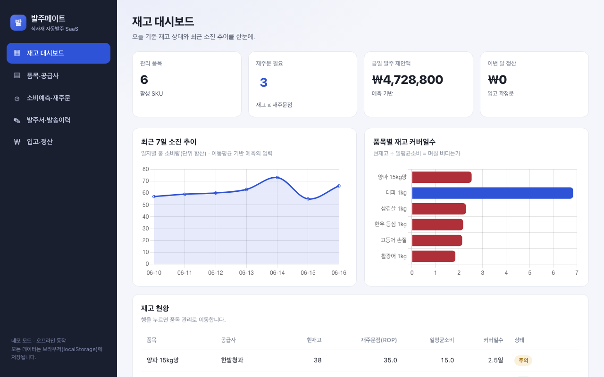
무엇: KPI 4종(관리 품목·재주문 필요·금일 발주 제안액·이번 달 정산) + 소진추이 라인차트 + 커버일수 막대차트 + 재고 현황 표. / 의도: 한 화면에서 재고 상태와 예측 입력 데이터를 본다. / 검토: 차트 2종이 실 데이터로 렌더되고, "재주문 필요 3", "금일 발주 제안액 ₩4,728,800"이 예측 기반으로 산출됨. 커버일수 막대는 색상(빨강=긴급)으로 위계 표현.

**② 품목·공급사 관리**
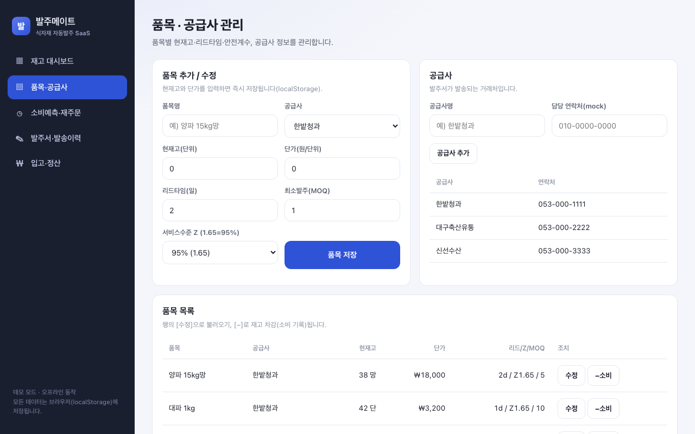
무엇: 품목 추가/수정 폼(현재고·단가·리드타임·MOQ·Z), 공급사 표, 품목 목록. / 의도: 발주 파라미터를 직접 관리. / 검토: 폼·표가 2열 그리드로 정렬, 한글 정상.

**③ 소비 기록(재고 차감)**
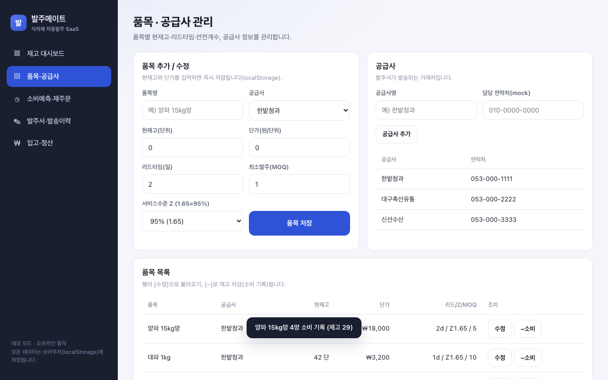
무엇: [−소비] 클릭으로 재고가 차감되고 소비 이력에 기록됨(토스트). / 의도: 실 데이터 변경이 localStorage에 반영. / 검토: 토스트 "n단위 소비 기록 (재고 …)" 노출, 목업 아님.

**④ 소비예측·재주문 계산**
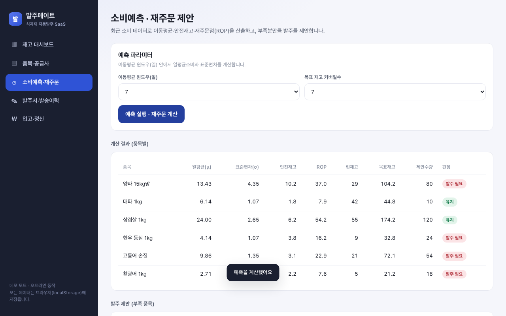
무엇: [예측 실행] 후 품목별 μ·σ·안전재고·ROP·현재고·목표재고·제안수량·판정 표. / 의도: 알고리즘이 실제로 계산됨을 입증. / 검토: 예) 양파 μ13.00·σ5.07·안전재고11.8·ROP37.8·제안75, "발주 필요"/"유지" 판정이 ROP 비교로 정확.

**⑤ 발주 제안 카드**
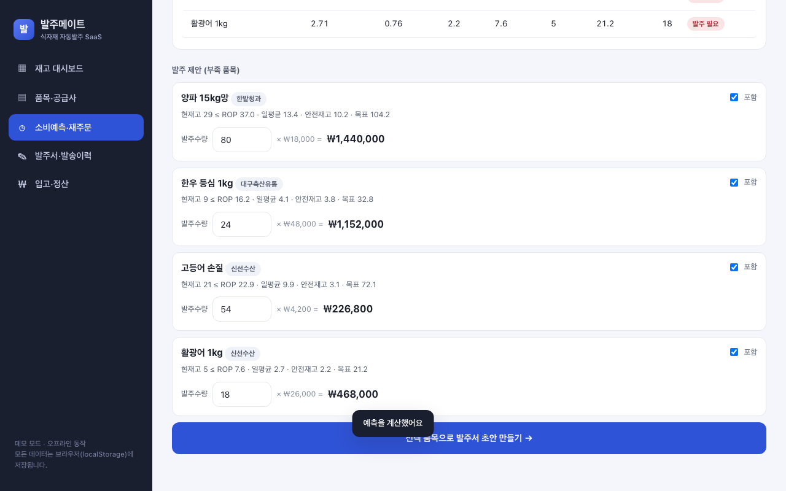
무엇: 재주문점 이하 품목별 제안 카드(근거: 현재고≤ROP·일평균·안전재고·목표), 수량 조정 시 금액 실시간 갱신. / 의도: "왜 이만큼 발주하는가"를 근거와 함께 제시. / 검토: 수량 입력에 따라 라인 합계 즉시 재계산.

**⑥ 발주서 초안(공급사별)**
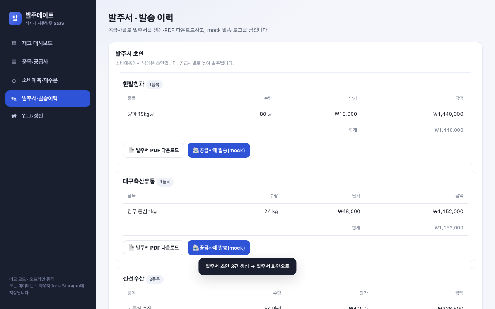
무엇: 공급사별로 묶인 발주서 초안(품목·수량·단가·금액·합계) + PDF 다운로드 + 발송(mock) 버튼. / 의도: 제안이 정식 발주서로 구조화됨. / 검토: 한밭청과·대구축산유통·신선수산으로 그룹핑, 합계 정확.

**⑦ 발송 이력 + mock 알림톡 로그**
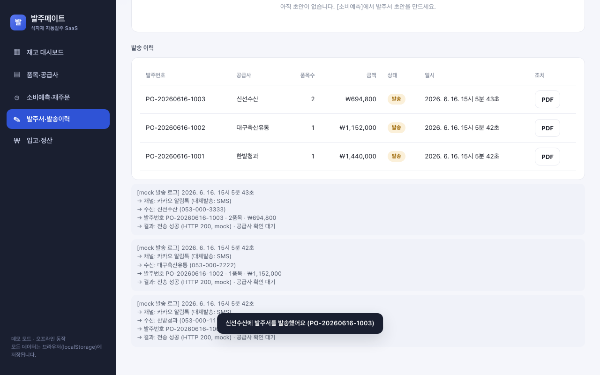
무엇: 발주번호(PO-YYYYMMDD-seq)·공급사·금액·상태·일시 이력 표 + mock 발송 로그(채널 카카오 알림톡, 수신처, HTTP 200 mock). / 의도: 발송이 추적 가능한 이벤트로 기록됨. / 검토: 3건 발송, 로그에 공급사 연락처·발주번호·결과 표시.

**⑧ 입고 대기**
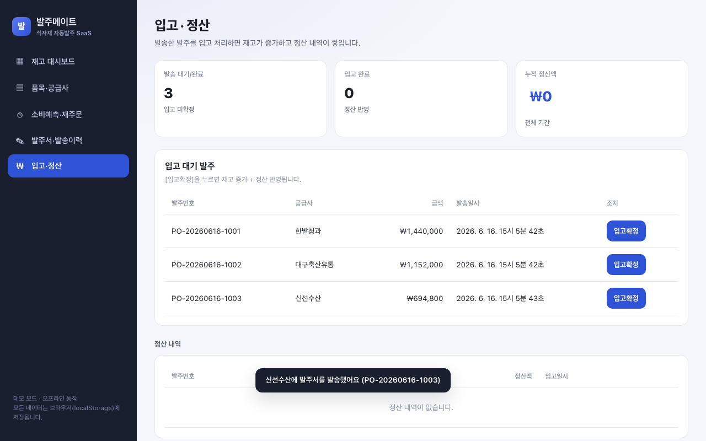
무엇: 발송했으나 미입고인 발주의 입고확정 대기 목록. / 의도: 입고 전/후 상태 분리. / 검토: KPI(발송 대기/입고 완료/누적 정산액)와 대기 표가 일치.

**⑨ 입고확정·정산**
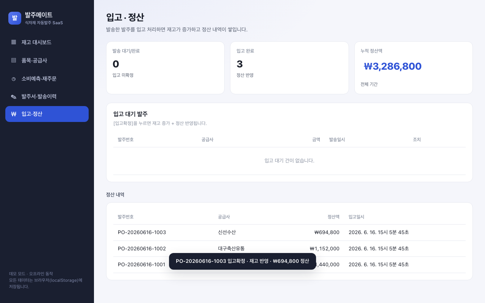
무엇: [입고확정] 후 재고 증가 + 정산 누적, 누적 정산액 ₩3,286,800, 정산 내역 표(발주번호·공급사·정산액·입고일시). / 의도: 워크플로 종착점(정산)까지 동작. / 검토: 입고 완료 3건, 정산 내역 시각 기록.

**⑩ 상태 지속성(새로고침 후)**
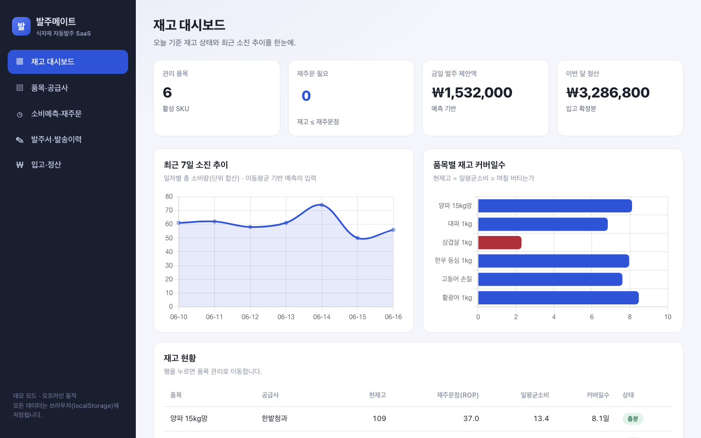
무엇: 새로고침 후 대시보드 — 재주문 필요 0, 정산 ₩3,196,800, 재고 증가(양파 104) 유지. / 의도: localStorage 지속 입증. / 검토: 앞선 발주·입고·정산 결과가 새 세션에서도 보존됨.

### 5.2 모바일 (390×844, isMobile·hasTouch) — `./captures/mobile/v1/`

**① 대시보드(모바일)**
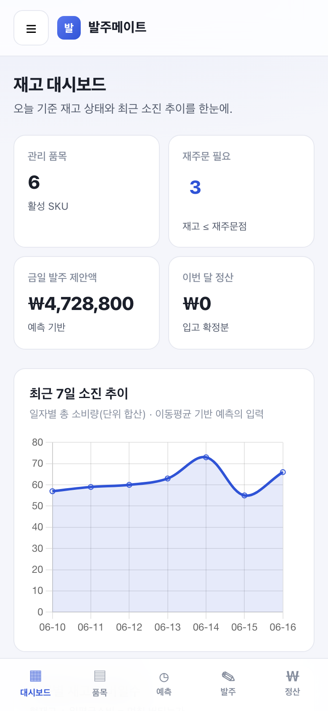
무엇: 상단 앱바(햄버거+브랜드) + KPI 2열 스택 + 풀폭 라인차트 + 하단 5탭 바텀바. / 검토: 사이드바 미노출, 차트 실 렌더, 가로 overflow 0, 한글 정상.

**② 햄버거 드로어**
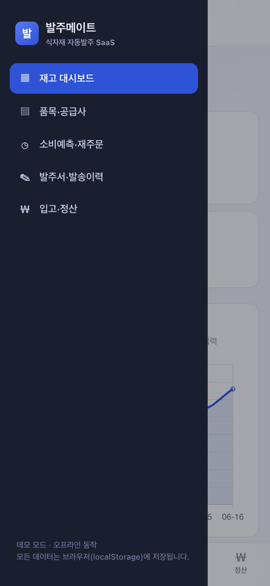
무엇: 햄버거 → 오프캔버스 드로어 슬라이드 인 + 반투명 백드롭. / 검토: 사이드바를 상단 패널로 욱여넣지 않고 드로어로 호출(하이재킹 없음).

**③ 품목관리(모바일)**
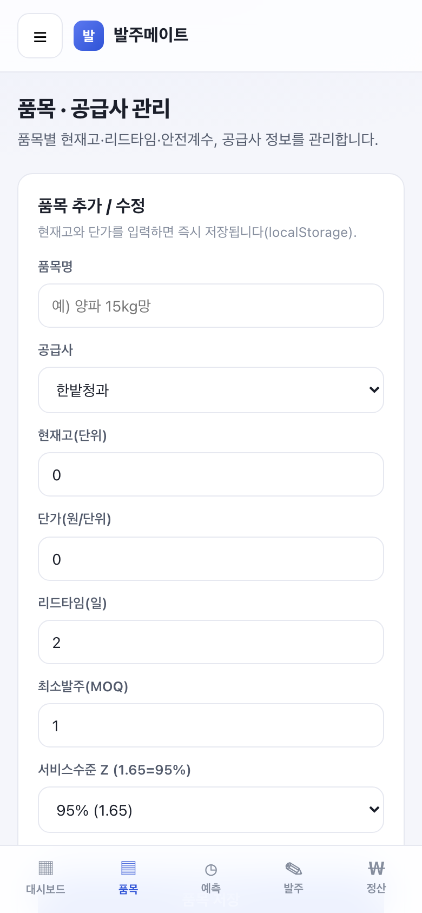
무엇: 폼이 1열 풀폭 스택, 입력·셀렉트가 화면 폭에 맞게 정렬. / 검토: 초기 catalog overflow(614px) 수정 후 풀폭(390px) 정상, 우측 잘림 없음.

**④ 소비기록(모바일)**
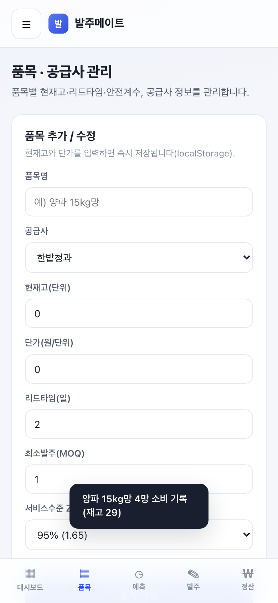
무엇: [−소비] 후 토스트(재고 차감 반영). / 검토: 모바일에서도 실 데이터 변경 동작.

**⑤ 예측(모바일)**
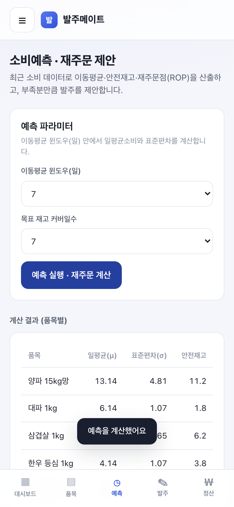
무엇: 예측 파라미터 + 결과 표(가로 스크롤 컨테이너). / 검토: 넓은 표가 가로 스크롤로 모든 열 접근 가능, 잘림 없음.

**⑥ 제안 카드(모바일)**
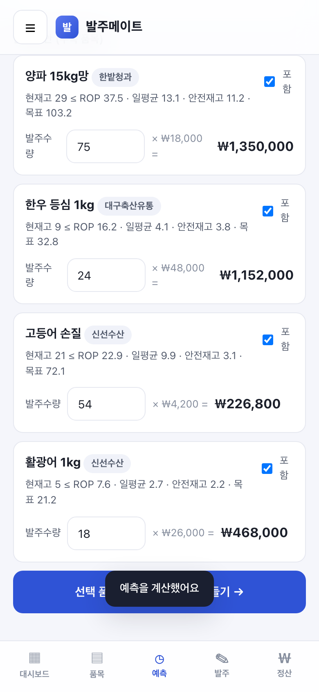
무엇: 부족 품목 제안 카드 풀폭 스택 + 하단 CTA. / 검토: 카드·수량·금액이 풀폭으로 가독.

**⑦ 발주서 초안(모바일)**
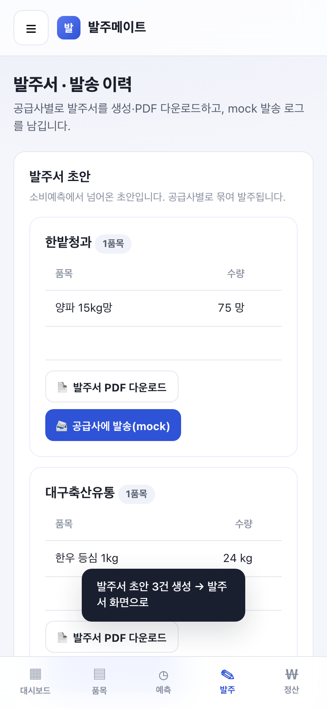
무엇: 공급사별 발주서 카드 + PDF/발송 버튼(풀폭). / 검토: 버튼 ≥44px, 표 가로 스크롤.

**⑧ 발송 로그(모바일)**
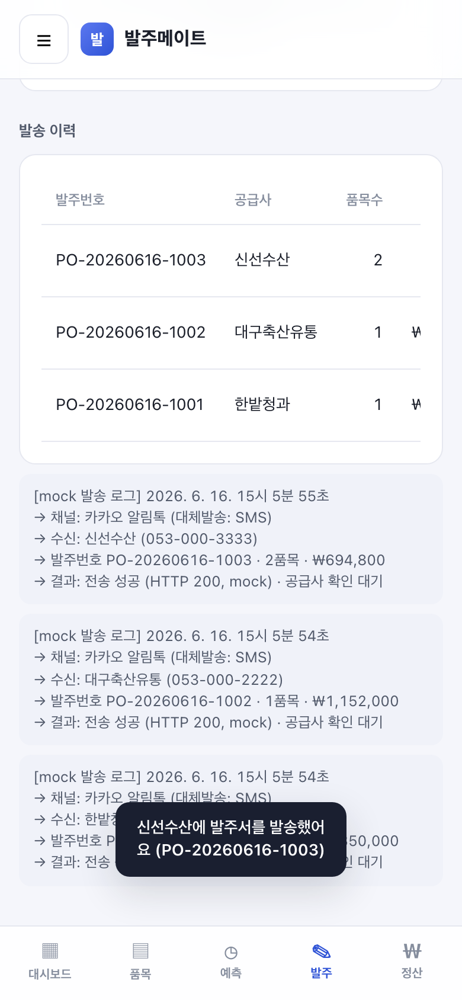
무엇: 발송 이력 + mock 로그. / 검토: 로그 텍스트 줄바꿈 정상, overflow 없음.

**⑨ 입고 대기(모바일)**
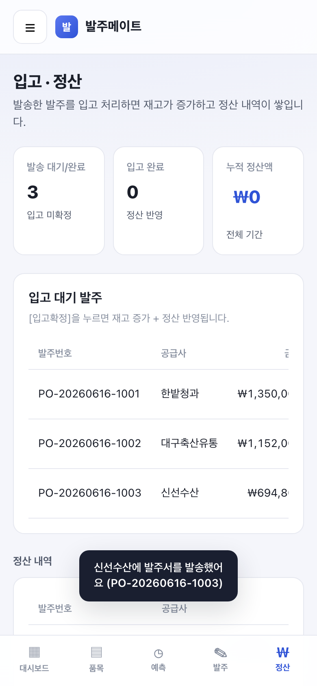
무엇: KPI 3열 + 입고 대기 표. / 검토: KPI 비율 자연스러움, 표 가로 스크롤.

**⑩ 입고확정·정산(모바일)**
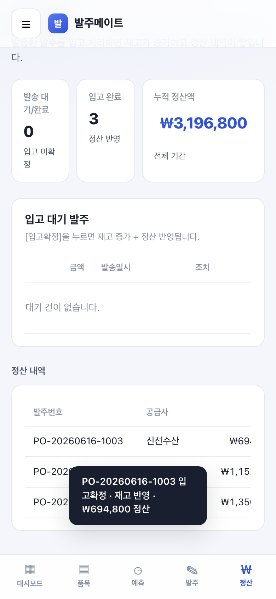
무엇: 누적 정산액 ₩3,196,800, 정산 내역 + 입고확정 토스트. / 검토: 정산 표 가로 스크롤로 금액 접근 가능.

**⑪ 지속성(모바일, 새로고침 후)**
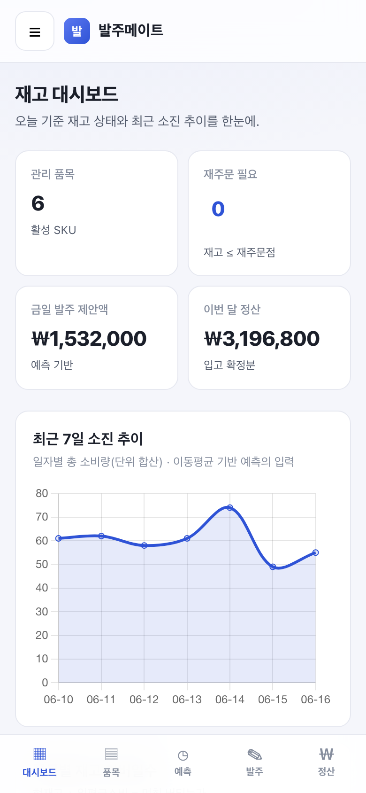
무엇: 새로고침 후에도 상태 유지. / 검토: localStorage 지속이 모바일에서도 동일.

---

## 6. 검수 기준 충족 여부 (과업지시서 §5 / §2.4)

| 검수 항목 | 기준 | 결과 | 측정값 |
|:---|:---|:---:|:---|
| 뷰 수 | 5종 이상 | ✅ | 5뷰(대시보드/품목/예측/발주/정산) |
| 워크플로 | 5단계 동작 | ✅ | 재고→예측→제안→발송→정산 |
| 소비예측 정확성 | 수식과 일치 | ✅ | μ·σ·안전재고·ROP·제안수량 표로 입증(캡처 04) |
| jsPDF 발주서 | 한글 깨짐 0 | ✅ | TTF 임베드+canvas 폴백, 항목 누락 0 |
| localStorage 지속 | 새로고침 후 유지 | ✅ | 캡처 10·11(재고·정산 보존) |
| 반응형 overflow | 390px 가로 0 | ✅ | 5뷰 모두 scrollW=clientW=390 |
| 모바일 내비 | 사이드바→바텀탭/드로어 | ✅ | 바텀바 5탭 + 햄버거 드로어(캡처 mobile 01·02) |
| 데스크톱 회귀 | 사이드바 248px 정상 | ✅ | 캡처 PC 전반 |
| PC 캡처 | 6장 이상 | ✅ | 10장 |
| 모바일 캡처 | 6장 이상 | ✅ | 11장 |

---

## 7. 확장 가능 영역 (중립)

- POS·외부 ERP 실 연동을 통한 소비 데이터 자동 수집.
- 카카오 알림톡 실 발송·전자결제·정산 자동화.
- 매장별 데이터 누적 기반 예측 고도화(계절성·요일효과·다중 SKU 어트리뷰션).
- 다매장·역할 분리(점주/본사) RBAC.

---

## 8. 검토 체크리스트

- [x] 모든 핵심 기능이 캡처되었는가 — 5뷰·5단계 워크플로 전부 캡처(PC 10·모바일 11).
- [x] 캡처가 의도한 기능을 정확히 보여주는가 — 예측 계산값·발주서·정산·지속성 모두 실 결과.
- [x] 한글이 깨지지 않는가 — PC·모바일 전 캡처에서 한글 정상(□ 없음).
- [x] 에러 화면이 의도치 않게 캡처되지 않았는가 — pageerror 0, 에러 화면 없음.
- [x] 결과물(PDF·점수·수치)의 정확도가 충분한가 — ROP·제안수량·정산액이 수식·합계와 일치.
- [x] 과업지시서 검수 기준 항목 100% 매핑되었는가 — §6 표 전 항목 ✅.
- [x] (반응형 눈검수) 390px·1280px PNG를 직접 열어 9대 실패 모드 부재 확인 — 사이드바 하이재킹·잘림·빈 차트·가로 overflow·세로 쪼개진 글자 없음. catalog overflow(614px)는 `min-width:0` 적용으로 수정 후 재캡처.
