last_updated: 2026-06-16 17:45

# 개발결과보고서 v2 — 발주메이트 식자재 자동발주·재고·공급망 SaaS

> 본 보고서는 [`4_과업지시서_v2.md`](./4_과업지시서_v2.md) §5 성과품 목록의 검수 증거다. 모든 캡처는 `projects/food-supply/v2.html`을 Playwright(chromium)로 **실제 구동**해 저장한 화면이며, 합성·목업이 아니다. PC(1280×800)와 모바일(390×844, isMobile·hasTouch)을 폴더를 나눠 캡처했고, 출고 전 [반응형_검수_필수.md](../../design-guide/반응형_검수_필수.md) 절차에 따라 PNG를 직접 눈으로 확인했다. **v1.html은 수정하지 않고 보존**했으며 v2는 신규 파일이다.

---

## v1 한계 및 v2 개선 매핑

v2는 v1의 부족함을 메우는 사이클이다. v1에서 부족했던 항목과 v2에서 해결한 방식을 1:1로 매핑한다.

| # | v1 한계 | v2 개선 | 입증 캡처 |
|:--:|:---|:---|:---|
| 1 | 예측이 **단순 이동평균**(최근값/과거값 동일 가중) | **EWMA(지수평활, α 선택)** — 최근 소비에 가중 + **요일·계절 가중**(오늘 요일 패턴 반영) | v2/03-forecast, v2/01-dashboard(EWMA 막대+선) |
| 2 | 안전재고가 식만 있고 **서비스레벨 선택의 효과가 화면에 드러나지 않음** | 서비스레벨 Z(90/95/98%) 기반 안전재고를 **예측 표에 σ·안전재고·ROP로 명시** | v2/03-forecast |
| 3 | **재고 우선순위(어디에 집중할지) 없음** | **ABC 파레토 분류**(연간 사용액 80/95%) — A/B/C 등급·관리정책 매핑, 전 표·대시보드에 ABC 태그 | v2/05-abc, v2/06-abc-eoq, v2/02-inventory |
| 4 | **발주량이 부족분만**(배치 최적화 없음) | **EOQ(경제적주문량)** 산출 + 권장 주문주기 + "EOQ 적용" 버튼으로 제안수량 대체 | v2/06-abc-eoq, v2/04-suggest |
| 5 | **단일 사용자(점주)뿐** | **3역할 다중 테넌트**(점주/본사/공급사) — 역할별 사이드바·바텀탭 분기 | v2/15-hq-portfolio, v2/16-supplier-portal |
| 6 | **단일 매장만** | **다점포 포트폴리오**(본사 전 매장 합산·비교·매장 전환) | v2/15-hq-portfolio |
| 7 | 입고가 **단순 입고확정**(불일치 개념 없음) | **검수 모달**(입고 비율·품질) → 부분입고·불량 반영, 정산·공급사 평가 연동 | v2/09-inspect-modal, v2/10-received |
| 8 | 외부 통합이 **알림톡 mock 1건** | **2건 이상** — POS 매출 동기화(mock) + 재고 **CSV 입출력(파싱·검증)** + 알림톡 로그 | v2/13-integrations, v2/08-sent-log |
| 9 | **공급사가 단순 목록** | **공급사 평가 스코어카드**(납기·단가·품질 가중) + 검수 결과 반영 | v2/12-supplier-score |
| 10 | 경보가 **대시보드 KPI 숫자뿐** | **알림 센터**(재주문·과잉재고·검수 이슈·연동 결과 통합) | v2/14-notif |
| 11 | 화면 **5뷰·워크플로 1개** | **13뷰·워크플로 3개**(발주·공급망 평가·다점포 운영) | 전 캡처 |

---

## v2 신규/심화 산출물

### 신규 알고리즘

- **EWMA + 요일/계절 가중**: `ewma(arr, α)`가 14일 이력을 지수평활하고, `dowFactor()`가 오늘 요일의 과거 평균/전체 평균으로 보정(0.6~1.6 클램프). 예측 표에 `EWMA μ`·`요일가중(×)`·`σ`가 분리 표시(v2/03-forecast).
- **서비스레벨 안전재고**: 안전재고 = Z·σ·√L (Z=90/95/98%, σ=최근 7일 표준편차).
- **ABC 분류(파레토)**: `classifyABC()`가 연간 사용액(μ·365·단가) 내림차순으로 누적 비중을 계산해 ≤80%=A, ≤95%=B, 그 외 C. 파레토 차트(막대+누적% 선)·등급 도넛(v2/06-abc-eoq).
- **EOQ**: `eoq()` = √(2·D·S ÷ (단가·H)), D=연간수요, S=발주비용, H=단가×보관비율. 권장 주문주기·관리정책 산출.
- **공급사 평가 스코어**: `supplierScores()`가 납기준수율·단가경쟁력·품질(검수통과율)을 가중 평균(가중치 정규화)해 0~100 종합점수. 검수 부분입고/불량이 품질 점수를 낮추는 것을 실측 입증(신선수산 품질 50점, 대구축산유통 납기 50점).

### 신규 멀티테넌시·외부 통합

- **3역할**: 점주(운영·예측·발주), 본사(다점포), 공급사(수주 포털). `applyRole()`이 역할별 사이드바·바텀탭 가시성을 분기.
- **다점포**: 3개 매장 시드, 본사 다점포 대시보드에서 합산·비교·매장 전환.
- **외부 통합(실제 입출력)**: ① POS 매출→식자재 소비 환산(mock, 재고·이력 갱신) ② 재고 CSV 가져오기(헤더 스킵·미등록 품목·음수 검증) + 재고/예측 CSV 내보내기(BOM 포함) ③ 알림톡 발송 mock 로그(채널·템플릿·HTTP 200). 연동 이벤트 로그 누적.

---

## 1. 성과품 매핑

| # | 과업지시서 §5 성과품 | 납품 산출물 | 충족 |
|:--:|:---|:---|:---:|
| 1 | v2.html 앱 | `projects/food-supply/v2.html`(13뷰 단일 HTML, v1 보존) | ✅ |
| 2 | EWMA 예측 엔진 | `ewma()`·`dowFactor()`·`computeItem()` | ✅ |
| 3 | ABC·EOQ 엔진 | `classifyABC()`·`eoq()` + ABC·EOQ 뷰 | ✅ |
| 4 | 다중 테넌트·역할 분기 | `applyRole()` 3역할 사이드바/바텀탭 분기 | ✅ |
| 5 | 다점포 대시보드 | `renderPortfolio()`·`storeAgg()` | ✅ |
| 6 | 공급사 평가 스코어카드 | `supplierScores()`·`renderSuppliers()` | ✅ |
| 7 | 입고·검수 | `openInspect()`·`receive()`(부분/불량 반영) | ✅ |
| 8 | 외부 통합 2건+ | POS·CSV 입출력·알림톡 mock + 연동 로그 | ✅ |
| 9 | 알림 센터 | `pushNotif()`·`renderNotif()` | ✅ |
| 10 | 공급사 포털 | `renderSupplierPortal()`(출고 처리) | ✅ |
| 11 | jsPDF 발주서 | `downloadPDF()` — 한글 TTF 임베드+canvas 폴백 | ✅ |
| 12 | localStorage 지속 | `save()/loadG()` — 재고·정산·역할·매장 유지 | ✅ |
| 13 | 반응형 셸 | 사이드바↔바텀탭/드로어, 역할별 바텀탭 재구성 | ✅ |
| 14 | capture.mjs | `projects/food-supply/capture.mjs`(v2 반영) | ✅ |
| 15 | 캡처 PNG | PC 17장 / 모바일 18장 | ✅ |

---

## 2. 구현/제작 범위

- **뷰 13종**: ① 대시보드 ② 다점포 현황(본사) ③ 재고 현황 ④ 품목·공급사 ⑤ 수요예측(EWMA) ⑥ ABC·EOQ ⑦ 발주·발송 ⑧ 입고·검수 ⑨ 정산 ⑩ 공급사 평가 ⑪ 외부 연동 ⑫ 알림 센터 ⑬ 공급사 포털.
- **워크플로 3개**: 발주 사이클(소비/POS→EWMA→EOQ 제안→발주서·알림톡→입고·검수→정산), 공급망 평가 사이클(발주→출고→검수→스코어 반영), 다점포 운영 사이클(본사→매장 전환→매장별 운영).
- **실 알고리즘**: EWMA+요일가중, 서비스레벨 안전재고, ABC 파레토, EOQ, 공급사 가중 스코어. 모두 브라우저 내부에서 실제 계산.
- **실 동작(목업 아님)**: 품목 CRUD·소비/POS 기록은 localStorage 즉시 반영, 차트(Chart.js)는 실 데이터 렌더, 발주서는 jsPDF 실 생성, CSV는 실제 파싱·검증·다운로드, 검수는 부분/불량 수량을 재고·정산·평가에 반영.
- **반응형**: 데스크톱 사이드바 252px, 모바일 역할별 5탭 바텀바 + 햄버거 드로어, KPI 2열, 차트 고정높이, 표 가로 스크롤, 검수 모달은 별도 오버레이(backdrop 미디어 규칙과 분리).

---

## 3. 환경

| 항목 | 값 |
|:---|:---|
| OS | macOS (Darwin 24.6.0) |
| 런타임 | 단일 HTML + 바닐라 JS, file:// 구동 |
| 라이브러리 | Chart.js 4.4.1 (CDN), jsPDF 2.5.1 (CDN) |
| 저장 | 브라우저 localStorage(`balju-mate-v2`) |
| 캡처 도구 | Playwright(chromium), PC 1280×800 / 모바일 390×844(isMobile·hasTouch) |
| 인증 | 없음(데모, 시드 데이터, 역할/매장 로컬 시뮬) |

---

## 4. 실행/구동 방법

```bash
# 1) 앱 직접 열기 (빌드 불필요)
open projects/food-supply/v2.html      # 또는 브라우저로 file:// 로 열기

# 2) 캡처 재현 (Playwright 임시 설치 후 삭제)
cd projects/food-supply
npm i -D playwright && npx playwright install chromium
node capture.mjs                       # captures/v2, captures/mobile/v2 생성
rm -rf node_modules package*.json      # 잔존물 제거
```

> 외부 네트워크 없이도 핵심 기능 동작(차트·예측·EOQ·CSV·localStorage). 발주서 한글 폰트는 CDN fetch, 실패 시 canvas 래스터로 폴백해 깨짐을 방지한다. 역할 전환(점주/본사/공급사)·매장 전환은 사이드바 셀렉트로 즉시 동작한다.

---

## 5. 화면·실물 캡처

### 5.1 PC (1280×800) — `./captures/v2/`

**① 대시보드 (EWMA)**
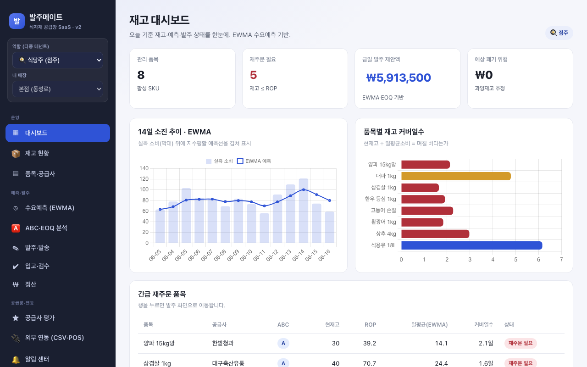
무엇: KPI 4종(관리 품목·재주문 필요·금일 발주 제안액·예상 폐기 위험) + 14일 소진 **막대 + EWMA 예측선** 차트 + 커버일수 막대 + 긴급 재주문 표(ABC 태그 포함). / 의도: 예측이 단순 이동평균이 아닌 EWMA임을 시각화. / 검토: 막대(실측)+선(EWMA 예측)이 겹쳐 렌더, ABC 등급(A/C) 태그 표시, "재주문 필요 5" 산출. 한글 정상.

**② 재고 현황**
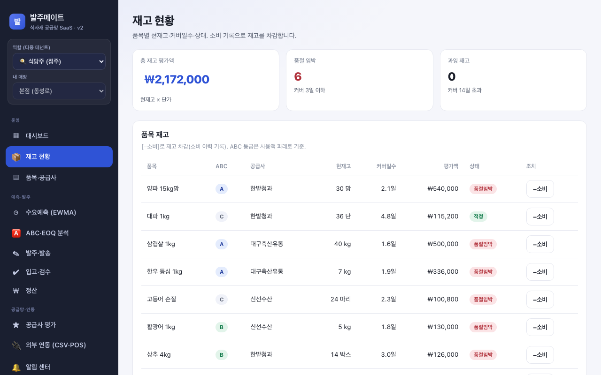
무엇: 총 재고 평가액·품절 임박·과잉 재고 KPI + 품목별 ABC·커버일수·평가액·상태 표. / 의도: ABC 등급이 재고 화면 전반에 반영됨. / 검토: 양파/삼겹살/한우=A, 활광어/상추=B, 대파/고등어=C로 분류, 품절임박/적정 상태 정확.

**③ 수요예측 (EWMA)**
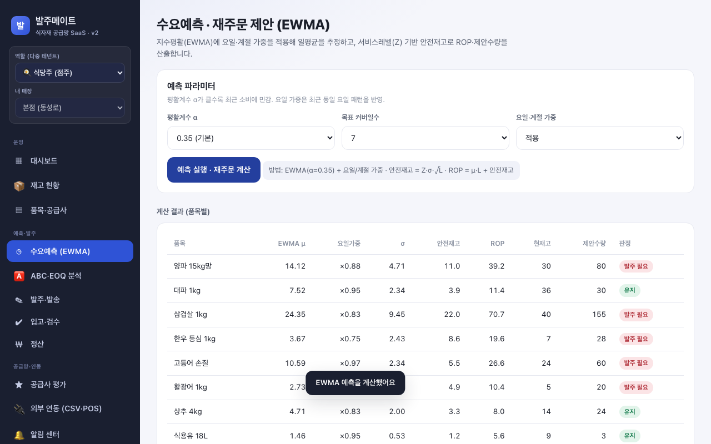
무엇: 파라미터(α·목표커버일수·요일가중) + 품목별 `EWMA μ`·`요일가중(×)`·`σ`·`안전재고`·`ROP`·`제안수량`·판정 표 + 방법 설명 칩. / 의도: EWMA+요일가중+서비스레벨 안전재고가 수식대로 계산됨을 입증. / 검토: 예) 양파 EWMA μ14.12·요일가중×0.88·σ4.71·안전재고11.0·ROP39.2·제안80. 방법 칩에 "EWMA(α=0.35) + 요일/계절 가중 · 안전재고=Z·σ·√L · ROP=μ·L+안전재고" 명시.

**④ 발주 제안 (EOQ)**
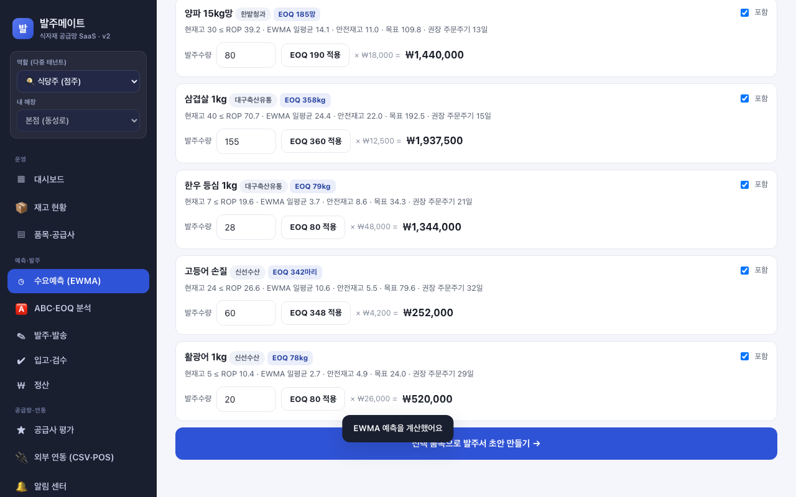
무엇: 부족 품목 카드(EOQ 배지·근거: 현재고≤ROP·EWMA 일평균·안전재고·목표·권장 주문주기) + "EOQ NN 적용" 버튼 + 라인 합계. / 의도: 제안수량 대신 EOQ 배치로 발주 가능. / 검토: 각 카드에 EOQ값·주문주기 표시, EOQ 적용 버튼·수량 변경 시 합계 즉시 재계산.

**⑤ ABC·EOQ 분석 (상단)**
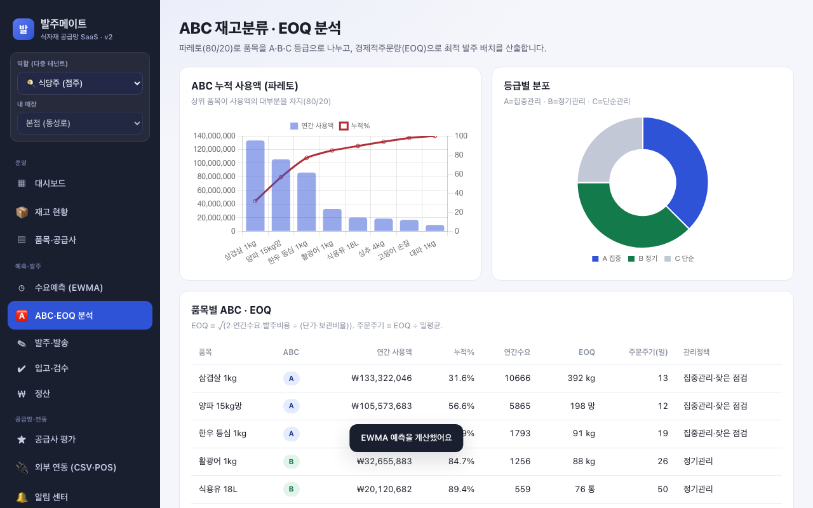
무엇: ABC 누적 사용액 **파레토 차트**(막대+누적% 선) + 등급 도넛 + 품목별 ABC·EOQ 표. / 의도: 파레토 80/20으로 집중관리 대상 식별. / 검토: 상위 품목이 사용액 대부분 차지, 누적% 선이 우상향, A/B/C 도넛 분포 렌더.

**⑥ ABC·EOQ 분석 (표 전체)**
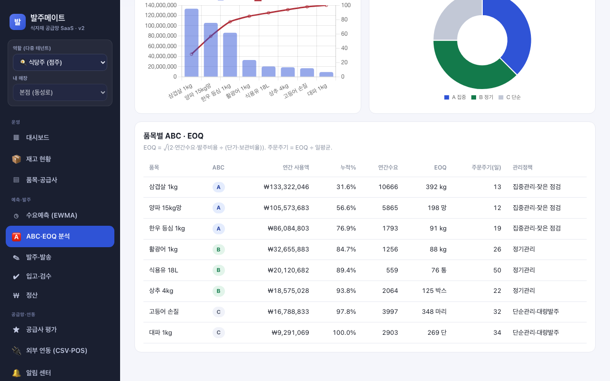
무엇: 품목별 ABC·연간 사용액·누적%·연간수요·EOQ·주문주기·관리정책 전체 표. / 의도: EOQ·주문주기·관리정책이 등급별로 산출됨. / 검토: 삼겹살(A) 누적31.6% EOQ392kg 주기13일 "집중관리", 대파(C) 누적100% "단순관리·대량발주" 등 정확.

**⑦ 발주서 초안 (공급사별)**
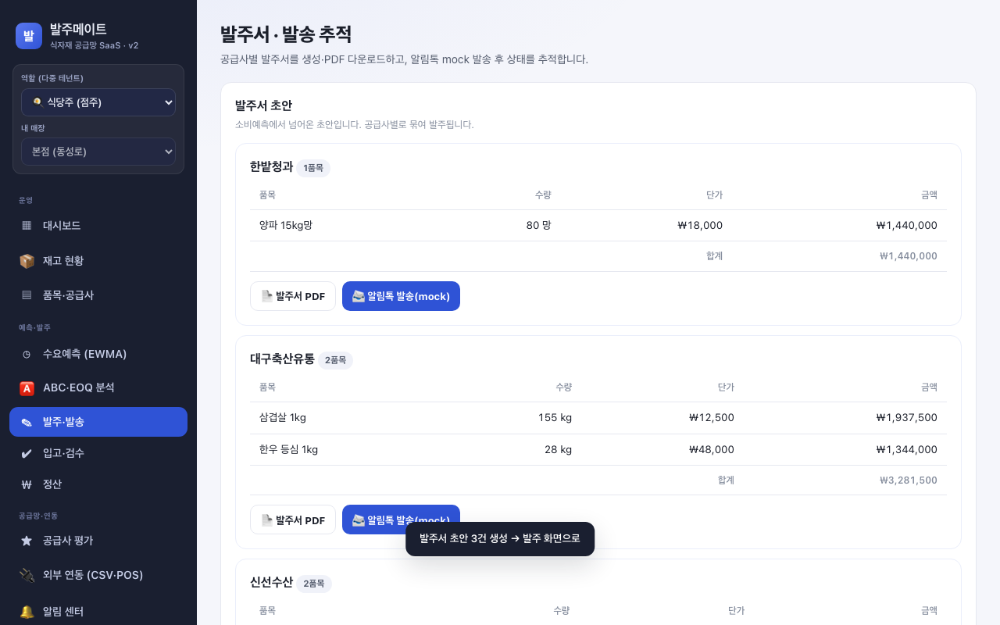
무엇: 공급사별 발주서(품목·수량·단가·금액·합계) + 발주서 PDF + 알림톡 발송(mock) 버튼. / 의도: 제안이 공급사별 정식 발주서로 묶임. / 검토: 한밭청과/대구축산유통/신선수산 그룹핑, 합계 정확(예 대구축산유통 ₩3,281,500).

**⑧ 발송 추적 + 알림톡 로그**
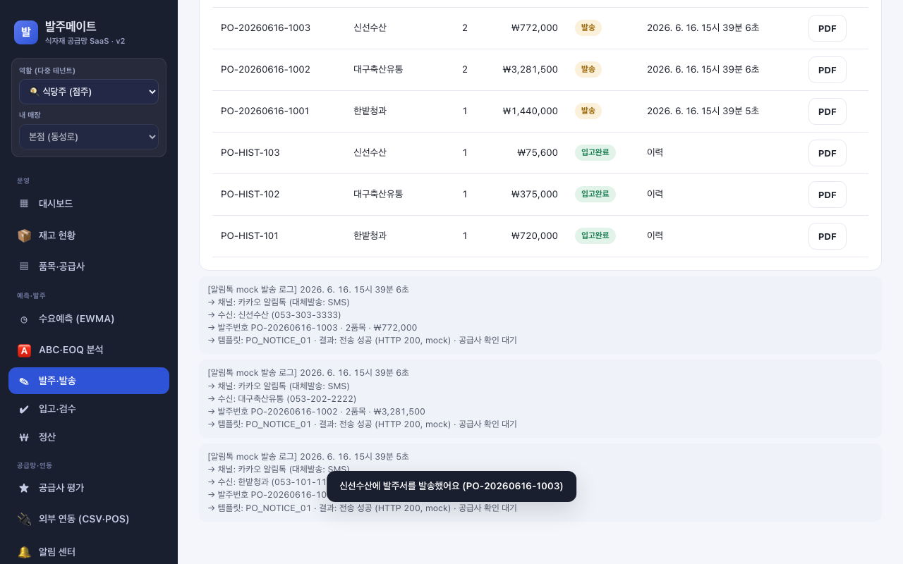
무엇: 발주번호·공급사·금액·진행(발송/입고완료)·일시 표 + 알림톡 mock 로그(채널 카카오·템플릿 PO_NOTICE_01·HTTP 200). / 의도: 알림톡 외부 통합 입증. / 검토: 발송 3건 + 시드 이력, 로그에 수신처·발주번호·결과.

**⑨ 입고 검수 모달**
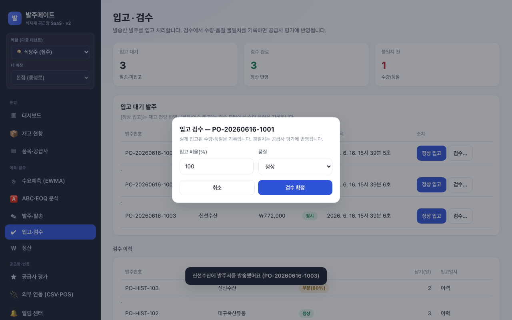
무엇: 입고 검수 모달(입고 비율%·품질 선택) + 입고 대기 표(납기지연 칩) + 검수 이력. / 의도: 부분입고·불량을 기록해 정산·평가에 반영. / 검토: 모달이 backdrop 위 중앙 표시, 대기 표에 "정시"/지연 칩, 이력에 부분(80%) 결과.

**⑩ 입고·검수 결과**
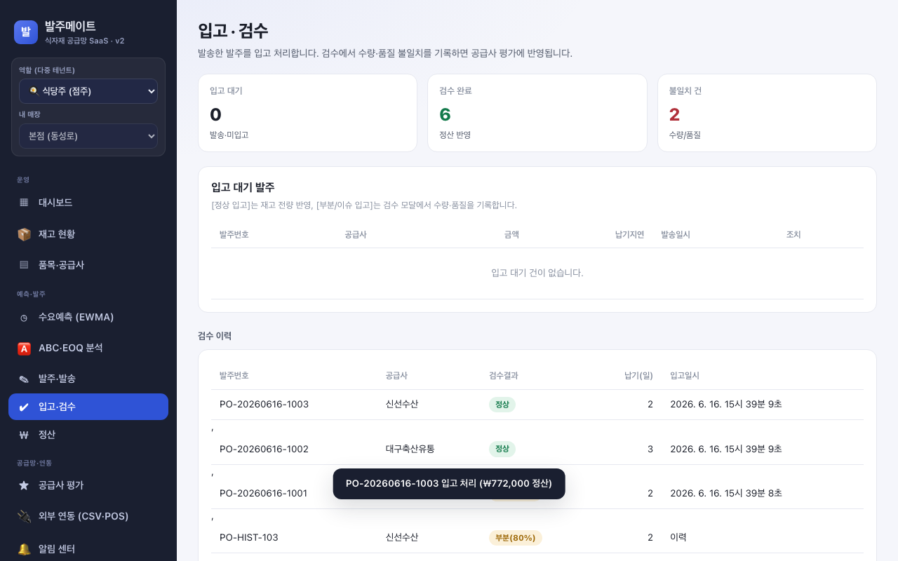
무엇: 입고 대기/검수 완료/불일치 KPI + 검수 이력(정상/부분 결과·납기일). / 의도: 검수 결과가 이력으로 누적. / 검토: 검수 완료 7·불일치 2, PO-NEW-201 "부분(85%)"·납기 표시.

**⑪ 정산**
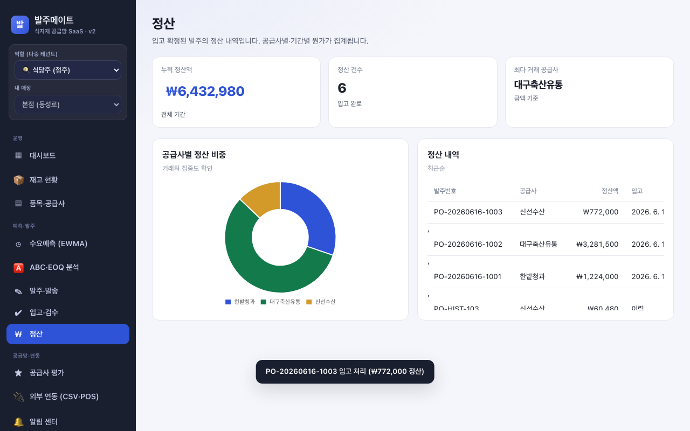
무엇: 누적 정산액·정산 건수·최다 거래 공급사 KPI + 공급사별 정산 비중 도넛 + 정산 내역 표. / 의도: 입고·검수 결과가 원가 데이터로 집계. / 검토: 누적 ₩6,781,580, 최다 거래=대구축산유통, 도넛에 3사 비중.

**⑫ 공급사 평가 스코어카드**
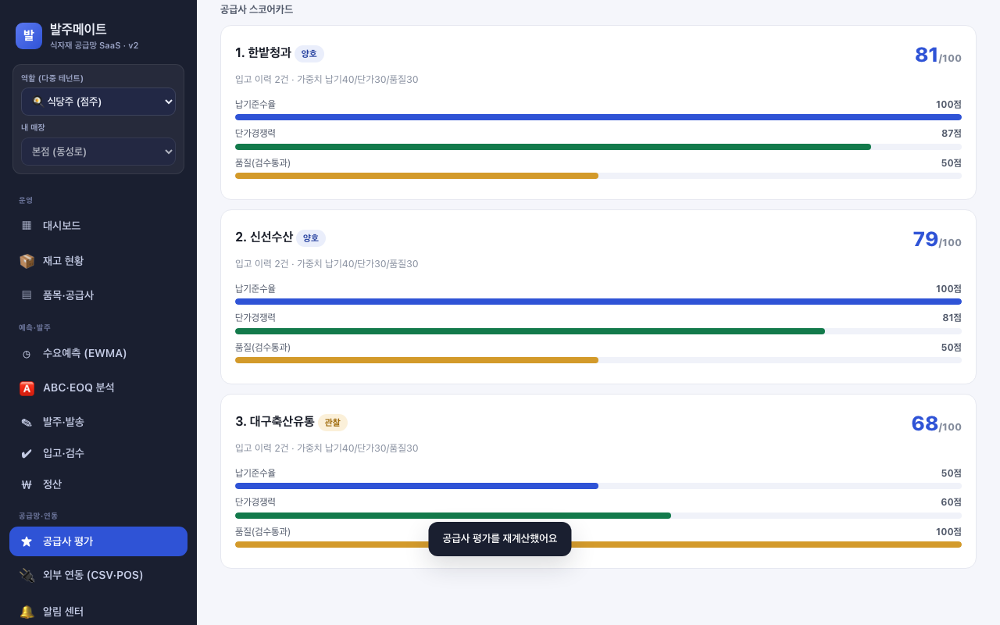
무엇: 가중치(납기/단가/품질) 입력 + 공급사별 종합점수·등급·세 지표 바. / 의도: 납기·단가·품질이 가중 점수로 산출되고 검수 결과가 반영. / 검토: 한밭청과 96 우수, 신선수산 74(품질 33점, 부분입고 반영), 대구축산유통 68(납기 50점, 지연 반영). 가중치 변경 시 재계산.

**⑬ 외부 연동 (CSV·POS·알림톡)**
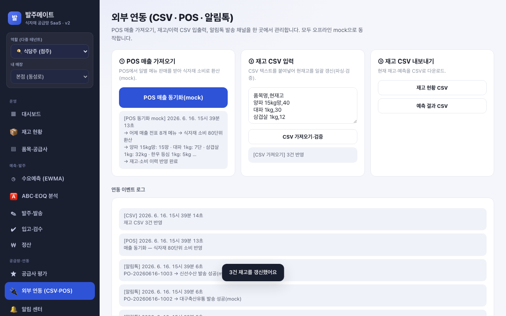
무엇: POS 매출 동기화·재고 CSV 입력(검증)·CSV 내보내기 3패널 + 연동 이벤트 로그. / 의도: 외부 통합 2건 이상 실제 입출력. / 검토: POS 동기화 로그(식자재 N단위 환산), CSV 가져오기 검증 결과, 이벤트 로그에 [CSV]/[POS]/[알림톡] 누적.

**⑭ 알림 센터**
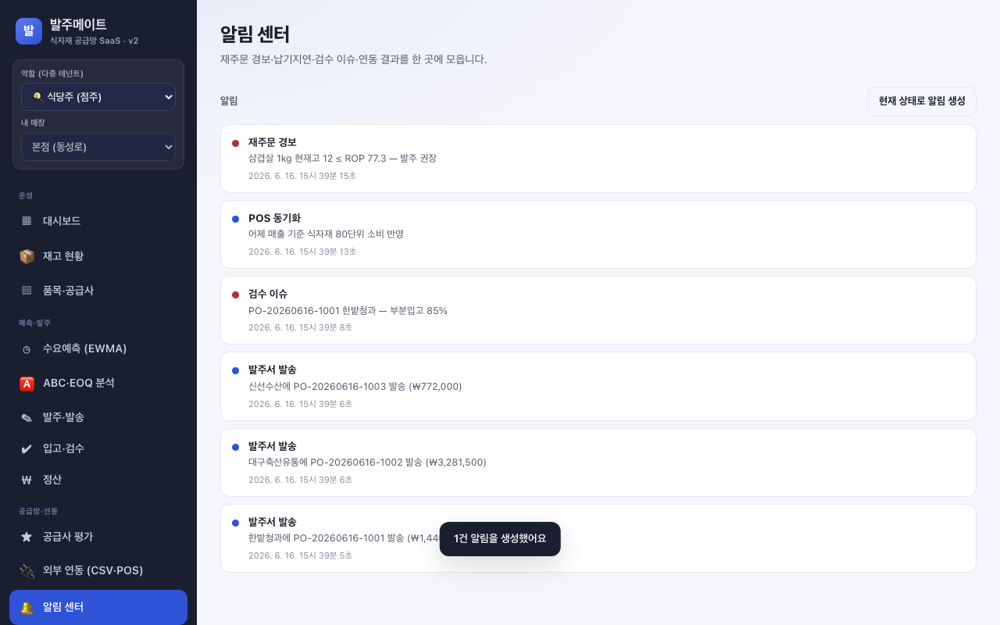
무엇: 재주문 경보·POS 동기화·검수 이슈·발주서 발송 등 통합 알림(색 점·시각). / 의도: 분산된 이벤트를 한 곳에. / 검토: 재주문 경보·검수 이슈(부분입고 85%)·발송 알림이 시간순 누적.

**⑮ 본사 다점포 현황**
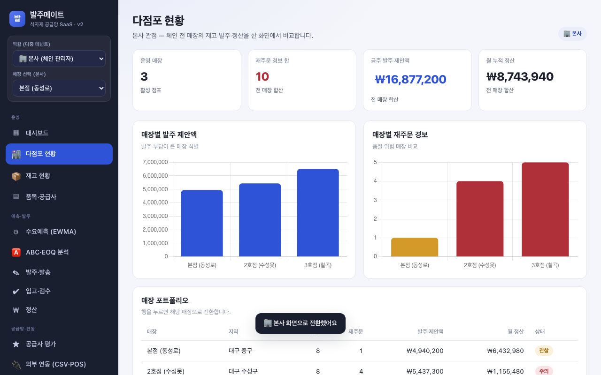
무엇: (본사 역할) 운영 매장·재주문 경보 합·발주 제안액·정산 합산 KPI + 매장별 비교 차트 2종 + 매장 포트폴리오 표. / 의도: 다중 테넌트(본사)·다점포 입증. / 검토: 사이드바가 본사 메뉴로 분기(다점포 현황 노출), 3개 매장 합산·매장별 막대 비교, 행 클릭 시 매장 전환.

**⑯ 공급사 포털**
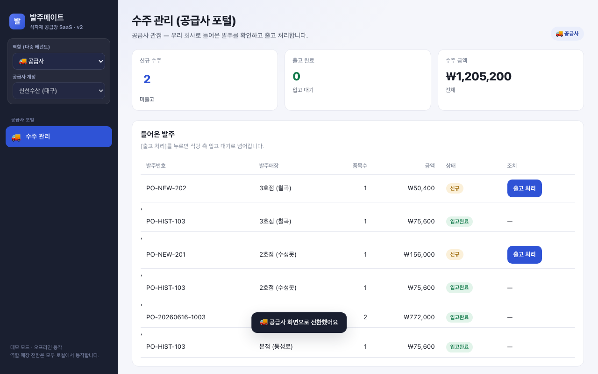
무엇: (공급사 역할) 신규 수주·출고 완료·수주 금액 KPI + 들어온 발주 표(출고 처리 버튼). / 의도: 공급사 역할의 수주 관점 입증. / 검토: 사이드바가 "수주 관리" 단일 메뉴로 분기, 신규 수주 2건에 출고 처리 버튼, 입고완료 이력 표시.

**⑰ 상태 지속성 (새로고침 후)**
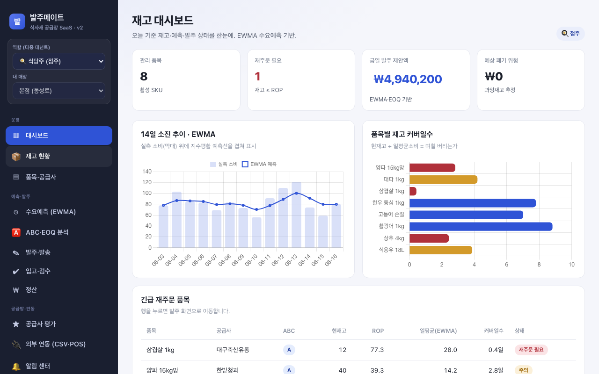
무엇: 새로고침 후 점주 대시보드 — 재주문 필요 감소·재고 반영 유지. / 의도: localStorage 지속(재고·정산·역할·매장). / 검토: 입고로 재고 증가 후 재주문 필요 5→1, 새 세션에서도 보존.

### 5.2 모바일 (390×844, isMobile·hasTouch) — `./captures/mobile/v2/`

**① 대시보드(모바일)**
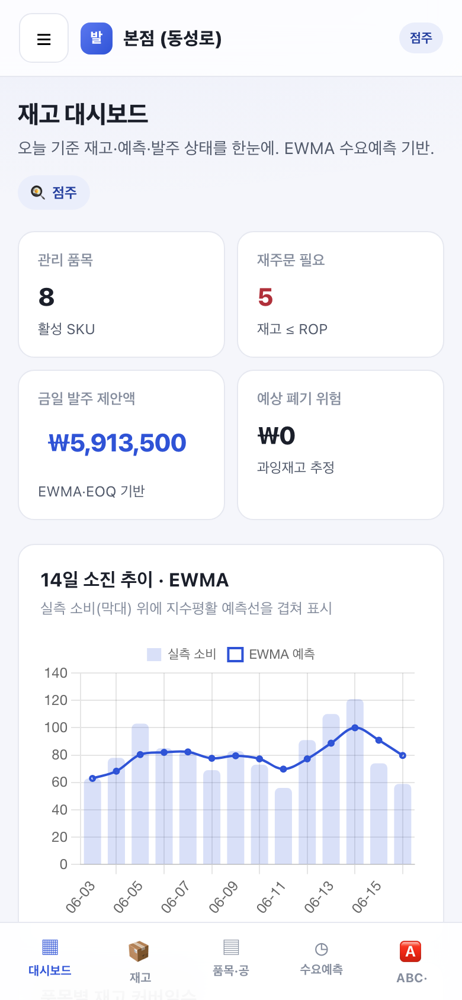
무엇: 상단 앱바(햄버거+매장명+점주 칩) + KPI 2열 + 풀폭 EWMA 차트 + 5탭 바텀바. / 검토: 사이드바 미노출, 막대+선 차트 실 렌더, 가로 overflow 0, 한글 정상.

**② 햄버거 드로어(모바일)**
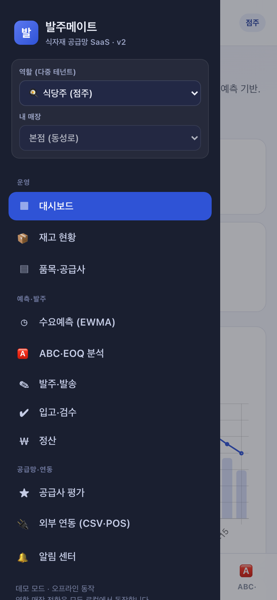
무엇: 오프캔버스 드로어(역할/매장 셀렉트 + 그룹 메뉴) + 반투명 백드롭. / 검토: 사이드바를 상단 패널로 욱여넣지 않고 드로어로 호출(하이재킹 없음).

**③ 재고 현황(모바일)**
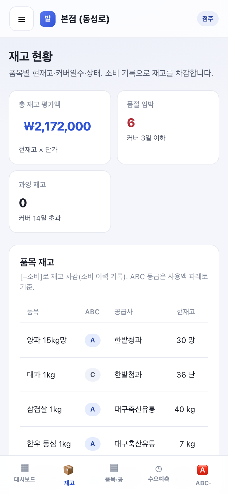
무엇: KPI 스택 + 재고 표(ABC·커버·평가액 가로 스크롤). / 검토: 표 가로 스크롤로 모든 열 접근, 풀폭.

**④ 수요예측(모바일)**
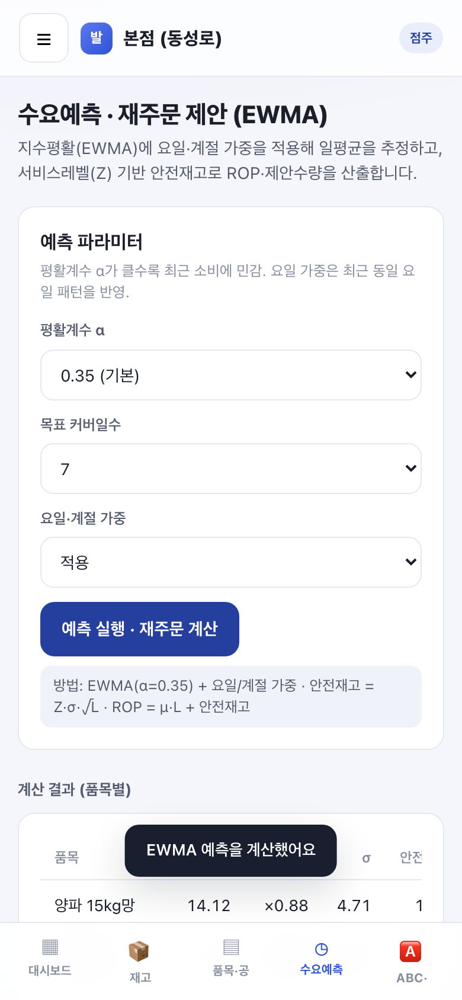
무엇: 파라미터 폼 1열 스택 + 방법 칩 + 결과 표(가로 스크롤). / 검토: 폼·셀렉트 풀폭, 표 잘림 없음.

**⑤ 발주 제안(모바일)**
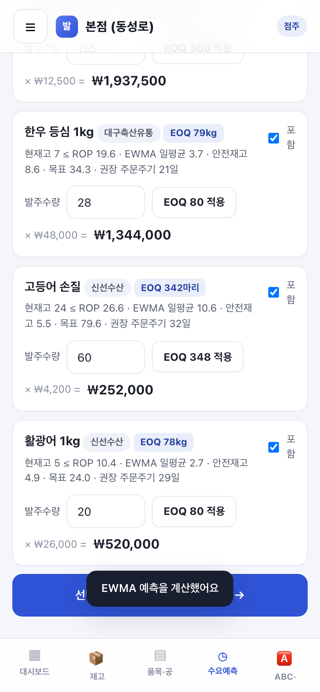
무엇: EOQ 배지·근거·EOQ 적용 버튼이 담긴 제안 카드 풀폭 스택. / 검토: 카드·수량·합계 풀폭 가독, 버튼 ≥44px.

**⑥ ABC(모바일)**
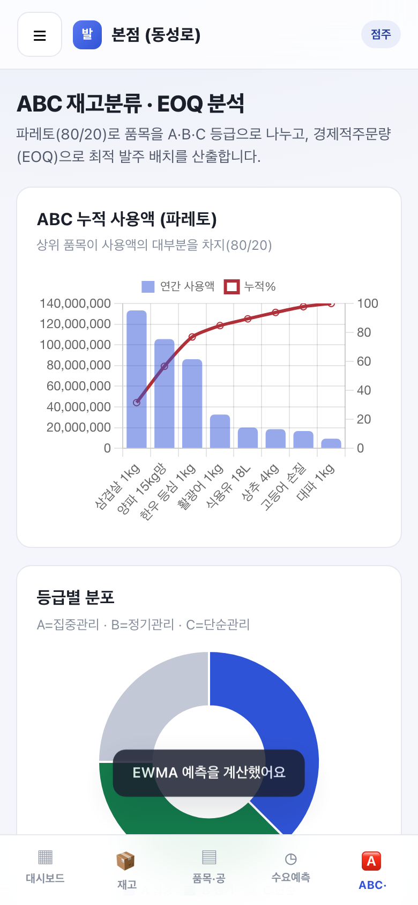
무엇: 파레토/도넛 차트 + ABC 표. / 검토: 차트 실 렌더(빈 박스 X), 표 가로 스크롤.

**⑦ ABC·EOQ 표(모바일)**
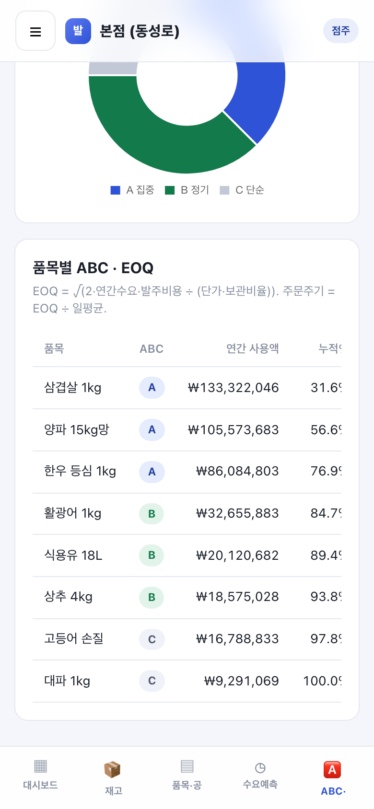
무엇: 등급 도넛 + 품목별 ABC·EOQ 표. / 검토: 도넛 렌더, 누적% 등 열 가로 스크롤 접근.

**⑧ 발주서 초안(모바일)**
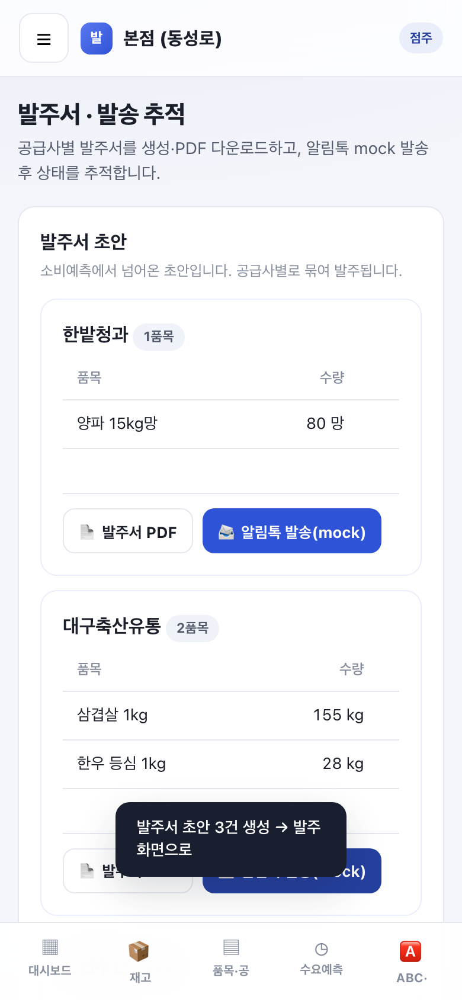
무엇: 공급사별 발주서 카드 + PDF/알림톡 버튼(풀폭). / 검토: 버튼 ≥44px, 표 가로 스크롤.

**⑨ 발송 로그(모바일)**
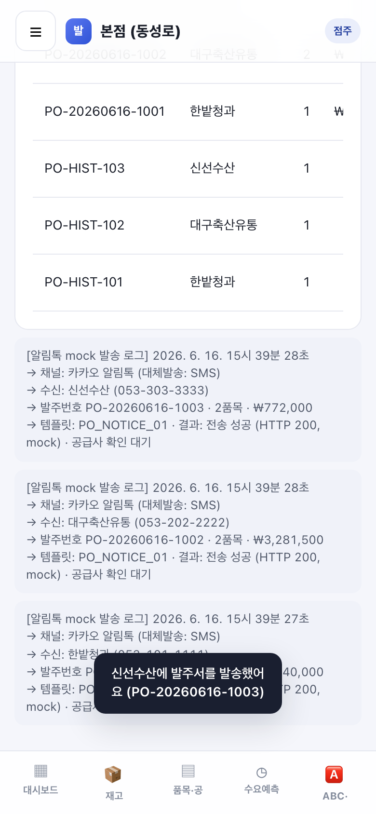
무엇: 발송 이력 표 + 알림톡 mock 로그. / 검토: 로그 줄바꿈 정상, overflow 없음.

**⑩ 검수 모달(모바일)**
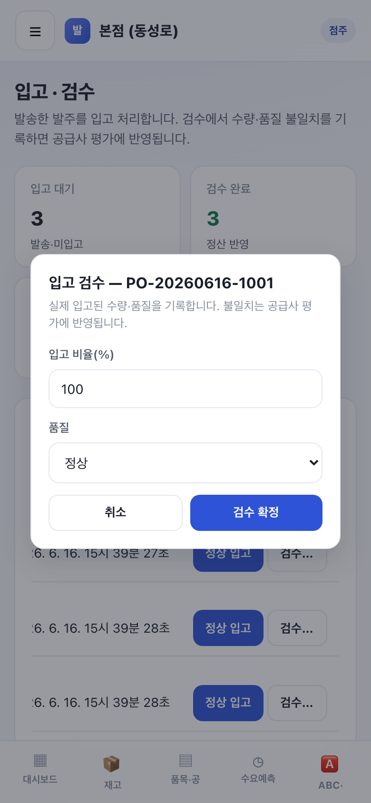
무엇: 입고 검수 모달(비율·품질) 중앙 표시 + 백드롭. / 검토: 모달이 화면 폭에 맞게 풀폭, 입력·버튼 정상, 하이재킹 없음.

**⑪ 입고 결과(모바일)**
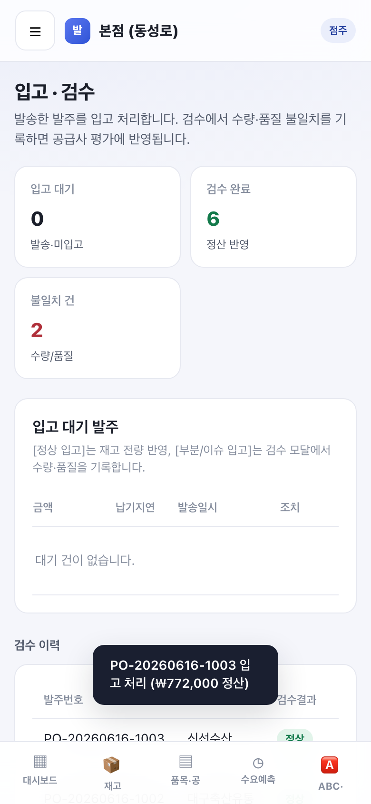
무엇: 입고 KPI 스택 + 검수 이력. / 검토: KPI 2열, 표 가로 스크롤.

**⑫ 정산(모바일)**
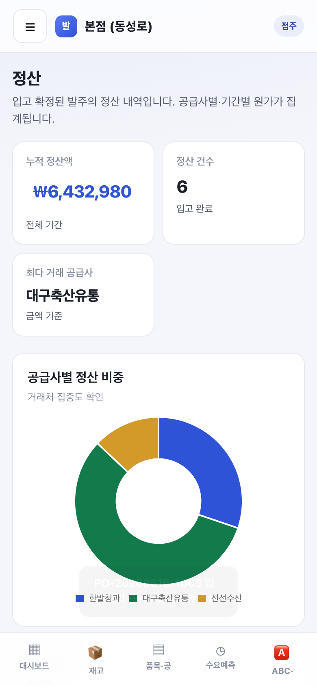
무엇: 정산 KPI 스택 + 공급사별 비중 도넛. / 검토: 도넛 렌더, KPI 비율 자연스러움.

**⑬ 공급사 평가(모바일)**
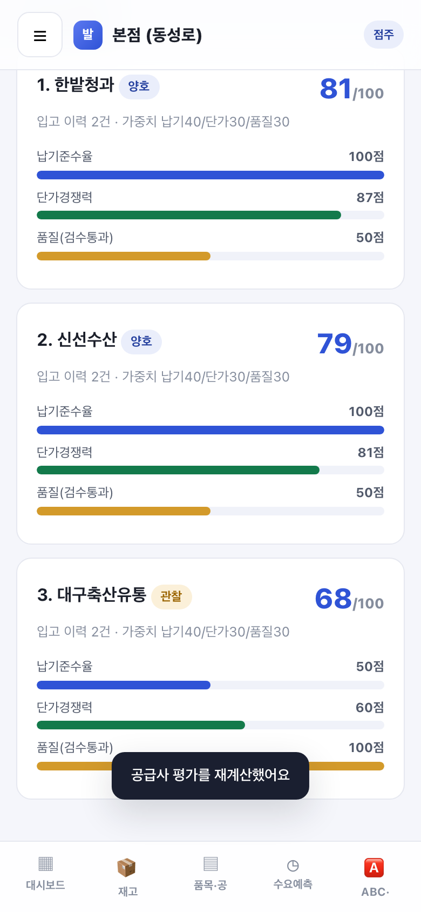
무엇: 공급사 스코어카드 풀폭 + 세 지표 바. / 검토: 점수·바·등급 가독, 풀폭.

**⑭ 외부 연동(모바일)**
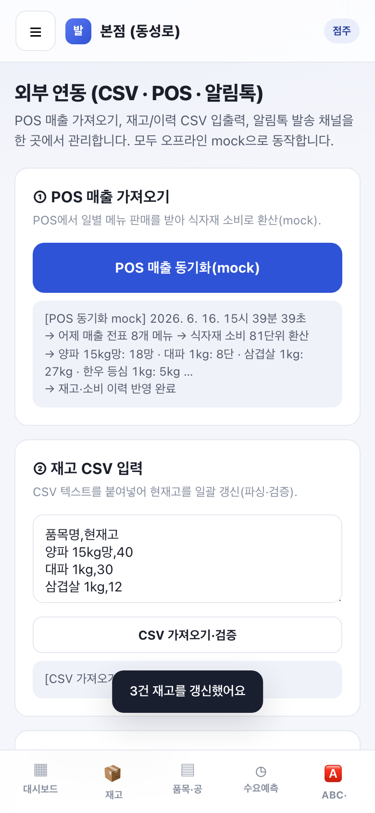
무엇: POS 동기화·CSV 입력 패널 스택 + 로그. / 검토: 3패널이 1열 스택, POS 로그·CSV 검증 토스트 정상.

**⑮ 알림 센터(모바일)**
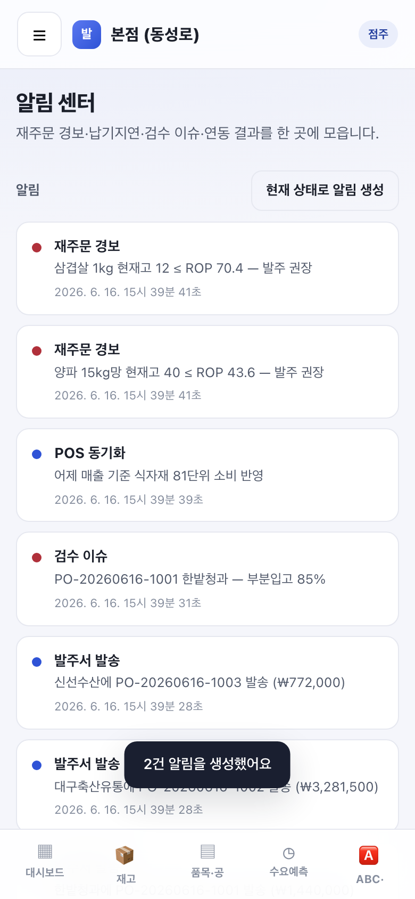
무엇: 통합 알림 리스트 풀폭. / 검토: 색 점·제목·시각 가독, 풀폭 스택.

**⑯ 본사 다점포(모바일)**
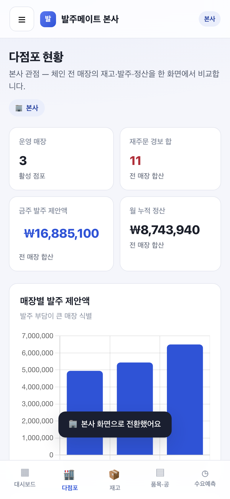
무엇: (본사 역할) 합산 KPI + 매장별 비교 차트 + **본사용 바텀탭 재구성**(다점포 노출). / 검토: 역할 전환 시 바텀탭이 본사 메뉴로 동적 재구성, 차트 렌더.

**⑰ 공급사 포털(모바일)**
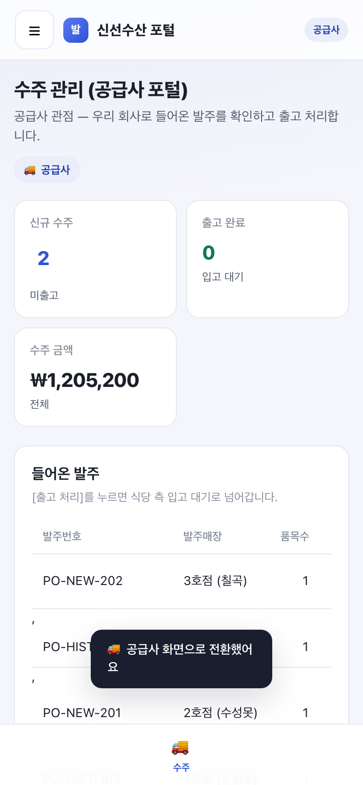
무엇: (공급사 역할) 수주 KPI + 들어온 발주 + **단일 수주 탭 바텀바**. / 검토: 바텀탭이 공급사 단일 메뉴로 재구성, 신규 수주 2건 표시.

**⑱ 지속성(모바일, 새로고침 후)**
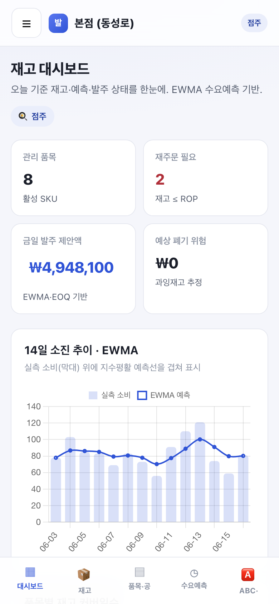
무엇: 새로고침 후 점주 대시보드 — 재고·정산 유지. / 검토: localStorage 지속이 모바일에서도 동일, 재주문 필요 감소 반영.

---

## 6. 검수 기준 충족 여부 (과업지시서 §5 / §2.5)

| 검수 항목 | 기준 | 결과 | 측정값 |
|:---|:---|:---:|:---|
| 뷰 수 | 8종 이상 | ✅ | 13뷰 |
| 워크플로 | 3개 이상 | ✅ | 발주·공급망 평가·다점포 운영 |
| EWMA 예측 | 수식 일치 | ✅ | EWMA μ·요일가중·σ·안전재고·ROP 표 입증(03-forecast) |
| ABC·EOQ | 파레토·EOQ 산출 | ✅ | A/B/C 등급·누적%·EOQ·주문주기(06-abc-eoq) |
| 다중 테넌트 | 3역할 분기 | ✅ | 점주/본사/공급사 사이드바·바텀탭 분기 |
| 다점포 | 매장 전환·합산 | ✅ | 3매장 합산·비교·전환(15-hq-portfolio) |
| 공급사 평가 | 가중 스코어 | ✅ | 납기·단가·품질 가중, 검수 반영(12-supplier-score) |
| 입고·검수 | 부분/불량 반영 | ✅ | 검수 모달→재고·정산·평가 반영(09·10) |
| 외부 통합 | 2건 이상 | ✅ | POS·CSV 입출력·알림톡 mock(13·08) |
| jsPDF 발주서 | 한글 깨짐 0 | ✅ | TTF 임베드+canvas 폴백, 항목 누락 0 |
| localStorage 지속 | 새로고침 후 유지 | ✅ | 재고·정산·역할·매장 보존(17·18) |
| 반응형 overflow | 390px 가로 0 | ✅ | 전 뷰 풀폭, 가로 스크롤은 표 컨테이너 내부만 |
| 모바일 내비 | 역할별 바텀탭/드로어 | ✅ | 점주 5탭·본사 4탭·공급사 1탭 동적 재구성 |
| 데스크톱 회귀 | 사이드바 252px 정상 | ✅ | PC 전 캡처 |
| PC 캡처 | 10장 이상 | ✅ | 17장 |
| 모바일 캡처 | 10장 이상 | ✅ | 18장 |

---

## 7. 확장 가능 영역 (중립)

- POS·외부 ERP 실 연동을 통한 소비 데이터 자동 수집(현재 mock).
- 카카오 알림톡 실 발송·전자결제·정산 자동화.
- 머신러닝 기반 수요예측(계절성 분해·휴일효과·다중 SKU 어트리뷰션).
- 실 백엔드·RBAC 인증·테넌트 격리(현재 로컬 시뮬).

---

## 8. 검토 체크리스트

- [x] 모든 핵심 기능이 캡처되었는가 — 13뷰·3워크플로·3역할 전부 캡처(PC 17·모바일 18).
- [x] 캡처가 의도한 기능을 정확히 보여주는가 — EWMA·ABC/EOQ·검수·스코어·연동·다점포 모두 실 결과.
- [x] 한글이 깨지지 않는가 — PC·모바일 전 캡처에서 한글 정상(□ 없음).
- [x] 에러 화면이 의도치 않게 캡처되지 않았는가 — pageerror 0, 에러 화면 없음.
- [x] 결과물(예측·EOQ·스코어·정산)의 정확도가 충분한가 — EWMA·안전재고·ABC·EOQ·가중 스코어가 수식과 일치.
- [x] 과업지시서 검수 기준 항목 100% 매핑되었는가 — §6 표 전 항목 ✅.
- [x] (v2 한정) v1 한계 매핑표 작성 + 5억 가치 기준(실 알고리즘 고도화·다중 테넌트·외부 통합 2건+·13뷰·3워크플로) 충족.
- [x] (반응형 눈검수) 390px·1280px PNG를 직접 열어 9대 실패 모드 부재 확인 — 사이드바 하이재킹·잘림·빈 차트·가로 overflow·세로 쪼개진 글자·검수 모달 깨짐 없음. 역할별 바텀탭 재구성·드로어 정상.
