# 제안서 — DTx·비대면진료 실손 청구·정산 자동화 SaaS 「클레임브릿지」

> 본 제안서의 모든 시장·제도 수치는 [`5_research/README.md`](./5_research/README.md) 에 정리된 1차/공공/언론 출처에 연결된다. 검증된 공식 통계는 출처를 명기하고, 비율·구독단가·침투율 등 가설값은 본문에 `[추정]` 으로 명시한다. 추정값과 공식 수치를 한 문장에 혼용하지 않는다.

## 0. 프로젝트 메타

| 항목 | 값 |
|:---|:---|
| 사업명 | 2026년 창업동아리 지원사업 (창업중심대학 X RISE 사업단) |
| 주관기관 | 대구대학교 창업지원단 |
| 트랙 | 실전창업 (창업동아리 / 기본 300만원·최대 1,000만원) |
| 일정 | 모집공고 '26.3.19~4.2 · 선발평가 4.6~4.8 · 선발안내 4.9 · 협약·설명회 4.10 · 지원·관리 '26.4.13~'27.1.31 |
| 아이템 | DTx·비대면진료 사업자·의원급 의료기관용 **실손 청구·정산 자동화 B2B SaaS 「클레임브릿지(ClaimBridge)」** (처방→청구코드 매핑→실손/급여 청구·정산→환자 온보딩 통합) |
| 한 줄 정의 | 처방 → 환자 등록 → 급여/실손 청구코드 매핑 → 청구서 생성 → 상태 추적을 **단일 워크플로**로 자동화하는 헬스 청구 인프라 SaaS |
| 타깃 사용자 | DTx 허가 사업자(B2B 통합) + 비대면진료 참여 의원급 의료기관(상시 디지털 청구 수요) |
| 팀 | <TODO: 사용자 입력> |

---

## 1. 문제 인식 (Problem)

### 1.1 거시 배경 — 제도는 열렸으나 청구 인프라는 비어 있다

한국 디지털 헬스케어는 **세 개의 제도 변곡점**을 동시에 통과하고 있다. 첫째, 비대면진료가 15년 논쟁 끝에 의료법 개정으로 제도화되어 **2026년 12월 24일 의원급 중심으로 시행**된다.[^1] 둘째, 실손보험 청구 전산화(실손24)가 병원급(2024.10)에 이어 **2025년 10월 의원급·약국까지 2단계 시행**되며 청구 데이터의 전자전송이 의무화되었다.[^3] 셋째, 디지털의료제품법이 2025년 1월 시행되며 디지털의료기기 누적 허가가 **388건, DTx만 9건**에 이르렀다.[^4][^11]

제도는 열렸지만, 정작 이 제도가 굴러가게 만드는 **청구·코딩·환자 온보딩 소프트웨어 인프라는 표준 없이 비어 있다.** 글로벌 시장이 이 영역의 가치를 입증한다 — DTx 시장은 2024년 76.7억 달러에서 **2030년 325억 달러(CAGR 27.77%)**[^8] 로 전망된다(2024년 발표 기준). 디지털 헬스케어 전체 시장 전망(2027년 5,090억 달러[^14])은 **2020년 기준 전망치**이므로 성장 방향의 방증으로만 인용하고 절대 규모 근거로는 쓰지 않는다(`[재확인 필요]` — 최신 전망으로 교체 권장). 그러나 국내는 허가 제품이 나와도 청구·수가가 정착하지 못한 **"제도 밖"** 상태가 지속되고 있다.[^10][^12] 국내 디지털 헬스케어 시장 자체가 **초기 단계**라 청구 인프라 표준이 형성될 여지가 크다는 분석도 같은 방향을 가리킨다.[^13]

### 1.2 모수 — 누구의 청구가 막혀 있는가

비대면진료 시범사업 누적 이용자는 **492만 명, 참여 의료기관은 약 2.3만 개소**에 달하며, 규제완화기 월평균 진료는 비급여 포함 약 25만 건이었다.[^2] 2026년 12월 제도화 시행 이후 의원급 중심의 상시 진료가 합법화되면, 이 진료 행위 각각이 **급여/비급여/실손 청구 코드로 매핑·청구·전송**되어야 한다. 동시에 DTx 허가 사업자(허가 9건 + 임상 다수)[^4] 는 처방마다 청구·환자 동의·수가 매핑을 **각사가 개별 부담**하고 있다.

문제의 본질은 "제도는 처방을 합법화했지만, 처방 이후 청구까지의 디지털 파이프라인이 의료기관·사업자별로 분절·수기 처리된다"는 것이다.

### 1.3 세 가지 구조적 공백

**공백 ① 수가·청구 괴리 — DTx는 허가받아도 청구가 막힌다.**
국산 1호 DTx 솜즈는 2023년 2월 허가, 2024년 7월 의원급 처방이 개시되었으나[^6], **병원 처방가(20~25만원)와 심평원 기준가(2만5,390원)가 12배 괴리**되고 선별급여 시 환자 90% 부담 구조라 실사용이 정체되었다.[^5] 허가 6호 시점에도 실처방·수가가 미정착인 **"제도 밖" 상태**가 반복되고 있다.[^10] 사업자는 청구 코드·수가 매핑을 표준 없이 직접 풀어야 한다.

> **페인-솔루션 경계 명시(중요).** 솜즈의 "수가 2.5만원"은 정부가 정하는 **수가 정책 문제**이며 청구 SW로 바꿀 수 없다 — 이는 시장이 막힌 **거시 배경**으로만 인용한다. 클레임브릿지가 직접 해결하는 페인은 그 배경 하에서 발생하는 **운영 페인**이다: ① 반복 수기 입력, ② 코드 오매핑·반려, ③ 실손24 전자전송 누락, ④ 환자 동의·온보딩 분산 부담, ⑤ **회수 가능한 비급여·실손 청구의 누락**. 즉 수가가 낮게 고정돼 있어도, 사업자가 **받을 수 있는 비급여·실손을 빠짐없이·정확히 회수**하면 건당 실수령(회수액)이 올라간다. 솔루션은 "수가를 올린다"가 아니라 "정해진 수가 안에서 회수율·전송완결성을 끌어올린다"이다(고객 ROI는 §6.6).

**공백 ② 청구 코드 매핑·청구서 생성의 수기·분절 처리.**
비대면진료·DTx 처방의 급여/비급여/실손 청구 코드 매핑, EDI 코드 변환, 청구서 생성, 상태 추적이 의료기관별로 표준 SW 없이 처리된다. 의원급은 자체 구축 역량이 부족하다.

**공백 ③ 실손24 전자전송 의무화 vs 의원급 구축 역량 부족.**
실손24 2단계(2025.10 의원급·약국)[^3] 로 청구 데이터를 정형화·자동전송해야 하지만, 의원급은 이를 위한 내부 청구 워크플로·온보딩 인프라가 없다 → B2B 인프라 SaaS의 진입 여지.

### 1.4 결과 — 비소비와 숨은 비용

세 공백의 합은 두 결과를 낳는다. (a) **비소비**: DTx 사업자는 청구 장벽 때문에 처방 확산을 포기하거나(허가만 받고 실사용 정체[^10]), 의원은 비대면진료 자체를 망설인다. (b) **숨은 비용**: 청구를 강행하는 기관은 코드 매핑 오류·반려·재청구의 수기 비용을 지불한다. 어느 쪽이든 **제도가 만든 시장이 청구 인프라 부재로 작동하지 못한다.**

**[그림 1] 처방 이후 청구 파이프라인의 분절·수기 처리 구조**

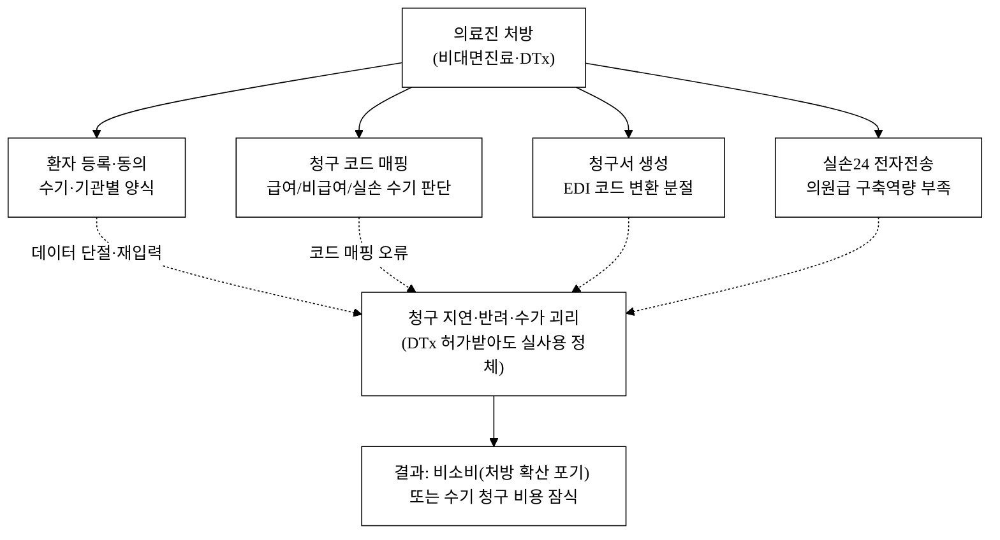

> 도식의 핵심은 화살표가 아니라 **단절선(점선)** 이다. 처방 1건이 환자등록·코드매핑·청구서·전송으로 흩어져 각 단계가 수기·재입력을 발생시킨다. 클레임브릿지는 이 단절선을 단일 청구 워크플로로 대체한다([그림 2]).

---

## 2. 솔루션 (Solution)

### 2.1 제품 개요

**클레임브릿지**는 **처방 1건을 단일 워크플로**로 받아 환자 등록 → 청구 코드(수가/급여/비급여/실손) 자동 매핑 → 청구서 생성 → 심평원/보험사 제출 → 상태 추적까지 끝내는 B2B 헬스 청구 인프라 SaaS다. [그림 1]의 분절 단계를 하나의 데이터 흐름으로 대체한다.

### 2.2 핵심 모듈

| 모듈 | 기능 | 차별 포인트 |
|:---|:---|:---|
| 처방 인입 | 비대면진료·DTx 처방 데이터 수신·환자 매칭 | 비대면/DTx 신규 워크플로 전용 설계 |
| 청구 코드 매핑 | 처방 → 수가/급여/비급여/실손 코드 자동 매핑·EDI 변환·검증 | 수가 괴리·코드 분절 페인 정면 공략[^5] |
| 청구서 생성·제출 | 청구서 자동 생성 + 심평원/보험사 제출(접수→지급) | 실손24 전자전송 의무 대응[^3] |
| 환자 온보딩 | 동의·전자서명·본인확인 흐름 자동화 | DTx 사업자 개별 부담 해소 |
| 상태 대시보드 | 청구 상태·지급률·반려사유 추적 | 반려·재청구 수기 비용 제거 |

### 2.3 차별점 — 3대 핵심 + 카테고리별 50+ 도출

차별점의 **헤드라인 3가지**는 다음과 같고, 이를 8개 카테고리 **50+ 항목으로 구조화**한 전수 표는 [§5.6](#56-차별점-50-도출-카테고리별-전수)에 둔다. 각 항목은 *경쟁사 현황 → 우리 차별점 → 고객 가치* 형식이며, 핵심 항목은 [§5.5 구매동인 논증](#55-차별화-기술의-구매동인-논증--나열이-아니라-그래서-돈을-내는가)으로 must/nice를 검증한다.

1. **신규 워크플로 점유** — 레몬헬스케어(B2C 실손)·EMR EDI 사업자가 비워 둔 **DTx·비대면진료 처방→청구 자동화** 공백을 점유한다([그림 4-b]).
2. **B2B 통합 + 의원급 SaaS 이중 진입** — DTx 사업자向 B2B 통합 계약 + 의원급 월 구독, 두 매출축.
3. **단일 데이터 청구 워크플로** — 처방이 1번 입력되면 환자·코드·청구·전송이 같은 데이터를 공유해 재입력·코드 오류를 제거.

**[그림 2] 클레임브릿지 청구 자동화 아키텍처 (단일 처방 데이터 흐름)**

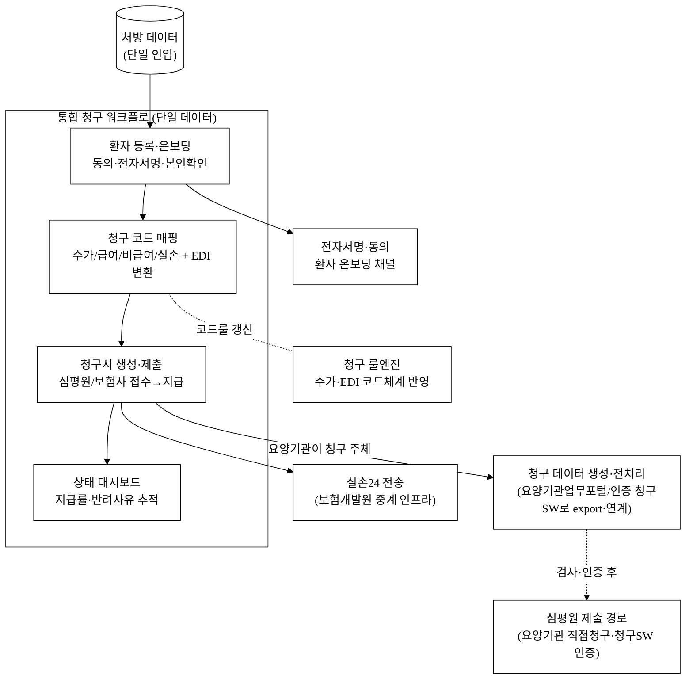

> [그림 1] 대비 핵심 변화: 처방 데이터가 **1번만 입력**되고, 환자·코드·청구·전송 단계가 같은 데이터를 공유한다. 처방 1건이 환자등록→코드매핑→청구서→제출→상태추적까지 한 흐름으로 끝난다.
> **포지션 정정(실사 핵심).** 본 제품은 심평원 **직접 청구 제출 주체가 아니다.** 청구의 법적 주체는 **요양기관**이므로 클레임브릿지는 "**청구 데이터 생성·전처리·검증 레이어**"로 포지셔닝하고, 실 제출은 (a)요양기관 보유 인증 청구SW로 export, 또는 (b)자체 청구SW 검사·인증 취득([그림 6-b]·§13)으로 처리한다. 실손24도 임의 API가 아닌 **보험개발원 중계 인프라** 자격이 전제다. 자격 확정 전에는 제품가치를 "**청구 전처리·반려 사전점검 도구**"로 보수적으로 한정한다(plan B, §9).

### 2.4 마이그레이션 · 연동 · 이탈(Exit) 정책

의료기관·DTx 사업자의 가장 큰 도입 장벽은 "기존 EMR·환자 데이터와 어떻게 연결되며, 갈아탈 때 청구 이력이 묶이지 않는가"다.

| 항목 | 제공 방식 | 목표 (파일럿 실측 예정 `[추정]`) |
|:---|:---|:---|
| 처방·환자 일괄 인입 | CSV/EMR export 일괄 업로드 마법사(컬럼 자동 매핑) | **표준 CSV 기준** 의원 1곳 셋업 ≤ 1시간(비표준 EMR은 커넥터 별도 리드타임) |
| 표준 코드 매핑 템플릿 | 수가/급여/실손 표준 매핑표 다운로드·커스터마이즈 | 무료 제공 |
| EMR/EDI 연동 가이드 | 기존 EMR·청구 EDI export → 클레임브릿지 양식 변환 가이드 | 온보딩 지원 |
| 이탈 시 export | 전체 청구 이력(처방·청구·지급·반려) CSV/PDF 일괄 내보내기 보장 | lock-in 불안 해소 |

**EMR 연동 기술 전략(상호운용성).** 국내 EMR은 벤더별 폐쇄 포맷이라 "1시간 셋업"은 표준 CSV 한정이다. 3단계 대응: ① **표준 우선**(HL7 FHIR·진료정보교류 표준), ② **fallback**(CSV 컬럼 매핑 마법사), ③ **커넥터 우선순위**(상위 벤더 유비케어·비트 등 `[추정]` 우선, 비표준 EMR은 별도 커넥터 리드타임 수일~수주를 정직 인정). 직접 연동 시 의료법 §23의2(EMR 인증) 검토, 부담 시 **export-import 우회**를 기본값으로 둔다.

**환자 온보딩 fallback(의원 데스크 부담 최소화).** 동의·서명 자동화가 고령·취약 환자에게 데스크 업무를 늘릴 위험을 차단한다: ① **데스크 대행 모드**(직원 태블릿 대리), ② **종이 동의 병행**(스캔→무결성), ③ 온보딩 ≤ 90초 `[추정]`. 공급자 가치(DTx 개별 부담 해소)뿐 아니라 "**의원 데스크 부담을 늘리지 않는다**"(구매자 가치)를 설계 목표로 둔다.

> **전환비용·lock-in을 구매자 언어로.** 전환비용(§5.3 2층)은 "데이터를 묶는다"가 아니라 **운영 통합**(룰 커스터마이즈·반려예측 학습상태·연동설정·운영숙련)에서 나온다. raw 청구이력은 **언제든 표준 CSV/PDF로 전량 반출 보장**(이탈 시 export 행). 즉 "들어오긴 쉽고, 데이터는 언제든 가져가며, 같은 운영효율 재구축에 시간이 든다". 계약·해지·위약금은 §6.7.

### 2.5 청구 정확성 검증 — *틀리면 반려·환수인 기능의 신뢰 보증*

"청구 코드 자동 매핑"은 핵심 차별점인 동시에, **오매핑 시 청구 반려·삭감·부당청구 리스크로 직결되는 신뢰가 전부인 기능**이다. 의료 청구 매핑은 진료내역·상병·환자 자격에 따른 판단이 개입해 **100% 정확도는 도메인적으로 불가능**하다. 따라서 KPI를 "일치율 100%"가 아니라 **커버리지·정확도·검출률·최종 반려율**로 분해해 측정 가능하게 재정의한다.

| KPI(분해) | 정의 | 목표 `[추정]` · 측정 |
|:---|:---|:---|
| 자동매핑 커버리지 | 전체 처방 중 사람 개입 없이 매핑된 비율 | 초기 ≥ 70% → 고도화 시 상향 / 월 측정 |
| 매핑 정확도(precision/recall) | 코더 감수 정답셋 대비 일치 | 초기 **≥ 95%** → 고도화, **100% 아님** / 회귀테스트 리포트 |
| 오매핑 검출률 | 반려 위험 매핑의 사전 검출 | ≥ 90% 사전 차단 목표 / 룰+패턴 |
| **최종 제출 반려율** | 코더 감수 게이트 통과 후 실 제출 청구의 반려율 | **≤ 5% `[추정][재확인 필요]`** (파일럿 실측) |

- **정답셋 정의(필수)**: 표본 규모 **대표 처방 N건 `[재확인 필요]`**, 라벨링 주체 = 외부 청구 코더, 기준 = **특정 고시 버전 스냅샷**. 수가·EDI 코드는 분기·수시 고시로 바뀌므로 **회귀 정답셋을 버저닝**(고시 버전별)하고 변경 시 차이 회귀테스트를 통과해야 배포한다.
- **매핑 근거 명세**: 청구서에 코드·수가·근거를 표기(블랙박스 금지), 전 항목 추적 가능. **사용자 최종 확인 단계**를 UI에 강제(§2.6 책임구조의 핵심).
- **코더 감수 게이트**: 고위험 케이스는 "상위 티어 옵션"이 아니라 **실 청구 전 의무 게이트**로 격상(신뢰를 사는 비용을 자사가 부담).

> **데모 시연 지점.** 이 사전검증·반려점검은 데모([`projects/claimbridge-spa`](../projects/claimbridge-spa/) `v3.html`)의 좌측 메뉴 **「신규 청구·DTx」**(자동매핑 + **반려예측 룰엔진 사전검증**으로 제출 전 위험 경고)와 **「심사·반려예측」** 콘솔에서 실제로 동작한다 — 논증(§5.5 must 동인)과 산출물이 정합한다.

### 2.6 책임·면책·보증 구조 — *"틀렸을 때 누가 책임지나"에 대한 답*

오매핑→삭감·환수·부당청구 시 책임 귀속은 현장 원장·DTx 대표의 **1순위 구매 공포**다. "책임 한계 명시"로 미루지 않고 구조를 명시한다.

| 항목 | 정책 |
|:---|:---|
| 법적 기본값 | **최종 청구 책임은 요양기관**(현행 법리). 클레임브릿지는 **"의사결정 보조 도구(decision-support)"** 포지션 |
| 책임 귀속 매트릭스 | **SW 룰엔진 오류**(잘못된 룰·코드체계 미반영)와 **사용자 입력 오류**(원천 데이터 오기)를 로깅으로 구분. 전자는 SW사 보정 책임, 후자는 사용자 책임 |
| 보정 SLA | 룰엔진 오류로 인한 삭감 발생 시 **원인 리포트 + 재청구 지원**을 영업일 N일 내 제공 `[추정]`. 코더 감수 티어는 **오매핑 1건당 무상 재처리** |
| 보증·보험 | **전문직업배상책임보험(E&O) 가입 계획** + 룰엔진 오류 손해배상 한도 명시 `[추정]`(금액·조건은 약관 확정 전 골격) |
| UI 구조화 | 매핑 근거 표기 + **사용자 최종 확인 클릭**으로 "도구 제공자" 면책 경계를 계약·제품 양쪽에서 구조화 |

**오매핑 사고 책임 흐름(예시 1건).** 룰엔진이 고시 미반영 코드를 추천 → 사용자 최종 확인 통과 → 제출 → 삭감 발생. 로그상 **룰엔진 오류**로 판정되면 ① 원인 리포트 자동 생성, ② 무상 재청구 지원, ③ E&O 한도 내 손해 분담. 반대로 원천 데이터 오기로 판정되면 사용자 책임이되 **사전 검출 룰**이 경고했는지 로깅으로 확인한다. 이 구조는 §9 리스크표·§5의 신뢰 해자와 1:1로 연결된다.

---

## 3. 시장 (Scale-up)

> 산정 원칙([`5_research/README.md`](./5_research/README.md) §3 준수): 입력 모수는 검증 출처에서 가져오고, 비율(비중·구독단가·침투율)은 가설이므로 `[추정]` 을 병기한다. 추정값과 공식값을 한 수치에 섞지 않는다.

### 3.1 입력값 (검증 출처)

| 변수 | 값 | 출처 |
|:---|:---|:---:|
| 국내 비급여 포함 총진료비(2023) | 약 133.0조 원 (보장률 64.9%, 비급여 20.2조) | [^7] |
| 비대면진료 참여 의료기관 | 약 2.3만 개소 (누적 이용자 492만 명) | [^2] |
| 전국 의원급 의료기관 수 | 약 3.6만 개소 `[재확인 필요]` (산정 모수 상한 근거) | [^15] |
| DTx 허가 건수 | DTx 9건 (디지털의료기기 누적 388건) | [^4] |
| 글로벌 DTx 시장(2030E) | 325억 달러 ('24 76.7억, CAGR 27.77%) | [^8] |

### 3.2 TAM / SAM / SOM 산정 — bottom-up 단일 모수 정합

> **방법 전환(투심 지적 반영).** 종전 "총진료비 × 0.3% [추정]" top-down 단일계수는 신뢰구간이 없고 SAM 상한과 충돌(2.3만 개소 전체가 월 15만원을 내도 약 414억 < TAM 4,000억)했다. 0.3% 계수를 **폐기**하고, TAM·SAM·SOM을 **동일 모수(기관수 × ARPU × 채택률)** 에서 일관되게 도출한다. TAM은 단일값이 아니라 **하한~상한 밴드**로 제시한다.

**(A) bottom-up 단일 모수 (모두 `[추정]`, 출처 있는 모수만 [^])**

| 모수 | 값 | 비고 |
|:---|---:|:---|
| 전국 의원급 의료기관 | 약 36,000곳 `[재확인 필요]`[^15] | 청구SW 잠재 모수 상한 |
| 약국 | 약 25,000곳 `[재확인 필요]`[^15] | 실손24·청구 인접 수요 |
| DTx/비대면 사업자(허가+파이프라인) | 약 30~60곳 `[추정]` | 허가 9건[^4] + 임상 파이프라인 |
| 의원 ARPU(연) | 약 180만원 `[추정]` | 월 15만원 × 12(WTP 근거 §6.1) |
| 청구SW 채택 가능 비율 | 의원 40~60% `[추정]` | 비대면·실손 상시 수요 기관 비중 |

**(B) TAM/SAM/SOM 정합 표**

| 구분 | 산정(bottom-up) | 값 `[추정]` | 정합 |
|:---|:---|:---|:---|
| **TAM** | (의원 3.6만 + 약국 2.5만 인접) × 연 ARPU 180만 × 청구SW 잠재 채택 상한 | **약 1,100억 ~ 1,400억원/년** (밴드) | 의원 단독 상한 = 3.6만 × 180만 = **약 648억**, 약국·DTx·종량·부가매출 합산 시 밴드 상단 |
| **SAM** | 청구 수요 의원 `[추정] 약 1만 개소`(=3.6만 × 채택가능 ~30% 필터) × 연 180만 + DTx B2B | **약 180억원/년** | TAM(648억 의원분)의 **약 28%** — TAM 상한과 모순 없음(종전 1/10 모순 해소) |
| **SOM** | SAM × 초기 침투율 `[추정] 3~5%`(3년차) + DTx B2B 별도(§6.3) | **약 5.5억~9.5억원/년** | SAM 180억 대비 3~5% + DTx 라인 합산 |

**(C) SAM 단일 가정 민감도** (청구 수요 의원 수 변동 시)

| 청구 수요 의원 가정 | SAM(연) | SOM 3% | SOM 5% |
|:---|---:|---:|---:|
| 0.5만 개소(보수) | 약 90억 | 약 2.7억 | 약 4.5억 |
| 1.0만 개소(기준) | 약 180억 | 약 5.4억 | 약 9.0억 |
| 1.5만 개소(공격) | 약 270억 | 약 8.1억 | 약 13.5억 |

> 위 모든 비율·단가·채택률·침투율은 `[추정]`, 의원/약국 기관수는 `[재확인 필요]`(보건의료빅데이터·건강보험통계연보로 확정). 종전 0.3% 계수는 폐기했다.

**[그림 3] 시장 구조 (TAM → SAM → SOM 깔때기, 동일 모수)**

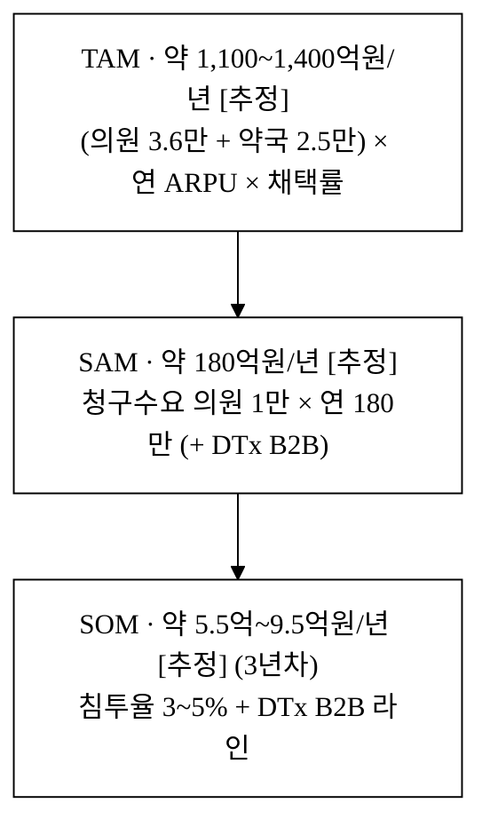

> **모수 정합 주석**: TAM·SAM·SOM이 모두 **기관수 × ARPU × 채택률** 단일 모수에서 도출되며, SAM(180억)이 TAM 의원분(648억)의 약 28%로 **상한 모순이 없다**(종전 1/10 구조 해소). DTx 사업자 B2B는 §6.3에서 별도 라인으로 합산한다.

### 3.3 도달 가능성 벤치마크 — *단위 통일(ARR vs 사용자수)*

> **벤치마크 오용 정정(투심 지적).** 레몬헬스케어의 "다운로드 1,300만"은 **B2C 사용자수**이고 본 사업은 **B2B 유료 ARR**이라 단위가 다르다. 사용자수를 ARR 근거로 쓰지 않는다.

- **레몬헬스케어**는 **시장의 실재**(청구·전송 인프라에 돈이 흐른다)와 **공백의 위치**(상급병원 B2C 선점[^9] → 의원급·DTx B2B는 미점유)를 보여주는 용도로만 인용한다 — SOM 절대값의 근거가 아니다.
- SOM 5.5~9.5억의 타당성은 **동일 비즈니스모델(B2B 유료 SaaS, 의료기관 구독)** 기준으로 판단한다: 헬스 B2B SaaS 초기 3년 ARR 궤적은 통상 **수억~십수억 ARR** 구간에 분포한다 `[재확인 필요]`(동종 벤치마크 5_research 보강 예정). 본 사업의 Y3 7억은 그 분포의 **중하단(보수)** 에 해당한다.
- 사용자수(다운로드)와 매출(ARR)을 같은 논증에 섞지 않는다.

---

## 4. 경영혁신·창업학적 프레임워크

본 사업은 세 이론으로 정당화된다. (4.1) **Christensen 신시장 파괴**가 "왜 비어 있는 청구 공백에서 시작하는가"를, (4.2) **Kim·Mauborgne 블루오션 ERRC**가 "기존 경쟁축을 어떻게 재편하는가"를, (4.3) **JTBD + 양면 플랫폼 경제학**이 "무엇을 측정하고 왜 통합 워크플로가 이기는가"를 설명한다.

### 4.1 Christensen 신시장 파괴 — *비어 있는 청구 공백에서 시작한다*

파괴적 혁신은 (a) 상위 시장이 과잉 충족되고 (b) 하위·미충족 시장이 비소비 상태일 때 진입한다. 본 도메인은 **신시장 파괴(new-market disruption)** 로 프레이밍하는 것이 정합적이다.

- **상위 점유·미커버**: 레몬헬스케어는 상급종합병원 실손 청구(B2C)에 72% 점유[^9] 하나, **DTx 처방→급여/비급여 매핑·DTx 사업자向 B2B 온보딩은 미커버**다.
- **하위 비소비**: 의원급·DTx 사업자는 청구 장벽 때문에 처방 확산을 포기하거나(허가 6호에도 실사용 "제도 밖"[^10]) 수기로 버틴다. 이들은 "고객이 아닌 비고객"이다.

클레임브릿지는 제도화(2026.12[^1])·실손24 2단계(2025.10[^3])로 **새로 합법화된 처방 트래픽을 처음으로 디지털 청구 시장에 끌어들인다.** 이것이 신시장 파괴의 1차 공략면이다.

기존 강자의 진입은 **기정사실**(§5.1: 12~18개월)로 두고, 우리가 사는 것은 "영원한 카피 불가"가 아니라 **그 12~18개월의 선행 격차**다. 강자가 즉시가 아니라 늦게 대응하는 이유와 해자의 정합성(아키텍처 재설계 지연·하방 확장은 "안 함"이 아니라 "늦게 함"·공개 고시 추적은 해자 아닌 비용 패리티)은 [^18]에 정리한다. 결론: 12~18개월 격차를 **선점 세그먼트의 전환비용·전용성**(§5.3 2·3층)으로 영구 우위로 전환하는 것이 방어의 본질이며, 진짜 비대칭은 §5.3-B의 **비공개 반려결과 데이터**에서만 나온다.

**[그림 4-a] 청구 영역 커버리지 비교 (5대 영역 中 커버 수)**

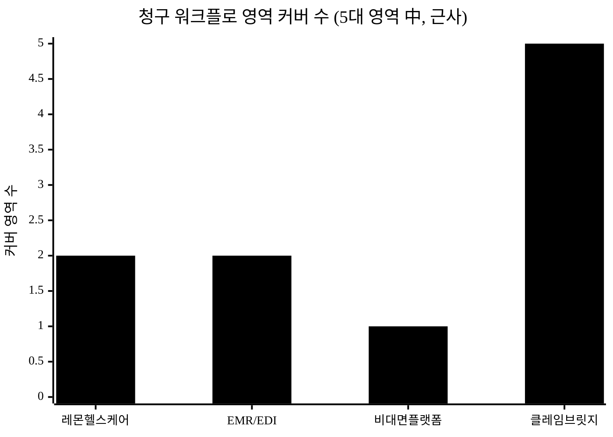

> 5대 영역 = (1)처방 인입 (2)환자 온보딩·동의 (3)청구 코드 매핑 (4)청구서 생성·제출 (5)상태 추적. 레몬헬스케어는 실손 전송·상태(B2C 중심) 약 2, EMR/EDI는 코드·청구서 약 2, 비대면 플랫폼은 처방 인입 1, **클레임브릿지는 5 전 영역** `[추정]`. 막대 높이는 정성 평가의 근사이며 정량 측정값이 아니다.

**[그림 4-b] 전략 포지셔닝 개념도 — 고객 유형 축 × 청구 워크플로 통합도 축**

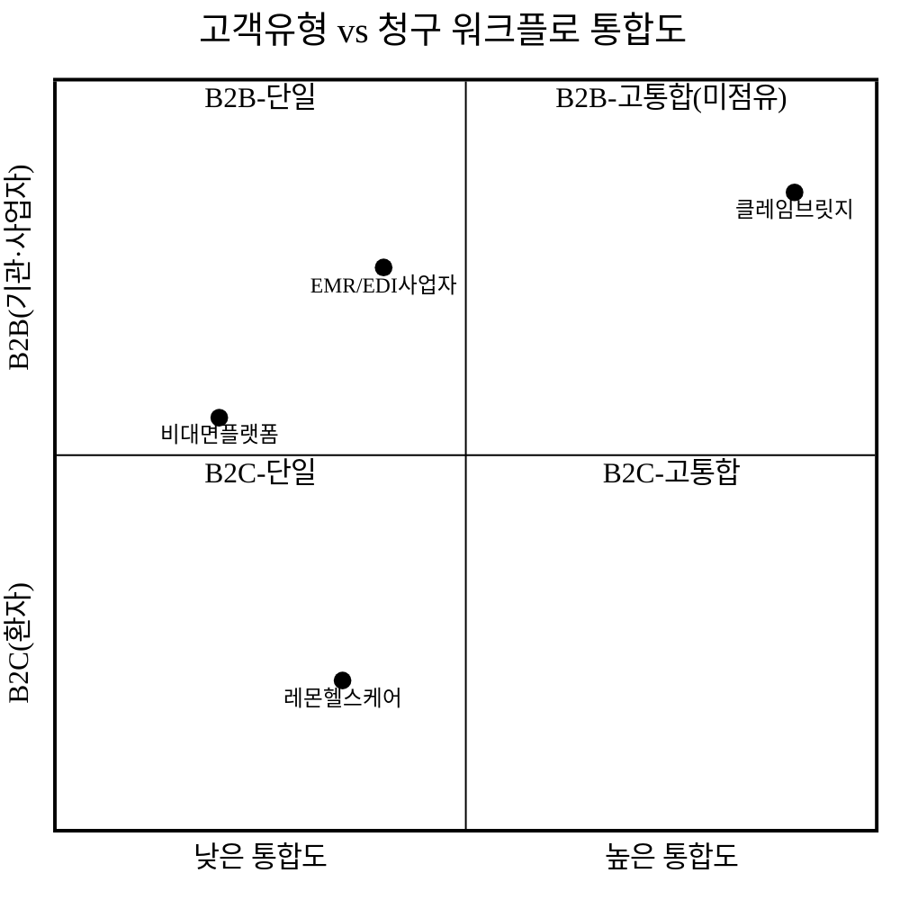

> 통합도(가로축)·고객유형(세로축)을 별개 축으로 둔 개념도. 레몬은 B2C·단일, EMR은 B2B·전통 EDI에 묶여 있고, 클레임브릿지는 **우상단(B2B·고통합)** 의 신규 워크플로 공백을 점유한다.

### 4.2 블루오션 ERRC — *경쟁축의 재편*

| 액션 | 요소 | 내용 |
|:---|:---|:---|
| **Eliminate** | 처방→청구 단계 간 재입력 / 코드 수기 판단 | 단일 처방 데이터·자동 매핑으로 제거 |
| **Reduce** | 청구 반려·재청구 비용 / 기관별 자체 구축 부담 | 표준 워크플로·검증으로 감소 |
| **Raise** | 신규 제도 적합성(DTx 수가·실손24·비대면 청구) | 기존 강자가 후행하는 신규 규정 자동 매핑[^3][^5] |
| **Create** | DTx 사업자向 B2B 청구·온보딩 인프라 / 의원급 청구 SaaS 카테고리 | 신규 가치 곡선 창출 |

ERRC의 결론은 **"B2C 실손청구"와 "전통 EDI"라는 기존 경쟁축을 벗어나, 'B2B 통합 + 신규 제도 자동화 + 처방→청구 단일 워크플로'라는 새 가치 곡선([그림 4-b]의 빈 사분면)을 만든다"** 는 것이다.

### 4.3 JTBD + 양면 플랫폼 경제학 — *무엇을 측정하고 왜 통합이 이기는가*

DTx 사업자·의원이 고용하는 Job은 *"처방을 청구로 바꿔 지급까지 막힘없이 끝내고 진료/사업에 집중"* 이다. 측정 단위는 **청구 성공률·지급까지 소요시간**이다. 단계가 분절되면 코드 오류·반려·재청구 비용이 커진다. 동시에 본 사업은 **의료기관(공급)과 DTx 사업자·보험 청구(수요)를 잇는 양면 플랫폼** 성격을 가진다.

이를 **린 스타트업 Build-Measure-Learn** 로 검증한다.

| 가설 | 측정 지표 | 검증 방법 |
|:---|:---|:---|
| 의원·DTx 사업자는 청구 자동화에 전환한다 | 수기→클레임브릿지 전환율 | 파일럿 의원·DTx 사업자 도입율 |
| 청구 성공률·지급속도가 개선된다 | 청구 반려율·지급 소요시간 | 도입 전후 비교 |
| B2B 통합이 의원 구독보다 LTV가 크다 | 채널별 ARPU·LTV | DTx B2B vs 의원 구독 비교 |

---

## 5. 경쟁 분석 (Competitive Landscape)

### 5.1 심화 경쟁 매트릭스

| 항목 | 레몬헬스케어 | 보험개발원(실손24) | 비대면플랫폼(닥터나우 등) | EMR/EDI(유비케어 등) | DTx 사업자(에임메드 등) | **클레임브릿지 (당사)** |
|:---|:---:|:---:|:---:|:---:|:---:|:---:|
| 처방 인입(비대면·DTx) | △ | ✕ | ◎ | △ | △ | **◎** |
| 환자 온보딩·동의 | ○ | ✕ | ○ | △ | △ | **◎** |
| 청구 코드 매핑(수가/급여/실손) | △ | ✕ | ✕ | ○ | ✕ | **○** (신규 워크플로 한정, baseline 미확보) |
| 청구서 생성·제출 | ○ | ○(전송 대행) | ✕ | ◎ | ✕ | **◎** |
| 상태·지급 추적 | ◎(B2C) | △ | ✕ | △ | ✕ | **◎** (지급률·반려사유) |
| 고객 유형 | B2C 환자 | 공공 인프라 | 환자·의원 중개 | 의원 EMR | 자사 처방 | **DTx B2B + 의원 SaaS** |
| **지속가능 해자** | 상급병원 점유[^9] | 법정 전송기관[^3] | 환자 트래픽 | EDI 점유 | 허가 제품[^4] | **신규 워크플로 선점 + 청구 데이터 락인(§5.3)** |

> **정확도 ◎ 자칭 정정(경쟁사 반박 대비).** 트랙레코드·baseline 없는 신규 진입자가 수십 년 의원급 EDI를 운영한 기성 EMR보다 **절대 정확도에서 우월하다고 주장하지 않는다.** 청구 코드 매핑은 ◎가 아니라 **○(신규 워크플로 한정 커버리지, baseline 미확보·파일럿 실측 예정)** 로 정직화했다. 우리의 우위는 "정확도가 더 높다"가 아니라 ① **기성 EDI가 안 하는 신규 워크플로(비대면·DTx)** 커버리지, ② **검증 프로세스의 투명성**(근거 표기·회귀테스트·코더 감수 의무 게이트, §2.5)에 한정한다. 처방 인입 ◎ — 비대면/DTx 신규 워크플로 전용 데이터 모델. 상태 추적 ◎ — **단일 처방 데이터와 결합된** 지급률·반려사유 추적(B2B). 차별성은 "기능 보유"가 아니라 §5.3의 2·3층 락인에 있다.

### 5.2 서술 — 경쟁 공백(Whitespace)

국내 청구 지형은 **영역별 강자가 분산**된 형태다. 실손 전산화는 레몬헬스케어(상급병원 72%[^9])·보험개발원(법정 전송[^3])이, 진료 중개는 비대면 플랫폼이, 전통 청구 EDI는 EMR 사업자가 점유한다. 그러나 **"DTx·비대면 처방을 받아 급여/실손 코드로 매핑해 청구·전송·온보딩까지 끝내는 B2B 통합 제품"** 은 비어 있다.

레몬헬스케어는 **B2C 실손청구 중심**이라 DTx 처방 코드 매핑·DTx 사업자向 B2B 온보딩을 미커버하고[^9], 보험개발원은 **전송 파이프라인만** 제공한다[^3]. 결과적으로 클레임브릿지의 진입 공백은 명확하다 — **"DTx·의원급 처방→청구 자동화 B2B 인프라"** ([그림 4-b]의 빈 사분면).

### 5.3 지속가능 해자 — *현재 보유 vs 미래 목표 분리, 임계점 정량화*

> **자기반박 정정.** 1층(기능)은 스스로 "6~12개월 카피 가능·낮음"으로 인정한다. 그렇다면 핵심은 "**카피 완료(M+12~18) 이전에 2·3층 락인이 형성되는가**"이며, 이는 **검증 가능한 임계점**으로 정의돼야 한다. 또한 **현재 보유 자산**과 **미래 목표**를 분리 표기한다.

**(A) 해자 자산: 현재 보유 vs 미래 목표**

| 층 | 해자 | 현재 보유 | 미래 목표 `[추정]` | 발효 임계점 `[추정]` |
|:---|:---|:---|:---|:---|
| 1층(기능) | 처방→청구 통합 워크플로·코드 자동매핑 | 없음(설계만) | — | time-to-market 선점뿐 |
| 2층(전환비용) | 운영 통합(룰 커스터마이즈·반려예측 학습·연동설정·운영숙련) | 없음 | NRR ≥ 100% / 월 churn ≤ 3% | **누적 청구 ≥ 5만건/기관** 시 이탈비용 의미화 |
| 3층(네트워크) | DTx↔의원↔보험 양면 데이터 | 없음 | cold-start 장벽 형성 | **DTx 10곳 + 의원 300곳** 동시 도달 |
| (선취) 인증 | 청구SW 검사·인증·실손24 연계 선취 | 미취득(v3) | 경쟁사 대비 인증 리드타임 선행 | 경쟁사 대비 **6~12개월 선행** |
| (데이터) 반려정답셋 | 비공개 반려·삭감 결과 데이터 | 0건 | 카피 불가 데이터 우위 | **누적 청구 ≥ 30만건** 시 모델 우위 |

**(B) 진짜 비대칭은 어디서 나오는가(해자 재정의).** 룰엔진은 **공개 코드체계의 함수**라 누구나 동일 데이터를 본다 — "해자"에서 **비용 패리티 항목**으로 강등한다. 카피 불가능한 비대칭은 **자사 고유 반려-라벨 데이터**(어느 코드 조합이 실제로 반려/삭감됐는지의 정답셋, 청구를 실제 돌린 사업자만 보유)에서만 나온다. 반박("레몬이 B2B로 돌면 더 큰 표본") 대응: 우리는 **DTx·의원급·비대면 세그먼트**에서 **먼저·더 깊은** 반려 표본을 갖는다(기성 EDI는 전통 급여 청구 표본은 많으나 신규 워크플로 표본은 0). 공개 코드체계 추적과 비공개 반려결과 학습을 분리하고, **후자만 해자로 주장**한다.

**(C) 데이터 플라이휠 — 검증 가능한 가설로 전환.** "데이터가 쌓이면 정확도가 오른다"는 정성 주장을 **검증 가능한 가설**로 바꾼다: *누적 청구 N건 → 매핑 정확도 X%→Y%*. 예) 누적 1만건 시 자동매핑 커버리지 70%→80%, 반려 사전검출 +X%p `[추정][재확인 필요]`(파일럿 실측). 경쟁사가 같은 데이터를 못 모으는 이유 = **고객과의 데이터 이용 계약·가명처리 동의 범위 내 자사 귀속**(IP·데이터 자산 §13.3).

**(D) 멀티호밍 억제 + (E) export·2층 정합.** §7.1 "채널 비독점"·§2.4 "raw 데이터 전량 export 보장"과 충돌하지 않게, 네트워크 효과를 **멀티호밍을 비싸게 만드는 메커니즘**(DTx-보험사 정산 매칭·반려패턴 cross-tenant 학습이 단일 플랫폼 통합 시에만 가치)으로 설계한다. 따라서 2층 락인은 "데이터가 묶여서"가 아니라 **운영 통합 재구축 비용**으로 재정의되며, churn ≤ 3%는 운영효율 재구축 시간에서 나온다. (D)가 약하면 3층 난이도를 "높음→중"으로 낮추고 방어 무게를 2층으로 옮긴다.

**[그림 4-d] 카피 완료 시점 vs 임계점 도달 시점 타임라인**

```mermaid
%%{init: {"theme":"base","themeVariables":{"darkMode":false,"background":"#ffffff","fontFamily":"Georgia, serif","primaryColor":"#ffffff","primaryBorderColor":"#000000","primaryTextColor":"#000000","secondaryColor":"#ffffff","secondaryBorderColor":"#000000","secondaryTextColor":"#000000","tertiaryColor":"#ffffff","tertiaryBorderColor":"#000000","tertiaryTextColor":"#000000","mainBkg":"#ffffff","secondBkg":"#ffffff","lineColor":"#000000","textColor":"#000000","nodeBorder":"#000000","nodeTextColor":"#000000","titleColor":"#000000","edgeLabelBackground":"#ffffff","defaultLinkColor":"#000000","clusterBkg":"#ffffff","clusterBorder":"#000000","actorBkg":"#ffffff","actorBorder":"#000000","actorTextColor":"#000000","actorLineColor":"#000000","signalColor":"#000000","signalTextColor":"#000000","labelBoxBkgColor":"#ffffff","labelBoxBorderColor":"#000000","labelTextColor":"#000000","loopTextColor":"#000000","noteBkgColor":"#ffffff","noteBorderColor":"#000000","noteTextColor":"#000000","activationBkgColor":"#ffffff","activationBorderColor":"#000000","sequenceNumberColor":"#000000","attributeBackgroundColorOdd":"#ffffff","attributeBackgroundColorEven":"#ffffff","sectionBkgColor":"#ffffff","altSectionBkgColor":"#ffffff","sectionBkgColor2":"#ffffff","taskBkgColor":"#ffffff","taskBorderColor":"#000000","taskTextColor":"#000000","taskTextLightColor":"#000000","taskTextOutsideColor":"#000000","taskTextDarkColor":"#000000","taskTextClickableColor":"#000000","activeTaskBkgColor":"#ffffff","activeTaskBorderColor":"#000000","doneTaskBkgColor":"#ffffff","doneTaskBorderColor":"#000000","critBkgColor":"#ffffff","critBorderColor":"#000000","gridColor":"#000000","todayLineColor":"#000000","quadrant1Fill":"#ffffff","quadrant2Fill":"#ffffff","quadrant3Fill":"#ffffff","quadrant4Fill":"#ffffff","quadrant1TextFill":"#000000","quadrant2TextFill":"#000000","quadrant3TextFill":"#000000","quadrant4TextFill":"#000000","quadrantPointFill":"#000000","quadrantPointTextFill":"#000000","quadrantXAxisTextFill":"#000000","quadrantYAxisTextFill":"#000000","quadrantInternalBorderStrokeFill":"#000000","quadrantExternalBorderStrokeFill":"#000000","quadrantTitleFill":"#000000","pieStrokeColor":"#000000","pieOuterStrokeColor":"#000000","pieTitleTextColor":"#000000","pieSectionTextColor":"#000000","pieLegendTextColor":"#000000","cScale0":"#ffffff","cScaleLabel0":"#000000","cScaleInv0":"#000000","pie1":"#ffffff","cScale1":"#ffffff","cScaleLabel1":"#000000","cScaleInv1":"#000000","pie2":"#ffffff","cScale2":"#ffffff","cScaleLabel2":"#000000","cScaleInv2":"#000000","pie3":"#ffffff","cScale3":"#ffffff","cScaleLabel3":"#000000","cScaleInv3":"#000000","pie4":"#ffffff","cScale4":"#ffffff","cScaleLabel4":"#000000","cScaleInv4":"#000000","pie5":"#ffffff","cScale5":"#ffffff","cScaleLabel5":"#000000","cScaleInv5":"#000000","pie6":"#ffffff","cScale6":"#ffffff","cScaleLabel6":"#000000","cScaleInv6":"#000000","pie7":"#ffffff","cScale7":"#ffffff","cScaleLabel7":"#000000","cScaleInv7":"#000000","pie8":"#ffffff","cScale8":"#ffffff","cScaleLabel8":"#000000","cScaleInv8":"#000000","pie9":"#ffffff","cScale9":"#ffffff","cScaleLabel9":"#000000","cScaleInv9":"#000000","pie10":"#ffffff","cScale10":"#ffffff","cScaleLabel10":"#000000","cScaleInv10":"#000000","pie11":"#ffffff","cScale11":"#ffffff","cScaleLabel11":"#000000","cScaleInv11":"#000000","pie12":"#ffffff","xyChart":{"backgroundColor":"#ffffff","titleColor":"#000000","xAxisLabelColor":"#000000","xAxisTitleColor":"#000000","xAxisTickColor":"#000000","xAxisLineColor":"#000000","yAxisLabelColor":"#000000","yAxisTitleColor":"#000000","yAxisTickColor":"#000000","yAxisLineColor":"#000000","plotColorPalette":"#000000,#000000,#000000,#000000,#000000,#000000"}}}}%%
gantt
    title 경쟁사 카피 vs 자사 임계점 (성공조건 임계점이 카피보다 빠름)
    dateFormat X
    axisFormat %s
    section 경쟁사
    카피 착수~완료 M0-M18 :crit, c1, 0, 18
    section 자사 임계점
    2층 발효 의원300+DTx10 M12 :a1, 0, 12
    인증 선취 청구SW·실손24 :a2, 6, 12
    3층 cold-start 장벽 M18 :a3, 12, 18
```

> **타이밍 베팅의 성공 조건(정량).** 2층 발효(의원 300 + DTx 10, M12 목표) < 경쟁사 카피 완료(M12~18). 이 부등식이 성립하지 않으면 베팅은 무효 — 그 경우 **GTM 속도를 재설계**(제휴 묶음 온보딩 가속)하거나 차별점을 "워크플로·온보딩"으로 좁혀 재포지셔닝한다. 마일스톤은 §11.3과 1:1 매핑한다.

**[그림 4-c] 경쟁사 대응 시나리오 매트릭스 (탈중개·가격공격 포함)**

| 시나리오 | 위협 | 예상 대응시점 `[추정]` | 자사 방어수단 | 정량 영향 `[추정]` |
|:---|:---|:---:|:---|:---|
| ① 레몬헬스케어 B2B 확장 | B2C 점유 기반 의원·DTx B2B 진입 | 12~18개월 | 신규 워크플로 선점 락인(2·3층), 인증 선취 | CAC 상승, 기존 락인은 방어 |
| ② EMR 사업자 신규 워크플로 추가 | EDI 점유 기반 비대면·DTx 청구 추가 | 12~18개월 | DTx 수가·실손24 추적 깊이, 신규 워크플로 표본 우위 | 일부 영역 경쟁 |
| ③ 비대면플랫폼 + 청구사 제휴연합 | 진료 중개 트래픽 + 청구 파트너 결합 | 6~12개월 | 제휴는 단일 데이터 통합 아님 — UX·책임 분산 | UX 우위, 마케팅 경쟁 심화 |
| ④ 공공 인프라(보험개발원) 범위 확대 | 전송 대행 → 청구 매핑 공공화·무료화 | 18~24개월 | 공공은 매핑·온보딩 미커버, 민간 유연성 | 제한적 |
| **⑤ DTx/플랫폼의 청구 내재화·청구사 M&A (탈중개)** | 핵심 고객(DTx·닥터나우급 플랫폼)이 청구를 in-house화 → **거점·SAM 동시 증발** | 12~24개월 | **멀티-DTx·멀티-플랫폼 중립성**(단일 사업자보다 싸고 정확), 규모의 경제로 **내재화 비용 > 구독 비용** 입증 | 영향 **극고** — §9 신규 '플랫폼' 리스크 등재 |

> **카피 난이도.** 단일 영역 사업자의 카피 비용을 보수적으로 **약 30~50 man-month [추정]** 로 본다(자사 초기 구축 R&D와 교차검증, §6.5 주석). 방어는 "카피 불가"가 아니라 "**카피 완료 전에 [그림 4-d] 임계점 도달**"에 베팅하며, 그 부등식 성립 여부를 §11.3에서 추적한다.

### 5.4 실 청구/전송 자격의 경쟁 비대칭 — *진짜 진입장벽의 양날*

실 청구 API 연계·실손24 전송 **자격**이 진입장벽이라면 그것은 **우리에게도 벽**이다. 이 비대칭을 정직하게 직시한다.

| 케이스 | 함의 | 자사 대응 |
|:---|:---|:---|
| 자격이 **어렵다** | 우리도 v3까지 mock-only(18개월 벽), 그 기간 "데모만 도는 회사" 위험 | mock 단계에도 ROI 나는 가치(코드매핑 사전검증·반려 사전점검·온보딩 자동화)로 유료화(§6.6·베타 가격 §6.1) |
| 자격이 **쉽다** | 레몬(보험개발원 사업자[^9])·기성 EDI가 자격·관계 보유 → **우리보다 먼저 실연계 완료** | **차별점을 '실연계'가 아닌 '워크플로/온보딩/신규 세그먼트 커버리지'로 재포지셔닝**, 자격보유자와 **제휴·우회** |

**격차 메우는 경로.** ① 직접 자격취득(청구SW 검사·인증, 보험개발원 연동 — 리드타임 §13), ② 기존 자격보유자와 제휴(우회). 어느 쪽이든 **'mock-only 기간에도 도입할 이유'**(실연계 전이라도 회수율·반려 감소만으로 페이백)를 §6.6 ROI로 증명한다. 만약 자격이 기성강자에 선점된 구조라면, 차별점을 솔직히 **워크플로·온보딩**으로 좁혀 재포지셔닝한다.

### 5.5 차별화 기술의 구매동인 논증 — *나열이 아니라 "그래서 돈을 내는가"*

§2.3·§5.1의 5대 차별점을 **기능 보유**로 끝내지 않고, 각각이 고객의 **실제 구매·사용 결정을 얼마나 움직이는지**를 must/nice로 분류하고 가치를 정량화하고 외부 근거로 뒷받침한 뒤 반증까지 직시한다.

**① 차별점별 must / nice 판정 (가격민감한 의원을 정직히 고려)**

| 차별점 | 건드리는 의사결정 요인(JTBD) | 판정 | 근거 |
|:---|:---|:---:|:---|
| 코드 **사전검증·반려 사전점검** | "제출 전에 삭감·반려를 막아 돈을 잃지 않는다" | **must** | 반려 1건 재작업비용 실손(§6.6)·삭감은 현금 직접 손실. 의원 원장의 1순위 공포(§2.6) |
| 처방→청구 **단일 워크플로** | "재입력·코드 수기판단 시간을 없앤다" | **must** | 월 처리 인건비 절감이 구독료를 초과(§6.6, 페이백<1개월) |
| **신규 워크플로(비대면·DTx) 커버리지** | "기성 EDI가 안 하는 신규 청구를 처리한다" | **must(해당 세그먼트)** / nice(일반 의원) | 비대면·DTx 처방이 없는 의원엔 nice. 있는 의원엔 대체재 부재 |
| **환자 온보딩·동의 자동화** | "데스크 부담·동의누락을 줄인다" | **nice→must 조건부** | 단독으론 nice. 단 디지털 취약 환자 데스크 대행(§2.4)이 받쳐야 must화 |
| **DTx B2B 통합 인프라** | "처방 확산의 청구 병목을 외주가 아닌 인프라로 해소" | **must(DTx 사업자)** | 청구·온보딩 개별 부담을 인프라로 대체, 연 계약 WTP 형성(§6.3) |

> **정직한 판정.** 5개 중 진짜 must는 **사전검증·반려점검 + 단일 워크플로 + (세그먼트 한정)신규 커버리지** 셋이다. 온보딩 자동화는 단독으론 nice이며, 받쳐주는 fallback 설계가 있을 때만 must로 승격한다. 의원은 가격민감 세그먼트라 must가 아닌 기능엔 **추가 15만원을 내지 않는다** — 그래서 과금은 must 차별점(반려방지·시간절감·신규 워크플로)에만 건다(§6.1·§6.8 가치 차별 과금).

**② 가치 정량화 — 10배 규칙·전환비용 대비 (모두 `[추정]`, 파일럿 실측 교체)**

§6.6의 의원 1곳 단위 ROI를 구매동인 크기로 환산한다.

| 차별점이 만드는 가치 | 월 가치 `[추정]` | 연 환산 | 가격(월 15만) 대비 |
|:---|---:|---:|---:|
| 청구 처리시간 절감(8→3분, 300건) | 약 37.5만원 | 약 450만원 | 2.5배 |
| 반려율 절감(8%→4%) 재작업비 | 약 12만원 | 약 144만원 | 0.8배 |
| 회수누락 감소(실손·비급여 +α) | +α | +α | — |
| **합계(α 제외)** | **약 49.5만원** | **약 595만원** | **약 3.3배** |

> **10배 규칙 판정.** 전환 마찰(셋업·학습·운영 재구축, §2.4 2층)을 넘으려면 통상 기존 대안 대비 **수 배~10배** 가치가 필요하다. 본 차별점은 가격 대비 **약 3.3배(α 제외)**로, "압도적 10배"는 아니나 **페이백 1개월 미만**이라 전환을 정당화하는 구간이다 `[추정]`. 단 이는 **mock 단계 가치(사전검증·반려점검·시간절감)** 만으로 성립하는 수치이며, 실연계(v3) 회수증분(+α)이 더해지면 배수가 커진다. 가격민감 의원에게 "3.3배·페이백<1개월"은 must 차별점에 한정 과금할 때 설득력이 있고, nice 기능까지 묶어 비싸지면 무너진다(§6.8 단가 하한 ARPU 9만·churn 8%).

**③ 외부 근거 — 유사 헬스 청구 SW 도입효과 벤치마크 (해외, 방향성 방증)**

국내 비대면·DTx 청구 SW는 전례가 없어 자체 목표(반려율 8%→5%, §11.3)는 `[추정]`이다. 이를 **해외 동종(claim scrubbing/사전검증 SW) 도입효과**로 방향만 방증한다(국내 직접수치 아님, `[추정]` 구분).

- 미국 RCM 벤치마크상 **clean claim rate 목표 95%+**, claim scrubbing 도입 시 **반려율 5~15% → 1~3%(상대 65~85%↓)**·denial write-off **40~60%↓**가 보고된다[^16]. 본 사업의 "반려율 8%→5%(≈37%↓)" 목표는 이 분포의 **보수적 하단**으로, 과장이 아님을 방증한다 `[추정]`.
- 거부 청구 1건 **재작업비용 약 $25.20**(클린청구 처리비 ≈$6.50의 약 4배), 단일과 진료과 평균 **denial 8%**[^17]. §6.6의 "반려 재작업비 건당 1만원" 가정은 이 해외 $25 대비 **보수적**이다 `[추정]`. → 사전검증이 건드리는 비용이 **실재하고 크다**는 외부 방증.

> 위 수치는 **미국 시장 값**이며 국내 수가·심사 체계와 직접 등치하지 않는다(`[추정]` 방향 방증). 국내 baseline은 파일럿 실측으로 확정한다(§11.4).

**④ 반증 직시 — "실청구는 v3, v1~v2는 mock인데 왜 지금 돈을 내나"**

이 섹션의 가장 강한 반증은 *핵심 가치(실 청구·실손 전송)가 v3이고 v1~v2는 mock*이라는 점이다. 정면으로 답한다.

- **반증 1: "mock이면 가치 0"** → 아니다. must 차별점 중 **사전검증·반려 사전점검·시간절감**은 실연계 없이도 성립한다(§7.2 standalone 가치). 이 점을 **데모로 실증한다**: 데모([`projects/claimbridge-spa`](../projects/claimbridge-spa/)) `v3.html` → 좌측 메뉴 **「신규 청구·DTx」**(처방 입력 시 자동매핑 + **반려예측 룰엔진 사전검증**이 제출 전 위험을 경고)와 **「심사·반려예측」** 콘솔이 바로 이 must 동인을 구현한 화면이다. 즉 mock 단계에서도 *반려를 미리 잡아 돈을 지키는* 동작을 눈으로 확인할 수 있다.
- **반증 2: "가격민감 의원이 추가비를 안 낸다"** → 그래서 베타(mock, M1~6)는 **무료/대폭할인**으로 진입장벽을 0으로 두고, 정상 과금은 실연계(v3) 가치가 붙는 M7~부터다(§6.1 단계별 과금). 결재는 가치가 증명된 뒤에 발생한다.
- **반증 3: "충분히 좋은 무료 대안(EMR 끼워팔기·수기 버티기)"** → 끼워팔기는 신규 워크플로(비대면·DTx·실손24)를 **커버하지 않는** 무료다(§6.8). 수기 버티기는 §6.6의 월 49.5만원 손실을 감수하는 선택이다. must 동인은 "있으면 좋음"이 아니라 "안 쓰면 돈을 잃음"이라 무료 대안이 그 구멍을 안 메운다.

> **결론.** 본 사업의 진짜 구매동인은 **반려·삭감 방지(돈을 지킴) + 처리시간 절감(돈을 아낌)** 두 must이며, 둘 다 **mock 단계에서 데모로 시연 가능**하다. 온보딩·신규 커버리지는 세그먼트·fallback 조건부 동인으로 정직히 한정한다. 차별점이 약한 동인이면 그렇게 적었다 — 위 셋은 페이백·외부 벤치마크로 뒷받침되는 강한 동인이다.

### 5.6 차별점 50+ 도출 (카테고리별 전수)

§2.3의 3대 헤드라인을 **8개 카테고리·52개 항목**으로 전수 도출한다(키트 CLAUDE.md §2.1 차별점 50+). 각 행은 *경쟁사 현황 → 우리 차별점 → 고객 가치(가능하면 수치)* 형식이다. **부풀리기 금지** — 의미 없는 항목으로 50개를 채우지 않고, 근거가 약한 가치는 `[추정]`을 명시한다. `M`=§5.5에서 must로 판정된 강한 구매동인, `N`=nice/조건부 동인.

**표 D-1. 기술(코드 매핑·EDI·룰엔진) 차별점**

| # | 경쟁사 현황 | 클레임브릿지 차별점 | 고객 가치 | 동인 |
|:---:|:---|:---|:---|:---:|
| 1 | 기성 EDI/EMR은 처방·청구·환자가 분절 입력[^9] | 처방 1회 입력 → 환자·코드·청구·전송 단일 데이터 공유 | 재입력 0회, 코드 불일치 제거 | M |
| 2 | 비대면·DTx 신규 워크플로 미커버(전통 EDI)[^18] | 비대면·DTx 처방 전용 데이터 모델·코드 매핑 | 신규 청구를 처리할 유일 경로 `[추정]` | M |
| 3 | 매핑 결과만 제시(근거 불투명) | 매핑 근거·룰 표기(검증 프로세스 투명) | 코더 감수·반려 소명 시간 단축 | M |
| 4 | 사후 반려를 통보로 인지 | 제출 전 반려 예측 룰엔진(7 위험룰·확률화) | 반려 사전 차단(돈을 지킴) | M |
| 5 | 단일 채널(심평원 또는 보험사) | 심평원 EDI + 보험사 REST API 다중 채널 라우팅 | 한 화면에서 급여+실손 동시 처리 | M |
| 6 | 수가 고시 변경 수기 반영 | 고시 버전 관리·단가 diff·활성 버전 자동 적용 | 고시 변경 누락에 의한 삭감 방지 `[추정]` | M |
| 7 | DTx 급여 코드 표준 부재[^5][^10] | DTX 급여 코드 자동매핑(DTX10/DTX20) | DTx 처방 청구를 표준화 | N |
| 8 | 가명처리 수기/외주 | 가명처리 매트릭스 내장(개인정보 분리) | 정보 유출·법 위반 리스크 저감 | N |
| 9 | 청구 검증 룰 비공개·고정 | 룰 분기 갱신형(시행령 변동 대응) | 제도 변경 시 분기 갱신만으로 대응 | N |
| 10 | EDI 텍스트 레이아웃 수기 작성 | EDI HEAD/LINE/TAIL 자동 생성 | 포맷 오류 반려 제거 `[추정]` | N |
| 11 | 청구 유효성 사후 확인 | 제출 전 `validateClaim` 사전 검증 | 형식 반려 사전 차단 | M |

**표 D-2. 데이터·네트워크효과 차별점**

| # | 경쟁사 현황 | 클레임브릿지 차별점 | 고객 가치 | 동인 |
|:---:|:---|:---|:---|:---:|
| 12 | 반려결과는 보험사·심평원이 보유, 청구SW엔 미축적 | 고객 계약·동의 범위 내 **비공개 반려결과 데이터** 자사 귀속(§5.3-B) | 데이터 플라이휠로 매핑 정확도 개선 `[추정]` | M |
| 13 | 단일 기관 데이터만 학습 | 다기관(테넌트) 청구 패턴 통합 학습 가능 `[추정]` | 반려 사전검출률 상승 가설(파일럿 실측) | N |
| 14 | 처방→지급 전 구간 데이터 단절 | 처방·코드·청구·지급·반려 전 구간 단일 데이터 | 어트리뷰션 가능한 반려원인 분석 | N |
| 15 | 정확도 개선이 정성 주장 | "누적 N건 → 정확도 X%→Y%" 검증 가능 가설로 전환(§5.3) | 데이터 자산이 측정 가능한 해자 | N |
| 16 | 경쟁사는 동일 데이터 수집 곤란(B2C·전송만) | 데이터 이용 계약·가명처리 동의 기반 자사 축적 | 카피 임계점 지연(§5.3 타이밍) `[추정]` | N |

**표 D-3. 청구·운영(정산·미수금·감사) 차별점**

| # | 경쟁사 현황 | 클레임브릿지 차별점 | 고객 가치 | 동인 |
|:---:|:---|:---|:---|:---:|
| 17 | 정산·미수금 별도 회계툴 수기 | 정산액·미수금 자동 산출 + aging 구간 분류 | 미수금 회수 누락 방지 | M |
| 18 | 펌뱅킹 이체파일 수기 작성 | 펌뱅킹 이체파일(헤더/명세/트레일러) 자동 생성 | 이체 작업시간 절감 `[추정]` | N |
| 19 | 다기관 정산을 기관별 개별 집계 | 다기관 통합 정산 롤업(지급률·반려율·소요일) | 본부의 기관 비교·관리 가능 | M(체인) |
| 20 | 행위 로그 부재·분산 | 행위·주체·역할·기관·시각 감사 트레일 | 실사·분쟁 대응 증빙 | N |
| 21 | 청구 KPI 수기 집계 | 지급률·반려율·평균 소요일·감사 KPI 자동 시각화 | 청구 성과 가시화 | N |
| 22 | 청구 소요일 측정 안 됨 | 작성→지급 평균 소요일 자동 산출 | 현금흐름 예측 개선 `[추정]` | N |
| 23 | 청구 상태를 통보로만 확인 | 상태 대시보드(접수→심사→지급) 실시간 추적 | 지연 청구 조기 대응 | M |
| 24 | 청구 이력 이관 불가(lock-in) | 전 청구 이력 CSV/PDF 전량 반출 보장 | 이탈 불안 해소(도입장벽↓) | M |

**표 D-4. 규제·제도(심평원·실손24·의료법) 적합성 차별점**

| # | 경쟁사 현황 | 클레임브릿지 차별점 | 고객 가치 | 동인 |
|:---:|:---|:---|:---|:---:|
| 25 | 비대면진료 제도화(2026.12[^1]) 청구 SW 공백 | 제도 시행에 맞춘 비대면 청구 워크플로 선제 설계 | 제도 시행 즉시 청구 가능 | M(세그) |
| 26 | 실손24 2단계(2025.10[^3]) 의원급 대응 후행 | 실손24 전자전송 연계 설계 | 전송 의무 즉시 준수 | M |
| 27 | DTx 수가 괴리(12배[^5]) 대응 부재 | 비급여·선별급여·실손 회수율 헤지 설계(§6.6) | 수가 괴리에도 회수 극대화 `[추정]` | N |
| 28 | 청구 주체 법적 정합성 모호 | 요양기관이 청구 주체임을 전제한 전처리 레이어 포지셔닝(§2.3) | 무자격 청구 리스크 회피 | M |
| 29 | 청구SW 검사·인증 미고려 | 청구SW 검사·인증 취득 로드맵 내장(§13) | 직접 제출 경로 확보 가능 | N |
| 30 | EMR 인증(의료법 23조의2) 연동 부담 | export-import 우회 기본값 + FHIR 표준 우선 | 인증 부담 없이 도입 | M |
| 31 | 개인정보·가명처리 컴플라이언스 외주 | 동의·가명처리 내장(개인정보보호법 대응) | 컴플라이언스 비용 절감 | N |
| 32 | 디지털의료제품법(2025.1[^11]) 변화 추적 미흡 | 가이드라인·고시 룰 분기 갱신 체계 | 제도 변경 자동 반영 | N |

**표 D-5. 가격·과금 모델 차별점**

| # | 경쟁사 현황 | 클레임브릿지 차별점 | 고객 가치 | 동인 |
|:---:|:---|:---|:---|:---:|
| 33 | 단일 구독 또는 청구 마진[^9] | 의원 구독 + DTx B2B 통합 이중 매출축 | 세그먼트별 최적 과금 | N |
| 34 | 전 기능 묶음 과금 | must 차별점(반려방지·시간절감)에만 한정 과금(§6.8) | 가격민감 의원의 WTP 정합 | M |
| 35 | 베타도 유료·도입장벽 | 베타(mock) 무료/대폭할인, 가치 증명 후 과금(§6.1) | 진입장벽 0 | M |
| 36 | 끼워팔기 덤핑 취약 | 가치 차별 과금·세그먼트 집중(price-war playbook §6.8) | 가격경쟁 회피 | N |
| 37 | 정액제만 | 종량 전환 옵션(청구 건당) | 소규모 의원 진입 용이 `[추정]` | N |
| 38 | 페이백 근거 미제시 | 의원 1곳 ROI 페이백<1개월 명시(§6.6) | 구매 결재 근거 제공 | M |

**표 D-6. GTM·채널 차별점**

| # | 경쟁사 현황 | 클레임브릿지 차별점 | 고객 가치 | 동인 |
|:---:|:---|:---|:---|:---:|
| 39 | 의원 직판(높은 CAC) | DTx 사업자 B2B 거점 + 비대면 플랫폼 제휴 묶음 온보딩(§7) | 낮은 CAC·빠른 확산 `[추정]` | N |
| 40 | 단일 채널 의존 | 멀티 채널(B2B·제휴·직판) 분산 | 채널 리스크 분산 | N |
| 41 | 사례·레퍼런스 부재 | DTx 사업자 통합 사례를 레퍼런스로 의원 확산 | 신뢰 기반 확산 | N |
| 42 | 온보딩 수기·길음 | CSV/EMR export 일괄 인입 마법사(셋업 ≤1시간 표준 CSV)[추정] | 도입 마찰 최소화 | M(세그) |
| 43 | 데스크 부담 증가 우려 | 데스크 대행·종이 동의 병행 fallback(§2.4) | 의원 데스크 부담 0 목표 | M(조건부) |

**표 D-7. 네트워크효과·전환비용(해자) 차별점**

| # | 경쟁사 현황 | 클레임브릿지 차별점 | 고객 가치 | 동인 |
|:---:|:---|:---|:---|:---:|
| 44 | 단순 SW 교체 비용 낮음 | 운영 통합(룰 커스터마이즈·반려예측 학습·연동설정) 전환비용(§5.3 2층) | 락인은 데이터 아닌 운영효율 | N |
| 45 | 플랫폼·사업자망 멀티호밍 | 채널 인센티브로 멀티호밍 억제 메커니즘(§5.3-D) | 네트워크 효과 전환 `[추정]` | N |
| 46 | 양면(공급자·의원) 연결 부재 | DTx 사업자↔의원 양면 청구 네트워크 | 양면 성장 시 가치 가속 `[추정]` | N |
| 47 | 선점 격차 활용 못 함 | 12~18개월 선행 격차를 전용성으로 전환(§4.1) | 선점 세그먼트 영구 우위 가설 | N |

**표 D-8. UX·신뢰·제품 완성도 차별점**

| # | 경쟁사 현황 | 클레임브릿지 차별점 | 고객 가치 | 동인 |
|:---:|:---|:---|:---|:---:|
| 48 | 역할 구분 없는 단일 화면 | RBAC 4역할(의료진·청구담당·본부관리자·환자) 권한 분기 | 역할별 오작동·정보 노출 차단 | N |
| 49 | PC 전용 | 모바일·PC 반응형(환자 앱 모바일 전용 동선) | 환자 셀프 청구·동의 가능 | M(환자) |
| 50 | 환자 청구 추적 불가 | 환자 앱 진행바(접수→심사→지급)·반려 적색 | 환자 문의 응대 부담 감소 `[추정]` | N |
| 51 | 종이 동의·수기 서명 | 캔버스 전자서명→PNG 저장·무결성 | 동의 누락에 의한 반려 방지 | N |
| 52 | 청구서 양식 수기 | 테넌트별 청구서 양식·DTx 라벨 자동 생성 | 기관별 양식 일관성 | N |

> **정직성 주석(§2.6).** 위 52개 중 **강한 must 구매동인은 §5.5에서 검증된 3~5개**(반려 사전검증·단일 워크플로·신규 워크플로 커버리지·상태추적·이력 반출)에 집중되며, 나머지는 *조건부 또는 nice* 동인임을 `동인` 열에 정직히 표기했다. 제품 가치는 항목 수가 아니라 **must 동인의 크기**(§5.5 페이백·외부 벤치마크[^16][^17])에서 나온다. 미검증 가치는 `[추정]`으로 명시했고, 데모([`projects/claimbridge-spa`](../projects/claimbridge-spa/) `v3.html`)가 #1·#4·#5·#17·#19·#48·#49 등 다수 항목을 **실제로 구현·시연**한다(누적 104 기능, [`5_1_개발결과보고서_v3.md`](./5_1_개발결과보고서_v3.md) §2.1).

---

## 6. 비즈니스 모델 · 유닛 이코노믹스

### 6.1 가격 모델 (이중 매출축 + 도입 시점별 과금)

| 축 | 모델 | 단가 `[추정]` | 타깃 |
|:---|:---|:---|:---|
| 의원 구독 | 월 SaaS 구독 | 약 15만원/월·기관 | 비대면진료 참여 의원급 |
| DTx B2B 통합 | 연 통합 계약 + 청구 건당 | 사업자별 연 3,000만~1억원 `[추정]`(§6.3) | DTx 허가 사업자 |
| 청구 종량 | 청구 건당 수수료 | 건당 `[추정]` | 고볼륨 기관 |

**도입 시점별 과금(구매자 정합).** 핵심 가치(실 청구·실손 전송)는 v3이고 v1~v2는 mock이다. "실청구 안 되는데 왜 지금 돈을 내나"를 해소하기 위해 **단계별 가격**을 분리한다.

| 단계 | 시점 | 가격 정책 | 고객이 얻는 실가치 |
|:---|:---|:---|:---|
| 베타(mock, v1~v2) | M1~6 | **무료 또는 대폭 할인(beta)** | 코드 매핑 **사전검증**·반려 **사전점검**·온보딩 동의관리(mock이어도 실가치) |
| 정상 과금(실연계, v3~) | M7~ | 월 15만원 정상 구독 | 실 청구·실손 전자전송 완결 |

> 로드맵(§8)에 "고객이 **유료로 쓸 수 있게 되는 시점**" 열을 추가했다. mock 단계 유상 PoC는 §6.5에서 실연계 매출과 분리 집계한다.

**대안 대비 가격 비교(앵커 제시).** 월 15만원이 비싼지 싼지 판단할 앵커를 제시한다(모두 시장 추정, 5_research 보강 예정 `[재확인 필요]`).

| 비교군 | 현 비용 `[추정]` | 클레임브릿지 | 포지션 |
|:---|:---|:---|:---|
| EMR 청구 EDI 월 이용료 | 의원 월 수만~십수만원 | 월 15만원 | **대체 아님, 신규 워크플로 추가**(비대면·DTx·실손24) |
| 청구대행 수수료 | 청구액의 일정 % | 정액+종량 | 고볼륨일수록 정액 유리 |
| 자체 인력 처리비 | 직원 시간 × 인건비(§6.6) | 자동화로 시간 절감 | ROI는 §6.6 |

> **WTP(지불의사) 근거.** 의원은 이미 EMR/EDI 비용을 내므로 추가 15만원은 **절감 ROI로 정당화**돼야 한다(§6.6 페이백 표). 의원급은 가격민감도가 높은 세그먼트라, 끼워팔기 환경에서도 방어하려면 **번들 미포함 신규 워크플로(비대면·DTx·실손24)에만 과금**하는 가치 차별 과금이 핵심이다(§6.8 가격경쟁 대응). WTP의 실 데이터(사전 인터뷰·LOI)는 §11.4 고객 검증으로 확보한다.

### 6.2 추가 매출 (비구독)

전자서명·본인확인 종량, 코드 매핑 컨설팅, 반려 예측·청구 최적화 분석 리포트, 보험사·심평원 연계 수수료(정책 허용 범위 내).

**[그림 5] 비즈니스 모델 / 수익 구조 (이중 매출축)**

```mermaid
%%{init: {"theme":"base","themeVariables":{"darkMode":false,"background":"#ffffff","fontFamily":"Georgia, serif","primaryColor":"#ffffff","primaryBorderColor":"#000000","primaryTextColor":"#000000","secondaryColor":"#ffffff","secondaryBorderColor":"#000000","secondaryTextColor":"#000000","tertiaryColor":"#ffffff","tertiaryBorderColor":"#000000","tertiaryTextColor":"#000000","mainBkg":"#ffffff","secondBkg":"#ffffff","lineColor":"#000000","textColor":"#000000","nodeBorder":"#000000","nodeTextColor":"#000000","titleColor":"#000000","edgeLabelBackground":"#ffffff","defaultLinkColor":"#000000","clusterBkg":"#ffffff","clusterBorder":"#000000","actorBkg":"#ffffff","actorBorder":"#000000","actorTextColor":"#000000","actorLineColor":"#000000","signalColor":"#000000","signalTextColor":"#000000","labelBoxBkgColor":"#ffffff","labelBoxBorderColor":"#000000","labelTextColor":"#000000","loopTextColor":"#000000","noteBkgColor":"#ffffff","noteBorderColor":"#000000","noteTextColor":"#000000","activationBkgColor":"#ffffff","activationBorderColor":"#000000","sequenceNumberColor":"#000000","attributeBackgroundColorOdd":"#ffffff","attributeBackgroundColorEven":"#ffffff","sectionBkgColor":"#ffffff","altSectionBkgColor":"#ffffff","sectionBkgColor2":"#ffffff","taskBkgColor":"#ffffff","taskBorderColor":"#000000","taskTextColor":"#000000","taskTextLightColor":"#000000","taskTextOutsideColor":"#000000","taskTextDarkColor":"#000000","taskTextClickableColor":"#000000","activeTaskBkgColor":"#ffffff","activeTaskBorderColor":"#000000","doneTaskBkgColor":"#ffffff","doneTaskBorderColor":"#000000","critBkgColor":"#ffffff","critBorderColor":"#000000","gridColor":"#000000","todayLineColor":"#000000","quadrant1Fill":"#ffffff","quadrant2Fill":"#ffffff","quadrant3Fill":"#ffffff","quadrant4Fill":"#ffffff","quadrant1TextFill":"#000000","quadrant2TextFill":"#000000","quadrant3TextFill":"#000000","quadrant4TextFill":"#000000","quadrantPointFill":"#000000","quadrantPointTextFill":"#000000","quadrantXAxisTextFill":"#000000","quadrantYAxisTextFill":"#000000","quadrantInternalBorderStrokeFill":"#000000","quadrantExternalBorderStrokeFill":"#000000","quadrantTitleFill":"#000000","pieStrokeColor":"#000000","pieOuterStrokeColor":"#000000","pieTitleTextColor":"#000000","pieSectionTextColor":"#000000","pieLegendTextColor":"#000000","cScale0":"#ffffff","cScaleLabel0":"#000000","cScaleInv0":"#000000","pie1":"#ffffff","cScale1":"#ffffff","cScaleLabel1":"#000000","cScaleInv1":"#000000","pie2":"#ffffff","cScale2":"#ffffff","cScaleLabel2":"#000000","cScaleInv2":"#000000","pie3":"#ffffff","cScale3":"#ffffff","cScaleLabel3":"#000000","cScaleInv3":"#000000","pie4":"#ffffff","cScale4":"#ffffff","cScaleLabel4":"#000000","cScaleInv4":"#000000","pie5":"#ffffff","cScale5":"#ffffff","cScaleLabel5":"#000000","cScaleInv5":"#000000","pie6":"#ffffff","cScale6":"#ffffff","cScaleLabel6":"#000000","cScaleInv6":"#000000","pie7":"#ffffff","cScale7":"#ffffff","cScaleLabel7":"#000000","cScaleInv7":"#000000","pie8":"#ffffff","cScale8":"#ffffff","cScaleLabel8":"#000000","cScaleInv8":"#000000","pie9":"#ffffff","cScale9":"#ffffff","cScaleLabel9":"#000000","cScaleInv9":"#000000","pie10":"#ffffff","cScale10":"#ffffff","cScaleLabel10":"#000000","cScaleInv10":"#000000","pie11":"#ffffff","cScale11":"#ffffff","cScaleLabel11":"#000000","cScaleInv11":"#000000","pie12":"#ffffff","xyChart":{"backgroundColor":"#ffffff","titleColor":"#000000","xAxisLabelColor":"#000000","xAxisTitleColor":"#000000","xAxisTickColor":"#000000","xAxisLineColor":"#000000","yAxisLabelColor":"#000000","yAxisTitleColor":"#000000","yAxisTickColor":"#000000","yAxisLineColor":"#000000","plotColorPalette":"#000000,#000000,#000000,#000000,#000000,#000000"}}}}%%
flowchart LR
    DTX["DTx 허가 사업자"] -->|연 통합 계약 + 건당| REV1["B2B 통합 매출"]
    CLINIC["비대면진료 의원"] -->|월 구독| REV2["의원 SaaS 구독"]
    BOTH["전 고객"] -->|건당| REV3["전자서명·청구 종량"]
    BOTH -->|분석| REV4["반려예측·최적화 리포트"]
    REV1 & REV2 & REV3 & REV4 --> P["클레임브릿지 매출"]
    P -->|재투자| COST["청구 룰엔진 갱신·인프라·코더 감수"]
```

### 6.3 유닛 이코노믹스 (시나리오, 모두 `[추정]`)

> 아래 ARPU·고객수·침투율은 §3 SAM/SOM 가설을 따르며 모두 `[추정]` 이다. 공식값과 혼용하지 않는다.

| 시나리오 | 의원 수 `[추정]` | 의원 매출(연) | DTx B2B `[추정]` | DTx 매출(연) | **연 매출 합계** `[추정]` |
|:---|---:|---:|---:|---:|---:|
| 보수(3년차 침투 3%) | 약 300곳 | 약 5.4억 | 5곳 | 약 1.5억 | **약 6.9억** |
| 기준(3년차 침투 4%) | 약 400곳 | 약 7.2억 | 10곳 | 약 3.5억 | **약 10.7억** |
| 확장(3년차 침투 5%) | 약 500곳 | 약 9.0억 | 20곳 | 약 8.0억 | **약 17.0억** |

- **의원 매출** = 의원 수 × 15만원 × 12. **DTx 매출** = DTx 사업자 수 × 연 계약단가(보수 3,000만 / 기준 3,500만 / 확장 4,000만 `[추정]`, §6.4-(C)).
- **DTx B2B를 별도 라인으로 합산**(종전 "SOM에 포함된 보수 가정"으로 0 처리하던 모순 해소). 회사가 고LTV 엔진이라 주장한 매출축이 재무에 반영됨.
- §6.5 재무·§11.3 KPI는 **의원 단일축 보수 기준(DTx 별도)** 으로 작성하고, DTx 상방은 본 표로 별도 제시한다(다운사이드 분리, §9 시나리오).

### 6.4 LTV/CAC · 회수기간

> SaaS 투자판단의 핵심은 "고객 1곳을 얼마에 잡아 얼마를 회수하는가"다. 모두 `[추정]`.

**(A) 채널 퍼널·CAC (fully-loaded, §11.2 영업인건비 반영)**

| 채널 | 리드→PoC→계약 전환율 `[추정]` | 평균 영업사이클 | 실효 CAC `[추정]`(인건비 포함) | 비고 |
|:---|:---|:---|---:|:---|
| DTx 직접영업(B2B) | 리드→PoC 30% → 계약 30% | 약 4~6개월 | 약 300~600만원/곳 | 고단가·긴 사이클(B2B) |
| 비대면 플랫폼 제휴 | 제휴 추천→온보딩 5~10% | 약 1~2개월 | 약 40~90만원/의원 | 제휴 LOI로 전환율 보강(§11.4) |
| 직접영업(의원) | 리드→계약 1~3% | 약 2~3개월 | 약 60~120만원/의원 | 단가 높음 |

> CAC에 **채널영업·CS 인건비를 fully-loaded** 로 반영해 §11.2와 정합. CAC 회수기간은 (B)의 월 기여이익으로 계산한다.

**(B) 의원 SaaS LTV · 회수기간** — 산식: `LTV = ARPU × GM ÷ 월 churn`, 회수기간 = `CAC ÷ (ARPU × GM)`

| 시나리오 | 월 churn `[추정]` | 연 churn(환산) | ARPU(월) | GM `[추정]` | 월 기여이익 | LTV `[추정]` | 평균 CAC | LTV/CAC | 회수기간 |
|:---|---:|---:|---:|:---:|---:|---:|---:|:---:|---:|
| 보수 | 4% | 약 39% | 15만원 | 70% | 10.5만원 | 약 263만원 | 80만원 | **3.3** | 약 7.6개월 |
| 기준 | 3% | 약 31% | 15만원 | 75% | 11.3만원 | 약 375만원 | 60만원 | **6.3** | 약 5.3개월 |
| 확장 | 2% | 약 22% | 15만원 | 80% | 12.0만원 | 약 600만원 | 50만원 | **12.0** | 약 4.2개월 |

> **가드레일**: LTV/CAC ≥ 3, CAC 회수 ≤ 12개월 — 보수에서도 충족(회수 7.6개월). LTV 산식은 단순 영구연금식이라 견고성이 약하므로 (D) 민감도로 보완한다.

**(B-2) churn ↔ NRR 정합.** 월 churn 3% = **연 GRR 약 69%**라 NRR ≥ 100%(§5.3)엔 **연 +31%p 이상 업셀**이 필요하다(기여원: 건당 종량 증가·반려예측 부가모듈·다지점 확장). 업셀이 GRR 하락분을 못 메우면 **NRR 목표를 GRR+α 현실치로 하향**(§11.3 NRR/GRR 분리 표기).

**(C) DTx B2B 매출축 단위경제 (별도 — 고LTV 엔진의 유닛 이코노믹스)**

| 항목 | 보수 `[추정]` | 기준 `[추정]` | 확장 `[추정]` |
|:---|---:|---:|---:|
| 사업자당 연 계약단가 | 3,000만원 | 3,500만원 | 4,000만원 |
| 건당 청구 수수료 | 건당 소액 종량 | 〃 | 〃 |
| 예상 연 처방볼륨/사업자 | 수천 건 | 〃 | 〃 |
| B2B CAC(긴 사이클 반영) | 600만원 | 450만원 | 300만원 |
| 연 계약갱신율 | 80% | 85% | 90% |
| GM | 70% | 75% | 80% |
| **연 기여이익** | 약 2,100만 | 약 2,625만 | 약 3,200만 |
| **LTV(갱신율 반영)** | 약 1.05억 | 약 1.75억 | 약 3.2억 |
| **LTV/CAC** | **약 17** | **약 39** | **약 80** |

> DTx B2B는 의원 SaaS 대비 **LTV가 한 자릿수→두 자릿수 배 크다**(연 계약·고볼륨). 표본 부족으로 갱신율·볼륨은 `[추정][재확인 필요]`(§11.4 검증). 두 축의 **blended LTV/CAC**: Y3 매출 비중(의원 7억 : DTx 3.5억) 가중 시 약 **8~10** `[추정]`.

**(D) 민감도 — churn·ARPU·GM ±1%p 변동 시 의원 LTV/CAC** (기준 시나리오 churn 3%, ARPU 15만, GM 75%, CAC 60만)

| 변동 | churn 2%→3%→4% | ARPU −1만→+1만 | GM 70%→80% |
|:---|:---|:---|:---|
| LTV | 600만 / 375만 / 263만 | 350만 / 400만 | 350만 / 400만 |
| LTV/CAC | 10.0 / **6.3** / 4.4 | 5.8 / 6.7 | 5.8 / 6.7 |

> churn 2%↔4% 한 변수만으로 LTV가 **2.3배 출렁**인다(견고성 한계 인정). 따라서 churn 통제(활성화·온보딩 성공 §11.4)가 유닛 이코노믹스의 1순위 관리 지표다.

### 6.5 재무 5개년 추정 · 자금소진 · BEP (모두 `[추정]`)

> 단위: 억원. 매출은 §6.3(의원 단일축 보수, DTx 별도), 인건비는 §11.2와 1:1 정합. **계획된 J커브**(R&D 선투자) 방어 포함.

**(A) 손익 + 현금 + 런웨이 (Y1~Y5)**

| 항목 | Y1 | Y2 | Y3 | Y4 | Y5 |
|:---|---:|---:|---:|---:|---:|
| 의원 수 / DTx B2B | 50 / 2 | 180 / 5 | 400 / 10 | 800 / 18 | 1,400 / 30 |
| 매출(ARR, 의원축) | 약 1.2 | 약 3.7 | 약 7.0 | 약 15.0 | 약 27.0 |
| (+) DTx B2B 매출(별도) | 약 0.6 | 약 1.6 | 약 3.5 | 약 6.5 | 약 11.0 |
| **총매출** | **약 1.8** | **약 5.3** | **약 10.5** | **약 21.5** | **약 38.0** |
| 그로스마진(75%) | 약 1.4 | 약 4.0 | 약 7.9 | 약 16.1 | 약 28.5 |
| (−) S&M | 2.0 | 3.5 | 5.0 | 7.0 | 9.0 |
| (−) R&D(청구엔진·인증·정답셋) | 4.0 | 6.0 | 8.0 | 9.0 | 10.0 |
| (−) G&A | 1.5 | 2.5 | 3.5 | 4.5 | 5.5 |
| **영업손익** | **약 −6.1** | **약 −8.0** | **약 −8.6** | **약 −4.4** | **약 +4.0** |
| 월 번레이트(평균) | 약 0.51 | 약 0.67 | 약 0.72 | 약 0.37 | 흑자전환 |
| 기초 현금 | 8.0 | 16.9 | 8.9 | 25.3 | 20.9 |
| 라운드 조달 | Pre/Seed 15.0 | — | Series A 25.0 | — | — |
| 기말 현금 | 16.9 | 8.9 | 25.3 | 20.9 | 24.9 |
| 런웨이(개월) | 약 33 | 약 13 | 약 35 | — | — |
| **누적 소진(burn)** | −6.1 | −14.1 | −22.7 | −27.1 | −23.1 |

> **BEP**: Y5 흑자전환 `[추정]`. 누적 최대 소진 약 **−27.1억(Y4)**, **필요 총조달 약 40억**(Pre/Seed 15 + Series A 25). 적자는 **R&D 선투자**(청구엔진·인증·정답셋 구축)에 기인한 **계획된 J커브**이며(§6.5-C), 매출은 Y4부터 GM이 비용을 추월하기 시작한다.

**(B) 비용 bottom-up 검산**

- **S&M 검산**: Y2 S&M 3.5억 ÷ 신규 획득(의원 +130 + DTx +3) ≈ blended CAC 약 260만/획득 → §6.4 채널 가중 CAC(40~120만 의원, 300~600만 DTx)와 정합 범위. 영업인건비(§11.2 채널영업 Y2 2명 ≈ 1.0억)는 S&M에 포함.
- **R&D 검산**: Y1 4억 = 개발 2 + 청구엔진 1(§11.2, ≈ 2.4억 인건비) + **정답셋 구축·코더 감수 외주·인프라·인증 착수 약 1.6억**. 종전 "개발 3명으로 4억 메우기 어렵다" 지적을 정답셋·외주 비목으로 해소(§6.5-C).

**(C) R&D 작업 패키지 분해 (§5.3 30~50 MM 교차검증)**

| 작업 패키지 | 성격 | Y1 MM `[추정]` | 비고 |
|:---|:---|---:|:---|
| 룰엔진(코드매핑·반려예측) | R&D 일회성+갱신 | 12 MM | 자사 초기 구축 ≈ §5.3 카피비용 30~50MM의 일부 |
| **정답셋 구축·코드체계 갱신·코더 감수** | **지속 운영비(COGS성)** | 6 MM/연 경상 | 건당 변동비 성격 — GM 압박 요인(아래) |
| 보안·ISMS-P 준비 | 인증 | 4 MM | §13 컴플라이언스 |
| EMR 커넥터(우선 N종) | 통합 | 6 MM | 비표준 EMR별 추가 |
| QA·회귀테스트 | 품질 | 4 MM | 정답셋 버저닝 회귀 |

> **GM 현실성 재검토.** 코더 감수가 **건당 변동비**라면 GM 75% 가정이 낙관일 수 있다. 따라서 코드체계 갱신·코더 감수를 **R&D 경상/COGS**로 분리 표기하고, 코더 감수를 **상위 티어 유료 옵션**으로 가격에 전가해 마진을 방어한다(§2.5). 자동매핑 커버리지가 오를수록(데이터 플라이휠, §5.3-C) 건당 코더 개입이 줄어 GM이 개선되는 구조다.

**(D) 게이팅·다운사이드·경쟁압박 스트레스 시나리오**

| 시나리오 | 가정 | ARR(Y3) | BEP | 런웨이/대응 |
|:---|:---|---:|:---|:---|
| **베이스** | §6.3 기준 | 약 10.5억 | Y5 | 필요조달 40억 |
| **베어①(DTx 수가 미정착 지속)** | DTx B2B 매출 **0** | 약 7.0억(의원 단일) | Y5~Y6 | DTx 의존 제거해도 의원축으로 존속, 추가 5~8억 런웨이 |
| **베어②(실연계 6개월 지연)** | 실청구 매출 인식 2분기 밀림, mock 유상 PoC만 | Y1 ARR 1.2→0.7억 | +1분기 | 추가 런웨이 약 3억, mock PoC로 부분 매출 |
| **베어③(가격전: 매출 −50% + 단가 −30%)** | ARPU 15→10.5만, 획득 절반 | 약 4억 | Y6+ | **R&D/S&M 동결 트리거** 발동, 번레이트 50% 절감해 런웨이 18개월 확보(§6.8) |

> 베어 케이스 전반에서 **의원 단일축**(비대면 제도화·실손24와 독립적 수요)이 버팀목이다(매출축 독립성 §9). '얼마를 태워 언제 회수하는가'에 수치로 답한다: 필요 총조달 **약 40억**, BEP **Y5**, 최대 소진 **−27억(Y4)**.

### 6.6 고객 단위 ROI (페이백) — *구매자가 결재하는 숫자*

> 사업자 측 SOM/ARR과 별개로, **구매자 1곳**의 ROI를 명시한다. 모든 입력은 `[추정]`이며 파일럿 실측 교체 전제. 빈칸이 아니라 **가정값을 넣은 예시 계산**이다.

**(A) 의원 1곳 (월 15만원 기준)**

| 항목 | before(현 수기) `[추정]` | after(도입) `[추정]` | 효과 |
|:---|:---|:---|:---|
| 청구 1건 처리시간 | 약 8분 | 약 3분 | −5분/건 |
| 월 청구 건수 | 약 300건 | 〃 | — |
| 직원 인건비(시급) | 약 1.5만원 | 〃 | — |
| 월 처리 인건비 | 약 60만원 | 약 22.5만원 | **−37.5만원** |
| 반려율 × 재청구비용 | 8% × 건당 1만 = 24만원 | 4% × 1만 = 12만원 | **−12만원** |
| 회수 누락 감소(실손·비급여) | — | **+α** `[추정]` | 회수율↑ |
| **월 절감 합계** | — | — | **약 49.5만원 + α** |

> **결론(예시): 월 15만원 대비 절감 약 49.5만원 → 페이백 약 1개월 미만, 연 환산 절감 약 595만원** `[추정]`. 입력은 파일럿 실측으로 교체(§11.4). 이 절감을 만드는 **반려 사전점검·자동매핑**은 데모([`projects/claimbridge-spa`](../projects/claimbridge-spa/) `v3.html`)의 **「신규 청구·DTx」·「심사·반려예측」** 화면에서 실제로 시연된다(구매동인 논증 §5.5).

**(B) DTx 사업자 1곳.** 청구·온보딩 개별 부담(인력·외주)을 해소하고, **실손·비급여 회수율 상승으로 건당 실수령(회수액)** 을 높인다 — 수가가 낮게 고정돼도 **회수 완결성**에서 이득이 나는 경로(§1.3 페인-솔루션 정합). 연 계약단가 대비 절감·회수증분으로 페이백을 §11.4에서 실측한다.

### 6.7 계약·해지 정책 (전환비용을 구매자 언어로)

| 항목 | 정책 `[추정]` |
|:---|:---|
| 최소계약기간 | 의원 월 단위(최소 약정 없음 기본) / DTx B2B 연 단위 |
| 해지통보 | 30일 전 통보 |
| 위약금 | 월 구독 위약금 없음(베타 전환 인센티브 회수 조건만) |
| 데이터 반출 | 해지 시 전체 청구이력 CSV/PDF 전량 export 보장(§2.4) |
| 기존 EMR 병행 | **대체 아닌 보완** — 기존 EMR과 동시 사용 가능(병행운영 지원) |

### 6.8 가격경쟁 대응 (Price-War Playbook)

월 15만원 단일 가격선이 끼워팔기·덤핑에 무방비라는 약점을 정면으로 다룬다.

| 경쟁 공격 | 위협 | 자사 대응 |
|:---|:---|:---|
| ① EMR EDI **끼워팔기 0원** | 기존 청구 EDI 고객에 비대면·DTx 모듈 무료 번들 | **가치 차별 과금** — 번들 미포함 신규 워크플로(실손24·DTx·반려예측)에만 과금, 종량 전환 |
| ② 레몬 **실손무료 + 청구마진** 덤핑 | 상급병원 캐시플로로 의원급 덤핑 | 특정 세그먼트(DTx·비대면 전용) **집중**, 전 영역 가격경쟁 회피 |
| ③ 공공 인프라 **무료화** | 보험개발원 매핑 공공화 | 공공 미커버 온보딩·워크플로·민간 유연성으로 차별 |

> **손익분기 단가(스트레스, §6.4 산식).** ARPU가 어디까지 내려가면 유닛 이코노믹스가 붕괴하나: churn 8%·ARPU 9만·GM 70% 악화 시 LTV ≈ 79만, CAC 60만 → **LTV/CAC ≈ 1.3**(가드레일 1.5 미달 직전). 즉 **ARPU 약 9만원·churn 8%가 단가 하한선**이며, 그 이하에선 세그먼트 철수/집중으로 전환한다. **자사가 끼워줄 번들 자산이 없다는 점은 구조적 약점**으로 §9에 리스크 등재한다.

---

## 7. Go-to-Market 전략

| 단계 | 채널 | 핵심 활동 | KPI |
|:---|:---|:---|:---|
| Pre-seed | DTx 허가 사업자 직접 B2B PoC | 10~20곳 통합 PoC → 사례 확보 | 청구 성공률·전환율 |
| Seed | 비대면진료 플랫폼 제휴 | 제휴 의원 수백 곳 온보딩 | 제휴당 의원 수 |
| Series A | 의원급 직판 + 정부 디지털 헬스 지원 연계 | 침투 확대 | CAC 회수 기간 |

**전략 핵심**: 의원 직판은 CAC가 비싸다. 대신 **(1) DTx 허가 사업자를 B2B 거점으로** 통합(고LTV·사례 확보), **(2) 비대면진료 플랫폼을 제휴 채널로** 삼아 제휴 의원을 묶음 온보딩한다(이펙츄에이션의 "수중의 새" — 이미 트래픽을 가진 플랫폼 활용). 제도 시행(2026.12[^1])이 의원 수요를 구조적으로 키운다.

**첫 100 / 첫 1,000 사용자 누적 퍼널 (채널별, 모두 `[추정]`).** "어떻게 처음 100·1,000곳에 도달하는가"를 채널 전환율(§6.4-A)로 누적 산출한다.

| 마일스톤 | 시점 | 주력 채널 | 도달 경로(누적 산식 `[추정]`) | 누적 도달 |
|:---|:---|:---|:---|---:|
| **첫 10** | M1~3 | DTx 직접영업 + 1호 레퍼런스 | DTx 리드 30곳 → PoC 9 → 계약 약 3 + 권위 의원 레퍼런스 7 | 약 **10곳** |
| **첫 100** | M4~6 | 비대면 플랫폼 **제휴 묶음 온보딩** | 제휴 1~2곳 × 제휴망 의원 풀 1,500 → 온보딩 전환 5~7% ≈ **90곳** + 거점 10 | 약 **100곳** |
| **첫 1,000** | M7~18 | 제휴 확대(3~4곳) + 직판 + 정부 연계 | 제휴망 누적 풀 ~15,000 × 5% ≈ 750 + 직판 리드 누적 ×1~3% ≈ 200 + DTx 거점 50 | 약 **1,000곳** |

> 첫 100은 **제휴 1~2곳의 묶음 온보딩**이 핵심 레버(직판만으론 CAC·속도 부족), 첫 1,000은 **제휴 채널 수 확대 + 제도 시행(2026.12) 수요**가 동력이다. 전환율(제휴 5~7%·직판 1~3%)은 §6.4-A 가정과 정합하며 LOI·파일럿(§11.4)으로 교체한다.

### 7.1 채널 인센티브 · 이해상충 해소

| 항목 | 설계 |
|:---|:---|
| 비대면 플랫폼 제휴 | 청구 자동화로 플랫폼의 처방→정산 완결성 향상(플랫폼 가치 상승), 레브쉐어 `[추정]` |
| DTx 사업자 가치 | 청구·온보딩 개별 부담 해소 → DTx 처방 확산 가속(사업자 win) |
| 채널 비독점 인정 | 플랫폼·사업자망은 경쟁사도 접근 가능 → 멀티호밍 억제 메커니즘(§5.3-D)으로 네트워크 효과 전환 |

### 7.2 네트워크 0명 상태의 standalone 가치 — *1호 고객이 먼저 들어갈 이유*

양면 네트워크가 비어 있는 초기에도 **단독 고객이 네트워크 없이 얻는 가치**를 명시한다(닭-달걀 부담을 구매자에게 전가하지 않음).

| standalone 가치(네트워크 0명에도 성립) | 효과 |
|:---|:---|
| 내부 청구 워크플로 자동화·반려 감소 | §6.6 페이백(월 절감 약 49.5만 + α) |
| 코드 매핑 사전검증·반려 사전점검(mock도 실가치) | 실연계 전에도 ROI |
| 환자 온보딩 동의관리(데스크 대행 fallback 포함) | DTx·의원 데스크 부담 절감 |

> **first-mover 유인책**: 파일럿 무료(베타 가격 §6.1)·레퍼런스 할인·우선 기능요청권·권위 기관 1호 레퍼런스 우대. "아직 망이 없어도 혼자 써서 이득"을 보장한다.

---

## 8. 로드맵

> 단계 정량 합격선·KPI는 §11에, 외부 의존성 리드타임은 [그림 6-b]에 분리한다.

> **절대 일정 가정(공고 확정 시 교체)**: 2026.12.24 제도 시행[^1]을 **선점**하려면 M1을 **2026년 1분기**로 잡아 v2(베타)가 시행 전 파일럿에 투입되어야 한다 `[추정]`. 정확한 절대 날짜는 공고 일정 확정 후 기입(`<TODO: 사용자 입력>`).

| 단계 | 시점 | 대표 산출물 | 산출 수준 | **유료 사용 가능** |
|:---|:---|:---|:---|:---|
| MVP (v1) | M1~3 | 처방→환자등록→코드매핑→청구서→상태추적 단일 워크플로 + 환자목록 + 청구 대시보드 + localStorage 지속 | 핵심 워크플로 동작 PoC | 무료/유상 PoC |
| Beta (v2) | M4~6 | 다중 기관(테넌트) + 코드 자동매핑 알고리즘 + 심평원/보험사 연계 **mock** + 전자서명 온보딩 + 실손 자동화 + 역할 권한 + 반응형 | 파일럿 투입 가능 베타 | **베타가(할인)** — 사전검증·반려점검 가치 |
| 상용/심화 (v3) | M7~12 | 실 청구 제출 경로 연계 + 코더 감수 워크플로 + 반려 예측 + 보안인증 | Series A 데모 가능 수준 | **정상 과금**(실청구 가동) |

**[그림 6] 가치 누적 로드맵**

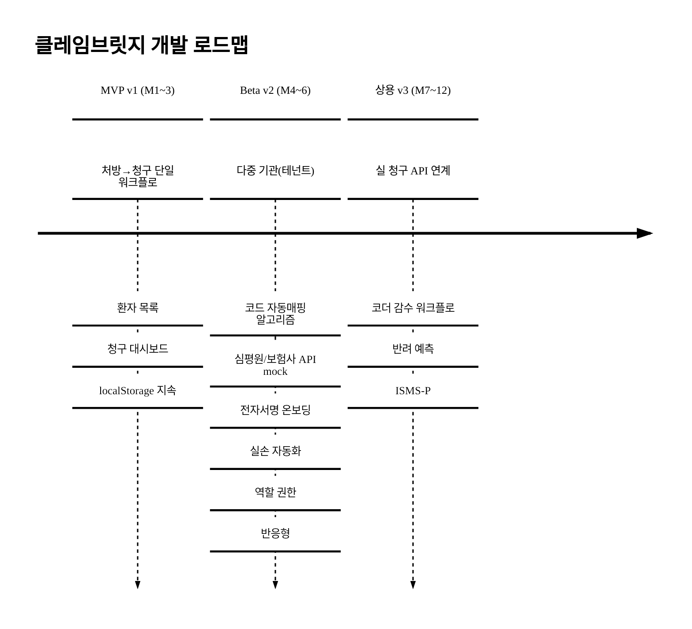

**[그림 6-b] 외부 의존성 리드타임 · 임계경로**

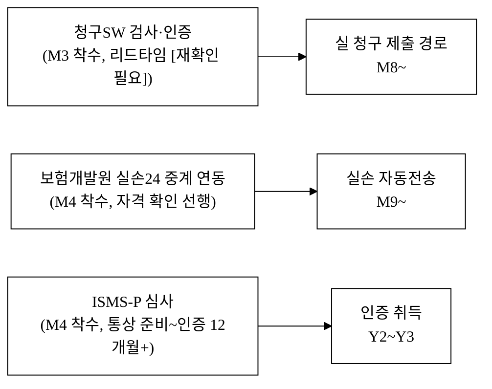

> **외부 의존성의 전제·확률·plan B(실사 정합).** 각 승인은 **통제 불가 외부 변수**다. ① **청구SW 검사·인증** — 청구 주체는 요양기관이므로(§2.6), 자사가 직접 제출 자격을 얻거나 **기존 인증 청구SW로 export**하는 우회를 **plan B**로 확정. ② **실손24** — 보험개발원 중계 인프라 연동 **자격·전제조건**을 선행 확인(임의 API 아님). ③ **ISMS-P** — 통상 준비~심사~인증 **12개월+** 가 일반적이라 12개월 내 "취득"은 낙관 → **Y2~Y3 취득**으로 현실화하고, 그 이전 파일럿은 §13 **파일럿 보안 베이스라인**(가명/합성 데이터 우선)으로 적법성 확보. v1~v2는 **mock 연계**로 워크플로를 완성하고, **실연계 6개월 지연 시 재무 영향은 §6.5-(D) 베어②**로 정량화한다. 실연계 불가 시 제품가치가 "**청구 전처리·반려 점검 도구**"로 축소됨을 잔여 리스크로 정직 기재(§9).

---

## 9. 리스크 · 완화

> 발생가능성 × 영향으로 등급화하고, 각 리스크의 **사업가치 영향(정량)** 을 명시한다.

| 분류 | 리스크 | 가능성×영향 | 대응(정량) | **사업가치 영향(정량)** `[추정]` | 잔여 |
|:---|:---|:---:|:---|:---|:---|
| **규제 적격성** | 의료기관 청구SW 제공·실손24 전송·민감정보 처리 위탁의 법적 자격 미비 | 중×극고 | §13 법령 매핑·법무 검토 마일스톤, 자격 불확실 시 전처리/위탁 모델 우회 | 자격 미비 시 **실청구 매출 0** → 제품 "전처리 도구"로 축소 | 중 |
| **제도** | 비대면진료 시행령·청구 규정 변동 | 중×고 | 룰엔진 분기 갱신·시행령 모니터링[^1] | ARR 인식 분기 지연 | 중 |
| **제도** | **제도 시행 연기/축소**(6~12개월 연기·의원급 범위 축소) | 중×고 | **매출축 독립 헤지** — 실손24 2단계는 이미 2025.10 시행[^3], DTx B2B는 비대면 제도화와 독립 | 의원축 ARR 지연, **베어① 의원 0 가정에서도 DTx·실손축 존속** | 중 |
| **제도** | DTx 수가·급여 모델 미정착 지속 | 중×고 | 수가 괴리[^5]·"제도 밖"[^10]을 비급여·실손 **회수율**로 헤지(§6.6) | **DTx B2B 매출 0 → §6.5 베어①**(ARR Y3 10.5→7.0억) | 중 |
| **기술** | 청구 코드 오매핑 → 반려·삭감·부당청구 | 중×극고 | 정답셋 회귀테스트(반려율 ≤5% 목표)·코더 감수 **의무 게이트**·근거 로깅·**E&O 보험**(§2.6) | 사고 시 사업종료급 → 책임구조·보험으로 한도화 | 중 |
| **기술/보안** | 다중 테넌트 건강정보 누수 | **중×극고** | 테넌트 ID+RLS+행단위 암호화·**자동 격리 회귀테스트**·외부 펜테스트(주기)·**DPIA**·침해통지 절차(개인정보보호법 §34)·**CISO/CPO 지정**·사이버배상보험(§13) | 유출 1건 = 신고·통지·신뢰 붕괴 → 사업가치 급락 | 중 |
| **기술** | 실 청구/실손 연계 승인 지연·실패 | **중×고** | v1~v2 mock 완성, **plan B: 인증 청구SW export 우회**([그림 6-b]) | **베어②**(실연계 6개월 지연 → Y1 ARR 1.2→0.7억, 추가 런웨이 3억) | 중 |
| 운영 | 환자 동의·전자서명 법적효력 | 중×고 | PASS·금융인증서 등 본인확인+타임스탬프+동의이력 무결성, 전자서명법 요건(§2 본인확인 스택) | 효력 미비 시 온보딩 가치 축소 | 중 |
| **재무** | 자금소진·후속투자 실패 | 중×극고 | §6.5 라운드 설계(필요 40억·BEP Y5), **R&D/S&M 동결 트리거**(베어③) | 후속투자 실패 시 번레이트 50% 절감으로 18개월 존속 | 중 |
| **플랫폼** | **DTx/플랫폼 청구 내재화·청구사 M&A(탈중개)** | 중×극고 | **멀티-DTx·멀티-플랫폼 중립성**·규모의경제(내재화비용>구독), 멀티호밍 억제(§5.3-D, 시나리오⑤) | 거점·SAM 동시 증발 → SOM 급락 | 중 |
| **가격** | 경쟁사 끼워팔기/덤핑 + **자사 번들 자산 부재** | 중×고 | 가치 차별 과금·세그먼트 집중(§6.8), 손익분기 단가(ARPU 9만·churn 8%) 방어선 | ARPU −30% 시 §6.5 베어③(ARR Y3 ~4억) | 중 |
| **채널** | 비대면 플랫폼·DTx 사업자 미확보 | 중×고 | 직판 백업, 제휴 win-win 인센티브(§7.1) | CAC 상승·획득 지연 | 중 |
| 정책 | 협약 KPI 미달·환수 | 저×고 | 보수 KPI(§11)·분기 점검·협약 후 존속 논리(§14) | 환수 리스크 → 존속 근거로 완화 | 저 |

---

## 10. 팀 (Team)

<TODO: 사용자 입력>

| 역할 | 이름 | 소속·직함 | 담당 R&R |
|:---|:---|:---|:---|
| 대표 | <TODO: 사용자 입력> | <TODO: 사용자 입력> | <TODO: 사용자 입력> |
| 개발 총괄 | <TODO: 사용자 입력> | <TODO: 사용자 입력> | <TODO: 사용자 입력> |
| 사업·GTM | <TODO: 사용자 입력> | <TODO: 사용자 입력> | <TODO: 사용자 입력> |
| 자문(청구 코더·의료/보험) | <TODO: 사용자 입력> | <TODO: 사용자 입력> | <TODO: 사용자 입력> |

> 청구 정확성은 **청구 코더·의료/보험 자문(외부) + 자체 회귀테스트(내부)** 가 공동 검증한다(실명은 사용자 영역).

---

## 11. 추진 계획 · 조직 · KPI

### 11.1 추진체계도

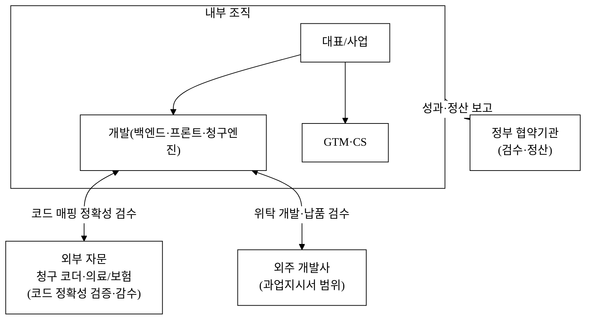

> 자체/외주 분담 경계는 [`2_개발계획서.md`](./2_개발계획서.md) WBS와 [`3_과업지시서_v1.md`](./3_과업지시서_v1.md) §1 범위로 확정한다(자문 R&R 골격만, 실명은 사용자 영역).

**핵심역량 내재화 원칙(평가위원 정합).** **핵심 IP(청구 룰엔진·코드매핑 알고리즘·반려예측·정답셋)는 자체 개발**하고, 외주는 보조 기능(UI·인프라·반복 개발)에 한정한다. 핵심역량을 외주화하지 않는다.

**책임·정산 R&R 경계(골격, 실명 공란).**

| 주체 | 권한·책임 | 청구 정확성 권한 |
|:---|:---|:---|
| 정부 협약기관 | 검수·정산, **분기 성과·정산 보고** 수령 | — |
| 내부 청구정확성 책임자 | 매핑 룰·배포 **최종 승인**·책임 | **승인 권한**(최종책임) |
| 외부 청구 코더 자문 | 고위험 케이스 **감수·권고** | **권고 권한**(승인 아님) |
| 외주 개발사 | 과업지시서 범위 위탁 개발·납품 | 핵심 IP 제외 |

> 청구 정확성의 **최종 책임은 내부 직군**(승인 권한)이며, 외부 코더는 **권고**에 한정한다(권한·책임 분리). 정부 협약기관 보고는 **분기 주기**로 명문화.

### 11.2 인력 · 채용 계획 (고용창출)

> 직군·인원 골격(실명 공란). 인원수는 §6.5 재무와 1:1 정합.

| 직군 | Y1 `[추정]` | Y2 `[추정]` | Y3 `[추정]` | 고용형태 | 단가 가정(연, `[추정]`) |
|:---|---:|---:|---:|:---|:---|
| 백엔드·프론트 개발 | 2 | 4 | 6 | 정규 | 7~9천만원 |
| 청구엔진(코드매핑) 개발 | 1 | 2 | 3 | 정규 | 7~9천만원 |
| CS·온보딩 | 1 | 2 | 3 | 정규/계약 | 4~5천만원 |
| 채널영업·마케팅 | 1 | 2 | 3 | 정규 | 4~6천만원 |
| 청구 코더·의료/보험 자문 | 외부 자문 | 외부 자문 | 1(내부화) | 자문/정규 | 고정 자문료 |
| **신규 직접고용 누계** | **5명** | **+5명(누계 10)** | **+5명(누계 15)** | | |

**인건비 ↔ §6.5 비목 정합.** Y1 개발 2 + 청구엔진 1 ≈ **인건비 2.4억**(7~9천만 × 3) → §6.5 R&D 4억 중 인건비분, 나머지 약 1.6억은 **정답셋 구축·코더 감수 외주·인프라·인증 착수**(§6.5-C 작업패키지). CS·영업 인건비는 S&M/G&A에 배분. 즉 §6.5 R&D/S&M/G&A = §11.2 인원×단가 + 외주/인프라로 1:1 분해된다.

**고용의 질 목표(가점 항목, 비중은 사업계획 영역 — 실명·개인정보는 사용자 영역).**

| 항목 | 목표 비중 `[추정]` | 비고 |
|:---|:---|:---|
| 청년(만 39세 이하) 고용 | 누계의 약 60% `[추정]` | 개발·CS 중심 |
| 여성 고용 | 누계의 약 30% `[추정]` | — |
| 신규 정규직 비중 | 누계의 약 80% `[추정]` | 계약직 최소화 |

> 위 비중은 **사업계획상 목표값**이며, 개별 채용 실명·세부 개인정보는 공고 확정 후 사용자가 채운다(`<TODO: 사용자 입력>`). **청구 코더 일감**은 직접고용이 아니라 **간접 일자리(외주)** 로 분리 집계해 직접고용 누계(15명)와 혼동하지 않는다(§12.2 과대계상 방지).

### 11.3 정량 성과지표(KPI) · 마일스톤

| 지표 | baseline | 1년차 `[추정]` | 2년차 `[추정]` | 3년차 `[추정]` | 판정 |
|:---|:---|---:|---:|---:|:---|
| 도입 의원 수 | 0 | 50곳 | 180곳 | 400곳 | 정량 |
| DTx B2B 통합 사업자 | 0 | 2곳 | 5곳 | 10곳 | 정량 |
| 매출(ARR, 의원축) | 0 | 약 1.2억 | 약 3.7억 | 약 7.0억 | 정량 |
| 자동매핑 커버리지 | `[재확인]` 파일럿 | ≥ 70% | ≥ 80% | ≥ 85% | 정량 |
| 매핑 정확도(precision) | `[재확인]` 파일럿 | ≥ 95% | ≥ 97% | ≥ 98% | 정량(100% 아님) |
| **최종 제출 반려율** | 현 수기 `[재확인]` | ≤ 8% | ≤ 6% | ≤ 5% | 정량 |
| **청구 성공률** | 현 수기 `[재확인]` | 측정 | ↑ | ↑ | 정량 |
| **지급 소요시간** | 현 수기 `[재확인]` | 측정 | ↓ | ↓ | 정량 |
| 월 churn / 연 GRR | — | ≤4% / ~61% | ≤3.5% / ~65% | ≤3% / ~69% | 정량 |
| NRR(업셀 반영) | — | 측정 | ≥ GRR+α | ≥ 100% 목표 | 정량 |
| **네트워크 임계점**(의원·DTx) | 0·0 | 50·2 | 180·5 | **300·10(2층 발효)** | 정량(§5.3) |
| 신규 직접고용 | 0 | 5명 | 누계 10명 | 누계 15명 | 정량(§11.2) |
| 실 청구/실손 연계 | mock | mock 검증 | 착수 | 취득(plan B 우회 포함) | Y/N |
| 보안인증(ISMS-P) | 없음 | 착수(M4)·**파일럿 보안 베이스라인** | 준비 | 취득(Y2~Y3) | Y/N |

> **정확도 KPI 재정의**: "일치율 100%"(측정 불가·도메인 미숙)를 폐기하고, **커버리지·정확도(precision)·반려율**로 분해(§2.5). baseline은 파일럿 실측 전이라 `[재확인 필요]`. **청구 성공률·지급 소요시간·반려율**(§4.3 측정단위)을 정량 KPI로 승격했다. NRR은 GRR과 분리해 업셀 기여를 측정하고 100%는 목표치로만 둔다(§6.4-B2).

**[그림 8] 마일스톤 타임라인 (단계별 정량 합격선)**

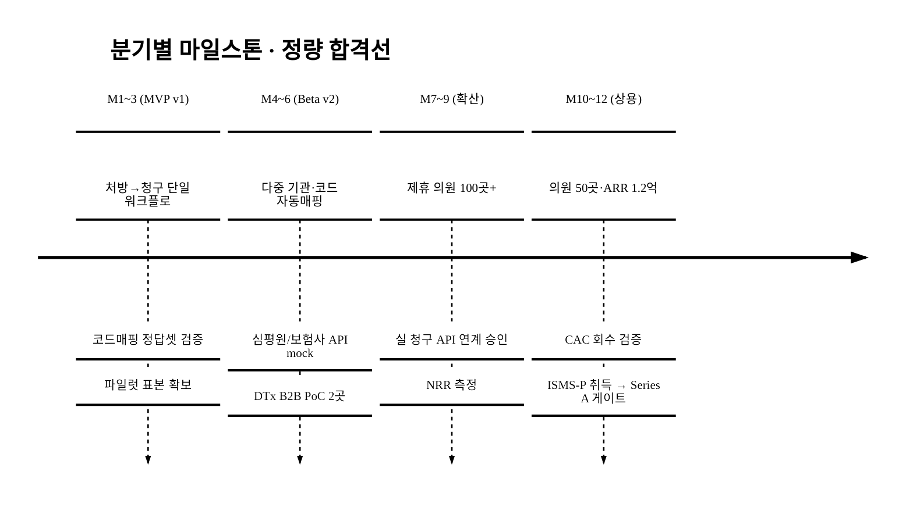

> 절대 날짜는 공고 일정 확정 후 기입한다(`<TODO: 사용자 입력>`).

### 11.4 고객 검증 계획 (수요·지불의사 실증, 실명 공란)

> 현재 LOI·지불의사·파일럿 대기명단은 **0건**(통계 모수만 존재). 이를 정직히 노출하고 **시행 전 확보 마일스톤**을 KPI로 못박는다.

| 검증 항목 | 목표 `[추정]` | 시점 | 산출물(실명 비공개·건수/익명 요약) |
|:---|:---|:---|:---|
| 잠재고객 인터뷰 | 의원 n명 / DTx 대표 m명 | M1~3 | 페인·WTP·희망가격 분포 |
| 지불의사(WTP) 확인 | 인터뷰 중 지불의사 비율 | M1~3 | 가격 수용 곡선 |
| 파일럿 의향(LOI) | 의원·DTx 사업자 LOI 건수 | M3~6 | 익명 LOI 리스트 |
| 유상 PoC 전환 | mock 단계 유상 PoC k곳 | M4~6 | 베타 매출(§6.5 분리집계) |

> 잠재고객 실명·기관명은 **사용자 영역**(`<TODO: 사용자 입력>`)이며, 본 제안서는 **건수·익명 요약·검증 마일스톤**만 제시한다. 검증 결과로 §3 SAM 모수·§6 WTP·전환율을 교체한다.

---

## 12. 기대 효과 · 사회적 가치 (정량)

### 12.1 기대 효과 요약

| 구분 | 내용 | 근거 |
|:---|:---|:---|
| 제도 | 비대면진료·DTx 제도화([^1][^4])가 만든 청구 수요를 인프라로 실현 | §1·§3 |
| 시장 | 진입 3년 약 5억~9억원 매출 도달 가능 `[추정]` | §3 SOM·§6.5 재무 |
| 산업 | DTx 청구 공백 해소로 허가 제품의 실사용 확산 지원 | "제도 밖"[^10] 해소 |
| 사업 | 의원 청구 반려·재청구 시간 절감 `[추정]` | 단일 워크플로(§4.3, 파일럿 실측) |

### 12.2 정량 사회적 가치

| 임팩트 | 산식·시산값 `[추정]` | 정책 KPI 연계 |
|:---|:---|:---|
| 고용창출(직접) | 직접고용 누계 **15명**(§11.2) | 디지털 헬스 일자리 |
| 고용창출(간접) | 청구 코더 **외주 일감**(직접고용과 분리) | 디지털 헬스 일자리 |
| 의료 행정 효율 | 의원 1곳 월 절감 약 **37.5만원**(§6.6) × N곳 × 12 | 비대면진료 제도 정착[^1] |
| DTx 실사용 확산 | 청구 장벽 해소로 허가 DTx 처방 확산 `[추정]` | 디지털의료제품 산업 육성[^11] |
| 청구 정확성 향상 | 반려율 8%→5% 감소로 부당청구·삭감 리스크 축소 `[추정]` | 건강보험 재정 건전성 |
| 의료 접근성 | 비대면진료 청구 인프라로 의원급 참여 확대 | 의료 접근성·지역 격차 완화 |

**행정효율 정량 시산(도입 의원 N별, §6.6 월 37.5만 절감 기준 `[추정]`).**

| 도입 의원 N | 연간 청구처리 인건비 절감 환산 `[추정]` |
|:---|---:|
| 50곳 | 약 2.25억원/년 |
| 180곳 | 약 8.1억원/년 |
| 400곳 | 약 18.0억원/년 |

> 산식 = N × 37.5만원 × 12. **시범사업 모수→제도화 후 모수 연결**: 비대면진료 492만·2.3만 개소[^2]는 **규제완화 시범사업 누적치**이며, 2026.12 제도화 후[^1]는 의원급 **상시 진료**로 전환돼 청구 건수가 **구조적으로 증가**(시범 누적 → 상시 발생)할 것으로 본다 `[추정]`. 절감액·확산 효과는 파일럿 실측 후 갱신(`[추정]`).

---

## 13. 기술 아키텍처 · 데이터 모델 · 보안 · 컴플라이언스 · IP

> CTO 실사 대상 항목. 비즈니스 언어로만 기술됐던 핵심 가치 주장을 **기술 실체**로 보강한다.

### 13.1 데이터 모델 · 시스템 사양

**핵심 엔티티 ERD.**

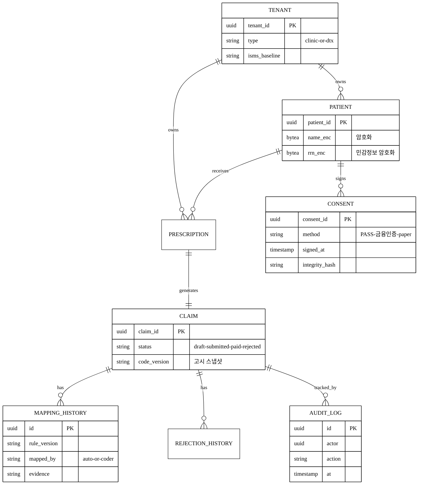

| 항목 | 사양 `[추정]` |
|:---|:---|
| 멀티테넌트 격리 | **테넌트 ID + RLS(Row-Level Security) + 행단위 암호화**, 자동 격리 회귀테스트 |
| 건강정보 암호화 | 저장 = **컬럼/필드 레벨 암호화**(민감정보·주민번호), 전송 = TLS 1.2+, **키 관리(KMS)** 분리 |
| 코드 룰엔진 구현 | **결정테이블 + 룰 DSL(버저닝)**, 보조적으로 반려예측 ML(설명가능성 우선). 고시 버전별 룰셋 스냅샷 |
| 데이터 보존·파기 | 청구이력 보존주기 후 파기, **가명처리** 후 학습 데이터 분리 |
| 감사로그 | 누가/언제/어떤 매핑을 변경했는가(MAPPING_HISTORY + AUDIT_LOG) — 책임구조(§2.6) 증빙 |

### 13.2 보안 · 개인정보 · 규제 컴플라이언스

**적용 법령 매핑(ISMS-P만이 아니다).**

| 법령·기준 | 적용 대상 | 충족 시점 |
|:---|:---|:---|
| 개인정보보호법(민감정보 §23, 침해통지 §34) | 건강정보 처리·위탁·유출 통지 | **파일럿 전 베이스라인** → 상시 |
| 의료법(§23의2 EMR 인증, §21 기록 열람) | EMR 직접 연동 시 | 직접연동 검토 단계 |
| 신용정보법 | 실손=보험금 청구정보 처리 시 | 실손 연계 전 검토 |
| 전자서명법·전자문서법 | 동의·전자서명 효력 | 온보딩 v2 |
| 클라우드 의료정보 저장 가이드(복지부) | 의료정보 클라우드 저장 | 인프라 설계 |
| ISMS-P | 정보보호·개인정보 관리체계 | **Y2~Y3 취득**(준비~인증 12개월+) |

**파일럿 보안 베이스라인(ISMS-P 취득 前 적법성).** 실 환자 민감정보를 인증 없이 다중 테넌트로 처리하면 위법 소지 → 파일럿을 **2단계로 분리**한다.

1. **합성/가명 데이터 검증** — 실 환자 데이터 없이 워크플로·정확도 검증(인증 무관).
2. **실 데이터 처리** — 진입 전 **최소 보안요건**(암호화·접근통제·위탁계약·**DPIA 개인정보 영향평가**)을 ISMS-P 취득 전이라도 충족.

**침해 대응.** 탐지 → **통지·신고 시한**(개인정보보호법 §34) 준수 절차, **CISO/CPO 지정**(역할 골격, 실명 공란), 사이버배상책임보험. 테넌트 누수 가능성은 **'저'→'중'으로 재평가**(§9)했다.

**본인확인·전자서명 스택.** 본인확인 = **PASS·금융인증서 등 간편/금융 인증** 연동(외부 본인확인 사업자, §2.4 외부 의존성), 전자서명 = **타임스탬프 + 동의이력 무결성 해시**로 보험금 청구·민감정보 처리 동의의 법적 효력 요건 충족(전자서명법). 외부 본인확인 사업자 연동을 외부 의존성에 추가.

### 13.3 IP · 기술자산 전략

| 자산 | 전략 |
|:---|:---|
| 코드매핑·반려예측 알고리즘 | **특허 출원 후보**(매핑 방법·반려예측 모델) |
| 정답셋·룰셋 | **영업비밀** 관리 체계(접근통제·버저닝) |
| 데이터 플라이휠 법적 근거 | 환자 건강정보·의료기관 청구데이터는 **의료기관·환자 귀속** → **가명처리 + 데이터 이용 계약(동의 범위) 내에서만** 학습·재활용. 가명정보 결합·이용은 개인정보보호법 절차 준수 |
| 데이터 자산화 양립성 | 가명처리 후 학습은 개인정보보호법(가명정보)·의료법과 양립하도록 **동의 범위·이용 목적**을 계약에 명시. 이 근거 없이는 §5.3 플라이휠 해자가 성립하지 않음을 인정 |

### 13.4 인프라 사이징 (처리량 → 비용)

| 가정 `[추정]` | 값 |
|:---|:---|
| 목표 의원 × 월 청구 건수 | Y3 400곳 × 약 300건 = 월 약 12만 건 |
| + 비대면 전체 모수 참고 | 시범사업 월 약 25만 건[^2] 수준이 상한 방증 |
| 피크 TPS | 낮음(배치성 청구) — 수~수십 TPS 규모 `[추정]` |
| 저장량 | 청구·이력 누적, 암호화 오버헤드 포함 |
| 인프라 COGS | §6.5 GM 75%의 비용 항목으로 반영(코더 감수 변동비와 합산) |

> 확장성 주장을 부하 모델로 뒷받침: 청구는 실시간 고TPS가 아니라 **배치성**이라 인프라 부하는 낮고, GM 압박은 인프라보다 **코더 감수 변동비**(§6.5-C)가 크다.

---

## 14. 정책 부합성 · 사업비 운용 · 존속 · Exit

> 정부 협약사업 통과 요건(정책 부합성·예산·존속)과 VC 회수 경로(Exit)를 통합한다.

### 14.1 정책 부합성 매핑 (트랙 확정 전 골격)

| 공고의 전형적 정책목표 | 본 사업 직접 기여 | 정량 지표(§11.3) |
|:---|:---|:---|
| 디지털의료제품 산업 육성[^11] | DTx 청구 공백 해소로 허가 제품 실사용 확산 | DTx B2B 10곳 |
| 비대면진료 제도 정착[^1] | 의원급 청구 인프라 제공 | 도입 의원 400곳 |
| 디지털 헬스 일자리 | 직접고용 15명 + 코더 간접 일감 | 고용 KPI |
| 건강보험 재정 건전성 | 반려·부당청구 감소(반려율 8%→5%) | 반려율 KPI |

**트랙별 적합성(어느 트랙에 넣어도 정렬).**

- **예비창업/초기** — 제도 시행 선점 거점 확보·PoC 단계 적합(고위험·고성장 J커브).
- **도약** — 실연계·인증·매출 트랙션 확장 단계 적합(Series A 게이트).

> 사업명·주관기관·트랙은 §0 `<TODO: 사용자 입력>` 유지. 위 매핑은 공고 확정 시 좌측을 실제 평가지표로 교체한다.

### 14.2 사업비 운용 계획 (공고 한도 미정 — 비목 골격)

> 공고 한도 확정 후 숫자만 교체할 수 있도록 **비목 구조·비율 가정**을 지금 채운다. 총액·정부지원금 한도는 공고 확정 후(`<TODO: 사용자 입력>`).

| 비목 | 용도 | §6.5/§11.2 연결 |
|:---|:---|:---|
| 인건비 | 개발·청구엔진·CS·영업 정규직 | §11.2 인원×단가 |
| 외주용역비 | **ISMS-P 인증·청구SW 검사·코더 감수·EMR 커넥터** | §6.5-C 작업패키지 |
| 연구장비·재료비 | 인프라(클라우드)·보안 장비 | §13.4 COGS |
| 지급수수료 | 본인확인·실손 중계·법무 검토 | §13.2 |
| 일반관리비 | 운영·관리 | §6.5 G&A |

| 항목 | 가정 `[추정]` | 충당 방안 |
|:---|:---|:---|
| 정부지원금 : 자기부담 | 약 **7 : 3** `[추정]` | 자기부담은 라운드 조달(§6.5 Pre/Seed 15억)로 충당 |
| 매칭펀드 능력 | 라운드 조달 현금으로 매칭 | 기말 현금(§6.5) 내 충당 |

### 14.3 협약 종료 후 존속 · 환수 방지

정부사업 평가위원의 1순위 경계인 **'지원금 소진 후 폐업 → 고용 환수'** 리스크를 정면 방어한다.

- **누적 적자 약 27억**(§6.5)은 **R&D 선투자**(청구엔진·인증·정답셋)에 기인한 **계획된 J커브**이며, 비목과 연결돼 정당화된다(§6.5-C).
- **BEP Y5**, 필요 총조달 약 40억(Pre/Seed 15 + Series A 25). 협약 종료 후 **12~24개월 존속**은 Series A 조달 현금(§6.5 기말 현금 Y3 25.3억·Y4 20.9억)으로 확보.
- 후속투자 실패 시 **R&D/S&M 동결 트리거**(베어③)로 번레이트 50% 절감해 18개월 존속 → 환수 방지.

### 14.4 Exit · 후속투자 시나리오

> VC 회수 경로와 라운드 졸업 조건. (build-vs-buy 논리 포함)

**잠재 인수 후보·동기.**

| 후보 | 인수 동기 |
|:---|:---|
| 레몬헬스케어·기존 EDI(유비케어 등) | 신규 워크플로 세그먼트·반려 데이터 자산·기관망 즉시 확보(build 12~18개월 vs buy) |
| EMR 대기업 | 비대면·DTx·실손24 모듈 즉시 내장 |
| 보험사·핀테크 | 실손 청구 완결성·정산 데이터 |
| 비대면 플랫폼(닥터나우급) | 청구 내재화 대신 인수(탈중개 시나리오⑤의 이면) |

**build vs buy 논리(경쟁사 12~18개월 카피 가능과의 모순 해소).** 경쟁사가 **기능은 카피 가능**해도, 카피로 못 사는 것은 ① 선점 세그먼트의 **전환비용·운영 통합**(§5.3 2층), ② **비공개 반려 정답셋**(§5.3-B), ③ **인증 선취 리드타임**(§13.2)이다. 이 3가지가 임계점(§5.3 [그림 4-d])을 넘으면 **사는 게 카피보다 싸다**.

**M&A 배수·시점.** 동종 헬스 IT/청구 SaaS M&A는 통상 **EV/ARR 3~8배** `[재확인 필요]`(벤치마크 5_research 보강) → 데이터 자산·기관 네트워크 임계점 도달(Y4~Y5, ARR 20~38억) 시 Exit 검토.

**라운드별 졸업 조건(정량 게이트)·밸류 스텝업.**

| 라운드 | 졸업 조건(정량 게이트) | 예상 밸류 스텝업 `[추정]` |
|:---|:---|:---|
| Pre/Seed | 제도 시행 선점 거점, mock 워크플로 완성, LOI n건(§11.4) | base |
| **Seed→A** | **ARR ≥ 5억 + 도입 의원 ≥ 200 + DTx ≥ 5 + NRR 측정 + 실연계(또는 plan B) 취득** | 2~3x |
| Series A→B | ARR ≥ 20억 + BEP 가시화 + 임계점 도달(§5.3) | 추가 스텝업 |

> 다음 라운드 투자자에게 **무엇을 입증해 넘기는가**가 정량 게이트로 정의됐다(KPI 나열이 아니라 졸업 조건).

---

## 참고문헌

> 모든 각주는 [`5_research/README.md`](./5_research/README.md) 에 정리·검증된 출처와 연결된다.

[^1]: **보건복지부 「비대면진료 제도화, 의료법 개정안 15년 만에 국회 본회의 통과」** (2025.12). 공포 후 1년 뒤 2026.12.24 시행, 의원급 중심. https://www.mohw.go.kr/board.es?mid=a10503000000&bid=0027&act=view&list_no=1488108
[^2]: **보건복지부(데일리팜 인용) 「비대면진료 시범사업 결과, 국민 492만명 이용」** (2025). 누적 이용자 492만 명, 참여 의료기관 약 2.3만 개소, 월평균 진료 20만 건(비급여 포함 약 25만 건). https://www.dailypharm.com/user/news/3088
[^3]: **금융위원회·보건복지부 「실손보험 청구 전산화(실손24) 시행」** (2024.10). 보험업법 개정, 2024.10.25 병원급(30병상↑)·2025.10.25 의원급·약국 2단계 시행. https://www.fsc.go.kr/no010107/83225
[^4]: **식약처(데일리팜 인용) 「디지털의료기 허가 7년만에 1→388건…AI·DTx 임상 급증」** (2025.7). 누적 허가 388건, 임상시험계획 승인 225건, DTx 9건. https://www.dailypharm.com/user/news/2997
[^5]: **전자신문 「디지털 치료기기(DTx), 병원은 25만원인데 심평원은 2만원」** (2024.8). 비급여 처방가 20~25만원, 심평원 기준가 2만5,390원, 선별급여 시 환자 90% 부담. https://www.etnews.com/20240826000197
[^6]: **식약처(메디게이트 인용) 「국산 1호 디지털치료기기 에임메드 솜즈 허가·처방」** (2023.2~2024). 2023.2.15 1호 허가, 2024.1 서울대병원 정식처방, 2024.7 의원급 처방 개시. https://medigatenews.com/news/1943357297
[^7]: **국민건강보험공단·건강보험심사평가원 「2023년도 건강보험환자 진료비 실태조사」** (2024.7 발표). 비급여 포함 총진료비 약 133.0조 원, 보장률 64.9%, 비급여 진료비 약 20.2조 원. https://www.newsis.com/view/NISX20250107_0003023738
[^8]: **Grand View Research 「Digital Therapeutics Market Size, Industry Report 2030」** (2024). 글로벌 DTx 2024년 76.7억 달러 → 2030년 325억 달러, CAGR 27.77%. https://www.grandviewresearch.com/industry-analysis/digital-therapeutics-market
[^9]: **레몬헬스케어(whosaeng 인용) 「보험개발원 실손보험 청구 전산화 시스템 사업자 선정」** (2024). 상급종합병원 72%↑ 점유, 레몬케어 누적 다운로드 1,300만↑. http://www.whosaeng.com/152356
[^10]: **식약처(더메디컬 인용) 「벌써 6호 나왔는데…디지털치료제 실사용은 아직도 '제도 밖'」** (2024). 허가 6호 시점에도 실처방·수가 미정착. https://www.themedical.kr/news/articleView.html?idxno=2379
[^11]: **식약처·한국디지털헬스산업협회 「디지털치료기기 허가·심사 가이드라인(안내서-1045-02)」** (2025.5). 디지털의료제품법 2025.1 시행, 허가·심사 체계 정비. https://kodhia.or.kr/core/?cid=146&uid=5636&page=1&role=view
[^12]: **보험연구원(KIRI) 「국내 디지털 치료제 현황 및 시사점」** (2023). 국내 DTx 수가·급여 모델 부재, 제도 정비 필요성. https://www.kiri.or.kr/pdf/연구자료/연구보고서/nre2023-03_4.pdf
[^13]: **한국보건산업진흥원(코리아바이오) 「디지털 헬스케어 산업 현황 및 전망」 브리프 197호** (2025, `[재확인 필요]` 원문 수치). 국내외 디지털 헬스케어 성장세, 국내 시장 초기 단계. https://www.koreabio.org/board/download.php?board=Y&bo_table=brief&file_name=b_file_1742771980tg9i7cdmmf.pdf
[^14]: **한국전파진흥협회(KCA) 외 「글로벌 디지털 헬스케어 시장 전망」** (**2020년 기준 전망치 — 과거치, `[재확인 필요]`**). 글로벌 2020년 1,520억 달러 → 2027년 5,090억 달러, CAGR 18.8%. 본문에서는 성장 방향의 방증으로만 인용하며 절대 규모 근거로 쓰지 않는다(최신 2024~2025 전망으로 교체 권장). https://www.kca.kr/hot_clips/vol83/sub01.html
[^15]: **건강보험심사평가원·보건복지부 「건강보험통계연보(요양기관 종별 현황)」** (`[재확인 필요]`, 매년 발간). 전국 의원급 의료기관 약 3.6만 개소·약국 약 2.5만 개소 규모. 본문 §3.1 모수 상한 산정에 사용하며, 정확 수치는 최신 통계연보·보건의료빅데이터로 확정한다(통계 포털: 건강보험심사평가원 통계연보 https://www.hira.or.kr ). (정확 수치·발간연도 5_research 보강 예정)

[^16]: **RapidClaims·HFMA MAP Keys 등 「Claim scrubbing software / clean claim rate benchmark」** (해외, 2024~2025, `[추정]` 방향 방증). clean claim rate 목표 95%+, claim scrubbing 도입 시 반려율 5~15%→1~3%(상대 65~85%↓)·denial write-off 40~60%↓. **미국 RCM 기준이며 국내 직접 등치 아님**. https://www.rapidclaims.ai/blogs/how-medical-claim-scrubbing-software-improves-clean-claim-rates

[^17]: **MGMA 「DataDive / Benchmarking on denials」** (2023~2024, `[추정]` 방향 방증). 거부 청구 1건 재작업비용 약 $25.20(클린청구 처리비 ≈$6.50), 단일과 진료과 평균 denial 약 8%, 2024년 다수 기관 denial 10%+ 보고. **미국 시장 값**. https://www.mgma.com/mgma-stat/strategic-improvements-in-your-rcm-to-reduce-your-practices-claim-denials

[^18]: **(자기검토 메모) 기존 강자가 "늦게" 대응하는 이유.** (a) 아키텍처 종속(레몬=B2C 실손, EMR=전통 EDI 데이터모델 → 신규 워크플로 단일데이터화에 재설계 시간이 들지만, 별도 제품 출시 시 결정적 장애 아니므로 해자로 쓰지 않음). (b) 하방 확장 유인은 강함 → "안 함"이 아니라 "**아직 안 한·늦게 할**"로 봄. (c) DTx 수가[^5]·실손24 코드체계[^3]·비대면 청구[^1] 룰 입력은 공개 고시라 누구나 봄 → 진입장벽 아닌 **운영비용(비용 패리티)**. 진짜 비대칭은 §5.3-B 비공개 반려결과 데이터에서만 발생.

---

## 데이터 정직성 선언

- 본 제안서의 모든 시장·제도 수치는 [`5_research/README.md`](./5_research/README.md) 각주의 1차/공공/언론 출처에 연결되며, 인용 출처를 100% 표기했다.
- **공식값**: 총진료비 약 133조 원([^7]), 비대면진료 참여 의료기관 약 2.3만 개소·이용자 492만 명([^2]), 실손24 2단계 시행([^3]), DTx 허가 9건·디지털의료기기 388건([^4]), 수가 괴리(20~25만원 vs 2.5만원, [^5]), 레몬헬스케어 상급병원 72% 점유([^9]), 글로벌 DTx 325억$([^8])·디지털헬스 5,090억$([^14])는 검증된 공식·1차/언론 출처값이다.
- **`[추정]` (가설, 공식값과 혼용 금지)**: TAM bottom-up 채택률·ARPU(종전 0.3% 단일계수는 폐기), SAM 청구수요 의원 수(약 1만 개소)·월 구독단가(15만원)·민감도, SOM 침투율(3~5%), §6 유닛이코노믹스(CAC·LTV·월 churn·GRR/NRR·그로스마진·ARPU·DTx B2B 단가·회수기간·민감도)·§6.5 재무 5개년·라운드·BEP·스트레스 시나리오·§6.6 고객 ROI·§11.2 인건비 단가·고용의 질 비중·§11.3 KPI(정확도·반려율·임계점)·§12.2 사회가치 환산액·§13 보안·인프라 사양·§14 정책부합·사업비 비율(7:3)·Exit 배수·§5.3 man-month·임계점. 모두 본문에 `[추정]` 병기했다.
- **`[재확인 필요]`**: ① SAM "상시 디지털 청구 수요 의원 수"(2.3만 개소 부분집합 가정) — 제출 전 실 영업·시행 후 통계로 확정. ② **전국 의원 3.6만·약국 2.5만 개소([^15])** — 최신 건강보험통계연보로 확정. ③ **[^14] 글로벌 디지털헬스 5,090억$는 2020년 기준 전망(과거치)** — 최신 전망 교체. ④ 매핑 정확도·반려율 baseline·동종 B2B SaaS ARR 벤치마크·M&A EV/ARR 배수 — 파일럿 실측·5_research 보강. ⑤ 구독단가·침투율·DTx 갱신율·WTP — 실 영업 데이터로 교체.
- 침투율·전환율·시간절감·청구 성공률 등 효과 수치는 출처 없는 가설이므로 파일럿(§4.3·§7)에서 실측해 갱신한다. 검증되지 않은 수치를 사실로 표현하지 않았다.

<!-- 빈칸 목록
- §0 사업명·주관기관·트랙·일정·팀
- §10 팀 구성 전체(대표·개발총괄·사업/GTM·자문 이름·소속·R&R)
- §11.1 책임·정산 R&R 실명(내부 청구정확성 책임자·외부 코더 등)
- §11.2 고용의 질 비중은 사업계획 목표값(골격), 개별 채용 실명·개인정보는 공고 확정 후
- §11.3 일정 절대 날짜 / §8 M1 절대 시작월(2026 Q1 가정값 — 공고 확정 시 교체)
- §11.4 고객 검증 — 잠재고객·LOI 실명/기관명(건수·익명 요약만 본문, 실명 공란)
- §13.2 CISO/CPO 지정 실명
- §14.2 사업비 총액·정부지원금 한도·자기부담 비율(7:3은 [추정] 가정 — 공고 확정 후 교체)
- (제출 전 필수) SAM "상시 디지털 청구 수요 의원 수" 실데이터 확정 / 구독단가·침투율·DTx 갱신율·WTP 영업 데이터 교체
- (출처 보강) [^15] 의원·약국 기관수 통계연보 / 동종 B2B SaaS ARR·M&A EV/ARR 벤치마크 / [^14] 최신 글로벌 디지털헬스 전망
-->
