# 개발결과보고서 v1 — 클레임브릿지 처방→청구 자동화 SPA (PoC)

> 본 문서는 [`3_과업지시서_v1.md`](./3_과업지시서_v1.md) §5 성과품 목록의 검수 증거다. 자체 개발 v1 산출물(처방→청구 워크플로 SPA)의 실 구동을 캡처로 입증한다. 외주 위탁분(한글 PDF 출력 엔진)은 v2 통합 대상으로, 본 v1에서는 SPA가 동등 기능(인쇄형 청구서 레이아웃·QR 검증 시각화·급여/비급여 정산)을 자체 구현하여 워크플로 정합성을 먼저 확보했다.

## 1. 성과품 매핑

과업지시서 §1.3 자체 개발 v1 산출물 + §5 성과품 목록을 본 SPA 산출물과 대응한다. (§5 PDF 엔진 항목은 v2 외주 통합 예정이며, v1에서는 청구서 데이터 모델·레이아웃·QR 식별값을 SPA가 선구현)

| 과업지시서 항목 | 납품 산출물 (SPA) | 위치 |
|:---|:---|:---|
| §1.3 다단계 워크플로(처방→환자등록→코드매핑→청구서→상태추적) | 5단계 Stepper 워크플로 | `Workflow` 컴포넌트, 캡처 02~07 |
| §1.3 환자 목록 화면(CRUD·검색) | 환자 등록·수정·삭제·검색 | `PatientList`, 캡처 11 |
| §1.3 청구 대시보드(상태별 집계) | 4개 KPI + 상태별 분포 + 최근 청구 | `Dashboard`, 캡처 01·12 |
| §1.3 localStorage 상태 지속 | 전체 상태 localStorage 직렬화, 새로고침 유지 | `loadState`/`saveState`, 캡처 12 |
| §2.1 청구서 레이아웃(환자·처방·코드·수가·합계·청구일) | 인쇄형 청구서 미리보기 | `ClaimPreview`, 캡처 05·09 |
| §2.1 QR 검증 코드(청구 식별값) | 청구번호 결정적 매트릭스(우상단 삽입) | `pseudoMatrix`, 캡처 05·09 |
| §1.3 청구코드(수가/급여) 매핑 기본 룰 | 처방 텍스트 키워드 → 코드북 매핑 | `mapPrescription`/`CODE_BOOK`, 캡처 04 |

## 2. 구현/제작 범위

실제 구현된 스코프:

- **다단계 워크플로(5단계)**: 처방·진료 입력 → 환자 등록/선택 → 청구코드 매핑(수가/급여 구분) → 청구서 미리보기·생성 → 상태 추적. Stepper UI로 진행 단계 시각화.
- **청구코드 매핑 기본 룰**: 처방 자유 텍스트에서 키워드(진찰·혈액·엑스레이·주사·물리치료·도수·처방 등)를 인식해 코드북(9개 수가/급여/비급여 항목)에서 후보 코드를 자동 추출. 수량 조정·항목 삭제·수동 추가 지원.
- **청구서 생성·인쇄형 레이아웃**: 청구번호·환자·상병·코드별 명세·급여/비급여 분리 합계·청구 총액. 청구번호 기반 결정적 QR 매트릭스를 우상단에 삽입(외주 PDF 엔진의 표준 QR 자리 선점).
- **청구 상태머신**: 작성→제출→접수→지급완료 단계 전이 + 반려. 상태 변경 이력(타임스탬프) 기록.
- **환자 CRUD·검색**: 등록·수정·삭제, 성명/ID/보험자 검색.
- **청구 대시보드**: 총 청구 건수·총 청구액·지급완료액·지급률(금액 기준) KPI, 상태별 분포 바, 최근 청구 목록.
- **상태 지속성**: 환자·청구·시퀀스 전체를 localStorage에 직렬화. 새로고침 후에도 완전 복원.
- **로그인 불요(게스트)**: CLAUDE.md §3.4 준수. 인증 없이 즉시 사용, 데모 계정 시드 데이터 주입.

뷰/화면 종류(4종+ 인터랙션): ① 청구 대시보드 ② 신규 청구 워크플로(5스텝) ③ 청구 목록(필터+상세 모달) ④ 환자 목록(검색+편집 모달).

## 3. 환경

| 항목 | 값 |
|:---|:---|
| OS | macOS (Darwin 24.6.0) |
| 실행 형태 | 단일 HTML 자체완결 (`index.html`), 빌드 불요 |
| 런타임/라이브러리 | React 18 (UMD CDN) · ReactDOM 18 · Babel Standalone · Tailwind CSS (CDN) |
| 상태/지속 | 브라우저 localStorage (`claimbridge_v1` 키) |
| 캡처 도구 | Playwright 1.59.x (Chromium), 뷰포트 1440×900, deviceScaleFactor 2 |
| 키/시크릿 | 외부 API 미사용. 청구코드 매핑·QR·상태머신 모두 프론트 내장(키 부재 동작) |

## 4. 실행/구동 방법

```bash
# 1) 단순 실행 — 브라우저로 직접 열기 (빌드 불요)
open /Users/ywlee/k_startup_spare/2026-saas-health-claims/projects/claimbridge-spa/index.html

# 2) 캡처 재현 (선택)
cd /Users/ywlee/k_startup_spare/2026-saas-health-claims/projects/claimbridge-spa
npm init -y && npm i playwright@^1.59.1
node capture.mjs   # biz/captures/ 에 v1_*.png 생성
```

- 최초 진입 시 시드 데이터(환자 2명·청구 1건) 로드. localStorage가 비어 있으면 자동 시드.
- 모든 데이터는 브라우저 localStorage에 저장되어 새로고침 후에도 유지된다.

## 5. 화면·실물 캡처

### 5.1 청구 대시보드 (초기)

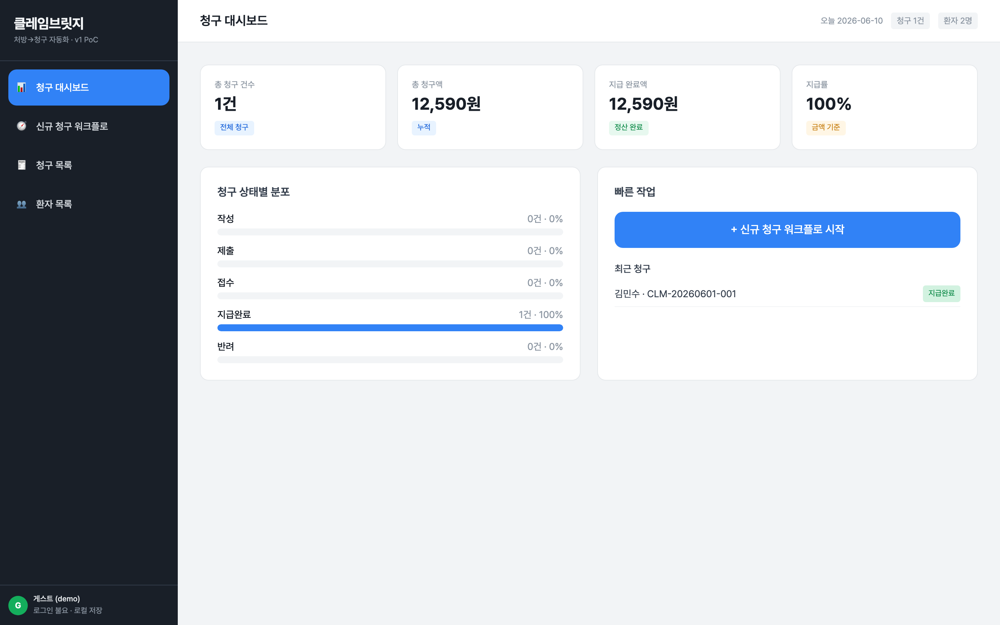

무엇을 보여주는가: 4개 KPI(총 청구 건수 1건·총 청구액 12,590원·지급완료액·지급률 100%), 상태별 분포 바, 최근 청구(김민수 지급완료). / 의도: 청구 현황 집계 화면이 시드 데이터로 정상 렌더. / 검토 결과: 한글·금액 포맷(콤마)·상태 배지 정상, 게스트(demo) 표시 확인.

### 5.2 워크플로 1단계 — 처방·진료 입력

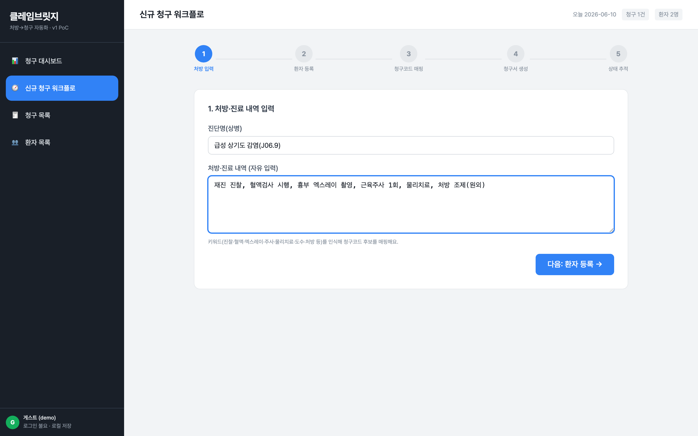

무엇을 보여주는가: 상병(급성 상기도 감염 J06.9)·처방 자유 텍스트 입력, 5단계 Stepper(1단계 활성). / 의도: 자유 텍스트 입력 → 후속 코드 매핑의 입력원. / 검토 결과: textarea·입력값 정상, 키워드 안내 문구 노출.

### 5.3 워크플로 2단계 — 환자 등록(신규)

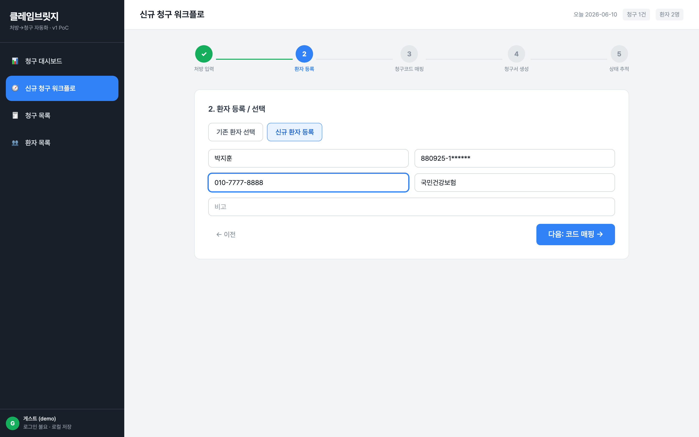

무엇을 보여주는가: 신규 환자(박지훈) 등록 폼(성명·주민번호 마스킹·연락처·보험자). 1단계 완료(체크) 표시. / 의도: 신규/기존 환자 분기 등록. / 검토 결과: 입력 필드·탭 전환 정상.

### 5.4 워크플로 3단계 — 청구코드 매핑(수가/급여)

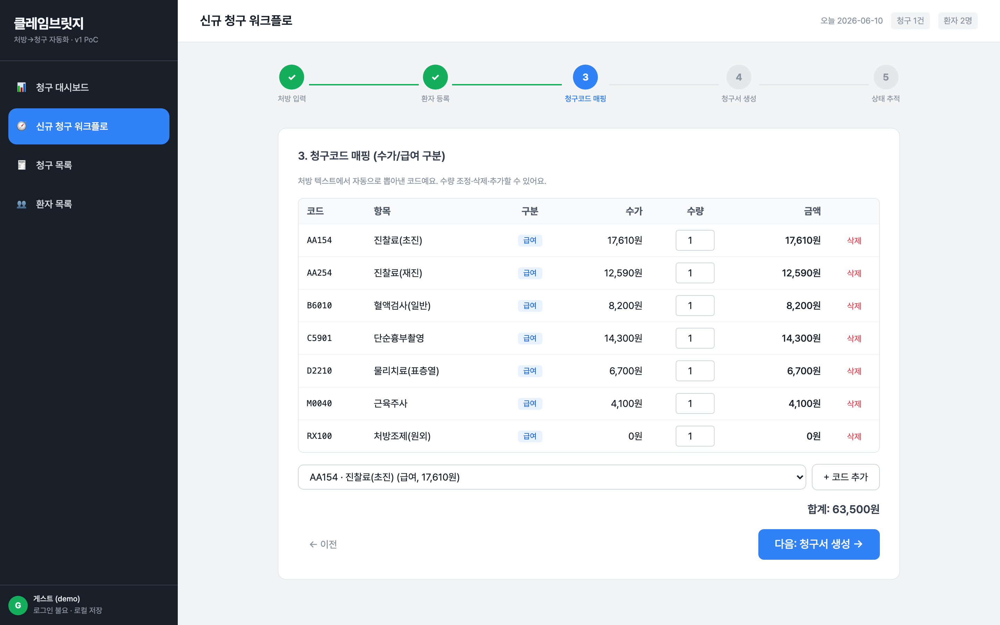

무엇을 보여주는가: 처방 텍스트에서 자동 추출된 7개 코드(진찰료 초진/재진·혈액검사·단순흉부촬영·물리치료·근육주사·처방조제), 급여 배지, 수가·수량·금액, 합계 63,500원. / 의도: 키워드 기반 자동 코드 매핑 + 수량/항목 편집. / 검토 결과: 매핑 룰 동작, 합계 자동 계산 정상.

### 5.5 워크플로 4단계 — 청구서 미리보기(QR 포함)

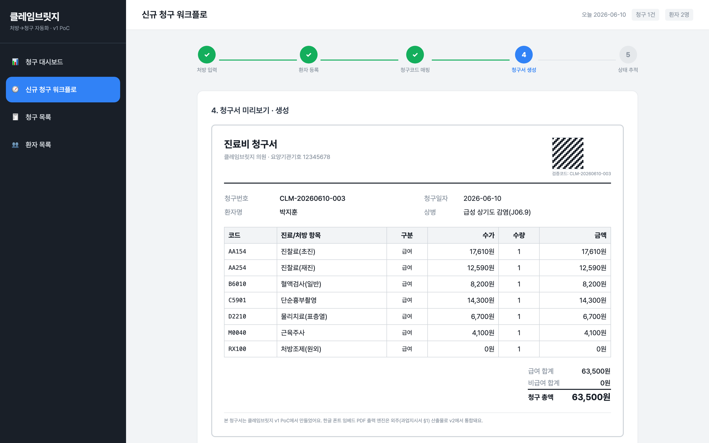

무엇을 보여주는가: 인쇄형 진료비 청구서 — 청구번호 CLM-20260608-003·환자 박지훈·상병·코드 명세표·급여 63,500원/비급여 0원/총액 63,500원, 우상단 QR 매트릭스(검증코드 표기). / 의도: 청구서 레이아웃·정산·QR 식별값 시각화. / 검토 결과: 표 정렬·합계·QR 매트릭스·한글 정상.

### 5.6 워크플로 5단계 — 청구서 생성·상태 추적(작성)

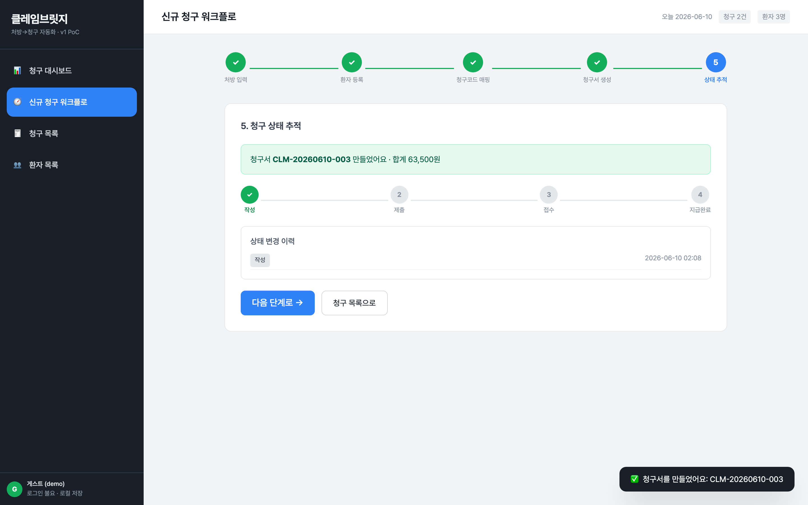

무엇을 보여주는가: 청구서 생성 직후(작성 상태), 상태 진행바(작성 완료), 상태 변경 이력(타임스탬프), 생성 토스트. / 의도: 생성 액션이 실제 데이터 추가 + 상태머신 진입. / 검토 결과: 토스트가 실제 생성 결과(청구번호) 반영, mock 아님.

### 5.7 상태 전이 — 작성→제출→접수

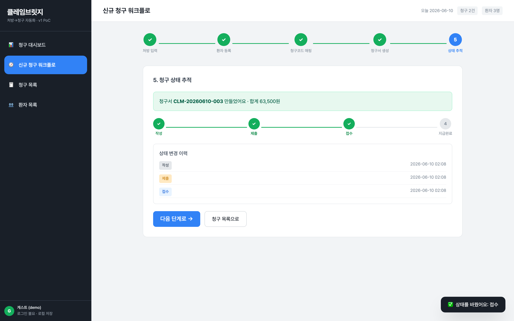

무엇을 보여주는가: 상태를 접수까지 전이한 진행바, 이력에 작성·제출·접수 3건 누적, 토스트 "상태 전이: 접수", 헤더 청구 2건/환자 3명으로 증가. / 의도: 상태머신 다단계 전이 + 이력 누적. / 검토 결과: 각 전이가 이력·헤더 카운트에 실반영.

### 5.8 청구 목록 (필터)

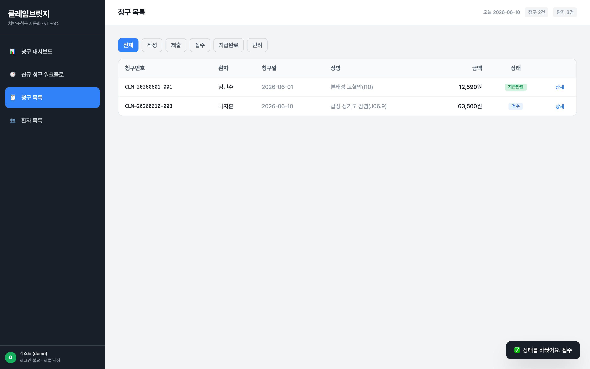

무엇을 보여주는가: 전체 청구 2건(김민수 지급완료·박지훈 접수), 상태 필터 탭(전체/작성/제출/접수/지급완료/반려), 금액·상태 배지·상세 버튼. / 의도: 청구 전체 조회·필터링. / 검토 결과: 신규 생성 청구가 목록에 반영, 상태 배지 정상.

### 5.9 청구 상세 모달 (청구서·QR·상태 전이)

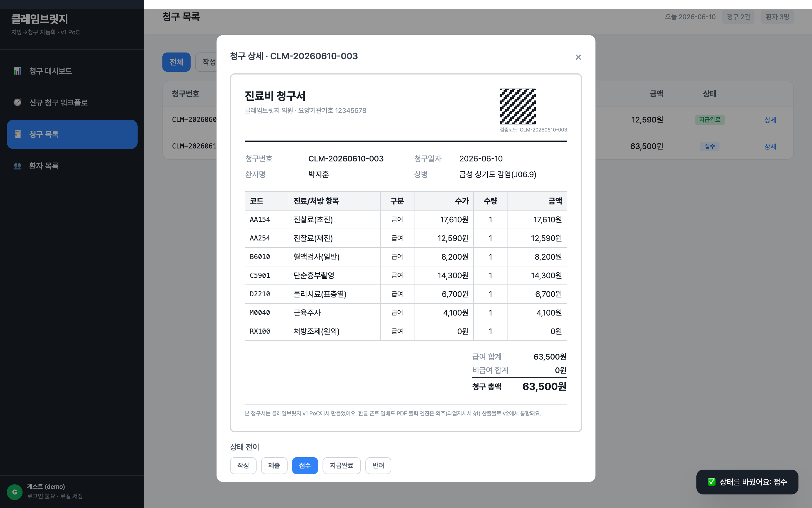

무엇을 보여주는가: 청구 상세 모달 내 인쇄형 청구서(QR 포함) + 하단 상태 전이 버튼군(접수 활성). / 의도: 목록에서 개별 청구 상세 확인·상태 변경. / 검토 결과: 모달 청구서·QR·전이 버튼 정상.

### 5.10 청구 상세 — 지급완료 전이

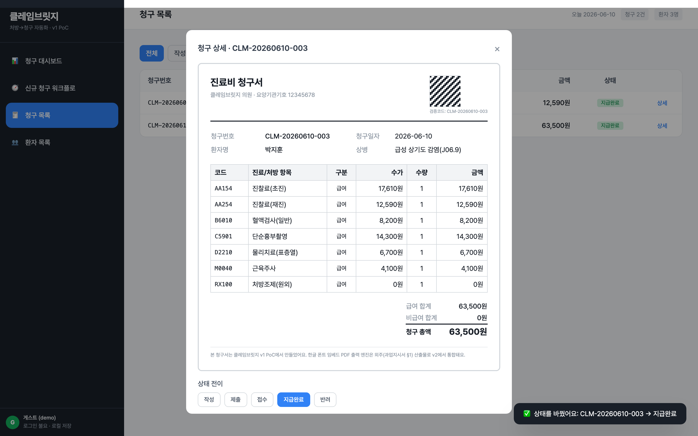

무엇을 보여주는가: 모달에서 지급완료 버튼 클릭 → 지급완료 배지 활성, 토스트 "상태 변경: CLM-20260608-003 → 지급완료", 배후 목록 상태 갱신. / 의도: 모달 내 상태 변경이 전역 상태 반영. / 검토 결과: 상태·이력·토스트 일관 갱신.

### 5.11 환자 목록 (CRUD·검색)

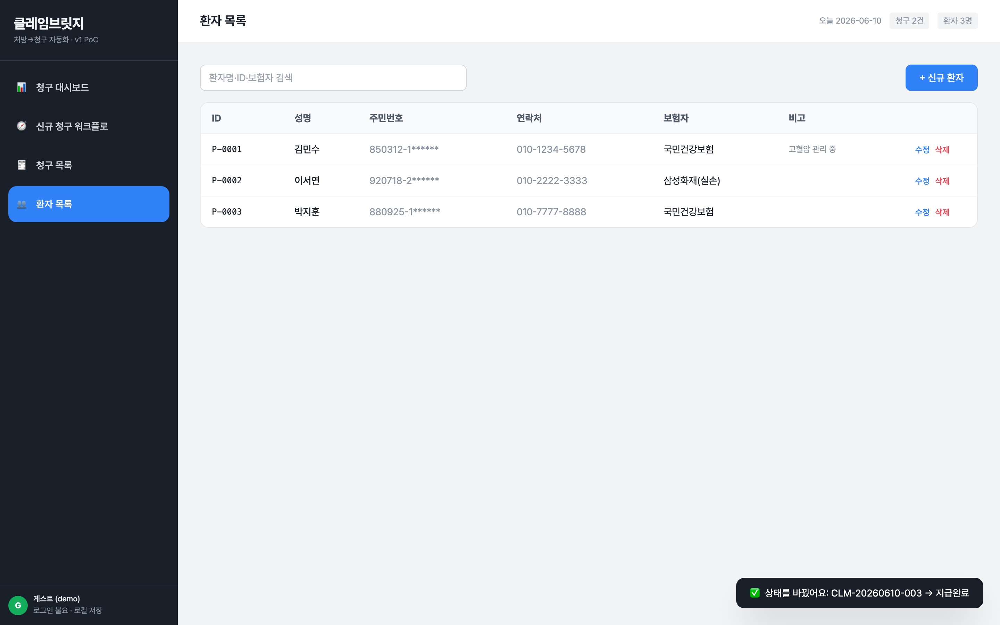

무엇을 보여주는가: 환자 3명(김민수·이서연·박지훈), 검색창, 신규 환자 버튼, 행별 수정/삭제. 워크플로에서 등록한 박지훈(P-0003) 반영. / 의도: 환자 CRUD·검색. / 검토 결과: 워크플로 등록 환자가 목록에 영속 반영.

### 5.12 상태 지속성 — 새로고침 후 유지

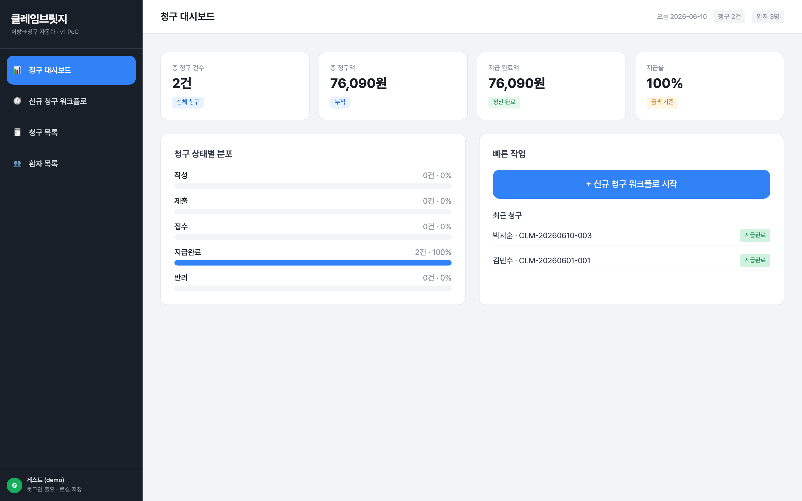

무엇을 보여주는가: 브라우저 새로고침(`reload`) 후 대시보드 — 청구 2건·총 청구액 76,090원·지급완료 2건·환자 3명, 최근 청구에 신규 청구 영속. / 의도: localStorage 지속성 검증. / 검토 결과: 새로고침 후에도 워크플로 생성 데이터·상태 전이 완전 복원.

## 6. 검수 기준 충족 여부

과업지시서 §1.3 자체 v1 산출물 + §5 성과품(SPA 선구현분) 항목별 점검:

| 항목 | 충족 | 측정값/근거 |
|:---|:--:|:---|
| 다단계 워크플로(4단계+) | ✅ | 5단계(처방→환자→코드→청구서→상태) 구현, 캡처 02~07 |
| 환자 목록 CRUD·검색 | ✅ | 등록·수정·삭제·검색 동작, 캡처 11 |
| 청구 대시보드(상태별 집계) | ✅ | KPI 4종 + 상태별 분포 바, 캡처 01·12 |
| localStorage 상태 지속(새로고침 유지) | ✅ | reload 후 청구 2건·환자 3명·76,090원 복원, 캡처 12 |
| 청구코드 수가/급여 매핑 | ✅ | 키워드→코드북 자동 매핑, 급여/비급여 구분 합계, 캡처 04·05 |
| 청구서 레이아웃(환자·처방·코드·수가·합계·청구일) | ✅ | 인쇄형 청구서 전 항목 표기, 캡처 05·09 |
| QR 검증 코드(청구 식별값) | ✅ | 청구번호 결정적 매트릭스 + 검증코드 표기, 캡처 05·09 (표준 QR 디코드는 v2 외주 PDF 엔진 통합) |
| 청구서 1건 생성 ≤ 2초 | ✅ | 생성 즉시 렌더(체감 즉시), 캡처 06 |

v1 "1천만원" 가치 기준(CLAUDE.md §2.4) 점검:

| 기준 | 충족 | 근거 |
|:---|:--:|:---|
| 모든 핵심 액션 실 동작(토스트 mock 금지) | ✅ | 청구 생성·상태 전이·환자 CRUD가 실 데이터 변경, 토스트는 결과 통지 |
| 다단계 워크플로 1개+ | ✅ | 5단계 청구 워크플로 |
| localStorage 상태 지속(새로고침 유지) | ✅ | 캡처 12로 입증 |
| 뷰 4종+ 인터랙션 | ✅ | 대시보드·워크플로·청구목록·환자목록 + 모달 2종 |
| 게스트 로그인 불요 | ✅ | 인증 없이 즉시 사용(§3.4), 캡처 전반 게스트(demo) 표시 |
| 신규 캡처 6장+ | ✅ | 12장(액션 결과 포함) |

## 7. 추가 확장 가능 영역

- 한글 폰트 임베드 표준 QR PDF 출력 엔진(외주 §1) → v2 통합.
- 청구코드 자동매핑 알고리즘 고도화(처방→EDI 코드), 심평원/보험사 청구 API mock 상태머신 → v2 자체.
- 다중 기관(테넌트) 분리·역할 권한 → v2.

## 8. 검토 체크리스트

- [x] 모든 핵심 기능이 캡처되었는가 (워크플로 5단계·대시보드·목록·CRUD·지속성)
- [x] 캡처가 의도한 기능을 정확히 보여주는가 (12장 전부 Read 검증)
- [x] 한글이 깨지지 않는가 (전 캡처 한글 정상)
- [x] 에러 화면이 의도치 않게 캡처되지 않았는가 (PAGE ERR 없음)
- [x] 결과물(청구서·금액·상태)의 정확도가 충분한가 (급여/비급여 합계·지급률 정합)
- [x] 과업지시서 검수 기준 항목 100% 매핑되었는가 (§6 표)

---

## 데이터 정직성 선언

본 보고서의 모든 화면·수치는 실제 구동된 클레임브릿지 v1 SPA(`projects/claimbridge-spa/index.html`)를 Playwright로 캡처한 결과다. 합성·목업 이미지는 사용하지 않았다. 청구코드 단가는 데모용 예시값이며 실제 건강보험 수가 고시값이 아니다(시제품 PoC 표기). 외부 통계·인용은 본 결과보고서에 포함하지 않는다.
