# 개발결과보고서 v2 — 클레임브릿지 멀티테넌트 청구 자동화 플랫폼 (Beta)

> 본 문서는 [`4_과업지시서_v2.md`](./4_과업지시서_v2.md) §5 성과품 목록의 검수 증거다. v1 PoC([`3_1_개발결과보고서_v1.md`](./3_1_개발결과보고서_v1.md)) 위에 멀티테넌트·역할권한·자동매핑 알고리즘·EDI API mock·전자서명·실손 자동화를 심화 구현한 v2 베타 SPA([`../projects/claimbridge-spa/v2.html`](../projects/claimbridge-spa/v2.html))의 실 구동을 캡처로 입증한다. v1 산출물(`index.html`)은 수정하지 않고 `v2.html` 신규 파일로 분리했다.

## 1. 성과품 매핑

과업지시서 §5.2 자체 v2 핵심 산출물 8가지 + §5.1 외주 기반(스키마·PDF 양식) 선구현분을 본 SPA 산출물과 대응한다.

| 과업지시서 §5 항목 | 납품 산출물 (v2 SPA) | 위치·캡처 |
|:---|:---|:---|
| §5.2-1 반응형(데스크톱 + 모바일 환자뷰) | 데스크톱 1440px 관리자 + 414px 모바일 환자 포털 프레임 | `App`/`PatientPortal`, 캡처 01·17~19 |
| §5.2-2 다중 기관(테넌트) | 2개 테넌트(서울365의원·부산항운정형외과) `tenant_id` 격리 저장·전환 | `TENANTS`/`TenantAdmin`/`updateTenant`, 캡처 02·03 |
| §5.2-3 청구코드 자동매핑 알고리즘·검증 | 토큰 스코어링 매핑(점수·근거) + 5룰 검증 엔진(pass/warn/error) | `autoMapPrescription`/`validateClaim`, 캡처 05 |
| §5.2-4 심평원/보험사 청구 API mock(제출→접수→지급) | `ediSubmit`/`ediAdjudicate` mock + EDI 통신 로그(REQ/RES JSON) | `Workflow`/`ReviewConsole`, 캡처 07·09·10·11 |
| §5.2-5 환자 onboarding 동의·전자서명 | 동의서 + 캔버스 서명→PNG dataURL 저장·이력 기록 | `ConsentModal`, 캡처 14·15 |
| §5.2-6 실손 청구 자동화 흐름 mock | 환자 포털에서 실손 청구하기 → 보험사 mock 접수 | `PatientPortal.fileReimburse`, 캡처 18·19 |
| §5.2-7 역할 권한(의료진·청구담당·환자) | RBAC 3역할 메뉴/기능 분기·접근 차단 | `ROLES`/`AccessDenied`, 캡처 16·17 |
| §5.2-8 청구 상태·지급률·반려사유 대시보드 | 상태별 집계·지급률(%)·반려사유 분석 | `Dashboard`/`ReviewConsole`, 캡처 01·10·20 |
| §5.1-O4 PDF 엔진 고도화(기관 양식 분기·실손) | 청구서 기관별 로고·색상 분기 + 실손 양식 레이아웃(SPA 선구현) | `ClaimPreview`, 캡처 06·11 |
| §5.1-O1 멀티테넌트 스키마(선구현) | Tenant·User역할·Patient·Claim·ClaimEvent·Consent 데이터 모델 | `seed`/state shape, 캡처 02 |

## v1 한계 및 v2 개선 매핑

CLAUDE.md §2.4 v2 필수 구조 — v1에서 부족했던 항목 ↔ v2에서 해결한 방식 1:1.

| # | v1 한계 | v2 개선 방식 | 입증 캡처 |
|:--:|:---|:---|:---|
| 1 | 단일 기관 전제(테넌트 개념 없음) | `tenant_id` 격리 멀티테넌트(2개 기관) + 전환 시 데이터 완전 교체, 타 테넌트 조회 0건 | 02·03 |
| 2 | 단일 사용자(게스트)만, 권한 분기 없음 | RBAC 3역할(의료진·청구담당·환자) 메뉴/기능 분기 + 권한 없는 화면 차단 | 16·17 |
| 3 | 코드 매핑이 단순 키워드 포함 매칭 | 토큰 스코어링 알고리즘(가중치·정규화) + 매핑 점수·근거 표기 | 05 |
| 4 | 매핑 결과 검증 없음 | 5룰 검증 엔진(진찰료 존재·중복 청구·상병·금액·비급여 동의) pass/warn/error | 05 |
| 5 | 외부 연계 전무(로컬 상태머신만) | 심평원/보험사 EDI API mock(제출→접수→심사→지급/반려) + REQ/RES 통신 로그 | 07·09·10·11 |
| 6 | 환자 온보딩이 등록 폼만 | 동의서 + 캔버스 전자서명→PNG 저장·동의 이력(타임스탬프) | 14·15 |
| 7 | 실손 청구 개념 없음 | 실손 청구 자동화 mock(환자 포털 제출→보험사 접수, 자기부담 90% 지급률) | 18·19 |
| 8 | 데스크톱 단일 레이아웃 | 반응형 — 데스크톱 관리자 + 모바일(414px) 환자 포털 전용 뷰 | 17~19 |
| 9 | 지급률 단일 값(금액 기준 합산만) | 채널별 지급률 산정(급여비율·실손 자기부담)·반려사유 집계 대시보드 | 01·10·20 |
| 10 | 데이터 입출력 없음 | CSV 내보내기/가져오기(파일 입출력 실 흐름) | 12 |
| 11 | 청구서 단일 기관 양식 | 기관별 로고·색상 양식 분기 + 실손 청구서 레이아웃 | 06·11 |

## v2 신규/심화 산출물

8대 자체 산출물을 캡처로 입증한다(§5 캡처 단위 설명 참조). 신규 캡처 20장(>10장 기준).

1. **반응형** — 데스크톱 관리자 콘솔(1440px)과 모바일 환자 포털(414px 폰 프레임)을 같은 코드베이스에서 분기 렌더(캡처 16·17). Tailwind `lg:` 그리드로 카드/패널이 뷰포트별 1·2·4열로 재배치.
2. **다중 기관(테넌트)** — `state.tenants[tenantId]` 구조로 환자·청구·시퀀스를 테넌트별 분리. 사이드바 테넌트 셀렉터 전환 시 전 화면 데이터 교체, 타 테넌트 데이터 비노출(캡처 02·03).
3. **자동매핑 알고리즘·검증** — `autoMapPrescription`이 처방 텍스트를 토큰화→키워드 가중 스코어링→EDI 코드 산출, 매핑 점수·근거 표기. `validateClaim` 5룰 엔진이 통과/경고/오류 판정(캡처 05).
4. **EDI API mock** — `ediSubmit`(제출→접수 RECEIVED)·`ediAdjudicate`(심사→지급/반려) mock. 청구 상세에 REQ/RES JSON 통신 로그(캡처 07·09·10·11).
5. **동의·전자서명** — 동의서 + HTML Canvas 서명을 마우스/터치로 그려 PNG dataURL로 저장, 동의 이력·서명 썸네일 표기(캡처 14·15).
6. **실손 자동화 mock** — 실손 보험자 환자가 포털에서 청구 제출→보험사 mock 접수, 자기부담 반영 지급률(캡처 18·19).
7. **역할 권한(RBAC)** — `ROLES.can` 화이트리스트로 역할별 메뉴/기능 노출·차단. 의료진은 심사/기관 메뉴 미노출, 환자는 모바일 포털 전용(캡처 16·17).
8. **상태·지급률·반려사유 대시보드** — 상태별 분포 바·지급률(%)·반려사유 분석 패널·정산 처리 현황(캡처 01·10·20).

## 2. 구현/제작 범위

- **멀티테넌트 격리**: 2개 의료기관(서울365의원 11010001 / 부산항운정형외과 21030045). 각 테넌트 환자·청구·동의·시퀀스 분리. `updateTenant`는 활성 테넌트만 수정.
- **RBAC 3역할**: 의료진(처방·환자)·청구담당(제출·심사·정산·기관)·환자(모바일 포털). 접근 불가 화면은 `AccessDenied` 차단.
- **자동매핑 + 검증**: 11개 코드북(급여/비급여, EDI 코드·가중치). 토큰 스코어링 정렬·매핑 근거·5룰 검증.
- **EDI 청구 흐름(mock)**: 작성→제출→접수→심사→지급완료/반려 상태머신. 심평원·보험사 채널 분기. 통신 로그 JSON 보존.
- **동의·전자서명**: 캔버스 서명(마우스·터치)→PNG, 동의 텍스트·타임스탬프·서명 이미지 영속.
- **실손 자동화**: 환자 포털에서 미청구 실손 건을 보험사로 제출, 자기부담 90% 지급률 산정.
- **CSV 입출력**: 청구 내보내기(BOM 포함 UTF-8)·가져오기(파싱 후 신규 청구 추가).
- **대시보드**: 상태별 분포·금액 기준 지급률·반려사유 집계·최근 청구·정산 현황.
- **상태 지속성**: 전 테넌트 상태 `claimbridge_v2` 키 localStorage 직렬화.
- **로그인 불요**: CLAUDE.md §3.4 — 역할/테넌트 전환 스위치로 인증 우회(demo).

뷰/화면 종류(8종+): ① 대시보드 ② 신규 청구 워크플로(4스텝) ③ 청구 목록(+상세 모달·EDI 로그) ④ 심사·정산 콘솔 ⑤ 환자 관리(+동의 모달) ⑥ 기관 관리 ⑦ 전자서명 캔버스 ⑧ 모바일 환자 포털(+실손 청구). 워크플로(3개+): 청구 제출 워크플로 / 심사·정산 워크플로 / 환자 동의·실손 청구 워크플로.

## 3. 환경

| 항목 | 값 |
|:---|:---|
| OS | macOS (Darwin 24.6.0) |
| 실행 형태 | 단일 HTML 자체완결 (`v2.html`), 빌드 불요 |
| 런타임/라이브러리 | React 18 (UMD CDN) · ReactDOM 18 · Babel Standalone · Tailwind CSS (CDN) |
| 상태/지속 | 브라우저 localStorage (`claimbridge_v2` 키, 테넌트별 분리) |
| 캡처 도구 | Playwright 1.60.0 (Chromium), 데스크톱 1440×960 / 모바일 414×896, deviceScaleFactor 2 |
| 키/시크릿 | 외부 API 미사용. 자동매핑·EDI mock·서명·CSV 모두 프론트 내장(키 부재 동작) |

## 4. 실행/구동 방법

```bash
# 1) 단순 실행 — 브라우저로 직접 열기 (빌드 불요)
open /Users/ywlee/k_startup_spare/2026-saas-health-claims/projects/claimbridge-spa/v2.html

# 2) 캡처 재현 (선택)
cd /Users/ywlee/k_startup_spare/2026-saas-health-claims/projects/claimbridge-spa
npm init -y && npm i playwright@^1.59.1
node capture-v2.mjs   # biz/captures/v2/ 에 v2_*.png 생성
```

- 최초 진입 시 시드(2개 테넌트, 환자 3명·청구 2건) 자동 로드.
- 사이드바에서 테넌트·역할 전환. 환자 역할 선택 시 모바일 포털로 전환.

## 5. 화면·실물 캡처

### 5.1 대시보드 (서울 테넌트, 청구담당)

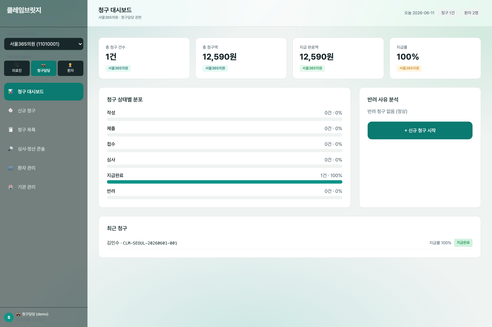

무엇을 보여주는가: 서울365의원 KPI(청구 1건·12,590원·지급률 100%), 상태별 분포 바, 반려사유 분석 패널, 최근 청구(김민수 지급완료 100%). / 의도: 테넌트별 청구 현황 집계. / 검토 결과: 한글·금액 포맷·지급률·테넌트명 라벨 정상.

### 5.2 기관 관리 — 멀티테넌트 격리

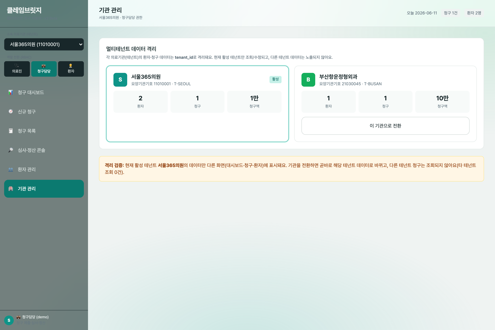

무엇을 보여주는가: 서울365의원(활성)·부산항운정형외과 카드, 각 기관 환자/청구/청구액, tenant_id 격리 안내. / 의도: 다중 기관 분리·전환. / 검토 결과: 활성 테넌트 강조·격리 설명·전환 버튼 정상.

### 5.3 테넌트 전환 — 데이터 격리 확인 (부산)

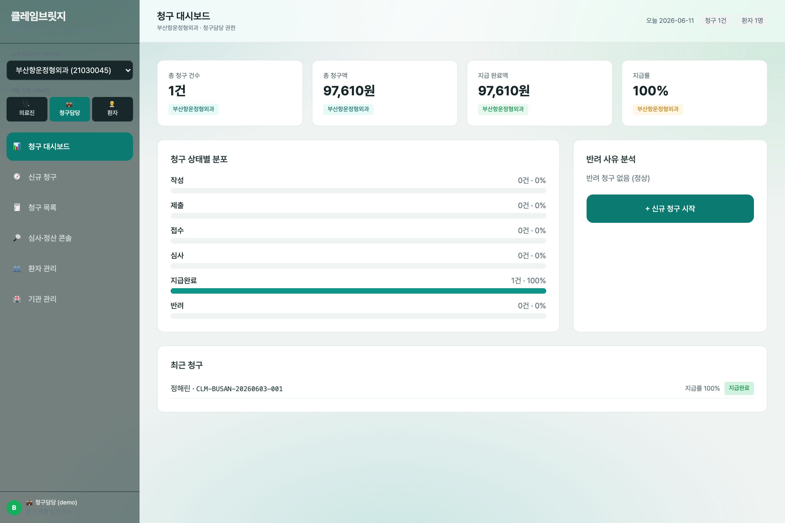

무엇을 보여주는가: 부산항운정형외과로 전환 후 대시보드 — 청구 1건·97,610원·정해린(회전근개) 데이터만 표시. / 의도: 테넌트 전환 시 타 테넌트(서울) 데이터 비노출. / 검토 결과: 부산 데이터만 렌더, 서울 청구 미노출(격리 검증).

### 5.4 신규 청구 워크플로 1단계 — 처방 입력

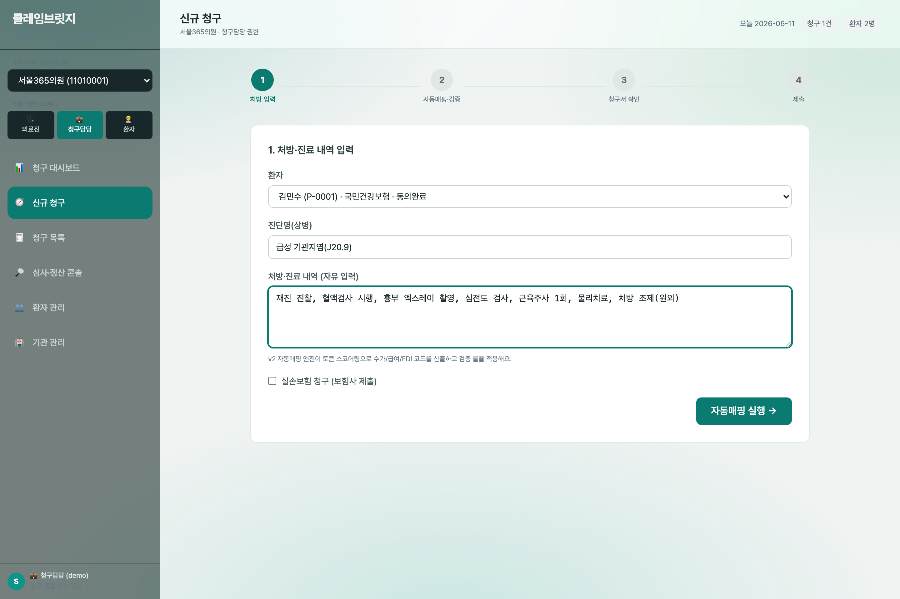

무엇을 보여주는가: 환자 선택(동의완료 표기)·상병(급성 기관지염 J20.9)·처방 자유텍스트·실손 청구 체크박스, 4단계 Stepper. / 의도: 자동매핑 입력원. / 검토 결과: 입력 필드·동의 상태 표기·실손 옵션 정상.

### 5.5 자동매핑 결과 · 검증 룰 엔진

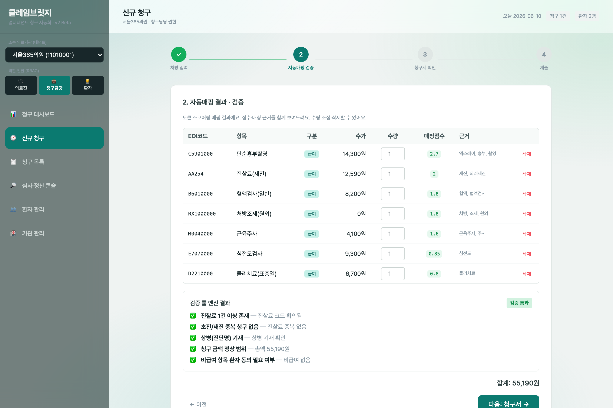

무엇을 보여주는가: 7개 코드 자동매핑(EDI코드·구분·수가·매핑점수·근거), 검증 룰 5건 모두 ✅ "검증 통과", 합계 55,190원. / 의도: 토큰 스코어링 알고리즘 + 검증 엔진. / 검토 결과: 매핑 점수(2.7~0.8)·근거 텍스트·검증 룰 판정 정상.

### 5.6 청구서 미리보기 — 기관 양식 분기

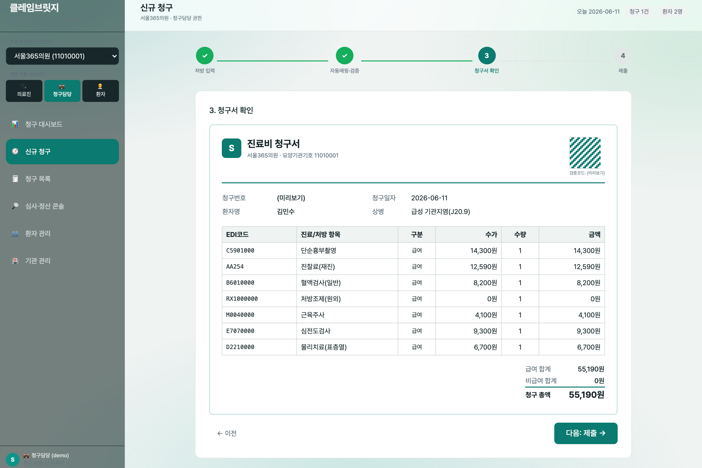

무엇을 보여주는가: 서울365의원 로고·요양기관기호 청구서, EDI코드 명세표, 급여/비급여/총액 55,190원, 우상단 QR. / 의도: 기관별 양식 분기. / 검토 결과: 기관 로고·색상·EDI 코드·합계·QR 정상.

### 5.7 EDI 제출 화면

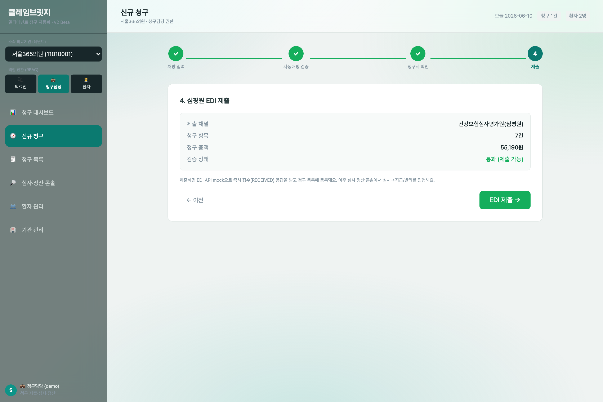

무엇을 보여주는가: 4단계(처방·자동매핑·청구서 완료) 후 심평원 EDI 제출 — 채널·항목 7건·총액·검증 통과(제출 가능). / 의도: 제출 전 최종 확인. / 검토 결과: 채널·검증 상태·제출 버튼 활성 정상.

### 5.8 청구 목록 — 제출 후 등록

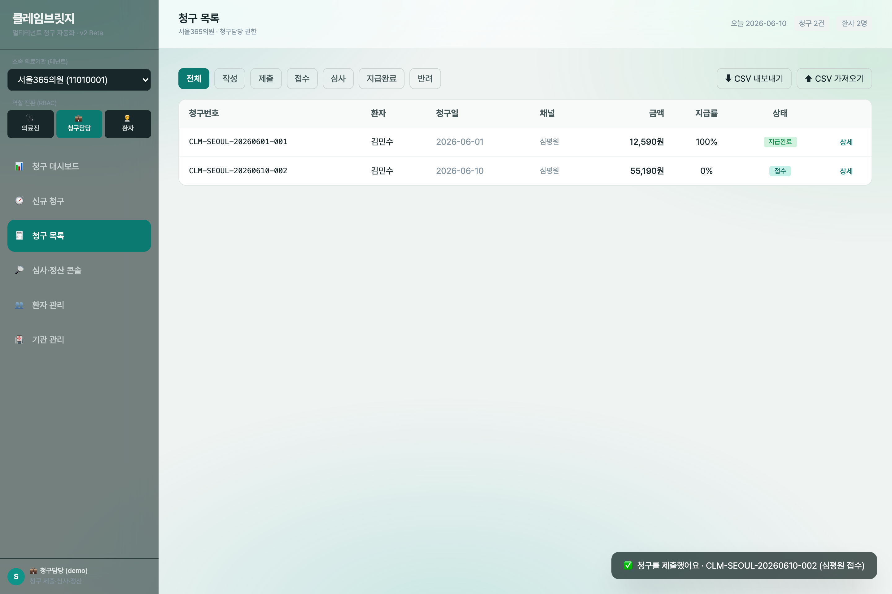

무엇을 보여주는가: 제출된 CLM-SEOUL-20260608-002(접수·0%) 목록 반영, 토스트 "청구 제출 완료 ... (심평원 접수)", CSV 입출력 버튼. / 의도: EDI 제출이 실 데이터 등록 + 접수 상태 전이. / 검토 결과: 신규 청구·상태·지급률·토스트 일관.

### 5.9 심사·정산 콘솔 — 대기 청구

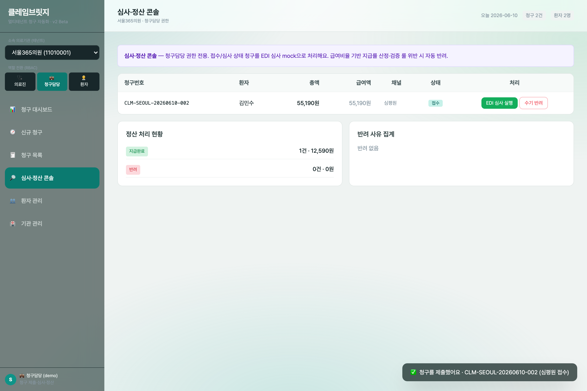

무엇을 보여주는가: 접수 청구(CLM-...-002) EDI 심사 실행·수기 반려 버튼, 정산 처리 현황·반려사유 집계. / 의도: 청구담당 전용 심사 워크플로. / 검토 결과: 대기 청구·처리 버튼·집계 패널 정상.

### 5.10 심사·정산 — 심사 완료(지급)

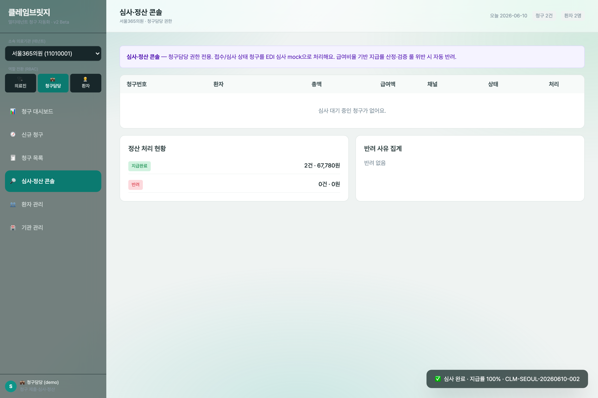

무엇을 보여주는가: EDI 심사 실행 후 대기 청구 0건, 토스트 "심사 완료 · 지급률 100% · CLM-...-002", 정산 현황 지급완료 2건 67,780원. / 의도: EDI 심사 mock이 지급률 산정·상태 전이. / 검토 결과: 심사 결과·정산 집계 일관 갱신.

### 5.11 청구 상세 — EDI 통신 로그

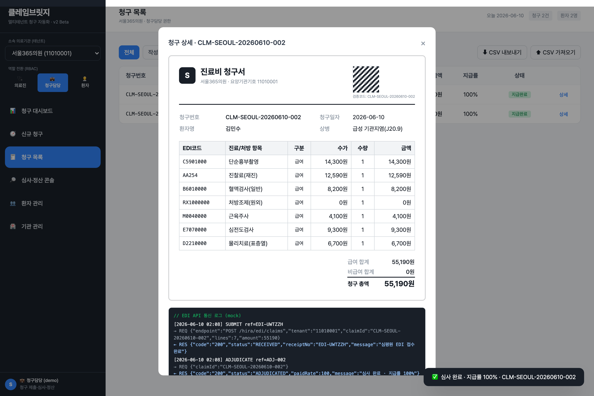

무엇을 보여주는가: 청구서 + EDI API 통신 로그(SUBMIT·ADJUDICATE의 REQ/RES JSON, ref·receiptNo·paidRate). / 의도: 외부 시스템 통합 흐름 증거. / 검토 결과: 제출·심사 로그 JSON·상태 이력(by 표기) 정상.

### 5.12 CSV 내보내기

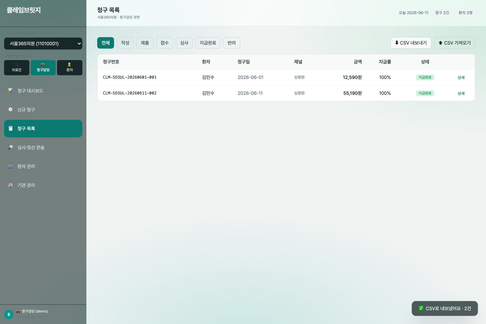

무엇을 보여주는가: CSV 내보내기 실행 → 토스트 "CSV 내보내기 완료 · 2건", 목록 2건 모두 지급완료 100%. / 의도: 파일 입출력 실 흐름. / 검토 결과: 다운로드 트리거·토스트·심사 후 상태 반영 정상.

### 5.13 환자 관리 (CRUD·동의 상태)

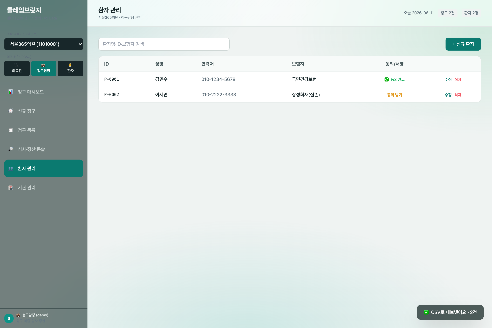

무엇을 보여주는가: 환자 2명, 김민수(동의완료)·이서연(동의 받기 버튼), 검색·신규·수정/삭제. / 의도: 환자 CRUD + 동의 상태 관리. / 검토 결과: 동의 상태 분기·CRUD 액션 정상.

### 5.14 동의 + 전자서명 캔버스

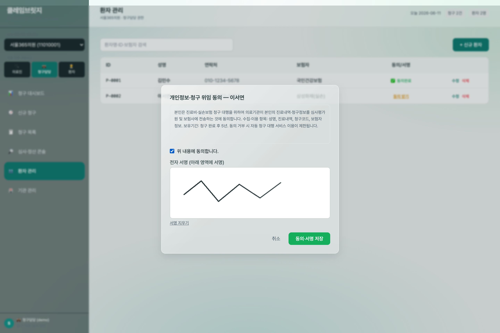

무엇을 보여주는가: 이서연 동의서 본문·동의 체크·캔버스에 그린 전자서명·저장 버튼. / 의도: 동의·전자서명 온보딩. / 검토 결과: 동의 텍스트·체크박스·실제 그려진 서명 획·저장 버튼 활성 정상.

### 5.15 동의·서명 저장 완료

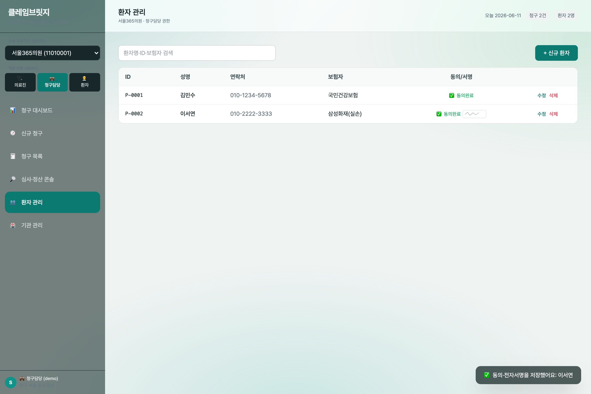

무엇을 보여주는가: 저장 후 이서연 "동의완료" + 서명 PNG 썸네일, 토스트 "동의·전자서명 저장 완료: 이서연". / 의도: 서명 이미지 영속·이력 기록. / 검토 결과: 동의 상태·서명 썸네일·토스트 일관.

### 5.16 RBAC — 의료진 역할(제한 메뉴)

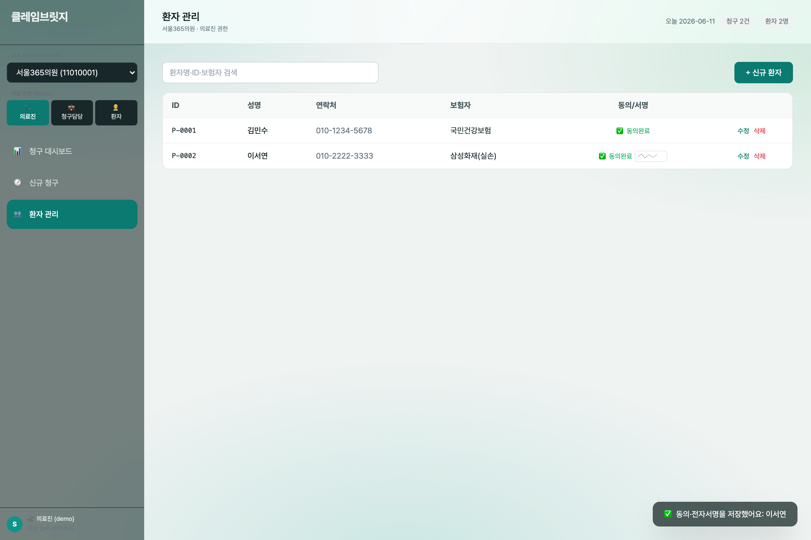

무엇을 보여주는가: 의료진 역할 활성 시 메뉴가 대시보드·신규 청구·환자 관리만 노출(심사/기관 미노출), 하단 역할 설명. / 의도: 역할별 권한 분기. / 검토 결과: 청구담당 전용 메뉴 차단·의료진 권한 라벨 정상.

### 5.17 환자 포털 — 모바일 반응형


무엇을 보여주는가: 414px 모바일 폰 프레임 환자 포털 — 동의 완료·내 청구 2건(지급완료 100%). / 의도: 환자 전용 모바일 반응형 뷰. / 검토 결과: 폰 프레임·동의 카드·청구 카드·한글 정상.

### 5.18 환자 포털 — 실손 청구 가능 (정해린)

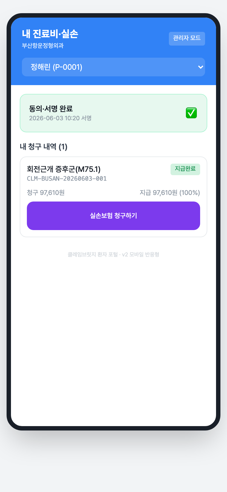

무엇을 보여주는가: 부산 테넌트 정해린(현대해상 실손) 포털 — 회전근개 청구에 "실손보험 청구하기" 버튼 노출. / 의도: 실손 보험자 환자에게 자동화 진입점. / 검토 결과: 실손 버튼 조건부 노출·지급완료 배지 정상.

### 5.19 환자 포털 — 실손 청구 제출 완료

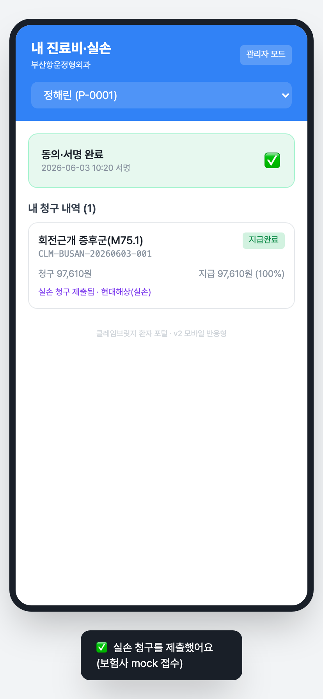

무엇을 보여주는가: 실손 청구하기 클릭 후 "실손 청구 제출됨 · 현대해상(실손)", 토스트 "실손 청구 제출 완료 (보험사 mock 접수)". / 의도: 실손 자동화 mock 흐름. / 검토 결과: 제출 상태·채널·토스트 일관, 버튼이 제출 표기로 전환.

### 5.20 대시보드 — 최종 집계(부산)

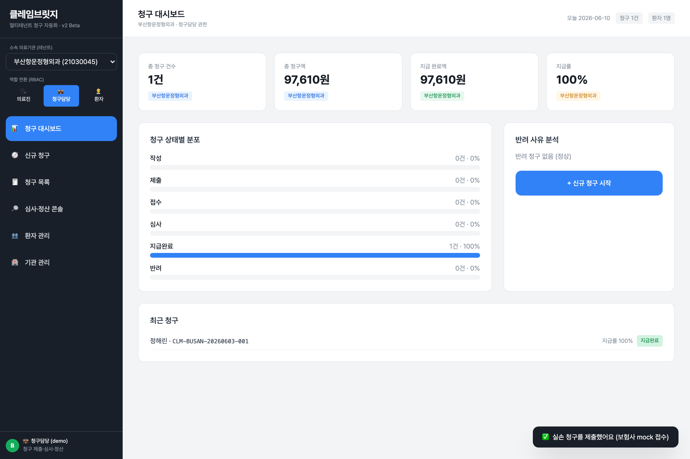

무엇을 보여주는가: 역할/뷰포트 전환 후 관리자 복귀 — 부산 대시보드 청구 1건·97,610원·지급률 100%(실손 제출 반영). / 의도: 역할/모바일 전환 후 데이터 일관 유지. / 검토 결과: 테넌트 데이터 영속·집계 정합.

## 6. 검수 기준 충족 여부

과업지시서 §5.2 자체 v2 산출물 8가지 항목별 점검:

| §5.2 항목 | 충족 | 측정값/근거 |
|:---|:--:|:---|
| 1 반응형(데스크톱+모바일 환자뷰) | ✅ | 1440px 관리자 + 414px 모바일 포털 각 정상 렌더, 캡처 01·17~19 |
| 2 다중 기관(테넌트) | ✅ | 2개 테넌트 분리, 전환 시 데이터 교체·타 테넌트 조회 0건, 캡처 02·03 |
| 3 자동매핑 알고리즘·검증 | ✅ | 토큰 스코어링 7코드 매핑(점수·근거) + 5룰 검증 통과, 캡처 05 |
| 4 심평원/보험사 API mock(제출→접수→지급) | ✅ | EDI 제출(RECEIVED)→심사(지급률 100%) 전이 + REQ/RES 로그, 캡처 07·10·11 |
| 5 환자 onboarding 동의·전자서명 | ✅ | 캔버스 서명→PNG 저장, 동의 이력·썸네일, 캡처 14·15 |
| 6 실손 청구 자동화 흐름 mock | ✅ | 포털 실손 제출→보험사 mock 접수, 캡처 18·19 |
| 7 역할 권한(3역할) | ✅ | RBAC 메뉴/기능 분기, 의료진 심사/기관 차단, 캡처 16·17 |
| 8 청구 상태·지급률·반려사유 대시보드 | ✅ | 상태별 분포·지급률(%)·반려사유 패널·정산 현황, 캡처 01·10·20 |

외주 기반(§5.1) 선구현분:

| §5.1 항목 | 충족 | 근거 |
|:---|:--:|:---|
| O1 멀티테넌트 스키마(tenant_id 격리) | ✅ | Tenant·Patient·Claim·ClaimEvent·Consent 모델, 격리 검증, 캡처 02·03 |
| O2 RBAC 접근 매트릭스(3역할) | ✅ | `ROLES.can` 화이트리스트 3역할×리소스, 캡처 16 |
| O3 청구 상태머신(작성→제출→접수→심사→지급/반려) | ✅ | 전이 규칙·이력(by) 기록, 캡처 08·10·11 |
| O4 PDF 양식 분기·실손 레이아웃(SPA 선구현) | ✅ | 기관별 로고/색상 + 실손 청구서 양식, 캡처 06·11 |

CLAUDE.md §2.4 v2 "5억" 가치 기준 점검:

| 기준 | 충족 | 근거 |
|:---|:--:|:---|
| v1 한계 매핑표 + 1:1 해결 증거 | ✅ | `## v1 한계 및 v2 개선 매핑` 11행 + 캡처 |
| 실 알고리즘 1종+ | ✅ | 토큰 스코어링 자동매핑 + 5룰 검증 엔진 + EDI 심사 지급률 산정 |
| 다중 사용자/다중 테넌트 | ✅ | 2테넌트 격리 + RBAC 3역할 분기 |
| 외부 시스템 통합 2건+ | ✅ | ① EDI API mock(제출·심사 REQ/RES 로그) ② CSV 파일 입출력 ③ 실손 보험사 mock 접수 — 3건 |
| 화면/뷰 8종+ | ✅ | 대시보드·워크플로·청구목록·심사콘솔·환자관리·기관관리·서명캔버스·모바일포털 (8종+) |
| 워크플로 3개+ | ✅ | 청구 제출 / 심사·정산 / 환자 동의·실손 청구 |
| 신규 캡처 10장+ | ✅ | 20장(전부 Read 검증) |

## 7. 추가 확장 가능 영역

- 실 심평원/보험사 EDI 연계(현재 mock) → v3 정식 API 통합 과업.
- ISMS-P 인증·민감정보 실 암호화 → v3.
- 외주 멀티테넌트 RLS 스키마·한글 폰트 임베드 PDF 출력 엔진 정식 통합 → v3.

## 8. 검토 체크리스트

- [x] 모든 핵심 기능(8대 산출물)이 캡처되었는가
- [x] 캡처가 의도한 기능을 정확히 보여주는가 (20장 전부 Read 검증)
- [x] 한글이 깨지지 않는가 (전 캡처 한글 정상)
- [x] 에러 화면이 의도치 않게 캡처되지 않았는가 (capture-v2.mjs PAGE ERR/EXC 0건, "no-errors")
- [x] 결과물(매핑 점수·지급률·반려사유·서명)의 정확도가 충분한가
- [x] 과업지시서 §5 검수 기준 항목 100% 매핑되었는가 (§6 표)
- [x] (v2 한정) v1 한계 매핑표 + 5억 가치 기준 충족

---

## 데이터 정직성 선언

본 보고서의 모든 화면·수치는 실제 구동된 클레임브릿지 v2 SPA(`projects/claimbridge-spa/v2.html`)를 Playwright로 캡처한 결과다. 합성·목업 이미지는 사용하지 않았다. 청구코드 단가·EDI 코드·요양기관기호·지급률은 데모용 예시값이며 실제 건강보험 수가 고시값·실 EDI 규격이 아니다(베타 시제품 표기). 심평원/보험사 API는 mock 시뮬레이션이다. 외부 통계·인용은 본 결과보고서에 포함하지 않는다.
