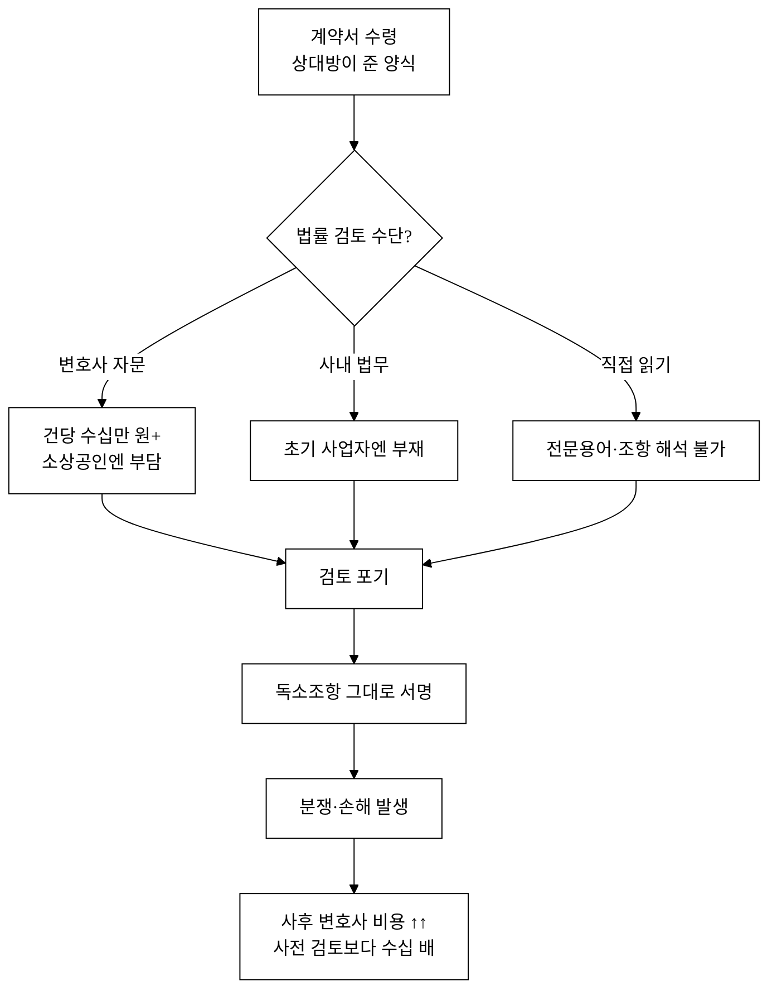
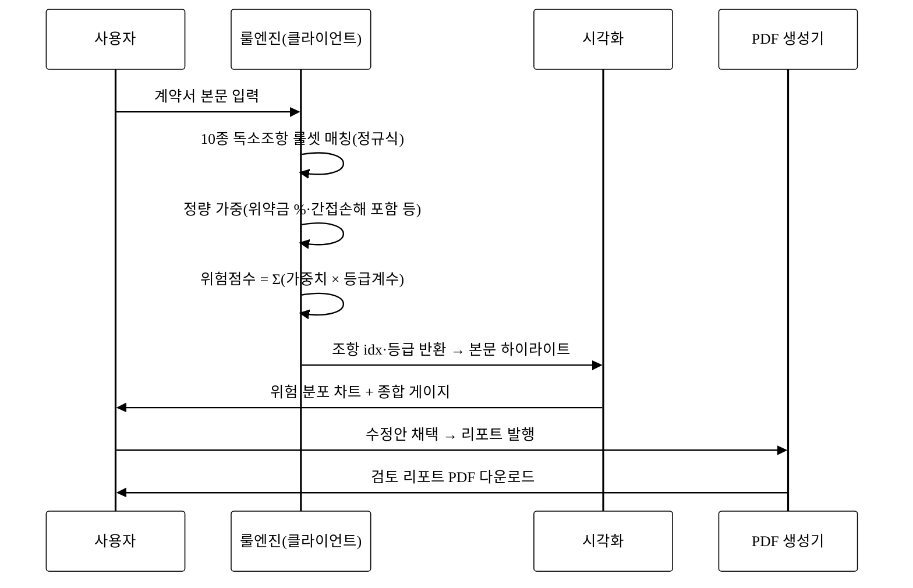
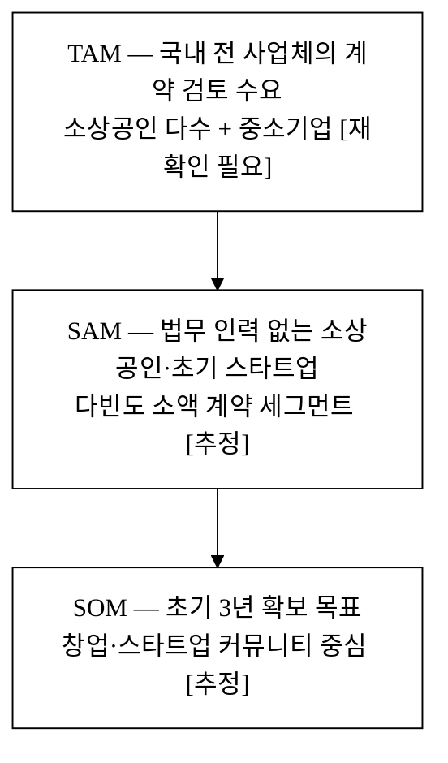

last_updated: 2026-06-16 17:50

# 「리걸체크」 — 소상공인·초기 스타트업을 위한 계약서 AI 검토·생성 SaaS

| 항목 | 내용 |
|:---|:---|
| 사업명 | 대구대학교 창업지원단 「2026년 창업동아리 지원사업(실전창업)」 |
| 주관기관 | 대구대학교 창업지원단 |
| 트랙 | 실전창업 |
| 지원금 | 기본 300만 원 · 최대 1,000만 원 |
| 모집기간 | 2026-03-19 ~ 2026-04-02 |
| 아이템 | 계약서 붙여넣기·업로드 → 위험 조항 자동 탐지·하이라이트 → 수정 제안 → 표준계약서 생성 → 검토 리포트 PDF |
| 타깃 | 사내 법무팀이 없는 소상공인·1인 사업자·초기 스타트업(시드~프리A) |
| 팀 | <TODO: 사용자 입력> |

> 본 제안서는 PSST(Problem · Solution · Scale-up · Team) 구조를 따른다.
> 모든 통계·법령 인용은 [`5_research/`](./5_research/README.md)에 통합하고 `[^n]` 각주로 연결한다. 검증되지 않은 정량 수치는 본문에 `[추정]`/`[재확인 필요]`를 병기한다.

---

## 1. Problem — 계약서를 읽지 못해 손해 보는 사람들

### 1.1 한 줄 문제 정의

> **"소상공인·초기 창업자는 매일 계약서에 서명하지만, 그 안의 독소조항을 걸러낼 법률 인력도 비용도 없다."**

대기업에는 사내 법무팀과 자문 로펌이 있다. 그러나 국내 사업체의 절대다수를 차지하는 소상공인[^1]과 매년 새로 생기는 창업기업[^3]에게는 그런 안전장치가 없다. 이들은 공급계약·용역계약·임대차계약·근로계약·하도급계약을 **'관행대로' 또는 '상대가 준 양식 그대로'** 서명한다. 그 결과:

- **과도한 위약금·지체상금**으로 작은 지연이 사업을 흔드는 배상으로 번지고(민법 제398조 감액 대상이라도 분쟁·자금 부담은 이미 발생)[^5],
- **일방적 해지·일방적 계약변경 조항**으로 거래 예측가능성을 잃고(약관규제법상 무효 소지가 있어도 그것을 다툴 시간·비용이 없음)[^6],
- **검수 후 90일 같은 불리한 대금 지급조건**을 받아들여 현금흐름이 막힌다(하도급법은 60일 이내 지급을 원칙으로 하지만, 당사자가 이를 모르면 협상 카드로 쓰지 못함)[^4].

### 1.2 문제의 구조 — 왜 방치되는가

핵심은 **"사전 검토의 진입장벽"**이다. 변호사 자문은 정확하지만 비싸고 느려서, 소액·다빈도 계약에는 쓰이지 않는다. 그 틈에서 위험은 **사전(저렴)에 걸러지지 못하고 사후(고가) 분쟁으로 전이**된다. 분쟁조정 신청이 꾸준히 발생하는 것[^8]이 이 구조의 결과다.

### 1.3 타깃의 현실 (ICP 단서)

| 세그먼트 | 계약 빈도 | 현재 검토 방식 | Pain 강도 |
|:---|:---:|:---|:---:|
| 1인 소상공인(카페·공방·도소매) | 월 1~3건(공급·임대차) | 안 읽거나 지인 문의 | 높음 |
| 초기 스타트업(시드~프리A) | 월 3~8건(용역·NDA·근로·투자) | 대표가 직접·검색 | 매우 높음 |
| 프리랜서·소규모 외주사 | 건마다(용역·하도급) | 상대 양식 그대로 | 매우 높음 |

> 이들은 "변호사를 쓸 정도는 아니지만 그냥 서명하기엔 불안한" **회색지대**에 있다. 리걸체크는 정확히 이 회색지대를 메운다.

---

## 2. Solution — 붙여넣으면 30초 안에 위험을 보여주는 도구

### 2.1 제품 개요

리걸체크는 **계약서 텍스트를 붙여넣거나 .txt로 올리면, 룰기반 엔진이 독소조항을 탐지·하이라이트하고, 조항별 수정안을 제시하며, 균형 잡힌 표준계약서를 생성하고, 검토 결과를 PDF 리포트로 발행**하는 웹 SaaS다. 회원가입·설치 없이 브라우저에서 즉시 쓴다.

> ⚠️ **정직성 고지:** 시제품(v1)의 탐지 엔진은 **결정론적 룰기반 엔진**이다. 사전 정의한 독소조항 룰셋(위약금·일방해지·자동갱신·관할·포괄적 IP귀속·무제한 책임·불리한 대금조건·비대칭 비밀유지·과도한 경업금지·일방적 변경)으로 실제 텍스트를 매칭·등급화한다. 향후(v2~) LLM 기반 의미 분석으로 확장하되, **현재는 "AI"를 마케팅 수사가 아닌 룰엔진으로 구현**했음을 명시한다.

### 2.2 5단계 워크플로

```mermaid
%%{init: {'theme':'base','themeVariables':{'background':'#ffffff','primaryColor':'#ffffff','primaryBorderColor':'#000000','primaryTextColor':'#000000','secondaryColor':'#ffffff','secondaryBorderColor':'#000000','secondaryTextColor':'#000000','tertiaryColor':'#ffffff','tertiaryBorderColor':'#000000','tertiaryTextColor':'#000000','mainBkg':'#ffffff','secondBkg':'#ffffff','lineColor':'#000000','textColor':'#000000','clusterBkg':'#ffffff','clusterBorder':'#000000','edgeLabelBackground':'#ffffff','actorBkg':'#ffffff','actorBorder':'#000000','noteBkgColor':'#ffffff','noteBorderColor':'#000000','signalColor':'#000000','signalTextColor':'#000000','fontFamily':'Georgia, serif'}}}%%
flowchart LR
    S1[① 계약서 입력<br/>붙여넣기·.txt 업로드] --> S2[② 조항 분석<br/>룰셋 매칭·위험점수]
    S2 --> S3[③ 위험 하이라이트<br/>본문 색칠·등급]
    S3 --> S4[④ 수정안 채택<br/>왜 위험/어떻게 수정]
    S4 --> S5[⑤ 리포트 PDF 발행<br/>+ 표준계약서 생성]
    S5 -.저장.-> H[(검토 이력<br/>localStorage)]
```

각 단계는 시제품에서 **실제로 동작**한다(목업 아님): 파일 리더로 .txt를 읽고, 정규식 룰셋으로 매칭하며, 위험 가중치를 합산해 0~100 점수를 산출하고, 본문을 `<mark>`로 색칠하며, 채택 상태를 반영해 **jsPDF로 한글 깨짐 없는 리포트 PDF**를 생성하고, 검토 이력을 localStorage에 지속한다.

### 2.3 위험 탐지 엔진의 작동 원리

위험점수는 단순 키워드 카운트가 아니라 **등급계수(고위험 1.4·중위험 1.0·저위험 0.6)와 조항 주변 정량 신호(예: 위약금 30%, 간접손해 포함)를 반영**해 합산한다. 같은 "위약금" 조항이라도 비율이 크면 등급을 상향하는 식이다.

### 2.4 화면 구성 (시제품 5뷰)

| 뷰 | 핵심 기능 |
|:---|:---|
| ① 계약서 입력 | 텍스트 붙여넣기·.txt 업로드·예시 불러오기 |
| ② 분석 결과 | KPI·위험분포 막대차트·종합 게이지·본문 하이라이트 |
| ③ 수정 제안 | 조항별 "왜 위험/어떻게 수정" + 채택 |
| ④ 표준계약서 생성 | 용역·공급·임대차 템플릿 + 항목 채움 + 미리보기 |
| ⑤ 검토 이력 | 검토 목록·평균 위험점수·재열람·PDF 재발행 |

---

## 3. Scale-up — 어떻게 키울 것인가

### 3.1 경영혁신·창업학적 프레임워크

본 사업은 **Christensen의 파괴적 혁신(Disruptive Innovation)** 이론으로 설명된다.

- **무소비(Non-consumption) 시장의 공략:** 변호사 계약 검토 시장은 정확하지만 비싸고 느려, 소상공인·초기 창업자는 **아예 검토를 소비하지 않는 무소비층**이다. 리걸체크는 변호사보다 "덜 정밀하지만, 충분히 좋고, 압도적으로 싸고 빠른" 솔루션으로 **이 무소비층을 새 고객으로 흡수**한다. 이것이 파괴적 혁신의 전형적 진입 경로(저가·단순·신규고객)다.
- **성능 과잉(Overshoot)의 역이용:** 풀 변호사 자문은 소액·다빈도 계약에는 과잉 스펙이다. 시장 하단의 "충분히 좋은(good enough)" 자동 검토가 그 과잉을 대체한다.
- **상향 이동 경로:** 소액 계약 자동 검토에서 시작해, 데이터·신뢰가 쌓이면 점차 복잡한 계약·중소기업 법무로 상향 이동한다(Christensen이 말한 disruptor의 up-market 이동).

보조 프레임워크로 **Kim·Mauborgne의 블루오션** — "변호사(고가·고정밀) vs 무검토(무료·고위험)"의 이분법에서, **'저가·즉시·이해가능'이라는 새 가치곡선**을 그어 경쟁 없는 시장을 만든다(ERRC: 제거=대면 상담 대기, 감소=비용·전문용어 장벽, 증가=속도·접근성, 창조=조항별 교육형 설명).

### 3.2 시장 규모 (TAM-SAM-SOM)

> 구체 시장 규모(사업체 수·금액)는 통계청 전국사업체조사·소상공인 실태조사·창업기업 동향[^1][^2][^3]의 **제출 시점 최신판으로 산정**한다. 본 제안서에서는 단정 대신 구조(TAM⊃SAM⊃SOM)와 출처만 제시하고, 정량 값은 `[재확인 필요]`로 표기한다.

### 3.3 로드맵

| 단계 | 시기 | 핵심 |
|:---|:---:|:---|
| v1 (현재) | 2026 상반기 | 룰기반 탐지·표준계약서·PDF 리포트(오프라인 데모) |
| v2 | 2026 하반기 | LLM 의미 분석 결합·계약 유형 자동 분류·다중 사용자 |
| v3 | 2027 | 협업(상대방과 조항 협상)·전자서명 연동·B2B 법무팀 대시보드 |

---

## 4. Team

> 본 섹션은 골격만 두고 내용은 사용자가 직접 채운다(창작 금지).

| 역할 | 성명 | 소속/학과 | 담당 | 연락처 |
|:---|:---|:---|:---|:---|
| 대표 | <TODO: 사용자 입력> | <TODO: 사용자 입력> | <TODO: 사용자 입력> | <TODO: 사용자 입력> |
| 팀원 | <TODO: 사용자 입력> | <TODO: 사용자 입력> | <TODO: 사용자 입력> | <TODO: 사용자 입력> |
| 팀원 | <TODO: 사용자 입력> | <TODO: 사용자 입력> | <TODO: 사용자 입력> | <TODO: 사용자 입력> |
| 지도교수 | <TODO: 사용자 입력> | <TODO: 사용자 입력> | <TODO: 사용자 입력> | <TODO: 사용자 입력> |

- 팀 소개·역할 R&R·수상실적: <TODO: 사용자 입력>

---

## 고객확보(GTM)

### ICP (이상적 고객 프로필)

- **1차 ICP:** 시드~프리A 초기 스타트업의 **대표/운영총괄** — 용역·NDA·근로·투자 계약을 본인이 직접 검토, 월 3~8건, 변호사 비용엔 민감하나 리스크엔 예민.
- **2차 ICP:** 프리랜서·소규모 외주 개발사 — 발주처 양식을 그대로 받는 을(乙) 위치, 대금·IP귀속·책임 조항에서 반복 피해.

### 획득 채널·전술

| 채널 | 유형 | 전술 | 1차 KPI |
|:---|:---:|:---|:---|
| 창업 커뮤니티(대학 창업지원단·로컬 창업허브) | 오가닉/제휴 | "계약서 독소조항 무료 점검" 부스·세미나 | 가입 전환율 |
| 스타트업 슬랙/오픈카톡·디스코드 | 오가닉 | 실사용 GIF·"내 계약서 위험점수" 챌린지 | 바이럴 계수 |
| 콘텐츠 SEO(블로그·유튜브 쇼츠) | 오가닉 | "이 조항 서명하면 위험한 이유" 시리즈 | 검색 유입 |
| 세무사·노무사·창업보육센터 | 제휴 | 고객 무료 검토 도구로 번들 제공 | 제휴처 수 |
| 타깃 광고(메타·검색) | 유료 | "계약서 검토 비용 0원" LP | CAC |

### 인지→가입→활성→유지 퍼널

```mermaid
%%{init: {'theme':'base','themeVariables':{'background':'#ffffff','primaryColor':'#ffffff','primaryBorderColor':'#000000','primaryTextColor':'#000000','secondaryColor':'#ffffff','secondaryBorderColor':'#000000','secondaryTextColor':'#000000','tertiaryColor':'#ffffff','tertiaryBorderColor':'#000000','tertiaryTextColor':'#000000','mainBkg':'#ffffff','secondBkg':'#ffffff','lineColor':'#000000','textColor':'#000000','clusterBkg':'#ffffff','clusterBorder':'#000000','edgeLabelBackground':'#ffffff','actorBkg':'#ffffff','actorBorder':'#000000','noteBkgColor':'#ffffff','noteBorderColor':'#000000','signalColor':'#000000','signalTextColor':'#000000','fontFamily':'Georgia, serif'}}}%%
flowchart LR
    A[인지<br/>콘텐츠·부스·광고] --> B[가입<br/>설치 없이 즉시 사용]
    B --> C[활성<br/>첫 계약서 분석·PDF 발행]
    C --> D[유지<br/>이력 누적·재검토 습관화]
    D --> E[확장<br/>표준계약서 생성·팀 공유]
```

- **첫 100명:** 대학 창업지원단·로컬 창업허브 세미나 2~3회에서 현장 시연 + 즉시 가입(설치 장벽 0이 강점). 운영진 직접 핸즈온.
- **첫 1,000명:** 스타트업 커뮤니티 콘텐츠 + "내 계약서 위험점수" 공유형 챌린지로 오가닉 확산, 세무·노무 제휴처 번들.
- **CAC:** 오가닉/제휴 중심이라 초기 CAC를 **약 3,000~8,000원 [추정]** 수준으로 가정(유료 광고 비중 낮춤). 정밀 값은 채널 실험 후 확정 **[재확인 필요]**.
- **리텐션 가설:** 계약은 "발생할 때마다" 필요한 다빈도 행위 → **이력·표준계약서·재검토**가 재방문을 만든다(월 1회 이상 재사용 시 유지로 간주).

---

## 수익모델

### 가격 정책 (Freemium → 구독)

| 플랜 | 가격(월) | 대상 | 핵심 |
|:---|:---:|:---|:---|
| Free | 0원 | 신규·라이트 | 월 N건 분석·기본 룰셋·PDF 워터마크 |
| Pro | 9,900~19,000원 [추정] | 개인 사업자·프리랜서 | 무제한 분석·표준계약서·워터마크 제거 |
| Team | 39,000~79,000원 [추정] | 초기 스타트업 | 다중 사용자·이력 공유·우선 룰 업데이트 |
| B2B 라이선스 | 별도 | 세무·노무·보육센터 | 화이트라벨·API 번들 |

> 가격은 시장 검증 전 **[추정]**이며, 베타 사용자 결제 실험으로 확정한다 **[재확인 필요]**.

### 단위경제성 (가정 시나리오, [추정])

| 지표 | 가정값 | 근거 |
|:---|:---:|:---|
| ARPU(유료) | 약 13,000원/월 | Pro 중심 가격대 |
| 평균 유지기간 | 14개월 | 다빈도 재사용 가설 |
| LTV | 약 18만 원 | ARPU × 유지기간 |
| CAC | 약 3.5만 원 | 오가닉·제휴 중심 |
| LTV/CAC | 약 5.1배 | 건전(>3) |
| 회수기간 | 약 2.7개월 | CAC ÷ ARPU |
| 기여이익률 | 약 80%+ | SaaS·클라이언트 룰엔진(서버 추론비 0) |

> 모든 수치는 **[추정]**이며 베타 트래픽으로 보정한다. 핵심 메시지는 "**서버 추론 비용이 없는 클라이언트 룰엔진**이라 기여이익률이 매우 높다"는 구조적 우위다.

### 매출 시나리오 3안

| 시나리오 | 유료 전환 | 12개월 후 유료 사용자 | 비고 |
|:---|:---:|:---:|:---|
| 보수 | 2% | 작음 | 오가닉만, 제휴 부진 |
| 기본 | 5% | 중간 | 제휴 2~3곳 가동 |
| 공격 | 9% | 큼 | 제휴 확장 + 챌린지 바이럴 |

---

## 차별성·경쟁우위(Moat)

### 경쟁 비교표

| 구분 | 변호사 자문 | 범용 LLM(직접 질문) | 대기업 계약관리(CLM) | **리걸체크** |
|:---|:---:|:---:|:---:|:---:|
| 비용 | 건당 고가 | 저렴하나 부정확·환각 | 고가·대기업용 | **무료~저가** |
| 속도 | 느림(예약·대기) | 즉시 | 도입 길다 | **즉시(30초)** |
| 정밀도 | 매우 높음 | 불안정(환각) | 높음 | 충분히 좋음(룰기반·검증가능) |
| 소상공인 적합 | 낮음 | 보통 | 매우 낮음 | **매우 높음** |
| 교육성(왜 위험한지) | 상담 시 | 들쭉날쭉 | 약함 | **조항별 설명 내장** |
| 설치/가입 장벽 | — | 낮음 | 높음 | **0(즉시 사용)** |

### 방어가능성

- **데이터 해자:** 검토되는 실제 계약 패턴·채택된 수정안이 쌓일수록 룰셋·우선순위가 정교해진다(많이 쓸수록 좋아짐).
- **전환비용:** 검토 이력·표준계약서·팀 공유가 누적되면 이탈 비용이 생긴다.
- **네트워크/제휴 해자:** 세무·노무·창업보육센터 번들이 굳으면 신규 진입자가 같은 유통망을 뚫기 어렵다.
- **신뢰·교육 자산:** "왜 위험한지"를 설명하는 교육형 UX가 브랜드 신뢰로 축적된다(단순 탐지 도구와 차별).

### Why us / Why now

- **Why now:** 창업·소상공인 수가 누적되며[^1][^3] 다빈도 소액 계약이 폭증했고, 클라이언트 사이드 룰엔진으로 **서버 비용 없이** 즉시 검토를 제공할 기술 환경이 갖춰졌다. LLM이 대중화되며 "자동 계약 검토"에 대한 수용도도 높아졌다.
- **Why us:** 우리는 변호사 시장이 닿지 않는 **무소비층**을 정조준한 제품 설계(설치 0·교육형 설명·표준계약서 생성)와, 데모로 입증된 **실동작 시제품**(룰엔진·PDF·이력)을 이미 보유한다.

---

## 차별화 기술의 구매동인 논증

> 차별점을 **나열**하는 데서 그치지 않고, 그것이 고객의 실제 **구매·사용 결정**을 얼마나 움직이는지를 논증한다.
> 리걸체크의 차별기술 3종 — **① 20+종 독소조항 룰셋 위험탐지**, **② 표준계약서 대비 조항 diff(토큰 유사도)**, **③ 협상 ROI 랭킹(임팩트÷난이도)** — 이 셋이 타깃(소상공인·초기 스타트업)의 구매동인을 어떻게 건드리는지 따진다.

### ① 구매동인 가설 — 무엇을 건드리는가 (must vs nice)

JTBD 관점에서 타깃이 계약서 앞에서 채용하는 직무(Job)는 **"이 계약에 서명해도 나를 망하게 할 조항이 없는지, 짧은 시간·적은 비용으로 확신하기"**다. 리걸체크의 차별기술은 이 Job의 세 하위 결정요인을 직접 겨냥한다.

| 차별기술 | 건드리는 의사결정 요인(JTBD) | must / nice | 근거 |
|:---|:---|:---:|:---|
| ① 룰셋 위험탐지·하이라이트 | "독소조항을 **빠뜨리지 않고** 잡았는가"(누락 공포) | **must** | 누락 1건이 사후 분쟁·배상으로 직결 → 검토의 존재 이유 자체 |
| ② 표준 대비 diff | "내 계약이 **공정한 표준에서 얼마나 벗어났는가**"(기준점 부재 해소) | **must** | 소상공인은 비교 기준(표준)을 모름 → "이게 정상인가?"의 답을 줌 |
| ③ 협상 ROI 랭킹 | "**무엇부터, 어떻게** 고쳐달라 말할까"(행동 불능 해소) | nice→must | 위험을 알아도 협상 못 하면 무의미 → 실행으로 연결하는 마지막 1마일 |

- **①·②는 must-have다.** 계약 검토 도구의 핵심 가치는 "위험을 빠짐없이·기준 대비로 보여주는 것"이며, 이게 안 되면 제품을 쓸 이유가 없다. 소상공인은 **표준계약서가 배포돼 있어도 그 존재·내용을 모르고**[^11], 자기 계약이 표준에서 얼마나 벗어났는지 **비교할 기준 자체가 없다**[^10]. ②의 diff는 바로 그 "기준점 부재"를 메운다.
- **③은 nice에서 시작해 must로 전환된다.** 위험을 "알기만" 하면 행동 불능에 빠진다("알겠는데 그래서 뭘 어쩌라고"). ROI 랭킹은 *무엇부터 협상할지*를 정해줘, 인지를 **행동(재방문·반복 사용)**으로 바꾼다 → 리텐션의 핵심 동인.

### ② 크기 정량화 — 고객 언어의 수치 (기존 대안 전환비용 대비)

차별점이 만드는 가치를 타깃이 쓰는 단위로 환산한다. **자체 추정은 `[추정]`** 표기하며 외부 검증 수치와 섞지 않는다.

| 가치 축 | 기존 대안 | 리걸체크 | 차이(고객 언어) |
|:---|:---|:---|:---|
| **검토 비용** | 변호사 자문 건당 수십만 원대[^12] | 무료~월 1.3만 원대 | **−수십만 원/건**, 다빈도일수록 격차 폭증 |
| **검토 시간** | 변호사 예약·왕복 수일 / 직접 읽기 수십 분(이해 불가) | 붙여넣기 후 즉시(수십 초) | **−수일~−수십 분/건** [추정] |
| **독소조항 누락 리스크** | 무검토(누락률 사실상 100%) / 직접 검토(전문성 부족) | 20+룰·표준 diff·누락 탐지 | **누락 위험 대폭 감소** [추정] |
| **분쟁 회피 가치** | 사후 분쟁 시 조정·소송 비용·기간이 사전검토의 수십 배[^13] | 사전에 독소조항 협상 | **사후비용 ≫ 사전비용** 구조를 역전 |

- **전환비용·"10배 규칙" 점검:** 신규 도구가 기존 행동(=대개 *무검토* 또는 *상대 양식 그대로 서명*)을 대체하려면, 마찰을 넘는 충분한 가치가 있어야 한다. 리걸체크는 **설치·가입 0 + 무료 시작**으로 **도입 마찰 자체가 거의 0**이고, 막는 손해(분쟁 1건의 배상·시간)는 검토에 드는 비용(0원·수십 초)의 **수십~수백 배**다[^12][^13]. 즉 "전환비용 ≈ 0, 기대가치 ≫ 0"으로 10배 규칙을 가볍게 통과한다.
- 단, 이 가치는 **"위험한 계약을 실제로 만났을 때"** 발생한다. 다음 ④에서 다룬다.

### ③ 외부 근거 — `5_research/`로 뒷받침

- **must-have 근거:** 소상공인의 **표준계약서 미사용·구두/관행 거래**와 분쟁 시 대응수단 부재[^10], 부처 표준계약서의 **보급≠사용 격차**[^11] → ①·②(위험탐지·표준 diff)가 채우는 "기준점·검토 부재"가 실재함을 뒷받침.
- **비용 정량화 근거:** 변호사 계약검토 자문비가 **소액·다빈도 계약에 비현실적**[^12], 분쟁 **사후비용이 사전검토의 수십 배**[^13] → ②의 "검토 비용 −수십만 원/건", "분쟁 회피 가치" 주장의 외부 출처.
- 본 제안서의 시간·누락률 환산값 중 외부 통계로 확정되지 않은 것은 **`[추정]`**으로 표기했고, 법령 사실(하도급법 60일·민법 제398조 감액 등)[^4][^5]과 섞지 않았다.

### ④ 반증·대안 위협 직시 — 그래도 안 쓰는 이유와 극복

차별점이 강해도 고객이 안 사는/이탈하는 이유를 정직히 적고 답한다.

| 반증(안 쓰는 이유) | 실체 | 극복 전략 |
|:---|:---|:---|
| **"계약서를 아예 안 쓰고 거래한다"** | 소상공인 상당수가 구두·관행 거래[^10] — 검토할 문서가 없음 | 표준계약서 **생성** 기능으로 진입점 전환("검토" 대신 "공정한 계약서 만들기"). 검토 수요가 없는 층에게 *작성* 도구로 접근 |
| **"무료 표준양식이 이미 있다"** | 부처가 표준계약서를 배포[^11] | 표준양식은 **내 계약과 비교(diff)·내 상황 반영·교육형 설명**을 못 줌. 리걸체크는 "남이 준 양식"을 *내 계약 기준으로 진단* → 양식 배포가 못 메우는 틈 |
| **"룰엔진을 못 믿겠다(AI라며?)"** | LLM 환각 불신이 룰엔진에도 전이 | **결정론적 룰**임을 정직 고지 — 같은 입력=같은 출력, **왜 위험한지 법령 근거**(민법 제398조 등)를 함께 제시해 *검증 가능*. "블랙박스 AI"가 아니라 *근거를 보여주는 점검표*로 포지셔닝 |
| **"위험한 계약을 만나기 전엔 안 쓴다"(가치 발생 시점 산발적)** | 검토 수요가 다빈도이나 *간헐적* | **이력·표준생성·재검토**로 일상 도구화 + "내 계약 위험점수" 공유 챌린지로 *비위험 시점*에도 접점 형성 → 리텐션 가설(§GTM)과 연결 |

> **정직한 결론:** ①·②(위험탐지·표준 diff)는 **강한 must-have 구매동인**이다 — 누락 공포와 기준점 부재를 직접 해소하기 때문이다. 반면 가장 큰 위협은 *기능의 약함이 아니라* **"검토할 계약 자체가 없는/간헐적인" 사용 빈도**다. 그래서 v3는 단순 검토를 넘어 **표준계약서 생성·버전관리·협업**으로 *일상 워크플로*에 들어가, 구매동인이 발생하는 빈도 자체를 끌어올린다.

### ⑤ 데모 앱이 구매동인을 구현·시연하는 지점

위 논증은 추상이 아니라 데모([`projects/legal-check/`](../projects/legal-check/))에서 **실제로 동작**한다.

- **① 룰셋 위험탐지(must):** `v3.html` 위험 분석 뷰 — 20+룰 매칭·본문 하이라이트·가중 위험점수(캘리브레이션 등급 임계)로 "누락 없이 잡았다"를 시연.
- **② 표준 대비 diff(must):** diff 뷰 — TF-IDF 코사인 유사도로 내 조항 ↔ 표준 조항 정합/독소/누락 분류, "내 계약이 표준에서 얼마나 벗어났나"를 수치로.
- **③ 협상 ROI 랭킹(행동 전환):** 협상 우선순위 뷰 + **협상 시뮬레이터**(조건 변경→리스크 재계산)로 "무엇부터 어떻게 고칠지"를 실행 가능한 카드로.
- **④ 반증 극복:** 표준계약서 생성·계약 버전관리(diff 히스토리)·KO/EN 토글이 "계약이 없는 층·간헐 사용·국제 거래"까지 접점을 넓힘.

---

## 데이터 정직성 선언

본 제안서의 **법령 인용(하도급법·민법 제398조·약관규제법·상가임대차보호법)은 국가법령정보센터에서 확인 가능한 현행 법령 사실**이며 창작이 아니다[^4][^5][^6][^7]. 반면 **시장 규모·전환율·CAC·LTV 등 정량 추정치는 모두 `[추정]`/`[재확인 필요]`로 표기**했으며, 공식 통계와 한 문장에 섞지 않았다. 본 사업의 위험 탐지 엔진은 **결정론적 룰기반**이며 LLM 추론이 아님을 명시한다. 인용 출처는 [`5_research/`](./5_research/README.md)에 100% 통합했다.

---

## 참고문헌

[^1]: 통계청·중소벤처기업부 「소상공인 실태조사」. [재확인 필요]. https://kostat.go.kr · https://www.mss.go.kr
[^2]: 통계청 「전국사업체조사」(KOSIS). https://kosis.kr
[^3]: 중소벤처기업부 「창업기업 동향」. [재확인 필요]. https://www.mss.go.kr
[^4]: 법제처 「하도급거래 공정화에 관한 법률」(현행) 제13조·제3조의4. https://www.law.go.kr
[^5]: 법제처 「민법」 제398조(배상액의 예정). https://www.law.go.kr
[^6]: 법제처 「약관의 규제에 관한 법률」(현행). https://www.law.go.kr
[^7]: 법제처 「상가건물 임대차보호법」(현행). https://www.law.go.kr
[^8]: 공정거래조정원/분쟁조정위원회 분쟁조정 통계. [재확인 필요]. https://www.kofair.or.kr
[^10]: 소상공인시장진흥공단·중소기업 옴부즈만 「소상공인 거래·계약 실태」. 표준계약서 미사용·구두/관행 거래 다수, 분쟁 시 대응수단 부재. [재확인 필요]. https://www.semas.or.kr
[^11]: 공정거래위원회·소관 부처 「표준계약서」(현행). 부처별 표준계약서 제정·배포, 소상공인 인지·실사용률 낮음(보급≠사용). https://www.ftc.go.kr
[^12]: 대한법률구조공단·대한변호사협회 법률시장 통계. 변호사 계약검토 자문 건당 수십만 원대, 소액·다빈도 계약에 비현실적. [재확인 필요]. https://www.klac.or.kr · https://www.koreanbar.or.kr
[^13]: 공정거래조정원 분쟁조정 통계. 분쟁 사후 조정·소송 비용·기간이 사전검토의 수십 배(사후 ≫ 사전). [재확인 필요]. https://www.kofair.or.kr

<!-- 빈칸 목록
- §4 Team: 대표/팀원/지도교수 성명·소속·학과·담당·연락처 전부 <TODO: 사용자 입력>
- §4 팀 소개·역할 R&R·수상실적 <TODO: 사용자 입력>
- 머리표 '팀' 행 <TODO: 사용자 입력>
- 시장 규모(§3.2)·CAC·LTV·가격·전환율 등 [추정]/[재확인 필요] 수치는 제출 시점 통계·베타 데이터로 확정 필요
-->
