last_updated: 2026-06-16 15:40

# 개발결과보고서 v1 — 리걸체크 계약서 검토·생성 시제품

> [`3_과업지시서_v1.md`](./3_과업지시서_v1.md) §5 성과품 목록의 검수 증거 문서.
> 실제 구동 화면을 PC·모바일 두 뷰포트에서 캡처해 첨부한다.

---

## 1. 성과품 매핑

| # | 과업지시서 §5 성과품 | 납품 산출물 | 충족 |
|:--:|:---|:---|:---:|
| 1 | `v1.html` 시제품(5뷰) | `projects/legal-check/v1.html` | ✅ |
| 2 | 룰기반 탐지 엔진 | `v1.html` `RULES`(10종)·`analyze()` | ✅ |
| 3 | 본문 하이라이트 | `renderDoc()` `<mark>` + 클릭 이동 | ✅ |
| 4 | 위험분포 차트·게이지 | Chart.js 막대·도넛 게이지 | ✅ |
| 5 | 수정 제안·채택 | `renderSuggest()` + 채택 토글 | ✅ |
| 6 | 표준계약서 생성 | `buildTemplate()` 3종 템플릿 | ✅ |
| 7 | 검토 리포트 PDF | `makePDF()` jsPDF + 캔버스 한글 렌더 | ✅ |
| 8 | 검토 이력 지속 | localStorage `persistCurrent()`/`load()` | ✅ |
| 9 | 반응형(PC+모바일) | CSS 768px 분기·바텀탭 | ✅ |

---

## 2. 구현·제작 범위

- **5개 뷰** 실동작: ① 계약서 입력(붙여넣기·.txt 업로드·예시) ② 분석 결과(KPI·막대차트·게이지·본문 하이라이트) ③ 수정 제안(채택) ④ 표준계약서 생성(용역·공급·임대차) ⑤ 검토 이력(재열람·PDF 재발행).
- **다단계 워크플로 1개:** 계약서 입력 → 조항 분석 → 위험 하이라이트 → 수정안 채택 → 리포트 PDF 발행(+이력 저장).
- **룰엔진:** 10종 독소조항 룰셋(위약금·일방해지·자동갱신·관할·포괄 IP귀속·무제한 책임·불리한 대금조건·비대칭 비밀유지·과도한 경업금지·일방 변경), 정량 가중(예: 위약금 % 큰 경우 등급 상향), 0~100 위험점수.
- **PDF:** jsPDF 표준 폰트의 한글 미지원 한계를 우회하기 위해, 리포트를 캔버스에 한글 텍스트로 렌더한 뒤 이미지로 PDF에 삽입(다중 페이지 분할) → 한글 100% 보존.
- **지속성:** 분석 시점에 검토 레코드를 localStorage에 저장, 새로고침 후에도 이력 유지.

---

## 3. 환경

| 항목 | 값 |
|:---|:---|
| OS | macOS (darwin 24.6.0) |
| 구동 | 브라우저 단일 HTML, `file://`로 직접 열림(빌드 없음) |
| 라이브러리 | Chart.js 4.4.1 (CDN), jsPDF 2.5.1 (CDN) |
| 저장 | 브라우저 localStorage |
| 캡처 | Playwright(chromium) — PC 1280×800(DSF2), 모바일 390×844(DSF3, isMobile/hasTouch) |
| 외부 키 | 없음(전부 클라이언트 룰기반) |

> 캡처 후 `node_modules`·`package.json`·`package-lock.json` 삭제 완료(빌드 산출물 잔존 없음).

---

## 4. 실행/구동 방법

```bash
# 1) 앱 실행 — 브라우저로 v1.html 열기 (빌드 불필요)
open projects/legal-check/v1.html

# 2) 캡처 재현 (선택)
cd projects/legal-check
npm i -D playwright && npx playwright install chromium
node capture.mjs            # PC→biz/captures/v1, 모바일→biz/captures/mobile/v1
rm -rf node_modules package*.json
```

앱 사용: ‘예시 불러오기’ → ‘조항 분석 시작’ → 분석 결과·수정 제안 확인 → ‘검토 리포트 PDF 발행’.

---

## 5. 화면·실물 캡처

### 5.1 PC (1280×800) — `./captures/v1/`

**① 계약서 입력**
무엇: 예시 계약서가 채워진 입력 화면. 의도: 붙여넣기/업로드/예시 진입점. 검토 결과: 사이드바 248px·본문 폼 정상, 풀폭 분석 버튼.
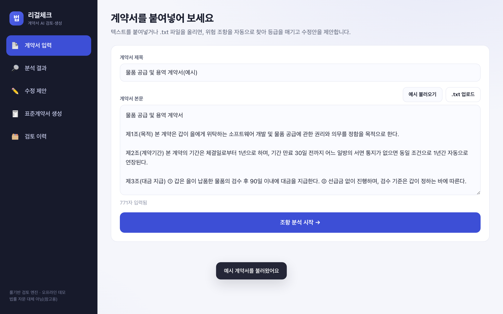

**② 분석 결과(하이라이트+차트+게이지)**
무엇: 위험점수 100·고위험 4·중위험 5, 막대차트·도넛 게이지·본문 하이라이트. 의도: 룰엔진 산출 결과 시각화. 검토 결과: 차트·게이지 실제 렌더, 본문 색칠 정상.
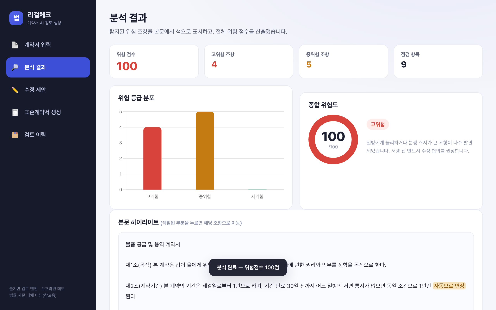

**③ 본문 하이라이트(스크롤)**
무엇: 분석 본문에서 위약금·자동연장 등 조항이 등급별 색으로 표시. 의도: 어느 문장이 위험한지 직관 전달. 검토 결과: 등급별 색 구분 정상.
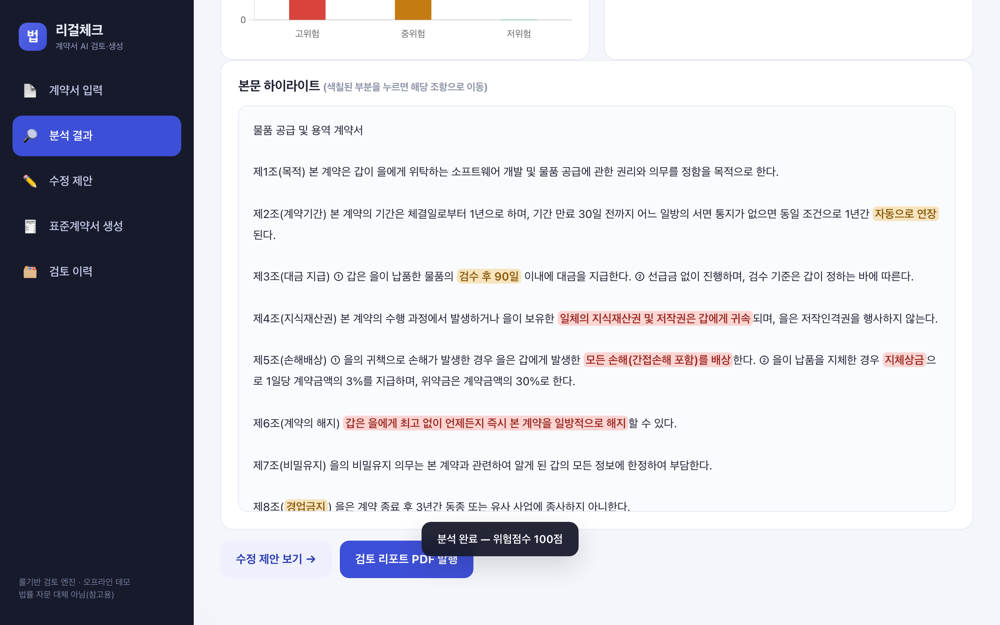

**④ 수정 제안(전체 채택)**
무엇: 조항별 "왜 위험/어떻게 수정" + 9건 전체 채택됨. 의도: 협상 카드 제공. 검토 결과: 채택 토글·카운트 반영 정상.
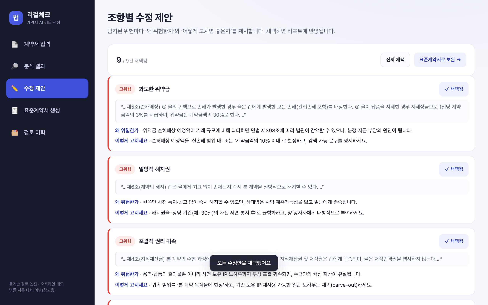

**⑤ 표준계약서 생성**
무엇: 용역(개발)계약 템플릿에 발주/수급·금액·기간 입력 → 미리보기에 균형 조항 출력. 의도: 위험 계약을 대체할 표준안 제공. 검토 결과: 입력값 반영·미리보기 정상.
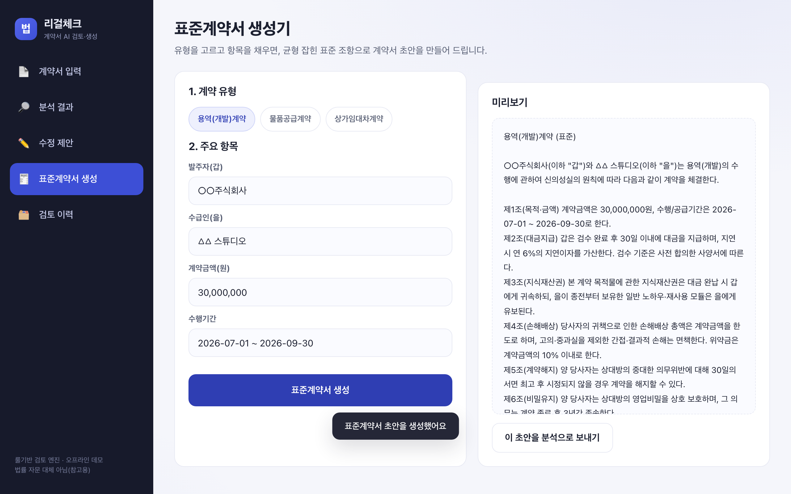

**⑥ 검토 리포트 PDF 발행**
무엇: 분석 뷰의 ‘검토 리포트 PDF 발행’ 실행(다운로드 토스트). 의도: jsPDF 실 생성. 검토 결과: 캡처 실행 중 `리걸체크_검토리포트_…pdf` 다운로드 확인(콘솔 로그).


**⑦ 검토 이력**
무엇: 검토 목록·총검토·평균점수·고위험수·최근일 KPI. 의도: 누적·재방문 동선. 검토 결과: 레코드·등급 배지·열기/PDF 버튼 정상.
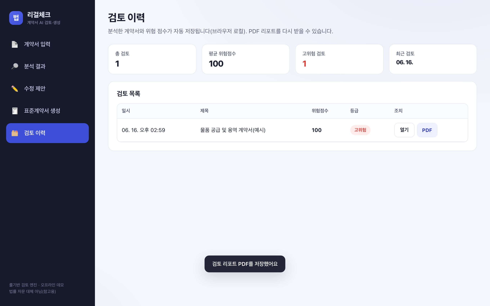

**⑧ 지속성(새로고침 후)**
무엇: 페이지 새로고침 후에도 이력 레코드 유지. 의도: localStorage 지속 입증. 검토 결과: 새로고침 후 이력 그대로 표시.
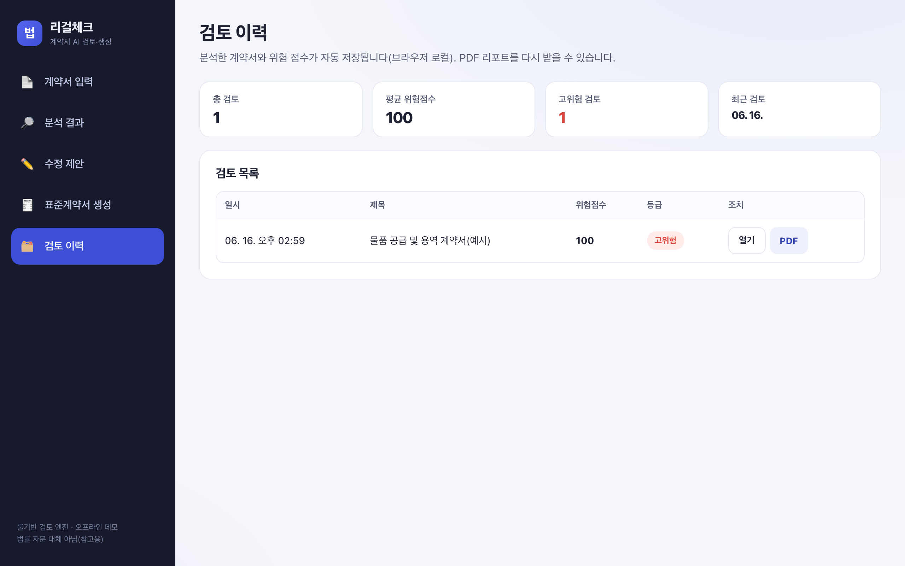

### 5.2 모바일 (390×844, isMobile/hasTouch) — `./captures/mobile/v1/`

**① 입력 홈(앱바+바텀탭)**
무엇: 모바일 앱바 + 풀폭 입력 폼 + 하단 5탭 바텀바. 의도: 사이드바 대신 바텀탭으로 재구성. 검토 결과: 사이드바 미노출·가로 overflow 없음·풀폭.
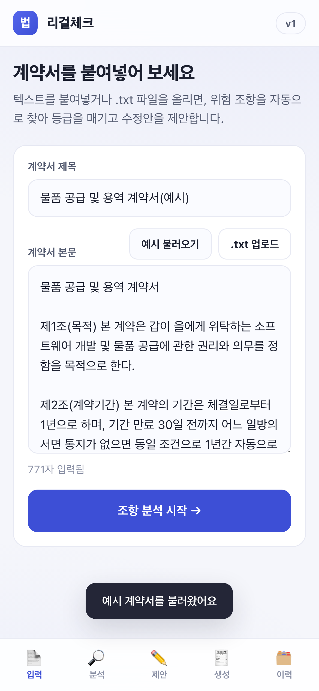

**② 분석 결과 상단(KPI 2열+차트)**
무엇: KPI 2열 스택 + 위험분포 차트. 의도: 데스크톱 4열→모바일 2열 스택, 차트 고정높이. 검토 결과: 차트 실제 렌더(빈 박스 아님), 숫자 잘림 없음.
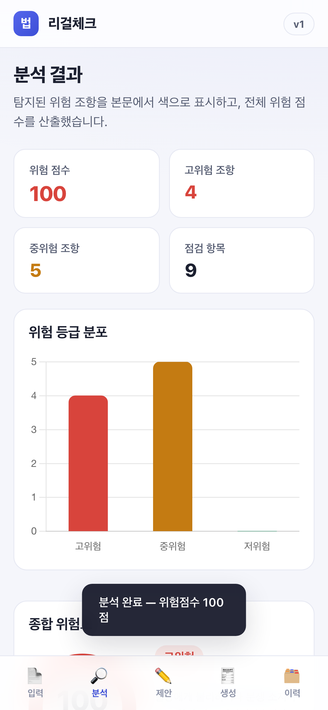

**③ 분석 결과 스크롤(게이지)**
무엇: 종합 위험도 게이지·본문 하이라이트 영역. 의도: 스크롤 본문 확인. 검토 결과: 게이지 렌더·풀폭 정상.
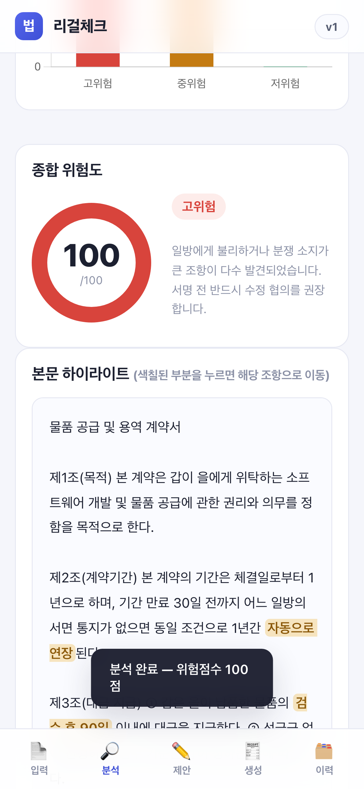

**④ 수정 제안(전체 채택)**
무엇: 풀폭 카드형 조항 제안 + 채택됨 상태. 의도: 좁은 화면 가독. 검토 결과: 카드 풀폭·세로 쪼개짐 없음.
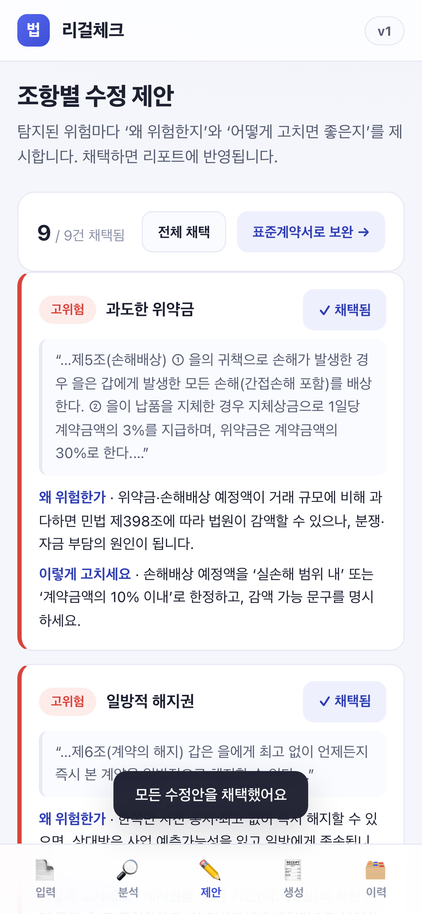

**⑤ 표준계약서 생성**
무엇: 유형·항목 입력 후 미리보기에 표준계약서 출력(모바일 1열). 의도: 2열→1열 스택. 검토 결과: 입력·미리보기 풀폭 정상.
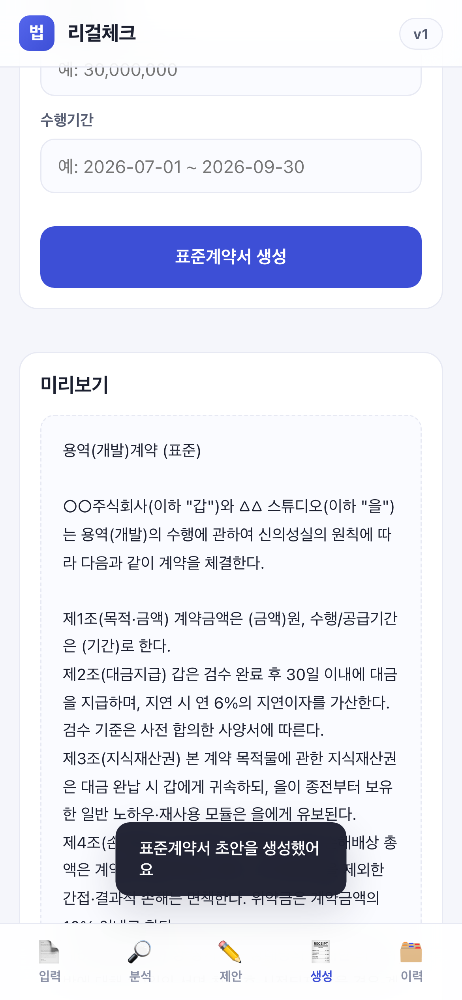

**⑥ 검토 이력**
무엇: 이력 KPI 2열 + 검토 목록(가로 스크롤 테이블). 의도: 표 열 증발 없이 접근. 검토 결과: 정상.
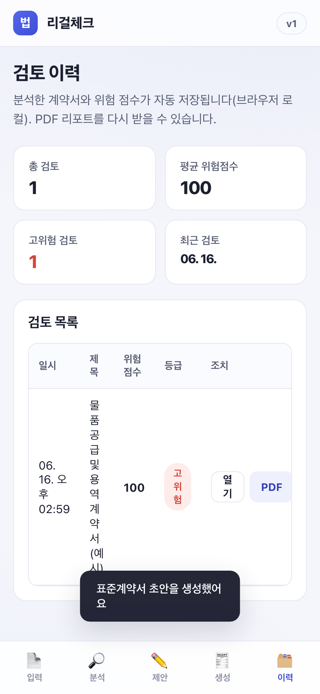

**⑦ 본문 하이라이트(더 아래)**
무엇: 분석 본문을 더 아래로 스크롤한 하이라이트. 의도: 본문 풀폭 가독. 검토 결과: 색칠·줄바꿈 정상.
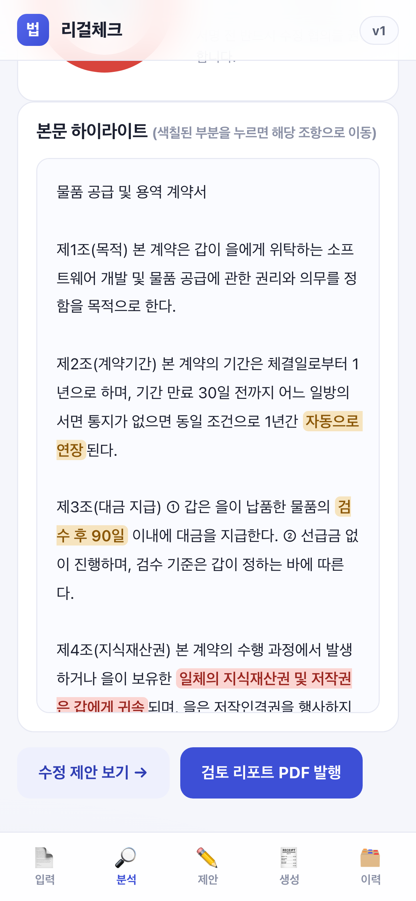

---

## 6. 검수 기준 충족 여부

| # | 검수 기준 | 결과 | 측정값 |
|:--:|:---|:---:|:---|
| 1 | 5뷰 표시·전환 | ✅ | 입력·분석·제안·생성·이력 전환 확인 |
| 2 | 예시 분석 고위험 ≥3·점검 ≥8, 1초 내 | ✅ | 고위험 4·중위험 5·점검 9건, 즉시 |
| 3 | 본문 하이라이트·클릭 이동 | ✅ | 등급별 색·클릭 시 제안 이동 |
| 4 | 차트·게이지 실제 렌더 | ✅ | 막대·도넛 렌더(빈 박스 아님), 점수 100 일치 |
| 5 | 수정 제안·채택 카운트 | ✅ | 9/9 전체 채택 반영 |
| 6 | 표준계약서 입력 반영 | ✅ | 발주/수급·금액·기간 미리보기 반영 |
| 7 | PDF 다운로드·한글 깨짐 0 | ✅ | 다운로드 확인, 캔버스 렌더로 한글 보존 |
| 8 | 새로고침 후 이력 유지 | ✅ | 08-persistence 캡처로 입증 |
| 9 | 390px overflow 0·사이드바 숨김·바텀탭 / 1280 사이드바 정상 | ✅ | 모바일 바텀탭·풀폭, PC 사이드바 248px |

---

## 7. 추가 확장 가능 영역

- LLM 의미 분석 결합(룰셋이 못 잡는 맥락적 불균형 탐지)
- 계약 유형 자동 분류, 상대방과 조항 협상 협업, 전자서명·B2B 법무 대시보드

---

## 8. 검토 체크리스트

- [x] 모든 핵심 기능이 캡처되었는가 (PC 8 + 모바일 7)
- [x] 캡처가 의도한 기능을 정확히 보여주는가 (작성자가 PNG 직접 열람·확인)
- [x] 한글이 깨지지 않는가 (UI·PDF 모두 정상)
- [x] 에러 화면이 의도치 않게 캡처되지 않았는가
- [x] 결과물(점수·하이라이트·PDF)의 정확도가 충분한가
- [x] 과업지시서 §5 항목 100% 매핑되었는가 (§1·§6)
- [x] PC·모바일 캡처를 폴더 나눠 저장(`captures/v1`·`captures/mobile/v1`) + 양쪽 임베드
