last_updated: 2026-06-16 16:25

# 개발결과보고서 v2 — 리걸체크 계약서 검토·협업 플랫폼

> [`4_과업지시서_v2.md`](./4_과업지시서_v2.md) §5 성과품 목록의 검수 증거 문서.
> 실제 구동 화면을 PC(1280×800)·모바일(390×844) 두 뷰포트에서 캡처해 첨부한다.
> v2의 분석은 **결정론적 룰/알고리즘**(가중치 모델·토큰 유사도·ROI 랭킹)이며 LLM이 아니다. 전자서명·알림톡·webhook은 외부 키 없는 **mock**이다.

---

## v1 한계 및 v2 개선 매핑

| # | v1 한계(부족) | v2 개선(해결 방식) | 증거 |
|:--:|:---|:---|:---|
| 1 | 단일 사용자 — 협업·역할 개념 없음 | **3역할 RBAC**(의뢰인·검토자·관리자) — 검토자 작업 큐, 관리자 전용 리포트, 코멘트 작성자 분기 | PC 09·10·13 / Mobile 09·11 |
| 2 | 한 건 검토만 — 다중 계약 관리 불가 | **케이스 관리 보드** — 다중 케이스 카드·단계(초안~완료)·필터·KPI | PC 01·10 / Mobile 01 |
| 3 | 위험 점수가 단순 가중합 | **가중치 모델** — 심각도×유형가중×발생빈도×정량×등급계수 종합(산식 표기) | PC 03 / Mobile 04·05 |
| 4 | 룰셋 10종 | **룰셋 20종**(+지연이자율·하자담보·상계·불가항력·양도·감사·독점·면책·존속·단가인상) | PC 03(≥14룰 적중) |
| 5 | 표준계약서 '생성'만, 내 계약과 비교 불가 | **표준 대비 조항 diff** — 토큰 Jaccard 유사도로 독소/누락/정합 분류, 좌우 비교 | PC 05·06 / Mobile 07 |
| 6 | 수정 제안에 협상 순서·우선순위 없음 | **협상 우선순위 랭킹** — ROI(임팩트÷난이도) 순위 + 산점도 | PC 07·08 / Mobile 08 |
| 7 | 협업·의견 교환 수단 없음 | **조항별 협업 코멘트** — 역할 색 구분·해결 토글·미해결 배지 | PC 09 / Mobile 09 |
| 8 | 검토 후 다음 단계(서명) 없음 | **전자서명 요청 mock + 상태 추적** — 서명자·타임라인·발송 로그, 완료 전이 | PC 11 / Mobile 10 |
| 9 | 외부 시스템 입출력 없음 | **CSV/JSON 입출력** — 포트폴리오 CSV·JSON 내보내기, JSON 가져오기 병합 | PC 13·14 / Mobile 12 |
| 10 | 뷰 5종 | **뷰 10종**, 워크플로 3개(검토 파이프라인·협업·관리/백업) | 전 캡처 |
| 11 | 모바일 바텀탭만(메뉴 5개로 한정) | 메뉴 증가 대응 — **햄버거 드로어 + 바텀탭 + 더보기 시트** | Mobile 02·06 |

---

## v2 신규/심화 산출물

### 1) 실 알고리즘 심화
- **가중치 모델:** `weight = severity(1~10) × typeWeight(계약유형별) × freqFactor(출현빈도) × qualFactor(정량신호: 위약금 %·연 24% 등) × levelCoef(등급계수)`. 종합점수 = Σweight × 0.62 정규화(0~100). 분석 화면에 산식·rawSum·정규화값을 노출.
- **표준 대비 토큰 유사도 diff:** 텍스트 정규화(소문자·기호제거·공백정리) → 토큰(어절 + 한글 bigram) **Jaccard 유사도**. 내 조항 ↔ 룰별 균형 표준 문구를 비교해 유사도 ≥0.34=정합, <0.34=**독소**로 분기. 핵심 보호조항(책임제한·비밀유지·불가항력)이 본문에서 발견 안 되면 **누락**으로 탐지. 평균 유사도=표준 정합도(%).
- **협상 ROI 랭킹:** ROI = 리스크 임팩트(weight) ÷ 교섭난이도(1~5). ROI 내림차순으로 우선순위 #1.. 부여, 임팩트–난이도 산점도로 시각화(좌상단=고ROI 협상 1순위).

### 2) 다중 사용자/다중 테넌트
- **3역할 RBAC**(의뢰인·검토자·관리자) 사이드바·드로어 스위처로 전환. 역할별 분기:
  - **검토자:** 보드 헤더 '검토자 작업 보드' + **검토자 작업 큐**(검토중·협상중 케이스), 코멘트가 '검토자'로 작성.
  - **관리자:** **관리자 리포트**(단계 분포·카테고리 누적·완료율·CSV/JSON 입출력) 전용 메뉴 노출.
  - **의뢰인:** 기본 워크스페이스.
- **케이스 관리 보드:** 다중 계약 케이스를 단계(초안·검토중·협상중·서명중·완료) 플래그·필터로 관리.

### 3) 외부 시스템 통합 2건 이상 (CDN·라이브러리 제외)
- **① 전자서명/알림톡 mock:** 서명 요청 발송 시 `POST /esign/v1/requests`·`KAKAO alimtalk send`·`WEBHOOK esign.completed` 로그를 실제로 적재, 서명자 상태(대기→발송됨→완료) 전이, 전원 서명 시 케이스 '완료'.
- **② CSV/JSON 외부 입출력:** 케이스 포트폴리오를 **CSV**(BOM+따옴표 이스케이프, 한글)·**JSON 백업**으로 실제 파일 다운로드, **JSON 가져오기**로 외부 백업을 병합(id 중복 제외).

---

## 1. 성과품 매핑

| # | 과업지시서 §5 성과품 | 납품 산출물 | 충족 |
|:--:|:---|:---|:---:|
| 1 | `v2.html` 시제품(10뷰) | `projects/legal-check/v2.html` | ✅ |
| 2 | 룰셋 20종 + 가중치 모델 | `RULES`(20)·`TYPE_WEIGHT`·`analyze()` | ✅ |
| 3 | 표준 대비 조항 diff | `jaccard()`·`buildDiff()`·`renderDiff()` | ✅ |
| 4 | 협상 우선순위 랭킹 | `analyze()` ROI·`renderNegotiate()` + 산점도 | ✅ |
| 5 | 3역할 RBAC | `applyRole()`·검토자 큐·관리자 분기 | ✅ |
| 6 | 케이스 관리 보드 | `renderBoard()`·단계 필터·KPI | ✅ |
| 7 | 협업 코멘트 | `renderCollab()`·역할 색·해결 토글 | ✅ |
| 8 | 전자서명 mock + 추적 | `sendSignRequest()`·`signAllNow()`·타임라인·로그 | ✅ |
| 9 | CSV/JSON 입출력 | `exportCsv()`·`exportJson()`·`importJson()` | ✅ |
| 10 | 검토 리포트 PDF | `makePDF()` jsPDF + 캔버스 한글 렌더 | ✅ |
| 11 | 케이스 영속 | localStorage `legalcheck_cases_v2` | ✅ |
| 12 | 반응형(PC+모바일) | 사이드바↔드로어+바텀탭+시트, 768px 분기 | ✅ |

---

## 2. 구현·제작 범위

- **10개 뷰** 실동작: ① 케이스 보드 ② 계약서 입력 ③ 위험 분석 ④ 표준 대비 diff ⑤ 협상 우선순위 ⑥ 표준계약서 생성 ⑦ 협업 코멘트 ⑧ 전자서명 ⑨ 관리자 리포트 ⑩ 검토 이력.
- **워크플로 3개:** (a) 입력→분석→diff→협상 채택→서명 검토 파이프라인, (b) 검토자 코멘트→해결→단계 전이 협업, (c) 케이스 포트폴리오→CSV/JSON 입출력 관리/백업.
- **심화 알고리즘:** 가중치 모델, 토큰(어절+한글 bigram) Jaccard 유사도 diff, 협상 ROI 랭킹.
- **다중 사용자:** 의뢰인·검토자·관리자 3역할 RBAC, 케이스 보드(다중 케이스·단계).
- **외부 통합 2건:** 전자서명/알림톡 mock 발송 로그, CSV/JSON 입출력(가져오기 병합 포함).
- **PDF/영속:** jsPDF 캔버스 한글 렌더(협상 우선순위·표준정합도 반영), localStorage 케이스 영속(새로고침 유지).

---

## 3. 환경

| 항목 | 값 |
|:---|:---|
| OS | macOS (darwin 24.6.0) |
| 구동 | 브라우저 단일 HTML, `file://`로 직접 열림(빌드 없음) |
| 라이브러리 | Chart.js 4.4.1 (CDN), jsPDF 2.5.1 (CDN) |
| 저장 | 브라우저 localStorage (`legalcheck_cases_v2`) |
| 캡처 | Playwright(chromium) — PC 1280×800(DSF2), 모바일 390×844(DSF3, isMobile/hasTouch) |
| 외부 키 | 없음(전자서명·알림톡 mock, 전부 클라이언트 룰/알고리즘) |

> 캡처 후 `node_modules`·`package.json`·`package-lock.json` 삭제 완료(빌드 산출물 잔존 없음).

---

## 4. 실행/구동 방법

```bash
# 1) 앱 실행 — 브라우저로 v2.html 열기 (빌드 불필요)
open projects/legal-check/v2.html

# 2) 캡처 재현 (선택)
cd projects/legal-check
npm i -D playwright && npx playwright install chromium   # 또는 글로벌 chromium 사용
node capture.mjs            # PC→biz/captures/v2, 모바일→biz/captures/mobile/v2
rm -rf node_modules package*.json
```

앱 사용: ‘데모 케이스 채우기’로 보드 채움 → ‘계약서 입력’ → ‘예시 불러오기’ → ‘조항 분석 시작’ → 분석·표준 diff·협상 우선순위 확인 → 역할을 검토자로 바꿔 코멘트 → 의뢰인으로 전자서명 발송·완료 → 관리자로 CSV/JSON 입출력.

---

## 5. 화면·실물 캡처

### 5.1 PC (1280×800) — `./captures/v2/`

**① 케이스 보드 (다중 케이스·단계·KPI)**
무엇: 데모 케이스 3건 + KPI(전체/평균위험/고위험/미해결 코멘트), 단계 플래그·등급·코멘트 배지. 의도: 다중 케이스 관리 보드. 검토 결과: 카드·플래그·배지·필터 정상, 사이드바 섹션 그룹+역할 스위처 노출.
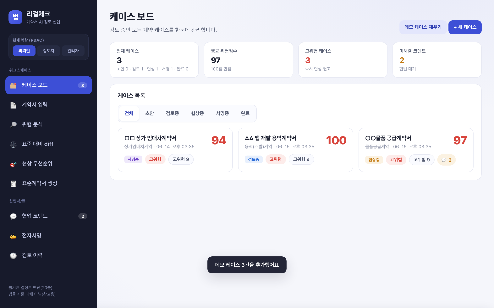

**② 계약서 입력 (유형 선택 + 스텝퍼)**
무엇: 케이스 제목·계약 유형·본문 입력 + 5단계 스텝퍼(입력→분석→diff→협상→서명). 의도: 워크플로 진입. 검토 결과: 예시 채움·스텝퍼 정상.
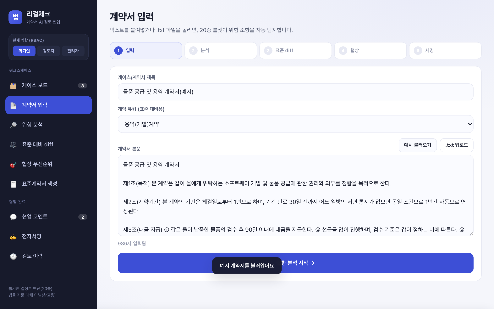

**③ 위험 분석 (가중치 모델 + 차트 2종 + 게이지)**
무엇: 위험점수 100·고위험 9·14룰 적중, 등급 분포 막대 + 카테고리별 가중 가로막대 + 종합 게이지(산식 표기). 의도: 가중치 모델 산출 시각화. 검토 결과: 두 차트·게이지 실제 렌더, 산식 `Σ(심각도×유형가중×빈도×등급계수)→정규화` 노출.
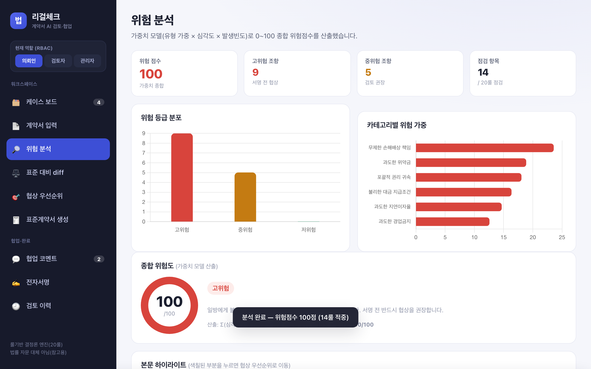

**④ 본문 하이라이트 (스크롤)**
무엇: 분석 본문에서 위약금·지연이자·면책 등 조항이 등급별 색으로 표시. 의도: 어느 문장이 위험한지 직관 전달. 검토 결과: 등급별 색·클릭 이동 정상.
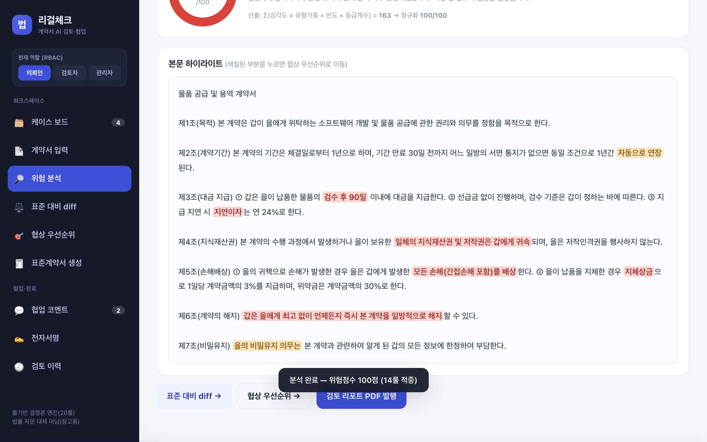

**⑤ 표준 대비 diff (토큰 유사도)**
무엇: 표준 정합도 9%·독소 14·누락 1·정합 0 + 조항별 좌(내 계약)/우(표준) 비교, 유사도 막대. 의도: 토큰 유사도로 독소/누락 자동 탐지. 검토 결과: 독소/누락/정합 분류·유사도(%) 정상.
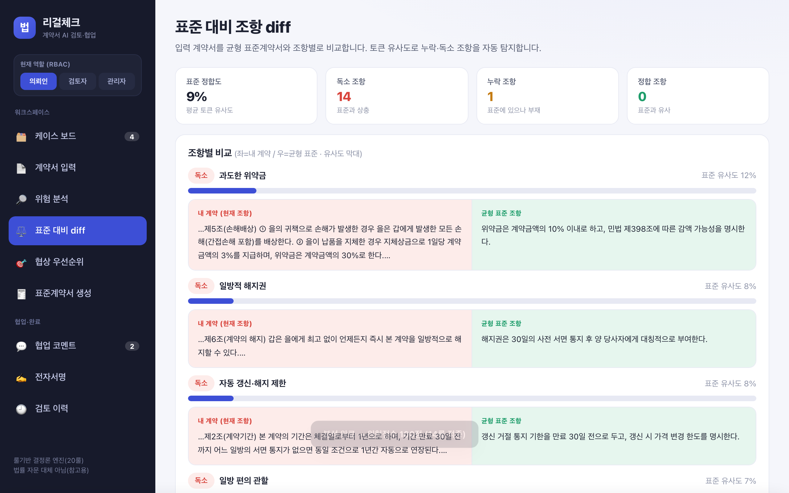

**⑥ 표준 대비 diff (스크롤)**
무엇: 자동갱신·관할 등 추가 조항의 좌우 비교. 의도: 다수 조항의 일관된 diff. 검토 결과: 좌우 색 구분·유사도 막대 정상.
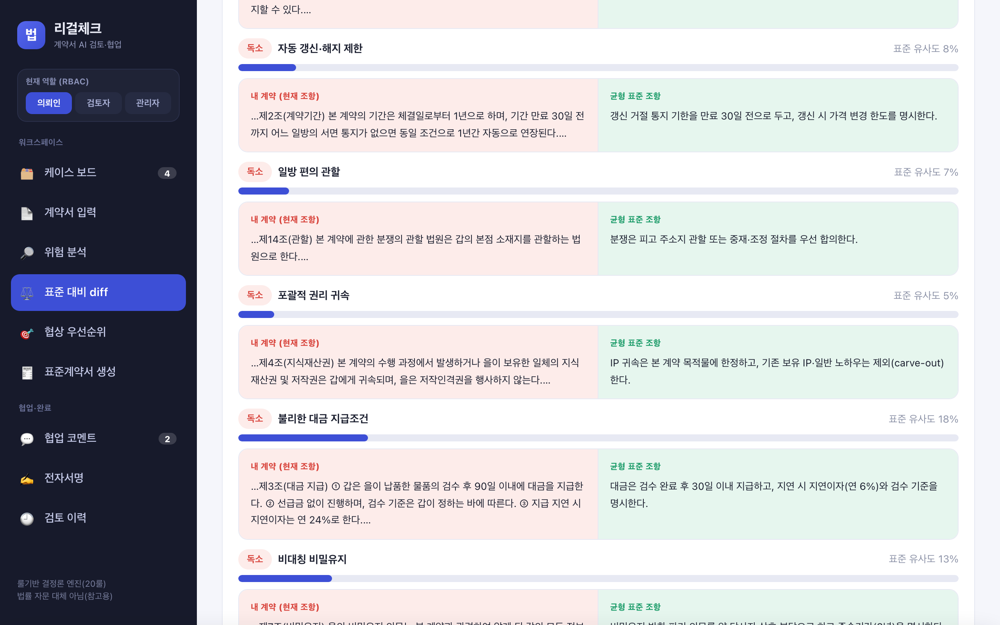

**⑦ 협상 우선순위 (ROI 랭킹 + 산점도)**
무엇: 임팩트–난이도 산점도 + 전체 채택 상태. 의도: ROI 기반 협상 순서. 검토 결과: 산점도 렌더·등급별 색 정상.
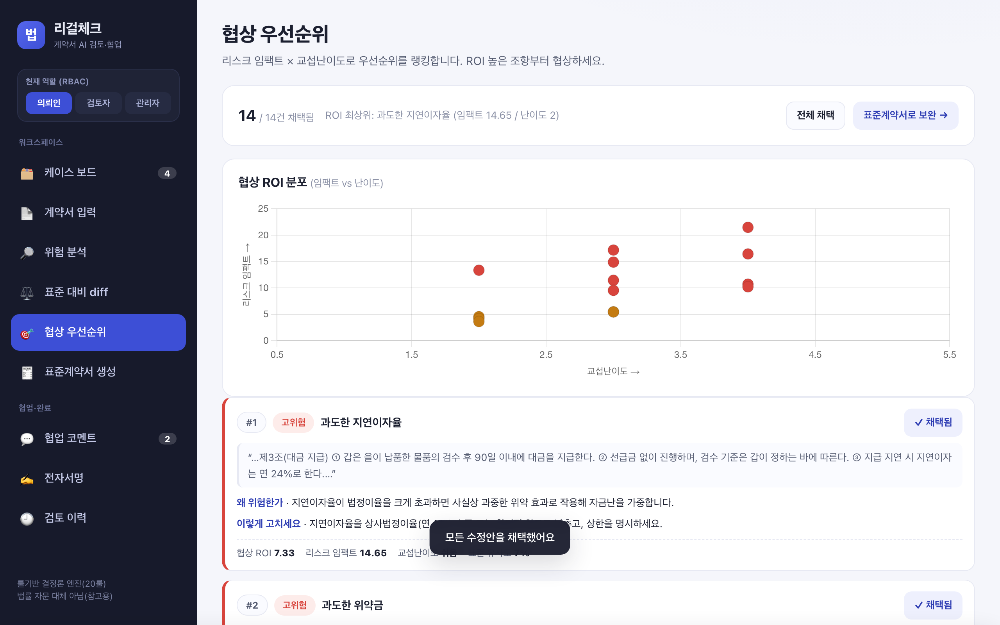

**⑧ 협상 우선순위 (랭킹 리스트)**
무엇: #1.. 우선순위 카드 + ROI/임팩트/난이도/표준유사도 메타. 의도: 조항별 협상 카드. 검토 결과: 순위·메타·채택 토글 정상.
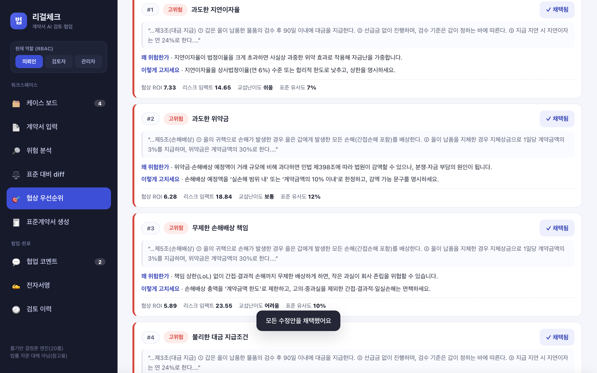

**⑨ 협업 코멘트 (검토자 작성)**
무엇: 검토자 역할로 전환 후 조항 코멘트 등록, KPI(전체/미해결/해결/검토자 의견) + 스레드. 의도: 다역할 협업. 검토 결과: 검토자 아바타(블루)·해결 토글·작성자 분기 정상.
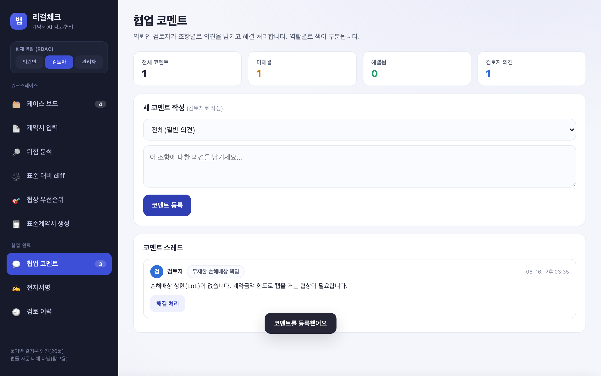

**⑩ 검토자 작업 보드 (역할 분기)**
무엇: 검토자 역할에서 헤더 '검토자 작업 보드' + 검토자 작업 큐(검토중·협상중 케이스), 관리자 메뉴 숨김. 의도: RBAC 화면 분기. 검토 결과: 큐·헤더 문구·메뉴 가시성 분기 정상.
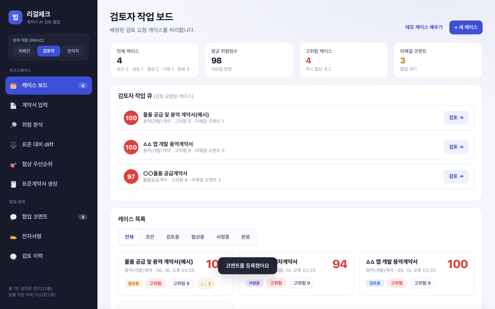

**⑪ 전자서명 (mock 발송 + 전원 완료)**
무엇: 서명자 목록(완료)·진행 타임라인(전 단계 완료)·외부 발송 로그(POST /esign·KAKAO alimtalk·WEBHOOK esign.completed). 의도: 전자서명/알림톡 외부 통합 mock. 검토 결과: 상태 전이·로그 적재·완료 전이 정상.
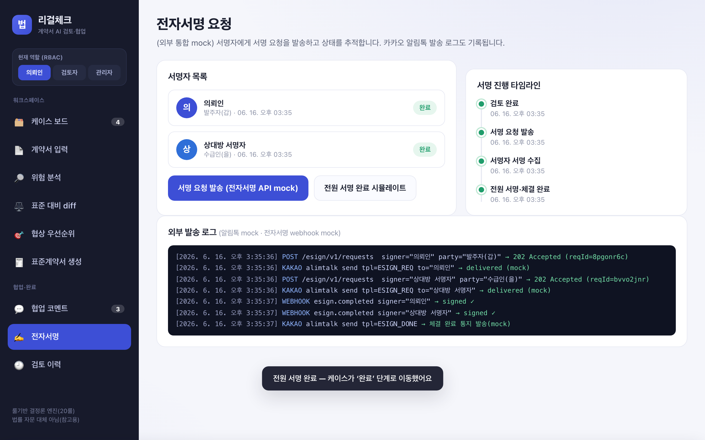

**⑫ 표준계약서 생성**
무엇: 용역(개발)계약 템플릿에 발주/수급·금액·기간 입력 → 미리보기에 균형 조항 출력. 의도: 위험 계약 대체 표준안. 검토 결과: 입력 반영·미리보기 정상.
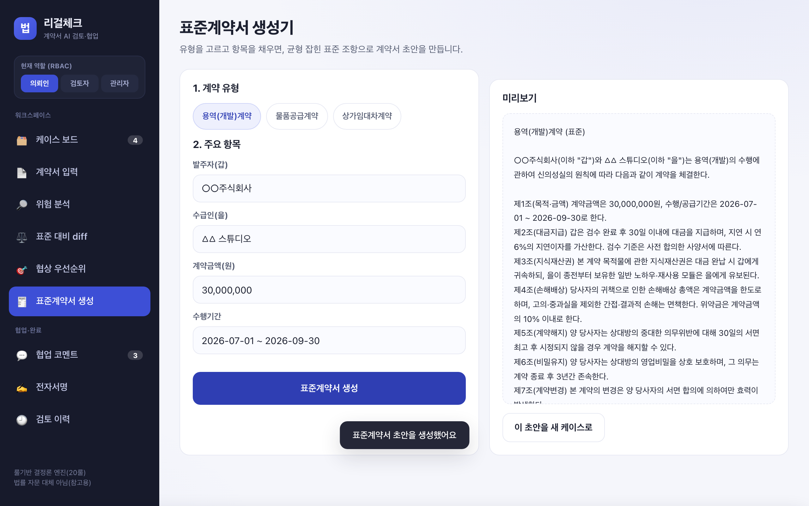

**⑬ 관리자 리포트 (포트폴리오)**
무엇: 관리자 역할 — 단계 분포 도넛 + 카테고리 누적 막대 + 완료율 KPI + 케이스 테이블 + CSV/JSON 입출력. 의도: 관리자 감독·집계. 검토 결과: 차트·테이블·입출력 버튼 정상, 관리자 메뉴 노출.
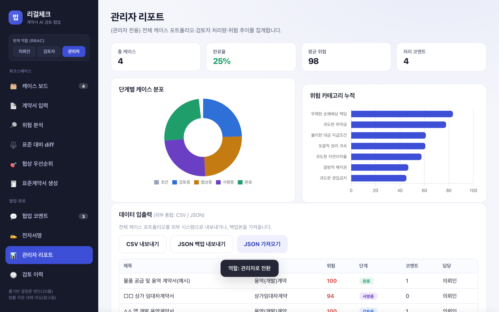

**⑭ 관리자 데이터 입출력 (CSV 다운로드 검증)**
무엇: CSV 내보내기 실행(캡처 중 `legalcheck_cases_….csv` 다운로드 확인) + 입출력 영역·포트폴리오 테이블. 의도: 외부 시스템 입출력. 검토 결과: CSV 실제 다운로드(콘솔 로그), 테이블 정상.
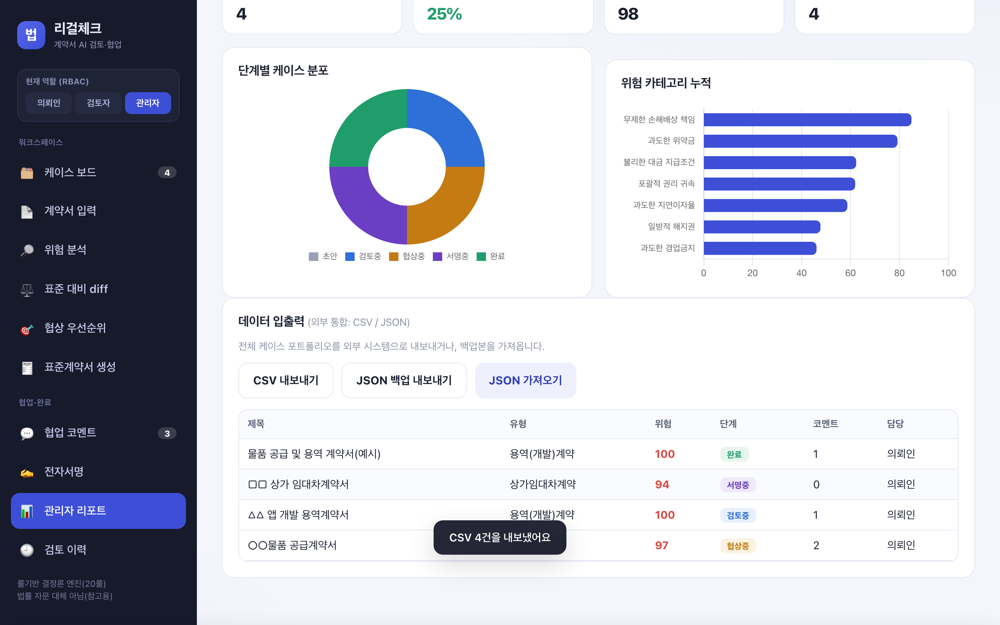

**⑮ 검토 이력 + PDF 발행**
무엇: 케이스 이력 목록(단계 포함) + 한 건 PDF 발행(캡처 중 `리걸체크_검토리포트_….pdf` 다운로드 확인). 의도: 이력·PDF 재발행. 검토 결과: 목록·PDF 실제 다운로드(콘솔 로그) 정상.
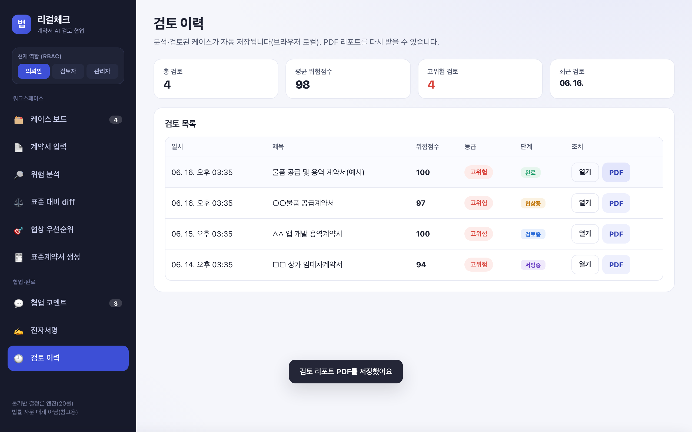

**⑯ 지속성 (새로고침 후)**
무엇: 페이지 새로고침 후에도 케이스 보드의 케이스·단계·점수 유지. 의도: localStorage 영속 입증. 검토 결과: 새로고침 후 케이스 그대로 표시.
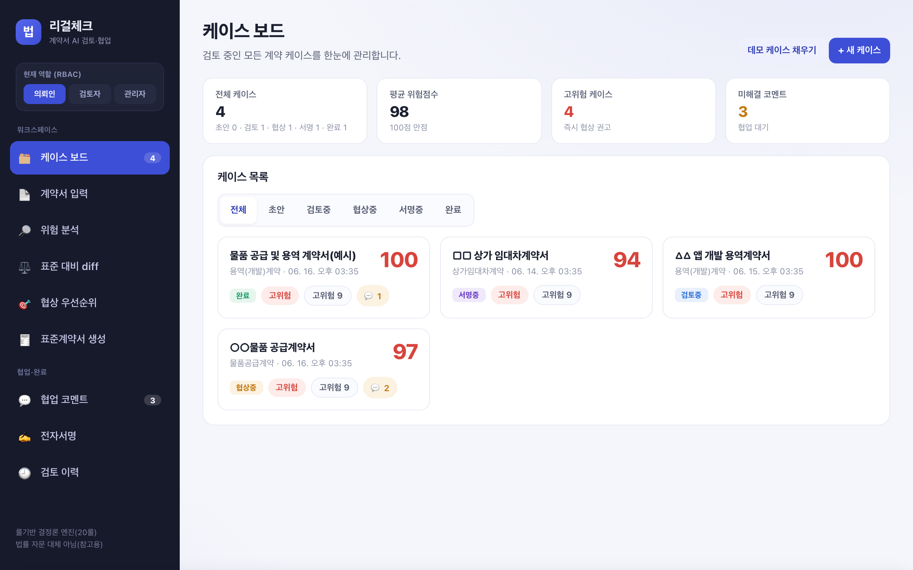

### 5.2 모바일 (390×844, isMobile/hasTouch) — `./captures/mobile/v2/`

**① 케이스 보드 (앱바 + 바텀탭)**
무엇: 모바일 앱바(햄버거+브랜드+역할 태그) + 풀폭 KPI 2열 + 케이스 카드 + 하단 5탭 바텀바. 의도: 사이드바 대신 드로어/바텀탭 재구성. 검토 결과: 사이드바 미노출·가로 overflow 없음·풀폭, 협상 탭 알림 점.
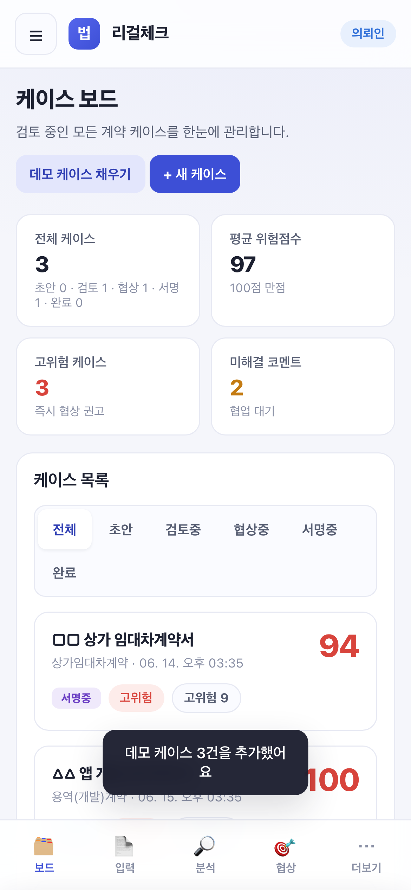

**② 햄버거 드로어 (오프캔버스)**
무엇: 햄버거 → 좌측 드로어 슬라이드 인 + 역할 스위처 + 전체 메뉴, 배후 콘텐츠 딤. 의도: 메뉴 多 대시보드의 드로어. 검토 결과: 드로어 정상 슬라이드·백드롭 딤, 상단 패널 하이재킹 없음.
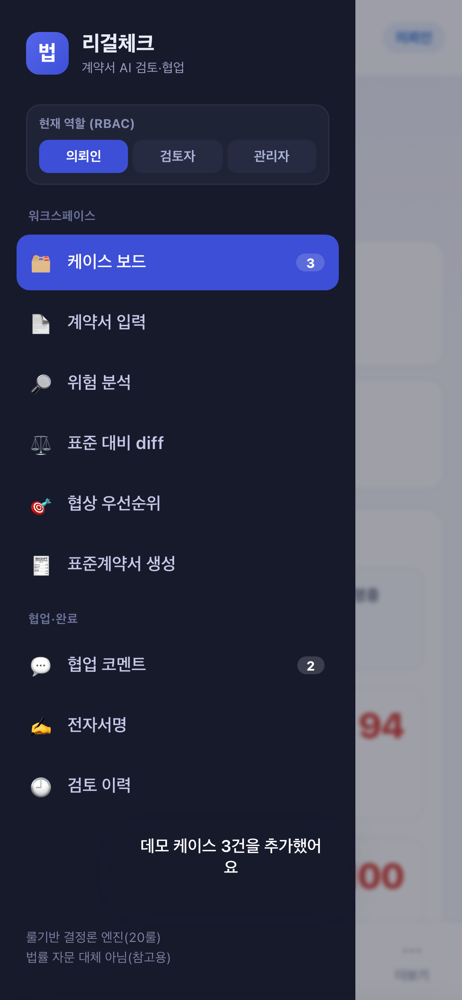

**③ 계약서 입력**
무엇: 풀폭 입력 폼(제목·유형·본문) + 스텝퍼 세로 스택. 의도: 좁은 화면 입력. 검토 결과: 풀폭·overflow 없음.
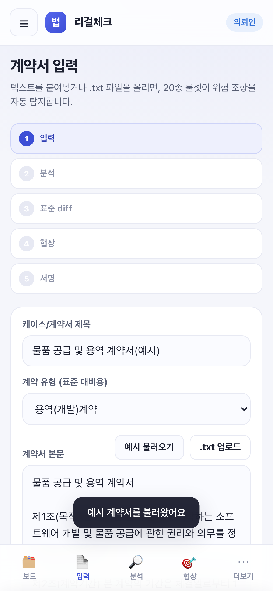

**④ 위험 분석 상단 (KPI 2열 + 차트)**
무엇: KPI 2열 스택 + 등급 분포 차트. 의도: 4열→2열 스택, 차트 고정높이. 검토 결과: 차트 실제 렌더(빈 박스 아님), 숫자 잘림 없음.
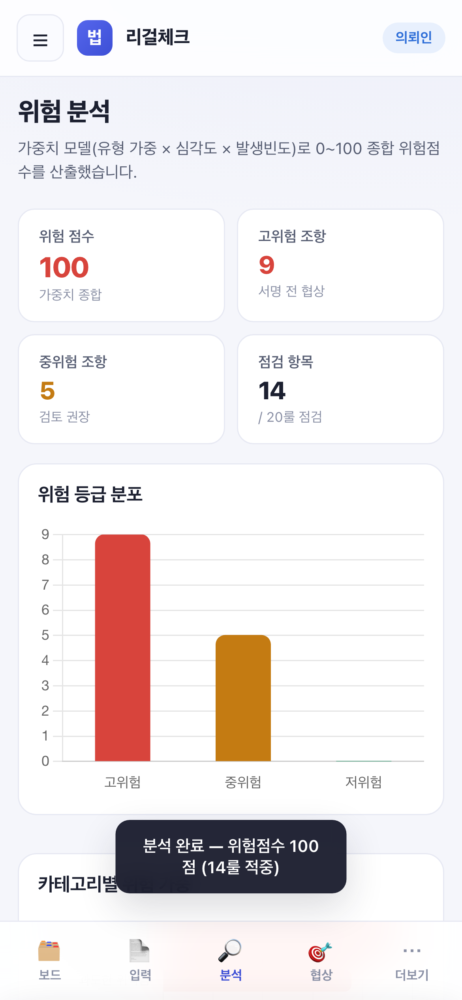

**⑤ 위험 분석 스크롤 (카테고리 차트 + 게이지)**
무엇: 카테고리별 가중 가로막대 + 종합 게이지(산식) + 본문 하이라이트. 의도: 스크롤 본문·게이지 확인. 검토 결과: 가로막대·게이지 렌더·산식 표기 정상.
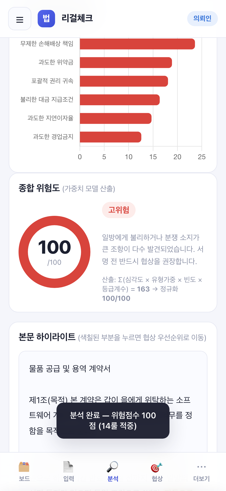

**⑥ 더보기 바텀시트**
무엇: 바텀탭 '더보기' → 시트에 diff·생성·협업·서명·이력(관리자 시 리포트). 의도: 5개 초과 목적지를 시트로. 검토 결과: 시트 슬라이드업·항목 정상.
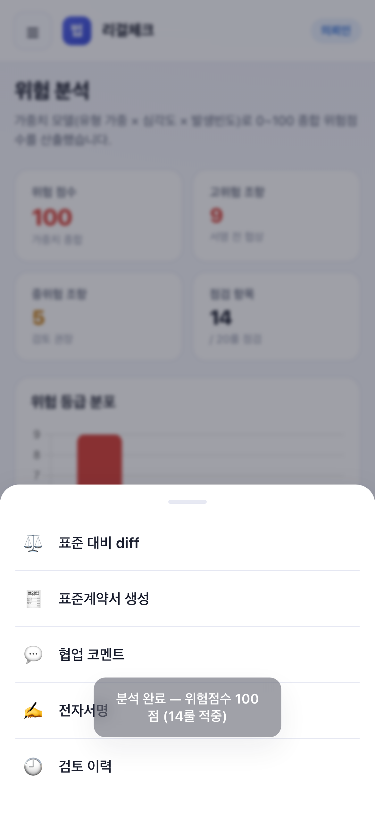

**⑦ 표준 대비 diff (상하 스택)**
무엇: 독소/누락/정합 KPI + 조항별 비교가 좌우→**상하 스택**(내 계약 위, 표준 아래) + 유사도 막대. 의도: 좁은 화면 diff 가독. 검토 결과: 상하 스택·세로 쪼개짐 없음·유사도 막대 정상.
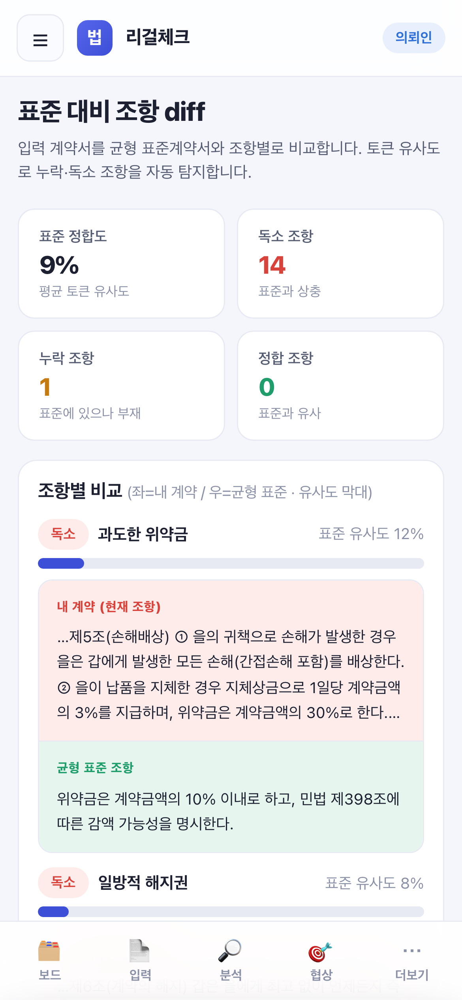

**⑧ 협상 우선순위**
무엇: 산점도 + #1.. 우선순위 카드(ROI 메타 풀폭). 의도: 협상 ROI 모바일. 검토 결과: 산점도 렌더·카드 풀폭·메타 줄바꿈 정상.
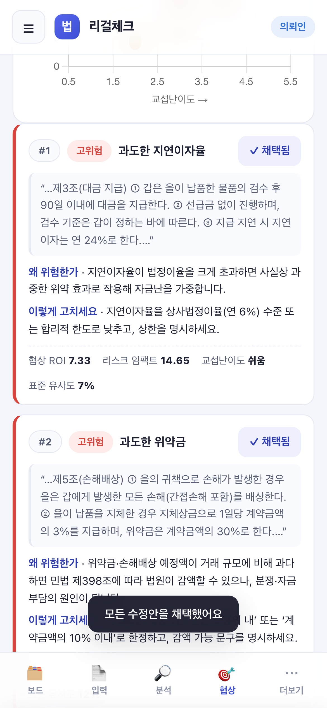

**⑨ 협업 코멘트 (검토자)**
무엇: KPI + 코멘트 작성(검토자로 작성) + 스레드(검토자 아바타). 의도: 모바일 협업. 검토 결과: 작성자 분기·해결 버튼·풀폭 정상.
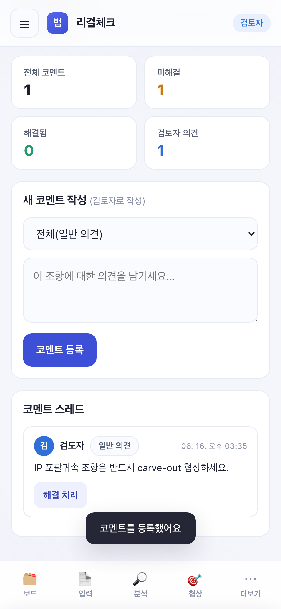

**⑩ 전자서명 (타임라인 + 로그)**
무엇: 서명 진행 타임라인 + 외부 발송 로그(esign/알림톡/webhook) 풀폭. 의도: 모바일 서명 추적. 검토 결과: 타임라인·로그 풀폭·줄바꿈 정상.
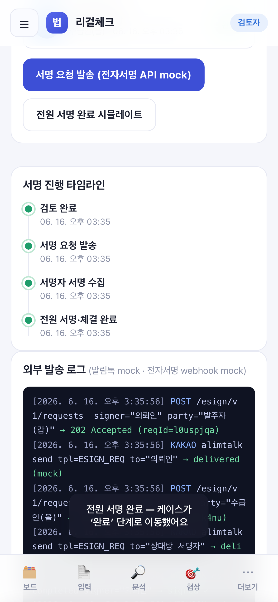

**⑪ 관리자 리포트 (도넛 차트)**
무엇: 관리자 역할 — 단계 분포 도넛 + KPI 2열. 의도: 모바일 관리자 집계. 검토 결과: 도넛 실제 렌더(붕괴 없음), 역할 태그 '관리자'.
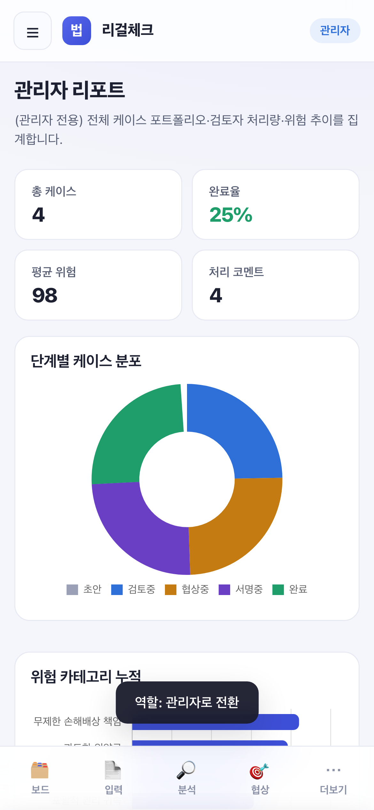

**⑫ 관리자 데이터 입출력 (가로 스크롤 표)**
무엇: 카테고리 누적 막대 + CSV/JSON 입출력 버튼 + 포트폴리오 테이블(가로 스크롤). 의도: 표 열 증발 없이 접근. 검토 결과: 가로 스크롤로 전 열 접근·버튼 정상.
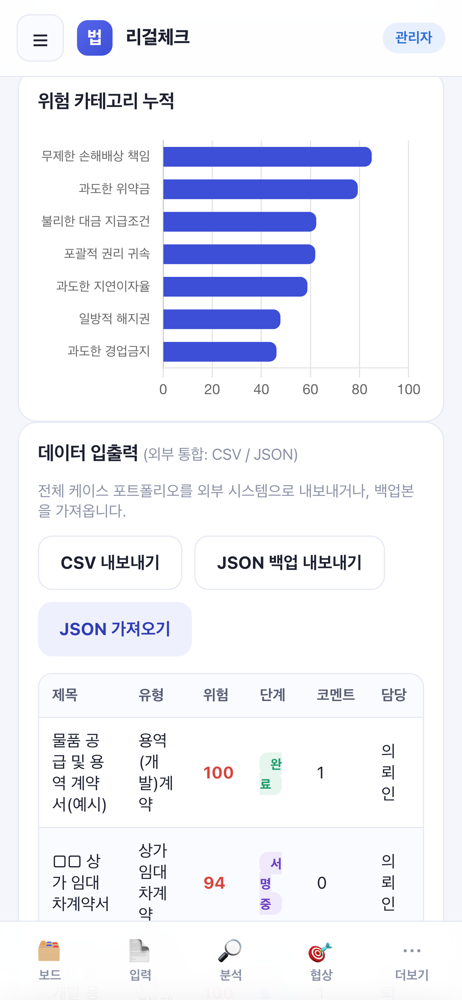

**⑬ 검토 이력**
무엇: 이력 KPI 2열 + 케이스 목록(단계 포함, 가로 스크롤 테이블). 의도: 모바일 이력. 검토 결과: 표 가로 스크롤·풀폭 정상.
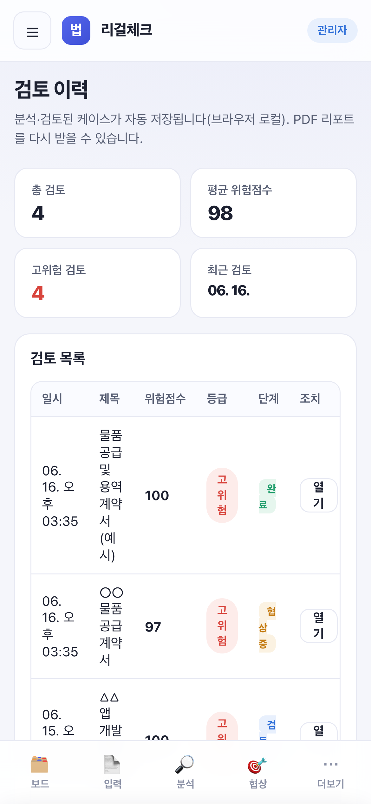

---

## 6. 검수 기준 충족 여부

| # | 검수 기준 | 결과 | 측정값 |
|:--:|:---|:---:|:---|
| 1 | 10뷰 표시·전환 | ✅ | 보드·입력·분석·diff·협상·생성·협업·서명·관리자·이력 |
| 2 | 룰셋 20종 + 가중치 모델, ≥14룰 적중, 1초 내 | ✅ | 예시 분석 14룰 적중·고위험 9·점수 100, 즉시 + 산식 표기 |
| 3 | 표준 대비 diff(독소/누락/정합·유사도%) | ✅ | 독소 14·누락 1·정합 0·정합도 9%, 좌우 비교 |
| 4 | 협상 ROI 랭킹 + 산점도 | ✅ | #1.. 순위·ROI/임팩트/난이도 메타·scatter 렌더 |
| 5 | 3역할 RBAC 분기 | ✅ | 검토자 큐·관리자 리포트·코멘트 작성자 분기 |
| 6 | 케이스 보드(단계·필터·KPI) | ✅ | 데모 3건·단계 플래그·필터·KPI 동작 |
| 7 | 협업 코멘트(역할 색·해결) | ✅ | 검토자 코멘트 등록·아바타 색·해결 토글 |
| 8 | 전자서명 mock(발송→완료 전이·로그) | ✅ | 발송 로그 3종(esign/알림톡/webhook)·완료 전이 |
| 9 | CSV/JSON 입출력 | ✅ | CSV·PDF 실제 다운로드(콘솔 로그), JSON 가져오기 병합 |
| 10 | PDF 한글 깨짐 0 | ✅ | 캔버스 렌더로 한글 보존, 협상 우선순위 반영 |
| 11 | 새로고침 후 케이스 유지 | ✅ | 16-persistence 캡처로 입증 |
| 12 | 390px overflow 0·드로어/바텀탭/시트 / 1280 사이드바 | ✅ | 모바일 드로어·바텀탭·더보기 시트·풀폭, PC 사이드바 252px |

---

## 7. 추가 확장 가능 영역

- LLM 의미 분석 결합(룰셋이 못 잡는 맥락적 불균형 탐지), 계약 유형 자동 분류 고도화.
- 실 전자서명 사업자(모두싸인·KICA) 연동, 실 알림톡 발송, 실 서버 RBAC·테넌트 분리.

---

## 8. 검토 체크리스트

- [x] 모든 핵심 기능이 캡처되었는가 (PC 16 + 모바일 13)
- [x] 캡처가 의도한 기능을 정확히 보여주는가 (작성자가 PNG 직접 열람·확인)
- [x] 한글이 깨지지 않는가 (UI·PDF 모두 정상)
- [x] 에러 화면이 의도치 않게 캡처되지 않았는가
- [x] 결과물(점수·diff·ROI·PDF·CSV)의 정확도가 충분한가
- [x] 과업지시서 §5 항목 100% 매핑되었는가 (§1·§6)
- [x] (v2 한정) v1 한계 매핑표 + 5억 가치 기준 충족 — 실 알고리즘(가중치 모델·토큰 유사도·ROI), 다중 사용자(3역할 RBAC), 외부 통합 2건(전자서명/알림톡 mock·CSV/JSON), 10뷰·워크플로 3개, 신규 캡처 PC 16·모바일 13
- [x] PC·모바일 캡처를 폴더 나눠 저장(`captures/v2`·`captures/mobile/v2`) + 양쪽 임베드
