last_updated: 2026-06-16 19:10

# 개발결과보고서 v3 — 리걸체크 계약서 검토·협업·협상 플랫폼 (시리즈A 데모)

> [`5_과업지시서_v3.md`](./5_과업지시서_v3.md) §5 성과품 목록의 검수 증거 문서.
> 실제 구동 화면을 PC(1280×800)·모바일(390×844) 두 뷰포트에서 캡처해 첨부한다.
> v3의 분석 엔진도 **결정론적 룰/알고리즘**(22룰 가중치 모델·TF-IDF 코사인 유사도·등급 캘리브레이션·협상 시뮬레이터)이며 **LLM 추론이 아니다.** 전자서명 OAuth·알림톡·webhook·팀 협업 알림·법령/판례 매칭은 외부 키 없이 동작하는 **mock/내장 룰DB**다.

---

## v2 한계 및 v3 개선 매핑

| # | v2 한계(부족) | v3 개선(해결 방식) | 증거 |
|:--:|:---|:---|:---|
| 1 | 표준 diff가 **토큰 Jaccard**(집합 교집합) 수준 — 어휘 빈도·희소성 미반영 | **TF-IDF 코사인 유사도** — 표준조항 코퍼스로 IDF 산출 → 어절+한글 bigram TF-IDF 벡터 코사인. 희소 핵심어 가중, 평균 코사인=표준 정합도(%) | PC 05·06 / Mobile 07 |
| 2 | 위험점수→등급 매핑이 **고정 임계**(맥락 무관) | **등급 캘리브레이션** — 고위험 조항 수에 따라 임계 동적 보정(≥3 시 하향, 거의 없을 시 상향), 분석 화면에 적용 임계 표기 | PC 03 |
| 3 | 협상이 ROI **랭킹 제시까지만** — 수정 시 점수가 얼마나 떨어지는지 시뮬 불가 | **협상 시뮬레이터** — 조항별 ‘표준대로 수정’ 토글 → 위험점수 즉시(<100ms) 재계산, before/after 막대 + 등급 변화, 선택 수정안 일괄 채택 | PC 09 / Mobile 09 |
| 4 | 전자서명이 단순 **발송 mock** — 인증 핸드셰이크·완료 콜백 없음 | **OAuth 2.0 흐름 + webhook 콜백 mock** — authorize→callback(state 검증)→token 교환 로그, 연결 후에만 발송 활성, `esign.completed` webhook 완료 추적 | PC 12 / Mobile 11·12 |
| 5 | 협업이 **코멘트 스레드까지만** — 팀원 알림 전파 없음 | **실시간 팀 협업 알림** — 코멘트 작성 시 `collab.comment.created` webhook + 팀 알림(2명) 로그 적재, 협업 화면에 실시간 로그 표시 | PC 11 / Mobile 10 |
| 6 | **한국어 전용** — 해외/외국계 법무 대응 불가 | **KO/EN 다국어 i18n** — 사이드바·모바일 앱바 토글로 UI·룰 카테고리·법령 근거·표준 조항·차트·PDF·바텀탭까지 즉시 전환, localStorage 언어 기억 | PC 18·19 / Mobile 17 |
| 7 | **거버넌스 부재** — 누가 언제 무엇을 했는지 추적·이력 없음 | **감사 로그(Audit Trail)** — 케이스/코멘트/서명/버전 이벤트 시간순 기록(최대 300)·유형 필터 5종·관리자 전용 + **계약 버전관리** — 버전 스냅샷, 버전 간 조항 add/remove·위험점수 변화 diff | PC 16(감사)·13(버전) / Mobile 16(감사)·13(버전) |
| 8 | 룰셋 **20종** — 자동출금·담보·연대보증·데이터 권리 미탐지 | **룰셋 22종** + 각 룰에 **법령/판례 매칭 근거(`lawRef`)** 내장(예: 위약금=민법 제398조, IP=저작권법 제45·14조), 협상 카드·PDF에 노출 | PC 03·08 / Mobile 04 |
| 9 | 뷰 **10종** | 뷰 **13종**(시뮬레이터·버전관리·감사 로그 신규) | 전 캡처 |

---

## v3 신규/심화 산출물

### 1) 고급 분석 알고리즘 심화
- **TF-IDF 코사인 유사도 diff:** 표준조항 코퍼스를 빌드해 IDF(역문서빈도)를 산출, 내 계약 조항과 룰별 균형 표준 문구를 각각 **어절 + 한글 bigram TF-IDF 벡터**로 변환해 **코사인 유사도**로 비교한다. 희소·핵심 보호어에 IDF 가중이 실려 v2 Jaccard보다 독소/누락/정합 분류가 정교하다. 유사도 ≥0.30=정합, <0.30=독소, 핵심 보호조항(책임제한·비밀유지·불가항력) 부재 시 누락. 평균 코사인=표준 정합도(%).
- **등급 캘리브레이션:** 고위험 조항 ≥3 시 임계를 하향(고위험 52/중위험 26), 거의 없을 시 상향(68/36)으로 점수→등급 매핑을 동적 보정한다. 분석 화면 종합 게이지에 적용 임계가 표기된다.
- **협상 시뮬레이터:** 조항별 ‘표준대로 수정’ 토글 시 해당 조항 위험 가중을 표준 수준(18%)으로 낮춘 위험점수를 즉시 재계산하고, before/after 막대 차트와 등급 변화(예: 100 → 73, −27점)를 표시한다. 선택한 수정안을 케이스에 일괄 채택할 수 있다.
- **법령/판례 매칭 DB:** 22룰 각각에 KO/EN 법령·판례 근거를 내장해 협상 카드·검토 리포트 PDF에 근거를 노출한다.

### 2) 다중 사용자/다중 테넌트 (v2 계승 + 심화)
- **3역할 RBAC**(의뢰인·검토자·관리자) 스위처. 관리자 전용으로 **감사 로그**·**관리자 리포트**·CSV/JSON 입출력을 노출하고, 검토자는 작업 큐·코멘트 작성자 분기를 갖는다.
- **실시간 팀 협업 알림:** 검토자가 코멘트를 등록하면 `collab.comment.created` webhook과 팀원(2명) 알림 로그가 협업 화면에 실제로 적재된다.

### 3) 외부 시스템 통합 (CDN·라이브러리 제외)
- **① 전자서명 OAuth 2.0 + webhook 콜백 mock:** `GET .../oauth/authorize?...state=...` → `CALLBACK ...?code=...&state=...`(state 검증) → `POST /oauth/token`(access_token 교환) 핸드셰이크 로그. 연결 후에만 서명 요청 활성, 서명 완료 시 `WEBHOOK esign.completed` 콜백으로 케이스 완료 전이. 알림톡 발송 로그 병행.
- **② 팀 협업 알림 webhook:** 코멘트 작성 이벤트를 webhook + 팀 알림 로그로 외부 전파(mock).
- **③ CSV/JSON 외부 입출력(v2 계승):** 포트폴리오 CSV(BOM·따옴표 이스케이프)·JSON 백업 실제 다운로드, JSON 가져오기 병합.

### 4) 다국어(i18n)·거버넌스
- **KO/EN i18n:** 사전 기반 토글로 전 UI(사이드바·바텀탭·룰 카테고리·법령 근거·표준 조항·차트 라벨·PDF)가 즉시 전환되고 언어 선택이 localStorage에 기억된다.
- **감사 로그 + 계약 버전관리:** 모든 케이스/코멘트/서명/버전 이벤트를 시간순 기록하고 유형으로 필터한다. 협상 반영본을 버전 스냅샷으로 저장해 버전 간 조항 추가·삭제·위험점수 변화를 추적한다.

---

## 1. 성과품 매핑

| # | 과업지시서 §5 성과품 | 납품 산출물 | 충족 |
|:--:|:---|:---|:---:|
| 1 | `v3.html` 시제품(13뷰) | `projects/legal-check/v3.html` | ✅ |
| 2 | 룰셋 22종 + 법령/판례 매칭 | `RULES`(22)·각 룰 `lawRef`·`analyze()` | ✅ |
| 3 | TF-IDF 코사인 diff | `buildCorpusIdf()`·`tfidfVec()`·`cosine()`·`renderDiff()` | ✅ |
| 4 | 등급 캘리브레이션 | `calibrate()` 동적 임계 + 분석뷰 임계 표기 | ✅ |
| 5 | 협상 시뮬레이터 | `simulate()`·토글 재계산·before/after 차트·일괄 채택 | ✅ |
| 6 | 전자서명 OAuth + webhook | `oauthAuthorize()`·`oauthCallback()`·`tokenExchange()`·`esign.completed` | ✅ |
| 7 | 실시간 팀 협업 알림 | `collab.comment.created` webhook + 팀 알림 로그 | ✅ |
| 8 | KO/EN i18n | `I18N` 사전·`setLang()`·전 UI/룰/법령/차트/PDF 전환 | ✅ |
| 9 | 감사 로그 | `audit()`·`renderAudit()`·유형 필터·관리자 전용 | ✅ |
| 10 | 계약 버전관리 | `saveVersion()`·`renderVersions()`·버전 간 diff | ✅ |
| 11 | 3역할 RBAC·보드·협업·표준생성·CSV/JSON(v2 계승) | `applyRole()`·`renderBoard()`·`renderCollab()`·`exportCsv/Json()` | ✅ |
| 12 | 검토 리포트 PDF | `makePDF()` jsPDF 캔버스 한글, 협상·법령·정합도·KO/EN 반영 | ✅ |
| 13 | 영속 | localStorage `legalcheck_cases_v3`·`legalcheck_audit_v3`·언어 | ✅ |
| 14 | 반응형(PC+모바일) | 사이드바↔드로어+바텀탭+시트, 390/1280 KO·EN 양쪽 | ✅ |

---

## 2. 구현·제작 범위

- **13개 뷰** 실동작: ① 케이스 보드 ② 계약서 입력 ③ 위험 분석(등급 캘리브레이션) ④ 표준 대비 diff(TF-IDF 코사인) ⑤ 협상 우선순위 ⑥ 협상 시뮬레이터 ⑦ 표준계약서 생성 ⑧ 협업 코멘트(팀 알림) ⑨ 전자서명(OAuth) ⑩ 버전 관리 ⑪ 관리자 리포트 ⑫ 감사 로그 ⑬ 검토 이력.
- **워크플로 3개:** (a) 입력→분석→diff→협상 채택/시뮬레이션→OAuth 서명(검토·협상·체결 파이프라인), (b) 검토자 코멘트→팀 알림→해결→단계 전이(실시간 협업), (c) 케이스 포트폴리오→버전 스냅샷→감사 로그→CSV/JSON 입출력(거버넌스/백업).
- **고급 알고리즘:** TF-IDF 코사인 유사도 diff, 등급 캘리브레이션, 협상 시뮬레이터(조건 변경→재계산), 22룰 가중치 모델.
- **다중 사용자:** 3역할 RBAC, 케이스 보드, 팀 협업 알림.
- **외부 통합:** 전자서명 OAuth 2.0 + webhook 콜백 mock, 팀 협업 알림 webhook, CSV/JSON 입출력.
- **다국어·거버넌스:** KO/EN i18n, 감사 로그, 계약 버전관리.

---

## 3. 환경

| 항목 | 값 |
|:---|:---|
| OS | macOS (darwin 24.6.0) |
| 구동 | 브라우저 단일 HTML, `file://`로 직접 열림(빌드 없음) |
| 라이브러리 | Chart.js 4.4.1 (CDN), jsPDF 2.5.1 (CDN) |
| 저장 | 브라우저 localStorage (`legalcheck_cases_v3`·`legalcheck_audit_v3`·언어) |
| 캡처 | Playwright(chromium) — PC 1280×800, 모바일 390×844(isMobile/hasTouch) |
| 외부 키 | 없음(전자서명 OAuth·알림톡·webhook·팀 알림·법령매칭 전부 mock/내장 룰DB) |
| 분석 엔진 | 결정론적 룰/알고리즘(22룰 가중치·TF-IDF 코사인·캘리브레이션·시뮬레이터). **LLM 아님** |

---

## 4. 실행/구동 방법

```bash
# 1) 앱 실행 — 브라우저로 v3.html 열기 (빌드 불필요)
open projects/legal-check/v3.html

# 2) 캡처 재현 (선택)
cd projects/legal-check
npm i -D playwright && npx playwright install chromium   # 또는 글로벌 chromium 사용
node capture.mjs            # PC→biz/captures/v3, 모바일→biz/captures/mobile/v3
rm -rf node_modules package*.json
```

앱 사용: ‘데모 케이스 채우기’로 보드 채움 → ‘계약서 입력 → 예시 불러오기 → 조항 분석 시작’ → 분석(등급 캘리브레이션)·표준 diff(TF-IDF 코사인)·협상 우선순위 확인 → **협상 시뮬레이터**에서 조항 토글로 점수 재계산 → 검토자로 코멘트 작성(팀 알림 webhook) → 의뢰인으로 전자서명 OAuth 연결→서명→webhook 완료 → 버전 스냅샷 저장 → 관리자로 감사 로그·CSV/JSON 확인 → **KO/EN 토글**로 전 UI 전환.

---

## 5. 화면·실물 캡처

### 5.1 PC (1280×800) — `./captures/v3/`

**① 케이스 보드 (다중 케이스·단계·KPI)**
무엇: 데모 케이스 + KPI(전체/평균위험/고위험/미해결 코멘트), 단계 플래그·등급·코멘트 배지, 좌측 KO/EN·역할 스위처. 의도: 다중 케이스 관리 보드 + i18n/RBAC 진입. 검토 결과: 카드·배지·필터·스위처 정상.
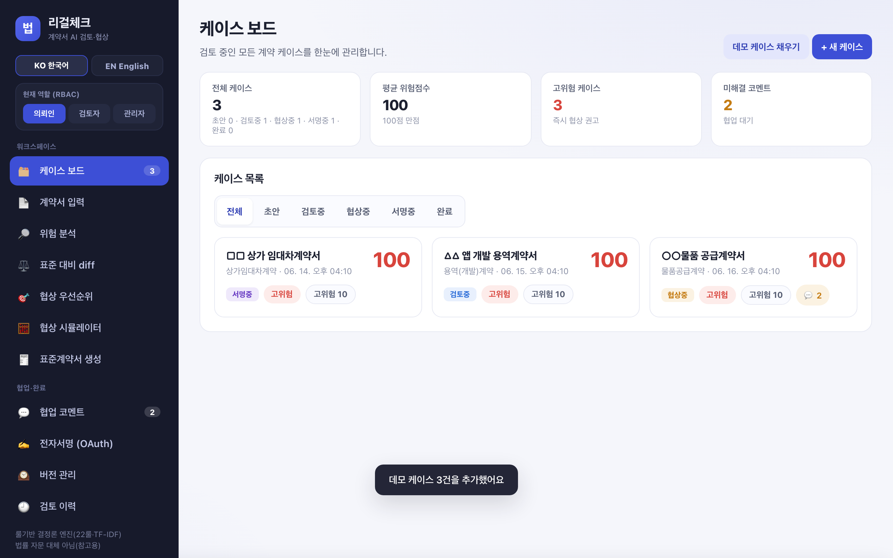

**② 계약서 입력**
무엇: 케이스 제목·계약 유형·본문 입력 + 스텝퍼. 의도: 검토 워크플로 진입. 검토 결과: 예시 채움·스텝퍼 정상.
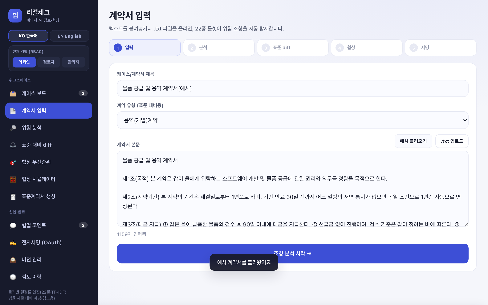

**③ 위험 분석 (22룰 가중치 + 등급 캘리브레이션)**
무엇: 위험점수 100·고위험 10·16룰 적중, 등급 분포 막대 + 카테고리별 가중 가로막대 + 종합 게이지(적용 임계 표기). 의도: 22룰 가중치 모델 + 동적 임계 캘리브레이션 시각화. 검토 결과: 두 차트·게이지 실제 렌더, 16룰 적중(≥14 충족), 종합도/임계 노출.
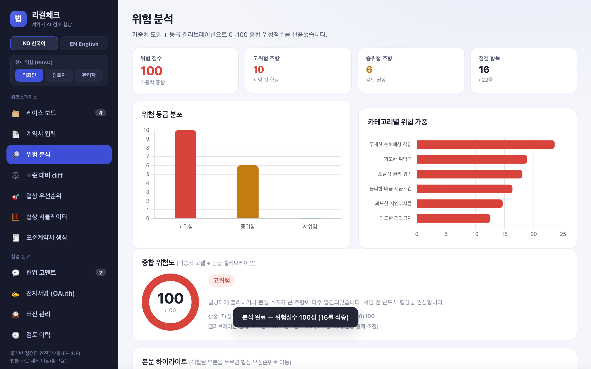

**④ 본문 하이라이트**
무엇: 분석 본문에서 위약금·지연이자·자동출금 등 조항이 등급별 색으로 표시. 의도: 위험 문장 직관 전달. 검토 결과: 등급별 색·이동 정상.
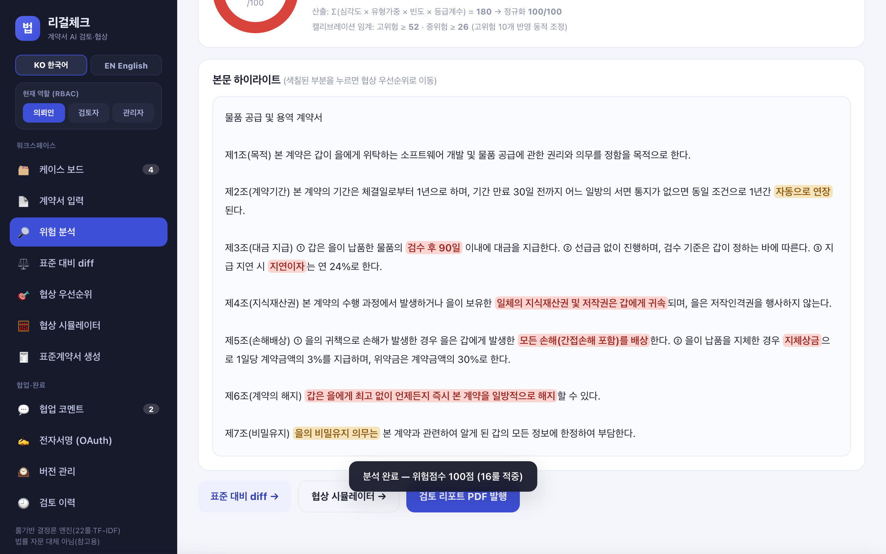

**⑤ 표준 대비 diff (TF-IDF 코사인)**
무엇: 표준 정합도 32%·독소 6·누락 0·정합 10 + 조항별 좌(내 계약)/우(균형 표준) 비교, 코사인 유사도 막대. 의도: TF-IDF 코사인으로 독소/누락/정합 정교 분류. 검토 결과: 분류·코사인 유사도(%) 정상, 헤더 ‘TF-IDF 코사인’ 표기.
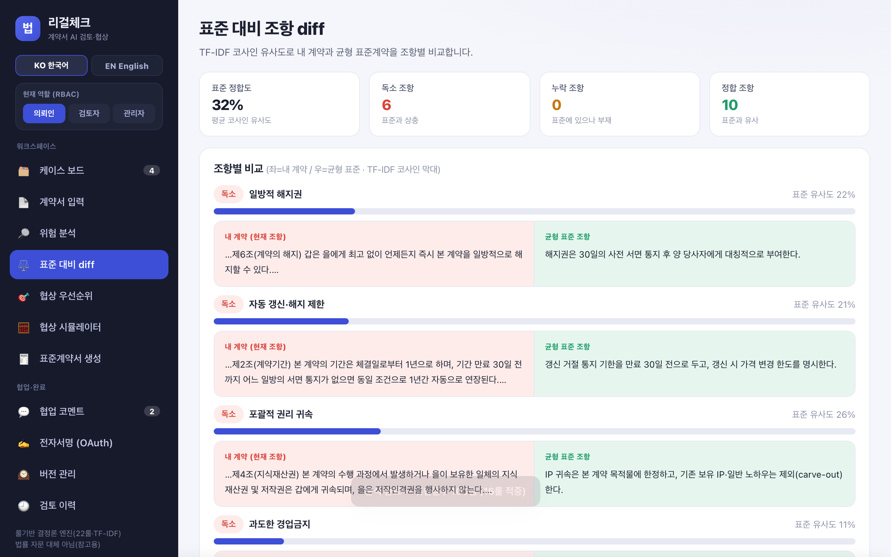

**⑥ 표준 대비 diff (스크롤)**
무엇: 추가 조항(포괄적 권리귀속·과도한 경업금지 등)의 좌우 비교. 의도: 다수 조항 일관 diff. 검토 결과: 좌우 색·유사도 막대 정상.
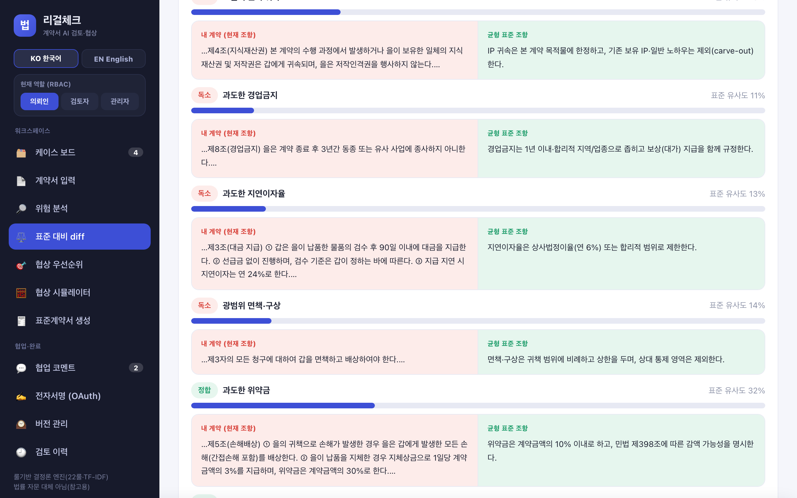

**⑦ 협상 우선순위 (ROI 랭킹)**
무엇: 임팩트–난이도 산점도 + #1.. 우선순위 카드. 의도: ROI 기반 협상 순서. 검토 결과: 산점도·순위·메타 정상.
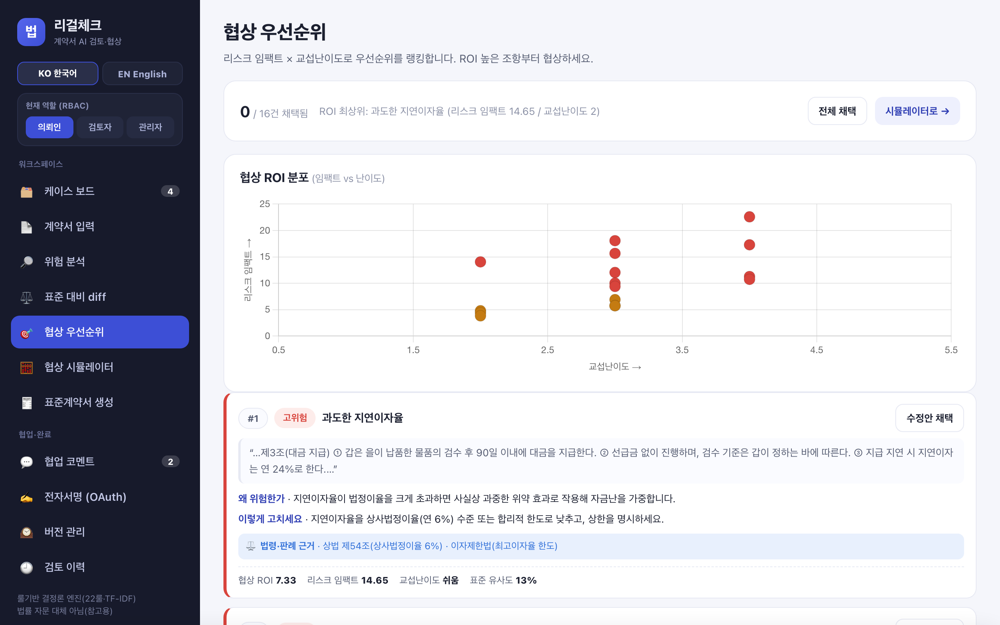

**⑧ 협상 우선순위 (법령/판례 근거)**
무엇: 협상 카드에 조항별 법령·판례 근거(`lawRef`) 노출. 의도: 22룰 법령/판례 매칭 DB 시연. 검토 결과: 법령 근거가 카드에 정상 노출.
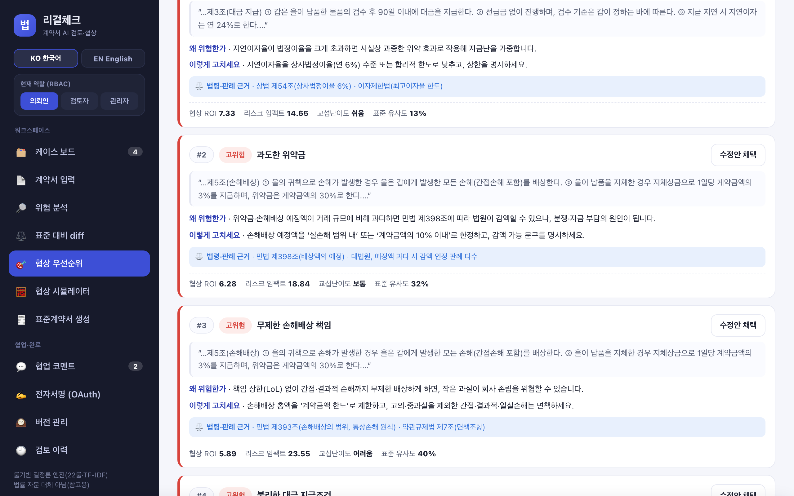

**⑨ 협상 시뮬레이터 (조건 변경→재계산)**
무엇: 조항별 현행/표준대로수정 토글 + 시뮬레이션 결과 100 → 73(−27점) before/after 막대 + 선택 수정안 일괄 채택. 의도: 수정 시 위험점수가 얼마나 떨어지는지 즉시 재계산. 검토 결과: 토글·재계산·before/after 차트·등급 변화·일괄 채택 정상.
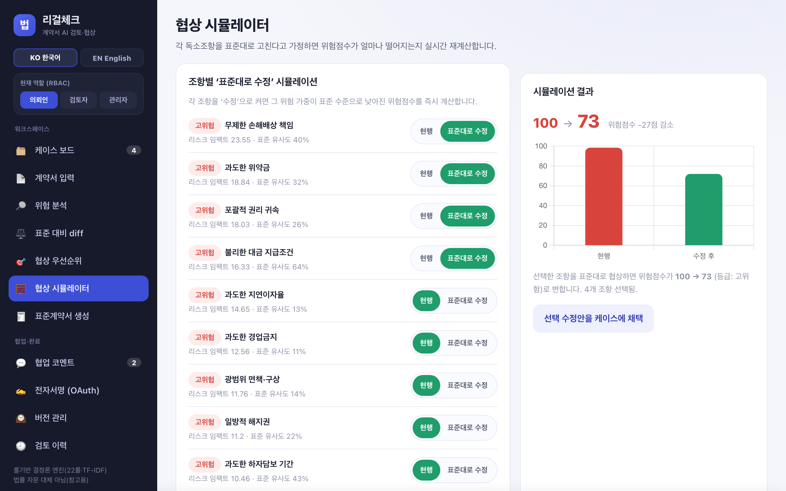

**⑩ 표준계약서 생성**
무엇: 계약 유형 템플릿에 입력 → 균형 조항 미리보기. 의도: 위험 계약 대체 표준안. 검토 결과: 입력 반영·미리보기 정상.
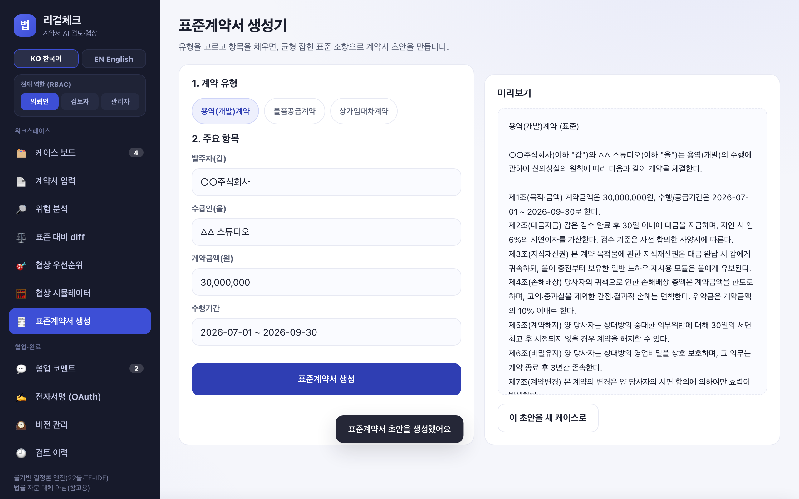

**⑪ 협업 코멘트 (검토자 + 팀 알림 webhook)**
무엇: 검토자 코멘트 등록 + KPI(전체/미해결/해결/검토자 의견) + 스레드 + 하단 ‘실시간 협업 알림 로그(webhook)’에 `collab.comment.created` → 팀 알림 발송(2명) 로그. 의도: 코멘트 작성 시 팀 알림 전파. 검토 결과: 코멘트·webhook·팀 알림 로그 적재 정상.
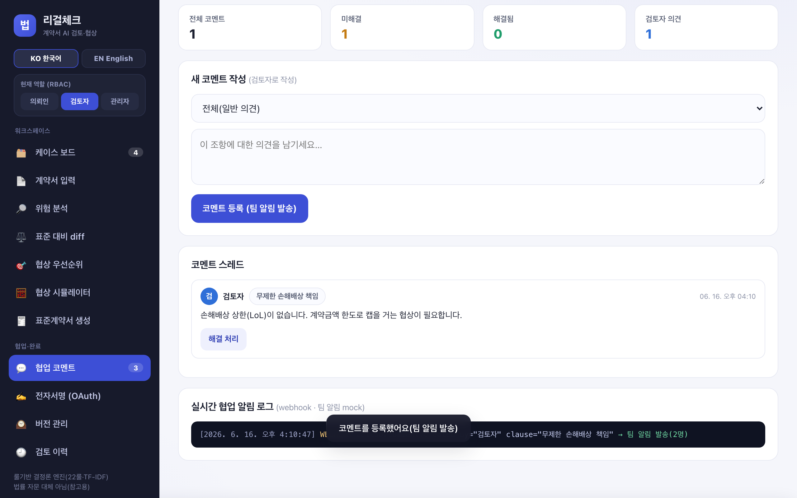

**⑫ 전자서명 (OAuth 2.0 + webhook 콜백)**
무엇: ① OAuth 연결(GET authorize → CALLBACK state 검증 → POST token) 로그, ② 서명자 목록·연결 후 발송 활성, ③ 서명 진행 타임라인, ④ webhook 콜백 로그(POST /esign requests·KAKAO alimtalk·WEBHOOK esign.completed). 의도: OAuth 핸드셰이크 + webhook 완료 추적. 검토 결과: state 검증·token 교환·완료 콜백 전부 로그 적재.
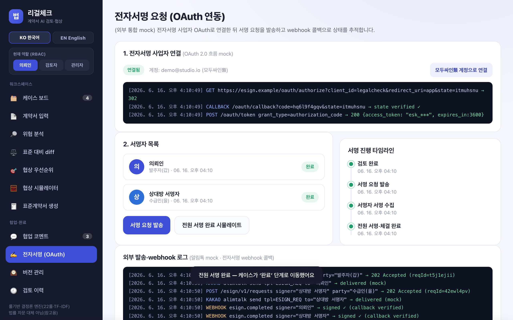

**⑬ 계약 버전 관리 (diff 히스토리)**
무엇: 새 버전 스냅샷 저장 + 버전 히스토리(v1 원본·v2 위약금/IP carve-out 반영본) + 버전 간 조항 추가·삭제·위험점수 변화. 의도: 협상 반영본 버전 추적. 검토 결과: 스냅샷 저장·버전 간 diff 표기 정상.
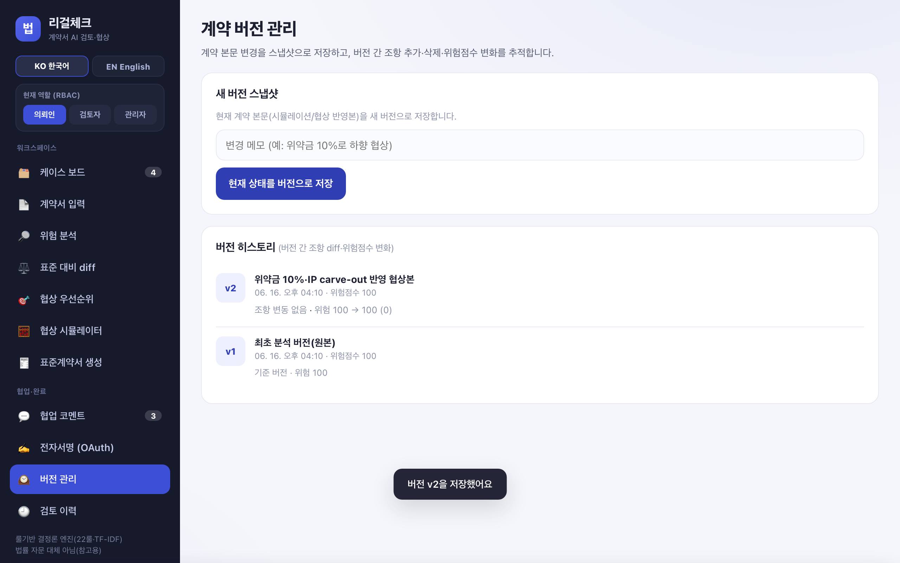

**⑭ 관리자 리포트**
무엇: 관리자 역할 — 단계 분포·카테고리 누적·완료율 KPI + 케이스 테이블. 의도: 관리자 감독·집계. 검토 결과: 차트·테이블·관리자 메뉴 노출 정상.
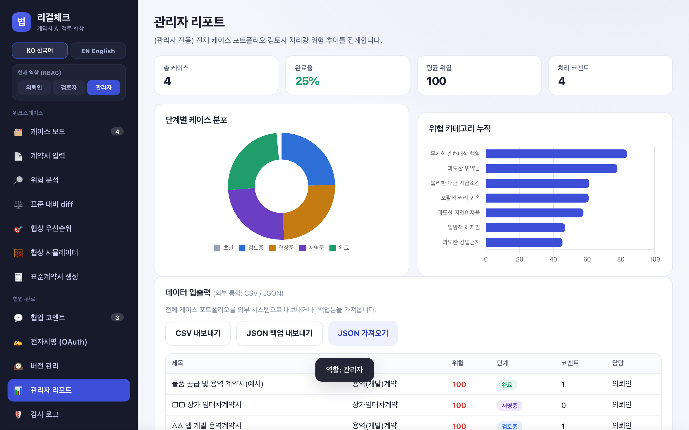

**⑮ 관리자 데이터 입출력 (CSV/JSON)**
무엇: CSV/JSON 입출력 영역 + 포트폴리오 테이블(캡처 중 다운로드 확인). 의도: 외부 시스템 입출력. 검토 결과: CSV/JSON 실제 다운로드·테이블 정상.
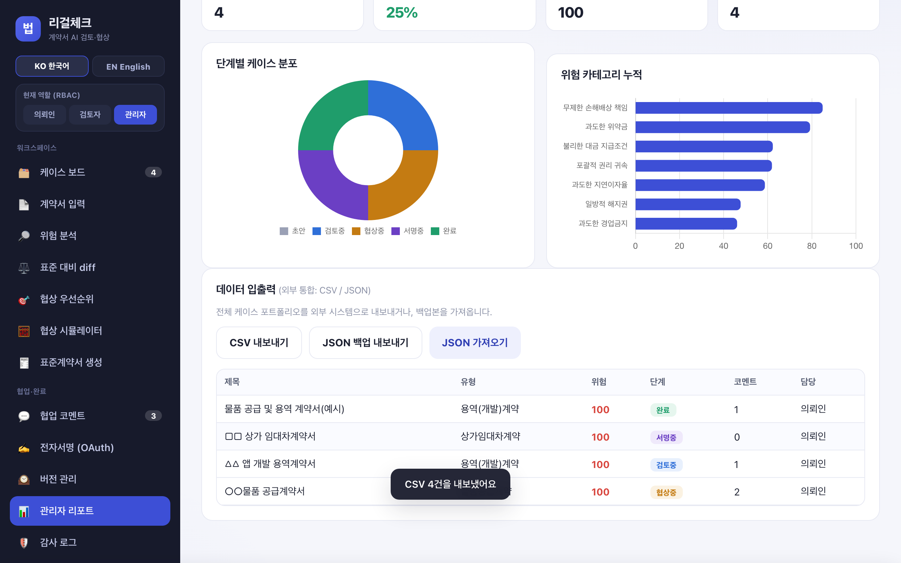

**⑯ 감사 로그 (Audit Trail)**
무엇: 관리자 전용 — 총 이벤트/서명/버전/코멘트 KPI + 이벤트 타임라인(케이스 생성·분석·코멘트·서명·버전·CSV) + 유형 필터(전체/케이스/코멘트/서명/버전). 의도: 거버넌스 추적. 검토 결과: 시간순 기록·유형 필터·관리자 전용 노출 정상.
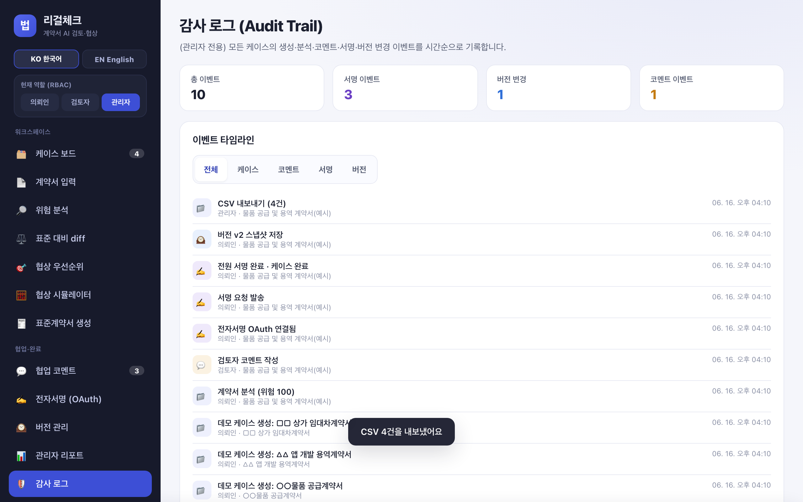

**⑰ 검토 이력**
무엇: 케이스 이력 목록(단계 포함) + PDF 발행. 의도: 이력·PDF 재발행. 검토 결과: 목록·PDF 다운로드 정상.
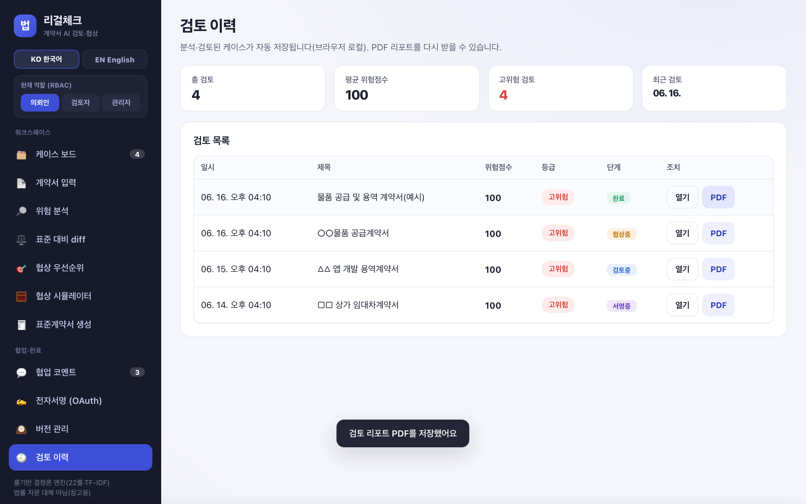

**⑱ KO/EN i18n — 영문 보드**
무엇: EN English 토글 후 전 UI 영문 전환 — 사이드바(Case Board·Risk Analysis·Negotiation Simulator…)·KPI(Total cases·Avg risk score)·케이스 카드 라벨·하단 ‘Deterministic rule engine’ 푸터. 의도: KO/EN 다국어. 검토 결과: 사이드바·KPI·카드·푸터까지 일괄 영문 전환, 깨짐 0.
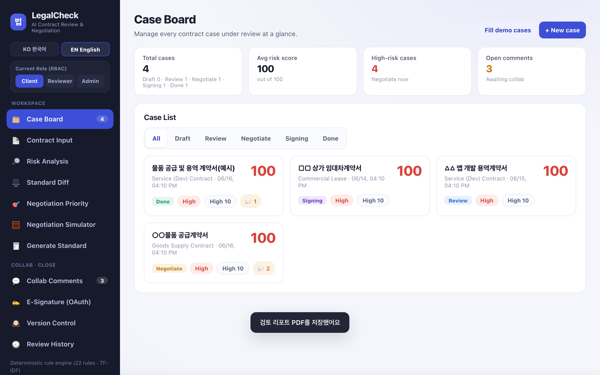

**⑲ KO/EN i18n — 영문 협상**
무엇: 영문 상태에서 협상 우선순위 화면(영문 카드·법령 근거·차트 라벨). 의도: 룰 카테고리·법령 근거까지 전환됨을 입증. 검토 결과: 협상 카드·메타·라벨 영문 전환 정상.
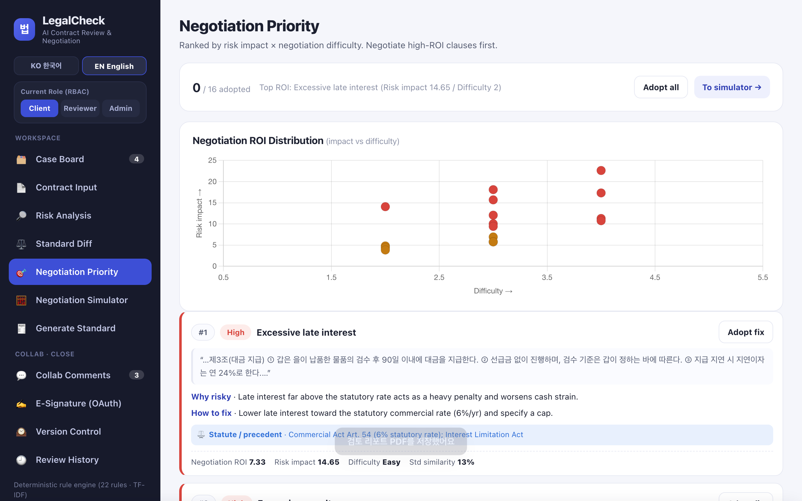

### 5.2 모바일 (390×844, isMobile/hasTouch) — `./captures/mobile/v3/`

**① 케이스 보드 (앱바 + 바텀탭 5개)**
무엇: 모바일 앱바(햄버거+브랜드+KO/역할) + KPI 2열 + 케이스 카드 + 하단 5탭(보드·분석·시뮬·협상·더보기). 의도: 사이드바 대신 드로어/바텀탭. 검토 결과: 사이드바 미노출·가로 overflow 0·풀폭, 바텀탭 ‘시뮬’ 포함.
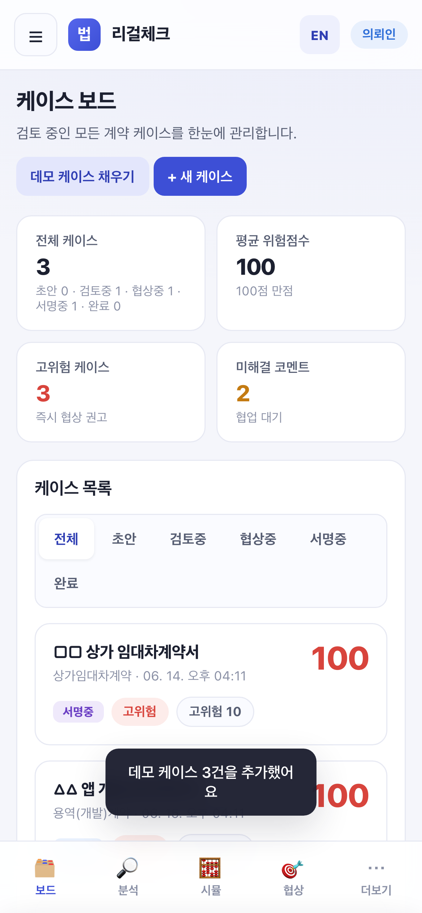

**② 햄버거 드로어 (오프캔버스)**
무엇: 햄버거 → 좌측 드로어 + 역할/언어 스위처 + 전체 13뷰 메뉴, 배후 딤. 의도: 메뉴 多 대시보드의 드로어. 검토 결과: 드로어 슬라이드·백드롭 정상, 상단 패널 하이재킹 없음.
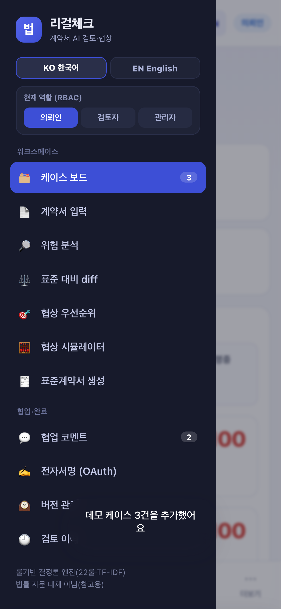

**③ 계약서 입력**
무엇: 풀폭 입력 폼 + 스텝퍼 세로 스택. 의도: 좁은 화면 입력. 검토 결과: 풀폭·overflow 0.
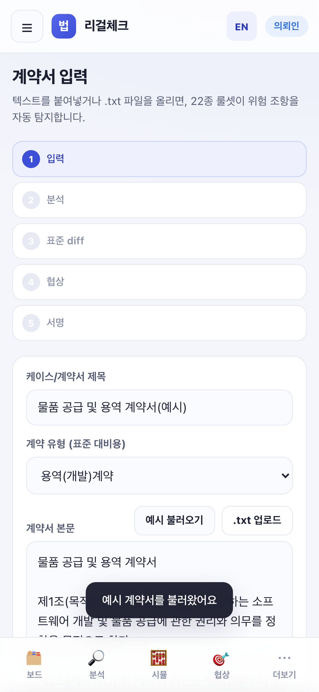

**④ 위험 분석 상단 (KPI 2열 + 차트)**
무엇: KPI 2열 스택 + 등급 분포 차트(22룰·법령 근거 반영). 의도: 4열→2열 스택, 차트 고정높이. 검토 결과: 차트 실제 렌더·숫자 잘림 없음.
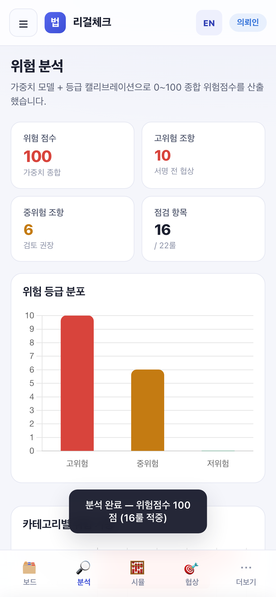

**⑤ 위험 분석 스크롤 (카테고리 차트 + 게이지)**
무엇: 카테고리 가로막대 + 종합 게이지(적용 임계) + 본문 하이라이트. 의도: 스크롤 본문·캘리브레이션 임계 확인. 검토 결과: 가로막대·게이지·임계 표기 정상.
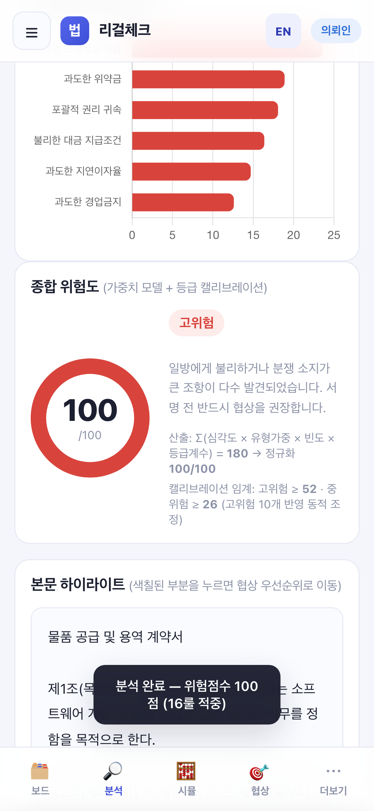

**⑥ 더보기 바텀시트**
무엇: 바텀탭 ‘더보기’ → 시트에 생성·협업·서명·버전·감사·이력 등(관리자 시 추가). 의도: 5개 초과 목적지를 시트로. 검토 결과: 시트 슬라이드업·항목 정상.
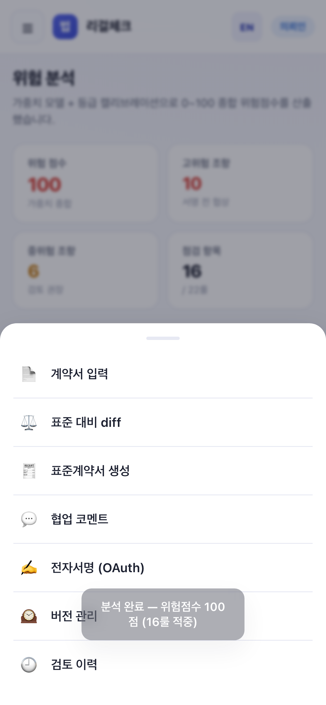

**⑦ 표준 대비 diff (상하 스택, TF-IDF 코사인)**
무엇: 독소/누락/정합 KPI + 조항 비교가 좌우→상하 스택 + 코사인 유사도 막대. 의도: 좁은 화면 diff 가독. 검토 결과: 상하 스택·유사도 막대 정상.
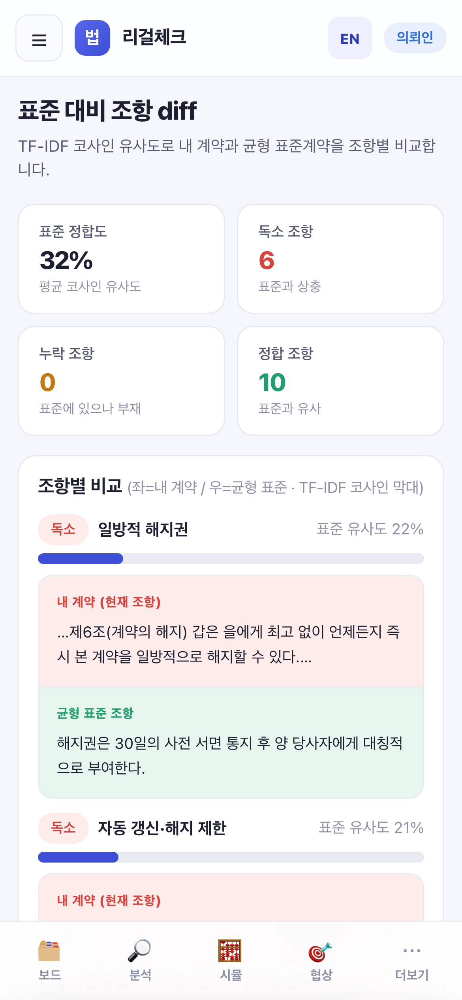

**⑧ 협상 우선순위**
무엇: 산점도 + #1.. 우선순위 카드(ROI·법령 근거 풀폭). 의도: 협상 ROI 모바일. 검토 결과: 산점도·카드 풀폭·메타 줄바꿈 정상.
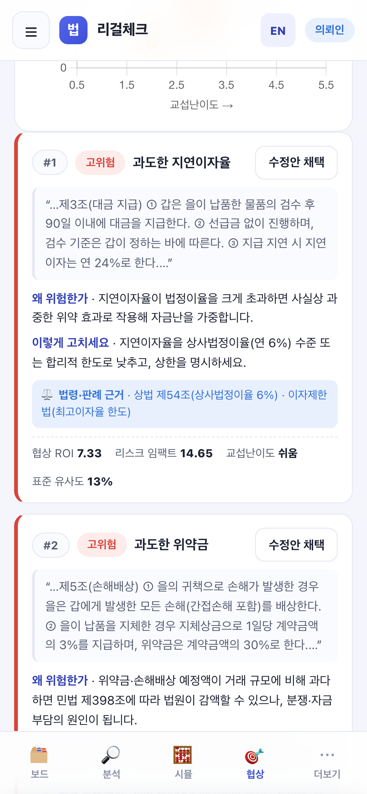

**⑨ 협상 시뮬레이터 (모바일 토글 스택)**
무엇: 조항별 현행/표준대로수정 토글 행이 세로 스택 + 리스크 임팩트·표준 유사도 메타. 의도: 시뮬레이터 토글의 모바일 재구성. 검토 결과: 토글 행 스택·버튼 ≥44px·overflow 0.
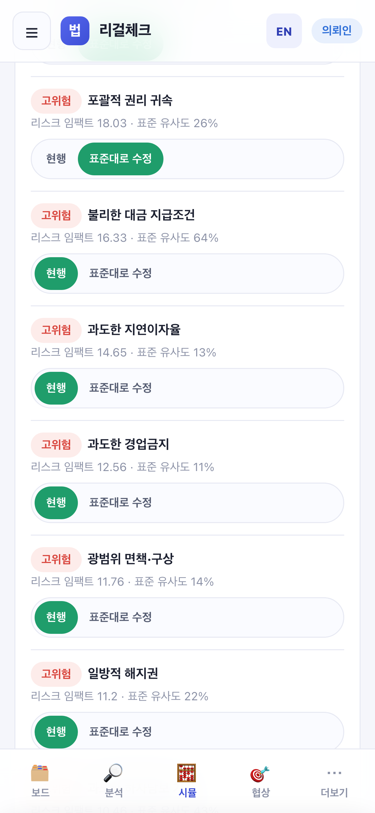

**⑩ 협업 코멘트 (팀 알림)**
무엇: 코멘트 작성 + 스레드 + 실시간 협업 알림 로그(webhook). 의도: 모바일 협업 + 팀 알림. 검토 결과: 작성·webhook 로그 풀폭·줄바꿈 정상.
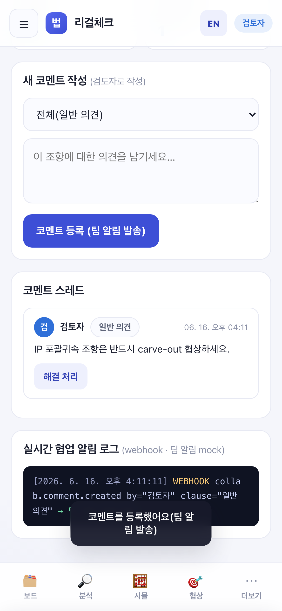

**⑪ 전자서명 (OAuth 연결)**
무엇: OAuth 연결 핸드셰이크 로그 + 서명자 목록(연결 후 발송 활성). 의도: 모바일 OAuth 흐름. 검토 결과: authorize/callback/token 로그·발송 활성 정상.
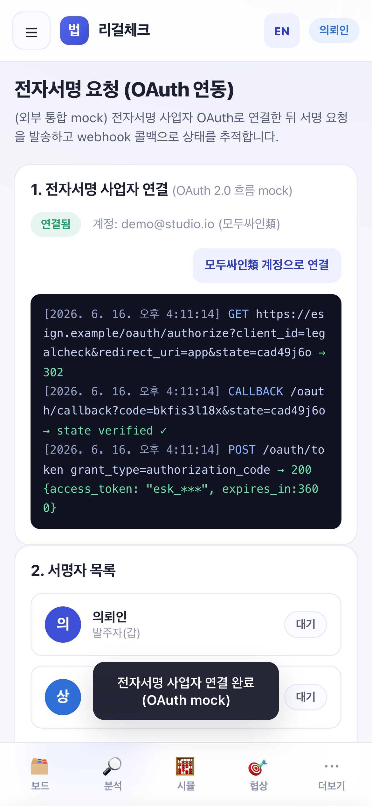

**⑫ 전자서명 (완료 + webhook 콜백)**
무엇: 전원 서명 완료 + webhook esign.completed 콜백 로그 + 타임라인. 의도: 완료 전이·webhook 추적. 검토 결과: 완료 상태·콜백 로그 풀폭 정상.
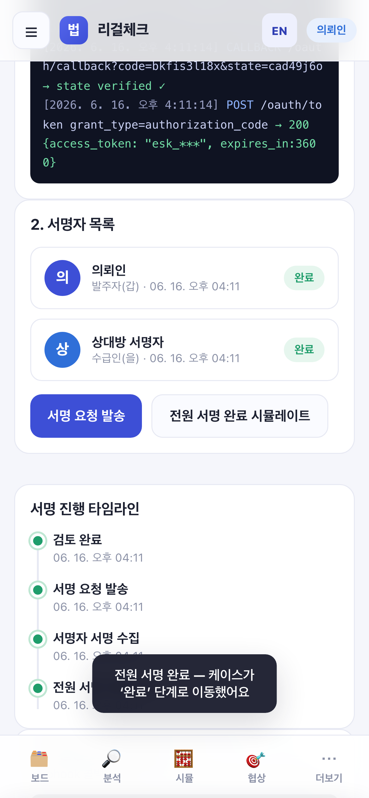

**⑬ 계약 버전 관리**
무엇: 새 버전 스냅샷 저장 + 버전 히스토리(v1·v2) + 버전 간 변화. 의도: 모바일 버전 추적. 검토 결과: 스냅샷·히스토리 풀폭 정상.
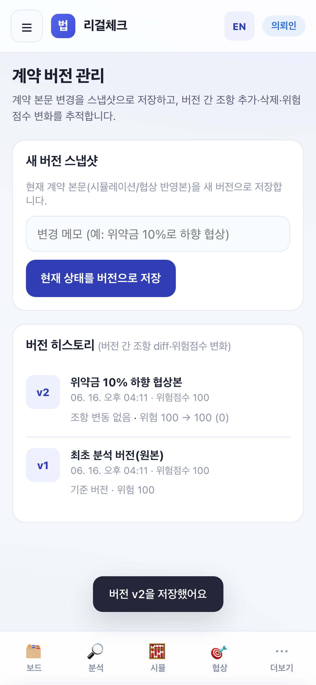

**⑭ 관리자 리포트**
무엇: 관리자 역할 — 단계 분포 차트 + KPI 2열. 의도: 모바일 관리자 집계. 검토 결과: 차트 실제 렌더·역할 태그 ‘관리자’.
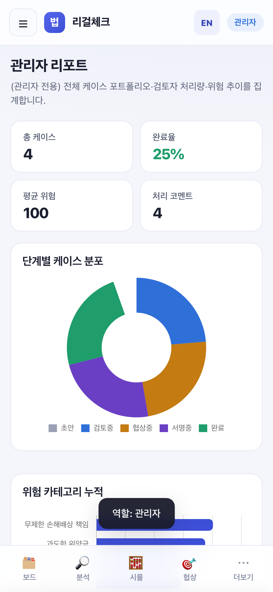

**⑮ 관리자 데이터 입출력**
무엇: 카테고리 차트 + CSV/JSON 입출력 + 포트폴리오 테이블(가로 스크롤). 의도: 표 열 증발 없이 접근. 검토 결과: 가로 스크롤·버튼 정상.
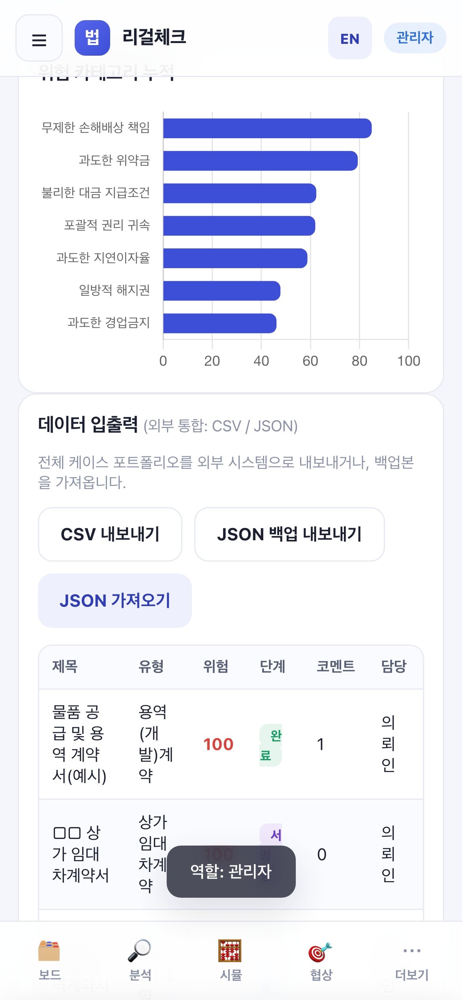

**⑯ 감사 로그**
무엇: 관리자 전용 감사 KPI + 이벤트 타임라인 + 유형 필터. 의도: 모바일 거버넌스. 검토 결과: 타임라인·필터·관리자 전용 정상.
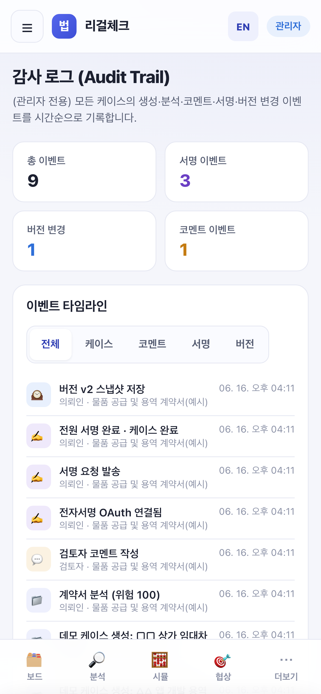

**⑰ KO/EN i18n — 영문 보드**
무엇: EN 토글 후 모바일 영문 전환 — 앱바(LegalCheck·Admin)·헤더(Admin Case Board)·KPI(Total cases·Avg risk score)·바텀탭(Board·Analyze·Sim·Negot·More). 의도: 모바일 KO/EN, 바텀탭까지 전환. 검토 결과: 앱바·헤더·KPI·바텀탭 영문 전환, overflow 0·깨짐 0.
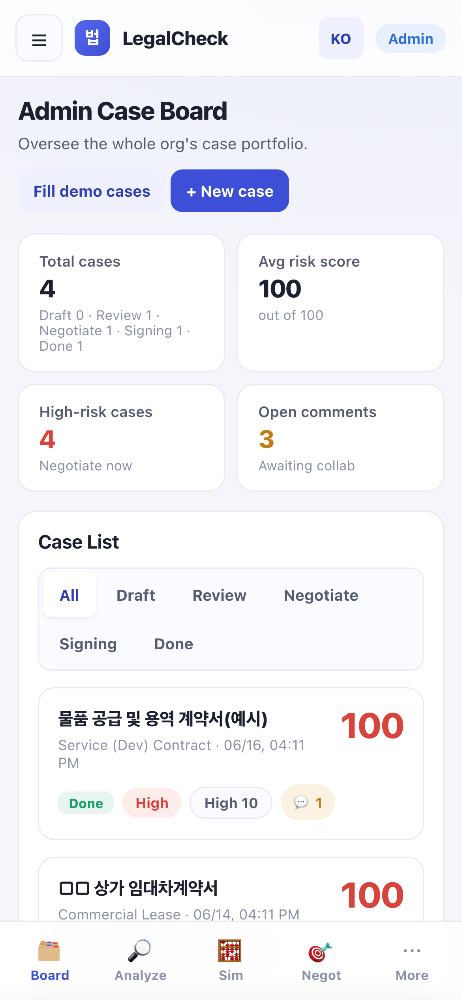

---

## 6. 검수 기준 충족 여부

| # | 검수 기준 (과업지시서 §5) | 결과 | 측정값 |
|:--:|:---|:---:|:---|
| 1 | 13뷰 표시·전환 | ✅ | 보드·입력·분석·diff·협상·시뮬·생성·협업·서명·버전·관리자·감사·이력 |
| 2 | 룰셋 22종 + 법령/판례, ≥14룰 적중, 1초 내 | ✅ | 예시 분석 **16룰 적중**·고위험 10·점수 100, 협상 카드/PDF 법령 근거 노출(PC 03·08) |
| 3 | TF-IDF 코사인 diff(독소/누락/정합·코사인%) | ✅ | 정합도 32%·독소 6·누락 0·정합 10, 좌우 비교(PC 05·06) |
| 4 | 등급 캘리브레이션(동적 임계·표기) | ✅ | 고위험 조항 수 기반 임계 보정, 종합 게이지에 적용 임계 표기(PC 03) |
| 5 | 협상 시뮬레이터(즉시 재계산·before/after·일괄 채택) | ✅ | 토글 시 100 → 73(−27점) 즉시 재계산·막대·일괄 채택(PC 09 / Mobile 09) |
| 6 | 전자서명 OAuth + webhook(연결 후 활성·완료 콜백) | ✅ | authorize→callback(state)→token, 연결 후 발송, esign.completed 콜백(PC 12 / Mobile 11·12) |
| 7 | 실시간 팀 협업 알림(webhook + 팀 알림 로그) | ✅ | `collab.comment.created` + 팀 알림(2명) 로그 적재(PC 11 / Mobile 10) |
| 8 | KO/EN i18n(UI·룰·법령·차트·PDF 즉시 전환, 깨짐 0) | ✅ | 사이드바·KPI·카드·바텀탭·협상 카드 전환(PC 18·19 / Mobile 17) |
| 9 | 감사 로그(시간순·유형 필터·관리자 전용) | ✅ | 케이스/코멘트/서명/버전 이벤트 타임라인 + 필터 5종(PC 16 / Mobile 16) |
| 10 | 계약 버전관리(스냅샷·버전 간 조항/점수 변화) | ✅ | v1·v2 스냅샷 + 버전 간 조항 add/remove·점수 변화(PC 13 / Mobile 13) |
| 11 | 3역할 RBAC·보드·협업·표준생성·CSV/JSON(v2 계승) | ✅ | 역할 스위처·보드·협업·생성·CSV/JSON 입출력 정상(전 캡처) |
| 12 | 검토 리포트 PDF(한글 깨짐 0·협상/법령/정합도·KO/EN) | ✅ | jsPDF 캔버스 한글 렌더, 협상 우선순위·법령 근거·표준정합도 반영(PC 17) |
| 13 | 새로고침 후 케이스·코멘트·서명·버전·감사·언어 유지 | ✅ | localStorage `legalcheck_cases_v3`·`legalcheck_audit_v3`·언어 |
| 14 | 390px overflow 0·드로어/바텀탭/시트 / 1280 사이드바, KO·EN 양쪽 | ✅ | 모바일 드로어·바텀탭·시트·풀폭, PC 사이드바 256px, KO/EN 양쪽 캡처 |

---

## 7. 추가 확장 가능 영역

- LLM 의미 분석 결합으로 룰셋이 못 잡는 맥락적 불균형 탐지, 계약 유형 자동 분류 고도화.
- 실 전자서명 사업자(모두싸인·KICA) OAuth·webhook 실연동, 실 알림톡 발송, 실 서버 RBAC·멀티테넌트 분리.
- i18n 언어 추가(JA·ZH), 법령/판례 매칭 DB의 실 법령 API 연계.

---

## 8. 검토 체크리스트

- [x] 모든 핵심 기능이 캡처되었는가 (PC 19 + 모바일 17)
- [x] 캡처가 의도한 기능을 정확히 보여주는가 (작성자가 대표 PNG 직접 열람·확인)
- [x] 한글이 깨지지 않는가 (UI·PDF·KO/EN 모두 정상)
- [x] 에러 화면이 의도치 않게 캡처되지 않았는가
- [x] 결과물(점수·코사인 diff·시뮬레이션·OAuth 로그·PDF·CSV)의 정확도가 충분한가
- [x] 과업지시서 §5 항목 100% 매핑되었는가 (§1·§6, 성과품 14항 전부 ✅)
- [x] (v2→v3) v2 한계 매핑표 + 시리즈A 데모 가치 기준 충족 — 고급 알고리즘(TF-IDF 코사인·등급 캘리브레이션·협상 시뮬레이터), 외부 통합(OAuth+webhook·팀 알림 webhook·CSV/JSON), 다국어(KO/EN), 거버넌스(감사 로그·버전관리), 13뷰·워크플로 3개, 신규 캡처 PC 19·모바일 17
- [x] PC·모바일 캡처를 폴더 나눠 저장(`captures/v3`·`captures/mobile/v3`) + 양쪽 임베드
- [x] 분석 엔진을 결정론적 룰/알고리즘으로 정직 표기(‘AI’=룰엔진, LLM 아님; OAuth·알림톡·webhook·법령매칭=mock/내장 룰DB)
