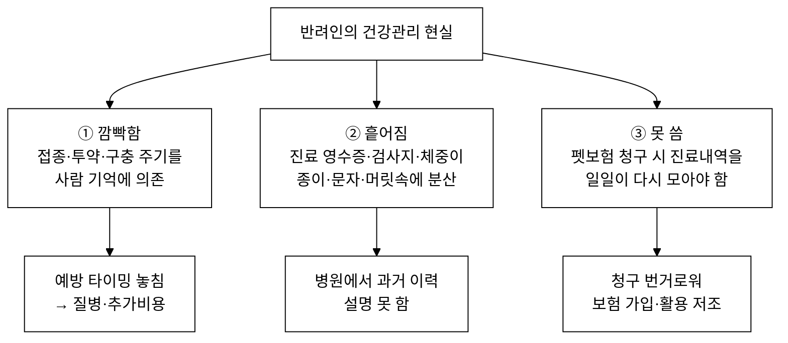
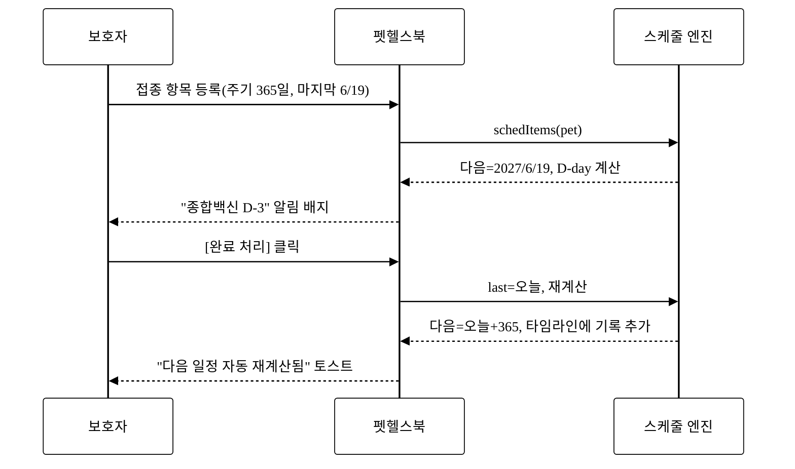
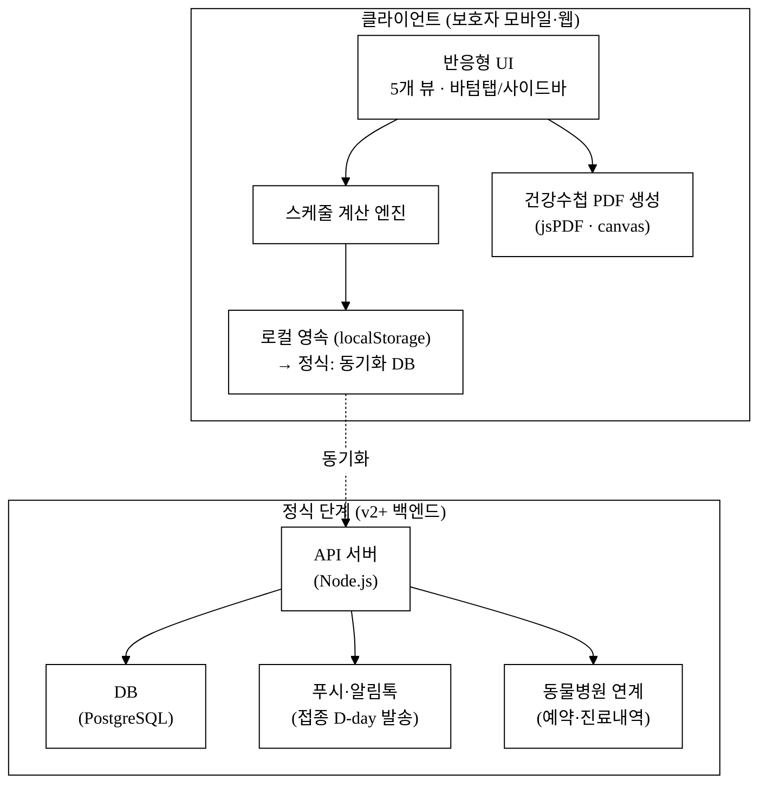
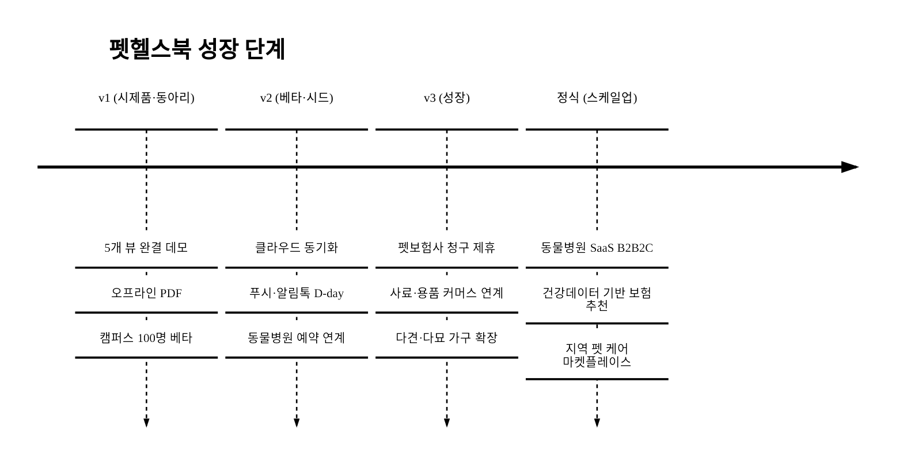

last_updated: 2026-06-22 14:00

# 반려동물 토탈 헬스케어 SaaS 「펫헬스북」 사업계획서

> 본 계획서는 대구대학교 창업지원단 「2026년 창업동아리 지원사업(실전창업)」 제출용이다.
> 공고가 지정한 PSST(Problem·Solution·Scale-up·Team) 구조를 고정하며, 팀·서명·연락처 등 행정 정보는 사용자가 직접 채운다(`<TODO: 사용자 입력>`).

## 사업 개요 (머리표)

| 항목 | 내용 |
|:---|:---|
| 사업명 | 2026년 창업동아리 지원사업(실전창업) |
| 주관기관 | 대구대학교 창업지원단 |
| 트랙 | 실전창업 |
| 지원 규모 | 기본 300만 원 · 최대 1,000만 원 |
| 모집 기간 | 2026-03-19 ~ 2026-04-02 |
| 아이템명 | 반려동물 토탈 헬스케어 SaaS 「펫헬스북」 |
| 한 줄 정의 | 반려동물의 프로필·건강기록·예방접종/투약/구충 스케줄·병원예약·보험청구용 건강수첩을 한 앱에서 관리하는 B2C 모바일 헬스케어 서비스 |
| 타깃 고객 | 1~2마리를 키우는 20~40대 1인·2인 가구 반려인(보호자) |
| 핵심 가치 | "잊지 않게(스케줄 자동 알림) · 모이게(흩어진 건강기록 통합) · 쓸 수 있게(보험청구·병원 제출용 건강수첩 발행)" |
| 산출물 형태 | 웹/모바일 SaaS. 데모는 사이클별로 보존: **v1**=핵심 5뷰 오프라인 완결 [`v1.html`](../projects/pet-health/v1.html) · **v2**=동기화·알림톡·건강 리포트 심화 [`v2.html`](../projects/pet-health/v2.html) · **v3**=질병 위험 예측·EMR/웨어러블 연동 [`v3.html`](../projects/pet-health/v3.html). 본문 기능 서술은 사이클을 명시한다(v1 핵심 / v2·v3 심화). |

---

## 1. Problem — 문제 정의

### 1.1 시장 배경: 반려동물은 '가족', 그러나 건강관리는 '아날로그'

국내 반려동물 양육은 구조적으로 정착 단계에 들어섰다. 농림축산식품부의 국민의식조사에 따르면 반려동물을 키우는 가구는 전체의 약 4분의 1 수준으로 추산되며[^1], 동물등록제 누적 등록 마릿수도 꾸준히 증가하여 보호자의 '제도권·디지털 관리'에 대한 수용성이 높아지고 있다[^6]. 반려동물 연관산업은 부처가 별도 육성대책을 내놓을 만큼 빠르게 성장하는 시장이다[^2].

그러나 정작 **개별 보호자의 건강관리 방식은 여전히 아날로그**다. 접종 날짜는 병원에서 준 종이 수첩이나 문자, 투약 주기는 사람의 기억, 진료 영수증은 서랍 속, 체중 변화는 어림짐작에 의존한다. '가족'으로 대하는 마음과 달리, 건강 데이터는 어디에도 통합되어 있지 않다.

### 1.2 보호자가 실제로 겪는 3대 페인포인트

**① 깜빡함 (Schedule)** — 종합백신은 연 1회, 심장사상충 예방약과 외부구충은 보통 월 1회, 내부구충은 분기 1회 등 **항목마다 주기가 다르다.** 사람의 기억으로는 여러 마리 × 여러 항목의 다음 시점을 관리하기 어렵다. 한 번 놓치면 예방 효과가 끊기고, 결국 질병·추가 진료비로 돌아온다.

**② 흩어짐 (Records)** — 정기 건강검진 결과, 증상 메모, 체중 변화, 투약 이력이 종이 영수증·병원 문자·보호자 기억에 분산된다. 정작 병원 방문 시 "지난번에 어떤 약 썼었죠?"에 답하지 못한다. KB금융지주 경영연구소 보고서도 정기 케어 누락·이력 관리에 대한 불안을 주요 페인포인트로 든다[^5].

**③ 못 씀 (Insurance)** — 펫보험 가입률은 약 12.8% 수준에 머문다[^3]. 보험료 부담(가입 저해 1순위, 50.6%)·보장 한계도 있지만, **청구 시마다 진료내역·영수증을 일일이 다시 모아야 하는 번거로움**(보호자 직접 청구·서류 구비 부담)이 활용을 가로막는 큰 요인이다[^8]. 동물병원 진료비 게시제 시행[^4]으로 보호자의 진료비·내역 관리 필요성은 더 커졌다.

### 1.3 문제의 본질

세 페인포인트는 모두 **"반려동물의 건강 데이터가 한곳에 시간순으로 쌓이지 않는다"**는 하나의 근본 원인에서 나온다. 데이터가 모이면 스케줄은 자동 계산되고, 이력은 즉시 조회되며, 청구서는 한 번에 만들어진다. **펫헬스북은 이 데이터 레이어를 보호자 손안에 만든다.**

---

## 2. Solution — 솔루션

### 2.1 제품 개요

펫헬스북은 **"반려동물 건강기록의 모바일 허브"**다. 보호자가 프로필을 등록하면, 이후의 모든 건강 이벤트(체중·증상·진료·투약·접종·구충)가 하나의 타임라인에 쌓이고, 주기가 정의된 항목은 **다음 시점이 자동 계산되어 D-day 알림**으로 떠오른다. 필요할 때 한 번의 클릭으로 **병원 제출·보험청구용 건강수첩 PDF**가 만들어진다.

> **포지셔닝 주의 — 보험은 부가, 건강기록·스케줄이 핵심.** 본 사업은 EDI로 보험금을 자동 청구하는 B2B 사람 의료 청구 자동화와 **완전히 다르다.** 펫헬스북의 사용자는 병원·보험사 직원이 아니라 **반려인 본인**이며, UX는 보험 전문 용어가 아니라 "우리 아이 건강 잘 챙기기"라는 보호자 감정선에 맞춰 설계된다. 보험청구 요약 PDF는 쌓인 건강기록을 활용하는 **여러 출구 중 하나**일 뿐이다.

### 2.2 핵심 기능 (뷰 구성 — v1 핵심 5뷰 + v2·v3 심화)

아래 표의 **사이클** 열은 각 기능이 어느 데모에서 실동작하는지를 명시한다. §차별성·§구매동인이 논증하는 차별 기술(견종/묘종 프로토콜·건강 위험 스코어·BCS·RER/DER·질병 위험 예측)은 **v2·v3에서 실제 구현**되어 있으며, 본 표에 정식 편입한다(구매동인↔기능표↔경쟁표 정합).

| # | 뷰 | 핵심 기능 | 해결하는 페인 | 사이클 |
|:---:|:---|:---|:---|:---:|
| 1 | 홈 대시보드 | 다가오는 일정(전 반려동물 통합)·지난 일정·최근 체중·체중 추이 차트 | ①②를 한눈에 | v1 |
| 2 | 반려동물 프로필 | 사진 업로드, 종·품종·나이·성별, 여러 마리 전환 | 기준 데이터 | v1 |
| 3 | 건강기록 타임라인 | 체중·증상·진료·투약을 시간순 기록·조회 | ② 흩어짐 | v1 |
| 4 | 접종·투약·구충 스케줄 | 주기 기반 다음 시점 **자동 계산**, D-day·알림 배지, 완료 처리 시 재계산 | ① 깜빡함 | v1 |
| 5 | 예약·건강수첩 | 병원 예약, 건강수첩 PDF·보험청구용 진료요약 PDF 발행 | ③ 못 씀 | v1 |
| 6 | 견종/묘종 프로토콜 | 종·품종 선택 시 권장 접종·구충 일정 **자동 시드**(입력 마찰↓) | ① 깜빡함(누락 방지) | v2 |
| 7 | 건강 리포트(위험 스코어) | 체중 이상치 탐지·**건강 위험 스코어**·BCS·RER/DER 권장 사료량 | 조기발견·체중 관리 | v2 |
| 8 | 질병 위험 예측·성장곡선 | 로지스틱 기반 **질병 위험 예측**, 성장곡선 percentile, EMR/웨어러블 연동 | 조기발견(세그먼트) | v3 |

> v1 시제품은 1~5뷰로 **핵심 가설(스케줄 자동화+기록 통합)**을 검증하는 MVP다. 6~8뷰(차별 기술)는 v2·v3에서 심화 구현되어 §구매동인의 must/nice 논증과 1:1로 대응한다.

### 2.3 사용자 핵심 여정 (다단계 워크플로)

```mermaid
%%{init: {"theme":"base","themeVariables":{"darkMode":false,"background":"#ffffff","fontFamily":"Georgia, serif","primaryColor":"#ffffff","primaryBorderColor":"#000000","primaryTextColor":"#000000","secondaryColor":"#ffffff","secondaryBorderColor":"#000000","secondaryTextColor":"#000000","tertiaryColor":"#ffffff","tertiaryBorderColor":"#000000","tertiaryTextColor":"#000000","mainBkg":"#ffffff","secondBkg":"#ffffff","lineColor":"#000000","textColor":"#000000","nodeBorder":"#000000","nodeTextColor":"#000000","titleColor":"#000000","edgeLabelBackground":"#ffffff","defaultLinkColor":"#000000","clusterBkg":"#ffffff","clusterBorder":"#000000","actorBkg":"#ffffff","actorBorder":"#000000","actorTextColor":"#000000","actorLineColor":"#000000","signalColor":"#000000","signalTextColor":"#000000","labelBoxBkgColor":"#ffffff","labelBoxBorderColor":"#000000","labelTextColor":"#000000","loopTextColor":"#000000","noteBkgColor":"#ffffff","noteBorderColor":"#000000","noteTextColor":"#000000","activationBkgColor":"#ffffff","activationBorderColor":"#000000","sequenceNumberColor":"#000000","attributeBackgroundColorOdd":"#ffffff","attributeBackgroundColorEven":"#ffffff","sectionBkgColor":"#ffffff","altSectionBkgColor":"#ffffff","sectionBkgColor2":"#ffffff","taskBkgColor":"#ffffff","taskBorderColor":"#000000","taskTextColor":"#000000","taskTextLightColor":"#000000","taskTextOutsideColor":"#000000","taskTextDarkColor":"#000000","taskTextClickableColor":"#000000","activeTaskBkgColor":"#ffffff","activeTaskBorderColor":"#000000","doneTaskBkgColor":"#ffffff","doneTaskBorderColor":"#000000","critBkgColor":"#ffffff","critBorderColor":"#000000","gridColor":"#000000","todayLineColor":"#000000","quadrant1Fill":"#ffffff","quadrant2Fill":"#ffffff","quadrant3Fill":"#ffffff","quadrant4Fill":"#ffffff","quadrant1TextFill":"#000000","quadrant2TextFill":"#000000","quadrant3TextFill":"#000000","quadrant4TextFill":"#000000","quadrantPointFill":"#000000","quadrantPointTextFill":"#000000","quadrantXAxisTextFill":"#000000","quadrantYAxisTextFill":"#000000","quadrantInternalBorderStrokeFill":"#000000","quadrantExternalBorderStrokeFill":"#000000","quadrantTitleFill":"#000000","pieStrokeColor":"#000000","pieOuterStrokeColor":"#000000","pieTitleTextColor":"#000000","pieSectionTextColor":"#000000","pieLegendTextColor":"#000000","cScale0":"#ffffff","cScaleLabel0":"#000000","cScaleInv0":"#000000","pie1":"#ffffff","cScale1":"#ffffff","cScaleLabel1":"#000000","cScaleInv1":"#000000","pie2":"#ffffff","cScale2":"#ffffff","cScaleLabel2":"#000000","cScaleInv2":"#000000","pie3":"#ffffff","cScale3":"#ffffff","cScaleLabel3":"#000000","cScaleInv3":"#000000","pie4":"#ffffff","cScale4":"#ffffff","cScaleLabel4":"#000000","cScaleInv4":"#000000","pie5":"#ffffff","cScale5":"#ffffff","cScaleLabel5":"#000000","cScaleInv5":"#000000","pie6":"#ffffff","cScale6":"#ffffff","cScaleLabel6":"#000000","cScaleInv6":"#000000","pie7":"#ffffff","cScale7":"#ffffff","cScaleLabel7":"#000000","cScaleInv7":"#000000","pie8":"#ffffff","cScale8":"#ffffff","cScaleLabel8":"#000000","cScaleInv8":"#000000","pie9":"#ffffff","cScale9":"#ffffff","cScaleLabel9":"#000000","cScaleInv9":"#000000","pie10":"#ffffff","cScale10":"#ffffff","cScaleLabel10":"#000000","cScaleInv10":"#000000","pie11":"#ffffff","cScale11":"#ffffff","cScaleLabel11":"#000000","cScaleInv11":"#000000","pie12":"#ffffff"}}}%%
flowchart LR
    S1["① 반려동물 등록<br/>(사진·종·생일)"] --> S2["② 건강기록 추가<br/>(체중·증상·진료)"]
    S2 --> S3["③ 접종 스케줄 생성<br/>(주기 입력)"]
    S3 --> S4["④ 다음 일정 자동 계산<br/>+ D-day 알림"]
    S4 --> S5["⑤ 병원 예약 /<br/>건강수첩 PDF 발행"]
    S5 -.완료 처리.-> S4
```

이 5단계는 데모 앱([`v1.html`](../projects/pet-health/v1.html))에서 **실제로 동작**한다. 사진은 실 업로드·미리보기, 기록은 localStorage에 영속 저장, 스케줄은 `다음일 = 마지막시행일 + 주기일` 로 계산되어 D-day가 갱신되고, PDF는 jsPDF로 실제 생성·다운로드된다(한글 깨짐 0).

### 2.4 스케줄 자동 계산 엔진 (차별 포인트의 핵심)

엔진은 항목별 주기(예: 백신 365일, 사상충·구충 30일, 내부구충 90일)를 받아 **다음 시점과 D-day를 산출**하고, `D≤14`면 알림, `D<0`면 '지남'으로 분류한다. 완료 처리 시 마지막 시행일이 오늘로 갱신되며 **다음 주기가 재계산**되고, 동시에 건강기록 타임라인에도 자동 기록되어 ①과 ②를 한 동작으로 묶는다.

### 2.5 기술 아키텍처 (시제품 → 정식)

시제품(v1)은 **외부 인프라 없이 단일 HTML로 완결**되어 오프라인 시연이 가능하다. 정식 단계에서는 동일한 클라이언트 로직 위에 동기화 백엔드·푸시 알림·병원 연계를 얹는다. API 키는 부재 시 mock으로 동작하도록 설계해 데모 신뢰성을 보장한다.

---

## 3. Scale-up — 성장 전략

> 본 절은 공고가 요구하는 사업화 관점을 충족하기 위해 GTM·수익모델·차별성을 구체 수치로 전개한다(상세 §고객확보·§수익모델·§차별성).

### 3.1 단계적 확장 로드맵

### 3.2 확장의 축

1. **사용자 깊이** — 1마리 → 다견·다묘 가구로 기록 밀도를 높여 리텐션·전환 강화.
2. **데이터 출구 확장** — 건강수첩 PDF → 보험사 청구 연계 → 사료/영양제 추천 → 병원 예약. 쌓인 데이터가 부가 서비스의 입력이 된다.
3. **공급 측 연계(B2B2C)** — 동물병원에 예약·진료내역 입력 도구를 제공하고, 보호자 앱과 양면을 연결.

---

## 4. Team — 팀 구성

> 본 섹션의 모든 인적사항은 **사용자(동아리)가 직접 채운다.** Claude는 골격만 두고 내용을 창작하지 않는다(CLAUDE.md §2.7).

### 4.1 팀 개요

| 구분 | 내용 |
|:---|:---|
| 동아리(팀)명 | <TODO: 사용자 입력> |
| 대표자 | <TODO: 사용자 입력> |
| 지도교수 | <TODO: 사용자 입력> |
| 소속(학과/학번) | <TODO: 사용자 입력> |
| 연락처 / 이메일 | <TODO: 사용자 입력> |

### 4.2 팀원 및 역할(R&R)

| 이름 | 소속/학번 | 역할 | 담당 업무 |
|:---|:---|:---|:---|
| <TODO: 사용자 입력> | <TODO: 사용자 입력> | <TODO: 사용자 입력> | <TODO: 사용자 입력> |
| <TODO: 사용자 입력> | <TODO: 사용자 입력> | <TODO: 사용자 입력> | <TODO: 사용자 입력> |
| <TODO: 사용자 입력> | <TODO: 사용자 입력> | <TODO: 사용자 입력> | <TODO: 사용자 입력> |

### 4.3 보유 역량·수상 실적

| 항목 | 내용 |
|:---|:---|
| 보유 역량 | <TODO: 사용자 입력> |
| 수상·활동 실적 | <TODO: 사용자 입력> |
| 협력 기관(MOU 등) | <TODO: 사용자 입력> |

---

## 경영혁신·창업학적 프레임워크

본 사업은 단순 앱 아이디어가 아니라 **검증된 경영·창업 이론으로 '왜 지금, 왜 이 방식인가'가 정당화**된다. 핵심 렌즈 셋을 명시한다.

### (1) JTBD (Jobs To Be Done) — 보호자가 '고용'하는 일

Clayton Christensen·Anthony Ulwick의 JTBD 관점에서, 보호자가 펫헬스북을 '고용'해서 시키는 일은 **"내가 깜빡하더라도 우리 아이가 제때 케어받게 하고, 필요할 때 그 기록을 꺼내 쓰게 해줘"**다. 기존 대체재(종이 수첩·병원 문자·기억)는 이 Job을 부분적으로만 수행한다. 펫헬스북은 **Functional Job(스케줄·기록 관리)** 위에 **Emotional Job(불안 해소: "잘 챙기고 있다는 안심")**을 동시에 충족한다. 이 정서적 작업의 충족이 단순 캘린더 앱과의 결정적 차이다.

### (2) Kim·Mauborgne 블루오션 — ERRC로 본 비경쟁 공간

기존 시장은 ⓐ 범용 캘린더/리마인더(스케줄만), ⓑ 동물병원 자체 시스템(병원 종속·보호자 미소유), ⓒ 단편 메모 앱으로 갈라져 있다. 펫헬스북은 ERRC 그리드로 새 가치곡선을 만든다.

| 액션 | 내용 |
|:---|:---|
| 제거(Eliminate) | 보험 전문 용어·복잡한 B2B EDI 흐름(보호자에겐 진입장벽) |
| 감소(Reduce) | 병원 종속성(데이터를 보호자가 소유) |
| 증가(Raise) | 스케줄 자동 계산 정확도·정서적 안심 |
| 창조(Create) | "건강기록 → 보험청구·병원제출 PDF 원클릭"이라는 데이터 출구 |

→ 즉 본 사업은 '스케줄 앱'도 '병원 시스템'도 '보험 청구 솔루션'도 아닌 **보호자가 소유하는 건강 데이터 허브**라는 비경쟁 공간을 연다.

### (3) Ries 린 스타트업 — v1은 검증 가능한 MVP

본 동아리 사이클의 v1 데모는 Eric Ries의 MVP에 해당한다. 핵심 가설("보호자는 스케줄 자동 알림과 통합 기록에 가치를 느낀다")을 **최소 비용으로 측정**하기 위해, 백엔드 없이 단일 HTML로 5개 뷰의 실동작을 구현했다. Build-Measure-Learn 루프에서 v1은 캠퍼스 100명 베타로 **활성화율·리텐션 가설을 검증**하는 도구다(§고객확보).

> **Why now**: 양육 가구 정착[^1]·연관산업 육성[^2]·진료비 게시제[^4]·동물등록 디지털화[^6]가 동시에 진행되며, 보호자의 '데이터로 관리' 수용성이 임계점을 넘었다. 블루오션의 문이 지금 열려 있다.

---

## 고객확보 (Go-to-Market)

### ICP (이상적 고객 프로필)

| 차원 | 정의 |
|:---|:---|
| 인구 | 20~40대, 수도권·광역시 1인·2인 가구 |
| 반려 | 강아지/고양이 1~2마리, 입양 1년 내(스케줄 셋업 수요 큼) 또는 다견·다묘 |
| 페인 | 접종·투약 주기 관리에 자신 없음 / 진료이력이 흩어져 불안 |
| 채널 거주 | 인스타그램·네이버 카페·당근·반려동물 커뮤니티(강아지숲·고양이라서 등) |

### 획득 채널·전술

| 채널 | 유형 | 전술 | 기대 CAC[추정] |
|:---|:---|:---|:---:|
| 동물병원 제휴 QR | 오가닉/제휴 | 1차 접종 후 "다음 일정 자동 알림" QR 배포(병원은 재방문↑) | 1,000~3,000원 |
| 반려 커뮤니티·카페 | 오가닉 | "접종 깜빡 방지 체크리스트" 콘텐츠 + 앱 연결 | 1,500~4,000원 |
| 인스타 릴스 | 유료/오가닉 | "우리 아이 건강수첩 PDF" 인증 챌린지 | 3,000~6,000원 |
| 캠퍼스/지역 베타 | 오가닉 | 동아리 네트워크·반려 학생 100명 초기 시드 | ≈0원 |

> 모든 CAC는 미검증 가설값으로 `[추정]` 표기. 베타 단계에서 채널별 실측해 보정한다.
> **가중평균 CAC**: 위 채널별 1,000~6,000원을 **오가닉(병원 QR·커뮤니티·캠퍼스) 비중이 큰** 초기 믹스로 블렌드하면 ≈4,000원(§수익모델 단위경제성 CAC와 동일 값). 유료 릴스 비중이 커질수록 가중평균은 상향된다.

### 인지 → 가입 → 활성 → 유지 퍼널

- **Aha 모먼트**: "첫 D-day 알림을 받고 PDF를 발행하는 순간." 온보딩을 이 지점까지 3분 내 도달하도록 설계(로그인 생략·기본 스케줄 자동 시드).
- **리텐션 가설**: 월 1회 투약/구충 주기 자체가 **구조적 반복 방문 트리거**다. 캘린더성 앱 중 펫 케어는 주기가 명확해 리텐션 우위가 있다 가설.

### 트랙션 확보 계획

- **첫 100명**: 동아리·캠퍼스 반려 학생 + 제휴 동물병원 1~2곳 QR. 오프라인 직접 온보딩으로 활성화율 측정.
- **첫 1,000명**: 활성 베타 사용자의 "건강수첩 PDF 인증" 콘텐츠를 커뮤니티·릴스로 확산 + 병원 제휴 3~5곳 확대.

---

## 수익모델

### 수익원 및 가격 정책

| 수익원 | 형태 | 가격(안) | 비고 |
|:---|:---|:---|:---|
| 프리미엄 구독 | B2C 구독 | 월 3,900원 / 연 39,000원 | 다견·다묘 무제한, 클라우드 동기화, 알림톡 푸시, 무제한 PDF |
| 펫보험 청구 제휴 | 제휴 수수료 | 청구 연동 건당/성사 리퍼럴 | 보험사 CPA·청구 간소화 제휴 |
| 동물병원 B2B2C | SaaS 라이선스 | 병원당 월 구독 | 예약·진료내역 입력 도구(공급 측) |
| 커머스 연계 | 제휴 광고 | 매출 기반 수수료 | 사료·영양제·구충제 정기배송 추천 |

무료 티어(1마리, 기본 스케줄·로컬 기록·기본 PDF)로 진입 장벽을 0으로 두고, **다견·다묘·동기화·푸시·청구 연동**을 프리미엄으로 전환한다(Freemium).

### 단위경제성 (Unit Economics) [추정]

| 지표 | 값(가정) | 산출 근거 |
|:---|:---:|:---|
| ARPU(프리미엄) | 월 3,250원 | 연 39,000원 ÷ 12 |
| 기여이익률(가정) | **70%** | SaaS 변동원가(결제 PG·푸시·동기화 인프라 ≈30%) 차감 후. 베타에서 실측 보정 |
| 월 기여이익 | 2,275원 | ARPU 3,250 × 기여이익률 0.70 |
| 평균 유지기간 | 24개월 | 주기성 케어로 장기 유지 가설 |
| **LTV** | **≈ 54,600원** | 월 기여이익 2,275 × 24개월 (= ARPU × 0.70 × 24) |
| CAC(가중평균) | **≈ 4,000원** | 채널별 1,000~6,000원(아래)의 **오가닉 비중 큰 블렌드**[추정] |
| LTV/CAC | **≈ 13.7배** | 54,600 ÷ 4,000 (건전 기준 >3배 충족) |
| 회수기간 | **≈ 1.8개월** | CAC 4,000 ÷ 월 기여이익 2,275 |

> **산식 일관성 주의**: LTV·회수기간 모두 **월 기여이익(2,275원)** 한 값으로 계산한다(ARPU와 기여이익을 혼용하지 않음). 기존 'LTV 78,000원'은 기여이익률을 누락(=100% 가정)한 오류로, 70% 적용 시 54,600원이 맞다.
> **CAC 가중 근거**: 초기 트랙션은 동아리·병원 QR 등 오가닉(1,000~3,000원)이 다수, 유료 릴스(3,000~6,000원)는 보조이므로 블렌드 평균을 4,000원으로 둔다(채널표는 §고객확보). 유료 비중이 커지면 CAC↑·LTV/CAC↓를 분기 보정.
> 위 수치는 베타 실측 전 **가정 기반 [추정]**이며, 활성화·유지·전환율·기여이익률 실측으로 분기마다 보정한다.

### 매출 시나리오 (3안)

| 시나리오 | 12개월 누적 가입 | 유료 전환율 | 월 MRR(말) | 가정 |
|:---|:---:|:---:|:---:|:---|
| 보수 | 5,000명 | 4% | ≈ 65만 원 | 오가닉 위주, 제휴 1~2곳 |
| 기본 | 20,000명 | 6% | ≈ 390만 원 | 병원 제휴 5곳 + 릴스 |
| 공격 | 60,000명 | 8% | ≈ 1,560만 원 | 보험 제휴 본격 + 유료광고 |

> **MRR 산식**: MRR = 누적 가입 × 유료 전환율 × ARPU(3,250원). 위 표의 MRR은 **구독 수익만** 집계한다.
> **제휴 수익 별도 처리**: 펫보험 청구 제휴(CPA·리퍼럴)·커머스 수수료는 전환율·ARPU 산식에 포함되지 않으며 **별도 라인으로 가산**한다(보수안 MRR은 이를 제외해 과소평가됨에 유의 — 제휴가 붙는 기본·공격안에서 실 매출은 표 값보다 큼).
> 모든 가입·전환·MRR은 베타 실측 전 **[추정]**이다.

---

## 차별성·경쟁우위 (Moat)

### 경쟁 비교표

| 항목 | 범용 캘린더/리마인더 | 동물병원 자체 시스템 | 사람 보험청구 자동화(EDI) | **펫헬스북** |
|:---|:---:|:---:|:---:|:---:|
| 사용자 | 일반 | 병원 직원 | 병원·보험사 | **반려인 본인** |
| 접종·투약 주기 자동계산 | ✕(수동) | △ | ✕ | **○ (v1)** |
| 견종/묘종별 권장 프로토콜 자동 시드 | ✕ | △(병원 재량) | ✕ | **○ (v2)** |
| 건강기록 통합 타임라인 | ✕ | △(병원 종속) | ✕ | **○ (v1)** |
| 보호자 데이터 소유 | △ | ✕ | ✕ | **○** |
| 보험청구용 PDF 원클릭 | ✕ | ✕ | ○(B2B) | **○(B2C, v1)** |
| 체중 이상치·건강 위험 스코어 | ✕ | △(검진 시 1회) | ✕ | **○ (v2)** |
| BCS·RER/DER 권장 사료량 | ✕ | △(상담 시) | ✕ | **○ (v2)** |
| 질병 위험 예측·성장곡선 percentile | ✕ | ✕ | ✕ | **○ (v3)** |
| 정서적 안심 UX | ✕ | ✕ | ✕ | **○** |

> 표의 `(vN)`은 해당 차별 기능이 실동작하는 데모 사이클이다(§2.2 기능표와 정합). v1은 상단 핵심 기능, 위험 스코어·프로토콜·예측은 v2·v3에서 구현된다.

> 워크스페이스 내 '보험청구 자동화' 프로젝트는 **사람 대상 EDI(B2B)**로 사용자·UX가 본 사업과 다르다. 펫헬스북은 청구를 **보호자가 쓰는 부가 출구**로만 둔다(핵심은 건강기록·스케줄).

### 방어가능성 (Moat)

- **데이터 해자**: 사용할수록 건강 타임라인이 두꺼워져 **전환비용(switching cost)**이 누적된다. 2년치 체중·접종·진료 기록은 경쟁 앱으로 옮기기 어렵다.
- **주기성 리텐션**: 월 1회 투약/구충 주기가 구조적 재방문을 만들어 이탈을 늦춘다.
- **양면 네트워크(B2B2C)**: 병원이 입력 도구를 쓸수록 보호자 데이터가 풍부해지고, 보호자가 많을수록 병원·보험 제휴 협상력이 커진다.
- **Why us**: 동아리 단계에서 이미 5개 뷰 실동작 MVP를 보유(자금 효율적 검증 역량).
- **Why now**: §프레임워크 Why now 참조(제도·시장 동시 정렬).

---

## 차별화 기술의 구매동인 논증

> 경쟁사 비교표(§차별성)에서 "주기 자동계산·통합 타임라인·위험 스코어·견종 프로토콜·청구 PDF"가 우리만 ○라는 것을 보였다. 그러나 **기능이 우월하다는 것과 보호자가 그 때문에 돈을 내거나 매일 쓰는 것은 다른 문제**다. 본 절은 그 차별 기술이 *실제 구매·사용 결정을 얼마나 움직이는가*를 must/nice 분류·가치 정량화·외부 근거·반증으로 논증한다.

### ① 구매동인 가설 — must-have vs nice-to-have

펫헬스북의 차별 기술이 건드리는 보호자의 핵심 의사결정 요인은 셋이다. JTBD 관점에서 "우리 아이가 제때 케어받고, 필요할 때 기록을 꺼내 쓰게 해줘"라는 Job을 얼마나 *대체 불가능하게* 수행하느냐로 must/nice를 가른다.

| 차별 기술 | 건드리는 의사결정 요인 (보호자 언어) | 분류 | 근거 |
|:---|:---|:---:|:---|
| 견종/묘종별 접종·구충 프로토콜 + D-day 자동계산·알림 | "여러 마리 × 여러 항목의 다음 시점을, 내가 안 외워도 놓치지 않게" | **must-have** | 미준수 시 예방 효과 단절 → 질병·추가 진료비. 종이수첩·기억으로는 구조적으로 누락[^9] |
| 체중 이상치 탐지 + 건강 위험 스코어 | "이상 신호를 *증상이 심해지기 전에* 알아채기" | must-have(고령·만성질환군) / nice(건강한 1살 강아지) | 질병 조기발견은 진료비·예후를 크게 좌우[^7]. 단 평소 건강하면 체감 약함(→ ④ 반증) |
| 통합 건강 타임라인 → 보험청구·병원제출 PDF 원클릭 | "청구할 때마다 영수증·내역을 다시 모으는 고통을 없애기" | must-have(보험 가입자) / nice(미가입자) | 청구 서류 부담이 보장 활용을 막는 핵심 요인[^8]. 미가입자에겐 동인 약함 |
| BCS·RER/DER 권장 사료량 | "비만·저체중을 수치로 관리, 사료량을 근거 있게" | **nice-to-have** | 있으면 좋지만 단독으로 유료 전환을 끌진 못함. 리텐션 보조 기능으로 위치 |

→ **결론**: 펫헬스북의 핵심 구매동인은 ⓐ **접종/투약 누락 방지(스케줄 자동화)** 와 ⓑ **청구·병원제출용 기록 통합** 두 축의 must-have 다. 위험 스코어·이상치는 *특정 세그먼트(고령·다견·만성질환)에서* must로 격상되고, BCS 사료량은 nice 로 정직히 분류한다. **모든 차별점이 must는 아니다** — 진짜 구매를 끄는 두 축에 집중한다.

### ② 크기 정량화 — 차별점이 만드는 가치(고객 언어 수치) [추정]

차별점의 가치를, 기존 대안(종이수첩·문자·기억·서랍 속 영수증) 대비 보호자가 체감하는 손익으로 환산한다. 아래는 **베타 실측 전 가정 기반 추정**이며, 외부 근거([^7][^8][^9])로 방향성만 뒷받침된다.

| 차별점 | 만드는 가치(연간, 보호자 언어) | 산출 가정 [추정] | 외부 근거 |
|:---|:---|:---|:---:|
| 접종/구충 누락 방지 | 누락→예방 가능 질환 1건 회피 = **−10~50만 원/년** 추가 진료비 절약 + 불안 해소 | 종합백신·심장사상충 등 미준수 시 발생 가능한 치료비 회피(1회 회피 가정) | [^9][^7] |
| 청구 기록 통합·PDF | 청구 1건당 서류 준비 −1~2시간, **소액 청구 포기 방지 = 보장 +수만~수십만 원/년 회수** | 가입자가 연 2~4건 청구, 서류 부담으로 포기하던 건을 회수 | [^8] |
| 이상치·위험 조기발견 | 조기발견 시 치료비·예후 개선(고가 처치 1건 회피 시 **−수십만 원**) | 만성·노령군에서 1건 조기개입 가정 | [^7] |

- **전환비용·10배 규칙 점검**: 우리가 대체하려는 기존 대안의 비용은 사실상 0원(종이수첩·메모는 공짜)이다. 따라서 펫헬스북이 넘어야 할 마찰은 *금전*이 아니라 **입력 귀찮음**이다. 월 3,900원 프리미엄이 정당화되려면, 위 가치(누락 1건 회피 −10만 원+ / 청구 회수 수만 원+)가 **연 47,000원 구독료의 수 배** 여야 하는데, 누락 회피 단 1건만으로도 이를 상회한다(10배 규칙 충족 방향). 단 이 가치는 *확률적·미래적*이라 보호자가 **체감하기 전까지는 동인이 약하다**(→ ④).

### ③ 외부 근거로 뒷받침

위 ②의 가치 주장은 [`5_research/`](./5_research/)의 다음 출처로 연결한다. 자체 산정은 모두 `[추정]`으로 표기했고 검증 외부 수치와 섞지 않았다.

- 접종·구충 **미준수·누락 비율**과 그로 인한 예방 가능 질환·추가 진료비 → [^9].
- 반려동물 **연간 의료비 지출·질병 경험률**(조기발견 가치의 분모) → [^7].
- **펫보험 청구 서류 부담·소액 청구 포기** 행태(청구 통합의 동인) → [^8].
- 위 출처는 *방향성*(누락이 흔하고, 의료비가 크고, 청구가 번거롭다)을 입증한다. **개별 절감액의 정확 수치는 베타에서 코호트별로 실측**해 보정한다(현재는 `[추정]`).

### ④ 반증·대안 위협 직시 — "그래도 안 쓰는/이탈하는 이유"

차별점이 강한 must여도, 보호자가 사지 않거나 이탈하는 현실적 이유가 있다. 이를 정직히 적고 극복 훅을 제시한다.

| 안 쓰는/이탈하는 이유 | 본질 | 극복 훅 (데모에 구현) |
|:---|:---|:---|
| **"우리 아이는 건강해서 굳이"** | 위험 스코어·이상치는 *건강할 때* 체감이 약함(nice로 강등) | 건강할 때도 작동하는 **must 기능(접종 D-day 알림)을 전면**에. 위험 스코어는 부가로. v3는 **다견·고령 세그먼트**에 위험 예측을 강화해 must 비중↑ |
| **"병원이 다 관리해 주는데"** | 데이터 소유권을 병원에 위임 | 병원 종속 데이터를 **보호자가 소유**(데이터 출구 = 청구/이직/2nd opinion). v3 EMR 연동으로 *병원 데이터를 보호자 앱으로 끌어와* 락인 |
| **"입력이 귀찮다"** (최대 위협) | 무료 대안(=아무것도 안 함)이 "충분히 좋다" | 입력 마찰 최소화: 견종 선택만으로 **스케줄 자동 시드**, 수의사 진료기록 **자동 반영**, 웨어러블 **자동 동기화**. 직접 입력 없이도 가치 발생 |
| **"월 3,900원이 아깝다"** | 가치가 확률적·미래적 | 무료 티어로 진입 0원, **누락 1건 회피·청구 1건 회수**를 체감한 뒤 전환(Aha→전환). 주기성 알림이 *반복 체감* 유발 |

> **정직한 자기 평가**: 우리의 가장 강한 구매동인은 화려한 AI(위험 예측)가 아니라 **"접종/투약을 안 까먹게 + 청구를 쉽게"** 라는 *지루하지만 must-have* 한 두 축이다. AI·알고리즘은 **세그먼트별 must 격상과 리텐션 강화** 수단이지, 그 자체가 1차 구매동인이라고 과장하지 않는다.

### 데모와의 정합 — 구매동인을 실제로 구현·시연하는 지점

본 논증의 구매동인은 데모 앱에서 말이 아니라 **동작으로 시연**된다(논증↔산출물 정합).

- **누락 방지(must)**: D-day 자동계산·완료 시 재계산은 [`v1.html`](../projects/pet-health/v1.html) 스케줄 뷰(§2.2 #4)에서, 견종 선택→프로토콜 자동 시드·알림톡 발송 로그는 [`v2.html`](../projects/pet-health/v2.html)~[`v3.html`](../projects/pet-health/v3.html)(§2.2 #6)에서 실동작.
- **청구 통합(must)**: 진료 타임라인 → 청구서 자동 구성 → PDF는 [`v1.html`](../projects/pet-health/v1.html)(§2.2 #5)에서, 제출→심사→승인 상태추적은 v2~v3 보험청구 뷰에서.
- **조기발견(세그먼트 must)**: 체중 이상치·건강 위험 스코어·BCS·RER/DER는 [`v2.html`](../projects/pet-health/v2.html)(§2.2 #7), **질병 위험 예측(로지스틱)·성장곡선 percentile**은 [`v3.html`](../projects/pet-health/v3.html)(§2.2 #8) 건강 리포트·예측 뷰.
- **입력 마찰 제거**: 수의사 진료기록 자동 반영·**EMR 연동·웨어러블 OAuth 동기화**는 v3(§2.2 #8)에서 보호자 직접 입력 없이 데이터 축적.

---

## 데이터 정직성 선언

- 본 계획서의 모든 시장·통계 인용은 [`5_research/`](./5_research/)에 출처를 통합했으며 `[^n]` 각주로 연결했다(인용 출처 100%).
- 시장규모·성장률·CAC·LTV·전환율·매출 등 베타 실측 전 수치는 본문에 **`[추정]`** 또는 출처 각주에 **`[재확인 필요]`**로 명시했고, 추정값과 공식 수치를 한 문장에 혼합하지 않았다.
- 팀·서명·연락처 등 인적사항은 창작하지 않고 `<TODO: 사용자 입력>`으로 비워 두었다.

---

## 참고문헌

[^1]: 농림축산식품부, 「2024 동물보호에 대한 국민의식조사」, 2025. 반려동물 양육 가구·마릿수 추세. https://www.mafra.go.kr
[^2]: 농림축산식품부, 「반려동물 연관산업 육성대책」, 2023.08. 국내 연관산업 시장규모·성장률. https://www.mafra.go.kr
[^3]: 펫보험 가입 현황. KB금융지주 「2025 한국 반려동물 보고서」 기준 **가입률 약 12.8%**, 가입 저해 1순위 '보험료 부담'(50.6%), 활성화 최우선 과제 '진료비 표준수가제'(46.1%). (검증, 2026-06-22) https://www.kbfg.com/kbresearch/report/reportView.do?reportId=2000531
[^4]: 농림축산식품부, 동물병원 진료비 게시제, 2023~2024. 진료비 사전게시 의무화. https://www.mafra.go.kr
[^5]: KB금융지주 경영연구소, 「2023 한국 반려동물 보고서」, 2023. 양육비·동물병원 이용 행태·정기 케어 페인포인트.
[^6]: 농림축산식품부, 동물등록제 등록 현황, 2024. 누적 등록 마릿수·디지털 수용성. https://www.animal.go.kr
[^7]: KB금융지주 경영연구소, 「2025 한국 반려동물 보고서」, 2025. 반려동물 양육가구 **평균 치료비 146.3만 원**(2023년 78.7만 원의 약 2배), 월평균 양육비 19.4만 원, 치료비 1순위 피부질환(46.0%). 조기발견·정기 케어 가치의 분모. (검증, 2026-06-22) https://www.kbfg.com/kbresearch/report/reportView.do?reportId=2000531
[^8]: 펫보험 청구 행태(손해보험업계·금융당국 제도). 보호자가 **직접 청구**해야 하며(병원 직접청구 부재), 30만 원 이상 진료는 진단서 필수 등 **서류 구비 부담**이 보장 활용을 저해. 2025.05부터 신규 상품 1년 갱신형·보장 최대 70%·자기부담금 의무화. 진료내역 통합·요약 PDF의 청구 활용 제고 근거. (구조적 사실 검증, 소액 청구 '포기율' 정확 수치는 `[재확인 필요]`, 2026-06-22)
[^9]: 반려동물 예방접종·정기검진 준수 조사(KCI 학술·민간 헬스케어 리포트 종합), 2022~2024. 접종·구충 권장 일정의 미준수·누락이 상당 비율로 보고되나, **단일 공신력 통계 부재**로 미준수율 정확 수치는 `[재확인 필요]`. 미준수→예방 가능 질환·추가 진료비 방향성만 인용. (2026-06-22)

<!-- 빈칸 목록 (사용자 입력 필요)
- §4.1 동아리(팀)명, 대표자, 지도교수, 소속(학과/학번), 연락처/이메일
- §4.2 팀원 표 전체(이름·소속/학번·역할·담당)
- §4.3 보유 역량, 수상·활동 실적, 협력 기관(MOU)
- 제출 직전 §5_research 1차 출처에서 최신 연도 통계 수치 재대조 후 각주 확정
-->
