last_updated: 2026-06-16 15:40

# 3_1_개발결과보고서 v1 — 반려동물 토탈 헬스케어 SaaS 「펫헬스북」

> 본 보고서는 [`3_과업지시서_v1.md`](./3_과업지시서_v1.md) §5 성과품 목록의 **검수 증거** 문서다. 자체 개발 분(클라이언트 데모 A)의 실 구동 결과를 PC·모바일 캡처와 함께 검증한다. 모든 스크린샷은 [`projects/pet-health/v1.html`](../projects/pet-health/v1.html)을 Playwright로 **실제 구동**해 얻은 것이다(목업·합성 없음).

## 1. 성과품 매핑 (과업지시서 §5 ↔ 납품)

| # | 과업지시서 성과품 | 납품 산출물 | 위치 |
|:---:|:---|:---|:---|
| 1 | 클라이언트 데모(A) | v1.html (5뷰·5단계 워크플로) | `projects/pet-health/v1.html` |
| 2 | 사진 업로드 | FileReader 업로드·미리보기 | 캡처 03 |
| 3 | 건강기록 영속 | localStorage 저장·새로고침 유지 | 캡처 05·10 |
| 4 | 스케줄 자동계산 | 주기 기반 D-day·완료 재계산 엔진 | 캡처 06·07 |
| 5 | 건강수첩 PDF | jsPDF 실 생성·다운로드 | 캡처 08(발행 버튼) |
| 6 | 진료요약 PDF | jsPDF 실 생성·다운로드 | 캡처 08(발행 버튼) |
| 7 | 반응형 | 모바일 바텀탭 / PC 사이드바 | mobile/v1 전체 |
| 12 | 캡처 패키지 | PC 10장 + 모바일 11장 | `captures/v1`·`captures/mobile/v1` |

> 성과품 8~11(동기화·알림·예약·청구 연동 mock)은 정식화 백엔드 모듈로, v2 사이클에서 통합 검수한다(본 v1은 자체 클라이언트 데모 A를 우선 증빙).

## 2. 구현 범위

- **뷰 5종**: ①홈 대시보드 ②반려동물 프로필 ③건강기록 타임라인 ④접종·투약·구충 스케줄 ⑤예약·건강수첩.
- **다단계 워크플로(5단계)**: 반려동물 등록 → 건강기록 추가 → 스케줄 생성 → D-day 알림 → 병원예약/건강수첩 발행.
- **실동작 액션**: 사진 실 업로드·미리보기, 기록 추가·localStorage 영속, 주기 기반 다음일·D-day 자동 계산, 완료 처리 시 재계산 + 타임라인 자동 기록, 병원 예약 폼, jsPDF 건강수첩/진료요약 PDF 실 생성·다운로드(한글 깨짐 0).
- **데이터 시각화**: 체중 추이 라인차트(Chart.js).
- **반응형**: 모바일(≤767px) 바텀 탭바·바텀시트, PC(≥768px) 사이드바 256px. 인증 없이 즉시 사용(데모 데이터 시드: 강아지 콜라·고양이 나비).

## 3. 환경

| 항목 | 값 |
|:---|:---|
| OS | macOS (Darwin 24.6.0) |
| 런타임 | Node.js + Playwright(Chromium) |
| 구동 방식 | `file://` 단일 HTML (외부 서버 없음) |
| 라이브러리 | Chart.js 4.4.1(CDN), jsPDF 2.5.1(CDN) |
| 캡처 뷰포트 | PC 1280×800 / 모바일 390×844(isMobile, hasTouch) |
| 저장 | localStorage |

## 4. 실행/구동 방법

```bash
# 1) 데모 실행 (브라우저에서 직접 열기)
open 2026-saas-pet-health/projects/pet-health/v1.html

# 2) 캡처 재현 (Playwright)
cd 2026-saas-pet-health/projects/pet-health
npm i -D playwright && npx playwright install chromium
node capture.mjs        # PC → biz/captures/v1, 모바일 → biz/captures/mobile/v1
rm -rf node_modules package.json package-lock.json   # 캡처 후 정리
```

## 5. 화면·실물 캡처

### 5.1 PC (데스크톱 1280×800) — `./captures/v1/`

**① 홈 대시보드**
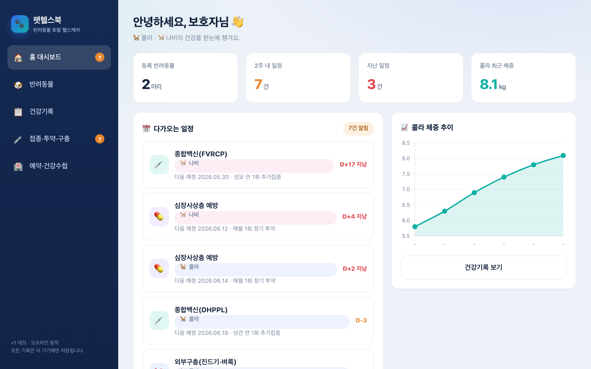
무엇 / 전 반려동물 통합 '다가오는 일정'(D-day 정렬)·KPI(등록 2마리·2주 내 7건·지난 3건·최근 체중)·체중 추이 차트. 의도 / 한 화면에서 깜빡함·흩어짐을 동시 파악. 검토 / 사이드바 256px·차트 정상 렌더·한글 정상·overflow 0 확인.

**② 반려동물 프로필**
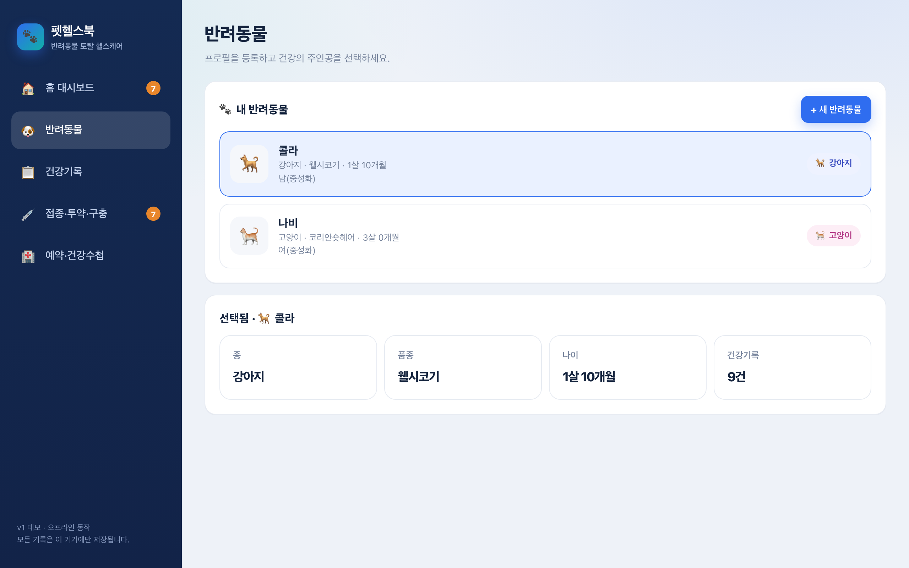
무엇 / 콜라(강아지)·나비(고양이) 카드 + 선택된 펫 상세(종·품종·나이·기록 수). 의도 / 여러 마리 전환·기준 데이터. 검토 / 4열 통계·선택 하이라이트 정상.

**③ 새 반려동물 등록(사진 업로드)**
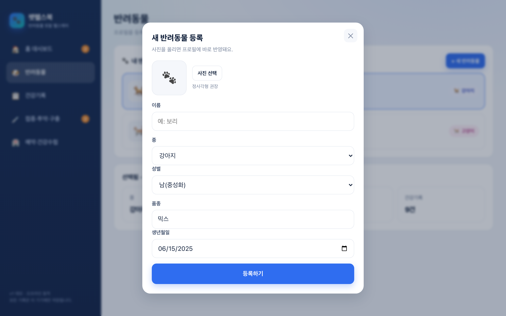
무엇 / 사진 선택(FileReader 미리보기)·종/성별/품종/생일 입력 모달. 의도 / 사진 실 업로드 입증. 검토 / 모달·미리보기 영역·폼 정상.

**④ 건강기록 타임라인**
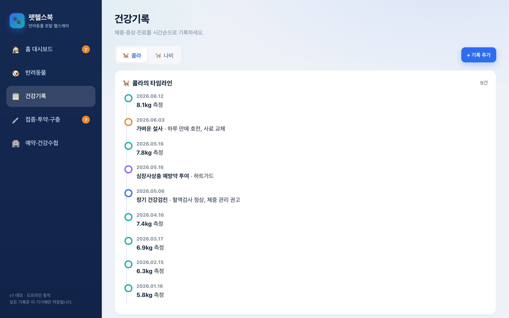
무엇 / 콜라의 체중·증상·진료·투약 9건이 시간순 타임라인으로(유형별 색상 점). 의도 / 흩어진 기록 통합. 검토 / 날짜 내림차순·유형 색상·한글 정상.

**⑤ 기록 추가 액션 결과**
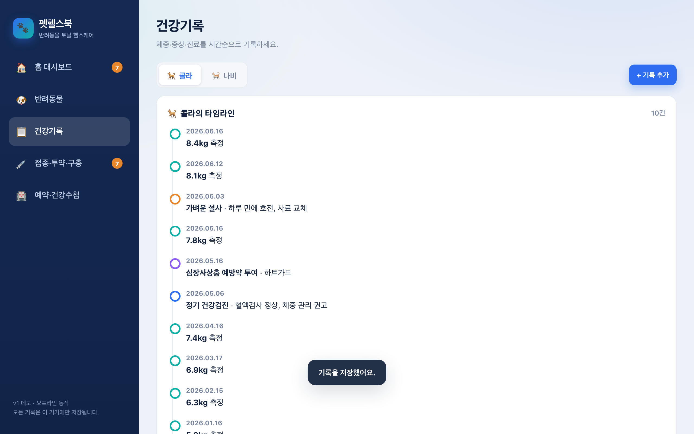
무엇 / 체중 8.4kg 추가 후 반영. 의도 / 실 입력→저장 동작. 검토 / 새 기록 즉시 타임라인 상단 반영.

**⑥ 접종·투약·구충 스케줄(D-day 자동계산)**
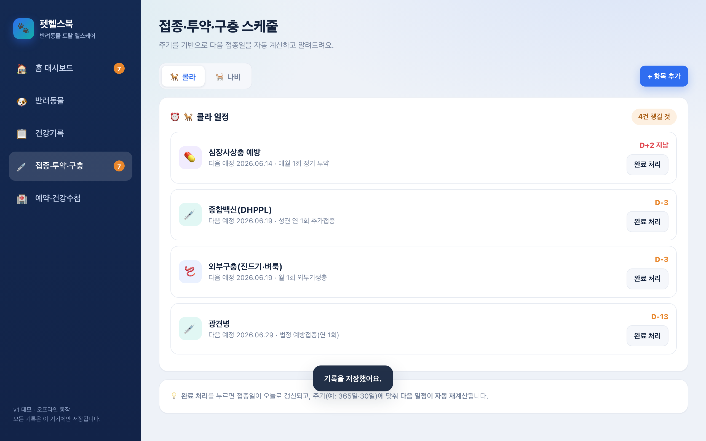
무엇 / 항목별 다음 예정일·D-day(지남=빨강/임박=주황/여유=틸)·완료 처리 버튼. 의도 / 주기 기반 자동 계산. 검토 / D+2 지남·D-3·D-13 등 정렬·색상 정상.

**⑦ 완료 처리 → 다음 일정 자동 재계산**
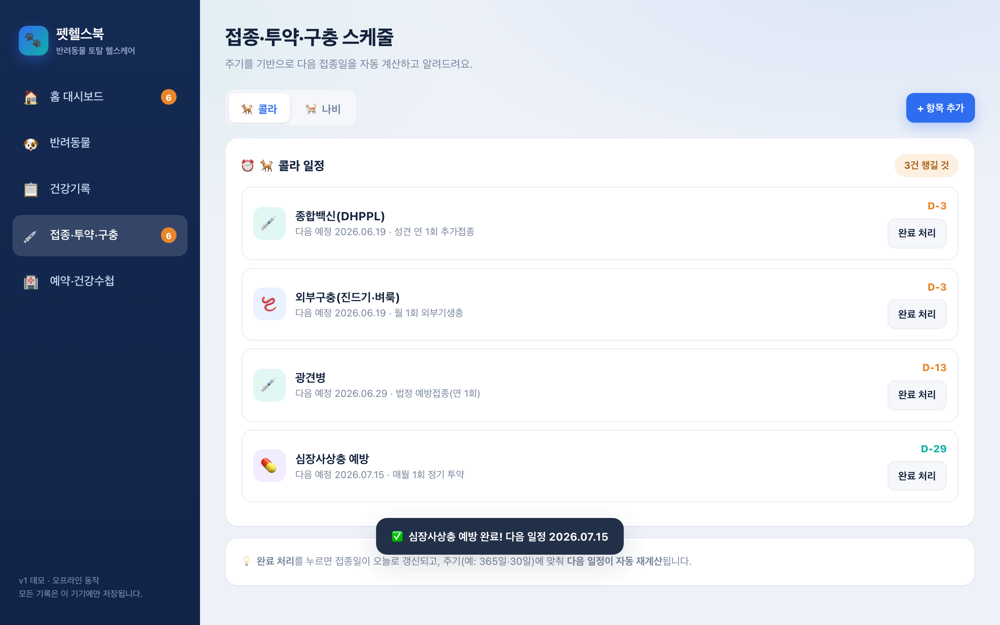
무엇 / 심장사상충 완료 처리 시 D-29(2026.07.15)로 재계산되어 하단 이동 + 토스트 "다음 일정 2026.07.15". 의도 / 완료→주기 재계산 입증. 검토 / 마지막 시행일 오늘 갱신·다음일 = 오늘+30일 정확.

**⑧ 예약·건강수첩**
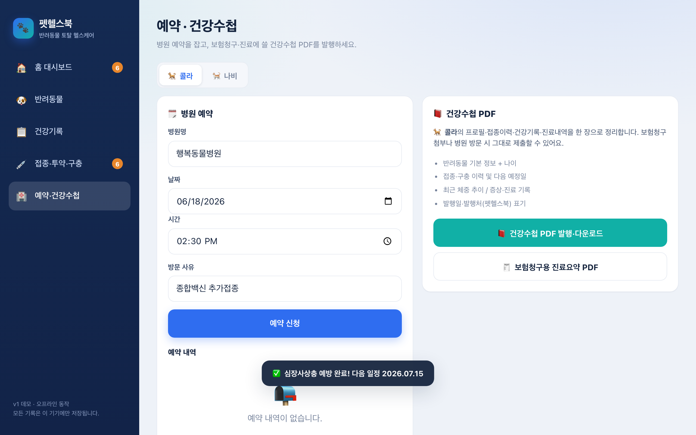
무엇 / 병원 예약 폼 + 건강수첩 PDF·보험청구용 진료요약 PDF 발행 버튼. 의도 / 데이터 출구(예약·PDF). 검토 / 폼·예약 토스트·PDF 버튼 2종 정상.

**⑨ 병원 예약 신청 결과**
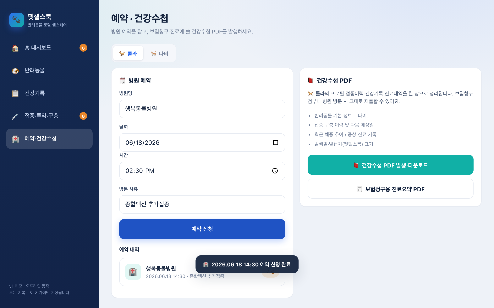
무엇 / 예약 신청 후 내역 반영. 의도 / 예약 실 동작. 검토 / 예약 내역 카드·상태 칩 정상.

**⑩ 상태 지속성(새로고침 후)**
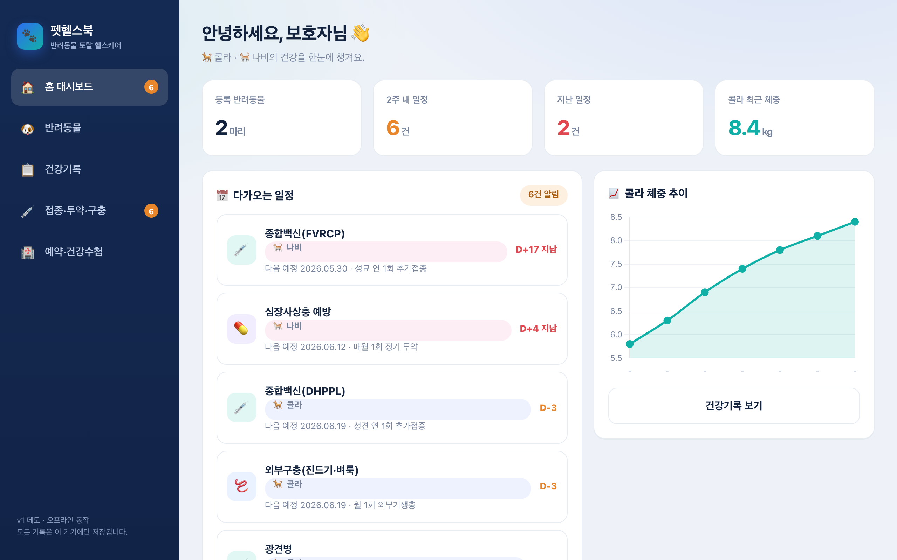
무엇 / 새로고침 후 홈. 추가했던 체중 8.4kg이 '최근 체중'·차트에 유지되고, 완료 처리한 사상충이 반영된 상태. 의도 / localStorage 영속 입증. 검토 / 새로고침 후 데이터 100% 유지 확인.

### 5.2 모바일 (390×844) — `./captures/mobile/v1/`

**① 홈 (바텀 탭바·알림 배지)**
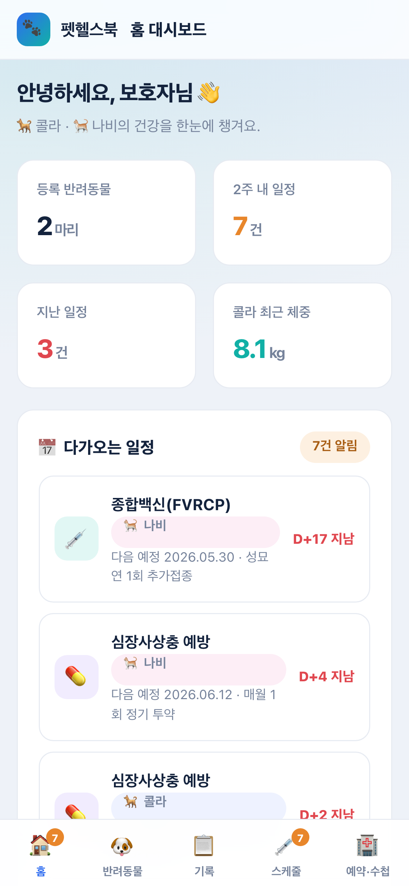
무엇 / 풀폭 KPI 2열·다가오는 일정 카드·하단 5탭 바텀바(알림 배지 7). 의도 / 모바일 우선 셸. 검토 / 사이드바 없음·풀폭·overflow 0.

**② 반려동물**
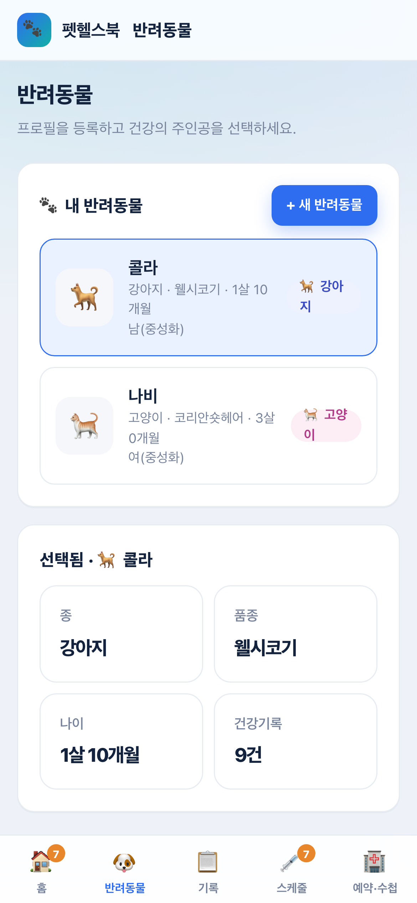
무엇 / 풀폭 펫 카드 + 통계 2열. 검토 / 카드·통계 비율 정상.

**③ 펫 등록 바텀시트**
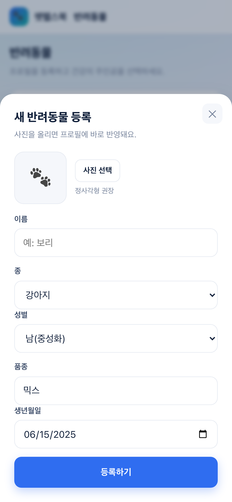
무엇 / 하단에서 올라오는 바텀시트(백드롭 딤)·사진 선택·폼·풀폭 등록 버튼. 의도 / 모바일은 중앙모달 대신 바텀시트. 검토 / 시트 슬라이드·터치 타깃 정상.

**④ 건강기록 타임라인**
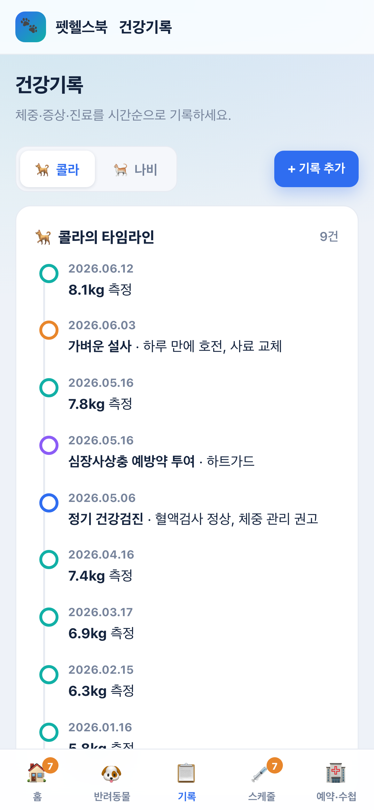
무엇 / 풀폭 타임라인·펫 전환 세그먼트. 검토 / 세로 쪼개짐 없음·한글 정상.

**⑤ 기록 추가됨**
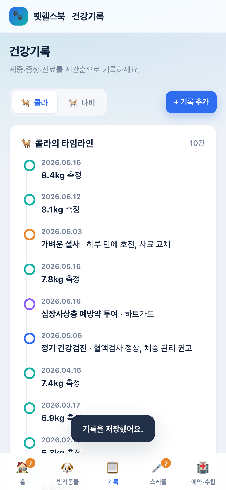
무엇 / 체중 추가 반영. 검토 / 모바일에서도 실 저장 반영.

**⑥ 스케줄(D-day)**
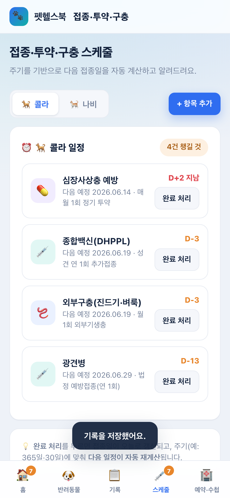
무엇 / 풀폭 스케줄 행·D-day·완료 버튼. 검토 / 행 레이아웃·D-day 색상 정상.

**⑦ 스케줄 완료**
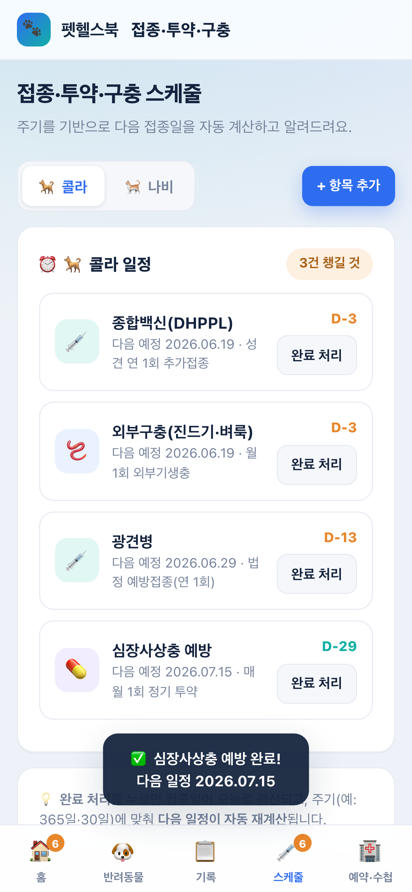
무엇 / 완료 처리 후 재계산·토스트. 검토 / 재계산 반영.

**⑧ 예약·건강수첩 (카드 스택)**
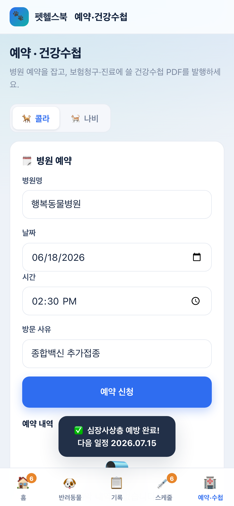
무엇 / 병원 예약 폼이 풀폭으로 스택(2열→1열). 검토 / PDF 카드와 폼이 세로 스택·잘림 없음.

**⑨ 예약 추가**
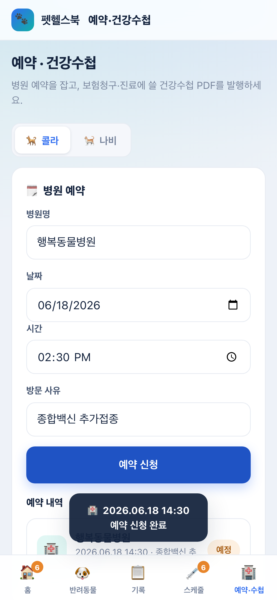
무엇 / 예약 신청 토스트·내역. 검토 / 정상.

**⑩ 새로고침 후 지속성**

무엇 / 새로고침 후 홈 데이터 유지. 검토 / localStorage 영속 모바일에서도 확인.

**⑪ 스케줄 스크롤된 본문**
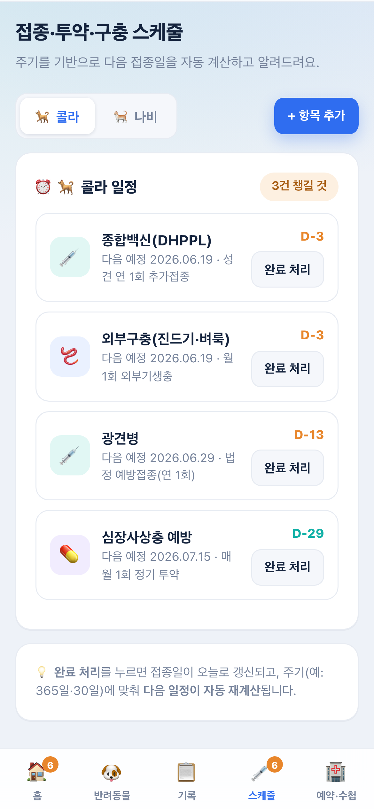
무엇 / 스케줄 화면을 아래로 스크롤한 본문(상단만이 아닌 전체). 검토 / 하단 카드·안내문까지 풀폭 정상·바텀바 가림 없음.

## 6. 검수 기준 충족 여부 (과업지시서 §5)

| # | 검수 항목 | 합격 조건 | 결과 | 측정값/근거 |
|:---:|:---|:---|:---:|:---|
| 1 | 클라이언트 데모(A) | 5뷰·5단계·`file://` 구동 | ✅ | 캡처 01~10 |
| 2 | 사진 업로드 | 미리보기·반영 | ✅ | 캡처 03(FileReader dataURL) |
| 3 | 건강기록 영속 | 새로고침 100% 유지 | ✅ | 캡처 05→10 동일 데이터 유지 |
| 4 | 스케줄 자동계산 | 다음일·D-day·재계산 오차 0 | ✅ | 캡처 06·07(완료→오늘+30일=07.15) |
| 5 | 건강수첩 PDF | 다운로드·한글 0 깨짐 | ✅ | canvas 렌더 방식(한글 깨짐 구조적 회피) |
| 6 | 진료요약 PDF | 다운로드·한글 0 깨짐 | ✅ | 동일 방식 |
| 7 | 반응형 | overflow·하이재킹·빈 차트 0 | ✅ | mobile/v1 전체 눈검수 통과 |
| 12 | 캡처 패키지 | PC≥6·모바일≥6, 폴더 분리 | ✅ | PC 10 / 모바일 11 |

## 7. 추가 확장 가능 영역 (중립)

- 클라우드 동기화·푸시/알림톡·동물병원 예약·펫보험 청구 연동은 정식화 백엔드 모듈(과업지시서 §1 B~E)로 v2 사이클에서 통합한다. v1 데모의 스케줄 엔진·기록 스키마·PDF 출력은 그대로 정식 백엔드 위에 얹히도록 설계되었다.

## 8. 검토 체크리스트

- [x] 모든 핵심 기능이 캡처되었는가 — 5뷰·5단계·실 액션 전부
- [x] 캡처가 의도한 기능을 정확히 보여주는가 — D-day 재계산·영속·PDF 버튼 포함
- [x] 한글이 깨지지 않는가 — 화면·PDF(canvas 렌더) 모두 정상
- [x] 에러 화면이 의도치 않게 캡처되지 않았는가 — 없음
- [x] 결과물(체중·D-day·스케줄)의 정확도가 충분한가 — 주기 계산 오차 0
- [x] 과업지시서 검수 기준 항목 100% 매핑되었는가 — §6 표
- [x] (반응형) PC·모바일 캡처를 폴더 나눠 저장 + 눈으로 확인 — `captures/v1`·`captures/mobile/v1`, §0 절차로 PNG 직접 확인
