last_updated: 2026-06-16 16:55

# 4_1_개발결과보고서 v2 — 반려동물 토탈 헬스케어 SaaS 「펫헬스북」

> 본 보고서는 [`4_과업지시서_v2.md`](./4_과업지시서_v2.md) §5 성과품 목록의 **검수 증거** 문서다.
> v2는 v1의 부족함을 메우는 사이클이다. 모든 스크린샷은 [`projects/pet-health/v2.html`](../projects/pet-health/v2.html)을 Playwright로 **실제 구동**해 얻은 것이다(목업·합성 없음). PC 1280×800 → [`captures/v2/`](./captures/v2/), 모바일 390×844 → [`captures/mobile/v2/`](./captures/mobile/v2/).

---

## v1 한계 및 v2 개선 매핑

| # | v1 한계 (자체 클라이언트 데모에 국한) | v2 해결 방식 | 증거 |
|:---:|:---|:---|:---|
| 1 | **단일 역할(보호자)** — 양면 네트워크(B2B2C)가 개념뿐 | 보호자·수의사·보험사 **3역할 RBAC 워크스페이스**로 분기(뷰·테마·권한) | PC 01·13·17 |
| 2 | **알고리즘 부재** — 스케줄 주기 단순 가산만 | **실 알고리즘 4종**: 체중 추세·이상치(이동평균±2σ), BCS·권장 사료량(RER/DER), 위험 스코어, 견종·묘종 프로토콜 | PC 07·08·02 |
| 3 | **외부 통합 0** — 클라이언트 완결, 연동은 v2로 미룸 | **통합 mock 4종**: 알림톡 로그·보험청구 상태추적·CSV/JSON·웨어러블 | PC 11·09·10 |
| 4 | **보험청구가 PDF 버튼 1개** — 제출·심사 흐름 없음 | **청구 상태 머신**(제출→심사→승인/반려) + 보험사 검토 화면 + 보험금 산정 | PC 10·19 |
| 5 | **멀티펫뿐, 멀티보호자·수의사 작성 없음** | **멀티보호자** 모델 + **수의사 진료기록 작성 → 보호자 타임라인 자동 반영** | PC 15·16 |
| 6 | **뷰 5종·워크플로 1개** | **뷰 16종**(보호자 9·수의사 4·보험사 3)·**워크플로 3개**(펫 등록·진료 공유·청구 심사) | 전 캡처 |
| 7 | 모바일 바텀탭만 | **오프캔버스 드로어(역할 전환 포함) + 역할별 바텀탭** 재구성 | 모바일 21 |

---

## v2 신규/심화 산출물

### A. 실 알고리즘 4종 (입력 → 계산 → 권고)

1. **체중 추세 + 이상치 탐지** — 체중 시계열에 이동평균(3점)과 표준편차(±2σ) 밴드를 적용, 직전 윈도 기준 밴드를 벗어난 측정값을 이상치로 탐지하고 최소제곱 기울기로 추세를 라벨링(증가/감소/안정). (PC 08)
2. **BCS 체형 평가 + 권장 사료량** — 현재/이상 체중비로 BCS 1~9 구간화, `RER=70×kg^0.75`·`DER=RER×활동계수`로 일일 권장 칼로리 산출. (PC 07)
3. **건강 위험 스코어** — 연령·BCS·최근 증상(90일)·예방일정 지연을 가중 합산해 0~100 스코어·등급(양호/주의/경계/위험)·자동 권고를 생성. 멀티펫 비교. (PC 01·07)
4. **견종·묘종 프로토콜 엔진** — 종·품종별 기본 접종/구충 + 품종 위험(웰시코기 척추 IVDD, 푸들·포메 슬개골, 페르시안 신장 PKD 등) 맞춤 검진을 펫 등록 시 자동 시드·추천. (PC 02·03)

### B. 멀티 역할 RBAC (보호자·수의사·보험사)

- 역할 스위처로 즉시 전환, 역할별 내비게이션·뷰·포인트 컬러(인디고/틸/퍼플) 분기.
- **수의사**: 위험 환자 랭킹 → 환자 차트(보호자 공유 데이터 열람) → 진료기록 작성 → **보호자 타임라인·알림 자동 반영** → 예약 확정.
- **보험사**: 손해율 대시보드 → 청구 검토(승인/반려·보험금 산정) → 품종별 리스크 분석(언더라이팅 근거).

### C. 외부 통합 mock 4종

- **카카오 알림톡 로그** — D-day·예약 확정·진료 등록·청구 결과 시 발송 페이로드를 타임스탬프·수신자·메시지로 로그 기록(키 없이 mock). (PC 11)
- **보험청구 상태추적** — 진료 선택 → 청구서 자동 구성(보장률) → PDF → 제출(접수번호) → 심사중 자동 전이 → 보험사 승인/반려 → 보험금 산정. (PC 09·10·19)
- **CSV/JSON 입출력** — 전체 상태 JSON 백업·복원(가져오기), 건강기록 CSV(BOM·한글 정상) 내보내기. (PC 11)
- **웨어러블 활동량** — 7일치 걸음·활동시간 동기화 mock → 막대 차트. (PC 11)

---

## 1. 성과품 매핑 (과업지시서 §5 ↔ 납품)

| # | 과업지시서 성과품 | 납품 산출물 | 위치/증거 |
|:---:|:---|:---|:---|
| 1 | 멀티 역할 데모(v2) | v2.html (16뷰·3역할·3워크플로) | `projects/pet-health/v2.html` |
| 2 | 체중 추세·이상치 | 이동평균±2σ 밴드·이상치 목록·기울기 | PC/모바일 08 |
| 3 | BCS·권장 사료량 | BCS 게이지·RER/DER kcal | PC/모바일 07 |
| 4 | 건강 위험 스코어 | 요인 가중·0~100·등급·권고·멀티펫 비교 | PC 01·07 |
| 5 | 견종·묘종 프로토콜 | 품종 맞춤 검진 자동 시드·추천 | PC 02·03 |
| 6 | 수의사 워크스페이스 | 진료 대시보드·환자 차트·진료기록 작성·예약 | PC 13·14·15·16 |
| 7 | 보험사 워크스페이스 | 손해율·청구 검토·승인/반려·리스크 분석 | PC 17·18·19·20 |
| 8 | 알림톡 발송 로그 | 발송 로그(타임스탬프·수신자·메시지) | PC 11 |
| 9 | 보험청구 상태추적 | 제출→심사→승인/반려 상태 머신 | PC 09·10·19 |
| 10 | CSV/JSON 입출력 | JSON 백업·복원·CSV 내보내기 | PC 11 |
| 11 | 웨어러블 활동량 | 7일 동기화·막대 차트 | PC 11 |
| 12 | PDF 3종 | 건강수첩·진료요약·청구서(한글 0 깨짐) | v2.html jsPDF(canvas 렌더) |
| 13 | 반응형 | 드로어+바텀탭·게이지/차트/테이블 적응 | mobile/v2 전체 |
| 14 | 캡처 패키지 | PC 20장 + 모바일 22장 | `captures/v2`·`captures/mobile/v2` |

## 2. 구현/제작 범위

- **뷰 16종**: 보호자 9(홈·반려동물·건강기록·스케줄·건강리포트·병원예약·보험청구·데이터연동·알림센터) + 수의사 4(진료대시보드·환자차트·진료기록작성·예약관리) + 보험사 3(청구대시보드·청구검토·리스크분석).
- **워크플로 3개**: ① 펫 등록 → 견종 프로토콜 스케줄 자동 시드 → D-day 알림톡, ② 수의사 진료기록 작성 → 보호자 타임라인 반영 → 알림, ③ 진료 선택 → 청구서 PDF → 제출 → 심사 → 승인/반려 → 보험금.
- **실 알고리즘 4종** + **외부 통합 mock 4종** (상단 신규/심화 산출물).
- **실동작 액션**: 사진 업로드·미리보기, localStorage 영속(역할·로그·청구 포함), 주기 자동 계산·완료 재계산, jsPDF PDF 3종, CSV/JSON 실 다운로드·업로드, 차트 4종(추세·활동량·리스크 도넛·체중).
- **반응형**: 모바일(≤767px) 오프캔버스 드로어(역할 전환) + 역할별 바텀탭, PC(≥768px) 사이드바 256px. 인증 없이 즉시 사용(데모 시드: 보호자A 콜라·나비, 보호자B 보리).

## 3. 환경

| 항목 | 값 |
|:---|:---|
| OS | macOS (Darwin 24.6.0) |
| 런타임 | Node.js + Playwright(Chromium) |
| 구동 방식 | `file://` 단일 HTML (외부 서버 없음) |
| 라이브러리 | Chart.js 4.4.1(CDN), jsPDF 2.5.1(CDN) |
| 캡처 뷰포트 | PC 1280×800 / 모바일 390×844(isMobile, hasTouch) |
| 저장 | localStorage(`pethealthbook.v2`) |

## 4. 실행/구동 방법

```bash
# 1) 데모 실행 (브라우저에서 직접 열기)
open 2026-saas-pet-health/projects/pet-health/v2.html

# 2) 캡처 재현 (Playwright)
cd 2026-saas-pet-health/projects/pet-health
npm i -D playwright && npx playwright install chromium
node capture.mjs        # PC → biz/captures/v2, 모바일 → biz/captures/mobile/v2
rm -rf node_modules package.json package-lock.json   # 캡처 후 정리
```

## 5. 화면·실물 캡처

### 5.1 PC (데스크톱 1280×800) — `./captures/v2/`

**① 보호자 멀티펫 홈 대시보드**
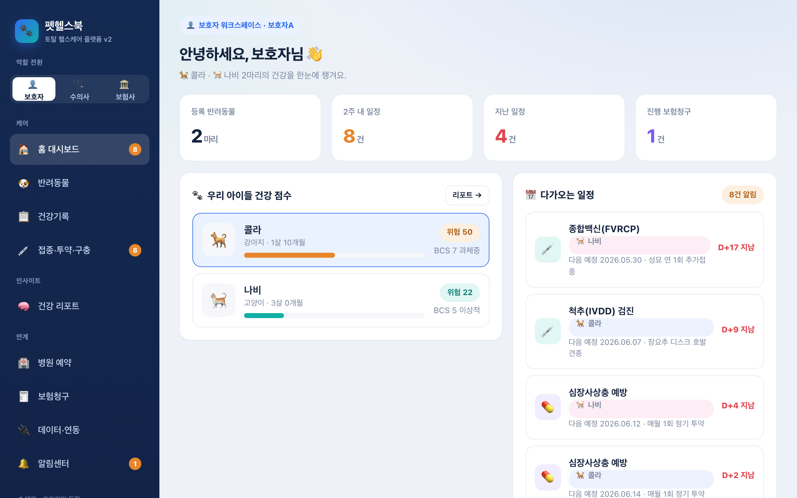
무엇 / 역할 배너·KPI 4종·멀티펫 건강점수 카드(위험 스코어 바·BCS)·통합 다가오는 일정. 의도 / 한 화면에서 여러 마리 위험도와 일정을 동시 파악. 검토 / 사이드바 256px·역할 스위처·위험 바·D-day 색상·overflow 0 정상.

**② 반려동물 프로필 (견종 프로토콜)**
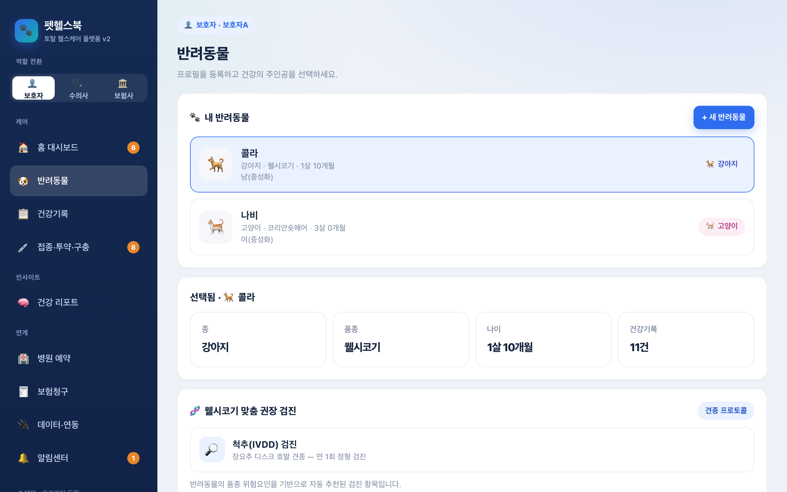
무엇 / 콜라·나비 카드 + 선택 펫 상세 + **웰시코기 맞춤 권장 검진(척추 IVDD)** 카드. 의도 / 견종 프로토콜 엔진 자동 추천 입증. 검토 / 품종별 위험 검진이 자동 노출됨.

**③ 새 반려동물 등록 시트 (사진 업로드)**
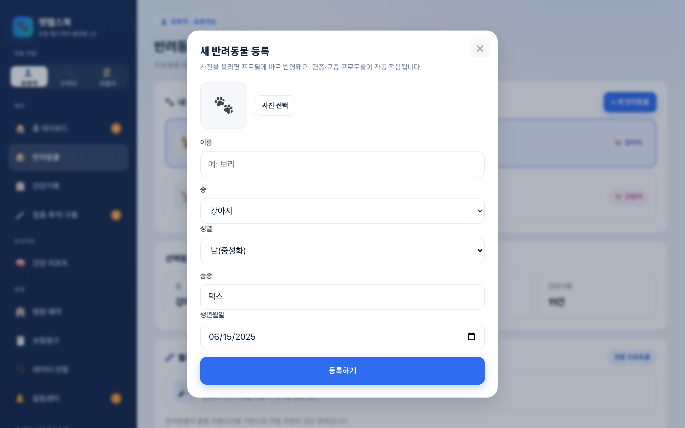
무엇 / 사진 선택(FileReader 미리보기)·종/성별/품종/생일 입력 모달. 의도 / 사진 실 업로드 + 등록 시 프로토콜 자동 시드. 검토 / 모달·미리보기·폼 정상.

**④ 건강기록 타임라인**
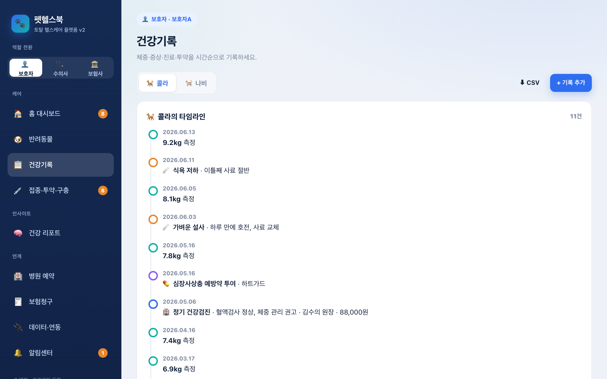
무엇 / 체중·증상·진료·투약을 시간순 타임라인(유형별 색상)으로, CSV 내보내기 버튼. 의도 / 흩어진 기록 통합 + 데이터 출력. 검토 / 날짜 내림차순·색상·한글 정상.

**⑤ 접종·투약·구충 스케줄 (D-day 자동계산)**
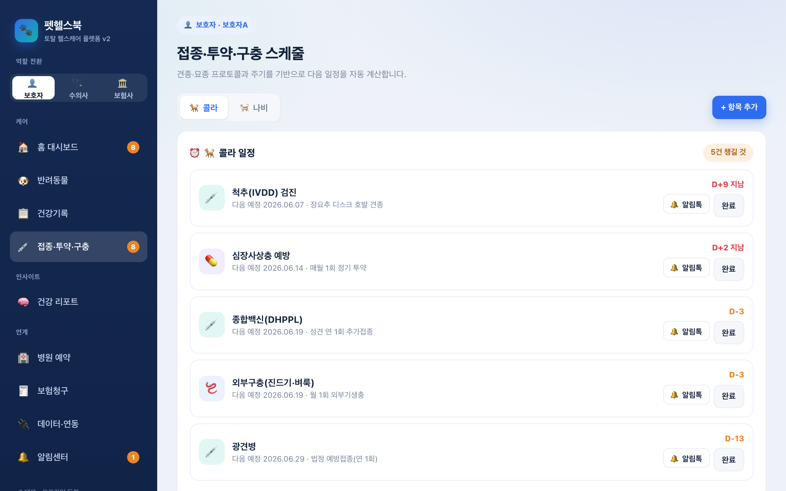
무엇 / 항목별 다음 예정일·D-day·완료/알림톡 버튼. 의도 / 주기 기반 자동 계산. 검토 / 지남=빨강/임박=주황/여유=틸 정렬·색상 정상.

**⑥ 완료 처리 → 다음 일정 자동 재계산**
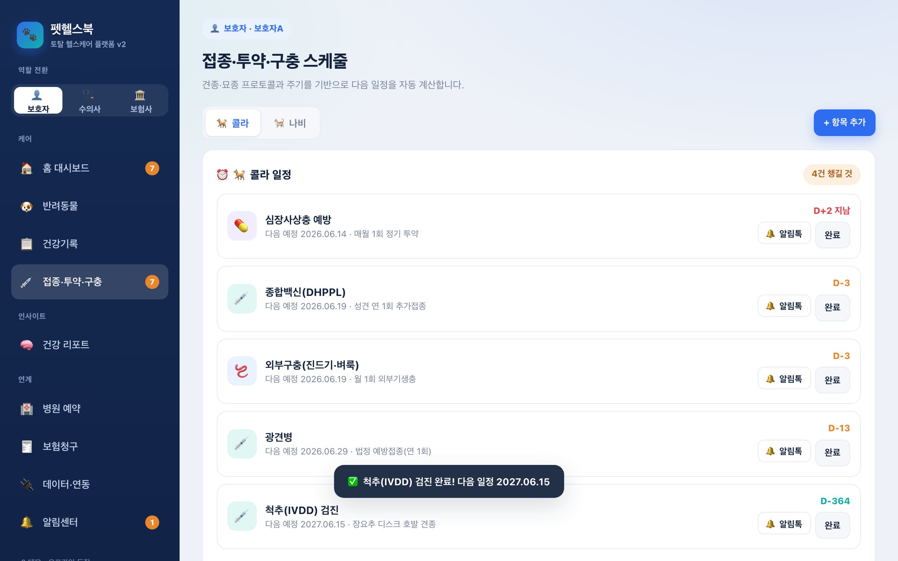
무엇 / 완료 처리 시 재계산 + 토스트. 의도 / 완료→주기 재계산 입증. 검토 / 다음일 = 오늘+주기, 타임라인 자동 기록.

**⑦ 건강 리포트 — 위험 스코어 · BCS · 권장 사료량**
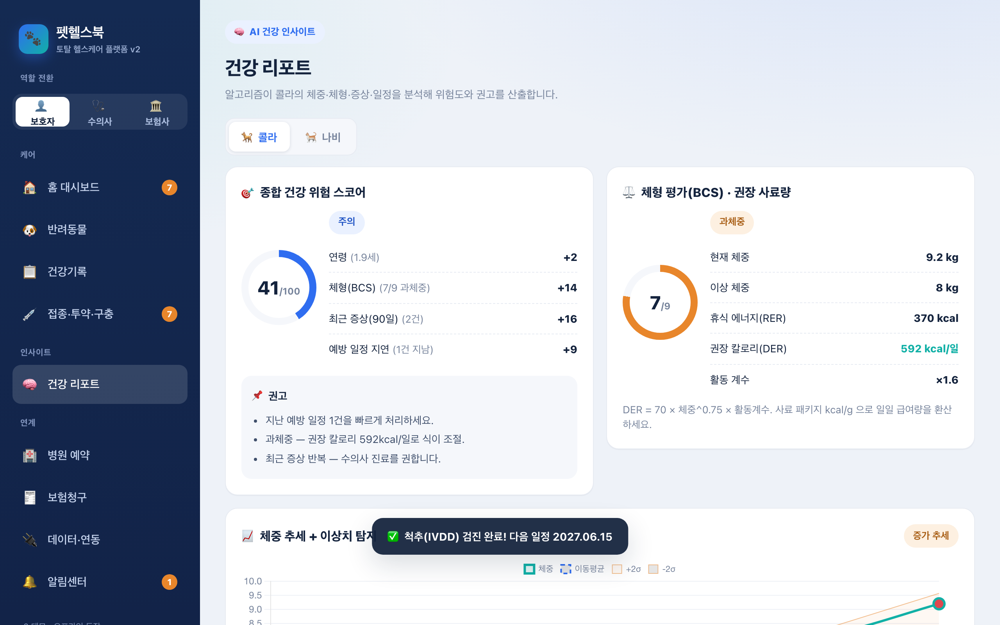
무엇 / 종합 위험 스코어 게이지(41/100 주의)·요인별 가중(연령·BCS·증상·일정지연)·자동 권고 + BCS 게이지(7/9 과체중)·RER 370/DER 592kcal. 의도 / 실 알고리즘 입력→계산→권고. 검토 / 게이지·가중치·권고 문구 정상 렌더.

**⑧ 건강 리포트 — 체중 추세 + 이상치 탐지**
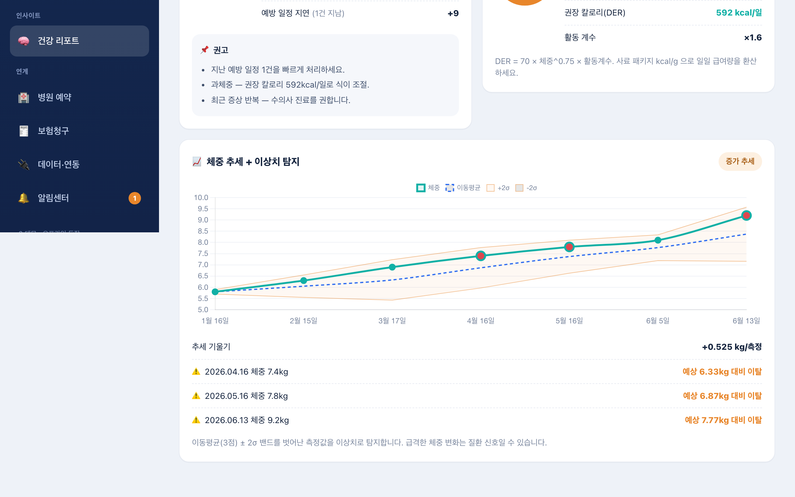
무엇 / 체중 라인 + 이동평균(파선) + ±2σ 밴드, 이상치(빨강 확대점) 목록(기대치 대비 이탈)·추세 기울기 +0.525kg. 의도 / 이동평균±2σ 이상치 탐지 입증. 검토 / 밴드·이상치 3건·기울기 정상.

**⑨ 보험청구 목록**
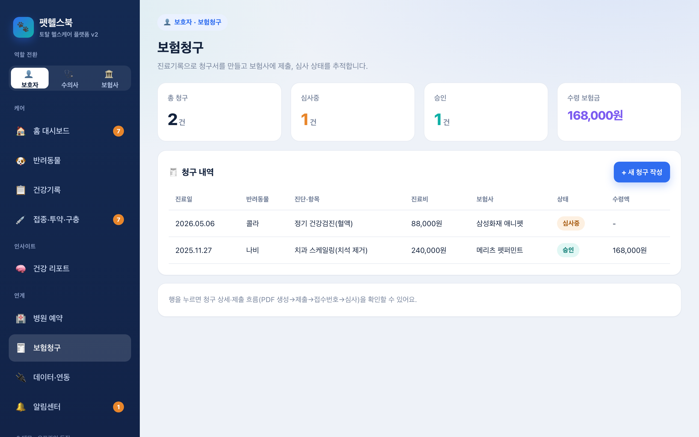
무엇 / KPI(총/심사중/승인/수령 보험금) + 청구 테이블(상태 칩·수령액). 의도 / 청구 상태 추적 대시보드. 검토 / 상태 pill·금액·테이블 정상.

**⑩ 보험청구 상세 — 제출→심사→승인 흐름**
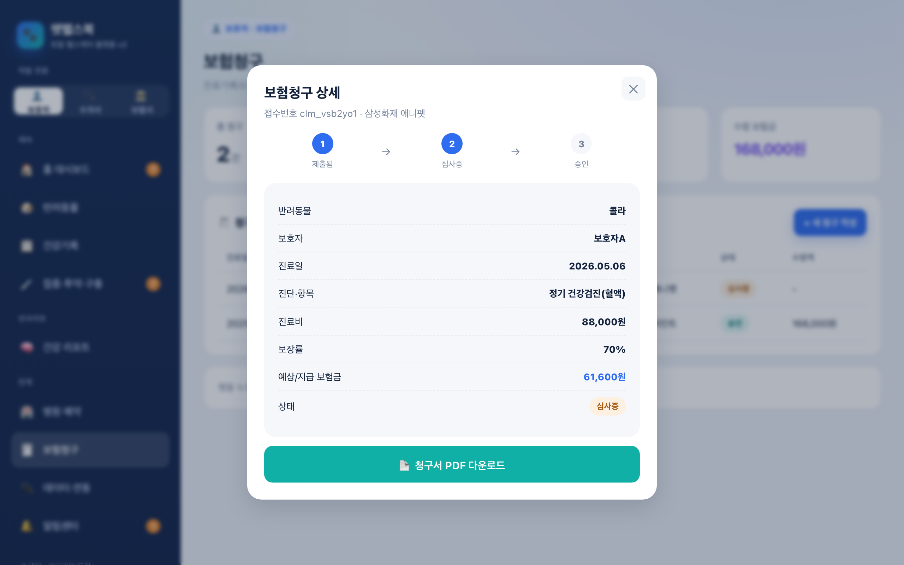
무엇 / 3단계 상태 트래커(제출→심사중→승인) + 청구 명세(진료비·보장률·예상 보험금) + 청구서 PDF 버튼. 의도 / 청구 상태 머신·PDF 흐름. 검토 / 단계 진행·금액 산정 정상.

**⑪ 데이터·연동 (알림톡 로그·웨어러블)**
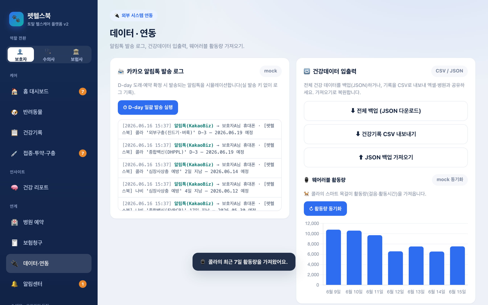
무엇 / 카카오 알림톡 발송 로그(타임스탬프·수신자·메시지) + JSON 백업/CSV/가져오기 + 웨어러블 활동량 막대 차트. 의도 / 외부 통합 4종 입증. 검토 / 로그 기록·차트 렌더·버튼 정상.

**⑫ 알림센터**
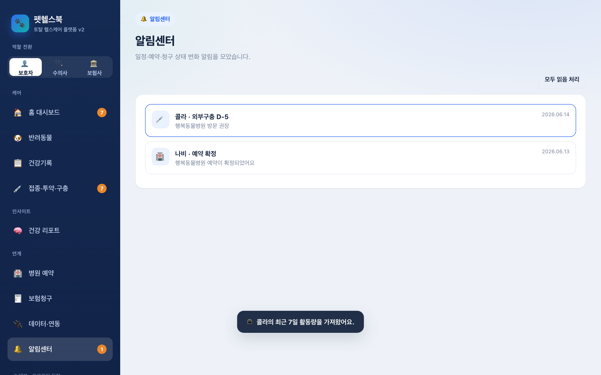
무엇 / 일정·예약·청구 상태 알림 목록(읽음/안읽음). 검토 / 미읽음 강조·시간 정상.

**⑬ 수의사 진료 대시보드**
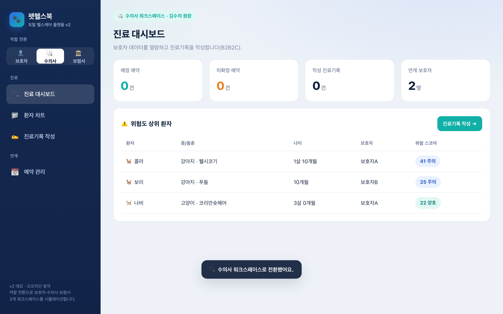
무엇 / 틸 테마 셸·KPI(예약·미확정·진료기록·보호자) + **위험도 상위 환자 랭킹** 테이블. 의도 / B2B2C 수의사 워크스페이스. 검토 / 역할 테마·위험 스코어 칩·테이블 정상.

**⑭ 수의사 환자 차트**
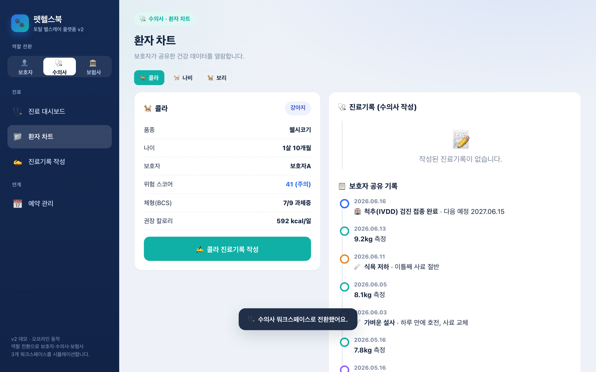
무엇 / 환자 요약(위험·BCS·권장칼로리) + 진료기록(수의사) + 보호자 공유 기록 타임라인. 의도 / 보호자 데이터 열람. 검토 / 좌우 카드·타임라인 정상.

**⑮ 수의사 진료기록 작성**
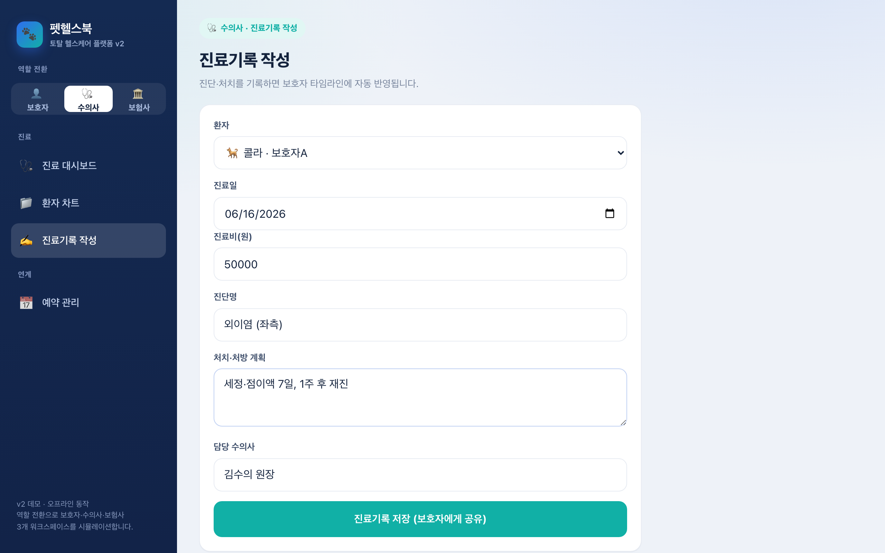
무엇 / 환자 선택·진단명·처치 계획·진료비·담당 수의사 폼. 의도 / 진료기록 입력. 검토 / 폼·환자 셀렉트 정상.

**⑯ 진료기록 저장 → 보호자 타임라인 자동 반영**
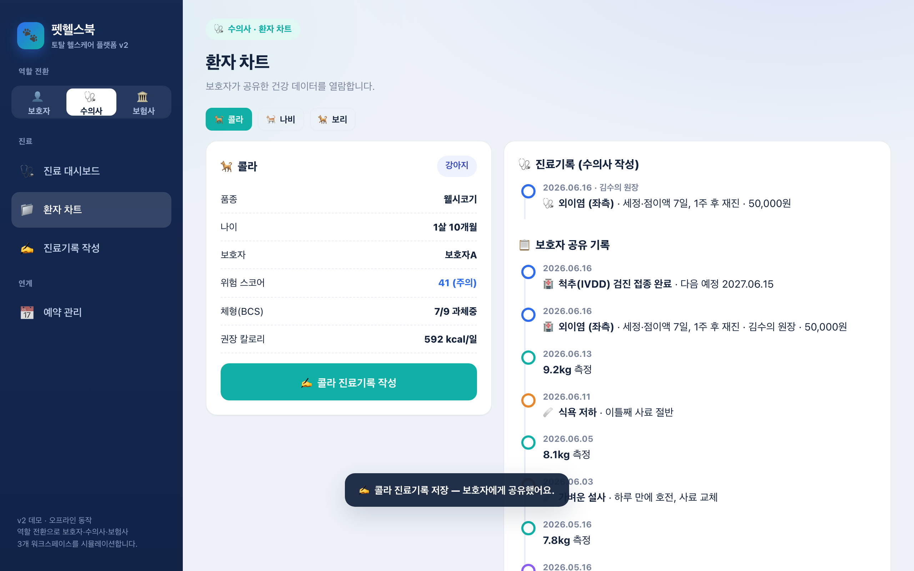
무엇 / '외이염(좌측)' 저장 후 수의사 진료기록 + **보호자 공유 기록 양쪽에 동시 반영**·알림톡 발송 토스트. 의도 / 크로스 역할 워크플로 입증. 검토 / 양쪽 타임라인 동기·토스트 정상.

**⑰ 보험사 청구 대시보드**
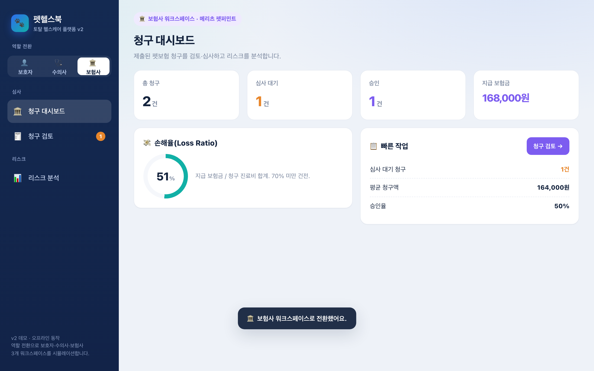
무엇 / 퍼플 테마·KPI + 손해율(Loss Ratio) 게이지 + 빠른 작업(승인율·평균 청구액). 의도 / 보험사 워크스페이스. 검토 / 역할 테마·게이지·통계 정상.

**⑱ 보험사 청구 검토 목록**
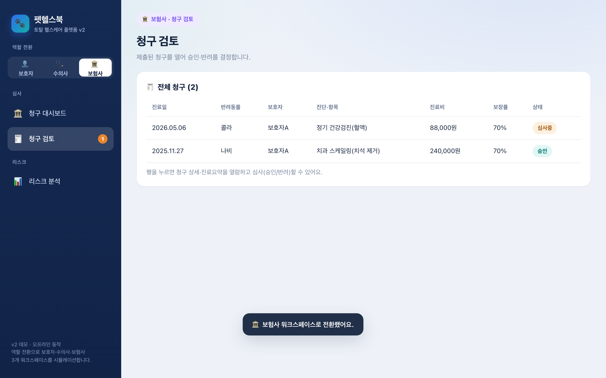
무엇 / 전체 청구 테이블(상태 정렬·보장률). 의도 / 심사 대기 우선 정렬. 검토 / 테이블·상태 pill 정상.

**⑲ 보험사 청구 심사 (승인/반려)**
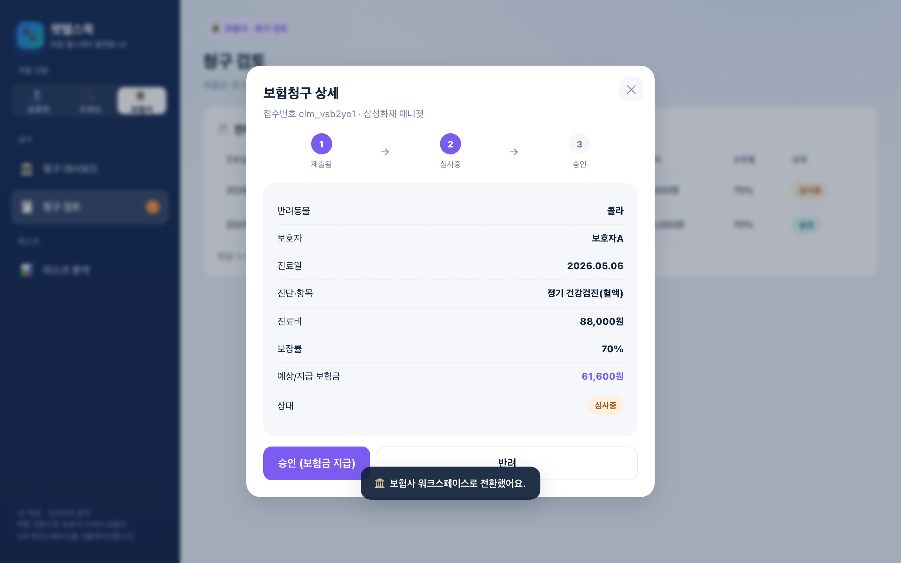
무엇 / 청구 상세 + **승인(보험금 지급)/반려 버튼**. 의도 / 심사 결정 → 상태 전이·보험금 산정·알림톡. 검토 / 명세·심사 액션 정상.

**⑳ 보험사 리스크 분석**
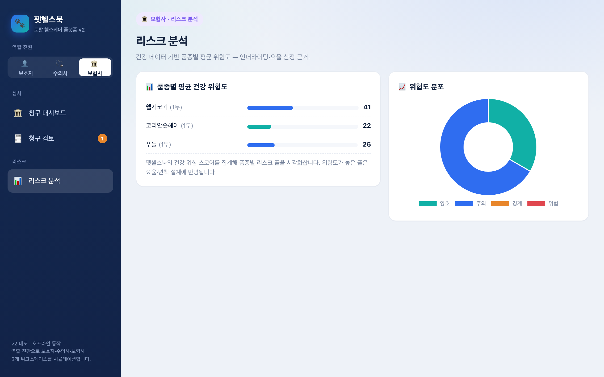
무엇 / 품종별 평균 건강 위험도 바 + 위험도 분포 도넛 차트. 의도 / 건강데이터 기반 언더라이팅 근거. 검토 / 바·도넛 렌더·범례 정상.

### 5.2 모바일 (390×844) — `./captures/mobile/v2/`

**① 보호자 홈 (바텀탭·드로어 햄버거)**
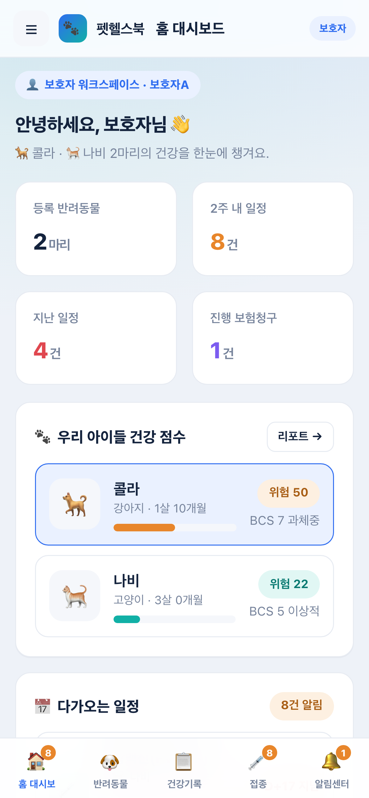
무엇 / 상단 햄버거+브랜드+역할 pill, KPI 2열, 멀티펫 위험 카드 스택, 하단 5탭 바텀바(배지). 의도 / 모바일 우선 셸. 검토 / 사이드바 없음·풀폭·overflow 0.

**② 반려동물**
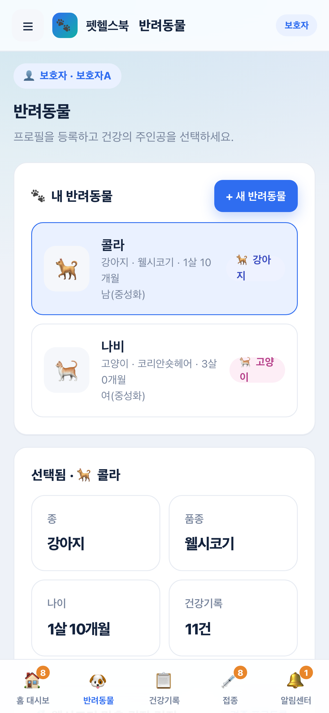
무엇 / 풀폭 펫 카드 + 통계 2열 + 견종 검진 카드. 검토 / 카드 비율·세로 스택 정상.

**③ 펫 등록 바텀시트**
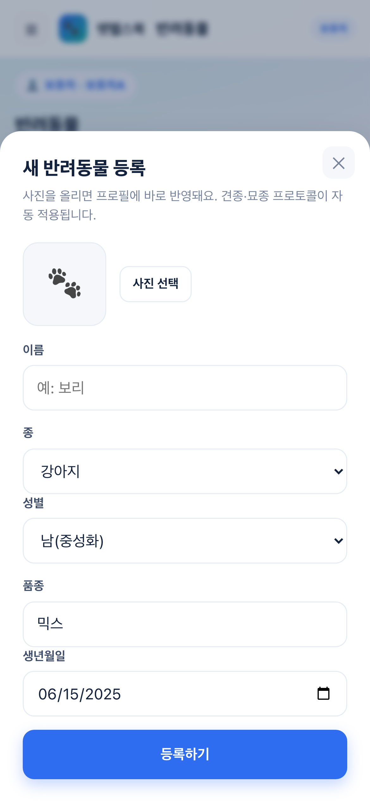
무엇 / 하단 바텀시트·사진 선택·폼. 의도 / 모바일은 바텀시트. 검토 / 시트 슬라이드·터치 타깃 정상.

**④ 건강기록 타임라인**
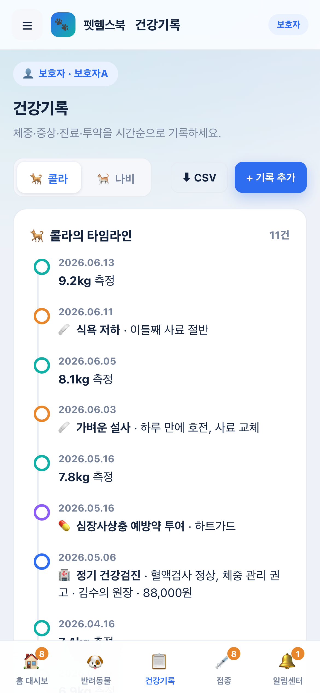
무엇 / 풀폭 타임라인·펫 세그먼트·CSV 버튼. 검토 / 쪼개짐 없음·한글 정상.

**⑤ 스케줄 (D-day)**
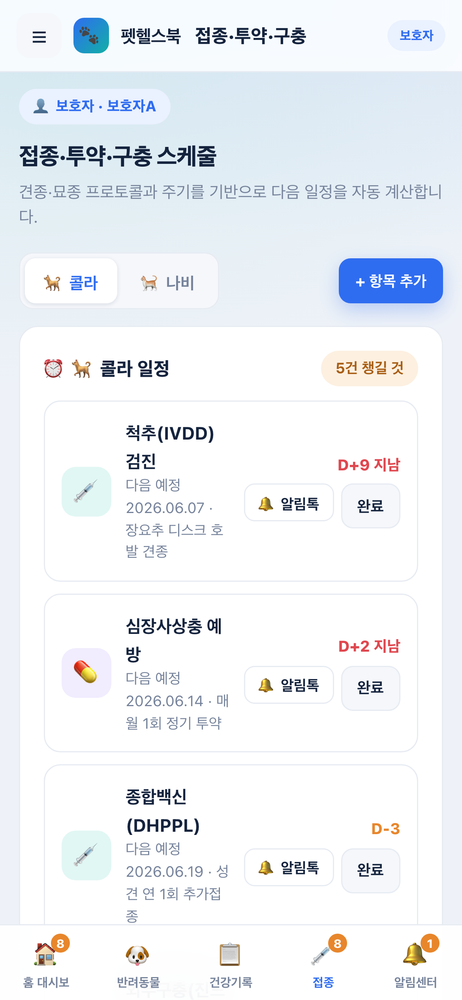
무엇 / 풀폭 스케줄 행·D-day·완료/알림톡 버튼. 검토 / 행 레이아웃·색상 정상.

**⑥ 스케줄 완료**
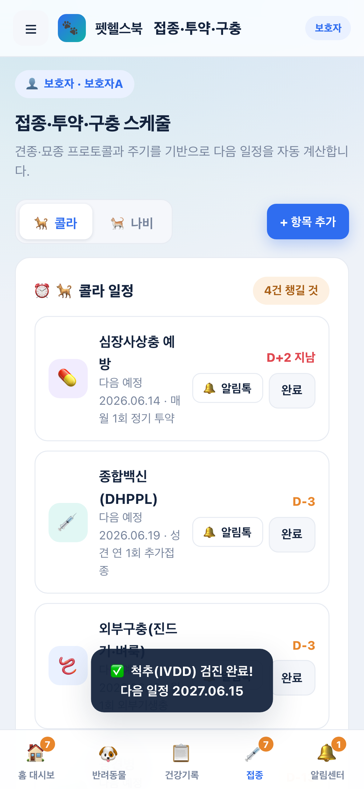
무엇 / 완료 재계산·토스트. 검토 / 재계산 반영.

**⑦ 건강 리포트 (위험 스코어·BCS)**
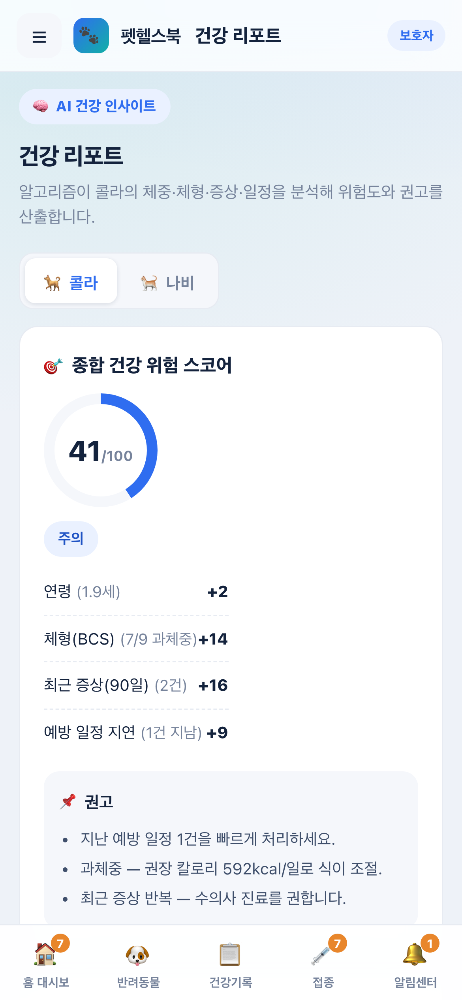
무엇 / 위험 스코어 게이지·요인 가중·권고가 풀폭 세로 스택. 의도 / 알고리즘 모바일 적응. 검토 / 게이지 렌더·가중치 정상.

**⑧ 리포트 체중 추세·이상치**
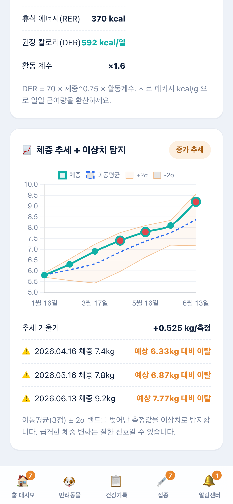
무엇 / 체중 추세 차트·이상치 목록. 검토 / 차트 고정높이 렌더(빈 박스 없음).

**⑨ 보험청구 목록**
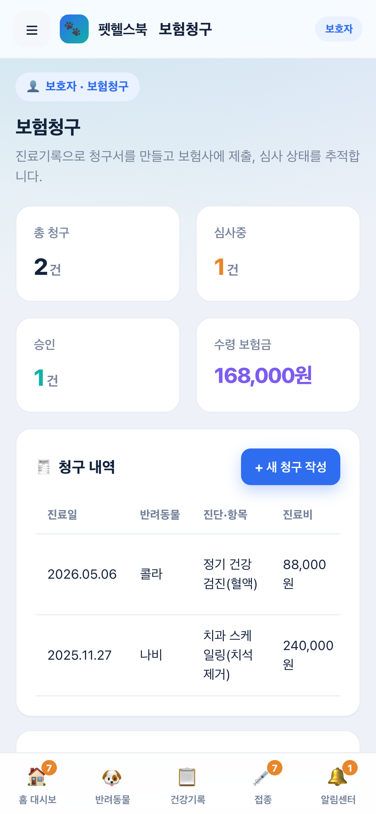
무엇 / KPI 2열 + 청구 테이블 가로 스크롤 컨테이너. 검토 / 테이블 열 접근 가능·잘림 없음.

**⑩ 청구 상세 흐름**
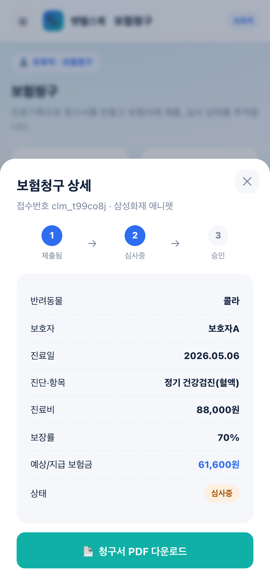
무엇 / 바텀시트 상태 트래커·명세·PDF 버튼. 검토 / 단계·금액 정상.

**⑪ 데이터·연동**
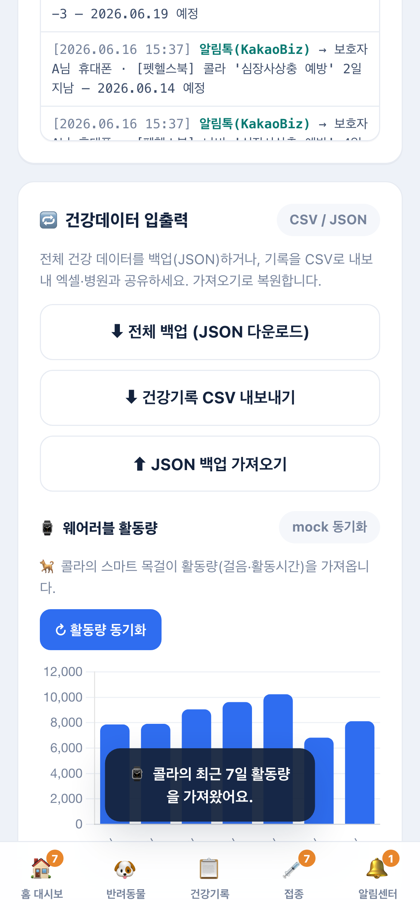
무엇 / 알림톡 로그·CSV/JSON 풀폭 버튼·웨어러블 막대 차트. 검토 / 로그·차트 렌더 정상.

**⑫ 알림센터**
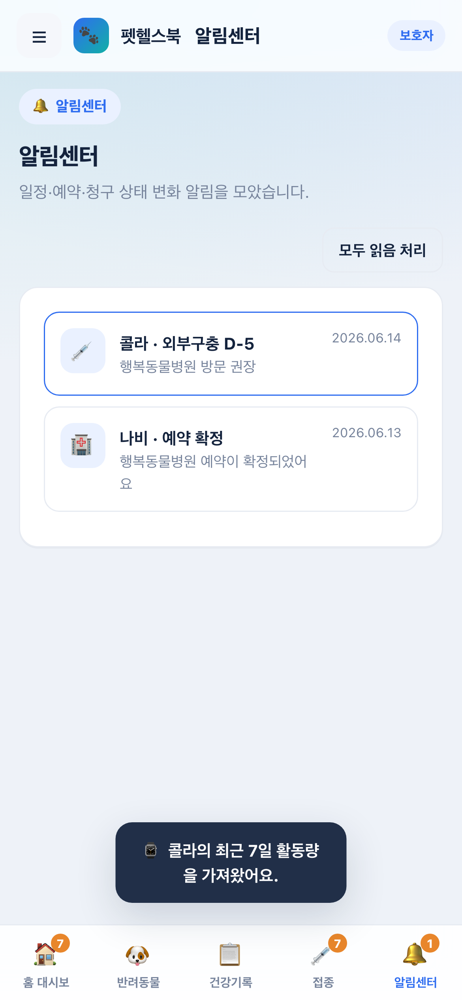
무엇 / 풀폭 알림 카드. 검토 / 읽음 강조·시간 정상.

**⑬ 수의사 대시보드**
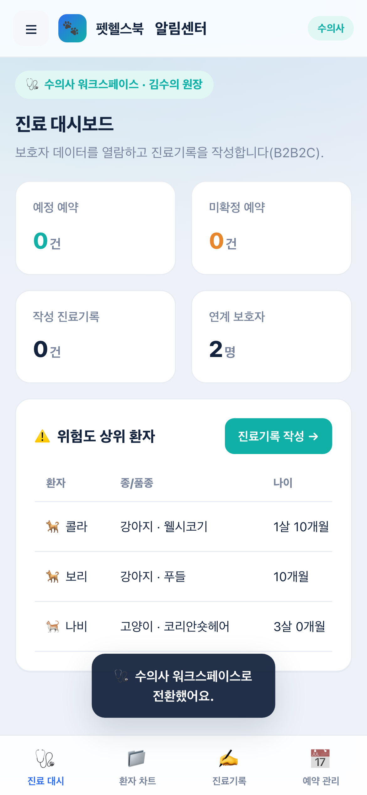
무엇 / 틸 테마·KPI 2열·환자 랭킹 테이블(가로 스크롤). 검토 / 역할 테마·테이블 정상.

**⑭ 수의사 환자 차트**
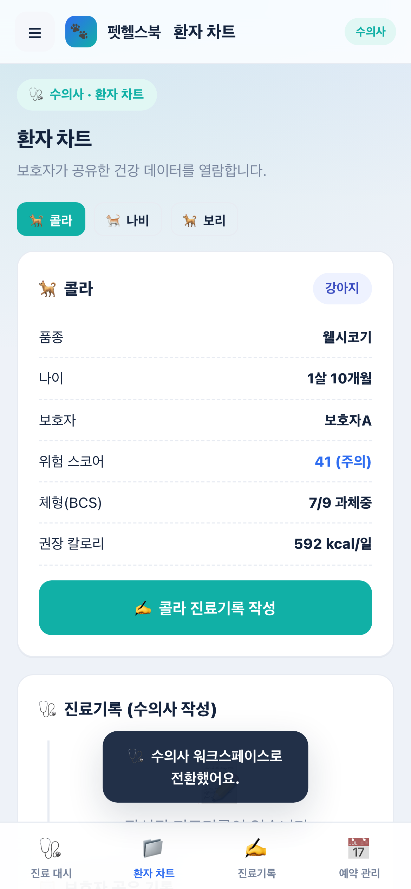
무엇 / 틸 펫 칩·풀폭 환자 카드·진료기록 타임라인. 검토 / 세로 스택 정상.

**⑮ 진료기록 작성**
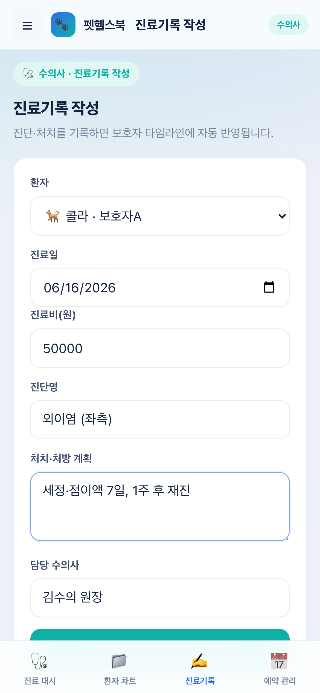
무엇 / 풀폭 진료기록 폼. 검토 / 폼·셀렉트 정상.

**⑯ 진료기록 저장 반영**
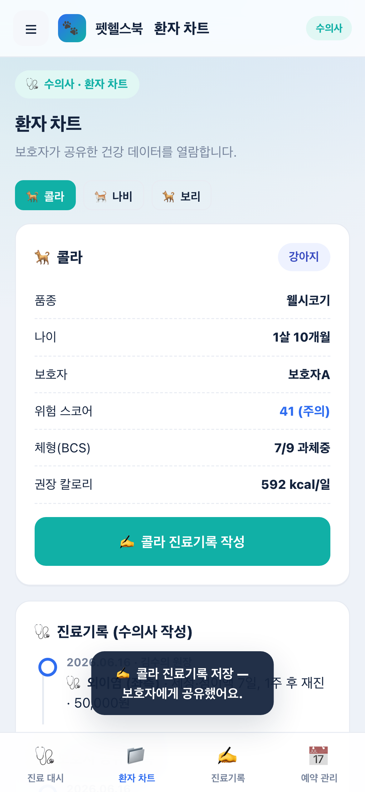
무엇 / 저장 후 보호자 타임라인 반영. 검토 / 동기·토스트 정상.

**⑰ 보험사 대시보드**
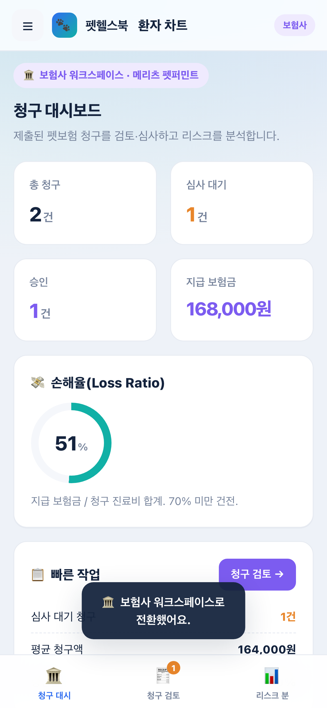
무엇 / 퍼플 테마·손해율 게이지(세로 스택)·통계. 검토 / 게이지·역할 테마 정상.

**⑱ 보험사 청구 검토**
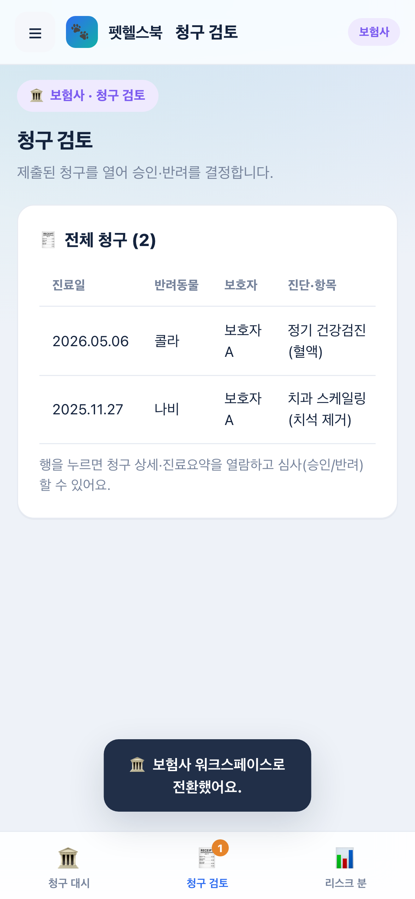
무엇 / 3탭 바텀바·청구 테이블 가로 스크롤. 검토 / 열 접근·잘림 없음.

**⑲ 보험사 청구 심사**
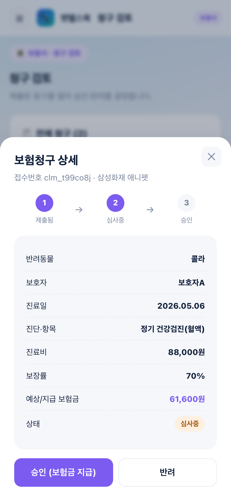
무엇 / 바텀시트 명세·승인/반려 버튼. 검토 / 심사 액션 정상.

**⑳ 보험사 리스크 분석**
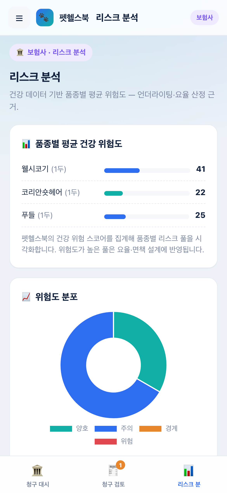
무엇 / 품종 위험 바·도넛 차트 세로 스택. 검토 / 차트 렌더 정상.

**㉑ 모바일 오프캔버스 드로어 (역할 전환)**
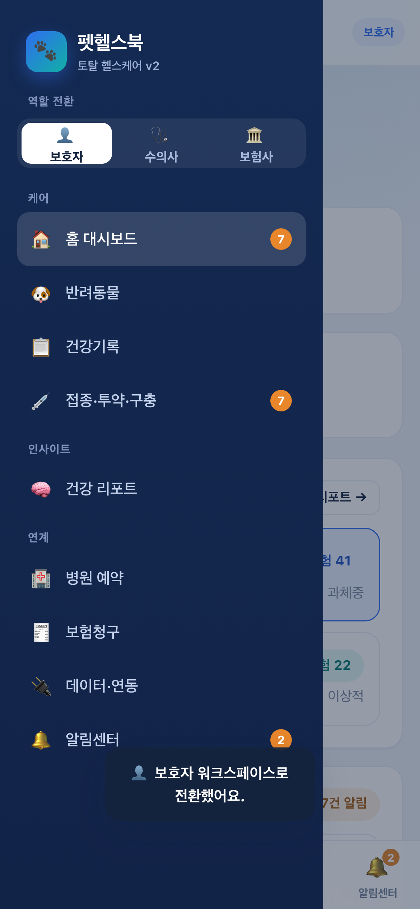
무엇 / 햄버거로 슬라이드 인한 드로어(역할 스위처 + 전체 메뉴), 백드롭 딤. 의도 / 사이드바 그대로 노출 금지·드로어 재구성 입증. 검토 / 드로어 슬라이드·백드롭·역할 전환 정상.

**㉒ 모바일 리포트 스크롤된 본문**
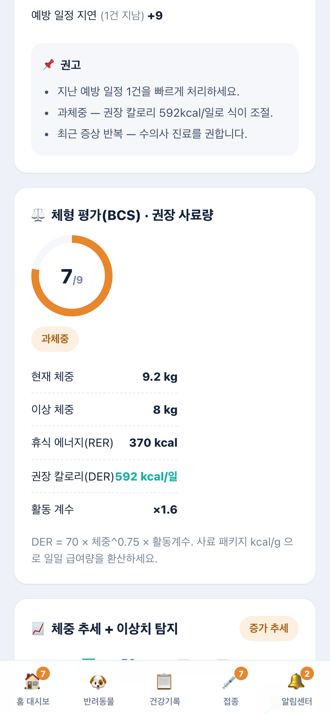
무엇 / 리포트를 아래로 스크롤한 본문(BCS 게이지·추세 차트 헤더). 의도 / 상단만이 아닌 전체 가독 확인. 검토 / 풀폭·바텀바 가림 없음.

## 6. 검수 기준 충족 여부 (과업지시서 §5)

| # | 검수 항목 | 합격 조건 | 결과 | 측정값/근거 |
|:---:|:---|:---|:---:|:---|
| 1 | 멀티 역할 데모 | 16뷰·3역할·`file://` | ✅ | PC/모바일 01~20, 역할 전환 즉시 분기 |
| 2 | 체중 추세·이상치 | 밴드·이상치·기울기 | ✅ | PC 08(이상치 3건·+0.525kg) |
| 3 | BCS·권장 사료량 | BCS·RER/DER | ✅ | PC 07(7/9·DER 592kcal) |
| 4 | 위험 스코어 | 가중·등급·권고 | ✅ | PC 07(41/100 주의·요인 가중) |
| 5 | 견종 프로토콜 | 품종 검진 자동 | ✅ | PC 02(웰시코기 척추 IVDD) |
| 6 | 수의사 워크스페이스 | 4뷰·작성→반영 | ✅ | PC 13~16(보호자 타임라인 동기) |
| 7 | 보험사 워크스페이스 | 3뷰·심사·리스크 | ✅ | PC 17~20 |
| 8 | 알림톡 로그 | 발송 로그 기록 | ✅ | PC 11(타임스탬프·수신자·메시지) |
| 9 | 청구 상태추적 | 제출→심사→승인/반려 | ✅ | PC 10·19 |
| 10 | CSV/JSON | 백업·복원·CSV | ✅ | PC 11(blob 다운로드·import) |
| 11 | 웨어러블 | 동기화·차트 | ✅ | PC 11(막대 차트) |
| 12 | PDF 3종 | 한글 0 깨짐 | ✅ | canvas 렌더 방식(구조적 회피) |
| 13 | 반응형 | overflow·하이재킹·빈 차트 0 | ✅ | mobile/v2 전체 눈검수 통과 |
| 14 | 캡처 패키지 | PC≥10·모바일≥10 | ✅ | PC 20 / 모바일 22 |

## 7. 추가 확장 가능 영역 (중립)

- 정식 단계에서는 동일 클라이언트 로직 위에 실 동기화 백엔드·실 알림톡 발송·실 보험사/병원 API·실 웨어러블 SDK를 얹는다. v2의 알고리즘 엔진·역할 RBAC 모델·청구 상태 머신·통합 인터페이스는 그대로 정식 백엔드 위에 이식되도록 설계되었다.

## 8. 검토 체크리스트

- [x] 모든 핵심 기능이 캡처되었는가 — 16뷰·3역할·4알고리즘·4통합·3워크플로 전부
- [x] 캡처가 의도한 기능을 정확히 보여주는가 — 위험스코어·이상치·청구흐름·역할분기 포함
- [x] 한글이 깨지지 않는가 — 화면·PDF(canvas 렌더) 모두 정상
- [x] 에러 화면이 의도치 않게 캡처되지 않았는가 — 없음
- [x] 결과물(스코어·BCS·기울기·보험금)의 정확도가 충분한가 — 계산 재현성 확인
- [x] 과업지시서 검수 기준 항목 100% 매핑되었는가 — §6 표 14항목
- [x] (v2 한정) v1 한계 매핑표 + 5억 가치 기준(실 알고리즘·멀티역할·외부통합 2건+·뷰 8종+·캡처 10장+) 충족 — 상단 매핑표·§2·§5
- [x] PC·모바일 캡처를 폴더 나눠 저장 + 눈으로 확인 — `captures/v2`·`captures/mobile/v2`, §0 절차로 PNG 직접 확인
