last_updated: 2026-06-16 18:50

# 5_1_개발결과보고서 v3 — 반려동물 토탈 헬스케어 SaaS 「펫헬스북」 (시리즈A 데모)

> 본 보고서는 [`5_과업지시서_v3.md`](./5_과업지시서_v3.md) §5 성과품 목록의 **검수 증거** 문서다.
> v3는 v2의 부족함을 메우는 사이클이다. 모든 스크린샷은 [`projects/pet-health/v3.html`](../projects/pet-health/v3.html)을 Playwright로 **실제 구동**해 얻은 것이다(목업·합성 없음). PC 1280×800 → [`captures/v3/`](./captures/v3/), 모바일 390×844(isMobile·hasTouch) → [`captures/mobile/v3/`](./captures/mobile/v3/). v1.html·v2.html은 보존되었다(덮어쓰기 없음).

---

## v2 한계 및 v3 개선 매핑

| # | v2 한계 | v3 해결 방식 | 증거 |
|:---:|:---|:---|:---|
| 1 | **알고리즘이 기술적(BCS·이상치)** — 질환 단위 예측 부재 | **질병 위험 예측 — 로지스틱 회귀**: 연령·BCS·증상·지연·견종을 피처로 `sigmoid(w·x+b)` 질환별 발병 확률 | PC 08 / 모바일 08 |
| 2 | **성장 단계 평가 없음** — 체중 추세만 | **성장곡선 percentile**: 품종 표준 대비 z-score→정규 CDF percentile·실측/기대 곡선 | PC 08(우) / 모바일 26 |
| 3 | **투약 안전성 점검 없음** | **약물 상호작용 체크**: 약물 DB·룰 기반 major/moderate/minor 탐지 | PC 09 / 모바일 09 |
| 4 | **3역할(병원은 수의사로만)** — 병원 운영 주체 부재 | **병원 admin 역할 신설** → 4역할 RBAC(운영 대시보드·캘린더) | PC 17·18 / 모바일 17·18 |
| 5 | **통합이 클라이언트 내부 중심** — 병원·캘린더 연동 없음 | **EMR 양방향 연동·캘린더 동기화** mock 추가(진료기록 pull→타임라인 반영) | PC 17·18 |
| 6 | **단일 보험사·웨어러블 단순 동기화** | **다보험사(3개사) 청구 라우팅 + 웨어러블 OAuth 2.0 인가→동기화** | PC 10·12 |
| 7 | **한국어 단일** — 글로벌 데모 불가 | **KO/EN i18n 토글**(셸·내비·역할·라벨, 상태 지속) | PC 23·24 / 모바일 23·24 |
| 8 | 16뷰 | **21뷰**(보호자 10·수의사 4·보험사 3·병원 admin 3, 예약 공유) | 전 캡처 |

---

## v3 신규/심화 산출물

### A. 고급 알고리즘 3종 (v2의 4종 위에 추가)

1. **질병 위험 예측 (로지스틱 회귀)** — 피처 `[연령 정규화, BCS 이탈, 최근증상(90일), 일정지연, 견종 플래그]`에 질환별 가중 `w`·절편 `b`를 적용해 `z=w·x+b`, `sigmoid(z)`로 **질환별 발병 확률**을 산출하고 내림차순 정렬·최우선 위험을 권고한다. 견·묘 종별 질환 모델(예: 견 — 척추 IVDD·슬개골·심장·치주·대사질환 / 묘 — 만성 신장질환·당뇨·FLUTD·구강). 콜라(웰시코기)의 척추 IVDD 59.3%가 최우선으로 산출됨(견종 위험 플래그 가중). (PC 08)
2. **성장곡선 percentile** — 품종 표준 성체 체중(평균·표준편차)과 월령 성숙 시그모이드로 기대치를 만들고, z-score를 정규분포 CDF로 변환해 **percentile**과 표준 미만/초과 밴드를 판정. 실측/기대 두 곡선을 차트로 표시. (PC 08 우측, 모바일 26)
3. **약물 상호작용 체크** — 현재 투약 약물을 클래스로 매핑한 뒤 룰 기반으로 충돌 페어를 탐지(major/moderate/minor)하고 설명을 제시. 콜라의 **NSAIDs + 스테로이드 = major(병용 금기)**가 탐지됨. 약물 추가 시 즉시 재점검. (PC 09)

### B. 병원 admin 역할 — 4역할 RBAC 완성

- v2의 보호자(인디고)·수의사(틸)·보험사(퍼플)에 **병원 admin(주황)** 추가. 운영 대시보드(미확정/확정 예약·환자 수·기록 매출·EMR 상태·위험 상위 환자), 예약·진료 캘린더(확정·캘린더 동기화), 환자 차트를 제공. 역할 전환 시 내비게이션·뷰·테마·바텀탭이 즉시 분기. (PC 17·18)

### C. 외부 통합 확장 4종 (v2의 4종 위에 추가, 모두 키 0 mock)

- **EMR 양방향 연동** — 병원 admin이 EMR(iVET) 연결 → 진료기록 1건을 pull → **보호자 타임라인·수의사 기록에 동시 반영**, 연결 상태·최근 동기화·가져온 기록 수·발송 로그 기록. (PC 17)
- **다보험사 청구 API** — 청구 작성 시 3개 보험사(삼성화재·메리츠·DB) 중 선택해 보험사 API(mock)로 라우팅·접수번호 발급. (PC 10·12)
- **웨어러블 OAuth 2.0** — 인가 흐름 mock으로 access_token 발급·로그 기록, **인가 후에만** 활동량 동기화 허용(미인가 시 안내). (PC 12)
- **캘린더 동기화** — 병원 admin이 외부 캘린더(구글) 연결 → 예약·접종 일정 push 동기화, 동기화 일정 수·최근 시각 표시. (PC 18)

### D. i18n (KO/EN)

- 언어 토글을 사이드바·드로어·모바일 상단바에 노출, UI 셸·내비게이션·역할·섹션·핵심 라벨을 사전 기반 전환하고 localStorage로 언어를 지속(새로고침 후 유지). (PC 23·24, 모바일 23·24)

---

## 1. 성과품 매핑 (과업지시서 §5 ↔ 납품)

| # | 과업지시서 성과품 | 납품 산출물 | 위치/증거 |
|:---:|:---|:---|:---|
| 1 | 시리즈A 데모(v3) | v3.html(21뷰·4역할), v1·v2 보존 | `projects/pet-health/v3.html` |
| 2 | 질병 위험 예측(로지스틱) | 질환별 확률·정렬·최우선·권고 | PC/모바일 08 |
| 3 | 성장곡선 percentile | 실측/기대 곡선·percentile·판정 | PC 08(우)·모바일 26 |
| 4 | 약물 상호작용 | major/moderate/minor 탐지·재계산 | PC/모바일 09 |
| 5 | 병원 admin 워크스페이스 | 운영 대시보드·캘린더·환자차트 | PC/모바일 17·18 |
| 6 | EMR 양방향 연동 | 진료기록 pull→양쪽 반영·상태·로그 | PC 17·12 |
| 7 | 다보험사 청구 API | 3개사 라우팅·접수·심사 | PC 10·12·20·21 |
| 8 | 웨어러블 OAuth | 토큰 발급 로그·인가 후 동기화 | PC 12 |
| 9 | 캘린더 동기화 | 일정 push·동기화 수 | PC 18 |
| 10 | i18n(KO/EN) | 셸·내비·라벨 전환·지속 | PC/모바일 23·24 |
| 11 | 반응형 | 4역할·KO/EN 모바일 적응·overflow 0 | mobile/v3 전체 |
| 12 | 캡처 패키지 | PC 24장 + 모바일 26장 | `captures/v3`·`captures/mobile/v3` |

## 2. 구현/제작 범위

- **뷰 21종**: 보호자 10(홈·반려동물·건강기록·스케줄·건강리포트·**질병 위험 예측**·병원예약·보험청구·데이터연동·알림센터) + 수의사 4 + 보험사 3 + **병원 admin 3**(운영 대시보드·예약 캘린더·환자 차트).
- **워크플로 3개+**: ① 펫 등록 → 프로토콜 자동 시드 → D-day → 알림톡, ② 진료기록(수의사/EMR pull) → 보호자 타임라인 반영 → 알림, ③ 진료 선택 → 다보험사 청구서 → 제출 → 심사 → 승인/반려, (+ ④ 웨어러블 OAuth 인가 → 활동량 동기화, ⑤ 병원 EMR·캘린더 연동).
- **실 알고리즘 7종**(v2 4 + v3 3) + **외부 통합 mock 8종**(v2 4 + v3 4).
- **실동작 액션**: 사진 업로드·미리보기, localStorage 영속(역할·언어·연동상태·로그·청구 포함), 주기 자동 계산·완료 재계산, jsPDF PDF 3종(canvas 렌더, 한글 깨짐 0), CSV/JSON 입출력, 차트 5종(추세·활동량·리스크 도넛·체중·**성장곡선**).
- **반응형**: 모바일(≤767px) 오프캔버스 드로어(역할 전환·언어) + 역할별 바텀탭, PC(≥768px) 사이드바 256px. 인증 없이 즉시 사용(데모 시드: 보호자A 콜라·나비, 보호자B 보리).

## 3. 환경

| 항목 | 값 |
|:---|:---|
| OS | macOS (Darwin 24.6.0) |
| 런타임 | Node.js + Playwright(Chromium) |
| 구동 방식 | `file://` 단일 HTML (외부 서버 없음) |
| 라이브러리 | Chart.js 4.4.1(CDN), jsPDF 2.5.1(CDN) |
| 캡처 뷰포트 | PC 1280×800 / 모바일 390×844(isMobile, hasTouch) |
| 저장 | localStorage(`pethealthbook.v3`) |

## 4. 실행/구동 방법

```bash
# 1) 데모 실행 (브라우저에서 직접 열기)
open 2026-saas-pet-health/projects/pet-health/v3.html

# 2) 캡처 재현 (Playwright)
cd 2026-saas-pet-health/projects/pet-health
npm i -D playwright && npx playwright install chromium
node capture.mjs        # PC → biz/captures/v3, 모바일 → biz/captures/mobile/v3
rm -rf node_modules package.json package-lock.json   # 캡처 후 정리
```

## 5. 화면·실물 캡처

### 5.1 PC (데스크톱 1280×800) — `./captures/v3/`

**① 보호자 멀티펫 홈 대시보드**
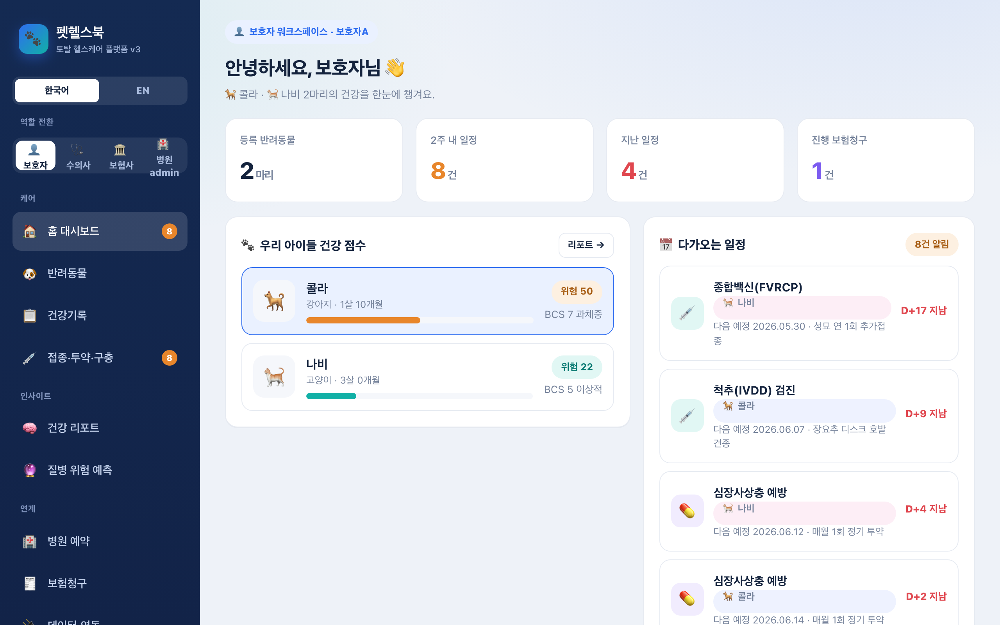
무엇 / KPI 4종·멀티펫 위험 카드(위험 스코어 바·BCS)·통합 다가오는 일정. 의도 / 여러 마리 위험·일정 동시 파악. 검토 / 사이드바 256px·역할 스위처·언어 토글·overflow 0 정상.

**② 반려동물 프로필 (견종 프로토콜)**
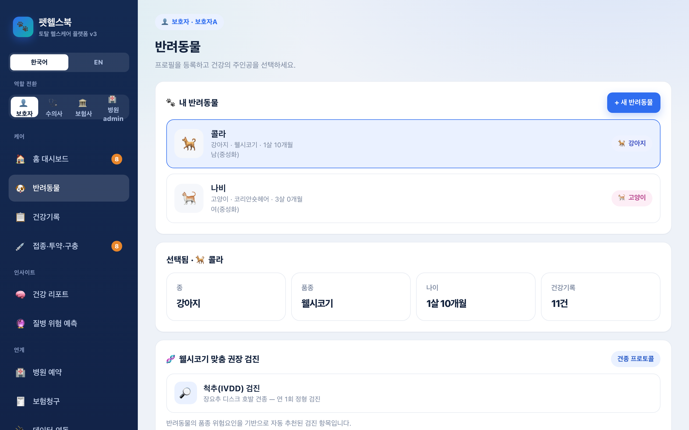
무엇 / 콜라·나비 카드 + 선택 펫 상세 + 견종 맞춤 권장 검진. 검토 / 품종 위험 검진 자동 노출.

**③ 건강기록 타임라인**
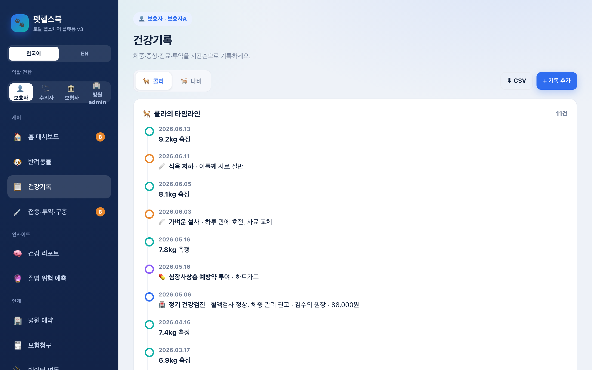
무엇 / 체중·증상·진료·투약 시간순 타임라인·CSV 버튼. 검토 / 날짜 내림차순·색상·한글 정상.

**④ 접종·투약·구충 스케줄 (D-day 자동계산)**
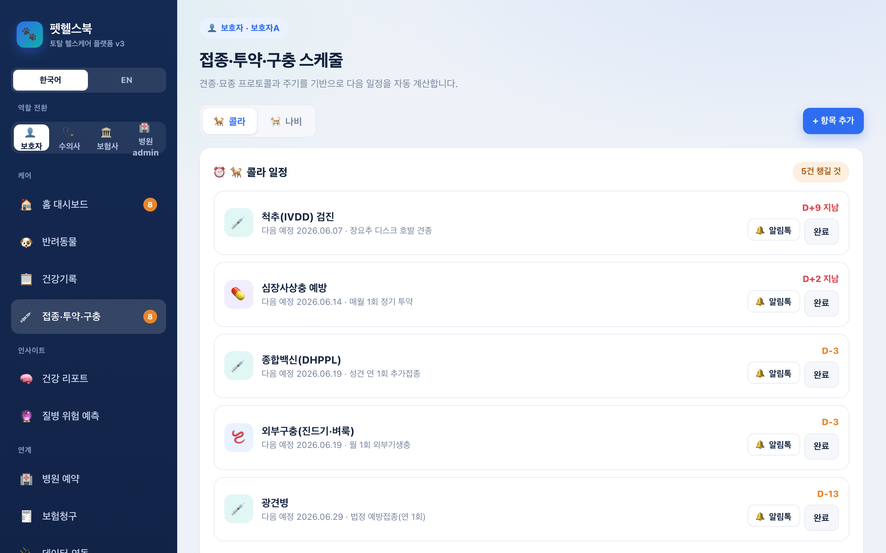
무엇 / 항목별 다음 예정일·D-day·완료/알림톡 버튼. 검토 / 지남=빨강/임박=주황/여유=틸 정렬·색상 정상.

**⑤ 완료 처리 → 다음 일정 자동 재계산**
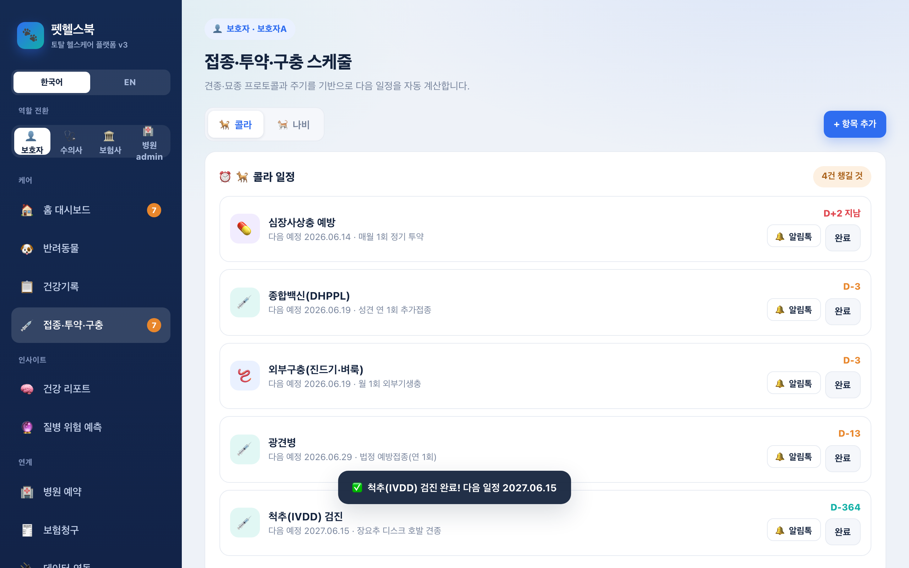
무엇 / 완료 시 재계산·토스트. 검토 / 다음일=오늘+주기, 타임라인 자동 기록.

**⑥ 건강 리포트 — 위험 스코어·BCS·권장 사료량 (v2 알고리즘)**
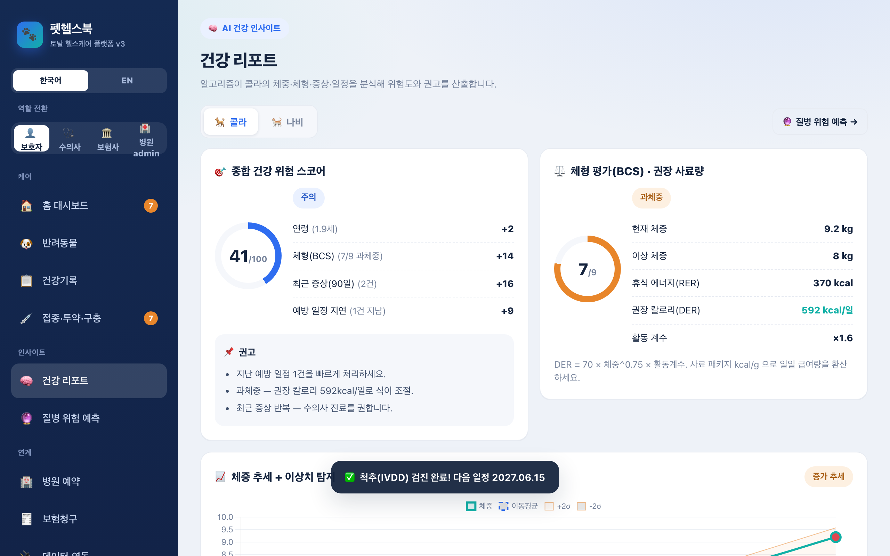
무엇 / 위험 스코어 게이지·요인 가중·권고 + BCS·RER/DER + 질병 예측 진입 버튼. 검토 / 게이지·가중치·권고 정상.

**⑦ 건강 리포트 — 체중 추세 + 이상치 탐지**
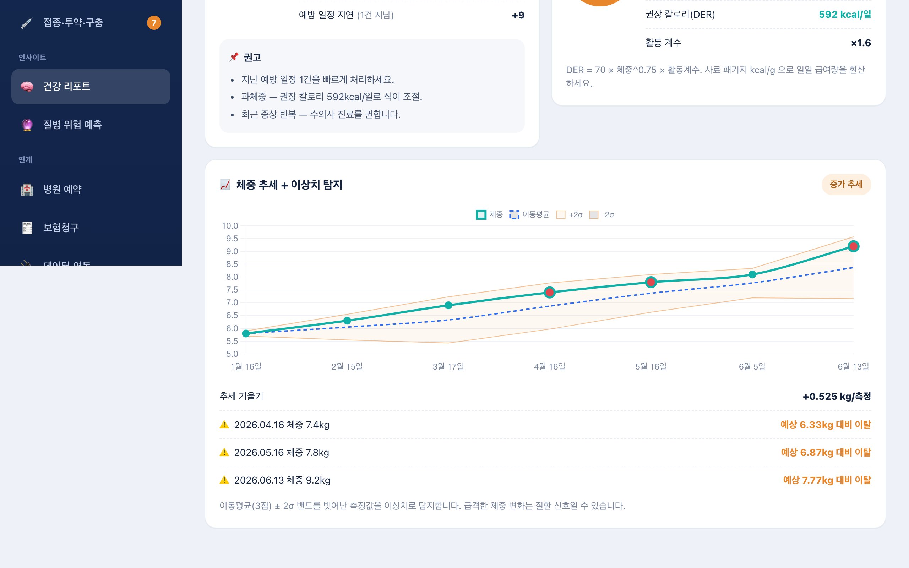
무엇 / 체중 라인 + 이동평균(파선) + ±2σ 밴드·이상치 목록·기울기. 검토 / 밴드·이상치·기울기 정상.

**⑧ 질병 위험 예측 (로지스틱) + 성장곡선 percentile** [v3 신규]
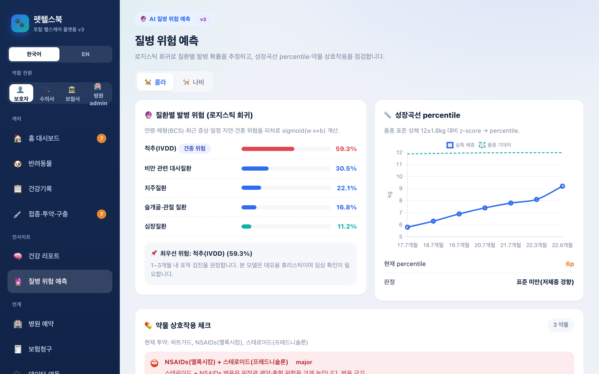
무엇 / 질환별 발병 확률 바(척추 IVDD 59.3% 최우선·견종 위험 플래그) + 성장곡선 percentile 차트(실측/기대 곡선)·현재 percentile·표준 판정. 의도 / 로지스틱 회귀·성장 percentile 입증. 검토 / 확률 내림차순·곡선·판정 정상 렌더.

**⑨ 질병 위험 예측 — 약물 상호작용 체크** [v3 신규]
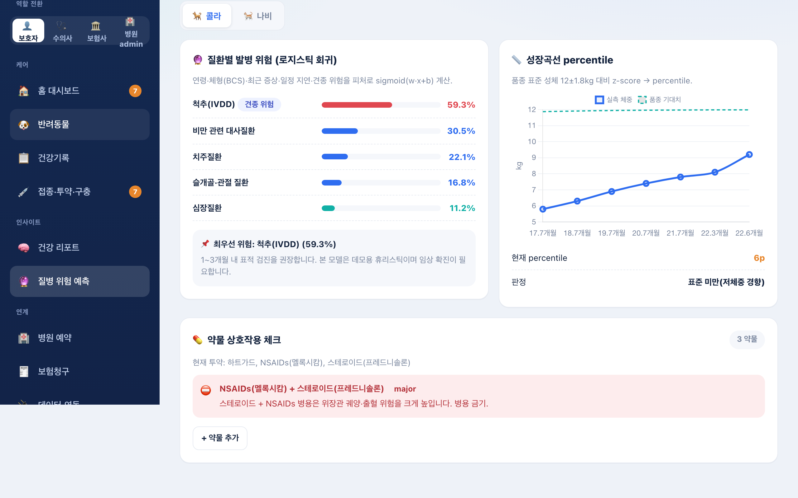
무엇 / 현재 투약 목록 + NSAIDs+스테로이드 **major(병용 금기)** 경고 카드 + 약물 추가 버튼. 의도 / 룰 기반 상호작용 탐지. 검토 / 심각도 색상·설명·재계산 진입 정상.

**⑩ 보험청구 목록 (다보험사)**
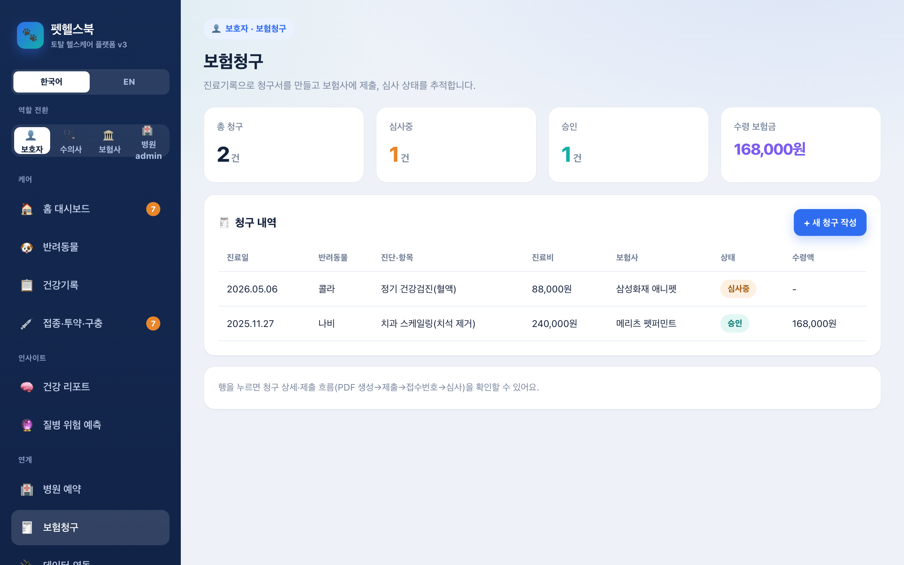
무엇 / KPI + 청구 테이블(상태 칩·보험사·수령액). 검토 / 다보험사 표기·상태 pill·금액 정상.

**⑪ 보험청구 상세 — 제출→심사→승인 흐름**
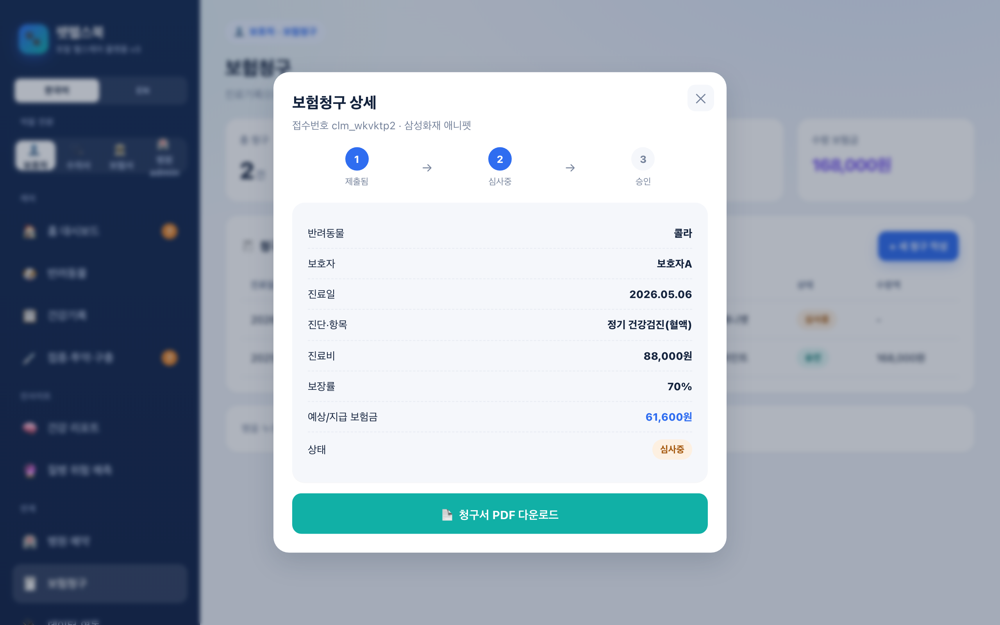
무엇 / 3단계 상태 트래커 + 청구 명세(보장률·예상 보험금) + 청구서 PDF 버튼. 검토 / 단계·금액 산정 정상.

**⑫ 데이터·연동 (웨어러블 OAuth + 연동 현황)** [v3 심화]
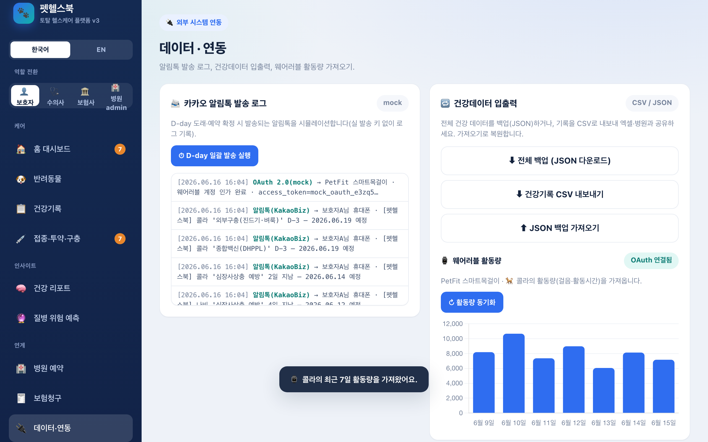
무엇 / 알림톡 로그 + **OAuth 2.0 인가 토큰 발급 로그** + 웨어러블 활동량 차트(OAuth 연결됨) + CSV/JSON + 외부 시스템 연동 현황(EMR·캘린더·웨어러블·보험사). 의도 / OAuth 흐름·다중 통합 입증. 검토 / 토큰 로그·차트·연동 상태 정상.

**⑬ 수의사 진료 대시보드**
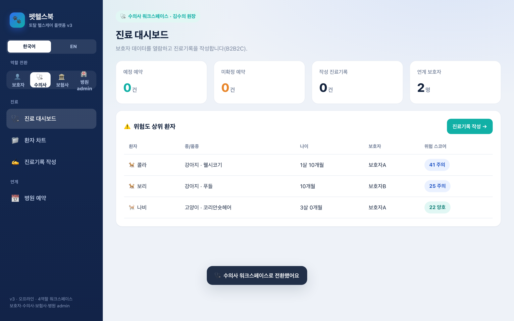
무엇 / 틸 테마·KPI + 위험도 상위 환자 랭킹. 검토 / 역할 테마·위험 칩·테이블 정상.

**⑭ 수의사 환자 차트**
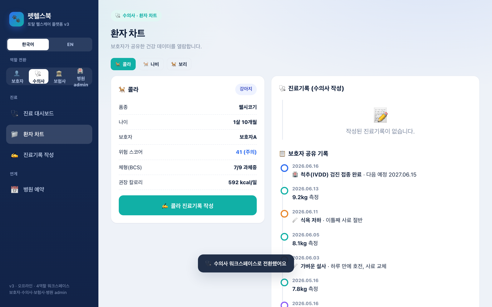
무엇 / 환자 요약(위험·BCS·권장칼로리) + 진료기록 + 보호자 공유 타임라인. 검토 / 좌우 카드·타임라인 정상.

**⑮ 수의사 진료기록 작성**
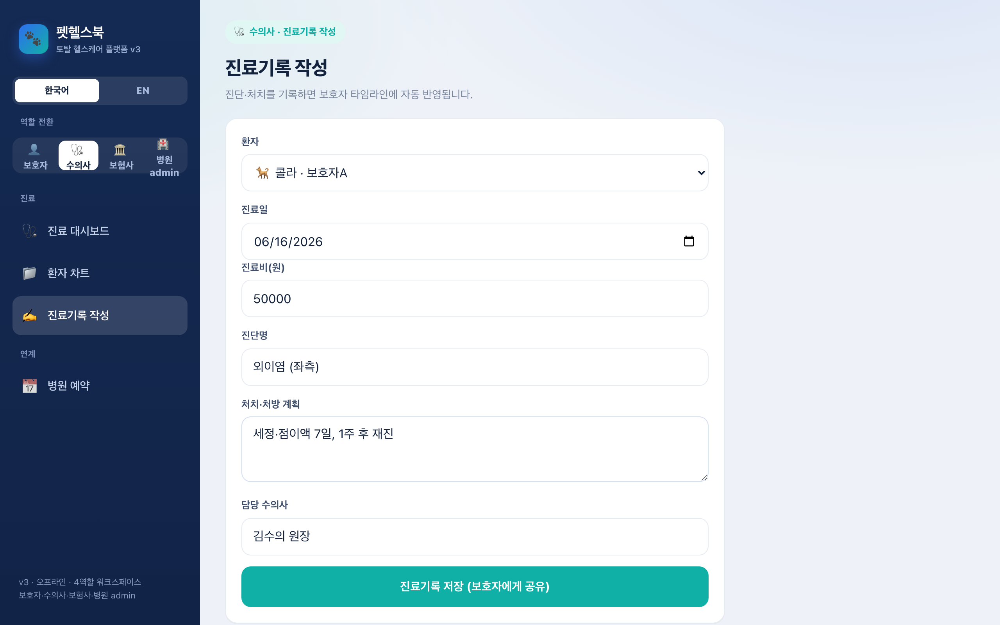
무엇 / 환자·진단·처치·진료비·담당 수의사 폼. 검토 / 폼·셀렉트 정상.

**⑯ 진료기록 저장 → 보호자 타임라인 자동 반영**
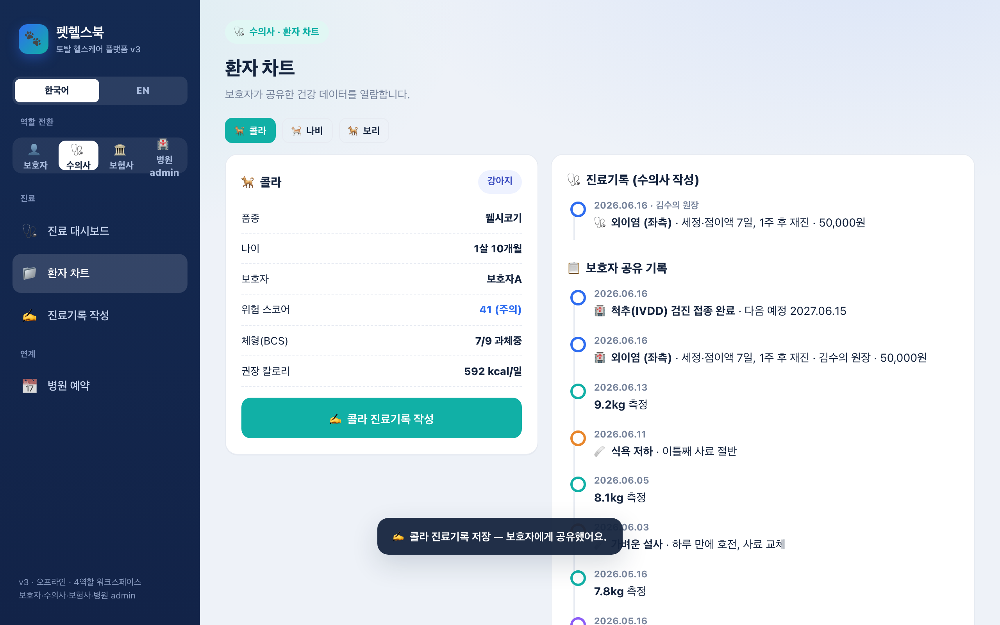
무엇 / '외이염' 저장 후 수의사 기록 + 보호자 공유 기록 동시 반영·알림톡 토스트. 검토 / 양쪽 동기·토스트 정상.

**⑰ 병원 admin 운영 대시보드 + EMR 연동** [v3 신규 역할]
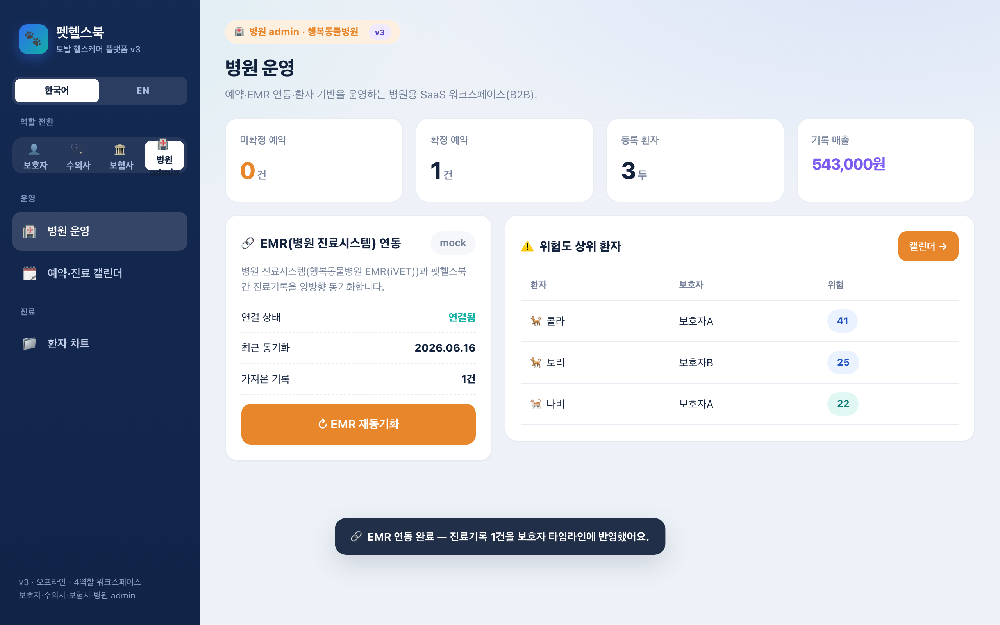
무엇 / 주황 테마·KPI(미확정/확정 예약·환자·기록 매출) + **EMR(iVET) 연동(연결됨·최근 동기화·가져온 기록 1건)** + 위험 상위 환자. 의도 / 4역할 RBAC·EMR 양방향 입증. 검토 / 역할 테마·EMR 상태·테이블 정상.

**⑱ 병원 admin 예약·진료 캘린더 + 캘린더 동기화** [v3 신규]
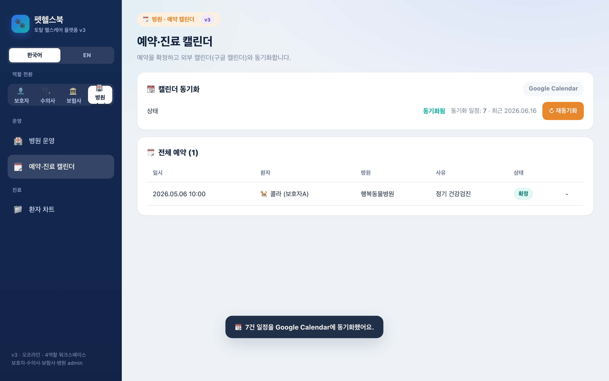
무엇 / 캘린더 동기화(구글 캘린더·동기화 일정 7건) + 전체 예약 테이블·예약 확정. 의도 / 캘린더 동기화·운영. 검토 / 동기화 상태·예약 테이블 정상.

**⑲ 보험사 청구 대시보드**
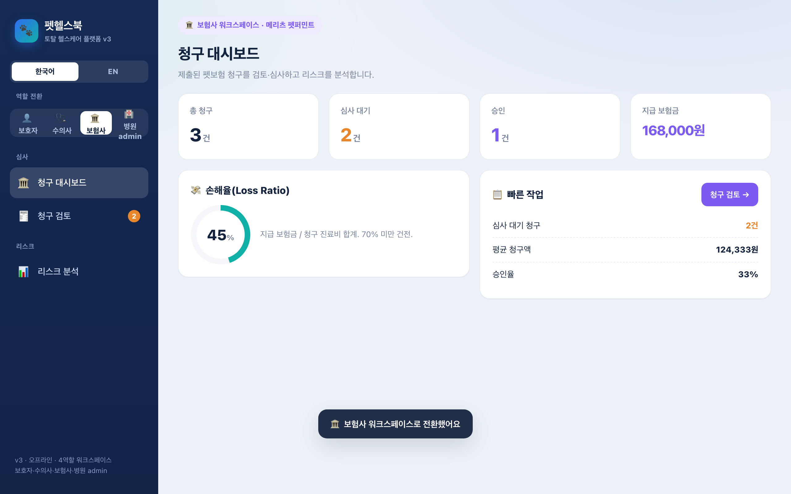
무엇 / 퍼플 테마·KPI + 손해율 게이지 + 빠른 작업. 검토 / 역할 테마·게이지·통계 정상.

**⑳ 보험사 청구 검토 목록 (다보험사)**
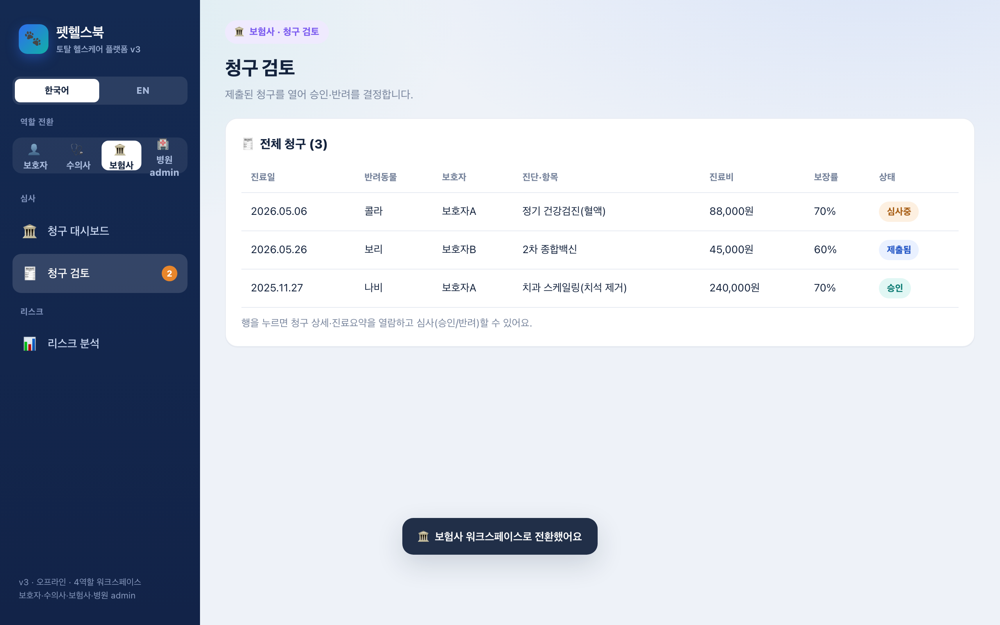
무엇 / 전체 청구 테이블(상태 정렬·보장률·보험사). 검토 / 다보험사·심사 대기 우선 정렬 정상.

**㉑ 보험사 청구 심사 (승인/반려)**
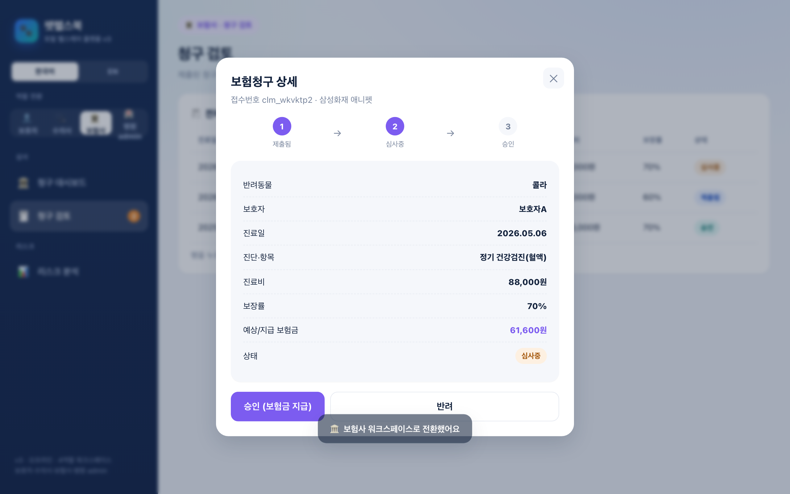
무엇 / 청구 상세 + 승인(보험금 지급)/반려 버튼. 검토 / 명세·심사 액션 정상.

**㉒ 보험사 리스크 분석**
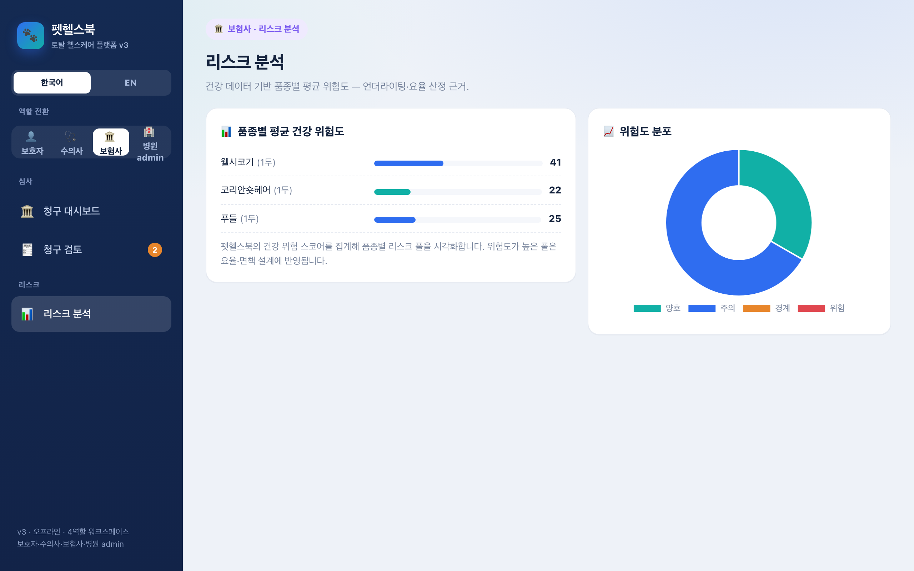
무엇 / 품종별 평균 위험도 바 + 위험도 분포 도넛. 검토 / 바·도넛·범례 정상.

**㉓ i18n — English 홈 (언어 토글)** [v3 신규]
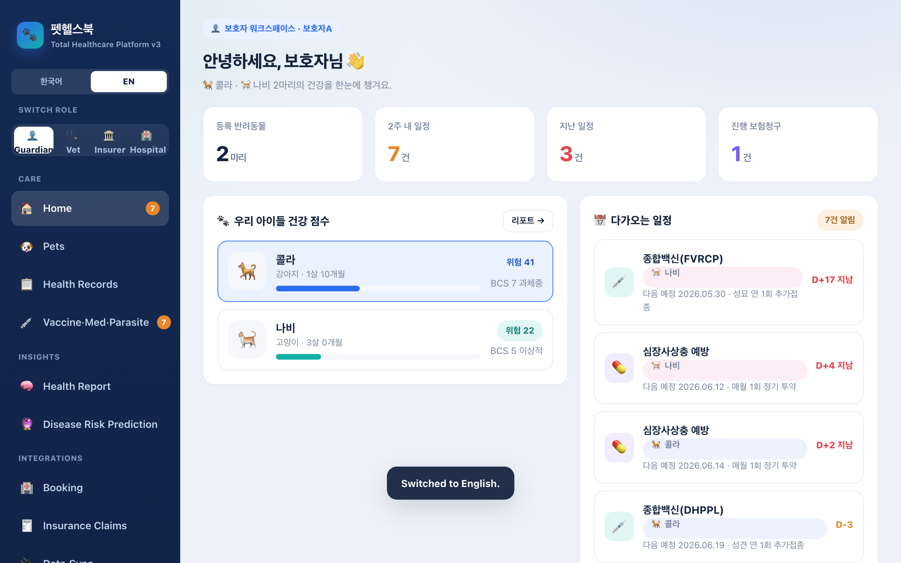
무엇 / 언어 토글 EN 활성, 사이드바 내비(Home·Pets·Health Records·Disease Risk Prediction·Booking·Insurance Claims)·역할(Guardian/Vet/Insurer/Hospital)·"Total Healthcare Platform v3" 영문 전환. 의도 / KO/EN i18n 입증. 검토 / 셸·내비·라벨 영문 전환 정상.

**㉔ i18n — English 질병 위험 예측** [v3 신규]
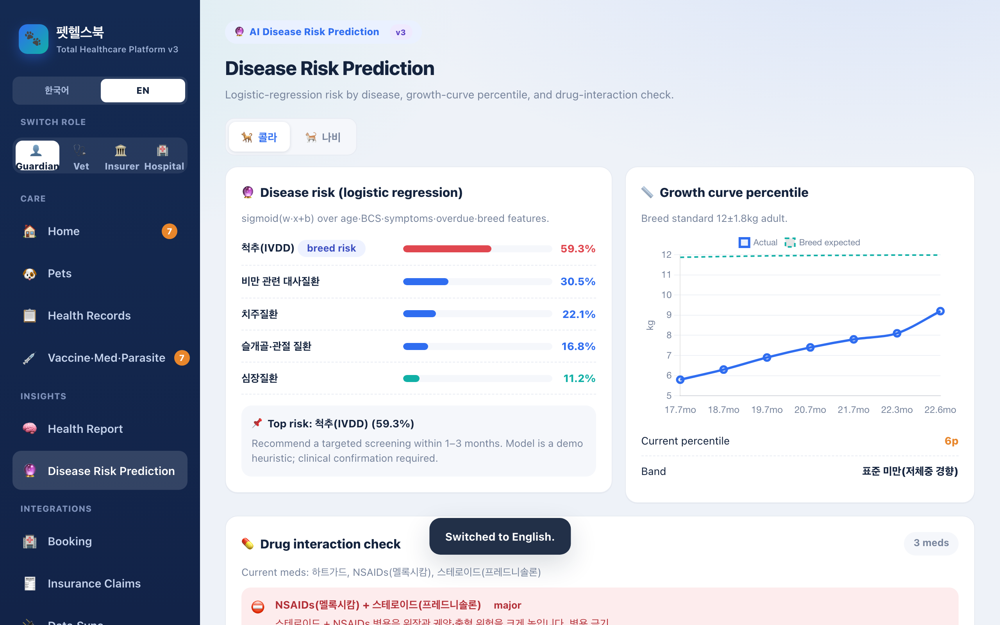
무엇 / "Disease Risk Prediction"·"Disease risk (logistic regression)"·"Growth curve percentile"·"Drug interaction check" 영문. 검토 / 알고리즘 뷰 영문 라벨·차트 정상.

### 5.2 모바일 (390×844) — `./captures/mobile/v3/`

**① 보호자 홈 (바텀탭·드로어 햄버거·언어 토글)**
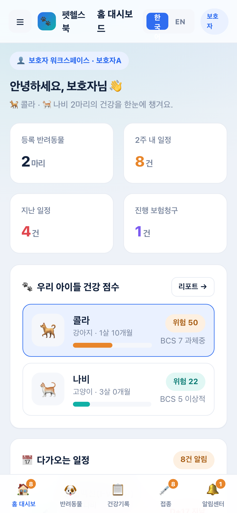
무엇 / 상단 햄버거+브랜드+언어 토글+역할 pill, KPI 2열, 멀티펫 위험 카드 스택, 하단 5탭. 검토 / 사이드바 없음·풀폭·overflow 0.

**② 반려동물**
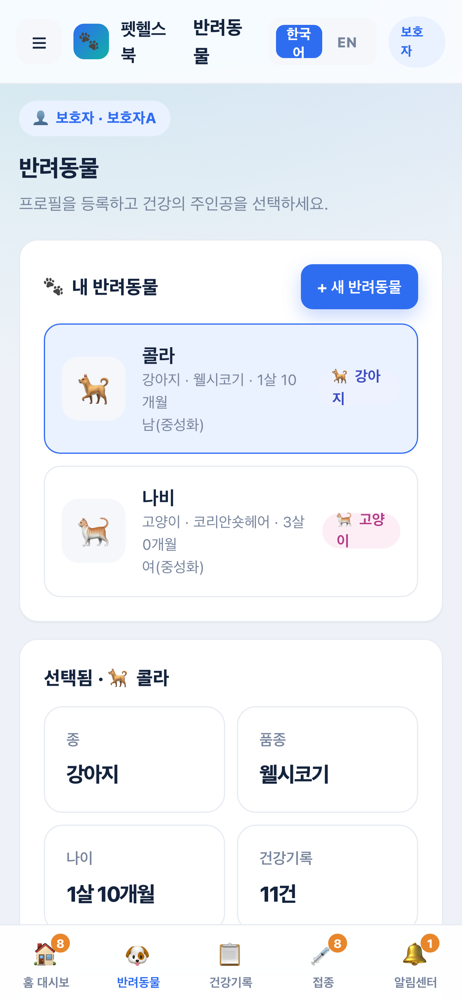
무엇 / 풀폭 펫 카드·통계 2열·견종 검진 카드. 검토 / 비율·세로 스택 정상.

**③ 건강기록**
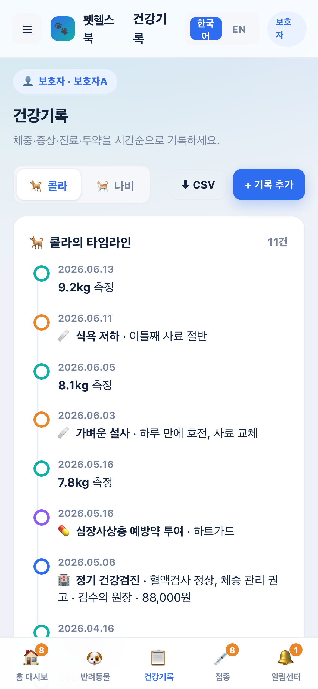
무엇 / 풀폭 타임라인·펫 세그먼트·CSV. 검토 / 쪼개짐 없음·한글 정상.

**④ 스케줄 (D-day)**
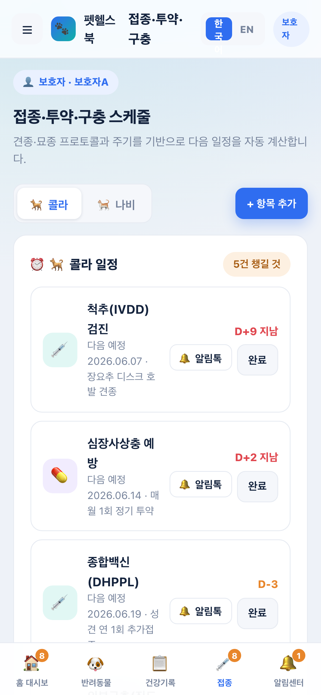
무엇 / 풀폭 스케줄 행·D-day·완료/알림톡. 검토 / 행 레이아웃·색상 정상.

**⑤ 스케줄 완료**
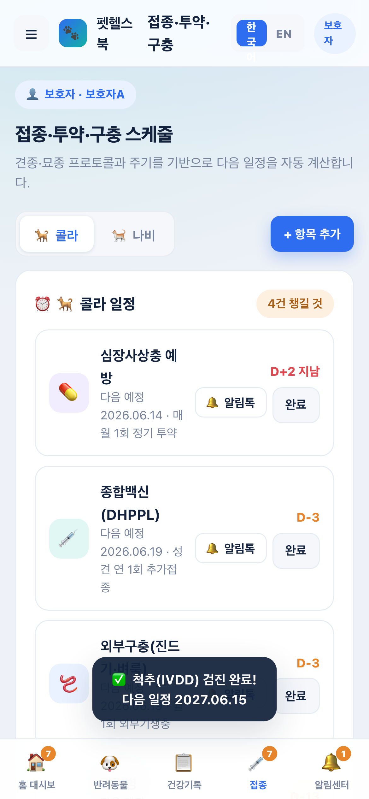
무엇 / 완료 재계산·토스트. 검토 / 재계산 반영.

**⑥ 건강 리포트 (위험 스코어·BCS)**
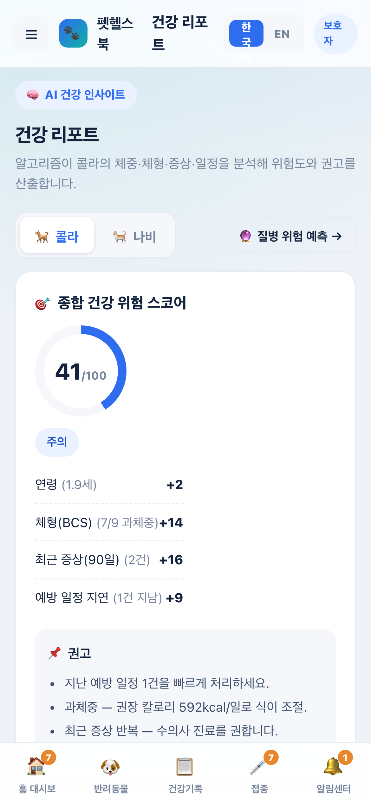
무엇 / 위험 게이지·요인·권고 풀폭 세로 스택. 검토 / 게이지 렌더·가중치 정상.

**⑦ 리포트 체중 추세·이상치**
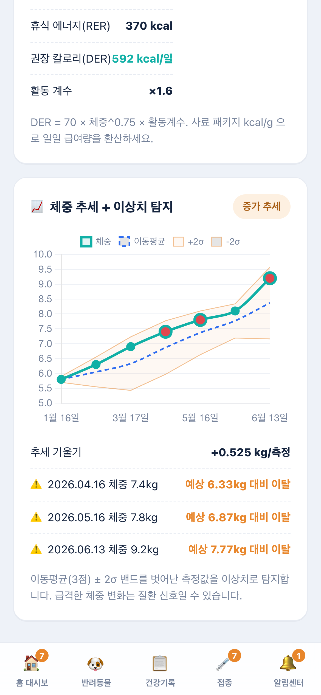
무엇 / 체중 추세 차트·이상치 목록. 검토 / 차트 고정높이 렌더(빈 박스 없음).

**⑧ 질병 위험 예측 (로지스틱)** [v3 신규]
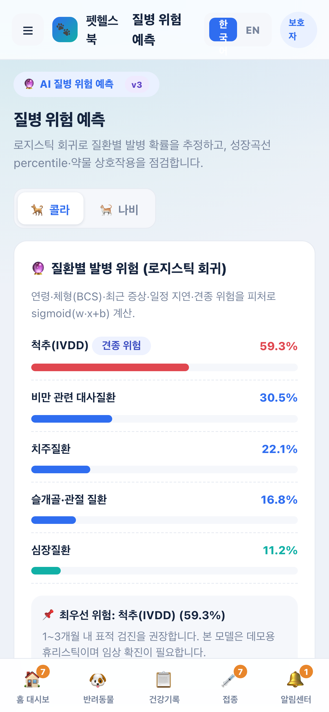
무엇 / 질환별 발병 확률(라벨 위·바 아래 100% 폭으로 스택)·최우선 위험. 의도 / 알고리즘 모바일 적응. 검토 / 풀폭·바 줄바꿈·overflow 0 정상.

**⑨ 약물 상호작용 + 성장곡선** [v3 신규]
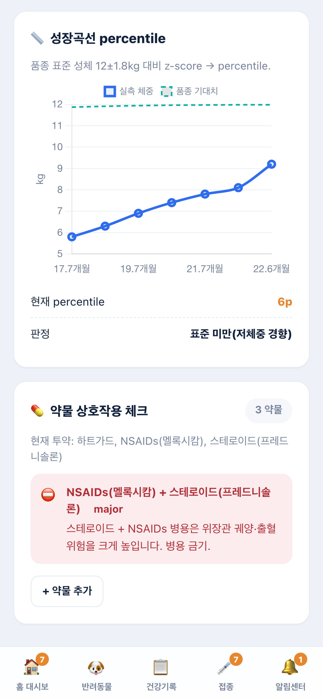
무엇 / 성장곡선 차트 + 약물 상호작용(major 경고)·약물 추가. 검토 / 차트 렌더·경고 카드·세로 스택 정상.

**⑩ 보험청구 목록**
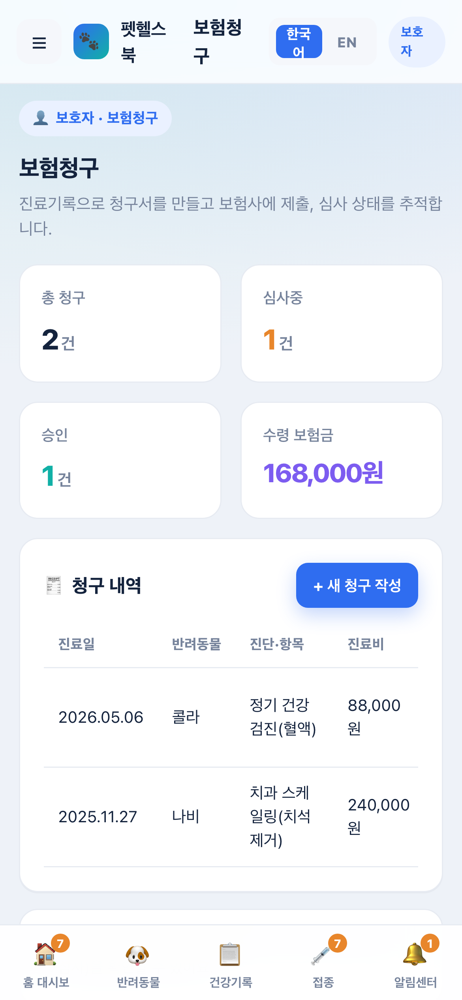
무엇 / KPI 2열 + 청구 테이블 가로 스크롤. 검토 / 열 접근·잘림 없음.

**⑪ 청구 상세 흐름**
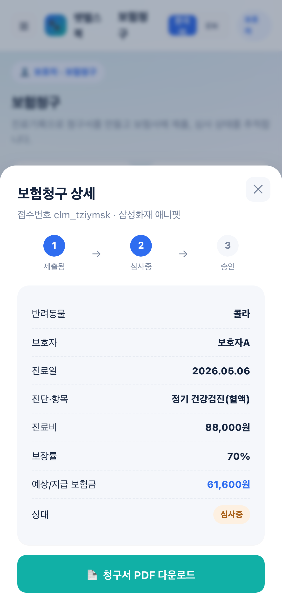
무엇 / 바텀시트 상태 트래커·명세·PDF. 검토 / 단계·금액 정상.

**⑫ 데이터·연동 (OAuth)**
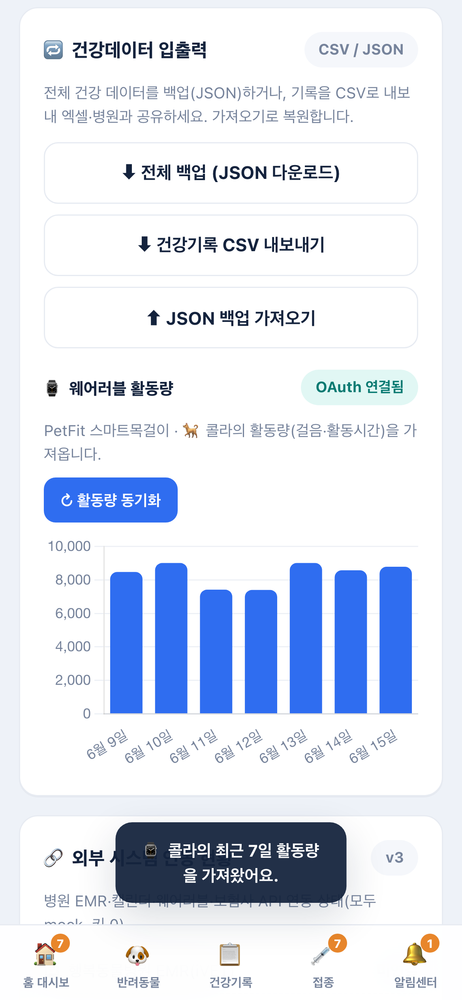
무엇 / CSV/JSON 풀폭 버튼·웨어러블 OAuth 연결됨·활동량 차트·연동 현황. 검토 / 로그·차트·세로 스택 정상.

**⑬ 수의사 대시보드**
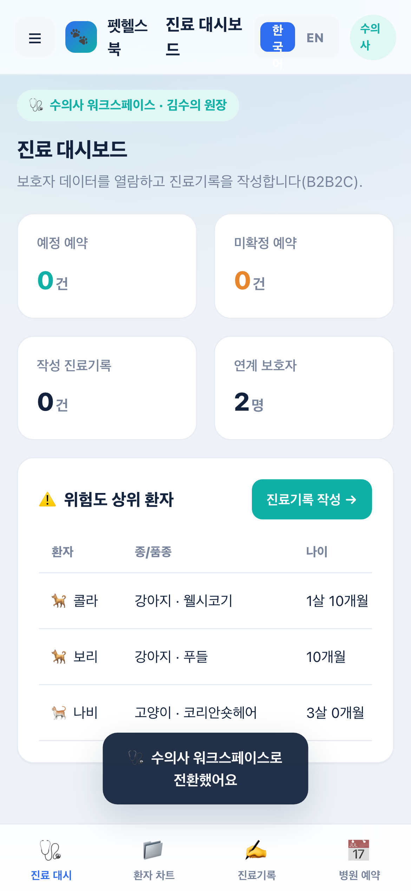
무엇 / 틸 테마·KPI 2열·환자 랭킹 테이블(가로 스크롤). 검토 / 역할 테마·테이블 정상.

**⑭ 수의사 환자 차트**
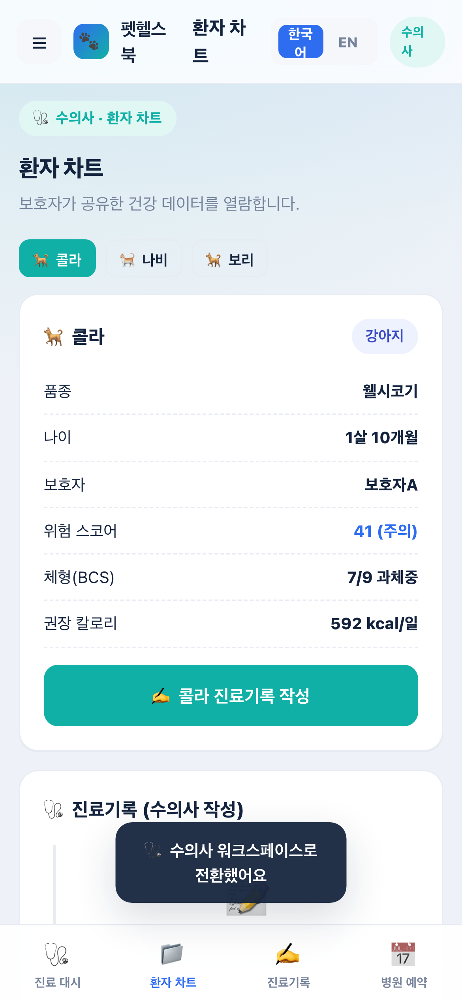
무엇 / 틸 펫 칩·풀폭 환자 카드·진료 타임라인. 검토 / 세로 스택 정상.

**⑮ 진료기록 작성**
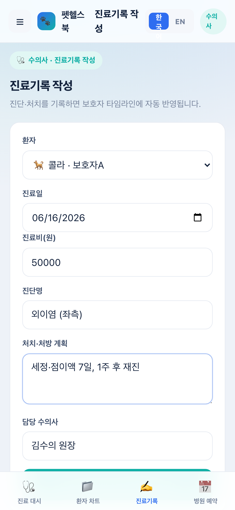
무엇 / 풀폭 진료기록 폼. 검토 / 폼·셀렉트 정상.

**⑯ 진료기록 저장 반영**
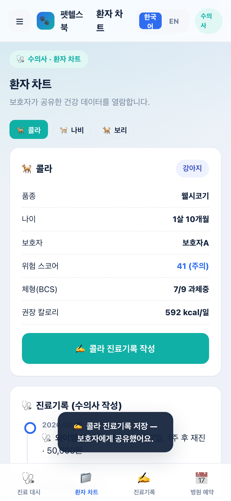
무엇 / 저장 후 보호자 타임라인 반영. 검토 / 동기·토스트 정상.

**⑰ 병원 admin 운영 + EMR** [v3 신규]
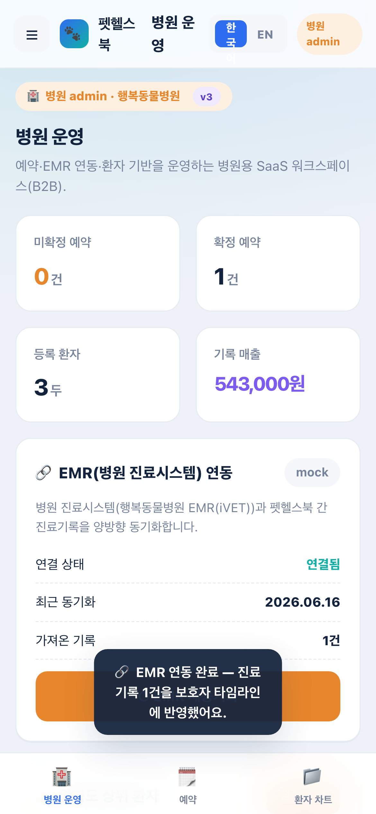
무엇 / 주황 테마·KPI 2열(미확정/확정 예약·환자·매출, 텍스트 풀 표기) + EMR 연동(연결됨·동기화). 의도 / 모바일 클리핑 0 확인. 검토 / 헤더·KPI 텍스트 잘림 없음·overflow 0 (v2 클리핑 이력 → min-width:0 수정으로 해소).

**⑱ 병원 admin 캘린더 동기화** [v3 신규]
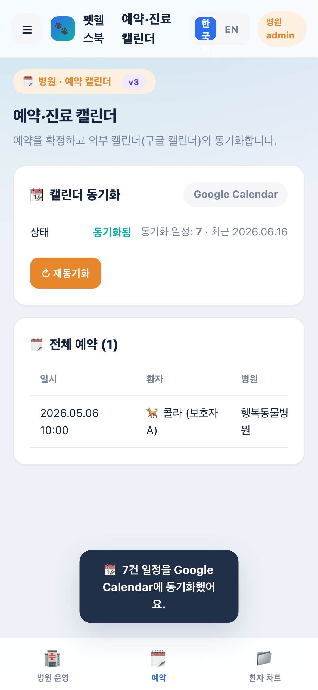
무엇 / 캘린더 동기화(동기화됨·7건) + 전체 예약 테이블(가로 스크롤). 검토 / 동기화 상태·테이블 정상.

**⑲ 보험사 대시보드**
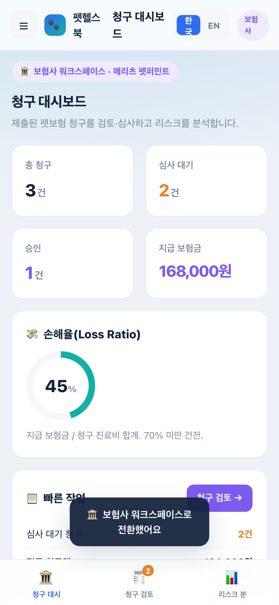
무엇 / 퍼플 테마·손해율 게이지(세로 스택)·통계. 검토 / 게이지·역할 테마 정상.

**⑳ 보험사 청구 검토**
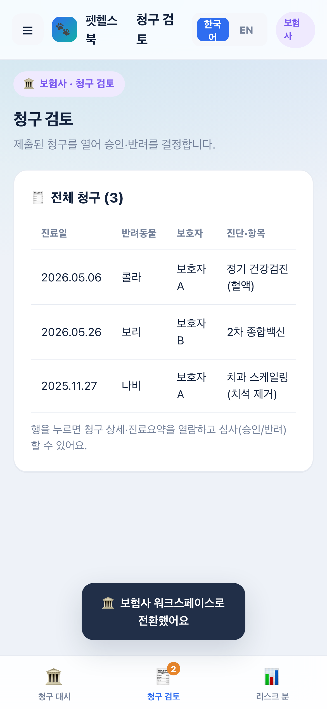
무엇 / 청구 테이블 가로 스크롤. 검토 / 열 접근·잘림 없음.

**㉑ 보험사 청구 심사**
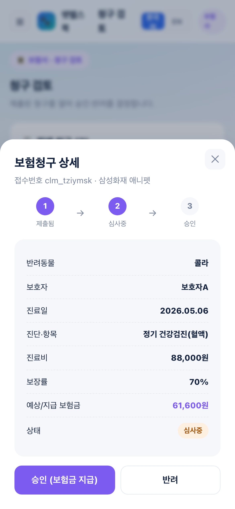
무엇 / 바텀시트 명세·승인/반려. 검토 / 심사 액션 정상.

**㉒ 보험사 리스크 분석**
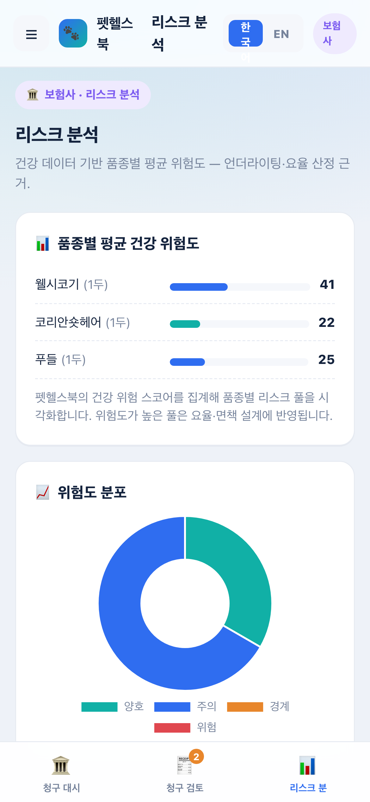
무엇 / 품종 위험 바·도넛 세로 스택. 검토 / 차트 렌더 정상.

**㉓ i18n — English 홈** [v3 신규]
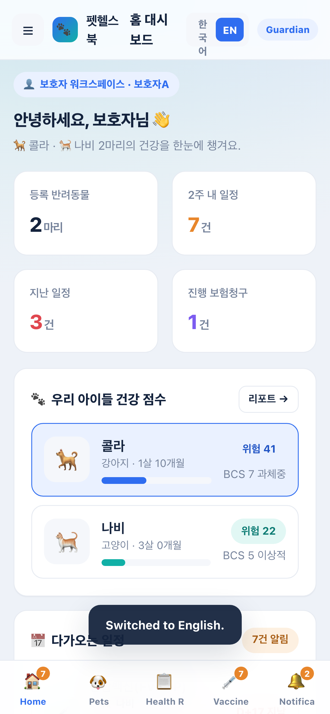
무엇 / 모바일 언어 토글 EN·바텀탭/드로어 영문 라벨. 검토 / 셸 영문 전환·풀폭 정상.

**㉔ i18n — English 질병 예측** [v3 신규]
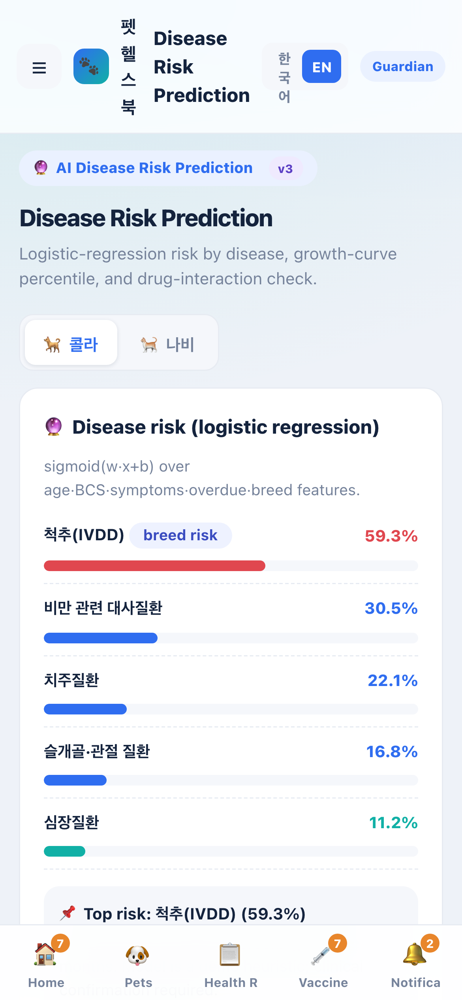
무엇 / "Disease Risk Prediction" 영문 + 위험 바. 검토 / 영문 라벨·바 스택 정상.

**㉕ 모바일 오프캔버스 드로어 (역할 전환·언어)** [v3]
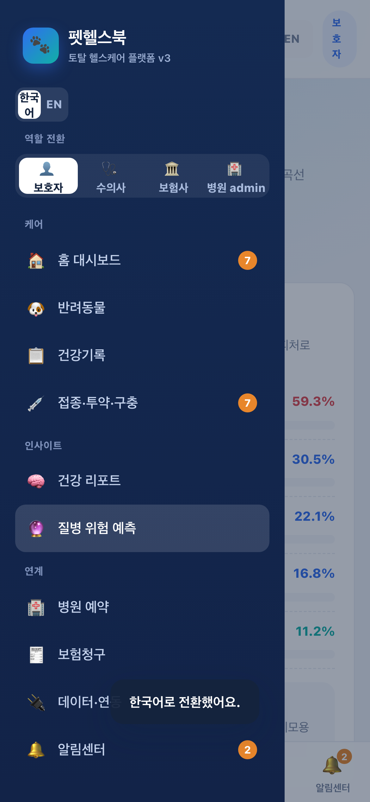
무엇 / 햄버거 슬라이드 드로어(언어 토글·역할 스위처 4역할·전체 메뉴)·백드롭 딤. 검토 / 슬라이드·역할 전환·언어 정상.

**㉖ 모바일 질병 예측 스크롤 본문** [v3]
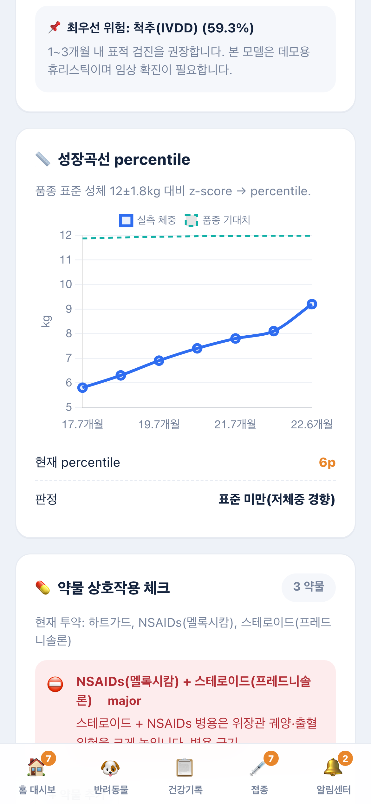
무엇 / 질병 예측을 아래로 스크롤(성장곡선·약물 상호작용 헤더). 검토 / 풀폭·바텀바 가림 없음·차트 렌더.

## 6. 검수 기준 충족 여부 (과업지시서 §5)

| # | 검수 항목 | 합격 조건 | 결과 | 측정값/근거 |
|:---:|:---|:---|:---:|:---|
| 1 | 시리즈A 데모(v3) | 21뷰·4역할·`file://`·v1·v2 보존 | ✅ | PC/모바일 전체, v1.html·v2.html 미수정 |
| 2 | 질병 위험 예측 | sigmoid·정렬·최우선·권고 | ✅ | PC 08(척추 IVDD 59.3% 최우선) |
| 3 | 성장곡선 percentile | z→CDF·곡선·판정 | ✅ | PC 08 우(6p·표준 미만 판정) |
| 4 | 약물 상호작용 | major/moderate/minor·재계산 | ✅ | PC 09(NSAIDs+스테로이드 major) |
| 5 | 병원 admin | 운영·캘린더·환자차트·주황 테마 | ✅ | PC/모바일 17·18 |
| 6 | EMR 양방향 | 연동·양쪽 반영·로그 | ✅ | PC 17·12(EMR API 로그) |
| 7 | 다보험사 청구 | 3개사 라우팅·심사 | ✅ | PC 10·20(보험사 열) |
| 8 | 웨어러블 OAuth | 토큰·인가 후 동기화 | ✅ | PC 12(OAuth 2.0 토큰 로그) |
| 9 | 캘린더 동기화 | 일정 push·수 표기 | ✅ | PC 18(7건 동기화) |
| 10 | i18n(KO/EN) | 셸·내비·라벨·지속 | ✅ | PC/모바일 23·24 |
| 11 | 반응형 | overflow·클리핑·하이재킹·빈 차트 0 | ✅ | mobile/v3 전체 눈검수, content scrollWidth=390(측정) |
| 12 | 캡처 패키지 | PC≥15·모바일≥15 | ✅ | PC 24 / 모바일 26 |

## 7. 추가 확장 가능 영역 (중립)

- 정식 단계에서는 동일 클라이언트 로직 위에 실 EMR/병원 SDK·실 보험사 청구 API·실 OAuth(웨어러블)·실 캘린더 API·실 학습 데이터 기반 질병 예측 모델을 얹는다. v3의 로지스틱 회귀 인터페이스·성장곡선·약물 룰엔진·4역할 RBAC·통합 인터페이스·i18n 사전 구조는 그대로 정식 백엔드·실 모델 위에 이식되도록 설계되었다.

## 8. 검토 체크리스트

- [x] 모든 핵심 기능이 캡처되었는가 — 21뷰·4역할·7알고리즘·8통합·KO/EN 전부
- [x] 캡처가 의도한 기능을 정확히 보여주는가 — 로지스틱 예측·성장곡선·약물 상호작용·EMR·OAuth·캘린더·i18n 포함
- [x] 한글이 깨지지 않는가 — 화면·PDF(canvas 렌더) 모두 정상
- [x] 에러 화면이 의도치 않게 캡처되지 않았는가 — 없음(pageerror 0 측정)
- [x] 결과물(확률·percentile·상호작용·연동상태)의 정확도가 충분한가 — 계산 재현성·룰 탐지 확인
- [x] 과업지시서 검수 기준 항목 100% 매핑되었는가 — §6 표 12항목
- [x] (v2→v3) v2 한계 매핑표 + 5억 초과(시리즈A) 가치 기준(실 알고리즘 3종 추가·외부통합 4건 추가·4역할·i18n·뷰 21종·캡처 50장) 충족 — 상단 매핑표·§2·§5
- [x] PC·모바일 캡처를 폴더 나눠 저장 + 눈으로 확인 — `captures/v3`·`captures/mobile/v3`, 반응형_검수_필수.md §0 절차로 PNG 직접 확인(모바일 병원 대시보드 클리핑 발견→min-width:0 수정→재캡처 통과)
