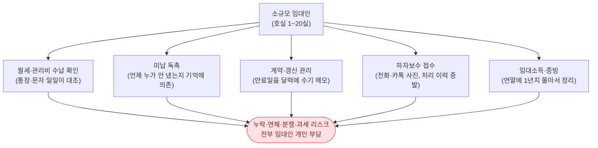
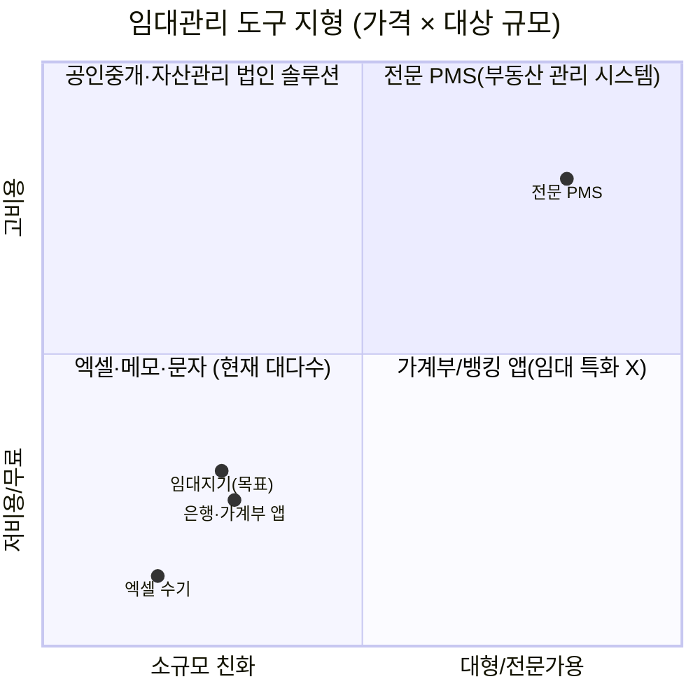
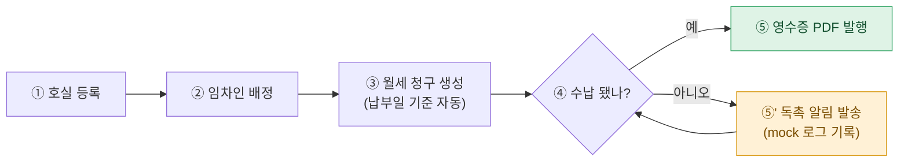
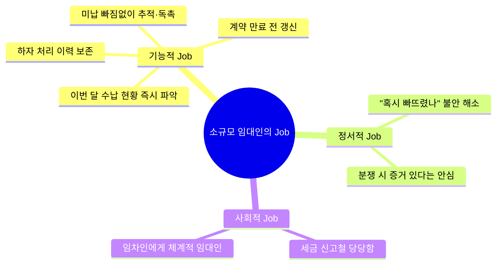
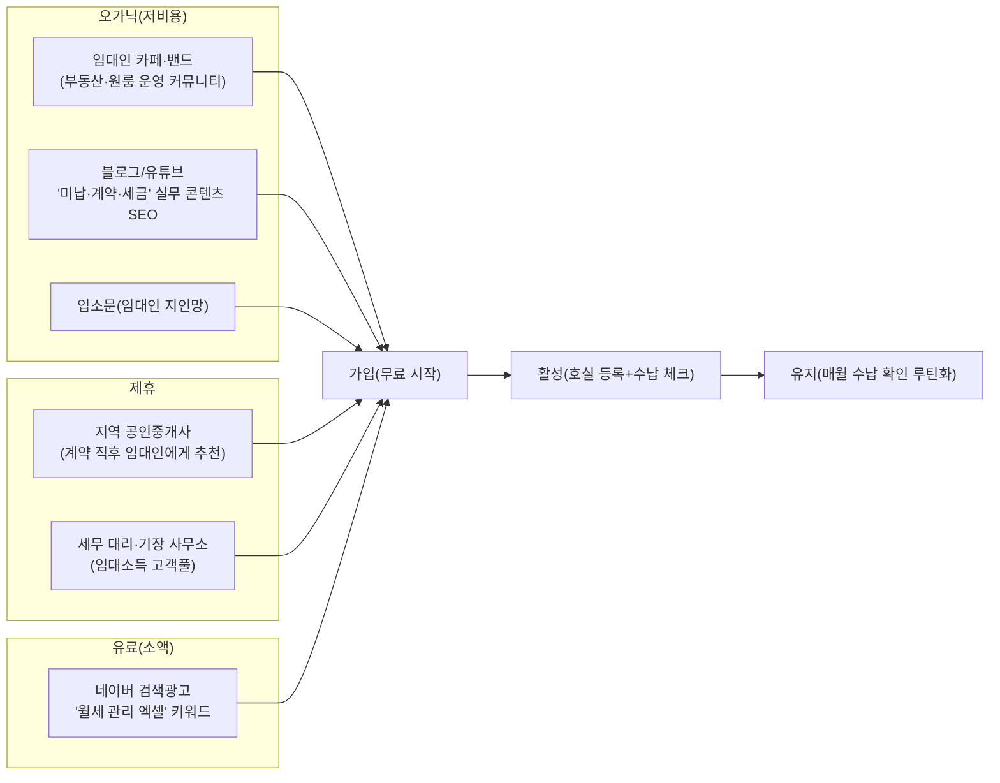
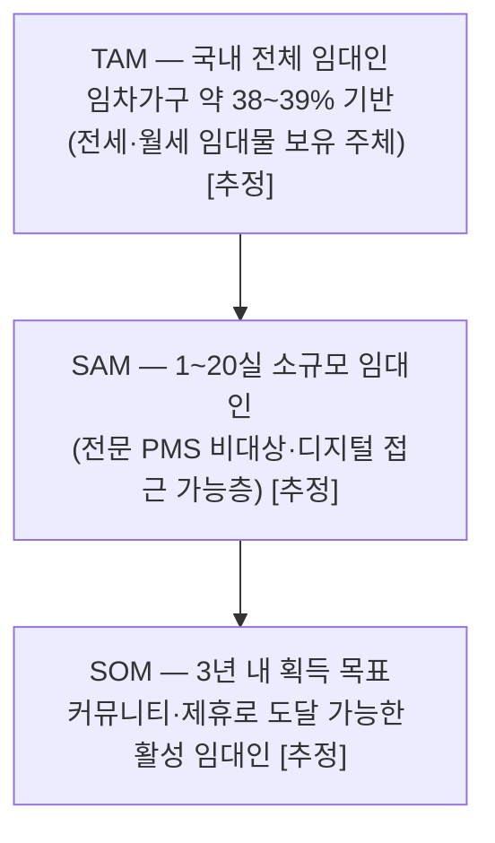

last_updated: 2026-06-16 15:20

# 임대지기 — 1인·소규모 임대인을 위한 임대관리 SaaS

| 항목 | 내용 |
|:---|:---|
| 사업명 | 대구대학교 창업지원단 「2026년 창업동아리 지원사업(실전창업)」 |
| 주관기관 | 대구대학교 창업지원단 |
| 트랙 | 실전창업 |
| 지원금 | 기본 300만원 · 최대 1,000만원 |
| 모집기간 | 2026-03-19 ~ 2026-04-02 |
| 아이템 | 소규모 임대인용 임대관리 SaaS 「임대지기」 |
| 타깃 | 보유 호실 1~20실의 1인·생계형 임대인(겸업·은퇴 임대인 포함) |
| 산출물 | 웹 기반 임대관리 PoC(수납 추적·계약·하자·수입 대시보드) |

> 본 제안서는 공고가 요구하는 PSST(Problem · Solution · Scale-up · Team) 구조를 따른다.
> Team 섹션은 골격만 두고 내용은 사용자가 직접 채운다([§Team](#team-팀)).

---

## Problem — 문제 정의

### P-1. "엑셀과 문자, 머릿속"으로 버티는 소규모 임대인

우리나라는 임대차 중심 시장이다. 통계청 인구주택총조사 기준 전국 일반가구의 약 38~39%가 임차 가구이며[^1], 전세·월세 거래가 상시 발생한다[^3]. 이 임차 가구의 반대편에는 그만큼 많은 **임대인**이 있다. 그런데 임대인의 다수는 부동산 법인이나 전업 자산가가 아니라, **호실 1~20실을 보유한 1인·생계형 임대인**이다 — 은퇴 후 노후 소득으로 원룸 몇 채를 굴리는 사람, 겸업으로 빌라 한 동을 관리하는 직장인, 부모에게 물려받은 다가구를 혼자 운영하는 30·40대.

이들은 자산 규모로는 "소규모"지만 **해야 하는 행정 업무의 종류는 대형 임대인과 동일**하다. 매달 호실별 월세·관리비가 들어왔는지 확인하고, 안 들어왔으면 독촉하고, 계약 만료가 다가오면 갱신을 챙기고, 하자보수 요청이 오면 기사를 부르고, 연말이면 임대소득을 신고해야 한다[^4]. 문제는 이 모든 일을 **엑셀 한 장, 휴대폰 문자, 그리고 머릿속**으로 처리한다는 것이다.



### P-2. 누락은 곧 돈·분쟁·세금 리스크

소규모 임대인이 행정을 "감"으로 처리할 때 생기는 손실은 추상적이지 않다.

- **수납 누락 → 연체 손실:** 호실이 5개만 넘어가도 "이번 달 202호는 들어왔던가?"가 헷갈린다. 미납을 늦게 발견할수록 회수가 어려워진다.
- **계약 만료 방치 → 묵시적 갱신·임대료 동결:** 만료일을 놓치면 기존 조건으로 자동 갱신되어 임대료 인상 타이밍을 잃는다.
- **하자 처리 이력 증발 → 분쟁:** "그 누수, 지난번에 고쳐줬잖아요" / "고쳐준 적 없는데요"의 진실 공방. 사진·접수일·처리일 기록이 없으면 보증금 정산 때 분쟁이 된다. 보증금 반환·수선의무 분쟁은 주택 임대차 민원의 큰 비중을 차지한다.
- **임대소득 증빙 부재 → 과세 리스크:** 연 2천만원 이하 주택임대소득도 분리과세 대상이 된 이후[^4], 월별 수입을 정리해 두지 않으면 신고철에 1년치를 뒤져야 한다.
- **신고제 행정부담:** 보증금 6천만원·월세 30만원 초과 계약은 30일 내 신고 의무가 있어[^2], 계약 정보를 구조화해 두지 않은 임대인은 매번 허둥댄다.

### P-3. 기존 도구의 공백

그러면 왜 이들은 소프트웨어를 안 쓸까? **자신에게 맞는 도구가 없기 때문**이다.



전문 부동산 관리 시스템(PMS)은 수백 호실 이상 전문 관리자를 위한 것이라 가격·복잡도가 과하다. 반대편엔 그냥 엑셀·문자·가계부 앱이 있는데, 이것들은 임대 특화 기능(호실-임차인-청구-수납-계약-하자를 한 흐름으로 잇는)이 없다. **"전문 PMS는 과하고, 엑셀은 모자란" 1~20실 임대인이 비어 있는 중간 지대**다.

---

## Solution — 솔루션

### S-1. 임대지기 한 줄 정의

> **임대지기는 호실·임차인·월세·계약·하자를 하나의 흐름으로 잇는, 소규모 임대인을 위한 가장 가벼운 임대관리 SaaS다.**

복잡한 회계·세무 기능을 다 넣지 않는다. 소규모 임대인이 **매달 실제로 반복하는 5가지 일**만 정확히, 빠르게, 흔적이 남게 처리한다.

### S-2. 핵심 기능 (PoC에서 모두 실 동작)

| 기능 | 무엇을 해결 | PoC 구현 |
|:---|:---|:---|
| ① 수입 대시보드 | "이번 달 얼마 들어왔고 얼마 밀렸나?"를 0.5초에 | 수납률·미납액·입주율 KPI + 월별 추세/구성 차트(Chart.js) |
| ② 호실·임차인 관리 | 물건과 사람을 한 곳에 | 호실 등록 → 임차인 배정 → 상세 이력 |
| ③ 월세 수납 추적 | 누가 냈고 누가 밀렸는지 | 청구 리스트 + 수납 체크 + 연체 자동 표시 + 다음 달 청구 자동 생성 |
| ④ 계약 관리 | 만료·갱신 놓침 방지 | 만료 60일 전 갱신 알림 + 표준 임대차계약서 **PDF 실 생성** |
| ⑤ 하자보수 요청 | 처리 이력·증빙 보존 | 접수→진행→완료 워크플로 + **증빙 사진 실 업로드** |

### S-3. 핵심 워크플로 — 호실에서 독촉까지 한 흐름

임대지기의 차별점은 개별 기능이 아니라 **한 데이터가 흐르는 방식**이다. 호실을 만들면 임차인을 붙일 수 있고, 임차인이 붙으면 월세가 청구되고, 청구가 수납되면 영수증이 나오고, 안 되면 독촉이 나간다.



이 다단계 워크플로(등록→배정→청구→수납/독촉→영수증)는 PoC에서 토스트 mock이 아니라 **실제 상태 전이**로 구현됐다 — 수납 체크 시 localStorage가 갱신되고, 새로고침해도 유지되며, 영수증·계약서는 jsPDF로 실제 PDF가 생성·다운로드된다([개발결과보고서 v1](./3_1_개발결과보고서_v1.md)).

### S-4. 시스템 아키텍처(PoC)

PoC는 **오프라인 단독 구동**을 원칙으로 한다(공고 시연·심사 환경에서 인터넷·서버 없이 동작). 향후 정식 버전은 동일 데이터 모델을 백엔드로 승격한다.

```mermaid
flowchart TB
    subgraph Client["클라이언트 (PoC: 단일 HTML, 오프라인)"]
      UI["UI 레이어<br/>대시보드/수납/계약/하자/호실"]
      LOGIC["도메인 로직<br/>청구 생성·연체 판정·갱신 알림"]
      STORE["localStorage<br/>(호실/임차인/청구/하자)"]
      PDF["jsPDF + html2canvas<br/>계약서·영수증 PDF"]
      CHART["Chart.js<br/>수입 추세·구성"]
      UI <--> LOGIC
      LOGIC <--> STORE
      UI --> PDF
      UI --> CHART
    end
    subgraph Future["정식 버전 확장(로드맵)"]
      API["REST/GraphQL API"]
      DB[("PostgreSQL")]
      MSG["알림톡/SMS 연동"]
      BANK["오픈뱅킹 입금 매칭"]
    end
    STORE -. "동일 스키마 승격" .-> DB
    LOGIC -. "서버 이관" .-> API
    PDF -. "" .-> API
    N1["독촉(mock)"] -. "" .-> MSG
    LOGIC -. "" .-> BANK
```

---

## 경영혁신·창업학적 프레임워크

임대지기가 "왜 지금, 왜 이 방식이어야 하는가"는 단순 아이템 설명으로는 부족하다. 세 가지 경영·창업 이론으로 정당화한다.

### ① Kim·Mauborgne 블루오션 — ERRC로 본 비경쟁 공간

블루오션 전략의 핵심은 기존 경쟁 요소를 **제거(Eliminate)·감소(Reduce)·증가(Raise)·창조(Create)** 하여 경쟁이 무의미한 시장을 여는 것이다. 임대지기는 "전문 PMS와 같은 기능 경쟁"을 하지 않는다.

| 액션 | 내용 |
|:---|:---|
| **제거(Eliminate)** | 전문 회계·세무 모듈, 멀티 관리자 권한, 대규모 단지 운영 기능 — 소규모 임대인에게 과한 것 제거 |
| **감소(Reduce)** | 초기 설정 복잡도·학습 비용 — 로그인 없이 즉시 사용, 데모 데이터로 시작 |
| **증가(Raise)** | 수납 가시성·하자 이력 보존·계약 만료 알림의 즉시성 |
| **창조(Create)** | "호실→임차인→청구→수납→독촉→증빙"을 한 화면 흐름으로 잇는, 1인 임대인용 단일 워크플로 |

임대지기는 전문 PMS(레드오션 상단)와 엑셀(레드오션 하단) 사이의 **빈 가치곡선**을 그린다(§P-3 사분면).

### ② Ries 린 스타트업 — 본 사업의 현재 위치

린 스타트업은 **MVP → 측정 → 학습**의 빌드-측정-학습 루프로 가설을 검증한다. 본 사업의 현 위치는 명확하다: **임대지기 PoC는 "소규모 임대인이 한 흐름으로 묶인 임대관리 도구를 쓸 것이다"라는 가설을 검증하기 위한 MVP**다. 창업동아리 지원 기간 동안 이 PoC로 실제 임대인을 인터뷰·온보딩하고(고객 개발), 핵심 지표(주간 활성 임대인 수, 수납 체크 사용률, 독촉 발송 수)를 측정해 다음 사이클을 정한다.

### ③ JTBD(Jobs To Be Done) — 임대인이 고용하는 "일"

고객은 제품을 사는 게 아니라 **할 일(Job)을 해결하려 제품을 고용**한다. 소규모 임대인의 핵심 Job은 "임대 사업을 본업처럼 매달리지 않고도, **누락·분쟁·과세 사고 없이** 굴러가게 하는 것"이다. 임대지기는 이 Job을 "최소한의 클릭으로 흔적을 남기며 처리"하는 방식으로 충족한다.



---

## 고객확보(GTM)

### G-1. ICP 세분화 (Ideal Customer Profile)

| 세그먼트 | 특징 | 우선순위 |
|:---|:---|:---:|
| **A. 겸업 임대인** | 직장·자영업 병행, 빌라 1동/원룸 5~15실, 시간 부족·디지털 친숙 | 1순위 |
| **B. 은퇴·노후 임대인** | 원룸·다가구 노후 소득, 디지털 진입장벽 존재 → 단순 UX 필수 | 2순위 |
| **C. 상속·승계 임대인** | 30·40대, 부모 물건 위탁·직접 운영 혼재, 기존 관리 부재 | 1순위 |

1순위 ICP는 **A(겸업)·C(상속)** — 디지털 친숙하면서 "엑셀로는 한계"를 느끼는 5~15실 보유층.

### G-2. 채널별 획득 전술



### G-3. 인지 → 가입 → 활성 → 유지 퍼널 & 트랙션 계획

- **첫 100명:** 임대인 커뮤니티(카페·밴드) 5곳에서 "월세 관리 무료 도구" 베타 모집 + 창업동아리 구성원의 1차 지인망(겸업·상속 임대인). 핵심은 **로그인 없이 즉시 체험** → 마찰 최소화.
- **첫 1,000명:** 실무 콘텐츠 SEO(미납 독촉 문구, 표준계약서, 임대소득 정리) + 지역 공인중개사 10곳 제휴(계약 성사 시 임대인에게 추천). 콘텐츠는 검색 유입을 누적 자산화한다.
- **예상 CAC:** 오가닉·제휴 중심 설계라 초기 CAC는 **1인당 1만~3만원 [추정]**(콘텐츠·소액 검색광고 + 제휴 리워드 분산). 유료 단독 의존을 피해 CAC를 억제한다.
- **리텐션 가설:** 임대관리는 **월 1회 이상 반드시 반복**되는 업무(수납 확인·미납 독촉)다. "매달 들어와야 하는 이유"가 제품 본질에 내장돼 있어, 한 번 호실·임차인을 등록한 임대인의 **3개월 잔존율 50%+** 를 목표로 한다 [추정·검증 대상].

---

## 수익모델

### R-1. 수익원과 가격 정책

기본은 **호실 수 기반 구독(SaaS)**. 소규모 임대인이 "엑셀보다 약간 더 내고 마음 편한" 가격대를 설계한다.

| 플랜 | 대상 | 가격(월) [추정·정책안] | 포함 |
|:---|:---|:---:|:---|
| Free | 1~3실 | 0원 | 대시보드·수납 체크·하자 접수 |
| Lite | 4~10실 | 4,900원 | + 자동 청구 생성·독촉·계약서 PDF |
| Pro | 11~20실 | 9,900원 | + 영수증 자동·임대소득 리포트·다중 건물 |

부가 수익(로드맵): 표준계약서·증명서 발급 건당 과금, 세무 대리·보험 제휴 수수료, 오픈뱅킹 입금 자동매칭 프리미엄.

### R-2. 단위경제성 (Unit Economics)

> 아래는 가격 정책안과 채널 가정에 기반한 **추정 모델**이며, 실제 값은 베타 측정으로 보정한다([5_research](./5_research/README.md) 데이터 정직성).

| 지표 | 가정/계산 | 값 |
|:---|:---|:---:|
| ARPU(유료 평균) | Lite·Pro 혼합 가정 | 월 6,500원 [추정] |
| 평균 구독 유지 | 임대는 장기 사업 → 24개월 가정 | 24개월 [추정] |
| **LTV** | 6,500 × 24 × 마진 80% | 약 **125,000원** [추정] |
| **CAC** | 오가닉·제휴 중심 | 약 **20,000원** [추정] |
| **LTV/CAC** | 125,000 / 20,000 | **약 6.3** (건전선 3 이상 충족) |
| 회수기간 | CAC ÷ (ARPU×마진) | 약 **3.8개월** [추정] |
| 기여이익 | ARPU − 변동비(서버·결제수수료) | 양(+), 서버비 미미(클라이언트 중심) |

### R-3. 매출 시나리오 3안 (12개월차 가정)

| 시나리오 | 가입 임대인 | 유료 전환율 | ARPU | 월 매출 [추정] |
|:---|---:|---:|---:|---:|
| 보수 | 1,500명 | 8% | 6,500원 | 약 78만원/월 |
| 기본 | 4,000명 | 12% | 6,500원 | 약 312만원/월 |
| 공격 | 9,000명 | 15% | 6,800원 | 약 918만원/월 |

> 소규모 임대인은 **이탈이 느리고 객단가가 안정적**이어서, 초기 매출 절대값은 작아도 **누적 구독 기반의 복리 성장**이 핵심이다. 본 사업 기간의 목표는 절대 매출이 아니라 **유료 전환 가설·리텐션 검증**이다.

---

## 차별성·경쟁우위(Moat)

### M-1. 경쟁자 비교

| 항목 | 엑셀·문자(현행) | 가계부/뱅킹 앱 | 전문 PMS | **임대지기** |
|:---|:---:|:---:|:---:|:---:|
| 소규모(1~20실) 적합 | △(수동) | △ | ✕(과함) | ◎ |
| 호실-임차인-청구 연결 | ✕ | ✕ | ◎ | ◎ |
| 미납 자동 추적·독촉 | ✕ | ✕ | ○ | ◎ |
| 계약 만료 갱신 알림 | ✕ | ✕ | ○ | ◎ |
| 하자 이력·증빙 보존 | ✕ | ✕ | ○ | ◎ |
| 계약서·영수증 PDF | ✕ | ✕ | ○ | ◎(구현) |
| 진입 비용·학습곡선 | 낮음/번거로움 | 낮음 | 높음 | 매우 낮음 |
| 월 비용 | 0 | 0 | 높음 | 0~9,900원 |

> 경쟁 정보는 2026-06 공개 정보 기반 일반화이며 실제 요금·기능은 변동 가능 `[재확인 필요]`.

### M-2. 방어가능성 (해자)


- **전환비용:** 임대인이 호실·임차인·계약·하자 이력을 쌓을수록 이전 비용이 커진다. 임대는 장기 사업이라 한 번 정착하면 오래 머문다.
- **데이터 효과:** 수납·연체 데이터가 쌓이면 "이 임차인 연체 위험" 예측, 자동 청구·독촉 타이밍 최적화가 가능해진다(향후 RAG/스코어링).
- **Why us:** 창업 구성원이 임대 현장(원룸·다가구 운영)을 직접 관찰한 도메인 이해 + 빠른 PoC 실증 능력.
- **Why now:** 전월세 신고제(2021~)[^2]·임대소득 전면 과세(2019~)[^4]·관리비 공개 확대(2023~)[^5]로 **소규모 임대인의 행정·증빙 부담이 구조적으로 커진 시점**이다. "감으로 버티기"가 더 이상 안전하지 않다.

---

## Scale-up — 성장 전략

### SC-1. 시장 규모 (TAM/SAM/SOM)

> 아래 절대값은 공개 통계(임차가구 수)로 역산한 **`[추정]`**이며, 정밀 시장조사로 보정한다.



핵심은 절대값보다 **구조**다: 임대차 중심 시장[^3]에서 소규모 임대인은 항상 다수이며, 규제·과세 강화로 도구 수요가 늘어난다. 임대지기는 이 비어 있는 중간 지대를 겨냥한다.

### SC-2. 단계별 로드맵

| 단계 | 시기(상대) | 핵심 |
|:---|:---|:---|
| Phase 0 — PoC(본 사업) | 사업 기간 | 5개 핵심 기능 실 구동, 임대인 인터뷰·온보딩, 가설 검증 |
| Phase 1 — 베타 | 직후 | 클라우드 백엔드 승격, 다기기 동기화, 실 알림(알림톡/SMS) 연동 |
| Phase 2 — 수익화 | 6~12개월 | 유료 플랜 출시, 오픈뱅킹 입금 자동매칭, 임대소득 리포트 |
| Phase 3 — 확장 | 12개월+ | 연체 위험 스코어링, 보험·세무 제휴 마켓, 다건물 포트폴리오 |

### SC-3. 핵심 지표(North Star)

- **North Star:** 주간 활성 임대인 수(WAU) × 호실 등록 수 — "임대지기로 실제 임대를 굴리는 사람".
- 보조 지표: 수납 체크 사용률, 독촉 발송 수, 3개월 잔존율, 유료 전환율.

---

## Team — 팀

> 본 섹션은 행정·서명 영역으로, 내용은 사용자가 직접 채운다(자동 창작 금지).

### 팀 구성

| 역할 | 성명 | 소속/학과 | 학번 | 연락처 | 담당 R&R |
|:---|:---|:---|:---|:---|:---|
| 대표(팀장) | `<TODO: 사용자 입력>` | `<TODO: 사용자 입력>` | `<TODO: 사용자 입력>` | `<TODO: 사용자 입력>` | `<TODO: 사용자 입력>` |
| 팀원 | `<TODO: 사용자 입력>` | `<TODO: 사용자 입력>` | `<TODO: 사용자 입력>` | `<TODO: 사용자 입력>` | `<TODO: 사용자 입력>` |
| 팀원 | `<TODO: 사용자 입력>` | `<TODO: 사용자 입력>` | `<TODO: 사용자 입력>` | `<TODO: 사용자 입력>` | `<TODO: 사용자 입력>` |
| 지도교수 | `<TODO: 사용자 입력>` | `<TODO: 사용자 입력>` | — | `<TODO: 사용자 입력>` | `<TODO: 사용자 입력>` |

### 팀 역량·수상 실적

- `<TODO: 사용자 입력>`

---

## 참고문헌

[^1]: **통계청 「인구주택총조사」** (2020 기준 공표). 전국 일반가구 점유형태 중 임차 가구 비중 약 38~39%. KOSIS(https://kosis.kr) · https://kostat.go.kr.
[^2]: **국토교통부 「주택 임대차 신고제(전월세신고제)」** (2021-06 시행). 보증금 6,000만원 또는 월세 30만원 초과 임대차 30일 내 신고 의무. https://www.molit.go.kr · 부동산거래관리시스템 https://rtms.molit.go.kr.
[^3]: **한국부동산원·통계청 「전월세 임대차 통계/거래량」** (월간 공표). 임대차 중심 시장 구조. https://www.reb.or.kr · KOSIS.
[^4]: **국세청 「주택임대소득 과세」** (2019 귀속분부터 연 2천만원 이하 분리과세). https://www.nts.go.kr.
[^5]: **국토교통부/한국부동산원 「공동주택 관리비 공개」** (2023 대상 확대). https://www.k-apt.go.kr.
[^6]: **중소벤처기업부·창업진흥원 「창업기업 동향」** (연간). 프롭테크·생활밀착 SaaS 창업 동향. https://www.mss.go.kr · https://www.kised.or.kr.

> 이론 출처: W. Chan Kim & R. Mauborgne, *Blue Ocean Strategy* (2005) / Eric Ries, *The Lean Startup* (2011) / Clayton Christensen et al., *Jobs To Be Done* 이론.

---

## 데이터 정직성 선언

본 제안서의 통계·제도 인용은 100% 공개 1차 자료(공공통계·정부 부처 제도)에 출처를 달았으며([5_research/README.md](./5_research/README.md)와 연결), 인용 출처는 `[^번호]` 각주로 표기했다. 시장규모(TAM/SAM/SOM) 금액, 가격 정책, 단위경제성(LTV·CAC·전환율·리텐션), 매출 시나리오, 경쟁사 비교의 수치는 공개 통계로 역산하거나 정책안으로 가정한 **추정값**이며, 본문에 `[추정]` / `[재확인 필요]`로 명시해 공식 수치와 섞지 않았다. 추정값은 베타 단계 실측으로 보정한다.

---

<!-- 빈칸 목록 (사용자 입력 필요)
- Team §팀 구성: 대표·팀원·지도교수의 성명/소속·학과/학번/연락처/R&R 전부
- Team §팀 역량·수상 실적
-->
