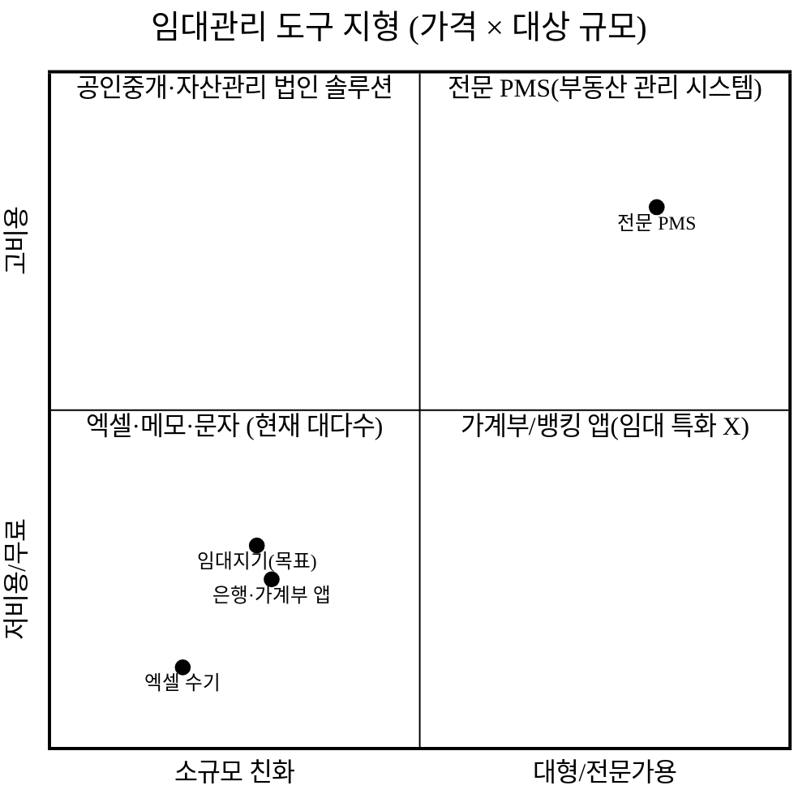
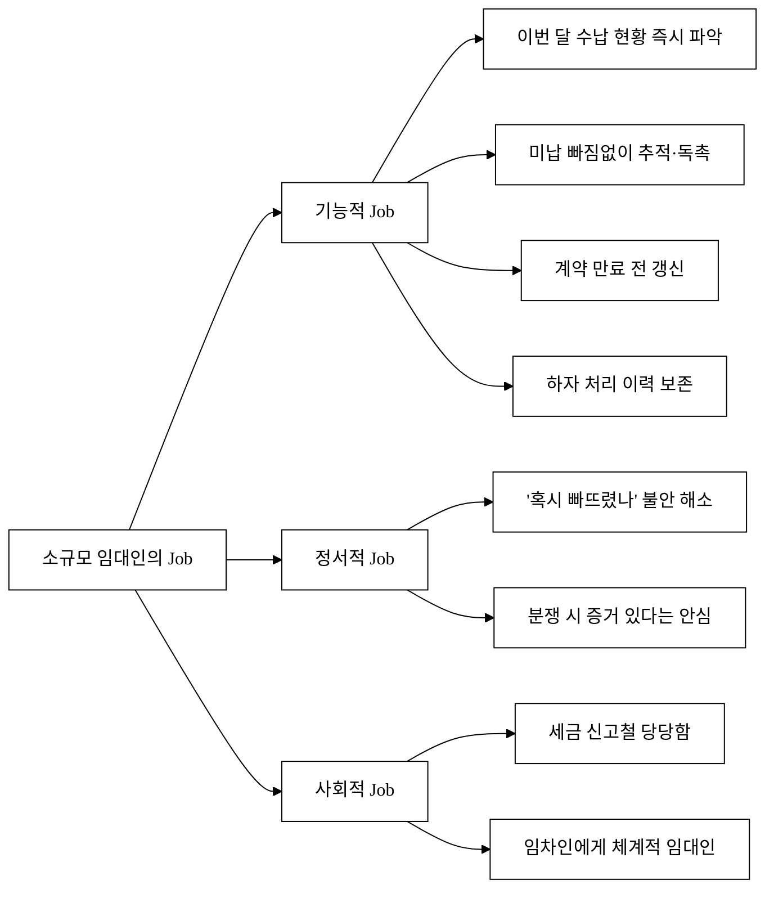
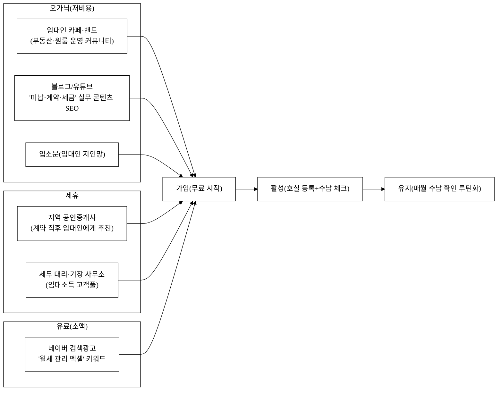
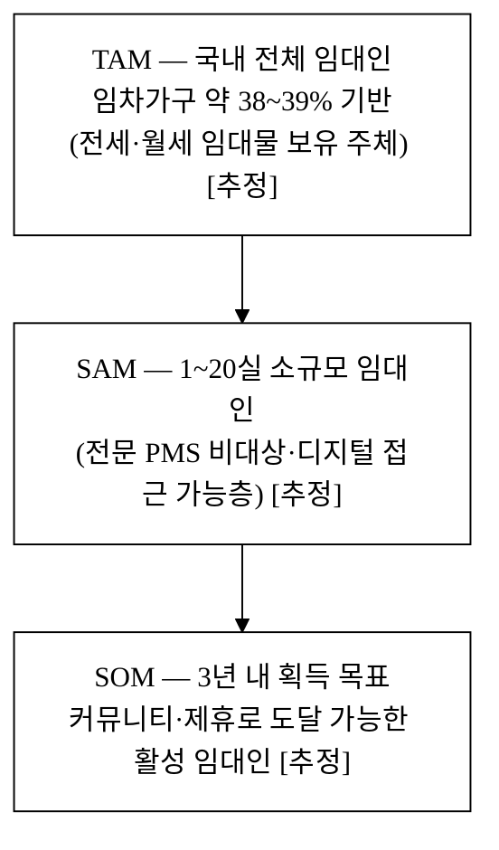

last_updated: 2026-06-22 14:00

# 임대지기 — 1인·소규모 임대인을 위한 임대관리 SaaS

| 항목 | 내용 |
|:---|:---|
| 사업명 | 대구대학교 창업지원단 「2026년 창업동아리 지원사업(실전창업)」 |
| 주관기관 | 대구대학교 창업지원단 |
| 트랙 | 실전창업 |
| 지원금 | 기본 300만원 · 최대 1,000만원 |
| 모집기간 | 2026-03-19 ~ 2026-04-02 |
| 아이템 | 소규모 임대인용 임대관리 SaaS 「임대지기」 |
| 타깃 | 보유 호실 1~20실의 1인·생계형 임대인(겸업·은퇴 임대인 포함) |
| 산출물 | 웹 기반 임대관리 PoC(v1: 수납 추적·계약·하자·수입 대시보드) → 차별 기술 승격(v2: 연체 위험 스코어링 / v2·v3: 적정 임대료 추정 / v3: Cap rate 수익률) |

> 본 제안서는 공고가 요구하는 PSST(Problem · Solution · Scale-up · Team) 구조를 따른다.
> Team 섹션은 골격만 두고 내용은 사용자가 직접 채운다([§Team](#team-팀)).

---

## Problem — 문제 정의

### P-1. "엑셀과 문자, 머릿속"으로 버티는 소규모 임대인

우리나라는 임대차 중심 시장이다. 통계청 인구주택총조사 기준 전국 일반가구의 약 38~39%가 임차 가구이며[^1], 전세·월세 거래가 상시 발생한다[^3]. 이 임차 가구의 반대편에는 그만큼 많은 **임대인**이 있다. 그런데 임대인의 다수는 부동산 법인이나 전업 자산가가 아니라, **호실 1~20실을 보유한 1인·생계형 임대인**이다 — 은퇴 후 노후 소득으로 원룸 몇 채를 굴리는 사람, 겸업으로 빌라 한 동을 관리하는 직장인, 부모에게 물려받은 다가구를 혼자 운영하는 30·40대.

이들은 자산 규모로는 "소규모"지만 **해야 하는 행정 업무의 종류는 대형 임대인과 동일**하다. 매달 호실별 월세·관리비가 들어왔는지 확인하고, 안 들어왔으면 독촉하고, 계약 만료가 다가오면 갱신을 챙기고, 하자보수 요청이 오면 기사를 부르고, 연말이면 임대소득을 신고해야 한다[^4]. 문제는 이 모든 일을 **엑셀 한 장, 휴대폰 문자, 그리고 머릿속**으로 처리한다는 것이다.

```mermaid
%%{init: {"theme":"base","themeVariables":{"darkMode":false,"background":"#ffffff","fontFamily":"Georgia, serif","primaryColor":"#ffffff","primaryBorderColor":"#000000","primaryTextColor":"#000000","secondaryColor":"#ffffff","secondaryBorderColor":"#000000","secondaryTextColor":"#000000","tertiaryColor":"#ffffff","tertiaryBorderColor":"#000000","tertiaryTextColor":"#000000","mainBkg":"#ffffff","secondBkg":"#ffffff","lineColor":"#000000","textColor":"#000000","nodeBorder":"#000000","nodeTextColor":"#000000","titleColor":"#000000","edgeLabelBackground":"#ffffff","defaultLinkColor":"#000000","clusterBkg":"#ffffff","clusterBorder":"#000000","actorBkg":"#ffffff","actorBorder":"#000000","actorTextColor":"#000000","actorLineColor":"#000000","signalColor":"#000000","signalTextColor":"#000000","labelBoxBkgColor":"#ffffff","labelBoxBorderColor":"#000000","labelTextColor":"#000000","loopTextColor":"#000000","noteBkgColor":"#ffffff","noteBorderColor":"#000000","noteTextColor":"#000000","activationBkgColor":"#ffffff","activationBorderColor":"#000000","sequenceNumberColor":"#000000","attributeBackgroundColorOdd":"#ffffff","attributeBackgroundColorEven":"#ffffff","sectionBkgColor":"#ffffff","altSectionBkgColor":"#ffffff","sectionBkgColor2":"#ffffff","taskBkgColor":"#ffffff","taskBorderColor":"#000000","taskTextColor":"#000000","taskTextLightColor":"#000000","taskTextOutsideColor":"#000000","taskTextDarkColor":"#000000","taskTextClickableColor":"#000000","activeTaskBkgColor":"#ffffff","activeTaskBorderColor":"#000000","doneTaskBkgColor":"#ffffff","doneTaskBorderColor":"#000000","critBkgColor":"#ffffff","critBorderColor":"#000000","gridColor":"#000000","todayLineColor":"#000000","quadrant1Fill":"#ffffff","quadrant2Fill":"#ffffff","quadrant3Fill":"#ffffff","quadrant4Fill":"#ffffff","quadrant1TextFill":"#000000","quadrant2TextFill":"#000000","quadrant3TextFill":"#000000","quadrant4TextFill":"#000000","quadrantPointFill":"#000000","quadrantPointTextFill":"#000000","quadrantXAxisTextFill":"#000000","quadrantYAxisTextFill":"#000000","quadrantInternalBorderStrokeFill":"#000000","quadrantExternalBorderStrokeFill":"#000000","quadrantTitleFill":"#000000","pieStrokeColor":"#000000","pieOuterStrokeColor":"#000000","pieTitleTextColor":"#000000","pieSectionTextColor":"#000000","pieLegendTextColor":"#000000","cScale0":"#ffffff","cScaleLabel0":"#000000","cScaleInv0":"#000000","pie1":"#ffffff","cScale1":"#ffffff","cScaleLabel1":"#000000","cScaleInv1":"#000000","pie2":"#ffffff","cScale2":"#ffffff","cScaleLabel2":"#000000","cScaleInv2":"#000000","pie3":"#ffffff","cScale3":"#ffffff","cScaleLabel3":"#000000","cScaleInv3":"#000000","pie4":"#ffffff","cScale4":"#ffffff","cScaleLabel4":"#000000","cScaleInv4":"#000000","pie5":"#ffffff","cScale5":"#ffffff","cScaleLabel5":"#000000","cScaleInv5":"#000000","pie6":"#ffffff","cScale6":"#ffffff","cScaleLabel6":"#000000","cScaleInv6":"#000000","pie7":"#ffffff","cScale7":"#ffffff","cScaleLabel7":"#000000","cScaleInv7":"#000000","pie8":"#ffffff","cScale8":"#ffffff","cScaleLabel8":"#000000","cScaleInv8":"#000000","pie9":"#ffffff","cScale9":"#ffffff","cScaleLabel9":"#000000","cScaleInv9":"#000000","pie10":"#ffffff","cScale10":"#ffffff","cScaleLabel10":"#000000","cScaleInv10":"#000000","pie11":"#ffffff","cScale11":"#ffffff","cScaleLabel11":"#000000","cScaleInv11":"#000000","pie12":"#ffffff"}}}%%
flowchart TD
    L["소규모 임대인<br/>(호실 1~20실)"]
    L --> A["월세·관리비 수납 확인<br/>(통장·문자 일일이 대조)"]
    L --> B["미납 독촉<br/>(언제 누가 안 냈는지 기억에 의존)"]
    L --> C["계약·갱신 관리<br/>(만료일을 달력에 수기 메모)"]
    L --> D["하자보수 접수<br/>(전화·카톡 사진, 처리 이력 증발)"]
    L --> E["임대소득·증빙<br/>(연말에 1년치 몰아서 정리)"]
    A & B & C & D & E --> X(["누락·연체·분쟁·과세 리스크<br/>전부 임대인 개인 부담"])
```



### P-2. 누락은 곧 돈·분쟁·세금 리스크

소규모 임대인이 행정을 "감"으로 처리할 때 생기는 손실은 추상적이지 않다.

- **수납 누락 → 연체 손실:** 호실이 5개만 넘어가도 "이번 달 202호는 들어왔던가?"가 헷갈린다. 미납을 늦게 발견할수록 회수가 어려워진다.
- **계약 만료 방치 → 묵시적 갱신·임대료 동결:** 만료일을 놓치면 기존 조건으로 자동 갱신되어 임대료 인상 타이밍을 잃는다.
- **하자 처리 이력 증발 → 분쟁:** "그 누수, 지난번에 고쳐줬잖아요" / "고쳐준 적 없는데요"의 진실 공방. 사진·접수일·처리일 기록이 없으면 보증금 정산 때 분쟁이 된다. 보증금 반환·수선의무 분쟁은 주택 임대차 민원의 큰 비중을 차지한다.
- **임대소득 증빙 부재 → 과세 리스크:** 연 2천만원 이하 주택임대소득도 분리과세 대상이 된 이후[^4], 월별 수입을 정리해 두지 않으면 신고철에 1년치를 뒤져야 한다.
- **신고제 행정부담:** 보증금 6천만원·월세 30만원 초과 계약은 30일 내 신고 의무가 있어[^2], 계약 정보를 구조화해 두지 않은 임대인은 매번 허둥댄다.

### P-3. 기존 도구의 공백

그러면 왜 이들은 소프트웨어를 안 쓸까? **자신에게 맞는 도구가 없기 때문**이다.



전문 부동산 관리 시스템(PMS)은 수백 호실 이상 전문 관리자를 위한 것이라 가격·복잡도가 과하다. 반대편엔 그냥 엑셀·문자·가계부 앱이 있는데, 이것들은 임대 특화 기능(호실-임차인-청구-수납-계약-하자를 한 흐름으로 잇는)이 없다. **"전문 PMS는 과하고, 엑셀은 모자란" 1~20실 임대인이 비어 있는 중간 지대**다.

---

## Solution — 솔루션

### S-1. 임대지기 한 줄 정의

> **임대지기는 호실·임차인·월세·계약·하자를 하나의 흐름으로 잇는, 소규모 임대인을 위한 가장 가벼운 임대관리 SaaS다.**

복잡한 회계·세무 기능을 다 넣지 않는다. 소규모 임대인이 **매달 실제로 반복하는 5가지 일**만 정확히, 빠르게, 흔적이 남게 처리한다.

### S-2. 핵심 기능 (PoC v1에서 모두 실 동작) + 차별 기술 로드맵 연결

아래 5개 기능은 **PoC v1에서 토스트 mock이 아니라 실 동작**한다. 마지막 열은 각 기능이 §B(구매동인)의 **3대 차별 기술**(연체 위험 스코어링·적정 임대료 추정·Cap rate 수익률)로 어떻게 **승격**되는지를 가리킨다 — 차별 기술은 허공의 주장이 아니라 **v1의 실 데이터(수납·연체·계약·호실) 위에 단계적으로 얹히는 기능**이며, v2/v3 데모에 실 구현되어 있다(§B-5).

| 기능 | 무엇을 해결 | PoC v1 구현(실 동작) | 차별 기술로의 승격(로드맵) |
|:---|:---|:---|:---|
| ① 수입 대시보드 | "이번 달 얼마 들어왔고 얼마 밀렸나?"를 0.5초에 | 수납률·미납액·입주율 KPI + 월별 추세/구성 차트(Chart.js) | → **Cap rate 수익률**(v3): NOI·ROI·현금흐름 |
| ② 호실·임차인 관리 | 물건과 사람을 한 곳에 | 호실 등록 → 임차인 배정 → 상세 이력 | → **적정 임대료 추정**(v2/v3): 세대 시세 갭·권고 |
| ③ 월세 수납 추적 | 누가 냈고 누가 밀렸는지 | 청구 리스트 + 수납 체크 + **연체 자동 표시** + 다음 달 청구 자동 생성 | → **연체 위험 스코어링**(v2): 수납 이력 → 0~100점·A~D등급 |
| ④ 계약 관리 | 만료·갱신 놓침 방지 | 만료 60일 전 갱신 알림 + 표준 임대차계약서 **PDF 실 생성** | → 적정 임대료 추정과 결합: 갱신 시점 인상폭 권고(v3) |
| ⑤ 하자보수 요청 | 처리 이력·증빙 보존 | 접수→진행→완료 워크플로 + **증빙 사진 실 업로드** | → 분쟁 증빙·운영비 → Cap rate 비용항목 반영(v3) |

> **논증–산출물 정합(중요).** §B에서 must-have로 논증하는 차별 기술의 **1차 정박점은 v1 PoC가 실제 구현한 기능**이다. 구체적으로 ③ 월세 수납 추적의 **연체 자동 표시**가 "연체를 사전에 본다"는 핵심 가치를 v1 시점에 이미 작동시킨다. 그 위에서 **연체 위험 스코어링(0~100점·A~D)은 "v2 심화"**, 적정 임대료·Cap rate는 v2/v3 확장으로 단계 구분된다. 즉 평시 리텐션은 v1의 수납 추적이 잡고, 차별 기술은 그 데이터를 후크로 전환을 끌어올린다(§B-1·B-4).

#### S-2-1. 5기능 ↔ 3차별 기술 매핑

| 핵심 기능(v1 실 데이터) | 연체 위험 스코어링 | 적정 임대료 추정 | Cap rate 수익률 |
|:---|:---:|:---:|:---:|
| ① 수입 대시보드 | 미납 신호 집계 | — | ◎ NOI·ROI 원천 |
| ② 호실·임차인 관리 | 임차인별 이력 | ◎ 세대 시세 비교 | 자산 단위 |
| ③ 월세 수납 추적 | ◎ 점수 산출 원천 | 임대료 기준선 | 수입 흐름 |
| ④ 계약 관리 | 갱신·연체 연동 | ◎ 갱신 인상폭 | 계약가 입력 |
| ⑤ 하자보수 요청 | — | — | 운영비 반영 |

◎ = 해당 차별 기술의 **주 데이터 원천**. 3대 차별 기술 모두 **별도 입력 없이 v1 기능이 쌓는 데이터에서 파생**되므로, 차별점이 산출물(PoC)과 분리된 공허한 주장이 아님을 표로 확정한다.

### S-3. 핵심 워크플로 — 호실에서 독촉까지 한 흐름

임대지기의 차별점은 개별 기능이 아니라 **한 데이터가 흐르는 방식**이다. 호실을 만들면 임차인을 붙일 수 있고, 임차인이 붙으면 월세가 청구되고, 청구가 수납되면 영수증이 나오고, 안 되면 독촉이 나간다.

```mermaid
%%{init: {"theme":"base","themeVariables":{"darkMode":false,"background":"#ffffff","fontFamily":"Georgia, serif","primaryColor":"#ffffff","primaryBorderColor":"#000000","primaryTextColor":"#000000","secondaryColor":"#ffffff","secondaryBorderColor":"#000000","secondaryTextColor":"#000000","tertiaryColor":"#ffffff","tertiaryBorderColor":"#000000","tertiaryTextColor":"#000000","mainBkg":"#ffffff","secondBkg":"#ffffff","lineColor":"#000000","textColor":"#000000","nodeBorder":"#000000","nodeTextColor":"#000000","titleColor":"#000000","edgeLabelBackground":"#ffffff","defaultLinkColor":"#000000","clusterBkg":"#ffffff","clusterBorder":"#000000","actorBkg":"#ffffff","actorBorder":"#000000","actorTextColor":"#000000","actorLineColor":"#000000","signalColor":"#000000","signalTextColor":"#000000","labelBoxBkgColor":"#ffffff","labelBoxBorderColor":"#000000","labelTextColor":"#000000","loopTextColor":"#000000","noteBkgColor":"#ffffff","noteBorderColor":"#000000","noteTextColor":"#000000","activationBkgColor":"#ffffff","activationBorderColor":"#000000","sequenceNumberColor":"#000000","attributeBackgroundColorOdd":"#ffffff","attributeBackgroundColorEven":"#ffffff","sectionBkgColor":"#ffffff","altSectionBkgColor":"#ffffff","sectionBkgColor2":"#ffffff","taskBkgColor":"#ffffff","taskBorderColor":"#000000","taskTextColor":"#000000","taskTextLightColor":"#000000","taskTextOutsideColor":"#000000","taskTextDarkColor":"#000000","taskTextClickableColor":"#000000","activeTaskBkgColor":"#ffffff","activeTaskBorderColor":"#000000","doneTaskBkgColor":"#ffffff","doneTaskBorderColor":"#000000","critBkgColor":"#ffffff","critBorderColor":"#000000","gridColor":"#000000","todayLineColor":"#000000","quadrant1Fill":"#ffffff","quadrant2Fill":"#ffffff","quadrant3Fill":"#ffffff","quadrant4Fill":"#ffffff","quadrant1TextFill":"#000000","quadrant2TextFill":"#000000","quadrant3TextFill":"#000000","quadrant4TextFill":"#000000","quadrantPointFill":"#000000","quadrantPointTextFill":"#000000","quadrantXAxisTextFill":"#000000","quadrantYAxisTextFill":"#000000","quadrantInternalBorderStrokeFill":"#000000","quadrantExternalBorderStrokeFill":"#000000","quadrantTitleFill":"#000000","pieStrokeColor":"#000000","pieOuterStrokeColor":"#000000","pieTitleTextColor":"#000000","pieSectionTextColor":"#000000","pieLegendTextColor":"#000000","cScale0":"#ffffff","cScaleLabel0":"#000000","cScaleInv0":"#000000","pie1":"#ffffff","cScale1":"#ffffff","cScaleLabel1":"#000000","cScaleInv1":"#000000","pie2":"#ffffff","cScale2":"#ffffff","cScaleLabel2":"#000000","cScaleInv2":"#000000","pie3":"#ffffff","cScale3":"#ffffff","cScaleLabel3":"#000000","cScaleInv3":"#000000","pie4":"#ffffff","cScale4":"#ffffff","cScaleLabel4":"#000000","cScaleInv4":"#000000","pie5":"#ffffff","cScale5":"#ffffff","cScaleLabel5":"#000000","cScaleInv5":"#000000","pie6":"#ffffff","cScale6":"#ffffff","cScaleLabel6":"#000000","cScaleInv6":"#000000","pie7":"#ffffff","cScale7":"#ffffff","cScaleLabel7":"#000000","cScaleInv7":"#000000","pie8":"#ffffff","cScale8":"#ffffff","cScaleLabel8":"#000000","cScaleInv8":"#000000","pie9":"#ffffff","cScale9":"#ffffff","cScaleLabel9":"#000000","cScaleInv9":"#000000","pie10":"#ffffff","cScale10":"#ffffff","cScaleLabel10":"#000000","cScaleInv10":"#000000","pie11":"#ffffff","cScale11":"#ffffff","cScaleLabel11":"#000000","cScaleInv11":"#000000","pie12":"#ffffff"}}}%%
flowchart LR
    U["① 호실 등록"] --> T["② 임차인 배정"]
    T --> C["③ 월세 청구 생성<br/>(납부일 기준 자동)"]
    C --> P{"④ 수납 됐나?"}
    P -- "예" --> R["⑤ 영수증 PDF 발행"]
    P -- "아니오" --> N["⑤' 독촉 알림 발송<br/>(mock 로그 기록)"]
    N --> P
```



이 다단계 워크플로(등록→배정→청구→수납/독촉→영수증)는 PoC에서 토스트 mock이 아니라 **실제 상태 전이**로 구현됐다 — 수납 체크 시 localStorage가 갱신되고, 새로고침해도 유지되며, 영수증·계약서는 jsPDF로 실제 PDF가 생성·다운로드된다([개발결과보고서 v1](./3_1_개발결과보고서_v1.md)).

### S-4. 시스템 아키텍처(PoC)

PoC는 **오프라인 단독 구동**을 원칙으로 한다(공고 시연·심사 환경에서 인터넷·서버 없이 동작). 향후 정식 버전은 동일 데이터 모델을 백엔드로 승격한다.

```mermaid
%%{init: {"theme":"base","themeVariables":{"darkMode":false,"background":"#ffffff","fontFamily":"Georgia, serif","primaryColor":"#ffffff","primaryBorderColor":"#000000","primaryTextColor":"#000000","secondaryColor":"#ffffff","secondaryBorderColor":"#000000","secondaryTextColor":"#000000","tertiaryColor":"#ffffff","tertiaryBorderColor":"#000000","tertiaryTextColor":"#000000","mainBkg":"#ffffff","secondBkg":"#ffffff","lineColor":"#000000","textColor":"#000000","nodeBorder":"#000000","nodeTextColor":"#000000","titleColor":"#000000","edgeLabelBackground":"#ffffff","defaultLinkColor":"#000000","clusterBkg":"#ffffff","clusterBorder":"#000000","actorBkg":"#ffffff","actorBorder":"#000000","actorTextColor":"#000000","actorLineColor":"#000000","signalColor":"#000000","signalTextColor":"#000000","labelBoxBkgColor":"#ffffff","labelBoxBorderColor":"#000000","labelTextColor":"#000000","loopTextColor":"#000000","noteBkgColor":"#ffffff","noteBorderColor":"#000000","noteTextColor":"#000000","activationBkgColor":"#ffffff","activationBorderColor":"#000000","sequenceNumberColor":"#000000","attributeBackgroundColorOdd":"#ffffff","attributeBackgroundColorEven":"#ffffff","sectionBkgColor":"#ffffff","altSectionBkgColor":"#ffffff","sectionBkgColor2":"#ffffff","taskBkgColor":"#ffffff","taskBorderColor":"#000000","taskTextColor":"#000000","taskTextLightColor":"#000000","taskTextOutsideColor":"#000000","taskTextDarkColor":"#000000","taskTextClickableColor":"#000000","activeTaskBkgColor":"#ffffff","activeTaskBorderColor":"#000000","doneTaskBkgColor":"#ffffff","doneTaskBorderColor":"#000000","critBkgColor":"#ffffff","critBorderColor":"#000000","gridColor":"#000000","todayLineColor":"#000000","quadrant1Fill":"#ffffff","quadrant2Fill":"#ffffff","quadrant3Fill":"#ffffff","quadrant4Fill":"#ffffff","quadrant1TextFill":"#000000","quadrant2TextFill":"#000000","quadrant3TextFill":"#000000","quadrant4TextFill":"#000000","quadrantPointFill":"#000000","quadrantPointTextFill":"#000000","quadrantXAxisTextFill":"#000000","quadrantYAxisTextFill":"#000000","quadrantInternalBorderStrokeFill":"#000000","quadrantExternalBorderStrokeFill":"#000000","quadrantTitleFill":"#000000","pieStrokeColor":"#000000","pieOuterStrokeColor":"#000000","pieTitleTextColor":"#000000","pieSectionTextColor":"#000000","pieLegendTextColor":"#000000","cScale0":"#ffffff","cScaleLabel0":"#000000","cScaleInv0":"#000000","pie1":"#ffffff","cScale1":"#ffffff","cScaleLabel1":"#000000","cScaleInv1":"#000000","pie2":"#ffffff","cScale2":"#ffffff","cScaleLabel2":"#000000","cScaleInv2":"#000000","pie3":"#ffffff","cScale3":"#ffffff","cScaleLabel3":"#000000","cScaleInv3":"#000000","pie4":"#ffffff","cScale4":"#ffffff","cScaleLabel4":"#000000","cScaleInv4":"#000000","pie5":"#ffffff","cScale5":"#ffffff","cScaleLabel5":"#000000","cScaleInv5":"#000000","pie6":"#ffffff","cScale6":"#ffffff","cScaleLabel6":"#000000","cScaleInv6":"#000000","pie7":"#ffffff","cScale7":"#ffffff","cScaleLabel7":"#000000","cScaleInv7":"#000000","pie8":"#ffffff","cScale8":"#ffffff","cScaleLabel8":"#000000","cScaleInv8":"#000000","pie9":"#ffffff","cScale9":"#ffffff","cScaleLabel9":"#000000","cScaleInv9":"#000000","pie10":"#ffffff","cScale10":"#ffffff","cScaleLabel10":"#000000","cScaleInv10":"#000000","pie11":"#ffffff","cScale11":"#ffffff","cScaleLabel11":"#000000","cScaleInv11":"#000000","pie12":"#ffffff"}}}%%
flowchart TB
    subgraph Client["클라이언트 (PoC: 단일 HTML, 오프라인)"]
      UI["UI 레이어<br/>대시보드/수납/계약/하자/호실"]
      LOGIC["도메인 로직<br/>청구 생성·연체 판정·갱신 알림"]
      STORE["localStorage<br/>(호실/임차인/청구/하자)"]
      PDF["jsPDF + html2canvas<br/>계약서·영수증 PDF"]
      CHART["Chart.js<br/>수입 추세·구성"]
      UI <--> LOGIC
      LOGIC <--> STORE
      UI --> PDF
      UI --> CHART
    end
    subgraph Future["정식 버전 확장(로드맵)"]
      API["REST/GraphQL API"]
      DB[("PostgreSQL")]
      MSG["알림톡/SMS 연동"]
      BANK["오픈뱅킹 입금 매칭"]
    end
    STORE -. "동일 스키마 승격" .-> DB
    LOGIC -. "서버 이관" .-> API
    PDF -. "" .-> API
    N1["독촉(mock)"] -. "" .-> MSG
    LOGIC -. "" .-> BANK
```

---

## 경영혁신·창업학적 프레임워크

임대지기가 "왜 지금, 왜 이 방식이어야 하는가"는 단순 아이템 설명으로는 부족하다. 세 가지 경영·창업 이론으로 정당화한다.

### ① Kim·Mauborgne 블루오션 — ERRC로 본 비경쟁 공간

블루오션 전략의 핵심은 기존 경쟁 요소를 **제거(Eliminate)·감소(Reduce)·증가(Raise)·창조(Create)** 하여 경쟁이 무의미한 시장을 여는 것이다. 임대지기는 "전문 PMS와 같은 기능 경쟁"을 하지 않는다.

| 액션 | 내용 |
|:---|:---|
| **제거(Eliminate)** | 전문 회계·세무 모듈, 멀티 관리자 권한, 대규모 단지 운영 기능 — 소규모 임대인에게 과한 것 제거 |
| **감소(Reduce)** | 초기 설정 복잡도·학습 비용 — 로그인 없이 즉시 사용, 데모 데이터로 시작 |
| **증가(Raise)** | 수납 가시성·하자 이력 보존·계약 만료 알림의 즉시성 |
| **창조(Create)** | "호실→임차인→청구→수납→독촉→증빙"을 한 화면 흐름으로 잇는, 1인 임대인용 단일 워크플로 |

임대지기는 전문 PMS(레드오션 상단)와 엑셀(레드오션 하단) 사이의 **빈 가치곡선**을 그린다(§P-3 사분면).

### ② Ries 린 스타트업 — 본 사업의 현재 위치

린 스타트업은 **MVP → 측정 → 학습**의 빌드-측정-학습 루프로 가설을 검증한다. 본 사업의 현 위치는 명확하다: **임대지기 PoC는 "소규모 임대인이 한 흐름으로 묶인 임대관리 도구를 쓸 것이다"라는 가설을 검증하기 위한 MVP**다. 창업동아리 지원 기간 동안 이 PoC로 실제 임대인을 인터뷰·온보딩하고(고객 개발), 핵심 지표(주간 활성 임대인 수, 수납 체크 사용률, 독촉 발송 수)를 측정해 다음 사이클을 정한다.

### ③ JTBD(Jobs To Be Done) — 임대인이 고용하는 "일"

고객은 제품을 사는 게 아니라 **할 일(Job)을 해결하려 제품을 고용**한다. 소규모 임대인의 핵심 Job은 "임대 사업을 본업처럼 매달리지 않고도, **누락·분쟁·과세 사고 없이** 굴러가게 하는 것"이다. 임대지기는 이 Job을 "최소한의 클릭으로 흔적을 남기며 처리"하는 방식으로 충족한다.



---

## 고객확보(GTM)

### G-1. ICP 세분화 (Ideal Customer Profile)

| 세그먼트 | 특징 | 우선순위 |
|:---|:---|:---:|
| **A. 겸업 임대인** | 직장·자영업 병행, 빌라 1동/원룸 5~15실, 시간 부족·디지털 친숙 | 1순위 |
| **B. 은퇴·노후 임대인** | 원룸·다가구 노후 소득, 디지털 진입장벽 존재 → 단순 UX 필수 | 2순위 |
| **C. 상속·승계 임대인** | 30·40대, 부모 물건 위탁·직접 운영 혼재, 기존 관리 부재 | 1순위 |

1순위 ICP는 **A(겸업)·C(상속)** — 디지털 친숙하면서 "엑셀로는 한계"를 느끼는 5~15실 보유층.

### G-2. 채널별 획득 전술



### G-3. 인지 → 가입 → 활성 → 유지 퍼널 & 트랙션 계획

- **첫 100명:** 임대인 커뮤니티(카페·밴드) 5곳에서 "월세 관리 무료 도구" 베타 모집 + 창업동아리 구성원의 1차 지인망(겸업·상속 임대인). 핵심은 **로그인 없이 즉시 체험** → 마찰 최소화.
- **첫 1,000명:** 실무 콘텐츠 SEO(미납 독촉 문구, 표준계약서, 임대소득 정리) + 지역 공인중개사 10곳 제휴(계약 성사 시 임대인에게 추천). 콘텐츠는 검색 유입을 누적 자산화한다.
- **예상 CAC:** 오가닉·제휴 중심 설계라 초기 CAC는 **1인당 1만~3만원 [추정]**(콘텐츠·소액 검색광고 + 제휴 리워드 분산). 유료 단독 의존을 피해 CAC를 억제한다.
- **리텐션 가설:** 임대관리는 **월 1회 이상 반드시 반복**되는 업무(수납 확인·미납 독촉)다. "매달 들어와야 하는 이유"가 제품 본질에 내장돼 있어, 한 번 호실·임차인을 등록한 임대인의 **3개월 잔존율 50%+** 를 목표로 한다 [추정·검증 대상].

---

## 수익모델

### R-1. 수익원과 가격 정책

기본은 **호실 수 기반 구독(SaaS)**. 소규모 임대인이 "엑셀보다 약간 더 내고 마음 편한" 가격대를 설계한다.

| 플랜 | 대상 | 가격(월) [추정·정책안] | 포함 |
|:---|:---|:---:|:---|
| Free | 1~3실 | 0원 | 대시보드·수납 체크·하자 접수 |
| Lite | 4~10실 | 4,900원 | + 자동 청구 생성·독촉·계약서 PDF |
| Pro | 11~20실 | 9,900원 | + 영수증 자동·임대소득 리포트·다중 건물 |

부가 수익(로드맵): 표준계약서·증명서 발급 건당 과금, 세무 대리·보험 제휴 수수료, 오픈뱅킹 입금 자동매칭 프리미엄.

### R-2. 단위경제성 (Unit Economics)

> 아래는 가격 정책안과 채널 가정에 기반한 **추정 모델**이며, 실제 값은 베타 측정으로 보정한다([5_research](./5_research/README.md) 데이터 정직성).

| 지표 | 가정/계산 | 값 | 외부 비교 기준 |
|:---|:---|:---:|:---|
| ARPU(유료 평균) | Lite·Pro 혼합 가정 | 월 6,500원 [추정] | 소비자급 마이크로 SaaS 저단가대 |
| 평균 구독 유지 | 임대는 장기 사업 → 24개월 가정 | 24개월 [추정] | SMB SaaS 월 churn <2% 가정 시 평균 유지 24~50개월[^12] |
| **LTV** | 6,500 × 24 × 마진 80% | 약 **125,000원** [추정] | — |
| **CAC** | 오가닉·제휴 중심 | 약 **20,000원** [추정] | — |
| **LTV/CAC** | 125,000 / 20,000 | **약 6.3** [추정] | 건전선 3:1, SMB SaaS 중앙값 약 2.5:1[^12] → 본 모델은 **CAC 가정이 낙관적**이라 보수안(아래)을 함께 본다 |
| 회수기간 | CAC ÷ (ARPU×마진) | 약 **3.8개월** [추정] | SMB SaaS 권장 <12개월[^12] 충족 |
| 기여이익 | ARPU − 변동비(서버·결제수수료) | 양(+), 서버비 미미(클라이언트 중심) | — |

> **정직한 단서.** LTV/CAC 6.3은 **CAC 2만원·유지 24개월이라는 자체 `[추정]`에 의존**하며, SMB SaaS 실측 중앙값(약 2.5:1[^12])보다 낙관적이다. CAC가 가정의 2.5배(5만원)로 악화되면 LTV/CAC는 약 2.5로 내려가 업계 SMB 중앙값 수준이 된다. 따라서 본 사업 기간의 검증 과제는 **CAC·유지기간 실측**이며, 두 값이 가정 범위에 드는지를 베타로 확인한다.

### R-3. 매출 시나리오 3안 (12개월차 가정)

| 시나리오 | 가입 임대인 | 유료 전환율 | ARPU | 월 매출 [추정] |
|:---|---:|---:|---:|---:|
| 보수 *(참고용 시나리오)* | 1,500명 | 8% | 6,500원 | 약 78만원/월 |
| 기본 | 4,000명 | 12% | 6,500원 | 약 312만원/월 |
| 공격 | 9,000명 | 15% | 6,800원 | 약 918만원/월 |

> **전환율 외부 정박.** 셀프서브 프리미엄 SaaS의 무료→유료 전환은 **통상 2~5%, GOOD 3~5%, GREAT 8~12%**다[^11]. 위 표의 8~15%는 그 기준에서 **GREAT 구간에 해당하는 낙관 가정**이므로, 실제 검증 기준선은 **보수안 8%조차 업계 상단**임을 직시한다. 본 표는 잠재 상방을 보이는 **참고용 시나리오**이며, 베타 1차 목표는 **업계 통상 하단(2~5%) 진입 → 제품·온보딩으로 상단 견인**이다. 위 절대 매출값 전부 `[추정]`.

> 소규모 임대인은 **이탈이 느리고 객단가가 안정적**이어서, 초기 매출 절대값은 작아도 **누적 구독 기반의 복리 성장**이 핵심이다. 본 사업 기간의 목표는 절대 매출이 아니라 **유료 전환 가설·리텐션 검증**이다.

---

## 차별성·경쟁우위(Moat)

### M-1. 경쟁자 비교

| 항목 | 엑셀·문자(현행) | 가계부/뱅킹 앱 | 자리톡[^9] | 마이집사[^10] | 전문 PMS | **임대지기** |
|:---|:---:|:---:|:---:|:---:|:---:|:---:|
| 소규모(1~20실) 적합 | △(수동) | △ | ◎ | ◎ | ✕(과함) | ◎ |
| 호실-임차인-청구 연결 | ✕ | ✕ | ○ | ○ | ◎ | ◎ |
| 미납 자동 추적·독촉 | ✕ | ✕ | ◎(고지·연체율 2%↓ 주장) | ○ | ○ | ◎ |
| 계약 만료 갱신 알림 | ✕ | ✕ | ○ | ○ | ○ | ◎ |
| 하자 이력·증빙 보존 | ✕ | ✕ | △ | △ | ○ | ◎ |
| 계약서·영수증 PDF | ✕ | ✕ | ○ | ○ | ○ | ◎(구현) |
| 연체 위험 스코어링(설명가능) | ✕ | ✕ | ✕(알림 중심) | ✕ | △ | ◎(v2) |
| 적정 임대료·Cap rate 분석 | ✕ | ✕ | ✕ | ✕ | ○ | ◎(v2/v3) |
| 오프라인 단독·임대인 전용 경량 | — | — | ✕(세입자 앱·결제 연동) | △ | ✕ | ◎ |
| 월 비용 | 0 | 0 | 0(무료) | 0(무료) | 높음 | 0~9,900원 |

> **실명 경쟁자 직시.** 국내엔 이미 자리톡(임대인 50만·전 기능 무료)[^9]·마이집사(무료)[^10] 같은 강력한 무료 임대관리 앱이 존재한다. 임대지기는 "무료 수납관리"로 정면 승부하지 않고, **세무·증빙·하자 통합 + 설명가능한 연체 스코어링 + 적정임대료/수익률 분석**이라는 미커버 축으로 차별화한다(§B-4 자리톡 위협 대응). 경쟁 정보는 2026-06 공개 정보 기반이며 실제 요금·기능은 변동 가능 `[재확인 필요]`.

### M-2. 방어가능성 (해자)


- **전환비용:** 임대인이 호실·임차인·계약·하자 이력을 쌓을수록 이전 비용이 커진다. 임대는 장기 사업이라 한 번 정착하면 오래 머문다.
- **데이터 효과:** 수납·연체 데이터가 쌓이면 "이 임차인 연체 위험" 예측·자동 청구·독촉 타이밍 최적화가 정교해진다. 연체 위험 스코어링은 데모(v2)에 실 구현돼 있고(§B-5), 실데이터가 쌓일수록 정밀도가 복리로 올라가는 구조다.
- **Why us:** 창업 구성원이 임대 현장(원룸·다가구 운영)을 직접 관찰한 도메인 이해 + 빠른 PoC 실증 능력.
- **Why now:** 전월세 신고제(2021~)[^2]·임대소득 전면 과세(2019~)[^4]·관리비 공개 확대(2023~)[^5]로 **소규모 임대인의 행정·증빙 부담이 구조적으로 커진 시점**이다. "감으로 버티기"가 더 이상 안전하지 않다.

---

## 차별화 기술의 구매동인 논증

> 임대지기의 핵심 차별 기술은 **연체 위험 스코어링·적정 임대료 추정·Cap rate 자동 수익률 분석** 3종이다(데모 앱 v2/v3에 실 구현). 본 절은 "우리가 더 정교하다"는 자기주장이 아니라, **이 차별점이 임대인의 실제 구매·사용 결정을 얼마나 크게 움직이는가**를 가설→정량화→외부 근거→반증 순으로 논증한다.

### B-1. 구매동인 가설 (must-have vs nice-to-have)

소규모 임대인이 도구에 돈을 내거나 매일 여는 의사결정 요인은 "엑셀로도 되는 일을 좀 더 예쁘게"가 아니라 **"엑셀로는 절대 막지 못하는 돈 손실·분쟁·과세 사고를 줄여주는가"**다(JTBD: "임대 사업을 본업처럼 매달리지 않고도 사고 없이 굴러가게"). 차별점별로 분류한다.

| 차별 기술 | 건드리는 의사결정 요인 | 분류 | 근거 |
|:---|:---|:---:|:---|
| **연체 위험 스코어링** | "이번 달 누가 안 낼 것 같은가 → 미리 손쓸까" | **must-have** | 연체는 곧 현금 손실. 임대인이 **가장 두려워하는 사건**이며, 사전 인지 못 하면 회수 난이도가 시간에 비례해 급등 |
| **적정 임대료 추정** | "지금 임대료가 시세 대비 낮나/높나 → 갱신 때 올릴까·공실 위험인가" | nice-to-have → 갱신·공실 시점에 **must-have로 승격** | 평소엔 안 봐도 되지만, 계약 만료·공실 발생 시 잘못 책정하면 연 단위 손실 확정 |
| **Cap rate 수익률 분석** | "이 건물이 돈이 되나, 추가 매입·매도할까" | nice-to-have(포트폴리오 1동이면) → 다건물·승계 임대인에게 **must-have** | 1인 1동이면 감으로 충분하나, ICP 1순위(겸업·상속)는 다건물 비교 의사결정 빈도가 높음 |

**핵심 must-have = 연체 위험 스코어링.** 적정 임대료·수익률은 *특정 트리거 시점에* must-have로 승격하는 "조건부 강한 동인"이다. 따라서 임대지기는 평시 리텐션을 **수납 추적(반복 필수 행동)**으로 잡고, 그 데이터 위에서 스코어링을 구매 전환의 후크로 쓴다(아래 B-4 반증과 연결).

### B-2. 크기 정량화 — 고객 언어 수치

차별점이 만드는 가치를 임대인이 체감하는 단위(원·시간·회수율)로 환산한다. 절대값은 공개 통계로 역산하거나 정책 가정한 **`[추정]`**이며, 비교 기준은 "기존 대안(엑셀·문자·기억)의 전환비용을 넘는가"다.

| 차별점 | 고객 언어 가치 환산 [추정] | 기존 대안 대비 |
|:---|:---|:---|
| 연체 위험 스코어링 → 사전 독촉 | 미납 1건을 **30일 늦게**가 아니라 **납기 전~D+1**에 인지 → 회수율 체감 개선(연체는 시간 경과로 회수난이도 급등). 미납 1건 50만원 기준, 한 해 1~2건의 장기 미납을 막으면 **연 50만~100만원 손실 방지** `[추정]`. **외부 정박:** 동종 임대관리 앱 자리톡은 자동 고지 도입으로 **미납 90% 감소·연체율 2% 미만**을 공개 주장[^9](서비스 측 발표, 자체 검증 아님) → "자동 수납·연체 인지가 연체를 실제로 줄인다"는 **방향성**의 외부 근거 | 엑셀·기억은 "이미 밀린 뒤" 발견. 사전 신호 자체가 불가능 |
| 적정 임대료 추정 | 시세 대비 5% 저평가된 호실 1개를 갱신 때 정상화 → 월 2.5만원 × 12 = **연 30만원/호실** 회복 | 임대인은 시세 비교를 위해 매번 부동산앱 수동 검색(호실당 수십 분) |
| Cap rate 분석 + 월세 관리 자동화 | 월세 대조·미납 체크·증빙 정리에 드는 시간 **−3~5시간/월** [추정] → 연 40~60시간 절감 | 엑셀 수기 대조·통장 일일이 확인 |
| 세무·정산 집계 | 연말 1년치 몰아 정리(반나절~하루) → **상시 누적**으로 신고철 부담 제거 | "연말에 1년치 뒤지기"(§P-2) |

**10배 규칙 점검:** Lite 플랜 연 5.9만원(4,900원×12)에 대해, 위 가치 합(연체 방지 50만+ · 임대료 회복 30만+ · 시간 40시간+)은 **금액만으로도 10배를 크게 상회**한다. 즉 차별점의 가치 크기는 구독료라는 전환 마찰을 넘는다 — *단, 임대인이 "그 손실이 나에게 실제로 일어난다"고 믿을 때만*(B-4).

### B-3. 외부 근거

위 주장 중 **제도·구조적 사실**은 공개 1차 자료로 뒷받침되며([5_research/README.md](./5_research/README.md)), 가치 절대값은 `[추정]`으로 분리했다.

- **연체·미납이 임대인의 핵심 리스크라는 점:** 보증금 반환·차임 연체·수선의무 분쟁이 주택 임대차 민원의 큰 비중을 차지[^7]. → 연체 사전 인지가 must-have라는 가설의 구조적 근거.
- **자동 수납·고지가 연체를 실제로 줄인다는 점:** 임대인 50만이 쓰는 자리톡이 자동 고지로 **미납 90% 감소·연체율 2% 미만**을 공개 발표[^9]. → "임대지기의 연체 자동 표시·스코어링 가치"의 방향성을 동종 실서비스 사례로 정박(단, 자리톡 자체 주장이라 독립 검증값 아님 — 본 제안서의 `[추정]` 절대값과 섞지 않음).
- **소규모·생계형 임대인의 다수성:** 임차가구 약 38~39%[^1]의 반대편에 그만큼의 임대인이 존재하며, 다주택·생계형 임대 비중이 상당[^8]. → "엑셀로 버티는 1~20실"이 두터운 시장이라는 근거.
- **행정·증빙 부담의 구조적 증가:** 전월세 신고제[^2]·임대소득 분리과세[^4]·관리비 공개[^5]. → "감으로 버티기가 안전하지 않다"는 Why now의 외부 근거.
- 임대료·연체 절대 수치(회수율·시간 절감)는 베타 단계 **실측으로 검증할 `[추정]`**이며, 본 제안서는 이를 공식 수치로 표현하지 않는다.

### B-4. 반증·대안 위협 직시

차별점이 강력해도 임대인이 **그럼에도 안 사는/이탈하는** 이유가 있다. 정직하게 적고 대응한다.

| 반증(안 쓰는 이유) | 실태 | 대응 |
|:---|:---|:---|
| **"3~5실이라 엑셀로 충분"** | 가장 큰 위협. 호실이 적으면 연체 스코어링의 한계효용이 작게 느껴짐 | 스코어링을 **단독 가치로 팔지 않고**, 매달 반드시 하는 수납 체크(반복 후크)에 무료로 얹어 자연 노출 → 호실 증가·연체 1건 경험 시 유료 동인 발화 |
| **무료 가계부·뱅킹 앱 관성** | "이미 쓰는 앱이 있다" | 가계부는 호실-임차인-청구-연체를 **연결하지 못함**(§M-1). 차별점은 기능 추가가 아니라 *연결*이라 단일 무료앱이 모방 불가 |
| **자리톡 등 무료 임대관리 앱(실존 강자)** | **가장 현실적 위협.** 자리톡은 임대인 50만·전 기능 무료·자동 수납·연체율 2% 미만 주장[^9] | 정직히 인정: 평범한 "무료 수납관리"로는 자리톡과 경쟁 불가. 임대지기의 진입 쐐기는 ① **세무·증빙·하자 이력까지 한 흐름 통합**(자리톡은 수납·고지 중심), ② **연체 위험 스코어링의 설명가능성**(0~100점·근거 모달, 단순 알림을 넘는 의사결정 보조), ③ **오프라인 단독 구동·데이터 자가 보관**(세입자 앱 설치·결제 연동 강제 없는 경량 임대인 전용). 초기엔 자리톡 미커버 세그먼트(증빙·세무 부담 큰 다건물 상속·겸업)부터 침투 |
| **은퇴·노후 임대인 디지털 거부감** | ICP B 세그먼트 | 로그인 없이 즉시 사용·데모 데이터 시작(블루오션 Reduce)으로 진입 마찰 최소화. 1순위 ICP를 디지털 친숙한 A·C로 둔 것도 이 위협 회피 |
| **"스코어가 틀리면?"(신뢰)** | 블랙박스 불신 | 점수를 **설명가능하게**(가중 요소·월별 이력 근거 모달, v2 구현) 제시 → "왜 D등급인지" 납득시켜 신뢰 확보 |

**정직한 결론:** 적정 임대료·수익률은 *평시엔 약한 동인*이다. 진짜 평시 동인은 **반복되는 수납 관리**이고, 차별 기술(특히 연체 스코어링)은 그 위에서 **유료 전환·리텐션을 끌어올리는 후크**로 작동한다. 우리는 이 구조를 회피하지 않고 GTM(평시 후크=수납)·수익모델(가치 트리거 시 유료 승격)에 그대로 반영했다.

### B-5. 논증–산출물 정합 (데모에서 실제로 시연되는 지점)

본 구매동인 논증은 데모 앱이 **실제로 구현·시연**한다(주장과 산출물 일치).

- **연체 위험 스코어링(must-have):** v2/v3 `연체 위험 관리` 뷰 — 0~100 점수·A~D 등급·근거 모달([개발결과보고서 v2](./4_1_개발결과보고서_v2.md) ⑤⑥). v3는 **단계별 자동 독촉 룰엔진**(D+1→D+7→D+30 내용증명)으로 "사전 인지→자동 조치"까지 잇는다([개발결과보고서 v3](./5_1_개발결과보고서_v3.md)).
- **적정 임대료 추정(조건부 must):** 세대 상세 추정가·갭·권고. v3는 **다변수 회귀(면적·층·연식·역세권 가중)**로 정밀도를 높인다.
- **수익률 분석(다건물 must):** Cap rate·NOI·ROI 비교. v3는 **12개월 현금흐름 시뮬레이션·임대소득 세금 자동계산**으로 의사결정 깊이를 확장한다.
- **반복 후크(평시 리텐션):** 수납 추적·CSV 입금대사·세무 집계가 "매달 여는 이유"를 제품에 내장.

---

## Scale-up — 성장 전략

### SC-1. 시장 규모 (TAM/SAM/SOM)

> 아래 절대값은 공개 통계(임차가구 수)로 역산한 **`[추정]`**이며, 정밀 시장조사로 보정한다.



핵심은 절대값보다 **구조**다: 임대차 중심 시장[^3]에서 소규모 임대인은 항상 다수이며, 규제·과세 강화로 도구 수요가 늘어난다. 임대지기는 이 비어 있는 중간 지대를 겨냥한다.

### SC-2. 단계별 로드맵

> 차별 3종(연체 위험 스코어링·적정 임대료·Cap rate)은 **이미 데모(v2/v3)에 실 구현**돼 있고(§B-5), 아래 로드맵은 그것을 **실데이터 위에서 정밀화·제품화**하는 단계다.

| 단계 | 시기(상대) | 핵심 |
|:---|:---|:---|
| Phase 0 — PoC(본 사업) | 사업 기간 | v1 5개 핵심 기능 실 구동(연체 자동 표시 포함) + v2/v3 데모로 차별 3종 실증, 임대인 인터뷰·온보딩, 가설 검증 |
| Phase 1 — 베타 | 직후 | 클라우드 백엔드 승격, 다기기 동기화, 실 알림(알림톡/SMS) 연동, **연체 위험 스코어링을 실데이터로 보정** |
| Phase 2 — 수익화 | 6~12개월 | 유료 플랜 출시, 오픈뱅킹 입금 자동매칭, 임대소득 리포트, **적정 임대료 추정 시세DB 연동** |
| Phase 3 — 확장 | 12개월+ | Cap rate 다건물 포트폴리오 고도화, 보험·세무 제휴 마켓 |

### SC-3. 핵심 지표(North Star)

- **North Star:** 주간 활성 임대인 수(WAU) × 호실 등록 수 — "임대지기로 실제 임대를 굴리는 사람".
- 보조 지표: 수납 체크 사용률, 독촉 발송 수, 3개월 잔존율, 유료 전환율.

---

## Team — 팀

> 본 섹션은 행정·서명 영역으로, 내용은 사용자가 직접 채운다(자동 창작 금지).

### 팀 구성

| 역할 | 성명 | 소속/학과 | 학번 | 연락처 | 담당 R&R |
|:---|:---|:---|:---|:---|:---|
| 대표(팀장) | `<TODO: 사용자 입력>` | `<TODO: 사용자 입력>` | `<TODO: 사용자 입력>` | `<TODO: 사용자 입력>` | `<TODO: 사용자 입력>` |
| 팀원 | `<TODO: 사용자 입력>` | `<TODO: 사용자 입력>` | `<TODO: 사용자 입력>` | `<TODO: 사용자 입력>` | `<TODO: 사용자 입력>` |
| 팀원 | `<TODO: 사용자 입력>` | `<TODO: 사용자 입력>` | `<TODO: 사용자 입력>` | `<TODO: 사용자 입력>` | `<TODO: 사용자 입력>` |
| 지도교수 | `<TODO: 사용자 입력>` | `<TODO: 사용자 입력>` | — | `<TODO: 사용자 입력>` | `<TODO: 사용자 입력>` |

### 팀 역량·수상 실적

- `<TODO: 사용자 입력>`

---

## 참고문헌

[^1]: **통계청 「인구주택총조사」** (2020 기준 공표). 전국 일반가구 점유형태 중 임차 가구 비중 약 38~39%. KOSIS(https://kosis.kr) · https://kostat.go.kr.
[^2]: **국토교통부 「주택 임대차 신고제(전월세신고제)」** (2021-06 시행). 보증금 6,000만원 또는 월세 30만원 초과 임대차 30일 내 신고 의무. https://www.molit.go.kr · 부동산거래관리시스템 https://rtms.molit.go.kr.
[^3]: **한국부동산원·통계청 「전월세 임대차 통계/거래량」** (월간 공표). 임대차 중심 시장 구조. https://www.reb.or.kr · KOSIS.
[^4]: **국세청 「주택임대소득 과세」** (2019 귀속분부터 연 2천만원 이하 분리과세). https://www.nts.go.kr.
[^5]: **국토교통부/한국부동산원 「공동주택 관리비 공개」** (2023 대상 확대). https://www.k-apt.go.kr.
[^6]: **중소벤처기업부·창업진흥원 「창업기업 동향」** (연간). 프롭테크·생활밀착 SaaS 창업 동향. https://www.mss.go.kr · https://www.kised.or.kr.
[^7]: **법원행정처·국토교통부 「주택임대차분쟁조정위원회 운영 현황」** (연간). 보증금 반환·차임(월세) 연체·수선의무·관리비가 주택 임대차 분쟁·민원의 큰 비중. https://www.molit.go.kr · https://www.hldcc.or.kr.
[^8]: **국세청 「주택임대소득·다주택 보유 현황」 / 통계청 「주택소유통계」** (연간). 1인·생계형(다주택 포함) 임대 주체가 임대 공급의 상당 비중을 차지. https://www.nts.go.kr · KOSIS(https://kosis.kr).
[^9]: **자리톡(자컴퍼니) 서비스 소개·언론 공개자료** (2021 출시~2025). 국내 최대 임대관리 앱 — 임대인 50만·세입자 400만, 전 기능 무료, "고지서 발송으로 미납 90% 감소·고지서 사용 임대인 연체율 2% 미만"(서비스 측 공개 주장, 독립 검증 아님), 연매출 126억(2025). https://zaritalk.com · https://platum.kr/archives/180589 · https://www.epnc.co.kr/news/articleView.html?idxno=219776.
[^10]: **마이집사(집사) 서비스 공개자료** (2023~). 무료 임대관리 솔루션(수납·임대장부). https://zipsa.net.
[^11]: **프리미엄(freemium) SaaS 무료→유료 전환율 벤치마크** (OpenView 2024 SaaS Benchmarks 외 업계 리포트 종합, 2024~2026). 셀프서브 프리미엄 무료→유료 전환 통상 2~5%, GOOD 3~5%, GREAT 8~12%. https://firstpagesage.com/seo-blog/saas-freemium-conversion-rates/ · https://chartmogul.com/reports/saas-conversion-report/.
[^12]: **B2B/SMB SaaS LTV:CAC·회수기간 벤치마크** (2026). LTV:CAC 건전선 3:1(중앙값 약 3.2:1), SMB SaaS($5K~20K ACV) 약 2.5:1, 회수기간 SMB <12개월. https://www.saashero.net/strategy/b2b-saas-ltv-cac-benchmarks/ · https://optif.ai/learn/questions/b2b-saas-ltv-benchmark/.

> 이론 출처: W. Chan Kim & R. Mauborgne, *Blue Ocean Strategy* (2005) / Eric Ries, *The Lean Startup* (2011) / Clayton Christensen et al., *Jobs To Be Done* 이론.

---

## 데이터 정직성 선언

본 제안서의 통계·제도 인용은 공개 자료에 출처를 달았으며([5_research/README.md](./5_research/README.md)와 연결), 인용 출처는 `[^번호]` 각주로 표기했다. 제도·구조 사실은 공공 1차 자료(공공통계·정부 부처 제도)[^1]~[^8]로, 단위경제성·전환율의 타당성 비교 기준은 동종 SaaS 업계 벤치마크[^11][^12]로, "자동 수납이 연체를 줄인다"는 방향성은 동종 실서비스(자리톡) 공개 주장[^9]으로 정박했다. 단 **자리톡 수치(미납 90% 감소·연체율 2% 미만)는 서비스 측 자체 발표로 독립 검증된 통계가 아니며**, 본문에서 그 출처를 밝혀 자체 `[추정]` 절대값과 섞지 않았다. 시장규모(TAM/SAM/SOM) 금액, 가격 정책, 단위경제성(LTV·CAC·전환율·리텐션), 매출 시나리오(보수안은 참고용 표기), 구매동인 가치 절대값(연체 손실·임대료 회복·시간 절감), 경쟁사 비교의 수치는 공개 통계로 역산하거나 정책안으로 가정한 **추정값**이며, 본문에 `[추정]` / `[재확인 필요]`로 명시했다. 추정값은 베타 단계 실측으로 보정한다.

---

<!-- 빈칸 목록 (사용자 입력 필요)
- Team §팀 구성: 대표·팀원·지도교수의 성명/소속·학과/학번/연락처/R&R 전부
- Team §팀 역량·수상 실적
-->
