last_updated: 2026-06-16 15:35

# 개발결과보고서 v1 — 임대지기 임대관리 PoC

> [3_과업지시서_v1.md](./3_과업지시서_v1.md) §5 성과품 목록의 검수 증거 문서.
> 실 구동 캡처는 PC([./captures/v1/](./captures/v1/))·모바일([./captures/mobile/v1/](./captures/mobile/v1/))로 분리 저장했다.

---

## 1. 성과품 매핑 (과업지시서 §5 ↔ 납품)

| # | 과업 성과품 | 납품 산출물 | 충족 |
|:--:|:---|:---|:--:|
| 1 | 표준 임대차계약서 PDF | `makeContractPDF()` — 실 다운로드 `임대차계약서_행복빌라 201호_김민준.pdf` 확인 | ✅ |
| 2 | 임대료 영수증 PDF | `makeReceiptPDF()` — 실 다운로드 `영수증_대명원룸 B103_2026-06.pdf` 확인 | ✅ |
| 3 | 하자보수 워크플로 | `repair` 뷰 접수→진행→완료 상태 전이 + 배지 | ✅ |
| 4 | 증빙 사진 업로드 | FileReader dataURL 업로드·미리보기·저장·상세 재노출 | ✅ |
| 5 | 반응형 통합 | 데스크톱 사이드바 ↔ 모바일 바텀탭/바텀시트 | ✅ |
| 6 | 캡처 세트 | PC 11장 + 모바일 12장 | ✅ |

---

## 2. 구현/제작 범위

- **뷰 5종:** ① 수입 대시보드 ② 호실·임차인 관리 ③ 월세 수납 추적 ④ 계약 관리 ⑤ 하자보수 요청. 각 뷰는 표시가 아니라 인터랙션 가능(등록·배정·수납·독촉·PDF·사진·상태전이).
- **다단계 워크플로:** 호실 등록 → 임차인 배정 → 월세 청구(자동 생성) → 수납 체크 → 미납 시 독촉(mock 로그) → 영수증 PDF. 5단계 이상.
- **실 동작(토스트 mock 아님):** localStorage 지속(새로고침 유지), jsPDF+html2canvas 실 PDF 다운로드, 사진 실 업로드/미리보기, Chart.js 실 차트.
- 로그인 없이 즉시 사용(데모 시드), 키 불요·오프라인 구동.

## 3. 환경

| 항목 | 값 |
|:---|:---|
| OS | macOS (Darwin 24.6.0) |
| 런타임 | 단일 HTML, Chromium(Playwright)·일반 브라우저 |
| 라이브러리 | Tailwind(CDN), Chart.js 4.4.1, jsPDF 2.5.1, html2canvas 1.4.1, Pretendard |
| 캡처 | Playwright chromium — PC 1280×800 / 모바일 390×844(isMobile,hasTouch) |

## 4. 실행/구동 방법

```bash
# 1) 앱: 브라우저로 단일 파일 열기 (서버 불요)
open projects/rental-manager/v1.html      # ?reset 로 시드 초기화

# 2) 캡처 재현 (선택)
cd projects/rental-manager
npm i -D playwright && npx playwright install chromium
node capture.mjs          # PC→biz/captures/v1, 모바일→biz/captures/mobile/v1
rm -rf node_modules       # 산출물 커밋 금지
```

---

## 5. 화면·실물 캡처

### 5-PC. 데스크톱 (1280×800)

**① 수입 대시보드** — 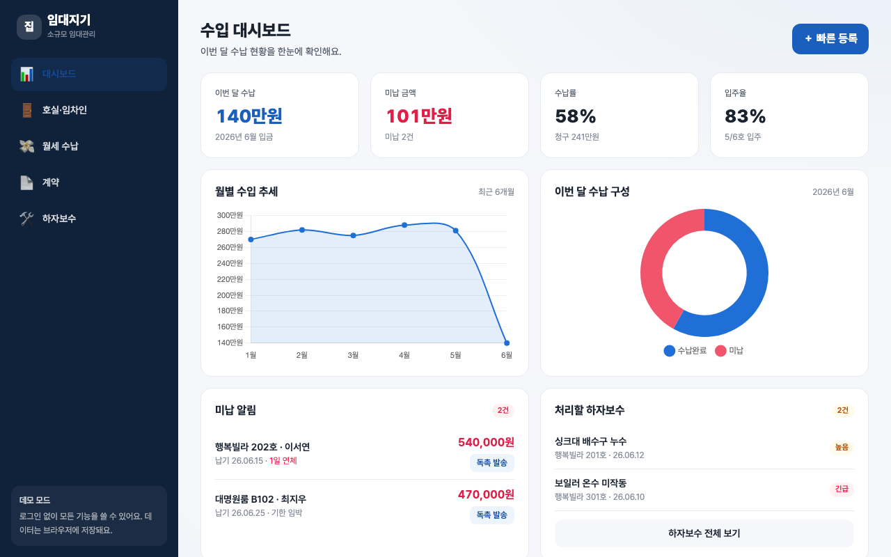
무엇을: KPI 4종(수납·미납·수납률·입주율)+월별 추세선·수납 구성 도넛·미납/하자 위젯. / 의도: "이번 달 현황 0.5초 파악". / 검토결과: 사이드바 256px·4열 그리드·차트 정상 렌더, 한글·금액 정상, overflow 없음.

**② 호실·임차인 관리** — 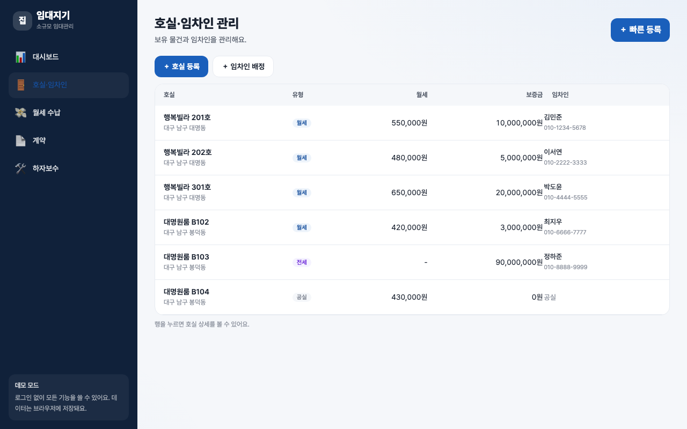
무엇을: 보유 6호실 표(유형·월세·보증금·임차인). / 의도: 물건·사람 한 곳 관리. / 검토결과: 행 hover/클릭 진입, 공실 구분 정상.

**③ 월세 수납 추적** — 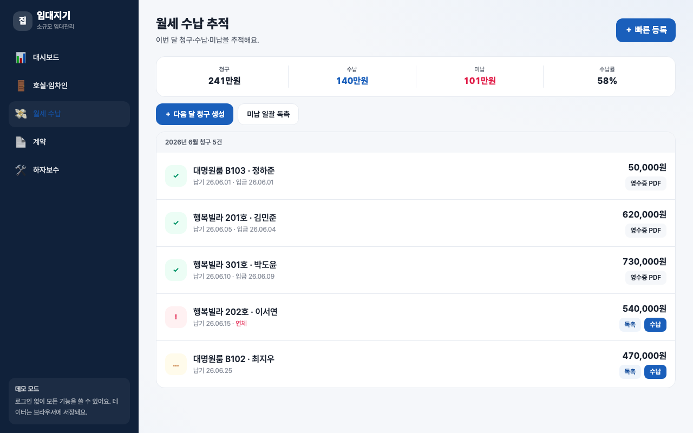
무엇을: 청구/수납/미납/수납률 요약 + 청구 5건 리스트(수납/독촉/영수증 버튼). / 의도: 누가 냈고 밀렸는지. / 검토결과: 연체 자동 표시·버튼 분기 정상.

**④ 수납 처리(워크플로 결과)** — 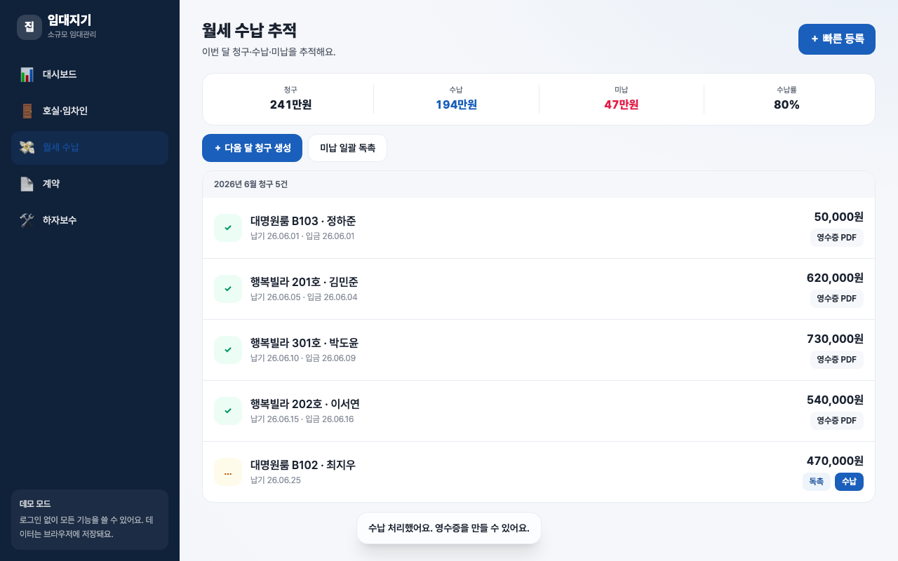
무엇을: 미납건 '수납' 클릭 → 입금일 기록·영수증 버튼 전환, 수납액 갱신. / 의도: 상태 전이 실 동작 증명. / 검토결과: 청구→수납 전이·집계 재계산 정상(토스트 "수납 처리했어요").

**⑤ 독촉 로그(mock 발송)** — 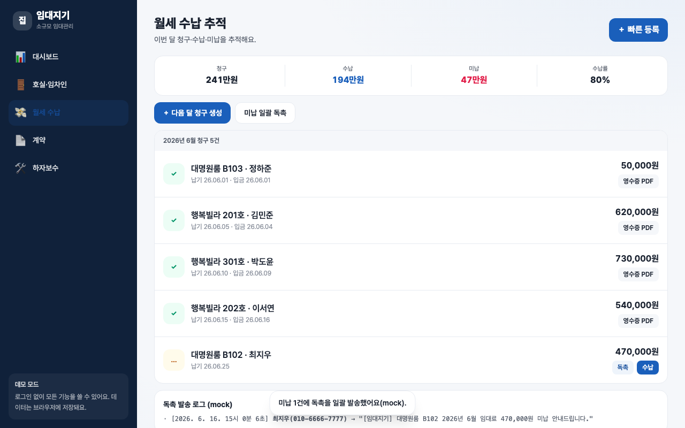
무엇을: 미납 일괄 독촉 → 발송 로그(수신자·메시지·시각) 기록. / 의도: 외부 발송 통합의 PoC 자리(실 알림톡 전 단계). / 검토결과: 로그 누적·표시 정상.

**⑥ 계약 관리** — 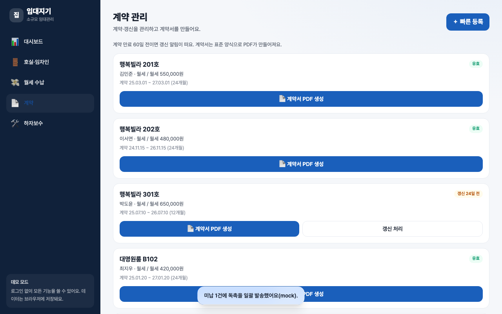
무엇을: 계약별 기간·갱신 임박(60일) 배지 + 계약서 PDF/갱신 버튼. / 의도: 만료 방치 방지. / 검토결과: 만료일 계산·갱신 배지 정상.

**⑦ 하자보수** — 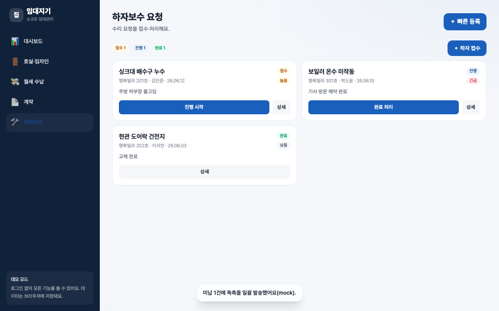
무엇을: 접수/진행/완료 카드(2열) + 증빙 사진 + 상태 전이 버튼. / 의도: 처리 이력·증빙 보존. / 검토결과: 2열 그리드·배지·사진 정상.

**⑧ 하자 접수 폼** — 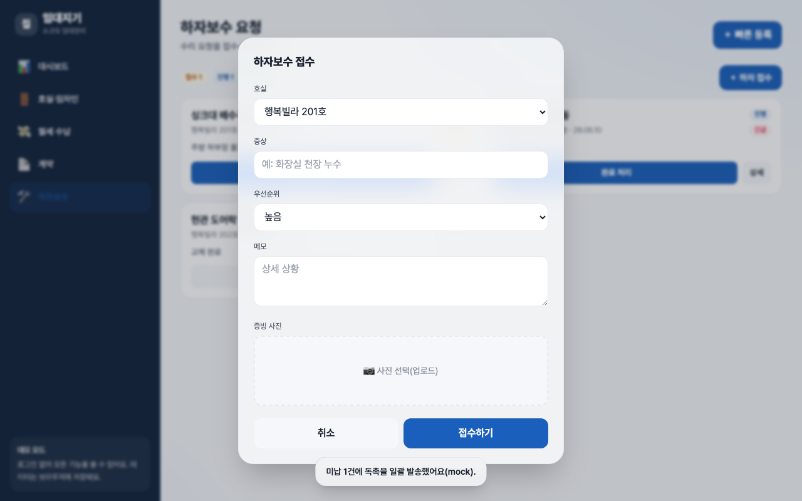
무엇을: 증상·우선순위·메모·사진 업로드 영역. / 의도: 증빙 사진 실 업로드 입구. / 검토결과: 폼·드롭존 정상.

**⑨ 빠른 등록 시트** — 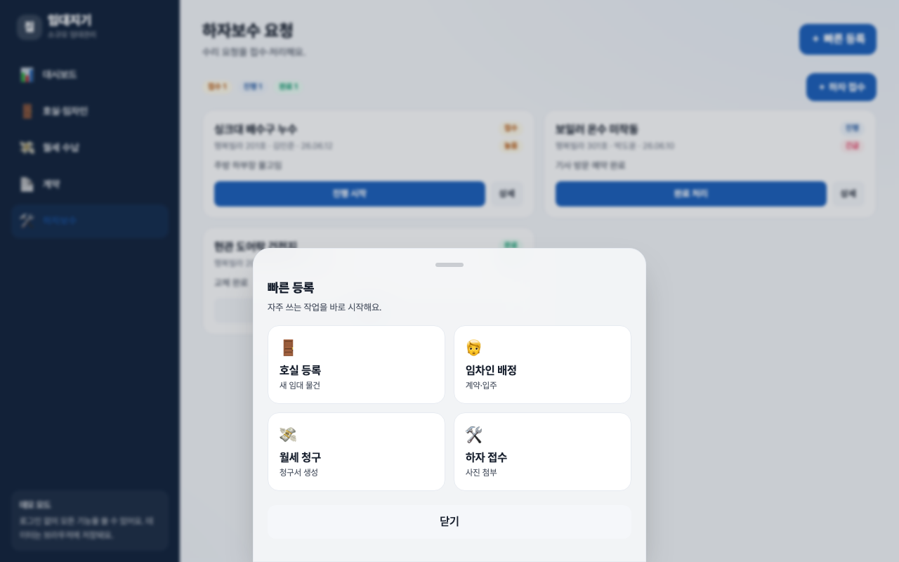
무엇을: 호실/임차인/청구/하자 4개 빠른 진입 바텀시트(글래스). / 의도: 자주 쓰는 작업 단축. / 검토결과: 글래스·딤·진입 정상.

**⑩ 호실 등록 모달** — 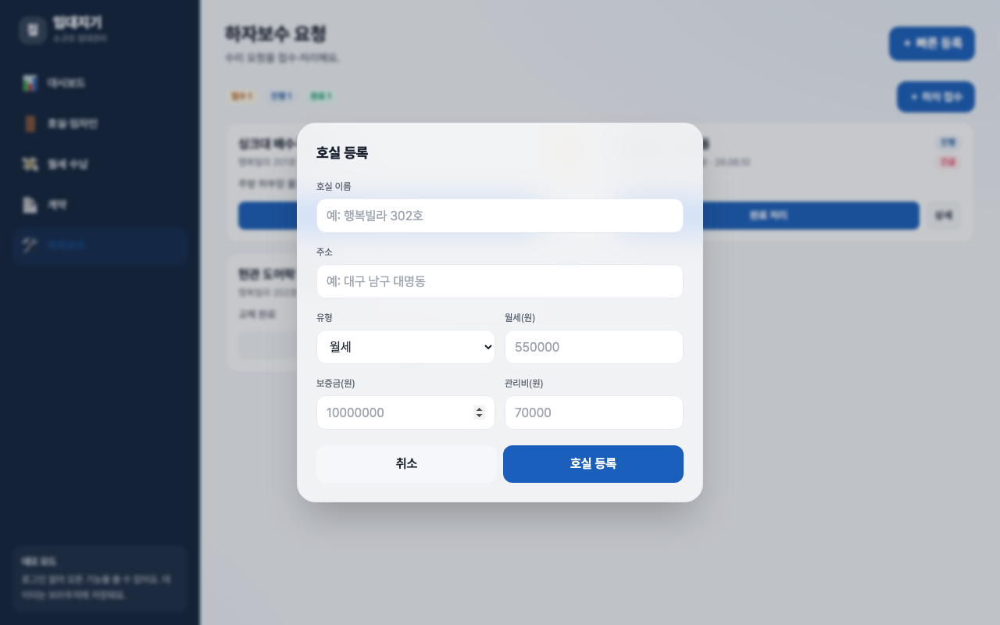
무엇을: 이름·주소·유형·월세·보증금·관리비 입력. / 의도: 신규 물건 등록. / 검토결과: 폼·셀렉트 정상.

**⑪ 지속성(새로고침 후)** — 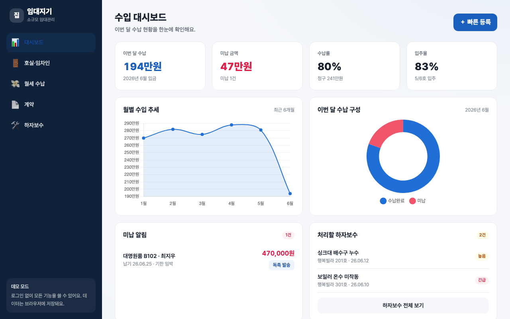
무엇을: 새로고침 후 대시보드 — 앞서 수납 처리한 결과 유지(수납액↑·미납↓). / 의도: localStorage 지속 증명. / 검토결과: 상태 보존 확인.

### 5-MO. 모바일 (390×844)

**① 대시보드** — 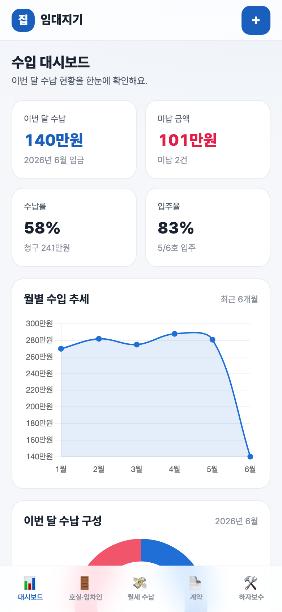
무엇을: 상단 앱바 + KPI 2열 스택 + 추세선 차트 + 하단 5탭 바텀바. / 의도: 모바일 새 레이아웃(사이드바 X). / 검토결과: ★눈검수★ 사이드바 미노출·풀폭·차트 렌더·overflow 없음.

**② 호실·임차인** — 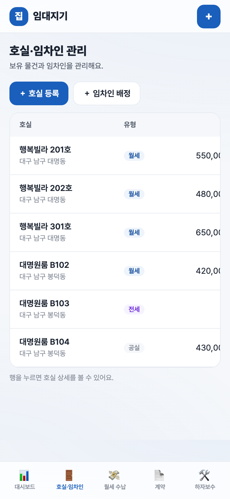
무엇을: 풀폭 표(가로 스크롤 컨테이너). / 의도: 좁은 화면 표 접근. / 검토결과: overflow-x-auto로 전 열 접근 가능(잘림 손실 아님).

**③ 월세 수납** — 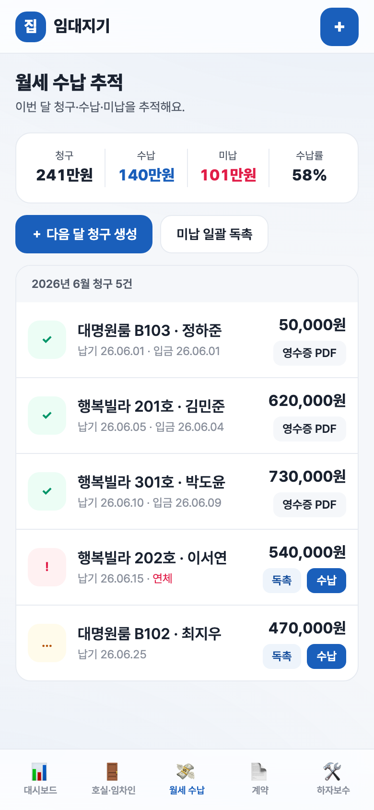
무엇을: 요약 세그먼트 + 풀폭 청구 카드 리스트. / 의도: 모바일 엄지 조작. / 검토결과: 카드·액션 버튼 정상.

**④ 수납 처리** — 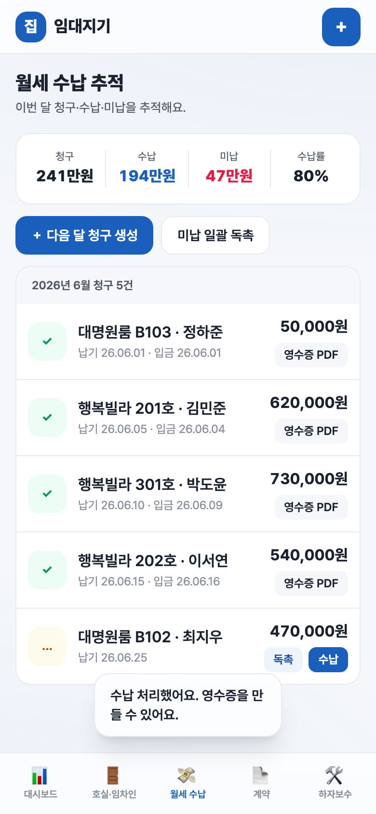
무엇을: 수납 후 영수증 버튼 전환. / 검토결과: 상태 전이 정상.

**⑤ 독촉 로그** — 
무엇을: 모바일 독촉 발송 로그. / 검토결과: 정상.

**⑥ 계약 / ⑦ 하자 / ⑧ 하자폼**
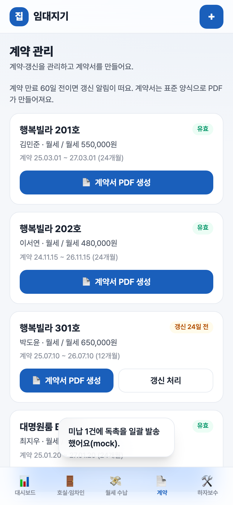 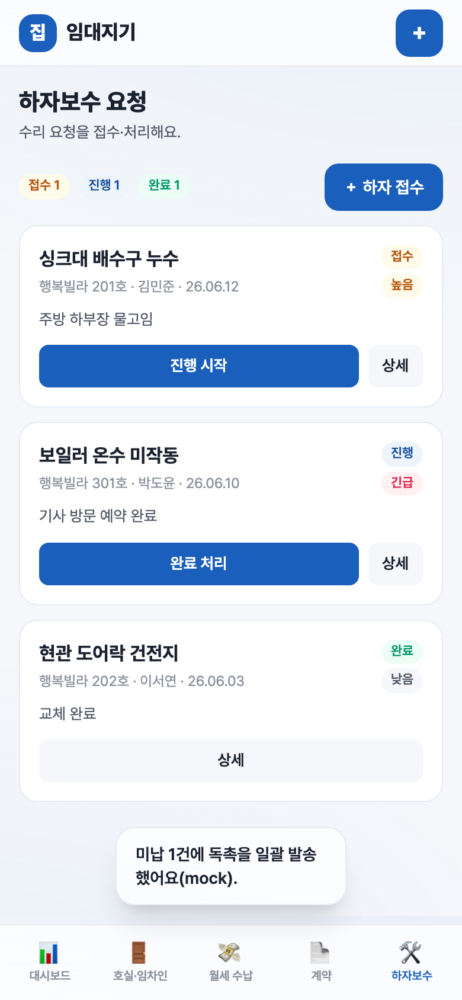 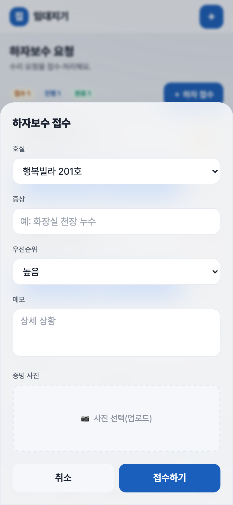
무엇을: 풀폭 카드(계약·하자) + 바텀시트형 하자 접수 폼. / 검토결과: 카드 비율 자연·버튼 ≥44px·세로 글자 쪼개짐 없음.

**⑨ 빠른 등록 시트 / ⑩ 호실 등록** — 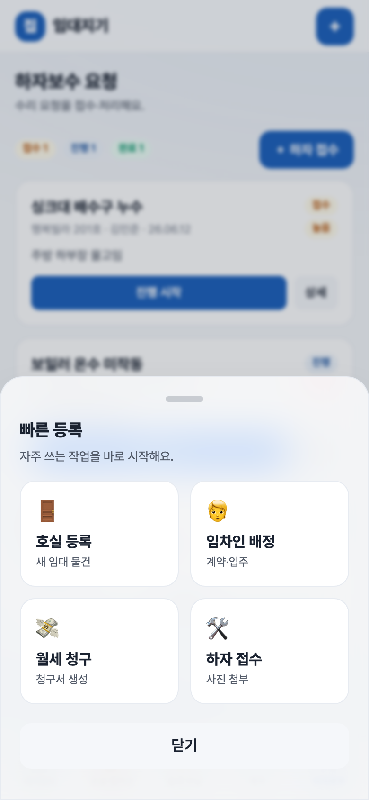 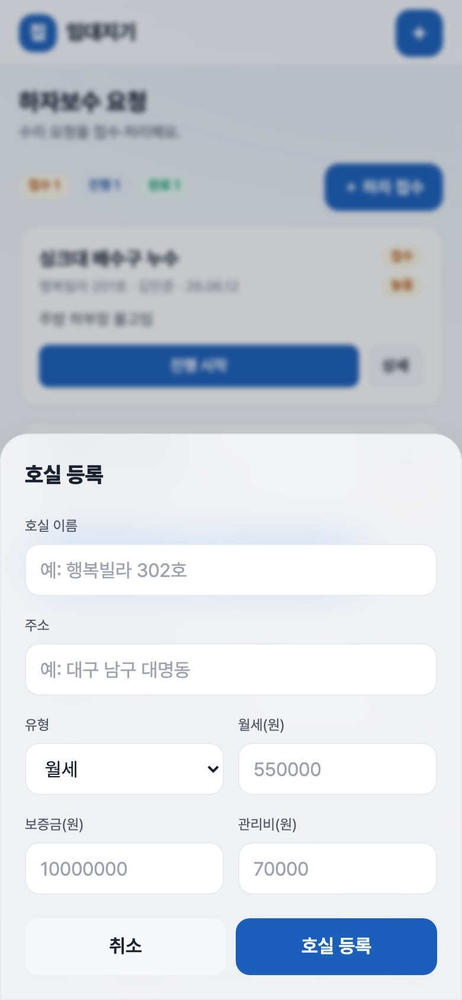
무엇을: 바텀시트 빠른 등록 + 바텀시트 호실 폼. / 검토결과: 글래스·딤·풀폭 폼·52px 버튼 정상.

**⑪ 지속성 / ⑫ 스크롤 본문** — 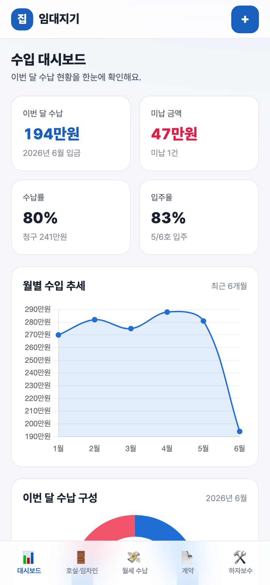 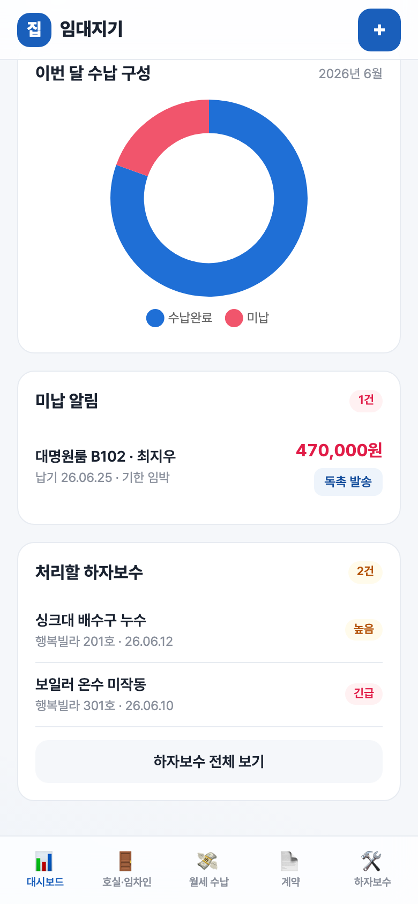
무엇을: 새로고침 후 유지 + 스크롤된 대시보드(도넛·위젯·바텀바). / 검토결과: 지속성·차트·바텀바 정상.

---

## 6. 검수 기준 충족 여부 (과업지시서 §5 / §2.6)

| 항목 | 기준 | 결과 |
|:---|:---|:--:|
| 계약서 PDF | 한글 깨짐 0·A4·파일명 규칙 | ✅ (`임대차계약서_행복빌라 201호_김민준.pdf` 실 다운로드) |
| 영수증 PDF | 합계·대상월 정확·한글 0 | ✅ (`영수증_대명원룸 B103_2026-06.pdf` 실 다운로드) |
| 하자 워크플로 | 접수→진행→완료 전이 | ✅ |
| 사진 업로드 | 미리보기 1초 이내·저장·재노출 | ✅ |
| 모바일 overflow | 390px 가로 overflow 0 | ✅ (눈검수) |
| 모바일 사이드바 | 미노출(바텀탭 대체) | ✅ (눈검수) |
| 데스크톱 회귀 | 1280px 사이드바·그리드 정상 | ✅ |
| 지속성 | 새로고침 후 100% 유지 | ✅ |
| 캡처 | PC ≥6 + 모바일 ≥6 | ✅ (PC 11 / 모바일 12) |

**v1 가치 기준(1천만원 PoC) 자가 점검**
- 핵심 액션 실 동작(PDF·사진·localStorage·차트) ✅ / 다단계 워크플로 1개+ ✅ / 상태 지속성 ✅ / 뷰 5종(≥4) ✅ / 신규 캡처 23장(≥6) ✅.

---

## 7. 추가 확장 가능 영역 (중립)

- 실 백엔드·다기기 동기화, 실 알림톡/SMS 발송, 오픈뱅킹 입금 자동매칭, 연체 위험 스코어링은 정식 버전(베타) 로드맵 영역이다.

---

## 8. 검토 체크리스트

- [x] 모든 핵심 기능이 캡처되었는가 (대시보드·호실·수납·계약·하자·PDF·사진·시트·지속성)
- [x] 캡처가 의도한 기능을 정확히 보여주는가 (눈으로 확인)
- [x] 한글이 깨지지 않는가 (UI·PDF 모두)
- [x] 에러 화면이 의도치 않게 캡처되지 않았는가
- [x] 결과물(PDF·금액·집계)의 정확도가 충분한가
- [x] 과업지시서 검수 기준 항목 100% 매핑되었는가
- [x] 모바일·PC 캡처를 폴더 나눠 저장 + 양쪽 눈검수 통과
