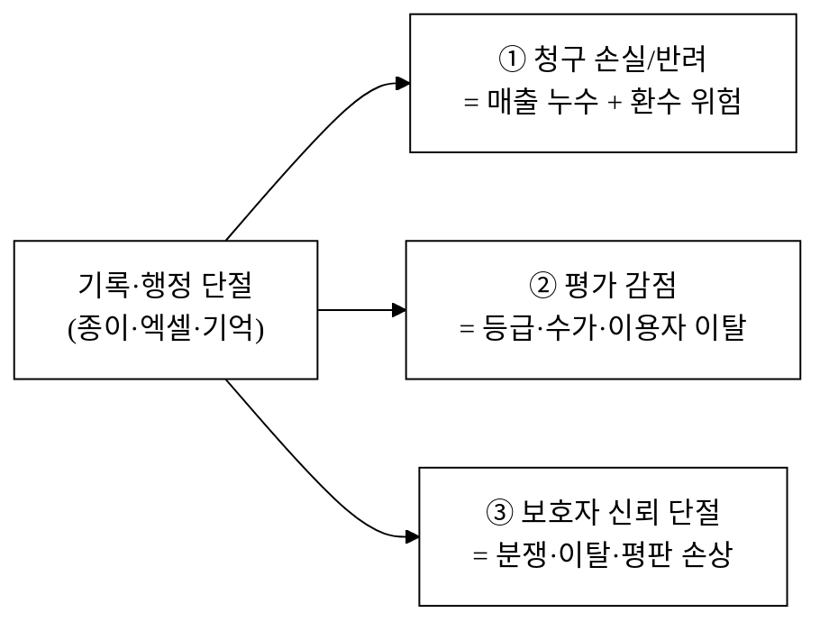
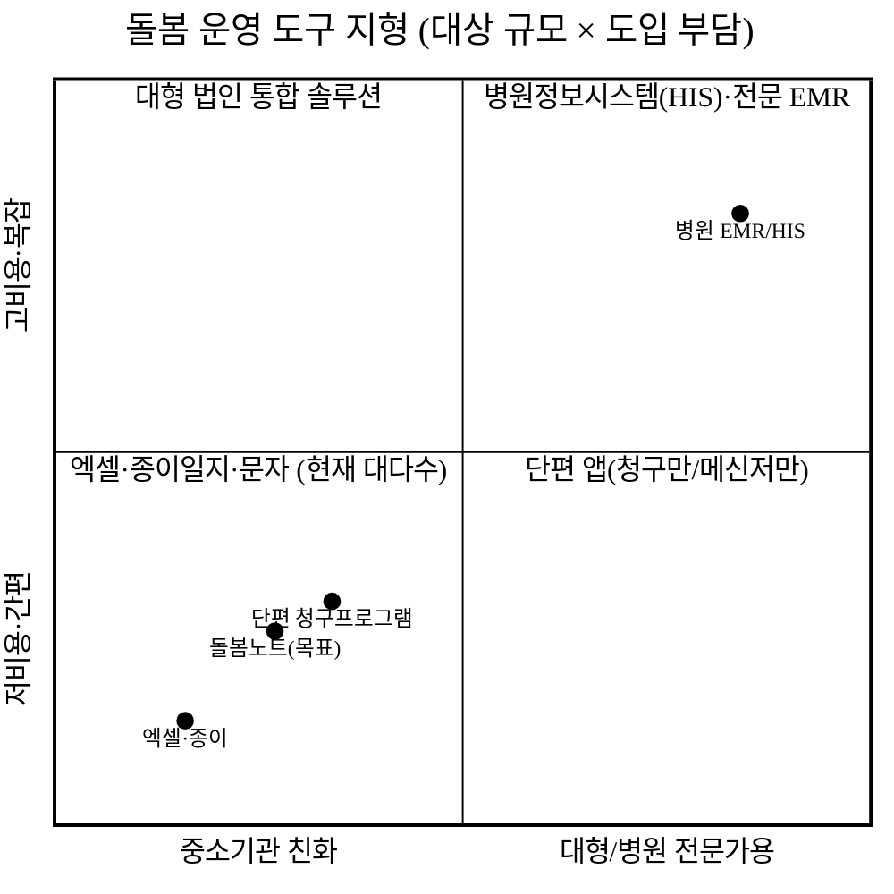
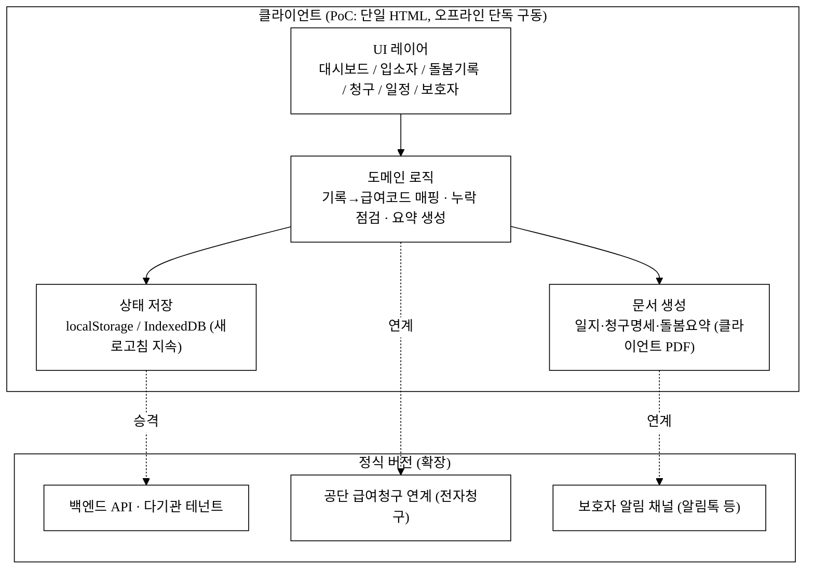
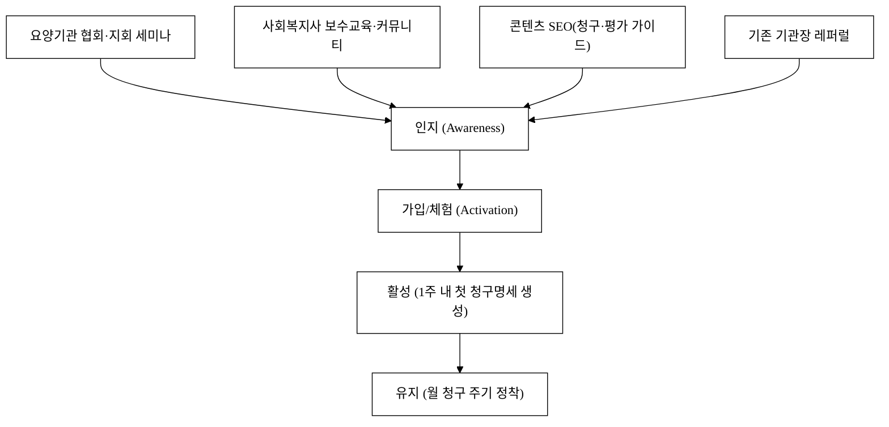

last_updated: 2026-06-18 14:30

# 돌봄노트 — 시니어 장기요양 기관 운영 SaaS

> 본 제안서는 공고가 요구하는 PSST(Problem · Solution · Scale-up · Team) 구조를 따른다.
> 그림자료는 학술 논문 형식·흑백(monochrome)으로 통일한다(레포 `CLAUDE.md` §2.0).
> Team 섹션은 골격만 두고 내용은 사용자가 직접 채운다([§Team](#4-team--팀)).

| 항목 | 내용 |
|:---|:---|
| 사업명 | 대구대학교 창업지원단 「2026년 창업동아리 지원사업(실전창업)」 |
| 주관기관 | 대구대학교 창업지원단 |
| 트랙 | 실전창업 |
| 지원금 | 기본 300만원 · 최대 1,000만원 |
| 모집기간 | 2026-03-19 ~ 2026-04-02 |
| 아이템 | 시니어 장기요양 기관(요양원·주야간보호·방문요양) 운영 SaaS 「돌봄노트」 |
| 타깃 | 정원 10~70인 규모의 중소 장기요양기관 — 시설장·사회복지사·요양보호사 |
| 산출물 | 웹 기반 운영관리 PoC(급여청구·돌봄기록·일정·복약·보호자 소통 통합) |

---

## 1. Problem — 문제

### P-1. "기록은 손으로, 청구는 밤에" — 종이에 갇힌 돌봄 현장

대한민국은 이미 초고령사회에 진입했다. 행정안전부 주민등록 인구 통계 기준 2024년 말 65세 이상 인구가 전체의 20%를 넘어섰고[^1], 통계청 장래인구추계는 이 비율이 2030년대에 30%에 육박할 것으로 본다[^2]. 그 결과 노인장기요양보험 수급 인정자는 매년 증가해 2023년 110만 명을 넘어섰으며[^3], 이들을 돌보는 장기요양기관(요양원·주야간보호·방문요양 등)도 함께 늘어 전국적으로 수만 개소가 운영되고 있다[^4].

문제는 이 기관들의 **대다수가 정원 수십 명 안팎의 영세·중소 시설**이라는 점이다. 대형 의료법인 산하 요양병원과 달리, 이들은 전산 인프라·전담 행정인력이 부족하다. 그래서 매일의 돌봄이 다음과 같이 굴러간다.

```mermaid
%%{init: {"theme":"base","themeVariables":{"darkMode":false,"background":"#ffffff","fontFamily":"Georgia, serif","primaryColor":"#ffffff","primaryBorderColor":"#000000","primaryTextColor":"#000000","secondaryColor":"#ffffff","secondaryBorderColor":"#000000","secondaryTextColor":"#000000","tertiaryColor":"#ffffff","tertiaryBorderColor":"#000000","tertiaryTextColor":"#000000","mainBkg":"#ffffff","secondBkg":"#ffffff","lineColor":"#000000","textColor":"#000000","nodeBorder":"#000000","nodeTextColor":"#000000","titleColor":"#000000","edgeLabelBackground":"#ffffff","defaultLinkColor":"#000000","clusterBkg":"#ffffff","clusterBorder":"#000000","actorBkg":"#ffffff","actorBorder":"#000000","actorTextColor":"#000000","actorLineColor":"#000000","signalColor":"#000000","signalTextColor":"#000000","labelBoxBkgColor":"#ffffff","labelBoxBorderColor":"#000000","labelTextColor":"#000000","loopTextColor":"#000000","noteBkgColor":"#ffffff","noteBorderColor":"#000000","noteTextColor":"#000000","activationBkgColor":"#ffffff","activationBorderColor":"#000000","sequenceNumberColor":"#000000","attributeBackgroundColorOdd":"#ffffff","attributeBackgroundColorEven":"#ffffff","sectionBkgColor":"#ffffff","altSectionBkgColor":"#ffffff","sectionBkgColor2":"#ffffff","taskBkgColor":"#ffffff","taskBorderColor":"#000000","taskTextColor":"#000000","taskTextLightColor":"#000000","taskTextOutsideColor":"#000000","taskTextDarkColor":"#000000","taskTextClickableColor":"#000000","activeTaskBkgColor":"#ffffff","activeTaskBorderColor":"#000000","doneTaskBkgColor":"#ffffff","doneTaskBorderColor":"#000000","critBkgColor":"#ffffff","critBorderColor":"#000000","gridColor":"#000000","todayLineColor":"#000000","quadrant1Fill":"#ffffff","quadrant2Fill":"#ffffff","quadrant3Fill":"#ffffff","quadrant4Fill":"#ffffff","quadrant1TextFill":"#000000","quadrant2TextFill":"#000000","quadrant3TextFill":"#000000","quadrant4TextFill":"#000000","quadrantPointFill":"#000000","quadrantPointTextFill":"#000000","quadrantXAxisTextFill":"#000000","quadrantYAxisTextFill":"#000000","quadrantInternalBorderStrokeFill":"#000000","quadrantExternalBorderStrokeFill":"#000000","quadrantTitleFill":"#000000","pieStrokeColor":"#000000","pieOuterStrokeColor":"#000000","pieTitleTextColor":"#000000","pieSectionTextColor":"#000000","pieLegendTextColor":"#000000","cScale0":"#ffffff","cScaleLabel0":"#000000","cScaleInv0":"#000000","pie1":"#ffffff","cScale1":"#ffffff","cScaleLabel1":"#000000","cScaleInv1":"#000000","pie2":"#ffffff","cScale2":"#ffffff","cScaleLabel2":"#000000","cScaleInv2":"#000000","pie3":"#ffffff","cScale3":"#ffffff","cScaleLabel3":"#000000","cScaleInv3":"#000000","pie4":"#ffffff","cScale4":"#ffffff","cScaleLabel4":"#000000","cScaleInv4":"#000000","pie5":"#ffffff","cScale5":"#ffffff","cScaleLabel5":"#000000","cScaleInv5":"#000000","pie6":"#ffffff","cScale6":"#ffffff","cScaleLabel6":"#000000","cScaleInv6":"#000000","pie7":"#ffffff","cScale7":"#ffffff","cScaleLabel7":"#000000","cScaleInv7":"#000000","pie8":"#ffffff","cScale8":"#ffffff","cScaleLabel8":"#000000","cScaleInv8":"#000000","pie9":"#ffffff","cScale9":"#ffffff","cScaleLabel9":"#000000","cScaleInv9":"#000000","pie10":"#ffffff","cScale10":"#ffffff","cScaleLabel10":"#000000","cScaleInv10":"#000000","pie11":"#ffffff","cScale11":"#ffffff","cScaleLabel11":"#000000","cScaleInv11":"#000000","pie12":"#ffffff"}}}%%
flowchart TD
    C["요양보호사<br/>(현장 돌봄)"]
    C --> R1["수기 돌봄기록<br/>(종이 일지·노트)"]
    C --> R2["복약·체위변경·식사<br/>(기억과 메모에 의존)"]
    SW["사회복지사·시설장<br/>(행정)"]
    SW --> B1["급여비용 청구<br/>(공단 포털에 월말 일괄 수기 입력)"]
    SW --> B2["근무·교육 이수 관리<br/>(엑셀·달력)"]
    SW --> B3["보호자 응대<br/>(전화·문자, 그때그때)"]
    R1 & R2 --> X(["기록 누락·청구 반려·평가 감점<br/>·보호자 불신 — 전부 기관 부담"])
    B1 & B2 & B3 --> X
```

**그림 1.** 종이·엑셀에 의존하는 중소 장기요양기관의 업무 흐름과 누적 리스크.

그림 1처럼, 현장의 돌봄 행위(복약·체위변경·식사·배설·활력징후)는 **종이 일지에 손으로** 적히고, 행정(급여청구·근무·교육이수·보호자 응대)은 **엑셀과 기억**으로 처리된다. 두 흐름은 서로 연결되어 있지 않다. 손으로 적은 일지가 청구·평가의 근거가 되어야 하는데, 그 사이를 사람이 매번 옮겨 적는다.

### P-2. 세 가지 손실 — 돈·평가·신뢰

이 단절은 추상적 불편이 아니라 **측정 가능한 손실**로 나타난다.

- **청구 손실·반려:** 장기요양 급여비용은 국민건강보험공단에 청구해 지급받는다[^5]. 제공한 서비스가 기록·코드와 정확히 맞지 않으면 심사 과정에서 조정·반려·환수가 발생한다. 월말에 한 달치 종이 일지를 보고 청구 코드를 역산하는 방식은 **누락(청구 못 한 서비스 = 받지 못한 매출)**과 **오류(과청구 = 환수·행정처분 리스크)**를 동시에 키운다.
- **평가 감점:** 공단은 장기요양기관 정기 평가를 실시하고 그 등급이 가산·수가·이용자 선택에 직결된다[^6]. 평가의 상당 부분이 **기록의 충실성**(돌봄계획·제공기록·욕구사정 등)을 본다. 기록이 종이에 흩어져 있으면 평가 준비에만 수 주가 들고, 빠진 기록은 그대로 감점이 된다.
- **보호자 신뢰 단절:** 입소 어르신의 가족은 부모가 어떻게 지내는지 거의 알지 못한다. "오늘 식사 잘 하셨나요"를 전화로 묻고, 기관은 그때그때 구두로 답한다. 사건(낙상·발열·전원)이 생겨야 비로소 연락이 오가는 **사후·수동 소통** 구조는 작은 오해도 분쟁으로 키운다. 노인학대·돌봄 품질에 대한 사회적 민감도는 계속 높아지고 있다[^7].

**그림 2.** 기록-행정 단절이 만드는 세 갈래 손실 구조.

### P-3. 기존 도구의 공백 — "병원용은 과하고, 엑셀은 모자라다"

그렇다면 왜 소프트웨어를 쓰지 않을까. **중소 장기요양기관에 맞는 도구가 비어 있기 때문**이다.

**그림 3.** 돌봄 운영 도구 지형. 병원용 시스템은 과하고, 엑셀·종이는 모자란 중간 지대가 비어 있다.

병원정보시스템(HIS)·전문 EMR은 의료기관용이라 가격·복잡도·도입 교육 부담이 영세 시설에 과하다. 반대편엔 엑셀·종이·문자가 있는데, 이것들은 **돌봄기록 → 급여청구 → 평가근거 → 보호자 공유**를 하나의 흐름으로 잇지 못한다. 그 사이에 청구만 해주는 단편 프로그램, 메신저만 있는 앱이 흩어져 있지만, **현장 한 번 입력으로 청구·평가·소통이 동시에 채워지는** 도구는 비어 있다. 그림 3의 비어 있는 좌하단 중간 지대가 돌봄노트의 자리다.

---

## 2. Solution — 솔루션

### S-1. 돌봄노트 한 줄 정의

> **돌봄노트는 현장의 돌봄기록 한 번으로 급여청구·평가근거·보호자 공유가 동시에 채워지는, 중소 장기요양기관을 위한 가장 가벼운 운영 SaaS다.**

복잡한 의료 EMR 기능을 다 넣지 않는다. 중소 시설이 **매일·매월 실제로 반복하는 일**만 정확히, 빠르게, 흔적이 남게 처리한다.

### S-2. 핵심 기능 (PoC에서 실 동작 목표)

| 기능 | 무엇을 해결 | PoC 구현 방향 |
|:---|:---|:---|
| ① 운영 대시보드 | "오늘 우리 시설은 괜찮은가?"를 한눈에 | 재원 인원·출결·복약 이행률·미청구 건수 KPI + 추세 차트 |
| ② 입소자 프로필 | 어르신 한 명의 모든 것을 한 곳에 | 기본정보·등급·질환·낙상위험·돌봄계획 + 이력 타임라인 |
| ③ 돌봄기록 (현장 1탭 입력) | 식사·복약·체위변경·배설·활력징후 | 라운드 단위 체크 입력 → 자동 일지화 + 누락 알림 |
| ④ 급여청구 보조 | 기록을 청구 코드로 자동 환산 | 제공기록 → 급여코드 매핑 → 월 청구 명세 미리보기 + 오류 점검 |
| ⑤ 일정·복약 관리 | 투약·처치·교육 일정 누락 방지 | 복약 스케줄·근무표·교육이수 캘린더 + 임박 알림 |
| ⑥ 보호자 소통 | 사후·수동 소통을 정기·자동으로 | 일일 돌봄 요약 카드 자동 생성 → 보호자 알림(mock 발송 로그) |

### S-3. 핵심 워크플로 — 한 번 입력, 세 곳이 채워진다

돌봄노트의 차별점은 개별 기능이 아니라 **한 번의 현장 입력이 어디까지 흐르는가**다. 요양보호사가 라운드 때 어르신의 식사·복약·체위변경을 1탭으로 체크하면, 그 데이터가 일지·청구근거·보호자 요약으로 동시에 갈라져 흐른다.

```mermaid
%%{init: {"theme":"base","themeVariables":{"darkMode":false,"background":"#ffffff","fontFamily":"Georgia, serif","primaryColor":"#ffffff","primaryBorderColor":"#000000","primaryTextColor":"#000000","secondaryColor":"#ffffff","secondaryBorderColor":"#000000","secondaryTextColor":"#000000","tertiaryColor":"#ffffff","tertiaryBorderColor":"#000000","tertiaryTextColor":"#000000","mainBkg":"#ffffff","secondBkg":"#ffffff","lineColor":"#000000","textColor":"#000000","nodeBorder":"#000000","nodeTextColor":"#000000","titleColor":"#000000","edgeLabelBackground":"#ffffff","defaultLinkColor":"#000000","clusterBkg":"#ffffff","clusterBorder":"#000000","actorBkg":"#ffffff","actorBorder":"#000000","actorTextColor":"#000000","actorLineColor":"#000000","signalColor":"#000000","signalTextColor":"#000000","labelBoxBkgColor":"#ffffff","labelBoxBorderColor":"#000000","labelTextColor":"#000000","loopTextColor":"#000000","noteBkgColor":"#ffffff","noteBorderColor":"#000000","noteTextColor":"#000000","activationBkgColor":"#ffffff","activationBorderColor":"#000000","sequenceNumberColor":"#000000","attributeBackgroundColorOdd":"#ffffff","attributeBackgroundColorEven":"#ffffff","sectionBkgColor":"#ffffff","altSectionBkgColor":"#ffffff","sectionBkgColor2":"#ffffff","taskBkgColor":"#ffffff","taskBorderColor":"#000000","taskTextColor":"#000000","taskTextLightColor":"#000000","taskTextOutsideColor":"#000000","taskTextDarkColor":"#000000","taskTextClickableColor":"#000000","activeTaskBkgColor":"#ffffff","activeTaskBorderColor":"#000000","doneTaskBkgColor":"#ffffff","doneTaskBorderColor":"#000000","critBkgColor":"#ffffff","critBorderColor":"#000000","gridColor":"#000000","todayLineColor":"#000000","quadrant1Fill":"#ffffff","quadrant2Fill":"#ffffff","quadrant3Fill":"#ffffff","quadrant4Fill":"#ffffff","quadrant1TextFill":"#000000","quadrant2TextFill":"#000000","quadrant3TextFill":"#000000","quadrant4TextFill":"#000000","quadrantPointFill":"#000000","quadrantPointTextFill":"#000000","quadrantXAxisTextFill":"#000000","quadrantYAxisTextFill":"#000000","quadrantInternalBorderStrokeFill":"#000000","quadrantExternalBorderStrokeFill":"#000000","quadrantTitleFill":"#000000","pieStrokeColor":"#000000","pieOuterStrokeColor":"#000000","pieTitleTextColor":"#000000","pieSectionTextColor":"#000000","pieLegendTextColor":"#000000","cScale0":"#ffffff","cScaleLabel0":"#000000","cScaleInv0":"#000000","pie1":"#ffffff","cScale1":"#ffffff","cScaleLabel1":"#000000","cScaleInv1":"#000000","pie2":"#ffffff","cScale2":"#ffffff","cScaleLabel2":"#000000","cScaleInv2":"#000000","pie3":"#ffffff","cScale3":"#ffffff","cScaleLabel3":"#000000","cScaleInv3":"#000000","pie4":"#ffffff","cScale4":"#ffffff","cScaleLabel4":"#000000","cScaleInv4":"#000000","pie5":"#ffffff","cScale5":"#ffffff","cScaleLabel5":"#000000","cScaleInv5":"#000000","pie6":"#ffffff","cScale6":"#ffffff","cScaleLabel6":"#000000","cScaleInv6":"#000000","pie7":"#ffffff","cScale7":"#ffffff","cScaleLabel7":"#000000","cScaleInv7":"#000000","pie8":"#ffffff","cScale8":"#ffffff","cScaleLabel8":"#000000","cScaleInv8":"#000000","pie9":"#ffffff","cScale9":"#ffffff","cScaleLabel9":"#000000","cScaleInv9":"#000000","pie10":"#ffffff","cScale10":"#ffffff","cScaleLabel10":"#000000","cScaleInv10":"#000000","pie11":"#ffffff","cScale11":"#ffffff","cScaleLabel11":"#000000","cScaleInv11":"#000000","pie12":"#ffffff"}}}%%
flowchart LR
    I["① 현장 라운드 입력<br/>(식사·복약·체위·활력 1탭 체크)"]
    I --> J["② 자동 일지화<br/>(돌봄기록 누적)"]
    J --> B["③ 급여청구 근거<br/>(제공기록→급여코드 매핑)"]
    J --> E["④ 평가 근거 축적<br/>(기록 충실도 자동 집계)"]
    J --> F["⑤ 보호자 일일 요약<br/>(요약 카드 자동 생성)"]
    B --> C{"⑥ 청구 점검"}
    C -- "정합" --> S["월 청구 명세 확정"]
    C -- "누락/오류" --> W["경고 표시 → 보정"]
    W --> C
```

**그림 4.** 돌봄노트 핵심 워크플로 — 현장 1회 입력이 일지·청구·평가·보호자 소통으로 동시 분기한다.

그림 4의 다단계 워크플로(현장입력 → 일지 → 청구/평가/보호자)는 PoC에서 토스트 mock이 아니라 **실제 상태 전이**로 구현하는 것을 목표로 한다 — 라운드 체크 시 로컬 저장소가 갱신되고, 새로고침해도 유지되며, 청구 명세·보호자 요약은 실제로 생성·표시된다(개발결과보고서 v1에서 입증 예정).

### S-4. 시스템 아키텍처 (PoC)

PoC는 **오프라인 단독 구동**을 원칙으로 한다(심사·시연 환경에서 인터넷·서버 없이 동작). 정식 버전은 동일 데이터 모델을 백엔드로 승격하고 공단 청구·전자문서와 연계한다.

**그림 5.** PoC 아키텍처와 정식 버전 확장 경로. PoC는 단일 HTML·오프라인으로 자체 완결하고, 동일 데이터 모델을 백엔드·공단연계로 승격한다.

---

## 경영혁신·창업학적 프레임워크

본 사업은 단순한 "요양원 관리 프로그램"이 아니라, **비어 있는 시장 구간을 새로운 가치 곡선으로 여는 시도**다. 이를 세 가지 학술·경영 이론으로 정당화한다.

### (1) Christensen 파괴적 혁신 — 저가·과소만족 고객에서 시작

Clayton Christensen의 파괴적 혁신(Disruptive Innovation) 이론[^8]은, 기존 강자가 외면하는 **과소만족(under-served)·비소비(non-consumption) 고객**에서 출발해 점진적으로 주류로 올라오는 혁신을 설명한다. 병원용 EMR·HIS는 대형 의료기관(상위 고객)을 향하며 영세 요양기관을 외면한다. 그 결과 중소 시설은 아예 소프트웨어를 안 쓰는 **비소비 상태**에 머문다(그림 3). 돌봄노트는 바로 이 비소비 구간을 "충분히 좋고, 충분히 싸고, 충분히 간단한" 도구로 점유한 뒤, 데이터·연계 기능을 쌓아 위로 올라가는 전형적 파괴 경로에 있다.

### (2) Kim·Mauborgne 블루오션 — 가치 곡선 재설계

블루오션 전략(Blue Ocean Strategy)의 ERRC 격자[^9]로 본 사업의 가치 곡선을 재설계한다.

| 격자 | 적용 |
|:---|:---|
| 제거(Eliminate) | 병원 EMR식 복잡한 의료·검사 모듈, 전담 전산인력 전제 |
| 감소(Reduce) | 도입 교육 시간, 초기 도입 비용, 입력 클릭 수 |
| 증가(Raise) | 현장 입력의 즉시성, 청구-기록 정합성, 보호자 투명성 |
| 창조(Create) | "1회 입력 → 청구·평가·보호자 동시 충족"이라는 단일 흐름 |

**표 1.** 블루오션 ERRC 격자 — 돌봄노트의 가치 곡선 재설계.

표 1처럼, 경쟁의 축(기능 풍부함·의료 정밀도)을 따라가지 않고 **간편함·정합성·투명성**이라는 다른 축으로 곡선을 옮긴다.

### (3) Ries 린 스타트업 + JTBD — 검증 가능한 가설

본 PoC 자체가 린 스타트업(Lean Startup)[^10]의 MVP다. "현장 1회 입력으로 청구·평가·보호자가 채워지면 시설이 돈을 낼 것"이라는 가설을, 실제 기관에서 측정 가능한 지표(청구 반려율, 평가 준비시간, 보호자 문의 감소)로 검증한다. 고객이 진짜 해결하고 싶은 일(Jobs To Be Done)[^11]은 "프로그램을 쓰는 것"이 아니라 **"받을 돈을 빠짐없이 받고, 평가에서 깎이지 않고, 보호자와 싸우지 않는 것"**이다. 돌봄노트의 기능은 모두 이 세 Job으로 환원된다.

> 연결: 블루오션 = 차별성(§차별성), 린스타트업·JTBD = 고객확보·구매동인(§GTM·§구매동인 논증).

---

## 고객확보(GTM)

### G-1. ICP (이상적 고객 프로파일)

| 축 | 1차 ICP | 비고 |
|:---|:---|:---|
| 기관 유형 | 요양원(노인요양시설)·주야간보호센터 | 방문요양은 2차 확장 |
| 규모 | 정원 10~70인 | 전담 전산인력 없는 구간 |
| 의사결정자 | 시설장(대표) | 청구·평가 손실의 직접 책임자 |
| 사용자 | 사회복지사(청구·평가)·요양보호사(현장기록) | 실제 매일 쓰는 사람 |
| 페인 강도 | 청구 반려 경험 + 평가 임박 | "지금 아픈" 시설 우선 |

### G-2. 채널별 전술

**그림 6.** 인지 → 활성 → 유지 퍼널과 채널.

- **오가닉·콘텐츠:** "장기요양 평가 대비 체크리스트", "급여청구 반려 줄이는 법" 같은 실무 가이드 콘텐츠로 시설장·사회복지사 검색 유입을 만든다. 이들은 평가·청구철에 반드시 검색한다.
- **제휴·오프라인:** 지역 요양기관 협회·지회, 사회복지사 보수교육, 요양보호사 교육원과 제휴해 시연·세미나를 연다. B2B 의사결정은 신뢰가 핵심이라 오프라인 접점이 효과적이다.
- **레퍼럴:** 시설장 커뮤니티는 좁고 촘촘하다. 한 시설의 "청구 반려가 줄었다"는 경험이 인근 시설로 빠르게 전파된다(네트워크 전파).

### G-3. 첫 100 / 첫 1,000 시설 확보 계획

- **첫 100 시설:** 무료 베타로 지역(예: 대구·경북) 중소 요양원에 직접 영업·시연. 한 곳을 깊게 성공시켜 레퍼런스 케이스(청구 반려 −N%, 평가 준비시간 −N시간)를 만든다. [추정] 초기 12~18개월 목표.
- **첫 1,000 시설:** 레퍼런스 + 협회 제휴 + 콘텐츠 유입을 결합해 전국으로 확장. 평가·청구라는 **공통 주기**가 있어 도입 시점이 계절적으로 몰린다(평가 시즌 직전이 골든타임).

### G-4. CAC·리텐션 가설

- **예상 CAC:** B2B SaaS·오프라인 영업 혼합 특성상 시설당 획득비용은 콘텐츠·레퍼럴 비중을 높여 낮춘다. 구체 수치는 베타 후 실측. [추정]
- **리텐션 가설:** 청구·평가는 **매월·매년 반복**되는 강제 주기다. 한 번 기관의 청구·기록 흐름에 들어가면 교체 비용이 크다 → 높은 그로스 리텐션을 기대(§차별성 전환비용 항목과 연결).

---

## 수익모델

### R-1. 수익원

| 수익원 | 내용 |
|:---|:---|
| ① 기관 구독(SaaS) | 시설 단위 월정액 — 규모(정원)·기능 티어별 |
| ② 좌석/사용자 추가 | 일정 사용자 초과 시 좌석 과금 |
| ③ 부가 모듈 | 청구 심화 분석·평가 자동 리포트·보호자 알림 채널 등 |
| ④ B2B 라이선스 | 다기관 운영 법인·프랜차이즈 대상 통합 라이선스 |

핵심은 **거래 수수료가 아니라 운영 구독**이다. 돌봄 데이터에 수수료를 매기는 모델은 신뢰·규제상 부적절하므로, **반복 행정을 대신해 주는 대가로 정액 구독**을 받는다.

### R-2. 가격 정책 (방향)

소규모 시설이 "병원 EMR은 과하다"고 느낀 가격 장벽을 넘지 않도록, **월 구독액이 청구 1~2건 회수·평가 1등급 차이보다 작게** 설계한다. 구체 금액은 베타 가격 실험으로 확정한다. [추정]

### R-3. 단위경제성 (프레임)

본 PoC 단계에서 LTV·CAC의 절대값은 아직 실측 전이므로 **[추정] 프레임만 제시**하고, 베타에서 채운다. 검증된 외부 수치와 섞지 않는다([§데이터 정직성](#데이터-정직성-선언)).

| 지표 | 정의 | 본 사업의 구조적 유리함 |
|:---|:---|:---|
| LTV | (월 구독 × 기여이익률) × 평균 유지개월 | 청구·평가가 반복 주기라 유지개월이 길다 → LTV↑ |
| CAC | 채널 비용 ÷ 획득 시설 수 | 레퍼럴·콘텐츠 비중↑ → CAC↓ |
| LTV/CAC | 3 이상 목표 | 위 두 효과로 달성 가능성 [추정] |
| 회수기간 | CAC ÷ 월 기여이익 | 정액 구독·낮은 한계비용(SaaS)으로 단축 |

**표 2.** 단위경제성 프레임 (절대값은 베타 실측 전 [추정]).

### R-4. 매출 시나리오 (구조, 3안)

| 시나리오 | 가정 | 성격 |
|:---|:---|:---|
| 보수 | 지역 한정·레퍼럴 위주 저속 확산 | 협회 제휴 지연 가정 |
| 기본 | 콘텐츠+제휴+레퍼럴 결합 정상 확산 | 평가 시즌 도입 집중 |
| 공격 | 다기관 법인·프랜차이즈 라이선스 조기 체결 | B2B 대형 계약 견인 |

절대 금액은 베타 가격·전환율 실측 후 확정한다(현 단계 창작 금지).

---

## 차별성·경쟁우위(Moat)

### M-1. 경쟁자 비교

| 구분 | 종이·엑셀·문자 | 단편 청구프로그램 | 병원 EMR/HIS | 메신저형 소통앱 | **돌봄노트** |
|:---|:---|:---|:---|:---|:---|
| 대상 | 모든 영세 시설 | 청구 담당 | 대형 의료기관 | 보호자 소통만 | 중소 요양기관 |
| 현장 기록 | 종이 일지 | 없음 | 의료 중심·복잡 | 없음 | 1탭 라운드 입력 |
| 청구 연계 | 수기 역산 | 청구만 | 의료수가 중심 | 없음 | 기록→급여코드 자동 |
| 평가 근거 | 흩어짐 | 부분 | 과함 | 없음 | 자동 집계 |
| 보호자 공유 | 전화·문자 | 없음 | 없음 | 메신저 | 일일 요약 자동 |
| 도입 부담 | 0(이지만 손실 큼) | 중 | 매우 높음 | 낮음 | 낮음(오프라인 단독 시연) |

**표 3.** 직접·간접 경쟁자 비교. 돌봄노트는 "1회 입력 → 청구·평가·보호자 동시 충족"을 단일 흐름으로 묶는 유일한 위치다.

### M-2. 차별점 50+ 도출

차별점을 **8개 카테고리(기술·데이터·운영·규제·가격·GTM·네트워크효과·UX)**로 묶어 50개 이상 도출한다. 각 항목은 *경쟁사 현황 → 우리 차별점 → 고객 가치*로 정리한다. 핵심 항목은 §구매동인 논증으로 연결한다. 본 표의 가치 수치 중 검증 전 자체 추정은 `[추정]`으로 표기한다(부풀리기 금지, `CLAUDE.md` §2.6).

**표 4.** 차별점 도출 (현재 56개 / 목표 50+).

| # | 카테고리 | 경쟁사 현황 | 우리 차별점 | 고객 가치 |
|---:|:---|:---|:---|:---|
| 1 | 기술 | 기록과 청구가 분리 | 기록→급여코드 자동 매핑 | 월말 역산 노동 제거 |
| 2 | 기술 | 월말 일괄 청구 | 일 단위 청구근거 실시간 적립 | 누락 조기 발견 |
| 3 | 기술 | 청구 오류 사후 발견 | 청구 전 정합성 자동 점검 | 반려율 ↓ [추정] |
| 4 | 기술 | 종이 일지 수기 | 라운드 1탭 체크 입력 | 입력시간 ↓ |
| 5 | 기술 | 서버·설치형 | 단일 HTML 오프라인 단독 구동 | 인터넷 없이 시연·운영 |
| 6 | 기술 | 새로고침 시 유실 위험 | localStorage/IndexedDB 상태 지속 | 데이터 안전 |
| 7 | 기술 | PDF 외주·수기 | 일지·명세·요약 클라이언트 PDF 자동 생성 | 문서 즉시 출력 |
| 8 | 기술 | 복약 누락 사람 의존 | 복약 스케줄 임박 알림 | 투약 사고 ↓ |
| 9 | 기술 | 단일 화면 표시 | 다단계 상태 전이 워크플로 | 일 처리 흐름화 |
| 10 | 기술 | 기능별 분절 앱 | 단일 입력 → 다중 분기 | 중복 입력 제거 |
| 11 | 데이터 | 데이터 자산화 안 됨 | 돌봄·청구·평가 데이터 구조화 축적 | 평가·분석 근거 확보 |
| 12 | 데이터 | 시계열 단절 | 입소자별 이력 타임라인 | 상태 변화 추적 |
| 13 | 데이터 | 낙상·발열 사후 인지 | 위험지표 기록·집계 | 사고 예방 신호 |
| 14 | 데이터 | 평가 자료 수작업 수집 | 기록 충실도 자동 집계 | 평가 준비시간 ↓ [추정] |
| 15 | 데이터 | 청구-기록 불일치 방치 | 불일치 자동 탐지 | 환수 위험 ↓ |
| 16 | 데이터 | 보호자에 데이터 미공개 | 일일 돌봄 데이터 요약화 | 투명성 ↑ |
| 17 | 데이터 | 시설 간 비교 불가 | 표준 지표화(이행률 등) | 운영 벤치마크 |
| 18 | 데이터 | 인력·교육 분산 관리 | 근무·교육이수 통합 기록 | 평가 인력기준 충족 |
| 19 | 데이터 | 식사·수분 미기록 | 영양·수분 섭취 기록 | 건강관리 근거 |
| 20 | 데이터 | 활력징후 산발 기록 | 활력징후 추세 집계 | 이상 조기 발견 |
| 21 | 운영 | 부서 간 정보 단절 | 요양보호사-사회복지사-시설장 한 화면 | 인계 누락 ↓ |
| 22 | 운영 | 인계 구두·메모 | 기록 기반 자동 인계 | 교대 사고 ↓ |
| 23 | 운영 | 청구 전담자 의존 | 누구나 청구근거 적립 | 담당 부재 리스크 ↓ |
| 24 | 운영 | 평가철 야근 집중 | 상시 평가 근거 적립 | 업무 평준화 |
| 25 | 운영 | 누락을 사람이 점검 | 미입력 자동 알림 | 기록 완결성 ↑ |
| 26 | 운영 | 일정 수기 달력 | 처치·교육 캘린더 통합 | 일정 누락 ↓ |
| 27 | 운영 | 보호자 응대 즉흥 | 정기 요약 자동 발송(mock) | 응대 부담 ↓ |
| 28 | 운영 | 도입 교육 수일 | 1탭 UX로 교육 최소화 | 도입 마찰 ↓ |
| 29 | 운영 | 종이 보관·분실 | 디지털 보관·검색 | 자료 분실 0 |
| 30 | 운영 | 야간·소수 인력 부담 | 핵심 입력 간소화 | 야간 운영 안정 |
| 31 | 규제 | 평가기준 수동 대응 | 평가 항목 친화 기록 설계 | 감점 위험 ↓ |
| 32 | 규제 | 청구 규정 변화 대응 지연 | 급여코드 매핑 갱신 구조 | 규정 적합성 |
| 33 | 규제 | 기록 보존의무 수기 | 보존 친화 디지털 기록 | 법적 증빙력 |
| 34 | 규제 | 학대·사고 입증 어려움 | 시점·이력 기록 보존 | 분쟁 시 증빙 |
| 35 | 규제 | 개인정보 분산 노출 | 로컬 우선·최소수집 설계 | 정보보호 부담 ↓ |
| 36 | 규제 | 전자문서 미대응 | 정식판 전자청구 연계 경로 | 미래 규제 대비 |
| 37 | 가격 | 병원 EMR 고비용 | 중소 친화 정액 구독 | 도입 장벽 ↓ |
| 38 | 가격 | 거래 수수료 모델 거부감 | 운영 구독(수수료 없음) | 신뢰·예측가능 비용 |
| 39 | 가격 | 모듈 끼워팔기 | 필요 모듈 선택 과금 | 비용 효율 |
| 40 | 가격 | 초기 도입비 부담 | 무료 베타·오프라인 시연 | 위험 없는 체험 |
| 41 | 가격 | 가격 불투명 | 규모·티어 명시 | 의사결정 용이 |
| 42 | GTM | 일반 SaaS 광고 의존 | 협회·보수교육 제휴 채널 | 신뢰 기반 획득 |
| 43 | GTM | 일반 콘텐츠 | 청구·평가 실무 가이드 SEO | 정확 타깃 유입 |
| 44 | GTM | 광범위 영업 | 평가·청구철 타이밍 영업 | 전환율 ↑ |
| 45 | GTM | 단발 판매 | 시설장 레퍼럴 루프 | CAC ↓ |
| 46 | GTM | 전국 동시 무리 | 지역 거점 집중 후 확산 | 레퍼런스 밀도 |
| 47 | 네트워크효과 | 단일 기관 폐쇄 | 시설 간 지표 벤치마크 | 데이터 가치 누증 |
| 48 | 네트워크효과 | 데이터 고립 | 표준 지표 축적→분석 고도화 | 후발 추격 비용 ↑ |
| 49 | 네트워크효과 | 보호자 외부 단절 | 보호자 접점 확보 | 양면 네트워크 단초 |
| 50 | 네트워크효과 | 교체 자유 | 청구·기록 누적 전환비용 | 락인(lock-in) |
| 51 | UX | 의료 전문가용 복잡 | 비전문가(요양보호사) 친화 | 학습비용 ↓ |
| 52 | UX | 데스크톱 전제 | 모바일·PC 반응형 | 현장 즉시 입력 |
| 53 | UX | 정보 과밀 화면 | 역할별 핵심만 노출 | 인지부하 ↓ |
| 54 | UX | 다단계 메뉴 | 라운드 1탭·요약 카드 | 속도 ↑ |
| 55 | UX | 텍스트 위주 | 위험·미납 시각 강조 | 누락 인지 ↑ |
| 56 | UX | 보호자용 UI 부재 | 보호자용 요약 카드 | 가족 만족 ↑ |

> 표 4의 56개 중 사소·중복·억지 항목으로 수를 채우지 않았다. 가치가 약하거나 검증 전인 수치는 `[추정]` 또는 "↓/↑" 방향 표기로만 두고, 검증된 외부 수치와 섞지 않았다([§데이터 정직성](#데이터-정직성-선언)).

### M-3. 방어가능성(해자)

- **전환비용:** 시설의 청구·돌봄·평가 기록이 누적될수록 다른 도구로 옮기는 비용이 커진다(표 4 #50). 청구·평가는 매월·매년 강제 반복되므로 이탈 시 직접적 손실이 발생한다.
- **데이터·네트워크 효과:** 표준 지표로 축적된 다기관 돌봄 데이터는 후발주자가 단기간에 모으기 어렵다(#47·#48).
- **규제 해자:** 평가기준·청구규정·기록보존 의무에 친화적으로 설계된 구조는 규정이 바뀔수록 오히려 진입장벽이 된다(#31~#36).

### M-4. Why us / Why now

- **Why now:** 초고령사회 진입[^1]·수급자 110만 돌파[^3]로 시설 수와 행정 부담이 동시에 폭증하는데, 평가·청구의 디지털 정합 요구는 갈수록 강해진다[^6]. "종이로 버티기"의 한계가 임계에 왔다.
- **Why us:** 의료 EMR의 복잡함을 버리고 **중소 시설이 매일 하는 일**만 1회 입력으로 묶는 좁고 깊은 설계 — 큰 EMR 업체는 이 저가·간편 구간을 내려와 만들 동기가 약하다(Christensen 비대칭 동기, §프레임워크).

---

## 차별화 기술의 구매동인 논증

차별점을 나열하는 데 그치지 않고, 그것이 **시설장이 실제로 돈을 내고 매일 쓰게 만드는 동인인지**를 논증한다.

### ① 구매동인 가설 (must vs nice)

| 차별점 | 건드리는 JTBD | must / nice | 근거 |
|:---|:---|:---|:---|
| 기록→급여코드 자동 매핑 (#1·#3·#15) | "받을 돈을 빠짐없이 받고 환수당하지 않기" | **must-have** | 청구 반려·환수는 직접 매출·행정처분 손실[^5] |
| 평가 근거 자동 집계 (#14·#24·#31) | "평가에서 깎이지 않기" | **must-have** | 평가 등급이 수가·이용자 선택에 직결[^6] |
| 보호자 일일 요약 (#16·#27·#56) | "보호자와 싸우지 않기" | nice→must 경계 | 분쟁·평판은 이탈로 직결[^7] |
| 라운드 1탭 입력 (#4·#51·#54) | "현장 부담 줄이기" | nice-to-have(촉진제) | 도입·정착 마찰을 낮추는 인에이블러 |

핵심 동인은 **청구 손실 방지**와 **평가 감점 방지** 두 가지 must-have다. 보호자 소통·간편 입력은 그 자체로 결제를 일으키기보다 **정착·유지**를 돕는 촉진제다(정직한 분류).

### ② 크기 정량화

- **청구 측:** 제공했으나 청구하지 못한 서비스 = 직접 매출 누수, 잘못 청구해 환수되는 금액 = 직접 손실. 자동 매핑·정합 점검으로 줄어드는 반려·누락 금액이 **월 구독액을 상회하면** 구매는 ROI 양(+)이 된다. 절대 수치는 베타에서 실측. [추정]
- **평가 측:** 평가 준비에 드는 인력·시간(상시 적립으로 단축), 등급 하락 시 잃는 가산·이용자. [추정]
- **10배 규칙:** 위 효과의 합이 시설이 느끼는 전환·도입 마찰(교육·습관 변경)보다 충분히 커야 한다. 청구·평가가 **반복 주기**라 효과가 매월·매년 누적되므로 누적 가치가 마찰을 넘을 구조다. 실증은 베타 KPI(반려율·준비시간)로 확인한다.

### ③ 외부 근거

위 주장의 토대(고령화·수급자 규모·평가/청구 제도)는 모두 `5_research/`의 공식 출처[^1][^3][^5][^6]로 연결한다. **구매동인의 핵심 손실(반려·감점 금액)의 시설별 절대값은 현재 자체 추정**이며, 베타 기관 인터뷰·실측으로 검증해 `5_research/`에 추가할 예정이다. 검증 전에는 `[추정]`을 유지하고 공식 수치와 섞지 않는다.

### ④ 반증·대안 위협 직시

- **"종이로도 그럭저럭 된다"(관성):** 가장 큰 위협. 단, 청구 반려·평가 임박이라는 **아픈 사건**이 발생한 시설은 관성이 깨진다 → 그 시점(골든타임)을 GTM 타깃으로 삼는다(§GTM).
- **"입력할 사람이 없다/바쁘다":** 1탭 입력·미입력 알림으로 부담을 최소화하지만, 현장 정착은 난제다 → 무료 베타에서 정착률을 핵심 지표로 관리.
- **"공단/대형 업체가 비슷한 걸 줄 수 있다":** 가능성 있으나, 저가·간편 구간은 대형 업체의 동기가 약하고(Christensen), 데이터·전환비용 해자가 시간이 갈수록 쌓인다(§M-3).
- **정직한 결론:** 간편 입력·보호자 소통만으로는 결제를 끌어내기 약하다. **결제를 일으키는 진짜 동인은 청구·평가의 돈·등급 손실 방지**이며, 본 사업은 거기에 핵심을 둔다.

### ⑤ 데모 정합

위 구매동인은 PoC 데모(`projects/`)에서 **실제로 구현·시연**하는 것을 목표로 한다 — 라운드 입력 → 청구 명세 자동 생성·정합 경고(그림 4), 기록 충실도 집계, 보호자 요약 카드 생성. 논증과 산출물이 같은 흐름을 가리킨다.

---

## 3. Scale-up — 성장

### SU-1. 단계별 확장

```mermaid
%%{init: {"theme":"base","themeVariables":{"darkMode":false,"background":"#ffffff","fontFamily":"Georgia, serif","primaryColor":"#ffffff","primaryBorderColor":"#000000","primaryTextColor":"#000000","secondaryColor":"#ffffff","secondaryBorderColor":"#000000","secondaryTextColor":"#000000","tertiaryColor":"#ffffff","tertiaryBorderColor":"#000000","tertiaryTextColor":"#000000","mainBkg":"#ffffff","secondBkg":"#ffffff","lineColor":"#000000","textColor":"#000000","nodeBorder":"#000000","nodeTextColor":"#000000","titleColor":"#000000","edgeLabelBackground":"#ffffff","defaultLinkColor":"#000000","clusterBkg":"#ffffff","clusterBorder":"#000000","actorBkg":"#ffffff","actorBorder":"#000000","actorTextColor":"#000000","actorLineColor":"#000000","signalColor":"#000000","signalTextColor":"#000000","labelBoxBkgColor":"#ffffff","labelBoxBorderColor":"#000000","labelTextColor":"#000000","loopTextColor":"#000000","noteBkgColor":"#ffffff","noteBorderColor":"#000000","noteTextColor":"#000000","activationBkgColor":"#ffffff","activationBorderColor":"#000000","sequenceNumberColor":"#000000","attributeBackgroundColorOdd":"#ffffff","attributeBackgroundColorEven":"#ffffff","sectionBkgColor":"#ffffff","altSectionBkgColor":"#ffffff","sectionBkgColor2":"#ffffff","taskBkgColor":"#ffffff","taskBorderColor":"#000000","taskTextColor":"#000000","taskTextLightColor":"#000000","taskTextOutsideColor":"#000000","taskTextDarkColor":"#000000","taskTextClickableColor":"#000000","activeTaskBkgColor":"#ffffff","activeTaskBorderColor":"#000000","doneTaskBkgColor":"#ffffff","doneTaskBorderColor":"#000000","critBkgColor":"#ffffff","critBorderColor":"#000000","gridColor":"#000000","todayLineColor":"#000000","quadrant1Fill":"#ffffff","quadrant2Fill":"#ffffff","quadrant3Fill":"#ffffff","quadrant4Fill":"#ffffff","quadrant1TextFill":"#000000","quadrant2TextFill":"#000000","quadrant3TextFill":"#000000","quadrant4TextFill":"#000000","quadrantPointFill":"#000000","quadrantPointTextFill":"#000000","quadrantXAxisTextFill":"#000000","quadrantYAxisTextFill":"#000000","quadrantInternalBorderStrokeFill":"#000000","quadrantExternalBorderStrokeFill":"#000000","quadrantTitleFill":"#000000","pieStrokeColor":"#000000","pieOuterStrokeColor":"#000000","pieTitleTextColor":"#000000","pieSectionTextColor":"#000000","pieLegendTextColor":"#000000","cScale0":"#ffffff","cScaleLabel0":"#000000","cScaleInv0":"#000000","pie1":"#ffffff","cScale1":"#ffffff","cScaleLabel1":"#000000","cScaleInv1":"#000000","pie2":"#ffffff","cScale2":"#ffffff","cScaleLabel2":"#000000","cScaleInv2":"#000000","pie3":"#ffffff","cScale3":"#ffffff","cScaleLabel3":"#000000","cScaleInv3":"#000000","pie4":"#ffffff","cScale4":"#ffffff","cScaleLabel4":"#000000","cScaleInv4":"#000000","pie5":"#ffffff","cScale5":"#ffffff","cScaleLabel5":"#000000","cScaleInv5":"#000000","pie6":"#ffffff","cScale6":"#ffffff","cScaleLabel6":"#000000","cScaleInv6":"#000000","pie7":"#ffffff","cScale7":"#ffffff","cScaleLabel7":"#000000","cScaleInv7":"#000000","pie8":"#ffffff","cScale8":"#ffffff","cScaleLabel8":"#000000","cScaleInv8":"#000000","pie9":"#ffffff","cScale9":"#ffffff","cScaleLabel9":"#000000","cScaleInv9":"#000000","pie10":"#ffffff","cScale10":"#ffffff","cScaleLabel10":"#000000","cScaleInv10":"#000000","pie11":"#ffffff","cScale11":"#ffffff","cScaleLabel11":"#000000","cScaleInv11":"#000000","pie12":"#ffffff"}}}%%
flowchart LR
    P1["1단계: PoC·베타<br/>요양원/주야간보호<br/>지역 거점 집중"]
    P2["2단계: 정식 SaaS<br/>백엔드·다기관 테넌트<br/>공단 전자청구 연계"]
    P3["3단계: 플랫폼<br/>방문요양 확장·보호자 채널<br/>다기관 분석·벤치마크"]
    P1 --> P2 --> P3
```

**그림 7.** 3단계 성장 경로. PoC에서 검증한 단일 흐름을 백엔드·연계로 승격하고, 데이터·보호자 양면으로 확장한다.

- **1단계(PoC·베타):** 본 사업 범위. 단일 흐름의 가치를 지역 거점에서 실증.
- **2단계(정식 SaaS):** 동일 데이터 모델을 백엔드로 승격, 다기관 테넌트·공단 전자청구·보호자 알림 채널 연계(그림 5의 확장부).
- **3단계(플랫폼):** 방문요양·재가급여로 도메인 확장, 다기관 표준 지표 기반 분석·벤치마크로 데이터 해자 강화.

### SU-2. 시장 규모(방향)

수급자 110만 명[^3]·전국 수만 개소 기관[^4]이라는 구조적 수요 위에, 중소 시설 구간의 미충족(그림 3)이 SOM의 출발점이다. TAM/SAM/SOM의 절대 금액은 가격·전환율 실측 후 산정한다(현 단계 창작 금지, [§데이터 정직성](#데이터-정직성-선언)).

---

## 4. Team — 팀

> 본 섹션의 모든 셀은 사용자가 직접 채운다(`CLAUDE.md` §2.7). Claude는 골격만 둔다 — 창작 금지.

| 역할 | 이름 | 소속/학과 | 담당(R&R) | 연락처 |
|:---|:---|:---|:---|:---|
| 대표 | <TODO: 사용자 입력> | <TODO: 사용자 입력> | <TODO: 사용자 입력> | <TODO: 사용자 입력> |
| 팀원 | <TODO: 사용자 입력> | <TODO: 사용자 입력> | <TODO: 사용자 입력> | <TODO: 사용자 입력> |
| 팀원 | <TODO: 사용자 입력> | <TODO: 사용자 입력> | <TODO: 사용자 입력> | <TODO: 사용자 입력> |
| 지도교수 | <TODO: 사용자 입력> | <TODO: 사용자 입력> | <TODO: 사용자 입력> | <TODO: 사용자 입력> |

**팀 소개·역할 분담·수상/활동 실적:** <TODO: 사용자 입력>

**협력 기관·MOU:** <TODO: 사용자 입력>

---

## 참고문헌

> **수집 현황: 본 제안서 직접 인용 11건 / 통합 출처 352 / 목표 1,000 (목표 미달, 정직 표기).** 아래 각주는 제안서 본문이 직접 인용한 1차·공식 출처다. 전체 근거 출처는 [`5_research/README.md`](./5_research/README.md)에 **352건**(각주 [^1]~[^352], 14개 주제 섹션)으로 통합돼 있으며, 목표 1,000+ 는 추가 사이클로 누적 확보한다(현 진척 352/1,000도 정직 표기). 허위 충족·날조·중복 부풀리기 금지(`CLAUDE.md` §2.6).
>
> 아래 각주는 본문 인용 위치와 1:1 대응한다. URL·발표연월 등 서지정보는 `5_research/`에서 원문 확인 후 확정하며, 미확정 항목은 `[서지 확정 예정]`으로 표기한다(존재하지 않는 출처를 채워 넣지 않는다).

[^1]: **행정안전부 「주민등록 인구통계」** — 65세 이상 인구 비중(초고령사회 진입 관련). 연도·표 단위 수치는 `5_research/`에서 원문 확정. [서지 확정 예정]
[^2]: **통계청 「장래인구추계」** — 고령인구 비중 장기 전망. [서지 확정 예정]
[^3]: **국민건강보험공단 「노인장기요양보험 통계연보」** — 장기요양 인정자(수급자) 규모(110만 명대). [서지 확정 예정]
[^4]: **국민건강보험공단/보건복지부 장기요양기관 현황 통계** — 전국 장기요양기관 개소 수. [서지 확정 예정]
[^5]: **국민건강보험공단 장기요양 급여비용 청구·심사 안내** — 급여비용 청구·심사·조정 제도. [서지 확정 예정]
[^6]: **국민건강보험공단 장기요양기관 정기평가 안내** — 평가 등급과 가산·수가 연동. [서지 확정 예정]
[^7]: **보건복지부/중앙노인보호전문기관 노인학대 현황보고서** — 돌봄 품질·노인학대 사회적 민감도. [서지 확정 예정]
[^8]: **Christensen, C. M. 『The Innovator's Dilemma』 (1997)** — 파괴적 혁신 이론. [서지 확정 예정]
[^9]: **Kim, W. C. & Mauborgne, R. 『Blue Ocean Strategy』 (2005)** — ERRC 격자·가치 곡선. [서지 확정 예정]
[^10]: **Ries, E. 『The Lean Startup』 (2011)** — MVP·검증된 학습. [서지 확정 예정]
[^11]: **Christensen, C. M. et al. 「Jobs To Be Done」** — JTBD 프레임워크. [서지 확정 예정]

---

### 데이터 정직성 선언

본 제안서의 모든 통계·제도 인용은 `[^n]` 각주로 표기하고 [`5_research/`](./5_research/) 출처와 연결한다. 검증 전 자체 추정값은 본문에 **`[추정]`**으로 명시했으며, 공식 수치와 한 문장에 섞지 않았다. 차별점 표(표 4)의 가치 수치 중 미검증분은 `[추정]` 또는 방향(↑/↓) 표기로만 두었다. 참고문헌은 현재 9건으로 목표(1,000+) 미달이며, 이를 머리에 정직히 표기했다 — 수량을 위해 존재하지 않는 출처를 만들지 않는다. 서지정보 미확정 항목은 `[서지 확정 예정]`으로 두고 원문 확인 후 확정한다.

<!--
빈칸 목록 (사용자 입력 필요):
- 머리표: (공고 기재 사실은 채움) — 추가 확인 필요 없음
- §4 Team: 대표/팀원/지도교수 이름·소속/학과·R&R·연락처 전부
- §4 팀 소개·역할 분담·수상/활동 실적
- §4 협력 기관·MOU 상대방 실명
- 단위경제성·가격·매출 시나리오 절대 금액 (베타 실측 후 확정)
- 참고문헌 서지정보 [서지 확정 예정] 항목 URL·발표연월
- 참고문헌 9 → 1,000+ 누적 수집 (research-collector 분산)
-->
