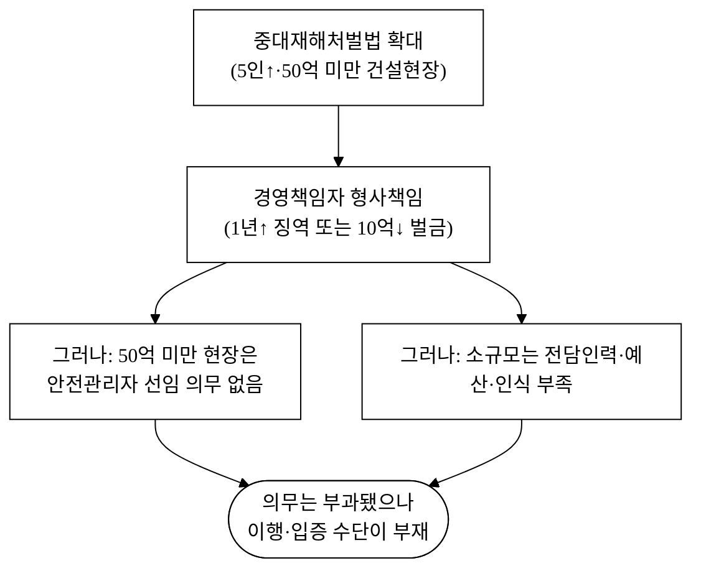
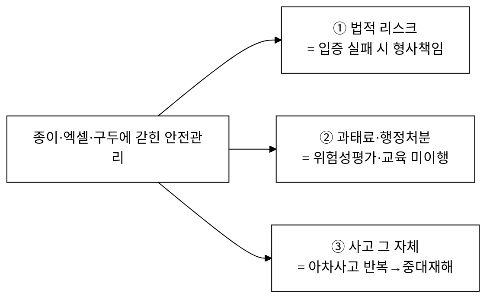
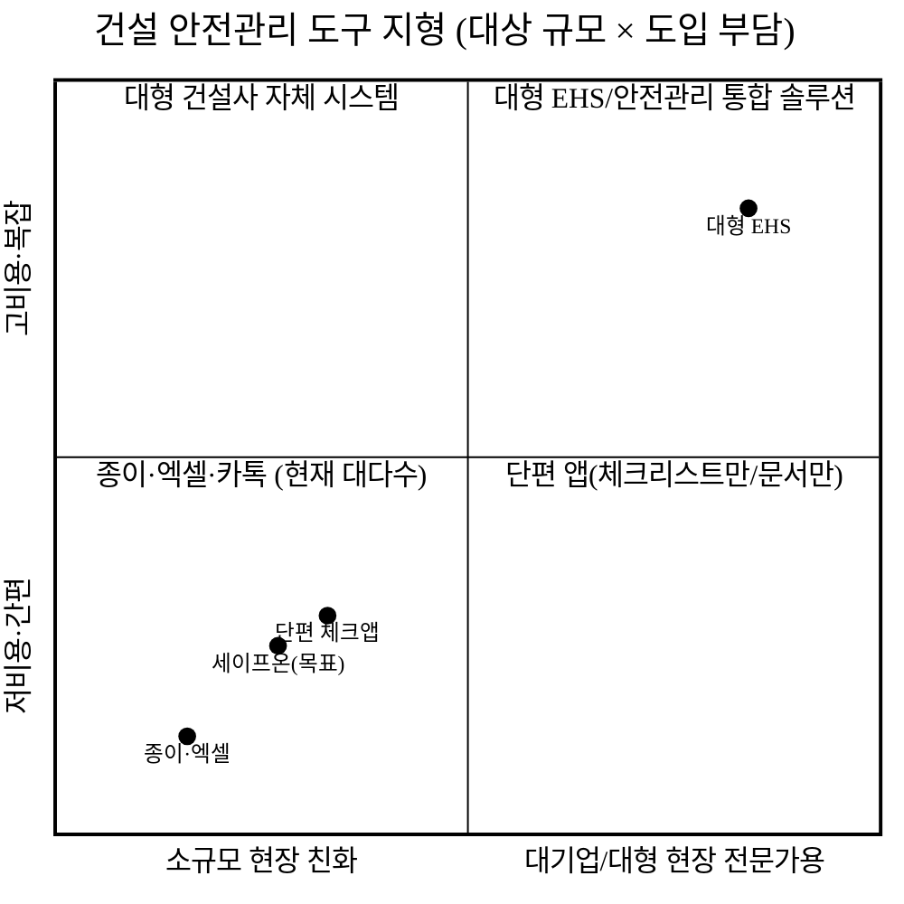
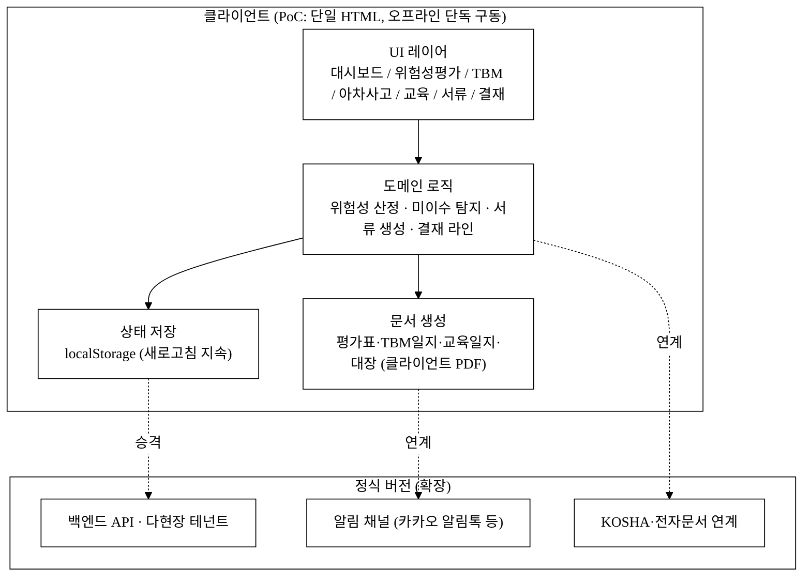
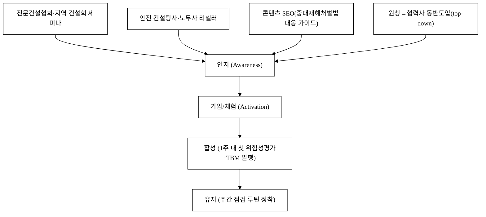

last_updated: 2026-06-25 16:55

# 세이프온 — 건설현장 안전관리 SaaS

> 본 제안서는 공고가 요구하는 PSST(Problem · Solution · Scale-up · Team) 구조를 따른다.
> 그림자료는 학술 논문 형식·순수 흑백(monochrome)으로 통일한다(레포 `CLAUDE.md` §2.0 · [`그림자료_규약.md`](../../그림자료_규약.md)).
> Team 섹션은 골격만 두고 내용은 사용자가 직접 채운다([§Team](#4-team--팀)).

| 항목 | 값 |
|:---|:---|
| 사업명 | <TODO: 사용자 입력 (공고 기재)> |
| 주관기관 | <TODO: 사용자 입력> |
| 트랙 | 실전창업 (창업동아리) |
| 일정 | <TODO: 사용자 입력> |
| 아이템 | 소·중규모 건설현장 안전관리 SaaS 「세이프온」 |
| 타깃 고객 | 상시근로자 5~49인(공사금액 50억 미만) 소·중규모 건설·전문건설 현장 — 현장소장·안전관리책임자·경영책임자 |
| 산출물 | 웹 기반 안전관리 PoC(위험성평가·TBM·아차사고·교육이수·법정서류 자동생성·전자결재 통합) |

---

## 1. Problem — 문제

### P-1. "법은 왔는데, 사람도 시스템도 없다" — 규제와 현실의 단절

2024년 1월 27일, 중대재해처벌법이 **상시근로자 5인 이상 50인 미만 사업장(건설업은 공사금액 50억원 미만 공사)까지 전면 확대 적용**됐다[^1]. 경영책임자가 안전·보건 확보의무를 위반해 사망사고를 야기하면 **1년 이상 징역 또는 10억원 이하 벌금**에 처해진다[^3]. 법은 이제 소규모 현장의 사장님 책상 위에 올라와 있다.

문제는, 정작 그 법이 겨냥하는 소규모 건설현장이 **사고의 핵심층이면서 동시에 안전관리 역량이 가장 비어 있는 구간**이라는 점이다. 2024년 산업재해 사고사망자 589명 중 건설업이 276명(46.9%)으로 전 업종 1위였고[^4], 규모별로는 **50인(50억) 미만 사업장에서 339명 — 전체의 약 57.6%**가 발생해 50인 이상(250명)보다 많았다[^5]. 더 넓게 보면 50인 미만 사업장이 전체 재해자의 69.1%를 차지한다[^12].

**그림 1.** 중대재해처벌법 확대로 의무는 부과됐으나, 정작 대상인 소규모 현장에는 이행·입증 수단이 비어 있는 구조적 단절.

그림 1처럼 법은 책임을 지웠지만, 그 책임을 **이행하고 입증할 수단**은 소규모 현장에 없다. 공사금액 50억원 미만 현장은 **안전관리자 선임 의무 자체가 없다**[^10]. 안전을 전담할 사람이 법적으로도 현실적으로도 부재한 상태에서, 사장님은 시공·수주·자금에 더해 안전 행정까지 떠안는다.

### P-2. "종이로 버틴 안전"의 세 가지 손실

소규모 현장의 안전관리는 대개 **종이 일지·엑셀·구두 전달**로 굴러간다. 위험성평가표는 한 번 작성해 캐비닛에 넣어두고, TBM(작업 전 안전점검)은 말로만 하고, 아차사고는 기록되지 않으며, 교육 이수는 누가 받았는지 추적되지 않는다. 이 단절은 추상적 불편이 아니라 **측정 가능한 손실**로 돌아온다.

- **법적 리스크(입증 실패):** 중대재해처벌법은 시행 3년간 사건 1,252건 중 73%(917건)가 아직 수사 중일 만큼 처리에 시간이 걸리지만, 일단 기소되면 결과는 무겁다 — 무죄율 10.7%(일반 형사 3.1%의 3배), 집행유예율 85.7%, 법인 벌금 평균 7,280만원[^2]. 사고가 났을 때 경영책임자를 지키는 것은 "안전보건 확보의무를 이행했다"는 **시점·서명이 박힌 기록**인데, 종이로 흩어진 자료는 그 입증에 취약하다.
- **과태료·행정처분:** 위험성평가는 작업 시작 1개월 내 실시가 법적 의무이고[^11], 정기 안전보건교육은 비사무직 분기 6시간(연 24시간)·신규채용 8시간 이상으로 미준수 시 과태료 대상이다[^17]. 종이·기억으로는 누가 무엇을 언제 이행했는지 빠지기 쉽다.
- **사고 그 자체:** 위 입증·서류 이전에, **사람이 다치고 죽는다.** 산재보험급여 지급액은 2023년 7조 2,849억원(전년 대비 +8.9%)에 달했고, 수급자 1인당 평균 약 1,828만원이다[^16]. 아차사고(near-miss)를 기록·공유해 사전 차단하는 루프가 없으면, 같은 위험이 반복되다 결국 중대재해가 된다.

**그림 2.** 종이·구두 기반 안전관리가 만드는 세 갈래 손실.

### P-3. 기존 도구의 공백 — "대기업용 EHS는 과하고, 종이는 모자라다"

그렇다면 왜 안전관리 소프트웨어를 쓰지 않을까. **소규모 건설현장에 맞는 도구가 비어 있기 때문**이다.

**그림 3.** 안전관리 도구 지형. 대기업용 EHS는 과하고, 종이·엑셀은 모자란 좌하단 중간 지대가 비어 있다.

대형 EHS/안전관리 솔루션은 대규모 현장·전담 안전조직을 전제로 설계돼 가격·복잡도·온보딩 부담이 영세 현장에 과하다. 반대편엔 종이·엑셀·카톡이 있는데, 이것들은 **위험성평가 → TBM → 아차사고 → 교육이수 → 법정서류 → 입증**을 하나의 흐름으로 잇지 못한다. 그 사이에 체크리스트만 있는 앱, 문서만 만들어주는 앱이 흩어져 있지만, **현장 한 번 입력으로 기록·서류·입증이 동시에 채워지는** 도구는 비어 있다. 그림 3의 비어 있는 좌하단이 세이프온의 자리다.

---

## 2. Solution — 솔루션

### S-1. 세이프온 한 줄 정의

> **세이프온은 현장의 안전 활동 한 번 기록으로 법정 서류·이행 입증·전자결재가 동시에 채워지는, 소·중규모 건설현장을 위한 가장 가벼운 안전관리 SaaS다.**

대형 EHS의 모든 기능을 넣지 않는다. 5~49인 현장이 **매일·매주 실제로 반복하는 안전 의무**만 정확히, 빠르게, 흔적이 남게 처리한다.

### S-2. 핵심 기능 (PoC에서 실 동작 목표)

| 기능 | 무엇을 해결 | PoC 구현 방향 |
|:---|:---|:---|
| ① 안전 대시보드 | "오늘 우리 현장은 의무를 이행 중인가?" | 미이수·고위험·TBM·아차사고 KPI + 7일 추세 + 의무 이행 체크 |
| ② 위험성평가 | 작업 시작 전 위험요인 평가·대책 의무[^11] | 공정별 표준 위험요인 → 빈도×강도 자동 산정 → 감소대책 → 발행·결재 (4단계) |
| ③ TBM 작업전점검 | 작업 전 위험 공유·참석 입증[^13] | 점검항목 체크 → 위험요인 주지 → 참석자 캔버스 서명 (3단계) |
| ④ 아차사고 신고 | 사고로 이어질 뻔한 위험의 사전 차단 | 유형·위험도 → 현장 사진 첨부 → 신고·대장 등록 (3단계, 위험도'상'은 즉시 결재) |
| ⑤ 안전교육 이수 | 법정 교육 미이수자 추적·과태료 방지[^17] | 근로자×교육 매트릭스 + 미이수 자동 표시 + CSV·일지 |
| ⑥ 법정 안전서류·전자결재 | 의무 이행을 입증 가능한 형태로 보관 | 기록→서류 자동 생성·PDF + 안전관리자→소장→경영책임자 결재 라인 |

### S-3. 핵심 워크플로 — 한 번 기록, 입증까지 자동

세이프온의 차별점은 개별 기능이 아니라 **한 번의 현장 기록이 어디까지 흐르는가**다. 현장소장이 위험성평가를 발행하면, 그 데이터가 법정 서류·전자결재·이행 입증으로 동시에 갈라져 흐른다.

```mermaid
%%{init: {"theme":"base","themeVariables":{"darkMode":false,"background":"#ffffff","fontFamily":"Georgia, serif","primaryColor":"#ffffff","primaryBorderColor":"#000000","primaryTextColor":"#000000","secondaryColor":"#ffffff","secondaryBorderColor":"#000000","secondaryTextColor":"#000000","tertiaryColor":"#ffffff","tertiaryBorderColor":"#000000","tertiaryTextColor":"#000000","mainBkg":"#ffffff","secondBkg":"#ffffff","lineColor":"#000000","textColor":"#000000","nodeBorder":"#000000","nodeTextColor":"#000000","titleColor":"#000000","edgeLabelBackground":"#ffffff","defaultLinkColor":"#000000","clusterBkg":"#ffffff","clusterBorder":"#000000","actorBkg":"#ffffff","actorBorder":"#000000","actorTextColor":"#000000","actorLineColor":"#000000","signalColor":"#000000","signalTextColor":"#000000","labelBoxBkgColor":"#ffffff","labelBoxBorderColor":"#000000","labelTextColor":"#000000","loopTextColor":"#000000","noteBkgColor":"#ffffff","noteBorderColor":"#000000","noteTextColor":"#000000","activationBkgColor":"#ffffff","activationBorderColor":"#000000","sequenceNumberColor":"#000000","attributeBackgroundColorOdd":"#ffffff","attributeBackgroundColorEven":"#ffffff","sectionBkgColor":"#ffffff","altSectionBkgColor":"#ffffff","sectionBkgColor2":"#ffffff","taskBkgColor":"#ffffff","taskBorderColor":"#000000","taskTextColor":"#000000","taskTextLightColor":"#000000","taskTextOutsideColor":"#000000","taskTextDarkColor":"#000000","taskTextClickableColor":"#000000","activeTaskBkgColor":"#ffffff","activeTaskBorderColor":"#000000","doneTaskBkgColor":"#ffffff","doneTaskBorderColor":"#000000","critBkgColor":"#ffffff","critBorderColor":"#000000","gridColor":"#000000","todayLineColor":"#000000","quadrant1Fill":"#ffffff","quadrant2Fill":"#ffffff","quadrant3Fill":"#ffffff","quadrant4Fill":"#ffffff","quadrant1TextFill":"#000000","quadrant2TextFill":"#000000","quadrant3TextFill":"#000000","quadrant4TextFill":"#000000","quadrantPointFill":"#000000","quadrantPointTextFill":"#000000","quadrantXAxisTextFill":"#000000","quadrantYAxisTextFill":"#000000","quadrantInternalBorderStrokeFill":"#000000","quadrantExternalBorderStrokeFill":"#000000","quadrantTitleFill":"#000000","pieStrokeColor":"#000000","pieOuterStrokeColor":"#000000","pieTitleTextColor":"#000000","pieSectionTextColor":"#000000","pieLegendTextColor":"#000000","cScale0":"#ffffff","cScaleLabel0":"#000000","cScaleInv0":"#000000","pie1":"#ffffff","cScale1":"#ffffff","cScaleLabel1":"#000000","cScaleInv1":"#000000","pie2":"#ffffff","cScale2":"#ffffff","cScaleLabel2":"#000000","cScaleInv2":"#000000","pie3":"#ffffff","cScale3":"#ffffff","cScaleLabel3":"#000000","cScaleInv3":"#000000","pie4":"#ffffff","cScale4":"#ffffff","cScaleLabel4":"#000000","cScaleInv4":"#000000","pie5":"#ffffff","cScale5":"#ffffff","cScaleLabel5":"#000000","cScaleInv5":"#000000","pie6":"#ffffff","cScale6":"#ffffff","cScaleLabel6":"#000000","cScaleInv6":"#000000","pie7":"#ffffff","cScale7":"#ffffff","cScaleLabel7":"#000000","cScaleInv7":"#000000","pie8":"#ffffff","cScale8":"#ffffff","cScaleLabel8":"#000000","cScaleInv8":"#000000","pie9":"#ffffff","cScale9":"#ffffff","cScaleLabel9":"#000000","cScaleInv9":"#000000","pie10":"#ffffff","cScale10":"#ffffff","cScaleLabel10":"#000000","cScaleInv10":"#000000","pie11":"#ffffff","cScale11":"#ffffff","cScaleLabel11":"#000000","cScaleInv11":"#000000","pie12":"#ffffff"}}}%%
flowchart LR
    I["① 현장 안전기록<br/>(위험성평가·TBM·아차사고)"]
    I --> J["② 법정 서류 자동화<br/>(평가표·일지·대장 생성)"]
    J --> B["③ 전자결재 상신<br/>(안전관리자→소장→경영책임자)"]
    J --> E["④ 이행 입증 축적<br/>(시점·서명·첨부 누적)"]
    I --> F["⑤ 대시보드 집계<br/>(미이수·고위험·추세)"]
    B --> C{"⑥ 결재 점검"}
    C -- "승인" --> S["완결·보관"]
    C -- "반려" --> W["보완 → 재상신"]
    W --> C
```

**그림 4.** 세이프온 핵심 워크플로 — 현장 1회 기록이 서류·결재·입증·집계로 동시 분기한다.

그림 4의 다단계 워크플로(현장기록 → 서류 → 결재/입증)는 PoC에서 토스트 mock이 아니라 **실제 상태 전이**로 구현한다 — 위험성평가 발행 시 로컬 저장소가 갱신되고, 새로고침해도 유지되며, 법정 서류와 결재 라인이 실제로 생성·진행된다(개발결과보고서 v1에서 입증).

### S-4. 시스템 아키텍처 (PoC)

PoC는 **오프라인 단독 구동**을 원칙으로 한다(심사·시연·현장 인터넷 음영지역에서 서버 없이 동작). 정식 버전은 동일 데이터 모델을 백엔드로 승격하고 카카오 알림톡·전자문서·KOSHA 자료 연계로 확장한다.

**그림 5.** PoC 아키텍처와 정식 버전 확장 경로. PoC는 단일 HTML·오프라인으로 자체 완결하고, 동일 데이터 모델을 백엔드·알림·연계로 승격한다.

---

## 경영혁신·창업학적 프레임워크

본 사업은 단순한 "안전 체크리스트 앱"이 아니라, **규제 변화가 만든 비소비 시장을 새로운 가치 곡선으로 여는 시도**다. 이를 세 가지 학술·경영 이론으로 정당화한다.

### (1) Christensen 파괴적 혁신 — 저가·비소비 고객에서 시작

Clayton Christensen의 파괴적 혁신(Disruptive Innovation) 이론[^18]은, 기존 강자가 외면하는 **과소만족·비소비(non-consumption) 고객**에서 출발해 주류로 올라오는 혁신을 설명한다. 대형 EHS 솔루션은 대규모 현장·전담 안전조직(상위 고객)을 향하며 5~49인 현장을 외면한다. 그 결과 소규모 현장은 아예 소프트웨어를 안 쓰는 **비소비 상태**(종이·카톡)에 머문다(그림 3). 세이프온은 이 비소비 구간을 "충분히 좋고, 충분히 싸고, 충분히 간단한" 도구로 점유한 뒤, 데이터·연계 기능을 쌓아 위로 올라가는 전형적 파괴 경로에 있다. 대형 EHS 업체가 이 저가·간편 구간을 내려와 만들 동기는 비대칭적으로 약하다.

### (2) Kim·Mauborgne 블루오션 — 가치 곡선 재설계

블루오션 전략(Blue Ocean Strategy)의 ERRC 격자[^19]로 본 사업의 가치 곡선을 재설계한다.

| 격자 | 적용 |
|:---|:---|
| 제거(Eliminate) | 대형 EHS식 복잡한 모듈·전담 안전조직 전제·설치형 인프라 |
| 감소(Reduce) | 도입 교육 시간, 초기 도입 비용, 입력 클릭 수 |
| 증가(Raise) | 현장 입력의 즉시성, 기록-서류 정합성, 이행 입증력 |
| 창조(Create) | "1회 기록 → 법정서류·전자결재·이행입증 동시 충족"이라는 단일 흐름 |

**표 1.** 블루오션 ERRC 격자 — 세이프온의 가치 곡선 재설계.

표 1처럼, 경쟁의 축(기능 풍부함·전문가용 정밀도)을 따라가지 않고 **간편함·정합성·입증력**이라는 다른 축으로 곡선을 옮긴다.

### (3) Ries 린 스타트업 + JTBD — 검증 가능한 가설

본 PoC 자체가 린 스타트업(Lean Startup)[^20]의 MVP다. "현장 1회 기록으로 법정서류·결재·입증이 채워지면 사장님이 돈을 낼 것"이라는 가설을, 실제 현장에서 측정 가능한 지표(서류 작성시간, 점검 정착률, 미이수율)로 검증한다. 경영책임자가 진짜 해결하고 싶은 일(Jobs To Be Done)[^21]은 "프로그램을 쓰는 것"이 아니라 **"처벌·과태료를 피할 입증 가능한 기록을 부담 없이 남기고, 사람이 다치지 않게 하는 것"**이다. 세이프온의 기능은 모두 이 Job으로 환원된다. 규제 변화(중대재해처벌법 확대)가 이 Job의 긴급성을 **비탄력적으로** 끌어올린 것이 'Why now'의 핵심이다.

> 연결: 블루오션 = 차별성(§차별성), 린스타트업·JTBD = 고객확보·구매동인(§GTM·§구매동인 논증).

---

## 고객확보(GTM)

### G-1. ICP (이상적 고객 프로파일)

| 축 | 1차 ICP | 비고 |
|:---|:---|:---|
| 현장 유형 | 전문건설(철근·콘크리트·설비·전기)·인테리어·소규모 종합건설 | 다현장 운영 시공사 |
| 규모 | 상시근로자 5~49인 / 공사금액 50억 미만 | 안전관리자 선임 의무 없는 구간[^10] |
| 의사결정자 | 대표이사(경영책임자) | 중대재해처벌법 형사책임의 직접 당사자[^3] |
| 사용자 | 현장소장·안전관리책임자(기록·결재)·작업반장(TBM·아차사고) | 실제 매일 쓰는 사람 |
| 페인 강도 | 최근 사고·점검 경험 + 원청 안전요구 압박 | "지금 아픈" 현장 우선 |

### G-2. 채널별 전술

**그림 6.** 인지 → 활성 → 유지 퍼널과 채널.

- **오가닉·콘텐츠:** "50인 미만 중대재해처벌법 대응 체크리스트", "위험성평가 작성법", "TBM 일지 양식" 같은 실무 가이드 콘텐츠로 현장소장·사장님 검색 유입을 만든다. 이들은 점검·감독·사고 직후 반드시 검색한다.
- **제휴·리셀러:** 안전 컨설팅사·노무사·전문건설협회 지회와 제휴해 시연·세미나를 연다. 컨설팅사는 한 번에 다수 현장을 보유하므로 **멀티테넌트 관리 콘솔**(정식판)로 리셀러 채널을 만든다. B2B 의사결정은 신뢰가 핵심이라 오프라인 접점이 효과적이다.
- **원청-협력사 동반도입(top-down):** 원청(종합건설)이 협력사 안전관리를 요구하는 흐름에 올라타, 원청이 협력사에게 세이프온을 권장하는 구조로 확산한다. 네트워크 전파 효과가 크다.

### G-3. 첫 100 / 첫 1,000 현장 확보 계획

- **첫 100 현장:** 무료 베타로 지역(예: 대구·경북) 전문건설사에 직접 영업·시연. 한 곳을 깊게 성공시켜 레퍼런스 케이스(서류 작성시간 −N시간/월, 점검 정착률 +N%)를 만든다. [추정] 초기 12~18개월 목표.
- **첫 1,000 현장:** 레퍼런스 + 컨설팅사 리셀러 + 콘텐츠 유입을 결합해 전국으로 확장. 감독·점검 시즌, 사고 직후가 도입 골든타임이다.

### G-4. CAC·리텐션 가설

- **예상 CAC:** B2B SaaS·오프라인 영업 혼합 특성상 현장당 획득비용은 콘텐츠·리셀러·원청 동반도입 비중을 높여 낮춘다. 구체 수치는 베타 후 실측. [추정]
- **리텐션 가설:** 위험성평가·교육·점검은 **법적 의무 기반 반복 주기**다. 한 번 현장의 기록·결재 흐름에 들어가면 누적된 이행 입증 기록을 다른 도구로 옮기는 교체 비용이 크다 → 높은 그로스 리텐션을 기대(§차별성 전환비용 항목과 연결).

---

## 수익모델

### R-1. 수익원

| 수익원 | 내용 |
|:---|:---|
| ① 현장 구독(SaaS) | 활성 현장(active site) 단위 월정액 — 규모·기능 티어별 |
| ② 사용자 추가 | 일정 사용자 초과 시 좌석 과금 |
| ③ 부가 모듈 | 멀티현장 관리 콘솔·심화 통계·알림 채널·원청 ERP 연동 |
| ④ B2B 라이선스 | 컨설팅사·다현장 시공사·원청 대상 통합 라이선스(리셀러) |

핵심은 **거래 수수료가 아니라 운영 구독**이다. 안전 데이터에 수수료를 매기는 모델은 신뢰·규제상 부적절하므로, **반복되는 안전 행정을 대신해 주는 대가로 정액 구독**을 받는다.

### R-2. 가격 정책 (시나리오 수치 — 전부 [추정])

소규모 현장이 "대형 EHS는 과하다"고 느낀 가격 장벽을 넘지 않도록, **월 구독액이 과태료 1건·서류 대행 1건보다 작게** 설계한다. 아래 절대 금액은 **베타 가격 실험 전 자체 추정값**이며 공식 수치와 섞지 않는다(`[추정]`, [§데이터 정직성](#데이터-정직성-선언)).

| 티어 | 대상 | 월 구독액(현장 단위) [추정] | 비고 |
|:---|:---|---:|:---|
| Basic | 5~20인 단일 현장 | 79,000원 | 위험성평가·TBM·아차사고·서류 |
| Standard | 20~49인 단일 현장 | 129,000원 | + 교육이수 관리·전자결재·통계 |
| Pro | 다현장 시공사 | 199,000원/현장 | + 멀티현장 콘솔·알림 채널 |
| 리셀러 라이선스 | 컨설팅사·원청 | 현장당 단가 할인(별도 견적) | 멀티테넌트 통합 |

기준 ARPA(현장당 월평균 구독액)는 **Standard 129,000원/월(연 1,548,000원)**으로 잡는다(이하 단위경제성 계산의 기준값). [추정]

### R-3. 단위경제성 (시나리오 1세트 — 전부 [추정])

아래 절대값은 **베타 실측 전 자체 추정**이며, 위 기준 ARPA(129,000원/월)와 SaaS 표준 가정에서 산식으로 도출했다. 검증된 외부 수치와 섞지 않는다([§데이터 정직성](#데이터-정직성-선언)). 가정은 셀에 명시했다.

| 지표 | 산식 | 값 [추정] |
|:---|:---|---:|
| ARPA | 기준 티어 월 구독액 | 129,000원/월 |
| 기여이익률 | SaaS 한계비용 낮음 가정 | 80% |
| 월 기여이익 | ARPA × 기여이익률 = 129,000 × 0.8 | 103,200원/월 |
| 평균 유지개월 | 월 이탈률 2.5% 가정 → 1÷0.025 | 40개월 |
| **LTV** | 월 기여이익 × 유지개월 = 103,200 × 40 | **약 413만원** |
| **CAC** | 콘텐츠·리셀러·원청동반 혼합 가정 | **약 70만원/현장** |
| **LTV/CAC** | 413만 ÷ 70만 | **약 5.9배** (목표 3↑ 충족) |
| **회수기간** | CAC ÷ 월 기여이익 = 700,000 ÷ 103,200 | **약 6.8개월** |

**표 2.** 단위경제성 시나리오(기준 티어, 전부 [추정] — 베타 실측으로 대체). 핵심 가정: 월 이탈률 2.5%(법적 의무 반복 주기로 인한 높은 그로스 리텐션 가정), 기여이익률 80%, CAC 70만원/현장.

### R-4. 매출 시나리오 (3안, 절대값 — 전부 [추정])

24개월차 유료 현장 수 × 기준 ARPA(129,000원/월) 기준 연환산 ARR로 환산했다. 현장 수·전환율은 자체 추정이며 베타 실측으로 대체한다([추정], 산식 명시).

| 시나리오 | 24개월차 유료 현장 [추정] | 연환산 ARR(현장수 × 129,000 × 12) [추정] | 가정 |
|:---|---:|---:|:---|
| 보수 | 60개소 | 약 0.93억원 | 지역 한정·직접영업 위주 저속 확산, 리셀러 지연 |
| 기본 | 180개소 | 약 2.79억원 | 콘텐츠+리셀러+원청동반 정상 확산, 사고·점검 시즌 도입 집중 |
| 공격 | 450개소 | 약 6.97억원 | 컨설팅사·원청 리셀러 라이선스 조기 체결로 견인 |

**표 2-1.** 매출 시나리오(24개월차 ARR, 전부 [추정]). 산식: 유료 현장 수 × 129,000원/월 × 12개월. 현장 수 절대값은 베타 가격·전환율 실측 후 확정한다(현 단계 창작 금지, [§데이터 정직성](#데이터-정직성-선언)).

---

## 차별성·경쟁우위(Moat)

### M-1. 경쟁자 비교

| 구분 | 종이·엑셀·카톡 | 단편 체크앱 | 대형 EHS 솔루션 | 문서 대행 서비스 | **세이프온** |
|:---|:---|:---|:---|:---|:---|
| 대상 | 모든 영세 현장 | 점검 담당 | 대규모 현장 | 서류만 필요 | 소·중규모 현장 |
| 위험성평가 | 수기 1회 | 체크만 | 복잡·전문가용 | 대행(수동) | 표준요인→자동 산정 |
| TBM·서명 | 구두·미기록 | 부분 | 과함 | 없음 | 체크+캔버스 서명 |
| 아차사고 | 미기록 | 부분 | 과함 | 없음 | 사진+위험도+대장 |
| 교육이수 추적 | 엑셀·기억 | 없음 | 있음(복잡) | 없음 | 매트릭스 자동 |
| 법정서류·결재 | 수기 | 없음 | 있음(고가) | 대행(외주) | 자동 생성+전자결재 |
| 이행 입증 | 흩어짐 | 부분 | 과함 | 단발 | 시점·서명 누적 |
| 도입 부담 | 0(손실 큼) | 낮음 | 매우 높음 | 중 | 낮음(오프라인 단독 시연) |

**표 3.** 직접·간접 경쟁자 비교. 세이프온은 "1회 기록 → 법정서류·전자결재·이행입증 동시 충족"을 단일 흐름으로 묶는 유일한 위치다.

### M-2. 차별점 50+ 도출

차별점을 **8개 카테고리(기술·데이터·운영·규제·가격·GTM·네트워크효과·UX)**로 묶어 50개 이상 도출한다. 각 항목은 *경쟁사 현황 → 우리 차별점 → 고객 가치*로 정리한다. 핵심 항목은 §구매동인 논증으로 연결한다. 가치 수치 중 검증 전 자체 추정은 `[추정]`으로 표기한다(부풀리기 금지, `CLAUDE.md` §2.6).

**표 4.** 차별점 도출 (현재 54개 / 목표 50+).

| # | 카테고리 | 경쟁사 현황 | 우리 차별점 | 고객 가치 |
|---:|:---|:---|:---|:---|
| 1 | 기술 | 위험성평가 수기 1회 | 공정별 표준 위험요인 자동 로드 | 작성 노동 제거 |
| 2 | 기술 | 위험성 주관 판단 | 빈도×강도 자동 산정·등급화 | 일관된 기준 |
| 3 | 기술 | 평가-서류 분리 | 발행 시 평가표 자동 생성 | 서류 즉시 확보 |
| 4 | 기술 | TBM 구두·미기록 | 점검항목 체크+타임스탬프 | 점검 입증 |
| 5 | 기술 | 종이 서명 분실 | 캔버스 서명→이미지 보존 | 참석 입증 |
| 6 | 기술 | 아차사고 미기록 | 사진+위치+위험도 신고 | 사전 차단 데이터 |
| 7 | 기술 | 서버·설치형 | 단일 HTML 오프라인 단독 구동 | 인터넷 없이 현장 사용 |
| 8 | 기술 | 새로고침 시 유실 | localStorage 상태 지속 | 데이터 안전 |
| 9 | 기술 | PDF 외주·수기 | 평가표·일지·대장 클라이언트 PDF | 문서 즉시 출력 |
| 10 | 기술 | 단일 화면 표시 | 다단계 상태 전이 워크플로 | 일 처리 흐름화 |
| 11 | 기술 | 기능별 분절 앱 | 단일 기록→다중 분기 | 중복 입력 제거 |
| 12 | 데이터 | 데이터 자산화 안 됨 | 안전 활동 구조화 축적 | 입증·분석 근거 |
| 13 | 데이터 | 사고 사후 인지 | 아차사고 추세 집계 | 위험 조기 신호 |
| 14 | 데이터 | 교육 이수 산발 | 근로자×교육 매트릭스 | 미이수 즉시 파악 |
| 15 | 데이터 | 위험요인 비교 불가 | 공정별 위험 표준화 | 현장 벤치마크 |
| 16 | 데이터 | 결재 이력 단절 | 시점·결재자 누적 기록 | 책임 소재 명확 |
| 17 | 데이터 | 입증자료 수작업 취합 | 자동 누적·검색 | 점검 대비 시간↓ [추정] |
| 18 | 데이터 | 현장별 단절 | 다현장 표준 지표 | 운영 가시성 |
| 19 | 데이터 | 사진 분실 | 현장 사진 디지털 보존 | 증빙력↑ |
| 20 | 데이터 | 고위험 미집계 | 고위험(상) 자동 카운트 | 우선순위화 |
| 21 | 운영 | 역할 단절 | 소장·반장·경영책임자 한 흐름 | 인계 누락↓ |
| 22 | 운영 | 결재 종이 회람 | 전자결재 3단계 | 결재 지연↓ |
| 23 | 운영 | 점검 누락 사람 의존 | 의무 이행 체크 자동 | 완결성↑ |
| 24 | 운영 | 점검철 야근 집중 | 상시 입증 적립 | 업무 평준화 |
| 25 | 운영 | 미이수 사람이 점검 | 미이수 자동 표시 | 과태료 방지 |
| 26 | 운영 | 서류 보관·분실 | 서류함 디지털 보관 | 자료 분실 0 |
| 27 | 운영 | 도입 교육 수일 | 4단계 위저드 UX | 도입 마찰↓ |
| 28 | 운영 | 현장 인터넷 의존 | 오프라인 구동 | 음영지역 사용 |
| 29 | 운영 | 다현장 따로 관리 | 멀티현장 콘솔(정식) | 본사 통합 관리 |
| 30 | 운영 | 백업 수동 | JSON 백업·초기화 | 데이터 이관 용이 |
| 31 | 규제 | 위험성평가 자율 어려움 | 지침 친화 평가 설계[^11] | 의무 이행 보장 |
| 32 | 규제 | 교육시간 누락 | 법정교육 추적[^17] | 과태료 회피 |
| 33 | 규제 | TBM 인정 미활용 | TBM=교육시간 인정[^13] | 교육·점검 동시 충족 |
| 34 | 규제 | 입증 취약 | 시점·서명 기록 보존 | 중대재해법 방어[^3] |
| 35 | 규제 | 규정 변화 대응 지연 | 표준요인·서식 갱신 구조 | 규정 적합성 |
| 36 | 규제 | 안전관리자 부재[^10] | 기록·결재로 체계 대체 | 인력 공백 보완 |
| 37 | 가격 | 대형 EHS 고비용 | 현장 친화 정액 구독 | 도입 장벽↓ |
| 38 | 가격 | 거래 수수료 거부감 | 운영 구독(수수료 없음) | 예측가능 비용 |
| 39 | 가격 | 모듈 끼워팔기 | 필요 티어 선택 | 비용 효율 |
| 40 | 가격 | 초기 도입비 부담 | 무료 베타·오프라인 시연 | 위험 없는 체험 |
| 41 | 가격 | 가격 불투명 | 규모·티어 명시 | 의사결정 용이 |
| 42 | GTM | 일반 SaaS 광고 의존 | 협회·컨설팅 리셀러 | 신뢰 기반 획득 |
| 43 | GTM | 일반 콘텐츠 | 중대재해법 대응 가이드 SEO | 정확 타깃 유입 |
| 44 | GTM | 광범위 영업 | 사고·점검 직후 타이밍 | 전환율↑ |
| 45 | GTM | 단발 판매 | 원청→협력사 동반도입 | CAC↓ |
| 46 | GTM | 전국 동시 무리 | 지역 거점 후 확산 | 레퍼런스 밀도 |
| 47 | 네트워크효과 | 단일 현장 폐쇄 | 다현장 표준 지표 | 데이터 가치 누증 |
| 48 | 네트워크효과 | 데이터 고립 | 표준 위험요인 축적→고도화 | 후발 추격 비용↑ |
| 49 | 네트워크효과 | 원청 단절 | 원청-협력사 양면 접점 | 동반도입 락인 |
| 50 | 네트워크효과 | 교체 자유 | 이행 입증 누적 전환비용 | 락인(lock-in) |
| 51 | UX | 전문가용 복잡 | 비전문가(반장) 친화 | 학습비용↓ |
| 52 | UX | 데스크톱 전제 | 모바일·PC 반응형 | 현장 즉시 입력 |
| 53 | UX | 정보 과밀 | 역할별 핵심만 노출 | 인지부하↓ |
| 54 | UX | 다단계 메뉴 | 위저드·서명 1탭 | 속도↑ |

> 표 4의 54개 중 사소·중복·억지 항목으로 수를 채우지 않았다. 가치가 약하거나 검증 전인 수치는 `[추정]` 또는 "↓/↑" 방향 표기로만 두고, 검증된 외부 수치와 섞지 않았다([§데이터 정직성](#데이터-정직성-선언)).

### M-3. 방어가능성(해자)

- **전환비용:** 현장의 위험성평가·TBM·교육·결재 이행 입증 기록이 누적될수록 다른 도구로 옮기는 비용이 커진다(표 4 #50). 위험성평가·교육은 법적 반복 의무라 이탈 시 입증 단절 손실이 직접 발생한다.
- **데이터·네트워크 효과:** 표준 위험요인·다현장 안전 데이터는 후발주자가 단기간에 모으기 어렵다(#47·#48). 원청-협력사 양면 접점은 동반도입 락인을 만든다(#49).
- **규제 해자:** 위험성평가 지침·교육 의무·중대재해법 입증에 친화적으로 설계된 구조는 규정이 강화될수록 오히려 진입장벽이 된다(#31~#36).

### M-4. Why us / Why now

- **Why now:** 2024-01-27 중대재해처벌법이 5인 이상·50억 미만 건설현장까지 확대됐고[^1], 사망사고의 46.9%가 건설업[^4]·57.6%가 50인 미만 현장[^5]에 집중되는데, 정작 그 현장은 안전관리자 선임 의무도 없다[^10]. "종이로 버티기"의 한계가 형사책임이라는 임계에 도달했다. EHS 소프트웨어 시장은 CAGR 19.9%로 고성장 중이다[^15].
- **Why us:** 대형 EHS의 복잡함을 버리고 **소규모 현장이 매주 하는 의무**만 1회 기록으로 묶는 좁고 깊은 설계 — 대형 EHS 업체는 이 저가·간편 구간을 내려와 만들 동기가 약하다(Christensen 비대칭 동기, §프레임워크).

---

## 차별화 기술의 구매동인 논증

차별점을 나열하는 데 그치지 않고, 그것이 **경영책임자가 실제로 돈을 내고 현장이 매주 쓰게 만드는 동인인지**를 논증한다.

### ① 구매동인 가설 (must vs nice)

| 차별점 | 건드리는 JTBD | must / nice | 근거 |
|:---|:---|:---|:---|
| 위험성평가·서류 자동화 + 시점·서명 입증 (#3·#34·#17) | "처벌·과태료를 피할 입증 기록 남기기" | **must-have** | 중대재해법 형사책임·위험성평가 의무[^3][^11] |
| 법정교육 미이수 추적 (#14·#25·#32) | "과태료 안 맞기" | **must-have** | 정기교육 미준수 시 과태료[^17] |
| 안전관리자 공백을 기록·결재로 대체 (#36·#22) | "전담 인력 없이 체계 갖추기" | **must-have** | 50억 미만 선임의무 없음→공백[^10][^12] |
| 아차사고 사진·추세 (#6·#13) | "사고 자체를 줄이기" | nice→must 경계 | 예방 가치는 크나 즉각 결제 동인은 약함 |
| 위저드·서명 UX (#27·#54) | "현장 부담 줄이기" | nice-to-have(촉진제) | 도입·정착 마찰을 낮추는 인에이블러 |

핵심 동인은 **입증 가능한 의무 이행(처벌·과태료 회피)**과 **안전관리자 공백 대체** 세 가지 must-have다. 아차사고·간편 UX는 그 자체로 결제를 일으키기보다 **정착·유지**를 돕는 촉진제다(정직한 분류).

### ② 크기 정량화 (고객 언어의 금액 — 전부 [추정])

차별점이 만드는 가치를 경영책임자가 체감하는 **금액**으로 환산한다. 아래는 자체 추정이며, 베타 현장 인터뷰·실측으로 검증해 `5_research/`에 추가한다(검증 전 `[추정]` 유지, 공식 수치와 혼용 금지).

- **법적 리스크 측(기대손실 회피):** 중대재해처벌법 위반 기소 시 법인 벌금만 평균 7,280만원[^2](경영책임자 형사책임·징역은 별도, 정량 불가). 사고 확률이 낮아도 기대손실은 크다. 세이프온이 "의무를 이행했다"는 입증을 자동 누적해 **방어 가능성을 높이는** 가치는, 사장님 관점에서 보험에 가깝다 — 월 12.9만원 구독이 이 기대손실 대비 압도적으로 작다. [추정]
- **과태료 측(직접 회피):** 위험성평가 미실시·정기교육 미이수는 과태료 대상이다[^11][^17]. 미이수 1건이라도 자동 추적으로 막으면 구독액을 즉시 상회한다. [추정]
- **인력시간 측(서류 노동 절감):** 위험성평가표·TBM 일지·교육일지·아차사고 대장을 종이로 작성·취합하는 데 현장소장이 **월 8~12시간**을 쓴다고 가정하면(자체 추정), 환산 약 **−12만~−18만원/월** [추정]의 인건시간을 자동화로 절감. 월 구독액(12.9만원)과 대등하거나 상회한다.
- **합산:** 과태료·서류시간만으로도 구독액에 근접하고, 여기에 형사 리스크 방어(기대손실)가 얹히면 **"10배 규칙"에 근접하는 ROI**가 성립한다. 위 절대값은 [추정]이며, 실증은 베타 KPI(서류 작성시간·미이수율)로 확인한다.

### ③ 외부 근거

위 주장의 토대(법 확대·처벌 수위·법인 벌금 평균·과태료 제도·위험성평가/교육 의무·안전관리자 선임 기준·소규모 한계)는 모두 `5_research/`의 공식 출처[^1][^2][^3][^10][^11][^12][^17]로 연결한다. **구매동인의 인력시간 절감 절대값(②의 −12만~−18만원)은 현재 자체 추정**이며, 베타 현장 인터뷰·실측으로 검증해 `5_research/`에 추가한다. 검증 전에는 `[추정]`을 유지하고 공식 수치(벌금 7,280만원 등)와 섞지 않는다.

### ④ 반증·대안 위협 직시

- **"우리 현장은 사고 안 난다"(낙관 편향):** 가장 큰 위협. 단, 점검·감독·사고(인근 현장 포함)라는 **아픈 사건**이 발생하면 인식이 바뀐다 → 그 시점(골든타임)을 GTM 타깃으로 삼는다(§GTM).
- **"종이/엑셀 무료로도 된다":** 무료 양식이 존재한다. 그러나 무료 양식은 **흩어진 기록을 입증 가능한 형태로 자동 누적·결재**하지 못한다 — 핵심 가치는 양식이 아니라 *정합·입증·전자결재의 단일 흐름*이다.
- **"입력할 사람이 없다/바쁘다":** 위저드·1탭 서명으로 부담을 최소화하지만, 현장 정착은 난제다 → 무료 베타에서 점검 정착률을 핵심 지표로 관리.
- **"대형 EHS/공공 무료 도구가 비슷한 걸 줄 수 있다":** 가능성 있으나, 저가·간편 구간은 대형 업체의 동기가 약하고(Christensen), 데이터·전환비용·원청 네트워크 해자가 시간이 갈수록 쌓인다(§M-3).
- **정직한 결론:** 아차사고·간편 입력만으로는 결제를 끌어내기 약하다. **결제를 일으키는 진짜 동인은 처벌·과태료 회피와 안전관리자 공백 대체**이며, 본 사업은 거기에 핵심을 둔다.

### ⑤ 데모 정합

위 구매동인은 PoC 데모(`projects/`)에서 **실제로 구현·시연**한다 — 위험성평가 4단계 발행→법정서류 자동 등록→전자결재 상신(그림 4), 교육 미이수 매트릭스, TBM 캔버스 서명, 아차사고 사진·대장. 논증과 산출물이 같은 흐름을 가리킨다.

---

## 3. Scale-up — 성장

### SU-1. 단계별 확장

```mermaid
%%{init: {"theme":"base","themeVariables":{"darkMode":false,"background":"#ffffff","fontFamily":"Georgia, serif","primaryColor":"#ffffff","primaryBorderColor":"#000000","primaryTextColor":"#000000","secondaryColor":"#ffffff","secondaryBorderColor":"#000000","secondaryTextColor":"#000000","tertiaryColor":"#ffffff","tertiaryBorderColor":"#000000","tertiaryTextColor":"#000000","mainBkg":"#ffffff","secondBkg":"#ffffff","lineColor":"#000000","textColor":"#000000","nodeBorder":"#000000","nodeTextColor":"#000000","titleColor":"#000000","edgeLabelBackground":"#ffffff","defaultLinkColor":"#000000","clusterBkg":"#ffffff","clusterBorder":"#000000","actorBkg":"#ffffff","actorBorder":"#000000","actorTextColor":"#000000","actorLineColor":"#000000","signalColor":"#000000","signalTextColor":"#000000","labelBoxBkgColor":"#ffffff","labelBoxBorderColor":"#000000","labelTextColor":"#000000","loopTextColor":"#000000","noteBkgColor":"#ffffff","noteBorderColor":"#000000","noteTextColor":"#000000","activationBkgColor":"#ffffff","activationBorderColor":"#000000","sequenceNumberColor":"#000000","attributeBackgroundColorOdd":"#ffffff","attributeBackgroundColorEven":"#ffffff","sectionBkgColor":"#ffffff","altSectionBkgColor":"#ffffff","sectionBkgColor2":"#ffffff","taskBkgColor":"#ffffff","taskBorderColor":"#000000","taskTextColor":"#000000","taskTextLightColor":"#000000","taskTextOutsideColor":"#000000","taskTextDarkColor":"#000000","taskTextClickableColor":"#000000","activeTaskBkgColor":"#ffffff","activeTaskBorderColor":"#000000","doneTaskBkgColor":"#ffffff","doneTaskBorderColor":"#000000","critBkgColor":"#ffffff","critBorderColor":"#000000","gridColor":"#000000","todayLineColor":"#000000","quadrant1Fill":"#ffffff","quadrant2Fill":"#ffffff","quadrant3Fill":"#ffffff","quadrant4Fill":"#ffffff","quadrant1TextFill":"#000000","quadrant2TextFill":"#000000","quadrant3TextFill":"#000000","quadrant4TextFill":"#000000","quadrantPointFill":"#000000","quadrantPointTextFill":"#000000","quadrantXAxisTextFill":"#000000","quadrantYAxisTextFill":"#000000","quadrantInternalBorderStrokeFill":"#000000","quadrantExternalBorderStrokeFill":"#000000","quadrantTitleFill":"#000000","pieStrokeColor":"#000000","pieOuterStrokeColor":"#000000","pieTitleTextColor":"#000000","pieSectionTextColor":"#000000","pieLegendTextColor":"#000000","cScale0":"#ffffff","cScaleLabel0":"#000000","cScaleInv0":"#000000","pie1":"#ffffff","cScale1":"#ffffff","cScaleLabel1":"#000000","cScaleInv1":"#000000","pie2":"#ffffff","cScale2":"#ffffff","cScaleLabel2":"#000000","cScaleInv2":"#000000","pie3":"#ffffff","cScale3":"#ffffff","cScaleLabel3":"#000000","cScaleInv3":"#000000","pie4":"#ffffff","cScale4":"#ffffff","cScaleLabel4":"#000000","cScaleInv4":"#000000","pie5":"#ffffff","cScale5":"#ffffff","cScaleLabel5":"#000000","cScaleInv5":"#000000","pie6":"#ffffff","cScale6":"#ffffff","cScaleLabel6":"#000000","cScaleInv6":"#000000","pie7":"#ffffff","cScale7":"#ffffff","cScaleLabel7":"#000000","cScaleInv7":"#000000","pie8":"#ffffff","cScale8":"#ffffff","cScaleLabel8":"#000000","cScaleInv8":"#000000","pie9":"#ffffff","cScale9":"#ffffff","cScaleLabel9":"#000000","cScaleInv9":"#000000","pie10":"#ffffff","cScale10":"#ffffff","cScaleLabel10":"#000000","cScaleInv10":"#000000","pie11":"#ffffff","cScale11":"#ffffff","cScaleLabel11":"#000000","cScaleInv11":"#000000","pie12":"#ffffff"}}}%%
flowchart LR
    P1["1단계: PoC·베타<br/>전문건설 현장<br/>지역 거점 집중"]
    P2["2단계: 정식 SaaS<br/>백엔드·다현장 테넌트<br/>알림톡·전자문서 연계"]
    P3["3단계: 플랫폼<br/>컨설팅사·원청 리셀러<br/>다현장 분석·벤치마크"]
    P1 --> P2 --> P3
```

**그림 7.** 3단계 성장 경로. PoC에서 검증한 단일 흐름을 백엔드·연계로 승격하고, 리셀러·데이터 양면으로 확장한다.

- **1단계(PoC·베타):** 본 사업 범위. 단일 흐름의 가치를 지역 거점에서 실증.
- **2단계(정식 SaaS):** 동일 데이터 모델을 백엔드로 승격, 다현장 테넌트·카카오 알림톡·전자문서·KOSHA 자료 연계(그림 5의 확장부).
- **3단계(플랫폼):** 컨설팅사·원청 리셀러 채널 확대, 다현장 표준 위험 지표 기반 분석·벤치마크로 데이터 해자 강화.

### SU-2. 시장 규모(방향)

EHS 소프트웨어 글로벌 시장은 2024년 $760.6M에서 2030년 $2,189.4M으로 CAGR 19.9% 성장이 전망된다[^15](전체 EHS는 CAGR 7.6%[^14]). 국내는 중대재해처벌법 확대가 SaaS형 안전관리 수요를 비탄력적으로 끌어올렸다. 시장 규모의 **하향식(top-down) 추정 프레임**은 다음과 같다(절대 금액은 가격·전환율 실측 후 확정, [§데이터 정직성](#데이터-정직성-선언)).
  - **TAM:** 전국 건설업체(전문건설 67,201개사 등록[^9])·5~99인 사업체 다수[^8]가 구조적 모집단. 활성 현장 단위 연 구독액으로 환산.
  - **SAM:** 안전관리자 선임 의무가 없는 5~49인·50억 미만 건설현장(ICP). 본 구간은 비소비 상태(그림 3)로 미충족이 가장 크다.
  - **SOM:** 지역 거점(대구·경북 등)에서 무료 베타로 진입한 레퍼런스 현장군 → 협회·컨설팅·원청 확산.
  - TAM/SAM/SOM의 절대 금액은 R-4 가격·전환율 실측 후 산정한다([추정] 구간과 혼용 금지).

---

## 4. Team — 팀

> 본 섹션의 모든 셀은 사용자가 직접 채운다(`CLAUDE.md` §2.7). Claude는 골격만 둔다 — 창작 금지.

| 역할 | 이름 | 소속/학과 | 담당(R&R) | 연락처 |
|:---|:---|:---|:---|:---|
| 대표 | <TODO: 사용자 입력> | <TODO: 사용자 입력> | <TODO: 사용자 입력> | <TODO: 사용자 입력> |
| 팀원 | <TODO: 사용자 입력> | <TODO: 사용자 입력> | <TODO: 사용자 입력> | <TODO: 사용자 입력> |
| 팀원 | <TODO: 사용자 입력> | <TODO: 사용자 입력> | <TODO: 사용자 입력> | <TODO: 사용자 입력> |
| 지도교수 | <TODO: 사용자 입력> | <TODO: 사용자 입력> | <TODO: 사용자 입력> | <TODO: 사용자 입력> |

**팀 소개·역할 분담·수상/활동 실적:** <TODO: 사용자 입력>

**협력 기관·MOU:** <TODO: 사용자 입력>

---

## 참고문헌

> 아래 각주는 제안서 본문이 직접 인용한 1차·공식 출처이며, 모두 [`5_research/README.md`](./5_research/README.md)의 검증된 항목(실 URL·발표연월·수치)과 1:1로 대응한다. 통계·제도 인용(①~⑰)은 정부·공공·법령·시장조사기관 원자료에서 수치를 확인했고, 경영이론 4종(파괴적 혁신·블루오션·린스타트업·JTBD)은 공인 출판 저작이므로 서지를 직접 명시한다. 허위 충족·날조·중복 부풀리기 금지(`CLAUDE.md` §2.6).

[^1]: **고용노동부 「50인 미만 기업을 위한 중대재해처벌법 안내」** (2024.01). 2024-01-27부터 5인 이상 50인 미만(건설 50억 미만)까지 전면 확대. https://www.moel.go.kr/local/uijeongbu/news/notice/noticeView.do?bbs_seq=20240102046
[^2]: **국회입법조사처(NARS) 「중대재해처벌법 시행 3년」** (2025.08). 사건 1,252건 중 73% 수사 중, 무죄율 10.7%, 집유율 85.7%, 법인 벌금 평균 7,280만원. https://www.nars.go.kr/news/view.do?cmsCode=CM0026&brdSeq=48043
[^3]: **고용노동부 「중대재해처벌법 적용 안내」** (2024). 사망사고 시 1년 이상 징역 또는 10억원 이하 벌금. https://www.moel.go.kr/local/boryeong/info/dataroom/view.do?bbs_seq=20240101829
[^4]: **고용노동부 「2024년 재해조사 대상 사망사고 발생 현황(잠정)」** (2025.03). 사고사망 589명, 건설업 276명(46.9%) 전 업종 1위. https://eiec.kdi.re.kr/policy/materialView.do?num=264236
[^5]: **고용노동부 「2024년 사망사고 현황(잠정)」 보도자료** (2025.03.11). 50인(50억) 미만 339명 ≈ 전체의 57.6%. https://www.korea.kr/briefing/pressReleaseView.do?newsId=156678256
[^6]: **고용노동부 「2023년 산업재해 현황 부가통계」** (2024.03). 2023 사고사망 598명(전년 644명 대비 −7.1%). https://eiec.kdi.re.kr/policy/materialView.do?num=248879
[^7]: **고용노동부 「2024년 3분기 산업재해 부가통계」** (2024.11). 규모별 분기 동향. https://www.moel.go.kr/news/enews/report/enewsView.do?news_seq=17278
[^8]: **통계청 「2023년 전국사업체조사(잠정)」** (2024.09). 사업체 623.8만개, 종사자 5~99명 사업체 13.3%. https://kostat.go.kr/board.es?mid=a10301010000&bid=233&list_no=432931&act=view
[^9]: **대한건설협회·대한전문건설협회 건설업 등록통계** (2024.12). 전문건설업체 67,201개사 등록, 전문건설 계약 108.6조원. https://www.cak.or.kr/lay1/bbs/S1T36C142/A/9/list.do
[^10]: **국가법령정보센터 「산업안전보건법 시행령(안전관리자 선임)」** (2023.07). 건설 안전관리자 의무선임 공사금액 50억↑ — 50억 미만 선임의무 없음. https://www.law.go.kr/LSW/lumLsLinkPop.do?lspttninfSeq=75381&chrClsCd=010202
[^11]: **고용노동부 「사업장 위험성평가에 관한 지침」(고시 2023-19호)** (2023.05). 작업개시 1개월 내 최초 위험성평가 실시 의무·근로자 참여. https://www.law.go.kr/행정규칙/사업장위험성평가에관한지침
[^12]: **KOSHA 「안전보건관리체계 구축 컨설팅(소규모)」**. 소규모 전문인력·재정·인식 부족, 50인 미만이 전체 재해자의 69.1%. https://www.kosha.or.kr/kosha/business/sahmanagement.do
[^13]: **고용노동부·KOSHA 「TBM 가이드」** (2023.02). 작업 전 10분 위험요인 재확인, 법정 안전보건교육 시간 인정. https://www.moel.go.kr/policy/policydata/view.do?bbs_seq=20230200455
[^14]: **MarketsandMarkets 「EHS Market」** (2024). 글로벌 EHS $7.9B(’24)→$11.5B(’29), CAGR 7.6%. https://www.marketsandmarkets.com/Market-Reports/environment-health-safety-ehs-market-59608773.html
[^15]: **Grand View Research 「EHS Software Market Outlook」** (2024). EHS SW $760.6M(’24)→$2,189.4M(’30), CAGR 19.9%. https://www.grandviewresearch.com/horizon/statistics/workplace-safety-market-outlook/safety-equipment-systems/environmental-health-safety-ehs-software/global
[^16]: **근로복지공단·고용노동부 산재보험 통계(e-나라지표)** (2023). 산재급여 지급 7조2,849억(+8.9%), 1인 평균 약 1,828만원. https://www.index.go.kr/unity/potal/main/EachDtlPageDetail.do?idx_cd=2742
[^17]: **국가법령정보센터 「산업안전보건법 시행규칙 별표4(정기 안전보건교육)」**. 비사무직 분기 6h(연 24h)·신규 8h↑, 미준수 시 과태료. https://www.law.go.kr/LSW/lumLsLinkPop.do?lspttninfSeq=154063&chrClsCd=010202
[^18]: **Christensen, C. M. 『The Innovator's Dilemma』** (Harvard Business Review Press, 1997). 파괴적 혁신(저가·비소비 고객에서 출발).
[^19]: **Kim, W. C. & Mauborgne, R. 『Blue Ocean Strategy』** (Harvard Business Review Press, 2005). ERRC 격자·가치 곡선 재설계.
[^20]: **Ries, E. 『The Lean Startup』** (Crown Business, 2011). MVP·검증된 학습(Build-Measure-Learn).
[^21]: **Christensen, C. M., Hall, T., Dillon, K. & Duncan, D. S. 「Know Your Customers' Jobs to Be Done」** (Harvard Business Review, 2016). JTBD 프레임워크.

---

### 데이터 정직성 선언

본 제안서의 모든 통계·제도 인용은 `[^n]` 각주로 표기하고 [`5_research/`](./5_research/) 출처와 연결한다 — 본문 직접 인용 17건(①~⑰)은 전원 README의 검증된 항목(실 URL·발표연월·수치)에 1:1 매핑되며, 서지 미확정 stub은 0건이다. 검증 전 자체 추정값(수익모델 R-2~R-4 절대 금액, 구매동인 ② 인력시간 −12만~−18만원 등)은 본문에 **`[추정]`**으로 명시했으며, 공식 수치(법인 벌금 평균 7,280만원[^2] 등)와 한 문장에 섞지 않았다. 차별점 표(표 4)의 가치 수치 중 미검증분은 `[추정]` 또는 방향(↑/↓) 표기로만 두었다. 출처 [^9][^16]은 원표 재확인 권장 항목으로 README에 표시했고, 본문은 검증된 범위 내에서만 인용했다. 수량을 위해 존재하지 않는 출처를 만들지 않는다.

<!--
빈칸 목록 (사용자 입력 필요):
- 머리표: 사업명·주관기관·일정 (공고 기재 사실로 채움)
- §4 Team: 대표/팀원/지도교수 이름·소속/학과·R&R·연락처 전부
- §4 팀 소개·역할 분담·수상/활동 실적
- §4 협력 기관·MOU 상대방 실명
- 단위경제성·가격·매출 시나리오 절대 금액 (현재 [추정] — 베타 실측 후 확정)
- 구매동인 ② 인력시간 절감 절대값(−12만~−18만원) (현재 [추정] — 베타 현장 인터뷰로 검증)
- 출처 [^9][^16] 원표 재확인 후 수치 확정
-->
