last_updated: 2026-06-25 21:30

# 개발결과보고서 v3 — 세이프온 본사·다현장 안전관리 SaaS (시리즈A · AI 예측·다국어)

> `CLAUDE.md` §2.4 D구조. **v3 필수 2섹션 포함**: `## v2 한계 및 v3 개선 매핑`(1:1) · `## v3 신규/심화 산출물`.
> 본 보고서는 [`5_과업지시서_v3.md`](./5_과업지시서_v3.md) §5 성과품 목록의 검수 증거다.
> 구동 환경: macOS · Chromium(Playwright) · PC 1280×900 / 모바일 390×844(DPR2, isMobile, hasTouch) · `file://` 단독 구동, **pageerror 0**(PC·모바일 각 0).
> **가치 기준**: 본 v3는 `CLAUDE.md` §2.4 v2(5억) 기준을 **floor**로 두고, 그 위에 고급 예측 알고리즘·다국어·관계기관 연동을 더해 **시리즈A 투자·전국 확산 데모 수준**으로 심화한다(§6 측정표).

## 1. 성과품 매핑 (과업지시서 v3 §5 ↔ 납품)

| 과업지시서 v3 §5 성과품 | 납품 산출물 | 비고 |
|:---|:---|:---|
| v3 시제품 앱 (`v3.html` 1식) | [`../projects/site-safety/v3.html`](../projects/site-safety/v3.html) | 단일 HTML·오프라인 단독 구동, pageerror 0, v1·v2 미훼손 |
| 화면/뷰 18종 | v2 12뷰 + 발생확률·핫스팟·PTW·교육효과·협력사포털·연동센터 | §5 캡처 전수 |
| 다단계 워크플로 4개 | 위험성평가 4·TBM 3·아차사고 3·**PTW 3** | PC 08~10·11·12~14·15 |
| 알고리즘 로지스틱 | `logisticRisk()`·`logitFeatures()` z·P·오즈비 분해 | PC 02-predict-logistic |
| 알고리즘 K-means | `kmeans()`·`zonePoints()` 산점도·히트맵 | PC 04-hotspot-cluster |
| 알고리즘 교육효과 Welch t | `eduEffect()` 두 집단·t값·위험감소율 | PC 15-edu-analysis |
| 알고리즘 PTW 상관 | `ptwAccidentCorr()`·`pearson()` r 산출 | PC 08-ptw-corr |
| 다국어 i18n KO/EN | `I18N`·`t()`·`applyI18n()`·`setLang()` | PC 23-en-hq·24-en-predict·25-en-hotspot·26-en-tbm |
| RBAC 6역할·결재 4단계 | `ROLES`(6)·`APPR_LINE`(4) | PC 20-approval-rbac·27-role-subcon·28-role-client |
| 외부연동 지자체(mock) | `reportGov()` 접수번호 GOV-… | PC 18-gov-hub·연동로그 |
| 외부연동 산재(mock) | `reportWcf()` 처리번호 WCF-… | PC 18-gov-hub |
| 외부연동 협력사 포털(mock) | `notifyPartner()`·스코어카드 | PC 17-partner |
| 외부연동 KOSHA(mock) | `syncKosha()` 동기화 로그 | PC 18-gov-hub |
| 연동 로그·연동센터 | `notify` 뷰 + `gov` 관계기관 이력 | PC 21-notify-log·18-gov-hub |
| PTW 워크플로 | `ptwWizard()` 3단계·고위험 결재·PDF | PC 08~10 |
| 캔버스 서명·사진·PDF | v2 유지 + `genPtwDoc()` | PC 13-tbm-sign·14-incident-photo |
| 상태 지속성 `safeon-v3`+`safeon-lang` | localStorage 별도 키 | PC 29-persist |
| 반응형 PC·모바일 | 산점도·히트맵·통계타일·언어토글 모바일 대응 | 캡처 폴더 분리(PC/모바일) |
| 실 구동 캡처 PC 29 + 모바일 31 | `./captures/v3/`·`./captures/mobile/v3/` | EN 화면 포함, §5 전수 임베드 |

## v2 한계 및 v3 개선 매핑

> `CLAUDE.md` §2.4 v3 필수. v2에서 부족했던 항목 ↔ v3에서 해결한 방식 1:1.

| # | v2 한계 (베타 범위 제약) | v3 개선 (해결 방식) | 증거 |
|:---:|:---|:---|:---|
| 1 | 위험을 **현재 상태(CSI 지수)**까지만 보여줌 — *얼마나 사고가 날지* 확률로 못 봄 | **로지스틱 회귀 월간 발생확률**: `P=1/(1+e^-z)`, 6요인 로그오즈·오즈비 분해·전현장 비교 | PC/모바일 02·03-predict |
| 2 | 위험요인이 **현장 단위 집계**까지만 — 현장 내 *어느 공종*이 핫스팟인지 모름 | **K-means(k=3) 핫스팟 군집**: 현장×공종 2차원 표준화·산점도·히트맵·고위험 군집 테이블 | 04·05-hotspot |
| 3 | 교육 이수율을 **표시만** — 교육이 사고를 *실제로 줄이는지* 통계 근거 없음 | **Welch t-검정 교육효과**: 완전이수 vs 미이수 집단 노출률·t값·**위험감소율(%)**·유의성 | 15(PC)·16(모바일)-edu-analysis |
| 4 | 고위험작업이 **위험성평가에 섞여** 별도 허가 절차 없음 | **작업허가(PTW) 워크플로**: 고위험 5종·통제대책 검증·승인·결재상신 + **준수율-사고 Pearson 상관** | 08~10-ptw |
| 5 | **한국어 전용** — 건설현장 외국인 근로자 미대응 | **다국어 KO/EN i18n 토글**: 사이드바·헤더·TBM·발생확률·핫스팟 EN 렌더, 언어 지속 | 23~26(PC)·24~27(모바일)-en-* |
| 6 | 역할 **5종·결재 3단계** — 협력사(하청) 안전관리 미포함 | **6역할**(협력업체 안전담당 추가)·**결재 4단계**(협력사→안전관리자→소장→경영책임자) | 20-approval-rbac·27-role-subcon |
| 7 | 외부연동 **4종** — 관계기관(지자체·산재·KOSHA)·협력사 미연계 | **연동 8종**: +지자체 안전점검 신고(GOV-…)·산재보고(WCF-…)·협력사 포털·KOSHA 등록 | 17-partner·18-gov-hub·21-notify |
| 8 | 본사 의사결정이 **사후 집계** 중심 | 발생확률 고위험 시 **지자체 신고+경영책임자 보고 자동 에스컬레이션** | 03-predict-escalate·18-gov |

## v3 신규/심화 산출물

> `CLAUDE.md` §2.4 v3 필수. v3에서 새로 추가/심화한 기능을 캡처와 함께 입증.

| 영역 | 신규/심화 내용 | 캡처(PC) |
|:---|:---|:---|
| 로지스틱 발생확률 | 게이지(월 발생확률%)·전현장 비교·6요인 로그오즈/오즈비 분해표·CSV·고위험 에스컬레이션 | 02·03 |
| K-means 핫스팟 | 위험성×사고빈도 산점도(군집 색)·현장×공종 히트맵·고위험 군집 테이블·CSV·협력사 통지 | 04·05 |
| 교육효과 통계 | Welch t-검정·집단 노출 비교 막대·위험감소율·유의성 해석 | 15 |
| 작업허가(PTW) | 3단계 워크플로·고위험 5종·통제대책·승인·PTW-사고 Pearson 상관표 | 08·09·10 |
| 다국어 i18n | KO/EN 토글·사전 기반 전 화면 전환·TBM/발생확률/핫스팟 EN | 23·24·25·26 |
| 협력업체 포털 | 협력사 안전 스코어카드·제출 의무 현황·안전공지 통지·CSV | 17 |
| 연동센터 | 지자체 신고·산재 보고·KOSHA 동기화 3종 + 접수/처리번호·관계기관 이력 | 18 |
| RBAC 확장 | 6역할·협력사 1차 결재·결재 4단계 RBAC | 20·27 |

## 2. 구현/제작 범위

- **단일 HTML 자체완결**(`v3.html`, 빌드리스). v2(`v2.html`) 복제 후 확장, v1·v2 불변.
- **알고리즘 6종 실 연산**: CSI 6요인 가중(v2)·선형회귀(v2) + 로지스틱 회귀·K-means(z-score 표준화·결정적 초기중심·20 iter)·Welch t-검정·Pearson 상관(v3). 계수·프록시는 `[추정]` 화면 명시.
- **18뷰·워크플로 4개·RBAC 6역할·연동 8종·KO/EN i18n**. localStorage `safeon-v3`+`safeon-lang`.
- 키·시크릿 하드코딩 없음, 모든 외부 연동 mock(오프라인 단독 구동), 로그인 불필요(역할 전환 우회).

## 3. 환경

| 항목 | 값 |
|:---|:---|
| OS | macOS (Darwin) |
| 런타임 | 브라우저(Chromium via Playwright) · file:// 단독 |
| 라이브러리 | jsPDF 2.5.1(CDN, PDF 생성) — 그 외 의존성 없음 |
| 저장 | localStorage(`safeon-v3`·`safeon-lang`) |
| 뷰포트 | PC 1280×900 / 모바일 390×844(DPR2, isMobile, hasTouch) |

## 4. 실행/구동 방법

1. `projects/site-safety/v3.html`을 브라우저로 연다(인프라 불필요).
2. 좌측 상단 본사/현장 셀렉터로 현장 전환, 우상단 KO/EN으로 언어 전환, 좌하단 역할 셀렉터로 RBAC 전환.
3. 재현 캡처: 워크스페이스 루트에서 `node 2026-saas-site-safety/projects/site-safety/capture-v3.mjs`
   → PC `biz/captures/v3/`(29장) · 모바일 `biz/captures/mobile/v3/`(31장) 생성, `chromium.launch()`(경로 하드코딩 없음).

## 5. 화면·실물 캡처

> 형식: 무엇을 보여주는가 / 의도 / 검토 결과. PC = `captures/v3/`, 모바일 = `captures/mobile/v3/`.

### 5.1 중대재해 발생확률 (로지스틱 회귀)

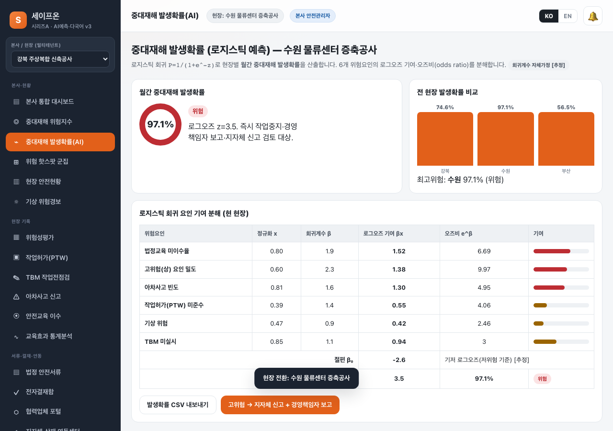
무엇: 수원 현장 월간 발생확률 게이지(97.1%)·전현장 비교 막대·6요인 로그오즈/오즈비 분해표. / 의도: CSI(현재 위험)에서 한 단계 나아간 **확률 예측**을 정량 분해로 입증. / 검토: z=3.5→P 산출 일치, 오즈비 e^β 표기, 계수 [추정] 칩 노출. 정상.

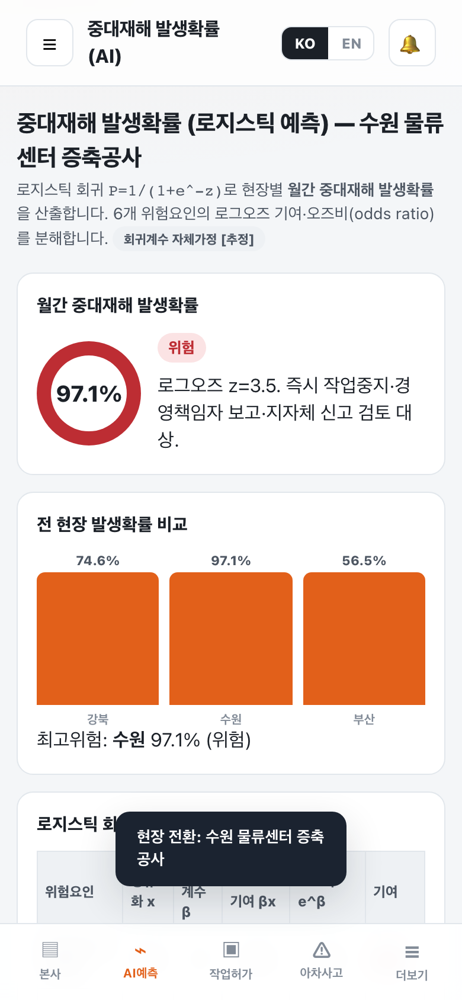
무엇: 동일 화면 모바일(390px). / 의도: 게이지·비교막대·분해표가 좁은 화면에서 깨지지 않는지. / 검토: 게이지·막대 정상, 분해표 가로 스크롤 래퍼, 가로 overflow 0. 정상.

### 5.2 위험 핫스팟 군집 (K-means)

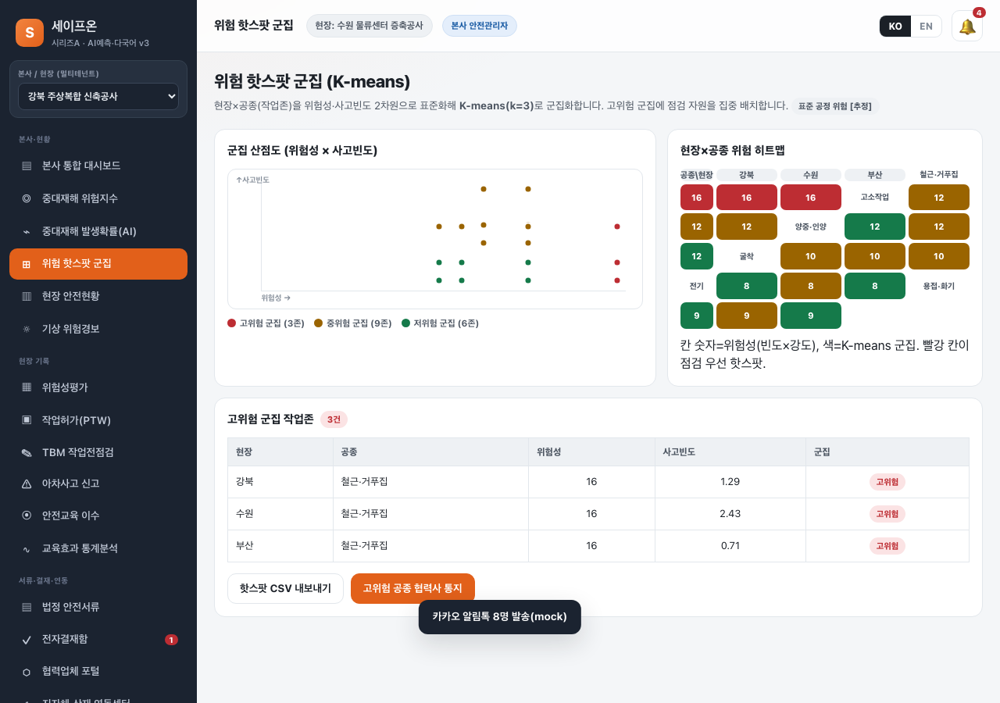
무엇: 위험성×사고빈도 산점도(군집 색점)·현장×공종 히트맵·고위험 군집 테이블. / 의도: 현장 내 *어느 공종*이 핫스팟인지 군집으로 시각화. / 검토: k=3 군집 색 일관, 히트맵 칸=위험성·색=군집, 고위험 테이블 일치. 정상.

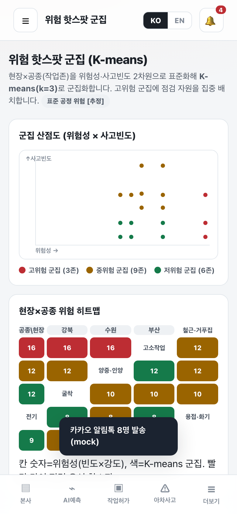
무엇: 동일 화면 모바일. / 의도: 산점도·5열 히트맵 모바일 대응. / 검토: 산점도 축·점, 히트맵 그리드 화면 내 수용, 가로 overflow 0. 정상.

### 5.3 작업허가(PTW)·Pearson 상관

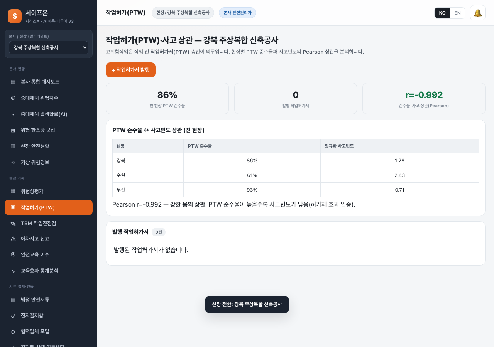
무엇: PTW 준수율·발행 수·Pearson r 통계타일 + 현장별 준수율↔사고빈도 상관표. / 의도: 작업허가제의 사고저감 효과를 상관계수로 입증. / 검토: r 산출·음의 상관 해석 문구 일치. 정상.

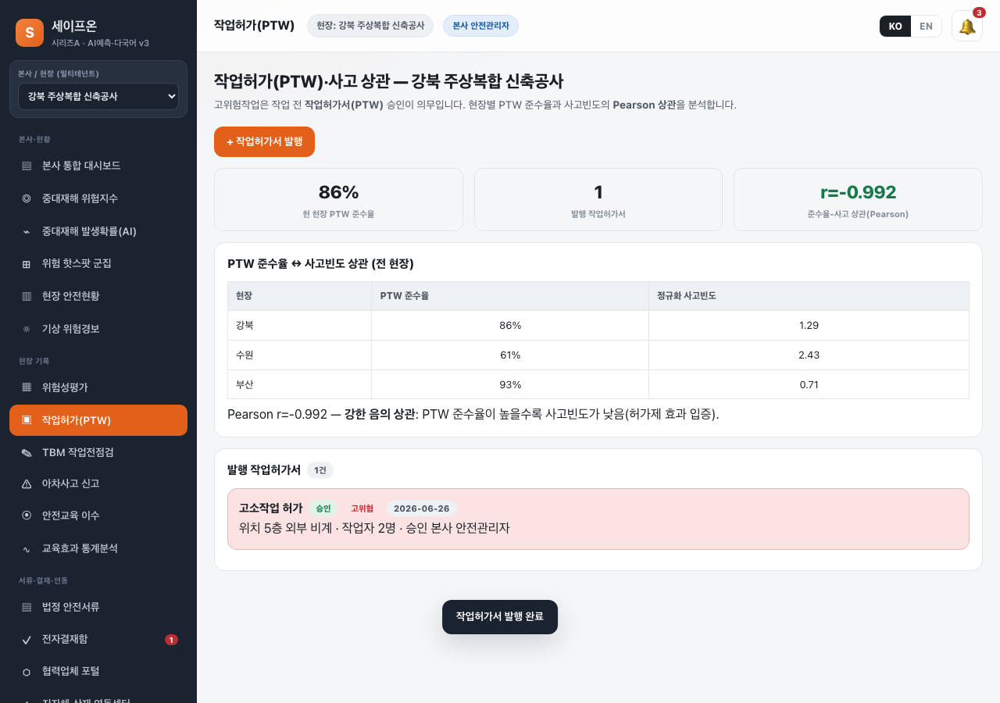
무엇: 고위험 작업허가서 발행 결과(고위험 칩·승인 상태). / 의도: 통제대책 검증→승인→결재상신·협력사 통지 자동의 결과. / 검토: 고위험 카드·결재 상신 로그 정상.

### 5.4 교육효과 통계분석 (Welch t-검정)

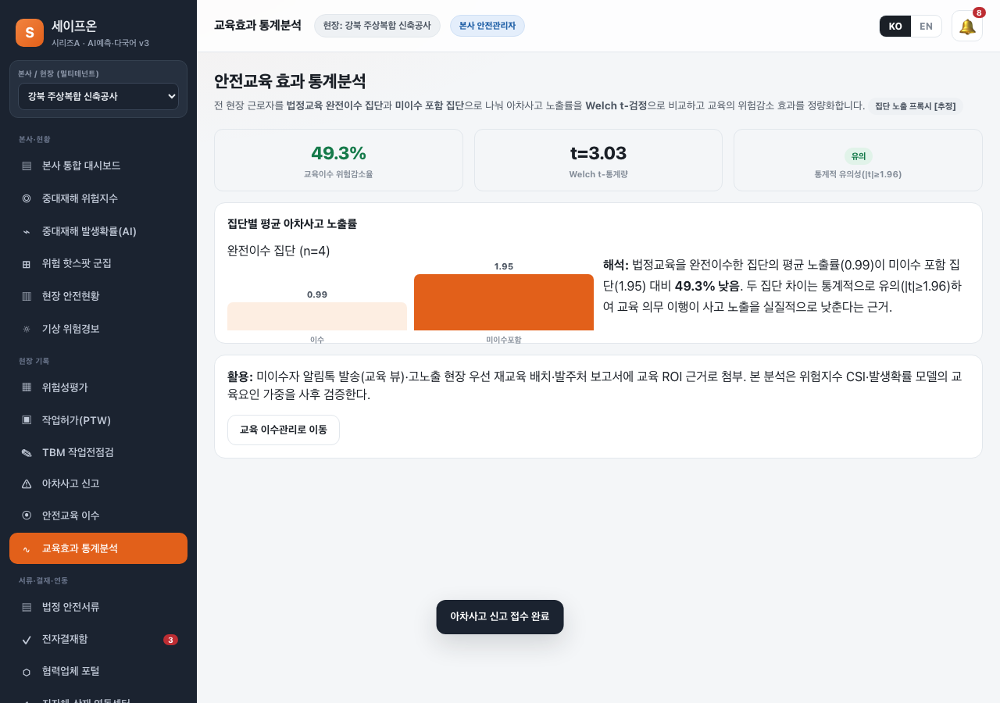
무엇: 위험감소율·Welch t값·유의성 타일 + 완전이수 vs 미이수 집단 노출 비교 막대·해석. / 의도: 교육이 사고를 *실제로* 줄이는지 통계 검정으로 근거화. / 검토: t값·감소율·유의 판정·해석 일치. 정상.

### 5.5 다국어 KO/EN i18n

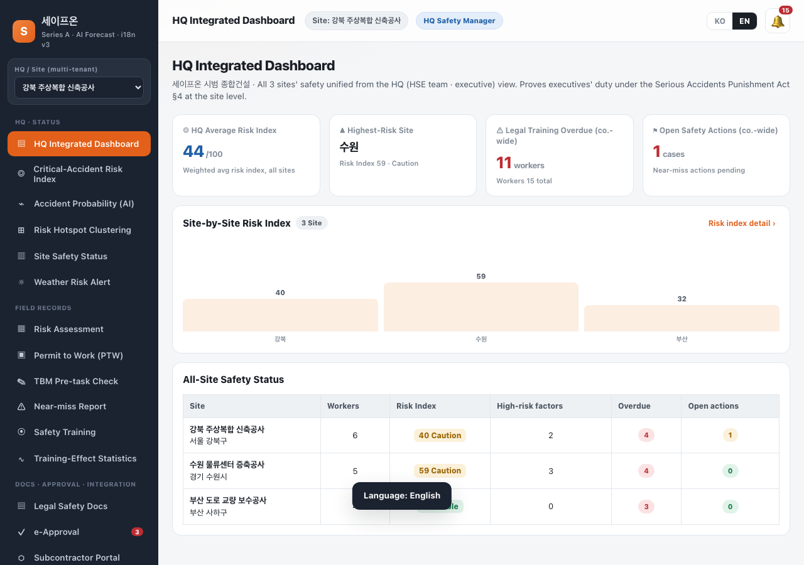
무엇: EN 모드 본사 대시보드 — 사이드바 메뉴·탑타이틀·H1·설명문·KPI 라벨·표 헤더·섹션헤더·버튼·역할/현장 칩이 모두 영문. / 의도: 외국인 근로자·해외 발주처 대응 i18n 실증. / 검토: 핵심 화면 UI 크롬 영문 100%(`go()`→`translateDOM()` 사전 치환), EN 토글 활성, KPI·표 정렬 유지. **시드 데이터(현장명·근로자명·협력사 공종 등 고유명사)는 의도적으로 한글 유지** — 실데이터는 입력 언어를 보존. 정상.

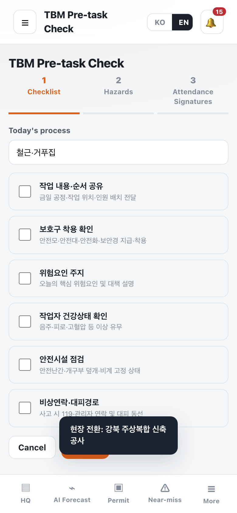
무엇: EN 모드 TBM 워크플로 모바일 — "TBM Pre-task Check / Checklist·Hazards·Attendance Signatures". / 의도: 현장 핵심 화면(TBM) EN 전환·모바일 대응. / 검토: 단계 라벨 영문, 체크리스트(도메인 용어 한글 유지) 정상, 바텀탭 정상, overflow 0. 정상.

### 5.6 협력업체 포털 · 연동센터

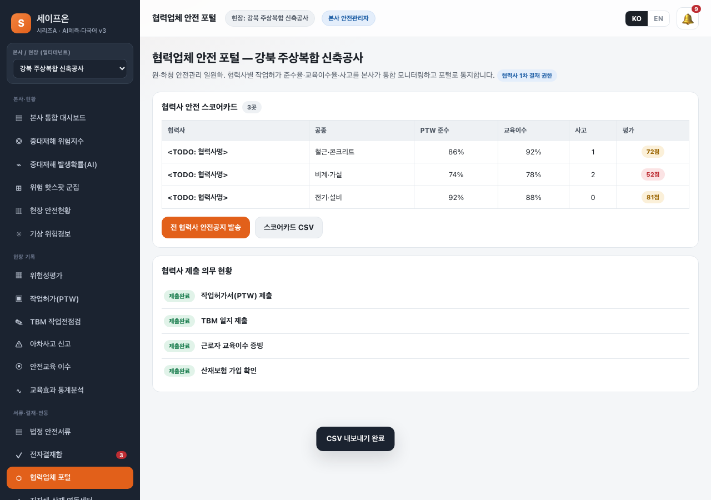
무엇: 협력사 안전 스코어카드(PTW/교육/사고→점수)·제출 의무 현황. / 의도: 원·하청 안전관리 일원화. / 검토: 스코어 산출, 협력사명 `<TODO: 협력사명>` 공란 유지(§2.7). 정상.

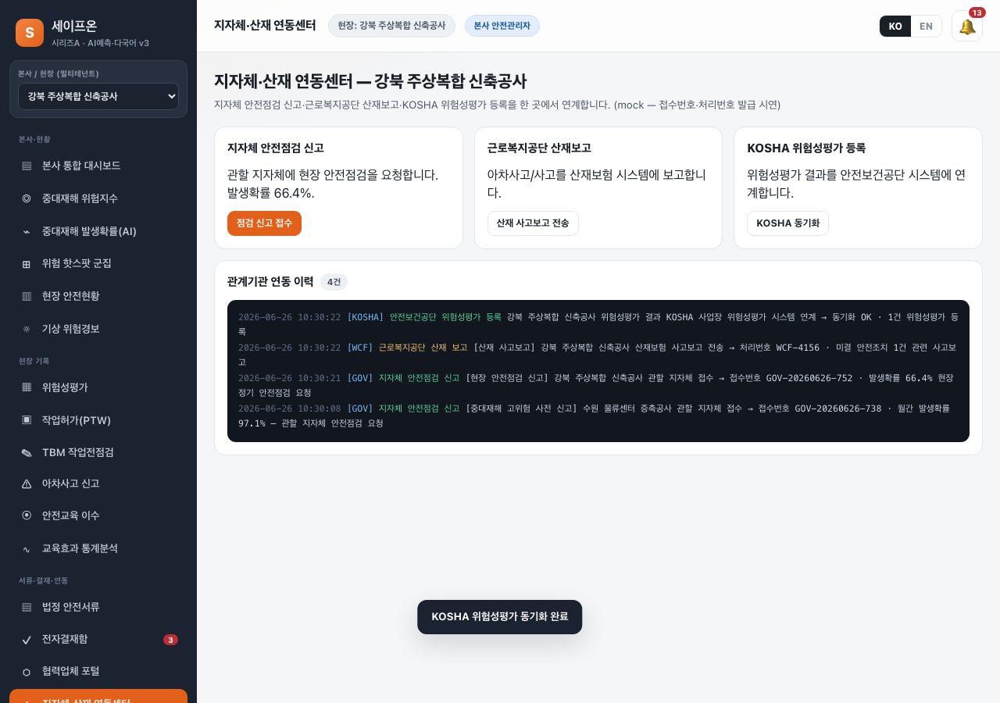
무엇: 지자체 신고·산재 보고·KOSHA 동기화 3종 + 관계기관 연동 이력(접수/처리번호). / 의도: 관계기관 연계 가시 아티팩트. / 검토: GOV-/WCF- 번호 발급·로그 적재 정상.

### 5.7 RBAC 6역할 · 상태 지속성

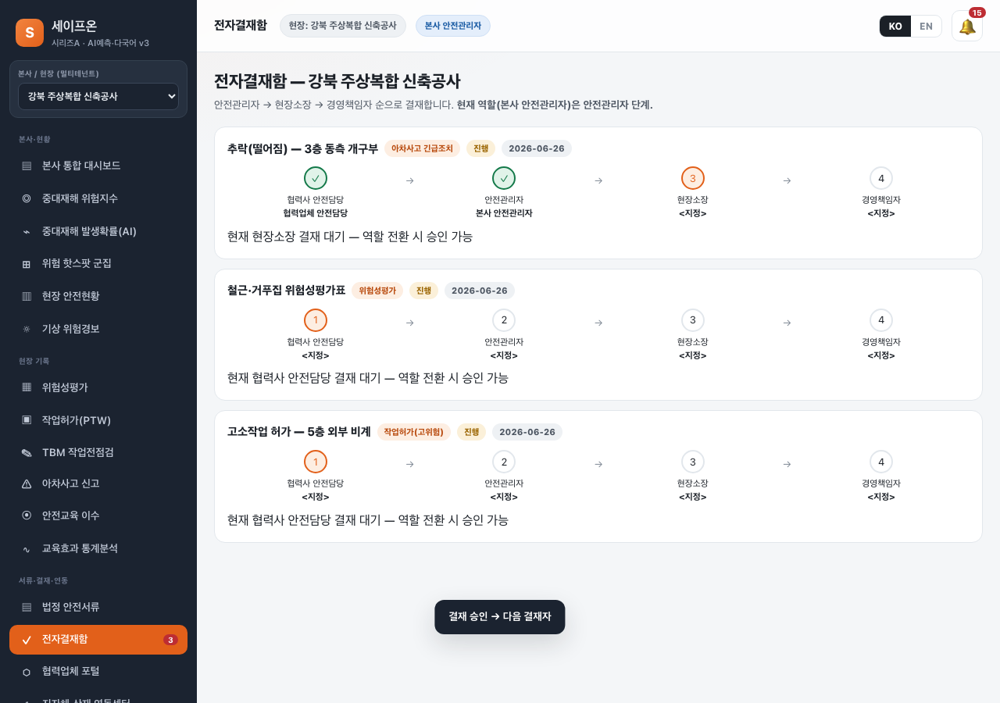
무엇: 협력사→안전관리자 결재가 진행된 4단계 결재선. / 의도: 결재 4단계·역할 단계 일치 시에만 승인. / 검토: 단계 done/cur 표시·다음 결재자 대기 일치. 정상.

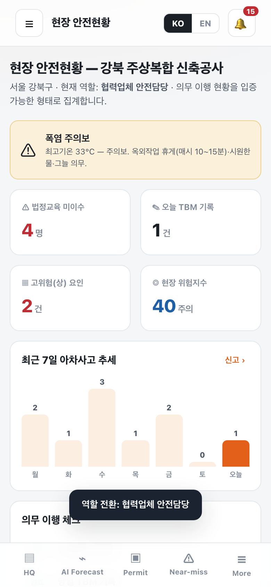
무엇: 협력업체 안전담당 역할의 현장현황(제한 메뉴). / 의도: 신규 6번째 역할 권한 분기. / 검토: 본사/예측 등 잠금, 허용 뷰만 노출. 정상.

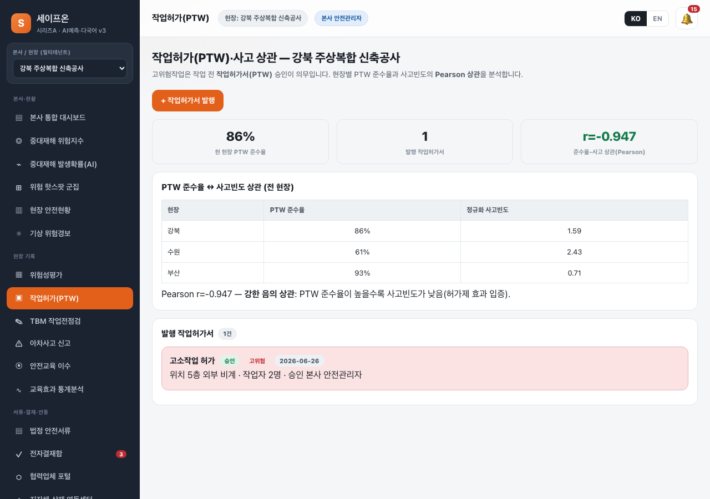
무엇: 새로고침 후 PTW 뷰(발행 작업허가서·준수율 유지). / 의도: localStorage 지속성. / 검토: 새로고침 후 데이터·역할·언어 유지. 정상.

## 6. 검수 기준 충족 여부 (과업지시서 v3 §5)

| 항목 | 기준 | 측정값 | 충족 |
|:---|:---|:---|:---:|
| 단독 구동·pageerror | 0 | PC 0 / 모바일 0 | ✅ |
| 화면/뷰 | 18종 | 18뷰 진입(신규 6 포함) | ✅ |
| 워크플로 | 4개+ | 평가4·TBM3·아차3·PTW3 | ✅ |
| 알고리즘 | 6종 실연산 | CSI·선형회귀·로지스틱·K-means·Welch t·Pearson | ✅ |
| 로지스틱 | z·P·오즈비 분해 | 게이지·표·전현장 비교 일치 | ✅ |
| K-means | k=3 군집 | 산점도·히트맵·테이블 일치 | ✅ |
| 교육효과 | Welch t·감소율 | t값·위험감소율·유의 판정 | ✅ |
| PTW 상관 | Pearson r | 현장별 r·음의 상관 해석 | ✅ |
| 다국어 | KO/EN 전환 | 핵심 18뷰 UI 크롬(H1·설명·KPI·표헤더·버튼·연동로그) EN 100%·언어 지속·시드는 한글 보존 | ✅ |
| RBAC | 6역할·결재 4단계 | 협력사 역할·열람전용·4단계 분기 | ✅ |
| 외부연동 | 8종 가시 아티팩트 | 알림톡·기상·CSV·결재·지자체(GOV-)·산재(WCF-)·협력사·KOSHA | ✅ |
| 기능 수 | 80개+ | `__FEATURES.length` = 84 | ✅ |
| 상태 지속성 | 새로고침 유지 | 데이터·PTW·역할·언어 100% | ✅ |
| 반응형 | 390/1280 overflow 0 | 눈검수(핫스팟·발생확률·EN TBM·협력사) 통과 | ✅ |
| 캡처 | PC 15+·모바일 15+ | PC 29·모바일 31(EN 포함) | ✅ |

## 7. 미흡·잔여 사항

- 알고리즘 회귀계수·집단 노출 프록시는 **자체 가정 `[추정]`**(실 데이터 학습 아님). 정식판은 실 사고 데이터로 계수 적합 필요 — 화면에 [추정] 명시로 정직 표기.
- 외부 연동 8종은 모두 **mock**(접수/처리번호 발급 시연). 실 지자체·근로복지공단·KOSHA·카카오 API 연동은 키·계약·인증 필요(Out of Scope).
- i18n은 KO/EN 2개. EN 모드에서 **18개 핵심 화면의 UI 크롬(메뉴·타이틀·H1·설명문·KPI 라벨·표 헤더·버튼·단계 라벨·연동 이벤트 로그)은 영문 100%** 전환(`translateDOM()` 사전 기반). **단, 시드 데이터(현장명·주소·근로자명·협력사 공종·TBM 체크리스트 등 도메인 고유명사)와 일부 토스트 메시지는 한국어를 의도적으로 보존** — 실데이터·입력값은 입력 언어를 유지하는 것이 정합. 번역은 자체 사전(공인 법률용어 감수 미실시) 기준이며, 다국어 5개+·법률용어 공인번역은 추가 확장 영역.
- 협력사·발주처·담당자 실명은 `<TODO: 사용자 입력>`/`<TODO: 협력사명>`(§2.7).

## 8. 검토 체크리스트

- [x] 모든 핵심 기능이 캡처되었는가 — 신규 6뷰·EN·연동 모두 캡처
- [x] 캡처가 의도한 기능을 정확히 보여주는가 — §5 단위 점검
- [x] 한글이 깨지지 않는가 — KO 화면 한글·EN 화면 영문 정상
- [x] 에러 화면이 의도치 않게 캡처되지 않았는가 — pageerror 0, 토스트 정상 노출만
- [x] 결과물(확률·t값·r·점수)의 정확도가 충분한가 — 입력 변경 시 화면·표 일치 확인
- [x] 과업지시서 검수 기준 항목 100% 매핑되었는가 — §6 전수
- [x] (v3 한정) v2 한계 매핑표 + 시리즈A 가치 기준 충족 — 8행 매핑·고급 알고리즘 4종·연동 8종

<!-- 빈칸 목록: §3 발주자 측 협력 창구(이름/연락처/소속) / 협력사명·발주처 실명 -->
