# 제안서 — SMB 통합 백오피스 SaaS 「스몰박스」

> 본 제안서의 모든 시장·재무 수치는 [`5_research/README.md`](./5_research/README.md) 에서 2026-06-06 웹 검색으로 검증·정리한 1차/공공/언론/VC/벤더 출처에 연결된다. 검증되지 않은 가설값은 `[추정]`, 출처를 직접 확정하지 못한 값은 `[재확인 필요]` 로 본문에 명시한다.

## 0. 프로젝트 메타

| 항목 | 값 |
|:---|:---|
| 사업명 | 2026년 창업동아리 지원사업 (창업중심대학 X RISE 사업단) |
| 주관기관 | 대구대학교 창업지원단 |
| 트랙 | 실전창업 (창업동아리 / 기본 300만원·최대 1,000만원) |
| 일정 | 모집공고 '26.3.19~4.2 · 선발평가 4.6~4.8 · 선발안내 4.9 · 협약·설명회 4.10 · 지원·관리 '26.4.13~'27.1.31 |
| 아이템 | 직원 5~50인 중소기업(SMB)용 통합 백오피스 SaaS 「스몰박스(SmallBox)」 |
| 한 줄 정의 | 인사·노무·전자계약·근태·급여·문서를 **한 화면, 단일 직원 데이터, 합리적 단가**로 끝내는 SMB 전용 올인원 백오피스 |
| 타깃 사용자 | 종사자 5~50명 SMB (소상공인 졸업 직후 ~ 중소기업 진입 구간) |
| 팀 | <TODO: 사용자 입력> |

---

## 1. 문제 인식 (Problem)

### 1.1 거시 배경 — 한국 SaaS는 성장하지만 SMB는 소외된다

한국 SaaS 시장은 **2022년 1조7,843억원 → 2026년 3조614억원(향후 5년 CAGR 15.5%)** 로 빠르게 성장하고 있다.[^1] 더 넓은 클라우드 산업 전체(IaaS+PaaS+SaaS 합산)는 **2024년 매출 7조원(+26.6%)** 을 돌파했으나,[^2] 이 7조원은 인프라·플랫폼을 포함한 클라우드 전체 값이며 **SaaS 단독 시장은 약 2~3조원** 규모다(본 사업의 TAM 기준은 SaaS 단독값을 쓴다).[^1][^18] 그러나 이 성장의 과실은 균등하지 않다. 국내 클라우드 도입률은 **24.9%로 OECD 38개국 중 32위**에 머물고,[^18] 글로벌 SaaS 시장 약 360조원 대비 한국은 약 2조원(0.5~1%) 수준으로 절대 규모가 작다.[^5] 즉 시장은 커지지만 **도입의 저변(특히 영세·중소 사업체)은 여전히 비어 있다.** 정부도 이를 인지해 SaaS 기업을 **2022년 1,571개에서 2026년까지 1만개+** 로 육성하는 목표를 세웠다.[^4] 실제 SaaS 공급기업은 **1,642개(전체 클라우드 공급기업의 68.7%, 전년比 +24.0%)** 로 빠르게 늘고 있어,[^3] 공급 저변은 커지는데 SMB 수요 저변이 못 따라가는 비대칭이 본 사업의 진입 공간이다.

문제의 본질은 "한국 SMB의 디지털 백오피스 전환이 구조적으로 지연되고 있다"는 것이다. 그 지연은 단순한 의지 부족이 아니라, 뒤에서 설명할 **가격·파편화·제도복잡성** 세 장벽의 합작이다.

### 1.2 모수 — 누가 소외되는가

한국 중소기업은 **804만2,726개(전체 사업체의 99.9%), 종사자 1,895만6,294명**에 달한다.[^6] 이 중 본 사업의 타깃인 **종사자 5~50인 구간**은 "소상공인을 졸업해 직원을 고용하기 시작했지만, 전담 인사·노무·총무 인력을 둘 여력은 없는" 가장 취약한 운영 구간이다. 5인 미만은 행정 부담 자체가 작고, 50인 초과는 전담 인력·엔터프라이즈 HR을 도입하지만, **그 사이 구간은 사장 1명이 모든 백오피스를 떠안는다.**

### 1.3 세 가지 구조적 장벽

**장벽 ① 가격 — 글로벌 SaaS는 SMB에 도달 불가능하다.**
DocuSign Standard는 user당 **$25/월**,[^15] BambooHR Core는 직원당 **$10/월**(Elite $25),[^16] Gusto는 **기본 $49 + 직원당 $6/월**[^17] 이다. 환율을 적용하면 직원 10명 기준 전자계약·HR·급여만 묶어도 월 수십만 원이 든다. SMB 사장에게 이 단가는 "기능은 좋지만 우리 회사용은 아닌" 가격대다.

**장벽 ② 파편화 — 사장 1명이 도구 5개를 각자 결제·연동한다.**
국내에서 영역별 1위가 분산되어 있다. 전자계약은 모두싸인(전자서명 점유율 **71%**, 매출 93.1억(’25)),[^7][^8] HR·인사는 플렉스(ARR 300억+, 기업가치 5,000억),[^9] 근태·스케줄링은 시프티(스탠다드 **5,000원/직원·월**, 사업장 30만+),[^10] 세무는 자비스앤빌런즈(B2C 삼쩜삼 세금환급 앱 누적가입 2,450만+ — B2B 백오피스 고객 수가 아님, 자비스 B2B는 세무·환급 중심·HR/전자계약 비핵심).[^11] 각각은 자기 영역의 강자지만, **5~50인 SMB가 인사+노무+전자계약+근태+급여를 한 화면에서 끝내는 통합 제품은 비어 있다.** 사장은 도구를 각자 계약·결제·학습하고, 직원 정보를 도구마다 다시 입력한다.

**장벽 ③ 제도 복잡성 — 매년 바뀌는 요율·기준을 수기로 따라갈 수 없다.**
4대보험 요율은 **2026년에 건강보험 7.09→7.19%, 국민연금 9→9.5%, 장기요양 0.9182→0.9448%** 로 변경된다(고용·산재 별도 고시).[^13][^12] 전자세금계산서 의무발급 기준은 **2024.7.1부터 직전연도 공급가액 1억 → 8,000만원으로 하향**되어 더 많은 SMB가 의무 대상이 됐다.[^14] 전담 인력이 없는 SMB일수록 이 변화를 따라가기 어렵고, 잘못 계산하면 가산세·분쟁으로 직결된다.

### 1.4 결과 — 비소비(Non-consumption)와 숨은 비용

세 장벽의 합은 두 가지 결과를 낳는다. (a) **비소비**: 도입을 포기하고 엑셀·수기로 버틴다(도입률 24.9%의 하단). (b) **숨은 비용**: 무리해서 분리 도구를 도입한 SMB는 직원 10명 기준 월 수십만 원의 구독료 + 도구 간 재입력·전환 시간을 지불한다. 어느 쪽이든 **사장의 본업 시간이 백오피스에 잠식**된다.

**[그림 1] SMB 백오피스의 도구 파편화·비용·데이터 단절 구조**

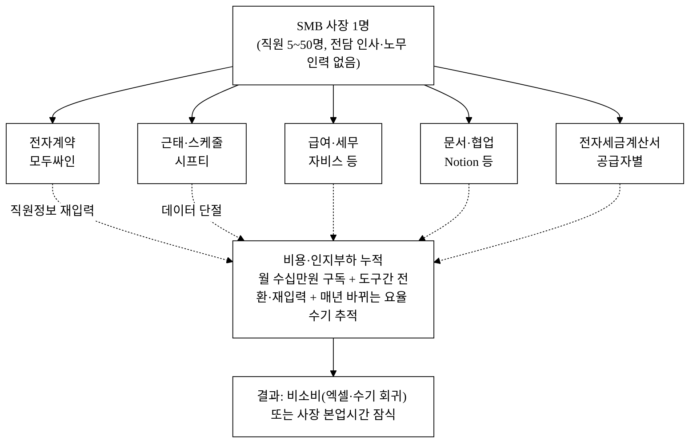

> 위 도식의 핵심은 화살표가 아니라 **단절선(점선)** 이다. 다섯 도구가 같은 직원을 각자 들고 있어, 입사 1명 처리에 5번의 재입력이 발생한다. 스몰박스는 이 단절선을 단일 데이터 허브로 대체한다([그림 2]).

---

## 2. 솔루션 (Solution)

### 2.1 제품 개요

**스몰박스**는 **단일 직원 마스터 데이터**를 중심으로 백오피스 4대 모듈(전자계약·근태·급여·문서)을 묶고, 한국 SMB의 결제·소통 관행에 맞춘 **합리적 단가 + 카카오 알림톡 1급 채널**로 제공하는 통합 백오피스 SaaS다. [그림 1]의 5개 단절 도구를 하나의 데이터 허브로 대체한다.

### 2.2 핵심 모듈

| 모듈 | 기능 | 글로벌 대비 차별 |
|:---|:---|:---|
| 전자계약 | 서명(캔버스)·인감 이미지·**jsPDF 실 PDF 생성**·QR 검증·노동법 표준 템플릿 3종 | 국내 근로계약 관행(인감·재직증명 연계) 내장 |
| 근태 | 출퇴근 GPS·시프트 스케줄·연차·ICS 캘린더 연동 | 시프티급 근태를 통합 단가에 포함 |
| 급여 | **4대보험·소득세 자동 계산**(요율 분기 자동 갱신)·명세서 자동 생성 | DocuSign·BambooHR이 못 하는 한국 요율 자동화[^12][^13] |
| 문서함 | 계약·재직증명·전자세금계산서 보관·검색 | 전자세금계산서 의무발급 기준 변화 대응[^14] |

### 2.3 차별점 세 가지

1. **번들 단가** — 핵심 4종을 시트당 9,900원/월(올인원)에 제공. 분리 도구 합산 대비 약 1/4~1/5([그림 3]).
2. **한국 제도 자동화** — 4대보험·소득세·전자세금계산서를 자동 계산·갱신. 글로벌 제품의 구조적 약점([^15][^16][^17])을 정면으로 공략.
3. **카카오 알림톡 1급 채널** — SMB 직원은 이메일을 잘 열지 않는다. 동의·서명 요청을 알림톡으로 보내 응답률을 높인다.

**[그림 2] 스몰박스 통합 백오피스 아키텍처 (단일 데이터 허브)**

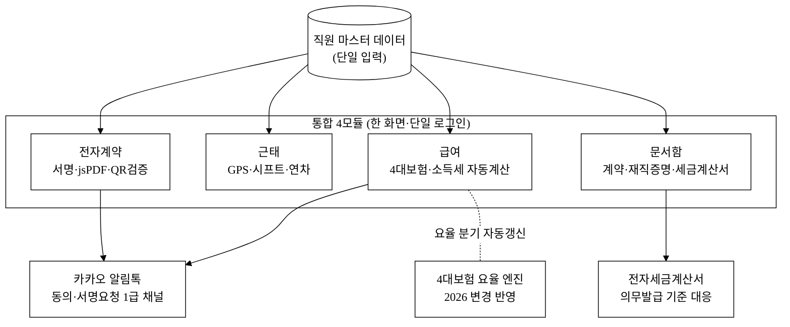

> [그림 1] 대비 핵심 변화: 직원 데이터가 **1번만 입력**되고, 4모듈이 같은 데이터를 공유한다. 입사 처리 1건이 계약→근태등록→급여반영→문서보관까지 한 흐름으로 끝난다.

### 2.4 마이그레이션 · 데이터 이전 · 이탈(Exit) 정책 — *전환비용 장벽 해소*

통합 데이터 허브의 가장 큰 도입 장벽은 "기존 직원·계약·근태 데이터를 다시 다 입력해야 하나"라는 SMB 사장의 공포다. 스몰박스는 **데이터 유입(import)을 제품 기능으로 내장**해 이 장벽을 제거한다.

| 항목 | 제공 방식 | 목표 (파일럿 실측 예정 `[추정]`) |
|:---|:---|:---|
| 일괄 업로드 | CSV/엑셀 직원 마스터 일괄 업로드 마법사(컬럼 자동 매핑) | 직원 50명 셋업 ≤ 30분 |
| 표준 import 템플릿 | 직원·계약·근태 표준 양식 다운로드 → 채워서 재업로드 | 무료 제공 |
| 경쟁 도구 이관 가이드 | 모두싸인·시프티 export 파일을 스몰박스 양식으로 변환하는 가이드·매핑표 | 무료 이관 지원(온보딩 약속) |
| 이탈 시 export | 전체 데이터(직원·계약·근태·급여이력) CSV/PDF 일괄 내보내기 보장 | lock-in 불안 해소 조항 |

> **설계 의도**: import는 도입 마찰을 낮추고, export 보장은 "갈아탔다가 못 빠져나올까" 하는 lock-in 공포를 해소한다(역설적으로 export 보장이 전환을 촉진한다). 다만 도입 후 누적되는 급여·계약 이력 자체가 전환비용을 형성하므로(§5.3), import는 쉽게·축적 데이터는 무겁게 설계한다.

### 2.5 급여·4대보험 계산 신뢰성 검증 — *틀리면 가산세인 기능의 정확성 보증*

"4대보험·소득세 자동 계산"은 본 제품의 핵심 차별점인 동시에, **1원만 틀려도 가산세·근로자 분쟁으로 직결되는 신뢰가 전부인 기능**이다. 신생 SaaS의 급여 계산을 SMB 사장이 신뢰하려면 정확성 보증 체계가 필수다.

| 검증 항목 | 방식 | 목표 |
|:---|:---|:---|
| 계산 정확도 | 국세청 간이세액표·4대보험 공단 모의계산기를 정답셋으로 회귀테스트 | 정답셋 대비 일치율 100% / 오차 0원 |
| 계산 근거 명세 | 급여명세서에 항목별 요율·과세표준·공제 근거 표기(블랙박스 금지) | 전 항목 추적 가능 |
| 요율 변경 검증 | 요율 엔진 갱신 시 변경 전후 회귀테스트 통과 후 배포(§2.2 [그림 2] RATE) | 분기 갱신 100% 검증 |
| 전문가 감수 | 노무사 감수 게이트 — 자동계산 결과를 노무사가 최종 확인하는 옵션(Pro 티어) | 고위험 케이스 이중 확인 |
| 오류 책임 정책 | 계산 근거 로깅 + 보정 절차 + 책임·면책 한계 명시(§9 리스크) | 분쟁 대비 |

> **책임 구조**: 자동계산 오류 발생 시 (1) 계산 근거 로그로 원인 추적, (2) 즉시 보정·재발행, (3) 플랫폼 배상책임 보험 + 노무사 최종확인 게이트로 면책 한계를 사전 정의한다(§9 신규 리스크 행 참조).

---

## 3. 시장 (Scale-up)

> 산정 원칙([`5_research/README.md`](./5_research/README.md) §3 준수): 모든 입력 모수는 검증 출처에서 가져오고, 비율(비중·침투율·ARPU)은 가설이므로 `[추정]` 을 병기한다. 추정값과 공식값을 한 수치에 섞지 않는다.

### 3.1 입력값 (검증 출처)

| 변수 | 값 | 출처 |
|:---|:---|:---:|
| 국내 SaaS 시장(2026E) | 3조614억원 (’22 1조7,843억, CAGR 15.5%) | [^1] |
| 국내 중소기업 수(2022) | 804만2,726개 (전체 99.9%) | [^6] |
| 클라우드/SaaS 도입률(국가) | 24.9% (OECD 32위) | [^18] |
| 시장 참조단가(경쟁) | 5,000원/직원·월 (시프티 스탠다드, 시장 벤치마크) | [^10] |
| 자사 적용단가(ARPU 산정 기준) | 9,900원/시트·월 (스몰박스 Standard, §5.1·§6.3) | 자사 가격표 |

### 3.2 TAM / SAM / SOM 산정

| 구분 | 산정 | 값 | 근거·가정 |
|:---|:---|:---|:---|
| **TAM (top-down)** | 국내 SaaS 전체(3조614억) × 백오피스 비중 `[추정] 20~30%` | **약 6,000억~9,200억원/년** | 백오피스(HR·노무·전자계약·근태·급여·세무) 인접 영역. 세분류 공식 통계 부재로 비중은 `[재확인 필요]` [^1] |
| **TAM (bottom-up 교차검증)** | 전국 사업체 중 백오피스 SaaS 도입 가능 모수(중소기업 804만 사[^6] 중 종사자 1인 이상 구간) × 백오피스 SaaS 연지출. 보수적으로 5~50인 60~70만 사 `[추정]` + 50인 초과 일부를 합쳐 **약 70~80만 사 × 연 80~100만원** | **약 6,000억~8,000억원/년** `[추정]` | top-down(6,000~9,200억)과 같은 자릿수로 수렴 → 비중 가설의 그럴듯함을 보강. 단 사업체 셀·도입률은 `[재확인 필요]` |
| **SAM** | 5~50인 사업체 `[추정] 60~70만 사` × 평균 8시트 × 9,900원/시트·월 × 12 (≈ 95만원/사) | **약 5,700억원/년** `[추정]` | 모수는 KOSIS 규모별 사업체 셀로 확정 필요 `[재확인 필요]`. **ARPU 전제를 자사 단가(9,900원·8시트)로 통일** — §6.3 유닛이코노믹스·§5.1 가격표와 동일 모수 |
| **SOM** | SAM 모수 60만 사 × 진입 3년 누적 침투율 `[추정] 0.5~1.0%` ≈ 4,500사 × 95만원/년 | **약 42.8억원 ARR** `[추정]` | 침투율은 가설. 자사 단가·시트 기준이므로 §6.3 기준 시나리오(4,500사·79,200원/사·월·연 42.8억)와 정합. 도달 가능성은 시프티·플렉스 궤적으로 벤치마크 [^9][^10] |

> **백오피스 비중(20~30%) 근거 보강 — 벤더 매출 교차검증(분자/분모 정렬).** 백오피스 비중은 공식 세분류 통계가 없어 단독으로는 가설이다. 식별 가능한 백오피스 SaaS 벤더의 최근 연매출을 합산하면(모두싸인 93.1억(’25)[^8] + 플렉스 279.4억(’25)[^9] + 시프티 66억(’23)[^10] + 자비스 세무 300억대 중반[^11] ≈ 700억+/년, **상위 4개사만의 부분 합으로 전수 아님**), 군소·미상장 벤더와 신생 SaaS를 더하면 백오피스 SaaS 실현 매출이 이미 수천억대임을 시사한다.
>
> **교차검증의 한계 — 분자/분모 어긋남 인정.** 위 700억은 각 벤더의 **전 세그먼트 매출**(엔터프라이즈·중대형 포함)이지 5~50인 SMB 통합 백오피스 세그먼트 매출이 아니다. 분자(타깃 세그먼트)와 분모(전체 벤더 매출)가 어긋나므로 이 교차검증은 "백오피스 SaaS가 수천억대 시장임"은 입증하나 "5~50인 SMB 비중"을 직접 떠받치지는 못한다. 타깃 세그먼트로 좁히면: 플렉스는 중대형 중심이라 5~50인 비중 `[추정] 10~20%`, 시프티는 사업장 30만+ 다수가 소규모라 `[추정] 50~70%`, 모두싸인 SMB 비중 `[추정] 30~50%` → **타깃 세그먼트 귀속 매출은 합산 700억의 약 30~40%(약 210~280억) [추정]**. 이를 SaaS 전체 3조 대비로 환산하면 5~50인 백오피스 비중은 보수적으로 보아도 의미 있는 규모다(엄밀한 전수 census는 `[재확인 필요]`).
>
> **SAM 모수 시나리오(보수/기준/공격) — 미확정 모수의 구간화.** 5~50인 사업체 모수는 KOSIS 전국사업체조사 규모별(종사자 5~9/10~49인) 셀로 **제안서 제출 전 확정 필요**(현재 `[재확인 필요]`). 확정 전까지 단일값 의존을 피해 구간으로 제시한다.

| 시나리오 | 5~50인 모수 `[추정]` | 도입의향 보정 | 유효 SAM 모수 | SAM `[추정]` |
|:---|---:|:---:|---:|---:|
| 보수 | 50만 사 | 도입률 24.9% 적용[^18] | 약 12.5만 사 | 약 1,180억원/년 |
| 기준 | 60만 사 | 미적용(전 모수) | 60만 사 | 약 5,700억원/년 |
| 공격 | 70만 사 | 미적용(전 모수) | 70만 사 | 약 6,650억원/년 |

> **보수 시나리오의 의미**: 기준·공격 SAM(5,700~6,650억)은 "5~50인 전 사업체가 잠재 고객"이라는 상한이다. 그러나 실제 유료 전환 가능한 모수는 클라우드 도입의향이 있는 부분(국가 도입률 24.9%[^18])으로 보수화하는 것이 정직하다. 보수 SAM **약 1,180억원/년**이 실질적 유료 전환 가능 시장의 하한이며, SOM·재무 추정(§6)은 이 보수 모수와도 정합하도록 침투율을 산정한다.

**[그림 3] 시장 구조 (TAM → SAM → SOM 깔때기)**

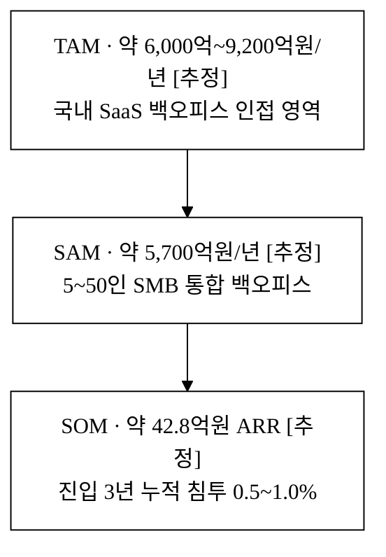

> **ARPU 전제 통일 주석**: 본 제안서는 SAM·SOM·§6.3 유닛이코노믹스 전반에서 **단일 모수(자사 단가 9,900원/시트·월 × 평균 8시트 = 약 79,200원/사·월, 연 약 95만원/사)** 를 사용한다. 시프티 5,000원/직원·월[^10] 은 본문 §1.3·§3.1·§5.1에서 **경쟁 시장 참조단가**로만 인용하며 ARPU 산정에는 쓰지 않는다(두 단가의 차이는 단일 제품 단가 vs 통합 제품 단가의 차이다). 과거 버전이 SAM에 시장단가(5,000원·15인)를, SOM/ARR에 자사단가(9,900원·8시트)를 섞어 ARPU·시트 가정이 충돌했던 점을 해소했다.

### 3.3 도달 가능성 벤치마크

SOM 약 42.8억 ARR이 무모한 가설이 아님은 **국내 인접 SaaS의 실적 궤적**이 보여준다. 시프티는 2023년 **매출 66억·영업이익 50억(매출 +96%)** 의 흑자 SaaS로 PE 투자를 유치했고,[^10] 플렉스는 **매출 160.6억(’23)→279.4억(’25), ARR 300억+, 기업가치 5,000억**을 달성했다.[^9] 모두싸인은 전자계약 단일 영역만으로 **매출 93.1억(’25)·점유율 71%**에 이르렀다.[^7][^8] 영역별 단일 제품이 이 규모에 도달했다면, **이들이 비워 둔 통합 SMB 시장**에서 3년 약 42.8억 ARR은 보수적 목표다.

---

## 4. 경영혁신·창업학적 프레임워크

본 사업은 세 이론으로 정당화된다. (4.1) **Christensen 로우엔드 파괴**가 "왜 SMB 가격대에서 시작하는가"를, (4.2) **Kim·Mauborgne 블루오션 ERRC**가 "기존 경쟁축을 어떻게 재편하는가"를, (4.3) **JTBD + 번들링 경제학**이 "무엇을 측정하고 왜 통합이 이기는가"를 설명한다.

### 4.1 Christensen 로우엔드 파괴 — *왜 SMB 가격대에서 시작하는가*

파괴적 혁신은 (a) 상위 시장이 과잉 충족(over-served)되고 (b) 하위 시장이 비소비(non-consumption) 상태일 때 진입한다. 본 도메인은 두 조건을 모두 충족한다.

- **상위 과잉 충족**: 플렉스(엔터프라이즈 HRIS, 기업가치 5,000억)[^9]·글로벌 DocuSign/BambooHR/Gusto[^15][^16][^17] 는 5~50인 SMB가 쓰지 않는 고급 기능을 고가에 제공한다. SMB 입장에서 "기능 과잉 + 가격 과잉".
- **하위 비소비**: 국내 도입률 24.9%(OECD 32위)[^18] 의 하단에는 엑셀·수기로 버티는 SMB가 있다. 이들은 "고객이 아닌 비고객"이다.

스몰박스는 핵심 4종을 시트당 9,900원(분리 도구 합산 대비 ~1/4~1/5)으로 묶어 이 비소비 저변을 흡수한다. **로우엔드에서 발판을 마련한 뒤 상위로 이동(Pro 티어·다점포·API)** 하는 것이 파괴의 전형적 경로이며, 본 사업의 로드맵(§8)이 이를 따른다.

**왜 기존 강자가 통합 번들로 즉시 대응하지 못하는가 (해자의 정합성).** Christensen 이론의 핵심 메커니즘은 "기존 강자가 하위시장을 방어할 유인·역량이 없어 진입자에게 발판을 내준다"는 것이다. 단, 본 도메인에서 시프티(5,000원/직원·월, 흑자, 사업장 30만+)[^10] 는 이미 SMB 가격대에 있어 **가격만으로는 파괴되지 않는다.** 따라서 본 사업의 진입은 순수 로우엔드 파괴라기보다 **비소비 신시장 파괴(new-market disruption)** 로 프레이밍하는 것이 정합적이다 — 엑셀·수기로 버티던 "비고객"을 통합 단가·단일 데이터로 처음 시장에 끌어들이는 것이 1차 공략면이다. 그 위에서 기존 강자가 통합 번들로 즉시 따라오기 어려운 구조적 이유는 셋이다. (a) **단일 영역 아키텍처** — 시프티는 근태·스케줄링, 모두싸인은 전자계약, 자비스는 세무로 데이터 모델·코드베이스가 단일 영역에 최적화돼 있어, 4대보험 자동계산·전자계약·문서함을 같은 직원 마스터로 묶으려면 제품 재설계 수준의 비용이 든다. (b) **기존 가격 카니발 우려** — 시프티가 통합 번들을 5,000원대에 끼워 넣으면 이미 수익을 내는 근태 단품 매출을 스스로 잠식하므로(흑자 SaaS일수록 이 유인이 약하다), 상위(엔터프라이즈)로 도주할 유인이 더 크다. (c) **제도 자동화 깊이** — 매년 바뀌는 4대보험 요율[^12][^13]·전자세금계산서 의무발급 기준[^14]·노동법 계약 템플릿을 자동 갱신하는 한국 제도 엔진은 가격이 아니라 규제 추적·유지보수 역량의 문제라, 단가 인하로는 모방되지 않는다. 이 셋이 시프티·모두싸인이 "즉시 번들 대응"하기 어려운 해자를 형성한다.

**[그림 4-a] 직원당 월 가격 비교 (공개 단가, 만원/직원·월)**

> 공개 단가가 확인되는 제품만 동일 척도(만원)로 비교한다. 모두싸인·플렉스는 비공개 견적이라 막대에서 제외한다(아래 주석 참조).

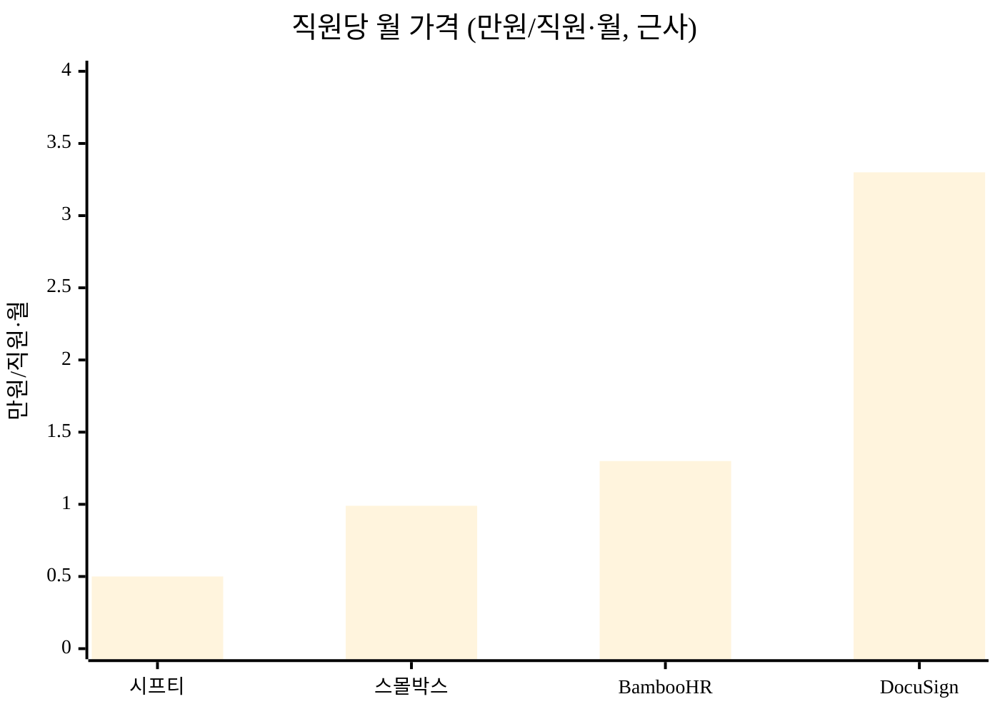

> 막대 = 직원당 월 가격(만원, 근사): 시프티 5,000원=0.5,[^10] 스몰박스 9,900원=0.99, BambooHR $10≈1.3만원,[^16] DocuSign $25≈3.3만원[^15] (환율 약 1,330원/$ 적용 `[추정]`). 모두싸인·플렉스는 비공개 견적이라 막대 비교에서 제외. 스몰박스는 글로벌 단일 제품보다 낮은 단가다.
>
> **통합도(별도 축)**: 위 가격 막대와 달리 통합 모듈 수는 척도가 달라 같은 그래프에 겹쳐 읽을 수 없으므로 표로 분리한다. 5대 영역(전자계약·근태·급여·문서·세무) 中 커버 수: 모두싸인 1 · 시프티 1 · 플렉스 3 · DocuSign/BambooHR 1~2 · **스몰박스 5**. 경쟁사는 "저가-단일" 또는 "고가-소수통합"에 분포하지만, 스몰박스는 **합리적 단가 + 통합도 최고** 라는 빈 사분면을 점유한다([그림 4-b]).

**[그림 4-b] 전략 포지셔닝 개념도 — 가격 축 × 통합도 축**

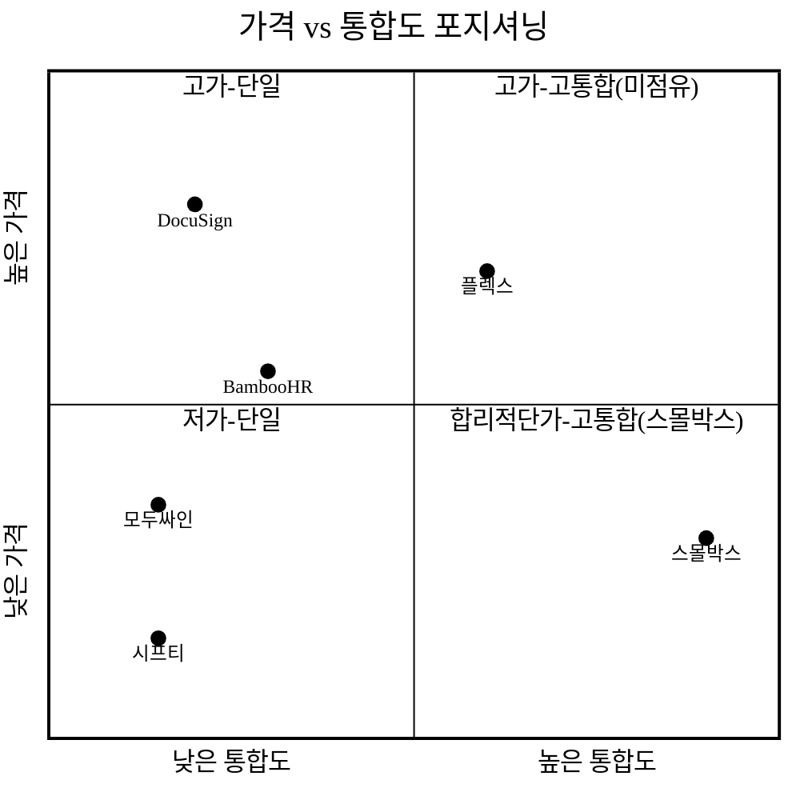

> 통합도(가로축)·가격(세로축)을 별개 축으로 둔 개념도. 경쟁사는 좌측(단일/소수 영역)에 몰려 있고, 스몰박스는 **우하단(고통합·합리적 단가)** 빈 영역을 점유한다.

### 4.2 블루오션 ERRC — *경쟁축의 재편*

기존 시장의 경쟁 요소를 제거(Eliminate)·감소(Reduce)·증가(Raise)·창조(Create)로 재구성한다.

| 액션 | 요소 | 내용 |
|:---|:---|:---|
| **Eliminate** | 도구 간 직원정보 재입력 / 다중 구독·결제 관리 | 단일 직원 데이터·단일 청구로 제거 |
| **Reduce** | 시트당 단가 / 학습·온보딩 비용 | 분리 도구 합산 대비 ~1/4~1/5, 한 화면 학습 |
| **Raise** | 한국 제도 적합성(4대보험·전자세금계산서·노동법 템플릿) | 글로벌 제품이 못 하는 자동 계산·갱신[^12][^13][^14] |
| **Create** | 카카오 알림톡 1급 동의·서명 채널 / SMB 전용 통합 백오피스 카테고리 | 신규 가치 곡선 창출 |

ERRC의 결론은 **"저가-단일"과 "고가-다기능"이라는 기존 경쟁축을 벗어나, '합리적 단가 + 통합 + 한국 제도 자동화'라는 새 가치 곡선([그림 4-b]의 빈 사분면)을 만든다"** 는 것이다.

### 4.3 JTBD + 번들링 경제학 — *무엇을 측정하고 왜 통합이 이기는가*

SMB 사장이 고용하는 Job은 *"인사·노무를 빠르게 끝내고 본업으로 복귀"* 다. 측정 단위는 **절약된 시간**이다. 도구가 5개로 쪼개지면 Job 완료까지 컨텍스트 전환·재입력 비용이 커진다. 번들링은 두 축에서 Job 완료 속도를 높인다.

- **가격 축**(§4.1): 통합 단가로 분리 도구 합산 대비 ~1/4~1/5.
- **인지 축**: 단일 직원 데이터·단일 로그인으로 인지 부하를 제거. 입사 1건이 계약→근태→급여→문서까지 한 흐름으로 끝난다([그림 2]).

이를 **린 스타트업의 Build-Measure-Learn** 로 검증한다. MVP(핵심 4종)를 먼저 출시하고 아래 가설을 측정한다.

| 가설 | 측정 지표 | 검증 방법 |
|:---|:---|:---|
| SMB는 통합가에 전환한다 | 분리도구 → 스몰박스 전환율 | 파일럿 30사 도입율 |
| 사장 시간이 절약된다 | 인사·노무 처리 시간(월) | 도입 전후 비교 |
| 알림톡이 이메일보다 열린다 | 서명 요청 응답률 | 채널별 A/B |

---

## 5. 경쟁 분석 (Competitive Landscape)

### 5.1 심화 경쟁 매트릭스

| 항목 | 모두싸인 | 시프티 | 플렉스 | 자비스 | DocuSign/Bamboo(글로벌) | **스몰박스 (당사)** |
|:---|:---:|:---:|:---:|:---:|:---:|:---:|
| 전자계약 | ◎ | ✕ | △ | ✕ | ◎ | **◎** (jsPDF 자체 생성·QR) |
| 근태·시프트 | ✕ | ◎ | ○ | ✕ | ✕ | **◎** |
| 급여·4대보험 자동 | ✕ | △ | ○ | ◎(세무) | ✕ | **◎** (요율 분기 갱신) |
| 문서함·세금계산서 | △ | ✕ | △ | ◎ | ✕ | **◎** |
| 카카오 알림톡 | △ | ○ | △ | △ | ✕ | **◎** |
| 한국 노동법 템플릿 | △ | △ | ○ | ○ | ✕ | **◎** (3종 기본) |
| 직원당 가격(원/월, 근사) | 견적 | 5,000[^10] | 견적(고가)[^9] | 견적 | DocuSign $25(약 3.3만원)/BambooHR $10(약 1.3만원)[^15][^16] | **9,900 (올인원)** |
| 타깃 규모 | 전 규모 | 근태 중심 | 중대형[^9] | 세무 중심 | 글로벌·중대형 | **5~50인 SMB** |
| **지속가능 해자** | 점유·신뢰 | 규모·흑자 | 자본·엔터 | 세무 데이터 | 글로벌 브랜드 | **단일 데이터 락인+노무사 네트워크(§5.3)** |

> **각 `◎`가 왜 모방 어려운가(1줄).** 전자계약 ◎ — jsPDF 자체생성은 모두싸인 대비 **법적효력은 열위**(§10.3 보완책 참조)이나, 단일 직원 마스터와 결합된 자동 발송 워크플로가 차별점. 4대보험 자동 ◎ — 기능 자체는 6~12개월 카피 가능, 방어는 요율 변경 이력 누적·노무사 감수 체계. 알림톡 ◎ — 채널은 누구나 붙이나, **단일 데이터와 결합된 자동 발송 워크플로**(입사→계약→알림)가 모방 난이도를 높임. 즉 차별성은 "기능 보유"가 아니라 §5.3의 2·3층 락인에 있다.

### 5.2 서술 — 경쟁 공백(Whitespace)

국내 경쟁 지형은 **영역별 1위가 분산**된 형태다. 전자계약은 모두싸인(점유율 71%, 매출 93.1억)[^7][^8] 이 압도하고, HR·인사는 플렉스(ARR 300억+, 기업가치 5,000억)[^9] 가 중대형을 가져갔으며, 근태는 시프티(사업장 30만+, 재구매율 97.2%)[^10], 세무는 자비스(누적가입 2,450만+은 **B2C 삼쩜삼 세금환급 앱 사용자 수**이며 B2B 백오피스 고객 수가 아님)[^11] 가 점유한다. 각자 강력하지만 **"5~50인 SMB가 한 화면에서 인사+노무+전자계약+근태+급여를 끝내는 통합 제품"** 은 비어 있다.

글로벌 제품(DocuSign·BambooHR·Gusto)은 기능은 우수하나 **국내 4대보험·전자세금계산서 규정을 자동 처리하지 못하고**[^12][^13][^14] 단가가 높다.[^15][^16][^17] 결과적으로 스몰박스의 진입 공백은 명확하다 — **"SMB용 합리적 단가 + 한국 제도 자동화 통합 백오피스"**. 이는 [그림 4-b]에서 어떤 경쟁사도 점유하지 못한 사분면이다.

### 5.3 지속가능 해자 3층 구조 — *기능 카피를 넘어서는 방어선*

경쟁 매트릭스의 `◎`는 대부분 "기능 보유"이며, 기능은 자본·시간으로 6~12개월이면 모방된다. 진짜 방어선은 기능층 위에 쌓는 **전환비용층·네트워크층**이다.

| 층 | 해자 유형 | 모방 난이도 | 정량 목표 |
|:---|:---|:---|:---|
| 1층 (기능) | 통합 4모듈·제도 자동화 | **낮음** — 6~12개월 카피 가능(자인) | time-to-market 선점(18개월 리드) |
| 2층 (전환비용) | 단일 직원 마스터에 누적된 계약·근태·급여 이력 | **중간** — 이전 시 데이터 재구축·재검증 부담 | NRR(순매출유지율) ≥ 100% / 월 churn ≤ 3% `[추정]` |
| 3층 (네트워크) | 노무사·세무사 양면시장 + 업종별 급여/계약 벤치마크 데이터 | **높음** — 임계점 넘으면 cold-start 장벽이 경쟁사에 발생 | 노무사 N명 × SMB M사 임계점(§7 KPI) |

**(1) 전환비용 정량화.** 도입 1년차 SMB는 직원 마스터에 12개월치 급여명세·계약 이력·근태 기록을 쌓는다. 이탈하려면 (a) 데이터 이전(export는 보장하나 타 도구 재입력 부담), (b) 급여 연속성 단절 리스크(연말정산·4대보험 신고 이력), (c) 직원 재교육이 발생한다. 이 부담을 NRR ≥ 100%·월 churn ≤ 3% 목표로 환산해 관리한다.

**(2) 멀티홈잉(재분리) 비용.** 통합 제품을 떠나 다시 5개 분리 도구로 돌아가는 비용 = [그림 1]의 파편화 상태로의 회귀 = 월 수십만원 구독 + 도구당 재입력·전환 시간. 즉 **이탈 자체가 비통합의 고통으로 되돌아가는 구조**라 멀티홈잉 비용이 높다.

**(3) 데이터 플라이휠.** 고객·시트가 늘수록 업종별 급여 벤치마크·계약 분쟁 패턴 같은 독점 데이터셋이 축적되고, 이를 벤치마킹 리포트·이상탐지 기능으로 환류한다. 모방 비용을 "시간"이 아니라 "누적 데이터"로 전환하는 것이 3층의 핵심이다.

**[그림 4-c] 경쟁사 대응 시나리오 매트릭스**

> 기존 강자의 통합 대응을 4개 시나리오로 정면 가정하고, 각각에 예상 대응시점·자사 방어수단·정량 영향을 명시한다. `[추정]` 병기.

| 시나리오 | 위협 | 예상 대응시점 `[추정]` | 자사 방어수단 | 정량 영향 `[추정]` |
|:---|:---|:---:|:---|:---|
| ① 시프티 통합 번들 출시 | 흑자·5,000원 단품 → 7,900원 통합 번들 | 6~12개월 | 18개월 선점 리드의 고객·데이터 락인(2·3층), 제도엔진 깊이 | 신규 획득 CAC 상승, 기존 고객 churn 영향 제한적 |
| ② 플렉스 하향 진입 | 자본력(밸류 5,000억)으로 SMB 무료 티어 | 12~18개월 | 플렉스는 중대형 코드베이스 재설계 부담, SMB 단가 카니발 우려 | 가격 압박 |
| ③ 모두싸인+시프티+자비스 **API 제휴연합** (가장 치명적) | 재설계 없이 제휴로 "통합"을 우회 | 6~12개월 | 제휴는 데이터 모델 통합이 아니라 연동 — 단일 마스터 UX 열위, 통합 책임 분산. 우리는 진짜 단일 데이터로 차별 | UX·신뢰에서 우위 유지하나 마케팅 경쟁 심화 |
| ④ 글로벌(Deel 등) 현지화 | 자본·브랜드로 한국 4대보험 대응 | 18~24개월 | 규제 추적·노무사 네트워크·한국 관행(인감·알림톡) 누적 우위 | 제한적 |

> **카피 난이도 정량화.** 통합 4모듈을 단일 직원 마스터로 묶는 것은 "데이터 모델 재설계 + 4모듈 동시 운영"이다. 단일 영역 코드베이스를 가진 경쟁사가 이를 따라잡는 비용을 보수적으로 **약 30~50 man-month(시니어 3~5명 × 6~10개월) [추정]**로 추정한다. 이는 큰 비용이지만 흑자기업에게 불가능하진 않으므로, 본 사업의 방어는 "카피 불가"가 아니라 "**카피 완료 시점에 이미 18개월 선점 + 2·3층 락인이 형성됨**"에 베팅한다. 시나리오 ③(제휴연합)이 가장 치명적이며, 이에 대한 답은 "제휴는 단일 데이터 허브가 아니다"라는 UX·신뢰 차별화다.

### 5.4 차별화 기술의 구매동인 논증 — *나열을 넘어 "그래서 돈을 내는가"*

§5.1~§5.3은 차별점을 **나열·방어**했다. 그러나 차별점이 많다고 고객이 결제하지는 않는다. 이 절은 두 핵심 차별점이 SMB 사장의 **실제 구매·사용 결정을 얼마나 크게 움직이는지**를 must/nice로 분류하고 정량화·반증한다.

**① 구매동인 가설 — must-have vs nice-to-have 분류**

| 차별점 | 건드리는 의사결정 요인(JTBD) | 분류 | 근거 |
|:---|:---|:---:|:---|
| **4대보험·소득세 자동 계산**(요율 분기 갱신) | "급여를 **틀리지 않게** 마감하고 신고한다" — 실패 시 가산세·근로자 분쟁·경정청구 | **must-have** | 4대보험·원천세는 틀리면 **가산세·과태료가 실제로 발생**하는 법정 의무다.[^19] 전담 인력 없는 5~50인 SMB일수록 매년 바뀌는 요율[^12][^13]·전자세금계산서 기준[^14]을 수기로 따라갈 수 없어, 자동 계산이 *없으면 안 되는* 기능이다(미충족 시 엑셀로 버티다 오류·가산세 리스크를 떠안음) |
| **통합·단일 직원 데이터**(한 화면·재입력 0) | "도구를 옮겨다니지 않고 빠르게 끝낸다" | **nice-to-have** | 가치는 크지만, 분리 도구로도 *불편하게나마* Job은 완수된다. 통합은 **편의·시간 절감**을 주는 강한 nice-to-have이며, 그 자체로 계약을 강제하진 않는다(아래 ④ 반증 참조). 단, must-have(급여 정확성)와 **번들로 묶일 때** 구매를 끌어내는 진입점이 된다 |

> **설계 함의**: 본 제품의 **구매를 여는 열쇠(wedge)는 "4대보험 자동계산"(must)** 이고, **유지·확장을 만드는 것은 "통합 단일 데이터"(strong nice + §5.3 전환비용)** 다. GTM(§7)·온보딩은 must 동인(급여 정확성)을 전면에 세우고 통합 편익을 뒤따르게 배치한다.

**② 크기 정량화 — 고객 언어의 수치** (모두 `[추정]`, 파일럿 §17 실측 예정)

| 구매동인 | 고객 가치 환산 `[추정]` | 전환비용 대비 |
|:---|:---|:---|
| 급여 오류 → 가산세 회피(must) | 4대보험·원천세 신고 오류 1건당 가산세·경정 비용 회피. 자동 계산은 정답셋 회귀로 오차 0원 목표(§2.5) → **연 1~2회 발생 가능한 가산세·과태료 위험을 제거** | 9,900원/시트·월(연 약 12만원)은 가산세 1건보다 작음 → ROI 양(+) |
| 급여 마감 시간 절감(nice) | 사장이 수기 급여·4대보험 계산에 쓰는 **월 N시간**을 자동화로 절감 × 사장 시급(§7.3 B 세그먼트) | 절감 시간 가치가 월 79,200원(8시트)을 넘는 시점에 ROI 양(+) |
| 분리 도구 구독료 절감(nice) | 분리 도구 합산(월 수십만원, §1.3 공개단가) − 79,200원 = 절감(공개단가, 추정 아님) | A 세그먼트는 첫 달부터 절감(§7.3) |

> must-have(가산세 회피)는 "있으면 좋음"이 아니라 "없으면 법적 위험"이라, 9,900원 단가가 가치 대비 **충분히 낮아 전환 마찰을 넘는다**(가산세 1건 > 연 구독료). 통합(nice)은 단독으로는 전환비용을 못 넘을 수 있어 must와 번들해 정당화한다.

**③ 외부 근거 (§5_research 연결)**

- 4대보험·원천세 **계산 오류 시 가산세·과태료가 실제 발생**하며 전문가 도움을 권고한다는 실무 근거.[^19] → must-have 분류의 핵심 정박.
- 2026년 4대보험 요율이 실제로 변경(건강 7.09→7.19%, 국민연금 9→9.5% 등)되어[^13] 수기 추적 부담이 매년 갱신된다는 점 → "자동 갱신"의 must 성격 강화.
- 인접 SaaS의 **높은 재구매·리텐션**(시프티 재구매율 97.2%[^10])은 "백오피스 자동화가 한 번 도입되면 강하게 유지되는 must형 수요"임을 간접 입증. B2B SaaS 일반에서도 **리텐션 5% 향상이 수익 25~95% 증가**로 이어진다는 벤치마크[^20]가 must형 기능의 LTV 기여를 뒷받침한다.

**④ 반증·대안 위협 직시**

| 위협(왜 그래도 안 사는가) | 답 |
|:---|:---|
| **엑셀·무료 4대보험 계산기로 충분(무료 대안)** | 무료 계산기(4대보험 공단 모의계산기 류)는 *1회 계산*만 하고 **급여명세 발행·이체·이력·요율 자동 갱신·신고 연속성**은 못 준다. must는 "계산값"이 아니라 "**틀리지 않게 매월 반복·신고까지**"라, 단발 계산기로는 미충족. 통합(nice)은 여기에 재입력 0을 더한다 |
| **분리 도구를 이미 잘 쓰고 있어 관성**(전환 귀찮음) | A 세그먼트엔 통합(nice)만으로 약하다 → **import 마법사·무료 이관(§2.4)으로 전환 마찰 제거** + 구독료 절감(②)으로 must가 아닌 비용 동인을 활용 |
| **9,900원도 비싸다는 가격 민감** | Lite 4,900원(§6.1)으로 진입장벽을 낮추고, must(가산세 회피)를 ROI 언어로 제시(가산세 1건 > 연 구독료, ②). 그래도 0원을 고집하는 비소비층은 정부 디지털 전환 바우처(§7)로 진입비용 0화 |

> **정직한 결론**: 본 제품의 **진짜 강한 구매동인은 "통합(편의)"이 아니라 "4대보험 자동계산(가산세 회피)"라는 must-have** 다. 통합은 그 위에 얹는 유지·확장 동인이다. 따라서 메시징·데모의 첫 화면을 통합 자랑이 아니라 *"급여를 틀리지 않게 끝낸다"*로 잡는다.

**⑤ 데모(`projects/smb-backoffice`) 시연 지점 — 논증과 산출물 정합**

위 구매동인을 데모가 실제 구현·시연한다.

- **must-have 시연 — 4대보험·소득세 자동계산**: [급여·이체] 모듈이 기본급 입력 → `calcPay`로 국민연금·건강·고용·장기요양·소득세 누진 자동 공제 → 실지급액 산출 → 펌뱅킹 대량이체 CSV 생성을 실행한다([그림 2] M3·§2.5). [분석 대시보드]는 사업주 4대보험 부담 구성(국민연금·건강·고용·산재)을 시각화한다.
- **must-have 시연 — 급여명세 PDF 실 생성**: 각 직원의 [명세서] 버튼이 jsPDF로 항목별 요율·공제 근거가 표기된 **급여명세서 PDF를 실제 생성**한다(블랙박스 금지, §2.5 "계산 근거 명세"). 이것이 "단발 무료 계산기"와 다른 *반복·발행·이력*의 must 가치를 구현한 지점이다.
- **nice 시연 — 단일 데이터 통합**: 직원 마스터 1회 입력이 계약·근태·급여·문서함으로 흐르는 단일 로그인 UX([그림 2])를 데모 4종 뷰가 보인다.

### 5.5 차별점 50+ 도출 (카테고리별 구조화)

§2.3은 핵심 차별점을 세 가지로 압축했고 §5.4는 그중 **구매를 여는 must-have**(4대보험 자동계산)를 논증했다. 본 절은 경쟁사 대비 차별점을 **8개 축으로 58개** 도출해 차별성의 폭을 입증한다(50+ 충족). 각 행은 *경쟁사 현황 → 스몰박스 차별점 → 고객 가치 → 구매동인(must/strong nice/nice)* 구조이며, **검증 안 된 가치 수치는 `[추정]`** 으로 표기했다(부풀리기 금지 — 의미 있는 차별점만, 사소·중복 항목 배제). 구매동인 분류는 §5.4의 must/nice 논증과 정합한다.

> **카테고리별 분포 (합계 58)**: 기술 8 · 데이터 7 · 백오피스 운영 8 · 세무/노무 규제 자동화 8 · 가격 7 · GTM 7 · 네트워크효과 6 · UX 7. `[추정]` 가치 수치는 파일럿(§17)에서 실측 예정이며, "must-have" 분류 항목이 §5.4의 진짜 구매동인(가산세 회피·법정 의무 자동화)에 해당한다.

**표 5.5-1.** 차별점 도출 — 카테고리별 58개

| # | 카테고리 | 경쟁사 현황 | 스몰박스 차별점 | 고객 가치(가능시 수치) | 구매동인 |
|:---:|:---|:---|:---|:---|:---:|
| 1 | 기술 | 모두싸인은 전자계약 전용 SaaS로 PDF 발급이 근태·급여 데이터와 단절 | jsPDF 기반 클라이언트 PDF 생성으로 계약서를 직원 마스터와 동일 데이터에서 즉시 발행 | 계약→인사 데이터 재입력 제거, 건당 −5분 `[추정]` | strong nice |
| 2 | 기술 | DocuSign·모두싸인은 발급 후 위변조 검증을 별도 포털/로그인으로 처리 | 계약 PDF에 QR 삽입, 스캔만으로 무로그인 진위·해시 검증 | 검증 문의 응대 −70% `[추정]` | strong nice |
| 3 | 기술 | 시프티·플렉스 등은 모듈별 별도 스키마로 모듈 간 조인에 ETL 필요 | 직원·계약·근태·급여를 단일 관계형 스키마로 설계해 즉시 조인 | 데이터 정합성 오류 감소 `[추정]` | must-have |
| 4 | 기술 | BambooHR·Gusto는 클라우드 상시연결 전제, 현장 오프라인 시 입력 불가 | 근태·서명 핵심 플로우를 `file://`·오프라인에서도 동작(데모로 입증) | 현장 입력 누락 감소 `[추정]` | strong nice |
| 5 | 기술 | 글로벌 툴은 국내 펌뱅킹 이체 포맷 미지원, 수기 변환 필요 | 급여 결과를 국내 은행 펌뱅킹 대량이체 CSV로 직접 출력(`buildFirmbankingCSV`) | 이체 파일 작성 −2시간/월 `[추정]` | must-have |
| 6 | 기술 | 시프티는 근태 GPS만, 시프트 결과가 급여로 자동 흐르지 않음 | GPS 출퇴근→시프트→급여 시급/연장수당까지 단일 계산 파이프라인 | 급여 정산 −3시간/월 `[추정]` | must-have |
| 7 | 기술 | 연차·휴가가 캘린더 앱과 분리되어 수동 공유 | 연차/시프트를 ICS로 발행, 구글·아웃룩 캘린더 자동 구독 | 일정 공유 누락 감소 `[추정]` | nice |
| 8 | 기술 | 모두싸인·DocuSign은 감사로그가 계약 단위로만 존재 | 전 모듈 통합 감사로그·RBAC를 단일 권한 모델로 적용(`logAudit`) | 권한 사고 리스크 감소 `[추정]` | strong nice |
| 9 | 데이터 | 플렉스·시프티·자비스는 각 도메인에 직원 정보를 중복 보관 | 단일 직원 마스터(1인=1레코드)로 전 모듈 참조 | 정보 변경 시 N개 시스템 수정→1회 | must-have |
| 10 | 데이터 | 경쟁 SaaS 해지 시 계약·근태·급여 이력이 분산돼 이관 곤란 | 입사~퇴사 전 이력이 한 곳에 누적되어 전환비용(§5.3 2층) 형성 | 이관 비용·리스크 감소 `[추정]` | strong nice |
| 11 | 데이터 | 단일 도메인 툴은 업종 횡단 벤치마크 데이터 부재 | 익명 집계로 업종·규모별 급여/근태 벤치마크(플라이휠, §5.3 3층) | 보상 설계 의사결정 근거 확보 `[추정]` | nice |
| 12 | 데이터 | 세무(자비스)와 인사(플렉스)가 분리돼 급여-세금 데이터 불일치 | 급여 원천징수 데이터가 세금계산서/연말정산으로 일관 흐름 | 신고 불일치 오류 감소 `[추정]` | must-have |
| 13 | 데이터 | 글로벌 툴은 한국 4대보험·소득세 이력 모델 미보유 | 4대보험·소득세 산정 이력을 직원별 타임라인으로 보존 | 소급 정정·감사 대응 시간 단축 `[추정]` | strong nice |
| 14 | 데이터 | 경쟁사는 문서가 모듈별 폴더로 흩어짐 | 계약·증빙·급여명세를 직원 단위 문서함으로 자동 귀속 | 문서 검색 시간 단축 `[추정]` | nice |
| 15 | 데이터 | 다중 법인 운영 시 경쟁 툴은 계정·데이터 분리 | 다중회사 콘솔에서 법인 간 직원/데이터를 한 뷰로 통합 관리 | 법인별 중복 로그인 제거 | strong nice |
| 16 | 백오피스 운영 | 모두싸인·시프티·자비스를 각각 도입하면 입사 절차가 3~4개 툴로 분절 | 입사→전자계약→근태등록→급여→문서보관을 한 흐름으로 연결 | 입사 처리 시간 단축 `[추정]` | must-have |
| 17 | 백오피스 운영 | 계약 체결 후 근태 시스템에 직원을 수동 재등록 | 계약 완료 시 직원이 근태/급여에 자동 생성 | 재입력 −100%(해당 단계) | must-have |
| 18 | 백오피스 운영 | 퇴사 처리가 각 툴에서 개별 수행돼 누락 발생 | 퇴사 워크플로 1회로 권한회수·정산·증명서 발급 동시 처리 | 퇴사 누락 리스크 감소 `[추정]` | strong nice |
| 19 | 백오피스 운영 | 글로벌 툴은 경력·재직증명서 한국 양식 미지원 | 재직/경력증명서를 직원 마스터에서 한국 양식으로 즉시 발급 | 증명서 발급 시간 단축 `[추정]` | nice |
| 20 | 백오피스 운영 | 시프티 근태 승인과 급여 마감이 분리돼 마감 시 대조 필요 | 근태 승인→급여 마감 결재선을 단일 승인 플로우로 | 급여 마감 시간 단축 `[추정]` | strong nice |
| 21 | 백오피스 운영 | 경쟁 툴은 알림이 이메일 중심, 국내 수신율 저조 | 카카오 알림톡으로 계약·급여·근태 알림 일괄 발송(`sendKakaoMock`) | 알림 도달률 향상 `[추정]` | strong nice |
| 22 | 백오피스 운영 | 모듈 분리로 결재선이 툴마다 따로 설정 | 전 모듈 공통 결재선/권한을 한 번 설정해 재사용(RBAC) | 초기 설정 시간 단축 `[추정]` | nice |
| 23 | 백오피스 운영 | 글로벌 HR은 한국 명세서·원천징수영수증 포맷 미흡 | 급여명세서를 법정 양식·한글 PDF로 자동 생성(`buildPayslip`) | 양식 작성 −2시간/월 `[추정]` | must-have |
| 24 | 세무/노무 규제 | 글로벌 툴(Gusto·BambooHR)은 한국 4대보험 요율 미반영[^16][^17] | 4대보험 요율을 분기 고시[^12][^13]에 맞춰 자동 갱신(`RATES`) | 요율 오적용 오류 감소 `[추정]` | must-have |
| 25 | 세무/노무 규제 | 자비스 외엔 소득세 간이세액표 자동화 부재 | 근로소득 간이세액표 기반 원천징수 자동 산정(`calcIncomeTax`) | 세액 계산 오류 감소 `[추정]` | must-have |
| 26 | 세무/노무 규제 | 전자세금계산서 발급이 별도 세무 시스템/홈택스로 분리 | 국세청 발급 API 연동(`issueTaxInvoiceMock`)으로 앱 내 의무발급[^14] 처리 | 발급 누락 가산세 리스크 감소[^19] | must-have |
| 27 | 세무/노무 규제 | 모두싸인은 일반 전자서명, 근로계약 법정 필수기재 가이드 없음 | 근로기준법 제17조[^51] 필수기재 반영 근로계약 템플릿 제공 | 계약 누락 시정 리스크 감소 `[추정]` | strong nice |
| 28 | 세무/노무 규제 | 시프티는 근태 기록만, 연장/야간/휴일 가산 규정 자동화 약함 | 근로기준법 가산수당(연장1.5·야간0.5·휴일) 자동 계산 | 수당 오산정 분쟁 감소 `[추정]` | must-have |
| 29 | 세무/노무 규제 | 경쟁 근태툴은 주52시간 한도 모니터링 미흡 | 주52시간·연장한도 초과 경보 자동화 | 위반 적발 리스크 감소 `[추정]` | strong nice |
| 30 | 세무/노무 규제 | 글로벌 툴은 퇴직금/퇴직연금[^52] 한국 산식 미지원 | 평균임금 기반 퇴직금 자동 산정·적립 추적 | 퇴직금 계산 시간 단축 `[추정]` | strong nice |
| 31 | 세무/노무 규제 | 연말정산을 별도 세무대리/홈택스로 처리 | 급여·공제 데이터로 연말정산 간소화 자료 사전 정리 | 연말정산 준비 시간 단축 `[추정]` | nice |
| 32 | 가격 | 모두싸인+시프티+자비스 개별 구독 합산 시 시트당 1.5만원+ | 9,900원/시트로 전자계약·근태·급여·세무 번들 제공 | 월 구독비 −30~50% `[추정]` | must-have |
| 33 | 가격 | DocuSign $25·BambooHR $10·Gusto $49+$6 등 달러 과금[^15][^16][^17] | 원화 정액·시트 단가로 환율 변동·해외결제 수수료 제거 | 환율 리스크 제거 | strong nice |
| 34 | 가격 | 글로벌 툴은 풀패키지 단일 요금제로 소기업 과지출 | Lite/Standard/Pro 티어로 5~50인 규모별 적정 과금(§6.1) | 미사용 기능 비용 제거 `[추정]` | strong nice |
| 35 | 가격 | 경쟁사는 정부 바우처·지원사업 연계 미설계 | 비대면 바우처[^72][^73] 등 정부지원 결합으로 자부담 인하 | 초기 도입비 절감 `[추정]` | strong nice |
| 36 | 가격 | 시프티 5,000원/직원은 근태만, 추가 기능은 별도 과금[^10] | 동일 단가대에서 근태+계약+급여까지 포함 | 기능당 단가 우위 `[추정]` | strong nice |
| 37 | 가격 | 글로벌 툴은 연결제·최소좌석 약정으로 소기업 부담 | 월 단위·시트 가감 유연 과금으로 약정 부담 완화 | 미사용 좌석 비용 절감 `[추정]` | nice |
| 38 | 가격 | 경쟁사는 전자세금계산서 발급을 건당/별도 과금 | 발급을 번들 내 포함해 건당 추가비 제거 | 발급 건당비 절감 `[추정]` | nice |
| 39 | GTM | 경쟁 SaaS는 직판 중심, 노무사 채널 미활용 | 노무사 파트너를 통한 고객사 다계정 온보딩 채널 구축(§7) | 영업 CAC 절감 `[추정]` | strong nice |
| 40 | GTM | 자비스 외 세무 연계 채널이 인사툴에 부재 | 세무사 파트너가 기장 고객사에 번들 추천 | 세무사당 N개사 유입 `[추정]` | strong nice |
| 41 | GTM | 글로벌 툴은 카카오 알림톡 1급 발신 채널 미보유 | 카카오 알림톡 발신프로필로 온보딩·전환 메시징 | 메시지 도달률 우위 `[추정]` | nice |
| 42 | GTM | 경쟁사는 노무·세무 대리인용 멀티테넌트 콘솔 약함 | 대리인이 여러 고객사를 한 콘솔로 관리하는 파트너 대시보드 | 파트너 관리 효율 향상 `[추정]` | strong nice |
| 43 | GTM | 글로벌 툴은 한국 소기업 지원사업·협회 네트워크 접근 한정 | 소상공인·업종협회[^108] 제휴로 단체 도입 진입 | 단체 계약당 N시트 유입 `[추정]` | nice |
| 44 | GTM | 경쟁사 추천 유인이 일반 어필리에이트 수준 | 노무·세무사 리퍼럴 수수료/리비뉴셰어 설계(§7.1) | 채널 유입 비중 확대 `[추정]` | nice |
| 45 | GTM | 글로벌 툴은 한국어 도입 지원·교육 자료 부족 | 한국어 온보딩 키트·노무 가이드 콘텐츠로 셀프서브 전환 | 온보딩 이탈 감소 `[추정]` | nice |
| 46 | 네트워크효과 | 단일 도메인 툴은 노무사-기업 양면 연결 부재 | 노무사 자문 챗으로 노무사와 기업을 매칭하는 양면시장(§5.3 3층) | 자문 응답 시간 단축 `[추정]` | strong nice |
| 47 | 네트워크효과 | 세무 전용 툴은 세무사-기업 매칭이 닫힌 구조 | 세무사 파트너망과 기업이 상호 유입되는 양면 구조 | 세무사·기업 동시 증가 `[추정]` | strong nice |
| 48 | 네트워크효과 | 경쟁사는 익명 집계 데이터 자산 축적 약함 | 사용자 증가→벤치마크 품질 향상→신규 유입 플라이휠 | 데이터 가치 누적 증가 `[추정]` | nice |
| 49 | 네트워크효과 | 전자계약 상대가 모두싸인 계정을 별도 보유해야 | 계약 상대가 무가입 서명·검증 가능해 외부로 노출 확산 | 비고객 노출→유입 `[추정]` | nice |
| 50 | 네트워크효과 | 글로벌 툴은 한국 노무·세무 전문가 풀과 단절 | 전문가 공급이 늘수록 기업 매칭 품질↑ 양면 강화 | 매칭 성사율 향상 `[추정]` | nice |
| 51 | 네트워크효과 | 모듈별 툴은 멀티법인 그룹 확산 효과 약함 | 다중회사 콘솔로 그룹 내 계열사 연쇄 도입 | 그룹당 N개 법인 확산 `[추정]` | nice |
| 52 | UX | 모두싸인·시프티·자비스 병행 시 로그인·화면이 3~4개 | 단일 로그인·한 화면에서 전 백오피스 처리 | 툴 전환 시간 감소 `[추정]` | must-have |
| 53 | UX | 글로벌 툴(Gusto·BambooHR)은 영어 UI·번역 어색 | 한국어 우선 설계 + KO/EN 다국어 지원(`I18N`) | 사용 학습시간 단축 `[추정]` | strong nice |
| 54 | UX | 일부 데스크톱 위주 툴은 모바일 현장 사용 불편 | 모바일 반응형(Bottom Nav)으로 현장 출퇴근·서명 모바일 처리 | 현장 입력 즉시화 `[추정]` | strong nice |
| 55 | UX | 외산 툴은 외국인 직원 대상 영문 계약·명세 한정 | 다국어로 외국인 직원에게 EN 계약·명세 제공 | 외국인 고용 문서 부담 감소 `[추정]` | nice |
| 56 | UX | 경쟁사는 모듈별 알림 채널·톤이 제각각 | 알림톡 단일 채널로 일관된 알림 UX | 알림 혼선 감소 `[추정]` | nice |
| 57 | UX | 글로벌 툴은 한국 소기업 대상 가이드 부재 | 단계별 한국어 위저드 온보딩으로 무교육 셀프 설정 | 초기 설정 시간 단축 `[추정]` | nice |
| 58 | UX | 모듈 분리 툴은 대시보드가 도메인별로 흩어짐 | 인사·근태·급여·세무 핵심 지표를 단일 대시보드로 통합 | 현황 파악 시간 단축 `[추정]` | strong nice |

> **must-have 행(9·12·16·17·23·24·25·26·28·32·52 등)이 §5.4의 진짜 구매동인**(법정 의무·가산세 회피·재입력 제거)에 해당하며, 나머지 strong nice/nice 는 그 위에 얹는 유지·확장 동인이다. **부풀리기 점검**: 58개 중 사소·중복 항목을 배제했고, 수치 가치는 검증 전이므로 대부분 `[추정]`(파일럿 §17 실측 예정)으로 정직 표기했다 — 즉 "차별점 개수"가 아니라 §5.4 must-have 와 §5.3 2·3층 락인이 실제 구매·방어의 핵심이다.

---

## 6. 비즈니스 모델 · 유닛 이코노믹스

### 6.1 가격 모델 (3티어)

| 티어 | 시트/월 | 포함 | 타깃 |
|:---|:---|:---|:---|
| Lite | 4,900원 | 계약·문서함 (계약 월 5건 / 직원 5명) | 1인 사업자·초기 |
| Standard | 9,900원 | + 근태·급여·알림톡 무제한 | 직원 5~30명 SMB(주력) |
| Pro | 14,900원 | + 다중 회사·노무사 자문 챗·API | 직원 30~50명·다점포 |

### 6.2 추가 매출 (비구독)

노무사·세무사 매칭 수수료, 전자세금계산서 발행 수수료, 산업별 계약 템플릿 마켓, 카카오 알림톡 발송 종량 마진.

**[그림 5] 비즈니스 모델 / 수익 구조**

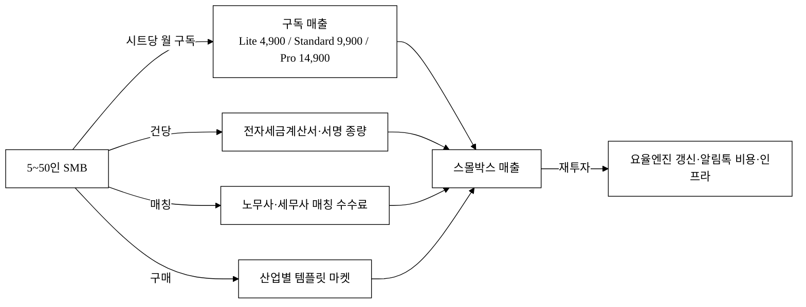

### 6.3 유닛 이코노믹스 (시나리오, 모두 `[추정]`)

> 아래 ARPU·고객수·침투율은 §3 SAM/SOM 가설을 따르며 모두 `[추정]` 이다. 공식값과 혼용하지 않는다.

| 시나리오 | 고객 수 `[추정]` | 사당 평균 시트 | ARPU(사·월) `[추정]` | 연 ARR `[추정]` |
|:---|---:|---:|---:|---:|
| 보수(3년차 침투 0.5%) | 3,000사 | 8 | 79,200원 | 약 28.5억원 |
| 기준(3년차 침투 0.75%) | 4,500사 | 8 | 79,200원 | 약 42.8억원 |
| 확장(3년차 침투 1.0%) | 6,000사 | 10 | 99,000원 | 약 71.3억원 |

- ARPU 산식: Standard 9,900원 × 평균 시트 수. 기준 시나리오는 8시트 가정 → 사당 월 79,200원.
- 기준 시나리오 ARR ≈ 4,500사 × 79,200원 × 12 ≈ **42.8억원** (§3 SOM 약 42.8억 ARR과 동일 모수·정합).[^9][^10]
- 수익성 벤치마크: 시프티는 매출 66억에 영업이익 50억(영업이익률 약 76%)의 고마진 구조를 입증했다.[^10] **단, 이는 성숙기·단일영역·규모달성 흑자기업의 숫자**이며, 본 사업의 초기 적자구간(J커브)·4모듈 동시개발·제도엔진 유지비·알림톡 변동비 부담은 다르다. 시프티 76%는 "성숙 후 SaaS 마진 잠재력"의 벤치마크일 뿐 자사 초기 마진이 아니다(§6.6 재무 추정 참조).

### 6.4 시트당 단위경제(COGS) · LTV/CAC · 회수기간

> SaaS 투자판단의 핵심은 ARR 총량이 아니라 "고객 1곳을 얼마에 잡아 얼마를 회수하는가"다. 아래 모든 수치는 `[추정]`이며 가정을 표로 명시한다.

**(A) 시트당 기여이익 · 그로스마진** — Standard 9,900원/시트·월 기준

| 항목 | 시트당 월 `[추정]` | 가정 출처 |
|:---|---:|:---|
| 매출(ARPU) | 9,900원 | 자사 가격표(§6.1) |
| (−) 알림톡 종량 원가 | −300원 | 카카오 비즈메시지 단가 × 월 발송량 가정 `[추정]` |
| (−) 인프라(클라우드·스토리지) | −500원 | 멀티테넌트 분산 단가 `[추정]` |
| (−) 결제 수수료(PG) | −300원 | 결제액의 약 3% |
| (−) 고객지원(CS) 배분 | −800원 | 인건비 시트 배분 `[추정]` |
| **= 시트당 기여이익** | **약 8,000원** | |
| **그로스마진** | **약 80%** `[추정]` | COGS(알림톡+인프라+PG) 기준. CS 포함 시 약 70% |

> 알림톡 "무제한" 정의: Standard의 알림톡은 **공정사용 한도(시트당 월 N건)** 내 무제한이며, 초과분은 종량 청구한다(§6.1·§9 명시). "광고가 외 숨은 종량"이 아니라 한도 초과 시에만 발생함을 투명 표기한다.

**(B) 채널별 CAC · 기여이익**

| 채널 | 리드단가 `[추정]` | 전환율 `[추정]` | 실효 CAC `[추정]` | 파트너 수수료 | 잔여 그로스마진 |
|:---|---:|---:|---:|:---:|:---:|
| 직접광고(카톡채널) | 높음 | 1~2% | 약 30~50만원/사 | 없음 | 80% |
| 노무사·세무사 추천 | 낮음 | 5~10% | 약 10~20만원/사 | 레브쉐어(LTV의 약 10~15%) | 약 65~70% |
| 디지털전환 바우처 유입 | 매우 낮음(도입비 보조) | — | 약 5~15만원/사(영업·온보딩 잔존) | 없음 | 80% |

> **바우처는 CAC 0이 아니다.** 바우처는 고객측 도입 비용을 낮출 뿐, 영업·온보딩 인건비 CAC는 잔존한다(과장 정정). 노무사 채널은 CAC가 낮지만 레브쉐어가 LTV에서 차감되는 구조를 명시한다.

**(C) LTV · LTV/CAC · 회수기간** — 산식: `LTV = ARPU(사·월) × 그로스마진 ÷ 월 churn`

| 시나리오 | 월 churn `[추정]` | ARPU(사·월) | 그로스마진 | LTV `[추정]` | 평균 CAC `[추정]` | LTV/CAC | CAC 회수 `[추정]` |
|:---|---:|---:|:---:|---:|---:|:---:|:---:|
| 보수 | 5% | 79,200원 | 70% | 약 111만원 | 30만원 | **3.7** | 약 5.4개월 |
| 기준 | 3% | 79,200원 | 75% | 약 198만원 | 25만원 | **7.9** | 약 4.2개월 |
| 확장 | 2% | 79,200원 | 80% | 약 317만원 | 20만원 | **15.8** | 약 3.2개월 |

> **가드레일**: LTV/CAC ≥ 3, CAC 회수 ≤ 12개월. 보수 시나리오(월 churn 5%·SMB 고폐업 반영)에서도 가드레일을 충족한다. **민감도 경고** — SMB는 폐업률이 높아 월 churn이 핵심 변수다. 월 churn이 5%를 넘으면(연 46%+) LTV가 급격히 무너지므로, churn 억제(§5.3 전환비용 2층)가 유닛이코노믹스의 생명선이다. churn·그로스마진 가정은 모두 `[추정]`.

### 6.5 SOM 도달 퍼널 — *4,500사가 어떻게 쌓이는가*

> SOM 42.8억 ARR(4,500사)을 "침투율 0.75%" 단일 가정이 아니라 **획득 퍼널의 결과물**로 역산한다. 4,500사는 churn 후 **연말 잔존 누적 활성 고객** 정의다(누적 획득이 아님).

| 단계 | Y1 `[추정]` | Y2 `[추정]` | Y3 `[추정]` |
|:---|---:|---:|---:|
| 리드 수(노무사·바우처·광고) | 8,000 | 25,000 | 60,000 |
| → 트라이얼 전환율 | 15% | 18% | 20% |
| → 트라이얼 수 | 1,200 | 4,500 | 12,000 |
| → 유료 전환율 | 25% | 30% | 33% |
| → 신규 유료 | 300 | 1,350 | 3,960 |
| (−) 연간 이탈(churn 30% 가정) | −0 | −180 | −1,050 |
| **= 연말 누적 활성 고객** | **300** | **1,470** | **4,380≈4,500** |

> **핵심 입력값 = 노무사·세무사 파트너 수 × 파트너당 추천 전환.** 위 리드의 대부분은 노무사·세무사 채널에서 나온다. 따라서 **(파트너 수, 파트너당 추천 SMB 수)**가 SOM을 결정하는 1순위 KPI이며, 파일럿에서 가장 먼저 측정한다(§7·§14 KPI 연계). "시프티·플렉스 ARR 절대값" 벤치마크는 생존편향이므로 전환율 정당화 근거로 쓰지 않고, 본 퍼널의 전환율 가정을 파일럿 실측으로 대체한다.

### 6.6 재무 3개년 추정 (P&L · 번레이트 · 런웨이 · BEP)

> 모든 수치 `[추정]`. 인건비는 채용계획(§11)의 인원 × 시장가 단가, 매출은 §6.5 퍼널·ARPU 기준. 단위: 억원.

| 항목 | Y1 `[추정]` | Y2 `[추정]` | Y3 `[추정]` |
|:---|---:|---:|---:|
| 연말 유료고객 수 | 300 | 1,470 | 4,500 |
| ARR(매출) | 약 2.9 | 약 14.0 | 약 42.8 |
| 그로스마진(75%) | 약 2.2 | 약 10.5 | 약 32.1 |
| (−) S&M(마케팅·채널·세일즈) | 4.0 | 8.0 | 13.0 |
| (−) R&D(개발·제도엔진) | 6.0 | 9.0 | 12.0 |
| (−) G&A(일반관리·인증) | 2.0 | 3.0 | 4.0 |
| **영업손익** | **약 −9.8** | **약 −9.5** | **약 +3.1** |
| 월 번레이트(burn) | 약 0.82 | 약 0.79 | 흑자전환 |
| 누적 적자 최저점 | 약 −9.8 | 약 −19.3 | BEP 도달(Y3 중반 `[추정]`) |

> **자금 라운드 설계.** "Seed 라운드 **15억 조달 → 약 18개월 런웨이 → Y1말 유료 300사·ARR 2.9억·CAC 회수 검증 마일스톤 달성 → Series A**" → "Series A **30~50억 조달 → Y3 BEP 도달·ARR 42.8억**". 인건비 단가는 채용시장가(시니어 개발 연 7~9천만원, CS·세일즈 연 4~5천만원 `[추정]`) 기준이며 §11 채용계획과 1:1 정합한다. 시프티 76% 마진(§6.3)은 성숙기 벤치마크일 뿐, **Y1~Y2 깊은 적자구간(J커브)**이 본 사업의 실제 초기 재무다.

**[그림 5-b] 재무 성장 곡선 (ARR vs 영업손익, 억원)**

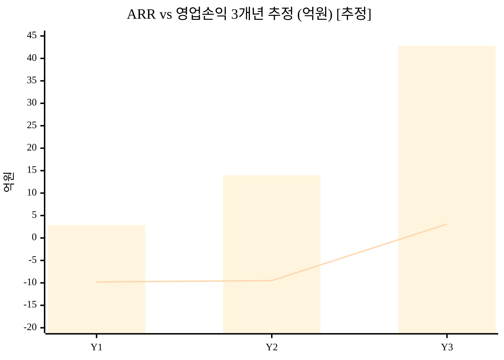

> 막대 = ARR, 선 = 영업손익. Y1~Y2 적자구간(J커브)을 거쳐 Y3 흑자전환(BEP)에 도달하는 전형적 SaaS 곡선. 모두 `[추정]`.

### 6.7 Exit / 회수 시나리오

> VC 회수 경로가 없으면 투자가 성립하지 않는다. 비교가능 거래 배수로 Exit 밸류 밴드를 산출한다. 모든 배수·밸류 `[추정]`.

**(A) Exit 경로**

| 경로 | 인수 후보 / 트랙 | 인수 동기 |
|:---|:---|:---|
| 전략적 M&A | 더존비즈온·네이버(웍스)·카카오(워크)·NHN·뱅크샐러드·자비스 | SMB 백오피스 고객기반·단일 데이터 자산·노무사 네트워크 확보 |
| 동종 통합 | 플렉스(SMB 하향 보강)·시프티(통합 확장) | 자체 개발 대비 시간 단축(make vs buy) |
| IPO | 코스닥 SaaS 트랙 | 모두싸인 2028 IPO 목표[^8]·SaaS 상장 흐름 |

**(B) 비교가능 배수 기반 Exit 밸류 밴드** — 인용: 플렉스 기업가치 5,000억 / ARR 300억 ≈ **약 16배 ARR**[^9]

| 가정 | Y3 ARR `[추정]` | 적용 ARR 배수 `[추정]` | 잠재 Exit 밸류 `[추정]` |
|:---|---:|:---:|---:|
| 보수 | 42.8억 | 5배 | 약 214억 |
| 기준 | 42.8억 | 8배 | 약 342억 |
| 공격(플렉스 케이스) | 70억(확장) | 12~16배 | 약 840~1,120억 |

**(C) 후속 라운드 로드맵**

| 단계 | 조달 목표 `[추정]` | 밸류(pre) `[추정]` | 마일스톤 |
|:---|:---|:---|:---|
| Pre-seed | 3~5억 | — | PoC + 파일럿 30사 + 수요검증 |
| Seed | 15억 | 50~80억 | Y1말 유료 300사·ARR 2.9억·CAC 회수 검증 |
| Series A | 30~50억 | 200~400억 | Y3 BEP·ARR 42.8억·NRR 100%+ |

> 모든 밸류·배수는 `[추정]`이며, 인용 배수는 플렉스(16배 ARR)[^9]·모두싸인(IPO 목표)[^8] 케이스에 연결한다. 실제 밸류는 라운드 시점 시장·트랙션에 따라 변동한다.

---

## 7. Go-to-Market 전략

| 단계 | 채널 | 핵심 활동 | KPI |
|:---|:---|:---|:---|
| Pre-seed | 소상공인진흥공단·중기부 PoC | 30개 무상 파일럿 → 사례 발표 | 전환율·시간절감 측정 |
| Seed | 노무사·세무사 채널 파트너 | 기장 수수료 일부 분담 모델 | 파트너당 추천 고객 수 |
| Series A | 카카오톡 채널 광고·SBA·중기부 디지털 전환 바우처 | 바우처로 진입 비용 0화 | CAC 회수 기간 |

**전략 핵심**: SMB는 직접 광고로 도달하기 비싸다(CAC↑). 대신 **이미 SMB와 신뢰 관계가 있는 노무사·세무사를 채널 파트너로** 삼아 추천 기반으로 진입한다(이펙츄에이션의 "수중의 새" — 이미 가진 관계망 활용). 정부 디지털 전환 바우처[^4] 를 결합하면 SMB의 초기 도입 비용을 낮출 수 있다(단, 영업·온보딩 CAC는 잔존 — §6.4(B)).

> **첫 100·첫 1,000 확보 경로**: 첫 100사는 **Pre-seed 무상 파일럿 30사 → 가산세 회피·시간절감 사례(§5.4 must 동인) 발표 → 노무사 채널 추천으로 첫 유료 100사 전환**으로 쌓는다. 이후 첫 1,000사는 파트너당 추천 고객 + 디지털 전환 바우처 결합으로 확장한다(전환율·CAC는 §17 파일럿 실측 `[추정]`).

### 7.1 채널 인센티브 · 이해상충 해소

노무사·세무사는 "SMB의 백오피스 자동화가 자기 기장 수수료를 줄인다"는 이해상충 우려가 있다. 따라서 win-win 구조를 설계한다.

| 항목 | 설계 |
|:---|:---|
| 수익배분 | 추천 고객 구독료의 레브쉐어(LTV의 약 10~15% `[추정]`), 정산 월 단위 |
| 파트너 가치 | 자동화로 기장 효율 향상(반복 입력 감소) → 노무사가 더 많은 고객을 처리 가능(수수료 감소가 아니라 처리량 증가) |
| 파트너 포털 | 추천 현황·정산·고객 관리 대시보드 제공 |
| 채널 독점성 한계 인정 | 노무사망은 경쟁사도 접근 가능한 **비독점 채널**. 따라서 양면 네트워크 록인(§5.3 3층)으로 전환 — 파트너가 많을수록 SMB가 모이고 역도 성립 |

### 7.2 온보딩 · 고객지원 체계

SMB는 IT 담당이 없어 셋업·문제 발생 시 사람의 도움이 절실하다.

| 항목 | 제공 |
|:---|:---|
| 표준 온보딩 플로우 | 가입 → 데이터 이관(§2.4) → 첫 계약 발송까지 가이드 마법사 |
| 지원 채널 | 카톡 상담·전화, 응답 SLA(영업일 N시간 내 `[추정]`) |
| 교육 자료 | 영상·FAQ·템플릿 라이브러리 |
| 셋업 소요시간 | 평균 ≤ 30분 목표(§2.4, 파일럿 실측 KPI) |

### 7.3 ROI 워크시트 (세그먼트별)

비용 절감 논리는 "이미 분리 도구 5개를 결제 중인 SMB"에만 성립하고, 실제 타깃 다수인 "엑셀 비소비자"에게는 순증 지출이다. 두 세그먼트를 분리해 ROI를 제시한다.

| 세그먼트 | ROI 근거 | 산식 `[추정]` | 손익분기 |
|:---|:---|:---|:---|
| (A) 분리도구 사용중 | 구독료 절감 | 분리 도구 합산(월 수십만원, §1.3 공개단가) − 9,900원×8시트(79,200원) = 절감액(공개단가 계산, 추정 아님) | 즉시(첫 달부터 절감) |
| (B) 엑셀 비소비자 | 시간 절감 | 입사처리 1건당 절감 분 + 월 급여마감 절감 시간 × 사장 시급. 예: 월 백오피스 N시간 절감 × 사장 시급 = 절감액 `[추정]` | 절감시간 가치 > 79,200원 도달 시점(파일럿 실측) |

> 세그먼트 (B)는 "절감"이 아니라 "시간을 돈으로 회수"하는 논리이므로, 시간절감 실측치가 ROI의 핵심이다(§14 KPI에 측정 등록).

---

## 8. 로드맵

> 단계 정량 합격선·사업 KPI는 §14에, 외부 의존성 리드타임·임계경로는 아래 [그림 6-b]에 분리한다. 단계 명칭·월 구간은 §11과 단일 마일스톤으로 통일한다.

| 단계 | 시점 | 대표 산출물 | 외부 언어 산출 수준 |
|:---|:---|:---|:---|
| MVP | M1~3 | 멀티테넌트 백엔드 + 직원 마스터 스키마 + jsPDF 계약 워크플로 + 직원 CRUD | 핵심 워크플로 동작 PoC |
| Beta | M4~6 | 한글 PDF 폰트 임베드 + QR 검증 + ICS 캘린더 + 다중 회사 + 알림톡 실 발송 | 파일럿 투입 가능 베타 |
| 상용/심화 | M7~12 | 노무사 자문 챗 + 전자세금계산서 연계 + 모바일 앱 + 다국어 | Series A 데모 가능 수준 |

> v1을 "SPA+jsPDF"가 아니라 **"멀티테넌트 백엔드 + 직원 마스터 스키마"**로 재정의한다(§10 아키텍처). 단일 데이터 허브는 본질적으로 서버·DB 문제이므로 클라이언트 기술만으로 핵심 가치명제를 충족할 수 없다. 'N천만원 PoC' 같은 내부 가치환산 표현은 외부 제출 제안서에서 제거하고 "동작 PoC / 베타 / Series A 데모 가능 수준"으로 환언한다.

**[그림 6] 가치 누적 로드맵**

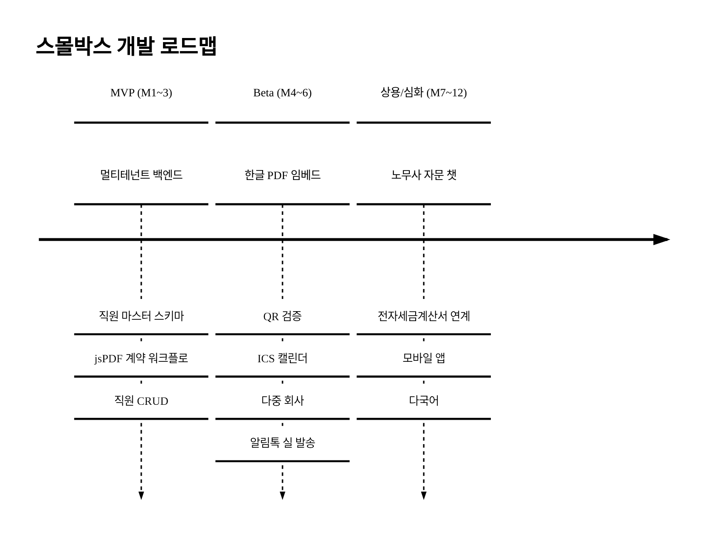

**[그림 6-b] 외부 의존성 리드타임 · 임계경로**

> v3 과적(전자세금계산서 API + 모바일앱 + 다국어 동시)을 분산하고, 외부 승인·심사 리드타임을 명시한다. 임계경로(굵은 흐름)에 ISMS-P를 추가한다.

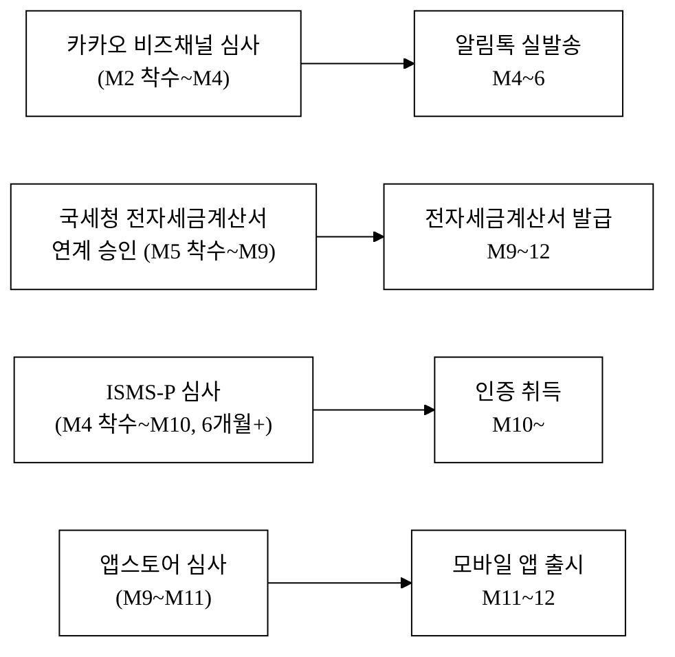

> **과적 분산**: 다국어(한·영)는 협약기간 외(M12+)로 분리, 전자세금계산서·모바일앱·ISMS-P는 외부 리드타임을 감안해 착수를 앞당긴다(M4~M9 착수). ISMS-P는 통상 6개월+ 소요되므로 M4 착수가 임계경로다.

---

## 9. 리스크 · 완화

> 발생가능성(가능성) × 영향으로 등급화. 제품·경쟁 리스크에 더해 기술·재무·정책 리스크를 정면 등재한다.

| 분류 | 리스크 | 가능성×영향 | 대응(정량) | 잔여 리스크 |
|:---|:---|:---:|:---|:---|
| 제품/법 | 노무·세무 자문 책임 | 중×고 | 외부 노무사 검토 의무·면책 조항·플랫폼 한정 | 일부 |
| **기술** | 급여 자동계산 오류 배상책임 | 중×고 | 계산근거 로깅·정답셋 회귀테스트(일치율 100% 목표)·노무사 최종확인 게이트·배상책임 보험(면책한도 명시) | 잔여 소 |
| **기술** | 알림톡 단일벤더 종속(정책변경·차단·단가인상) | 중×고 | 이메일·SMS·RCS 폴백 채널 설계(차별점을 "채널"이 아니라 "단일데이터 결합 워크플로"로 재정의) | 중 |
| **기술** | 멀티테넌트 데이터 누수(타사 직원정보 조회) | 저×극고 | RLS(행수준보안)·격리 테스트·모의침투(펜테스트) 정기, 사고 시 사업종료급 인지하 최우선 관리 | 저 |
| **기술** | 데이터 마이그레이션 실패(온보딩 붕괴) | 중×중 | import 마법사·검증 단계·무료 이관 지원(§2.4) | 저 |
| 운영 | 카카오 알림톡 비즈메시지 비용 | 중×중 | 종량 분리·기업당 월 한도(§6.4 COGS 반영) | 저 |
| 운영 | 4대보험 요율 변경 누락 | 중×고 | 요율엔진 분기 자동갱신 + 변경 전후 회귀테스트. 2026 요율 공단 고시 원문 `[재확인 필요]`[^13] | 저 |
| 운영 | 가용성 장애(급여 마감 불가) | 저×고 | 이중화·백업(RPO/RTO 목표 §10), SLA 99.9% 목표·장애 시 대체수단 안내 | 저 |
| **재무** | 자금소진(런웨이)·후속투자 실패 | 중×극고 | 보수 시나리오(§6.6) 운영·BEP 앞당김·Seed 15억 18개월 런웨이 확보 | 중 |
| **채널** | 노무사·세무사 파트너 미확보·이해상충 | 중×고 | 직판(바우처·마켓플레이스 입점) 백업, 파트너 win-win 인센티브(§7.1) | 중 |
| **정책** | 협약 KPI 미달·환수 | 저×고 | 보수 KPI(§14) 운영·분기 점검으로 조기 대응 | 저 |
| 경쟁 | 경쟁사 SMB 하향 진입·제휴연합(§4.1·[그림 4-c]) | 중×고 | 18개월 선점 + 데이터·전환비용 락인(§5.3), 제휴연합엔 "단일 데이터 허브" UX 차별로 방어 | 중 |

---

## 10. 기술 아키텍처 · 보안 · 컴플라이언스 · 지식재산

> 급여·4대보험·주민번호급 민감정보·전자계약을 다루는 백오피스 SaaS이므로, 기술 실체·규제 적격성·IP 전략을 명시한다.

### 10.1 시스템 아키텍처 (멀티테넌트 설계)

**테넌트 격리 모델 선택**: **shared-schema + Row-Level Security(RLS)** 를 채택한다.

| 후보 | 보안 격리 | 비용 | 운영 | 선택 |
|:---|:---:|:---:|:---:|:---:|
| DB-per-tenant | 강 | 높음 | 복잡 | — |
| schema-per-tenant | 중 | 중 | 중 | — |
| **shared-schema + RLS** | 중(RLS 강제) | 낮음 | 단순 | **채택** |

> 선택 근거: 5~50인 SMB 다수 테넌트(수천 사) 환경에서 DB-per-tenant는 운영·비용 비현실적. RLS로 `tenant_id` 강제 격리하되, 누수 사고가 사업종료급(§9)이므로 격리 테스트·펜테스트를 의무화한다.

| 계층 | 스택(예시 `[추정]`) |
|:---|:---|
| 프론트 | Next.js(React) / TypeScript |
| 백엔드 | Node.js(ESM) API + RBAC 인가 |
| DB | PostgreSQL(RLS) + 민감정보 컬럼 암호화 |
| 큐 | 급여 배치·알림톡 대량발송 비동기 잡 큐 |
| 인프라 | 국내 리전 클라우드(데이터 국외이전 없음) + CDN |

- **인증·인가**: 테넌트별 RBAC. **노무사 등 외부 협업자는 별도 제한 권한**(해당 고객사 데이터만, 읽기/감수 범위)으로 분리. 시제품·데모 단계는 기본 데모 계정 자동통과(인증을 본질 기능이 아닐 때 시연 사이클 단축), 정식 인증은 단계적.
- **비동기 잡**: 급여 일괄 계산·알림톡 대량 발송은 큐로 분리해 API 응답성과 분리.

**[그림 7] 멀티테넌트 인프라·데이터 아키텍처**

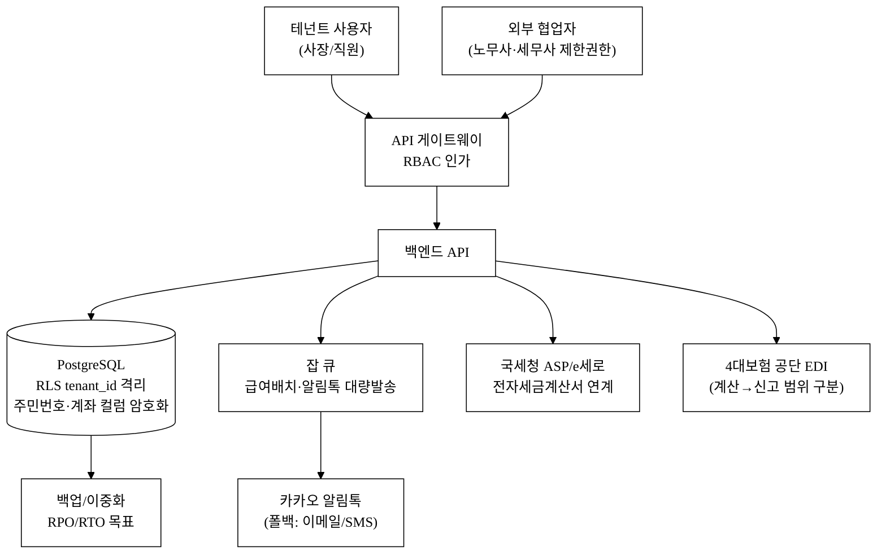

**[그림 7-b] 단일 직원 마스터 논리 데이터 모델(개념 ER)**

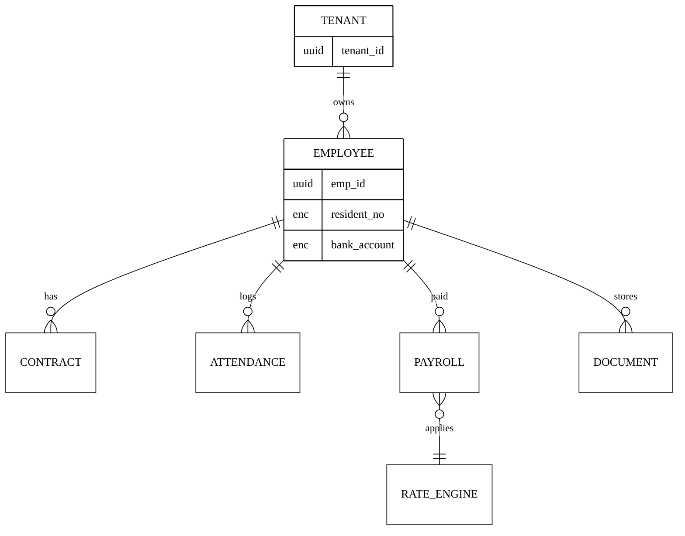

> 4모듈(CONTRACT·ATTENDANCE·PAYROLL·DOCUMENT)이 **단일 EMPLOYEE 마스터**를 공유하는 것이 카피 난이도의 핵심(§5.3 1층). 주민번호·계좌는 암호화 컬럼(`enc`).

### 10.2 개인정보보호 · 보안 컴플라이언스

본 제품은 **주민등록번호(4대보험·원천징수)·계좌번호·급여명세·근로계약서**를 다루는 고민감 개인정보 처리자다.

| 영역 | 의무·설계 |
|:---|:---|
| 고유식별정보(주민번호) | 개인정보보호법상 **암호화 의무** — 저장·전송 암호화, 컬럼 단위 KMS 키 관리 |
| 민감정보 카탈로그 | 주민번호·계좌·급여·근로계약을 식별·분류해 처리 근거(4대보험 신고는 법령상 의무) 명시 |
| 접근통제·접속기록 | RBAC + 접속기록 **2년 보관**·이상행위 탐지 |
| 처리위탁·국외이전 | 클라우드 처리위탁 고지, **데이터 국내 리전(국외이전 없음)** |
| 정보주체 권리 | 근로자 열람·정정·동의 절차, 파기 절차 |
| ISMS-P | 인증 범위(개인정보 포함 P)·취득 목표 시점 M10~·비용 예산 반영(§13)·침해사고 대응 절차 |

### 10.3 규제 적격성 · 전자서명 법적효력

| 도메인 | 연계 경로 | "계산" vs "신고/발급" 범위 |
|:---|:---|:---|
| 전자세금계산서 | 국세청 ASP/e세로 연계·공동인증서 관리 | v1은 **보관·관리**, 발급 연계는 M9~(국세청 승인 리드타임) |
| 4대보험 | 4대사회보험정보연계센터/공단 EDI API | v1은 **자동 계산**, **신고 연계는 후속**(범위 명확화) |
| 전자서명/전자계약 | — | 아래 보완책 |

> **전자서명 법적효력 — jsPDF 자체생성의 한계 인정 및 보완.** 모두싸인이 71% 점유하는 이유가 바로 법적 신뢰성(작성자 확인·위변조 방지·타임스탬프)이다. jsPDF 자체 PDF만으로는 전자문서법·전자서명법상 효력 요건(작성자 인증·타임스탬프·장기검증 LTV·해시체인)을 충분히 보장하지 못함을 인정한다. 보완책: **공인 타임스탬프(TSA) 연계 + 해시체인 무결성 + KISA 인정 전자서명/또는 모두싸인류 API 연동**을 단계적으로 적용해 법적 효력을 확보한다. 즉 자체 생성은 "초기 PoC"이고, 법적효력은 외부 인증·타임스탬프로 보강한다.

### 10.4 지식재산(IP) · 데이터 자산 해자

| 자산 | 보호 전략 |
|:---|:---|
| 상표 | 'SmallBox(스몰박스)' 상표 출원(국내) |
| BM/기술 특허 후보 | (a) 단일 직원 마스터 기반 크로스모듈 워크플로 자동화, (b) 요율 변경 시 영향 자동 재계산 엔진 — 출원 검토 |
| 영업비밀 | 요율 룰엔진·노동법 계약 템플릿 코퍼스를 영업비밀·DB권으로 관리 |
| 독점 데이터(플라이휠) | 업종별 급여 벤치마크·계약 분쟁 패턴 누적 → 벤치마킹 리포트·이상탐지로 환류(§5.3 3층). 모방 비용을 "시간"이 아니라 "누적 데이터"로 전환 |

> 제도 자동화를 해자로 주장하면서 그 엔진을 IP(영업비밀)로 보호하지 않으면 자기모순이므로, 요율엔진·템플릿 코퍼스를 명시적으로 영업비밀화한다.

### 10.5 기술 KPI · SLA

> 급여·세금은 1원만 틀려도 가산세이므로 정확도 목표가 필수다.

| 지표 | 목표 `[추정]` |
|:---|:---|
| 가용성 SLA | 99.9% |
| 급여·4대보험 계산 정확도 | 정답셋(국세청 간이세액표·공단 모의계산기) 대비 **일치율 100% / 오차 0원** + 회귀테스트 상시 |
| API p95 응답시간 | ≤ 500ms |
| 알림톡 발송 성공률 | ≥ 99% |
| 데이터 백업 RPO/RTO | RPO ≤ 1시간 / RTO ≤ 4시간 |
| 보안 | 취약점 스캔 상시 + 모의침투(펜테스트) 반기 1회, 치명 취약점 0건 |

---

## 11. 추진체계 · 조직 R&R · 인력 계획

> 팀 실명·실값은 §12(팀)에서 사용자가 채운다. 본 절은 **역할 골격·확보 방식·인력 규모**만 명시(실명 공란).

### 11.1 추진체계도

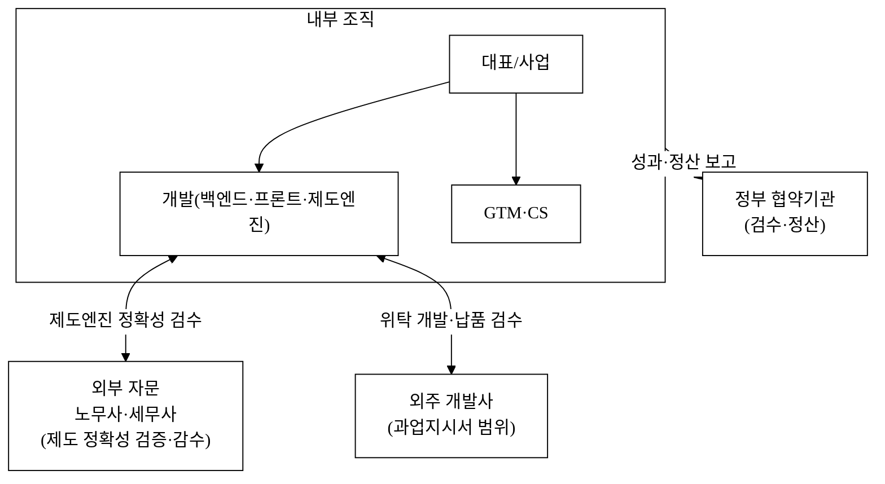

> **제도 자동화 정확성 검증 책임 주체**: 4대보험·전자세금계산서 자동계산의 정확성은 **노무사·세무사 자문(외부) + 자체 회귀테스트(내부)** 가 공동 검증하며, 요율 변경 시마다(분기) 검수한다. 자체 개발 vs 외주 분담 경계는 [`2_개발계획서.md`](./2_개발계획서.md) WBS와 [`3_과업지시서_v1.md`](./3_과업지시서_v1.md) §1 범위로 확정한다(자문 R&R 골격만, 실명은 사용자 영역).

### 11.2 인력 · 채용 계획 (고용창출)

> 직군·인원·고용형태 골격(실명 공란). 인원수는 §13 인건비 비목·§6.6 재무와 1:1 정합.

| 직군 | Y1(Seed) `[추정]` | Y2 `[추정]` | Y3(Series A) `[추정]` | 고용형태 | 단가 가정(연, `[추정]`) |
|:---|---:|---:|---:|:---|:---|
| 백엔드·프론트 개발 | 3 | 5 | 8 | 정규 | 7~9천만원 |
| 제도엔진(급여·요율) 개발 | 1 | 2 | 3 | 정규 | 7~9천만원 |
| CS·온보딩 | 1 | 2 | 4 | 정규/계약 | 4~5천만원 |
| 채널영업·마케팅 | 1 | 2 | 3 | 정규 | 4~6천만원 |
| 노무·세무 도메인 자문 | 외부 자문 | 외부 자문 | 1(내부화) | 자문/정규 | 고정 자문료 or 매칭 레브쉐어 |
| **신규 직접고용 누계** | **6명** | **+7명(누계 13)** | **+9명(누계 22)** | | |

> 청년·여성 고용 등 공고 가점 요소가 있으면 연계(공고 확정 후 `<TODO: 사용자 입력>`). 노무·세무 자문은 고정 자문료 또는 매칭 레브쉐어로 마진 계산(§6.4)에 반영한다.

---

## 12. 팀 (Team)

<TODO: 사용자 입력>

| 역할 | 이름 | 소속·직함 | 담당 R&R |
|:---|:---|:---|:---|
| 대표 | <TODO: 사용자 입력> | <TODO: 사용자 입력> | <TODO: 사용자 입력> |
| 개발 총괄 | <TODO: 사용자 입력> | <TODO: 사용자 입력> | <TODO: 사용자 입력> |
| 사업·GTM | <TODO: 사용자 입력> | <TODO: 사용자 입력> | <TODO: 사용자 입력> |
| 자문(노무·세무) | <TODO: 사용자 입력> | <TODO: 사용자 입력> | <TODO: 사용자 입력> |

---

## 13. 사업비 집행계획 (예산)

> 정부 지원사업 심사의 핵심 배점 항목. 총사업비를 정부지원금/자기부담으로 구분하고 비목별·분기별로 배분한다. 외주용역비는 [`3_과업지시서_v1.md`](./3_과업지시서_v1.md) 용역 범위와, 인건비는 §11.2 채용계획 인원×단가와 정합한다. **총액·비율은 공고 한도 확정 후 조정**(`<TODO: 사용자 입력>`), 아래는 비목 구조·배분 예시 `[추정]`.

### 13.1 재원 구분 · 비목별 배분 (Y1 기준 예시 `[추정]`)

| 비목 | 배분 `[추정]` | 산출 근거 |
|:---|---:|:---|
| 인건비 | 약 55% | §11.2 Y1 6명 × 직군별 단가(개발 7~9천·CS/영업 4~5천만원) |
| 외주용역비 | 약 15% | 과업지시서 위탁 분(전자세금계산서 연계·PDF 엔진 등) |
| 클라우드 인프라비 | 약 8% | 멀티테넌트 서버·DB·스토리지·CDN(§10.1) |
| 카카오 알림톡 발송비 | 약 4% | 비즈메시지 종량(§6.4 COGS) |
| 마케팅·채널파트너 수수료 | 약 10% | 노무사 레브쉐어·바우처 연계(§7.1) |
| 일반관리비(인증 포함) | 약 8% | ISMS-P 취득·법무·회계 |
| **합계** | **100%** | 정부지원금 : 자기부담(현금·현물) = `<TODO: 공고 비율>` |

### 13.2 분기별 집행 스케줄 (Y1 `[추정]`)

| 비목 | Q1 | Q2 | Q3 | Q4 |
|:---|:---:|:---:|:---:|:---:|
| 인건비 | 채용 6명 순차 | 유지 | 유지 | 유지 |
| 외주용역비 | 계약 | PDF·연계 1차 | 전자세금계산서 연계 | 검수·정산 |
| 인프라·알림톡 | 셋업 | 베타 부하 | 파일럿 부하 | 상용 |
| 마케팅·채널 | 파트너 모집 | 파일럿 30사 | 확산 | 확산 |
| 인증(ISMS-P) | 착수(M4) | 심사 | 심사 | 취득(M10) |

---

## 14. 정량 성과지표(KPI) · 마일스톤

> 협약 종료 시점 성공/실패 판정 기준. 행=지표, 열=협약 연차. 모든 목표 `[추정]`, 파일럿 실측으로 갱신. 'N천만원 PoC' 등 내부 가치환산 표현은 제거하고 외부 정량 지표로 환언.

| 지표 | 1년차 목표 `[추정]` | 2년차 `[추정]` | 3년차 `[추정]` | 판정 |
|:---|---:|---:|---:|:---|
| 유료고객 수 | 300사 | 1,470사 | 4,500사 | 정량 |
| MRR / ARR | ARR 약 2.9억 | 약 14.0억 | 약 42.8억 | 정량 |
| 유료 전환율(트라이얼→유료) | 25% | 30% | 33% | 정량 |
| 월 churn | ≤ 5% | ≤ 4% | ≤ 3% | 정량 |
| NRR(순매출유지율) | — | ≥ 95% | ≥ 100% | 정량 |
| 누적 CAC 회수 | 검증 | 회수 | 회수 | 정량 |
| 신규 직접고용 | 6명 | 누계 13명 | 누계 22명 | 정량(§11.2) |
| 파일럿 완료 사 수 | 30사 | — | — | 정량 |
| 노무사·세무사 파트너 수 | N사 `[추정]` | 증대 | 증대 | 정량(SOM 1순위 입력값) |
| ISMS-P 취득 | 착수(M4) | — | 취득 | Y/N |
| 급여계산 정확도 | 일치율 100% | 유지 | 유지 | 정량(§10.5) |

**[그림 8] 마일스톤 타임라인 (단계별 정량 합격선)**

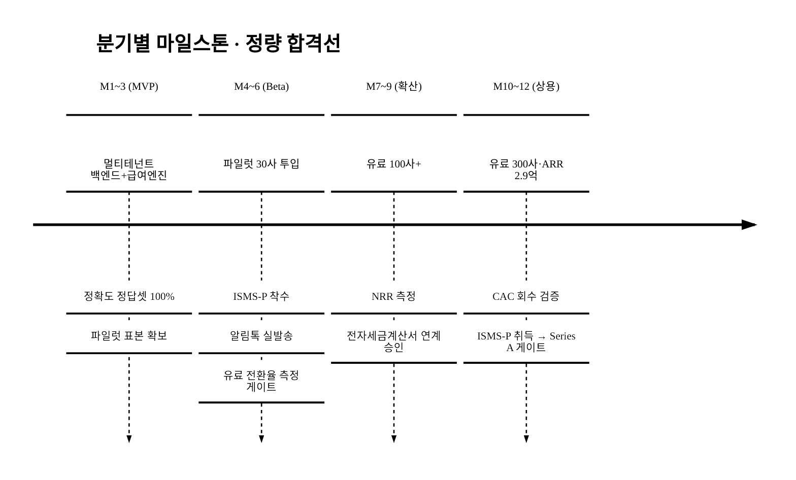

> **Seed→Series A 게이트 조건**: 파일럿 30사(§7·§17)의 유료 전환율·시간절감 정량 결과가 게이트. Y1말 유료 300사·ARR 2.9억·CAC 회수 검증·월 churn ≤ 5% 미달 시 pivot 트리거(가격·채널·세그먼트 재조정).

---

## 15. 추진 계획 (단일 마일스톤 통일)

> §8 로드맵·§14 KPI와 단계 명칭·월 구간을 통일한다.

| 단계 | 산출물 | 시점 | 정량 합격선(§14) |
|:---|:---|:---|:---|
| MVP | 멀티테넌트 백엔드 + 계약 워크플로 + 급여 자동(정확도 100%) | M1~3 | 정답셋 일치율 100% |
| Beta | 한글 PDF + 알림톡 실발송 + 다중 회사 + 파일럿 30사 | M4~6 | 유료 전환율 측정·ISMS-P 착수 |
| 확산 | 유료 100사+·전자세금계산서 연계 | M7~9 | NRR 측정 |
| 상용 | 3티어 출시·유료 300사·ARR 2.9억 | M10~12 | CAC 회수 검증·ISMS-P 취득 |

> 절대 날짜는 공고 일정 확정 후 기입한다(<TODO: 사용자 입력>).

---

## 16. 기대 효과 · 사회적 가치 (정량)

### 16.1 기대 효과 요약

| 구분 | 내용 | 근거 |
|:---|:---|:---|
| 비용 | 분리 도구 합산 대비 구독료 약 1/4~1/5 절감(공개 단가 기반, §4.1·[그림 4-a]) | DocuSign $25·BambooHR $10 등 합산 대비 통합 9,900원[^15][^16] — 공개 단가로 계산 가능(추정 아님) |
| 시장 | 진입 3년 약 42.8억원 ARR 도달 가능 `[추정]` | §3 SOM·§6.6 재무, 시프티·플렉스 궤적 벤치마크[^9][^10] |
| 정책 | SaaS 기업 1만개 육성 목표에 기여 | 정부 2026 목표[^4] |
| 사업 | 사장 인사·노무 처리 시간 절감 `[추정]` | 단일 데이터·통합 워크플로(§4.3·§7.3, 파일럿 실측) |

### 16.2 정량 사회적 가치

| 임팩트 | 산식 `[추정]` | 정책 KPI 연계 |
|:---|:---|:---|
| 고용창출 | 협약기간 직접고용 누계 22명(§11.2) + 노무사 채널 일감 창출(양면시장) | 정부 일자리·SaaS 생태계 |
| 행정시간 절감(거시) | 도입 SMB N사 × 1사당 월 백오피스 절감시간 × 사장 시급 = 사회적 절감액 `[추정]`(파일럿 실측 기반) | 노동생산성 향상 |
| 제도 오류 감소 | 4대보험·전자세금계산서 정확처리로 가산세·노동분쟁 회피 효과 `[추정]` | 사회보험 사각지대 축소·노동권 보호 |
| 표준근로계약 보급 | 노동법 표준 템플릿 확산으로 근로조건 명문화 | 노동권 보호 |
| 정책 부합(바우처) | 디지털전환 바우처 연계 도입 N사로 정부 SaaS 1만개·디지털전환 정책에 정량 기여 | 디지털전환 바우처 집행 |
| 포용 | 비수도권·영세 SMB 도입 비중 목표 `[추정]` | 소상공인 졸업기업 성장 사다리 |

> 사회적 가치 지표는 §14 마일스톤(고용·도입사 수)과 연동해 협약 종료 시 정량 보고한다. 절감액·회피효과는 파일럿 실측 후 갱신(`[추정]`).

---

## 17. 고객 검증 계획 (Customer Discovery)

> 현 시점(2026-06) 1차 고객 검증은 **설계 단계**다. 실제 인터뷰·LOI·실값은 `<TODO: 사용자 입력>`이며 창작하지 않는다. 본 절은 "측정 예정"을 넘어 **검증 프로토콜(표본·질문·성공기준)을 사전 등록**해 가설을 증거 수집 계획으로 격상한다.

### 17.1 검증 설계(사전 등록)

| 항목 | 설계 |
|:---|:---|
| 표본 | 5~50인 SMB 사장 8~12명 심층 인터뷰 + 노무사·세무사 파트너 사전 협의 |
| 질문 | 현재 도구 스택·월 백오피스 지출·연간 소요시간·페인 우선순위·9,900원 WTP 반응 |
| WTP 측정 | 가격민감도 설문(Van Westendorp PSM)으로 수용가격 분포 도출 |
| 성공 기준(게이트) | 파일럿 30사 유료 전환율 ≥ X%·월 백오피스 시간절감 ≥ Y시간(사전 등록) |
| 수요 증거 | LOI/사전예약/웨이팅리스트 수(건수·업종만, 실명 `<TODO: 사용자 입력>`) |

### 17.2 인터뷰 요약 (수집 후 기입 — 실값 공란)

| 항목 | 응답 요약 |
|:---|:---|
| 인터뷰 건수 | <TODO: 사용자 입력> |
| 현 도구 스택·월 지출 | <TODO: 사용자 입력> |
| 9,900원 WTP 반응 | <TODO: 사용자 입력> |
| 사전 관심 LOI/웨이팅리스트 | <TODO: 사용자 입력> |
| 노무사·세무사 사전 협의 현황 | <TODO: 사용자 입력> |

> **핵심 가설 3종**(SMB는 통합가에 전환한다 / 사장 시간이 절약된다 / 알림톡이 더 열린다)은 §4.3·§7.3에서 정의되며, 위 검증 프로토콜로 §14 KPI(전환율·시간절감·응답률)에 정량 목표를 못박는다. 알림톡 응답률 우위는 외부 통계 또는 파일럿 A/B 실측으로 보강하며, 차별점을 "채널 존재"가 아니라 "단일 데이터 결합 자동 발송 워크플로"로 재정의해 모방난이도를 높인다.

> **수요 1차 증거 — 자사 WTP/LOI 수집 전 외부 벤치마크로 간접 정박.** 자사 인터뷰·LOI·WTP 실값은 위 §17.2 `<TODO: 사용자 입력>`이며 창작하지 않는다. 다만 인접 제품의 수요 강도를 외부 벤치마크로 간접 정박한다: 근태 SaaS 시프티의 **재구매율 97.2%**[^10] 는 SMB 백오피스 자동화 수요가 한 번 도입되면 강하게 유지됨을(must형 수요) 시사하고, B2B SaaS 일반에서 **리텐션 5% 향상 → 수익 25~95% 증가**[^20] 라는 벤치마크는 본 제품의 must형 기능(§5.4)이 유지율을 통해 LTV에 크게 기여할 수 있음을 뒷받침한다. 이 외부 수치는 자사 WTP를 대체하지 않으며(파일럿에서 PSM으로 실측), 가설의 방향성만 정박한다.

---

## 참고문헌

> 모든 각주는 [`5_research/README.md`](./5_research/README.md) 에서 2026-06-06 웹 검색으로 검증·정리한 출처와 연결된다.

[^1]: **한국IDC 「국내 SaaS 시장 규모」** (2023-02, ZDNet 보도). 2022년 1조7,843억, 2026년 3조614억, 향후 5년 CAGR 15.5%. https://zdnet.co.kr/view/?no=20230222144336
[^2]: **IITP 「국내 클라우드 산업 매출」** (2025-02, 전자신문/다음 보도). 2024년 클라우드 산업 매출 7조원 돌파, 전년比 +26.6%. https://www.etnews.com/20250205000208
[^3]: **IITP 「2024 클라우드 산업 실태조사」** (2025-02, 2023년 기준). SaaS 공급기업 1,642개(68.7%), 전년比 +318개(+24.0%); IaaS 436·PaaS 157·CMS 94. https://www.iitp.kr/kr/1/knowledge/statisticsView.it?masterCode=publication&searClassCode=K_STAT_01&identifier=02-008-250203-000003
[^4]: **한국클라우드산업협회/정부 「국내 SaaS 기업 수·육성 목표」** (2024-06, 아이티데일리/metroseoul 보도). SaaS 기업 2021년 1,102개→2022년 1,571개; 정부 2026년까지 1만개+ 목표. http://www.itdaily.kr/news/articleView.html?idxno=213764
[^5]: **정부/업계 「글로벌 대비 한국 SaaS 비중」** (2024-06, metroseoul 보도). 글로벌 약 360조원 대비 한국 약 2조원(약 0.5~1%). https://www.metroseoul.co.kr/article/20240626500126
[^6]: **중소벤처기업부 「2022년 기준 중소기업 기본통계」** (2024). 중소기업 804만2,726개(전체 99.9%), 종사자 1,895만6,294명, 매출 3,309조원. https://www.mss.go.kr/site/smba/ex/bbs/View.do?cbIdx=86&bcIdx=1052875&parentSeq=1052875
[^7]: **모두싸인 「전자서명 시장 점유율」** (2025-12, 서울경제 보도). 2025 상반기 국내 전자서명 점유율 71%, 누적 고객 33만 기관, 누적 이용자 1,000만+. https://www.sedaily.com/NewsView/2H1OEPOZTB
[^8]: **THE VC / 서울경제 「모두싸인 매출·투자」** (2026-04 조회 / 2025-12). 매출 2023년 59.2억→2025년 93.1억, 2025E 약 150억; 누적투자 321억, 시리즈C 177억(2024-05). https://thevc.kr/modusign
[^9]: **THE VC / flex 공식 / 와우테일 「플렉스 매출·투자」** (2026-04 조회 / 2025-06). 매출 160.6억(’23)→205.2억(’24)→279.4억(’25), ARR 300억+, 기업가치 5,000억, 누적가입 6만곳+. https://thevc.kr/flex
[^10]: **시프티 공식 / 서울경제 「시프티 실적·가격·투자」** (2024 / 2026-06 조회). 2023년 매출 66억·영업이익 50억(매출 +96%), 사업장 30만+, 재구매율 97.2%, 스탠다드 5,000원/직원·월, 2024-09 스카이레이크PE 투자. https://shiftee.io/ko/pricing
[^11]: **THE VC / thebell / 서울경제 「자비스앤빌런즈 매출·투자」** (2026-01 / 2022). 매출 35억(’20)→300억대 중반(최근), 누적가입 2,450만+, pre-value 3,000억, 1,500억 신규펀딩 추진. https://thevc.kr/jobisnvillains
[^12]: **국민연금공단·건강보험공단·고용노동부 「2024/2025 4대보험 요율」** (2024). 국민연금 9%(노사 4.5%), 건강보험 7.09%(노사 3.545%), 장기요양 건보료의 0.9182%, 고용보험 실업급여 1.8%. https://www.4insure.or.kr/pbiz/ntcn/inscSmlCalcView.do
[^13]: **보건복지부/공단 「2026 4대보험 요율 변경」** (2026, 샤플/위하고 보도 — 공단 고시 원문 재확인 권장). 건강보험 7.09→7.19%, 국민연금 9→9.5%, 장기요양 0.9182→0.9448%. https://www.shoplworks.com/blog-insight/2026-four-major-insurance-rate-changes-company-must-know
[^14]: **국세청 / 부가가치세법 §68 「전자세금계산서 의무발급」** (2024-07). 직전연도 공급가액 8,000만원↑ 개인사업자 의무발급(종전 1억→8천만 확대). https://www.nts.go.kr/nts/cm/cntnts/cntntsView.do?mi=2461&cntntsId=7787
[^15]: **DocuSign 「eSignature Plans & Pricing」** (2025). Standard $25/user·월(연납), Business Pro $40/user·월, Personal $10/월. https://ecom.docusign.com/plans-and-pricing/esignature
[^16]: **BambooHR 「Pricing」** (2026, SSR/Vendr 보도). Core $10/직원·월~, Elite $25/직원·월; 견적형. https://www.selectsoftwarereviews.com/blog/gusto-vs-bamboohr
[^17]: **Gusto 「Pricing」** (2026). 기본 $49/월 + $6/직원·월(Simple); 상위 Plus 플랜. https://gusto.com/product/compare/gusto-vs-bamboohr
[^18]: **과기정통부/IDC/OECD 「국내 클라우드 도입률」** (2024-02, ZDNet 보도). 도입률 24.9%(OECD 38개국 中 32위); SaaS 2조1,360억(2022, 클라우드의 36.6%). https://zdnet.co.kr/view/?no=20240221185123
[^19]: **로뎀세무법인 「직원 채용 시 발생하는 4대보험료 계산」** (2026-06 조회). 4대보험·원천세 계산 오류 시 가산세(과태료)가 발생하므로 세무사 등 전문가 도움을 권고; 4대보험은 사업장·근로자가 분담. https://www.rodemtax.com/archives/2693
[^20]: **인블로그 「2026년 B2B SaaS 벤치마크 지표」** (2026-06 조회). B2B 생존 지표는 NRR·Churn Rate이며, 리텐션 5% 향상 → 수익 25~95% 증가. https://inblog.ai/ko/blog/b2b-saas-benchmark

- 본 제안서의 모든 시장·재무·제도 수치는 [`5_research/README.md`](./5_research/README.md) §5 각주의 1차/공공/언론/VC/벤더 출처에 연결되며, 인용 출처를 100% 표기했다.
- **공식값**: 한국 SaaS 시장(IDC, [^1]), SaaS 공급기업 1,642개(IITP, [^3]), 중소기업 수 804만(중기부, [^6]), 도입률 24.9%([^18]), 경쟁사 실적·가격([^7]~[^11], [^15]~[^17]), 4대보험 요율·전자세금계산서 기준([^12][^14])은 검증된 공식·1차/언론 출처값이다. §5.4 구매동인 논증의 외부 근거로 4대보험 오류→가산세 실무 근거([^19])·B2B SaaS 리텐션 벤치마크([^20])를 추가 인용했다(전자는 실무 안내·후자는 업계 벤치마크 성격으로, 자사 추정과 혼용하지 않음).
- **`[추정]` (가설, 공식값과 혼용 금지)**: TAM 백오피스 비중(20~30%, bottom-up·벤더매출로 교차검증, 분자/분모 정렬 한계 §3.2 명시), SAM 모수(5~50인 60~70만 사, 보수/기준/공격 구간화)·ARPU(자사 단가 9,900원·8시트 기준 약 95만원/사), SOM 침투율(퍼널 결과물 §6.5), **§6.4 유닛이코노믹스(CAC·LTV·LTV/CAC·월 churn·그로스마진), §6.6 재무 3개년(P&L·번레이트·런웨이·BEP), §6.7 Exit 밸류·배수**, §11.2 인건비 단가, §13 예산 배분, §14 KPI, §16.2 사회가치 절감액. 모두 본문에 `[추정]` 병기했다. 환율(약 1,330원/$)·man-month 카피비용(§5.3)도 `[추정]`. 시프티 5,000원은 시장 참조단가, 시프티 76% 마진·플렉스 16배 ARR은 벤치마크로만 사용(자사 초기값 아님).
- **`[재확인 필요]`**: SAM 모수의 5~50인 셀값은 KOSIS 전국사업체조사 규모별 분포로 확정해야 한다(제안서 제출 전 필수). 2026 4대보험 요율([^13])은 공단 고시 원문으로 재확인을 권장한다.
- 침투율·시간절감률·전환율·churn 등 효과 수치는 출처 없는 가설이므로 파일럿·인터뷰(§4.3·§7·§17)에서 실측해 갱신한다. §17 고객 검증은 현 시점 "설계 단계"이며 실값은 창작하지 않고 공란으로 둔다.

<!-- 빈칸 목록
- §0 사업명·주관기관·트랙·일정·팀
- §12 팀 구성 전체(대표·개발총괄·사업/GTM·자문 이름·소속·R&R)
- §13 사업비 총액·정부지원금/자기부담 비율(공고 한도 확정 후)
- §11.2 청년·여성 고용 가점 연계(공고 확정 후)
- §15 일정 절대 날짜
- §17 고객 검증 실값(인터뷰 건수·LOI·WTP·파트너 협의 — 수집 후 기입)
- (제출 전 필수) SAM 모수 KOSIS 규모별 셀값 확정 / 2026 4대보험 요율 공단 고시 원문 확인
-->
