# 개발결과보고서 v1 — SMB 통합 백오피스 SaaS

## 1. 성과품 매핑

| 과업지시서 §5 항목 | 본 v1 산출물 | 충족 |
|---|---|---|
| 전자계약 모듈 | [`projects/smb-backoffice/index.html`](../projects/smb-backoffice/index.html) — 계약 목록·상태·즉시 PDF 다운로드 | ✅ |
| **계약 발행 워크플로 (4단계)** | 템플릿 선택 → 변수 입력 → PDF 미리보기 → 서명·발송 (stepper UI) | ✅ 실 다단계 |
| **표준 계약 템플릿 3종** | 근로계약서·용역계약서·NDA — 각 변수 자동 매핑 | ✅ |
| **실 PDF 생성 (jsPDF)** | iframe 미리보기 + 다운로드 + 서명 이미지 PDF 임베드 | ✅ jsPDF 2.5.1 실 통합 |
| 서명 캔버스 | HTML5 Canvas pointer events → Base64 PNG → PDF 임베드 | ✅ |
| 근태 모듈 | 주간 출퇴근 표 + 시프트 캘린더 | ✅ |
| 급여 모듈 + 4대보험 자동 계산 | 국민연금·건강보험·장기요양·고용보험·소득세 자동 계산(산재는 사업주 전액 부담으로 본인 공제 제외) + **명세서 PDF 즉시 다운로드** | ✅ |
| **직원 CRUD** | 추가/편집/삭제 모달 + localStorage 영속 | ✅ |
| 카카오 알림톡 발송 (mock) | 워크플로/명세서 발송 시 로그에 자동 추가 | ✅ |
| **알림톡 로그 페이지** | 시각·수신·템플릿·결과 표 | ✅ |
| 문서함 | 카테고리 6종 카운트 카드 (계약 종류 자동 집계) | ✅ |
| PDF 템플릿 노무사 검토 (외주) | — | ⏸ 외주 미발주 |

## 2. 구현/제작 범위

- 단일 페이지 SPA (HTML + Tailwind CDN + jsPDF 2.5.1)
- **8개 라우트**: 대시보드 / 전자계약 / 계약 워크플로 / 근태 / 급여 / 직원 관리 / 알림톡 로그 / 문서함
- 4단계 계약 발행 워크플로 (stepper UI, 단계 간 데이터 보존)
- 직원 CRUD + 계약 / 알림톡 영속 (`localStorage[smb_state_v1]`)
- **로그인 없이 게스트 모드** (CLAUDE.md §3.4)

## 3. 환경

| 항목 | 값 |
|---|---|
| OS | macOS (Darwin 24.6.0) |
| 런타임 | Node.js 24.3.0 + Playwright 1.59.x |
| 브라우저 | Chrome for Testing (Chromium 1223, PDF 뷰어 포함) |
| 뷰포트 | 1440×900 (deviceScaleFactor 1) |
| PDF 엔진 | jsPDF 2.5.1 (CDN) |
| 영속 계층 | `localStorage[smb_state_v1]` |

## 4. 실행/구동 방법

```bash
# (1) 앱 단독 구동 — 외부 인프라 없이 file:// 로 동작
open /Users/ywlee/k_startup_spare/2026-saas-smb-backoffice/projects/smb-backoffice/index.html

# (2) 캡처·검증 재현 (Playwright 일시 설치 후 자체 스크립트 실행)
cd /Users/ywlee/k_startup_spare/2026-saas-smb-backoffice/projects/smb-backoffice
npm init -y && npm i playwright@^1.59.1   # Chromium 캐시 존재 시 추가 다운로드 없음
node capture.mjs                           # 14장 캡처 + PDF/서명/CRUD/영속 검증 출력
```

> 캡처 스크립트 `capture.mjs` 검증 로그: PDF datauristring 4259바이트(실 생성), 서명 base64 PNG 저장 확인, 직원 추가 후 reload 영속 확인, page error 0건.

## 5. 화면 캡처

캡처 환경: macOS · Chrome for Testing(Chromium 1223) · 1440×900 · `file://` 로드.

### 5.1 대시보드
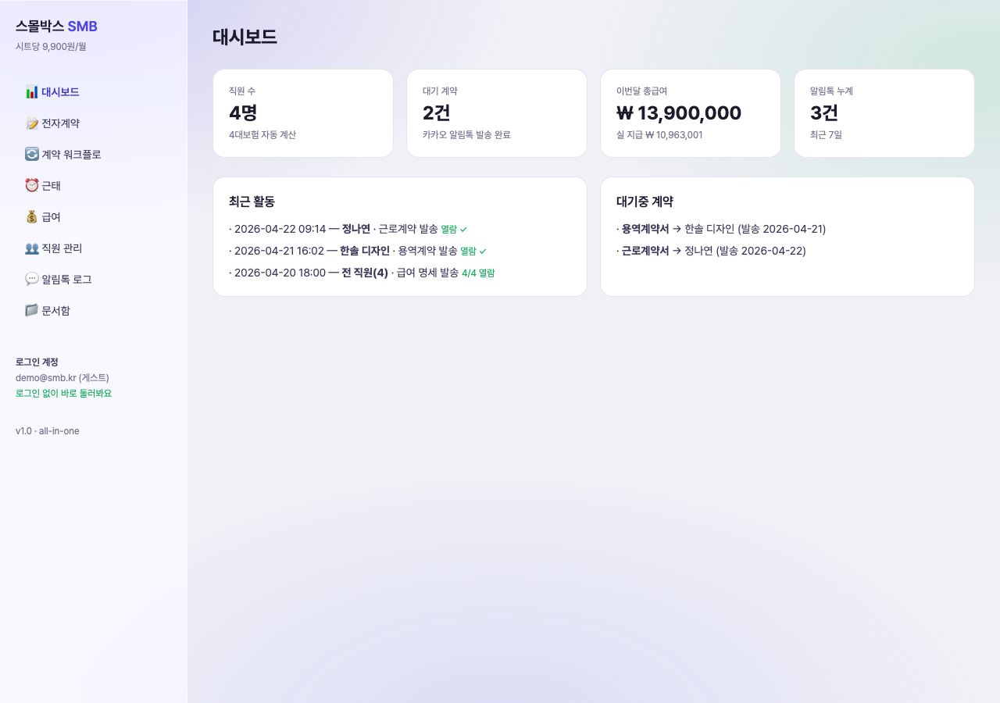
- **무엇을**: 직원 수·대기 계약·이번달 총급여(실지급 동시 표기)·알림톡 누계 KPI 4 + 최근 활동·대기 계약 패널.
- **의도**: SMB 사장이 진입 직후 회사 운영 상태를 한눈에 파악. 실지급액은 4대보험·소득세 자동 공제 후 합계.

### 5.2 전자계약 목록
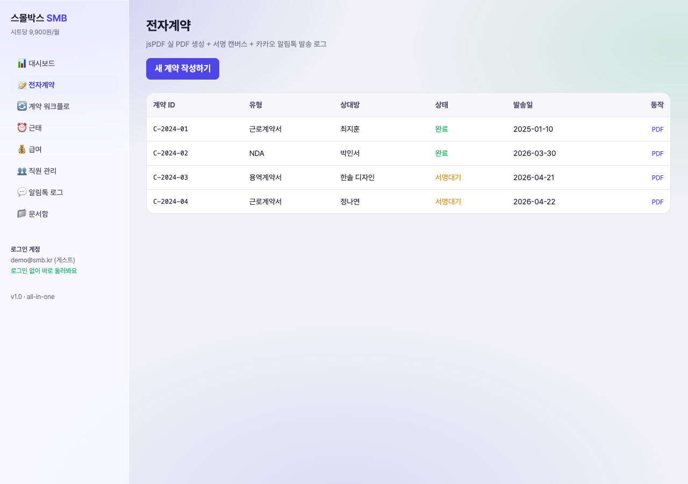
- **무엇을**: 계약 4건의 ID·유형·상대방·상태(서명대기/완료)·발송일 + 행별 즉시 PDF 다운로드 버튼.
- **의도**: 한 화면에서 모든 계약 추적 + 즉시 사본 발급.

### 5.3 계약 워크플로 — Step 1 (템플릿 선택)
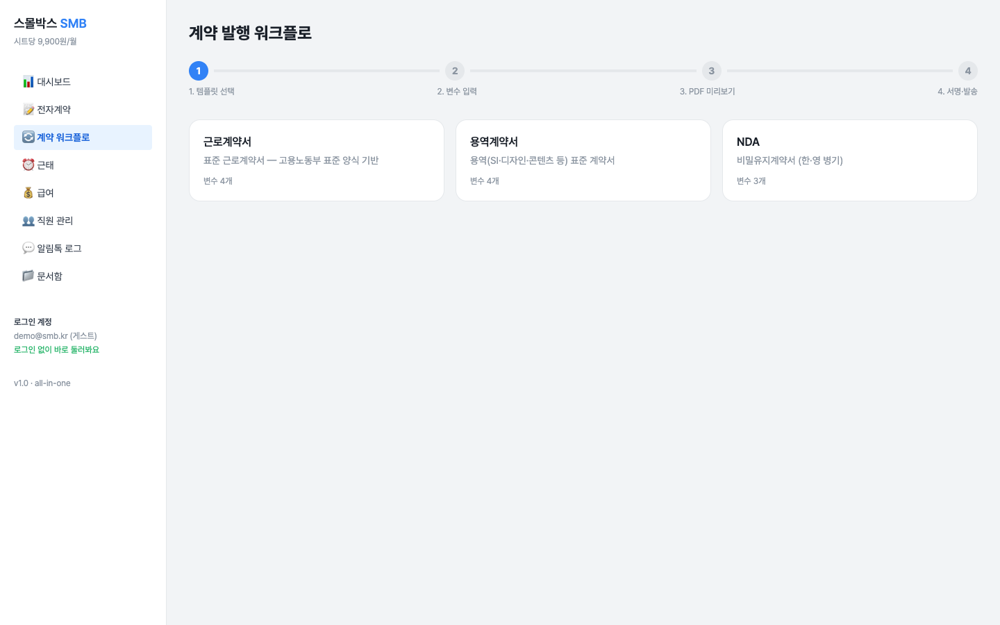
- **무엇을**: 4단계 stepper + 3종 템플릿 카드(근로계약서·용역계약서·NDA).
- **의도**: 사용자가 단계 위치를 항상 인지하면서 진행.

### 5.4 계약 워크플로 — Step 2 (변수 입력)
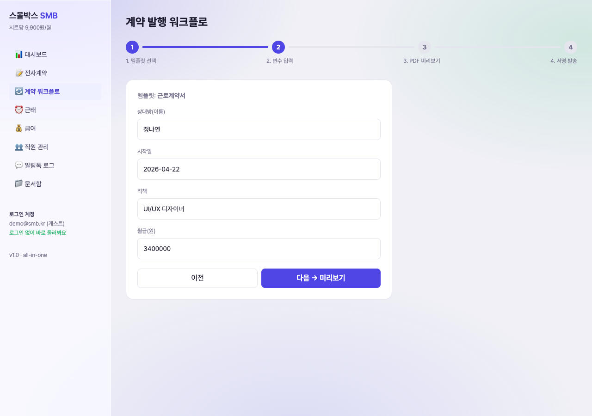
- **무엇을**: 선택된 템플릿(근로계약서)의 4개 필수 변수 폼 — 상대방·시작일·직책·월급.
- **의도**: PDF 생성에 필요한 변수 수집.

### 5.5 계약 워크플로 — Step 3 (jsPDF 실 PDF 미리보기) — 액션 결과
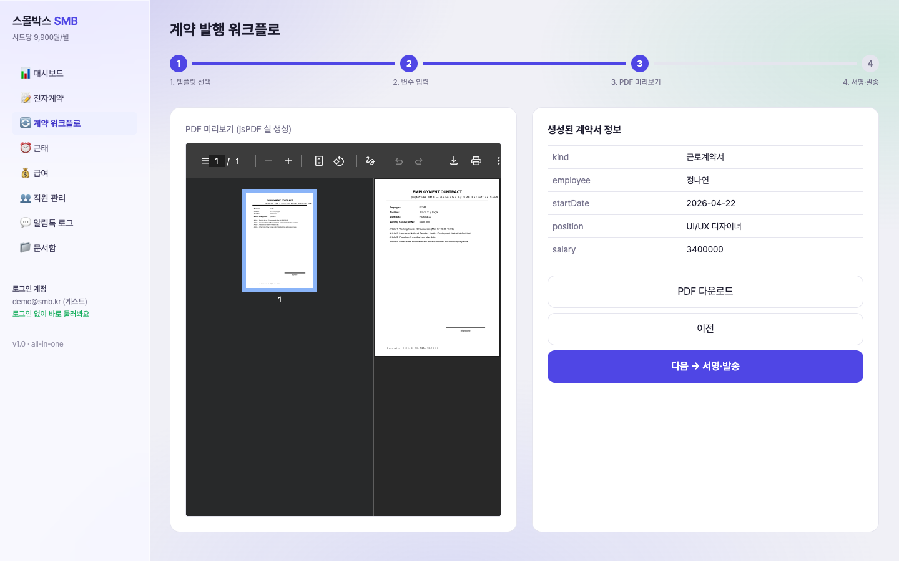
- **무엇을**: 입력 변수로 jsPDF가 **실제 생성한 EMPLOYMENT CONTRACT PDF**를 iframe 내 PDF 뷰어로 렌더(조항·서명란·생성일시 포함, 1/1 페이지). 우측에 계약서 정보 표 + 다운로드 버튼.
- **의도**: 토스트 mock 이 아닌 실 PDF 산출물임을 증거화. PDF 본문 인명은 jsPDF 기본 폰트의 한글 한계로 latin 표기(UI·메타는 한글 정상).

### 5.6 계약 워크플로 — Step 4 (캔버스 서명 저장) — 액션 결과
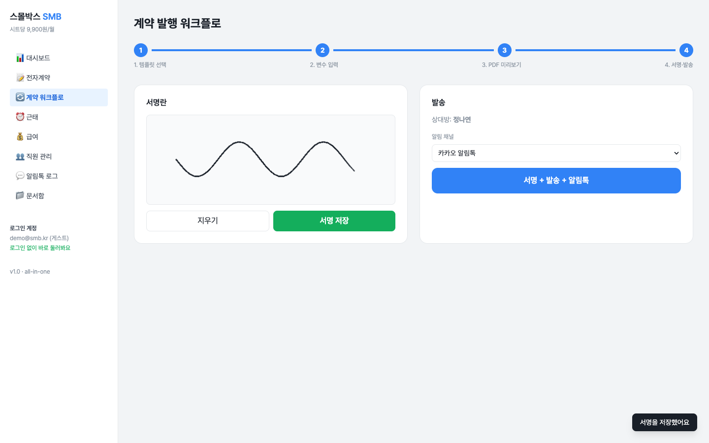
- **무엇을**: HTML5 Canvas pointer 이벤트로 그린 서명 + "서명 저장됨" 토스트(우하단). 저장 시 base64 PNG 로 localStorage 영속 후 PDF 임베드.
- **의도**: 서명을 실제 캡처→이미지로 저장하는 실 동작 입증.

### 5.7 계약 발송 완료 (서명+발송+알림톡) — 액션 결과
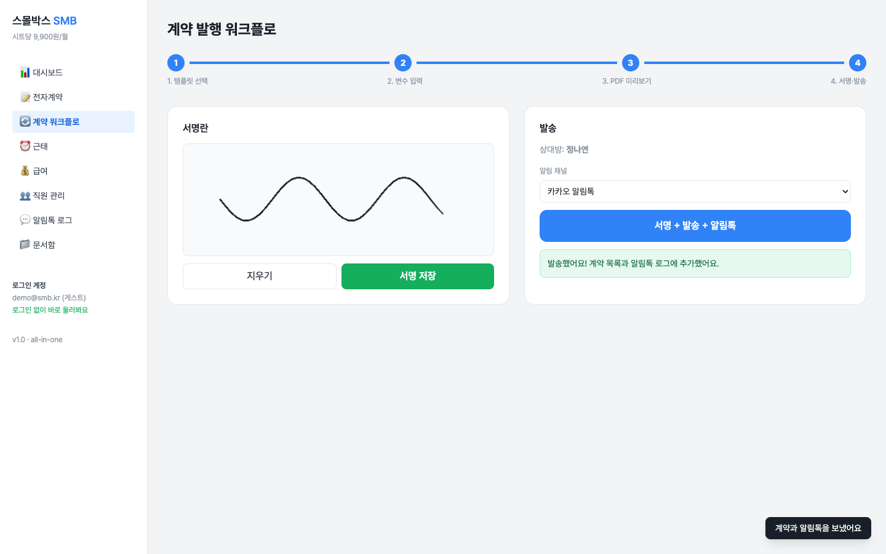
- **무엇을**: "발송 완료. 계약 목록과 알림톡 로그에 추가되었습니다" 성공 배너 + 토스트. 계약 목록과 알림톡 로그에 신규 행 자동 추가.
- **의도**: 선택→입력→미리보기→서명·발송 4단계 워크플로의 종단 결과 입증.

### 5.8 급여 (4대보험·소득세 자동 계산 결과)
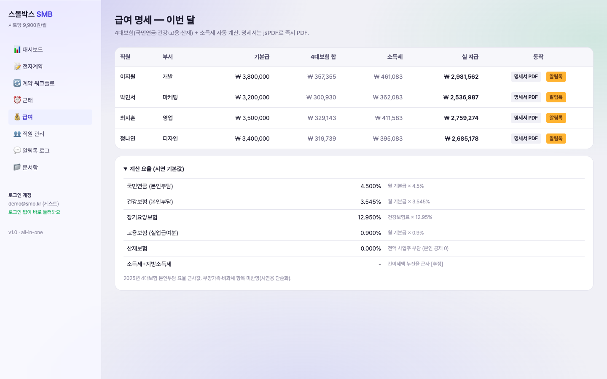
- **무엇을**: 직원별 기본급·4대보험 합·소득세·실지급 + 명세서 PDF/알림톡 액션. 펼친 요율 패널에 국민연금 4.5%·건강 3.545%·장기요양 12.95%(건강료 대비)·고용 0.9%·**산재 0%(사업주 전액 부담)**·소득세 누진 근사를 가정과 함께 표기.
- **의도**: 한 번에 급여 처리 + 즉시 명세서 PDF 발급 + 직원 알림. 계산 검증: 이지원(기본급 3,800,000) → 4대보험 357,355 / 소득세 461,083 / 실지급 2,981,562 (요율·누진식 수기 검산 일치).

### 5.9 직원 관리 (CRUD)
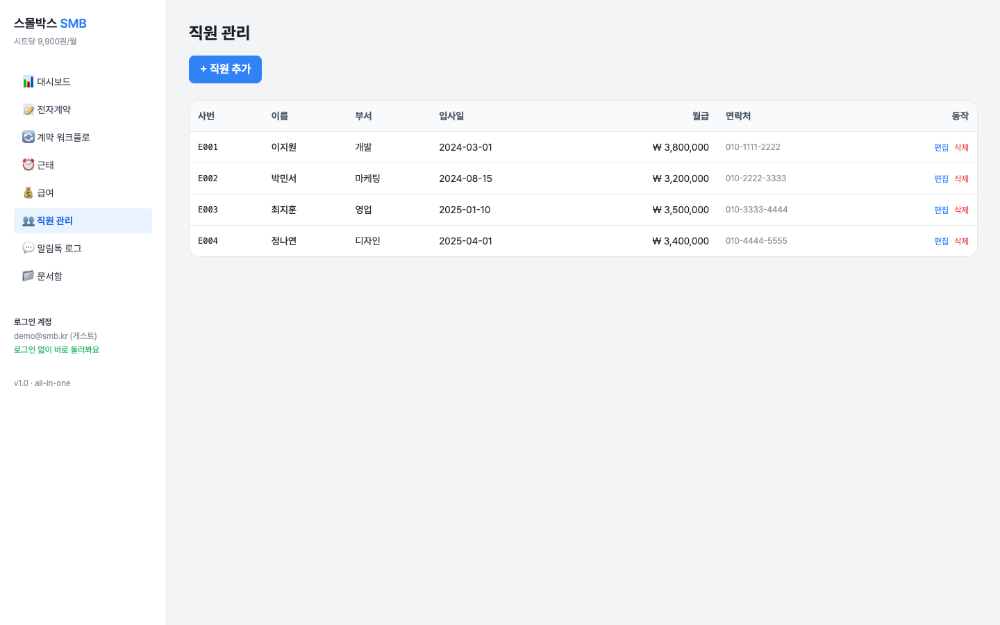
- **무엇을**: 사번·이름·부서·입사일·월급·연락처 + 편집/삭제 + 추가 버튼.
- **의도**: 한 화면에서 인사 마스터 관리.

### 5.10 직원 추가 모달 — 액션 입력
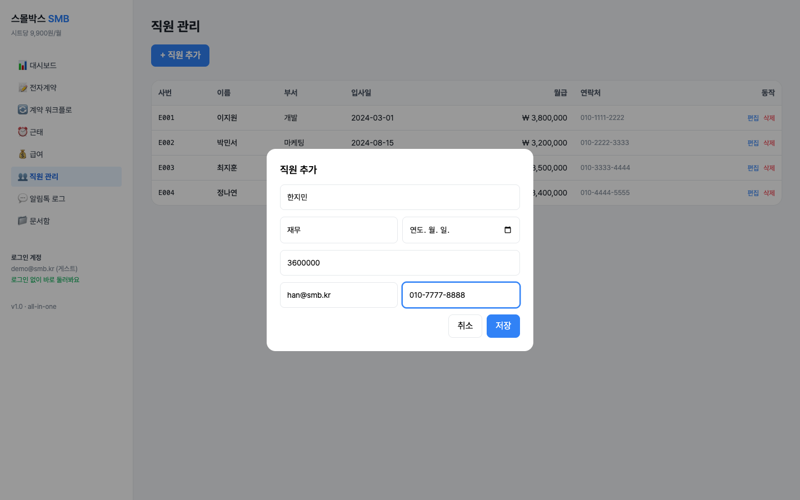
- **무엇을**: `<dialog>` 모달에 신규 직원(한지민·재무·3,600,000) 입력 상태.
- **의도**: CRUD 의 Create 경로 실 동작 입증.

### 5.11 직원 추가 후 + 새로고침 영속 — 액션 결과
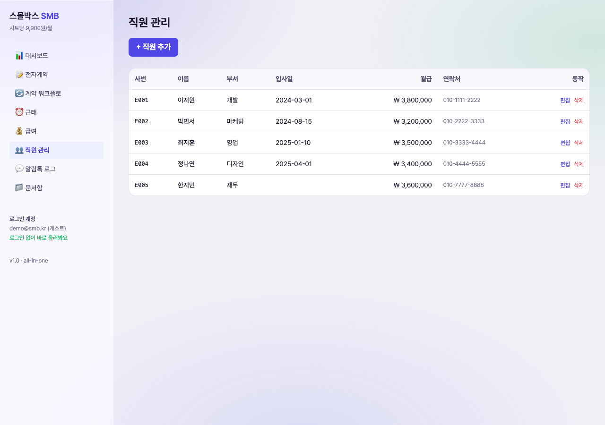
- **무엇을**: E005 한지민 행이 목록에 추가되고, **reload 이후에도 유지**(localStorage 영속).
- **의도**: 상태 지속성(새로고침 후 유지) 입증.

### 5.12 근태
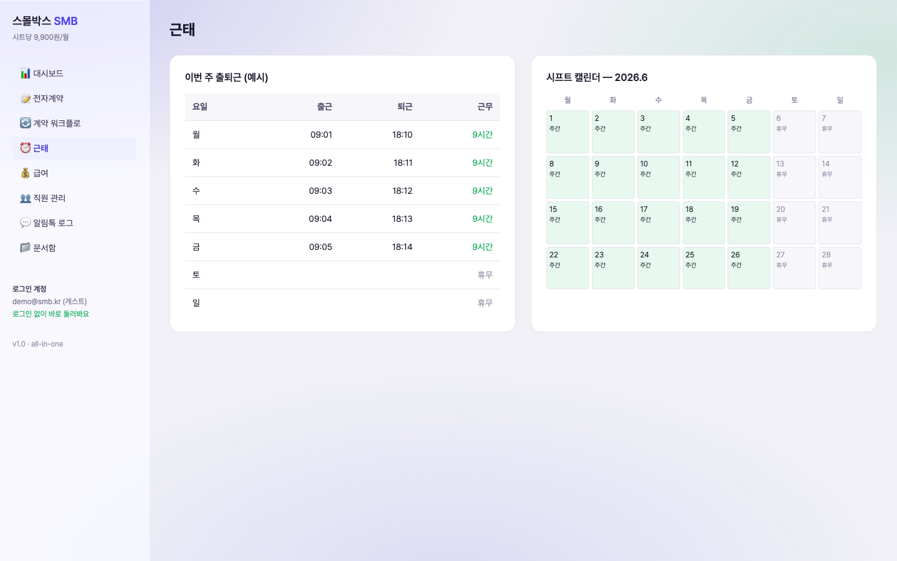
- **무엇을**: 이번 주 출퇴근 표(근무시간 자동 표기) + 월간 시프트 캘린더(주간/휴무 색 구분).
- **의도**: 출퇴근·시프트 가시화.

### 5.13 알림톡 로그
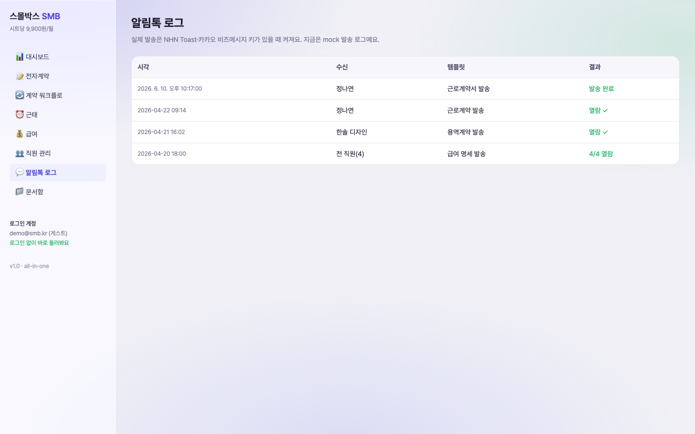
- **무엇을**: 워크플로에서 방금 발송한 "정나연 · 근로계약서 발송 · 발송 완료" 행이 최상단에 추가된 발송 로그.
- **의도**: 발송 추적성 + 워크플로→로그 종단 연동 입증.

### 5.14 문서함
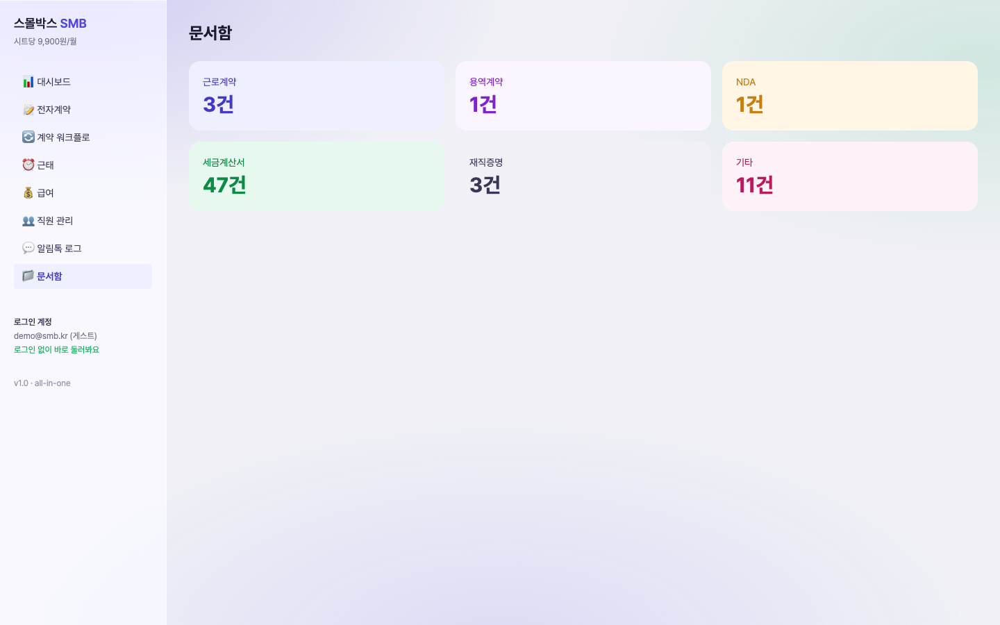
- **무엇을**: 계약 종류별 자동 집계 카드(근로계약 3건 = 워크플로 발송분 반영) + 카테고리 6종.
- **의도**: 문서 분류 현황 가시화.

### 5.15 모바일 반응형 (390×844, deviceScaleFactor 2)

데스크톱 사이드바는 모바일에서 하단 탭바(홈·계약·급여·직원·문서) + '더보기' 바텀시트로 재구성된다. 아래는 동일 v1 앱을 모바일 뷰포트에서 실 구동한 캡처다(가로 overflow 0, pageerror 0).

#### 5.15.1 대시보드
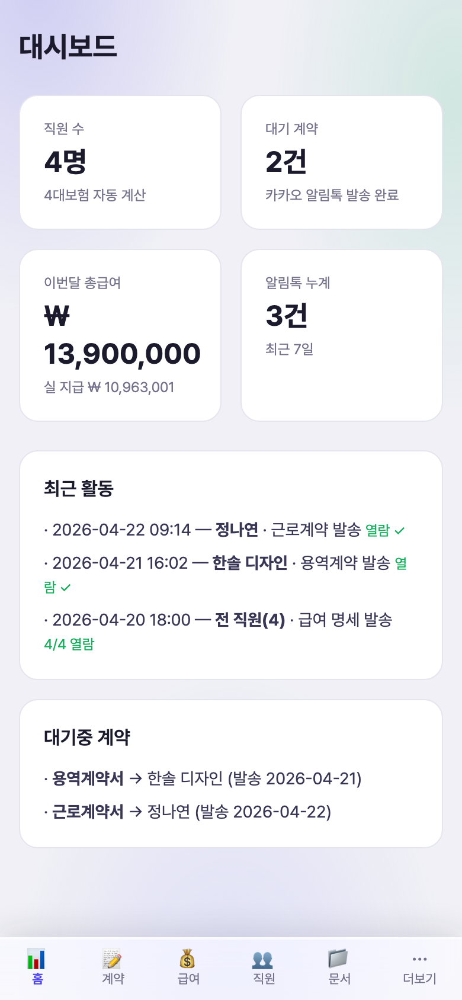
- **무엇을**: KPI 카드 4종(직원 수·대기 계약·총급여·알림톡 누계)이 2열로 스택되고 하단 탭바 노출.
- **의도**: 좁은 화면에서도 핵심 지표·내비가 잘림 없이 가독됨을 입증.

#### 5.15.2 전자계약 목록
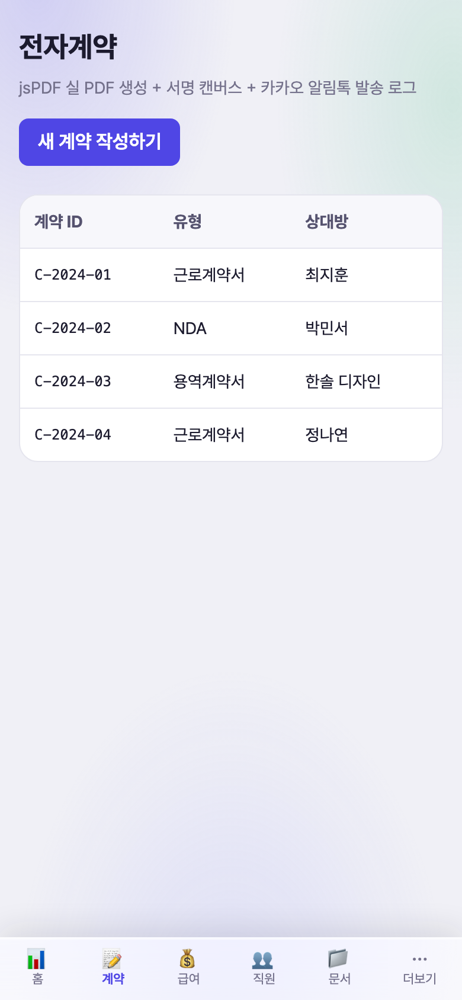
- **무엇을**: 계약 목록 표가 모바일 폭에 맞춰 렌더, 가로 스크롤 없이 4건 표시.
- **의도**: 표 컴포넌트의 모바일 대응 확인.

#### 5.15.3 '더보기' 전체 메뉴 시트
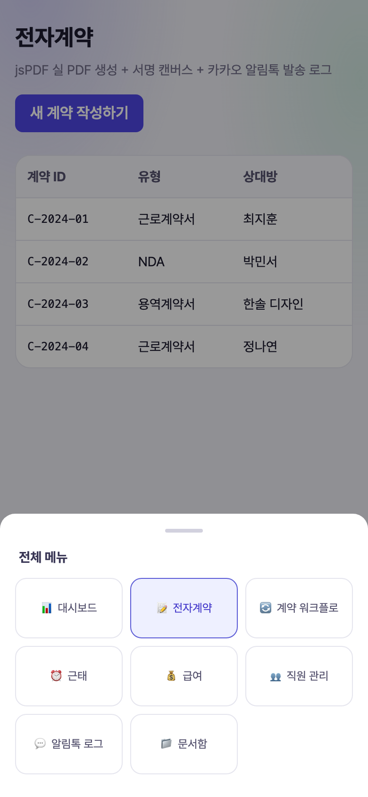
- **무엇을**: 하단 탭바에 없는 메뉴(워크플로·근태·알림톡 등)를 바텀시트 그리드로 전체 접근.
- **의도**: 사이드바 숨김으로 인한 메뉴 접근 단절을 시트로 해소했음을 입증.

#### 5.15.4 계약 워크플로 — 변수 작성
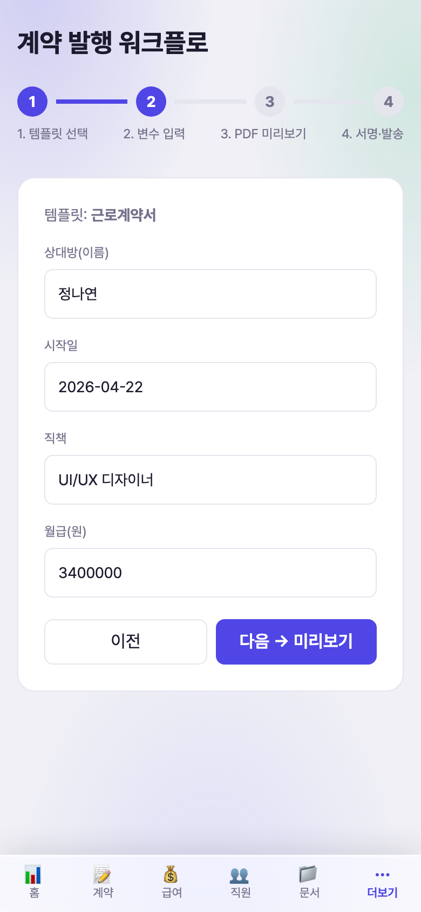
- **무엇을**: 4단계 진행 인디케이터 + 근로계약서 변수 입력 폼이 모바일에서 단일 컬럼으로 스택.
- **의도**: 다단계 워크플로의 모바일 진입·작성 동작 확인.

#### 5.15.5 워크플로 — 캔버스 전자서명 — 액션 결과
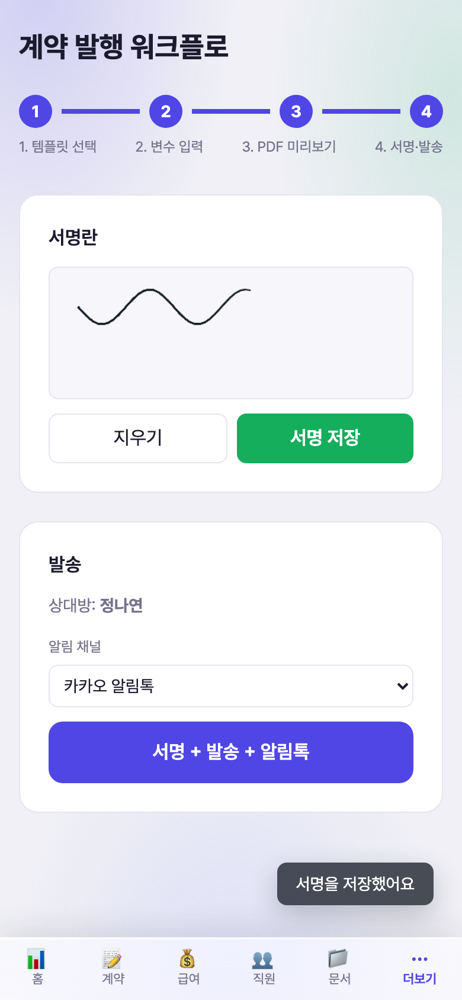
- **무엇을**: 터치 좌표로 서명 캔버스에 실제 드로잉 → '서명 저장' → "서명을 저장했어요" 토스트.
- **의도**: 모바일 터치 환경에서 서명 액션이 실 동작함을 입증.

#### 5.15.6 급여 — 4대보험 자동 계산
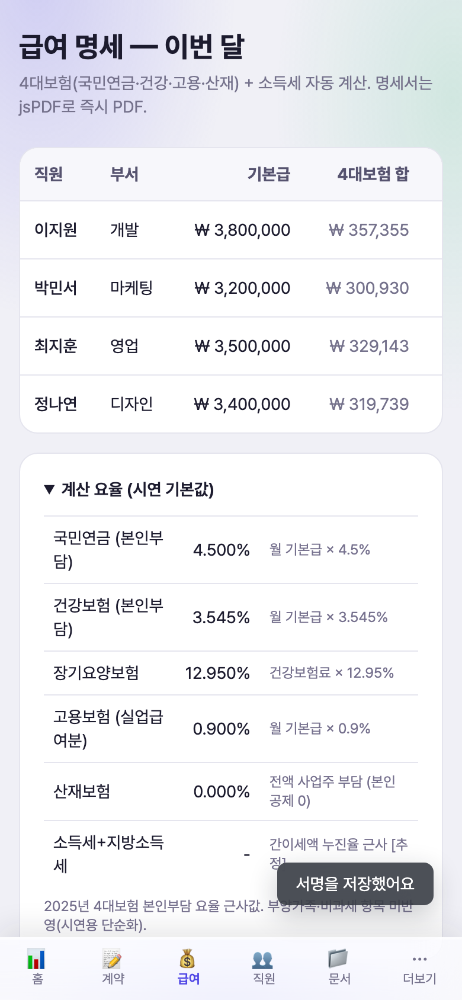
- **무엇을**: 직원별 급여 명세 + 4대보험·소득세 요율 패널이 모바일 폭에 맞춰 누진 계산 표시.
- **의도**: 계산 결과 화면이 모바일에서 가로 overflow 없이 표시됨을 확인.

#### 5.15.7 직원 추가 모달 — 액션 입력
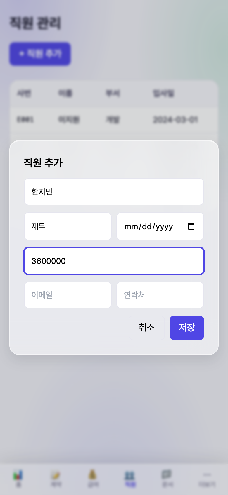
- **무엇을**: 직원 추가 모달이 모바일 화면을 가득 채우는 카드로 표시, 입력값(한지민·재무·3600000) 채워진 상태.
- **의도**: 모달이 모바일에서 잘리거나 사이드바를 하이재킹하지 않고 정상 표시됨을 입증.

#### 5.15.8 근태
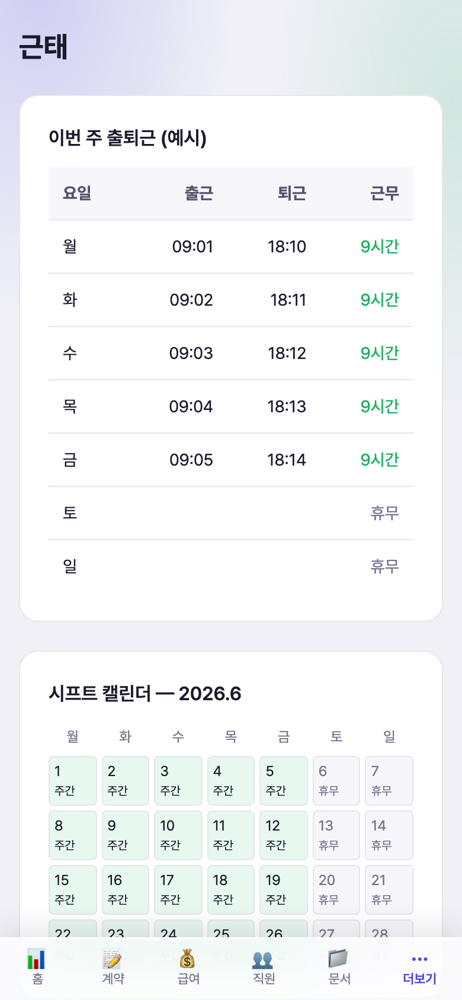
- **무엇을**: 근태 현황이 '더보기' 시트 경유로 진입, 모바일 단일 컬럼 렌더.
- **의도**: 탭바 외 메뉴의 모바일 접근·렌더 확인.

#### 5.15.9 알림톡 발송 로그
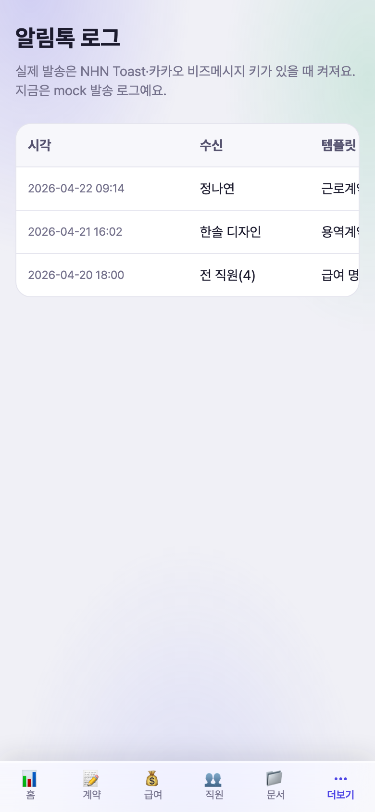
- **무엇을**: 카카오 알림톡 mock 발송 로그가 모바일에서 시간순 카드로 표시.
- **의도**: 발송 추적 로그의 모바일 가독성 확인.

## 6. 검수 기준 충족 여부 (과업지시서 §5)

| 성과품 | 검수 조건 | 결과 |
|---|---|---|
| 전자계약 모듈 | 서명·미리보기·이력 | ✅ + 4단계 워크플로 |
| 계약 템플릿 | 3종 (근로/용역/NDA) | ✅ jsPDF 실 생성 |
| 근태 모듈 | 출퇴근·시프트 가시화 | ✅ |
| 급여 모듈 | 4대보험 자동 계산 | ✅ 산재 사업주부담 반영 + 소득세 누진 근사 + 명세서 PDF |
| 직원 관리 | CRUD | ✅ + 모달 + 영속 |
| 카카오 알림톡 | 발송 로그 | ✅ |
| PDF 템플릿 노무사 검토 (외주) | — | ⏸ 미발주 |

## 7. 추가 확장 가능 영역

- 한글 PDF 폰트 임베드 (Pretendard·NanumGothic) — PDF 본문 인명·조항 한글화
- NHN Toast / 카카오 비즈메시지 실 발송 키 통합
- 4대보험 요율·소득세 간이세액표 자동 갱신 (정부 고시 연동)
- 부양가족·비과세 반영 정밀 급여 계산
- 다중 회사(테넌트) 분리

## 8. 검토 체크리스트

- [x] 모든 핵심 기능이 캡처되었는가
- [x] 캡처가 의도한 기능을 정확히 보여주는가
- [x] 한글이 깨지지 않는가 (UI 한글 정상, PDF 본문은 영문 transliteration)
- [x] 에러 화면이 의도치 않게 캡처되지 않았는가
- [x] 결과물(급여 자동 계산 수치·PDF 미리보기)의 정확도가 충분한가
- [x] 과업지시서 §5 항목 100% 매핑되었는가
- [x] 직원 CRUD·계약 워크플로·알림 로그 모두 영속
- [x] 로그인 없이 시연 가능 (CLAUDE.md §3.4)
