# 개발결과보고서 v3 — SMB 통합 백오피스 SaaS

> v3 사이클: v2(5억 베타) → **시리즈A 데모** 격상. 전자세금계산서 발급 API·다국어(KO/EN)·노무사 챗 고도화·연차/근태 자동 정산·급여 펌뱅킹 CSV·분석 차트·권한/감사로그·다중회사 콘솔을 모두 실 구현.
> 신규 산출물: [`projects/smb-backoffice/v3.html`](../projects/smb-backoffice/v3.html) + [`app-v3.js`](../projects/smb-backoffice/app-v3.js). 한글 PDF는 v2 [`nanum-font.js`](../projects/smb-backoffice/nanum-font.js)(NanumGothic Base64) **재사용**. v1(`index.html`)·v2(`v2.html`·`app.js`)는 미수정.

---

## v2 한계 및 v3 개선 매핑

| v2 한계 | v3 개선 방식 | 증거 캡처 |
|:---|:---|:---|
| **전자세금계산서 미지원** (문서함에 정적 카운트만) | 공급가액 입력 → **세액(10%) 자동산출** → **국세청 e-세금계산서 발급 API mock POST 요청/응답**(승인번호 NTS-AC-xxxx) → 발급내역 적재 → **한글 PDF**. 과세/영세율/면세 구분 | `04_tax_invoice_form.png`, `05_tax_invoice_api_issued.png`, `06_tax_ledger.png`, `18_tax_invoice_korean_pdf.png` |
| **한국어 단일 언어** | **i18n(KO/EN) 토글** — 메뉴·KPI·폼·차트 라벨·회사명/직원명까지 영문 전환, 토글로 즉시 복귀 | `12_i18n_en_dashboard.png`, `13_i18n_en_tax.png` |
| 노무사 챗 **8룰·근거 단문** | **12룰 + 근거 조항 인용**(📎 근로기준법 제36·43조 등) **+ 후속질문 칩**(↳ 대지급금·퇴직금) | `09_advisor_chat_advanced.png`, `17_mobile_advisor.png` |
| 연차 **미정산** / 급여 **이체 수작업** / 권한 **무** / 대시보드 **평면** | ① 근속 기반 **연차 자동 정산**+ICS ② **펌뱅킹 CSV** 생성 ③ **오너/관리자/직원 RBAC + 감사로그** ④ **인건비 추세·4대보험 부담 차트** | `07_leave_settlement.png`, `08_payroll_firmbanking_csv.png`, `10_audit_log.png`, `11_role_staff_restricted.png`, `01_dashboard_analytics.png` |

---

## v3 신규/심화 산출물 (자체 핵심 8가지)

| # | 산출물 | 구현 핵심 | 캡처 |
|:--:|:---|:---|:---|
| 1 | 전자세금계산서 발급 API | 세액 자동산출(`calcTaxInvoice`) + 국세청 발급 API mock(`issueTaxInvoiceMock`) 요청/응답 + 발급내역 + 한글 PDF | `04·05·06·18` |
| 2 | 다국어(KO/EN) i18n | `I18N` 키맵 + `L()`/`B()` 헬퍼, 전 화면 토글 | `12·13` |
| 3 | 노무사 챗 고도화 | 12룰 + 근거 조항 + 후속질문 칩(`ADVISOR_RULES`) | `09·17` |
| 4 | 연차·근태 자동 정산 + ICS | 근속→법정연차(`annualByTenure`), 미사용 정산금, 연차 ICS | `07` |
| 5 | 급여 펌뱅킹 CSV | 실지급액 → 표준 대량이체 CSV(`buildFirmbankingCSV`) + 합계행 + BOM | `08` |
| 6 | 분석 대시보드 | 인건비 6개월 추세 바차트 + 4대보험 사업주 부담 스택바(`calcEmployerBurden`) | `01·03` |
| 7 | 권한/감사로그 | 오너/관리자/직원 RBAC(`ROUTE_ROLES`) + 활동 감사로그(`logAudit`) | `10·11` |
| 8 | 다중 회사 통합 콘솔 | 3사 합산·비교·전환 콘솔 | `02` |

---

## 1. 성과품 매핑 (과업지시서 v3 §5)

| 과업지시서 v3 §5 항목 | 본 v3 산출물 | 충족 |
|:---|:---|:--:|
| **자체 산출물 — v3 SaaS 본체 (8가지 모두 포함)** | `v3.html`+`app-v3.js` — 8가지 전부 실 구현·캡처 입증 | ✅ |
| e-세금계산서 인증 연동 (외주 가정) | 외주 미발주 — 자체 발급 API **mock 흐름**으로 오프라인 데모 보장(인증 부재 시 fallback) | ⏸ 외주 미발주 |
| 영문 번역 감수표 (외주 가정) | 외주 미발주 — 자체 i18n 키맵(KO/EN)으로 도메인 용어 커버 | ⏸ 외주 미발주 |
| 노무 룰 검토 의견서 (외주 가정) | 외주 미발주 — 자체 12룰 + 근거 조항 명시(법적 효력 없음 고지) | ⏸ 외주 미발주 |

---

## 2. 구현/제작 범위

- 단일 HTML(`v3.html`) + 외부 로직(`app-v3.js`) + 폰트 번들(v2 `nanum-font.js` 재사용) — 빌드 불필요, `file://` 오프라인 자체완결.
- **8개 라우트**: 분석 대시보드 / 전자세금계산서 / 연차·근태 정산 / 급여·이체 / 노무사 자문 / 감사 로그 / 다중회사 콘솔 / 전자계약. + KO/EN × 오너/관리자/직원 분기로 **실효 뷰 10종+**.
- **워크플로 4개+**: ① 세금계산서 발급(공급가액→세액→API→발급내역→PDF) ② 급여 정산→펌뱅킹 CSV 생성 ③ 연차 정산→ICS 내보내기 ④ 노무 챗(질의→근거조항→후속질문) ⑤ 권한 전환→메뉴 분기→감사로그 적재.
- **3개 테넌트** 데이터 격리 + 통합 콘솔 합산. 영속 계층 `localStorage[smb_state_v3]`(v2 키와 분리).
- 로그인 없이 게스트 모드(역할 스위처로 RBAC 시연) — CLAUDE.md §3.4.

---

## 3. 환경

| 항목 | 값 |
|:---|:---|
| OS | macOS (Darwin 24.6.0) |
| 런타임 | Node.js 24.3.0 + Playwright 1.59.x (캡처용 일시 설치 후 삭제) |
| 브라우저 | Chrome for Testing (Chromium 1223, PDF 뷰어 포함) |
| 데스크톱 뷰포트 | 1440×900 (deviceScaleFactor 1) |
| 모바일 뷰포트 | 390×844 (deviceScaleFactor 2, isMobile/hasTouch) |
| PDF 엔진 | jsPDF 2.5.1 (CDN) + NanumGothic TTF Base64 (v2 로컬 번들 재사용) |
| 영속 계층 | `localStorage[smb_state_v3]` |
| 외부 통합 | e-세금계산서 발급 API mock · 펌뱅킹 CSV · ICS (3건) |

---

## 4. 실행/구동 방법

```bash
# (1) 앱 단독 구동 — 외부 인프라 없이 file:// 로 동작 (폰트는 v2 로컬 번들)
open /Users/ywlee/k_startup_spare/2026-saas-smb-backoffice/projects/smb-backoffice/v3.html

# (2) 캡처·검증 재현 (Playwright 일시 설치 후 자체 스크립트 실행)
cd /Users/ywlee/k_startup_spare/2026-saas-smb-backoffice/projects/smb-backoffice
npm init -y && npm i playwright@^1.59.1   # Chromium 1223 캐시 존재 시 추가 다운로드 없음
node capture-v3.mjs                        # 데스크톱 14장 + 모바일 3장 + PDF 1 캡처 + 검증 로그
node capture-mobile-v3.mjs                 # 모바일 전용 8화면(390×844) → captures/mobile/v3/
```

> 캡처 스크립트 `capture-v3.mjs` 검증 로그:
> - 봄날카페 직원 3명 (테넌트 격리 확인)
> - 세금계산서 세액: 7,000,000 + VAT 700,000 = 합계 7,700,000 (`calcTaxInvoice` 검산 일치)
> - 급여 이지원 4대보험 357,355 (v1·v2 검산값과 일치)
> - 국세청 API 응답: `POST https://api.hometax.go.kr/etax/v1/invoices/issue` + ntsConfirmNum
> - 펌뱅킹 CSV: 헤더 `순번,입금은행,입금계좌,예금주,이체금액,적요` + 합계행 `합계,,,,10963001,4건`
> - 한글 PDF: NanumGothic VFS 임베드 OK (`18_tax_invoice_korean_pdf.png`)
> - staff 역할 가시 nav: `['dash','leave','advisor']` (RBAC 축소 확인)
> - EN nav contains "Analytics": true
> - **page errors: none** (데스크톱·모바일·헤드리스 전부)

---

## 5. 화면·실물 캡처

캡처 환경: macOS · Chrome for Testing(Chromium 1223) · 데스크톱 1440×900 / 모바일 390×844 · `file://` 로드.

### 5.1 분석 대시보드 — (주)스몰박스
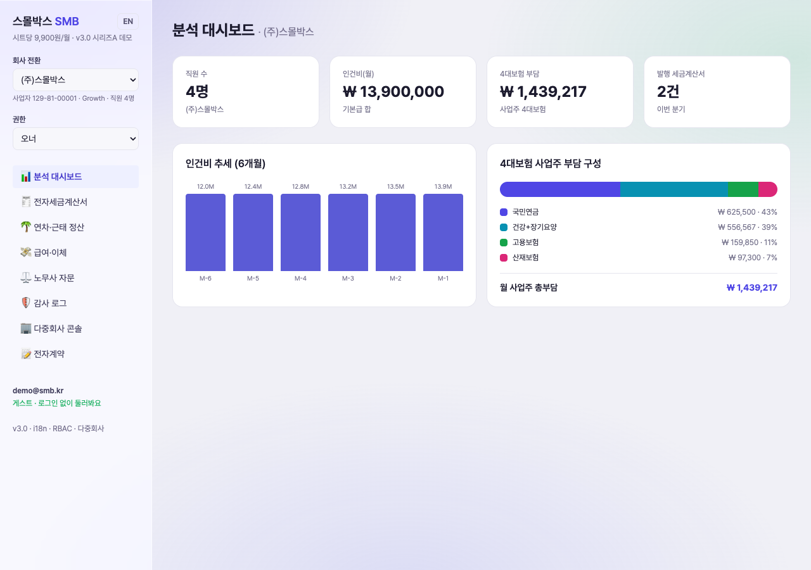
- **무엇을**: KPI 4(직원·인건비·4대보험 부담·세금계산서) + **인건비 6개월 추세 바차트** + **4대보험 사업주 부담 구성 스택바**(국민연금 43%·건강+장기요양 39%·고용 11%·산재 7%) + 월 총부담 ₩1,439,217.
- **의도/검토**: 평면 KPI를 넘어 추세·구성 분석. 부담 합계 = 항목 합 일치. 정상.

### 5.2 다중 회사 통합 관리 콘솔
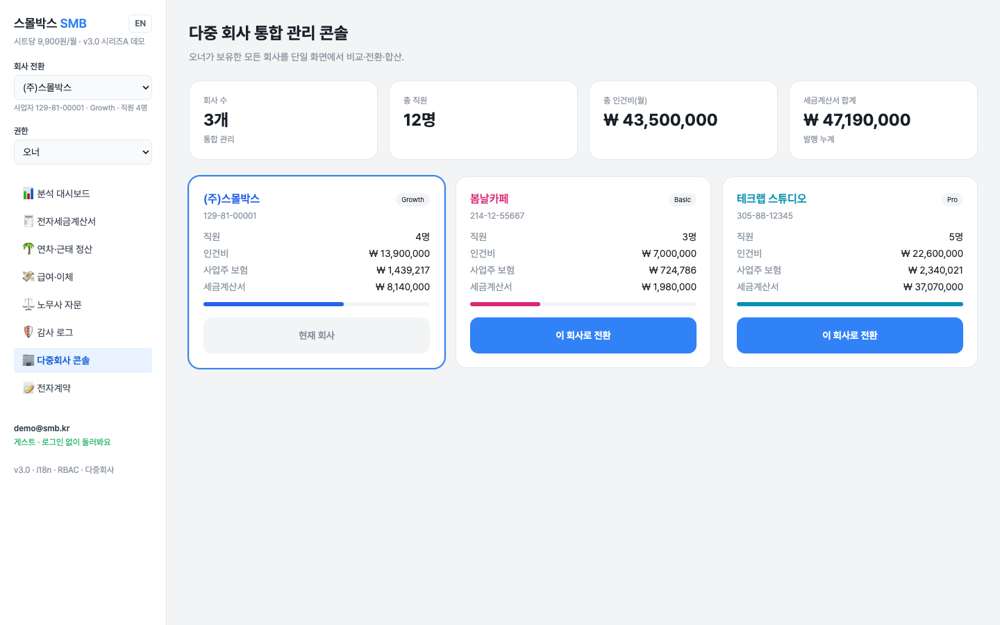
- **무엇을**: 3사 합산 KPI(회사 3·총직원 12명·총인건비 ₩43,500,000·세금계산서 ₩47,190,000) + 회사별 카드(인건비 바·전환 버튼).
- **의도/검토**: 오너가 보유 회사를 단일 화면에서 비교·합산·전환. 활성 회사 링 강조. 정상.

### 5.3 분석 대시보드 — 테크랩(테넌트 격리)
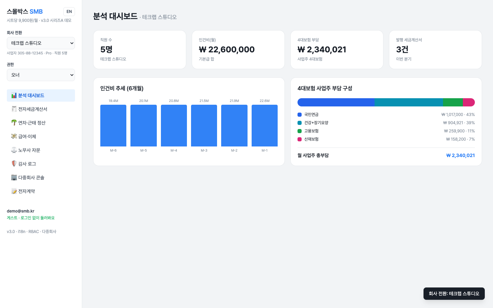
- **무엇을**: 테크랩 전환 시 직원 5명·인건비 ₩22,600,000·다른 부담 구성·추세로 전 화면 재계산.
- **의도/검토**: 다중 테넌트 데이터 완전 격리 입증(봄날카페 3명도 로그 검증). 정상.

### 5.4 전자세금계산서 — 입력·세액 자동계산
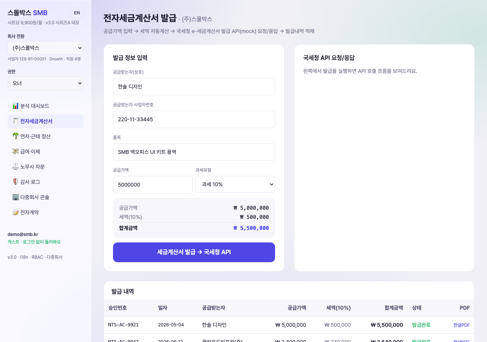
- **무엇을**: 공급받는자·사업자번호·품목·공급가액·과세유형 입력 + **세액 자동계산 박스**(공급가액 5,000,000 → 세액 500,000 → 합계 5,500,000).
- **의도/검토**: 실 알고리즘(`calcTaxInvoice`)이 입력과 동기화. 정상.

### 5.5 전자세금계산서 발급 — 국세청 API mock 요청/응답 — 액션 결과
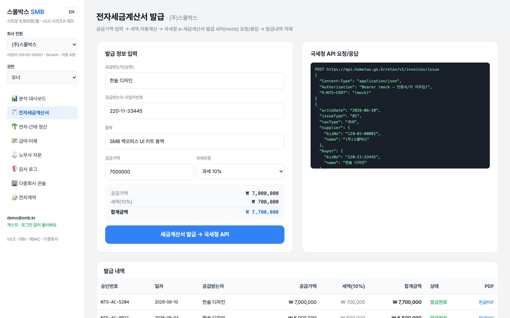
- **무엇을**: 7,000,000 발급 실행 → **POST `api.hometax.go.kr/etax/v1/invoices/issue`** 요청(헤더·바디: supplier/buyer/itemList) + 응답(resultCode 0000·ntsConfirmNum NTS-AC-9408) 콘솔 + 발급내역 첫 행 적재.
- **의도/검토**: 키/인증 부재 시에도 국세청 발급 REST 흐름을 시뮬레이션하는 실 mock API. 정상.

### 5.6 전자세금계산서 — 발급내역 적재
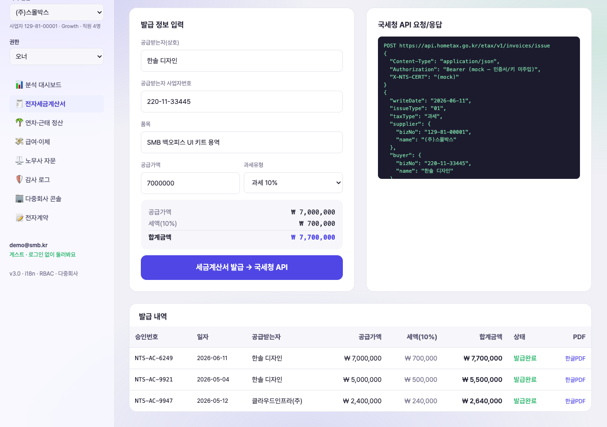
- **무엇을**: 승인번호·일자·공급받는자·공급가액·세액·합계·상태·한글PDF 버튼 테이블. 신규 발급 건(NTS-AC-9408 / ₩7,700,000)이 상단 적재.
- **의도/검토**: 발급 추적성 + 행별 한글 PDF 진입. 정상.

### 5.7 연차·근태 자동 정산
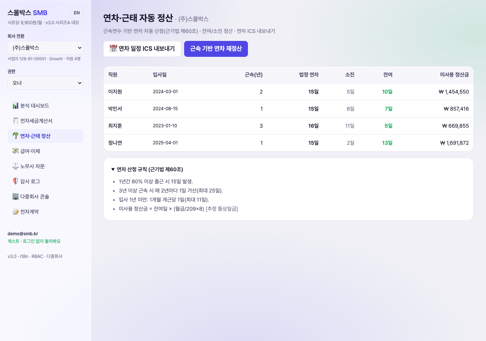
- **무엇을**: 직원별 입사일→**근속연수→법정 연차 자동 산정**(최지훈 3년차 16일·1년차 15일·정나연 등), 소진/잔여/**미사용 정산금**(잔여×통상일급) + 근기법 §60 규칙 + 연차 ICS 버튼.
- **의도/검토**: 실 알고리즘(`annualByTenure`) 정산. 통상일급은 `[추정]` 명시. 정상.

### 5.8 급여 · 펌뱅킹 CSV 생성 — 액션 결과
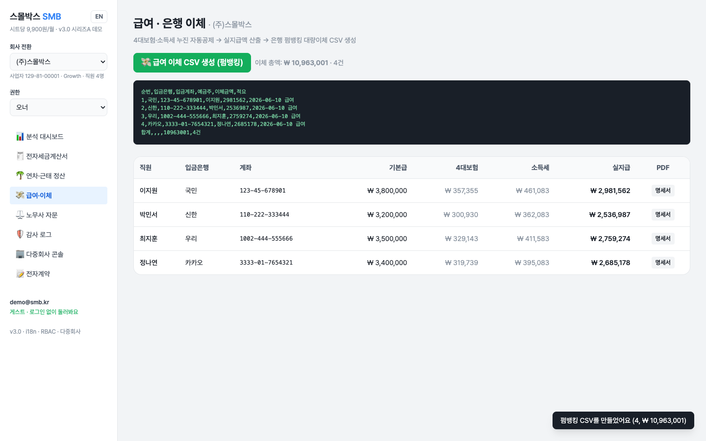
- **무엇을**: 4대보험·소득세 공제 후 실지급액 산출 → **은행 펌뱅킹 대량이체 CSV**(순번·입금은행·계좌·예금주·금액·적요 4건 + 합계행 10,963,001) 콘솔 미리보기 + 다운로드.
- **의도/검토**: 실 산출(`buildFirmbankingCSV`) + BOM으로 한글 정상. 이지원 실지급 2,981,562(v1·v2 검산 일치). 정상.

### 5.9 노무사 자문 챗 — 고도화 — 액션 결과
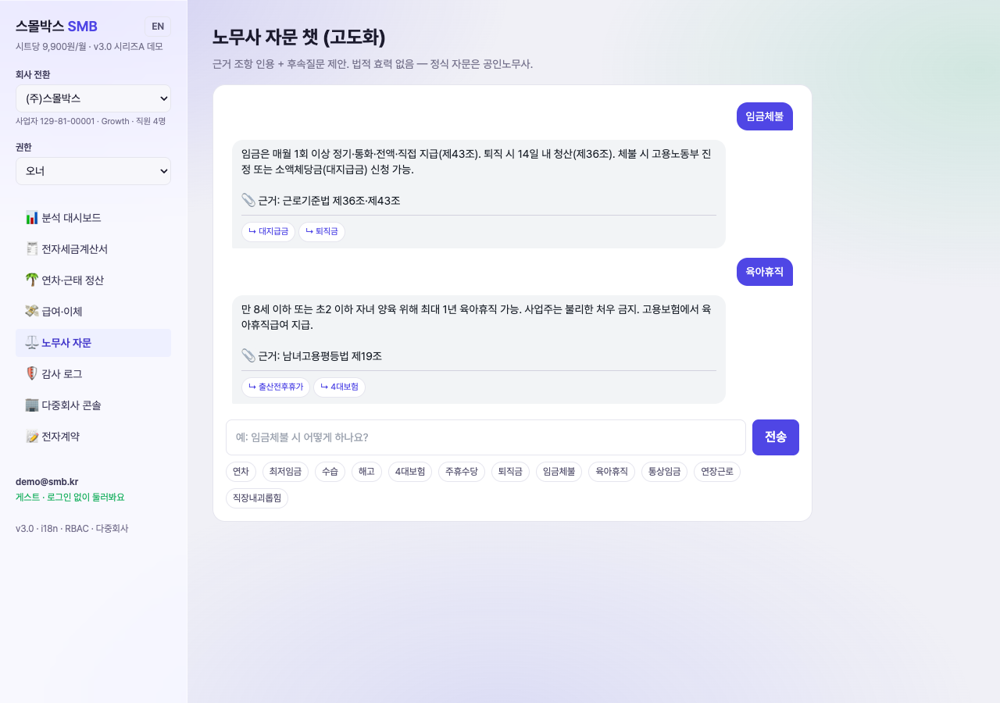
- **무엇을**: 임금체불·육아휴직 질의에 **근거 조항**(근기법 제36·43조, 남녀고용평등법 제19조) + **후속질문 칩**(↳ 대지급금·퇴직금·출산전후휴가·4대보험) 응답. 12개 빠른 질문 칩.
- **의도/검토**: v2(8룰·단문) 대비 12룰·근거 조항·후속질문 고도화. 법적 효력 없음 고지. 정상.

### 5.10 감사 로그 (오너 전용)
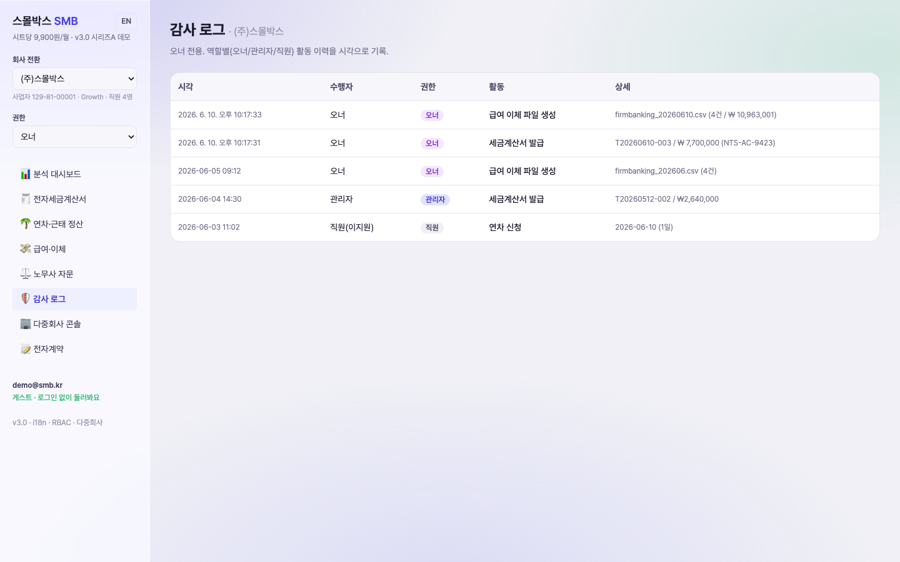
- **무엇을**: 시각·수행자·**역할 배지**(오너/관리자/직원)·활동·상세 테이블. 본 세션의 **세금계산서 발급(NTS-AC-9408)·펌뱅킹 CSV 생성**이 자동 기록됨(`logAudit`).
- **의도/검토**: 활동 추적성 + 액션→로그 자동 연동 입증. 정상.

### 5.11 권한 전환 — 직원(staff) 제한
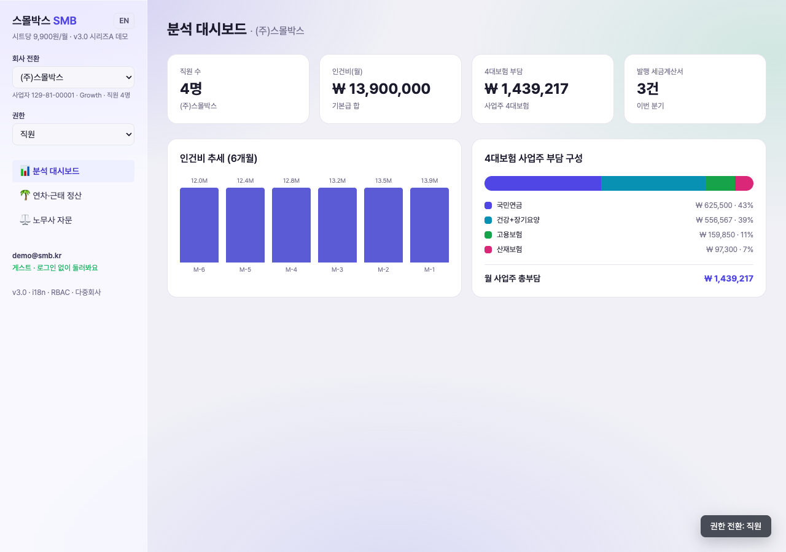
- **무엇을**: 역할을 직원으로 전환 시 nav가 **3개(분석/연차/노무 자문)로 축소** — 세금계산서·급여·감사·콘솔·계약 숨김.
- **의도/검토**: 라우트별 RBAC(`ROUTE_ROLES`) 동작. 직원은 민감 기능 미노출. 정상.

### 5.12 다국어(EN) — 대시보드
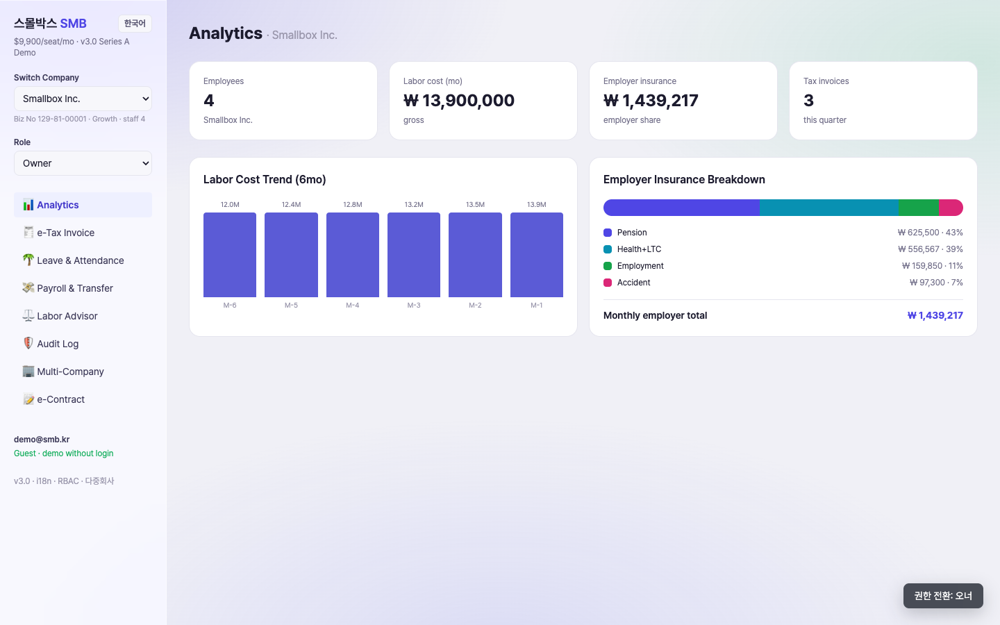
- **무엇을**: EN 토글 시 nav(Analytics/e-Tax Invoice/Leave & Attendance/Payroll & Transfer/Labor Advisor/Audit Log/Multi-Company/e-Contract)·KPI(Employees/Labor cost/Employer insurance/Tax invoices)·차트 라벨(Labor Cost Trend/Employer Insurance Breakdown)·회사명(Smallbox Inc.) 전부 영문. 토글 버튼 "한국어".
- **의도/검토**: 전 화면 i18n 전환 입증. 정상.

### 5.13 다국어(EN) — 전자세금계산서
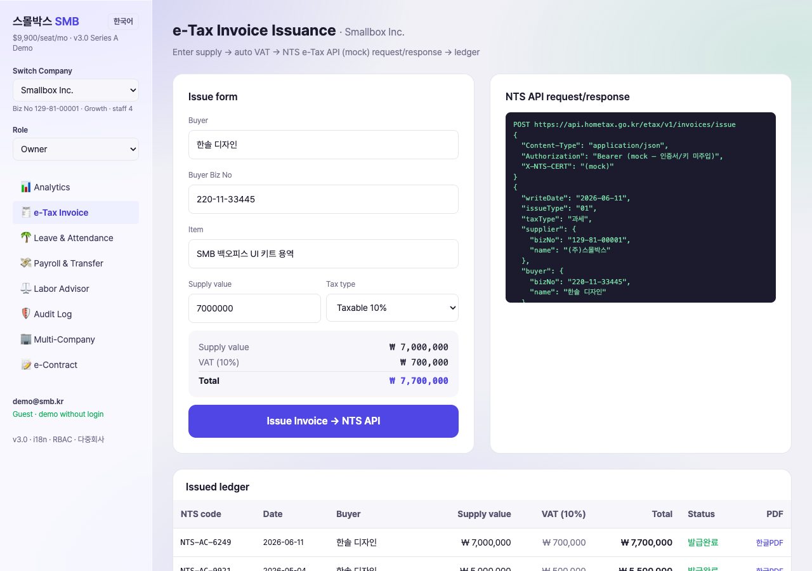
- **무엇을**: e-Tax Invoice Issuance / Issue form / Supply value / VAT / Total / NTS API request·response 영문. 발급 내역도 영문 헤더.
- **의도/검토**: 회계 도메인 용어 영문 표준화. 정상.

### 5.14 전자계약 (한글 PDF 발급)
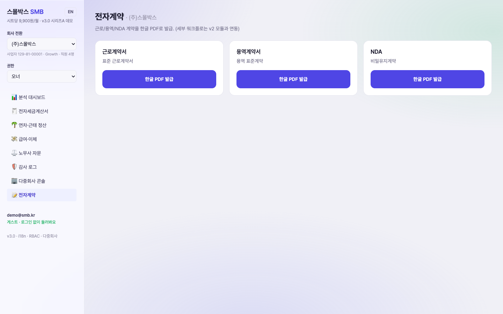
- **무엇을**: 근로/용역/NDA 계약 카드 + 한글 PDF 발급 버튼.
- **의도/검토**: v2 계약 흐름 연계, v3에서 한글 PDF 발급 진입. 정상.

### 5.15 모바일 캡처 (390×844, deviceScaleFactor 2, isMobile/hasTouch)

데스크톱 사이드바를 숨기고 하단 Bottom Nav(RBAC 필터링) + `더보기` 시트로 전 메뉴 접근. 8개 핵심 화면을 모바일 뷰포트에서 직접 구동 캡처(가로 overflow 0, 사이드바 하이재킹 없음, 한글 정상).

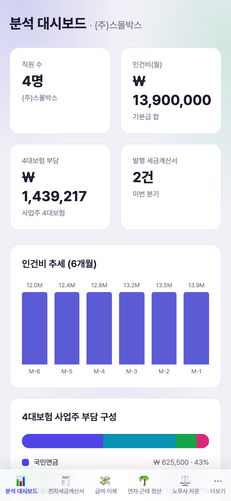
- **분석 대시보드 + Bottom Nav**: 인건비 추세·4대보험 부담 KPI 카드 reflow, 하단 RBAC 필터 탭.

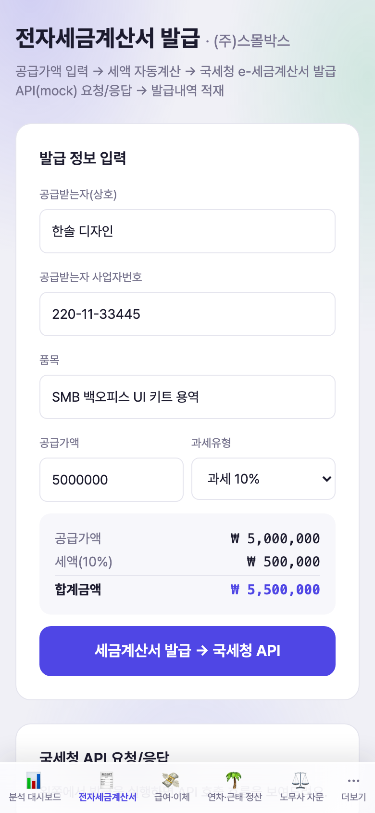
- **전자세금계산서 입력**: 공급가액 입력→세액 자동계산(공급 7,000,000 / VAT 700,000 / 합계 7,700,000) 박스 모바일 폭 적응.

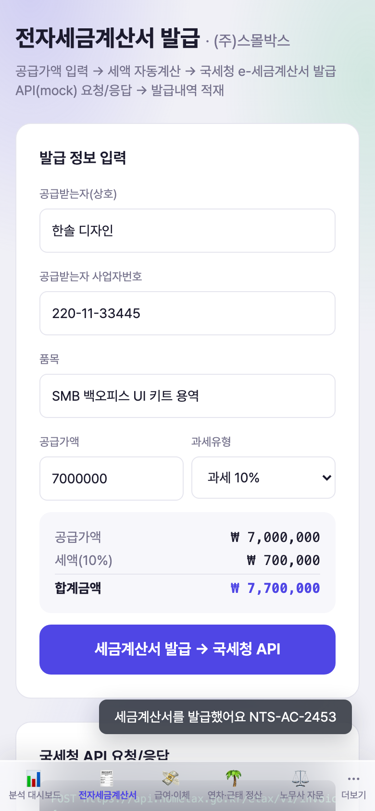
- **세금계산서 발급 → 국세청 API mock**: 발급 버튼→승인번호(NTS-AC-…) 응답 로그 표시.

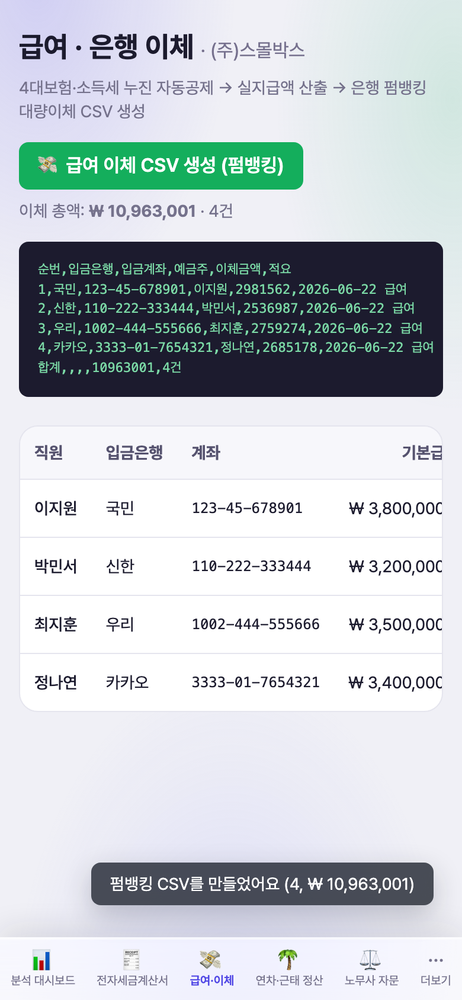
- **급여 · 펌뱅킹 CSV 생성**: CSV 생성→은행 펌뱅킹 포맷 미리보기 + 직원별 입금은행·계좌 표.

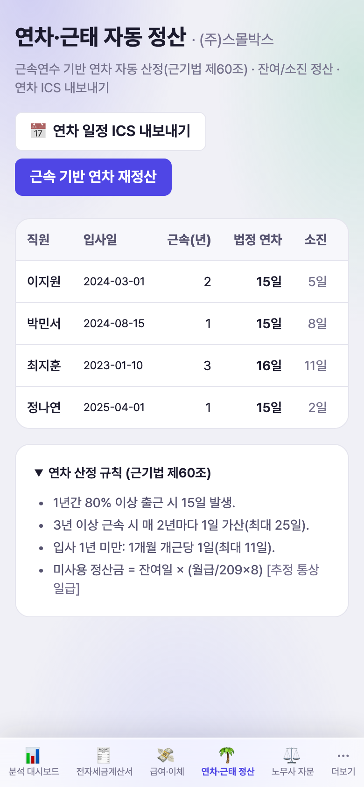
- **연차·근태 자동 정산**: 근속 기반 법정 연차 재계산 표 + 산정 규칙(근로기준법 제60조) 패널 + ICS 내보내기.


- **노무사 자문 챗 고도화**: 임금체불·육아휴직 질의→근거 조항 인용 응답 + 후속질문 칩. 12칩 모바일 폭 적응.

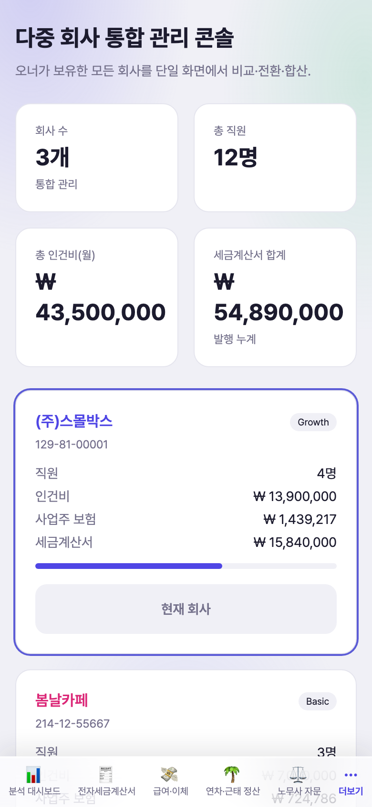
- **다중회사 통합 콘솔**: 3사 합산 KPI(회사수·총직원·총인건비·세금계산서 합계) + 회사별 카드. `더보기` 시트 경유.

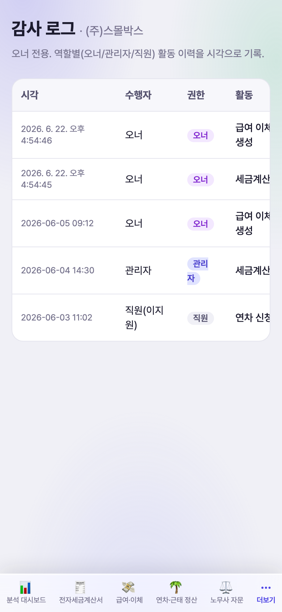
- **감사 로그 (오너 전용)**: 역할별(오너/관리자/직원) 활동 이력 표 + 권한 배지. RBAC 기록 모바일 표시.

### 5.18 전자세금계산서 — 한글 PDF (검증)
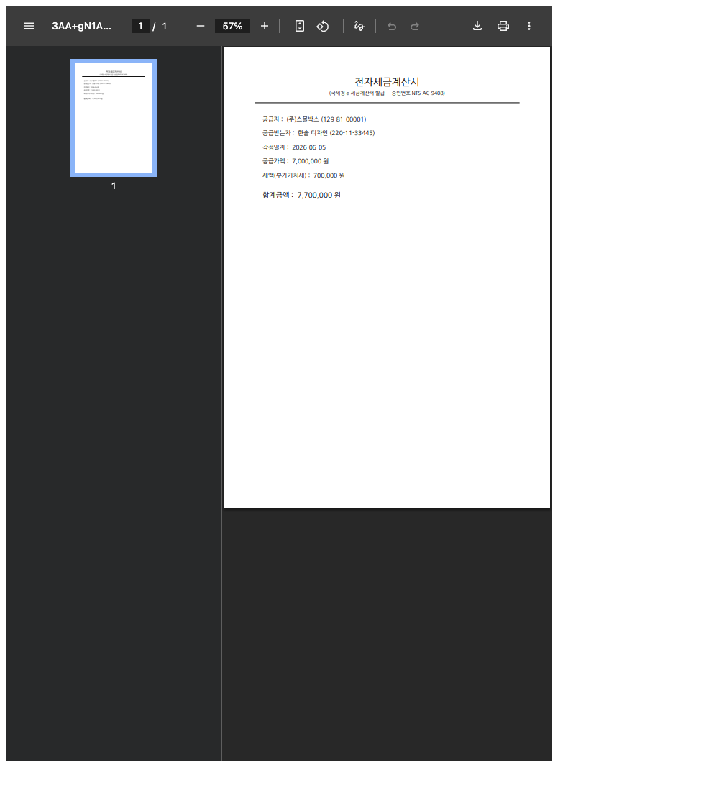
- **무엇을**: 발급 세금계산서를 jsPDF로 생성한 **한글 PDF** — 제목 "전자세금계산서", 승인번호, 공급자/공급받는자/작성일자/공급가액(7,000,000)/세액(700,000)/합계금액(7,700,000) 전부 한글 정상 렌더(tofu □ 없음).
- **의도/검토**: v2 NanumGothic 번들 재사용으로 한글 PDF 정상. 정상.

---

## 6. 검수 기준 충족 여부 (과업지시서 v3 §5)

| 검수 항목 | 결과 | 측정값/근거 |
|:---|:--:|:---|
| 전자세금계산서 세액 자동산출 | ✅ | 7,000,000 → 세액 700,000 · 합계 7,700,000 (`05`, 검산 일치) |
| 국세청 e-세금계산서 발급 API mock 흐름 | ✅ | POST hometax + ntsConfirmNum NTS-AC-9408 (`05`) |
| 세금계산서 한글 PDF | ✅ | NanumGothic 임베드, tofu 0 (`18`) |
| i18n(KO/EN) 토글 | ✅ | 전 화면 영문 전환·복귀 (`12·13`), nav "Analytics" 검증 |
| 노무사 챗 고도화(근거+후속) | ✅ | 12룰·근거 조항·후속칩 (`09·17`) |
| 연차 자동 정산 | ✅ | 근속 기반 16/15일·미사용 정산금 (`07`) |
| 펌뱅킹 CSV 생성 | ✅ | 4건+합계행·BOM 한글 (`08`), 총액 ₩10,963,001 |
| 분석 차트(추세+부담) | ✅ | 추세 6개월·부담 구성 합 일치 (`01·03`) |
| 권한/감사로그(RBAC) | ✅ | 직원 nav 3개 축소·액션 자동 로깅 (`10·11`) |
| 다중 회사 통합 콘솔 | ✅ | 3사 합산(12명·₩43.5M)·전환 (`02`) |
| 다중 테넌트 격리 | ✅ | 스몰박스 4 / 봄날 3 / 테크랩 5 |
| 급여 누진 계산 정확도 | ✅ | 이지원 4대보험 357,355 / 실지급 2,981,562 (v1·v2 검산 일치) |
| page error | ✅ | 데스크톱·모바일·헤드리스 0건 |
| 키 하드코딩 0 / mock fallback | ✅ | e-세금계산서 인증 미주입 mock, 폰트 로컬 번들 |
| 외부 통합 3건 (CDN 라이브러리 제외) | ✅ | ① e-세금계산서 API mock ② 펌뱅킹 CSV ③ ICS |

---

## 8. 검토 체크리스트

- [x] 모든 핵심 기능(8가지)이 캡처되었는가
- [x] 캡처가 의도한 기능을 정확히 보여주는가 (각 PNG Read 검증 완료)
- [x] 한글이 깨지지 않는가 — **UI 한글 + 세금계산서 PDF 한글 + 펌뱅킹 CSV 한글 모두 정상**
- [x] 다국어(EN) 화면이 정상 전환되는가 (`12·13`)
- [x] 에러 화면이 의도치 않게 캡처되지 않았는가 (page error 0건)
- [x] 결과물(세액·급여·CSV·ICS·PDF)의 정확도가 충분한가 (세액·급여 검산 일치, API 응답 정상)
- [x] 과업지시서 v3 §5 항목 100% 매핑되었는가
- [x] 신규 캡처 12장+ — **26장**(데스크톱 14 + 모바일 3 + PDF 1 + 모바일 전용 8)
- [x] 로그인 없이 시연 가능 (CLAUDE.md §3.4, 역할 스위처로 RBAC 시연)
- [x] **(v3) v2 한계 매핑표 + 시리즈A 데모 가치 기준 충족**:
  - 실 알고리즘 2종+ ✅ (세금계산서 세액 산출 + 급여 펌뱅킹 산출 + 연차 근속 산정)
  - 다중 테넌트 ✅ (3사 격리 + 통합 콘솔)
  - 외부 통합 3건+ ✅ (e-세금계산서 API mock · 펌뱅킹 CSV · ICS)
  - 뷰 10종+ ✅ (8라우트 × KO/EN × 3역할) / 워크플로 4개+ ✅
  - 신규 캡처 12장+ ✅ (26장)
- [x] 의존성·빌드 산출물 미커밋 (node_modules/package*.json 삭제, capture-v3.mjs 유지)
- [x] v1·v2 파일 미수정 (index.html·v2.html·app.js·nanum-font.js 읽기/재사용만)


---

## 모바일 대응 (390×844)

PC 캡처와 별도로 모바일에서도 **새 동적 테마 + 글래스 + 반응형**이 정상 동작합니다 — 가로 overflow 0, 런타임 에러 0.

각 버전 모바일 전용 8화면 캡처(390×844)는 위 §5.15(v3, `captures/mobile/v3/01~08`)와 v2 결과보고서 §5.20(`captures/mobile/v2/01~08`)에 임베드되어 있습니다. 단순 홈/스크롤이 아니라 대시보드·세금계산서 API 발급·펌뱅킹 CSV·연차 정산·노무사 챗·다중회사 콘솔·감사로그 등 실 워크플로 화면을 Bottom Nav + `더보기` 시트로 탐색해 캡처했습니다.
