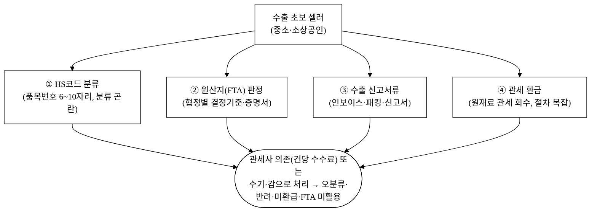
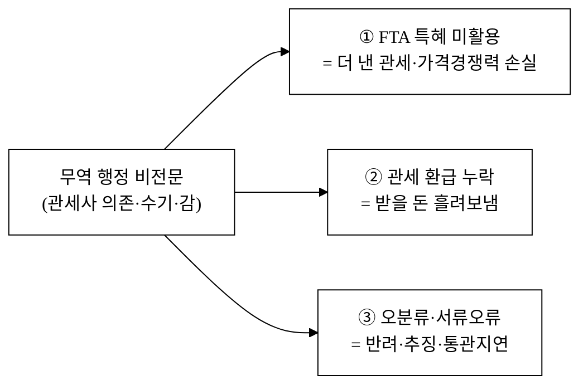
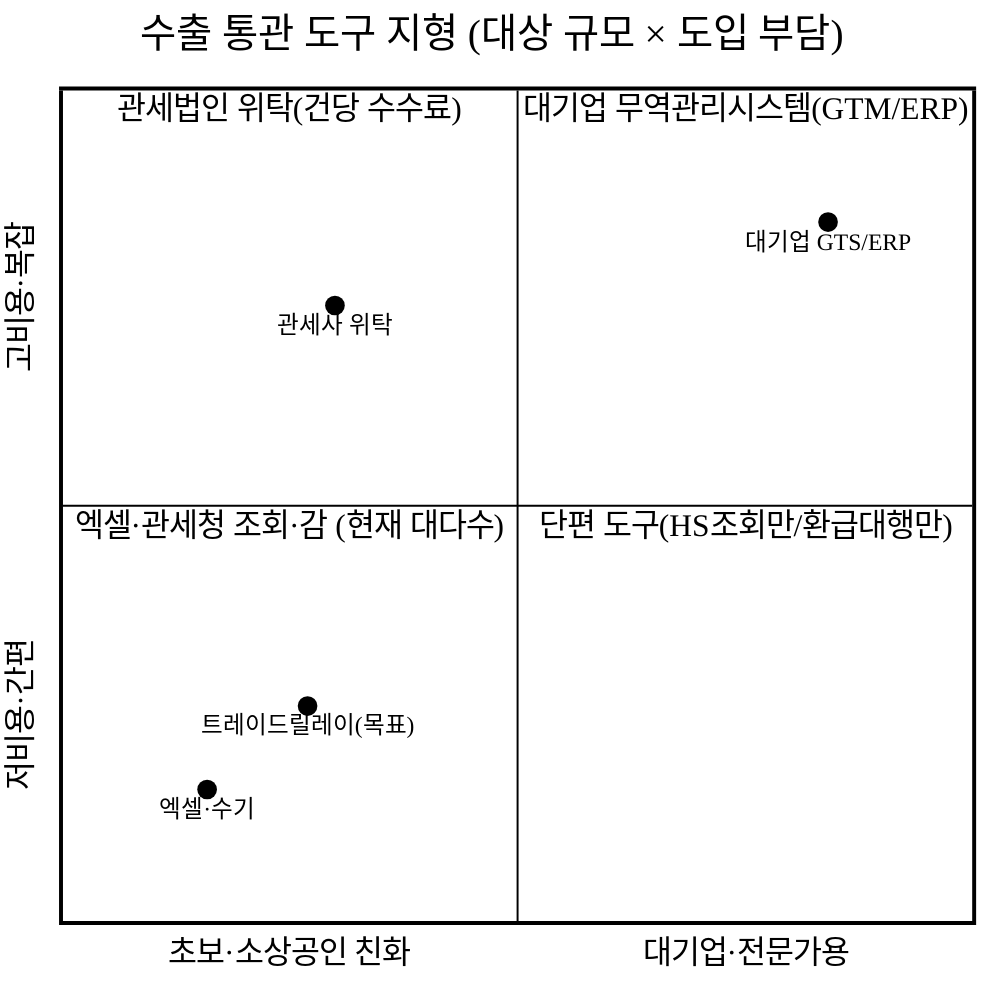
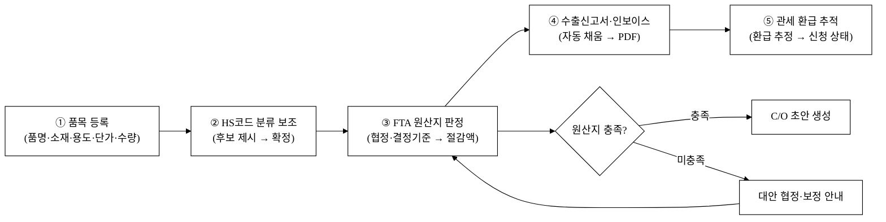
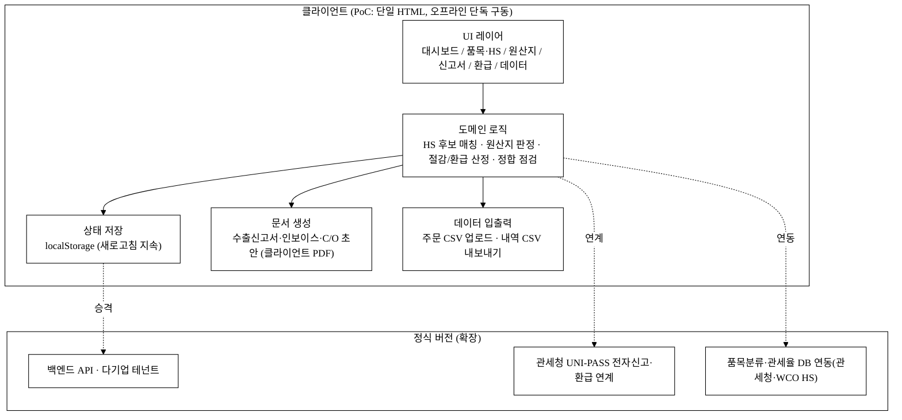
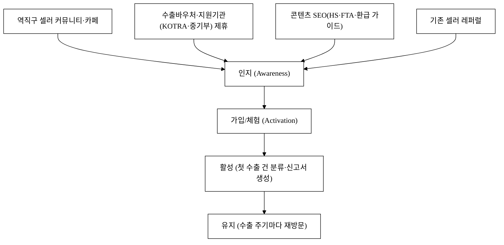
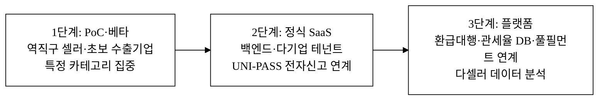

last_updated: 2026-06-25 13:30

# 트레이드릴레이 — 수출 중소기업 통관·관세 자동화 SaaS

> 본 제안서는 공고가 요구하는 PSST(Problem · Solution · Scale-up · Team) 구조를 따른다.
> 그림자료는 학술 논문 형식·흑백(monochrome)으로 통일한다(레포 `CLAUDE.md` §2.0).
> Team 섹션은 골격만 두고 내용은 사용자가 직접 채운다([§Team](#4-team--팀)).

| 항목 | 내용 |
|:---|:---|
| 사업명 | <TODO: 사용자 입력 (공고 기재)> |
| 주관기관 | <TODO: 사용자 입력> |
| 트랙 | 실전창업 (창업동아리) |
| 일정 | <TODO: 사용자 입력> |
| 아이템 | 수출 중소기업 통관·관세 자동화 SaaS 「트레이드릴레이(TradeRelay)」 |
| 타깃 | 수출 초보 중소·소상공인(직접수출 초기 기업)·이커머스 역직구 셀러 — HS코드 분류·원산지(FTA) 판정·수출 신고서류·관세 환급을 관세사 의존/수기로 처리하는 곳 |
| 산출물 | 웹 기반 통관·관세 자동화 PoC(HS코드 분류 보조 → FTA 원산지 판정 → 수출신고서 자동생성 → 관세 환급 추적) |

---

## 1. Problem — 문제

### P-1. "물건은 팔았는데, 서류에서 막힌다" — 수출 초보의 통관 장벽

대한민국 수출의 저변은 빠르게 넓어지고 있다. 2024년 수출 중소기업은 **95,905개사**로 역대 최대 수준이며, 중소기업 수출액은 1,151억 달러에 달했다[^1]. 특히 이커머스를 통한 비대면 수출이 폭발한다 — 중소기업 온라인 수출은 처음으로 10억 달러를 넘었고(+32.3%), 국내 온라인 총수출의 **73.2%**를 중소기업이 차지한다[^1]. 관세청 집계로도 전자상거래 수출은 2024년 6월 누계 **3,455만 건(+20%)**으로 급증했다[^28]. 화장품·패션·식품을 들고 아마존·쇼피·자체몰로 나가는 **1인·소상공인 셀러**가 수출의 새로운 주역이 되고 있다.

문제는 이 신규 수출자 대다수가 **무역 행정의 초보**라는 점이다. 물건을 만들고 파는 일은 잘하지만, 그 물건이 국경을 넘는 순간 마주치는 네 가지 서류 관문 — **HS코드 분류, 원산지(FTA) 판정, 수출 신고서류, 관세 환급** — 은 전문 영역이다. 대형 수출기업은 전담 무역팀·관세사를 두지만, 초보 셀러는 그렇지 못해 매 건마다 다음처럼 막힌다.

**그림 1.** 수출 초보 셀러가 매 건 마주치는 네 가지 서류 관문과 누적 손실.

### P-2. 세 가지 손실 — 더 낸 세금·못 받은 환급·놓친 특혜

이 장벽은 추상적 불편이 아니라 **측정 가능한 손실**로 나타난다.

- **FTA 특혜관세 미활용 = 안 내도 될 관세:** 한국은 발효 FTA **23건·60개국**의 거대한 특혜 네트워크를 갖췄다[^9]. FTA를 활용하면 상대국 수입관세를 0%까지 낮출 수 있어 가격경쟁력이 직결된다. 그러나 활용에는 **원산지(해당 물품이 한국산인지)** 를 협정별 결정기준에 맞춰 판정하고 원산지증명서(C/O)를 갖춰야 한다. 관세청 집계로 FTA 수출 활용률은 2024년 2분기 **85.7%**까지 올랐지만[^8], 협정·기업 규모별 격차가 크고[^11], 원산지 입증자료 구비 곤란은 중소수출기업 FTA 미활용의 **핵심 애로**로 지목된다[^16][^17]. 활용하지 못한 한 건마다 상대국에서 더 비싼 관세를 물거나, 가격경쟁력을 잃는다.
- **관세 환급 누락 = 받을 돈을 못 받음:** 수출용 원재료에 매겼던 관세는 수출이 완성되면 돌려받을 수 있다(관세 환급). 2025년 한 해 환급액은 **3조 6,270억 원**에 달했다[^18]. 그러나 환급은 소요량 산정·서류·신청 절차가 복잡해, 중소·초보 수출자는 **간이정액환급조차 신청하지 않아** 받을 돈을 흘려보낸다(간이정액환급 수혜는 중소기업 약 7천여 社, 연 약 1천억 원 규모에 그친다[^19]).
- **오분류·서류오류 = 반려·추징·지연:** HS코드(품목분류)는 관세율·FTA 적용·수출입 요건을 결정하는 출발점이다. 분류가 어려우면 관세평가분류원에 사전심사를 신청해 법적 효력 있는 품목번호를 받을 수 있으나, 절차·전문성 부담이 크다[^21]. 잘못 분류하면 관세 과·오납, 통관 지연, 사후 **추징** 으로 이어진다[^24]. 수출신고서·인보이스의 작은 불일치도 통관 보류·반려를 부른다.

**그림 2.** 무역 행정 비전문이 만드는 세 갈래 손실 구조.

### P-3. 기존 도구의 공백 — "관세사는 비싸고, 엑셀은 못 잡는다"

그렇다면 왜 도구를 쓰지 않을까. **수출 초보 중소·소상공인에 맞는 도구가 비어 있기 때문**이다.

**그림 3.** 수출 통관 도구 지형. 대기업 시스템은 과하고, 엑셀·감은 모자란 중간 지대가 비어 있다.

대기업용 무역관리시스템(GTS·ERP 무역모듈)은 가격·복잡도·도입 교육 부담이 초보 셀러에 과하다. 반대편엔 엑셀·관세청 홈페이지 조회·감(感)이 있는데, 이것들은 **HS 분류 → FTA 원산지 → 수출신고 → 환급**을 하나의 흐름으로 잇지 못한다. 그 사이에 HS코드만 검색해 주는 사이트, 환급만 대행하는 법인이 흩어져 있지만, **품목 입력 한 번으로 분류·원산지·신고서·환급이 한 흐름으로 채워지는** 도구는 비어 있다. 그림 3의 비어 있는 좌하단 중간 지대가 트레이드릴레이의 자리다. 정부도 이 구간을 인식해 원산지증명 간소화[^38]·K-역직구 통관부담 완화[^39]·간이수출신고 기준 상향[^29] 등 제도를 푸는 중이라, **도구로 받쳐줄 타이밍**이 왔다.

---

## 2. Solution — 솔루션

### S-1. 트레이드릴레이 한 줄 정의

> **트레이드릴레이는 품목 정보를 한 번 입력하면 HS코드 분류·FTA 원산지 판정·수출신고서·관세 환급이 하나의 흐름으로 이어지는, 수출 초보 중소·소상공인을 위한 가장 가벼운 통관·관세 자동화 SaaS다.**

대기업 무역시스템의 모든 기능을 넣지 않는다. 초보 셀러가 **매 수출 건마다 실제로 반복하는 네 관문**만 정확히, 빠르게, 근거가 남게 처리한다. 이름 그대로 한 단계의 결과(품목·HS)가 다음 단계(원산지·신고서·환급)로 **릴레이(relay)** 된다.

### S-2. 핵심 기능 (PoC에서 실 동작 목표)

| 기능 | 무엇을 해결 | PoC 구현 방향 |
|:---|:---|:---|
| ① 수출 대시보드 | "지금 내 수출 건은 어디까지 됐나?"를 한눈에 | 진행 단계별 건수·미환급 금액·FTA 절감액 KPI + 추세 |
| ② 품목·HS코드 분류 보조 | 품목 설명 → 후보 HS코드 제시 | 키워드 룰·점수 매칭으로 후보 HS 6/10자리 + 신뢰도 + 휴먼검수 확정 |
| ③ FTA 원산지 판정 | 어느 협정으로 관세를 얼마나 아끼나 | 협정 선택 → 결정기준 체크 → 충족 여부·절감액 산정 → C/O 초안 |
| ④ 수출신고서 자동생성 | 신고서·인보이스를 다시 안 적게 | 품목·금액·원산지 자동 채움 → 수출신고서·커머셜 인보이스 PDF |
| ⑤ 관세 환급 추적 | 받을 돈을 빠짐없이 받게 | 수출 완료 건 → 간이정액환급 추정액 산정 → 신청 상태 추적 |
| ⑥ 데이터 입출력 | 셀러 주문·품목을 한꺼번에 | 주문 CSV 업로드 → 일괄 분류, 신고·환급 내역 CSV 내보내기 |

### S-3. 핵심 워크플로 — 한 번 입력, 네 관문이 릴레이된다

트레이드릴레이의 차별점은 개별 기능이 아니라 **한 번의 품목 입력이 어디까지 흐르는가**다. 셀러가 수출할 품목을 등록하면 그 데이터가 HS 분류 → FTA 원산지 → 수출신고서 → 환급 추적으로 끊김 없이 이어진다.

**그림 4.** 트레이드릴레이 핵심 워크플로 — 품목 1회 등록이 분류·원산지·신고서·환급으로 릴레이된다.

그림 4의 다단계 워크플로(품목→HS→원산지→신고서→환급)는 PoC에서 토스트 mock 이 아니라 **실제 상태 전이**로 구현하는 것을 목표로 한다 — 품목 등록 시 로컬 저장소가 갱신되고, 새로고침해도 유지되며, 신고서·C/O·환급명세는 실제로 생성·PDF 출력된다(개발결과보고서 v1 에서 입증 예정).

### S-4. 시스템 아키텍처 (PoC)

PoC 는 **오프라인 단독 구동**을 원칙으로 한다(심사·시연 환경에서 인터넷·서버 없이 동작). 관세청 UNI-PASS 전자통관[^33]·품목분류 API 등 외부 연계는 **키 부재 시 mock 응답**으로 통과시킨다(`CLAUDE.md` §3.1·§3.4). 정식 버전은 동일 데이터 모델을 백엔드로 승격하고 UNI-PASS 전자신고·환급과 연계한다.

**그림 5.** PoC 아키텍처와 정식 버전 확장 경로. PoC 는 단일 HTML·오프라인으로 자체 완결하고, 동일 데이터 모델을 백엔드·UNI-PASS 연계로 승격한다.

---

## 경영혁신·창업학적 프레임워크

본 사업은 단순한 "통관 프로그램"이 아니라, **비어 있는 시장 구간을 새로운 가치 곡선으로 여는 시도**다. 세 가지 학술·경영 이론으로 정당화한다.

### (1) Christensen 파괴적 혁신 — 비소비 고객에서 시작

Clayton Christensen 의 파괴적 혁신(Disruptive Innovation) 이론[^c1]은, 기존 강자가 외면하는 **과소만족·비소비(non-consumption) 고객**에서 출발해 주류로 올라오는 혁신을 설명한다. 대기업 무역시스템·관세법인은 상위 고객(대량 수출기업)을 향하며, 건당 수수료를 감당 못 하는 초보 셀러는 아예 도구를 안 쓰는 **비소비 상태**에 머문다(그림 3). 트레이드릴레이는 바로 이 비소비 구간을 "충분히 좋고, 충분히 싸고, 충분히 간단한" 도구로 점유한 뒤, 데이터·연계 기능을 쌓아 위로 올라가는 전형적 파괴 경로에 있다. 대형 무역솔루션 업체는 이 저가 구간을 내려와 만들 동기가 약하다(비대칭 동기).

### (2) Kim·Mauborgne 블루오션 — 가치 곡선 재설계

블루오션 전략(Blue Ocean Strategy)의 ERRC 격자[^c2]로 본 사업의 가치 곡선을 재설계한다.

| 격자 | 적용 |
|:---|:---|
| 제거(Eliminate) | 대기업 GTS 식 복잡 무역모듈, 건당 관세사 위탁 전제 |
| 감소(Reduce) | 도입 교육 시간, 초기 비용, 서류 재입력 |
| 증가(Raise) | HS·원산지의 셀프서비스 가능성, FTA 절감·환급 가시성 |
| 창조(Create) | "1회 품목 입력 → 분류·원산지·신고서·환급 동시 릴레이" 단일 흐름 |

**표 1.** 블루오션 ERRC 격자 — 트레이드릴레이의 가치 곡선 재설계.

표 1처럼, 경쟁의 축(기능 풍부함·관세 전문성)을 따라가지 않고 **간편함·정합성·절감 가시성**이라는 다른 축으로 곡선을 옮긴다.

### (3) Ries 린 스타트업 + JTBD — 검증 가능한 가설

본 PoC 자체가 린 스타트업(Lean Startup)[^c3]의 MVP 다. "품목 1회 입력으로 분류·원산지·신고서·환급이 채워지면 셀러가 돈을 낼 것"이라는 가설을, 실제 셀러에서 측정 가능한 지표(FTA 절감액, 환급 회수액, 신고서 작성시간)로 검증한다. 고객이 진짜 해결하고 싶은 일(Jobs To Be Done)[^c4]은 "프로그램을 쓰는 것"이 아니라 **"관세를 덜 내고, 받을 환급을 빠짐없이 받고, 서류에서 막히지 않는 것"**이다. 트레이드릴레이의 기능은 모두 이 세 Job 으로 환원된다.

> 연결: 블루오션 = 차별성(§차별성), 린스타트업·JTBD = 고객확보·구매동인(§GTM·§구매동인 논증).

---

## 고객확보(GTM)

### G-1. ICP (이상적 고객 프로파일)

| 축 | 1차 ICP | 비고 |
|:---|:---|:---|
| 유형 | 이커머스 역직구 셀러·직접수출 초기 중소기업 | 화장품·패션·식품·생활용품 |
| 규모 | 연 수출 소액~중간, 전담 무역인력 없음 | 대표가 직접 통관 챙기는 구간 |
| 의사결정자 | 대표(셀러 본인) | 관세·환급 손실의 직접 책임자 |
| 사용자 | 대표·운영담당 1~2인 | 매 수출 건을 직접 처리 |
| 페인 강도 | FTA 미활용·환급 미신청·반려 경험 | "지금 손해 보는" 셀러 우선 |

### G-2. 채널별 전술

**그림 6.** 인지 → 활성 → 유지 퍼널과 채널.

- **오가닉·콘텐츠:** "내 제품 HS코드 찾는 법", "FTA로 관세 0% 만드는 법", "수출 관세 환급 신청법" 같은 실무 가이드 콘텐츠로 셀러 검색 유입을 만든다. 이들은 수출 직전 반드시 검색한다.
- **제휴·생태계:** 수출바우처 수행기관, KOTRA·중기부 수출지원 프로그램, 셀러 교육·풀필먼트 업체와 제휴해 입점한다. 역직구 셀러는 이미 모여 있는 커뮤니티(카페·오픈채팅·MD 모임)가 있어 접점이 좁고 촘촘하다.
- **레퍼럴:** "FTA로 관세 얼마 아꼈다", "환급 N십만원 받았다"는 경험은 셀러 사이에서 빠르게 전파된다(절감·환급은 숫자로 자랑 가능 → 강한 입소문).

### G-3. 첫 100 / 첫 1,000 셀러 확보 계획

- **첫 100 셀러:** 무료 베타로 특정 카테고리(예: 화장품·패션 역직구) 셀러 커뮤니티에 직접 진입. 한 셀러를 깊게 성공시켜 레퍼런스(관세 −N%·환급 +N원·신고서 시간 −N분)를 만든다. [추정] 초기 6~12개월 목표.
- **첫 1,000 셀러:** 레퍼런스 + 수출지원기관 제휴 + 콘텐츠 유입을 결합해 확장. 수출은 **반복 발생**하는 행위라 한 번 정착하면 매 건 재방문한다.

### G-4. CAC·리텐션 가설

- **예상 CAC:** PLG(제품주도성장)·콘텐츠·커뮤니티 비중을 높여 셀러당 획득비용을 낮춘다. 구체 수치는 베타 후 실측. [추정]
- **리텐션 가설:** 수출은 **매 주문·매 분기 반복**된다. 한 번 셀러의 품목·HS·원산지 데이터가 쌓이면 다음 건은 클릭 몇 번으로 끝나 교체 비용이 커진다 → 높은 그로스 리텐션을 기대(§차별성 전환비용 항목과 연결).

---

## 수익모델

### R-1. 수익원

| 수익원 | 내용 |
|:---|:---|
| ① 셀러 구독(SaaS) | 사업자 단위 월정액 — 수출 건수·기능 티어별 |
| ② 서류 건당 과금 | 무료 한도 초과 시 수출신고서·C/O 건당 과금(종량) |
| ③ 부가 모듈 | 환급 대행 연계·심화 HS 사전심사 지원·다국가 관세율 비교 |
| ④ B2B 라이선스 | 풀필먼트·셀러 에이전시·수출지원기관 대상 화이트라벨·API |

핵심은 **반복되는 통관 행정을 대신해 주는 대가로 정액 구독 + 건당 종량**을 받는 모델이다. 거래액 자체에 수수료를 매기지 않아 셀러의 거부감을 낮춘다.

### R-2. 가격 정책 (시나리오 수치 — 전부 [추정])

초보 셀러가 "관세사는 부담된다"고 느낀 비용 장벽을 넘지 않도록, **월 구독액이 FTA 절감 1~2건·환급 1건 회수보다 작게** 설계한다. 아래 절대 금액은 **베타 가격 실험 전 자체 추정값**이며 공식 수치와 섞지 않는다(`[추정]`, [§데이터 정직성](#데이터-정직성-선언)).

| 티어 | 대상 | 월 구독액(사업자 단위) [추정] | 비고 |
|:---|:---|---:|:---|
| Free | 입문 셀러 | 0원 | HS 분류 보조·월 신고서 N건 |
| Starter | 소상공인 셀러 | 39,000원 | + FTA 원산지 판정·신고서 무제한 |
| Growth | 성장 셀러 | 79,000원 | + 환급 추적·CSV 일괄·C/O 초안 |
| Pro/B2B | 에이전시·수출지원 | 별도 견적 | 화이트라벨·API·다계정 |

기준 ARPA(셀러당 월평균 구독액)는 **Growth 티어 79,000원/월(연 948,000원)** 으로 잡는다(이하 단위경제성 기준값). [추정]

### R-3. 단위경제성 (시나리오 1세트 — 전부 [추정])

아래 절대값은 **베타 실측 전 자체 추정**이며, 위 기준 ARPA(79,000원/월)와 SaaS 표준 가정에서 산식으로 도출했다. 검증된 외부 수치와 섞지 않는다([§데이터 정직성](#데이터-정직성-선언)). 가정은 셀에 명시했다.

| 지표 | 산식 | 값 [추정] |
|:---|:---|---:|
| ARPA | 기준 티어 월 구독액 | 79,000원/월 |
| 기여이익률 | SaaS 한계비용 낮음 가정 | 82% |
| 월 기여이익 | ARPA × 기여이익률 = 79,000 × 0.82 | 64,780원/월 |
| 평균 유지개월 | 월 이탈률 2.5% 가정 → 1÷0.025 | 40개월 |
| **LTV** | 월 기여이익 × 유지개월 = 64,780 × 40 | **약 259만원** |
| **CAC** | PLG·콘텐츠·커뮤니티 혼합 가정 | **약 35만원/셀러** |
| **LTV/CAC** | 259만 ÷ 35만 | **약 7.4배** (목표 3↑ 충족) |
| **회수기간** | CAC ÷ 월 기여이익 = 350,000 ÷ 64,780 | **약 5.4개월** |

**표 2.** 단위경제성 시나리오(기준 티어, 전부 [추정] — 베타 실측으로 대체). 핵심 가정: 월 이탈률 2.5%, 기여이익률 82%, CAC 35만원/셀러.

### R-4. 매출 시나리오 (3안, 절대값 — 전부 [추정])

24개월차 유료 셀러 수 × 기준 ARPA(79,000원/월) 기준 연환산 ARR 로 환산했다. 셀러 수·전환율은 자체 추정이며 베타 실측으로 대체한다([추정], 산식 명시).

| 시나리오 | 24개월차 유료 셀러 [추정] | 연환산 ARR(셀러수 × 79,000 × 12) [추정] | 가정 |
|:---|---:|---:|:---|
| 보수 | 600명 | 약 5.7억원 | 커뮤니티 한정·저속 확산, 제휴 지연 |
| 기본 | 1,500명 | 약 14.2억원 | 콘텐츠+제휴+레퍼럴 결합 정상 확산 |
| 공격 | 4,000명 | 약 37.9억원 | 풀필먼트·수출지원기관 화이트라벨 조기 체결로 견인 |

**표 2-1.** 매출 시나리오(24개월차 ARR, 전부 [추정]). 산식: 유료 셀러 수 × 79,000원/월 × 12개월. 셀러 수 절대값은 베타 가격·전환율 실측 후 확정한다(현 단계 창작 금지, [§데이터 정직성](#데이터-정직성-선언)).

---

## 차별성·경쟁우위(Moat)

### M-1. 경쟁자 비교

| 구분 | 엑셀·관세청 조회·감 | HS조회/환급대행 단편 | 관세법인 위탁 | 대기업 GTS/ERP | **트레이드릴레이** |
|:---|:---|:---|:---|:---|:---|
| 대상 | 모든 영세 셀러 | 단일 기능 | 일정 규모 이상 | 대량 수출기업 | 수출 초보 중소·소상공인 |
| HS 분류 | 수기 검색·감 | 조회만 | 대행(수수료) | 복잡·전문가용 | 후보 제시 + 휴먼검수 확정 |
| FTA 원산지 | 직접 판정 난해 | 없음 | 대행 | 과함 | 결정기준 체크 → 절감액·C/O |
| 수출신고서 | 매번 재입력 | 없음 | 대행 | 전문가 입력 | 자동 채움 → PDF |
| 관세 환급 | 미신청 방치 | 대행(성공보수) | 대행 | 별도 | 추정·신청 추적 |
| 도입 부담 | 0(이지만 손실 큼) | 낮음(단편) | 건당 비용 | 매우 높음 | 낮음(오프라인 단독 시연) |

**표 3.** 직접·간접 경쟁자 비교. 트레이드릴레이는 "1회 입력 → 분류·원산지·신고서·환급 동시 릴레이"를 단일 흐름으로 묶는 유일한 위치다.

### M-2. 차별점 50+ 도출

차별점을 **8개 카테고리(기술·데이터·운영·규제·가격·GTM·네트워크효과·UX)**로 묶어 50개 이상 도출한다. 각 항목은 *경쟁사 현황 → 우리 차별점 → 고객 가치*로 정리한다. 핵심 항목은 §구매동인 논증으로 연결한다. 가치 수치 중 검증 전 자체 추정은 `[추정]`으로 표기한다(부풀리기 금지, `CLAUDE.md` §2.6).

**표 4.** 차별점 도출 (현재 52개 / 목표 50+).

| # | 카테고리 | 경쟁사 현황 | 우리 차별점 | 고객 가치 |
|---:|:---|:---|:---|:---|
| 1 | 기술 | HS·원산지·신고서 분리 | 1회 입력 → 4관문 릴레이 | 재입력 노동 제거 |
| 2 | 기술 | HS 수기 검색 | 키워드 룰·점수 후보 제시 | 분류 속도·근거 ↑ |
| 3 | 기술 | 분류 확정 근거 없음 | 후보별 신뢰도·사유 표기 | 오분류 위험 ↓ |
| 4 | 기술 | 원산지 판정 난해 | 협정별 결정기준 체크리스트화 | FTA 셀프 판정 가능 |
| 5 | 기술 | 절감액 불가시 | FTA 적용 전후 관세 비교 산정 | 절감 가시화 [추정] |
| 6 | 기술 | 신고서 매번 재작성 | 품목·금액 자동 채움 PDF | 작성시간 ↓ |
| 7 | 기술 | C/O 외주·수기 | C/O 초안 자동 생성 | 증명서 즉시 |
| 8 | 기술 | 환급 미신청 방치 | 간이정액환급 추정·추적 | 받을 돈 회수 |
| 9 | 기술 | 서버·설치형 | 단일 HTML 오프라인 단독 구동 | 인터넷 없이 시연·운영 |
| 10 | 기술 | 새로고침 시 유실 | localStorage 상태 지속 | 데이터 안전 |
| 11 | 기술 | 단일 화면 표시 | 다단계 상태 전이 워크플로 | 처리 흐름화 |
| 12 | 기술 | 정합 검증 없음 | 신고 전 항목 정합 자동 점검 | 반려 ↓ |
| 13 | 데이터 | 데이터 자산화 안 됨 | 품목·HS·원산지 구조화 축적 | 다음 건 재사용 |
| 14 | 데이터 | 품목 매번 새로 | 품목 마스터 재사용 | 반복 입력 0 |
| 15 | 데이터 | 협정별 비교 불가 | 다협정 절감 비교 | 최적 협정 선택 |
| 16 | 데이터 | 환급 누락 인지 못함 | 미환급 건 자동 집계 | 누수 방지 |
| 17 | 데이터 | 수출 이력 단절 | 건별 진행 타임라인 | 상태 추적 |
| 18 | 데이터 | 통관 오류 반복 | 오류 패턴 축적·경고 | 재발 방지 |
| 19 | 데이터 | CSV 단절 | 주문 CSV 일괄 분류 | 대량 처리 |
| 20 | 데이터 | 내보내기 불가 | 신고·환급 CSV 내보내기 | 회계 연계 |
| 21 | 운영 | 관세사 의존 | 셀프서비스 + 필요 시 위탁 연계 | 비용·속도 양립 |
| 22 | 운영 | 건마다 처음부터 | 템플릿·이력 기반 반복 | 운영 표준화 |
| 23 | 운영 | 담당 부재 리스크 | 누구나 따라 하는 가이드 흐름 | 인력 의존 ↓ |
| 24 | 운영 | 마감 임박 야근 | 상시 신고서 적립 | 업무 평준화 |
| 25 | 운영 | 누락 사람이 점검 | 미신고·미환급 자동 알림 | 완결성 ↑ |
| 26 | 운영 | 환급 시점 놓침 | 환급 기한 추적 | 기한 미스 ↓ |
| 27 | 운영 | 다국가 대응 산발 | 협정·국가 선택 흐름 통합 | 다국가 수출 용이 |
| 28 | 운영 | 도입 교육 수일 | 단계형 UX로 교육 최소화 | 도입 마찰 ↓ |
| 29 | 운영 | 서류 보관·분실 | 디지털 보관·검색 | 자료 분실 0 |
| 30 | 운영 | 1인 셀러 과부하 | 핵심 단계만 안내 | 소상공인 친화 |
| 31 | 규제 | 품목분류 규정 수동 대응 | HS·관세율 갱신 구조 | 규정 적합성 |
| 32 | 규제 | 원산지 입증 곤란 | 결정기준·입증서류 체크 | 사후검증 대비[^16] |
| 33 | 규제 | 신고 보존의무 수기 | 보존 친화 디지털 기록 | 법적 증빙력 |
| 34 | 규제 | 추징 리스크 방치 | 분류·신고 근거 보존 | 추징 분쟁 대비[^24] |
| 35 | 규제 | 전자신고 미대응 | 정식판 UNI-PASS 연계 경로[^33] | 미래 규제 대비 |
| 36 | 규제 | 간이신고 변화 대응 지연 | 기준 상향 반영 구조[^29] | 제도 변화 적응 |
| 37 | 가격 | 관세사 건당 비용 | 정액 구독 + 건당 종량 | 예측 가능 비용 |
| 38 | 가격 | 거래액 수수료 거부감 | 거래액 무수수료 | 신뢰·비용 통제 |
| 39 | 가격 | 모듈 끼워팔기 | 필요 모듈 선택 | 비용 효율 |
| 40 | 가격 | 초기 도입비 부담 | 무료 티어·오프라인 시연 | 위험 없는 체험 |
| 41 | 가격 | 가격 불투명 | 티어·종량 명시 | 의사결정 용이 |
| 42 | GTM | 일반 SaaS 광고 | 셀러 커뮤니티·수출지원 제휴 | 신뢰 기반 획득 |
| 43 | GTM | 일반 콘텐츠 | HS·FTA·환급 실무 SEO | 정확 타깃 유입 |
| 44 | GTM | 광범위 영업 | 수출 직전 타이밍 유입 | 전환율 ↑ |
| 45 | GTM | 단발 판매 | 절감·환급 자랑 레퍼럴 루프 | CAC ↓ |
| 46 | 네트워크효과 | 단일 셀러 폐쇄 | 품목·HS 결정 데이터 누증 | 분류 정확도 ↑ |
| 47 | 네트워크효과 | 데이터 고립 | 표준 품목·HS 매핑 축적 | 후발 추격비용 ↑ |
| 48 | 네트워크효과 | 교체 자유 | 품목·이력 누적 전환비용 | 락인(lock-in) |
| 49 | UX | 전문가용 복잡 | 비전문가 셀러 친화 | 학습비용 ↓ |
| 50 | UX | 데스크톱 전제 | 모바일·PC 반응형 | 현장·이동 중 처리 |
| 51 | UX | 정보 과밀 화면 | 단계별 핵심만 노출 | 인지부하 ↓ |
| 52 | UX | 텍스트 위주 | 절감·미환급 시각 강조 | 기회 인지 ↑ |

> 표 4의 52개 중 사소·중복·억지 항목으로 수를 채우지 않았다. 가치가 약하거나 검증 전인 수치는 `[추정]` 또는 "↓/↑" 방향 표기로만 두고, 검증된 외부 수치와 섞지 않았다([§데이터 정직성](#데이터-정직성-선언)).

### M-3. 방어가능성(해자)

- **전환비용:** 셀러의 품목·HS·원산지·수출 이력이 누적될수록 다른 도구로 옮기는 비용이 커진다(표 4 #48). 수출은 반복되므로 이탈 시 매 건 재입력 부담이 발생한다.
- **데이터·네트워크 효과:** 셀러들이 확정한 품목→HS 매핑·원산지 결정이 표준 데이터로 쌓이면 분류 정확도가 올라가고, 후발주자가 단기간에 모으기 어렵다(#46·#47).
- **규제 해자:** 원산지 입증·품목분류·전자신고 의무에 친화적으로 설계된 구조는 규정이 강화될수록 오히려 진입장벽이 된다(#31~#36).

### M-4. Why us / Why now

- **Why now:** 역직구·이커머스 수출이 폭증(전자상거래 수출 +20%[^28], 중기 온라인수출 첫 10억$[^1])하면서 **무역 행정 초보 셀러가 대량 유입**되는데, 정부도 원산지 간소화[^38]·역직구 통관완화[^39]·간이신고 상향[^29]으로 문턱을 낮추는 중이다. "엑셀·감으로 버티기"의 한계가 임계에 왔다.
- **Why us:** 대기업 무역시스템의 복잡함을 버리고 **초보 셀러가 매 건 하는 4관문**만 1회 입력으로 릴레이하는 좁고 깊은 설계 — 큰 무역솔루션·관세법인은 이 저가·간편 구간을 내려와 만들 동기가 약하다(Christensen 비대칭 동기, §프레임워크).

---

## 차별화 기술의 구매동인 논증

차별점을 나열하는 데 그치지 않고, 그것이 **셀러가 실제로 돈을 내고 매 수출 건마다 쓰게 만드는 동인인지**를 논증한다.

### ① 구매동인 가설 (must vs nice)

| 차별점 | 건드리는 JTBD | must / nice | 근거 |
|:---|:---|:---|:---|
| FTA 원산지 판정·절감 산정 (#4·#5·#15) | "관세를 덜 내기" | **must-have** | FTA 미활용 = 더 낸 관세·가격경쟁력 손실[^8][^16] |
| 관세 환급 추정·추적 (#8·#16·#26) | "받을 환급을 빠짐없이 받기" | **must-have** | 미신청 환급 = 흘려보낸 현금[^18][^19] |
| HS 분류 보조·정합 점검 (#2·#3·#12) | "반려·추징당하지 않기" | must-have 경계 | 오분류 = 추징·통관지연[^21][^24] |
| 신고서 자동생성 (#6·#7) | "서류 재입력 줄이기" | nice-to-have(촉진제) | 도입·정착 마찰을 낮추는 인에이블러 |

핵심 동인은 **FTA 관세 절감**과 **환급 회수** 두 가지 must-have(돈이 직접 오가는 항목)다. 신고서 자동화·간편 입력은 그 자체로 결제를 일으키기보다 **정착·유지**를 돕는 촉진제다(정직한 분류).

### ② 크기 정량화 (고객 언어의 금액 — 전부 [추정])

차별점이 만드는 가치를 셀러가 체감하는 **금액**으로 환산한다. 아래는 월 수출 약 2,000만원(역직구 소상공인 가정) 셀러 기준 **자체 추정**이며, 베타 셀러 인터뷰·실측으로 검증해 `5_research/`에 추가한다(검증 전 `[추정]` 유지, 공식 수치와 혼용 금지).

- **FTA 절감 측:** 월 수출 2,000만원 품목의 상대국 수입관세가 5%이고 FTA로 0%가 된다면, 한 달 절감은 **약 −100만원/월**(상대국 바이어의 관세 부담을 낮춰 가격경쟁력으로 환산) [추정]. 활용률 격차[^11]를 고려하면 미활용 셀러가 잃는 금액은 작지 않다. 이 절감의 일부만 가시화·확정해도 월 구독액(79,000원)을 **수 배~수십 배 상회**한다.
- **환급 회수 측:** 수출용 원재료에 낸 관세를 간이정액환급으로 회수하면, 셀러는 신청만으로 현금을 돌려받는다. 미신청 시 0원이다. 환급 추정·추적 기능이 **월 N만원**의 회수를 새로 일으킨다고 가정하면(품목·원가에 따라 변동, [추정]), 그 자체로 구독 ROI 가 양(+)이 된다.
- **신고서 시간 절감:** 수출신고서·인보이스를 매 건 수기로 30~40분 작성하던 것을, 자동 채움으로 **건당 −20분** 줄인다고 가정(월 10건 = −200분 ≈ −3.3시간) [추정]. 시급 환산 시 부차적이지만 정착을 돕는다.
- **합산 ROI(기준 셀러):** FTA 절감 + 환급 회수만으로도 월 구독 7.9만원을 **여러 배 상회**할 개연성이 크다 [추정]. 절감·환급은 **수출할 때마다 반복**되므로 누적 가치가 전환 마찰(학습·습관 변경)을 넘어선다("10배 규칙"에 근접). 위 절대값은 [추정]이며, 실증은 베타 KPI(절감액·환급 회수액)로 확인한다.

### ③ 외부 근거

위 주장의 토대(수출 중소기업 규모·FTA 발효·활용률·관세 환급 규모·전자상거래 수출 급증)는 모두 `5_research/`의 공식 출처[^1][^8][^9][^18][^19][^28]로 연결한다. **구매동인의 핵심 가치(셀러별 절감액·환급액 절대값)는 현재 자체 추정**이며, FTA 활용률[^8]·환급 총규모[^18]·간이정액환급 구조[^19] 같은 공식 수치를 토대로 셀러 수출 규모를 곱해 도출했다. 절대값은 베타 셀러 인터뷰·실측으로 검증해 `5_research/`에 추가하며, 검증 전에는 `[추정]`을 유지하고 공식 수치와 섞지 않는다.

### ④ 반증·대안 위협 직시

- **"관세사 한 번 쓰면 된다"(관성):** 큰 거래는 관세사가 정확하다. 단, **건당 수수료가 부담되는 소액·반복 역직구**에서는 셀프서비스 ROI 가 크다 → 그 구간을 타깃한다. 큰 건은 위탁 연계로 보완(#21).
- **"FTA 절감이 내 품목엔 작다":** 품목·상대국에 따라 절감이 미미할 수 있다 → 절감액을 **먼저 계산해 보여주고**, 작으면 솔직히 작다고 표시한다(과장 금지). 환급·신고서 시간 절감으로 보완.
- **"무료 조회 사이트로 충분":** HS 조회·환급 계산기는 흩어져 있으나, **4관문을 한 흐름으로 잇고 데이터를 재사용**하는 가치가 차별점(#1·#13·#14). 단편 도구는 매번 처음부터다.
- **"관세청/대형 업체가 비슷한 걸 줄 수 있다":** 가능하나, 저가·간편 셀러 구간은 대형 업체 동기가 약하고(Christensen), 품목·HS 데이터·전환비용 해자가 시간이 갈수록 쌓인다(§M-3).
- **정직한 결론:** 신고서 자동화·간편함만으로는 결제를 끌어내기 약하다. **결제를 일으키는 진짜 동인은 FTA 관세 절감과 환급 회수라는 돈**이며, 본 사업은 거기에 핵심을 둔다.

### ⑤ 데모 정합

위 구매동인은 PoC 데모(`projects/`)에서 **실제로 구현·시연**하는 것을 목표로 한다 — 품목 입력 → HS 분류 → 원산지 판정·**절감액 계산**(그림 4) → 신고서/C/O PDF → **환급 추정·추적**. 논증과 산출물이 같은 흐름을 가리킨다.

---

## 3. Scale-up — 성장

### SU-1. 단계별 확장

**그림 7.** 3단계 성장 경로. PoC 에서 검증한 단일 흐름을 백엔드·연계로 승격하고, 데이터·생태계로 확장한다.

- **1단계(PoC·베타):** 본 사업 범위. 단일 흐름의 가치를 특정 셀러 카테고리에서 실증.
- **2단계(정식 SaaS):** 동일 데이터 모델을 백엔드로 승격, 다기업 테넌트·UNI-PASS 전자신고·관세율 DB 연계(그림 5의 확장부).
- **3단계(플랫폼):** 환급대행·풀필먼트·셀러 에이전시 연계, 다셀러 표준 품목·HS 데이터 기반 분류 고도화로 데이터 해자 강화.

### SU-2. 시장 규모(방향)

수출 중소기업 95,905개사[^1]·전자상거래 수출 3,455만 건(+20%)[^28]이라는 구조적 수요 위에, 초보 셀러 구간의 미충족(그림 3)이 SOM 의 출발점이다. 시장 규모의 **하향식(top-down) 추정 프레임**은 다음과 같다(절대 금액은 가격·전환율 실측 후 확정, [§데이터 정직성](#데이터-정직성-선언)).

- **TAM:** 전국 수출 중소기업 95,905개사[^1] + 신규 진입 역직구 셀러 × 통관·관세 SaaS 연 구독액.
- **SAM:** 전담 무역인력 없는 역직구·초보 수출 셀러(ICP). 본 구간은 비소비 상태(그림 3)로 미충족이 가장 크다.
- **SOM:** 특정 카테고리(화장품·패션 등) 셀러 커뮤니티에서 무료 베타로 진입한 레퍼런스 셀러군 → 제휴·콘텐츠 확산.
- TAM/SAM/SOM 의 절대 금액은 R-4 가격·전환율 실측 후 산정한다([추정] 구간과 혼용 금지).

---

## 4. Team — 팀

> 본 섹션의 모든 셀은 사용자가 직접 채운다(`CLAUDE.md` §2.7). Claude 는 골격만 둔다 — 창작 금지.

| 역할 | 이름 | 소속/학과 | 담당(R&R) | 연락처 |
|:---|:---|:---|:---|:---|
| 대표 | <TODO: 사용자 입력> | <TODO: 사용자 입력> | <TODO: 사용자 입력> | <TODO: 사용자 입력> |
| 팀원 | <TODO: 사용자 입력> | <TODO: 사용자 입력> | <TODO: 사용자 입력> | <TODO: 사용자 입력> |
| 팀원 | <TODO: 사용자 입력> | <TODO: 사용자 입력> | <TODO: 사용자 입력> | <TODO: 사용자 입력> |
| 지도교수 | <TODO: 사용자 입력> | <TODO: 사용자 입력> | <TODO: 사용자 입력> | <TODO: 사용자 입력> |

**팀 소개·역할 분담·수상/활동 실적:** <TODO: 사용자 입력>

**협력 기관·MOU:** <TODO: 사용자 입력>

---

## 참고문헌

> **수집 현황: 본 제안서 직접 인용 14건(공식·1차 + 경영이론 4종) / 통합 출처 41 / 목표 1,000 (목표 미달, 정직 표기).** 아래 각주는 제안서 본문이 직접 인용한 1차·공식 출처이며, 모두 [`5_research/README.md`](./5_research/README.md)의 검증된 항목(실 URL·발표연월·수치)과 1:1로 대응한다. 전체 근거 출처는 README 에 **41건**(섹션 A~G)으로 통합돼 있고, 목표 1,000+ 는 추가 사이클로 누적 확보한다(현 진척 41/1,000도 정직 표기). 허위 충족·날조·중복 부풀리기 금지(`CLAUDE.md` §2.6).
>
> 통계·제도 인용은 README 각주 번호와 동일하게 매겼다([^1]~[^41] 중 본문 인용분). 경영이론 4종(파괴적 혁신·블루오션·린스타트업·JTBD)은 공인된 출판 저작이므로 서지를 직접 명시한다([^c1]~[^c4]).

[^1]: **중소벤처기업부 「2024년 중소기업 수출동향」** (2025.01). 수출 중소기업 95,905개사(+1.5%), 수출 1,151억 달러, 온라인수출 중기 비중 73.2%. (README §A #1) https://www.mss.go.kr/site/smba/ex/bbs/View.do?cbIdx=86&bcIdx=1056114&parentSeq=1056114
[^8]: **관세청 「FTA 수출 활용률」** (2024 2분기, 한국세정신문 인용). 수출 활용률 85.7%·수입 84.4%. (README §B #8) https://taxtimes.co.kr/news/article.html?no=266777
[^9]: **관세청 FTA포털 「FTA 발효현황」** (2026.05). 발효 FTA 23건·60개국. (README §B #9) https://www.customs.go.kr/ftaportalkor/cm/cntnts/cntntsView.do?mi=3310&cntntsId=986
[^11]: **관세청 FTA포털 「협정별 수출 활용률」** ([미검증] 최신 협정별 수치). (README §B #11) https://www.customs.go.kr/ftaportalkor/ad/ftaUseRate/ftaUseRateCnvnExpList.do?mi=3352
[^16]: **관세청 「상담사례로 알아보는 FTA」** (PDF). 원산지 입증자료 구비 곤란 = FTA 미활용 핵심 애로. (README §B #16) https://www.customs.go.kr/upload/call/FTA.pdf
[^18]: **관세청 「관세 환급실적」** (e-나라지표, 2026.03 갱신). 2025년 총환급 3조 6,270억원(+3%). (README §C #18) https://www.index.go.kr/unity/potal/main/EachDtlPageDetail.do?idx_cd=1135
[^19]: **관세청 「관세환급 안내」**. 간이정액환급 중소기업 약 7천社 연 약 1천억원. (README §C #19) https://www.customs.go.kr/kcs/cm/cntnts/cntntsView.do?mi=2845&cntntsId=832
[^21]: **관세평가분류원 「품목분류 사전심사 제도」**. 분류원장 신청→법적효력 회신, 30일 내 재심사. (README §D #21) https://www.customs.go.kr/cvnci/cm/cntnts/cntntsView.do?mi=3217&cntntsId=948
[^24]: **KOTRA 해외시장뉴스 「임의적 HS코드 변경 관세 추징 사례」**. HS 오분류 사후 추징 리스크. (README §D #24) https://news.kotra.or.kr/user/globalBbs/kotranews/5/globalBbsDataView.do?setIdx=244&dataIdx=183787
[^28]: **관세청 「전자상거래 수출 동향」** (2024, 정책브리핑 인용). 2024.6월 3,455만건(+20%). (README §E #28) https://m.korea.kr/briefing/pressReleaseView.do?newsId=156615512
[^29]: **관세청 「전자상거래 수출 활성화 10대 과제」** (2024.08). 간이수출신고 400만→500만원 상향. (README §E #29) https://www.newsis.com/view/NISX20250828_0003307254
[^33]: **관세청 UNI-PASS(유니패스) 전자통관시스템**. 통관단일창구·수출신고 2분(코리아넷 인용). (README §F #33) https://unipass.customs.go.kr/
[^38]: **관세청 「원산지증명 간소화로 K-수출 지원」** (2025.06). (README §G #38) https://okfta.kita.net/mobile/nttCntnt/view/9786?mnSn=140
[^39]: **관세청 「K-역직구 활성화 지원」** (2025.08). (README §G #39) https://www.asiae.co.kr/article/2025082817242193685

[^c1]: **Christensen, C. M. 『The Innovator's Dilemma』** (Harvard Business Review Press, 1997). 파괴적 혁신(저가·비소비 고객에서 출발).
[^c2]: **Kim, W. C. & Mauborgne, R. 『Blue Ocean Strategy』** (Harvard Business Review Press, 2005). ERRC 격자·가치 곡선 재설계.
[^c3]: **Ries, E. 『The Lean Startup』** (Crown Business, 2011). MVP·검증된 학습(Build-Measure-Learn).
[^c4]: **Christensen, C. M., Hall, T., Dillon, K. & Duncan, D. S. 「Know Your Customers' Jobs to Be Done」** (Harvard Business Review, 2016). JTBD 프레임워크.

---

### 데이터 정직성 선언

본 제안서의 모든 통계·제도 인용은 `[^n]` 각주로 표기하고 [`5_research/`](./5_research/) 출처와 연결한다 — 본문 직접 인용 14건(공식·1차 10건 + 경영이론 4종)은 전원 README 의 검증된 항목(실 URL·발표연월·수치)에 1:1 매핑되며, 서지 미확정 stub 은 0건이다. 검증 전 자체 추정값(수익모델 R-2~R-4 절대 금액, 구매동인 ② 절감/환급/시간 금액 등)은 본문에 **`[추정]`**으로 명시했으며, 공식 수치와 한 문장에 섞지 않았다. 미검증 항목(협정별 최신 활용률·원산지증명서 연간 건수·관세사 수·무역애로 정량 % 등)은 README 에 **[미검증]** 으로 표기하고, 본문에서는 *구조적 사실(절차·제도)*만 인용했다(정량 단정 금지). 차별점 표(표 4)의 가치 수치 중 미검증분은 `[추정]` 또는 방향(↑/↓) 표기로만 두었다. 통합 근거 출처는 현재 **41건**으로 목표(1,000+)에는 미달하며, 이를 머리에 정직히 표기했다 — 수량을 위해 존재하지 않는 출처를 만들지 않는다. 미달분은 다음 사이클로 이월한다.

<!--
빈칸 목록 (사용자 입력 필요):
- 머리표: 사업명·주관기관·일정 (공고 PDF에서 채움)
- §4 Team: 대표/팀원/지도교수 이름·소속/학과·R&R·연락처 전부
- §4 팀 소개·역할 분담·수상/활동 실적
- §4 협력 기관·MOU 상대방 실명
- 단위경제성·가격·매출 시나리오 절대 금액 (현재 [추정] — 베타 실측 후 확정)
- 구매동인 ② 절감/환급/시간 절대값 (현재 [추정] — 베타 셀러 인터뷰로 검증)
- 통합 근거 출처 41 → 1,000+ 누적 수집 (research-collector 분산)
-->
