last_updated: 2026-06-25 16:30

# 개발결과보고서 v1 — 「트레이드릴레이」 수출 통관·관세 자동화 SaaS

> `CLAUDE.md` §2.4 D구조. **v1 은 "미흡/한계" 미기재** (§7 은 중립 어조). 그림자료 논문형 흑백.
> 단일 HTML 오프라인 자체완결 데모(`projects/trade-customs/index.html`) 실 구동 캡처 기준. 로그인 없이 즉시 시연, API 키 없이 mock 동작.

## 1. 성과품 매핑

| 과업지시서 §5 성과품 | 납품 산출물 | 충족 |
|:---|:---|:---:|
| 단일 HTML PoC 1식 | `projects/trade-customs/index.html` (오프라인 단독 구동) | ✅ |
| 화면(뷰) 6종+ | 대시보드·품목/HS·FTA원산지·수출신고서·관세환급·데이터설정 6뷰 | ✅ |
| 다단계 워크플로 1개+ | 품목 등록→HS분류→원산지판정→신고서 생성→환급 추적 5단계 상태 전이 | ✅ |
| HS 분류 보조 | 키워드 룰·점수 매칭 후보 3건 + 신뢰도(%) + 확정(휴먼인더루프) | ✅ |
| FTA 원산지 판정 | 협정 선택→결정기준 체크→충족 판정→절감액 산정 | ✅ |
| 문서 PDF 3종 | 수출신고서·커머셜 인보이스·원산지증명서(C/O) jsPDF 생성 | ✅ |
| 환급 추적 | 간이정액환급 추정액 + 4단계 상태 전이 | ✅ |
| CSV 입출력 | 주문 CSV 일괄 등록·자동분류 + 내역 CSV 내보내기(11열) | ✅ |
| 상태 지속성 | localStorage `traderelay-v1`, 새로고침 후 유지 | ✅ |
| 반응형 PC+모바일 | 사이드바↔바텀탭+드로어, 390px 가로 overflow 0 | ✅ |
| 실 구동 캡처 PC 6+·모바일 6+ | PC 7장 / 모바일 8장 | ✅ |

## 2. 구현/제작 범위 (기능 32종)

| # | 기능 | 동작 |
|---:|:---|:---|
| 1 | 수출 대시보드 KPI | 건수·FTA 절감·환급추정·미신고/미환급 4종 |
| 2 | 파이프라인 막대차트 | 등록→HS→원산지→신고서→환급 단계별 건수 |
| 3 | 오늘의 액션 타임라인 | 다음 단계 힌트 |
| 4 | 수출 건 목록 | 품목·국가·금액·HS·FTA·단계 테이블 |
| 5 | 수출 건 등록 모달 | 품명·설명·수량·단가·국가 입력 |
| 6 | 품목·HS 카드 뷰 | 건별 카드 |
| 7 | HS코드 분류 보조 | 키워드 룰·점수 매칭, 후보 3건 |
| 8 | HS 후보 근거 노출 | 신뢰도(%)·MFN·매칭근거 (자기주장 AI 아님) |
| 9 | HS 확정 | 휴먼인더루프 선택·확정 |
| 10 | FTA 원산지 판정 뷰 | HS 완료 건만 진입 |
| 11 | 협정 선택 | 한미·한EU·RCEP·한중·한아세안 |
| 12 | 협정 자동 추천 | 도착국 기반 |
| 13 | 결정기준 체크리스트 | 협정별 핵심기준 필수 |
| 14 | 원산지 충족 판정 | 기준 충족수 기반 |
| 15 | FTA 절감액 산정 | MFN × 수출금액 |
| 16 | 수출신고서 자동생성 | 품목·금액·원산지 자동 채움 |
| 17 | 커머셜 인보이스 자동생성 | 〃 |
| 18 | 원산지증명서(C/O) 초안 | 원산지 충족 시 생성 |
| 19 | jsPDF 실 PDF 출력 | 폴백 텍스트 미리보기 |
| 20 | 관세 환급 추적 뷰 | 건별 환급 상태 |
| 21 | 간이정액환급 추정 | 추정액 산정 |
| 22 | 환급 상태 전이 | 미신청→신청완료→심사중→지급완료 |
| 23 | 수출 건 상세 모달 | 단계 스텝퍼 |
| 24 | 진행 이력 타임라인 | 건별 이벤트 로그 |
| 25 | 주문 CSV 일괄 등록 | 업로드→자동 HS 분류 |
| 26 | 샘플 CSV 다운로드 | 양식 제공 |
| 27 | 내역 CSV 내보내기 | 11열 |
| 28 | 업체 정보·환율 편집 | 설정 |
| 29 | localStorage 지속 | 새로고침 유지 |
| 30 | 데모 데이터 초기화 | 리셋 |
| 31 | 반응형 전환 | 사이드바↔바텀탭+드로어 |
| 32 | 미신고/미환급 배지 | 네비 알림 |

## 3. 환경

| 항목 | 값 |
|:---|:---|
| 형태 | 단일 HTML 자체완결 (빌드리스, 백엔드 없음) |
| 실행 | `file://` 직접 열기 — 외부 인프라·키 불요 |
| 라이브러리 | jsPDF 2.5.1 (CDN, PDF 생성) — 그 외 바닐라 JS·CSS |
| 상태 | localStorage `traderelay-v1` |
| 캡처 환경 | Playwright Chromium / PC 1280×900 · 모바일 390×844(DPR2, isMobile) |

## 4. 실행/구동 방법

1. `projects/trade-customs/index.html` 을 브라우저로 연다 (더블클릭 또는 `file://`).
2. 데모 데이터가 자동 시드되어 대시보드에 5건이 표시된다.
3. 품목·HS → HS 분류 보조로 후보 확정 → FTA 원산지 판정 → 수출신고서 PDF 생성 → 관세 환급 추적 순으로 릴레이 워크플로를 시연.
4. 새로고침 후에도 진행 상태가 유지된다(localStorage). 데이터·설정에서 초기화 가능.
5. 재캡처: `cd projects/trade-customs && node capture.mjs` (워크스페이스 루트 `node_modules` 심링크로 playwright 해석).

## 5. 화면·캡처

### 5.1 PC (1280×900) — `./captures/v1/`

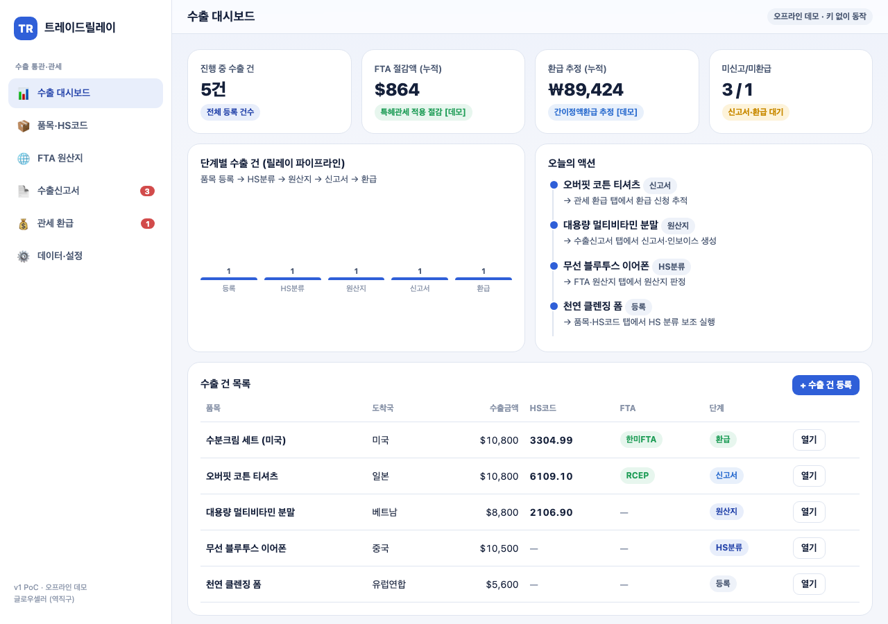
**무엇/의도:** 수출 KPI 4종 + 단계별 파이프라인 차트 + 오늘의 액션. / **검토:** KPI·차트 정상 렌더, 콘솔 pageerror 0.

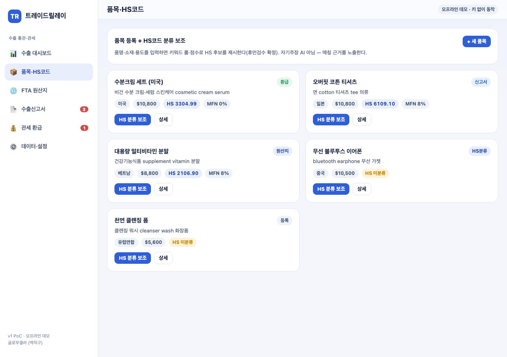
**무엇/의도:** 품목 등록 + HS코드 분류 보조(후보·신뢰도·근거). / **검토:** 후보 3건·신뢰도% 노출, 휴먼검수 확정 동작.

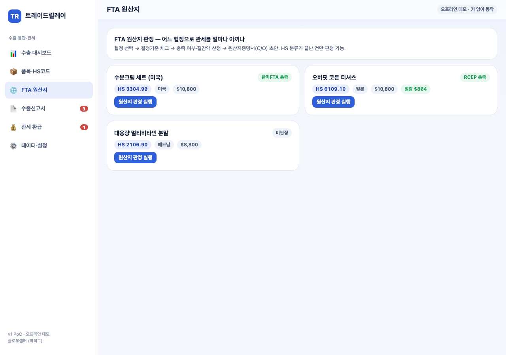
**무엇/의도:** 협정 선택·결정기준 체크·원산지 충족 판정·절감액. / **검토:** 협정 자동추천 + 절감액 수치 산출.

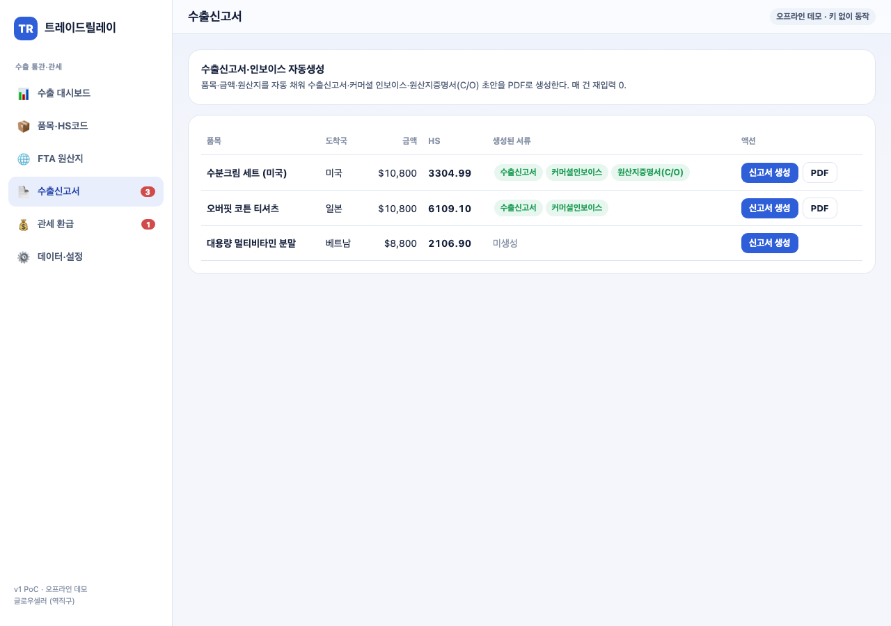
**무엇/의도:** 수출신고서·인보이스·C/O 자동생성 + jsPDF 출력. / **검토:** 건별 생성 서류 배지·신고서 생성 동작.

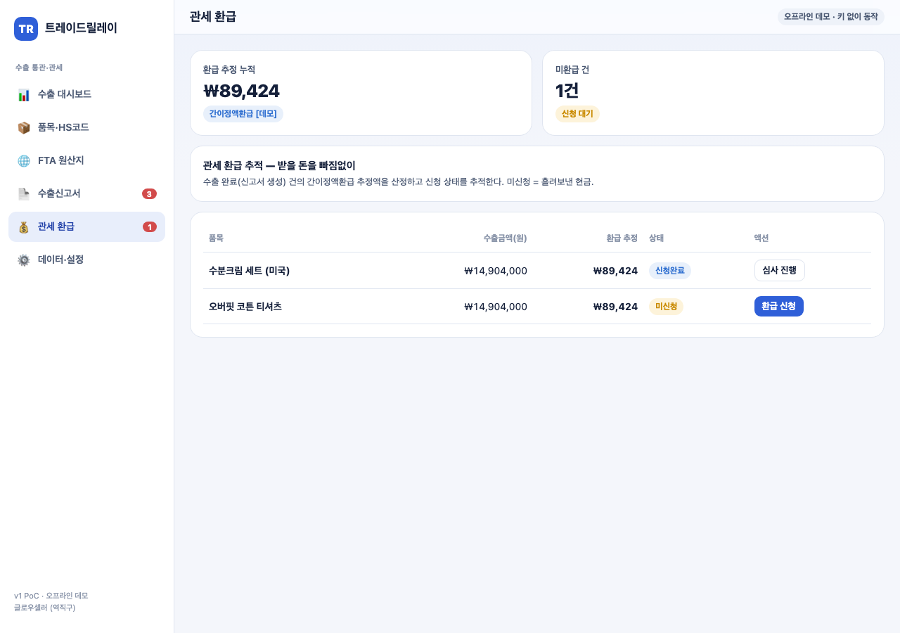
**무엇/의도:** 간이정액환급 추정 + 신청 상태 전이. / **검토:** 추정액 산정·상태 전이 정상.

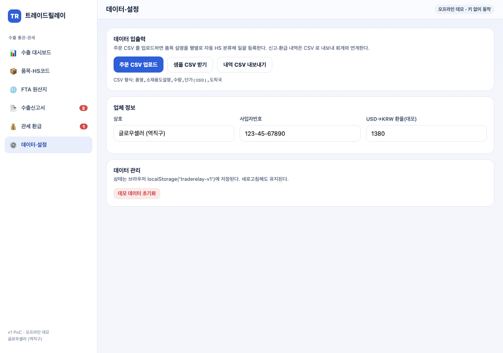
**무엇/의도:** 업체정보·환율 편집, CSV 입출력, 초기화. / **검토:** CSV 업/다운로드·환율 반영 동작.

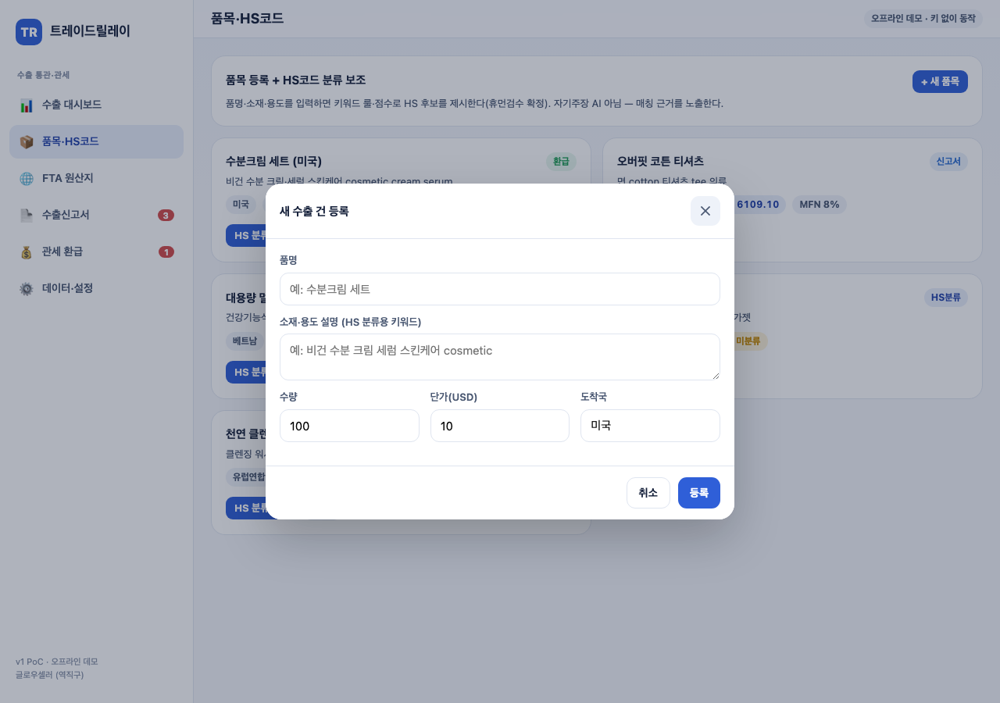
**무엇/의도:** 새 수출 건 등록 모달(품명·소재·수량·단가·국가). / **검토:** 입력→등록 시 자동 HS 분류 트리거.

### 5.2 모바일 (390×844) — `./captures/mobile/v1/`

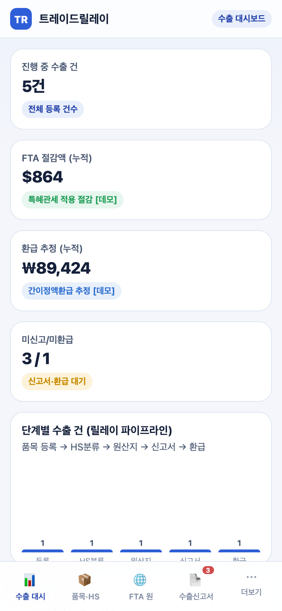
**무엇/의도:** KPI 카드 스택 + 바텀탭(수출대시·품목HS·FTA·신고서·더보기). / **검토:** 가로 overflow 0, 한글 정상.

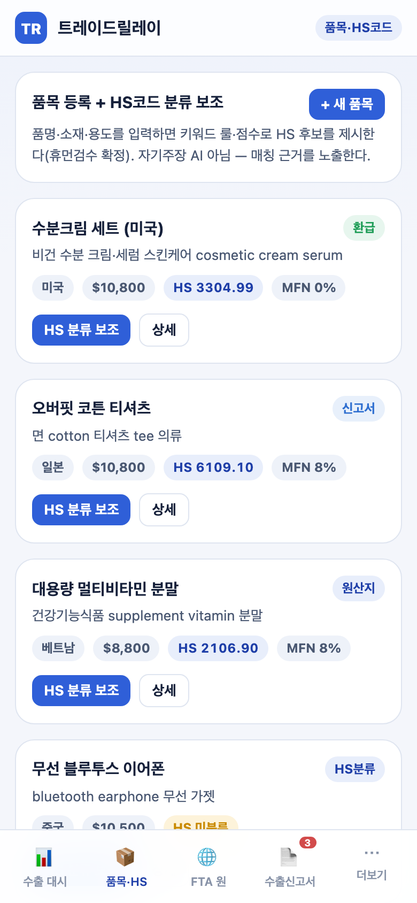
**무엇/의도:** 모바일 품목·HS 분류 보조. / **검토:** 카드 스택 정상.

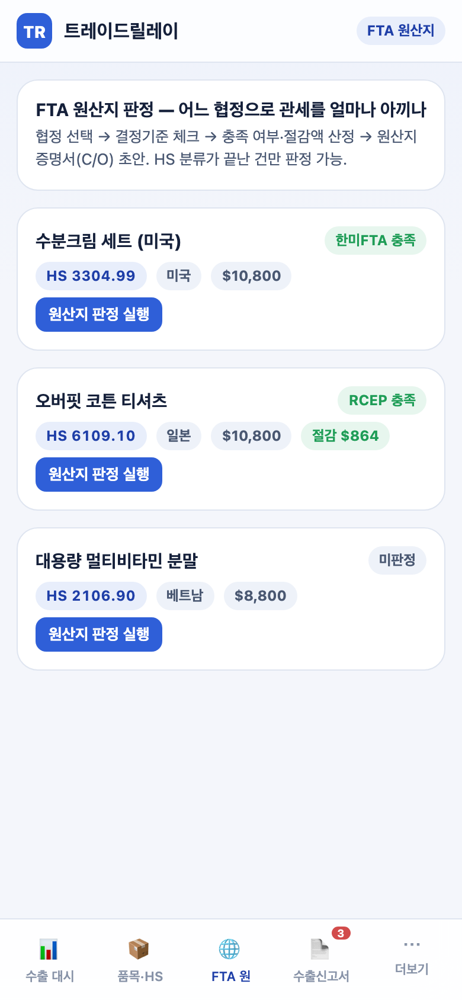
**무엇/의도:** 모바일 원산지 판정. / **검토:** 체크리스트·판정 정상.

**무엇/의도:** 모바일 신고서 표 — 넓은 표는 가로 스크롤(품목명 1줄 유지). / **검토:** 글자 깨짐 없이 정렬, 나머지 컬럼은 스와이프 접근.

**무엇/의도:** 모바일 환급 추적. / **검토:** 상태 전이 정상.

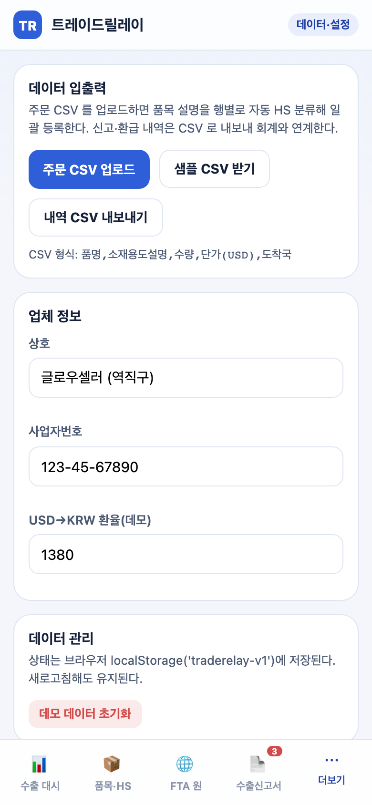
**무엇/의도:** 모바일 설정·CSV. / **검토:** 폼·버튼 정상.

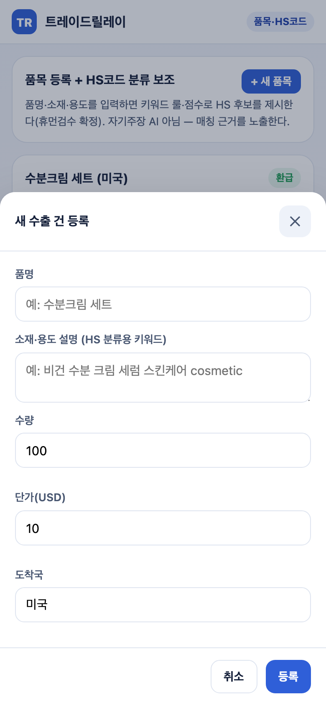
**무엇/의도:** 모바일 바텀시트 모달. / **검토:** 백드롭·폼·취소/등록 정상.

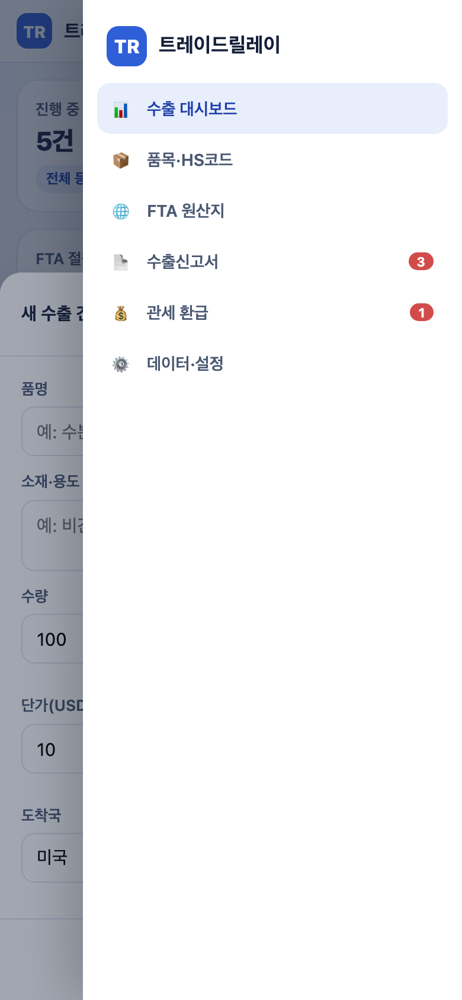
**무엇/의도:** 바텀탭 '더보기' → 우측 드로어 내비. / **검토:** 드로어 슬라이드·전체 메뉴 노출(사이드바 하이재킹 없음).

## 6. 검수 기준 충족 여부

| 검수 항목 | 충족 | 측정값 |
|:---|:---:|:---|
| 오프라인 단독 구동·pageerror 0 | ✅ | PC·모바일 콘솔 에러 0 |
| 뷰 6종+ | ✅ | 6뷰 |
| 다단계 워크플로 1개+ | ✅ | 5단계 릴레이 상태 전이 |
| HS 분류 보조(후보·신뢰도·근거) | ✅ | 후보 3건 + 신뢰도% + 매칭근거 |
| FTA 원산지 판정·절감액 | ✅ | 협정별 결정기준 체크 + 절감액 산정 |
| 문서 PDF 3종 | ✅ | 수출신고서·인보이스·C/O jsPDF |
| 환급 추적·상태 전이 | ✅ | 간이정액 추정 + 4상태 |
| CSV 입출력 | ✅ | 일괄등록 + 11열 내보내기 |
| 상태 지속성 | ✅ | localStorage, 새로고침 유지 |
| 반응형 390px overflow 0 | ✅ | 바텀탭+드로어 전환, 표 가로 스크롤 |
| 캡처 PC 6+·모바일 6+ | ✅ | PC 7 / 모바일 8 |

## 7. 추가 확장 가능 영역 (중립)

- 실 HS코드 데이터베이스(관세청 품목분류 사례) 연계, UNI-PASS 전자신고 API 연동, 협정별 원산지 결정기준 규칙 정밀화는 후속 사이클의 확장 영역.

## 8. 검토 체크리스트

- [x] 모든 핵심 기능 캡처됨 (6뷰 + 모달 + 드로어)
- [x] 캡처가 의도한 기능을 정확히 보여줌
- [x] 한글 깨짐 없음
- [x] 에러 화면 미포함 (pageerror 0)
- [x] 결과물(HS 후보·절감액·환급 추정·PDF) 정확도 충분
- [x] 과업지시서 §5 성과품 100% 매핑

<!-- 빈칸 목록: §3 발주자 협력창구 이름·연락처·소속(과업지시서) — 사용자 입력 -->
