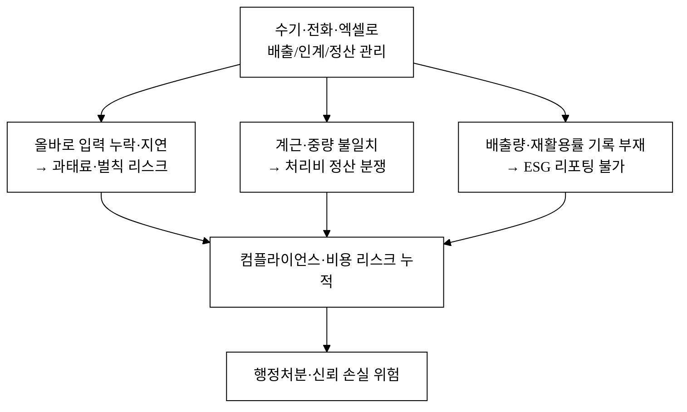
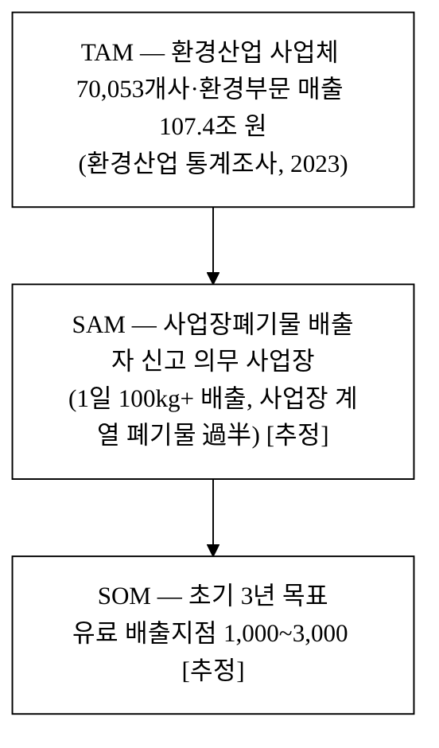
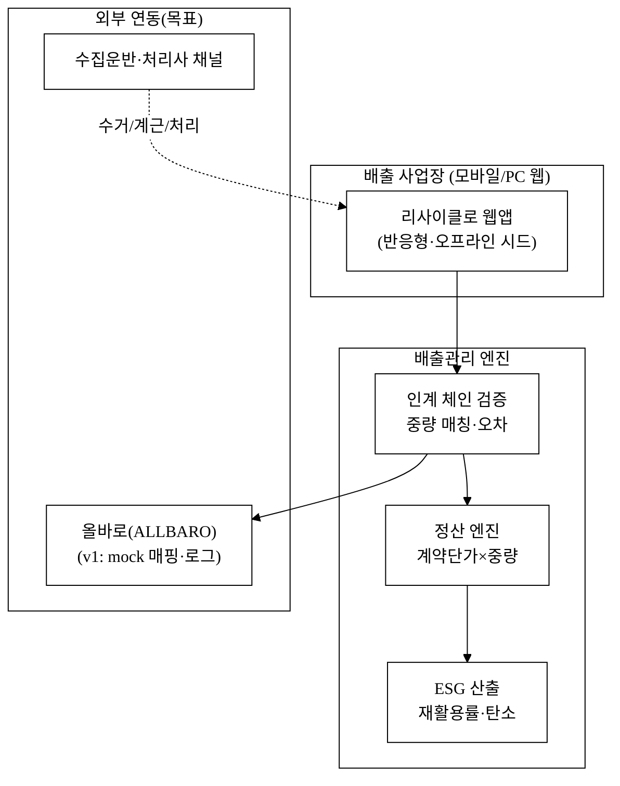
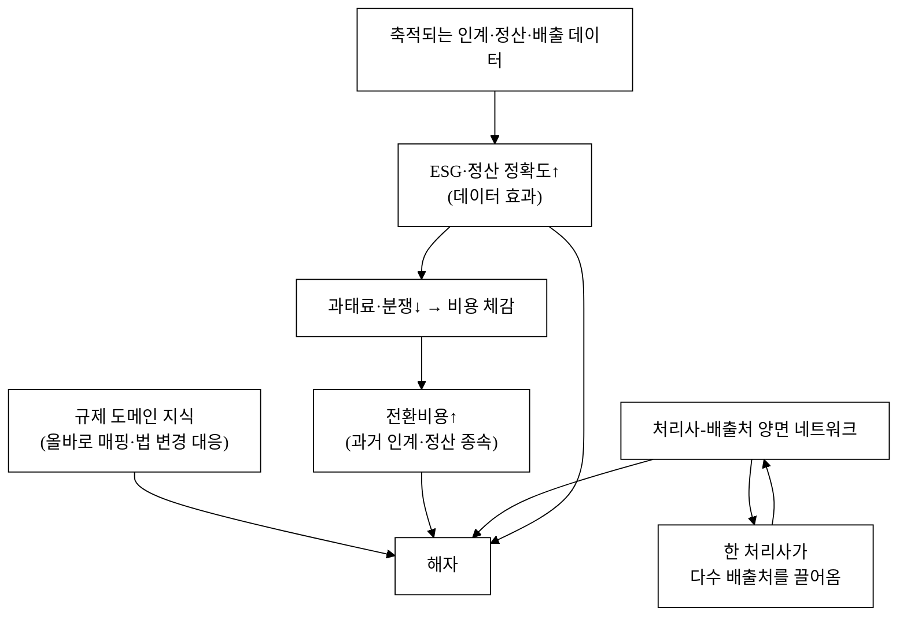

last_updated: 2026-06-25 16:50

# 리사이클로 — 사업장 폐기물·순환자원 배출관리 SaaS

> 배출 사업장과 수집·운반·처리 업체 사이에 흩어진 **배출-수거-계근-인계-정산**을 한 흐름으로 잇고, ALLBARO(올바로) 전자인계 신고를 보조하며, 배출량·재활용률·탄소를 **ESG 리포트**로 자동 산출한다. "수기·엑셀·전화로 굴러가던" 폐기물 컴플라이언스를 데이터로 바꾸는 가장 가벼운 도구.

## 사업 개요 (머리표)

| 항목 | 내용 |
|:---|:---|
| 사업명 | `<TODO: 사용자 입력 (공고 기재)>` |
| 주관기관 | `<TODO: 사용자 입력>` |
| 트랙 | 실전창업 (창업동아리) |
| 지원 규모 | `<TODO: 사용자 입력>` |
| 모집/일정 | `<TODO: 사용자 입력>` |
| 아이템명 | 리사이클로 (Recyclo) — 사업장 폐기물·순환자원 배출관리 SaaS |
| 한 줄 정의 | 배출 사업장의 배출→계근→전자인계→정산→ESG 리포팅을 잇는 폐기물 운영 SaaS |
| 타깃 고객 | 폐기물 배출 사업장(제조·물류·상업)과 수집·운반·처리 업체 |
| 산출물(v1) | 단일 HTML 자체완결 데모(오프라인 동작, 반응형, 실 알고리즘·서명·PDF 탑재) |

> 본 제안서의 PSST 섹션 순서는 고정한다(Problem · Solution · Scale-up · Team). Team 섹션은 골격만 두고 내용은 `<TODO: 사용자 입력>`으로 비워 둔다(행정 양식은 사용자 책임 영역, CLAUDE.md §2.7).

---

## 1. Problem — 문제 정의

### 1.1 "수기·전화로 굴러가는" 폐기물 컴플라이언스

사업장에서 폐기물을 배출하면, 그것은 그냥 버려지는 게 아니다. **배출자 → 수집·운반자 → 최종처리자**로 이어지는 3자 체인을 따라 흐르고, 각 단계는 법으로 추적·신고가 강제된다. 한국환경공단이 운영하는 **올바로(ALLBARO) 시스템**은 이 전 과정을 인터넷·RFID로 관리하며, 배출·운반·처리 3자가 **전자인계서**를 작성·전송해야 한다.[^allbaro] 그런데 현장의 실제 운영은 대부분 이렇게 이뤄진다.

- 배출량을 **눈대중·장부**로 적고, 수거 차량이 오면 **종이 인계서·구두**로 넘긴다.
- 계근(중량 측정)은 처리장 계근대 영수증 한 장으로 끝나고, **사업장엔 사본이 안 남는다.**
- 올바로 전자인계 입력은 담당자가 **나중에 몰아서** 하다가 기한을 넘긴다.
- 정산은 월말에 위탁계약 단가 × 처리량을 **엑셀로 맞춰보며** 처리하고, 처리장과 중량이 어긋나면 분쟁이 난다.

이 방식은 세 가지 비용을 발생시킨다.

### 1.2 문제의 크기 — 사업장폐기물은 폐기물의 절대다수

2023년 국내 총 폐기물 발생량은 **17,619만 톤/년**(전년 대비 −5.5%)이다.[^waste-total] 이 가운데 구성비를 보면 **사업장배출시설계 47.3% + 건설폐기물 36.5% + 사업장비배출시설계 3.5% + 사업장지정 3.2%** — 즉 사업장 계열이 **90% 이상**을 차지한다(생활폐기물은 9.5%).[^waste-mix] 폐기물 관리의 무게중심은 가정이 아니라 **사업장**에 있고, 사업장은 모두 배출자 신고·전자인계 의무의 대상이다.

배출자 신고 의무 기준도 넓다. **배출시설을 운영하며 1일 100kg 이상**, 또는 **1일 300kg 이상** 배출하는 사업장은 신고 의무가 있고, 신고 후 폐기물 발생 시마다 올바로시스템에 입력해야 한다.[^report-target] 제조·물류 사업장 상당수가 이 문턱을 넘는다.

#### 손실의 구조 — "조금씩 새는" 컴플라이언스 비용이 치명적인 이유

폐기물 관리의 손실은 식자재처럼 눈에 보이지 않는다. 대신 **법적 리스크와 정산 누수**로 누적된다.

- **올바로 입력 의무**: 의무 대상은 사실 발생일부터 **10일 이내** 입력해야 한다. 인계·인수 사항을 **입력하지 않거나 거짓 입력 시 2년 이하 징역 또는 2천만 원 이하 벌금**, 미신고·거짓신고는 **1천만 원 이하 과태료** 대상이며, 입력기한 초과 일수에 따라 과태료가 **단계적으로** 부과된다.[^allbaro-penalty] 즉 "나중에 몰아서" 입력하다 하루만 늦어도 비용이 발생한다.
- **계근·정산 누수**: 처리장 계근 중량과 사업장 기록이 어긋나면 **처리비 정산 분쟁**이 난다. 위탁계약 단가 × 중량으로 정산되므로, 중량 1톤의 차이가 곧 돈이다.
- **ESG 리포팅 불가**: 배출량·재활용률·처리방법별 기록이 흩어져 있으면, 원청·금융기관·공시가 요구하는 **ESG 리포트(배출량·재활용률·탄소)** 를 만들 수 없다.

즉 폐기물 배출관리 개선은 "있으면 좋은(nice-to-have)" 기능이 아니라 **벌칙·정산·규제가 걸린 must-have**다. 작은 누락(인계 1건 지연)이 곧 과태료로, 중량 1톤 오차가 곧 정산 손실로 직결된다.

#### 시장 규모 (TAM·SAM·SOM)

- **TAM**: 환경산업 사업체 **70,053개사**, 환경부문 매출 **107.4조 원**(2023).[^env-industry] 배출 사업장까지 포함하면 모집단은 훨씬 크다. 사업장 계열이 폐기물의 過半이다.[^waste-mix]
- **SAM**: 1일 100kg 이상 배출해 신고·전자인계 의무가 있는 사업장 — 본 솔루션 가치가 가장 큰 세그먼트. 절대 사업장 수는 `[재확인 필요]`. `[추정]`
- **SOM**: 지역(대구·경북) 거점 + 수집운반·처리 업체 제휴 레버리지로 초기 3년 내 도달 가능한 유료 배출지점 수. `[추정]`

> 절대값 중 SAM·SOM은 모두 `[추정]`이며, 공식 통계로 골격(TAM=환경산업 규모, 폐기물 구성비)만 고정하고 SAM·SOM은 가정임을 명시한다.

### 1.3 기존 대안의 공백

| 대안 | 한계 |
|:---|:---|
| 엑셀·종이 인계서 수기 관리 | 담당자가 매번 입력·대조 → 누락·지연·분쟁. 올바로 입력과 이중 작업 |
| 올바로(ALLBARO) 단독 사용 | 법적 신고 채널이지 **현장 운영 도구가 아님** — 배출 계근·위탁계약·정산·ESG는 별도 |
| 대형 폐기물 처리사 자체 ERP | 처리사 내부용. 배출 사업장이 쓸 수 없고 중립적이지 않음(자사 처리 종속) |
| 범용 ERP/그룹웨어 | 폐기물 인계·계근·재활용률 도메인 로직 부재 |

→ **"배출 사업장이 부담 없이 쓰는, 배출-계근-인계-정산-ESG를 한 흐름으로 잇고 올바로 입력을 보조하는 도구"** 라는 공백이 존재한다. 올바로는 "신고"를, 리사이클로는 "현장 운영 + 신고 보조 + ESG"를 맡는다.

### 1.4 JTBD (Jobs To Be Done)

배출 사업장 담당자가 "고용"하고 싶은 일(job)은 *"폐기물 관리 앱을 쓰는 것"* 이 아니다. 진짜 job은:

> **"과태료 없이 제때 인계·신고하고, 처리비를 분쟁 없이 정산하고, 배출량·재활용률을 한 장으로 보고하고 싶다."**

리사이클로는 바로 이 job을 대신 수행한다.

### 1.5 페르소나 — "제조공장 환경담당 박씨의 한 달"

> 박씨(41)는 종업원 60명 금속가공 공장의 환경·총무 담당이다. 폐합성수지·폐금속·슬러지 등 하루 수백 kg을 배출하고, 수집운반 업체 2곳·처리 업체 1곳과 위탁계약을 맺고 있다.

- **수거일**: 차량이 오면 종이 인계서에 서명하고 보낸다. 계근 영수증은 운반기사가 가져가고, 박씨 손엔 사본이 잘 안 남는다.
- **월중**: 올바로 입력을 미뤘다가, 어느 날 "입력기한 초과" 안내를 받고 부랴부랴 한 달치를 몰아 넣는다. 한 번은 과태료를 냈다.[^allbaro-penalty]
- **월말**: 처리 업체 정산서의 중량이 내 기록과 다르다. 영수증을 뒤져 대조하느라 반나절을 쓴다.
- **분기**: 원청이 "재활용률·배출량 ESG 자료"를 요구한다. 흩어진 인계서를 모아 엑셀로 만드는 데 며칠이 걸린다.

박씨에게 필요한 것은 새 ERP를 배우는 게 아니다. **수거 때 폰으로 서명 한 번 하면 인계서·계근이 기록되고, 올바로 입력 기한을 알려주고, 정산서를 자동으로 맞춰주고, 재활용률 리포트를 한 번에 뽑아주는** 도구다. 리사이클로는 정확히 이 페르소나를 1차 타깃으로 설계됐다.

---

## 2. Solution — 해결책

### 2.1 핵심: "배출-계근-인계-정산-ESG" 파이프라인

리사이클로는 담당자의 흩어진 작업을 **5단계 워크플로**로 외부화한다.

```mermaid
%%{init: {"theme":"base","themeVariables":{"darkMode":false,"background":"#ffffff","fontFamily":"Georgia, serif","primaryColor":"#ffffff","primaryBorderColor":"#000000","primaryTextColor":"#000000","secondaryColor":"#ffffff","secondaryBorderColor":"#000000","secondaryTextColor":"#000000","tertiaryColor":"#ffffff","tertiaryBorderColor":"#000000","tertiaryTextColor":"#000000","mainBkg":"#ffffff","secondBkg":"#ffffff","lineColor":"#000000","textColor":"#000000","nodeBorder":"#000000","nodeTextColor":"#000000","titleColor":"#000000","edgeLabelBackground":"#ffffff","defaultLinkColor":"#000000","clusterBkg":"#ffffff","clusterBorder":"#000000","actorBkg":"#ffffff","actorBorder":"#000000","actorTextColor":"#000000","actorLineColor":"#000000","signalColor":"#000000","signalTextColor":"#000000","labelBoxBkgColor":"#ffffff","labelBoxBorderColor":"#000000","labelTextColor":"#000000","loopTextColor":"#000000","noteBkgColor":"#ffffff","noteBorderColor":"#000000","noteTextColor":"#000000","activationBkgColor":"#ffffff","activationBorderColor":"#000000","sequenceNumberColor":"#000000","attributeBackgroundColorOdd":"#ffffff","attributeBackgroundColorEven":"#ffffff","sectionBkgColor":"#ffffff","altSectionBkgColor":"#ffffff","sectionBkgColor2":"#ffffff","taskBkgColor":"#ffffff","taskBorderColor":"#000000","taskTextColor":"#000000","taskTextLightColor":"#000000","taskTextOutsideColor":"#000000","taskTextDarkColor":"#000000","taskTextClickableColor":"#000000","activeTaskBkgColor":"#ffffff","activeTaskBorderColor":"#000000","doneTaskBkgColor":"#ffffff","doneTaskBorderColor":"#000000","critBkgColor":"#ffffff","critBorderColor":"#000000","gridColor":"#000000","todayLineColor":"#000000","quadrant1Fill":"#ffffff","quadrant2Fill":"#ffffff","quadrant3Fill":"#ffffff","quadrant4Fill":"#ffffff","quadrant1TextFill":"#000000","quadrant2TextFill":"#000000","quadrant3TextFill":"#000000","quadrant4TextFill":"#000000","quadrantPointFill":"#000000","quadrantPointTextFill":"#000000","quadrantXAxisTextFill":"#000000","quadrantYAxisTextFill":"#000000","quadrantInternalBorderStrokeFill":"#000000","quadrantExternalBorderStrokeFill":"#000000","quadrantTitleFill":"#000000","pieStrokeColor":"#000000","pieOuterStrokeColor":"#000000","pieTitleTextColor":"#000000","pieSectionTextColor":"#000000","pieLegendTextColor":"#000000","cScale0":"#ffffff","cScaleLabel0":"#000000","cScaleInv0":"#000000","pie1":"#ffffff","cScale1":"#ffffff","cScaleLabel1":"#000000","cScaleInv1":"#000000","pie2":"#ffffff","cScale2":"#ffffff","cScaleLabel2":"#000000","cScaleInv2":"#000000","pie3":"#ffffff","cScale3":"#ffffff","cScaleLabel3":"#000000","cScaleInv3":"#000000","pie4":"#ffffff","cScale4":"#ffffff","cScaleLabel4":"#000000","cScaleInv4":"#000000","pie5":"#ffffff","cScale5":"#ffffff","cScaleLabel5":"#000000","cScaleInv5":"#000000","pie6":"#ffffff","cScale6":"#ffffff","cScaleLabel6":"#000000","cScaleInv6":"#000000","pie7":"#ffffff","cScale7":"#ffffff","cScaleLabel7":"#000000","cScaleInv7":"#000000","pie8":"#ffffff","cScale8":"#ffffff","cScaleLabel8":"#000000","cScaleInv8":"#000000","pie9":"#ffffff","cScale9":"#ffffff","cScaleLabel9":"#000000","cScaleInv9":"#000000","pie10":"#ffffff","cScale10":"#ffffff","cScaleLabel10":"#000000","cScaleInv10":"#000000","pie11":"#ffffff","cScale11":"#ffffff","cScaleLabel11":"#000000","cScaleInv11":"#000000","pie12":"#ffffff"}}}%%
flowchart LR
  S1["① 배출 등록<br/>품목·예상중량·보관"] --> S2["② 수거·계근<br/>실중량 입력·체인 시작"]
  S2 --> S3["③ 전자인계서<br/>3자 서명·올바로 보조"]
  S3 --> S4["④ 정산<br/>계약단가×중량·세금계산서"]
  S4 --> S5["⑤ ESG 리포트<br/>배출량·재활용률·탄소"]
  S5 -.배출 데이터 누적.-> S1
```

이 파이프라인의 핵심은 ③ **전자인계서가 3자 서명·중량·일시로 연결되어 올바로 입력 데이터를 그대로 만들어낸다**는 점, 그리고 ⑤ **누적된 데이터에서 재활용률·탄소가 자동 산출**된다는 점이다.

### 2.2 알고리즘 — 인계 체인·재활용률·탄소 환산

리사이클로는 표준 폐기물 인계·정산 로직[^chain]과 공개 통계 기준[^waste-treat]을 그대로 구현한다.

| 지표 | 산식 | 의미 |
|:---|:---|:---|
| 인계 체인 무결성 | 배출중량 → 운반중량 → 처리중량 매칭(허용오차 ε) | 단계별 중량이 ε 내에서 일치하는가(누락·오차 탐지) |
| 정산 금액 | Σ(처리중량 × 위탁계약 단가) + 운반비 | 위탁계약 단가표 기반 자동 정산 |
| 재활용률 | 재활용 처리량 / 총 처리량 × 100 | ESG 지표(공개 통계 재활용 86.0%[^waste-treat] 대비 벤치마크) |
| 매립·소각률 | 각 처리량 / 총 처리량 × 100 | 처리방법별 분해 |
| 탄소(CO₂e) | Σ(처리량 × 처리방법별 배출계수) | 소각·매립 배출 추정(계수는 공개 기준 적용 대상) `[추정]` |
| 입력기한 알림 | 인계일 + 10일 − today | 올바로 입력 마감(10일[^allbaro-penalty]) 잔여일 |

> v1 데모는 이 산식을 실제로 계산한다. 시드 인계 이력에서 단계별 중량을 매칭해 **체인 무결성**을 검사하고, 위탁계약 단가표로 **정산 금액**을 산출하며, 처리방법별로 **재활용률·매립·소각률**과 **탄소 추정**을 집계한다(개발결과보고서 §5 캡처로 입증).

#### 계산 예시 — "폐합성수지 1건 인계"

| 입력 | 값 |
|:---|:---|
| 배출 예상중량 | 1,200 kg |
| 수거 계근중량 | 1,180 kg |
| 처리장 계근중량 | 1,175 kg |
| 허용오차 ε | ±3% |
| 위탁 단가 | 180원/kg (재활용) |
| 운반비 | 50,000원 |

| 계산 | 결과 |
|:---|:---|
| 체인 오차 = \|1,180 − 1,175\| / 1,180 | ≈ 0.42% < 3% → **체인 정상** |
| 정산 = 1,175 × 180 + 50,000 | = 261,500원 |
| 처리방법 | 재활용 → 재활용량에 1,175 kg 가산 |
| 입력기한 | 인계일 + 10일 → 잔여일 카운트다운[^allbaro-penalty] |

이렇게 **"왜 이 금액이고, 인계가 정상이며, 언제까지 신고해야 하는지"가 숫자로 설명**된다. 담당자는 근거를 보고 서명·확정만 하면 된다. 이것이 "수기·전화 관리"와의 결정적 차이다.

### 2.3 전자인계서 — 종이·구두를 구조화된 인계서로

배출 등록·계근이 끝나면 **3자(배출-운반-처리) 서명이 담긴 전자인계서**가 생성된다.

- **캔버스 서명 → 인계서 이미지**: 담당자가 화면에 손서명하면 인계서에 박힌다(폰·PC 모두).
- **올바로 입력 보조**: 인계서 데이터(품목·중량·일시·차량·처리방법)를 올바로 입력 양식으로 매핑하고, 입력기한 D-day를 알린다. 실 서비스에서는 올바로 연계로 대체된다(v1은 mock 매핑·로그).
- **PDF 인계서·정산서**: jsPDF로 정식 문서를 생성한다(한글 폰트/래스터 폴백으로 깨짐 방지).

### 2.4 정산·ESG — 기록이 곧 비용·규제 데이터

인계 확정 시 정산 내역과 처리방법별 집계가 쌓인다. 이 데이터가 누적되면 사업장은 처음으로 **"이번 분기 어디에 얼마를 처리비로 썼고, 재활용률이 몇 %인가"** 를 품목·거래처 단위로 본다. 이것이 처리비 절감과 ESG 보고의 출발점이다.

### 2.5 시스템 아키텍처 (목표 모델)

> v1(현 데모)은 위 Core를 **브라우저 내부에서 전부 실제 동작**시키고, 외부 연동(올바로·처리사 채널)은 mock 매핑·로그로 시뮬레이션한다(오프라인 시연 보장, CLAUDE.md §3.4).

---

## 3. Scale-up — 성장 전략

본 절은 CLAUDE.md가 요구하는 **고객확보(GTM)·수익모델·차별성** 3개 섹션을 구체적 수치·채널로 채운다.

### 경영혁신·창업학적 프레임워크

리사이클로는 다음 이론으로 정당화된다.

**① Kim·Mauborgne 블루오션 (ERR 그리드).**
- **제거(Eliminate)**: 종이 인계서·이중 입력·처리사 종속 ERP.
- **감소(Reduce)**: 올바로 입력 마감 관리 부담, 정산 대조 시간.
- **증가(Raise)**: 인계 추적 투명성·정산 정확도·ESG 가시성.
- **창조(Create)**: "배출 담당자가 폰으로 5분 만에 인계·신고·정산·ESG를 잇는" 새 카테고리. 올바로(신고)와 ERP(내부관리) 사이의 빈 공간을 연다.

**② Porter 5 Forces — 규제가 만든 비탄력 수요.**
폐기물 배출관리는 가격 탄력적 "있으면 좋은" 시장이 아니다. 올바로 입력·신고 의무[^allbaro-penalty]와 순환경제사회 전환 촉진법[^circular-law]이 **수요를 법으로 고정**한다. 신규 진입 위협은 도메인 규제 지식·인계 체인 데이터가 장벽이 되고, 구매자(배출 사업장)는 "벌칙 회피"라는 강한 동인 때문에 가격보다 정확성·편의를 중시한다.

**③ Christensen 파괴적 혁신 (로우엔드 진입) + JTBD.**
대형 처리사 ERP·고가 환경컨설팅은 대기업을 겨냥한다. 리사이클로는 그 기능의 핵심(인계·정산·ESG)을 **중소 배출 사업장이 감당할 가격·단순함**으로 제공하는 로우엔드 진입이다. JTBD(§1.4)로 정의한 진짜 job — *과태료 없이 신고, 분쟁 없이 정산, 한 장으로 ESG* — 를 가장 작은 형태로 충족하는 **MVP**다.

> 본 사업은 블루오션의 **새 카테고리 창조**, Porter 관점의 **규제 기반 비탄력 수요**, Christensen 파괴 곡선의 **로우엔드 진입점**, 린 스타트업의 **MVP→PMF 탐색 단계**에 해당한다.

### 고객확보 (Go-to-Market)

**ICP (Ideal Customer Profile).**

| 축 | 1차 ICP |
|:---|:---|
| 업종 | 폐기물 배출이 꾸준한 중소 제조·물류·상업 사업장(금속·플라스틱·식품가공·물류센터) |
| 규모 | 1일 100kg 이상 배출해 신고·전자인계 의무가 있는 사업장[^report-target] |
| 인계 빈도 | 주 1회 이상 수거·인계, 위탁 처리사 1~3곳 |
| 페인 | 올바로 입력 누락 과태료 리스크, 정산 분쟁, ESG 자료 요구 |
| 디지털 수용도 | 회계·세금계산서·그룹웨어는 이미 사용 |

**획득 채널·전술.**

| 채널 | 유형 | 전술 | 비고 |
|:---|:---|:---|:---|
| 수집운반·처리 업체 제휴 | 제휴 | 처리사가 거래 배출처에 리사이클로 추천(정확한 인계서로 처리사 업무 감소) | 양면 시장의 공급측 레버리지 |
| 환경·안전 컨설팅사·노무사 | 제휴 | 환경담당 대행·컨설팅 고객에 번들 제공 | 의무 이행 패키지 |
| 지자체·환경공단 디지털 전환 사업 | 오가닉/공공 | 순환경제 규제특례[^sandbox]·중기부 디지털 전환과 연계 교육·시연 | 정책 적합성 |
| 산업단지·협동조합 | 오가닉 | 단지 내 입주사 공동 도입(같은 처리사 공유) | 클러스터 확산 |
| 지역 타깃 영업 | 유료 | 대구·경북 제조 밀집지 직접 온보딩 | CAC 측정 채널 |

**퍼널 (인지→가입→활성→유지).**

```mermaid
%%{init: {"theme":"base","themeVariables":{"darkMode":false,"background":"#ffffff","fontFamily":"Georgia, serif","primaryColor":"#ffffff","primaryBorderColor":"#000000","primaryTextColor":"#000000","secondaryColor":"#ffffff","secondaryBorderColor":"#000000","secondaryTextColor":"#000000","tertiaryColor":"#ffffff","tertiaryBorderColor":"#000000","tertiaryTextColor":"#000000","mainBkg":"#ffffff","secondBkg":"#ffffff","lineColor":"#000000","textColor":"#000000","nodeBorder":"#000000","nodeTextColor":"#000000","titleColor":"#000000","edgeLabelBackground":"#ffffff","defaultLinkColor":"#000000","clusterBkg":"#ffffff","clusterBorder":"#000000","actorBkg":"#ffffff","actorBorder":"#000000","actorTextColor":"#000000","actorLineColor":"#000000","signalColor":"#000000","signalTextColor":"#000000","labelBoxBkgColor":"#ffffff","labelBoxBorderColor":"#000000","labelTextColor":"#000000","loopTextColor":"#000000","noteBkgColor":"#ffffff","noteBorderColor":"#000000","noteTextColor":"#000000","activationBkgColor":"#ffffff","activationBorderColor":"#000000","sequenceNumberColor":"#000000","attributeBackgroundColorOdd":"#ffffff","attributeBackgroundColorEven":"#ffffff","sectionBkgColor":"#ffffff","altSectionBkgColor":"#ffffff","sectionBkgColor2":"#ffffff","taskBkgColor":"#ffffff","taskBorderColor":"#000000","taskTextColor":"#000000","taskTextLightColor":"#000000","taskTextOutsideColor":"#000000","taskTextDarkColor":"#000000","taskTextClickableColor":"#000000","activeTaskBkgColor":"#ffffff","activeTaskBorderColor":"#000000","doneTaskBkgColor":"#ffffff","doneTaskBorderColor":"#000000","critBkgColor":"#ffffff","critBorderColor":"#000000","gridColor":"#000000","todayLineColor":"#000000","quadrant1Fill":"#ffffff","quadrant2Fill":"#ffffff","quadrant3Fill":"#ffffff","quadrant4Fill":"#ffffff","quadrant1TextFill":"#000000","quadrant2TextFill":"#000000","quadrant3TextFill":"#000000","quadrant4TextFill":"#000000","quadrantPointFill":"#000000","quadrantPointTextFill":"#000000","quadrantXAxisTextFill":"#000000","quadrantYAxisTextFill":"#000000","quadrantInternalBorderStrokeFill":"#000000","quadrantExternalBorderStrokeFill":"#000000","quadrantTitleFill":"#000000","pieStrokeColor":"#000000","pieOuterStrokeColor":"#000000","pieTitleTextColor":"#000000","pieSectionTextColor":"#000000","pieLegendTextColor":"#000000","cScale0":"#ffffff","cScaleLabel0":"#000000","cScaleInv0":"#000000","pie1":"#ffffff","cScale1":"#ffffff","cScaleLabel1":"#000000","cScaleInv1":"#000000","pie2":"#ffffff","cScale2":"#ffffff","cScaleLabel2":"#000000","cScaleInv2":"#000000","pie3":"#ffffff","cScale3":"#ffffff","cScaleLabel3":"#000000","cScaleInv3":"#000000","pie4":"#ffffff","cScale4":"#ffffff","cScaleLabel4":"#000000","cScaleInv4":"#000000","pie5":"#ffffff","cScale5":"#ffffff","cScaleLabel5":"#000000","cScaleInv5":"#000000","pie6":"#ffffff","cScale6":"#ffffff","cScaleLabel6":"#000000","cScaleInv6":"#000000","pie7":"#ffffff","cScale7":"#ffffff","cScaleLabel7":"#000000","cScaleInv7":"#000000","pie8":"#ffffff","cScale8":"#ffffff","cScaleLabel8":"#000000","cScaleInv8":"#000000","pie9":"#ffffff","cScale9":"#ffffff","cScaleLabel9":"#000000","cScaleInv9":"#000000","pie10":"#ffffff","cScale10":"#ffffff","cScaleLabel10":"#000000","cScaleInv10":"#000000","pie11":"#ffffff","cScale11":"#ffffff","cScaleLabel11":"#000000","cScaleInv11":"#000000","pie12":"#ffffff"}}}%%
flowchart LR
  A["인지<br/>처리사 제휴·컨설팅·정책"] --> B["가입<br/>로그인 없이 즉시 체험"]
  B --> C["활성<br/>첫 인계서 서명+첫 ESG 리포트"]
  C --> D["유지<br/>주간 인계·월간 신고 루틴화"]
  D --> E["확장<br/>다사업장·처리사 포털 구독"]
```

**첫 100·1,000 사용자.**
- **첫 100**: 대구·경북 수집운반·처리 업체 3~5곳과 제휴, 각 처리사의 거래 배출처 20~30곳에 무료 베타. 산업단지 단위로 직접 온보딩.
- **첫 1,000**: 베타에서 검증된 "과태료 0건·정산 분쟁↓·ESG 리포트 자동화" 사례를 콘텐츠화 → 환경컨설팅·협동조합·지자체 교육 + 처리사 추천 루프 확장. 처리사 1곳당 배출처 N개가 따라오는 **공급측 레버리지**가 핵심.

**CAC·리텐션 가설.**
- 초기 CAC: 제휴·정책 중심으로 **5~15만 원/배출지점 [추정]**(B2B 온보딩 인건비 포함, 식당 대비 높음).
- 리텐션 가설: 인계·신고는 **법으로 반복되는 의무**라 한번 루틴에 들어오면 이탈 비용이 매우 큼 → 활성(첫 인계서 + 올바로 매핑) 도달 시 12개월 리텐션 **80%+ 목표 [추정]**. 핵심 선행지표 = "월간 전자인계서 생성 + 입력기한 0건 초과".

**온보딩·활성화 설계 (Aha-moment 단축).**
- **로그인 없이 즉시 체험**(CLAUDE.md §3.4): 시드 인계·정산 데이터가 깔려 있어 첫 화면에서 바로 "입력기한 임박 2건"과 "재활용률 86%"를 본다.
- **첫 인계서 5분 생성**: 배출 등록 → 계근 입력 → 3자 서명 → 인계서 PDF + 올바로 매핑까지 한 흐름. 이 첫 인계서 생성이 **활성(activation) 지표**다.
- **체감 리포트**: 분기 ESG 리포트(배출량·재활용률·탄소)와 정산 요약을 한 번에 보여줘 리텐션을 강화한다.

**초기 트랙션·실험 설계.**

| 가설 | 검증 실험 | 성공 기준 |
|:---|:---|:---|
| 담당자는 인계·신고 보조에 가치를 느낀다 | 베타 20곳에 8주간 무료 제공 | 월간 인계서 생성 70%+ 사업장 |
| 처리사는 정확한 인계서로 업무가 준다 | 제휴 처리사 인터뷰·인계서 수용률 | 처리사 NPS 양(+) |
| 과태료·분쟁 감소가 바이럴된다 | "입력기한 0건 초과" 사례 3건 콘텐츠화 | 콘텐츠 경유 가입 발생 |

### 수익모델

**가격 정책 (SaaS 구독 + 거래 옵션).**

| 플랜 | 대상 | 가격(월) | 포함 |
|:---|:---|---:|:---|
| Free | 단일 배출지점 체험 | 0원 | 인계 5건/월·수동 정산 |
| Basic | 단일 배출지점 | 49,000원 `[추정]` | 무제한 인계·전자서명·정산·올바로 매핑·ESG 리포트 |
| Pro | 다사업장/그룹 | 149,000원 `[추정]` | 다사업장·역할분리·CSV·API·처리사 포털 |
| 거래 연동(옵션) | 처리비 결제 연동 시 | 처리비의 0.3~0.8% `[추정]` | 정산·세금계산서 자동화 |

**단위경제성 (Basic 기준).**

단위경제성의 4개 입력값(가격·기여이익률·구독유지·CAC)은 **모두 미검증 가정 `[추정]`** 이다. 단일 점추정으로 "LTV/CAC N배"를 단정하지 않고, **기준(Base)값·근거를 분리 제시하고 핵심 가정(가격·구독유지·CAC) 민감도**를 함께 보인다.

| 입력 | 기준값 `[추정]` | 정박 근거(외부/구조적) |
|:---|---:|:---|
| ARPA(월) | 49,000원 | Basic 정가. 과태료 1건(수십만~1천만 원[^allbaro-penalty])·정산 분쟁 1건이면 수개월치 구독료를 상회하는 가치 |
| 기여이익률 | 80% | SaaS의 낮은 한계비용(클라우드·지원)이라는 업계 일반 구조[^saas-margin] |
| 평균 구독 유지 | 36개월 | 인계·신고는 법적 의무라 이탈비용이 큼(가정, 식당 대비 길게) |
| CAC | 100,000원 | GTM 제휴·정책 중심이나 B2B 온보딩 비용(가정) |

**민감도 — 가정이 흔들리면 결론도 흔들린다 (`[추정]`).**

| 시나리오 | 구독유지 | CAC | LTV | LTV/CAC | 회수기간 |
|:---|---:|---:|---:|---:|---:|
| 비관 | 18개월 | 200,000원 | 약 70.6만 원 | **약 3.5배** | 약 5.1개월 |
| 기준 | 36개월 | 100,000원 | 약 141.1만 원 | **약 14.1배** | 약 2.6개월 |
| 낙관 | 48개월 | 80,000원 | 약 188.2만 원 | **약 23.5배** | 약 2.0개월 |

> 결론을 단정하지 않는다. **비관 시나리오에서도 LTV/CAC가 건전 기준(3배)을 상회**하고 회수기간이 6개월 내라는 점이, 규제 기반 비탄력 수요·높은 이탈비용이라는 구조가 단위경제성을 떠받칠 **구조적 여지**를 시사한다. 다만 모든 값은 베타(§Scale-up)에서 실측해 검증할 대상이며, 현 단계 "14배"는 *기준 가정 하의 한 점*일 뿐이다. SaaS의 낮은 한계비용·반복구독 구조[^saas-margin]가 회수기간을 짧게 형성하는 일반 경향을 따른다.

**매출 시나리오 3안 (36개월차 MRR, `[추정]`).**

| 시나리오 | 유료 배출지점 수 | ARPA | 월 매출(MRR) |
|:---|---:|---:|---:|
| 보수 | 300 | 49,000 | 약 1,470만 원 |
| 기본 | 1,000 | 60,000 | 약 6,000만 원 |
| 공격 | 3,000 | 70,000 | 약 2.1억 원 |

### 차별성·경쟁우위 (Moat)

**경쟁 비교표.**

| 항목 | 리사이클로 | 엑셀·종이 인계서 | 올바로 단독 | 처리사 자체 ERP | 범용 ERP |
|:---|:---:|:---:|:---:|:---:|:---:|
| 중소 배출 사업장 적합성 | ◎ | △ | ○ | ✕ | △ |
| 배출-계근-인계 현장 워크플로 | ◎ | △ | ✕ | ○ | △ |
| 전자서명 인계서 | ◎ | ✕ | ○ | ○ | △ |
| 올바로 입력 보조·기한 알림 | ◎ | ✕ | (신고 채널 자체) | △ | ✕ |
| 정산·세금계산서 자동화 | ◎ | △ | ✕ | ○ | ○ |
| 재활용률·탄소 ESG 리포트 | ◎ | ✕ | ✕ | △ | ✕ |
| 처리사 중립성 | ◎(거래처 자유) | ◎ | ◎ | ✕(자사 종속) | ○ |
| 도입 가격/복잡도 | 낮음 | 낮음 | 무료(신고만) | 매우 높음 | 높음 |

**Why us / Why now.**
- **Why now**: ① **순환경제사회 전환 촉진법(2024.1.1 시행)**[^circular-law]과 규제특례[^sandbox]로 순환자원·ESG 수요가 제도화됐다. ② 올바로 입력·신고 의무와 벌칙[^allbaro-penalty]이 강화 기조다. ③ ESG 공시·원청 요구로 재활용률 보고가 필수화된다. "배출 데이터를 디지털로 잇는" 토양이 마련됐다.
- **Why us**: 처리사 ERP는 "자사 처리물량을 늘리려는" 인센티브 때문에 **중립적 절감·재활용 제안을 하기 어렵다**. 리사이클로는 처리사 중립적 도구라 "더 싼/재활용률 높은 처리 경로"를 권할 수 있다. 이 중립성이 배출 사업장 신뢰의 핵심이다.

**방어가능성(Moat).**

- **데이터 효과**: 사업장별 인계·정산 이력이 쌓일수록 정산 정확도·ESG 자동화가 강해진다(신규 진입자가 따라잡기 어려움).
- **전환비용**: 과거 인계·정산·올바로 매핑 데이터와 월간 루틴이 묶여 이탈비용이 크다.
- **네트워크 효과**: 처리사-배출처 양면 구조에서 한쪽이 다른 쪽을 끌어온다.
- **규제 도메인 해자**: 올바로 매핑·법 변경 대응·ESG 산식은 도메인 지식 장벽이다.

**Porter 5 Forces 관점.**

| 힘 | 평가 | 함의 |
|:---|:---|:---|
| 신규 진입 위협 | 중 | SaaS 진입장벽은 낮으나 **규제 도메인·데이터·처리사 네트워크 해자**로 방어 |
| 공급자 교섭력 | 낮음 | 처리사 중립 설계라 특정 처리사에 종속되지 않음 |
| 구매자 교섭력 | 낮음 | 의무 이행(과태료 회피) 수요라 가격보다 정확성·편의 중시 |
| 대체재 위협 | 중 | 올바로·엑셀이 부분 대체 → "현장 운영+신고 보조+ESG 통합"으로 차별 |
| 산업 내 경쟁 | 낮음(현재) | 중소 배출처 전용 인계·정산·ESG 통합 카테고리 미성숙(블루오션) |

### 차별화 기술의 구매동인 논증

> 차별 기술(인계 체인 중량 검증, 전자서명 인계서, 올바로 입력 보조·기한 알림, 위탁계약 자동 정산, 재활용률·탄소 ESG 산출)을 **나열**하는 데 그치지 않고, 그것이 배출 담당자의 **실제 구매·사용 결정**을 얼마나 크게 움직이는지를 조사·논증한다(CLAUDE.md §2.1).

#### ① 구매동인 가설 — 무엇을, must-have인가 nice-to-have인가

리사이클로의 차별 기술이 건드리는 배출 담당자의 핵심 의사결정 요인(JTBD의 "더 나은 채용 기준")은 **"과태료 없이 제때 신고하고, 분쟁 없이 정산하고, 한 장으로 ESG를 보고하는 것"** 이다. 세부 동인으로 분해하면:

| 차별 기술 | 건드리는 의사결정 요인(JTBD) | must / nice | 분류 근거 |
|:---|:---|:---:|:---|
| 올바로 입력 보조·10일 기한 알림 | "기한 넘겨 과태료 맞을까" | **must** | 미입력·지연은 **2천만 원 이하 벌금·1천만 원 이하 과태료**[^allbaro-penalty] 직결. 안 하면 곧 비용 — 법적 강제 동인 |
| 전자서명 인계서·체인 중량 검증 | "인계 증빙이 남는가, 중량이 맞는가" | **must** | 종이 인계서 분실·중량 오차는 정산 분쟁의 원인. 증빙·검증은 분쟁 방어의 필수 |
| 위탁계약 자동 정산·세금계산서 | "처리비를 정확히 정산했는가" | must(월말·세무 시) | 정산 분쟁·세금계산서 발행 시점에 강하게 발현. 중량×단가 자동화가 대조 시간 제거 |
| 재활용률·탄소 ESG 리포트 | "원청·공시가 요구하는 ESG 자료" | nice→must(원청 요구 시) | 자체 동인은 약하나 **원청·금융·공시 요구**가 있으면 must로 전환 |
| 처리사 중립 비교·절감 제안 | "더 싸고 재활용률 높은 처리 경로" | nice | 거래 처리사가 고정된 사업장엔 약한 동인. 규모·다거래처일수록 가치 상승 |

→ **핵심 구매동인은 "올바로 입력 보조·전자인계 증빙(must)"** 이고, 정산 자동화가 보조 must다. ESG·처리사 비교는 **원청 요구·규모가 커질수록 must로 전환되는** 확장 동인이다. 즉 1차 ICP(중소 단일 배출지점)에는 입력 보조·인계 증빙·정산을, 상위 세그먼트(다사업장·ESG 공시 대상)에는 ESG·처리사 비교를 핵심 동인으로 포지셔닝한다.

#### ② 크기 정량화 — 고객 언어의 수치로

차별점이 만드는 가치를 담당자가 체감하는 단위(시간·원·리스크)로 환산한다. 절대값은 모두 `[추정]`이며, 벌칙·비중 등 토대 수치는 공공자료[^allbaro-penalty][^waste-treat]를 인용한다.

| 가치 축 | 기존(수기·종이·전화) | 리사이클로 | 차이(고객 언어) |
|:---|:---|:---|:---|
| 올바로 입력 누락 리스크 | 몰아서 입력하다 기한 초과 → **과태료(단계 부과)·벌금**[^allbaro-penalty] | 인계 즉시 매핑+D-day 알림 | **과태료 1건(수십만~수백만 원) 회피** `[추정]` |
| 인계·신고 작업 시간 | 인계서 수기 작성+월말 올바로 몰아넣기 | 수거 시 서명 1회로 인계·매핑 기록 | **−N시간/월** `[추정]` |
| 정산 대조 시간 | 월말 영수증·중량 대조 반나절 | 중량×단가 자동 정산·체인 검증 | **−반나절/월 + 분쟁 방어** `[추정]` |
| ESG 리포트 작성 | 분기마다 인계서 모아 엑셀 며칠 | 버튼 한 번에 재활용률·탄소 리포트 | **−수일/분기** `[추정]` |

**전환비용 대비 충분히 큰가(10배 규칙).** 기존 대안(종이·엑셀·올바로 직접 입력)의 전환 마찰은 *중간*이다 — 올바로 계정·위탁계약은 이미 있으므로 새 계약은 불필요하고, 넘어야 할 문턱은 "입력 습관 변경"이다. 구독료(Basic 49,000원/월 `[추정]`)는 위 표의 가치(과태료 1건 회피만으로도 수개월치 구독료 상회[^allbaro-penalty], 정산 분쟁 방어, ESG 작업 −수일/분기)에 견줘 **회수 가능**하다. 핵심은 "벌칙·분쟁 1건 회피 > 연간 구독료"임을 **온보딩 시 즉시 보여주는 것**이다(아래 ④·데모 연결).

> 폐기물 관리 비용은 식자재 폐기처럼 작게 새는 것이 아니라 **벌칙·분쟁이라는 점프형 손실**이다. 1건이 곧 수개월~수년치 구독료다. 즉 차별점의 가치는 "있으면 좋은" 수준이 아니라 **리스크 회피 레버**다.

#### ③ 외부 근거

위 정량화의 토대 수치는 [`5_research/`](./5_research/README.md)에 통합한다. 올바로 입력기한·벌칙(R6)[^allbaro-penalty], 신고 의무 기준(R5)[^report-target], 처리방법별 비율·재활용률(R3)[^waste-treat], 순환경제·ESG 규제 모멘텀(R7·R9)[^circular-law][^sandbox], 인계·정산 체인 실무(R11)[^chain]. 사업장 단위 절감·과태료 회피 절대값은 검증 전이므로 `[추정]`으로 표기하고, 공식 비율·벌칙 기준과 한 문장에 섞지 않는다. 베타(§Scale-up)의 8주 무료 운영에서 "입력기한 0건 초과·분쟁 ↓"를 **실측해 추정을 검증값으로 갱신**하는 것이 린 스타트업 실험의 목표다.

#### ④ 반증·대안 위협 직시

차별점에도 *불구하고* 안 사거나 이탈하는 이유와 극복법:

| 반증(안 쓰는 이유) | 진단 | 극복 |
|:---|:---|:---|
| "올바로에 직접 입력하면 되지, 또 다른 앱?" | 올바로가 무료 신고 채널이라 중복 인식 | 올바로는 **신고만** — 현장 배출·계근·서명·정산·ESG는 올바로에 없음. 리사이클로는 그 데이터를 만들어 **올바로 입력까지 보조**(이중작업 제거) |
| "지금까지 종이·엑셀로 잘해왔다" | 전환 관성·"문제 없었다"는 착시 | **시드 데이터로 5분 내 첫 ESG 리포트 + 입력기한 임박 알림** 제시 → 누락 리스크를 수치로 직면. 과태료 1건이면 회수됨을 §1.2 논리로 입증 |
| "처리사가 알아서 인계서 챙겨준다" | 처리사 의존, 사업장에 사본·검증 부재 | **배출자 책임은 사업장에 있다**(미입력 시 사업장 벌칙[^allbaro-penalty]). 사업장 측 증빙·체인 검증을 남겨 책임을 방어 |
| "월 5만 원이 부담" | 가격 민감도 | 과태료 1건(수십만~1천만 원[^allbaro-penalty])·정산 분쟁 1건이 **연 구독료를 상회**. ROI를 첫 화면 절감 카드로 즉시 제시 |

> 정직한 결론: **거래 처리사가 1곳뿐인 소형 사업장에서는 ESG·처리사 비교가 약한 구매동인**이다. 그래서 1차 동인을 거기 두지 않고 *올바로 입력 보조·인계 증빙·정산 자동화*에 둔다. 확장 동인(ESG 공시·처리사 비교·다사업장 통합)은 규모·원청 요구가 커지는 **중견·그룹 세그먼트에서 must로 발현**하므로, 그 세그먼트로 업셀하는 사다리로 설계한다.

#### ⑤ 데모 앱의 구매동인 구현 지점

위 논증은 데모 앱(`projects/waste-circular/`)에서 실제로 구현·시연된다 — must 동인은 **배출 등록 → 수거·계근 → 전자서명 인계서 + 올바로 매핑/기한 알림 → 정산 → ESG 리포트** 워크플로로, 정산 자동화는 **계약단가×중량 + 세금계산서/정산서 PDF**로, 확장 동인은 **재활용률·탄소 ESG 리포트·CSV 입출력** 뷰로 구현한다. 즉 "이 차별점이 왜 돈을 내거나 매월 쓰게 만드는가"를 화면에서 직접 보일 수 있다(개발결과보고서 캡처로 입증).

### 위험 요인 및 대응

| 위험 | 영향 | 대응 |
|:---|:---|:---|
| 올바로 공식 연계 불확실 | 핵심 가치(입력 보조) 약화 | v1은 매핑·기한 알림·내보내기로 보조, 공식 연계는 로드맵·규제특례[^sandbox] 활용 |
| 담당자 입력 부담 | 활성화 저하 | 모바일 서명·시드 데이터·CSV 일괄 입력으로 입력 최소화 |
| 처리사 자체 ERP의 기능 확장 | 차별성 약화 | **처리사 중립성**(자사 종속 없음)을 핵심 포지션으로 유지 |
| 법령 변경(벌칙·기한) | 산식·알림 오류 | 규제 도메인 전담·법 변경 모니터링을 해자로 내재화 |

---

## 4. Team — 팀 구성

> 본 섹션은 행정 양식 영역으로, 내용은 사용자가 직접 채운다(CLAUDE.md §2.7). Claude는 골격만 둔다.

### 4.1 대표자

| 항목 | 내용 |
|:---|:---|
| 대표자 성명 | `<TODO: 사용자 입력>` |
| 소속/학과/학번 | `<TODO: 사용자 입력>` |
| 연락처 | `<TODO: 사용자 입력>` |
| 이메일 | `<TODO: 사용자 입력>` |

### 4.2 팀원

| 이름 | 소속/학과 | 역할(R&R) | 연락처 |
|:---|:---|:---|:---|
| `<TODO: 사용자 입력>` | `<TODO: 사용자 입력>` | `<TODO: 사용자 입력>` | `<TODO: 사용자 입력>` |
| `<TODO: 사용자 입력>` | `<TODO: 사용자 입력>` | `<TODO: 사용자 입력>` | `<TODO: 사용자 입력>` |

### 4.3 지도교수 / 멘토

| 항목 | 내용 |
|:---|:---|
| 지도교수 성명 | `<TODO: 사용자 입력>` |
| 소속 | `<TODO: 사용자 입력>` |
| 연락처 | `<TODO: 사용자 입력>` |

### 4.4 협력 기관 / MOU

| 기관 | 협력 내용 | 상태 |
|:---|:---|:---|
| `<TODO: 사용자 입력>` | `<TODO: 사용자 입력>` | `<TODO: 사용자 입력>` |

---

## 5. 추진 일정 (요약)

```mermaid
%%{init: {"theme":"base","themeVariables":{"darkMode":false,"background":"#ffffff","fontFamily":"Georgia, serif","primaryColor":"#ffffff","primaryBorderColor":"#000000","primaryTextColor":"#000000","secondaryColor":"#ffffff","secondaryBorderColor":"#000000","secondaryTextColor":"#000000","tertiaryColor":"#ffffff","tertiaryBorderColor":"#000000","tertiaryTextColor":"#000000","mainBkg":"#ffffff","secondBkg":"#ffffff","lineColor":"#000000","textColor":"#000000","nodeBorder":"#000000","nodeTextColor":"#000000","titleColor":"#000000","edgeLabelBackground":"#ffffff","defaultLinkColor":"#000000","clusterBkg":"#ffffff","clusterBorder":"#000000","actorBkg":"#ffffff","actorBorder":"#000000","actorTextColor":"#000000","actorLineColor":"#000000","signalColor":"#000000","signalTextColor":"#000000","labelBoxBkgColor":"#ffffff","labelBoxBorderColor":"#000000","labelTextColor":"#000000","loopTextColor":"#000000","noteBkgColor":"#ffffff","noteBorderColor":"#000000","noteTextColor":"#000000","activationBkgColor":"#ffffff","activationBorderColor":"#000000","sequenceNumberColor":"#000000","attributeBackgroundColorOdd":"#ffffff","attributeBackgroundColorEven":"#ffffff","sectionBkgColor":"#ffffff","altSectionBkgColor":"#ffffff","sectionBkgColor2":"#ffffff","taskBkgColor":"#ffffff","taskBorderColor":"#000000","taskTextColor":"#000000","taskTextLightColor":"#000000","taskTextOutsideColor":"#000000","taskTextDarkColor":"#000000","taskTextClickableColor":"#000000","activeTaskBkgColor":"#ffffff","activeTaskBorderColor":"#000000","doneTaskBkgColor":"#ffffff","doneTaskBorderColor":"#000000","critBkgColor":"#ffffff","critBorderColor":"#000000","gridColor":"#000000","todayLineColor":"#000000","quadrant1Fill":"#ffffff","quadrant2Fill":"#ffffff","quadrant3Fill":"#ffffff","quadrant4Fill":"#ffffff","quadrant1TextFill":"#000000","quadrant2TextFill":"#000000","quadrant3TextFill":"#000000","quadrant4TextFill":"#000000","quadrantPointFill":"#000000","quadrantPointTextFill":"#000000","quadrantXAxisTextFill":"#000000","quadrantYAxisTextFill":"#000000","quadrantInternalBorderStrokeFill":"#000000","quadrantExternalBorderStrokeFill":"#000000","quadrantTitleFill":"#000000","pieStrokeColor":"#000000","pieOuterStrokeColor":"#000000","pieTitleTextColor":"#000000","pieSectionTextColor":"#000000","pieLegendTextColor":"#000000","cScale0":"#ffffff","cScaleLabel0":"#000000","cScaleInv0":"#000000","pie1":"#ffffff","cScale1":"#ffffff","cScaleLabel1":"#000000","cScaleInv1":"#000000","pie2":"#ffffff","cScale2":"#ffffff","cScaleLabel2":"#000000","cScaleInv2":"#000000","pie3":"#ffffff","cScale3":"#ffffff","cScaleLabel3":"#000000","cScaleInv3":"#000000","pie4":"#ffffff","cScale4":"#ffffff","cScaleLabel4":"#000000","cScaleInv4":"#000000","pie5":"#ffffff","cScale5":"#ffffff","cScaleLabel5":"#000000","cScaleInv5":"#000000","pie6":"#ffffff","cScale6":"#ffffff","cScaleLabel6":"#000000","cScaleInv6":"#000000","pie7":"#ffffff","cScale7":"#ffffff","cScaleLabel7":"#000000","cScaleInv7":"#000000","pie8":"#ffffff","cScale8":"#ffffff","cScaleLabel8":"#000000","cScaleInv8":"#000000","pie9":"#ffffff","cScale9":"#ffffff","cScaleLabel9":"#000000","cScaleInv9":"#000000","pie10":"#ffffff","cScale10":"#ffffff","cScaleLabel10":"#000000","cScaleInv10":"#000000","pie11":"#ffffff","cScale11":"#ffffff","cScaleLabel11":"#000000","cScaleInv11":"#000000","pie12":"#ffffff"}}}%%
gantt
  dateFormat YYYY-MM
  title 리사이클로 로드맵
  section 검증(MVP)
  v1 데모·인계/정산/ESG 검증   :2026-04, 1M
  지역 베타(처리사 제휴)        :2026-05, 2M
  section 확장
  유료 전환·정산/ESG 리포트     :2026-07, 2M
  다사업장·올바로 연계(보조)    :2026-09, 3M
```

---

## 6. 데이터 정직성 선언

- 본 제안서의 모든 통계·인용은 `[^번호]` 각주로 출처를 명시하며, 출처는 [`5_research/`](./5_research/README.md)에 통합했다.
- **핵심 수치는 공식 출처로 실값을 확정**했다: ① 2023년 총 폐기물 발생량 **17,619만 톤/년**·전년比 −5.5%(한국환경공단 자원순환정보시스템), ② 종류별 구성비(사업장배출시설계 **47.3%** 등 사업장 계열 過半), ③ 처리방법별(재활용 **86.0%**·매립 5.0%·소각 5.6%), ④ 배출자 신고 기준(**1일 100kg/300kg**)·올바로 입력기한 **10일**·미입력 **2천만 원 이하 벌금**·미신고 **1천만 원 이하 과태료**(폐기물관리법), ⑤ 순환경제사회 전환 촉진법 **2024.1.1 시행**·규제특례 최대 **1.4억 원**, ⑥ 환경산업 사업체 **70,053개사**·환경부문 매출 **107.4조 원**. 각 항목에 발표 출처·URL을 각주로 달았다.
- 시장규모 SAM·SOM 절대값·매출 시나리오·단위경제성·CAC·리텐션·사업장 단위 절감/과태료 회피액·탄소 배출계수 등 **검증되지 않은 추정치는 모두 `[추정]`** 으로 명시했으며, 공식 수치와 한 문장에 섞지 않았다.
- 단위경제성은 단일 점추정 단정(LTV/CAC 14배)을 피하고 **가정 민감도(비관·기준·낙관) 표**로 재프레이밍해, 결론의 가정 의존성을 드러냈다.
- 인계 체인·정산 산식은 표준 실무 로직으로 인용했고, 사업장 단위 절감 절대값은 별도 `[추정]` 표기했다.
- 인용 출처 100% 표기, 추정값 별도 표기 원칙을 준수했다.

---

## 참고문헌

[^waste-total]: **한국환경공단 자원순환정보시스템 「2023년 전국 폐기물 발생 및 처리현황」** 2023년 총 폐기물 발생량은 **17,619만 톤/년**으로 전년(18,645만 톤/년) 대비 약 **5.5% 감소**. (recycling-info.or.kr, 2023년 기준) https://www.recycling-info.or.kr/rrs/stat/envStatDetail.do?bbsId=BBSMSTR_000000000002&nttId=1513&s_nttSj=KEC006
[^waste-mix]: **동 자료** 2023년 종류별 구성비: **사업장배출시설계 47.3%·건설폐기물 36.5%·생활폐기물 9.5%·사업장비배출시설계 3.5%·사업장지정 3.2%** — 사업장 계열이 절대다수. https://www.recycling-info.or.kr/rrs/stat/envStatDetail.do?bbsId=BBSMSTR_000000000002&nttId=1513&s_nttSj=KEC006
[^waste-treat]: **동 자료** 2023년 처리방법별: **재활용 86.0%·매립 5.0%·소각 5.6%**. ESG·순환경제 지표 측정·보고 수요의 토대. https://www.recycling-info.or.kr/rrs/stat/envStatDetail.do?bbsId=BBSMSTR_000000000002&nttId=1513&s_nttSj=KEC006
[^allbaro]: **한국환경공단 「올바로(Allbaro) 시스템」** 사업장폐기물 배출~수집·운반~최종처리 전 과정을 인터넷·RFID로 관리하는 폐기물적법처리시스템. 배출·운반·처리 3자가 전자인계서를 작성·전송. 콜센터 1644-0007. https://www.allbaro.or.kr/
[^report-target]: **폐기물관리법 / 서울특별시·환경부 사업장폐기물 배출자 신고 안내** 배출시설 운영 **1일 100kg 이상**, 또는 **1일 300kg 이상** 배출 대형건물·사업장은 배출자 신고 의무. 신고 후 발생 시마다 올바로 입력 의무. https://news.seoul.go.kr/env/archives/559821
[^allbaro-penalty]: **폐기물관리법 — 올바로 입력의무·벌칙** 의무 입력대상은 사실 발생일부터 **10일 이내** 입력. 인계·인수 미입력·거짓입력 시 **2년 이하 징역 또는 2천만 원 이하 벌금**, 미신고·거짓신고는 **1천만 원 이하 과태료**, 입력기한 초과 일수에 따라 과태료 단계 부과. (서울시 안내·폐기물관리법) https://news.seoul.go.kr/env/archives/559821
[^circular-law]: **환경부 「순환경제사회 전환 촉진법」(2024.1.1 시행)** 자원순환기본법 전면개정. 순환자원 인정·고시와 규제특례(규제샌드박스) 첫 도입. (시행령 전부개정 '23.12.19/시행 '24.1.1) http://www.kwaste.or.kr/bbs/board.php?bo_table=board14&wr_id=147
[^sandbox]: **환경부 순환경제 규제특례(샌드박스)** 2024.1 시행. 최대 4년 실증·임시허가, 중견·중소 대상 최대 **1억 4,000만 원** 실증·책임보험 지원. http://www.impacton.net/news/articleView.html?idxno=10534
[^env-industry]: **한국환경공단 「환경산업 통계조사(2023년 기준)」** 환경산업 사업체 **70,053개사**(+4.3%), 환경산업체 총 매출 719.2조 원 중 **환경부문 매출 107.4조 원**(14.9%), 환경부문 종사자 507,335명. http://www.kwaste.or.kr/bbs/content.php?co_id=sub040104
[^chain]: **인계·계근·정산 체인 추적(표준 실무)** 배출(계근)→수집운반(인계서)→처리(처리확인)의 3자 체인을 중량·일시·차량·서명으로 연결, 위탁계약 단가로 정산. 표준 폐기물 인계 실무. `[재확인 필요]`
[^saas-margin]: **B2B SaaS 단위경제성 일반 구조** SaaS는 한계비용(서버·지원)이 낮아 매출총이익률이 통상 70~80%대로 형성되고, 반복구독 특성상 회수기간(CAC payback)이 짧을수록 건전하다고 평가된다(업계 통념). 본 제안서의 기여이익률 80%·LTV/CAC 값은 이 구조적 경향을 가정으로 적용한 것이며 자체 검증 전이므로 `[추정]`. 민감도 표(비관·기준·낙관)로 가정 의존성을 명시.

<!-- 빈칸 목록
- 머리표: 사업명·주관기관·지원 규모·모집/일정 (공고 PDF 확인 후)
- §4.1 대표자: 성명·소속/학과/학번·연락처·이메일
- §4.2 팀원: 이름·소속/학과·역할(R&R)·연락처 (행 2개 이상)
- §4.3 지도교수/멘토: 성명·소속·연락처
- §4.4 협력 기관/MOU: 기관·협력 내용·상태
- 5_research 각주 중 [재확인 필요] 보조 통계: 수집운반·처리 분야별 매출(waste-market), 올바로 가입 사업장 수(allbaro-count), 인계·정산 체인 실무 출처(chain) — 제출 전 원문 재확인. (핵심 수치=폐기물 발생량·구성비·처리방법·신고/벌칙 기준·규제 시행·환경산업 규모는 공식 출처로 확정 완료)
-->
